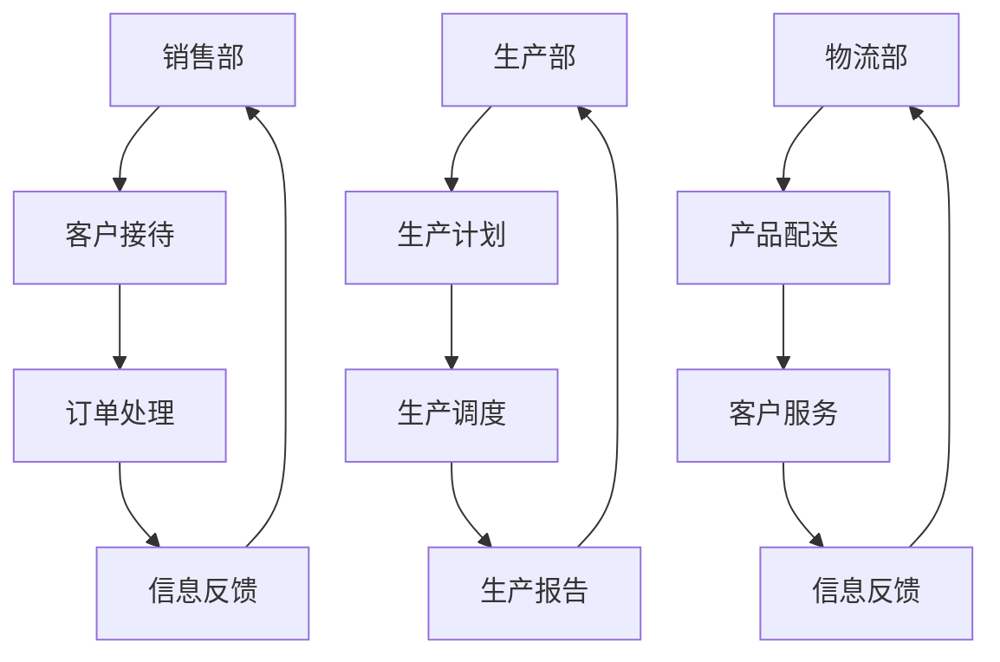

                 

# 数学与变革管理：组织变革的数学描述

## 关键词：
- 组织变革
- 数学模型
- 数据分析
- 线性规划
- 马尔可夫模型
- 系统动力学模型

## 摘要：
 
本文深入探讨了数学在组织变革中的应用，构建了数学模型对组织变革过程进行描述和分析。文章首先介绍了组织变革的理论概述，然后详细讲解了数学在组织变革中的应用、数学模型描述方法、核心算法原理及实现、实际应用案例分析等内容。通过具体的项目实战，展示了数学模型在优化组织变革策略和评估变革效果中的重要作用。

## 《数学与变革管理：组织变革的数学描述》目录大纲

### 第1章 引言
#### 1.1 研究背景
#### 1.2 研究目的与意义
#### 1.3 研究方法与结构

### 第2章 组织变革理论概述
#### 2.1 组织变革的概念与类型
#### 2.2 组织变革的主要驱动因素
#### 2.3 组织变革的理论框架

### 第3章 数学与组织变革
#### 3.1 数学在组织变革中的应用
#### 3.2 组织变革中的数学模型
#### 3.3 数学工具在组织变革中的应用分析

### 第4章 组织变革的数学描述方法
#### 4.1 流程图在组织变革中的应用
#### 4.2 量化分析在组织变革中的应用
#### 4.3 概率论与数理统计在组织变革中的应用

### 第5章 组织变革中的数学模型与算法
#### 5.1 常见的组织变革模型
#### 5.2 算法在组织变革中的应用
#### 5.3 数学模型在组织变革中的实现

### 第6章 数学模型在组织变革实践中的应用
#### 6.1 组织变革策略的数学模型设计
#### 6.2 组织变革过程的数学模型模拟
#### 6.3 数学模型在组织变革评估中的应用

### 第7章 案例分析
#### 7.1 案例研究概述
#### 7.2 案例的数学模型构建
#### 7.3 案例的数学模型分析
#### 7.4 案例的启示与思考

### 第8章 结论与展望
#### 8.1 研究结论
#### 8.2 研究不足与展望

### 附录
#### 附录A 数学模型与算法参考文献
#### 附录B 案例研究数据源

---

### 第1章 引言

#### 1.1 研究背景

在当今快速变化的市场环境中，企业面临着前所未有的挑战和机遇。组织变革已成为企业适应外部环境、提升竞争力、实现持续发展的关键因素。然而，组织变革的复杂性使其成为一个充满不确定性的过程。传统的组织变革理论往往缺乏定量分析的支持，难以提供具体的操作指导。随着数学与计算机技术的飞速发展，将数学方法应用于组织变革研究，为变革提供定量分析工具，成为一种新的研究方向。

组织变革涉及多个方面，包括组织结构、流程、文化、制度等。这些因素相互影响、相互作用，使得组织变革过程变得异常复杂。传统的定性研究方法难以深入揭示组织变革的本质规律，而数学方法则提供了强大的定量分析工具，可以帮助我们更好地理解和把握组织变革的内在机制。

#### 1.2 研究目的与意义

本研究旨在探讨数学在组织变革中的应用，构建数学模型对组织变革过程进行描述和分析，以提高组织变革的效率和效果。具体研究目的包括：

1. **定量描述组织变革过程**：通过数学模型，将组织变革中的复杂现象转化为可量化的形式，便于分析和理解。
2. **优化组织变革策略**：利用数学模型，对组织变革策略进行优化分析，为管理者提供科学的决策支持。
3. **预测组织变革效果**：通过数学模型，预测组织变革的效果和潜在风险，为管理者提供前瞻性的参考。

研究意义主要包括：

1. **理论意义**：丰富和发展组织变革理论，为组织变革提供新的理论框架和工具。
2. **实践意义**：为企业提供可操作的变革策略和方法，提高组织变革的效率和效果。
3. **跨学科融合**：促进数学、计算机技术与企业管理等领域的融合，推动管理学的发展。

#### 1.3 研究方法与结构

本研究采用文献分析、案例研究和实证分析相结合的方法。首先，对组织变革理论和数学方法进行综述，构建组织变革的数学模型；然后，通过案例研究验证模型的有效性；最后，对研究结果进行总结和讨论。

本书共分为8章，包括研究背景、组织变革理论概述、数学与组织变革、组织变革的数学描述方法、组织变革中的数学模型与算法、数学模型在组织变革实践中的应用、案例分析以及结论与展望。具体内容如下：

1. **第1章 引言**：介绍研究背景、目的与意义，以及研究方法与结构。
2. **第2章 组织变革理论概述**：概述组织变革的概念、类型、驱动因素和理论框架。
3. **第3章 数学与组织变革**：讨论数学在组织变革中的应用、数学模型和组织变革中的数学工具。
4. **第4章 组织变革的数学描述方法**：介绍流程图、量化分析和概率论与数理统计在组织变革中的应用。
5. **第5章 组织变革中的数学模型与算法**：探讨常见的组织变革模型、算法在组织变革中的应用以及数学模型在组织变革中的实现。
6. **第6章 数学模型在组织变革实践中的应用**：分析数学模型在组织变革策略设计、过程模拟和评估中的应用。
7. **第7章 案例分析**：通过案例研究，验证数学模型在组织变革中的应用效果。
8. **第8章 结论与展望**：总结研究结论，提出研究不足与展望。

通过本书的深入研究，我们希望能够为组织变革提供新的理论框架和工具，推动数学方法在企业管理领域的应用，为企业提供科学的决策支持。

---

### 第2章 组织变革理论概述

#### 2.1 组织变革的概念与类型

组织变革是指企业为实现其战略目标，对组织结构、流程、文化等方面进行调整和优化的过程。组织变革的目的是提高组织的适应性、灵活性和效率，以应对外部环境的变化和内部需求的变化。根据变革的目标和性质，组织变革可以分为以下几种类型：

1. **结构变革**：包括部门重组、岗位调整、流程优化等。结构变革通常涉及组织的物理结构变化，如增加或减少部门、调整职责等。这种变革旨在提高组织效率，优化资源配置，提高业务流程的流畅性。

2. **文化变革**：包括价值观、信仰、行为准则等方面的变革。文化变革通常涉及组织成员的态度和行为变化，旨在塑造一种新的组织文化，提高员工的归属感和凝聚力。文化变革是组织变革中最为复杂和挑战性的一部分，需要长期的努力和持续的管理。

3. **制度变革**：包括规章制度、政策、管理体系等方面的变革。制度变革通常涉及组织内部的管理制度和流程的优化，旨在提高组织的规范化水平和执行力。制度变革可以帮助企业建立更加科学、合理的管理体系，提高组织的运行效率。

4. **技术变革**：包括引入新技术、改进生产工艺等。技术变革是组织变革的一个重要方面，可以帮助企业提高竞争力，实现技术领先。技术变革通常涉及对现有技术的升级和改造，以及对新技术的引入和应用。

#### 2.2 组织变革的主要驱动因素

组织变革的驱动因素多种多样，以下是其中一些主要的驱动因素：

1. **外部环境变化**：企业所处的外部环境不断变化，如市场竞争加剧、技术进步、政策法规变化等。外部环境的变化迫使企业进行组织变革，以适应新的市场环境和竞争态势。

2. **内部需求变化**：企业内部的业务需求、战略目标、组织结构等也需要不断调整和优化。内部需求的变化是组织变革的重要驱动因素，企业需要通过组织变革来满足内部需求，提高组织的运营效率。

3. **领导者的决策**：领导者的个人偏好、战略眼光和管理风格等也会影响组织变革的决策。一些领导者可能更加倾向于通过组织变革来推动企业的发展，而另一些领导者可能更注重稳定和持续性。

4. **员工需求变化**：员工的职业发展需求、工作满意度、薪酬福利等也会影响组织变革。企业需要关注员工的需求变化，通过组织变革来提升员工的满意度和归属感，从而提高组织的整体绩效。

5. **技术进步**：技术的不断进步为企业提供了新的发展机遇和挑战。企业需要通过组织变革来适应新技术，提高技术创新能力和市场竞争力。

#### 2.3 组织变革的理论框架

组织变革理论主要包括以下几种：

1. **系统理论**：系统理论将组织视为一个整体，强调组织内部各个部分之间的相互关系和相互作用。系统理论认为，组织变革需要综合考虑组织的整体结构和功能，以及各个部分之间的相互关系，以达到整体优化。

2. **过程理论**：过程理论关注组织变革的过程和阶段性特点，强调变革的动态性。过程理论认为，组织变革是一个逐步推进的过程，需要经历多个阶段，包括准备阶段、实施阶段和评估阶段等。

3. **行为理论**：行为理论关注组织成员的行为和心理变化，强调变革中的个体因素。行为理论认为，组织变革不仅需要改变组织的结构和文化，还需要改变组织成员的态度和行为。

4. **变革管理理论**：变革管理理论将组织变革视为一种管理活动，强调管理者的角色和责任。变革管理理论认为，管理者需要通过有效的管理策略和方法，推动组织变革的顺利进行。

5. **权变理论**：权变理论认为，组织变革的效果取决于变革环境的变化和组织的内部条件。权变理论强调，组织变革需要根据具体的环境和条件进行调整，以达到最佳效果。

通过以上对组织变革理论概述的讨论，我们可以看到，组织变革是一个复杂而多维的过程，涉及到组织结构、流程、文化和制度等多个方面。数学方法在组织变革中的应用，可以为组织变革提供新的理论框架和工具，帮助企业更好地理解和应对变革过程中的各种挑战。

---

### 第3章 数学与组织变革

#### 3.1 数学在组织变革中的应用

数学作为一种科学的工具，在组织变革中具有广泛的应用。数学方法可以帮助企业更准确地描述和预测变革过程，优化变革策略，提高变革的效率和效果。以下是数学在组织变革中的一些具体应用：

1. **数据分析**：通过数据分析，企业可以更深入地了解组织的运行状况，识别变革的需求和重点。数据分析方法包括回归分析、聚类分析、时间序列分析等，可以帮助企业发现数据中的规律和趋势，为变革提供科学依据。

2. **优化算法**：优化算法可以帮助企业找到最优的变革方案。例如，线性规划、整数规划、遗传算法等优化算法，可以用于优化部门职责分配、资源分配、成本控制等，帮助企业实现资源配置的最优化。

3. **模拟仿真**：模拟仿真可以帮助企业预测不同变革方案的效果和风险。通过模拟仿真，企业可以模拟不同变革方案的实施过程，评估其对组织绩效的影响，从而选择最佳方案。

4. **决策支持**：数学模型可以为管理者提供数据驱动的决策支持。通过数学模型，管理者可以分析变革方案的成本、效益和风险，做出更加科学和合理的决策。

#### 3.2 组织变革中的数学模型

组织变革中的数学模型是用于描述和分析组织变革过程的数学工具。以下是一些常见的数学模型及其在组织变革中的应用：

1. **线性规划模型**：线性规划模型用于在给定约束条件下，寻找最优解。在组织变革中，线性规划模型可以用于优化部门职责分配、资源分配和成本控制等。例如，一个企业可以通过线性规划模型，在预算限制下，最大化利润或最小化成本。

2. **马尔可夫模型**：马尔可夫模型用于描述系统状态的转移概率。在组织变革中，马尔可夫模型可以用于预测组织变革的长期效果和风险。例如，企业可以通过马尔可夫模型，预测员工满意度、生产效率等关键指标的变化趋势。

3. **系统动力学模型**：系统动力学模型用于描述复杂系统的动态行为。在组织变革中，系统动力学模型可以用于模拟变革过程，分析不同变革方案的效果和风险。例如，企业可以通过系统动力学模型，模拟组织变革对员工满意度、生产效率、市场份额等的影响。

4. **网络分析模型**：网络分析模型用于描述组织内部各个部分之间的相互关系。在组织变革中，网络分析模型可以用于优化组织结构、流程和文化。例如，企业可以通过网络分析模型，分析部门之间的关系，优化部门职责和流程。

5. **博弈论模型**：博弈论模型用于描述多个决策者之间的互动和竞争。在组织变革中，博弈论模型可以用于分析领导者、员工、客户等不同利益相关者之间的互动，预测变革方案的效果和风险。

#### 3.3 数学工具在组织变革中的应用分析

数学工具在组织变革中的应用分析主要包括以下几个方面：

1. **数据可视化**：通过数据可视化，企业可以更直观地了解组织的运行状况和变革效果。数据可视化工具可以帮助企业发现数据中的规律和趋势，为变革提供科学依据。例如，企业可以使用图表、图形等可视化工具，展示部门职责分配、资源分配、员工满意度等关键指标的变化情况。

2. **模拟仿真**：通过模拟仿真，企业可以预测不同变革方案的效果和风险。模拟仿真工具可以帮助企业模拟变革过程，评估不同变革方案的成本、效益和风险，从而选择最佳方案。例如，企业可以使用模拟仿真工具，模拟不同资源分配方案对生产效率的影响，从而选择最优的资源分配方案。

3. **优化决策**：通过优化算法，企业可以找到最优的变革方案。优化算法可以帮助企业优化部门职责分配、资源分配、成本控制等，提高组织的运行效率。例如，企业可以使用线性规划、整数规划等优化算法，在预算限制下，最大化利润或最小化成本。

4. **预测分析**：通过数学模型，企业可以预测变革方案的效果和风险。预测分析工具可以帮助企业预测员工满意度、生产效率、市场份额等关键指标的变化趋势，从而为变革提供科学依据。例如，企业可以使用马尔可夫模型，预测员工满意度在变革后的长期变化趋势。

通过数学工具在组织变革中的应用分析，企业可以更准确地描述和预测变革过程，优化变革策略，提高变革的效率和效果。数学工具的应用不仅可以帮助企业解决实际问题，还可以为企业管理者提供科学的决策支持，提高企业的竞争力。

---

### 第4章 组织变革的数学描述方法

#### 4.1 流程图在组织变革中的应用

流程图是一种常用的数学描述方法，用于描述组织内部的工作流程和业务关系。在组织变革中，流程图可以帮助管理者更好地理解现有组织结构，识别问题和瓶颈，设计新的工作流程和业务关系。

**应用步骤：**

1. **现状分析**：通过对现有组织结构的分析，绘制当前的工作流程图，明确各部门和岗位的职责和关系。

2. **问题识别**：分析流程图，识别存在的问题和瓶颈，如流程冗余、职责不清、信息传递不畅等。

3. **方案设计**：根据问题识别的结果，设计新的工作流程图，优化组织结构和业务流程，提高效率。

4. **评估与调整**：根据新的流程图实施变革，并对变革效果进行评估，根据评估结果进行必要的调整。

**举例说明：**

假设一个公司有销售部、生产部和物流部三个部门，每个部门都有各自的职责和流程。通过流程图，可以清晰地展示各部门的工作流程和相互关系，如销售部负责客户接待和订单处理，生产部负责生产计划和生产调度，物流部负责产品配送和客户服务。

**Mermaid流程图示例：**



#### 4.2 量化分析在组织变革中的应用

量化分析是一种通过数学模型对组织运行数据进行定量分析的方法。在组织变革中，量化分析可以帮助管理者评估变革的效果，识别问题并提出解决方案。

**应用步骤：**

1. **数据收集**：收集与组织变革相关的数据，如员工满意度、生产效率、成本等。

2. **模型构建**：根据数据特点和变革目标，构建合适的量化分析模型，如回归分析、聚类分析、时间序列分析等。

3. **模型应用**：将数据输入模型，进行定量分析，识别问题和瓶颈。

4. **方案设计**：根据分析结果，设计变革方案，优化组织结构和流程。

5. **评估与调整**：实施变革方案，并对变革效果进行评估，根据评估结果进行必要的调整。

**举例说明：**

假设一个公司在组织变革前，收集了员工满意度、生产效率和成本等数据。通过回归分析模型，可以分析员工满意度与生产效率、成本之间的关系，识别影响生产效率和成本的关键因素，并提出优化方案。

**伪代码示例：**

```python
import pandas as pd
from sklearn.linear_model import LinearRegression

# 加载数据
data = pd.read_csv('data.csv')

# 构建回归分析模型
model = LinearRegression()
model.fit(data[['Employee_Satisfaction']], data['Production_Efficiency'])

# 预测生产效率
predictions = model.predict(data[['Employee_Satisfaction']])

# 评估模型效果
print(model.score(data[['Employee_Satisfaction']], data['Production_Efficiency']))
```

#### 4.3 概率论与数理统计在组织变革中的应用

概率论与数理统计是一种用于处理随机事件和不确定性的数学方法。在组织变革中，概率论与数理统计可以帮助管理者预测变革方案的效果和风险，评估组织变革的可行性。

**应用步骤：**

1. **风险识别**：通过调查、访谈等方法，识别组织变革过程中可能遇到的风险。

2. **概率估计**：根据风险识别的结果，估计每个风险发生的概率。

3. **风险评估**：利用概率论与数理统计方法，对风险进行量化评估，确定风险等级。

4. **方案优化**：根据风险评估结果，优化变革方案，降低风险。

5. **监控与调整**：实施变革方案，对风险进行实时监控，根据监控结果进行调整。

**举例说明：**

假设一个公司在组织变革过程中，识别了技术风险、市场风险和人员风险等。通过概率论与数理统计方法，可以估计每个风险发生的概率，并进行风险评估，如使用贝叶斯网络进行风险分析。

**伪代码示例：**

```python
import numpy as np
from sklearn.naive_bayes import GaussianNB

# 加载数据
data = pd.read_csv('risk_data.csv')

# 构建贝叶斯网络模型
model = GaussianNB()
model.fit(data[['Risk_Probability']], data[['Risk_Assessment']])

# 评估风险
risk_assessment = model.predict(data[['Risk_Probability']])

# 输出风险评估结果
print(risk_assessment)
```

通过以上对流程图、量化分析和概率论与数理统计在组织变革中的应用分析，我们可以看到，数学方法在组织变革中具有重要的应用价值。这些方法不仅可以帮助管理者更好地理解和分析组织变革过程，还可以为变革提供科学的决策支持，提高变革的效率和效果。

---

### 第5章 组织变革中的数学模型与算法

#### 5.1 常见的组织变革模型

组织变革中的数学模型是用于描述和分析组织变革过程的重要工具。以下是一些常见的组织变革模型及其在变革中的应用：

1. **波特五力模型**：波特五力模型是用于分析市场竞争态势的工具，包括供应商的议价能力、客户的议价能力、新进入者的威胁、替代品的威胁和现有竞争对手的竞争。在组织变革中，波特五力模型可以帮助企业分析外部环境的变化，制定相应的战略调整。

   **应用步骤**：
   - 分析供应商的议价能力，评估供应商对企业的影响。
   - 分析客户的议价能力，了解客户需求的变化。
   - 分析新进入者的威胁，评估市场竞争的加剧。
   - 分析替代品的威胁，了解替代品对企业的影响。
   - 分析现有竞争对手的竞争，制定应对策略。

2. **SWOT分析模型**：SWOT分析模型用于分析企业的优势、劣势、机会和威胁。在组织变革中，SWOT分析可以帮助企业评估自身的内部和外部环境，制定变革策略。

   **应用步骤**：
   - 分析企业的优势，了解企业的核心竞争力。
   - 分析企业的劣势，识别企业需要改进的方面。
   - 分析机会，寻找变革的机遇。
   - 分析威胁，预测外部环境对企业的影响。
   - 根据SWOT分析结果，制定变革策略。

3. **组织变革周期模型**：组织变革周期模型描述了组织变革的阶段性特点，包括准备阶段、执行阶段和评估阶段。在组织变革中，组织变革周期模型可以帮助企业系统地推进变革，确保变革的顺利进行。

   **应用步骤**：
   - 准备阶段：制定变革计划，建立变革团队，进行变革动员。
   - 执行阶段：实施变革方案，解决变革过程中的问题和挑战。
   - 评估阶段：评估变革效果，总结变革经验，持续改进。

4. **变革管理模型**：变革管理模型强调管理者的角色和责任，包括领导者的变革领导力、员工的参与度和变革的文化氛围。在组织变革中，变革管理模型可以帮助企业构建良好的变革环境，提高变革的成功率。

   **应用步骤**：
   - 建立变革领导力，确保领导者的支持与推动。
   - 提高员工的参与度，增强员工对变革的认同感。
   - 营造变革的文化氛围，形成全员参与、共同推进的变革氛围。

5. **创新扩散模型**：创新扩散模型描述了创新在组织中的传播过程，包括创新引入、接受、推广和成熟阶段。在组织变革中，创新扩散模型可以帮助企业推广变革理念，促进变革的普及和应用。

   **应用步骤**：
   - 引入创新，制定变革计划和策略。
   - 接受创新，进行变革试点，收集反馈。
   - 推广创新，根据试点结果，推广到整个组织。
   - 成熟创新，评估变革效果，持续改进。

#### 5.2 算法在组织变革中的应用

算法在组织变革中的应用非常广泛，可以帮助企业优化变革策略、提高变革效率。以下是一些常见的算法及其在变革中的应用：

1. **数据分析算法**：数据分析算法可以帮助企业分析变革过程中的数据，识别问题和趋势。常见的算法包括回归分析、聚类分析、时间序列分析等。

   **应用步骤**：
   - 收集变革过程中的数据，如员工满意度、生产效率等。
   - 使用回归分析，分析变量之间的关系，识别关键因素。
   - 使用聚类分析，将相似的数据进行分类，识别不同的趋势。
   - 使用时间序列分析，预测未来数据的变化趋势。

2. **优化算法**：优化算法可以帮助企业在给定约束条件下，寻找最优解。常见的算法包括线性规划、整数规划、遗传算法等。

   **应用步骤**：
   - 定义目标函数，如最大化利润、最小化成本等。
   - 确定约束条件，如资源限制、时间限制等。
   - 使用优化算法，求解最优解。

3. **模拟算法**：模拟算法可以帮助企业预测变革方案的效果和风险。常见的算法包括蒙特卡洛模拟、过程仿真等。

   **应用步骤**：
   - 设计模拟场景，如不同的变革方案、不同的市场环境等。
   - 使用模拟算法，模拟变革过程，评估不同方案的效果。
   - 分析模拟结果，评估风险和不确定性。

4. **机器学习算法**：机器学习算法可以帮助企业分析数据，发现隐藏的模式和规律。常见的算法包括决策树、随机森林、神经网络等。

   **应用步骤**：
   - 收集大量的历史数据，如员工行为数据、市场数据等。
   - 使用机器学习算法，分析数据，建立预测模型。
   - 使用预测模型，预测未来数据的变化趋势。

#### 5.3 数学模型在组织变革中的实现

数学模型在组织变革中的实现包括模型构建、模型验证和模型应用等步骤。以下是一个具体的实现过程：

1. **模型构建**：
   - 明确组织变革的目标和需求，确定需要解决的数学问题。
   - 选择合适的数学模型，如线性规划、马尔可夫模型、系统动力学模型等。
   - 根据实际情况，建立数学模型，包括目标函数、约束条件和变量等。

2. **模型验证**：
   - 收集实际数据，用于验证数学模型的准确性。
   - 使用验证数据，对数学模型进行测试和调整。
   - 分析验证结果，确保数学模型的有效性和可靠性。

3. **模型应用**：
   - 将数学模型应用于实际的变革过程中，为管理者提供决策支持。
   - 根据数学模型的分析结果，制定变革策略和方案。
   - 实施变革方案，监控变革效果，并根据实际情况进行调整。

通过数学模型和算法在组织变革中的应用，企业可以更准确地描述和预测变革过程，优化变革策略，提高变革的效率和效果。

---

### 第6章 数学模型在组织变革实践中的应用

#### 6.1 组织变革策略的数学模型设计

在组织变革中，设计有效的策略是成功实施变革的关键。数学模型可以用于分析和优化变革策略，提高变革的效率和效果。以下是一个组织变革策略的数学模型设计过程：

**1. 确定目标**

明确组织变革的目标，如提高生产效率、降低成本、提升员工满意度等。这些目标将成为数学模型的目标函数。

**2. 确定变量**

确定影响变革策略的变量，如部门职责、资源分配、员工培训等。这些变量将成为数学模型中的决策变量。

**3. 建立约束条件**

根据实际情况，建立约束条件，如预算限制、时间限制、人力资源限制等。约束条件将确保变革策略的可行性和实际操作性。

**4. 选择数学模型**

根据目标和约束条件，选择合适的数学模型，如线性规划、整数规划、多目标规划等。

**5. 建立数学模型**

根据确定的目标、变量和约束条件，建立数学模型。以下是一个线性规划的例子：

$$
\min Z = c^T x
$$

$$
\text{s.t.} \quad Ax \leq b
$$

$$
x \geq 0
$$

其中，\(c\) 是目标函数系数向量，\(x\) 是决策变量向量，\(A\) 是约束条件系数矩阵，\(b\) 是约束条件右侧值向量。

**6. 解决数学模型**

使用优化算法（如单纯形法、内点法等）解决数学模型，得到最优解。

**7. 分析结果**

分析最优解，评估变革策略的效率和效果。根据分析结果，调整策略，优化资源配置。

#### 6.2 组织变革过程的数学模型模拟

数学模型可以用于模拟组织变革过程，预测不同变革方案的效果和风险。以下是一个组织变革过程的数学模型模拟过程：

**1. 设计模拟场景**

根据实际组织变革情况，设计不同的模拟场景，如不同的资源分配方案、不同的员工培训计划等。

**2. 建立数学模型**

根据模拟场景，建立描述变革过程的数学模型。以下是一个系统动力学模型的例子：

$$
\frac{dS}{dt} = f(S, E)
$$

$$
\frac{dE}{dt} = g(S, E)
$$

其中，\(S\) 是员工满意度，\(E\) 是生产效率，\(f\) 和 \(g\) 是描述员工满意度和生产效率变化的函数。

**3. 参数设置**

根据历史数据和专家知识，设置模型参数，如员工满意度对生产效率的影响系数等。

**4. 模拟运行**

使用数学模型模拟不同变革方案的实施过程，得到不同时间点的员工满意度和生产效率。

**5. 分析结果**

分析模拟结果，评估不同变革方案的效果和风险。根据分析结果，选择最优的变革方案。

#### 6.3 数学模型在组织变革评估中的应用

数学模型可以用于评估组织变革的效果，提供定量依据。以下是一个组织变革评估的数学模型应用过程：

**1. 确定评估指标**

根据组织变革的目标，确定评估指标，如生产效率、员工满意度、成本降低等。

**2. 建立评估模型**

建立描述评估指标的数学模型，如回归分析、时间序列分析等。

**3. 数据收集**

收集变革前后的数据，用于模型训练和评估。

**4. 训练模型**

使用收集的数据，训练评估模型，得到评估指标的预测结果。

**5. 评估结果**

分析评估模型的预测结果，评估组织变革的效果。根据评估结果，总结变革经验，提出改进建议。

通过以上数学模型在组织变革实践中的应用，企业可以更科学地设计变革策略，模拟变革过程，评估变革效果，提高变革的效率和效果。

---

### 第7章 案例分析

#### 7.1 案例研究概述

本节将通过一个实际案例，展示数学模型在组织变革中的应用。该案例来自一家全球知名的大型制造企业，该公司由于市场竞争的加剧，决定进行组织变革以提高其生产效率和员工满意度。

**案例背景：**

- **企业现状**：该公司拥有

