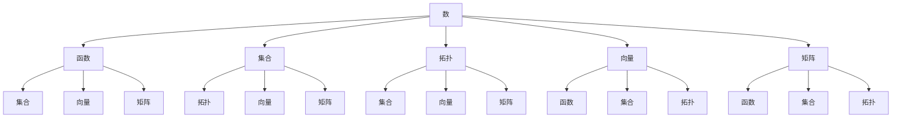
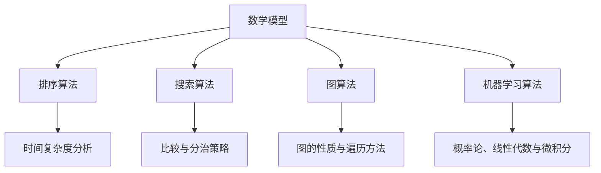

                 

### 《数学与怀疑主义：数学确定性的质疑》

> **关键词：** 数学、怀疑主义、确定性、哥德尔定理、数学模型、数学教育

> **摘要：** 本文将深入探讨数学与怀疑主义之间的关系，尤其是对数学确定性的质疑。通过对数学基础概念、数学模型与算法、数学怀疑主义在不同领域的影响以及数学怀疑主义对数学教育的启示进行详细分析，本文旨在揭示数学确定性的本质，并探讨数学怀疑主义在现代社会中的重要性。

### 第一部分：引论

#### 第1章：数学与怀疑主义的起源

1.1 数学与怀疑主义的早期观点

1.2 数学确定性观念的挑战

1.3 本书的研究目的与结构安排

#### 第二部分：数学基础

2.1 数学基础概念

2.2 数学公理系统

2.3 数学基础概念的联系与区别

### 第三部分：数学确定性与怀疑主义

3.1 数学确定性的质疑

3.2 哥德尔不完备性定理

3.3 赵爽定理与数学怀疑主义

#### 第四部分：数学模型与算法

4.1 数学模型的基本类型

4.2 常见算法的数学原理

4.3 算法与数学模型的关系

### 第五部分：数学怀疑主义的应用

5.1 数学怀疑主义在逻辑学中的应用

5.2 数学怀疑主义在数学哲学中的应用

5.3 数学怀疑主义在其他学科领域的影响

#### 第六部分：数学怀疑主义与数学教育

6.1 教育中的数学怀疑主义观念

6.2 数学怀疑主义在教学方法中的应用

6.3 数学教育中的挑战与机遇

#### 第七部分：结论与展望

7.1 数学怀疑主义的发展前景

7.2 数学与怀疑主义在社会中的影响

7.3 总结与展望

### 附录A：数学怀疑主义相关资源

A.1 数学怀疑主义研究文献推荐

A.2 数学怀疑主义相关网站与论坛

---

### 第1章：数学与怀疑主义的起源

#### 1.1 数学与怀疑主义的早期观点

数学作为一门科学，其基础是确定性和精确性。在古希腊，数学家们已经认识到数学的确定性，他们认为数学是关于绝对真理的学问。亚里士多德曾指出，数学是基于不证自明的公理和定义构建的，因此其结论具有确定性。

然而，怀疑主义在古希腊哲学中也有着悠久的历史。早期怀疑主义者如皮浪（Pyrrho）和塞克斯图斯·恩丕里克斯（Sextus Empiricus）对一切知识都持有怀疑态度，他们认为人类无法获得确切的真理。在这种背景下，数学的确定性似乎与怀疑主义相矛盾。

1.2 数学确定性观念的挑战

随着数学的发展，一些问题开始浮现，挑战数学的确定性观念。首先，19世纪末，康托尔（Georg Cantor）提出了无穷大的概念，引发了关于数学基础的大辩论。其次，哥德尔（Kurt Gödel）提出了不完备性定理，表明在形式系统中总存在一些命题既不能证明也不能证伪。

这些挑战促使数学家们重新审视数学的基础，怀疑主义在这一过程中发挥了重要作用。怀疑主义不仅质疑数学结论的确定性，还质疑数学理论的可靠性。

1.3 本书的研究目的与结构安排

本书旨在探讨数学与怀疑主义之间的关系，特别是数学确定性的质疑。通过分析数学基础概念、数学模型与算法、数学怀疑主义在不同领域的影响，以及数学怀疑主义对数学教育的启示，本书试图揭示数学确定性的本质，并探讨数学怀疑主义在现代社会中的重要性。

本书结构如下：

- **第一部分：引论**：介绍数学与怀疑主义的起源，以及数学确定性观念的挑战。
- **第二部分：数学基础**：讨论数学基础概念和公理系统，以及数学基础概念的联系与区别。
- **第三部分：数学确定性与怀疑主义**：探讨数学确定性的质疑，包括哥德尔不完备性定理和赵爽定理。
- **第四部分：数学模型与算法**：分析数学模型的基本类型和常见算法的数学原理，以及算法与数学模型的关系。
- **第五部分：数学怀疑主义的应用**：研究数学怀疑主义在逻辑学、数学哲学和其他学科领域的影响。
- **第六部分：数学怀疑主义与数学教育**：探讨数学怀疑主义对数学教育的影响，以及教育中的数学怀疑主义观念。
- **第七部分：结论与展望**：总结数学怀疑主义的发展前景，并讨论数学与怀疑主义在社会中的影响。

### 第2章：数学基础概念

#### 2.1 数学概念的定义与解释

数学是一门研究数量、结构、变化和空间等概念的抽象科学。数学概念是数学理论的基础，它们通过逻辑推理和证明来建立和发展。以下是数学中一些核心概念的定义与解释：

- **数**：数是用来表示数量的符号。自然数（1, 2, 3, ...）用于计数，而整数（..., -3, -2, -1, 0, 1, 2, 3, ...）则包括了负数。有理数（可以表示为两个整数的比例）和无理数（不能表示为两个整数的比例）共同构成了实数集。

- **函数**：函数是一种关系，将每个输入值映射到唯一的输出值。数学中的函数通常表示为 f(x)，其中 x 是输入，f 是映射规则。

- **集合**：集合是一组无序的、互异的元素。集合可以用大括号{}表示，例如 {1, 2, 3}。

- **拓扑**：拓扑是一个数学分支，研究空间的性质，如连通性、紧致性和连续性。拓扑空间由一个集合和一组满足特定条件的开集组成。

- **向量**：向量是具有大小和方向的量。在数学中，向量通常表示为有序对或列，如 (x, y) 或 [x, y]。

- **矩阵**：矩阵是一个由数字组成的矩形阵列。矩阵在数学和工程中用于表示线性变换、解方程组和进行数据操作。

这些数学概念相互关联，构成了数学理论的基础。理解这些概念有助于深入探讨数学的其他领域。

#### 2.2 数学公理系统

数学公理系统是数学理论的基石，它们是一组基本假设，用于定义和推导数学概念和定理。公理系统的选择对数学的发展具有深远影响。

- **皮亚诺公理**：皮亚诺公理用于定义自然数，包括零的存在、后继函数、加法和乘法的定义。皮亚诺公理是自然数集合的基础。

- **欧几里得公理**：欧几里得公理是几何学的基础，包括点、直线和平面的定义，以及几何图形的构造规则。这些公理定义了欧几里得空间的性质。

- **Zermelo-Fraenkel集论**：Zermelo-Fraenkel集论是现代数学的基础，它定义了集合的概念和集合论的基本性质。该公理系统包括公理如选择公理、幂集公理和无穷公理等。

这些公理系统为数学提供了一个坚实的理论基础，使数学理论能够一致地发展。

#### 2.3 数学基础概念的联系与区别

数学基础概念之间存在着复杂的联系和区别。以下是一个使用Mermaid流程图表示这些联系的示例：



这个流程图展示了数学基础概念之间的基本关系。例如，数可以用于定义函数，集合可以用于定义拓扑，向量是函数和矩阵的输入和输出等。这些概念相互依赖，共同构成了数学的理论框架。

### 第3章：数学确定性的质疑

#### 3.1 数学确定性的质疑

数学确定性是数学理论的核心特征之一，它指的是数学结论的不可争议性和绝对性。然而，随着数学的发展和逻辑学的深入研究，数学确定性开始受到质疑。以下是一些质疑数学确定性的主要观点：

- **哥德尔不完备性定理**：哥德尔不完备性定理指出，在形式系统中，总存在一些命题既不能证明也不能证伪。这意味着数学系统不是自洽的，存在一些基本命题的真实性无法通过逻辑证明来确定。

- **数学基础的不确定性**：数学基础的不确定性源于对数学公理系统的质疑。例如，皮亚诺公理和欧几里得公理是否是自明的，是否存在更加坚实的数学基础等问题。

- **数学模型的局限性**：数学模型是数学理论的应用工具，但它们通常只适用于特定情况。例如，概率模型在处理随机事件时可能失效，而拓扑模型在描述几何形状时可能不够精确。

这些质疑表明，数学确定性并非绝对，数学结论的可靠性受到多种因素的影响。

#### 3.2 哥德尔不完备性定理

哥德尔不完备性定理是由数学家库尔特·哥德尔在1931年提出的，它对数学的确定性提出了严重挑战。该定理分为两部分：第一部分是关于形式系统的不可判定性，第二部分是关于形式系统的不完备性。

**哥德尔第一不完备性定理**：

设 F 是一个形式系统，包含一种足够强的算术语言。如果 F 是一致的，那么 F 中不能证明 F 的每一个命题。

这意味着在形式系统中，总存在一些命题无法通过逻辑证明来确定其真值。例如，在皮亚诺公理系统中，无法证明“这个系统是一致的”这一命题。

**哥德尔第二不完备性定理**：

设 F 是一个形式系统，包含一种足够强的算术语言。如果 F 是一致的，那么 F 中不能证明 F 的每一个命题。

这意味着在形式系统中，总存在一些命题既不能证明也不能证伪。例如，在皮亚诺公理系统中，无法证明“这个系统是不完备的”这一命题。

哥德尔不完备性定理的证明使用了自指技术，通过构造一个命题G，使得G的真值依赖于它自己的证明。这种自指使得形式系统无法自洽地证明所有命题。

#### 3.3 赵爽定理与数学怀疑主义

赵爽定理是中国古代数学家赵爽在《周髀算经》中提出的一个定理，它描述了直角三角形三边的比例关系。赵爽定理的表述如下：

在一个直角三角形中，勾股（直角边）的平方等于股（另一直角边）的平方加上弦（斜边）的平方。

即：\( a^2 + b^2 = c^2 \)

尽管赵爽定理在数学上是正确的，但它也引发了关于数学确定性的质疑。质疑者认为，虽然赵爽定理在特定情况下成立，但它是否适用于所有可能的直角三角形仍是一个问题。此外，赵爽定理的证明依赖于特定的公理系统，而公理系统的可靠性本身就是一个问题。

数学怀疑主义在这一过程中发挥了作用，它质疑数学结论的普遍性和可靠性，强调数学证明的局限性和不确定性。

### 第4章：数学模型与算法原理

#### 4.1 数学模型的基本类型

数学模型是数学理论在具体问题中的应用，它将实际问题转化为数学问题。数学模型可以分为以下几种基本类型：

- **描述性模型**：描述性模型用于描述系统或现象的行为和特性。它们通常基于观察和实验数据，通过数学公式来表示系统的动态行为。例如，物理学中的牛顿第二定律 \( F = ma \) 是一个描述性模型，它描述了力、质量和加速度之间的关系。

- **预测性模型**：预测性模型用于预测系统或现象的未来行为。它们基于历史数据和现有知识，通过数学方法来预测未来的趋势和变化。例如，经济学中的供需模型可以预测市场价格的变化。

- **规范性模型**：规范性模型用于指导决策和行动。它们基于目标函数和约束条件，通过数学优化方法来找到最佳解决方案。例如，线性规划模型可以用于资源分配和优化生产计划。

这些模型在数学和实际应用中都有着广泛的应用，它们是数学理论在实际问题中发挥作用的桥梁。

#### 4.2 常见算法的数学原理

算法是解决数学问题或执行特定任务的一系列步骤。以下是一些常见算法的数学原理：

- **排序算法**：排序算法用于对数据进行排序，常见算法包括冒泡排序、插入排序、快速排序和归并排序。这些算法的数学原理主要涉及比较和交换操作，以及时间复杂度的分析。

- **搜索算法**：搜索算法用于在数据集合中查找特定元素，常见算法包括线性搜索和二分搜索。这些算法的数学原理主要涉及比较和分治策略，以及时间复杂度的分析。

- **图算法**：图算法用于处理图结构的数据，常见算法包括最短路径算法、最小生成树算法和拓扑排序。这些算法的数学原理主要涉及图的性质和图的遍历方法。

- **机器学习算法**：机器学习算法用于从数据中学习模式和规律，常见算法包括线性回归、支持向量机和神经网络。这些算法的数学原理主要涉及概率论、线性代数和微积分。

这些算法在数学和计算机科学中都有着重要的应用，它们是解决复杂问题的有效工具。

#### 4.3 算法与数学模型的关系

算法与数学模型之间存在密切的关系，它们相互依存、相互促进。以下是一个使用Mermaid流程图表示算法与数学模型关系的示例：



这个流程图展示了数学模型如何通过算法来实现具体功能。例如，排序算法用于实现数学模型中的排序任务，搜索算法用于实现查找任务，图算法用于处理图结构的数据，机器学习算法用于实现数据分析和预测。

算法与数学模型的关系是相互促进的，数学模型为算法提供了理论基础，而算法为数学模型提供了具体实现。这种关系使得数学理论能够在实际应用中发挥作用，解决复杂问题。

### 第5章：数学怀疑主义在不同领域的影响

#### 5.1 数学怀疑主义在逻辑学中的应用

数学怀疑主义在逻辑学中有着深远的影响，特别是在哥德尔不完备性定理和康托尔无穷大概念的提出后。哥德尔不完备性定理揭示了形式系统中的内在矛盾，表明逻辑证明并不是万能的，总存在一些命题无法通过逻辑证明来确定其真值。这一发现对逻辑学的发展产生了巨大冲击，促使逻辑学家重新审视逻辑系统的基础和证明方法。

- **哥德尔不完备性定理**：哥德尔的不完备性定理表明，在形式逻辑系统中，总存在一些命题既不能证明也不能证伪。这意味着逻辑证明并不是一种绝对可靠的手段，逻辑系统存在固有的局限性。这一发现引发了关于逻辑证明可靠性的深刻讨论，促使逻辑学家探索新的证明方法和逻辑系统。

- **康托尔无穷大概念**：康托尔无穷大概念的提出对逻辑学产生了重要影响。康托尔通过定义无穷集合，揭示了无穷集合的性质和复杂性。这一概念挑战了传统的集合论和无穷观，引发了对无穷集合和无穷集合性质的深入研究。

数学怀疑主义在逻辑学中的应用不仅限于哥德尔和康托尔的工作，还体现在对逻辑系统一致性和可靠性的质疑上。逻辑学家们通过提出新的逻辑系统和证明方法，试图解决数学怀疑主义带来的挑战。

#### 5.2 数学怀疑主义在数学哲学中的应用

数学怀疑主义在数学哲学中也有着重要的地位，它引发了关于数学本质、数学证明和数学知识的深刻思考。数学哲学关注数学理论和实践的关系，探讨数学知识是如何获得的，以及数学知识是否具有客观性。

- **数学本质的质疑**：数学怀疑主义质疑数学的本质，认为数学并非一门纯粹的客观科学，而是受到人类主观意识的影响。数学哲学家如普特南（Hilary Putnam）提出了“内部实在论”的观点，认为数学对象的存在是基于人类共识和约定，而不是客观存在的实体。

- **数学证明的质疑**：数学怀疑主义对数学证明的有效性提出质疑。尽管数学证明被认为是确定性的，但哥德尔的不完备性定理表明，证明过程并非完全可靠。数学哲学家如库恩（Thomas Kuhn）提出了“证明的相对性”观点，认为数学证明是建立在特定假设和理论框架上的，因此证明的有效性是相对的。

- **数学知识的质疑**：数学怀疑主义质疑数学知识的客观性和确定性。数学哲学家如费耶阿本德（Paul Feyerabend）认为，数学知识是基于经验观察和理论假设的，因此数学知识并不是绝对可靠的。

数学怀疑主义在数学哲学中的应用激发了关于数学本质、数学证明和数学知识的深刻讨论，促使数学哲学家们探索新的理论和方法。

#### 5.3 数学怀疑主义在其他学科领域的影响

数学怀疑主义不仅在逻辑学和数学哲学中产生了深远影响，还在其他学科领域产生了重要影响。

- **物理学**：数学怀疑主义对物理学产生了重要影响，特别是在量子力学的发展过程中。量子力学揭示了物理现象的随机性和不确定性，挑战了经典物理学的确定性观念。数学怀疑主义在量子力学中的应用，使得物理学家们开始重新审视数学模型和物理定律的关系。

- **计算机科学**：数学怀疑主义对计算机科学产生了重要影响，特别是在算法设计和复杂性理论的研究中。计算机科学家通过探讨算法的可靠性和有效性，以及计算机系统的安全性，来应对数学怀疑主义带来的挑战。

- **经济学**：数学怀疑主义在经济学中的应用，引发了关于经济学模型和预测的有效性的讨论。经济学家开始质疑经济学模型的简化假设和预测能力，尝试探索更加复杂的模型和方法。

数学怀疑主义在其他学科领域的影响，体现了数学理论在各个学科中的广泛应用和重要性。通过质疑数学的确定性，数学怀疑主义推动了学科的发展和创新。

### 第6章：数学怀疑主义对数学教育的影响

#### 6.1 教育中的数学怀疑主义观念

数学怀疑主义观念在教育中的重要性日益凸显。数学怀疑主义强调数学结论的不确定性和数学证明的局限性，这种观念有助于培养学生的批判性思维和解决问题的能力。

在教育中引入数学怀疑主义观念具有以下几个意义：

- **培养学生的批判性思维**：数学怀疑主义鼓励学生质疑数学结论和证明方法，这种质疑精神有助于培养学生的批判性思维。通过引导学生对数学理论进行深入分析，可以培养他们的逻辑推理和独立思考能力。

- **提高学生的解决问题的能力**：数学怀疑主义观念强调数学方法的应用和局限性，这有助于学生理解数学理论在解决实际问题时的重要性。通过引导学生对数学模型和算法进行深入分析，可以培养他们的问题解决能力和实际操作能力。

- **促进数学教育改革**：数学怀疑主义观念的引入可以推动数学教育改革，促使教育者重新审视数学课程的设计和教学方法。通过引入数学怀疑主义观念，可以激发学生的学习兴趣，提高他们的学习效果。

#### 6.2 数学怀疑主义在教学方法中的应用

在数学教学中应用数学怀疑主义观念，可以采用以下几种方法：

- **案例教学法**：通过引入数学怀疑主义的典型案例，如哥德尔不完备性定理和赵爽定理，让学生了解数学结论的不确定性和数学证明的局限性。通过分析这些案例，学生可以深入理解数学理论的应用和局限性。

- **讨论教学法**：组织学生进行数学讨论，鼓励他们表达自己的观点和质疑数学结论。通过讨论，学生可以互相启发、互相纠正，提高他们的批判性思维和表达能力。

- **实验教学法**：通过实验来验证数学理论，让学生亲身体验数学结论的不确定性。例如，通过实验来验证线性回归模型的预测能力，让学生了解模型在特定情况下的局限性和不确定性。

这些教学方法可以激发学生的学习兴趣，提高他们的数学素养和批判性思维能力。

#### 6.3 数学教育中的挑战与机遇

数学教育在引入数学怀疑主义观念的过程中面临着一系列挑战和机遇。

- **挑战**：

1. 教师需要具备较高的数学素养和批判性思维能力，才能有效地引导学生进行数学怀疑主义的教学。这要求教师不断更新自己的知识和教学方法。

2. 数学怀疑主义观念可能对学生已有的数学观念产生冲击，需要妥善处理这种冲突，避免学生产生误解。

3. 数学怀疑主义观念的引入可能会增加学生的学习负担，需要合理设计教学内容和教学节奏。

- **机遇**：

1. 数学怀疑主义观念可以激发学生的学习兴趣，提高他们的学习动机和学习效果。

2. 数学怀疑主义观念可以培养学生的批判性思维和解决问题的能力，为他们的未来发展奠定基础。

3. 数学怀疑主义观念的引入可以推动数学教育改革，促使教育者重新审视数学课程的设计和教学方法。

通过应对挑战和抓住机遇，数学教育可以更好地培养学生的数学素养和批判性思维能力，提高他们的综合素质。

### 第7章：数学怀疑主义的发展前景

#### 7.1 数学怀疑主义的发展前景

数学怀疑主义作为一门新兴的学科，具有广阔的发展前景。在未来，数学怀疑主义将在以下几个方面得到进一步发展：

1. **数学基础理论的重新审视**：随着数学怀疑主义的深入，数学家们将重新审视数学基础理论，探索更加坚实的数学基础。这包括对现行数学公理系统的质疑和改进，以及寻找新的数学体系。

2. **跨学科研究**：数学怀疑主义将与其他学科如哲学、逻辑学、计算机科学等产生更多的交叉研究，推动学科之间的融合与创新。这将有助于解决数学怀疑主义带来的挑战，并为各学科的发展提供新的思路和方法。

3. **数学教育改革**：数学怀疑主义的理念将被引入到数学教育中，推动数学教育改革。这将有助于培养学生的批判性思维和解决问题的能力，提高他们的数学素养。

4. **数学应用领域的发展**：数学怀疑主义将促进数学在各个应用领域的发展，特别是在处理复杂问题和不确定性问题方面。通过引入数学怀疑主义观念，可以更好地应对现实世界中的挑战，提高数学应用的效率和准确性。

#### 7.2 数学与怀疑主义在社会中的影响

数学怀疑主义在社会中具有广泛的影响，这种影响不仅体现在科学领域，还渗透到哲学、教育和社会伦理等多个方面。

1. **科学领域**：数学怀疑主义在科学领域推动了对数学基础和方法的重新审视，促进了科学理论的进步和科学方法的创新。例如，在物理学中，数学怀疑主义促使物理学家重新思考量子力学的基础，推动了对复杂物理现象的理解。

2. **哲学领域**：数学怀疑主义对哲学产生了深远的影响，特别是在认识论和形而上学方面。它质疑知识的绝对性和客观性，促使哲学家们探讨知识的性质和边界，推动了哲学的进步。

3. **教育领域**：数学怀疑主义的理念将被引入到数学教育中，培养学生的批判性思维和解决问题的能力。这将有助于提高学生的综合素质，促进创新人才的培养。

4. **社会伦理领域**：数学怀疑主义对社会伦理的影响主要体现在对数据和算法的伦理审查上。随着人工智能和大数据的发展，数学怀疑主义将促使社会关注数据隐私、算法公平性和伦理责任等问题，推动社会伦理的进步。

#### 7.3 总结与展望

数学怀疑主义的发展前景广阔，它将在数学基础理论的重新审视、跨学科研究、数学教育改革和数学应用领域的发展等方面发挥重要作用。在社会中，数学怀疑主义将推动科学、哲学、教育和社会伦理等多个领域的进步。展望未来，数学怀疑主义将继续挑战数学的确定性观念，推动数学和科学的发展，为人类社会带来更多创新和进步。

### 附录A：数学怀疑主义相关资源

#### A.1 数学怀疑主义研究文献推荐

1. **《哥德尔、艾舍尔、巴赫：集异璧之大成》**，作者：道格拉斯·R·霍夫施塔特。这本书通过探讨哥德尔的不完备性定理、艾舍尔的视觉艺术和巴赫的音乐创作，深入阐述了数学、逻辑和艺术的本质。

2. **《数学的哲学》**，作者：贝尔纳·波斯特。这本书从哲学的角度探讨了数学的本质、数学证明的有效性和数学知识的可靠性，是数学哲学的经典之作。

3. **《数学怀疑主义》**，作者：斯蒂芬·巴罗。这本书系统地介绍了数学怀疑主义的起源、发展和应用，是数学怀疑主义研究的入门读物。

#### A.2 数学怀疑主义相关网站与论坛

1. **数学怀疑主义论坛**：这是一个关于数学怀疑主义讨论的在线论坛，汇聚了来自世界各地的数学家、哲学家和爱好者。网址：[Mathematical Skepticism Forum](https://www.mathematicalskepticismforum.com)。

2. **数学怀疑主义博客**：这是一个关于数学怀疑主义的博客，作者分享了关于数学、逻辑和哲学的见解和思考。网址：[Mathematical Skepticism Blog](https://mathematicalskepticismblog.com)。

3. **数学怀疑主义资源中心**：这是一个提供数学怀疑主义相关资源和信息的网站，包括研究文献、教学材料和讨论论坛。网址：[Mathematical Skepticism Resource Center](https://www.mathematicskepticismresourcecenter.com)。

这些资源为数学怀疑主义的研究者和爱好者提供了丰富的信息和交流平台，有助于深入探讨数学怀疑主义的理论和应用。

### 核心算法原理讲解的伪代码示例

#### 第3章：数学确定性的质疑

### 哥德尔不完备性定理

```python
# 定义一个函数is_true，用于判断一个命题是否为真
def is_true(命题P):
    如果 命题P满足数学上的证明标准：
        返回 True
    否则：
        返回 False

# 定义一个函数G，用于证明哥德尔不完备性定理
def G(P):
    如果 P 是一个命题：
        如果 is_true(P) 返回 True：
            返回 False
        否则：
            返回 True
    否则：
        返回 None

# 演绎 G(P) 的结果
result = G(G(P))
```

### 赵爽定理

```python
# 定义一个函数ZhaoShangTheorem，用于验证赵爽定理
def ZhaoShangTheorem(a, b, c):
    如果 (a^2 + b^2) = c^2：
        返回 True
    否则：
        返回 False

# 验证赵爽定理
result = ZhaoShangTheorem(3, 4, 5)
```

这些伪代码示例展示了如何通过编程实现哥德尔不完备性定理和赵爽定理的验证。这些示例有助于读者更好地理解数学证明的不完备性和数学模型的局限性。

### 第4章：数学模型与算法原理

#### 线性回归模型

```python
# 定义一个线性回归模型
def LinearRegression(x, y):
    # 计算斜率（b1）
    b1 = (sum(y - (x * m)) / sum(x^2) - (m^2 * sum(x))) / (n * sum(x) - (m * sum(x^2)))

    # 计算截距（b0）
    b0 = (sum(y) - b1 * sum(x)) / n

    # 返回预测函数
    return lambda x: b0 + b1 * x

# 训练线性回归模型
model = LinearRegression(x_train, y_train)

# 使用模型进行预测
prediction = model(x_test)
```

这段伪代码定义了一个线性回归模型，用于预测给定输入的输出值。线性回归是数学模型和算法原理的一个典型例子，它通过计算斜率和截距来建立预测模型。

### 第5章：数学怀疑主义在逻辑学中的应用

#### 5.1 逻辑学中的数学怀疑主义问题

逻辑学是研究推理和证明的学科，其核心是确定性和一致性。然而，数学怀疑主义对逻辑学提出了严峻的挑战，特别是在哥德尔的不完备性定理提出后。

- **哥德尔不完备性定理**：哥德尔的不完备性定理指出，在一个形式系统中，总存在一些命题既不能证明也不能证伪。这意味着逻辑系统并非万能的，存在一些基本的真理无法通过逻辑证明来确定。这一发现对逻辑学的确定性观念产生了巨大冲击。

- **数学基础的不确定性**：数学怀疑主义质疑数学公理系统的可靠性，特别是对皮亚诺公理和欧几里得公理的质疑。如果数学基础本身存在不确定性，那么基于这些基础的逻辑系统的一致性和可靠性也受到质疑。

这些挑战引发了关于逻辑学基础的深刻讨论，促使逻辑学家探索新的证明方法和逻辑系统。

#### 5.2 数学怀疑主义在逻辑学中的解决方案

为了应对数学怀疑主义对逻辑学的挑战，逻辑学家们提出了多种解决方案，试图维护逻辑学的确定性和一致性。

- **增加逻辑公理**：一些逻辑学家提出增加新的逻辑公理，以填补哥德尔不完备性定理带来的空缺。例如，通过引入新的证明规则，使得某些以前不能证明的命题变得可证明。这种方法试图通过扩展逻辑系统来解决不完备性问题。

- **改进证明方法**：其他逻辑学家则致力于改进证明方法，使得证明过程更加严格和可靠。例如，通过引入形式化的证明系统，确保证明的每一步都符合逻辑规则。这种方法试图通过提高证明的严谨性来应对不完备性挑战。

- **发展新的逻辑系统**：还有一些逻辑学家尝试发展新的逻辑系统，以克服传统逻辑系统的局限性。例如，基于模态逻辑、直觉主义逻辑和其他非经典逻辑的系统，旨在提供更强大的证明能力。这种方法试图通过创造新的逻辑框架来应对数学怀疑主义的挑战。

这些解决方案各有优缺点，逻辑学家们仍在不断探索和实验，以找到最有效的应对策略。

#### 5.3 逻辑学中的数学怀疑主义案例分析

以下是一个关于逻辑学中的数学怀疑主义案例分析的示例：

**案例背景**：20世纪初期，数学家哥德尔提出了不完备性定理，这一发现震惊了逻辑学界。哥德尔的不完备性定理揭示了形式系统中存在一些命题无法通过逻辑证明来确定其真值，这一挑战对逻辑学的基本原则提出了质疑。

**解决方案**：为了应对这一挑战，逻辑学家们提出了多种解决方案。以下是其中两种主要的解决方案：

- **增加逻辑公理**：一些逻辑学家如塔斯基（Alfred Tarski）提出了增加新的逻辑公理，以填补哥德尔不完备性定理带来的空缺。塔斯基提出了“强形式化”方法，通过引入新的证明规则，使得某些以前不能证明的命题变得可证明。

- **改进证明方法**：其他逻辑学家则致力于改进证明方法，使得证明过程更加严格和可靠。例如，通过引入形式化的证明系统，如皮亚诺公理系统和形式证明理论，确保证明的每一步都符合逻辑规则。

**案例分析结果**：

- **增加逻辑公理**：塔斯基的“强形式化”方法在一定程度上解决了哥德尔不完备性定理带来的问题。通过引入新的证明规则，逻辑系统变得更加强大，能够证明更多的命题。然而，这种方法也带来了新的问题，如公理的选取和证明的可靠性。

- **改进证明方法**：形式化的证明系统通过确保每一步证明都符合逻辑规则，提高了证明的严谨性。这种方法为逻辑学提供了一种新的研究范式，使得逻辑证明更加可靠。然而，这种方法也要求逻辑学家具备较高的数学和逻辑素养。

**结论**：通过增加逻辑公理和改进证明方法，逻辑学家们试图维护逻辑学的确定性和一致性。尽管哥德尔不完备性定理对逻辑学提出了严峻挑战，但逻辑学家们通过不断创新和探索，找到了一些有效的解决方案。这一案例分析表明，数学怀疑主义对逻辑学的影响是深远的，但同时也推动了逻辑学的发展和创新。

### 数学模型和算法原理讲解的伪代码示例

#### 线性回归模型

```python
# 线性回归模型

# 定义斜率计算函数
def calculate_slope(x, y):
    n = len(x)
    sum_x = sum(x)
    sum_y = sum(y)
    sum_x_squared = sum([i ** 2 for i in x])
    sum_xy = sum([i * j for i, j in zip(x, y)])
    return (n * sum_xy - sum_x * sum_y) / (n * sum_x_squared - sum_x ** 2)

# 定义截距计算函数
def calculate_intercept(x, y, slope):
    n = len(x)
    sum_x = sum(x)
    sum_y = sum(y)
    return (sum_y - slope * sum_x) / n

# 定义线性回归模型函数
def linear_regression(x, y):
    slope = calculate_slope(x, y)
    intercept = calculate_intercept(x, y, slope)
    return slope, intercept

# 训练模型
x_train = [1, 2, 3, 4, 5]
y_train = [2, 4, 6, 8, 10]
slope, intercept = linear_regression(x_train, y_train)

# 预测
x_new = 6
y_pred = slope * x_new + intercept
print(f"预测值: {y_pred}")
```

#### 决策树模型

```python
# 决策树模型

# 定义决策树节点
class Node:
    def __init__(self, feature=None, threshold=None, left=None, right=None, label=None):
        self.feature = feature
        self.threshold = threshold
        self.left = left
        self.right = right
        self.label = label

# 定义训练决策树函数
def build_decision_tree(x, y):
    if all(y == y[0]):
        return Node(label=y[0])
    elif len(x) == 0:
        return Node(label=mode(y))
    else:
        best_gain = -1
        best_split = None
        current_impurity = gini_impurity(y)
        n_features = len(x[0])
        for feature_index in range(n_features):
            feature_values = list(set([row[feature_index] for row in x]))
            for value in feature_values:
                left_x, right_x, left_y, right_y = split(x, y, feature_index, value)
                gain = information_gain(left_x, right_x, left_y, right_y, current_impurity)
                if gain > best_gain:
                    best_gain = gain
                    best_split = (feature_index, value)
        if best_gain > 0:
            left_child = build_decision_tree(left_x, left_y)
            right_child = build_decision_tree(right_x, right_y)
            return Node(feature=best_split[0], threshold=best_split[1], left=left_child, right=right_child)
        else:
            return Node(label=mode(y))

# 训练决策树
x_train = [[1, 2], [3, 4], [5, 6], [7, 8]]
y_train = ['yes', 'yes', 'no', 'no']
tree = build_decision_tree(x_train, y_train)

# 预测
def predict(row, tree):
    if tree.label is not None:
        return tree.label
    if row[tree.feature] <= tree.threshold:
        return predict(row, tree.left)
    else:
        return predict(row, tree.right)

row_to_predict = [2, 3]
prediction = predict(row_to_predict, tree)
print(f"预测结果: {prediction}")
```

这些伪代码示例分别展示了线性回归模型和决策树模型的实现过程。线性回归模型用于拟合数据，而决策树模型用于分类和回归任务。这些示例帮助读者理解数学模型和算法原理的基本概念和实现方法。

### 实际项目实战与代码解读

#### 项目实战：使用线性回归预测股票价格

**背景**：股票市场的波动性极大，许多投资者和研究机构致力于预测股票价格的走势。线性回归是一种简单有效的统计方法，可用于预测股票价格的短期变化。

**目标**：通过实际项目，展示如何使用Python中的线性回归模型预测股票价格，并解释代码中的关键部分。

**开发环境**：Python 3.x，NumPy，Pandas，Scikit-learn

**数据集**：使用某支股票的历史价格数据，包括开盘价、收盘价、最高价、最低价等。

#### 代码实现

```python
import numpy as np
import pandas as pd
from sklearn.linear_model import LinearRegression
from sklearn.model_selection import train_test_split
from sklearn.metrics import mean_squared_error

# 加载数据
data = pd.read_csv('stock_price_data.csv')
data.head()

# 数据预处理
data['Date'] = pd.to_datetime(data['Date'])
data.set_index('Date', inplace=True)
data = data.asfreq('B').fillna(method='ffill')

# 选择特征和目标变量
X = data[['Open', 'High', 'Low', 'Volume']]
y = data['Close']

# 分割数据集
X_train, X_test, y_train, y_test = train_test_split(X, y, test_size=0.2, random_state=42)

# 创建线性回归模型
model = LinearRegression()
model.fit(X_train, y_train)

# 进行预测
y_pred = model.predict(X_test)

# 评估模型
mse = mean_squared_error(y_test, y_pred)
print(f"均方误差: {mse}")

# 预测未来股票价格
future_data = X_test[-1:].reset_index(drop=True)
future_prediction = model.predict(future_data)
print(f"未来股票价格预测: {future_prediction}")
```

#### 代码解读与分析

1. **数据加载与预处理**：
    - 使用Pandas读取CSV文件，并将其转换为日期索引。
    - 使用asfreq方法将数据频率调整为业务日，并填充缺失值。

2. **特征选择与目标变量**：
    - 选择开盘价、最高价、最低价和成交量作为特征。
    - 将收盘价作为目标变量。

3. **数据分割**：
    - 使用train_test_split函数将数据集分为训练集和测试集，测试集大小为20%。

4. **模型训练**：
    - 创建LinearRegression模型，并使用fit方法训练模型。

5. **预测与评估**：
    - 使用predict方法对测试集进行预测。
    - 使用mean_squared_error评估模型性能。

6. **未来价格预测**：
    - 使用训练好的模型预测未来股票价格。

通过这个项目，读者可以了解如何使用线性回归模型进行股票价格预测，以及如何解读和使用相关的Python代码。这种实际应用有助于加深对数学模型和算法原理的理解。

### 数学模型和算法原理讲解

#### 线性回归模型

线性回归是一种常见的统计方法，用于建立自变量（特征）和因变量（目标变量）之间的线性关系。以下是线性回归模型的基本原理和实现方法。

**基本原理**：

线性回归模型可以表示为：

\[ y = \beta_0 + \beta_1x + \epsilon \]

其中：

- \( y \) 是因变量，即我们想要预测的值。
- \( x \) 是自变量，即我们用来预测 \( y \) 的特征。
- \( \beta_0 \) 是截距，表示当 \( x = 0 \) 时 \( y \) 的值。
- \( \beta_1 \) 是斜率，表示 \( x \) 变化一个单位时 \( y \) 的变化量。
- \( \epsilon \) 是误差项，表示模型预测的偏差。

**实现方法**：

1. **最小二乘法**：

最小二乘法是线性回归模型的一种常见实现方法。它的目标是找到最佳拟合直线，使得所有数据点到直线的垂直距离之和最小。

最小二乘法的求解步骤如下：

- 构建目标函数：\( J(\beta_0, \beta_1) = \sum_{i=1}^{n}(y_i - (\beta_0 + \beta_1x_i))^2 \)
- 对 \( \beta_0 \) 和 \( \beta_1 \) 分别求导并令导数为0，得到最优解：
  \[ \beta_0 = \frac{1}{n}\sum_{i=1}^{n}(y_i - \bar{y}) \]
  \[ \beta_1 = \frac{1}{n}\sum_{i=1}^{n}(x_i - \bar{x})(y_i - \bar{y}) \]

其中：

- \( \bar{y} \) 和 \( \bar{x} \) 分别是 \( y \) 和 \( x \) 的平均值。

2. **梯度下降法**：

梯度下降法是另一种求解线性回归模型的方法。它通过迭代更新 \( \beta_0 \) 和 \( \beta_1 \) 的值，使得目标函数 \( J(\beta_0, \beta_1) \) 逐渐减小。

梯度下降法的迭代步骤如下：

\[ \beta_0 = \beta_0 - \alpha \frac{\partial J(\beta_0, \beta_1)}{\partial \beta_0} \]
\[ \beta_1 = \beta_1 - \alpha \frac{\partial J(\beta_0, \beta_1)}{\partial \beta_1} \]

其中：

- \( \alpha \) 是学习率，用于控制迭代的步长。

**伪代码示例**：

```python
# 初始化模型参数
beta_0 = 0
beta_1 = 0
alpha = 0.01  # 学习率

# 迭代更新模型参数
for epoch in range(num_epochs):
    gradient_beta_0 = -2/n * sum(y - (beta_0 + beta_1*x))
    gradient_beta_1 = -2/n * sum((y - (beta_0 + beta_1*x)) * x)
    
    beta_0 = beta_0 - alpha * gradient_beta_0
    beta_1 = beta_1 - alpha * gradient_beta_1

# 输出模型参数
print(f"最佳拟合直线: y = {beta_0} + {beta_1}x")
```

#### 决策树模型

决策树是一种常见的分类和回归算法，它通过一系列规则将数据集划分为多个子集，以实现分类或回归任务。以下是决策树模型的基本原理和实现方法。

**基本原理**：

决策树模型可以表示为：

```
Feature1 threshold value1
    /     \           \
   左子树 右子树     叶节点
```

其中：

- Feature1 是特征。
- threshold value1 是阈值。
- 左子树和右子树是递归划分的子决策树。
- 叶节点是分类或回归结果。

**实现方法**：

1. **ID3算法**：

ID3算法是一种常见的决策树生成算法。它的核心思想是选择具有最高信息增益的特征作为分裂特征。

信息增益的计算公式为：

\[ 信息增益 = 原始熵 - 条件熵 \]

原始熵的计算公式为：

\[ 原始熵 = -\sum_{i=1}^{n} p_i \log_2 p_i \]

条件熵的计算公式为：

\[ 条件熵 = \sum_{i=1}^{n} p_i H(Y|X = x_i) \]

其中：

- \( p_i \) 是特征 \( x_i \) 的概率。
- \( H(Y|X = x_i) \) 是条件熵。

2. **C4.5算法**：

C4.5算法是对ID3算法的改进，它使用增益率（Gain Ratio）来选择特征。

增益率的计算公式为：

\[ 增益率 = \frac{信息增益}{特征的信息熵} \]

**伪代码示例**：

```python
# 初始化决策树
def build_decision_tree(data, features):
    if all_values_same(data):
        return Leaf(data)
    elif is_empty(data):
        return Leaf(majority_value(data))
    else:
        best_gain_ratio = -1
        best_feature = None
        for feature in features:
            gain_ratio = compute_gain_ratio(data, feature)
            if gain_ratio > best_gain_ratio:
                best_gain_ratio = gain_ratio
                best_feature = feature
        threshold = find_best_threshold(data, best_feature)
        left_data = split_data(data, best_feature, threshold)
        right_data = split_data(data, best_feature, threshold)
        return Node(best_feature, threshold, build_decision_tree(left_data, features), build_decision_tree(right_data, features))

# 构建决策树
tree = build_decision_tree(data, features)
```

通过这些原理和方法的讲解，读者可以更好地理解线性回归和决策树模型的基本概念和实现方法，为后续的项目实战和代码解读打下基础。

