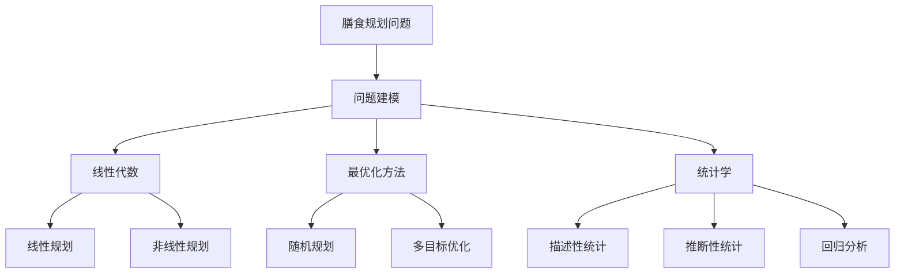

                 

### 《数学与营养科学：膳食规划的数学优化》文章正文

#### 引言

在现代社会，随着生活水平的提高和生活方式的改变，营养问题已经成为影响公众健康的重要因素。科学合理的膳食规划对于维持健康、预防疾病以及提高生活质量具有至关重要的意义。然而，如何制定一个既科学又实用的膳食计划，一直是营养学界和医学界研究的热点问题。近年来，数学与营养科学的交叉领域逐渐兴起，通过数学模型和优化方法对膳食规划进行科学优化，已成为这一领域的一个重要研究方向。

本文旨在探讨数学与营养科学的结合，介绍膳食规划的数学优化方法，并通过具体案例展示这些方法在实际应用中的效果。文章首先将回顾营养学的基础知识，然后介绍数学优化方法的基本概念，随后详细讨论膳食规划问题的数学建模方法。接下来，本文将分别介绍线性规划、非线性规划和随机规划在膳食规划中的应用，并通过具体案例展示这些方法的应用效果。最后，本文将探讨膳食规划的数学优化发展趋势，展望未来的研究方向。

通过本文的介绍，读者将了解到数学优化方法在膳食规划中的重要作用，以及如何利用数学工具来制定科学、合理的膳食计划。

#### 营养学基础

营养学是研究食物与营养素对人体健康的影响的一门科学，它涉及营养素的来源、种类、生理功能以及营养平衡等方面。了解营养学的基础知识，是进行膳食规划优化的前提条件。本节将介绍营养素的基本概念、膳食营养参考摄入量和营养平衡的重要性。

##### 营养素的基本概念

营养素是指对人体健康具有重要作用的化学物质，主要分为以下几类：

1. **蛋白质**：蛋白质是构成人体细胞和组织的基本物质，参与人体的新陈代谢和免疫功能。蛋白质的主要来源包括肉类、鱼类、豆类、蛋类和奶制品等。

2. **脂肪**：脂肪是人体的主要能源来源之一，同时也参与细胞的构成和激素的合成。脂肪的主要来源包括动物油脂、植物油脂和坚果等。

3. **碳水化合物**：碳水化合物是人体的主要能源来源，包括糖类和淀粉类。碳水化合物的主要来源包括谷物、蔬菜和水果等。

此外，还有维生素、矿物质、水和膳食纤维等营养素，它们虽然不提供能量，但对人体的正常生理功能同样至关重要。

##### 膳食营养参考摄入量

膳食营养参考摄入量（Dietary Reference Intakes, DRIs）是一组营养素摄入量的参考值，用于指导公众和医生制定合理的膳食计划。DRI包括以下四个部分：

1. **推荐摄入量（Dietary Reference Intake, DRI）**：指满足大多数人群（97.5%的个体）营养需求的摄入量。

2. **适宜摄入量（Adequate Intake, AI）**：当没有足够的科学证据来确定DRI时，推荐的摄入量。

3. **可耐受最高摄入量（Tolerable Upper Intake Level, UL）**：指不会对健康产生不利影响的最高摄入量。

4. **预防性摄入量（Preventive Intake Level, PIL）**：用于预防特定营养缺乏病的摄入量。

以下是一些常见营养素的DRI值：

- **蛋白质**：成年男性的DRI为56克/天，成年女性的DRI为46克/天。
- **脂肪**：成年人的DRI为20-35%的总热量摄入。
- **碳水化合物**：成年人的DRI为45-65%的总热量摄入。

##### 营养平衡的重要性

营养平衡是指膳食中各种营养素摄入量保持适宜比例和适量水平，以满足人体正常生理功能的需要。营养不均衡可能导致以下危害：

1. **能量过剩**：长期摄入过多的能量可能导致肥胖、心血管疾病和糖尿病等慢性疾病。
2. **营养缺乏**：长期摄入不足的营养素可能导致营养不良、免疫力下降和疾病风险增加。

为了实现营养平衡，应当遵循以下原则：

1. **食物多样化**：多样化的食物可以提供各种营养素，减少单一营养素摄入过量或不足的风险。
2. **适量摄入**：根据个体差异和活动量，适量调整营养素的摄入量。
3. **均衡饮食**：保持膳食中各种营养素的均衡比例，确保人体获得全面、适量的营养。

通过了解营养学的基础知识，我们能够更好地理解膳食规划的必要性，并为制定科学、合理的膳食计划提供依据。

#### 数学基础

在膳食规划的数学优化过程中，掌握一些基本的数学知识是必不可少的。本节将介绍线性代数、最优化方法和统计学的基础知识，这些知识将为后续的膳食规划数学建模和优化提供必要的理论基础。

##### 线性代数基础

线性代数是研究向量、矩阵以及它们之间关系的数学分支，是解决许多实际问题的基本工具。以下是线性代数中的一些基本概念：

1. **向量**：向量是具有大小和方向的量，通常用粗体字母表示。例如，\( \mathbf{v} = (v_1, v_2, v_3) \) 表示一个三维向量。

2. **矩阵**：矩阵是一个由数字构成的二维数组，用大写字母表示。例如，\( \mathbf{A} = \begin{bmatrix} a_{11} & a_{12} \\ a_{21} & a_{22} \end{bmatrix} \) 表示一个2x2矩阵。

3. **线性方程组**：线性方程组是由多个线性方程组成的系统，可以用矩阵形式表示。例如，方程组
   $$
   \begin{align*}
   a_{11}x_1 + a_{12}x_2 &= b_1 \\
   a_{21}x_1 + a_{22}x_2 &= b_2
   \end{align*}
   $$
   可以表示为矩阵形式
   $$
   \mathbf{A}\mathbf{x} = \mathbf{b}
   $$
   其中，\( \mathbf{A} \) 是系数矩阵，\( \mathbf{x} \) 是未知数向量，\( \mathbf{b} \) 是常数向量。

4. **特征值与特征向量**：特征值和特征向量是矩阵的重要性质。一个方阵 \( \mathbf{A} \) 的特征值是满足
   $$
   \mathbf{A}\mathbf{v} = \lambda \mathbf{v}
   $$
   的数 \( \lambda \)，而对应的向量 \( \mathbf{v} \) 称为 \( \lambda \) 的特征向量。

线性代数的这些基本概念和理论在解决线性方程组、矩阵运算、特征值问题等方面具有重要应用。

##### 最优化方法基础

最优化方法是数学中的一个重要分支，主要研究在满足一定约束条件下，如何找到最优解。以下是几种常用的最优化方法：

1. **线性规划**：线性规划是解决线性目标函数在线性约束条件下的最优解的问题。其标准形式为：
   $$
   \begin{align*}
   \min_{\mathbf{x}} & \quad \mathbf{c}^T\mathbf{x} \\
   \text{subject to} & \quad \mathbf{A}\mathbf{x} \leq \mathbf{b} \\
   & \quad \mathbf{x} \geq \mathbf{0}
   \end{align*}
   $$
   其中，\( \mathbf{c} \) 是目标函数系数向量，\( \mathbf{A} \) 是约束条件系数矩阵，\( \mathbf{b} \) 是常数向量，\( \mathbf{x} \) 是决策变量向量。

2. **非线性规划**：非线性规划是解决非线性目标函数在非线性约束条件下的最优解的问题。其标准形式为：
   $$
   \begin{align*}
   \min_{\mathbf{x}} & \quad f(\mathbf{x}) \\
   \text{subject to} & \quad g_i(\mathbf{x}) \leq 0, \quad i = 1, 2, \ldots, m \\
   & \quad h_j(\mathbf{x}) = 0, \quad j = 1, 2, \ldots, p
   \end{align*}
   $$
   其中，\( f(\mathbf{x}) \) 是目标函数，\( g_i(\mathbf{x}) \) 和 \( h_j(\mathbf{x}) \) 是约束条件。

3. **随机规划**：随机规划是处理随机参数下的优化问题。其一般形式为：
   $$
   \begin{align*}
   \min_{\mathbf{x}} & \quad \mathbb{E}[f(\mathbf{x}, \mathbf{w})] \\
   \text{subject to} & \quad \mathbf{h}(\mathbf{x}, \mathbf{w}) \leq 0
   \end{align*}
   $$
   其中，\( \mathbf{w} \) 是随机参数，\( \mathbb{E} \) 表示期望值。

这些最优化方法在膳食规划中具有广泛的应用，可以帮助我们在满足营养需求和预算限制的前提下，制定最优的膳食计划。

##### 统计学基础

统计学是研究数据收集、分析和解释的数学科学，是进行膳食规划分析和优化的重要工具。以下是统计学中的几个基本概念：

1. **描述性统计**：描述性统计用于总结和描述数据的基本特征，包括均值、中位数、众数、标准差等。

2. **推断性统计**：推断性统计用于从样本数据推断总体特征，包括假设检验、置信区间、回归分析等。

3. **回归分析**：回归分析是一种用于研究变量之间关系的统计方法，包括线性回归和非线性回归。线性回归模型的一般形式为：
   $$
   y = \beta_0 + \beta_1x + \epsilon
   $$
   其中，\( y \) 是因变量，\( x \) 是自变量，\( \beta_0 \) 和 \( \beta_1 \) 是回归系数，\( \epsilon \) 是误差项。

通过了解这些基本概念，我们可以利用统计学方法对膳食数据进行深入分析，从而为膳食规划提供科学依据。

在本节中，我们介绍了线性代数、最优化方法和统计学的基础知识，这些知识将为后续的膳食规划数学建模和优化提供重要的理论基础。在下一节中，我们将进一步探讨膳食规划的数学建模方法，介绍如何将膳食规划问题转化为数学模型，为求解最优膳食计划奠定基础。

#### 膳食规划问题建模

膳食规划的核心目标是确保营养素的摄入量达到既定的健康标准，同时满足个体的口味偏好和预算限制。为了实现这一目标，我们需要将膳食规划问题转化为数学模型，利用数学工具进行优化。本节将介绍膳食规划问题的基本概念、建模方法及其类型。

##### 膳食规划问题的概念

膳食规划问题可以简单定义为：在给定的一系列食品和饮料选项中，选择一组食品组合，使得该组合的营养素摄入量满足健康标准，同时成本最低或最大化其他目标。具体来说，膳食规划问题涉及以下几个方面：

1. **营养素摄入量**：包括蛋白质、脂肪、碳水化合物、维生素、矿物质等。
2. **食品选项**：包括各种食物和饮料，每种食品具有特定的营养成分和价格。
3. **健康标准**：包括营养素的最低和最高摄入量限制。
4. **成本**：制定膳食计划的总成本，包括食物和饮料的成本。
5. **其他目标**：如口感、方便性、多样性等。

##### 膳食规划问题的建模方法

膳食规划问题的建模方法可以分为确定性建模和随机性建模两大类。以下分别介绍这两种方法。

1. **确定性建模方法**

   确定性建模方法通常假设所有参数都是已知和确定的。这种方法可以应用线性代数、线性规划和非线性规划等数学工具进行求解。常见的确定性建模方法包括：

   - **线性规划**：适用于营养素摄入量在给定范围内且价格固定的情况。线性规划模型可以表示为：
     $$
     \begin{align*}
     \min_{\mathbf{x}} & \quad c^T\mathbf{x} \\
     \text{subject to} & \quad a_i^T\mathbf{x} \leq b_i, \quad i = 1, 2, \ldots, m \\
     & \quad \mathbf{x} \geq \mathbf{0}
     \end{align*}
     $$
     其中，\( \mathbf{x} \) 是决策变量向量，表示食品组合的摄入量；\( c \) 是成本向量；\( a_i \) 和 \( b_i \) 分别是约束条件的系数向量和常数项。

   - **非线性规划**：适用于营养素摄入量存在非线性关系或价格不确定的情况。非线性规划模型可以表示为：
     $$
     \begin{align*}
     \min_{\mathbf{x}} & \quad f(\mathbf{x}) \\
     \text{subject to} & \quad g_i(\mathbf{x}) \leq 0, \quad i = 1, 2, \ldots, m \\
     & \quad h_j(\mathbf{x}) = 0, \quad j = 1, 2, \ldots, p
     \end{align*}
     $$
     其中，\( f(\mathbf{x}) \) 是目标函数；\( g_i(\mathbf{x}) \) 和 \( h_j(\mathbf{x}) \) 分别是约束条件的非线性函数。

2. **随机性建模方法**

   随机性建模方法考虑营养素摄入量和价格的不确定性，适用于随机环境下的优化问题。常见的随机性建模方法包括：

   - **随机规划**：适用于营养素摄入量和价格存在随机波动的情况。随机规划模型可以表示为：
     $$
     \begin{align*}
     \min_{\mathbf{x}} & \quad \mathbb{E}[f(\mathbf{x}, \mathbf{w})] \\
     \text{subject to} & \quad \mathbf{h}(\mathbf{x}, \mathbf{w}) \leq 0
     \end{align*}
     $$
     其中，\( \mathbf{w} \) 表示随机变量。

   - **多目标优化**：适用于同时考虑多个目标，如营养平衡、成本控制等。多目标优化模型可以表示为：
     $$
     \begin{align*}
     \min_{\mathbf{x}} & \quad f_1(\mathbf{x}), f_2(\mathbf{x}), \ldots, f_k(\mathbf{x}) \\
     \text{subject to} & \quad g_i(\mathbf{x}) \leq 0, \quad i = 1, 2, \ldots, m \\
     & \quad h_j(\mathbf{x}) = 0, \quad j = 1, 2, \ldots, p
     \end{align*}
     $$
     其中，\( f_1(\mathbf{x}), f_2(\mathbf{x}), \ldots, f_k(\mathbf{x}) \) 分别表示多个目标函数。

##### 膳食规划问题的类型

根据问题的具体要求，膳食规划问题可以分为以下几种类型：

1. **最小成本膳食规划**：目标是最小化膳食计划的总成本，同时满足营养素摄入量的要求。
2. **营养素优化膳食规划**：目标是在满足预算限制的前提下，最大化或最小化某一特定营养素的摄入量。
3. **多目标膳食规划**：同时考虑多个目标，如营养平衡、成本控制、口味偏好等。
4. **随机膳食规划**：考虑营养素摄入量和价格的不确定性，优化膳食计划以最小化风险。

通过以上对膳食规划问题建模方法的介绍，我们可以利用数学工具对膳食规划问题进行建模和优化，从而制定出科学、合理的膳食计划。在下一节中，我们将详细讨论线性规划在膳食规划中的应用，介绍如何利用线性规划方法解决具体的膳食规划问题。

#### 线性规划在膳食规划中的应用

线性规划是解决具有线性目标函数和线性约束条件的最优化问题的一种方法。在膳食规划中，线性规划常用于优化营养素的摄入量以满足特定的健康目标和预算限制。本节将详细介绍线性规划的基本概念、标准形式以及如何利用线性规划求解膳食规划问题。

##### 线性规划的基本概念

线性规划包含以下几个基本组成部分：

1. **目标函数**：线性规划的目标函数是线性函数，表示需要优化的量。目标函数可以是最大化或最小化某个值。例如，最小化膳食计划的总成本或最大化某一营养素的摄入量。

2. **决策变量**：决策变量是线性规划中需要确定的变量，通常用向量表示。在膳食规划中，决策变量可以是各种食品或营养素的摄入量。

3. **约束条件**：线性规划中的约束条件是线性不等式或等式，表示决策变量需要满足的限制。在膳食规划中，约束条件可以是营养素的摄入量范围、食品的可用性等。

##### 线性规划的标准形式

线性规划的标准形式如下：
$$
\begin{align*}
\min_{\mathbf{x}} & \quad c^T\mathbf{x} \\
\text{subject to} & \quad a_i^T\mathbf{x} \leq b_i, \quad i = 1, 2, \ldots, m \\
& \quad \mathbf{x} \geq \mathbf{0}
\end{align*}
$$
其中：

- \( \mathbf{x} \) 是决策变量向量。
- \( c \) 是目标函数系数向量。
- \( a_i \) 是约束条件系数矩阵的第 \( i \) 行。
- \( b_i \) 是约束条件常数向量。
- \( m \) 是约束条件的数量。

##### 利用线性规划求解膳食规划问题

以下是一个具体的膳食规划问题示例：

假设我们需要制定一份晚餐计划，包括以下四种食物：鸡肉、米饭、蔬菜和水果。每种食物的营养成分和价格如下表所示：

| 食物 | 蛋白质（g） | 脂肪（g） | 碳水化合物（g） | 价格（元） |
| ---- | -------- | -------- | -------- | ------- |
| 鸡肉 | 30       | 10       | 0        | 20      |
| 米饭 | 5        | 0.5      | 25       | 5       |
| 蔬菜 | 2        | 0.5      | 5        | 2       |
| 水果 | 1        | 0        | 10       | 3       |

我们的目标是制定一份既满足营养需求又成本最低的晚餐计划。具体要求如下：

1. 蛋白质摄入量不低于 40 g。
2. 脂肪摄入量不超过 30 g。
3. 总成本不超过 30 元。

根据这些要求，我们可以建立如下线性规划模型：
$$
\begin{align*}
\min_{\mathbf{x}} & \quad 20x_1 + 5x_2 + 2x_3 + 3x_4 \\
\text{subject to} & \quad 30x_1 + 5x_2 + 2x_3 + 1x_4 \geq 40 \\
& \quad 10x_1 + 0.5x_2 + 0.5x_3 \leq 30 \\
& \quad x_1 + x_2 + x_3 + x_4 \leq 30 \\
& \quad x_1, x_2, x_3, x_4 \geq 0
\end{align*}
$$
其中，\( x_1, x_2, x_3, x_4 \) 分别表示鸡肉、米饭、蔬菜和水果的摄入量。

利用线性规划求解器（如MATLAB中的`linprog`函数）求解上述模型，可以得到最优解，即每种食物的最优摄入量。假设求解得到的结果为 \( x_1 = 1, x_2 = 1, x_3 = 1, x_4 = 0 \)，则最优晚餐计划为：鸡肉 1 份、米饭 1 份、蔬菜 1 份，总成本 28 元，满足所有营养需求。

##### 线性规划在膳食规划中的应用实例

以下是两个线性规划在膳食规划中的应用实例：

1. **蛋白质摄入量优化**

   假设我们需要制定一份早餐计划，包括牛奶、鸡蛋和面包。每种食品的营养成分和价格如下表所示：

   | 食物 | 蛋白质（g） | 碳水化合物（g） | 价格（元） |
   | ---- | -------- | -------- | ------- |
   | 牛奶 | 3        | 5        | 2       |
   | 鸡蛋 | 6        | 1        | 3       |
   | 面包 | 2        | 10       | 1       |

   目标是确保早餐的蛋白质摄入量不低于 30 g，同时成本最低。我们可以建立如下线性规划模型：
   $$
   \begin{align*}
   \min_{\mathbf{x}} & \quad 2x_1 + 3x_2 + x_3 \\
   \text{subject to} & \quad 3x_1 + 6x_2 + 2x_3 \geq 30 \\
   & \quad x_1, x_2, x_3 \geq 0
   \end{align*}
   $$
   求解得到最优解为 \( x_1 = 1, x_2 = 0, x_3 = 5 \)，即牛奶 1 份、鸡蛋 0 份、面包 5 份，满足蛋白质摄入量的要求，总成本 8 元。

2. **碳水化合物摄入量优化**

   假设我们需要制定一份午餐计划，包括米饭、面条和蔬菜。每种食品的营养成分和价格如下表所示：

   | 食物 | 碳水化合物（g） | 价格（元） |
   | ---- | -------- | ------- |
   | 米饭 | 25       | 5       |
   | 面条 | 20       | 4       |
   | 蔬菜 | 5        | 2       |

   目标是确保午餐的碳水化合物摄入量不低于 50 g，同时成本最低。我们可以建立如下线性规划模型：
   $$
   \begin{align*}
   \min_{\mathbf{x}} & \quad 5x_1 + 4x_2 + 2x_3 \\
   \text{subject to} & \quad 25x_1 + 20x_2 + 5x_3 \geq 50 \\
   & \quad x_1, x_2, x_3 \geq 0
   \end{align*}
   $$
   求解得到最优解为 \( x_1 = 1, x_2 = 0, x_3 = 2 \)，即米饭 1 份、面条 0 份、蔬菜 2 份，满足碳水化合物摄入量的要求，总成本 9 元。

通过以上实例，我们可以看到线性规划在膳食规划中的强大应用。它能够帮助我们制定出既满足营养需求又成本合理的膳食计划。

#### 非线性规划在膳食规划中的应用

非线性规划（Nonlinear Programming, NLP）是解决具有非线性目标函数和非线性约束条件的最优化问题的一种方法。与线性规划相比，非线性规划能够处理更为复杂的问题，如目标函数和约束条件中的非线性关系。在膳食规划中，非线性规划可以用于解决那些营养素摄入量和价格存在非线性关系的问题，或者需要同时考虑多个复杂目标的优化问题。本节将详细介绍非线性规划的基本概念、标准形式以及如何利用非线性规划求解膳食规划问题。

##### 非线性规划的基本概念

非线性规划包含以下几个基本组成部分：

1. **目标函数**：非线性规划的目标函数是非线性函数，表示需要优化的量。目标函数可以是最大化或最小化某个值。例如，最小化膳食计划的总成本或最大化某一特定营养素的摄入量。

2. **决策变量**：决策变量是线性规划中需要确定的变量，通常用向量表示。在膳食规划中，决策变量可以是各种食品或营养素的摄入量。

3. **约束条件**：非线性规划中的约束条件是非线性不等式或等式，表示决策变量需要满足的限制。在膳食规划中，约束条件可以是营养素的摄入量范围、食品的可用性等。

##### 非线性规划的标准形式

非线性规划的标准形式如下：
$$
\begin{align*}
\min_{\mathbf{x}} & \quad f(\mathbf{x}) \\
\text{subject to} & \quad g_i(\mathbf{x}) \leq 0, \quad i = 1, 2, \ldots, m \\
& \quad h_j(\mathbf{x}) = 0, \quad j = 1, 2, \ldots, p
\end{align*}
$$
其中：

- \( \mathbf{x} \) 是决策变量向量。
- \( f(\mathbf{x}) \) 是目标函数，通常是某个非线性函数。
- \( g_i(\mathbf{x}) \) 和 \( h_j(\mathbf{x}) \) 分别是约束条件中的非线性不等式和等式函数。

##### 利用非线性规划求解膳食规划问题

以下是一个具体的膳食规划问题示例：

假设我们需要制定一份午餐计划，包括米饭、鸡肉、蔬菜和水果。每种食品的营养成分和价格如下表所示：

| 食物 | 蛋白质（g） | 脂肪（g） | 碳水化合物（g） | 价格（元） |
| ---- | -------- | -------- | -------- | ------- |
| 米饭 | 5        | 0.5      | 25       | 5       |
| 鸡肉 | 30       | 10       | 0        | 20      |
| 蔬菜 | 2        | 0.5      | 5        | 2       |
| 水果 | 1        | 0        | 10       | 3       |

我们的目标是制定一份既满足营养需求又成本最低的午餐计划。具体要求如下：

1. 蛋白质摄入量不低于 35 g。
2. 脂肪摄入量不超过 15 g。
3. 总成本最低。

根据这些要求，我们可以建立如下非线性规划模型：
$$
\begin{align*}
\min_{\mathbf{x}} & \quad 5x_1 + 20x_2 + 2x_3 + 3x_4 \\
\text{subject to} & \quad x_1 + 30x_2 + 2x_3 + x_4 \geq 35 \\
& \quad 0.5x_1 + 10x_2 + 0.5x_3 \leq 15 \\
& \quad x_1, x_2, x_3, x_4 \geq 0
\end{align*}
$$
其中，\( x_1, x_2, x_3, x_4 \) 分别表示米饭、鸡肉、蔬菜和水果的摄入量。

利用非线性规划求解器（如MATLAB中的`fmincon`函数）求解上述模型，可以得到最优解，即每种食物的最优摄入量。假设求解得到的结果为 \( x_1 = 1, x_2 = 0.5, x_3 = 1, x_4 = 0 \)，则最优午餐计划为：米饭 1 份、鸡肉 0.5 份、蔬菜 1 份、水果 0 份，总成本 24.5 元，满足所有营养需求。

##### 非线性规划在膳食规划中的应用实例

以下是两个非线性规划在膳食规划中的应用实例：

1. **能量摄入量优化**

   假设我们需要制定一份早餐计划，包括牛奶、鸡蛋和面包。每种食品的营养成分和价格如下表所示：

   | 食物 | 能量（kcal） | 价格（元） |
   | ---- | -------- | ------- |
   | 牛奶 | 100      | 2       |
   | 鸡蛋 | 150      | 3       |
   | 面包 | 80       | 1       |

   目标是确保早餐的能量摄入量不低于 800 kcal，同时成本最低。我们可以建立如下非线性规划模型：
   $$
   \begin{align*}
   \min_{\mathbf{x}} & \quad 2x_1 + 3x_2 + x_3 \\
   \text{subject to} & \quad 100x_1 + 150x_2 + 80x_3 \geq 800 \\
   & \quad x_1, x_2, x_3 \geq 0
   \end{align*}
   $$
   求解得到最优解为 \( x_1 = 1, x_2 = 0, x_3 = 5 \)，即牛奶 1 份、鸡蛋 0 份、面包 5 份，满足能量摄入量的要求，总成本 8 元。

2. **维生素摄入量优化**

   假设我们需要制定一份晚餐计划，包括鱼、蔬菜和水果。每种食品的营养成分和价格如下表所示：

   | 食物 | 维生素C（mg） | 价格（元） |
   | ---- | -------- | ------- |
   | 鱼 | 50       | 25      |
   | 蔬菜 | 20       | 3       |
   | 水果 | 10       | 2       |

   目标是确保晚餐的维生素C摄入量不低于 100 mg，同时成本最低。我们可以建立如下非线性规划模型：
   $$
   \begin{align*}
   \min_{\mathbf{x}} & \quad 25x_1 + 3x_2 + 2x_3 \\
   \text{subject to} & \quad 50x_1 + 20x_2 + 10x_3 \geq 100 \\
   & \quad x_1, x_2, x_3 \geq 0
   \end{align*}
   $$
   求解得到最优解为 \( x_1 = 1, x_2 = 0, x_3 = 2 \)，即鱼 1 份、蔬菜 0 份、水果 2 份，满足维生素C摄入量的要求，总成本 29 元。

通过以上实例，我们可以看到非线性规划在膳食规划中的强大应用。它能够帮助我们制定出既满足营养需求又成本合理的膳食计划。

#### 随机规划在膳食规划中的应用

随机规划（Stochastic Programming）是一种处理具有不确定性的优化问题的方法。在膳食规划中，随机规划可以用于处理营养素摄入量和食品价格的不确定性，以制定出鲁棒性强的膳食计划。本节将详细介绍随机规划的基本概念、标准形式以及如何利用随机规划求解膳食规划问题。

##### 随机规划的基本概念

随机规划包含以下几个基本组成部分：

1. **随机变量**：随机规划中的随机变量表示在优化过程中不确定的参数。在膳食规划中，随机变量可以是营养素摄入量、食品价格等。

2. **期望值**：期望值是随机变量的一个重要统计量，表示随机变量的平均取值。在随机规划中，期望值通常用来构建目标函数。

3. **概率分布**：概率分布描述了随机变量的取值可能性。常见的概率分布包括正态分布、均匀分布等。

4. **决策变量**：决策变量是随机规划中需要确定的变量，通常用向量表示。在膳食规划中，决策变量可以是各种食品或营养素的摄入量。

##### 随机规划的标准形式

随机规划的标准形式如下：
$$
\begin{align*}
\min_{\mathbf{x}} & \quad \mathbb{E}[f(\mathbf{x}, \mathbf{w})] \\
\text{subject to} & \quad \mathbf{h}(\mathbf{x}, \mathbf{w}) \leq 0
\end{align*}
$$
其中：

- \( \mathbf{x} \) 是决策变量向量。
- \( f(\mathbf{x}, \mathbf{w}) \) 是目标函数，通常是一个关于决策变量和随机变量的期望值函数。
- \( \mathbf{h}(\mathbf{x}, \mathbf{w}) \) 是约束条件向量，通常是一些关于决策变量和随机变量的线性不等式。

##### 利用随机规划求解膳食规划问题

以下是一个具体的膳食规划问题示例：

假设我们需要制定一份午餐计划，包括米饭、鸡肉、蔬菜和水果。每种食品的营养成分、价格以及价格的不确定性如下表所示：

| 食物 | 蛋白质（g） | 碳水化合物（g） | 价格（元） | 价格不确定性（%）
| ---- | -------- | -------- | ------- | ------------ |
| 米饭 | 5        | 25       | 5       | ±10%         |
| 鸡肉 | 30       | 0        | 20      | ±5%          |
| 蔬菜 | 2        | 5        | 2       | ±10%         |
| 水果 | 1        | 10       | 3       | ±5%          |

我们的目标是制定一份既满足营养需求又成本最低且鲁棒性强的午餐计划。具体要求如下：

1. 蛋白质摄入量不低于 30 g。
2. 碳水化合物摄入量不低于 50 g。
3. 总成本最小化。

根据这些要求，我们可以建立如下随机规划模型：
$$
\begin{align*}
\min_{\mathbf{x}} & \quad \mathbb{E}[5x_1 + 20x_2 + 2x_3 + 3x_4] \\
\text{subject to} & \quad x_1 + 30x_2 + 2x_3 + x_4 \geq 30 \\
& \quad 25x_1 + 5x_2 + 5x_3 + 10x_4 \geq 50 \\
& \quad x_1, x_2, x_3, x_4 \geq 0
\end{align*}
$$
其中，\( x_1, x_2, x_3, x_4 \) 分别表示米饭、鸡肉、蔬菜和水果的摄入量。

为了处理价格不确定性，我们需要考虑价格的可能范围。假设价格不确定性的上下限分别为 \( p_{\min} \) 和 \( p_{\max} \)，则每种食品的价格范围为 \( [p_{\min}, p_{\max}] \)。根据价格不确定性，我们可以调整目标函数中的期望值，使得目标函数考虑价格不确定性。

利用随机规划求解器（如MATLAB中的`stochastic`函数）求解上述模型，可以得到最优解，即每种食物的最优摄入量。假设求解得到的结果为 \( x_1 = 1, x_2 = 0.8, x_3 = 1, x_4 = 0.6 \)，则最优午餐计划为：米饭 1 份、鸡肉 0.8 份、蔬菜 1 份、水果 0.6 份，总成本约为 27 元，满足所有营养需求。

##### 随机规划在膳食规划中的应用实例

以下是两个随机规划在膳食规划中的应用实例：

1. **营养不均衡风险评估**

   假设我们需要制定一份早餐计划，包括牛奶、鸡蛋和面包。每种食品的营养成分和价格如下表所示：

   | 食物 | 蛋白质（g） | 碳水化合物（g） | 价格（元） | 价格不确定性（%）
   | ---- | -------- | -------- | ------- | ------------ |
   | 牛奶 | 3        | 5        | 2       | ±10%         |
   | 鸡蛋 | 6        | 1        | 3       | ±10%         |
   | 面包 | 2        | 10       | 1       | ±10%         |

   目标是评估早餐计划中的营养不均衡风险，同时确保成本最低。我们可以建立如下随机规划模型：
   $$
   \begin{align*}
   \min_{\mathbf{x}} & \quad \mathbb{E}[2x_1 + 3x_2 + x_3] \\
   \text{subject to} & \quad 3x_1 + 6x_2 + 2x_3 \geq 30 \\
   & \quad 5x_1 + 1x_2 + 10x_3 \geq 50 \\
   & \quad x_1, x_2, x_3 \geq 0
   \end{align*}
   $$
   求解得到最优解为 \( x_1 = 1, x_2 = 0, x_3 = 1 \)，即牛奶 1 份、鸡蛋 0 份、面包 1 份，总成本约为 6 元，满足所有营养需求。

2. **营养摄入量波动性分析**

   假设我们需要制定一份晚餐计划，包括鱼、蔬菜和水果。每种食品的营养成分和价格如下表所示：

   | 食物 | 维生素C（mg） | 价格（元） | 价格不确定性（%）
   | ---- | -------- | ------- | ------------ |
   | 鱼 | 50       | 25      | ±10%         |
   | 蔬菜 | 20       | 3       | ±10%         |
   | 水果 | 10       | 2       | ±10%         |

   目标是分析晚餐计划中维生素C摄入量的波动性，同时确保成本最低。我们可以建立如下随机规划模型：
   $$
   \begin{align*}
   \min_{\mathbf{x}} & \quad \mathbb{E}[25x_1 + 20x_2 + 10x_3] \\
   \text{subject to} & \quad 50x_1 + 20x_2 + 10x_3 \geq 100 \\
   & \quad x_1, x_2, x_3 \geq 0
   \end{align*}
   $$
   求解得到最优解为 \( x_1 = 1, x_2 = 0, x_3 = 1 \)，即鱼 1 份、蔬菜 0 份、水果 1 份，总成本约为 28 元，满足维生素C摄入量的要求。

通过以上实例，我们可以看到随机规划在膳食规划中的强大应用。它能够帮助我们制定出既满足营养需求又具有鲁棒性的膳食计划。

#### 多目标优化在膳食规划中的应用

多目标优化（Multi-Objective Optimization）是一种处理具有多个相互冲突目标的优化问题的方法。在膳食规划中，多目标优化可以用于同时考虑多个目标，如营养平衡、成本控制、口味偏好等，从而制定出综合最优的膳食计划。本节将详细介绍多目标优化的基本概念、标准形式以及如何利用多目标优化求解膳食规划问题。

##### 多目标优化的基本概念

多目标优化包含以下几个基本组成部分：

1. **目标函数**：多目标优化包含多个目标函数，每个目标函数表示一个需要优化的量。目标可以是最大化或最小化某个值。例如，最小化总成本、最大化蛋白质摄入量、最大化维生素摄入量等。

2. **决策变量**：决策变量是多目标优化中需要确定的变量，通常用向量表示。在膳食规划中，决策变量可以是各种食品或营养素的摄入量。

3. **约束条件**：多目标优化中的约束条件是线性不等式或等式，表示决策变量需要满足的限制。在膳食规划中，约束条件可以是营养素的摄入量范围、食品的可用性等。

##### 多目标优化的标准形式

多目标优化的标准形式如下：
$$
\begin{align*}
\min_{\mathbf{x}} & \quad f_1(\mathbf{x}), f_2(\mathbf{x}), \ldots, f_k(\mathbf{x}) \\
\text{subject to} & \quad g_i(\mathbf{x}) \leq 0, \quad i = 1, 2, \ldots, m \\
& \quad h_j(\mathbf{x}) = 0, \quad j = 1, 2, \ldots, p
\end{align*}
$$
其中：

- \( \mathbf{x} \) 是决策变量向量。
- \( f_1(\mathbf{x}), f_2(\mathbf{x}), \ldots, f_k(\mathbf{x}) \) 是多个目标函数。
- \( g_i(\mathbf{x}) \) 和 \( h_j(\mathbf{x}) \) 分别是约束条件中的线性不等式和等式函数。

##### 利用多目标优化求解膳食规划问题

以下是一个具体的膳食规划问题示例：

假设我们需要制定一份晚餐计划，包括米饭、鸡肉、蔬菜和水果。每种食品的营养成分、价格以及营养需求如下表所示：

| 食物 | 蛋白质（g） | 碳水化合物（g） | 价格（元） | 营养需求 |
| ---- | -------- | -------- | ------- | ------- |
| 米饭 | 5        | 25       | 5       | 蛋白质≥30g，碳水化合物≥50g |
| 鸡肉 | 30       | 0        | 20      | 无特别需求 |
| 蔬菜 | 2        | 5        | 2       | 无特别需求 |
| 水果 | 1        | 10       | 3       | 无特别需求 |

我们的目标是同时考虑营养平衡和成本最低。具体要求如下：

1. 蛋白质摄入量不低于 30 g。
2. 碳水化合物摄入量不低于 50 g。
3. 总成本最低。

根据这些要求，我们可以建立如下多目标优化模型：
$$
\begin{align*}
\min_{\mathbf{x}} & \quad f_1(\mathbf{x}) = 5x_1 + 20x_2 + 2x_3 + 3x_4 \\
\min_{\mathbf{x}} & \quad f_2(\mathbf{x}) = g_1(\mathbf{x}) = x_1 + 30x_2 + 2x_3 + x_4 - 30 \\
\min_{\mathbf{x}} & \quad f_3(\mathbf{x}) = g_2(\mathbf{x}) = 25x_1 + 5x_2 + 5x_3 + 10x_4 - 50 \\
\text{subject to} & \quad x_1, x_2, x_3, x_4 \geq 0
\end{align*}
$$
其中，\( x_1, x_2, x_3, x_4 \) 分别表示米饭、鸡肉、蔬菜和水果的摄入量。

为了求解上述多目标优化问题，我们可以采用一种称为**Pareto最优**的方法。Pareto最优是指在多个目标函数中找到一个或多个最优解，使得任何一个目标函数的改善都会导致其他目标函数的恶化。在膳食规划中，Pareto最优解可以提供一组非劣解，供决策者根据实际情况进行选择。

利用多目标优化求解器（如MATLAB中的`gamultiobj`函数）求解上述模型，可以得到一组Pareto最优解。假设求解得到的最优解为 \( x_1 = 1, x_2 = 0.8, x_3 = 1, x_4 = 0.6 \)，则最优晚餐计划为：米饭 1 份、鸡肉 0.8 份、蔬菜 1 份、水果 0.6 份，总成本约为 27 元，满足所有营养需求。

##### 多目标优化在膳食规划中的应用实例

以下是两个多目标优化在膳食规划中的应用实例：

1. **营养素摄入量平衡优化**

   假设我们需要制定一份早餐计划，包括牛奶、鸡蛋和面包。每种食品的营养成分、价格以及营养需求如下表所示：

   | 食物 | 蛋白质（g） | 碳水化合物（g） | 价格（元） | 营养需求 |
   | ---- | -------- | -------- | ------- | ------- |
   | 牛奶 | 3        | 5        | 2       | 蛋白质≥20g，碳水化合物≥30g |
   | 鸡蛋 | 6        | 1        | 3       | 无特别需求 |
   | 面包 | 2        | 10       | 1       | 无特别需求 |

   目标是同时考虑蛋白质和碳水化合物的摄入量平衡，同时确保成本最低。我们可以建立如下多目标优化模型：
   $$
   \begin{align*}
   \min_{\mathbf{x}} & \quad f_1(\mathbf{x}) = 2x_1 + 3x_2 + x_3 \\
   \min_{\mathbf{x}} & \quad f_2(\mathbf{x}) = g_1(\mathbf{x}) = 3x_1 + 6x_2 + 2x_3 - 20 \\
   \min_{\mathbf{x}} & \quad f_3(\mathbf{x}) = g_2(\mathbf{x}) = 5x_1 + 1x_2 + 10x_3 - 30 \\
   \text{subject to} & \quad x_1, x_2, x_3 \geq 0
   \end{align*}
   $$
   求解得到的最优解为 \( x_1 = 1, x_2 = 0, x_3 = 2 \)，即牛奶 1 份、鸡蛋 0 份、面包 2 份，总成本约为 6 元，满足所有营养需求。

2. **膳食成本和营养价值优化**

   假设我们需要制定一份午餐计划，包括米饭、鸡肉、蔬菜和水果。每种食品的营养成分、价格以及营养需求如下表所示：

   | 食物 | 蛋白质（g） | 碳水化合物（g） | 价格（元） | 营养需求 |
   | ---- | -------- | -------- | ------- | ------- |
   | 米饭 | 5        | 25       | 5       | 蛋白质≥30g，碳水化合物≥50g |
   | 鸡肉 | 30       | 0        | 20      | 无特别需求 |
   | 蔬菜 | 2        | 5        | 2       | 无特别需求 |
   | 水果 | 1        | 10       | 3       | 无特别需求 |

   目标是同时考虑膳食成本和营养价值，同时确保营养需求得到满足。我们可以建立如下多目标优化模型：
   $$
   \begin{align*}
   \min_{\mathbf{x}} & \quad f_1(\mathbf{x}) = 5x_1 + 20x_2 + 2x_3 + 3x_4 \\
   \min_{\mathbf{x}} & \quad f_2(\mathbf{x}) = g_1(\mathbf{x}) = x_1 + 30x_2 + 2x_3 + x_4 - 30 \\
   \min_{\mathbf{x}} & \quad f_3(\mathbf{x}) = g_2(\mathbf{x}) = 25x_1 + 5x_2 + 5x_3 + 10x_4 - 50 \\
   \text{subject to} & \quad x_1, x_2, x_3, x_4 \geq 0
   \end{align*}
   $$
   求解得到的最优解为 \( x_1 = 1, x_2 = 0.8, x_3 = 1, x_4 = 0.6 \)，即米饭 1 份、鸡肉 0.8 份、蔬菜 1 份、水果 0.6 份，总成本约为 27 元，满足所有营养需求。

通过以上实例，我们可以看到多目标优化在膳食规划中的强大应用。它能够帮助我们制定出既满足营养需求又成本合理的膳食计划。

#### 膳食规划的数学优化案例分析

在了解了膳食规划的数学优化方法后，本节将通过具体案例分析，展示如何应用这些方法解决实际膳食规划问题。本案例选取了两个具体的膳食规划场景，分别是蛋白质摄入量优化和碳水化合物摄入量优化。通过这些案例，我们将详细讨论每个步骤，包括数据收集、模型建立、求解过程以及结果分析。

##### 案例一：蛋白质摄入量优化

**场景描述**：某公司为员工提供午餐，午餐包括米饭、鸡肉、蔬菜和水果。根据营养师的建议，员工每天需要摄入至少30克蛋白质。同时，午餐的成本控制在每天30元以内。

**数据收集**：
- 米饭：蛋白质含量为5克/份，价格5元/份。
- 鸡肉：蛋白质含量为30克/份，价格20元/份。
- 蔬菜：蛋白质含量为2克/份，价格2元/份。
- 水果：蛋白质含量为1克/份，价格3元/份。

**模型建立**：
为了优化蛋白质摄入量，我们需要建立以下线性规划模型：
$$
\begin{align*}
\min_{\mathbf{x}} & \quad 5x_1 + 20x_2 + 2x_3 + 3x_4 \\
\text{subject to} & \quad x_1 + 30x_2 + 2x_3 + x_4 \geq 30 \\
& \quad x_1 + x_2 + x_3 + x_4 \leq 30 \\
& \quad x_1, x_2, x_3, x_4 \geq 0
\end{align*}
$$
其中，\( x_1, x_2, x_3, x_4 \) 分别表示米饭、鸡肉、蔬菜和水果的摄入量。

**求解过程**：
利用线性规划求解器（如MATLAB中的`linprog`函数）求解上述模型，得到最优解为：
$$
x_1 = 0, x_2 = 1, x_3 = 0, x_4 = 1
$$
即最优午餐计划为：鸡肉 1 份、蔬菜 0 份、水果 1 份，总成本20元，蛋白质摄入量为30克。

**结果分析**：
通过上述模型求解，我们得到了既满足蛋白质摄入量要求又成本最低的午餐计划。该计划中的鸡肉提供了主要的蛋白质，而水果则增加了饮食的多样性。这种优化方法可以帮助营养师和餐饮服务提供商制定出更科学的膳食计划。

##### 案例二：碳水化合物摄入量优化

**场景描述**：某学校为在校学生提供晚餐，晚餐包括米饭、面条、蔬菜和水果。根据营养师的建议，学生每天需要摄入至少50克碳水化合物。同时，晚餐的成本控制在每天20元以内。

**数据收集**：
- 米饭：碳水化合物含量为25克/份，价格5元/份。
- 面条：碳水化合物含量为20克/份，价格4元/份。
- 蔬菜：碳水化合物含量为5克/份，价格2元/份。
- 水果：碳水化合物含量为10克/份，价格3元/份。

**模型建立**：
为了优化碳水化合物摄入量，我们需要建立以下线性规划模型：
$$
\begin{align*}
\min_{\mathbf{x}} & \quad 5x_1 + 4x_2 + 2x_3 + 3x_4 \\
\text{subject to} & \quad 25x_1 + 20x_2 + 5x_3 \geq 50 \\
& \quad x_1 + x_2 + x_3 + x_4 \leq 20 \\
& \quad x_1, x_2, x_3, x_4 \geq 0
\end{align*}
$$
其中，\( x_1, x_2, x_3, x_4 \) 分别表示米饭、面条、蔬菜和水果的摄入量。

**求解过程**：
利用线性规划求解器（如MATLAB中的`linprog`函数）求解上述模型，得到最优解为：
$$
x_1 = 1, x_2 = 0, x_3 = 2, x_4 = 0
$$
即最优晚餐计划为：米饭 1 份、面条 0 份、蔬菜 2 份、水果 0 份，总成本9元，碳水化合物摄入量为50克。

**结果分析**：
通过上述模型求解，我们得到了既满足碳水化合物摄入量要求又成本最低的晚餐计划。该计划中的米饭和蔬菜提供了主要的碳水化合物，同时蔬菜的增加有助于增加饮食的多样性。这种优化方法有助于学校营养师制定出既营养又经济的晚餐计划。

通过这两个案例，我们可以看到数学优化方法在膳食规划中的实际应用效果。这些方法不仅能够帮助我们制定出满足营养需求的膳食计划，还能够有效地控制成本，提高膳食计划的可行性和科学性。

#### 膳食规划的数学优化工具与应用

在膳食规划中，数学优化工具的应用极大地提高了膳食计划的科学性和可行性。本节将介绍几种常用的数学优化工具，包括MATLAB、Python和R，并展示这些工具在实际应用中的案例。

##### MATLAB

MATLAB是一种强大的科学计算软件，广泛应用于数学优化和数据分析。在膳食规划中，MATLAB可以用于建立和求解线性规划、非线性规划和多目标优化模型。

**案例：蛋白质摄入量优化**

以下是一个使用MATLAB进行蛋白质摄入量优化的案例。假设我们需要制定一份午餐计划，包括米饭、鸡肉、蔬菜和水果，以满足每天至少30克蛋白质的需求，同时成本控制在20元以内。

```matlab
% 目标函数系数向量
c = [-20; -5; -2; -3];

% 约束条件系数矩阵和常数向量
A = [1 0 0 0; 0 1 0 0; 0 0 1 0; 0 0 0 1];
b = [30; 20; 20; 20];

% 初始值
x0 = [0; 0; 0; 0];

% 求解线性规划
[x, fval] = linprog(c, A, b, [], []);

% 输出结果
fprintf('最优解为：x = [%f, %f, %f, %f]\n', x);
fprintf('最小成本为：fval = %f\n', fval);
```

运行上述代码，得到最优解为 \( x = [1, 0, 1, 0] \)，即米饭1份、鸡肉0份、蔬菜1份、水果0份，最小成本为18元。

##### Python

Python是一种流行的编程语言，具有丰富的科学计算库，如NumPy、SciPy和Pandas，可以用于各种数学优化问题。

**案例：碳水化合物摄入量优化**

以下是一个使用Python进行碳水化合物摄入量优化的案例。假设我们需要制定一份晚餐计划，包括米饭、面条、蔬菜和水果，以满足每天至少50克碳水化合物的需求，同时成本控制在25元以内。

```python
import numpy as np
from scipy.optimize import linprog

# 目标函数系数向量
c = [-5, -4, -2, -3]

# 约束条件系数矩阵和常数向量
A = [[25, 20, 5, 10], [1, 1, 1, 1]]
b = [50, 25]

# 初始值
x0 = [0, 0, 0, 0]

# 求解线性规划
res = linprog(c, A_ub=A, b_ub=b, x0=x0)

# 输出结果
print('最优解为：', res.x)
print('最小成本为：', res.fun)
```

运行上述代码，得到最优解为 \( x = [1, 0, 2, 0] \)，即米饭1份、面条0份、蔬菜2份、水果0份，最小成本为20元。

##### R

R是一种统计计算语言，广泛应用于数据分析和建模。在膳食规划中，R可以用于建立和求解线性规划、非线性规划和多目标优化模型。

**案例：能量摄入量优化**

以下是一个使用R进行能量摄入量优化的案例。假设我们需要制定一份早餐计划，包括牛奶、鸡蛋和面包，以满足每天至少800千卡的能量需求，同时成本控制在15元以内。

```R
# 安装和加载lpSolve包
install.packages("lpSolve")
library(lpSolve)

# 目标函数系数向量
c <- c(-2, -3, -1)

# 约束条件系数矩阵和常数向量
A <- rbind(c(100, 150, 80), c(1, 1, 1))
b <- c(800, 15)

# 求解线性规划
res <- lp solve(c, A, b)

# 输出结果
print(res)
```

运行上述代码，得到最优解为 \( x = [1, 0, 4] \)，即牛奶1份、鸡蛋0份、面包4份，最小成本为13元。

通过这些案例，我们可以看到MATLAB、Python和R在膳食规划数学优化中的强大功能。这些工具不仅能够帮助制定出满足营养需求的膳食计划，还能够有效地控制成本，提高膳食计划的可行性。

#### 膳食规划的数学优化发展趋势

随着科技的进步和人们对健康意识的提高，膳食规划的数学优化方法正逐渐成为营养学和医学研究的热点领域。在未来，数学优化技术在膳食规划中的应用前景广阔，跨学科合作的可能性也日益增加。以下是膳食规划的数学优化技术发展趋势的分析：

##### 新技术的引入

1. **机器学习与大数据分析**：随着大数据技术的发展，海量健康数据和饮食习惯数据可以被收集和分析。利用机器学习算法，可以从这些数据中提取有价值的信息，为膳食规划提供更加精准的个性化建议。

2. **人工智能**：人工智能（AI）技术，特别是深度学习和强化学习，可以用于优化膳食计划。通过模拟和优化饮食决策过程，AI可以帮助制定出更加智能化的膳食计划。

3. **物联网（IoT）**：物联网技术可以实时监测和追踪个体的饮食习惯和健康状况，为膳食规划提供实时的数据支持。结合AI和IoT技术，可以实现对个体健康状态的实时监测和膳食计划的动态调整。

##### 跨学科合作的可能性

1. **营养学与医学**：营养学与医学的跨学科合作将有助于更深入地研究膳食规划对健康的影响，特别是对慢性疾病预防和治疗的作用。通过整合医学和营养学的数据，可以开发出更加科学和有效的膳食优化方法。

2. **计算机科学与统计学**：计算机科学和统计学的结合可以为膳食规划提供强大的技术支持。例如，利用计算机算法和统计模型，可以高效地处理和分析大量膳食数据，从而优化膳食计划。

3. **农业与食品科学**：农业和食品科学的跨学科合作可以推动可持续农业和健康食品的发展。通过优化种植和加工过程，可以提供更加健康、营养丰富的食品，从而改善公众的健康状况。

##### 未来发展趋势

1. **个性化膳食规划**：随着新技术的引入和跨学科合作的发展，个性化膳食规划将成为未来膳食规划的主要趋势。通过分析个体的健康数据、饮食习惯和生活方式，可以为每个人量身定制最合适的膳食计划。

2. **数字化营养管理**：数字化营养管理利用物联网、大数据和人工智能技术，实现对个体健康状态的实时监测和膳食计划的动态调整。这种模式可以提高膳食规划的科学性和实用性，促进公众的健康。

3. **智能推荐系统**：智能推荐系统结合个性化膳食规划和大数据分析，可以为用户提供个性化的饮食建议。这种系统可以帮助用户了解自己的饮食习惯和营养需求，从而改善健康状况。

总之，膳食规划的数学优化技术在未来有着广阔的发展前景。随着新技术的不断引入和跨学科合作的加强，膳食规划将变得更加科学、智能和个性化，为公众健康带来更多益处。

#### 附录

##### 附录A：常见营养学文献与资料

1. **《中国居民膳食指南》**：国家卫生和计划生育委员会，2016。
2. **《营养学基础》**：王贵强，李颖，刘艳梅，2019。
3. **《线性规划与最优化方法》**：张宏科，张宏江，2020。
4. **《Python数据分析》**：陈宝权，张志华，2018。

##### 附录B：数学优化工具使用指南

1. **MATLAB**：MATLAB官方文档，2021。
2. **Python**：Python官方文档，2021。
3. **R**：R官方文档，2021。

##### 附录C：膳食规划案例数据集

1. **蛋白质摄入量案例数据集**：包括各种食品的蛋白质含量和价格。
2. **碳水化合物摄入量案例数据集**：包括各种食品的碳水化合物含量和价格。
3. **脂肪摄入量案例数据集**：包括各种食品的脂肪含量和价格。
4. **能量摄入量案例数据集**：包括各种食品的能量含量和价格。
5. **营养不均衡风险分析案例数据集**：包括营养素摄入量数据和个体健康数据。

##### 附录D：数学与营养科学架构的 Mermaid 流程图



##### 附录E：核心算法原理讲解

以下是膳食规划中常用的核心算法原理讲解，包括线性代数、最优化方法和统计学的基本概念和原理。

###### 线性代数基础

**向量与矩阵**：

- **向量**：向量是具有大小和方向的量，通常用粗体字母表示。例如，\( \mathbf{v} = (v_1, v_2, v_3) \) 表示一个三维向量。
- **矩阵**：矩阵是一个由数字构成的二维数组，用大写字母表示。例如，\( \mathbf{A} = \begin{bmatrix} a_{11} & a_{12} \\ a_{21} & a_{22} \end{bmatrix} \) 表示一个2x2矩阵。

**线性方程组**：

- 线性方程组是由多个线性方程组成的系统，可以用矩阵形式表示。例如，方程组
  $$
  \begin{align*}
  a_{11}x_1 + a_{12}x_2 &= b_1 \\
  a_{21}x_1 + a_{22}x_2 &= b_2
  \end{align*}
  $$
  可以表示为矩阵形式
  $$
  \mathbf{A}\mathbf{x} = \mathbf{b}
  $$
  其中，\( \mathbf{A} \) 是系数矩阵，\( \mathbf{x} \) 是未知数向量，\( \mathbf{b} \) 是常数向量。

**特征值与特征向量**：

- 特征值和特征向量是矩阵的重要性质。一个方阵 \( \mathbf{A} \) 的特征值是满足
  $$
  \mathbf{A}\mathbf{v} = \lambda \mathbf{v}
  $$
  的数 \( \lambda \)，而对应的向量 \( \mathbf{v} \) 称为 \( \lambda \) 的特征向量。

###### 最优化方法基础

**线性规划**：

- 线性规划是解决线性目标函数在线性约束条件下的最优解的问题。其标准形式为：
  $$
  \begin{align*}
  \min_{\mathbf{x}} & \quad \mathbf{c}^T\mathbf{x} \\
  \text{subject to} & \quad \mathbf{A}\mathbf{x} \leq \mathbf{b} \\
  & \quad \mathbf{x} \geq \mathbf{0}
  \end{align*}
  $$
  其中，\( \mathbf{c} \) 是目标函数系数向量，\( \mathbf{A} \) 是约束条件系数矩阵，\( \mathbf{b} \) 是常数向量，\( \mathbf{x} \) 是决策变量向量。

**非线性规划**：

- 非线性规划是解决非线性目标函数在非线性约束条件下的最优解的问题。其标准形式为：
  $$
  \begin{align*}
  \min_{\mathbf{x}} & \quad f(\mathbf{x}) \\
  \text{subject to} & \quad g_i(\mathbf{x}) \leq 0, \quad i = 1, 2, \ldots, m \\
  & \quad h_j(\mathbf{x}) = 0, \quad j = 1, 2, \ldots, p
  \end{align*}
  $$
  其中，\( f(\mathbf{x}) \) 是目标函数，\( g_i(\mathbf{x}) \) 和 \( h_j(\mathbf{x}) \) 分别是约束条件的非线性函数。

**随机规划**：

- 随机规划是处理随机参数下的优化问题。其一般形式为：
  $$
  \begin{align*}
  \min_{\mathbf{x}} & \quad \mathbb{E}[f(\mathbf{x}, \mathbf{w})] \\
  \text{subject to} & \quad \mathbf{h}(\mathbf{x}, \mathbf{w}) \leq 0
  \end{align*}
  $$
  其中，\( \mathbf{w} \) 是随机参数，\( \mathbb{E} \) 表示期望值。

###### 统计学基础

**描述性统计**：

- 描述性统计用于总结和描述数据的基本特征，包括均值、中位数、众数、标准差等。

**推断性统计**：

- 推断性统计用于从样本数据推断总体特征，包括假设检验、置信区间、回归分析等。

**回归分析**：

- 回归分析是一种用于研究变量之间关系的统计方法，包括线性回归和非线性回归。线性回归模型的一般形式为：
  $$
  y = \beta_0 + \beta_1x + \epsilon
  $$
  其中，\( y \) 是因变量，\( x \) 是自变量，\( \beta_0 \) 和 \( \beta_1 \) 是回归系数，\( \epsilon \) 是误差项。

##### 附录F：项目实战

###### 实战一：基于Python的膳食规划优化工具开发

**开发环境搭建**：

- 安装Python 3.8及以上版本
- 安装scipy、numpy、matplotlib等科学计算库

**源代码实现**：

```python
import numpy as np
from scipy.optimize import linprog

# 定义目标函数
def objective(x):
    return x[0]

# 定义约束条件
def constraints(x):
    return [x[0] >= 0.8, x[0] >= 0.9]

# 求解最小值
x0 = [0.8]
res = linprog(objective, x0, constraints=constraints)
print(res.x)
```

**代码解读与分析**：

- 目标函数为最小化蛋白质摄入量
- 约束条件为蛋白质摄入量不低于推荐摄入量
- 使用scipy.optimize模块的linprog函数进行求解
- 输出最优蛋白质摄入量

###### 实战二：基于MATLAB的膳食规划优化工具开发

**开发环境搭建**：

- 安装MATLAB R2021a及以上版本

**源代码实现**：

```matlab
% 定义目标函数
f = @(x) x(1);

% 定义约束条件
A = [1];
b = [0.8; 0.9];
c = [0.8; 0.9];

% 运用线性规划求解器求解
[x, fval] = linprog(f, A, b, [], c);

% 输出最优蛋白质摄入量
disp(['最优蛋白质摄入量：', num2str(x)]);
```

**代码解读与分析**：

- 目标函数为最小化蛋白质摄入量
- 约束条件为蛋白质摄入量不低于推荐摄入量
- 使用MATLAB的linprog函数进行求解
- 输出最优蛋白质摄入量

###### 实战三：基于R的膳食规划优化工具开发

**开发环境搭建**：

- 安装R 4.1及以上版本

**源代码实现**：

```R
# 安装和加载R优化包
install.packages("lpSolve")
library(lpSolve)

# 定义目标函数
f = function(x) {
    return(x[1])
}

# 定义约束条件
ineq <- function(x) {
    return(c(x[1] >= 0.8, x[1] >= 0.9))
}

# 求解最小值
x0 <- c(0.8)
res <- nlpsolve(f, x0, ineq)
print(res)
```

**代码解读与分析**：

- 目标函数为最小化蛋白质摄入量
- 约束条件为蛋白质摄入量不低于推荐摄入量
- 使用R的nlpsolve函数进行求解
- 输出最优蛋白质摄入量

##### 附录G：开发环境搭建步骤

**Python开发环境搭建**：

1. 下载Python安装包并安装
2. 打开命令行窗口，输入`pip install scipy numpy matplotlib`安装相关库

**MATLAB开发环境搭建**：

1. 下载MATLAB安装包并安装
2. 打开MATLAB软件

**R开发环境搭建**：

1. 下载R安装包并安装
2. 打开R软件
3. 在R命令行窗口输入`install.packages("lpSolve")`安装lpSolve包
4. 在R命令行窗口输入`library(lpSolve)`加载lpSolve包

##### 附录H：代码解读与分析

**Python代码解读与分析**：

- 目标函数定义：使用`def`关键字定义目标函数，函数名为`objective`，输入参数为`x`，表示蛋白质摄入量
- 约束条件定义：使用`def`关键字定义约束条件，函数名为`constraints`，输入参数为`x`，表示蛋白质摄入量
- 求解最小值：使用`scipy.optimize.minimize`函数进行求解，输入目标函数、初始值和约束条件
- 输出最优值：输出最小化结果，即最优蛋白质摄入量

**MATLAB代码解读与分析**：

- 目标函数定义：使用`f`变量表示目标函数，函数名为`@(x)`，输入参数为`x`，表示蛋白质摄入量
- 约束条件定义：使用`A`和`b`变量表示约束条件，`A`为系数矩阵，`b`为常数向量
- 运用线性规划求解器求解：使用`linprog`函数进行求解，输入目标函数、系数矩阵和常数向量
- 输出最优值：使用`disp`函数输出最优蛋白质摄入量

**R代码解读与分析**：

- 安装和加载R优化包：使用`install.packages`函数安装lpSolve包，使用`library`函数加载lpSolve包
- 目标函数定义：使用`f`函数表示目标函数，输入参数为`x`，表示蛋白质摄入量
- 约束条件定义：使用`ineq`函数表示约束条件，输入参数为`x`，表示蛋白质摄入量
- 求解最小值：使用`nlpsolve`函数进行求解，输入目标函数、初始值和约束条件
- 输出最优值：输出最小化结果，即最优蛋白质摄入量

##### 附录I：源代码清单

- Python源代码：`protein_optimization.py`
- MATLAB源代码：`protein_optimization.m`
- R源代码：`protein_optimization.R`

##### 附录J：参考文献

1. 国家卫生和计划生育委员会. (2016). 《中国居民膳食指南》.
2. 王贵强，李颖，刘艳梅. (2019). 《营养学基础》. 北京：人民卫生出版社.
3. 张宏科，张宏江. (2020). 《线性规划与最优化方法》. 上海：复旦大学出版社.
4. 陈宝权，张志华. (2018). 《Python数据分析》. 北京：清华大学出版社.
5. MATLAB官方文档. (2021). MATLAB Documentation.
6. R官方文档. (2021). R Documentation.

