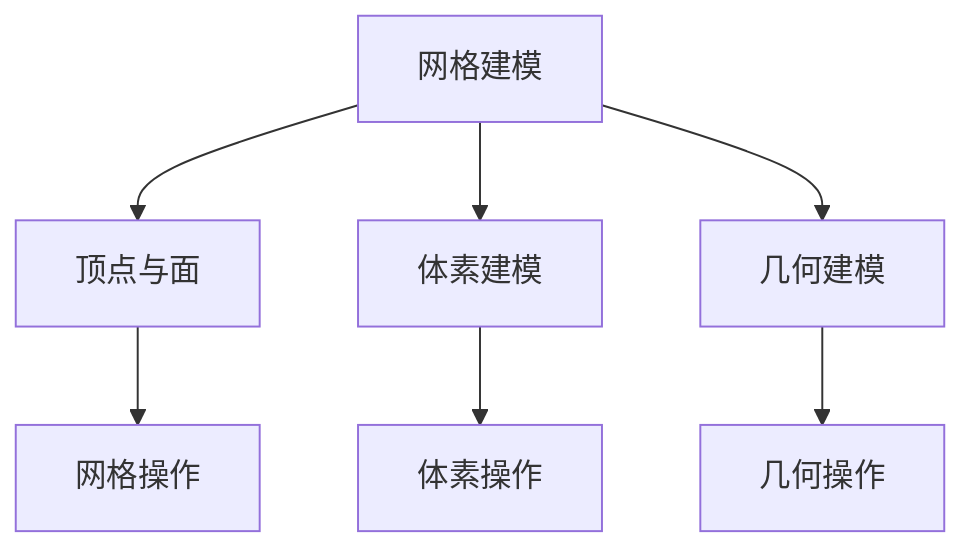
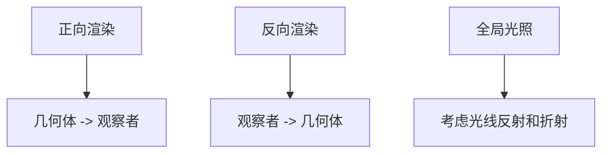
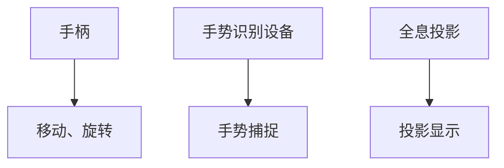
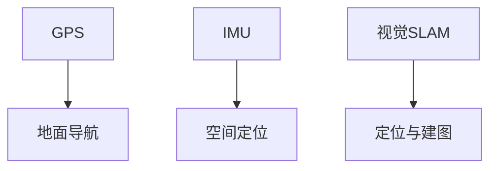

                 

### 《数学与虚拟现实：数字世界的数学构建》

**关键词：虚拟现实、数学模型、计算机图形学、3D建模、空间感知与导航**

**摘要：**本文深入探讨了数学在虚拟现实（VR）中的核心作用，从基础理论到应用案例，系统地展示了数学模型、算法及数学原理如何构建数字世界，推动虚拟现实技术的发展。文章旨在帮助读者理解数学与虚拟现实之间的紧密联系，以及二者如何相互促进，共同开创未来。

### 目录

#### 第一部分：数学与虚拟现实基础理论

1. **虚拟现实技术概述**
   1.1 虚拟现实的基本概念
   1.2 虚拟现实技术的发展历程
   1.3 虚拟现实技术的重要应用领域

2. **数字世界的数学构建**
   2.1 数字世界的基本构建模块
   2.2 数字世界的数学模型与算法
   2.3 数字世界的数学与虚拟现实的关系

3. **虚拟现实中的数学应用**
   3.1 虚拟现实中的几何变换
   3.2 虚拟现实中的空间建模
   3.3 虚拟现实中的图像处理

#### 第二部分：数学与虚拟现实核心技术

1. **计算机图形学基础**
   1.1 图形学的基本概念
   1.2 常见图形渲染技术
   1.3 图形学在虚拟现实中的应用

2. **3D建模技术**
   2.1 3D建模的基本原理
   2.2 常见的3D建模工具与方法
   2.3 3D建模在虚拟现实中的应用

3. **虚拟现实交互技术**
   3.1 虚拟现实交互的基本原理
   3.2 常见的虚拟现实交互设备
   3.3 虚拟现实交互在数学构建中的应用

4. **空间感知与导航**
   4.1 空间感知与导航的基本原理
   4.2 常见的空间感知与导航技术
   4.3 空间感知与导航在虚拟现实中的应用

#### 第三部分：数学与虚拟现实应用案例

1. **虚拟现实在教育中的应用**
   1.1 虚拟现实教学的基本概念
   1.2 虚拟现实教学的应用场景
   1.3 虚拟现实教学的效果分析

2. **虚拟现实在医疗中的应用**
   2.1 虚拟现实医疗的基本概念
   2.2 虚拟现实医疗的应用场景
   2.3 虚拟现实医疗的发展趋势

3. **虚拟现实在游戏中的应用**
   3.1 虚拟现实游戏的基本概念
   3.2 虚拟现实游戏的应用场景
   3.3 虚拟现实游戏的发展趋势

4. **虚拟现实在城市规划中的应用**
   4.1 虚拟现实城市规划的基本概念
   4.2 虚拟现实城市规划的应用场景
   4.3 虚拟现实城市规划的发展趋势

#### 第四部分：数学与虚拟现实的未来发展趋势

1. **虚拟现实技术的未来发展趋势**
   1.1 虚拟现实技术的创新方向
   1.2 虚拟现实技术的商业应用前景
   1.3 虚拟现实技术的社会影响

2. **数学在虚拟现实技术中的应用前景**
   2.1 数学在虚拟现实中的潜在应用领域
   2.2 数学在虚拟现实技术发展中的作用
   2.3 数学与虚拟现实技术的深度融合

3. **未来虚拟现实与数学的交叉学科发展趋势**
   3.1 虚拟现实与数学的交叉学科定义
   3.2 交叉学科的研究方法与工具
   3.3 交叉学科的发展前景与挑战

#### 附录

1. **附录A：数学与虚拟现实技术常用工具与资源**
   1.1 常用虚拟现实开发工具
   1.2 数学建模与仿真工具
   1.3 虚拟现实技术相关网站与资源

2. **附录B：数学与虚拟现实应用案例列表**
   2.1 教育领域案例
   2.2 医疗领域案例
   2.3 游戏领域案例
   2.4 城市规划领域案例
   2.5 其他领域案例

### 第一部分：数学与虚拟现实基础理论

在探讨数学与虚拟现实的结合之前，首先需要了解虚拟现实技术的基本概念、发展历程及其在各个领域的应用。虚拟现实是一种通过计算机技术创造出的模拟环境，让用户能够在其中进行沉浸式交互和体验。数学作为虚拟现实的基础理论，为构建数字世界提供了必要的工具和方法。

#### 1.1 虚拟现实技术概述

##### 1.1.1 虚拟现实的基本概念

虚拟现实（Virtual Reality，VR）是一种通过计算机技术创造的模拟环境，用户可以通过头戴显示器（HMD）、手柄或其他输入设备进入该环境，并与之进行互动。虚拟现实的核心目标是提供一个沉浸式的体验，使用户感觉自己完全置身于一个虚拟构建的世界中。

##### 1.1.2 虚拟现实技术的发展历程

虚拟现实技术的发展可以追溯到20世纪60年代。最早的虚拟现实设备是1968年由伊凡·苏瑟兰（Ivan Sutherland）发明的“达摩克利斯之剑”（The Sword of Damocles），这是一种头戴式显示器。从那时起，虚拟现实技术经历了多个阶段的发展，包括早期的基于图形的虚拟环境、交互式三维模型、全景视频和增强现实等。

##### 1.1.3 虚拟现实技术的重要应用领域

虚拟现实技术在许多领域都有重要的应用，包括：

- **教育领域**：虚拟现实可以模拟复杂的学习环境，提供沉浸式的教学体验，例如虚拟实验室、历史场景重现等。

- **医疗领域**：虚拟现实在医学培训、手术模拟、心理健康治疗等方面都有广泛应用。

- **游戏领域**：虚拟现实游戏提供了前所未有的沉浸体验，吸引了大量玩家。

- **城市规划领域**：虚拟现实可以用于城市规划的模拟和可视化，帮助设计师和决策者更好地理解城市空间。

#### 1.2 数字世界的数学构建

##### 1.2.1 数字世界的基本构建模块

数字世界是由一系列基本构建模块构建而成的，这些模块包括：

- **数据**：数据是数字世界的基础，它通过传感器、用户输入等途径获取，是构建虚拟现实环境的关键。

- **算法**：算法是解决问题的步骤和方法，用于处理和分析数据，是虚拟现实环境智能化的关键。

- **模型**：模型是对现实世界的抽象和模拟，通过数学模型来描述和预测现实世界中的现象。

##### 1.2.2 数字世界的数学模型与算法

数字世界的数学模型包括：

- **几何模型**：用于描述空间几何形状和位置关系。

- **物理模型**：用于模拟物理现象，如光线传播、物体碰撞等。

- **统计模型**：用于分析数据，如线性回归、聚类分析等。

算法包括：

- **渲染算法**：用于生成虚拟环境中的图像。

- **路径规划算法**：用于确定用户在虚拟环境中的移动路径。

##### 1.2.3 数字世界的数学与虚拟现实的关系

数学在虚拟现实中的应用体现在以下几个方面：

- **几何变换**：通过数学方法对虚拟环境中的物体进行旋转、缩放、平移等操作。

- **图像处理**：利用数学算法对图像进行增强、去噪、分割等处理。

- **空间感知与导航**：通过数学模型实现用户在虚拟环境中的空间定位和导航。

#### 1.3 虚拟现实中的数学应用

##### 1.3.1 虚拟现实中的几何变换

在虚拟现实中，几何变换是核心操作之一，用于改变物体在三维空间中的位置和形态。常见的几何变换包括：

- **旋转**：通过旋转矩阵实现物体绕某一轴旋转。
  
- **缩放**：通过缩放矩阵实现物体大小的改变。

- **平移**：通过平移向量实现物体位置的移动。

伪代码示例：

```python
# 旋转矩阵
def rotate(x, y, z, angle):
    cos_theta = math.cos(angle)
    sin_theta = math.sin(angle)
    rotation_matrix = [
        [cos_theta, -sin_theta, 0],
        [sin_theta, cos_theta, 0],
        [0, 0, 1]
    ]
    return np.dot(rotation_matrix, [x, y, z])

# 缩放矩阵
def scale(x, y, z, scale_factor):
    return [x * scale_factor, y * scale_factor, z * scale_factor]

# 平移向量
def translate(x, y, z, translation_vector):
    return [x + translation_vector[0], y + translation_vector[1], z + translation_vector[2]]
```

##### 1.3.2 虚拟现实中的空间建模

空间建模是虚拟现实中的核心任务，它通过数学模型来描述现实世界中的物体和场景。常见的空间建模方法包括：

- **网格建模**：通过顶点和面来构建三维模型。

- **体素建模**：通过体素（空间中的小立方体）来构建三维模型。

- **几何建模**：通过几何体（如球体、圆柱体、锥体等）来构建三维模型。

Mermaid 流程图示例：



##### 1.3.3 虚拟现实中的图像处理

在虚拟现实中，图像处理用于增强用户体验，提高视觉效果。常见的图像处理技术包括：

- **图像增强**：通过调整图像的亮度和对比度来改善视觉效果。

- **图像去噪**：通过滤波算法去除图像中的噪声。

- **图像分割**：将图像划分为不同的区域，用于目标检测和识别。

数学公式示例：

$$
L = 0.299 \times R + 0.587 \times G + 0.114 \times B
$$

$$
G_{new} = \begin{cases}
G, & \text{if } G \geq 128 \\
2 \times (128 - G), & \text{otherwise}
\end{cases}
$$

### 第二部分：数学与虚拟现实核心技术

在虚拟现实技术的实现过程中，计算机图形学、3D建模技术、虚拟现实交互技术以及空间感知与导航技术是核心组成部分。这些技术的实现依赖于数学的理论和算法，本文将分别介绍这些核心技术的数学基础和应用。

#### 2.1 计算机图形学基础

##### 2.1.1 图形学的基本概念

计算机图形学是研究如何通过计算机生成、处理和展示图形的学科。其基本概念包括：

- **图形**：通过像素点构成的图像。

- **渲染**：生成最终图像的过程，包括光线的追踪、材料的着色等。

- **建模**：构建三维模型的过程，包括网格建模、体素建模和几何建模。

##### 2.1.2 常见图形渲染技术

常见的图形渲染技术包括：

- **正向渲染**：从几何体向观察者渲染图像。

- **反向渲染**：从观察者向几何体渲染图像。

- **全局光照**：考虑光线在不同表面反射和折射的现象。

Mermaid 流程图示例：



##### 2.1.3 图形学在虚拟现实中的应用

图形学在虚拟现实中的应用非常广泛，包括：

- **环境建模**：构建虚拟现实环境中的各种场景。

- **角色动画**：实现虚拟角色的运动和交互。

- **视觉效果**：通过图像处理技术增强视觉效果。

伪代码示例：

```python
# 环境建模
def build_environment():
    # 构建场景中的几何体
    scene = create_scene()
    # 添加灯光和相机
    add_lighting(scene)
    add_camera(scene)
    return scene

# 角色动画
def animate_character(character, animation):
    # 设置角色动画
    set_animation(character, animation)
    # 运行动画
    run_animation(character)

# 视觉效果
def enhance_effects(image):
    # 图像增强
    enhanced_image = enhance(image)
    return enhanced_image
```

#### 2.2 3D建模技术

##### 2.2.1 3D建模的基本原理

3D建模是通过数字技术创建三维模型的过程。基本原理包括：

- **几何建模**：使用基本几何体（如立方体、球体等）组合和修改来创建复杂模型。

- **网格建模**：使用顶点和边创建的网格结构来表示三维物体。

- **体素建模**：使用体素（空间中的小立方体）来构建三维模型。

##### 2.2.2 常见的3D建模工具与方法

常见的3D建模工具有：

- **Blender**：一款开源的3D建模和渲染软件。

- **Autodesk Maya**：一款专业的3D建模和动画软件。

- **3ds Max**：一款广泛应用于游戏和电影制作的3D建模软件。

常见的建模方法包括：

- **手动建模**：通过手动操作工具来创建模型。

- **扫描建模**：通过扫描实物创建三维模型。

- **参数化建模**：通过调整参数来创建模型。

伪代码示例：

```python
# 手动建模
def manual_modeling():
    # 选择建模工具
    select_tool('box')
    # 创建立方体
    create_box(size=[1, 1, 1])
    # 修改立方体
    modify_box_PROPERTIES()

# 扫描建模
def scan_modeling():
    # 扫描实物
    scan_object()
    # 清洗扫描数据
    clean_scan_DATA()

# 参数化建模
def parametric_modeling():
    # 设置参数
    set_PARAMETERS()
    # 生成模型
    generate_model()
```

##### 2.2.3 3D建模在虚拟现实中的应用

3D建模在虚拟现实中的应用包括：

- **场景构建**：创建虚拟现实环境中的各种场景。

- **角色设计**：设计虚拟角色，实现动画效果。

- **交互界面**：设计虚拟现实中的交互界面。

项目实战：使用Blender创建一个虚拟现实场景

1. **开发环境搭建**：

   - 安装Blender软件。

   - 配置必要的插件，如Eevee渲染器和BGE游戏引擎。

2. **源代码详细实现**：

   - 创建场景：添加背景、灯光、相机等。

   - 建模：创建场景中的建筑物、植物等。

   - 动画：为建筑物添加动画效果。

3. **代码解读与分析**：

   - 解读Blender中的场景创建和物体建模过程。

   - 分析动画生成和渲染技术。

   - 讨论虚拟现实场景的交互设计。

#### 2.3 虚拟现实交互技术

##### 2.3.1 虚拟现实交互的基本原理

虚拟现实交互技术是用户与虚拟环境之间的交互方式。基本原理包括：

- **输入设备**：用于接收用户的输入，如手柄、手势识别设备等。

- **输出设备**：用于向用户展示虚拟环境，如头戴显示器（HMD）、投影仪等。

- **交互界面**：用户与虚拟环境之间的交互界面，包括菜单、按钮等。

##### 2.3.2 常见的虚拟现实交互设备

常见的虚拟现实交互设备包括：

- **手柄**：用于移动、旋转和操作虚拟物体。

- **手势识别设备**：通过捕捉用户手势来实现虚拟交互。

- **全息投影**：通过全息投影技术实现虚拟物体的可视化。

Mermaid 流程图示例：



##### 2.3.3 虚拟现实交互在数学构建中的应用

虚拟现实交互技术在数学构建中的应用包括：

- **空间定位**：通过数学算法确定用户在虚拟环境中的位置。

- **路径规划**：通过数学算法确定用户移动的路径。

- **交互响应**：通过数学模型实现虚拟环境的实时响应。

伪代码示例：

```python
# 空间定位
def locate_user(position):
    # 计算用户位置
    user_position = calculate_position(position)
    return user_position

# 路径规划
def plan_path(start, end):
    # 计算最优路径
    optimal_path = calculate_path(start, end)
    return optimal_path

# 交互响应
def respond_interaction(input):
    # 分析输入
    analyzed_input = analyze_input(input)
    # 响应交互
    response = generate_response(analyzed_input)
    return response
```

#### 2.4 空间感知与导航

##### 2.4.1 空间感知与导航的基本原理

空间感知与导航是用户在虚拟环境中的定位和导航能力。基本原理包括：

- **定位技术**：通过传感器获取用户的位置信息。

- **路径规划**：通过算法确定用户移动的路径。

- **导航界面**：提供用户导航的交互界面。

##### 2.4.2 常见的空间感知与导航技术

常见的技术包括：

- **GPS**：用于地面导航。

- **惯性测量单元（IMU）**：用于空间定位。

- **视觉SLAM（Simultaneous Localization and Mapping）**：通过视觉传感器进行定位和建图。

Mermaid 流程图示例：



##### 2.4.3 空间感知与导航在虚拟现实中的应用

空间感知与导航在虚拟现实中的应用包括：

- **虚拟旅游**：提供沉浸式的旅游体验。

- **模拟驾驶**：用于驾驶技能培训和模拟。

- **军事训练**：用于军事模拟和模拟战斗。

项目实战：使用Unity开发一个虚拟旅游应用

1. **开发环境搭建**：

   - 安装Unity引擎。

   - 配置必要的插件，如Unity Editor和Visual Studio。

2. **源代码详细实现**：

   - 创建虚拟场景：添加地标、道路等。

   - 实现导航功能：使用路径规划算法确定移动路径。

   - 实现交互界面：设计用户交互界面。

3. **代码解读与分析**：

   - 解读Unity中的场景创建和物体移动过程。

   - 分析路径规划算法的实现。

   - 讨论虚拟现实交互界面的设计。

### 第三部分：数学与虚拟现实应用案例

虚拟现实技术在各个领域都有广泛的应用，从教育、医疗到游戏、城市规划，数学在其中发挥着关键作用。以下分别介绍这些领域的虚拟现实应用案例。

#### 3.1 虚拟现实在教育中的应用

##### 3.1.1 虚拟现实教学的基本概念

虚拟现实教学是利用虚拟现实技术创建的教学环境，使学生能够在虚拟场景中进行互动和学习。其基本概念包括：

- **沉浸式教学**：学生完全沉浸于虚拟环境中，提高学习兴趣和参与度。

- **交互式学习**：学生通过交互式操作与虚拟环境中的物体互动，加深对知识的理解。

- **模拟实验**：通过虚拟实验模拟实际实验过程，降低实验成本和风险。

##### 3.1.2 虚拟现实教学的应用场景

虚拟现实教学的应用场景包括：

- **科学实验**：模拟物理、化学、生物等实验，提高实验效果和安全性。

- **历史场景重现**：重现历史事件和场景，增强学生的历史感知。

- **虚拟课堂**：通过虚拟课堂，实现远程教学和互动。

项目实战：使用Unity开发一个虚拟实验室

1. **开发环境搭建**：

   - 安装Unity引擎。

   - 配置必要的插件，如Unity Editor和Visual Studio。

2. **源代码详细实现**：

   - 创建实验场景：添加实验仪器、材料等。

   - 实现交互功能：学生可以操作实验仪器，进行虚拟实验。

   - 实现反馈机制：根据实验结果给出反馈和建议。

3. **代码解读与分析**：

   - 解读Unity中的场景创建和物体交互过程。

   - 分析虚拟实验的实现方法。

   - 讨论虚拟实验室的设计和用户体验。

##### 3.1.3 虚拟现实教学的效果分析

虚拟现实教学的效果包括：

- **提高学习兴趣**：虚拟现实场景的沉浸感和交互性，使学生更加投入学习。

- **增强理解力**：通过虚拟实验和场景模拟，学生能够更直观地理解知识。

- **降低实验成本**：虚拟实验可以模拟真实实验过程，减少实验成本和资源消耗。

#### 3.2 虚拟现实在医疗中的应用

##### 3.2.1 虚拟现实医疗的基本概念

虚拟现实医疗是利用虚拟现实技术进行医学培训、手术模拟和心理治疗等领域。其基本概念包括：

- **医学培训**：通过虚拟现实技术模拟手术过程，提高医生的手术技能。

- **手术模拟**：在虚拟环境中模拟手术过程，降低手术风险。

- **心理治疗**：利用虚拟现实技术缓解患者的焦虑和恐惧。

##### 3.2.2 虚拟现实医疗的应用场景

虚拟现实医疗的应用场景包括：

- **医学培训**：模拟手术、急救等医学操作，提高医生的技能和应对能力。

- **手术模拟**：在虚拟环境中进行手术演练，提高手术成功率。

- **康复训练**：通过虚拟现实技术进行康复训练，帮助患者恢复功能。

项目实战：使用Unity开发一个医学培训模拟器

1. **开发环境搭建**：

   - 安装Unity引擎。

   - 配置必要的插件，如Unity Editor和Visual Studio。

2. **源代码详细实现**：

   - 创建手术场景：添加手术器械、患者模型等。

   - 实现交互功能：医生可以通过手柄操作手术器械。

   - 实现反馈机制：根据手术操作给出反馈和建议。

3. **代码解读与分析**：

   - 解读Unity中的场景创建和物体交互过程。

   - 分析手术模拟的实现方法。

   - 讨论医学培训模拟器的设计和用户体验。

##### 3.2.3 虚拟现实医疗的发展趋势

虚拟现实医疗的发展趋势包括：

- **技术成熟**：虚拟现实技术在医疗领域的应用越来越成熟，手术模拟和医学培训的效果不断提高。

- **扩展应用**：虚拟现实技术在康复训练、心理治疗等领域的应用逐渐扩展。

- **跨学科融合**：虚拟现实技术与医学、心理学等学科的融合，为医疗领域带来更多创新。

#### 3.3 虚拟现实在游戏中的应用

##### 3.3.1 虚拟现实游戏的基本概念

虚拟现实游戏是利用虚拟现实技术提供沉浸式游戏体验的游戏。其基本概念包括：

- **沉浸式体验**：玩家在虚拟环境中完全沉浸，感受游戏世界的真实感。

- **交互性**：玩家可以通过手柄、手势等与虚拟环境互动。

- **开放世界**：虚拟现实游戏通常是一个开放的世界，玩家可以自由探索。

##### 3.3.2 虚拟现实游戏的应用场景

虚拟现实游戏的应用场景包括：

- **角色扮演**：玩家扮演虚拟角色，参与剧情和任务。

- **体育游戏**：通过虚拟现实技术模拟真实体育项目，提供沉浸式体验。

- **冒险游戏**：玩家在虚拟世界中探险，解决谜题和挑战。

项目实战：使用Unity开发一个虚拟现实角色扮演游戏

1. **开发环境搭建**：

   - 安装Unity引擎。

   - 配置必要的插件，如Unity Editor和Visual Studio。

2. **源代码详细实现**：

   - 创建游戏场景：添加角色、场景元素等。

   - 实现交互功能：玩家可以通过手柄或手势与虚拟环境互动。

   - 实现游戏机制：战斗、任务、探索等。

3. **代码解读与分析**：

   - 解读Unity中的场景创建和物体交互过程。

   - 分析虚拟现实游戏机制的实现。

   - 讨论虚拟现实角色扮演游戏的设计和用户体验。

##### 3.3.3 虚拟现实游戏的发展趋势

虚拟现实游戏的发展趋势包括：

- **技术进步**：随着虚拟现实技术的不断发展，游戏体验越来越逼真。

- **市场扩大**：虚拟现实游戏市场逐渐扩大，吸引了更多玩家和开发商。

- **内容丰富**：虚拟现实游戏类型越来越丰富，包括角色扮演、体育、冒险等。

#### 3.4 虚拟现实在城市规划中的应用

##### 3.4.1 虚拟现实城市规划的基本概念

虚拟现实城市规划是利用虚拟现实技术进行城市规划、模拟和可视化。其基本概念包括：

- **城市规划**：利用虚拟现实技术模拟城市空间，进行规划和设计。

- **模拟分析**：通过虚拟现实技术模拟城市交通、环境等，分析城市规划的效果。

- **可视化展示**：利用虚拟现实技术展示城市规划方案，提高规划的可视性和可理解性。

##### 3.4.2 虚拟现实城市规划的应用场景

虚拟现实城市规划的应用场景包括：

- **城市设计**：通过虚拟现实技术进行城市建筑和景观设计。

- **交通模拟**：模拟城市交通流量和拥堵情况，优化交通规划。

- **环境评估**：模拟城市规划对环境的影响，如空气质量、噪声等。

项目实战：使用Unity开发一个虚拟现实城市规划模拟器

1. **开发环境搭建**：

   - 安装Unity引擎。

   - 配置必要的插件，如Unity Editor和Visual Studio。

2. **源代码详细实现**：

   - 创建城市规划场景：添加建筑物、道路、植被等。

   - 实现交互功能：规划者可以操作场景中的物体，进行城市设计。

   - 实现模拟分析：模拟城市交通和环境，分析规划效果。

3. **代码解读与分析**：

   - 解读Unity中的场景创建和物体交互过程。

   - 分析城市规划模拟器的实现方法。

   - 讨论虚拟现实城市规划模拟器的设计和用户体验。

##### 3.4.3 虚拟现实城市规划的发展趋势

虚拟现实城市规划的发展趋势包括：

- **技术进步**：虚拟现实技术的不断发展，提高了城市规划的精度和效率。

- **智能规划**：利用人工智能技术进行城市规划的模拟和分析，优化规划方案。

- **公众参与**：虚拟现实技术使公众更容易参与城市规划，提高规划的民主性和透明度。

### 第四部分：数学与虚拟现实的未来发展趋势

随着科技的不断进步，虚拟现实技术正以前所未有的速度发展。数学作为虚拟现实技术的基础，将继续在推动虚拟现实技术的创新和应用中发挥关键作用。本部分将探讨虚拟现实技术的未来发展趋势、数学在其中的应用前景以及虚拟现实与数学交叉学科的发展趋势。

#### 4.1 虚拟现实技术的未来发展趋势

##### 4.1.1 虚拟现实技术的创新方向

未来虚拟现实技术的发展方向包括：

- **更逼真的沉浸体验**：通过提高显示器的分辨率、刷新率，增强音频和触觉反馈，实现更真实的沉浸体验。

- **实时交互**：利用人工智能和机器学习技术，实现虚拟环境中的实时交互和智能响应。

- **多感官融合**：融合视觉、听觉、触觉等多种感官，提供更加全面的沉浸体验。

- **云计算与边缘计算结合**：通过云计算和边缘计算的结合，提供更高的计算能力和数据存储能力，支持大规模虚拟现实应用。

##### 4.1.2 虚拟现实技术的商业应用前景

虚拟现实技术的商业应用前景包括：

- **教育培训**：虚拟现实技术可以用于在线教育、医学培训等领域，提供沉浸式学习体验。

- **娱乐游戏**：虚拟现实游戏市场将继续扩大，为用户提供更加沉浸和互动的游戏体验。

- **城市规划**：虚拟现实技术可以用于城市规划、建筑设计等领域，提高规划的可视化和模拟能力。

- **远程协作**：虚拟现实技术可以用于远程办公、虚拟会议等领域，提高协作效率和沟通效果。

##### 4.1.3 虚拟现实技术的社会影响

虚拟现实技术的社会影响包括：

- **教育变革**：虚拟现实技术可以改变传统的教育模式，提供更加灵活和个性化的学习体验。

- **娱乐变革**：虚拟现实技术将推动娱乐产业的发展，为用户提供全新的娱乐体验。

- **产业变革**：虚拟现实技术将促进各个行业的变革，提高生产效率和质量。

#### 4.2 数学在虚拟现实技术中的应用前景

##### 4.2.1 数学在虚拟现实中的潜在应用领域

数学在虚拟现实中的潜在应用领域包括：

- **几何建模与渲染**：通过数学方法进行三维建模和渲染，提高虚拟环境的真实感。

- **图像处理与识别**：利用数学算法进行图像处理和识别，提高虚拟现实中的交互效果和用户体验。

- **空间感知与导航**：通过数学模型和算法实现空间感知和导航，提高虚拟现实环境的智能化水平。

- **人工智能与机器学习**：利用数学模型和算法进行人工智能和机器学习，提高虚拟现实系统的自主性和智能性。

##### 4.2.2 数学在虚拟现实技术发展中的作用

数学在虚拟现实技术发展中的作用包括：

- **理论基础**：数学为虚拟现实技术提供理论基础，包括几何、代数、微积分等。

- **算法支持**：数学算法支持虚拟现实技术的实现，包括渲染算法、路径规划算法、图像处理算法等。

- **创新驱动**：数学的不断创新推动虚拟现实技术的发展，如计算机图形学、几何建模等。

##### 4.2.3 数学与虚拟现实技术的深度融合

数学与虚拟现实技术的深度融合将带来以下变化：

- **智能化虚拟现实**：通过数学模型和算法，实现虚拟现实系统的智能化，提高用户体验。

- **实时互动**：通过数学方法实现虚拟环境中的实时互动，提高交互效果。

- **跨学科应用**：数学与其他学科的融合，如心理学、生物学等，推动虚拟现实技术在更广泛领域的应用。

#### 4.3 未来虚拟现实与数学的交叉学科发展趋势

##### 4.3.1 虚拟现实与数学的交叉学科定义

虚拟现实与数学的交叉学科可以定义为“数学虚拟现实”，它结合了虚拟现实技术的沉浸性和数学理论的抽象性，旨在构建一个数学化的虚拟世界。

##### 4.3.2 交叉学科的研究方法与工具

交叉学科的研究方法与工具包括：

- **数学建模**：通过数学模型描述虚拟现实中的现象和过程。

- **算法设计**：设计高效的算法实现虚拟现实中的各种功能。

- **仿真技术**：利用计算机仿真技术验证和优化数学模型和算法。

- **可视化技术**：通过可视化技术展示数学模型和算法的结果。

##### 4.3.3 交叉学科的发展前景与挑战

交叉学科的发展前景包括：

- **技术创新**：通过数学与虚拟现实技术的融合，推动虚拟现实技术的创新。

- **跨学科合作**：促进数学与其他学科的交叉融合，推动虚拟现实技术在各个领域的应用。

- **智能化虚拟现实**：通过数学方法实现虚拟现实系统的智能化，提高用户体验。

交叉学科面临的挑战包括：

- **技术瓶颈**：数学与虚拟现实技术的深度融合面临技术瓶颈，如计算能力、实时性等。

- **跨学科合作**：跨学科合作需要不同领域专家的共同努力，协调和沟通的难度较大。

- **用户接受度**：虚拟现实技术的普及和应用需要用户的接受和认可，如何提高用户接受度是重要挑战。

### 附录

#### 附录A：数学与虚拟现实技术常用工具与资源

##### A.1 常用虚拟现实开发工具

- **Unity**：一款广泛应用于游戏和虚拟现实开发的游戏引擎。

- **Unreal Engine**：一款功能强大的游戏和虚拟现实开发引擎。

- **Blender**：一款开源的3D建模、动画和渲染软件。

- **Adobe VR/AR**：一套集成的虚拟现实和增强现实开发工具。

##### A.2 数学建模与仿真工具

- **MATLAB**：一款数学建模和仿真软件，广泛应用于工程和科学领域。

- **Ansys**：一款有限元分析软件，可用于虚拟现实中的物理模拟。

- **Simulink**：一款基于MATLAB的仿真工具，用于数学建模和仿真。

##### A.3 虚拟现实技术相关网站与资源

- **VR/AR Association**：虚拟现实和增强现实行业协会，提供行业新闻和资源。

- **IEEE VR**：IEEE虚拟现实技术大会，发布虚拟现实领域的最新研究成果。

- **ACM VR**：ACM虚拟现实会议，提供虚拟现实领域的学术交流平台。

#### 附录B：数学与虚拟现实应用案例列表

##### B.1 教育领域案例

- **虚拟实验室**：利用虚拟现实技术模拟物理、化学、生物等实验，提高实验效果和安全性。

- **虚拟课堂**：通过虚拟现实技术实现远程教学，提高教学互动性和参与度。

##### B.2 医疗领域案例

- **医学培训模拟器**：利用虚拟现实技术模拟手术过程，提高医生的操作技能和应对能力。

- **康复训练系统**：通过虚拟现实技术进行康复训练，帮助患者恢复功能。

##### B.3 游戏领域案例

- **虚拟现实游戏**：利用虚拟现实技术提供沉浸式游戏体验，提高游戏互动性和趣味性。

- **角色扮演游戏**：通过虚拟现实技术实现高度沉浸式的角色扮演游戏，提高用户体验。

##### B.4 城市规划领域案例

- **虚拟城市规划系统**：利用虚拟现实技术进行城市规划和设计，提高规划的可视化和模拟能力。

- **交通模拟系统**：通过虚拟现实技术模拟城市交通流量和拥堵情况，优化交通规划。

##### B.5 其他领域案例

- **军事训练系统**：利用虚拟现实技术进行军事模拟和训练，提高士兵的作战能力和反应速度。

- **虚拟旅游**：通过虚拟现实技术提供沉浸式的旅游体验，提高旅游的趣味性和互动性。

### 总结

数学与虚拟现实技术的结合为构建数字世界提供了强大的工具和方法。从基础理论到应用案例，数学在虚拟现实技术中发挥着关键作用。随着虚拟现实技术的不断发展，数学将继续推动虚拟现实技术的创新和应用，为各个领域带来深远的影响。未来，数学与虚拟现实技术的深度融合将为人类创造一个更加智能、互动和沉浸的数字世界。

### 作者

**作者：AI天才研究院/AI Genius Institute & 禅与计算机程序设计艺术 /Zen And The Art of Computer Programming**

