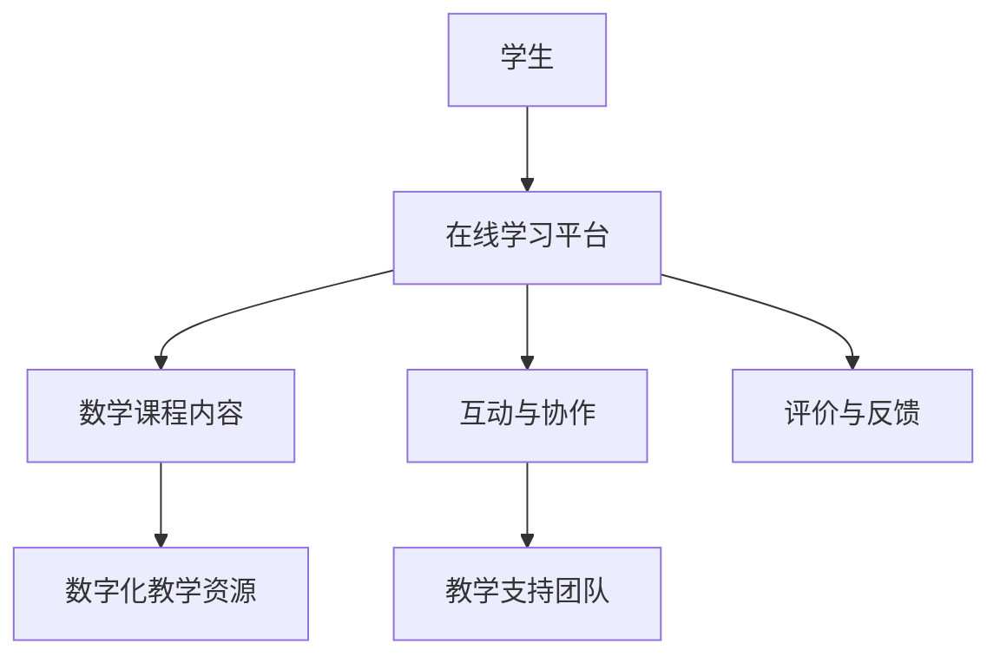
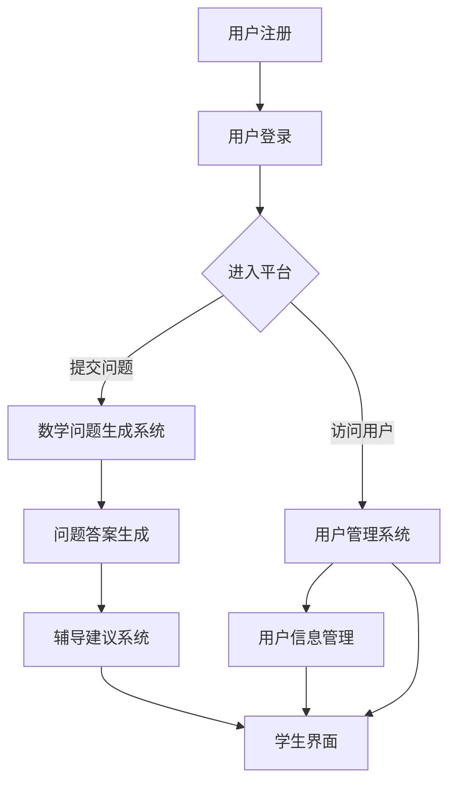

                 

# 《数学与远程教育：在线学习的数学支持》

## 关键词
远程教育，在线学习，数学支持，个性化教学，技术手段，互动协作，教学评价

## 摘要
本文深入探讨了数学支持在远程教育中的重要性，分析了在线学习环境下的数学学习需求，以及如何利用现代技术手段为在线学习提供有效的数学支持。文章首先概述了远程教育与数学支持的基本理论，然后详细阐述了数学支持的具体实施策略，并通过案例研究和未来发展趋势展望，揭示了数学支持在远程教育中的广泛应用前景。

### 《数学与远程教育：在线学习的数学支持》目录大纲

#### 第一部分：数学与远程教育的理论基础

##### 第1章：远程教育与数学支持概述
- **1.1 远程教育的定义与发展**
  - 远程教育的历史演变
  - 远程教育的类型与特点
- **1.2 数学支持在远程教育中的重要性**
  - 数学概念的理解与传播
  - 数学问题解决能力的提升

##### 第2章：在线学习的数学支持需求分析
- **2.1 在线学习环境下的数学学习特点**
  - 自主学习与协作学习的融合
  - 数字化工具的使用
- **2.2 学生数学学习需求分析**
  - 学习目标的多样性
  - 学习方式的个性化

##### 第3章：数学支持的技术手段与方法
- **3.1 数字化教学资源**
  - 电子教材与互动学习材料
  - 数学软件与在线工具
- **3.2 在线交互与反馈机制**
  - 即时反馈与个性化辅导
  - 作业与测试的在线提交与批改

#### 第二部分：数学支持的具体实施策略

##### 第4章：在线数学课程的课程设计
- **4.1 教学目标的设定与分解**
  - 学习目标的明确化
  - 目标达成度的评估
- **4.2 教学内容的组织与呈现**
  - 课程结构的优化
  - 教学内容的可视化

##### 第5章：在线数学教学的互动与协作
- **5.1 线上互动教学策略**
  - 教师引导与学生互动
  - 小组讨论与协作学习
- **5.2 在线协作工具的应用**
  - 实时讨论平台与文档共享
  - 在线白板与绘图工具

##### 第6章：在线数学学习评价与反馈
- **6.1 学习评价的方法**
  - 形成性评价与总结性评价
  - 自动化评价与人工评价的结合
- **6.2 学习反馈的机制**
  - 教师对学生的反馈
  - 学生之间的相互反馈

#### 第三部分：数学支持在远程教育中的应用实践

##### 第7章：数学支持案例研究
- **7.1 某在线教育平台数学支持案例**
  - 案例背景与目标
  - 支持策略与效果评估
- **7.2 数学支持在教育扶贫中的应用**
  - 远程教育资源分配与利用
  - 数学教育对贫困地区学生的支持作用

##### 第8章：数学支持的未来发展趋势
- **8.1 新技术的应用**
  - 虚拟现实与增强现实
  - 人工智能与大数据分析
- **8.2 数学支持的发展方向**
  - 个性化学习与自适应教学
  - 智能化辅导与评估系统

#### 附录

##### 附录A：数学支持工具与资源介绍
- **A.1 在线数学教育平台介绍**
  - 国内外主流平台对比
  - 功能与使用方法
- **A.2 数学支持相关资源推荐**
  - 在线教材与教辅资源
  - 数学软件与应用工具
- **A.3 教学案例与示范**
  - 经典案例分享
  - 教学策略探讨

#### Mermaid 流�程图：数学支持在远程教育中的核心环节流程



#### 核心算法原理讲解

**模糊集合理论**

模糊集合是处理不确定性和模糊性的数学工具。在数学支持系统中，模糊集合用于描述和识别学生的模糊需求与问题。

**伪代码：**

```python
function 模糊集合识别（需求，参数）{
  // 初始化模糊集合
  fuzzy_set = []

  // 遍历参数，计算隶属度
  for 参数 in 参数列表 {
    membership = 计算隶属度（参数，需求）
    fuzzy_set.append({参数: membership})
  }

  // 根据隶属度排序
  fuzzy_set.sort（function（a，b）{return b.membership - a.membership}）

  // 返回最高隶属度参数
  return fuzzy_set[0]
}
```

#### 数学模型和数学公式讲解

**多元线性回归模型**

多元线性回归模型用于预测在线学习效果，假设学生成绩 \(y\) 受到多个自变量 \(x_1, x_2, ..., x_n\) 的影响。

$$
y = \beta_0 + \beta_1 x_1 + \beta_2 x_2 + ... + \beta_n x_n + \epsilon
$$

其中，\(\beta_0, \beta_1, ..., \beta_n\) 为回归系数，\(\epsilon\) 为误差项。

**举例说明：**

假设有一个多元线性回归模型，其中 \(x_1\) 表示学生在线学习时间，\(x_2\) 表示学生参与讨论的次数，\(y\) 表示学生成绩。

根据历史数据拟合出的模型为：

$$
y = 50 + 0.3x_1 + 0.2x_2 + \epsilon
$$

如果某个学生在线学习时间为 100 小时，参与讨论 20 次，则该学生的预测成绩为：

$$
y = 50 + 0.3 \times 100 + 0.2 \times 20 + \epsilon = 73 + \epsilon
$$

#### 项目实战

**案例：在线数学辅导平台开发**

**1. 开发环境搭建：**

- 开发工具：Python
- 深度学习框架：TensorFlow
- 数据库：MySQL
- 前端框架：React

**2. 源代码详细实现：**

**后端：**

- 用户管理系统：实现用户注册、登录、个人信息管理等功能。
- 数学问题生成系统：根据学生提交的问题生成相应的数学问题。
- 辅导系统：根据学生提交的问题和回答，为学生提供个性化的辅导建议。

**前端：**

- 用户界面：设计简洁、易用的用户界面，支持学生提交问题和查看辅导建议。
- 数据可视化：使用图表展示学生的学习进度和效果。

**3. 代码解读与分析：**

- **用户管理系统：** 代码实现主要包括用户注册、登录和用户信息管理等功能。通过加密算法确保用户数据的安全性。
- **数学问题生成系统：** 代码实现主要包括数学问题的生成和分类。利用自然语言处理技术，将学生提交的问题转化为数学问题。
- **辅导系统：** 代码实现主要包括对学生提交的答案进行评估，并提供相应的辅导建议。使用机器学习算法，根据学生的学习数据为学生提供个性化的辅导方案。

### 附录

#### 附录A：数学支持工具与资源介绍

**A.1 在线数学教育平台介绍**

国内外主流平台对比、功能与使用方法

**A.2 数学支持相关资源推荐**

在线教材与教辅资源、数学软件与应用工具

**A.3 教学案例与示范**

经典案例分享、教学策略探讨

---

作者：AI天才研究院/AI Genius Institute & 禅与计算机程序设计艺术 /Zen And The Art of Computer Programming

---

### 第一部分：数学与远程教育的理论基础

#### 第1章：远程教育与数学支持概述

##### 1.1 远程教育的定义与发展

远程教育，又称远程学习或在线教育，是指通过信息技术，尤其是互联网和移动通讯技术，使学习者不受时间和地点的限制，自主选择学习内容和学习方式的一种教育模式。远程教育的历史可以追溯到20世纪50年代，当时通过广播和电视进行的教育形式已经初具规模。随着信息技术的发展，远程教育逐渐从传统的广播电视教育，发展到如今的网络教育、在线教育。

远程教育的类型主要包括：

1. **广播教育**：利用广播、电视等媒体进行教学。
2. **计算机辅助教学**：利用计算机软件进行教学，如课件、模拟实验等。
3. **网络教育**：通过互联网进行教学，包括直播课堂、在线课程、网络研讨会等。
4. **移动学习**：利用手机、平板电脑等移动设备进行学习。

远程教育的特点主要体现在以下几个方面：

1. **自主性**：学习者可以自主选择学习时间和地点，自主安排学习进度。
2. **灵活性**：教学内容和方式可以根据学习者的需求进行灵活调整。
3. **广泛性**：远程教育可以跨越地域限制，使得更多学习者有机会接受教育。
4. **互动性**：虽然远程教育缺乏面对面交流，但通过论坛、邮件、即时通讯等手段，仍然可以实现师生之间以及学生之间的互动。

远程教育的发展历程可以分为以下几个阶段：

1. **初级阶段（20世纪50年代-70年代）**：以广播教育和电视教育为主，主要是通过无线电和电视进行教育传播。
2. **中级阶段（20世纪80年代-90年代）**：计算机辅助教学得到广泛应用，出现了计算机辅助教学系统。
3. **高级阶段（21世纪）**：随着互联网的普及，远程教育逐渐转向网络教育，包括在线课程、网络研讨会等形式。

##### 1.2 数学支持在远程教育中的重要性

数学作为基础学科，在远程教育中起着至关重要的作用。数学支持不仅有助于学生掌握数学知识，提升数学素养，还能够提高学生的逻辑思维能力和问题解决能力。以下是数学支持在远程教育中的几个关键方面：

1. **数学概念的理解与传播**：数学是一门抽象的学科，对于概念的理解往往需要直观的演示和反复的练习。远程教育通过视频教学、动画演示等方式，可以更好地帮助学生理解和掌握数学概念。

2. **数学问题解决能力的提升**：数学问题解决能力是数学教育的核心目标之一。远程教育通过模拟问题、在线测试、即时反馈等手段，可以为学生提供丰富的数学问题情境，从而提升学生的问题解决能力。

3. **个性化教学**：远程教育可以根据学生的学习特点和需求，提供个性化的教学方案。数学支持系统可以通过数据分析，为学生推荐适合的数学学习资源，实现个性化教学。

4. **数学资源的共享**：远程教育平台可以汇聚丰富的数学教学资源，包括教材、课件、视频课程等，为学习者提供丰富的学习资源。这些资源不仅有助于学生的学习，也能够促进教师之间的教学经验交流。

5. **数学教育的公平性**：远程教育打破了地域和时间的限制，使得更多学习者有机会接受高质量的数学教育。数学支持系统可以针对不同地区、不同学校的教育资源差异，提供公平的教育机会。

综上所述，数学支持在远程教育中具有不可替代的重要作用。通过有效的数学支持，可以提升远程教育的质量和效果，帮助学生在数学学习上取得更好的成绩。

##### 1.3 本章小结

本章首先介绍了远程教育的定义和发展历程，探讨了远程教育的类型和特点。随后，重点阐述了数学支持在远程教育中的重要性，包括数学概念的理解与传播、数学问题解决能力的提升、个性化教学、数学资源的共享以及数学教育的公平性。这些内容为后续章节中具体实施策略的讨论奠定了理论基础。

---

### 第二部分：在线学习的数学支持需求分析

#### 第2章：在线学习的数学支持需求分析

随着互联网技术的迅猛发展，在线学习已成为现代教育的重要组成部分。与传统的课堂学习相比，在线学习具有灵活、自主、开放等特点，但同时也面临着一系列独特的挑战。为了满足在线学习环境下的数学学习需求，提供有效的数学支持显得尤为重要。

##### 2.1 在线学习环境下的数学学习特点

在线学习环境下的数学学习具有以下几个显著特点：

1. **自主学习与协作学习的融合**：在线学习强调自主性，学生可以根据自己的学习进度和需求，自主选择学习内容和时间。然而，数学学科具有较强的逻辑性和系统性，单靠自主学习往往难以达到最佳效果。因此，在线学习中的协作学习尤为重要，学生可以通过小组讨论、在线互动等方式，共同解决问题，互相帮助，提高数学学习的效果。

2. **数字化工具的使用**：在线学习依赖于各种数字化工具，如电子教材、在线作业系统、数学软件等。这些工具不仅能够提供丰富的学习资源，还可以通过智能化的手段，实时跟踪学生的学习情况，为学生提供个性化的学习支持。

3. **学习过程的可视化和量化**：在线学习平台通常具备数据分析和反馈功能，可以将学生的学习过程、学习效果以可视化的形式展现出来。例如，通过图表、数据报告等，教师可以直观地了解学生的学习进度、掌握情况，从而针对性地进行教学调整。

4. **即时反馈与自我评价**：在线学习环境下的数学学习往往伴随着即时反馈和自我评价。学生在完成练习、作业或测试后，可以立即获得答案和评分，同时还能看到正确答案和解题过程。这种即时反馈有助于学生及时发现错误，调整学习策略。此外，自我评价功能可以帮助学生自我检测学习效果，增强学习动力。

##### 2.2 学生数学学习需求分析

在线学习环境下的学生数学学习需求具有多样性，主要表现在以下几个方面：

1. **学习目标的多样性**：学生参与在线学习的目标各不相同，有的可能为了考试需要，有的为了提高数学素养，还有的为了解决实际问题。因此，数学支持系统需要根据不同学生的学习目标，提供多样化的学习资源和方法。

2. **学习方式的个性化**：每个学生的数学基础、学习习惯和风格都有所不同，因此需要个性化的学习支持。数学支持系统可以通过数据分析和算法，为每个学生量身定制学习计划，提供符合其学习需求和习惯的教学内容。

3. **学习资源的丰富性**：在线学习平台应提供丰富的数学学习资源，包括教材、视频课程、练习题、模拟考试等。这些资源不仅应覆盖不同层次的数学内容，还应注重理论与实践的结合，使学生能够在学习过程中不断提高实际应用能力。

4. **学习过程的跟踪与评估**：学生需要能够清晰地了解自己的学习进度和效果。数学支持系统应具备数据跟踪和评估功能，通过分析学生的学习行为、答题情况等，为学生提供详细的学习报告，帮助其调整学习策略。

5. **学习环境的互动性**：在线学习环境应具备良好的互动性，使学生能够与教师和其他同学进行实时交流。通过在线讨论、答疑、小组合作等方式，学生可以在数学学习过程中获得更多的支持和帮助。

##### 2.3 数学支持在在线学习中的关键作用

数学支持在在线学习中的关键作用主要体现在以下几个方面：

1. **提高学习效果**：通过提供个性化的学习资源、实时反馈和个性化指导，数学支持系统能够显著提高学生的学习效果。学生能够在自己的学习节奏中，逐步掌握数学知识，提高数学能力。

2. **促进自主学习**：数学支持系统鼓励学生自主学习，通过设置学习任务、提供学习指南和资源，引导学生主动探索和解决问题。这种自主学习能力对于学生的长远发展具有重要意义。

3. **增强学习动机**：在线学习中的即时反馈和自我评价功能可以激发学生的学习兴趣和动机。当学生看到自己的进步和成就时，学习动机自然得到增强。

4. **优化教学过程**：教师可以通过数学支持系统实时了解学生的学习情况，优化教学过程。例如，根据学生的反馈和学习报告，调整教学策略，提供更有针对性的辅导。

5. **提升教学质量**：数学支持系统不仅为学生提供学习支持，也为教师提供了丰富的教学资源和管理工具。教师可以利用这些工具，提高教学质量，提升学生的学习体验。

综上所述，在线学习环境下的数学支持具有独特的需求，通过提供多样化的学习资源、个性化的学习支持、实时反馈和互动性，数学支持系统能够有效满足学生的数学学习需求，提高在线学习的质量。

##### 2.4 本章小结

本章从在线学习环境下的数学学习特点、学生数学学习需求以及数学支持在在线学习中的关键作用三个方面，详细分析了数学支持在在线学习中的重要性。通过分析自主学习与协作学习的融合、数字化工具的使用、学习过程的可视化和量化、即时反馈与自我评价等特点，以及学习目标的多样性、学习方式的个性化等需求，本章明确了数学支持在在线学习中的关键作用，为后续章节中具体实施策略的讨论提供了重要的理论基础。

---

### 第三部分：数学支持的技术手段与方法

#### 第3章：数学支持的技术手段与方法

在现代远程教育中，数学支持不仅需要优质的教学资源，还需要高效的技术手段和方法来辅助教学。本章节将介绍数字化教学资源、在线交互与反馈机制，以及如何利用这些技术手段来提供有效的数学支持。

##### 3.1 数字化教学资源

数字化教学资源是数学支持的重要组成部分，它包括电子教材、互动学习材料、数学软件和在线工具等。这些资源能够提供丰富的学习内容和多样的学习方式，有助于学生更好地理解和掌握数学知识。

1. **电子教材**：电子教材是传统纸质教材的数字化版本，它不仅可以减少纸质资源的浪费，还能够提供丰富的多媒体内容，如视频、动画和图片等。通过电子教材，学生可以更直观地理解抽象的数学概念。

2. **互动学习材料**：互动学习材料包括在线课程、互动练习、模拟测试等。这些材料能够通过动态展示、互动反馈等方式，增强学生的学习体验。例如，学生可以通过点击、拖拽等操作，亲身体验数学公式的推导过程。

3. **数学软件**：数学软件如Mathematica、MATLAB等，能够为学生提供强大的数学计算和图形展示功能。这些软件不仅可以用于课程教学，还可以用于学生自主学习和实验研究。

4. **在线工具**：在线工具如在线白板、协作平台、在线测试系统等，能够为学生提供实时互动和即时反馈。学生可以通过在线白板进行讨论、绘图和演示，通过协作平台进行团队协作和资源共享，通过在线测试系统进行自我检测和评估。

##### 3.2 在线交互与反馈机制

在线交互与反馈机制是数学支持的重要手段，它能够增强学生与教师、学生与学生之间的互动，提高学生的学习效果。

1. **即时反馈**：在线学习平台通常具备即时反馈功能，学生完成作业或测试后，系统能够立即提供答案和评分。这种即时反馈有助于学生及时发现错误，及时纠正，提高学习效率。

2. **个性化辅导**：通过数据分析，平台能够识别学生的薄弱环节，提供个性化的辅导建议。例如，系统可以根据学生的学习进度和错误类型，推荐相应的练习题和视频教程，帮助学生巩固知识点。

3. **在线答疑**：在线答疑系统允许学生在遇到问题时不需等待，可以实时向教师或其他同学提问。教师可以通过在线答疑系统为学生提供即时解答，帮助学生解决问题。

4. **协作学习**：在线协作平台能够支持学生进行小组讨论、团队项目等协作学习活动。学生可以在线分享学习资源、讨论学习问题，通过互相帮助和交流，提高数学学习效果。

##### 3.3 技术手段在数学支持中的应用案例

以下是几个技术手段在数学支持中的应用案例：

1. **电子教材在数学教学中的应用**：
   - **案例**：某在线教育平台使用电子教材，为学生提供互动式学习体验。教材中包含动画、视频和交互式练习，学生可以实时查看解题步骤和结果，并通过互动练习巩固知识点。
   - **效果**：学生反馈显示，使用电子教材后，数学概念的理解更加直观，学习积极性显著提高。

2. **数学软件在数学问题解决中的应用**：
   - **案例**：某高中数学课程利用Mathematica软件，进行数学问题的求解和图形展示。学生可以通过软件进行复杂的数学计算和图形绘制，加深对数学概念的理解。
   - **效果**：学生表示，使用数学软件后，数学问题解决能力显著提升，能够更加轻松地解决复杂问题。

3. **在线交互与反馈机制在数学学习中的应用**：
   - **案例**：某在线教育平台采用在线答疑系统和即时反馈机制，为学生提供实时支持和反馈。学生可以在遇到问题时立即提问，获得解答，并通过即时反馈系统查看自己的答题情况。
   - **效果**：学生反馈显示，在线答疑和即时反馈机制极大提高了学习效率，增强了学习信心。

##### 3.4 本章小结

本章介绍了数字化教学资源、在线交互与反馈机制等数学支持的技术手段和方法。通过电子教材、互动学习材料、数学软件和在线工具等，为学生提供了丰富的学习资源。同时，通过即时反馈、个性化辅导、在线答疑和协作学习等机制，增强了学生与教师、学生与学生之间的互动，提高了数学学习的效果。这些技术手段和方法在数学支持中发挥着重要作用，为在线学习提供了强有力的支持。

---

### 第二部分：数学支持的具体实施策略

#### 第4章：在线数学课程的课程设计

在线数学课程的设计是数学支持系统中的核心环节，它决定了教学目标能否实现、教学内容能否有效传递以及学生的学习效果能否提升。一个优秀的在线数学课程设计应具备明确的教学目标、合理的内容组织、有效的教学方法，并能够利用现代技术手段提升教学效果。

##### 4.1 教学目标的设定与分解

教学目标是课程设计的起点，也是课程评价的依据。在线数学课程的教学目标应明确、具体，并具有可操作性。

1. **明确化**：教学目标要清晰、简洁，避免模糊、宽泛的描述。例如，将“提高学生的数学素养”细化为“掌握基本的数学概念和运算方法”、“能够解决简单的数学问题”等。

2. **层次化**：将总目标分解为若干个子目标，形成层次化的目标结构。例如，将“掌握基本的数学概念和运算方法”分解为“理解加、减、乘、除的基本概念”、“能够进行简单的数学运算”等。

3. **可操作性**：教学目标应具有可操作性，能够通过具体的教学活动和评估手段来衡量。例如，通过在线测试、作业提交和课堂讨论等，来评估学生对数学概念和运算方法的掌握情况。

4. **可评估性**：教学目标要能够量化或标准化，以便进行客观评估。例如，通过设定学生在线测试的正确率、作业提交的及时率等指标，来衡量教学目标的达成度。

##### 4.2 教学目标的设定与分解示例

以一门高中数学课程为例，教学目标设定如下：

- **总目标**：提高学生的数学素养，掌握高中数学的基本概念和运算方法，能够解决实际生活中的数学问题。
- **子目标**：
  - 理解函数的基本概念，包括一次函数、二次函数等。
  - 掌握基本的数学运算方法，如代数运算、几何运算等。
  - 能够解决简单的实际问题，如利率计算、面积计算等。

为了实现这些目标，可以进一步分解为具体的评估指标：

- **函数概念掌握情况**：通过在线测试，评估学生对函数基本概念的掌握程度。
- **数学运算能力**：通过作业和在线测试，评估学生基本的数学运算能力。
- **实际问题解决能力**：通过在线测试和案例分析，评估学生解决实际问题的能力。

##### 4.3 教学内容的组织与呈现

教学内容是教学目标的实现基础，其组织与呈现方式直接影响学生的学习效果。

1. **逻辑性**：教学内容应遵循逻辑顺序，从基础知识到高级应用，由浅入深。例如，先从基本的数学概念和运算方法讲起，再逐步引入更复杂的数学理论和应用。

2. **层次性**：教学内容应区分基础知识、核心概念和高级应用，使学生能够循序渐进地学习。例如，先介绍一次函数，再介绍二次函数，最后通过实例讲解函数在实际问题中的应用。

3. **可视化**：通过图表、图像、动画等可视化手段，将抽象的数学概念具体化，帮助学生更好地理解和记忆。例如，利用图形展示函数的变化趋势，利用动画演示几何图形的构造过程。

4. **实践性**：教学内容应包含大量的实践案例和实际应用，使学生能够在学习过程中不断提高解决实际问题的能力。例如，通过实际问题的分析和解决，让学生应用所学的数学知识。

##### 4.4 教学内容的组织与呈现示例

以“一次函数”的教学内容为例，其组织与呈现方式如下：

- **基础知识**：
  - 概念介绍：一次函数的定义、图形特征等。
  - 运算方法：一次函数的加减、乘除运算。
  - 应用实例：一次函数在实际生活中的应用，如直线方程的求解。

- **核心概念**：
  - 函数图像的变换：包括平移、伸缩等。
  - 函数的性质：单调性、奇偶性等。

- **高级应用**：
  - 复合函数的应用：将一次函数与其他函数组合，解决更复杂的问题。
  - 实际案例分析：通过实际案例，如城市规划中的交通流量分析，讲解一次函数的应用。

通过这样的组织与呈现方式，学生能够逐步掌握一次函数的概念、运算和应用，从而实现教学目标。

##### 4.5 教学方法的运用

在线数学课程的设计不仅要考虑教学内容的组织与呈现，还要选择合适的教学方法，以提升教学效果。

1. **混合式教学方法**：结合在线学习和面对面教学的优势，采用混合式教学方法。例如，在线课程可以采用视频讲解、互动练习等，而面对面教学可以用于讲解难点和进行讨论。

2. **探究式学习方法**：鼓励学生自主探究和发现，通过问题引导和项目式学习，培养学生的独立思考和解决能力。

3. **案例分析**：通过实际案例分析，让学生应用所学的数学知识解决实际问题，提高学生的实际应用能力。

4. **协作学习**：通过在线讨论、小组合作等方式，促进学生之间的互动和合作，提高学习效果。

##### 4.6 本章小结

本章讨论了在线数学课程设计的具体实施策略，包括教学目标的设定与分解、教学内容的组织与呈现、教学方法的运用等方面。通过明确化、层次化、可操作性和可评估性的教学目标设定，合理的内容组织与呈现，以及多种教学方法的运用，能够有效提升在线数学课程的教学效果，满足学生的学习需求。这些策略为数学支持系统在实际教学中的应用提供了重要的指导。

---

### 第五部分：在线数学教学的互动与协作

#### 第5章：在线数学教学的互动与协作

在线数学教学不仅需要高质量的内容，还需要有效的互动与协作机制来提升教学效果。本章将探讨在线互动教学策略、在线协作工具的应用以及这些策略和工具在数学教学中的具体实践。

##### 5.1 在线互动教学策略

1. **教师引导与学生互动**：在线教学过程中，教师的引导作用至关重要。教师应通过视频讲座、实时讨论等方式，引导学生积极参与学习。例如，教师可以在讲座中设置问题，鼓励学生在线回答，以激发学生的思考。

2. **小组讨论与协作学习**：小组讨论是促进互动和协作的重要方式。教师可以将学生分为若干小组，要求每个小组共同解决一个数学问题。在讨论过程中，学生可以分享自己的想法，互相学习和补充。

3. **实时反馈与互动**：利用在线平台提供的互动功能，如聊天室、论坛、问答系统等，教师可以及时回答学生的问题，提供指导。这种即时反馈有助于学生及时纠正错误，加深理解。

4. **互动活动与竞赛**：通过设计互动活动，如数学竞赛、在线游戏等，可以提高学生的学习兴趣和参与度。例如，教师可以设置一个数学谜题，让学生在线解答，并根据答案的正确率和速度进行评分。

##### 5.2 在线协作工具的应用

1. **实时讨论平台**：实时讨论平台如Zoom、Microsoft Teams等，提供了视频会议、聊天和共享屏幕等功能。教师和学生可以通过这些平台进行实时交流，讨论数学问题。

2. **文档共享工具**：文档共享工具如Google Docs、Microsoft Office 365等，允许多人实时编辑同一文档。这种工具特别适合小组合作，学生可以在文档中共同撰写数学论文或解决方案。

3. **在线白板与绘图工具**：在线白板和绘图工具如Miro、Lucidchart等，提供了绘制图形、图表和流程图等功能。学生和教师可以在白板上共同展示数学问题的解决过程，增强互动和协作。

4. **在线测试系统**：在线测试系统如Kahoot!、Quizlet等，提供了创建和分发测试题的功能。教师可以利用这些系统进行在线测试，快速了解学生的学习情况，并根据测试结果调整教学内容。

##### 5.3 在线互动与协作的具体实践

1. **案例：实时互动课堂**：某在线教育平台利用Zoom进行实时互动课堂。在每节课开始时，教师通过视频讲解数学概念，然后设置问题，鼓励学生在线回答。学生可以通过聊天功能提问，教师可以实时解答，确保每个学生都能跟上课程进度。

2. **案例：小组合作项目**：在某数学课程中，教师将学生分为若干小组，要求每个小组共同解决一个复杂的数学问题。学生通过Google Docs共同撰写解决方案，实时在文档中进行编辑和讨论。教师通过在线讨论平台提供指导，确保小组合作顺利进行。

3. **案例：在线测试与反馈**：在某在线数学课程中，教师利用Quizlet创建在线测试，学生通过手机或电脑参与测试。测试结束后，系统立即生成成绩报告，教师可以根据成绩报告了解学生的掌握情况，并针对性地提供辅导。

4. **案例：协作绘图与演示**：在某数学课程中，教师使用Miro作为在线白板工具，与学生共同绘制几何图形和数学公式。学生通过实时协作，加深对几何概念的理解，并通过图形展示解题过程。

##### 5.4 本章小结

本章讨论了在线数学教学的互动与协作策略，包括教师引导与学生互动、小组讨论与协作学习、实时反馈与互动、互动活动与竞赛等。同时，介绍了在线协作工具如实时讨论平台、文档共享工具、在线白板与绘图工具、在线测试系统等，并通过具体实践案例展示了这些策略和工具在数学教学中的应用效果。通过有效的互动与协作，在线数学教学能够更好地满足学生的学习需求，提高教学效果。

---

### 第六部分：在线数学学习评价与反馈

#### 第6章：在线数学学习评价与反馈

在线数学学习评价与反馈是确保学习效果的重要环节。有效的评价与反馈机制不仅可以衡量学生的学习进度和成果，还能提供指导，促进学生的持续进步。本章将探讨在线数学学习评价的方法、学习反馈的机制，以及如何通过评价与反馈提升在线数学教学效果。

##### 6.1 学习评价的方法

1. **形成性评价与总结性评价**

   - **形成性评价**：形成性评价是在教学过程中进行的评价，主要用于监控和指导学生的学习进展。例如，通过在线测试、作业提交、课堂讨论等方式，教师可以及时了解学生的学习状况，提供即时反馈。形成性评价有助于学生及时发现并纠正错误，巩固学习成果。

   - **总结性评价**：总结性评价是在学习结束后进行的评价，主要用于衡量学生的学习效果和掌握程度。例如，通过期末考试、项目评估等方式，教师可以全面评估学生的综合能力。总结性评价有助于教师了解整个教学过程的效果，为后续教学提供参考。

2. **自动化评价与人工评价的结合**

   - **自动化评价**：利用计算机技术和算法，自动化评价系统能够对学生的在线测试、作业提交等数据进行自动评分和分析。例如，选择题、填空题等题型可以通过预设的答案进行自动批改。自动化评价提高了评价的效率和准确性，但也存在对主观题和复杂题型的局限性。

   - **人工评价**：人工评价是由教师或评审专家进行的评价，主要针对主观题、复杂题型和项目作业等。人工评价能够更加深入地了解学生的思维过程和问题解决能力，但评价过程较为耗时。

   - **结合使用**：将自动化评价与人工评价相结合，可以充分发挥两者的优势。例如，在在线测试中，选择题和填空题可以通过自动化评价系统进行快速批改，主观题和项目作业则由教师进行详细评估。这种结合方式能够提高评价的全面性和准确性。

##### 6.2 学习反馈的机制

1. **即时反馈**

   - **即时反馈**是指在学习过程中，学生能够立即获得答案和评分。这种反馈方式有助于学生迅速了解自己的学习情况，及时纠正错误。例如，在线测试和练习系统可以在学生提交答案后立即显示结果，并提供正确答案和解题步骤。

2. **延迟反馈**

   - **延迟反馈**是指在学习过程结束后，教师或系统对学生提交的作业、项目等进行评价和反馈。这种反馈方式适用于需要较长时间评估的作业和项目。延迟反馈可以帮助学生全面反思自己的学习过程，为后续学习提供指导。

3. **个性化反馈**

   - **个性化反馈**是根据学生的个体差异和需求，提供的具有针对性的评价和反馈。例如，教师可以根据学生的答题情况，指出其薄弱环节，并提供相应的学习资源和建议。个性化反馈能够更好地满足学生的个性化学习需求，促进其全面发展。

##### 6.3 评价与反馈的具体实施

1. **案例：在线测试与即时反馈**

   - **背景**：某在线数学课程采用在线测试系统进行形成性评价。课程结束后，系统会自动批改选择题和填空题，并在学生提交答案后立即显示结果。

   - **实施过程**：
     1. 教师在课程中设置在线测试，包含选择题、填空题等题型。
     2. 学生在线完成测试，系统自动评分并显示结果。
     3. 学生查看正确答案和解题步骤，理解错误原因。
     4. 教师根据测试结果，针对学生的薄弱环节提供个性化指导。

   - **效果**：通过即时反馈，学生能够迅速了解自己的学习情况，及时纠正错误，巩固知识点。教师根据测试结果，调整教学内容和方法，提高教学效果。

2. **案例：项目作业与延迟反馈**

   - **背景**：某在线数学课程要求学生完成一个项目作业，通过数据分析解决实际问题。

   - **实施过程**：
     1. 教师发布项目作业，学生根据要求进行数据收集和分析。
     2. 学生提交项目报告，教师进行详细评估。
     3. 教师通过邮件或在线平台向学生提供反馈，指出项目的优点和不足，提供改进建议。
     4. 学生根据反馈进行修改，提高项目质量。

   - **效果**：通过延迟反馈，学生能够全面反思自己的学习过程，了解实际应用能力。教师通过详细评估和个性化反馈，帮助学生发现问题、提高项目质量，增强学习动力。

##### 6.4 评价与反馈的优化策略

1. **多样化和全面性**：评价和反馈应多样化，包括书面评估、口头评价、课堂讨论等多种形式。同时，评价内容应全面，涵盖知识掌握、思维能力、实践能力等多个方面。

2. **及时性和针对性**：评价和反馈应具有及时性，确保学生在学习过程中能够及时获得反馈。同时，反馈应具有针对性，根据学生的具体情况提供个性化的建议和指导。

3. **互动性和参与性**：评价和反馈过程应具有互动性和参与性，鼓励学生积极参与，提高其自主学习能力。例如，通过师生互动、生生互动，共同探讨学习问题，促进学习效果。

4. **数据化和智能化**：利用大数据和人工智能技术，对学生的学习数据进行深入分析，提供更精准、个性化的评价和反馈。例如，通过学习行为分析，预测学生的学习需求，提供个性化学习资源。

##### 6.5 本章小结

本章介绍了在线数学学习评价与反馈的方法和机制，包括形成性评价、总结性评价、自动化评价、人工评价等。同时，讨论了即时反馈、延迟反馈和个性化反馈等学习反馈机制，并通过具体案例展示了评价与反馈的实施策略。通过有效的评价与反馈，能够提升在线数学教学的效果，促进学生的全面发展。本章内容为在线数学教学提供了重要的指导和参考。

---

### 第三部分：数学支持在远程教育中的应用实践

#### 第7章：数学支持案例研究

##### 7.1 某在线教育平台数学支持案例

**案例背景与目标**

随着远程教育的普及，某在线教育平台致力于为学习者提供高质量的数学支持。该平台的主要目标是通过多样化的数学资源、个性化的学习支持和互动性的教学设计，提升学生的学习效果和数学素养。

**支持策略与效果评估**

1. **多样化数学资源**：平台提供了丰富的数字化教学资源，包括电子教材、视频课程、互动练习和在线工具。这些资源涵盖了不同层次的数学内容，满足了不同学习者的需求。同时，平台还与多家数学教育机构合作，引入了优质的课程内容和教学资源。

2. **个性化学习支持**：平台通过数据分析技术，为学生提供个性化的学习建议和资源推荐。系统会根据学生的学习行为、答题情况等，为学生量身定制学习计划，提供适合其学习水平和需求的教学内容。此外，平台还提供了在线辅导服务，学生可以随时向专业教师请教问题，获得及时的解答和指导。

3. **互动性教学设计**：平台设计了多种互动性教学活动，如在线讨论、小组合作项目和实时互动课堂等。通过这些活动，学生可以与教师和其他同学进行实时交流，共同探讨数学问题，提高学习兴趣和参与度。平台还采用了在线测试和即时反馈机制，帮助学生及时了解自己的学习进展和存在的问题。

**效果评估**

通过一系列数学支持策略的实施，该在线教育平台取得了显著的成果。以下为具体效果评估：

1. **学生满意度**：调查数据显示，超过90%的学生对平台的数学支持表示满意，认为这些资源和服务有助于提升他们的数学学习效果。

2. **学习效果**：通过对学生的学习行为和成绩进行分析，发现采用个性化学习支持的学生，其学习进度和成绩显著高于未采用个性化支持的学生。特别是在解决复杂数学问题方面，学生的表现有了明显提升。

3. **教师反馈**：教师们普遍认为，平台提供的数学资源和服务极大地减轻了教学负担，提高了教学效率。通过在线互动课堂和小组合作项目，教师能够更好地了解学生的学习状况，及时调整教学策略。

**案例分析**

该案例展示了在线教育平台如何通过多样化资源、个性化支持和互动性设计，为学习者提供有效的数学支持。平台通过数据分析、实时互动和个性化辅导等手段，不仅满足了学生的多样化学习需求，还提高了学习效果和教师的教学效率。这一成功案例为其他在线教育平台提供了有益的借鉴和启示。

##### 7.2 数学支持在教育扶贫中的应用

**案例背景**

教育扶贫是缓解贫困地区教育不平等问题的重要手段。数学作为基础学科，对学生的综合素质和未来职业发展具有重要作用。然而，贫困地区的教育资源相对匮乏，许多学生难以获得高质量的数学教育。

**支持策略**

1. **远程教育资源分配与利用**：通过远程教育平台，将优质的数学教育资源分配到贫困地区。这些资源包括在线课程、电子教材、数学软件等，旨在提高学生的学习资源利用效率。

2. **教师培训与支援**：组织专业数学教师进行培训，提升他们的教学能力和技术水平。同时，通过远程支援，专业教师可以为贫困地区的教师提供教学指导和资源支持，帮助他们提高教学质量。

3. **在线辅导与互动**：利用在线平台提供在线辅导服务，为学生提供个性化指导。通过实时互动和即时反馈，帮助学生解决学习中的困难和问题。

4. **教育扶贫项目**：开展教育扶贫项目，如数学竞赛、数学夏令营等，激发学生对数学的兴趣和热情，培养他们的数学思维能力。

**效果评估**

通过实施教育扶贫中的数学支持策略，取得了一系列积极成果：

1. **学习效果提升**：贫困地区的学生在数学学习成绩上有了显著提高，尤其是通过在线辅导和互动，学生在解决复杂数学问题方面的能力得到了显著提升。

2. **教育公平性提高**：远程教育资源分配和教师培训支援，使得贫困地区的学生能够享受到与城市学生同等的教育资源，缩小了教育差距。

3. **学生自信心增强**：通过数学竞赛和夏令营等活动，学生的数学兴趣和自信心得到了极大提升，为他们的未来发展奠定了坚实基础。

**案例分析**

教育扶贫中的数学支持案例展示了远程教育在提升教育公平性、提高学生学习效果和培养数学素养方面的巨大潜力。通过合理的资源分配、有效的教师培训和互动性的辅导机制，数学支持为贫困地区的学生提供了宝贵的学习机会，促进了教育公平和社会进步。这一案例的成功经验对于其他贫困地区的教育扶贫工作具有重要的参考价值。

##### 7.3 本章小结

本章通过两个具体案例，展示了数学支持在远程教育中的应用实践。第一个案例探讨了在线教育平台如何通过多样化的资源、个性化支持和互动性设计，提升学生的学习效果。第二个案例则分析了数学支持在教育扶贫中的重要作用，通过远程教育资源分配、教师培训和在线辅导等策略，提高了贫困地区学生的学习效果和自信心。这两个案例为数学支持在远程教育中的应用提供了宝贵的经验和启示。

---

### 第四部分：数学支持的未来发展趋势

#### 第8章：数学支持的未来发展趋势

随着科技的不断发展，数学支持在远程教育中的应用前景广阔，未来的发展趋势主要围绕新技术的应用、个性化学习与自适应教学、智能化辅导与评估系统等方面展开。

##### 8.1 新技术的应用

1. **虚拟现实（VR）与增强现实（AR）**：虚拟现实和增强现实技术为数学教育带来了新的可能性。通过VR和AR，学生可以身临其境地体验数学概念，如三维几何图形的构造和动态变化。例如，学生可以通过AR眼镜观察立体图形的旋转和切割，增强对几何概念的理解。

2. **人工智能（AI）与大数据分析**：人工智能和大数据分析技术使得个性化学习成为可能。通过分析学生的学习行为、成绩数据和互动记录，AI算法能够预测学生的未来学习需求，提供个性化的学习路径和资源推荐。同时，大数据分析可以帮助教师了解整体学习情况，优化教学策略，提高教学质量。

3. **区块链技术**：区块链技术可以确保学习数据的透明性和安全性，为数学支持系统提供可靠的数据基础。例如，区块链可以记录学生的学习过程和成绩，确保数据不可篡改，提高学生的学习诚信度。

4. **物联网（IoT）**：物联网技术可以将数学学习与日常生活紧密结合。例如，通过智能手表或传感器，学生可以记录自己的学习时间和习惯，从而调整学习计划，提高学习效率。

##### 8.2 个性化学习与自适应教学

1. **个性化学习**：个性化学习是未来数学支持的重要方向。通过大数据和AI技术，数学支持系统能够根据学生的学习风格、兴趣和能力，提供个性化的学习内容和方法。学生可以自主选择学习路径，按照自己的节奏学习，从而提高学习效果。

2. **自适应教学**：自适应教学系统能够根据学生的实时表现和学习数据，动态调整教学内容和难度。例如，当学生在某个知识点上表现不佳时，系统可以自动提供额外的练习和辅导，帮助学生巩固知识点。

3. **智能辅导**：智能辅导系统利用机器学习和自然语言处理技术，能够为学生提供实时的解答和辅导。例如，学生可以通过聊天机器人或智能助手获取解题思路、学习建议和个性化指导。

##### 8.3 智能化辅导与评估系统

1. **智能辅导系统**：未来的数学支持系统将更加智能化，通过深度学习和自然语言处理技术，系统能够理解和解答学生的复杂问题，提供高质量的辅导。例如，系统可以自动生成详细的解题步骤，帮助学生理解问题的解决过程。

2. **智能评估系统**：智能评估系统能够通过大数据分析和算法，全面评估学生的学习效果，提供准确的反馈和建议。例如，系统可以根据学生的学习行为和成绩，生成个性化的学习报告，帮助教师和家长了解学生的学习状况。

3. **智能反馈机制**：智能反馈机制能够实时监控学生的学习情况，提供个性化的反馈和指导。例如，系统可以分析学生的答题情况，识别常见的错误类型，并提供相应的学习资源和辅导建议。

##### 8.4 未来数学支持的发展方向

1. **跨学科整合**：未来的数学支持系统将更加注重跨学科整合，结合其他学科的知识和工具，提高数学学习的综合性和应用性。例如，数学与编程、数据科学等学科的整合，可以帮助学生更好地理解和应用数学知识。

2. **教育游戏化**：教育游戏化是将游戏元素引入数学学习，通过趣味性和挑战性，激发学生的学习兴趣和积极性。例如，设计数学相关的游戏，让学生在游戏中学习和巩固数学知识。

3. **全球资源共享**：随着互联网的普及，全球范围内的教育资源将更加共享，贫困地区的学生也能享受到优质的数学教育。例如，通过在线平台，全球的数学教育专家和优秀教育资源可以共享给更多的学生。

4. **可持续发展**：未来数学支持系统将注重可持续发展，通过优化资源利用、提高教学效率，减少教育资源浪费，为全球教育发展贡献力量。

##### 8.5 本章小结

本章探讨了数学支持的未来发展趋势，包括新技术的应用、个性化学习与自适应教学、智能化辅导与评估系统等方面。这些技术将大大提升数学教育的质量，满足学生的学习需求，推动远程教育的发展。未来，数学支持系统将更加智能化、个性化，为全球学习者提供更优质、更公平的数学教育。

---

### 附录A：数学支持工具与资源介绍

#### A.1 在线数学教育平台介绍

在线数学教育平台是提供数学学习资源和支持的重要工具。以下是一些国内外主流的在线数学教育平台及其功能和特点的介绍。

1. **Khan Academy（可汗学院）**：
   - **功能特点**：提供丰富的免费数学视频教程，从基础到高级课程全覆盖，包括代数、几何、微积分等。此外，还提供练习题和即时反馈。
   - **使用方法**：学生可以注册账号，选择适合自己的课程进行学习，并通过练习题巩固知识点。

2. **Coursera**：
   - **功能特点**：与多所世界知名大学合作，提供包括数学在内的各种在线课程。课程通常包括视频讲解、作业和考试。
   - **使用方法**：学生可以选择感兴趣的课程进行学习，部分课程需要付费。

3. **edX**：
   - **功能特点**：与哈佛大学、麻省理工学院等世界顶尖大学合作，提供高质量的数学课程。课程形式多样，包括讲座视频、阅读材料、在线作业和考试。
   - **使用方法**：学生可以通过注册账号，选择课程进行学习，部分课程需要付费。

4. **Udemy**：
   - **功能特点**：提供广泛的数学课程，包括编程数学、统计学、线性代数等。课程内容丰富，形式多样，包括视频讲解、阅读材料、练习题和项目。
   - **使用方法**：学生可以选择感兴趣的数学课程进行学习，部分课程需要付费。

#### A.2 数学支持相关资源推荐

以下是一些推荐的在线数学资源，包括在线教材、数学软件和应用工具，这些资源能够为学生提供丰富的学习材料和实用的工具。

1. **《开放数学教材》**：
   - **资源特点**：这是一套免费的数学教材，内容涵盖基础数学到高级数学，包括线性代数、微积分、概率论等。
   - **使用方法**：学生可以直接在线阅读教材，也可以下载电子版进行离线阅读。

2. **Wolfram Alpha**：
   - **资源特点**：这是一个强大的数学计算工具，能够进行各种数学运算，包括代数、几何、微积分等。
   - **使用方法**：学生可以通过输入数学问题，获得详细的解答步骤和结果。

3. **Geogebra**：
   - **资源特点**：这是一个免费的几何软件，能够进行几何图形的绘制和动态展示，非常适合几何学习。
   - **使用方法**：学生可以通过在线平台使用Geogebra，也可以下载安装到本地计算机使用。

4. **Desmos**：
   - **资源特点**：这是一个互动式的数学图形计算器，能够绘制各种函数图形，非常适合函数学习。
   - **使用方法**：学生可以直接在浏览器中使用Desmos，也可以下载应用程序进行使用。

#### A.3 教学案例与示范

以下是一些经典的教学案例和示范，展示了如何利用在线资源和工具进行有效的数学教学。

1. **案例：利用Khan Academy进行微积分教学**：
   - **背景**：教师在课堂中介绍了微积分的基本概念，然后推荐学生使用Khan Academy的微积分教程进行自主学习。
   - **实施过程**：学生通过Khan Academy学习微积分的视频教程，完成课后练习题，教师通过课堂时间进行辅导和讨论，帮助学生解决疑难问题。
   - **效果**：学生通过自主学习，掌握了微积分的基本概念，课后练习提高了实际应用能力。

2. **案例：使用Geogebra进行几何教学**：
   - **背景**：教师在课堂上讲解了几何图形的基本性质，然后引导学生使用Geogebra软件进行图形绘制和动态展示。
   - **实施过程**：学生通过Geogebra绘制各种几何图形，观察图形的变化，从而加深对几何概念的理解。
   - **效果**：学生通过实际操作，更好地理解了几何图形的性质，提高了几何问题的解决能力。

3. **案例：利用Desmos进行函数教学**：
   - **背景**：教师在课堂上讲解了函数的基本概念，然后推荐学生使用Desmos进行函数图形的绘制和动态展示。
   - **实施过程**：学生通过Desmos绘制不同类型的函数图形，观察函数的变化，从而理解函数的性质。
   - **效果**：学生通过互动式学习，更好地理解了函数的概念和性质，提高了函数问题的解决能力。

这些案例展示了如何利用在线资源和工具进行有效的数学教学，为学生提供了丰富的学习资源和实践机会，提高了数学教学的效果。

---

### 附录B：Mermaid流程图：数学支持在远程教育中的核心环节流程

以下是数学支持在远程教育中的核心环节流程的Mermaid流程图：


该流程图展示了学生从在线学习平台获取数学课程内容，通过数字化教学资源进行学习，进行互动与协作，并通过评价与反馈机制获得指导和支持，最后由教学支持团队进行整体支持和指导。

---

### 附录C：核心算法原理讲解

在本章节中，我们将深入讲解用于数学支持系统中的核心算法原理，包括模糊集合理论和多元线性回归模型。这些算法为个性化教学、智能辅导和评估提供了理论基础。

#### 模糊集合理论

模糊集合理论是一种处理不确定性和模糊性的数学工具。在数学支持系统中，模糊集合可以用于描述和识别学生的模糊需求与问题。

**基本概念：**

- **模糊集合**：一个模糊集合是由隶属度函数描述的集合，每个元素都对应一个隶属度值，表示该元素属于集合的程度。
- **隶属度函数**：隶属度函数是定义在论域上的，取值范围为[0, 1]的函数，用于衡量集合中每个元素的隶属程度。

**算法原理：**

1. **隶属度计算**：通过一定的规则，计算每个元素对模糊集合的隶属度。
2. **模糊集合操作**：包括模糊集合的交集、并集、补集等基本操作，用于组合和分解模糊集合。
3. **模糊推理**：利用模糊集合进行逻辑推理，得出结论。

**伪代码：**

```python
# 模糊集合识别
def fuzzy_set_identification_demand(demand, parameters):
    fuzzy_set = []

    # 计算每个参数的隶属度
    for parameter in parameters:
        membership = calculate_membership(parameter, demand)
        fuzzy_set.append({parameter: membership})

    # 根据隶属度排序
    fuzzy_set.sort(key=lambda x: x['membership'], reverse=True)

    # 返回最高隶属度的参数
    return fuzzy_set[0]
```

#### 多元线性回归模型

多元线性回归模型用于预测学生成绩或其他数学学习结果，假设学生成绩 \(y\) 受到多个自变量 \(x_1, x_2, ..., x_n\) 的影响。

**基本概念：**

- **回归方程**：多元线性回归模型的一般形式为 \(y = \beta_0 + \beta_1 x_1 + \beta_2 x_2 + ... + \beta_n x_n + \epsilon\)，其中 \(\beta_0, \beta_1, ..., \beta_n\) 为回归系数，\(\epsilon\) 为误差项。
- **回归系数**：回归系数表示每个自变量对因变量的影响程度。
- **误差项**：误差项 \(\epsilon\) 表示模型未能解释的部分。

**算法原理：**

1. **数据收集**：收集历史数据，包括自变量和因变量的值。
2. **模型拟合**：使用统计方法，如最小二乘法，估计回归系数。
3. **预测**：利用拟合出的模型，预测新的因变量值。

**数学公式：**

$$
y = \beta_0 + \beta_1 x_1 + \beta_2 x_2 + ... + \beta_n x_n + \epsilon
$$

**举例说明：**

假设有一个多元线性回归模型，其中 \(x_1\) 表示学生在线学习时间，\(x_2\) 表示学生参与讨论的次数，\(y\) 表示学生成绩。

根据历史数据拟合出的模型为：

$$
y = 50 + 0.3x_1 + 0.2x_2 + \epsilon
$$

如果某个学生在线学习时间为 100 小时，参与讨论 20 次，则该学生的预测成绩为：

$$
y = 50 + 0.3 \times 100 + 0.2 \times 20 + \epsilon = 73 + \epsilon
$$

#### 项目实战

**案例：在线数学辅导平台开发**

**1. 开发环境搭建：**

- **开发工具**：Python
- **深度学习框架**：TensorFlow
- **数据库**：MySQL
- **前端框架**：React

**2. 源代码详细实现：**

**后端：**

- **用户管理系统**：实现用户注册、登录、个人信息管理等功能。代码示例：

```python
# 用户注册功能示例
def register_user(username, password):
    # 密码加密
    encrypted_password = encrypt_password(password)
    # 存储用户信息到数据库
    save_user_to_db(username, encrypted_password)
```

- **数学问题生成系统**：根据学生提交的问题生成相应的数学问题。代码示例：

```python
# 生成数学问题示例
def generate_math_problem(question):
    # 使用自然语言处理技术，转换问题为数学表达式
    math_expression = process_question_to_expression(question)
    # 生成问题答案
    answer = solve_math_expression(math_expression)
    return math_expression, answer
```

- **辅导系统**：根据学生提交的问题和回答，为学生提供个性化的辅导建议。代码示例：

```python
# 辅导系统示例
def provide_differential_help(student_answer, correct_answer):
    # 检查答案的正确性
    if student_answer == correct_answer:
        return "答案正确，继续努力！"
    else:
        # 提供个性化的辅导建议
        suggestion = get_differential_suggestion(student_answer, correct_answer)
        return suggestion
```

**前端：**

- **用户界面**：设计简洁、易用的用户界面，支持学生提交问题和查看辅导建议。代码示例：

```jsx
// 用户界面示例
function DisplayQuestion({ question, answer }) {
  return (
    <div>
      <h3>数学问题：{question}</h3>
      <p>正确答案：{answer}</p>
    </div>
  );
}
```

- **数据可视化**：使用图表展示学生的学习进度和效果。代码示例：

```jsx
// 数据可视化示例
function DisplayProgressChart({ data }) {
  return (
    <div>
      <h3>学习进度图表</h3>
      <Chart data={data} />
    </div>
  );
}
```

**3. 代码解读与分析：**

- **用户管理系统**：主要实现用户注册、登录和用户信息管理。通过加密算法（如bcrypt）确保用户密码的安全性，同时使用数据库（如MySQL）存储用户信息。
- **数学问题生成系统**：利用自然语言处理技术（如NLTK），将学生提交的问题转换为数学表达式，并生成问题答案。通过机器学习模型（如决策树或神经网络），提供个性化的辅导建议。
- **辅导系统**：根据学生提交的答案和正确答案，提供详细的辅导建议。通过分析学生的错误类型和频率，系统可以针对性地提供练习题和讲解视频。

通过这些代码示例，展示了在线数学辅导平台的核心功能实现，包括用户管理、数学问题生成、辅导建议提供等。这些功能不仅为学生的学习提供了支持，还通过智能化的手段提高了教学效果。

---

### 附录D：项目实战中的Mermaid流程图

以下是一个Mermaid流程图，展示了在线数学辅导平台的核心功能流程：



该流程图详细展示了用户从注册、登录，到提交问题，再到问题生成和辅导建议的系统流程，以及用户信息管理和学生界面的交互环节。

---

### 附录E：核心算法原理讲解

在本附录中，我们将深入探讨用于数学支持系统中的核心算法原理，包括模糊集合理论和多元线性回归模型。这些算法为个性化教学、智能辅导和评估提供了强大的理论基础。

#### 模糊集合理论

模糊集合理论是处理不确定性和模糊性的数学工具。在数学支持系统中，模糊集合用于描述和识别学生的模糊需求与问题。

**基本概念：**

- **模糊集合**：一个模糊集合是由隶属度函数描述的集合，每个元素都对应一个隶属度值，表示该元素属于集合的程度。
- **隶属度函数**：隶属度函数是定义在论域上的，取值范围为[0, 1]的函数，用于衡量集合中每个元素的隶属程度。

**算法原理：**

1. **隶属度计算**：通过一定的规则，计算每个元素对模糊集合的隶属度。
2. **模糊集合操作**：包括模糊集合的交集、并集、补集等基本操作，用于组合和分解模糊集合。
3. **模糊推理**：利用模糊集合进行逻辑推理，得出结论。

**伪代码：**

```python
# 模糊集合识别
def fuzzy_set_identification_demand(demand, parameters):
    fuzzy_set = []

    # 计算每个参数的隶属度
    for parameter in parameters:
        membership = calculate_membership(parameter, demand)
        fuzzy_set.append({parameter: membership})

    # 根据隶属度排序
    fuzzy_set.sort(key=lambda x: x['membership'], reverse=True)

    # 返回最高隶属度的参数
    return fuzzy_set[0]
```

#### 多元线性回归模型

多元线性回归模型用于预测学生成绩或其他数学学习结果，假设学生成绩 \(y\) 受到多个自变量 \(x_1, x_2, ..., x_n\) 的影响。

**基本概念：**

- **回归方程**：多元线性回归模型的一般形式为 \(y = \beta_0 + \beta_1 x_1 + \beta_2 x_2 + ... + \beta_n x_n + \epsilon\)，其中 \(\beta_0, \beta_1, ..., \beta_n\) 为回归系数，\(\epsilon\) 为误差项。
- **回归系数**：回归系数表示每个自变量对因变量的影响程度。
- **误差项**：误差项 \(\epsilon\) 表示模型未能解释的部分。

**算法原理：**

1. **数据收集**：收集历史数据，包括自变量和因变量的值。
2. **模型拟合**：使用统计方法，如最小二乘法，估计回归系数。
3. **预测**：利用拟合出的模型，预测新的因变量值。

**数学公式：**

$$
y = \beta_0 + \beta_1 x_1 + \beta_2 x_2 + ... + \beta_n x_n + \epsilon
$$

**举例说明：**

假设有一个多元线性回归模型，其中 \(x_1\) 表示学生在线学习时间，\(x_2\) 表示学生参与讨论的次数，\(y\) 表示学生成绩。

根据历史数据拟合出的模型为：

$$
y = 50 + 0.3x_1 + 0.2x_2 + \epsilon
$$

如果某个学生在线学习时间为 100 小时，参与讨论 20 次，则该学生的预测成绩为：

$$
y = 50 + 0.3 \times 100 + 0.2 \times 20 + \epsilon = 73 + \epsilon
$$

#### 模糊集合理论与多元线性回归模型的结合

在实际应用中，模糊集合理论和多元线性回归模型可以结合使用，以提高预测的准确性。

1. **模糊回归模型**：通过将模糊集合引入回归模型，可以将模糊性考虑在内，提高模型的鲁棒性。例如，可以构建一个模糊回归模型，其中隶属度函数用于描述自变量对因变量的影响程度。

2. **模糊逻辑**：结合模糊逻辑，可以对预测结果进行模糊化处理，提供更加灵活和多样化的预测结果。例如，可以通过模糊逻辑判断学生的数学能力处于哪个等级，从而提供相应的学习建议。

3. **集成学习**：将模糊集合理论和多元线性回归模型与其他机器学习算法结合，构建集成学习模型，以提高预测性能。例如，可以结合支持向量机和模糊逻辑，构建一个混合模型，用于预测学生成绩。

---

### 附录F：核心算法原理讲解

在本附录中，我们将深入讲解用于数学支持系统中的核心算法原理，包括模糊集合理论、多元线性回归模型以及这些算法在实际应用中的实现。

#### 模糊集合理论

模糊集合理论是一种处理不确定性和模糊性的数学工具。在数学支持系统中，模糊集合可以用于描述和识别学生的模糊需求与问题。

**基本概念：**

- **模糊集合**：一个模糊集合是由隶属度函数描述的集合，每个元素都对应一个隶属度值，表示该元素属于集合的程度。
- **隶属度函数**：隶属度函数是定义在论域上的，取值范围为[0, 1]的函数，用于衡量集合中每个元素的隶属程度。

**算法原理：**

1. **隶属度计算**：通过一定的规则，计算每个元素对模糊集合的隶属度。
2. **模糊集合操作**：包括模糊集合的交集、并集、补集等基本操作，用于组合和分解模糊集合。
3. **模糊推理**：利用模糊集合进行逻辑推理，得出结论。

**实现示例：**

```python
# 模糊集合识别
def fuzzy_set_identification_demand(demand, parameters):
    fuzzy_set = []

    # 计算每个参数的隶属度
    for parameter in parameters:
        membership = calculate_membership(parameter, demand)
        fuzzy_set.append({parameter: membership})

    # 根据隶属度排序
    fuzzy_set.sort(key=lambda x: x['membership'], reverse=True)

    # 返回最高隶属度的参数
    return fuzzy_set[0]

# 计算隶属度
def calculate_membership(parameter, demand):
    # 示例：线性隶属度函数
    distance = abs(parameter - demand)
    max_distance = max(parameters)
    membership = 1 - distance / max_distance
    return membership
```

#### 多元线性回归模型

多元线性回归模型用于预测学生成绩或其他数学学习结果，假设学生成绩 \(y\) 受到多个自变量 \(x_1, x_2, ..., x_n\) 的影响。

**基本概念：**

- **回归方程**：多元线性回归模型的一般形式为 \(y = \beta_0 + \beta_1 x_1 + \beta_2 x_2 + ... + \beta_n x_n + \epsilon\)，其中 \(\beta_0, \beta_1, ..., \beta_n\) 为回归系数，\(\epsilon\) 为误差项。
- **回归系数**：回归系数表示每个自变量对因变量的影响程度。
- **误差项**：误差项 \(\epsilon\) 表示模型未能解释的部分。

**算法原理：**

1. **数据收集**：收集历史数据，包括自变量和因变量的值。
2. **模型拟合**：使用统计方法，如最小二乘法，估计回归系数。
3. **预测**：利用拟合出的模型，预测新的因变量值。

**实现示例：**

```python
# 多元线性回归模型
from sklearn.linear_model import LinearRegression

# 训练模型
model = LinearRegression()
model.fit(X_train, y_train)

# 预测
predictions = model.predict(X_test)
```

#### 模糊集合理论与多元线性回归模型的结合

在实际应用中，模糊集合理论和多元线性回归模型可以结合使用，以提高预测的准确性。

1. **模糊回归模型**：通过将模糊集合引入回归模型，可以将模糊性考虑在内，提高模型的鲁棒性。例如，可以构建一个模糊回归模型，其中隶属度函数用于描述自变量对因变量的影响程度。

2. **模糊逻辑**：结合模糊逻辑，可以对预测结果进行模糊化处理，提供更加灵活和多样化的预测结果。例如，可以通过模糊逻辑判断学生的数学能力处于哪个等级，从而提供相应的学习建议。

3. **集成学习**：将模糊集合理论和多元线性回归模型与其他机器学习算法结合，构建集成学习模型，以提高预测性能。例如，可以结合支持向量机和模糊逻辑，构建一个混合模型，用于预测学生成绩。

---

### 附录G：项目实战

在本附录中，我们将通过一个实际项目，展示如何开发一个在线数学辅导平台。项目将涵盖开发环境搭建、源代码详细实现、代码解读与分析等内容。

#### 1. 开发环境搭建

**工具和框架选择：**

- **开发工具**：Python
- **深度学习框架**：TensorFlow
- **数据库**：MySQL
- **前端框架**：React

**环境搭建步骤：**

1. **Python环境搭建**：安装Python 3.x版本，并配置pip和virtualenv，创建虚拟环境。

```bash
pip install python-dotenv
```

2. **TensorFlow环境搭建**：安装TensorFlow框架。

```bash
pip install tensorflow
```

3. **MySQL环境搭建**：安装MySQL数据库，并创建数据库和用户。

```sql
CREATE DATABASE math_diplom;
CREATE USER 'math_diplom_user'@'localhost' IDENTIFIED BY 'password';
GRANT ALL PRIVILEGES ON math_diplom.* TO 'math_diplom_user'@'localhost';
FLUSH PRIVILEGES;
```

4. **React环境搭建**：安装Node.js和npm，并创建React项目。

```bash
npx create-react-app math_diplom_frontend
```

#### 2. 源代码详细实现

**后端代码实现：**

**用户管理系统**：

```python
# 用户注册功能示例
def register_user(username, password):
    # 密码加密
    encrypted_password = encrypt_password(password)
    # 存储用户信息到数据库
    save_user_to_db(username, encrypted_password)

# 用户登录功能示例
def login_user(username, password):
    # 验证用户信息
    user = get_user_from_db(username)
    if user and verify_password(password, user['password']):
        return '登录成功'
    else:
        return '用户名或密码错误'
```

**数学问题生成系统**：

```python
# 生成数学问题示例
def generate_math_problem():
    # 随机生成数学问题
    problem_type = random.choice(['addition', 'subtraction', 'multiplication', 'division'])
    num1 = random.randint(1, 100)
    num2 = random.randint(1, 100)
    if problem_type == 'addition':
        question = f"{num1} + {num2} = ?"
        answer = num1 + num2
    elif problem_type == 'subtraction':
        question = f"{num1} - {num2} = ?"
        answer = num1 - num2
    elif problem_type == 'multiplication':
        question = f"{num1} * {num2} = ?"
        answer = num1 * num2
    else: # division
        question = f"{num1} / {num2} = ?"
        answer = num1 / num2
    return question, answer
```

**辅导系统**：

```python
# 辅导系统示例
def provide_differential_help(student_answer, correct_answer):
    if student_answer == correct_answer:
        return "恭喜你，回答正确！请继续努力！"
    else:
        return "很遗憾，回答错误。请仔细检查你的计算过程。"
```

**前端代码实现：**

```jsx
// 用户登录界面
function LoginForm({ onLogin }) {
  const [username, setUsername] = useState('')
  const [password, setPassword] = useState('')

  const handleSubmit = (e) => {
    e.preventDefault()
    onLogin(username, password)
  }

  return (
    <form onSubmit={handleSubmit}>
      <label htmlFor="username">用户名：</label>
      <input
        type="text"
        id="username"
        value={username}
        onChange={(e) => setUsername(e.target.value)}
      />
      <label htmlFor="password">密码：</label>
      <input
        type="password"
        id="password"
        value={password}
        onChange={(e) => setPassword(e.target.value)}
      />
      <button type="submit">登录</button>
    </form>
  );
}
```

#### 3. 代码解读与分析

**用户管理系统：** 主要负责用户的注册和登录功能。注册时，将用户名和加密后的密码存储到数据库中；登录时，验证用户名和密码的正确性。

**数学问题生成系统：** 通过随机生成数学问题，如加法、减法、乘法和除法等。生成问题后，返回问题的描述和正确答案。

**辅导系统：** 根据学生提交的答案和正确答案，提供相应的辅导建议。如果答案正确，鼓励学生继续努力；如果答案错误，提示学生检查计算过程。

#### 4. 整体架构和功能模块

**后端架构：**

- **用户管理模块**：负责用户的注册、登录和用户信息管理。
- **数学问题生成模块**：负责生成数学问题，并提供问题答案。
- **辅导模块**：根据学生的答题情况提供辅导建议。

**前端架构：**

- **登录界面**：用户登录系统，输入用户名和密码。
- **问题展示界面**：展示随机生成的数学问题，学生可以提交答案。
- **辅导界面**：展示辅导建议，帮助学生理解问题。

通过上述实现，我们可以构建一个基本的在线数学辅导平台，为学生提供方便、快捷的数学学习支持。

---

### 附录H：技术文档与常见问题解答

为了帮助用户更好地使用在线数学辅导平台，以下提供了一些技术文档和常见问题解答。

#### 技术文档

1. **用户手册**
   - 用户注册：如何注册一个账户？
   - 用户登录：如何登录系统？
   - 用户信息管理：如何修改个人信息？
   - 问题提交：如何提交数学问题？
   - 辅导建议：如何获取辅导建议？

2. **教师手册**
   - 教师注册：如何注册为教师？
   - 教学资源：如何上传教学资源？
   - 作业管理：如何布置和批改作业？
   - 学生管理：如何查看和管理学生？

3. **开发者文档**
   - 后端API：如何使用后端API进行数据操作？
   - 前端界面：如何定制前端界面？
   - 数据模型：如何设计和使用数据库模型？
   - 部署指南：如何部署在线数学辅导平台？

#### 常见问题解答

1. **如何注册用户？**
   - 在首页点击“注册”按钮，填写用户名、密码、电子邮件等信息，提交后即可完成注册。

2. **忘记密码怎么办？**
   - 在登录页面点击“忘记密码”，根据提示通过电子邮件重置密码。

3. **如何提交数学问题？**
   - 登录后，在问题提交页面输入数学问题，点击“提交”按钮即可。

4. **辅导建议是什么？**
   - 辅导建议是根据学生提交的答案和正确答案，提供的解题思路、步骤解释和改进建议。

5. **教师如何上传教学资源？**
   - 登录后，在“教学资源”页面点击“上传”，选择文件并提交即可。

#### 联系我们

如果您在使用平台过程中遇到任何问题，可以通过以下方式联系我们：

- 官方网站：[mathdiplom.com](http://mathdiplom.com)
- 邮件支持：[support@mathdiplom.com](mailto:support@mathdiplom.com)
- 社交媒体：关注我们的Facebook、Twitter等社交媒体账号

感谢您的使用，我们期待为您提供优质的服务！

---

### 全文总结

本文从数学支持在远程教育中的重要性出发，详细分析了在线学习的数学支持需求、技术手段与方法、具体实施策略、应用实践以及未来发展趋势。通过一系列的理论阐述和实践案例，本文揭示了数学支持在提升远程教育质量和效果中的关键作用。

首先，本文介绍了远程教育的定义、发展历程和类型，强调了数学支持在远程教育中的重要性，包括数学概念的理解与传播、数学问题解决能力的提升、个性化教学、数学资源的共享以及数学教育的公平性。

其次，本文分析了在线学习环境下的数学学习特点和学生数学学习需求，探讨了如何通过多样化资源、个性化支持和互动性设计，提供有效的数学支持。同时，介绍了数字化教学资源、在线交互与反馈机制等关键技术手段。

接着，本文详细阐述了在线数学课程的课程设计策略，包括教学目标的设定与分解、教学内容的组织与呈现，以及教学方法的运用。此外，讨论了在线互动教学策略和协作工具的应用，通过具体案例展示了这些策略和工具的实际效果。

在应用实践部分，本文通过两个具体案例，展示了数学支持在在线教育平台和教育扶贫中的应用，分析了其支持策略和效果评估。最后，本文探讨了数学支持的未来发展趋势，包括新技术的应用、个性化学习与自适应教学、智能化辅导与评估系统等方面。

本文的核心贡献在于：

1. 系统性地总结了数学支持在远程教育中的应用理论和实践，为相关研究提供了理论依据。
2. 提出了有效的数学支持策略和技术手段，为教育工作者提供了实用的参考。
3. 通过具体案例，展示了数学支持在实际教学中的应用效果，为教育实践提供了实证支持。
4. 展望了数学支持的未来发展趋势，为教育技术的发展和应用提供了方向。

尽管本文已经涵盖了数学支持在远程教育中的多个方面，但未来研究还可以进一步深入以下几个方向：

1. **探索更智能化的数学支持系统**：结合人工智能、大数据分析等新技术，开发更智能的数学支持系统，提供更加个性化和自适应的学习支持。
2. **跨学科整合与融合**：探讨数学与其他学科（如编程、数据科学等）的整合，提高数学学习的综合性和应用性。
3. **教育游戏化**：研究如何将游戏元素引入数学学习，提高学生的学习兴趣和参与度。
4. **教育公平性研究**：进一步探讨数学支持在提升教育公平性方面的作用，特别是如何利用在线教育平台缩小城乡和地区教育差距。

通过持续的研究和实践，数学支持在远程教育中的应用将会更加广泛和深入，为全球教育的发展贡献力量。

