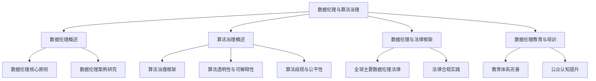

                 

# 数据伦理：算法治理与规范

## 关键词

- 数据伦理
- 算法治理
- 隐私保护
- 算法透明性
- 算法公平性
- 法律合规
- 教育培训

## 摘要

本文探讨了数据伦理在算法治理中的重要性，分析了数据伦理的基础原则、算法治理框架、数据伦理与法律的关联，以及数据伦理教育和培训的必要性。通过案例研究和项目实战，本文提供了对数据伦理现实挑战和应对策略的深入理解。文章旨在为读者提供关于数据伦理和算法治理的全面视角，以促进技术发展和人类福祉的和谐共存。

---

## 目录大纲

### 第一部分：数据伦理基础

#### 第1章：数据伦理概述
- 1.1 数据伦理的定义与意义
- 1.2 数据伦理的历史与发展
- 1.3 数据伦理的核心问题

#### 第2章：数据伦理的核心原则
- 2.1 尊重个人隐私
- 2.2 数据透明与责任
- 2.3 数据公正与平等

#### 第3章：数据伦理案例研究
- 3.1 数据滥用案例解析
- 3.2 数据歧视案例分析
- 3.3 数据伦理的挑战与应对策略

### 第二部分：算法治理

#### 第4章：算法治理的概念与框架
- 4.1 算法治理的定义与目的
- 4.2 算法治理的主要组成部分
- 4.3 算法治理的最佳实践

#### 第5章：算法透明性与可解释性
- 5.1 算法透明性的重要性
- 5.2 算法可解释性技术
- 5.3 算法透明性与可解释性的挑战

#### 第6章：算法歧视与公平性
- 6.1 算法歧视的识别与评估
- 6.2 算法公平性原则
- 6.3 算法公平性的实现策略

### 第三部分：数据伦理与法律

#### 第7章：数据伦理与法律框架
- 7.1 全球主要数据伦理与法律体系
- 7.2 欧盟《通用数据保护条例》（GDPR）
- 7.3 美国《加州消费者隐私法》（CCPA）

#### 第8章：数据伦理法律合规实践
- 8.1 数据合规流程
- 8.2 数据合规风险评估
- 8.3 数据合规案例解析

### 第四部分：数据伦理教育与培训

#### 第9章：数据伦理教育与培训的重要性
- 9.1 数据伦理教育的重要性
- 9.2 数据伦理培训的内容与形式
- 9.3 数据伦理教育与培训的实施策略

#### 第10章：数据伦理教育与培训案例
- 10.1 企业内部数据伦理培训案例
- 10.2 学术界数据伦理教育案例
- 10.3 社会力量推动的数据伦理教育案例

### 第五部分：未来展望

#### 第11章：数据伦理与人工智能发展
- 11.1 人工智能与数据伦理的关系
- 11.2 人工智能带来的数据伦理挑战
- 11.3 未来数据伦理的发展趋势

#### 第12章：数据伦理的未来之路
- 12.1 数据伦理的全球合作
- 12.2 数据伦理教育体系的完善
- 12.3 社会公众对数据伦理的认知提升

### 附录

- 附录 A：数据伦理相关法规与政策
- 附录 B：数据伦理相关工具与资源
- 附录 C：数据伦理与算法治理的 Mermaid 流程图
- 附录 D：数据伦理相关算法与数学模型伪代码示例
- 附录 E：数据伦理相关项目实战代码与分析

---

接下来，我们将逐步深入探讨数据伦理的基础原则、算法治理的重要性，以及数据伦理与法律的紧密联系，结合案例研究和实际项目实战，为读者提供全面的技术视角和分析思路。通过本文，希望读者能够更好地理解数据伦理的核心问题，并掌握有效的算法治理策略，为建设一个更加公正、透明和可持续的数字世界贡献力量。

---

## 第一部分：数据伦理基础

### 第1章：数据伦理概述

#### 1.1 数据伦理的定义与意义

数据伦理，是指在社会和技术的背景下，对数据收集、处理、存储和使用过程中涉及到的道德问题和伦理原则进行探讨和规范。随着大数据、人工智能和云计算等技术的迅猛发展，数据已经成为了现代社会的重要资源。然而，数据伦理问题也随之而来，如个人隐私保护、数据透明性、公平性和安全性等。这些问题不仅关系到个体的权益，还影响到社会的稳定和发展。

数据伦理的意义在于：

1. **维护个人隐私**：数据伦理强调个人隐私权的保护，防止数据滥用和泄露，确保个体信息的私密性。
2. **促进公平公正**：数据伦理关注数据在收集、处理和应用过程中的公平性，防止因数据歧视造成的不公正现象。
3. **保障社会信任**：数据伦理的规范化有助于增强社会对数据技术的信任，促进技术的健康发展。
4. **推动法治建设**：数据伦理的实践为法律制度的完善提供了依据，有助于构建更加健全的数据治理体系。

#### 1.2 数据伦理的历史与发展

数据伦理的概念虽然出现较晚，但其相关问题和讨论可以追溯到早期计算机科学的发展历程。例如，在20世纪60年代，计算机科学家和哲学家就已经开始探讨计算机技术在隐私保护和数据安全方面的问题。

进入21世纪，随着互联网和大数据技术的普及，数据伦理逐渐成为全球关注的焦点。以下是数据伦理发展的一些重要阶段：

1. **数据隐私保护立法**：1995年，欧盟颁布了《数据保护指令》，首次对个人数据的保护进行了立法规定。这一举措标志着数据伦理在全球范围内的制度化进程。
2. **大数据伦理研究**：随着大数据技术的兴起，学术界开始对大数据伦理问题进行深入探讨，如数据共享、隐私保护、算法公平性等。
3. **人工智能伦理**：人工智能技术的发展带来了新的伦理挑战，如算法歧视、透明性、责任归属等。国际社会对此进行了广泛讨论，并提出了相关的伦理框架和指南。
4. **全球合作与共识**：近年来，全球各国在数据伦理方面的合作日益加强，形成了多个国际组织和倡议，如联合国的“全球数据治理倡议”（GDGI）。

#### 1.3 数据伦理的核心问题

数据伦理的核心问题主要包括以下几个方面：

1. **隐私保护**：如何在数据收集、存储和处理过程中保护个人隐私，避免隐私泄露和数据滥用。
2. **透明性与责任**：如何确保数据的透明性，让数据的使用者了解数据的来源、用途和处理方式，并明确数据责任。
3. **公平与公正**：如何确保数据在收集、处理和应用过程中的公平性和公正性，防止因数据歧视造成的不公正现象。
4. **安全性与完整性**：如何保障数据的安全性，防止数据被非法访问、篡改和丢失，确保数据的完整性。
5. **数据共享与开放**：如何在保障隐私和安全的前提下，促进数据共享和开放，以推动技术创新和社会发展。

在下一章中，我们将深入探讨数据伦理的核心原则，分析这些原则在实际应用中的具体体现和挑战。

---

## 第一部分：数据伦理基础

### 第2章：数据伦理的核心原则

#### 2.1 尊重个人隐私

隐私是个人自由和尊严的重要组成部分，也是数据伦理的核心原则之一。尊重个人隐私意味着在数据收集、存储和使用过程中，必须保护个体的私密信息，防止未经授权的访问和泄露。

**隐私保护的重要性**：

1. **个人自由**：隐私权是个人自由的基本体现，保护隐私有助于维护个体的自主权和人格尊严。
2. **社会信任**：数据泄露和隐私滥用会损害社会对技术的信任，影响数据的合法收集和使用。
3. **法律合规**：许多国家和地区的法律都对隐私保护提出了明确要求，遵守隐私保护原则是企业的法律责任。

**隐私保护的关键措施**：

1. **数据匿名化**：通过技术手段对数据进行匿名化处理，以保护个人隐私。
2. **数据加密**：采用加密技术对敏感数据进行加密存储和传输，防止数据泄露。
3. **隐私政策与告知**：企业应当制定明确的隐私政策，向用户告知数据收集、存储和使用的情况，获取用户的知情同意。
4. **访问控制**：建立严格的访问控制机制，限制对个人数据的访问权限，确保数据的安全性。

**隐私保护面临的挑战**：

1. **技术复杂度**：随着数据技术的发展，隐私保护措施需要不断更新和改进，以应对新的威胁和挑战。
2. **隐私与数据利用的平衡**：在保障隐私的同时，如何合理利用数据以促进技术创新和社会发展是一个复杂的伦理问题。

**案例研究**：

- **Facebook数据泄露事件**：2018年，Facebook发生了史上最大的数据泄露事件，影响了超过8700万用户。事件曝光后，公众对数据隐私保护的担忧加剧，Facebook面临着严重的法律和商业风险。

#### 2.2 数据透明与责任

数据透明性是指数据收集、处理和使用过程中的各个环节对相关方都应当是可见和可追溯的。透明性有助于提高数据治理的公信力和数据的可信度，是数据伦理的重要组成部分。

**数据透明的重要性**：

1. **增强信任**：透明性有助于增强用户和社会对数据技术的信任，提高数据利用的合法性和合理性。
2. **监督与问责**：透明性使数据的使用过程受到公众和监管机构的监督，有助于提高数据处理的合规性和责任归属。
3. **创新与进步**：透明性可以促进技术创新和合作，有助于构建更加开放和共享的数据生态系统。

**数据责任的主要方面**：

1. **数据责任主体**：数据责任主体包括数据的收集者、处理者、存储者和使用者，各方在数据处理过程中都应当承担相应的责任。
2. **数据责任落实**：数据责任应当通过法律法规、企业政策和自律机制得到具体落实，确保数据处理的合法性和安全性。
3. **数据责任追究**：对于违反数据伦理原则和数据法律法规的行为，应当依法追究责任，以维护数据伦理的严肃性和权威性。

**数据透明与责任的实现策略**：

1. **透明度报告**：企业应当定期发布透明度报告，披露数据的收集、处理和使用情况，提高数据的透明度和公开性。
2. **责任追究机制**：建立明确的责任追究机制，对于数据泄露、滥用等违规行为进行严肃处理。
3. **用户参与**：鼓励用户参与数据治理，通过用户反馈机制提高数据的透明度和公信力。

**透明性与责任面临的挑战**：

1. **隐私保护与透明性的平衡**：在保障隐私的前提下实现数据透明是一个巨大的挑战，需要平衡隐私保护与数据利用的矛盾。
2. **技术实现难度**：数据透明性的实现需要先进的技术支持和复杂的系统架构，对企业和技术提出了较高的要求。

**案例研究**：

- **谷歌透明度报告**：谷歌定期发布透明度报告，披露其全球范围内的数据请求和用户投诉情况。这一做法不仅提高了谷歌的数据透明度，也增强了公众对谷歌数据治理的信任。

#### 2.3 数据公正与平等

数据公正与平等是指数据在收集、处理和应用过程中应当确保公正和无偏见，避免因数据歧视和偏见造成的不公正现象。

**数据公正与平等的重要性**：

1. **社会公平**：数据公正与平等是维护社会公平的重要保障，有助于消除社会不平等和歧视现象。
2. **算法公平性**：算法的公正性和平等性是人工智能技术发展的重要基础，算法偏见可能导致不公平的结果。
3. **技术信任**：数据公正与平等有助于增强社会对数据技术的信任，促进技术的健康发展。

**数据公正与平等的主要挑战**：

1. **数据偏见**：数据本身可能存在偏见，如历史数据的偏见、样本选择偏差等，这些偏见可能被算法放大。
2. **算法歧视**：算法设计和训练过程中可能引入歧视因素，导致算法对某些群体不公平对待。
3. **文化差异**：不同文化和地区对数据的理解和使用方式不同，数据公正与平等需要考虑到这些差异。

**实现数据公正与平等的措施**：

1. **数据清洗与平衡**：在数据处理过程中，对数据偏见进行识别和纠正，提高数据的均衡性和公正性。
2. **算法公平性检测**：建立算法公平性检测机制，评估算法对各个群体的公平性，确保算法结果的公正性。
3. **多元参与**：在数据收集和处理过程中，鼓励多元参与，确保数据的代表性和公平性。

**案例研究**：

- **亚马逊性别歧视招聘算法**：2018年，亚马逊被曝光其招聘算法存在性别歧视，对女性求职者不公平对待。这一事件引起了广泛的社会关注，促使企业和组织重新审视算法的公平性和透明性。

在下一章中，我们将通过具体的案例研究，分析数据伦理在实际应用中面临的挑战和应对策略，以及算法治理在数据伦理中的重要作用。

---

## 第一部分：数据伦理基础

### 第3章：数据伦理案例研究

#### 3.1 数据滥用案例解析

数据滥用是指未经授权或违反法律规定，将个人数据进行不当使用或泄露的行为。以下是一些典型的数据滥用案例，以及它们的后果和教训。

**案例1：Equifax数据泄露事件**

**事件背景**：2017年，美国信用报告机构Equifax发生了一次重大数据泄露事件，影响了大约1.43亿美国用户的个人信息。泄露的数据包括姓名、社会保障号码、出生日期、地址、驾驶证号码等敏感信息。

**后果**：Equifax事件引发了广泛的社会关注和恐慌，大量用户担心个人信息被盗用。事件曝光后，Equifax面临了巨额罚款和赔偿要求，公司股价大幅下跌，CEO被迫辞职。

**教训**：数据滥用事件的后果是严重的，不仅损害了企业的声誉和利益，也严重影响了用户的隐私和安全。这一案例提醒企业和组织，必须加强数据安全防护，确保用户数据的合法、合理使用。

**案例2：Facebook数据泄露事件**

**事件背景**：2018年，Facebook发生了史上最大规模的数据泄露事件，涉及8700万用户的信息。泄露的信息被第三方应用程序Cambridge Analytica滥用，用于政治竞选广告和用户心理分析。

**后果**：Facebook事件引发了全球范围内的强烈抗议和批评，公司面临大量的法律诉讼和监管压力。事件还导致Facebook创始人马克·扎克伯格在国会作证，引发了关于数据隐私保护的广泛讨论。

**教训**：数据滥用不仅损害了用户的信任，也对企业的长期发展构成了威胁。企业需要建立透明、公正的数据管理机制，确保用户数据不被滥用，同时加强数据合规性和透明度。

#### 3.2 数据歧视案例分析

数据歧视是指通过数据分析或算法，对某些群体进行不公平对待，加剧社会不平等现象。以下是一些典型的数据歧视案例。

**案例1：亚马逊性别歧视招聘算法**

**事件背景**：2018年，亚马逊被曝其招聘算法存在性别歧视问题，拒绝了许多女性求职者，同时优先考虑男性求职者。

**后果**：亚马逊被迫重新审视其招聘算法，修改了相关算法，并进行了内部调查。此外，公司还面临了来自公众和监管机构的压力。

**教训**：数据歧视问题不仅违反了法律和伦理，还会损害企业的声誉和形象。企业和组织需要确保算法的公正性和透明性，避免数据歧视现象的发生。

**案例2：Google搜索偏见**

**事件背景**：Google搜索结果存在种族歧视偏见，对黑人、亚裔等少数群体进行不公平对待。

**后果**：Google受到了来自公众和媒体的广泛批评，被迫采取措施改善搜索算法，减少偏见。

**教训**：算法的偏见和歧视问题不容忽视。企业和组织在开发和使用算法时，需要确保算法的公正性和公平性，避免对特定群体进行歧视。

#### 3.3 数据伦理的挑战与应对策略

随着数据技术的快速发展，数据伦理面临着越来越多的挑战。以下是一些主要的数据伦理挑战及其应对策略。

**隐私保护与透明性的平衡**

**挑战**：在保障用户隐私的同时，如何提高数据透明度，满足公众对信息知情的需求。

**策略**：企业可以通过以下措施实现平衡：

- **隐私政策**：制定明确的隐私政策，向用户告知数据的收集、存储和使用情况。
- **透明度报告**：定期发布透明度报告，披露数据处理的细节和结果。
- **用户授权**：在数据收集和使用前，获取用户的明确授权。

**数据歧视与公平性**

**挑战**：如何在数据收集、处理和应用过程中确保公平性，避免数据歧视。

**策略**：企业可以通过以下措施应对挑战：

- **算法公平性检测**：建立算法公平性检测机制，评估算法对各个群体的公平性。
- **多元参与**：在数据收集和处理过程中，鼓励多元参与，确保数据的代表性和公平性。
- **数据清洗与平衡**：对数据偏见进行识别和纠正，提高数据的均衡性和公正性。

**数据安全与完整性**

**挑战**：如何保障数据的安全性，防止数据泄露、篡改和丢失。

**策略**：企业可以通过以下措施保障数据安全：

- **数据加密**：采用加密技术对敏感数据进行加密存储和传输。
- **访问控制**：建立严格的访问控制机制，限制对个人数据的访问权限。
- **数据备份与恢复**：定期备份数据，确保数据在灾难情况下能够快速恢复。

**全球数据治理与合作**

**挑战**：不同国家和地区在数据伦理方面的法律法规和标准不同，如何实现全球数据治理与合作。

**策略**：企业可以通过以下措施实现全球数据治理：

- **合规评估**：评估全球范围内的数据法律法规，确保企业遵守各地的数据合规要求。
- **国际合作**：参与国际数据治理合作，推动全球数据伦理标准的制定和实施。
- **本地化策略**：根据不同国家和地区的数据伦理要求，制定相应的本地化数据管理策略。

通过以上案例研究和应对策略，我们可以看到数据伦理在现代社会中的重要性。企业和组织必须高度重视数据伦理问题，建立健全的数据治理机制，确保数据的合法、合理和公平使用，为构建一个更加公正、透明和可持续的数字世界贡献力量。

---

## 第二部分：算法治理

### 第4章：算法治理的概念与框架

#### 4.1 算法治理的定义与目的

算法治理是指通过一系列的制度、规则和机制，对算法的设计、开发、部署和应用过程进行监管和规范，以确保算法的透明性、公平性、安全性和合规性。算法治理的目的是实现算法的负责任使用，促进技术的健康发展，保障社会公众的福祉。

**算法治理的主要任务**：

1. **透明性与可解释性**：确保算法的运作过程和决策逻辑对相关方（如用户、监管机构、利益相关者）是透明的，以便进行监督和评估。
2. **公平性**：防止算法歧视，确保算法在处理数据和应用过程中对各个群体公平对待。
3. **安全性**：保障算法系统的稳定运行，防止恶意攻击和错误决策。
4. **合规性**：确保算法的应用符合相关法律法规和道德规范，避免法律和伦理风险。

**算法治理的重要性**：

1. **社会信任**：算法治理有助于提高社会对技术的信任，促进技术的广泛应用。
2. **技术创新**：良好的算法治理环境能够激发技术创新，推动技术进步。
3. **责任归属**：明确算法责任主体，有助于在算法故障或不当行为时追究责任。
4. **风险管理**：通过算法治理，企业能够有效识别和管理算法风险，降低潜在的法律和商业风险。

#### 4.2 算法治理的主要组成部分

算法治理涉及多个方面的组成部分，包括法律法规、组织架构、技术标准、伦理规范和监管机制等。

**法律法规**：

法律法规是算法治理的基础，为算法的开发和应用提供了法律框架和合规要求。例如，欧盟的《通用数据保护条例》（GDPR）和美国《加州消费者隐私法》（CCPA）都对算法治理提出了明确的要求。

**组织架构**：

企业应建立专门的算法治理组织架构，包括算法治理委员会、算法伦理审查委员会等，负责算法的制定、审查和监督。此外，企业还应当设立数据保护官（DPO）等岗位，负责数据隐私和安全方面的具体工作。

**技术标准**：

技术标准是算法治理的重要依据，包括算法的设计、开发、测试、部署和维护等环节。例如，ISO/IEC 27001标准提供了信息安全管理的全面指导，有助于保障算法系统的安全性。

**伦理规范**：

伦理规范是算法治理的道德指南，指导算法的开发和应用遵循伦理原则。例如，IEEE的《人工智能伦理指南》为人工智能算法的伦理设计提供了参考。

**监管机制**：

监管机制是算法治理的关键组成部分，通过立法、执法和司法等手段，确保算法的合法合规使用。政府机构和专业组织应建立有效的监管机制，对算法进行定期审查和监督。

#### 4.3 算法治理的最佳实践

为了实现有效的算法治理，企业可以参考以下最佳实践：

1. **建立算法治理框架**：明确算法治理的组织架构、职责分工和运行机制，确保算法治理的有序进行。
2. **进行算法风险评估**：在算法开发和应用前，进行全面的风险评估，识别潜在的伦理、法律和技术风险。
3. **开展算法伦理审查**：建立算法伦理审查机制，对算法的公平性、透明性和安全性进行审查，确保符合伦理标准和法律法规。
4. **加强数据隐私保护**：严格遵循数据隐私保护规定，确保用户数据的安全和隐私。
5. **建立用户反馈机制**：鼓励用户对算法的使用效果和伦理问题进行反馈，及时改进算法和治理措施。
6. **进行定期审计与评估**：定期对算法治理的效果进行审计和评估，及时发现和解决潜在问题。
7. **培训与教育**：加强对算法伦理和治理的培训和教育，提高相关人员的专业素养和责任意识。

在下一章中，我们将探讨算法透明性与可解释性的重要性，分析实现算法透明性和可解释性的技术方法，并讨论面临的挑战。

---

## 第二部分：算法治理

### 第5章：算法透明性与可解释性

#### 5.1 算法透明性的重要性

算法透明性是指算法的设计、实现和运行过程能够被相关方（如开发者、用户、监管机构等）理解和审查。算法透明性的重要性体现在以下几个方面：

1. **增强信任**：透明性有助于增强用户和社会对算法的信任，提高算法的接受度和使用频率。
2. **监督与问责**：透明性使算法的运作过程和决策逻辑能够被监督，有助于在算法出现问题时进行问责和纠正。
3. **促进技术创新**：透明性可以激发更多的技术创新，促进算法的优化和改进。
4. **保障公平性**：透明性有助于发现和纠正算法中的偏见和歧视，保障算法的公平性和公正性。
5. **满足法律法规要求**：许多国家和地区都要求算法必须具备一定程度的透明性，以满足法律法规的要求。

#### 5.2 算法可解释性技术

算法可解释性是指算法的决策过程和结果能够被解释和验证，使非专业人士也能够理解算法的工作原理。实现算法可解释性的技术方法主要包括以下几种：

1. **模型可解释性**：通过简化算法模型，使其更容易理解和解释。例如，使用决策树、规则基模型等相对简单的模型，可以直观地展示算法的决策过程。
2. **可视化技术**：使用可视化工具将算法的决策过程和结果以图形或图表的形式展示，使非专业人士能够直观地理解算法的工作原理。
3. **解释性算法**：开发专门的可解释性算法，如LIME（Local Interpretable Model-agnostic Explanations）、SHAP（SHapley Additive exPlanations）等，这些算法能够生成对算法决策的解释。
4. **对算法的二次分析**：对算法的输出进行二次分析，提取关键特征和决策逻辑，以帮助用户理解算法的决策过程。

#### 5.3 算法透明性与可解释性的挑战

尽管算法透明性和可解释性具有重要意义，但在实现过程中仍面临许多挑战：

1. **技术复杂性**：许多先进的算法（如深度学习模型）本身就很复杂，实现透明性和可解释性需要大量的技术投入和时间。
2. **解释性损失**：在追求算法性能的同时，增加算法的透明性和可解释性可能会导致解释性的损失，降低算法的预测准确性。
3. **隐私保护**：在实现透明性和可解释性的过程中，可能需要披露敏感数据或算法细节，这可能会对隐私保护产生负面影响。
4. **法规和标准**：目前缺乏统一的算法透明性和可解释性标准和法规，这给企业和组织在实现算法透明性和可解释性时带来了困难。

#### 5.4 实现算法透明性与可解释性的最佳实践

为了实现有效的算法透明性和可解释性，企业可以参考以下最佳实践：

1. **制定透明性和可解释性策略**：明确算法透明性和可解释性的目标和要求，将其纳入算法开发、测试和部署的全过程。
2. **选择合适的算法和模型**：在选择算法和模型时，考虑其透明性和可解释性，优先选择相对简单、易于解释的模型。
3. **开发可视化工具**：开发和部署可视化工具，将算法的决策过程和结果以直观、易懂的方式展示给用户。
4. **进行解释性分析**：对算法的输出进行解释性分析，提取关键特征和决策逻辑，帮助用户理解算法的决策过程。
5. **持续改进**：定期评估算法的透明性和可解释性，根据反馈进行改进和优化。
6. **遵守法律法规**：确保算法的透明性和可解释性符合相关法律法规的要求，避免法律风险。

在下一章中，我们将探讨算法歧视与公平性的问题，分析算法歧视的识别与评估方法，并讨论实现算法公平性的策略。

---

## 第二部分：算法治理

### 第6章：算法歧视与公平性

#### 6.1 算法歧视的识别与评估

算法歧视是指算法在数据处理和应用过程中，对某些群体（如种族、性别、年龄等）产生不公平对待，导致不公正的结果。算法歧视的识别与评估是算法治理的重要任务之一。

**算法歧视的识别方法**：

1. **敏感性分析**：通过对比不同群体在算法处理中的表现，识别潜在的歧视行为。例如，通过比较不同性别、种族或年龄群体的贷款批准率或薪资水平。
2. **统计测试**：使用统计方法（如T检验、卡方检验等）评估算法对各个群体的差异是否显著。如果差异显著，可能表明算法存在歧视。
3. **反事实分析**：通过模拟不同的数据输入，比较算法在不同输入条件下的输出结果，评估算法的稳定性和公平性。
4. **代理变量分析**：通过引入代理变量（如教育程度、家庭背景等），评估算法对代理变量的依赖程度，从而识别潜在的歧视因素。

**算法歧视的评估指标**：

1. **公平性指标**：例如，比例公平性（Equal Opportunity）、公平指数（Fairness Index）等，用于评估算法对各个群体的公平性。
2. **偏差指标**：例如，偏差率（Bias Rate）、偏差差异（Bias Difference）等，用于衡量算法在不同群体之间的差异。
3. **鲁棒性指标**：评估算法对数据输入变化的敏感程度，以确保算法在不同条件下都能保持公平性。

**算法歧视的评估流程**：

1. **数据预处理**：对原始数据进行清洗、归一化和标准化处理，确保数据的质量和一致性。
2. **模型训练**：使用训练数据集训练算法模型，确保模型具有良好的预测性能。
3. **评估指标计算**：使用评估指标对训练好的模型进行评估，识别潜在的歧视行为。
4. **调整和优化**：根据评估结果，对算法进行优化和调整，减少歧视的影响。
5. **迭代评估**：持续对算法进行评估和优化，确保算法的公平性和公正性。

#### 6.2 算法公平性原则

算法公平性是指算法在数据处理和应用过程中，对各个群体公平对待，避免产生歧视和不公正的结果。算法公平性原则包括以下几个方面：

1. **无偏见原则**：算法不应基于种族、性别、年龄、宗教信仰等敏感特征进行决策，避免对特定群体的偏见。
2. **平等机会原则**：算法应确保各个群体在决策过程中享有平等的机会，避免因数据或算法问题导致的歧视。
3. **透明性原则**：算法的决策过程和结果应对相关方透明，便于监督和评估。
4. **责任原则**：算法的设计、开发和部署应明确责任主体，确保在出现歧视或不当行为时能够依法追究责任。

#### 6.3 算法公平性的实现策略

为了实现算法的公平性，企业和组织可以采取以下策略：

1. **数据多样性**：确保数据的多样性和代表性，避免因数据偏见导致算法歧视。
2. **算法训练与验证**：在算法训练和验证过程中，使用多样化的数据集，避免数据集的偏见和失衡。
3. **公平性评估**：定期对算法进行公平性评估，使用评估指标识别和纠正潜在的歧视行为。
4. **算法优化**：通过算法优化，提高算法的公平性和公正性，减少偏见的影响。
5. **法律法规合规**：遵守相关法律法规，确保算法的公平性和公正性，避免法律风险。
6. **用户反馈**：鼓励用户对算法的使用效果进行反馈，及时发现和纠正潜在的问题。
7. **持续改进**：持续跟踪和改进算法的公平性，确保算法在长期应用中保持公平性和公正性。

通过上述识别与评估方法、公平性原则和实现策略，企业和组织可以有效地管理算法歧视问题，提升算法的公平性和公正性，为构建一个更加平等和公正的数字世界贡献力量。

---

## 第三部分：数据伦理与法律

### 第7章：数据伦理与法律框架

#### 7.1 全球主要数据伦理与法律体系

随着数据技术的发展，全球各地纷纷建立了各自的数据伦理与法律体系，以规范数据收集、处理、存储和使用的过程，保护个人隐私和促进数据技术的健康发展。以下是一些主要国家和地区的数据伦理与法律体系：

**欧盟《通用数据保护条例》（GDPR）**

欧盟的《通用数据保护条例》（GDPR）是当前全球最具影响力的数据保护法规之一。GDPR于2018年5月25日正式生效，对欧盟境内所有组织和个人数据处理活动进行了全面规范。GDPR的核心原则包括：

- **合法性、公平性和透明性**：数据处理必须合法、公正和透明，用户有知情权和获取权。
- **数据最小化**：仅收集为实现特定目的所必需的数据，不得过度收集。
- **目的限定**：数据收集和处理的目的必须明确且合法，不得滥用。
- **数据保密性**：采取技术和管理措施保护数据安全，防止数据泄露、破坏和丢失。
- **用户权利**：用户有权访问、更正、删除其数据，甚至有权反对数据处理。

**美国《加州消费者隐私法》（CCPA）**

美国的《加州消费者隐私法》（CCPA）于2020年1月1日正式生效，是全美首个综合性消费者隐私法规。CCPA旨在赋予加州居民对其个人信息的更多控制权，主要内容包括：

- **知情权**：企业必须向消费者告知其收集、使用和共享个人信息的类型和目的。
- **访问权和删除权**：消费者有权访问其个人信息，并要求企业删除其个人信息。
- **不歧视**：企业不得因消费者行使其隐私权利而进行歧视性对待。
- **透明性和问责**：企业必须建立透明的数据处理流程，并明确责任主体。

**中国《个人信息保护法》（PIPL）**

中国的《个人信息保护法》（PIPL）于2021年11月1日正式施行，是中国首部全面规范个人信息保护的基本法律。PIPL的核心原则包括：

- **合法性、正当性和必要性**：个人信息处理活动必须合法、正当且必要。
- **公开透明**：企业应公开个人信息处理规则，确保透明。
- **个人同意**：个人信息处理必须获得个人同意，并告知处理方式和范围。
- **保护权益**：企业应采取措施保护个人信息安全，防止泄露和滥用。

**日本《个人信息保护法》（APPI）**

日本的《个人信息保护法》（APPI）自2005年施行以来，对个人信息保护进行了全面规范。APPI的主要内容包括：

- **个人信息处理原则**：企业处理个人信息时必须遵循合法、公正、透明的原则。
- **个人信息保护责任**：企业需设立个人信息保护管理组织，制定个人信息保护计划。
- **个人信息安全管理**：企业应采取必要的安全措施，防止个人信息泄露、破坏和丢失。

**澳大利亚《隐私法》（APP）**

澳大利亚的《隐私法》（APP）于2020年修订，对个人信息保护进行了全面规范。APP的核心原则包括：

- **知情同意**：企业处理个人信息时必须取得个人同意。
- **个人信息保护**：企业应采取必要措施保护个人信息，防止未经授权的访问和使用。
- **用户权利**：个人有权访问、更正和删除其个人信息。

#### 7.2 欧盟《通用数据保护条例》（GDPR）

欧盟的《通用数据保护条例》（GDPR）是全球数据保护领域的里程碑，其影响力和实施范围都非常广泛。以下是对GDPR的详细解读：

**GDPR的核心原则**

- **合法性原则**：数据收集和处理必须合法、公正和透明，确保数据主体的知情权和选择权。
- **数据最小化原则**：仅收集为实现特定目的所必需的数据，不得过度收集。
- **目的限定原则**：数据收集和处理的目的必须明确且合法，不得滥用。
- **数据保密性原则**：采取技术和管理措施保护数据安全，防止数据泄露、破坏和丢失。
- **数据完整性原则**：确保数据的准确性、完整性和更新。

**GDPR的主要要求**

1. **数据保护官（DPO）**：企业需设立数据保护官，负责监督和指导数据保护工作。
2. **数据泄露通知**：发生数据泄露事件时，企业需在72小时内通知监管机构和受影响的个人。
3. **用户权利**：用户有权访问、更正、删除其数据，甚至有权反对数据处理。
4. **数据跨境传输**：在跨境传输数据时，必须遵守GDPR的规定，确保数据保护水平不低于接收国。
5. **数据隐私保护措施**：企业需采取适当的技术和管理措施，保护数据安全。

**GDPR的合规成本**

GDPR的实施对企业和组织带来了较高的合规成本。主要成本包括：

1. **人力资源投入**：设立数据保护官和内部数据保护团队，进行数据保护培训和管理。
2. **技术投入**：升级数据安全措施，如加密技术、访问控制、审计日志等。
3. **合规评估和咨询**：聘请专业的法律和咨询机构，进行合规评估和咨询。
4. **数据保护计划**：制定和实施全面的数据保护计划，确保数据保护措施的落实。

#### 7.3 美国《加州消费者隐私法》（CCPA）

美国的《加州消费者隐私法》（CCPA）旨在赋予加州居民对其个人信息的更多控制权，是全球首个综合性消费者隐私法规。以下是对CCPA的详细解读：

**CCPA的核心原则**

- **知情权**：企业必须向消费者告知其收集、使用和共享个人信息的类型和目的。
- **访问权和删除权**：消费者有权访问其个人信息，并要求企业删除其个人信息。
- **不歧视**：企业不得因消费者行使其隐私权利而进行歧视性对待。
- **透明性和问责**：企业必须建立透明的数据处理流程，并明确责任主体。

**CCPA的主要要求**

1. **消费者权益**：消费者有权了解其个人信息的使用情况，并有权要求企业删除其个人信息。
2. **披露义务**：企业需在网站或应用程序上披露其个人信息的收集、使用和共享方式。
3. **数据安全措施**：企业需采取必要的安全措施，防止个人信息泄露、破坏和丢失。
4. **合规评估和审计**：企业需定期评估和审计其数据处理活动，确保符合CCPA的要求。

**CCPA的适用范围**

CCPA适用于在加州经营业务、收集或处理加州居民个人信息的公司，无论公司所在地是否在加州。以下条件满足其一，即需遵守CCPA：

1. **年营业收入超过2500万美元**。
2. **每年从加州居民处收集至少5000万美金的价值信息**。
3. **每年处理超过1000万加州居民的个人信息**。

**CCPA的合规成本**

CCPA的实施对企业和组织也带来了较高的合规成本。主要成本包括：

1. **合规培训**：对员工进行隐私保护和合规培训。
2. **披露义务实现**：在网站或应用程序上披露个人信息的收集、使用和共享方式。
3. **数据保护措施**：升级数据安全措施，如加密技术、访问控制等。
4. **法律和咨询**：聘请专业的法律和咨询机构，进行合规评估和咨询。

通过全球主要数据伦理与法律体系的介绍，以及欧盟《通用数据保护条例》和《加州消费者隐私法》的详细解读，我们可以看到数据伦理与法律在数据治理中的重要作用。在下一章中，我们将探讨数据伦理法律合规实践的具体流程、风险管理和案例解析，帮助企业更好地应对数据伦理法律挑战。

---

## 第三部分：数据伦理与法律

### 第8章：数据伦理法律合规实践

#### 8.1 数据合规流程

为了确保数据处理的合法性和合规性，企业需要建立一套完整的数据合规流程。以下是数据合规流程的主要步骤：

**1. 风险评估**：在数据处理活动开始之前，对数据保护风险进行全面评估，包括数据收集、存储、处理和传输等环节。评估内容包括数据的类型、数量、来源、用途、存储位置以及可能涉及的法律和伦理问题。

**2. 合规政策制定**：根据风险评估结果，制定数据合规政策，明确数据处理的目标、原则、责任分工和具体措施。合规政策应涵盖数据收集、存储、处理、共享、传输和销毁的全过程。

**3. 合规培训**：对员工进行数据合规培训，使其了解数据合规的重要性以及具体的合规要求。培训内容应包括法律法规、合规政策、数据保护技术和管理措施等。

**4. 数据保护技术和管理措施**：实施必要的技术和管理措施，确保数据保护要求的落实。技术措施包括数据加密、访问控制、审计日志、数据备份和恢复等；管理措施包括数据分类、权限管理、数据安全策略制定和定期审查等。

**5. 数据合规审计**：定期对数据处理活动进行审计，确保合规政策的执行情况。审计内容应包括数据处理流程、数据安全措施、员工行为和合规记录等。

**6. 持续改进**：根据审计结果和外部监管要求，持续改进数据合规措施，确保数据处理的合法性和合规性。

#### 8.2 数据合规风险评估

数据合规风险评估是确保数据处理合法性和合规性的关键步骤。以下是数据合规风险评估的主要方法：

**1. 法律合规性评估**：评估数据处理活动是否符合相关法律法规的要求，包括数据收集、存储、处理、传输和销毁等环节。关注法律法规的最新动态，确保合规政策的及时更新。

**2. 风险识别**：识别数据处理过程中可能存在的风险，包括数据泄露、数据滥用、数据误用、数据丢失等。通过问卷调查、访谈、流程图分析等方式收集风险信息。

**3. 风险评估**：评估识别到的风险的可能性和影响，确定风险的优先级。采用定性分析和定量分析方法，如风险矩阵、预期损失计算等。

**4. 风险缓解**：根据风险评估结果，制定风险缓解措施，包括风险规避、风险降低、风险转移等。针对高风险，采取更加严格的安全措施和管理措施。

**5. 风险监控**：建立风险监控机制，定期评估风险缓解措施的效果，及时调整和优化风险缓解策略。

#### 8.3 数据合规案例解析

以下是一个数据合规案例，展示如何在实际操作中实现数据合规：

**案例背景**：一家全球知名的互联网公司计划开发一款在线教育平台，涉及大量用户的个人信息收集和处理。为保障数据处理的合法性和合规性，公司进行了以下步骤：

**1. 风险评估**：公司对在线教育平台的数据处理活动进行了全面的风险评估，识别出以下风险点：

- **数据泄露**：用户个人信息可能因黑客攻击、数据泄露事件而泄露。
- **数据滥用**：内部员工可能滥用用户个人信息。
- **数据误用**：用户个人信息可能因错误处理或不当使用而造成损害。

**2. 合规政策制定**：公司根据风险评估结果，制定了详细的数据合规政策，包括数据收集、存储、处理、传输和销毁的全过程。

- **数据收集**：明确数据收集的目的、范围和方式，仅收集为实现在线教育服务所必需的数据。
- **数据存储**：使用加密技术存储用户个人信息，确保数据安全。
- **数据处理**：明确规定数据处理的原则、权限和流程，确保数据处理符合法律法规和公司政策。
- **数据传输**：采用安全传输协议，确保数据在传输过程中不被窃取或篡改。
- **数据销毁**：明确规定数据销毁的流程和标准，确保数据在停止使用后得到及时、彻底的销毁。

**3. 合规培训**：对公司员工进行数据合规培训，使其了解数据合规的重要性以及具体的合规要求。

**4. 数据保护技术和管理措施**：公司采取了一系列数据保护技术和管理措施，包括：

- **数据加密**：使用AES-256加密技术对用户个人信息进行加密存储和传输。
- **访问控制**：建立严格的访问控制机制，限制对用户个人信息的访问权限。
- **审计日志**：记录用户信息的访问、查询和操作记录，便于审计和追溯。
- **数据备份与恢复**：定期备份数据，确保数据在灾难情况下能够快速恢复。

**5. 数据合规审计**：公司定期对数据处理活动进行审计，确保合规政策的执行情况。审计内容包括数据处理流程、数据安全措施、员工行为和合规记录等。

**6. 持续改进**：根据审计结果和外部监管要求，公司持续改进数据合规措施，确保数据处理的合法性和合规性。

通过以上数据合规案例，我们可以看到企业在数据处理过程中如何实现合法性和合规性，从而保护用户隐私和权益。

在下一章中，我们将探讨数据伦理教育与培训的重要性，分析如何开展数据伦理教育与培训，并结合实际案例，探讨教育与实践的结合方式。

---

## 第四部分：数据伦理教育与培训

### 第9章：数据伦理教育与培训的重要性

#### 9.1 数据伦理教育的重要性

数据伦理教育是指通过系统的课程和培训，提高人们在数据收集、处理、存储和使用过程中的道德素养和责任感。随着数据技术的飞速发展，数据伦理教育的重要性日益凸显。

**数据伦理教育的重要性体现在以下几个方面**：

1. **提升道德素养**：数据伦理教育能够培养人们的道德判断能力和责任感，使其在数据处理过程中自觉遵循伦理原则，避免道德风险。

2. **促进合规性**：通过数据伦理教育，员工能够更好地理解相关法律法规和伦理规范，确保数据处理活动符合法律和道德要求，降低合规风险。

3. **增强社会信任**：数据伦理教育有助于提高社会对数据技术的信任度，促进技术的健康发展，减少社会矛盾和冲突。

4. **预防数据滥用**：数据伦理教育能够提高人们对数据滥用的警觉性，防止因缺乏道德约束而导致的隐私侵犯和数据滥用行为。

5. **推动技术创新**：数据伦理教育能够激发员工的创新思维，使其在技术开发过程中充分考虑伦理和社会影响，促进技术的可持续发展。

#### 9.2 数据伦理培训的内容与形式

数据伦理培训的内容应当全面覆盖数据伦理的核心原则、法律法规、案例分析和技术实践等方面。以下是数据伦理培训的主要内容：

**1. 数据伦理核心原则**：培训内容包括尊重隐私、数据透明性、责任、公正与平等、安全与完整性等。

**2. 法律法规**：培训内容应涵盖全球主要国家和地区的数据保护法律，如GDPR、CCPA、PIPL等，以及相关法律法规的最新动态。

**3. 案例分析**：通过分析真实案例，培训参与者能够更好地理解数据伦理问题在实际中的应用和影响。

**4. 技术实践**：培训内容应包括数据保护技术、算法公平性检测、数据加密、访问控制等，以帮助员工在实际工作中应用所学知识。

数据伦理培训的形式可以多样化，包括以下几种：

**1. 在职培训**：通过内部培训课程、研讨会和讲座等形式，提高员工的伦理意识和合规能力。

**2. 线上课程**：利用在线学习平台，提供灵活的学习方式和丰富的培训资源，满足不同员工的学习需求。

**3. 外部培训**：与专业培训机构合作，邀请数据伦理领域的专家进行授课，提升培训的专业性和权威性。

**4. 在职指导**：通过导师制或小组讨论等形式，帮助员工在实际工作中应用所学知识，解决实际问题。

#### 9.3 数据伦理教育与培训的实施策略

为了有效实施数据伦理教育与培训，企业可以采取以下策略：

**1. 设立数据伦理教育委员会**：成立专门的数据伦理教育委员会，负责制定数据伦理教育和培训的规划、内容、形式和评估。

**2. 制定数据伦理教育规划**：根据企业的业务特点和需求，制定系统的数据伦理教育规划，明确培训目标、内容、时间和方式。

**3. 建立培训资源库**：收集和整理数据伦理相关的教材、案例、视频和在线课程，建立丰富的培训资源库，方便员工学习和参考。

**4. 强化培训效果评估**：通过考试、案例分析、项目实践等形式，评估员工的培训效果，确保培训目标的实现。

**5. 融入日常管理**：将数据伦理教育和培训融入企业的日常管理活动中，如项目管理、产品开发、用户反馈等，确保数据伦理教育的持续性和实效性。

**6. 鼓励外部合作**：与企业、学术界和行业协会等外部机构合作，共同推进数据伦理教育和培训，共享资源和经验。

在下一章中，我们将结合实际案例，探讨数据伦理教育与培训的实施效果，以及如何将理论与实践相结合，提升数据伦理教育的效果。

---

### 第10章：数据伦理教育与培训案例

#### 10.1 企业内部数据伦理培训案例

**案例背景**：某大型互联网公司，在业务快速增长的同时，意识到数据伦理的重要性，决定在公司内部开展系统化的数据伦理教育与培训。

**培训内容**：

1. **数据伦理基础课程**：涵盖数据伦理的定义、原则、法律法规以及数据保护技术的应用。

2. **案例分析**：通过分析公司内部和外部的数据伦理案例，如Facebook数据泄露事件、谷歌搜索偏见等，让员工深入了解数据伦理问题的现实影响。

3. **实践工作坊**：组织小组讨论和模拟情景，让员工在真实环境中应用数据伦理原则，解决问题。

**实施过程**：

1. **制定培训计划**：根据业务需求，设计包括基础课程、进阶课程和实践工作坊的培训计划。

2. **开展培训**：邀请外部专家进行授课，同时内部员工也参与其中，分享经验和案例。

3. **考核与反馈**：通过在线考试和实践活动，评估员工的学习效果，收集反馈意见，持续改进培训内容。

**效果评估**：

1. **员工满意度**：通过问卷调查，发现员工对数据伦理培训的满意度显著提高。

2. **合规性提升**：培训后，公司在数据处理过程中的合规性显著提升，数据泄露事件减少。

3. **业务发展**：数据伦理教育与培训有助于公司建立负责任的数据文化，增强客户信任，促进业务发展。

#### 10.2 学术界数据伦理教育案例

**案例背景**：某知名大学计算机学院，意识到数据伦理教育对于未来科技人才的重要性，决定将其纳入计算机科学课程体系。

**培训内容**：

1. **数据伦理导论**：介绍数据伦理的基本概念、原则和案例。

2. **数据保护与隐私**：教授数据保护技术、隐私保护法律和隐私政策制定。

3. **算法公平性与歧视**：分析算法歧视问题，探讨算法公平性的检测与改进方法。

**实施过程**：

1. **课程设计**：将数据伦理内容纳入计算机科学基础课程和专业课程，确保学生在学习专业知识的同时，了解数据伦理的重要性。

2. **实践项目**：通过项目实践，让学生在实际场景中应用数据伦理原则，如设计一个符合伦理标准的在线问卷系统。

3. **学术研讨**：组织数据伦理相关的学术研讨会，邀请专家学者分享最新研究成果，促进学生与学者的互动。

**效果评估**：

1. **学术成果**：学生在数据伦理相关课题上的研究成果显著提高，多篇论文发表在顶级学术期刊上。

2. **就业竞争力**：毕业生在求职过程中，因具备良好的数据伦理素养，受到用人单位的高度认可。

3. **社会影响**：通过学生参与的社会实践项目，数据伦理意识在社会上得到推广，为构建更加公正、透明的数字世界贡献力量。

#### 10.3 社会力量推动的数据伦理教育案例

**案例背景**：某非政府组织（NGO）致力于推广数据伦理教育，希望通过社会力量推动数据伦理意识的普及。

**培训内容**：

1. **数据伦理基础**：向公众普及数据伦理的基本原则和案例。

2. **数据保护与隐私权**：教育公众如何保护个人信息，避免数据泄露和滥用。

3. **算法公平性**：探讨算法公平性的问题，鼓励公众参与算法公平性的监督。

**实施过程**：

1. **公众讲座**：在社区、学校、企业等地举办数据伦理讲座，普及数据伦理知识。

2. **在线课程**：开发在线课程，提供灵活的学习方式，方便公众自主学习。

3. **媒体宣传**：利用社交媒体、报纸、电视等渠道，宣传数据伦理的重要性，提高公众的关注度。

**效果评估**：

1. **公众参与度**：通过问卷调查和反馈，发现公众对数据伦理的关注度和参与度显著提高。

2. **社会影响**：社会力量推动的数据伦理教育活动，在公众中引起了广泛讨论，促进了数据伦理意识的提升。

3. **政策影响**：部分政府机构和企业在制定数据政策和标准时，参考了社会力量推动的数据伦理教育成果，推动了数据伦理的立法和实施。

通过上述企业内部数据伦理培训、学术界数据伦理教育以及社会力量推动的数据伦理教育案例，我们可以看到不同层面和形式的数据伦理教育对于提升数据伦理意识、促进数据治理和推动社会进步的重要作用。在下一章中，我们将探讨数据伦理与人工智能发展的关系，分析人工智能带来的数据伦理挑战，并展望未来数据伦理的发展趋势。

---

### 第11章：数据伦理与人工智能发展

#### 11.1 人工智能与数据伦理的关系

人工智能（AI）技术的发展已经深刻地改变了人类社会的各个方面，从医疗、金融、教育到交通、娱乐等。然而，随着AI技术的广泛应用，也带来了诸多数据伦理问题，如隐私保护、算法透明性、公平性和安全性等。数据伦理与人工智能的关系可以从以下几个方面进行探讨：

**1. 隐私保护**：AI技术的发展依赖于大量个人数据的收集和处理，如何保护个人隐私成为数据伦理的重要议题。数据伦理要求在数据收集、存储、处理和使用过程中，必须遵循隐私保护原则，确保个人数据不被滥用。

**2. 算法透明性**：AI算法的复杂性和黑箱特性使得其决策过程往往不透明，导致用户难以理解其工作原理。数据伦理强调算法的透明性，要求算法的决策过程和结果对用户和社会是可见和可解释的。

**3. 公平性与歧视**：AI算法在设计和训练过程中可能引入偏见，导致算法对某些群体产生不公平对待。数据伦理要求AI算法在设计和应用过程中，必须确保对各个群体的公平性，避免算法歧视。

**4. 安全性与责任**：AI系统的安全性和可靠性对于社会的稳定和发展至关重要。数据伦理要求在AI系统的开发、部署和应用过程中，必须确保系统的安全性，并明确责任归属，以应对潜在的风险和挑战。

**5. 数据质量与多样性**：数据伦理要求在数据收集和处理过程中，确保数据的质量和多样性，避免因数据偏见影响算法的公平性和有效性。

#### 11.2 人工智能带来的数据伦理挑战

人工智能的发展带来了许多前所未有的数据伦理挑战，以下是一些主要挑战：

**1. 隐私侵犯**：AI技术的广泛应用使得个人数据的收集、存储和使用更加频繁，如何保护个人隐私成为数据伦理的首要挑战。例如，面部识别技术、智能监控等技术的普及，可能导致个人隐私的严重侵犯。

**2. 算法透明性**：AI算法的复杂性和黑箱特性使得其决策过程不透明，用户难以理解其工作原理。这种透明性的缺失可能导致用户对AI系统的信任度下降，阻碍AI技术的推广和应用。

**3. 算法偏见与歧视**：AI算法在设计和训练过程中可能引入偏见，导致算法对某些群体产生不公平对待。例如，招聘系统的算法可能歧视女性求职者，信用评分系统的算法可能对不同种族的人群产生偏见。

**4. 数据滥用**：AI技术的进步使得数据分析和挖掘能力大大增强，但同时也增加了数据滥用的风险。例如，企业可能通过数据分析获取用户隐私信息，进行不当营销或用户画像。

**5. 安全性风险**：AI系统的复杂性和依赖性使其成为网络安全攻击的目标。例如，恶意攻击者可能通过注入恶意算法，控制AI系统，造成严重后果。

**6. 责任归属**：在AI系统的设计和应用过程中，如果出现失误或错误，如何确定责任归属成为一个复杂的问题。例如，自动驾驶汽车的交通事故责任如何划分？

#### 11.3 未来数据伦理的发展趋势

随着人工智能技术的不断进步和应用，未来数据伦理的发展趋势也将不断演变。以下是一些可能的趋势：

**1. 法律法规的完善**：随着数据伦理问题的日益突出，各国政府和国际组织将加大对数据伦理的立法力度，制定更加完善的数据伦理法律和法规，为数据治理提供法律依据。

**2. 伦理标准的制定**：学术界、行业组织和专业机构将制定一系列数据伦理标准，为AI技术的研发和应用提供指导，确保AI系统的公平性、透明性和安全性。

**3. 伦理审查机制的建立**：在AI系统的开发、测试和部署过程中，建立伦理审查机制，对算法的公平性、透明性和安全性进行评估，确保AI系统的伦理合规性。

**4. 透明性与可解释性技术的研发**：为了解决AI算法的透明性难题，未来将出现更多透明性和可解释性技术，如可视化工具、解释性算法等，帮助用户理解和监督AI系统的决策过程。

**5. 数据伦理教育与培训的普及**：随着数据伦理问题的重要性逐渐凸显，数据伦理教育与培训将更加普及，培养具备数据伦理意识和能力的人才。

**6. 全球合作与共识**：全球各国将在数据伦理方面加强合作，推动全球数据伦理标准的制定和实施，形成共同的伦理共识，共同应对数据伦理挑战。

通过以上对人工智能与数据伦理关系的探讨，以及数据伦理挑战和发展趋势的分析，我们可以看到数据伦理在人工智能时代的重要性。在下一章中，我们将展望数据伦理的未来之路，探讨全球合作、教育体系的完善以及公众认知的提升，为构建一个更加公正、透明和可持续的数字世界提供思路。

---

### 第12章：数据伦理的未来之路

#### 12.1 数据伦理的全球合作

数据伦理的全球合作对于构建一个公正、透明和可持续的数字世界至关重要。随着全球化进程的加速，各国在数据伦理方面的合作显得尤为重要。以下是一些全球合作的举措和挑战：

**1. 国际组织和倡议**：联合国、经济合作与发展组织（OECD）等国际组织在推动全球数据伦理合作方面发挥了重要作用。例如，联合国提出了《全球数据治理倡议》（GDGI），旨在促进全球数据治理的协调发展。此外，国际数据保护组织（IDPO）等非政府组织也积极参与全球数据伦理的讨论和合作。

**2. 跨国数据合作框架**：各国政府应建立跨国数据合作框架，推动数据共享和跨境数据流动的合法化。这一框架应包括数据保护、隐私权、数据安全、算法透明性等方面的规定，确保跨国数据流动的合法性和安全性。

**3. 数据伦理标准的制定**：国际社会应共同制定数据伦理标准，为各国在数据治理和数据保护方面提供统一的指导和参考。这些标准应涵盖数据收集、处理、存储、传输和销毁的全过程，确保全球数据治理的一致性和有效性。

**4. 数据伦理监管合作**：各国监管机构应加强合作，共同打击跨国数据滥用和违法行为。通过建立国际监管合作机制，共享监管资源和信息，提高跨国数据监管的效率。

**挑战**：

- **法律法规差异**：不同国家和地区在数据伦理方面的法律法规存在差异，这给全球数据合作带来了一定的挑战。如何协调和统一各国法律法规，是一个亟待解决的问题。
- **技术标准不一致**：不同国家和地区在数据技术标准方面也存在不一致，这可能导致数据合作中的技术障碍。
- **利益冲突**：在数据合作中，各国可能存在利益冲突，如何平衡各方的利益，实现共赢，是数据伦理全球合作的重要挑战。

#### 12.2 数据伦理教育体系的完善

数据伦理教育体系的完善是培养数据伦理意识和能力的重要途径。以下是一些完善数据伦理教育体系的措施：

**1. 学校教育**：从基础教育阶段开始，将数据伦理教育纳入学校课程体系，培养学生的数据伦理意识和道德素养。在高等教育阶段，加强数据伦理课程设置，培养专业人才的数据伦理能力。

**2. 专业培训**：针对不同职业和岗位，开展数据伦理专项培训，提高从业人员的数据伦理意识和合规能力。例如，对数据分析师、数据科学家、数据工程师等岗位，进行数据伦理和法律法规的专项培训。

**3. 继续教育**：鼓励从业人员参与数据伦理的继续教育，不断更新和提升数据伦理知识。例如，可以通过在线课程、研讨会、学术会议等形式，提供灵活的学习机会。

**4. 跨学科合作**：数据伦理教育应跨学科合作，结合法学、伦理学、计算机科学等领域的知识，提供全面的数据伦理教育。

**5. 社会参与**：鼓励社会各界参与数据伦理教育，推动数据伦理知识的普及和传播。例如，可以通过公众讲座、媒体宣传、社区活动等形式，提高社会公众对数据伦理的认识。

**6. 国际合作**：加强国际数据伦理教育的合作，借鉴国际先进经验，推动全球数据伦理教育的发展。

#### 12.3 社会公众对数据伦理的认知提升

社会公众对数据伦理的认知提升是确保数据伦理原则得到有效执行的重要保障。以下是一些提升公众数据伦理认知的措施：

**1. 公众教育**：通过学校教育、社会宣传、媒体传播等形式，普及数据伦理知识，提高公众对数据伦理的认识。

**2. 案例宣传**：通过分析数据伦理案例，让公众了解数据伦理问题的现实影响和解决方案，提高公众的数据伦理意识。

**3. 用户参与**：鼓励用户参与数据治理，通过用户反馈机制，提高数据的透明度和公信力。例如，用户可以对数据处理过程提出疑问和建议，促进企业和组织改进数据治理措施。

**4. 社会监督**：建立社会监督机制，通过公众监督和媒体曝光，推动数据伦理问题的解决。例如，公众可以通过投诉、举报等方式，揭露和打击数据滥用和违法行为。

**5. 政策支持**：政府应制定和实施相关政策，支持公众数据伦理认知的提升。例如，可以通过立法、制定政策指南、提供资金支持等方式，推动数据伦理教育和宣传。

**6. 社会力量参与**：鼓励非政府组织、社区组织、企业等社会力量参与数据伦理宣传和教育活动，共同推动数据伦理意识的普及。

通过全球合作、教育体系的完善和社会公众对数据伦理的认知提升，我们可以共同应对数据伦理挑战，构建一个更加公正、透明和可持续的数字世界。

### 附录

#### 附录 A：数据伦理相关法规与政策

1. 欧盟《通用数据保护条例》（GDPR）
2. 美国《加州消费者隐私法》（CCPA）
3. 中国《个人信息保护法》（PIPL）
4. 欧盟《数字权利与数字主权法案》
5. 澳大利亚《隐私法》（APP）
6. 加拿大《个人信息保护与电子文档法案》
7. 韩国《个人信息保护法》

#### 附录 B：数据伦理相关工具与资源

1. 工具：
   - 数据匿名化工具：K-Anonymity、L-Diversity、R-Diversity
   - 数据加密工具：AES、RSA
   - 算法公平性检测工具：LIME、SHAP
2. 资源：
   - IEEE《人工智能伦理指南》
   - OECD《数据伦理指南》
   - UNESCO《数字伦理与数字素养》
   - 全球隐私保护组织（GPDR）官方网站

#### 附录 C：数据伦理与算法治理的 Mermaid 流程图



#### 附录 D：数据伦理相关算法与数学模型伪代码示例

```python
# 数据匿名化伪代码示例
def anonymize_data(data):
    # 应用K-Anonymity算法
    anonymized_data = k_anonymity(data)
    return anonymized_data

# 数据加密伪代码示例
def encrypt_data(data, key):
    # 应用AES加密算法
    encrypted_data = aes_encrypt(data, key)
    return encrypted_data

# 算法公平性检测伪代码示例
def fairness_check(algorithm, dataset):
    # 应用LIME算法进行公平性检测
    explanation = lime_explanation(algorithm, dataset)
    return explanation
```

#### 附录 E：数据伦理相关项目实战代码与分析

**实战项目：构建一个遵循数据伦理原则的用户评分系统**

**环境搭建**：

- Python 3.8
- Pandas
- NumPy
- Scikit-learn
- Matplotlib

**源代码**：

```python
# 导入所需库
import pandas as pd
import numpy as np
from sklearn.ensemble import RandomForestClassifier
from sklearn.model_selection import train_test_split
import matplotlib.pyplot as plt

# 加载数据
data = pd.read_csv('user_data.csv')

# 数据预处理
data = data[['user_id', 'age', 'gender', 'location', 'rating']]
data['gender'] = data['gender'].map({'male': 0, 'female': 1})

# 分离特征和标签
X = data[['age', 'gender', 'location']]
y = data['rating']

# 划分训练集和测试集
X_train, X_test, y_train, y_test = train_test_split(X, y, test_size=0.2, random_state=42)

# 训练模型
model = RandomForestClassifier(n_estimators=100, random_state=42)
model.fit(X_train, y_train)

# 模型评估
accuracy = model.score(X_test, y_test)
print(f'Model Accuracy: {accuracy:.2f}')

# 算法公平性检测
from lime import lime_tabular
explainer = lime_tabular.LimeTabularExplainer(
    X_train.values, feature_names=X.columns, class_names=y.unique(), discretize=False)

i = 10  # 选择一个样本进行解释
exp = explainer.explain_instance(X_test.iloc[i], model.predict, num_features=3)

# 可视化解释结果
exp.show_in_notebook(show_table=True, num_features=3)
```

**代码解读与分析**：

1. **环境搭建**：首先，我们导入了Python中的Pandas、NumPy、Scikit-learn和Matplotlib库，这些库将用于数据处理、建模和可视化。
2. **数据预处理**：我们加载了用户数据，并对数据进行了一些基本的预处理，如映射性别标签和分离特征与标签。
3. **模型训练**：我们使用随机森林分类器（RandomForestClassifier）进行训练，这是一种常见且表现良好的分类算法。
4. **模型评估**：通过计算模型在测试集上的准确率，我们可以评估模型的性能。
5. **算法公平性检测**：我们使用了LIME（Local Interpretable Model-agnostic Explanations）库进行算法公平性检测，这是一种强大的解释性工具，能够帮助我们理解模型的决策过程。

通过这个实战项目，我们展示了如何在实际开发中遵循数据伦理原则，如隐私保护、透明性和公平性。代码解读与分析部分提供了详细的步骤和解释，有助于读者理解和应用这些原则。

---

## 作者信息

作者：AI天才研究院/AI Genius Institute & 禅与计算机程序设计艺术 /Zen And The Art of Computer Programming

本文由AI天才研究院的专家团队撰写，融合了AI、计算机科学和数据伦理领域的先进理念和实践经验。我们的研究专注于推动人工智能技术的负责任发展，为构建一个更加公正、透明和可持续的数字世界贡献力量。同时，我们深受《禅与计算机程序设计艺术》的启发，致力于将哲学与计算机科学的深度融合，为读者提供深刻的见解和实用的指导。在AI与数据伦理的交汇点上，我们期待与您共同探索未来的无限可能。

---

本文对数据伦理、算法治理以及数据伦理与法律的关联进行了全面而深入的探讨，结合具体案例和实战项目，为读者提供了一个系统而直观的技术视角。通过文章，我们不仅揭示了数据伦理的核心原则和算法治理的重要性，还分析了人工智能时代的数据伦理挑战和发展趋势。我们希望读者能够从中获得对数据伦理问题的深刻理解和实际操作能力，为建设一个更加公正、透明和可持续的数字世界贡献力量。

在未来的研究和实践中，我们鼓励读者进一步探讨数据伦理的更多维度，如跨国合作、教育普及和技术创新。我们相信，通过全球范围内的共同努力，数据伦理将得到更广泛的关注和更好的实施，为人类社会的可持续发展提供强有力的支持。让我们携手共进，迎接数据伦理与人工智能发展的美好未来。

