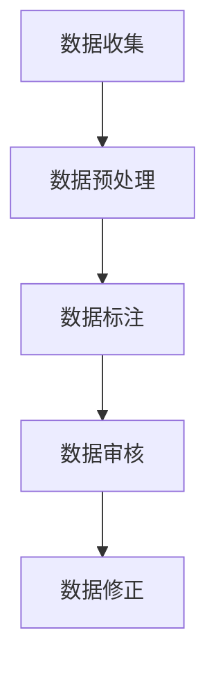
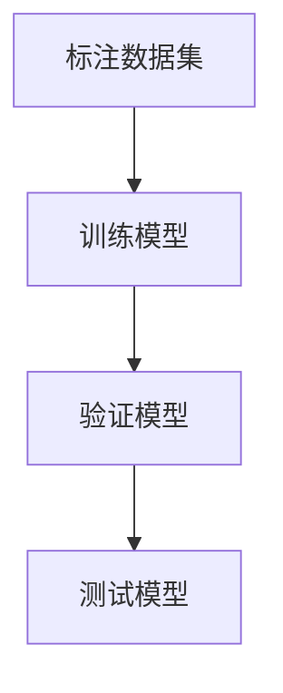
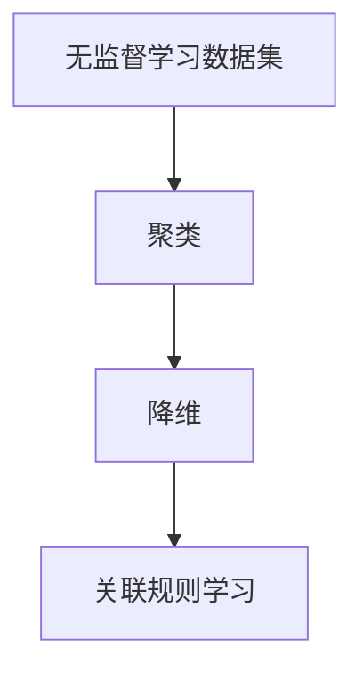
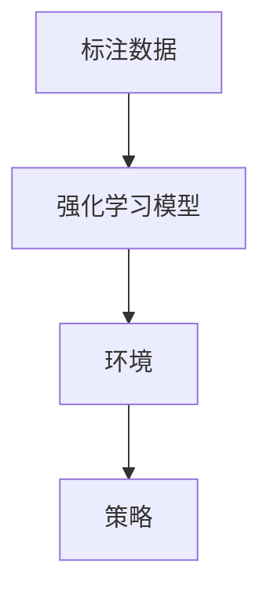
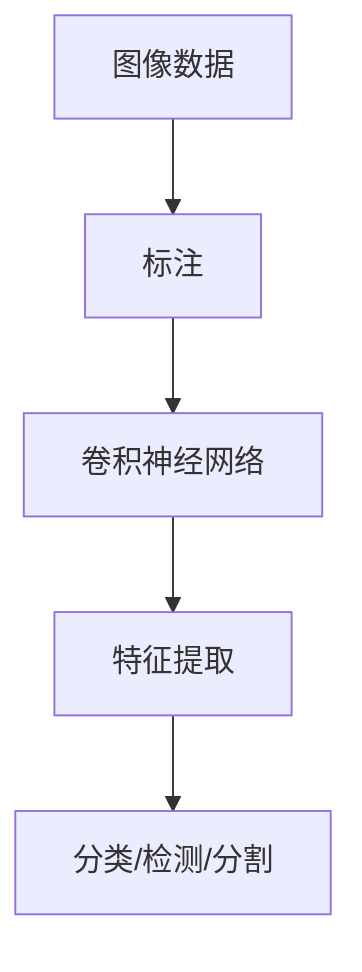
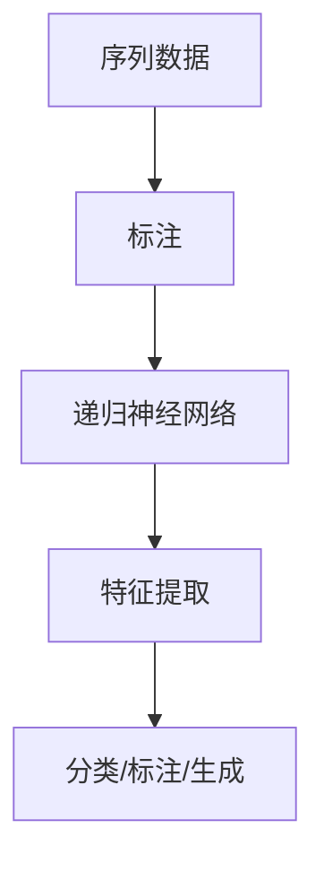

                 

# 《数据标注：人工智能发展背后的幕后英雄》

> **关键词**：数据标注、人工智能、机器学习、深度学习、自然语言处理、数据预处理

> **摘要**：本文详细探讨了数据标注在人工智能发展中的重要性，以及数据标注的概念、类型、应用和挑战。文章通过深入剖析图像、语音、文本等数据标注方法，结合具体案例，全面展示了数据标注的实际应用和价值。

### 目录

1. **数据标注基础与重要性**  
   1.1 数据标注的概念与类型  
   1.2 数据标注在人工智能中的应用

2. **数据标注方法与实践**  
   2.1 图像数据标注方法  
   2.2 语音数据标注方法  
   2.3 文本数据标注方法  
   2.4 数据标注流程与工具

3. **数据标注的挑战与未来趋势**  
   3.1 数据标注面临的挑战  
   3.2 数据标注的未来趋势

4. **附录**  
   4.1 数据标注常用算法与框架  
   4.2 数据标注开源工具介绍

## 引言

人工智能（AI）已经渗透到我们生活的方方面面，从智能助手到自动驾驶，从医疗诊断到金融交易，AI的应用越来越广泛。然而，在这背后，一个关键环节往往被忽视，那就是数据标注。数据标注是人工智能发展的幕后英雄，没有高质量的数据标注，就没有精准的机器学习模型，也没有高效的深度学习算法。

### 什么是数据标注？

数据标注是指对原始数据进行加工和处理，将其转化为能够用于机器学习或深度学习训练的数据集的过程。数据标注包括识别、分类、分割、标签分配等多种形式，目的是使计算机能够理解和处理这些数据。

### 数据标注的重要性

1. **保证模型准确性**：高质量的标注数据是训练准确模型的基石。只有当模型在训练阶段接触到丰富的、多样化的数据时，才能学会识别和分类。

2. **提高模型效率**：数据标注有助于减少训练过程中所需的计算资源，加快模型训练速度，提高模型效率。

3. **促进模型泛化**：通过数据标注，模型可以在不同的场景和任务中表现出更好的泛化能力。

4. **增强用户体验**：在自然语言处理、语音识别等领域，数据标注能够提高系统的准确性和响应速度，从而提升用户体验。

### 数据标注的类型

1. **结构化数据标注**：例如，将商品分类标签、用户评价标签等附加到结构化数据上。

2. **非结构化数据标注**：例如，对图像、文本、语音等非结构化数据进行分类、分割、情感分析等标注。

3. **半结构化数据标注**：例如，对网页、XML等半结构化数据进行内容提取和分类。

### 数据标注的关键步骤

1. **数据收集**：收集适用于特定任务的数据集。

2. **数据预处理**：清洗、格式化数据，以便进行标注。

3. **数据标注**：对数据集进行标注，例如，为图像标注物体类别、文本标注情感极性等。

4. **数据审核与修正**：对标注结果进行审核，确保标注的准确性和一致性。

### 数据标注在人工智能中的应用

#### 数据标注与机器学习

在监督学习中，标注数据用于训练模型，使其能够识别和分类新的数据。例如，在图像分类任务中，标注数据包括图像和对应的标签，如猫、狗等。在训练过程中，模型通过学习标注数据中的特征，来预测新的图像标签。

伪代码：

```
function train_model(data, labels):
    for each (image, label) in data:
        extract_features(image)
        update_model(features, label)
    return model
```

#### 数据标注与深度学习

深度学习依赖于大规模标注数据集来训练复杂的模型。在深度学习中，标注数据不仅用于训练模型的底层特征提取网络，还用于指导模型的分类和分割。

1. **卷积神经网络（CNN）**：CNN在图像数据标注中发挥着重要作用，通过学习图像的局部特征，实现对图像的识别和分类。

2. **递归神经网络（RNN）**：RNN在序列数据标注中具有优势，例如，在语音识别中，RNN可以学习语音信号的时序特征。

3. **Transformer模型**：Transformer模型在自然语言处理中表现出色，通过学习文本的上下文关系，实现文本分类、机器翻译等任务。

#### 数据标注在自然语言处理中的应用

在自然语言处理（NLP）领域，数据标注用于文本分类、机器翻译、情感分析等任务。

1. **文本分类**：标注数据包括文本和对应的标签，如新闻分类、情感分类等。

2. **机器翻译**：标注数据包括源语言和目标语言的句子，如英译中、中译英等。

3. **语音识别**：标注数据包括语音信号和对应的文本，如语音识别、语音情感分析等。

### 数据标注方法与实践

#### 图像数据标注方法

图像数据标注是计算机视觉领域的核心任务之一，包括目标检测、图像分割、图像增强和数据扩充等。

1. **目标检测数据标注**：为目标框标注类别和位置信息，如 bounding box、mask 等标注方法。

2. **图像分割数据标注**：为图像中的每个像素标注类别，如 semantic segmentation、instance segmentation 等。

3. **图像增强与数据扩充**：通过图像增强技术，增加数据的多样性，如旋转、缩放、裁剪等。

#### 语音数据标注方法

语音数据标注包括语音识别、语音情感分析和语音生成等任务。

1. **语音识别数据标注**：为语音信号标注文本，如 ASR (Automatic Speech Recognition)。

2. **语音情感分析数据标注**：为语音信号标注情感极性，如 happy、sad 等。

3. **语音生成数据标注**：为文本生成对应的语音，如 TTS (Text-to-Speech)。

#### 文本数据标注方法

文本数据标注包括文本分类、文本语义分析和文本生成等任务。

1. **文本分类数据标注**：为文本标注类别，如新闻分类、情感分类等。

2. **文本语义分析数据标注**：为文本标注语义信息，如实体识别、关系抽取等。

3. **文本生成数据标注**：为文本生成对应的文本，如生成式对话系统、文本摘要等。

### 数据标注流程与工具

数据标注流程包括数据收集、数据预处理、数据标注、数据审核与修正等步骤。

1. **数据收集**：从互联网、数据库、传感器等渠道获取数据。

2. **数据预处理**：清洗、格式化数据，为标注做好准备。

3. **数据标注**：使用专业工具和团队进行数据标注。

4. **数据审核与修正**：对标注结果进行审核和修正，确保标注质量。

常用的数据标注工具有开源工具和商业工具。

1. **开源工具**：如 LabelImg、Datamolino、imgaug 等。

2. **商业工具**：如 Annotate、DataEase、Annotation Studio 等。

### 数据标注的挑战与未来趋势

#### 数据标注面临的挑战

1. **数据标注的难度与复杂性**：标注任务可能涉及多种标签、多种语言、多种场景，使得标注过程具有很大的挑战性。

2. **数据标注的成本与效率**：高质量的数据标注需要专业人员和大量的时间，这可能导致标注成本高昂、效率低下。

3. **数据标注的准确性与一致性**：标注人员的差异、标注工具的限制等因素可能导致标注结果不准确、不一致。

#### 数据标注的未来趋势

1. **自动化数据标注技术的发展**：通过自然语言处理、计算机视觉等技术，实现自动化数据标注，降低标注成本、提高标注效率。

2. **数据标注在人工智能时代的应用前景**：随着人工智能技术的不断发展，数据标注将在更多领域得到广泛应用，如自动驾驶、智能家居、医疗诊断等。

3. **数据标注在数据科学中的核心作用**：数据标注是数据科学的核心环节，高质量的标注数据将为数据科学家提供强有力的支持。

### 附录

#### 数据标注常用算法与框架

1. **区域建议算法**：如 Selective Search、Fast R-CNN 等。

2. **模糊标注算法**：如 Fuzzy C-Means、Fuzzy K-Means 等。

3. **自动标注算法**：如深度学习模型、主动学习等。

#### 数据标注开源工具介绍

1. **LabelImg**：一个基于 Python 和 PyQt5 的开源图像标注工具。

2. **Datamolino**：一个基于 Web 的开源数据标注平台。

3. **imgaug**：一个基于 Python 的开源图像增强库。

### 总结

数据标注是人工智能发展的关键环节，没有高质量的数据标注，就没有精准的机器学习模型和高效的深度学习算法。本文详细介绍了数据标注的基础知识、应用方法和未来趋势，希望对读者了解和掌握数据标注有所帮助。

### 作者信息

**作者：** AI天才研究院/AI Genius Institute & 禅与计算机程序设计艺术 /Zen And The Art of Computer Programming

希望这篇文章能够帮助您更好地理解数据标注的重要性及其在人工智能发展中的关键作用。如果您有任何问题或建议，欢迎在评论区留言。感谢您的阅读！## 第一部分：数据标注基础与重要性

### 第1章：数据标注的概念与类型

#### 1.1 数据标注的定义

数据标注是指将原始数据转换成机器学习模型所需的数据集的过程。这一过程涉及对数据中每个实例进行识别、分类、分割或标签分配。数据标注的目的是提供模型训练所需的标记信息，从而使模型能够从数据中学习到特征并做出预测。

数据标注通常分为以下几种类型：

1. **结构化数据标注**：这种类型的标注针对的是结构化数据，如数据库中的表格数据。在这些数据中，每个字段都有明确的含义和类型。结构化数据标注通常包括标签、分类或分类标签的附加。

2. **非结构化数据标注**：非结构化数据标注针对的是没有预定义结构的数据，如文本、图像、音频和视频。这类数据标注通常涉及对图像中的物体进行分类、分割、识别，或对文本进行情感分析、实体识别等。

3. **半结构化数据标注**：半结构化数据介于结构化和非结构化数据之间。例如，HTML 标记的网页数据就是半结构化的。这种数据标注通常需要提取特定的内容或特征，并将其转换为机器学习模型可以处理的形式。

#### 1.2 数据标注的类型

1. **结构化数据标注**

   结构化数据标注的目的是将数据集中的每个记录（row）与相关的标签（label）关联起来。例如，在分类任务中，每个记录可能是一个客户的购买历史，而标签可能是该客户是否购买了某种产品。

   **核心概念与联系：**

   ```mermaid
   graph TD
       A[结构化数据] --> B[字段与标签];
       B --> C[数据预处理];
       C --> D[模型训练];
       D --> E[预测];
   ```

   **实例：**

   ```python
   # 假设有一个结构化数据集，其中包含用户ID、购买产品、购买时间和购买金额
   user_data = [
       {"user_id": 1, "product": "手机", "time": "2023-01-01", "amount": 1000},
       {"user_id": 2, "product": "电脑", "time": "2023-01-02", "amount": 2000},
       # 更多数据...
   ]

   # 标注标签，例如，是否购买了某种产品
   labels = [1, 0]  # 表示第一个用户购买了手机，第二个用户没有购买电脑
   ```

2. **非结构化数据标注**

   非结构化数据标注通常涉及对图像、文本和音频等数据进行标签分配。例如，在图像识别任务中，标注人员可能需要为图像中的每个对象分配一个标签。

   **核心概念与联系：**

   ```mermaid
   graph TD
       A[非结构化数据] --> B[图像/文本/音频];
       B --> C[标注工具];
       C --> D[标签分配];
       D --> E[模型训练];
   ```

   **实例：**

   ```python
   # 假设有一个图像数据集，需要为每个图像中的对象分配标签
   images = ["cat.jpg", "dog.jpg", "car.jpg"]
   labels = [["cat", "dog", "car"],  # 图像中的对象标签
              ["dog", "cat", "car"],
              ["car", "cat", "dog"]]

   # 使用标注工具进行标注，如 LabelImg
   # 标注人员根据图像内容分配标签
   ```

3. **半结构化数据标注**

   半结构化数据标注通常涉及从复杂的数据格式中提取信息，并将其转换为结构化数据。例如，从HTML中提取新闻标题和摘要。

   **核心概念与联系：**

   ```mermaid
   graph TD
       A[半结构化数据] --> B[HTML/XML];
       B --> C[内容提取];
       C --> D[结构化数据];
       D --> E[模型训练];
   ```

   **实例：**

   ```python
   # 假设有一个包含新闻标题和摘要的HTML文件
   html_data = '''
   <div>
       <h1>标题1</h1>
       <p>摘要1</p>
   </div>
   <div>
       <h1>标题2</h1>
       <p>摘要2</p>
   </div>
   '''

   # 使用正则表达式提取标题和摘要
   import re

   titles = re.findall('<h1>(.*?)</h1>', html_data)
   summaries = re.findall('<p>(.*?)</p>', html_data)

   # 转换为结构化数据
   structured_data = [{"title": title, "summary": summary} for title, summary in zip(titles, summaries)]
   ```

#### 1.3 数据标注的关键步骤

数据标注的过程通常包括以下几个关键步骤：

1. **数据收集**：从各种数据源收集原始数据，这些数据可以是结构化的、非结构化的或半结构化的。

2. **数据预处理**：清洗和格式化数据，以去除噪声、缺失值和重复数据，确保数据的质量。

3. **数据标注**：对预处理后的数据进行标注，这可能涉及使用标注工具或人工标注。

4. **数据审核与修正**：对标注结果进行审核，确保标注的准确性和一致性。如果发现错误，需要进行修正。

**核心概念与联系：**



**实例：**

```python
# 数据收集
raw_data = [
    {"name": "John", "age": "30", "city": "New York"},
    {"name": "Jane", "age": "25", "city": "San Francisco"},
    # 更多数据...
]

# 数据预处理
clean_data = [{"name": name, "age": int(age), "city": city} for { "name": name, "age": age, "city": city } in raw_data]

# 数据标注
labels = [{"name": name, "label": "Male"} if name.endswith("n") else {"name": name, "label": "Female"} for name in clean_data]

# 数据审核与修正
approved_labels = []
for label in labels:
    if label["age"] > 18:
        approved_labels.append(label)
    else:
        print(f"Error in label for {label['name']}")

# 输出修正后的数据
print(approved_labels)
```

通过以上步骤，我们可以确保数据标注的准确性和一致性，为后续的机器学习模型训练提供高质量的数据支持。

### 第2章：数据标注在人工智能中的应用

#### 2.1 数据标注与机器学习

数据标注在机器学习（ML）中扮演着至关重要的角色，特别是在监督学习和无监督学习两种常见的机器学习模式中。

**监督学习**：在监督学习模式下，数据标注至关重要，因为模型需要根据已知的数据和对应的标签来学习如何预测未知数据。以下是一些核心概念和联系：

- **标注数据集**：一个包含输入特征和相应标签的数据集。
- **训练模型**：使用标注数据集来训练模型，使其学习如何预测新的输入数据。
- **验证与测试**：使用未标注的数据来验证和测试模型的准确性。

**核心概念与联系：**



**实例：**

假设我们有一个分类任务，目标是根据客户的基本信息（年龄、收入、居住城市等）预测该客户是否会购买某种产品。标注数据集如下：

```python
data = [
    {"age": 30, "income": 50000, "city": "New York", "label": 1},
    {"age": 25, "income": 40000, "city": "San Francisco", "label": 0},
    # 更多数据...
]
```

我们可以使用决策树、支持向量机（SVM）或神经网络等模型来训练，并根据模型预测未知数据的标签。

```python
from sklearn.tree import DecisionTreeClassifier

# 训练模型
model = DecisionTreeClassifier()
model.fit([d["age"], d["income"], d["city"]] for d in data if d["label"] == 1, [d["label"] for d in data if d["label"] == 1])

# 预测
new_data = [{"age": 28, "income": 55000, "city": "Chicago"}]
predicted_label = model.predict([new_data[0]["age"], new_data[0]["income"], new_data[0]["city"]])

print(predicted_label)  # 输出预测结果
```

**无监督学习**：在无监督学习模式下，模型没有标签信息，其目标是发现数据中的结构和模式。虽然无监督学习不需要标注数据，但标注数据可以帮助模型更好地理解数据，从而提高其性能。以下是一些核心概念和联系：

- **聚类**：通过将相似的数据点分组在一起来发现数据中的模式。
- **降维**：减少数据维度，以便更直观地观察和理解数据。
- **关联规则学习**：发现数据之间的关联规则。

**核心概念与联系：**



**实例：**

假设我们有一组客户的基本信息，但没有购买记录。我们可以使用聚类算法来发现不同客户群体的特征。

```python
from sklearn.cluster import KMeans

# 聚类
model = KMeans(n_clusters=3)
model.fit([d["age"], d["income"], d["city"]] for d in data)

# 输出聚类结果
print(model.labels_)  # 输出每个客户的聚类标签
```

**强化学习**：在强化学习（RL）中，模型通过与环境的交互来学习最优策略。虽然标注数据在强化学习中不是必需的，但它们可以用来指导模型的训练过程，使其更快地收敛到最优策略。

**核心概念与联系：**



**实例：**

假设我们有一个自动驾驶系统，使用标注数据来指导其学习如何在不同交通场景中做出最佳决策。

```python
import numpy as np
import matplotlib.pyplot as plt

# 假设环境是一个简单的交通场景，有四个状态：直行、左转、右转、停车
# 对应的动作：0 - 直行，1 - 左转，2 - 右转，3 - 停车
# 奖励函数：成功通过路口 +1，否则 -1

env = np.random.RandomState(0)
states = ["straight", "left", "right", "stop"]
actions = ["go_straight", "turn_left", "turn_right", "stop"]

# 假设有一个标注数据集，包含状态、动作和奖励
transition_data = [
    ("straight", "go_straight", 1),
    ("left", "turn_left", 1),
    ("right", "turn_right", 1),
    ("stop", "stop", 1),
    ("straight", "turn_left", -1),
    ("left", "go_straight", -1),
    # 更多数据...
]

# 强化学习模型
class QLearningAgent:
    def __init__(self, alpha=0.1, gamma=0.9, epsilon=0.1):
        self.alpha = alpha
        self.gamma = gamma
        self.epsilon = epsilon
        self.q_values = {}

    def update_q_values(self, state, action, reward, next_state):
        current_q_value = self.q_values.get((state, action), 0)
        next_max_q_value = max(self.q_values.get((next_state, a), 0) for a in actions)
        new_q_value = current_q_value + self.alpha * (reward + self.gamma * next_max_q_value - current_q_value)
        self.q_values[(state, action)] = new_q_value

    def get_action(self, state):
        if np.random.rand() < self.epsilon:
            action = np.random.choice(actions)
        else:
            action = max(self.q_values.get((state, a), 0) for a in actions)
        return action

    def train(self, transition_data):
        for state, action, reward in transition_data:
            next_state = np.random.choice(states)
            self.update_q_values(state, action, reward, next_state)

# 训练模型
agent = QLearningAgent()
agent.train(transition_data)

# 测试模型
for state in states:
    action = agent.get_action(state)
    print(f"State: {state}, Action: {action}")
```

通过上述实例，我们可以看到数据标注在机器学习不同模式中的应用和重要性。高质量的标注数据能够显著提升模型的性能和泛化能力。

### 2.2 数据标注与深度学习

深度学习（Deep Learning）是人工智能领域的重要分支，它通过构建具有多层神经元的神经网络来处理复杂数据。数据标注在深度学习模型训练中起着至关重要的作用，尤其是在卷积神经网络（Convolutional Neural Networks, CNN）、递归神经网络（Recurrent Neural Networks, RNN）和Transformer模型中。

**卷积神经网络（CNN）**：

CNN是处理图像数据的主要工具，其核心在于通过卷积层、池化层和全连接层提取图像特征。在CNN中，数据标注主要涉及以下方面：

1. **图像分类**：为图像标注类别标签，如猫、狗、汽车等。
2. **目标检测**：为图像中的每个目标标注边界框（bounding box）和类别标签。
3. **语义分割**：为图像中的每个像素标注类别标签。

**核心概念与联系：**



**实例：**

以下是一个简单的CNN模型用于图像分类的伪代码实例：

```python
import tensorflow as tf

# 构建CNN模型
model = tf.keras.Sequential([
    tf.keras.layers.Conv2D(filters=32, kernel_size=(3, 3), activation='relu', input_shape=(28, 28, 1)),
    tf.keras.layers.MaxPooling2D(pool_size=(2, 2)),
    tf.keras.layers.Conv2D(filters=64, kernel_size=(3, 3), activation='relu'),
    tf.keras.layers.MaxPooling2D(pool_size=(2, 2)),
    tf.keras.layers.Flatten(),
    tf.keras.layers.Dense(units=128, activation='relu'),
    tf.keras.layers.Dense(units=10, activation='softmax')
])

# 编译模型
model.compile(optimizer='adam', loss='sparse_categorical_crossentropy', metrics=['accuracy'])

# 加载标注数据集
(x_train, y_train), (x_test, y_test) = tf.keras.datasets.mnist.load_data()

# 预处理数据
x_train = x_train / 255.0
x_test = x_test / 255.0

# 训练模型
model.fit(x_train, y_train, epochs=5, validation_data=(x_test, y_test))

# 评估模型
test_loss, test_acc = model.evaluate(x_test, y_test)
print(f"Test accuracy: {test_acc}")
```

**递归神经网络（RNN）**：

RNN在处理序列数据（如时间序列、文本、语音）方面具有显著优势，其核心在于通过循环结构来捕捉序列中的长期依赖关系。在RNN中，数据标注主要涉及：

1. **序列分类**：为序列中的每个元素标注类别标签。
2. **序列标注**：为序列中的每个元素标注多个标签。
3. **序列生成**：为给定序列生成新的序列。

**核心概念与联系：**



**实例：**

以下是一个简单的RNN模型用于序列分类的伪代码实例：

```python
import tensorflow as tf

# 构建RNN模型
model = tf.keras.Sequential([
    tf.keras.layers.Embedding(input_dim=10000, output_dim=64),
    tf.keras.layers.LSTM(units=128),
    tf.keras.layers.Dense(units=10, activation='softmax')
])

# 编译模型
model.compile(optimizer='adam', loss='sparse_categorical_crossentropy', metrics=['accuracy'])

# 加载标注数据集（假设为电影评论分类）
(x_train, y_train), (x_test, y_test) = tf.keras.datasets.imdb.load_data(num_words=10000)

# 预处理数据
x_train = tf.expand_dims(x_train, -1)
x_test = tf.expand_dims(x_test, -1)

# 训练模型
model.fit(x_train, y_train, epochs=5, validation_data=(x_test, y_test))

# 评估模型
test_loss, test_acc = model.evaluate(x_test, y_test)
print(f"Test accuracy: {test_acc}")
```

**Transformer模型**：

Transformer模型是自然语言处理领域的一项革命性创新，其在处理长文本和长序列方面表现出色。Transformer的核心是自注意力机制（Self-Attention），这使得模型能够捕捉序列中的全局依赖关系。在Transformer中，数据标注主要涉及：

1. **文本分类**：为文本序列标注类别标签。
2. **机器翻译**：为源语言和目标语言序列标注。
3. **问答系统**：为问题和对

