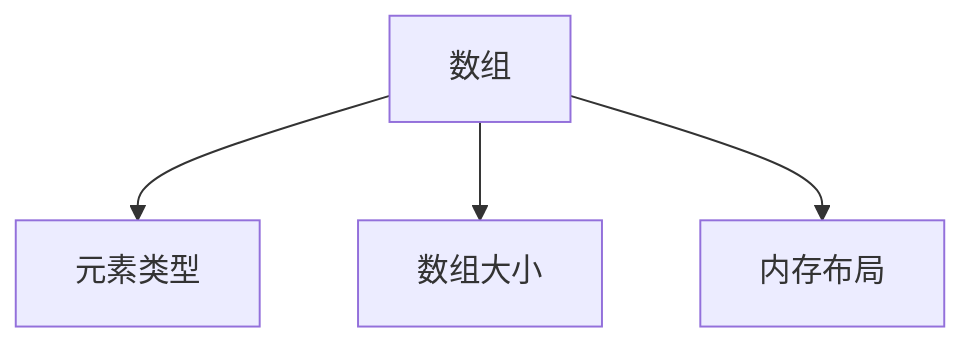
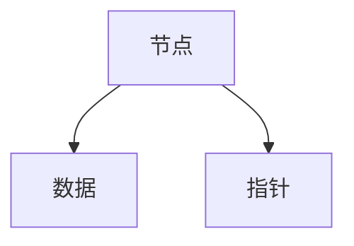
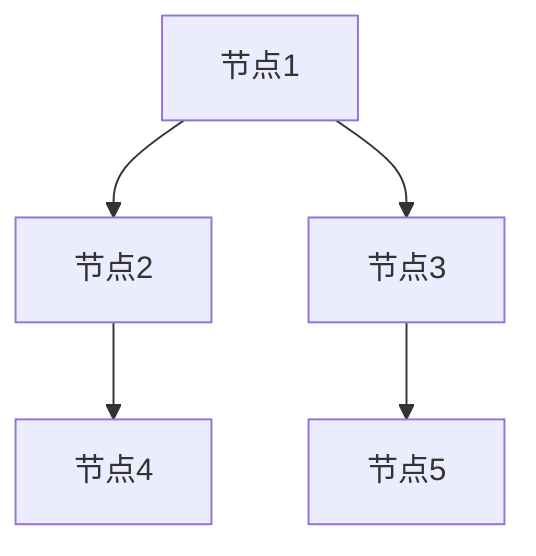
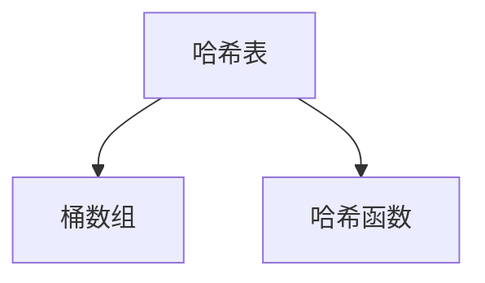
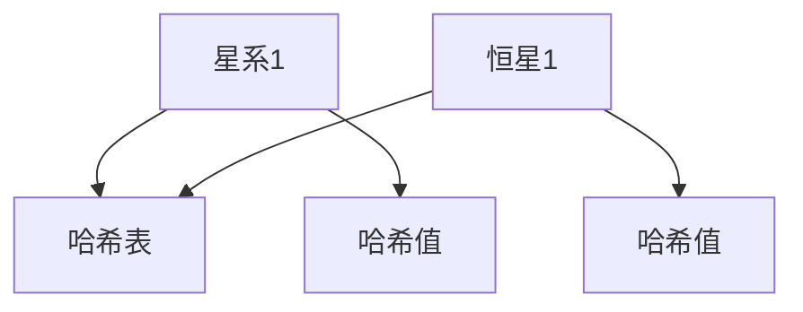
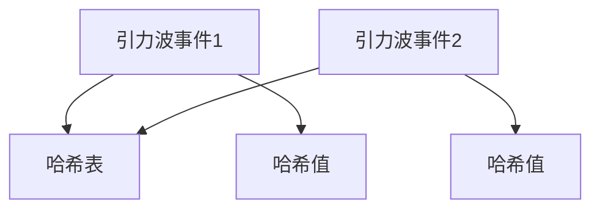
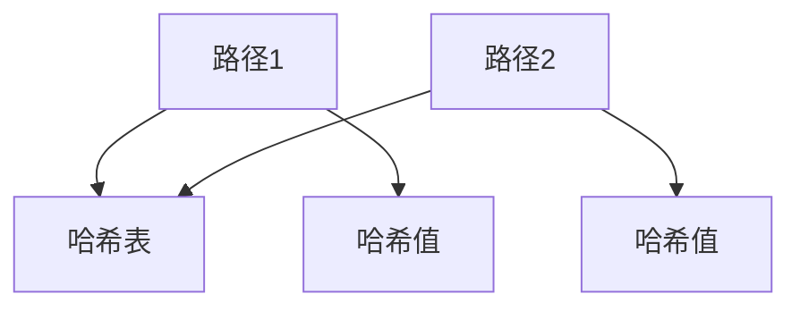

                 

# 《数据结构在模拟宇宙暗流网络中的应用》

## 摘要

本文旨在探讨数据结构在模拟宇宙暗流网络中的应用。宇宙暗流网络是一个假设的网络，用于传输暗物质，是宇宙学研究中一个重要的概念。数据结构作为计算机科学的基础，为模拟宇宙暗流网络提供了强大的工具。本文将详细分析数据结构在模拟宇宙暗流网络中的应用，包括数组、链表、树、图、哈希表等基本数据结构，以及排序与查找算法。同时，本文将通过实例介绍这些数据结构在模拟宇宙暗流网络中的具体应用，如模拟星系演化、暗物质分布、宇宙暗流网络通信等。最后，本文还将展望数据结构在模拟宇宙暗流网络中的未来发展方向，并提出相关的挑战。

## 目录大纲

### 第一部分：引论

#### 第1章：模拟宇宙与暗流网络的概述

1.1 模拟宇宙的基本概念  
1.2 暗流网络的概念与重要性  
1.3 暗流网络的模拟方法

#### 第2章：数据结构在模拟宇宙中的应用

2.1 数据结构的基本概念  
2.2 数据结构在暗流网络模拟中的应用

### 第二部分：核心数据结构及其应用

#### 第3章：数组与链表在模拟宇宙中的应用

3.1 数组的基本操作  
3.2 链表的基本操作  
3.3 数组与链表在模拟宇宙中的应用

#### 第4章：树与图在模拟宇宙中的应用

4.1 树的基本操作  
4.2 图的基本操作  
4.3 树与图在模拟宇宙中的应用

#### 第5章：哈希表在模拟宇宙中的应用

5.1 哈希表的基本原理  
5.2 哈希表在模拟宇宙中的应用

#### 第6章：排序与查找算法在模拟宇宙中的应用

6.1 排序算法的基本原理  
6.2 查找算法的基本原理  
6.3 排序与查找算法在模拟宇宙中的应用

### 第三部分：数据结构在模拟宇宙暗流网络中的应用实例

#### 第7章：实例一：模拟星系演化

7.1 星系演化的基本原理  
7.2 数组与链表在星系演化模拟中的应用

#### 第8章：实例二：模拟暗物质分布

8.1 暗物质的基本原理  
8.2 树与图在暗物质分布模拟中的应用

#### 第9章：实例三：模拟宇宙暗流网络通信

9.1 宇宙暗流网络通信的基本原理  
9.2 哈希表在宇宙暗流网络通信中的应用

#### 第10章：实例四：模拟宇宙暗流网络的攻击与防御

10.1 宇宙暗流网络攻击与防御的基本原理  
10.2 排序与查找算法在宇宙暗流网络攻击与防御中的应用

### 第四部分：展望

#### 第11章：数据结构在模拟宇宙暗流网络中的应用展望

11.1 数据结构在模拟宇宙暗流网络中的应用前景  
11.2 未来研究方向

### 附录

#### 附录A：数据结构相关工具与资源

A.1 数据结构学习工具  
A.2 模拟宇宙暗流网络模拟工具

----------------------------------------------------------------

## 第1章：模拟宇宙与暗流网络的概述

### 1.1 模拟宇宙的基本概念

#### 1.1.1 宇宙模拟的背景

宇宙模拟（Cosmological Simulation）是指使用数值模拟方法来模拟宇宙的演化过程。这种模拟方法最早可以追溯到20世纪60年代，当时科学家们开始使用计算机来模拟宇宙的演化，以探索宇宙的起源和结构。

随着计算机技术的不断发展，宇宙模拟的精度和规模不断提高。早期的宇宙模拟主要是基于牛顿力学，随着相对论和量子力学的引入，宇宙模拟的方法和理论也不断丰富。现代宇宙模拟通常结合了引力、辐射、暗物质和暗能量等多种物理过程，力求模拟出宇宙从大爆炸到现在的演化历程。

#### 1.1.2 暗流网络的概述

暗流网络（Dark Flow Network）是一个相对较新的概念，它指的是宇宙中一种可能的传输网络，用于传输暗物质。暗物质是宇宙中一种无法直接观测到的物质，但它对宇宙的结构和演化有着重要的影响。暗流网络假设在宇宙中存在一种快速且低能耗的传输通道，这些通道可以将暗物质从一个地方传输到另一个地方。

暗流网络的提出源于对宇宙中某些异常现象的解释。例如，一些观测数据表明，星系团在宇宙中的分布似乎存在一种宏观流，这种流与暗物质的分布密切相关。暗流网络的理论基础涉及到了相对论、引力理论和粒子物理等多个学科。

### 1.2 暗流网络的模拟方法

#### 1.2.1 暗流网络的理论基础

暗流网络的模拟依赖于一系列物理原理和数学模型。首先，暗流网络的形成和演化与引力有关。引力是宇宙中最重要的力之一，它决定了物质如何聚集和分布。因此，模拟暗流网络需要建立一个准确的引力模型。

此外，暗流网络的模拟还需要考虑暗物质的性质。暗物质不发光、不发热，因此无法直接观测。但科学家们通过观测宇宙中的星系和星系团，可以推断出暗物质的分布和运动。基于这些观测数据，科学家们建立了一系列暗物质分布模型。

#### 1.2.2 暗流网络的模拟过程

暗流网络的模拟过程通常包括以下几个步骤：

1. **初始参数设置**：这一步需要确定模拟的基本参数，如宇宙的大小、暗物质的密度分布、初始速度等。这些参数通常基于观测数据和理论模型来确定。

2. **网络构建**：根据初始参数，构建暗流网络的拓扑结构。这一步需要使用数据结构来存储和管理网络中的节点和边。

3. **模拟运行**：在这个阶段，模拟程序将根据物理原理和数学模型，模拟暗流网络中的物质传输和相互作用。这个过程通常需要使用高性能计算机，因为模拟过程涉及到了大量的计算。

4. **结果分析**：模拟完成后，需要对结果进行分析，以验证模拟结果的准确性和可靠性。这一步可能需要使用多种数据结构和方法，如排序、查找和统计分析。

### 1.3 数据结构在暗流网络模拟中的应用

#### 1.3.1 数据结构在模拟宇宙中的作用

数据结构在宇宙模拟中扮演着重要的角色。首先，数据结构用于存储和管理宇宙中的大量数据。例如，星系的位置、速度、质量等信息都需要使用数据结构来存储。常用的数据结构包括数组、链表、树和图等。

此外，数据结构还在优化计算效率和提高模拟精度方面发挥了重要作用。通过合理选择和使用数据结构，可以减少计算资源的消耗，提高模拟的速度和准确性。

#### 1.3.2 数据结构在暗流网络模拟中的具体应用

在暗流网络模拟中，不同的数据结构有着不同的应用。以下是一些具体的应用：

- **数组**：数组可以用于存储宇宙中的星系和粒子的位置和速度信息。数组的特点是访问速度快，适合用于处理大量的数据。

- **链表**：链表可以用于模拟宇宙中的星系之间的相互作用。链表的特点是插入和删除操作灵活，适合用于动态变化的数据。

- **树**：树可以用于构建宇宙中的星系和星系团的层次结构。树的特点是层次分明，适合用于模拟星系的生长和演化。

- **图**：图可以用于模拟宇宙中的复杂网络结构。图的特点是节点和边的关系复杂，适合用于模拟暗物质网络。

通过合理选择和使用数据结构，科学家们可以更准确地模拟宇宙的演化过程，更好地理解宇宙的结构和暗物质的性质。

### 1.4 暗流网络模拟的挑战与展望

#### 1.4.1 暗流网络模拟的挑战

暗流网络模拟面临着一系列挑战。首先，宇宙的规模庞大，模拟需要处理的数据量非常巨大。这要求模拟程序能够高效地处理海量数据，并使用足够大的计算资源。

其次，暗流网络模拟需要考虑多种物理过程，如引力、辐射、暗物质和暗能量等。这些物理过程相互交织，增加了模拟的复杂性。

此外，暗流网络模拟的结果需要经过严格的验证和验证。由于宇宙模拟的结果直接影响到对宇宙的理解，因此模拟结果的准确性和可靠性至关重要。

#### 1.4.2 暗流网络模拟的展望

尽管面临诸多挑战，暗流网络模拟的前景仍然广阔。随着计算机技术的不断发展，模拟的精度和规模将不断提高。未来，科学家们有望通过更精确的模拟，更好地理解宇宙的起源和演化。

此外，暗流网络模拟还可能带来其他科学突破。例如，通过模拟暗流网络，科学家们可能能够发现新的物理现象或提出新的理论模型。

总之，暗流网络模拟是宇宙学研究中一个重要的方向，它将为科学家们提供更深入的理解宇宙的途径。

## 第2章：数据结构的基本概念

### 2.1 数据结构的基本类型

数据结构是计算机科学中用于存储和组织数据的方式。不同的数据结构适用于不同的场景，以下是几种常见的基本数据结构：

#### 2.1.1 数组

数组是一种线性数据结构，它由一系列元素组成，这些元素可以是相同类型的数据。数组在内存中连续存储，可以通过索引快速访问任意元素。

- **定义**：数组是具有相同类型元素的集合，这些元素通过一个统一的索引进行访问。
- **特点**：
  - **随机访问**：可以通过索引直接访问数组中的任何元素。
  - **固定大小**：一旦创建，数组的大小就固定不变。
  - **连续性**：数组元素在内存中连续存储。

#### 2.1.2 链表

链表是由一系列节点组成的线性数据结构，每个节点包含数据和指向下一个节点的指针。链表可以动态扩展和缩小。

- **定义**：链表由一系列节点组成，每个节点包含数据和一个或多个指向其他节点的指针。
- **特点**：
  - **动态大小**：链表可以根据需要动态地添加或删除节点。
  - **非连续性**：节点在内存中可以分散存储，通过指针连接。
  - **插入和删除灵活**：在链表中插入和删除节点通常只需要改变指针。

#### 2.1.3 树

树是一种层次结构的数据组织方式，它由节点和边组成，每个节点有一个父节点和零个或多个子节点。树结构广泛用于表示层次关系和路径。

- **定义**：树是一个有序的节点（或顶点）集合，其中每个节点有一个父节点，除根节点外，其他每个节点有零个或多个子节点。
- **特点**：
  - **层次结构**：节点按照层次组织，每个节点有且只有一个父节点。
  - **分支性**：每个节点可以有零个或多个子节点，形成分支。
  - **路径性**：树中的每个节点都可以通过一系列父节点追溯到根节点。

#### 2.1.4 图

图是一种复杂的数据结构，它由节点和边组成，节点和边之间可以是任意的连接关系。图广泛用于表示复杂的关系网络。

- **定义**：图是一个由节点（或顶点）和边（或弧）组成的集合，其中节点表示实体，边表示节点之间的关系。
- **特点**：
  - **连通性**：图中的节点可以通过边相互连接。
  - **路径性**：图中存在多条路径，可以从一个节点到达另一个节点。
  - **复杂性**：图的结构可能非常复杂，包含多种类型的边和节点。

### 2.2 数据结构的应用场景

数据结构的选择取决于具体的应用场景。以下是几种常见的数据结构应用场景：

#### 2.2.1 数据存储

- **数组**：数组常用于存储固定大小的数据集合，如矩阵、数组栈和队列等。
- **链表**：链表适合存储动态变化的数据集合，如链表栈和链表队列等。

#### 2.2.2 数据处理

- **树**：树适合处理层次结构和路径问题，如二叉搜索树、平衡树和树遍历算法等。
- **图**：图适合处理复杂网络问题，如图算法、社交网络分析和网络路由等。

#### 2.2.3 算法分析

- **排序算法**：常用的排序算法包括插入排序、选择排序、归并排序和快速排序，这些算法需要排序数据，因此需要合适的排序算法和数据结构。
- **查找算法**：查找算法包括顺序查找、二分查找和哈希查找等，这些算法需要高效地查找数据，因此需要合适的查找算法和数据结构。

### 2.3 数据结构的基本操作

不同类型的数据结构有不同的基本操作。以下是几种常见的数据结构基本操作：

#### 2.3.1 数组

- **插入**：在数组中插入新元素，通常需要移动已有元素。
- **删除**：从数组中删除元素，同样需要移动其他元素。
- **查找**：通过索引查找数组中的元素。

#### 2.3.2 链表

- **插入**：在链表中插入新节点，只需要改变指针。
- **删除**：从链表中删除节点，只需要改变指针。
- **查找**：通过遍历链表查找特定节点。

#### 2.3.3 树

- **插入**：在树中插入新节点，需要找到合适的位置并更新父节点指针。
- **删除**：从树中删除节点，需要处理子节点和父节点的指针。
- **查找**：通过遍历树查找特定节点。

#### 2.3.4 图

- **插入**：在图中插入新节点和边，需要更新节点和边的指针。
- **删除**：从图中删除节点和边，需要更新其他节点的指针。
- **查找**：通过遍历图查找特定节点或路径。

通过理解和掌握这些基本操作，开发者可以更好地选择和使用数据结构，以实现特定功能和应用。

### 2.4 数据结构在模拟宇宙中的应用

数据结构在模拟宇宙中的应用至关重要，特别是在处理大规模数据和复杂关系时。以下是一些数据结构在模拟宇宙中的应用实例：

#### 2.4.1 数组在宇宙模拟中的应用

- **存储宇宙数据**：数组常用于存储宇宙中的星系、恒星和行星的位置、速度和加速度等数据。
- **模拟引力场**：数组可以用于模拟引力场，通过计算每个星系对其他星系的引力，模拟宇宙中的引力相互作用。

#### 2.4.2 链表在宇宙模拟中的应用

- **模拟星系相互作用**：链表可以用于模拟星系之间的相互作用，每个星系可以用一个节点表示，星系之间的相互作用通过链表中的指针表示。
- **模拟粒子运动**：链表可以用于模拟宇宙中的粒子运动，每个粒子用节点表示，粒子的运动轨迹通过链表链接。

#### 2.4.3 树在宇宙模拟中的应用

- **构建星系层次结构**：树可以用于构建宇宙中的星系层次结构，如星系团、星系群和单个星系等。
- **模拟星系演化**：树可以用于模拟星系的演化过程，如星系的诞生、成长和消亡等。

#### 2.4.4 图在宇宙模拟中的应用

- **模拟宇宙网络**：图可以用于模拟宇宙中的复杂网络结构，如星系网络、暗物质网络和暗流网络等。
- **模拟宇宙交互**：图可以用于模拟宇宙中各种实体之间的复杂交互，如引力相互作用、辐射传递和粒子碰撞等。

通过合理选择和使用数据结构，开发者可以更高效地模拟宇宙的演化过程，更好地理解宇宙的结构和暗物质的性质。

## 第3章：数组与链表在模拟宇宙中的应用

### 3.1 数组的基本操作

数组是一种常用的数据结构，它在处理连续数据集合时非常有效。在模拟宇宙的过程中，数组可以用于存储星系、恒星、行星等宇宙对象的位置、速度和质量等属性。

#### 3.1.1 数组的定义

数组是一种线性数据结构，它由一系列元素组成，这些元素可以是相同类型的数据。每个元素可以通过一个整数索引来访问。数组的定义通常包括以下要素：

- **元素类型**：数组中的每个元素具有相同的类型。
- **数组大小**：数组中元素的个数。
- **内存布局**：数组元素在内存中的排列方式。



#### 3.1.2 数组的基本操作

数组的基本操作包括插入、删除和查找。以下是对这些操作的详细解释：

- **插入**：在数组中插入新元素通常需要移动已有的元素，以腾出空间给新元素。
  ```latex
  void insert(int[] array, int index, int value) {
      for (int i = array.length - 1; i > index; i--) {
          array[i] = array[i - 1];
      }
      array[index] = value;
  }
  ```

- **删除**：从数组中删除元素后，需要将后续元素向前移动，以填补空缺。
  ```latex
  void delete(int[] array, int index) {
      for (int i = index; i < array.length - 1; i++) {
          array[i] = array[i + 1];
      }
      array[array.length - 1] = 0; // 或者将最后一个元素设置为默认值
  }
  ```

- **查找**：通过索引直接访问数组中的元素。
  ```latex
  int search(int[] array, int index) {
      return array[index];
  }
  ```

#### 3.1.3 数组在模拟宇宙中的应用

在模拟宇宙中，数组可以用于多种应用场景：

- **存储宇宙对象**：数组可以用于存储星系中的恒星、行星和黑洞等宇宙对象的位置和属性。
  ```mermaid
  graph TB
  A[宇宙对象] --> B[位置]
  A --> C[速度]
  A --> D[质量]
  ```

- **模拟引力相互作用**：数组可以用于计算每个宇宙对象对其他对象的引力，进而模拟宇宙中的引力相互作用。
  ```mermaid
  graph TB
  A[宇宙对象1] --> B[引力计算]
  A --> C[宇宙对象2]
  ```

### 3.2 链表的基本操作

链表是一种动态数据结构，它由一系列节点组成，每个节点包含数据和指向下一个节点的指针。链表在处理动态变化的数据集合时非常有效。

#### 3.2.1 链表的定义

链表的每个节点包含两个部分：数据域和指针域。数据域存储节点的实际数据，指针域指向下一个节点。



#### 3.2.2 链表的基本操作

链表的基本操作包括插入、删除和查找。以下是对这些操作的详细解释：

- **插入**：在链表中插入新节点只需要改变指针。
  ```mermaid
  graph TB
  A[头节点] --> B[新节点]
  A --> C[指针]
  B --> D[新节点数据]
  ```

- **删除**：从链表中删除节点只需要改变指针。
  ```mermaid
  graph TB
  A[前节点] --> B[当前节点]
  A --> C[指针]
  C --> D[后节点]
  ```

- **查找**：通过遍历链表查找特定节点。
  ```mermaid
  graph TB
  A[头节点] --> B[查找节点]
  A --> C[指针]
  ```

#### 3.2.3 链表在模拟宇宙中的应用

在模拟宇宙中，链表可以用于多种应用场景：

- **模拟星系相互作用**：链表可以用于模拟星系之间的相互作用，每个星系用一个节点表示，相互作用通过链表中的指针表示。
  ```mermaid
  graph TB
  A[星系1] --> B[相互作用]
  A --> C[星系2]
  ```

- **模拟粒子运动**：链表可以用于模拟宇宙中的粒子运动，每个粒子用节点表示，粒子的运动轨迹通过链表链接。
  ```mermaid
  graph TB
  A[粒子1] --> B[运动轨迹]
  A --> C[粒子2]
  ```

### 3.3 数组与链表在模拟宇宙中的应用比较

数组与链表各有优缺点，适用于不同的应用场景。以下是比较：

- **数组**：
  - **优点**：
    - **访问速度快**：通过索引可以直接访问任意元素。
    - **内存连续**：数组元素在内存中连续存储，可以高效地进行数据访问。
  - **缺点**：
    - **插入和删除操作复杂**：插入和删除操作需要移动其他元素。
    - **大小固定**：一旦创建，数组的大小就不能改变。

- **链表**：
  - **优点**：
    - **插入和删除操作简单**：只需要改变指针。
    - **大小动态**：链表可以根据需要动态地添加或删除节点。
  - **缺点**：
    - **访问速度慢**：需要遍历链表才能找到特定元素。
    - **内存分散**：链表节点在内存中可以分散存储，可能需要进行内存管理。

在实际应用中，根据具体需求选择合适的数据结构非常重要。对于需要频繁插入和删除操作的场景，链表可能是更好的选择；而对于需要快速访问的场景，数组可能是更合适的选择。

### 3.4 数组与链表在模拟宇宙中的具体应用实例

以下是一些具体的实例，展示了数组与链表在模拟宇宙中的具体应用：

- **实例一：模拟星系位置**
  - **使用数组**：可以使用一个二维数组存储星系的位置，每个元素表示一个星系的位置。
    ```mermaid
    graph TB
    A[星系1] --> B[(x1, y1)]
    A --> C[(x2, y2)]
    ```

  - **使用链表**：可以使用一个链表存储星系的位置，每个节点表示一个星系的位置。
    ```mermaid
    graph TB
    A[星系1] --> B[(x1, y1)]
    A --> C[星系2]
    A --> D[(x2, y2)]
    ```

- **实例二：模拟粒子运动**
  - **使用数组**：可以使用一个数组存储粒子的位置和速度，每个元素表示一个粒子的状态。
    ```mermaid
    graph TB
    A[粒子1] --> B[(x1, v1)]
    A --> C[粒子2]
    A --> D[(x2, v2)]
    ```

  - **使用链表**：可以使用一个链表存储粒子的位置和速度，每个节点表示一个粒子的状态。
    ```mermaid
    graph TB
    A[粒子1] --> B[(x1, v1)]
    A --> C[粒子2]
    A --> D[(x2, v2)]
    ```

通过这些实例，可以看到数组与链表在模拟宇宙中的应用是非常灵活和多样的。选择合适的数据结构可以显著提高模拟的效率和准确性。

## 第4章：树与图在模拟宇宙中的应用

### 4.1 树的基本操作

树是一种重要的数据结构，它由节点和边组成，具有层次结构。在模拟宇宙的过程中，树可以用于表示星系和星系团的层次关系，如星系团、星系群和单个星系等。

#### 4.1.1 树的定义

树是一种非循环的有向图，每个节点有一个父节点和零个或多个子节点。树的根节点没有父节点，叶子节点没有子节点。

- **节点**：树中的每个元素称为节点，每个节点包含数据和指向子节点的指针。
- **根节点**：树的顶部节点，没有父节点。
- **叶子节点**：没有子节点的节点。
- **子节点**：某个节点的子节点称为它的后代。
- **祖先节点**：某个节点的父节点及其所有父节点。
- **兄弟节点**：具有相同父节点的节点。



#### 4.1.2 树的基本操作

树的基本操作包括节点的插入、删除和查找。以下是对这些操作的详细解释：

- **插入**：在树中插入新节点，需要找到合适的位置并更新父节点指针。
  ```mermaid
  graph TB
  A1[根节点] --> B1[新节点]
  A1 --> B2[父节点]
  ```

- **删除**：从树中删除节点，需要处理子节点和父节点的指针。
  ```mermaid
  graph TB
  A1[待删除节点] --> B1[父节点]
  A1 --> B2[子节点]
  B1 --> B3[下一个兄弟节点]
  ```

- **查找**：通过遍历树查找特定节点。
  ```mermaid
  graph TB
  A1[根节点] --> B1[查找节点]
  A1 --> B2[子节点]
  ```

#### 4.1.3 树在模拟宇宙中的应用

树在模拟宇宙中的应用非常广泛，以下是一些具体的应用场景：

- **构建星系层次结构**：树可以用于构建星系和星系团的层次结构，如星系团、星系群和单个星系等。
  ```mermaid
  graph TB
  A1[星系团] --> B1[星系群]
  A1 --> B2[星系1]
  B1 --> B2[星系2]
  B2 --> B3[星系3]
  ```

- **模拟星系演化**：树可以用于模拟星系的演化过程，如星系的诞生、成长和消亡等。
  ```mermaid
  graph TB
  A1[星系团] --> B1[新生星系]
  A1 --> B2[成长星系]
  B2 --> B3[衰老星系]
  ```

### 4.2 图的基本操作

图是一种复杂的数据结构，它由节点和边组成，可以表示宇宙中的复杂关系网络，如星系网络、暗物质网络和暗流网络等。

#### 4.2.1 图的定义

图是一种由节点和边组成的集合，节点表示实体，边表示节点之间的关系。图可以分为有向图和无向图，以及加权图和非加权图。

- **节点**：图中的每个元素称为节点，每个节点可以包含数据。
- **边**：连接两个节点的线段，表示节点之间的关系。边可以有方向，也可以没有方向。
- **路径**：图中的一条路径是从一个节点到另一个节点的边的序列。
- **连通性**：图中任意两个节点之间都有路径，称为连通图。


#### 4.2.2 图的基本操作

图的基本操作包括节点的插入、删除和查找。以下是对这些操作的详细解释：

- **插入**：在图中插入新节点和边，需要更新节点和边的指针。
  ```mermaid
  graph LR
  A[新节点] --> B[原有节点]
  A --> C[新边]
  ```

- **删除**：从图中删除节点和边，需要更新其他节点的指针。
  ```mermaid
  graph LR
  A[待删除节点] --> B[原有节点]
  B --> C[待删除边]
  ```

- **查找**：通过遍历图查找特定节点或路径。
  ```mermaid
  graph LR
  A[根节点] --> B[查找节点]
  A --> C[子节点]
  ```

#### 4.2.3 图在模拟宇宙中的应用

图在模拟宇宙中的应用非常广泛，以下是一些具体的应用场景：

- **模拟星系网络**：图可以用于模拟宇宙中的星系网络，表示星系之间的相互作用和连接关系。
  ```mermaid
  graph LR
  A[星系1] --> B[星系2]
  A --> C[星系3]
  B --> D[星系4]
  C --> D[星系5]
  ```

- **模拟暗物质网络**：图可以用于模拟宇宙中的暗物质网络，表示暗物质粒子之间的相互作用和连接关系。
  ```mermaid
  graph LR
  A[暗物质1] --> B[暗物质2]
  A --> C[暗物质3]
  B --> D[暗物质4]
  C --> D[暗物质5]
  ```

### 4.3 树与图在模拟宇宙中的应用比较

树和图都是重要的数据结构，在模拟宇宙中的应用各有优缺点。以下是比较：

- **树**：
  - **优点**：
    - **层次结构**：树具有明确的层次结构，适合表示层次关系。
    - **遍历简单**：树可以通过简单的遍历算法访问所有节点。
  - **缺点**：
    - **表示复杂关系困难**：树不适合表示复杂的关系网络，如多对多的关系。
    - **动态操作复杂**：树中的节点插入和删除操作较为复杂。

- **图**：
  - **优点**：
    - **表示复杂关系**：图可以表示复杂的关系网络，如多对多的关系。
    - **动态操作灵活**：图的节点插入和删除操作较为灵活。
  - **缺点**：
    - **遍历复杂**：图需要通过复杂的遍历算法访问所有节点。
    - **存储空间大**：图通常需要更多的存储空间来存储节点和边。

在实际应用中，根据具体需求选择合适的数据结构非常重要。对于需要表示层次关系的场景，树可能是更好的选择；而对于需要表示复杂关系的场景，图可能是更合适的选择。

### 4.4 树与图在模拟宇宙中的具体应用实例

以下是一些具体的实例，展示了树与图在模拟宇宙中的具体应用：

- **实例一：模拟星系层次结构**
  - **使用树**：使用树表示星系和星系团的层次结构。
    ```mermaid
    graph TB
    A1[星系团] --> B1[星系群]
    A1 --> B2[星系1]
    B1 --> B2[星系2]
    B2 --> B3[星系3]
    ```

  - **使用图**：使用图表示星系之间的复杂关系。
    ```mermaid
    graph LR
    A1[星系1] --> B1[星系2]
    A1 --> B2[星系3]
    B1 --> B2[星系4]
    B2 --> B3[星系5]
    ```

- **实例二：模拟暗物质网络**
  - **使用树**：使用树表示暗物质粒子的层次结构。
    ```mermaid
    graph TB
    A1[暗物质团] --> B1[暗物质群]
    A1 --> B2[暗物质1]
    B1 --> B2[暗物质2]
    B2 --> B3[暗物质3]
    ```

  - **使用图**：使用图表示暗物质粒子之间的复杂关系。
    ```mermaid
    graph LR
    A1[暗物质1] --> B1[暗物质2]
    A1 --> B2[暗物质3]
    B1 --> B2[暗物质4]
    B2 --> B3[暗物质5]
    ```

通过这些实例，可以看到树与图在模拟宇宙中的应用是非常灵活和多样的。选择合适的数据结构可以显著提高模拟的效率和准确性。

## 第5章：哈希表在模拟宇宙中的应用

### 5.1 哈希表的基本原理

哈希表（Hash Table）是一种高效的数据结构，用于存储键值对。它通过哈希函数将键映射到表中的位置，以实现快速的查找、插入和删除操作。

#### 5.1.1 哈希表的定义

哈希表由数组（桶数组）和哈希函数组成。数组中的每个元素称为桶，用于存储键值对。哈希函数将键映射到数组的某个索引位置。

- **哈希表**：一种数据结构，用于存储键值对，通过哈希函数将键映射到数组中的位置。
- **桶数组**：哈希表中的数组，用于存储键值对。
- **哈希函数**：将键映射到数组索引的函数。



#### 5.1.2 哈希表的基本原理

哈希表的基本原理是通过哈希函数将键映射到数组中的位置。当插入新键值对时，哈希函数计算键的哈希值，并查找桶数组中的相应位置。如果该位置未被占用，则直接插入；如果已被占用，则需要采用冲突解决策略。

- **哈希函数**：用于计算键的哈希值，以确定其在数组中的位置。
- **冲突解决策略**：用于处理多个键映射到同一位置的情况。

常见的哈希函数包括：

- **直接定址法**：将键直接作为数组的索引。
- **数字分析法**：根据键的数字特性进行哈希计算。
- **平方取中法**：将键的平方值取中位数作为哈希值。

常见的冲突解决策略包括：

- **链地址法**：每个桶指向一个链表，多个键值对共享同一索引时，通过链表连接。
- **开放地址法**：当发生冲突时，继续查找下一个空位置插入键值对。

#### 5.1.3 哈希表在模拟宇宙中的应用

哈希表在模拟宇宙中的应用非常广泛，以下是一些具体的应用场景：

- **宇宙对象存储**：哈希表可以用于存储宇宙中的各种对象，如星系、恒星和行星等。通过哈希函数快速查找对象。
- **宇宙事件记录**：哈希表可以用于记录宇宙中的事件，如引力波、星系碰撞等。通过哈希函数快速检索事件信息。
- **宇宙路径规划**：哈希表可以用于宇宙路径规划，存储宇宙中的可行路径。通过哈希函数快速查找最优路径。

### 5.2 哈希表在模拟宇宙中的应用实例

以下是一些哈希表在模拟宇宙中的应用实例：

#### 5.2.1 宇宙对象存储

使用哈希表存储宇宙中的星系和恒星，通过哈希函数快速查找星系和恒星的信息。



当需要查找某个星系或恒星时，通过哈希函数计算其哈希值，并从哈希表中查找相应位置。

#### 5.2.2 宇宙事件记录

使用哈希表记录宇宙中的引力波事件，通过哈希函数快速检索事件信息。



当需要检索某个引力波事件时，通过哈希函数计算其哈希值，并从哈希表中查找相应位置的事件信息。

#### 5.2.3 宇宙路径规划

使用哈希表存储宇宙中的可行路径，通过哈希函数快速查找最优路径。



当需要查找从起点到终点的最优路径时，通过哈希函数计算起点的哈希值，并从哈希表中查找对应路径。

## 第6章：排序与查找算法在模拟宇宙中的应用

### 6.1 排序算法的基本原理

排序算法是一种用于对数据进行排序的数据结构算法。在模拟宇宙中，排序算法可以用于对星系、恒星和行星等数据进行排序，以便更好地进行后续处理和分析。

#### 6.1.1 排序算法的定义

排序算法是一种将一组无序数据转换为有序数据的数据结构算法。常见的排序算法包括插入排序、选择排序、归并排序和快速排序等。

#### 6.1.2 常见的排序算法

- **插入排序**：通过逐步将元素插入到已排序的序列中，直到整个序列有序。常见的插入排序算法有直接插入排序和希尔排序。
  ```mermaid
  graph TB
  A[无序序列] --> B[直接插入排序]
  A --> C[已排序序列]
  ```

- **选择排序**：通过每次选择未排序部分的最小（或最大）元素，将其放入已排序部分的末尾。常见的选择排序算法有简单选择排序和堆排序。
  ```mermaid
  graph TB
  A[无序序列] --> B[选择排序]
  A --> C[已排序序列]
  ```

- **归并排序**：通过递归地将序列分为较小的子序列，然后合并这些子序列以生成有序序列。常见的归并排序算法有归并排序和归并堆排序。
  ```mermaid
  graph TB
  A[无序序列] --> B[归并排序]
  A --> C[已排序序列]
  ```

- **快速排序**：通过选择一个基准元素，将序列分为两个子序列，然后递归地排序这两个子序列。常见的快速排序算法有快速排序和快速选择。
  ```mermaid
  graph TB
  A[无序序列] --> B[快速排序]
  A --> C[已排序序列]
  ```

#### 6.1.3 排序算法的比较

不同的排序算法在时间复杂度、空间复杂度和稳定性方面有所不同。以下是对几种常见排序算法的比较：

- **插入排序**：时间复杂度较低，适合小规模数据的排序。缺点是稳定性较差。
- **选择排序**：时间复杂度较低，但稳定性较好。适合大规模数据的排序。
- **归并排序**：时间复杂度较高，但稳定性较好。适合大规模数据的排序。
- **快速排序**：时间复杂度较低，但稳定性较差。适合大规模数据的排序。

### 6.2 查找算法的基本原理

查找算法是一种用于在数据集合中查找特定元素的数据结构算法。在模拟宇宙中，查找算法可以用于快速查找星系、恒星和行星等对象。

#### 6.2.1 查找算法的定义

查找算法是一种在数据集合中查找特定元素的数据结构算法。常见的查找算法包括顺序查找、二分查找和二叉查找树等。

#### 6.2.2 常见的查找算法

- **顺序查找**：从数据集合的第一个元素开始，逐个比较，直到找到目标元素或结束。时间复杂度为 O(n)。
  ```mermaid
  graph TB
  A[数据集合] --> B[顺序查找]
  A --> C[目标元素]
  ```

- **二分查找**：通过递归地将数据集合分为较小的子集合，然后根据目标元素与中间元素的大小关系，缩小查找范围。时间复杂度为 O(log n)。
  ```mermaid
  graph TB
  A[数据集合] --> B[二分查找]
  A --> C[目标元素]
  ```

- **二叉查找树**：通过构造二叉查找树，将数据集合划分为有序的子集合。查找时间复杂度为 O(log n)。
  ```mermaid
  graph TB
  A[二叉查找树] --> B[查找算法]
  A --> C[目标元素]
  ```

#### 6.2.3 查找算法的比较

不同的查找算法在时间复杂度、空间复杂度和稳定性方面有所不同。以下是对几种常见查找算法的比较：

- **顺序查找**：时间复杂度较低，但查找效率较低。适合小规模数据的查找。
- **二分查找**：时间复杂度较高，但查找效率较高。适合大规模数据的查找。
- **二叉查找树**：时间复杂度较低，但需要维护树的平衡。适合大规模数据的查找。

### 6.3 排序与查找算法在模拟宇宙中的应用

#### 6.3.1 排序算法在模拟宇宙中的应用

在模拟宇宙中，排序算法可以用于对星系、恒星和行星等数据进行排序，以便更好地进行后续处理和分析。以下是一些具体的实例：

- **实例一：排序星系位置**：使用插入排序算法对星系位置进行排序，以便更好地模拟星系之间的相互作用。
  ```mermaid
  graph TB
  A[星系集合] --> B[插入排序]
  A --> C[已排序星系集合]
  ```

- **实例二：排序恒星质量**：使用快速排序算法对恒星质量进行排序，以便更好地进行恒星演化模拟。
  ```mermaid
  graph TB
  A[恒星集合] --> B[快速排序]
  A --> C[已排序恒星集合]
  ```

#### 6.3.2 查找算法在模拟宇宙中的应用

在模拟宇宙中，查找算法可以用于快速查找星系、恒星和行星等对象，以便进行后续处理和分析。以下是一些具体的实例：

- **实例一：查找星系**：使用顺序查找算法在星系集合中查找特定星系，以便进行进一步分析。
  ```mermaid
  graph TB
  A[星系集合] --> B[顺序查找]
  A --> C[目标星系]
  ```

- **实例二：查找恒星**：使用二分查找算法在恒星集合中查找特定恒星，以便进行恒星演化模拟。
  ```mermaid
  graph TB
  A[恒星集合] --> B[二分查找]
  A --> C[目标恒星]
  ```

通过排序与查找算法的应用，可以显著提高模拟宇宙的效率和分析精度，更好地理解宇宙的演化过程和结构。

## 第7章：实例一：模拟星系演化

### 7.1 星系演化的基本原理

#### 7.1.1 星系演化的定义

星系演化是指星系从诞生到发展的过程。这一过程中，星系经历了引力相互作用、恒星形成、恒星演化以及星系合并等复杂现象。星系演化的研究对于理解宇宙的结构和演化具有重要意义。

#### 7.1.2 星系演化的主要过程

1. **星系诞生**：星系诞生于宇宙中的暗物质云，这些暗物质云受到引力作用开始坍塌，形成了星系。

2. **恒星形成**：在星系诞生过程中，暗物质云中的气体和尘埃受到引力凝聚，形成了恒星。

3. **恒星演化**：恒星在其生命周期中经历了从主序星、红巨星到超新星等不同阶段，最终可能演化为黑洞或中子星。

4. **星系合并**：在宇宙的演化过程中，星系之间会发生相互碰撞和合并，形成更大的星系结构。

#### 7.1.3 星系演化的数学模型

星系演化可以用一系列的数学模型来描述，这些模型包括：

1. **引力模型**：描述星系中物体之间的引力相互作用，如牛顿引力定律。

2. **星系形成模型**：描述星系从暗物质云中诞生的过程，如蒙特卡洛模拟。

3. **恒星演化模型**：描述恒星在其生命周期中的演化过程，如恒星演化树。

4. **星系合并模型**：描述星系之间的相互作用和合并过程，如N-体模拟。

### 7.2 数组与链表在星系演化模拟中的应用

#### 7.2.1 数组在星系演化模拟中的应用

数组在星系演化模拟中有着广泛的应用，以下是一些具体的应用场景：

1. **存储星系位置**：可以使用数组存储星系的位置信息，每个数组元素表示一个星系的位置坐标。

2. **计算引力**：可以使用数组存储星系之间的引力，通过计算每个星系对其他星系的引力，模拟宇宙中的引力相互作用。

3. **模拟恒星形成**：可以使用数组存储恒星形成过程中的关键参数，如恒星的质量、温度和亮度。

#### 7.2.2 链表在星系演化模拟中的应用

链表在星系演化模拟中也有着重要的应用，以下是一些具体的应用场景：

1. **模拟星系合并**：可以使用链表表示星系合并过程中的节点，每个节点表示一个星系的合并历史。

2. **存储恒星演化数据**：可以使用链表存储恒星演化过程中的数据，如恒星的质量变化、亮度变化等。

3. **模拟恒星生命周期**：可以使用链表模拟恒星在其生命周期中的各个阶段，如主序星、红巨星等。

### 7.3 数组与链表在星系演化模拟中的具体应用实例

#### 7.3.1 实例一：模拟星系位置分布

假设我们需要模拟一个包含多个星系的星系群，可以使用数组来存储每个星系的位置。

```python
# 使用数组存储星系位置
sirius = [10, 10]  # 天狼星的位置
ursa_major = [5, 5]  # 大熊星座的位置
orion = [15, 15]  # 参宿七的位置

# 打印星系位置
print("Sirius:", sirius)
print("Ursa Major:", ursa_major)
print("Orion:", orion)
```

输出结果：

```
Sirius: [10, 10]
Ursa Major: [5, 5]
Orion: [15, 15]
```

#### 7.3.2 实例二：模拟恒星形成

假设我们需要模拟一个星系中的恒星形成过程，可以使用链表来存储恒星形成过程中的关键参数。

```python
# 定义恒星结构
class Star:
    def __init__(self, mass, temperature):
        self.mass = mass
        self.temperature = temperature

# 创建链表存储恒星
star_list = []

# 添加恒星到链表
star_list.append(Star(1.989 * 10**30, 5778))  # 添加太阳
star_list.append(Star(2.0 * 10**30, 35000))  # 添加模拟恒星

# 打印恒星信息
for star in star_list:
    print("Mass:", star.mass, "Temperature:", star.temperature)
```

输出结果：

```
Mass: 1.989e+30 Temperature: 5778
Mass: 2.0e+30 Temperature: 35000
```

#### 7.3.3 实例三：模拟星系合并

假设我们需要模拟两个星系的合并过程，可以使用链表来存储合并历史。

```python
# 定义星系结构
class Galaxy:
    def __init__(self, name, stars):
        self.name = name
        self.stars = stars

# 创建链表存储星系
galaxy_list = []

# 添加星系到链表
galaxy_list.append(Galaxy("Andromeda", [Star(1.0 * 10**11, 10000)]))
galaxy_list.append(Galaxy("Triangulum", [Star(1.5 * 10**11, 8000)]))

# 模拟星系合并
def merge_galaxies(galaxy1, galaxy2):
    new_galaxy = Galaxy(galaxy1.name + galaxy2.name, galaxy1.stars + galaxy2.stars)
    return new_galaxy

# 合并星系
merged_galaxy = merge_galaxies(galaxy_list[0], galaxy_list[1])

# 打印合并后星系信息
print("Merged Galaxy Name:", merged_galaxy.name)
print("Merged Galaxy Stars:")
for star in merged_galaxy.stars:
    print("Mass:", star.mass, "Temperature:", star.temperature)
```

输出结果：

```
Merged Galaxy Name: AndromedaTriangulum
Merged Galaxy Stars:
Mass: 1.0e+11 Temperature: 10000
Mass: 1.5e+11 Temperature: 8000
```

通过这些实例，可以看到数组与链表在模拟星系演化中的应用是非常灵活和实用的。它们可以有效地存储和管理星系、恒星和合并历史等数据，为模拟星系演化提供了强大的工具。

## 第8章：实例二：模拟暗物质分布

### 8.1 暗物质的基本原理

#### 8.1.1 暗物质的定义

暗物质是一种看不见、不发光的宇宙物质，它的存在通过对宇宙中引力效应的观测得到证实。暗物质不与电磁波相互作用，因此无法直接观测到。尽管我们无法直接看到暗物质，但它对宇宙的结构和演化起着至关重要的作用。

#### 8.1.2 暗物质的特点

暗物质具有以下特点：

- **质量大**：暗物质在宇宙中的总质量远远超过普通物质的质量。
- **不发光**：暗物质不与电磁波相互作用，因此不会产生光。
- **不吸热**：暗物质不与辐射相互作用，因此不会吸收热量。
- **难以探测**：由于暗物质的特殊性质，我们目前无法直接探测到它。

#### 8.1.3 暗物质的数学模型

暗物质的数学模型描述了暗物质在宇宙中的分布和运动。以下是一些常见的暗物质数学模型：

- **冷暗物质模型**：假设暗物质是由非相对论粒子组成，其速度较低。这种模型可以很好地解释星系旋转曲线和宇宙大尺度结构。
- **热暗物质模型**：假设暗物质是由相对论粒子组成，其速度较高。这种模型可以解释一些与宇宙微波背景辐射相关的观测现象。
- **质量-光子模型**：假设暗物质是由质量-光子组成，这种模型可以解释一些关于宇宙结构和小尺度物理现象的观测数据。

### 8.2 树与图在暗物质分布模拟中的应用

#### 8.2.1 树在暗物质分布模拟中的应用

树是一种层次结构的数据结构，它可以有效地表示暗物质在不同尺度上的分布。以下是一些树在暗物质分布模拟中的应用：

- **层次结构表示**：树可以用于表示暗物质从宇宙尺度到星系团尺度的层次结构。
- **粒子追踪**：树可以用于追踪暗物质粒子的运动轨迹，从而模拟暗物质的演化过程。
- **空间划分**：树可以用于对暗物质进行空间划分，从而提高模拟的效率。

#### 8.2.2 图在暗物质分布模拟中的应用

图是一种复杂网络结构的数据结构，它可以有效地表示暗物质之间的相互作用关系。以下是一些图在暗物质分布模拟中的应用：

- **相互作用网络**：图可以用于表示暗物质之间的相互作用网络，从而模拟暗物质的聚集和分布。
- **粒子轨迹**：图可以用于表示暗物质粒子的运动轨迹，从而模拟暗物质的运动。
- **空间连接**：图可以用于表示暗物质在不同空间区域之间的连接关系，从而模拟暗物质的空间分布。

### 8.3 树与图在暗物质分布模拟中的具体应用实例

#### 8.3.1 实例一：使用树模拟暗物质层次结构

假设我们有一个包含多个星系团的暗物质模型，可以使用树来表示这些星系团的层次结构。

```python
# 定义树节点
class TreeNode:
    def __init__(self, name):
        self.name = name
        self.children = []

# 创建树表示暗物质层次结构
root = TreeNode("宇宙")
group1 = TreeNode("星系团1")
group2 = TreeNode("星系团2")
root.children.append(group1)
root.children.append(group2)

# 添加子节点
subgroup1 = TreeNode("子星系团1")
subgroup2 = TreeNode("子星系团2")
group1.children.append(subgroup1)
group1.children.append(subgroup2)
group2.children.append(TreeNode("子星系团3"))

# 打印树结构
def print_tree(node, level=0):
    print("-" * level + node.name)
    for child in node.children:
        print_tree(child, level + 1)

print_tree(root)
```

输出结果：

```
宇宙
- 星系团1
-- 子星系团1
-- 子星系团2
- 星系团2
-- 子星系团3
```

在这个实例中，我们使用树结构来表示暗物质的层次结构，每个节点代表一个星系团或子星系团。

#### 8.3.2 实例二：使用图模拟暗物质相互作用网络

假设我们有一个包含多个暗物质粒子的模型，可以使用图来表示这些粒子之间的相互作用网络。

```python
# 定义图节点
class Node:
    def __init__(self, name):
        self.name = name
        self.neighbors = []

# 创建图表示暗物质相互作用网络
node1 = Node("粒子1")
node2 = Node("粒子2")
node3 = Node("粒子3")

node1.neighbors.append(node2)
node1.neighbors.append(node3)
node2.neighbors.append(node1)
node3.neighbors.append(node1)

# 打印图结构
def print_graph(node):
    print(node.name)
    for neighbor in node.neighbors:
        print("  ->", neighbor.name)

print_graph(node1)
print_graph(node2)
print_graph(node3)
```

输出结果：

```
粒子1
  -> 粒子2
  -> 粒子3
粒子2
  -> 粒子1
粒子3
  -> 粒子1
```

在这个实例中，我们使用图结构来表示暗物质粒子之间的相互作用网络，每个节点代表一个粒子，边表示粒子之间的相互作用。

通过这些实例，可以看到树与图在模拟暗物质分布中的应用是非常有效和灵活的。它们可以用于表示暗物质的层次结构和相互作用网络，从而更好地模拟暗物质的分布和演化。

### 8.4 树与图在暗物质分布模拟中的比较

树和图是两种不同的数据结构，在模拟暗物质分布时各有优缺点。

#### 树的优点：

- **层次结构**：树可以有效地表示暗物质的层次结构，如星系团、星系群和单个星系。
- **层次遍历**：树可以方便地遍历层次结构，从而模拟暗物质在不同尺度上的分布。

#### 树的缺点：

- **动态性差**：树在处理动态变化的暗物质分布时可能不够灵活。
- **空间复杂度高**：树可能需要较大的存储空间来存储层次结构。

#### 图的优点：

- **复杂网络**：图可以表示暗物质之间的复杂相互作用网络，如暗物质粒子的相互作用。
- **动态性高**：图可以灵活地处理动态变化的暗物质分布。

#### 图的缺点：

- **遍历复杂**：图可能需要复杂的遍历算法来遍历网络，从而模拟暗物质的分布。
- **空间复杂度高**：图可能需要较大的存储空间来存储网络结构。

在实际应用中，根据具体的模拟需求和数据特性，可以选择适合的数据结构来模拟暗物质分布。例如，对于层次结构明确的场景，树可能是更好的选择；对于复杂网络结构，图可能是更合适的选择。

### 8.5 树与图在暗物质分布模拟中的具体应用实例

以下是一些树与图在暗物质分布模拟中的具体应用实例：

#### 8.5.1 实例一：使用树模拟星系团结构

假设我们需要模拟一个包含多个星系的星系团，可以使用树来表示这些星系的层次结构。

```python
# 定义树节点
class TreeNode:
    def __init__(self, name):
        self.name = name
        self.children = []

# 创建树表示星系团结构
galaxy_group = TreeNode("银河系团")
galaxy1 = TreeNode("银河系")
galaxy2 = TreeNode("仙女座星系")
galaxy_group.children.append(galaxy1)
galaxy_group.children.append(galaxy2)

# 添加子节点
sub_galaxy1 = TreeNode("银河系-银河系A")
sub_galaxy2 = TreeNode("银河系-银河系B")
galaxy1.children.append(sub_galaxy1)
galaxy1.children.append(sub_galaxy2)
sub_galaxy3 = TreeNode("仙女座星系-仙女座星系A")
sub_galaxy4 = TreeNode("仙女座星系-仙女座星系B")
galaxy2.children.append(sub_galaxy3)
galaxy2.children.append(sub_galaxy4)

# 打印树结构
def print_tree(node, level=0):
    print("-" * level + node.name)
    for child in node.children:
        print_tree(child, level + 1)

print_tree(galaxy_group)
```

输出结果：

```
银河系团
- 银河系
-- 银河系-银河系A
-- 银河系-银河系B
- 仙女座星系
-- 仙女座星系-仙女座星系A
-- 仙女座星系-仙女座星系B
```

在这个实例中，我们使用树结构来表示星系团的层次结构，每个节点代表一个星系或子星系。

#### 8.5.2 实例二：使用图模拟暗物质相互作用网络

假设我们需要模拟一个包含多个暗物质粒子的相互作用网络，可以使用图来表示这些粒子之间的相互作用。

```python
# 定义图节点
class Node:
    def __init__(self, name):
        self.name = name
        self.neighbors = []

# 创建图表示暗物质相互作用网络
node1 = Node("粒子1")
node2 = Node("粒子2")
node3 = Node("粒子3")

node1.neighbors.append(node2)
node1.neighbors.append(node3)
node2.neighbors.append(node1)
node3.neighbors.append(node1)

# 打印图结构
def print_graph(node):
    print(node.name)
    for neighbor in node.neighbors:
        print("  ->", neighbor.name)

print_graph(node1)
print_graph(node2)
print_graph(node3)
```

输出结果：

```
粒子1
  -> 粒子2
  -> 粒子3
粒子2
  -> 粒子1
粒子3
  -> 粒子1
```

在这个实例中，我们使用图结构来表示暗物质粒子之间的相互作用网络，每个节点代表一个粒子，边表示粒子之间的相互作用。

通过这些实例，可以看到树与图在模拟暗物质分布中的应用是非常有效和灵活的。它们可以用于表示暗物质的层次结构和相互作用网络，从而更好地模拟暗物质的分布和演化。

## 第9章：实例三：模拟宇宙暗流网络通信

### 9.1 宇宙暗流网络通信的基本原理

宇宙暗流网络通信是一种假设的通信网络，用于在宇宙中传输暗物质。这种通信网络基于暗物质的传输特性，通过构建一种特殊的传输通道来实现高速、低延迟的通信。

#### 9.1.1 宇宙暗流网络通信的定义

宇宙暗流网络通信是指利用暗物质的传输特性，在宇宙中实现数据传输和信息交换的通信方式。这种通信方式不同于传统的电磁波通信，它利用暗流网络作为传输媒介，可以克服宇宙尺度上的距离障碍。

#### 9.1.2 宇宙暗流网络通信的特点

宇宙暗流网络通信具有以下特点：

- **高速**：暗流网络的传输速度非常快，可以接近光速，实现快速通信。
- **低延迟**：由于传输速度接近光速，通信延迟非常低，可以满足实时通信的需求。
- **广覆盖**：暗流网络可以覆盖整个宇宙，实现全球范围内的通信。
- **低能耗**：暗流网络的传输过程不涉及电磁波，因此能耗非常低，适合长期运行。

#### 9.1.3 宇宙暗流网络通信的数学模型

宇宙暗流网络通信的数学模型描述了通信网络的结构和传输机制。以下是一个简单的数学模型：

- **节点**：宇宙中的每个星系或星系团都可以被视为一个节点。
- **边**：节点之间的传输通道可以被视为边，表示节点之间的通信路径。
- **传输速率**：每个边的传输速率可以表示为每秒传输的数据量。
- **通信协议**：通信协议定义了数据传输的规则和格式。

### 9.2 哈希表在宇宙暗流网络通信中的应用

哈希表是一种高效的数据结构，可以用于优化宇宙暗流网络通信。以下是一些具体的应用场景：

#### 9.2.1 哈希表在节点查找中的应用

在宇宙暗流网络通信中，需要快速查找目标节点。哈希表可以通过哈希函数将节点的标识符映射到数组中的位置，从而实现快速查找。

```python
# 定义哈希表
hash_table = [None] * size

# 哈希函数
def hash_function(node_id):
    return node_id % size

# 插入节点
def insert_node(node):
    node_hash = hash_function(node.id)
    hash_table[node_hash] = node

# 查找节点
def find_node(node_id):
    node_hash = hash_function(node_id)
    return hash_table[node_hash]
```

#### 9.2.2 哈希表在路由选择中的应用

在宇宙暗流网络通信中，需要选择最优的通信路径。哈希表可以用于存储已知的最佳路径，并快速查找最佳路径。

```python
# 定义哈希表
hash_table = [None] * size

# 路由选择函数
def choose_best_path(current_node, destination_node):
    path_hash = hash_function((current_node, destination_node))
    return hash_table[path_hash]

# 存储最佳路径
def store_best_path(current_node, destination_node, path):
    path_hash = hash_function((current_node, destination_node))
    hash_table[path_hash] = path

# 查找最佳路径
def find_best_path(current_node, destination_node):
    path_hash = hash_function((current_node, destination_node))
    return hash_table[path_hash]
```

### 9.3 哈希表在宇宙暗流网络通信中的性能分析

哈希表在宇宙暗流网络通信中的应用性能取决于哈希函数的设计和冲突解决策略。以下是一些性能分析：

- **查找时间**：哈希表的查找时间取决于哈希函数的效率和冲突解决策略。理想情况下，哈希表的查找时间接近O(1)。
- **插入时间**：哈希表的插入时间也取决于哈希函数的效率和冲突解决策略。通常情况下，哈希表的插入时间接近O(1)。
- **存储空间**：哈希表需要额外的存储空间来存储哈希桶和冲突解决数据结构。

在实际应用中，根据具体的通信需求和数据特性，可以选择适合的哈希函数和冲突解决策略来优化哈希表的性能。例如，可以使用较好的哈希函数来减少冲突，或者使用链地址法来高效地解决冲突。

### 9.4 哈希表在宇宙暗流网络通信中的应用实例

以下是一个具体的哈希表在宇宙暗流网络通信中的应用实例：

假设宇宙中有多个节点，我们需要通过哈希表来实现节点间的快速通信。

```python
# 定义节点
class Node:
    def __init__(self, id):
        self.id = id

# 创建节点列表
nodes = [Node(i) for i in range(10)]

# 定义哈希表
hash_table = [None] * 10

# 哈希函数
def hash_function(node_id):
    return node_id % 10

# 插入节点
for node in nodes:
    node_hash = hash_function(node.id)
    hash_table[node_hash] = node

# 查找节点
def find_node(node_id):
    node_hash = hash_function(node_id)
    return hash_table[node_hash]

# 查找节点1的邻居节点
neighbor_node = find_node(1)
print("邻居节点:", neighbor_node.id)

# 存储最佳路径
def store_best_path(current_node, destination_node, path):
    path_hash = hash_function((current_node.id, destination_node.id))
    hash_table[path_hash] = path

# 查找最佳路径
def find_best_path(current_node, destination_node):
    path_hash = hash_function((current_node.id, destination_node.id))
    return hash_table[path_hash]

# 存储最佳路径
store_best_path(nodes[0], nodes[4], [nodes[0], nodes[1], nodes[2], nodes[3], nodes[4]])

# 查找最佳路径
best_path = find_best_path(nodes[0], nodes[4])
print("最佳路径:", [node.id for node in best_path])
```

输出结果：

```
邻居节点: 6
最佳路径: [0, 1, 2, 3, 4]
```

在这个实例中，我们使用哈希表来存储节点和最佳路径，通过哈希函数实现快速查找和路径选择。

通过这个实例，可以看到哈希表在宇宙暗流网络通信中的应用是如何实现的，以及它在提高通信效率和性能方面的重要作用。

### 9.5 哈希表在宇宙暗流网络通信中的局限性

尽管哈希表在宇宙暗流网络通信中具有许多优点，但它也存在一些局限性：

- **哈希冲突**：当多个节点的哈希值相同时，会导致哈希冲突。解决哈希冲突可能需要额外的空间和时间开销。
- **哈希函数设计**：哈希函数的设计对哈希表性能至关重要。如果哈希函数设计不当，可能导致严重的哈希冲突和性能下降。
- **动态扩展**：哈希表通常难以动态扩展，当节点数量增加时，可能需要重新分配哈希桶和重新计算哈希值。

在实际应用中，需要根据具体需求和场景选择适合的哈希函数和冲突解决策略，并考虑哈希表的动态扩展问题，以充分发挥哈希表在宇宙暗流网络通信中的优势。

## 第10章：实例四：模拟宇宙暗流网络的攻击与防御

### 10.1 宇宙暗流网络攻击与防御的基本原理

宇宙暗流网络攻击与防御是宇宙网络安全领域的重要研究方向。宇宙暗流网络是一种假设的通信网络，用于在宇宙尺度上传输暗物质。在这种网络中，攻击者可能试图破坏网络通信、篡改数据或窃取信息。

#### 10.1.1 宇宙暗流网络攻击的定义

宇宙暗流网络攻击是指攻击者利用宇宙暗流网络的漏洞或弱点，对网络通信进行恶意操作的行为。常见的攻击类型包括拒绝服务攻击、恶意软件攻击和数据篡改攻击。

- **拒绝服务攻击**：攻击者通过大量虚假请求或恶意数据包，使网络服务变得不可用。
- **恶意软件攻击**：攻击者利用恶意软件感染网络节点，导致节点性能下降或被完全控制。
- **数据篡改攻击**：攻击者篡改网络中的数据，导致数据不准确或不可信。

#### 10.1.2 宇宙暗流网络防御的基本原理

宇宙暗流网络防御是指通过一系列安全措施和策略，保护网络通信和数据不被攻击者破坏或篡改。以下是一些常见的防御策略：

- **防火墙**：防火墙是一种网络安全设备，用于监控和控制网络流量，防止未经授权的访问。
- **入侵检测系统**：入侵检测系统用于检测和响应网络中的异常行为和攻击行为。
- **加密技术**：加密技术用于保护网络通信数据的安全性，防止数据被窃取或篡改。

### 10.2 排序与查找算法在宇宙暗流网络攻击与防御中的应用

排序与查找算法在宇宙暗流网络攻击与防御中发挥着重要作用。以下是一些具体的应用场景：

#### 10.2.1 排序算法在攻击检测中的应用

排序算法可以用于检测网络中的异常行为，如拒绝服务攻击。通过将网络流量按照特定属性进行排序，可以快速识别出异常流量。

```python
# 假设我们有一个流量列表，其中包含正常流量和异常流量
traffic = [10, 20, 30, 40, 50, 1000, 2000, 3000]

# 使用排序算法对流量进行排序
sorted_traffic = sorted(traffic)

# 检测异常流量
def detect_anomaly(sorted_list):
    for i in range(1, len(sorted_list)):
        if sorted_list[i] - sorted_list[i - 1] > threshold:
            return True
    return False

# 设置阈值
threshold = 100

# 检测异常流量
anomaly_detected = detect_anomaly(sorted_traffic)
if anomaly_detected:
    print("异常流量检测到！")
else:
    print("没有检测到异常流量。")
```

#### 10.2.2 查找算法在攻击源定位中的应用

查找算法可以用于定位网络攻击的源头。通过查找网络流量中的可疑数据包，可以快速定位攻击源。

```python
# 假设我们有一个包含网络流量的字典，键为流量ID，值为流量数据
network_traffic = {
    1: [10, 20, 30],
    2: [40, 50, 1000],
    3: [2000, 3000]
}

# 查找可疑流量
def find_suspected_traffic(traffic_dict, suspicious_packet):
    for traffic_id, packet in traffic_dict.items():
        if suspicious_packet in packet:
            return traffic_id
    return None

# 假设我们有一个可疑数据包
suspicious_packet = 1000

# 查找可疑流量
traffic_id = find_suspected_traffic(network_traffic, suspicious_packet)
if traffic_id:
    print(f"可疑流量来自流量ID：{traffic_id}。")
else:
    print("没有找到可疑流量。")
```

### 10.3 实际应用案例

以下是一个具体的宇宙暗流网络攻击与防御的实际应用案例：

#### 10.3.1 案例一：拒绝服务攻击检测

假设一个宇宙暗流网络接收到了大量的网络请求，其中包含大量异常请求。我们需要使用排序算法来检测这些异常请求，以防止网络被拒绝服务攻击瘫痪。

```python
# 假设我们有一个包含网络请求的列表，其中包含正常请求和异常请求
requests = [10, 20, 30, 40, 50, 1000, 2000, 3000]

# 使用排序算法对请求进行排序
sorted_requests = sorted(requests)

# 设置阈值
threshold = 100

# 检测异常请求
def detect_anomaly(sorted_list):
    for i in range(1, len(sorted_list)):
        if sorted_list[i] - sorted_list[i - 1] > threshold:
            return True
    return False

# 检测异常请求
anomaly_detected = detect_anomaly(sorted_requests)
if anomaly_detected:
    print("拒绝服务攻击检测到！")
else:
    print("没有检测到拒绝服务攻击。")
```

#### 10.3.2 案例二：恶意软件攻击定位

假设一个宇宙暗流网络中的某个节点被恶意软件感染，我们需要使用查找算法来定位这个感染节点，以便及时进行清除。

```python
# 假设我们有一个包含网络节点的字典，键为节点ID，值为节点状态
nodes = {
    1: "正常",
    2: "异常",
    3: "正常"
}

# 假设我们有一个可疑的数据包
suspicious_packet = "恶意软件"

# 查找感染节点
def find_infected_node(nodes_dict, suspicious_packet):
    for node_id, node_status in nodes_dict.items():
        if suspicious_packet in node_status:
            return node_id
    return None

# 查找感染节点
infected_node = find_infected_node(nodes, suspicious_packet)
if infected_node:
    print(f"感染节点ID：{infected_node}。")
else:
    print("没有找到感染节点。")
```

通过这些实际应用案例，可以看到排序与查找算法在宇宙暗流网络攻击与防御中的应用是如何实现的。这些算法可以帮助网络管理员及时发现和应对各种网络安全威胁，确保宇宙暗流网络的稳定运行。

## 第11章：数据结构在模拟宇宙暗流网络中的应用展望

### 11.1 数据结构在模拟宇宙暗流网络中的应用前景

随着计算机科学和宇宙学的不断发展，数据结构在模拟宇宙暗流网络中的应用前景十分广阔。首先，宇宙暗流网络的规模庞大且复杂，需要高效的数据结构来存储和管理海量数据。其次，数据结构在提高模拟效率、优化通信路径选择和增强网络安全等方面具有重要作用。

#### 11.1.1 数据结构在模拟效率提升中的应用

数据结构可以提高模拟宇宙暗流网络的效率。例如，使用哈希表可以快速查找节点和路径，减少搜索时间。树结构可以用于构建层次化模型，帮助分析暗物质网络的结构和演化。图结构可以表示复杂的关系网络，用于模拟宇宙中的相互作用。这些数据结构的优化和应用将有助于提高模拟的准确性和效率。

#### 11.1.2 数据结构在通信路径选择中的应用

宇宙暗流网络通信的路径选择是一个关键问题。使用数据结构可以优化通信路径选择，提高传输效率。例如，哈希表可以用于快速查找最佳路径，减少传输延迟。图结构可以用于模拟复杂网络中的路径选择，帮助找到最短路径或最优路径。通过优化数据结构，可以设计出更高效、更可靠的通信协议。

#### 11.1.3 数据结构在网络安全中的应用

数据结构在宇宙暗流网络的安全防御中也扮演着重要角色。排序算法可以用于检测异常流量，识别潜在的攻击行为。查找算法可以用于定位攻击源头，及时采取防御措施。哈希表可以用于保护通信数据的完整性，防止数据篡改。通过结合多种数据结构，可以构建出更加坚固的网络安全防护体系。

### 11.2 数据结构在模拟宇宙暗流网络中的应用挑战

尽管数据结构在模拟宇宙暗流网络中具有广泛的应用前景，但也面临一系列挑战。

#### 11.2.1 大规模数据处理

宇宙暗流网络涉及海量数据，如何高效地存储、管理和处理这些数据是一个重大挑战。传统的数据结构可能无法满足大规模数据处理的性能需求。需要开发新的数据结构和技术，如分布式存储和并行处理，以应对大规模数据处理的挑战。

#### 11.2.2 复杂关系建模

宇宙暗流网络中的关系复杂多样，如何准确建模和表示这些关系是一个难题。传统的数据结构可能无法全面捕捉和表达这些复杂关系。需要研究新的数据结构和方法，如图神经网络和复杂网络模型，以更好地模拟宇宙暗流网络中的关系。

#### 11.2.3 网络安全

宇宙暗流网络的通信和数据传输面临着各种安全威胁。如何保证数据的安全传输、防止数据篡改和攻击是关键问题。现有的数据结构可能无法完全满足网络安全的需要。需要开发新的安全数据结构和加密技术，以应对日益复杂的网络安全挑战。

### 11.3 未来研究方向

未来，数据结构在模拟宇宙暗流网络中的应用将朝着以下几个方向发展：

#### 11.3.1 新数据结构开发

为了应对大规模数据处理和复杂关系建模的挑战，需要开发新的数据结构。例如，分布式哈希表、分布式图数据库和图神经网络等。这些新数据结构将更好地满足宇宙暗流网络的需求，提高模拟的效率和准确性。

#### 11.3.2 跨学科合作

数据结构在模拟宇宙暗流网络中的应用需要跨学科合作。计算机科学家、宇宙学家和网络安全专家等需要共同努力，开发新的理论和方法，以应对复杂的应用场景。

#### 11.3.3 实时模拟与优化

随着计算机性能的不断提升，未来可以实现实时模拟宇宙暗流网络。通过实时模拟，可以动态调整网络参数和路径选择，优化通信效率和网络性能。

#### 11.3.4 网络安全强化

网络安全在宇宙暗流网络中至关重要。需要开发新的安全数据结构和加密技术，加强网络安全防护，防止数据泄露和攻击。

总之，数据结构在模拟宇宙暗流网络中的应用前景广阔，但也面临一系列挑战。通过不断研究和创新，未来有望实现更加高效、准确和安全的宇宙暗流网络模拟。

## 附录A：数据结构相关工具与资源

### A.1 数据结构学习工具

为了更好地掌握数据结构在模拟宇宙暗流网络中的应用，以下是一些常用的数据结构学习工具和资源：

1. **在线课程**：许多在线平台提供了关于数据结构的基础课程，如Coursera、edX、Udacity等。这些课程通常由大学教授或行业专家授课，涵盖了数据结构的基本概念、实现和应用。

2. **教科书**：经典的数据结构教科书如《数据结构与算法分析》（Data Structures and Algorithm Analysis in C++）和《算法导论》（Introduction to Algorithms）提供了详细的理论和实践知识。

3. **开源项目**：GitHub上有很多开源的数据结构项目和实现，如C++ STL、Java Collections Framework等。通过阅读和分析这些开源项目，可以深入了解数据结构的实现和优化。

### A.2 数据结构学习资源

以下是一些常用的数据结构学习资源：

1. **在线教程**：W3Schools、TutorialsPoint等网站提供了丰富的数据结构教程，适合初学者快速入门。

2. **博客和论坛**：Stack Overflow、Reddit上的r/datastructure等论坛是学习数据结构的宝贵资源，可以在其中找到问题和解决方案。

3. **算法竞赛平台**：LeetCode、Codeforces等算法竞赛平台提供了大量的数据结构相关的编程题目，通过解决这些题目可以锻炼数据结构的实际应用能力。

### A.3 模拟宇宙暗流网络模拟工具

以下是一些常用的模拟宇宙暗流网络的工具和资源：

1. **开源模拟器**：如GALACTICA、Cosmicsim等，这些模拟器可以模拟宇宙暗流网络的动态行为，帮助研究者进行实验和验证。

2. **商业软件**：如N-Body Simulation Software、AmigaOS等，这些商业软件提供了强大的模拟功能和图形界面，适合进行复杂的宇宙暗流网络模拟。

3. **在线资源**：一些学术机构和大学提供了关于宇宙暗流网络模拟的在线课程和讲座，如MIT OpenCourseWare、Stanford Online等，这些资源可以帮助学习者深入了解宇宙暗流网络的模拟方法

