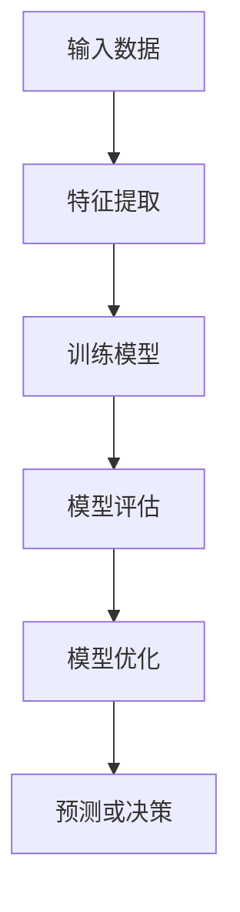
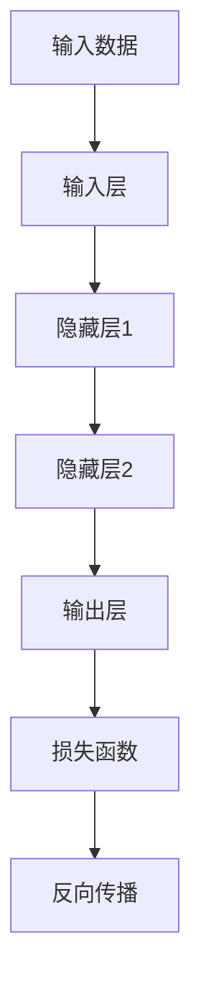
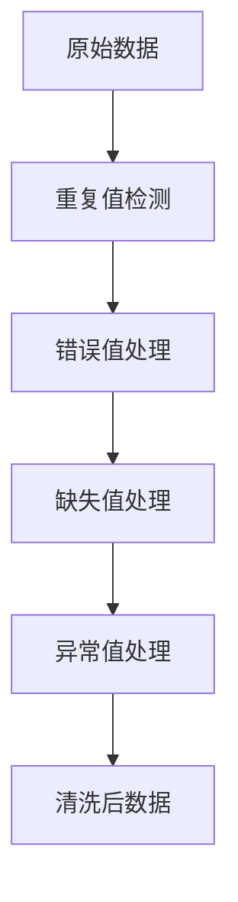
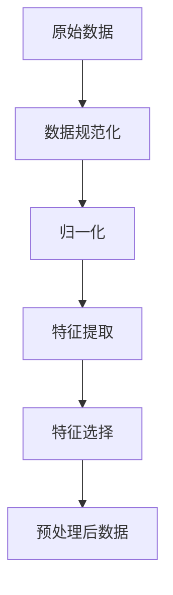
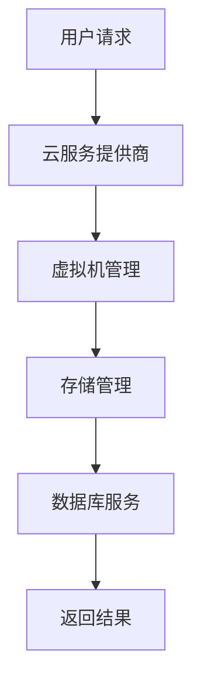
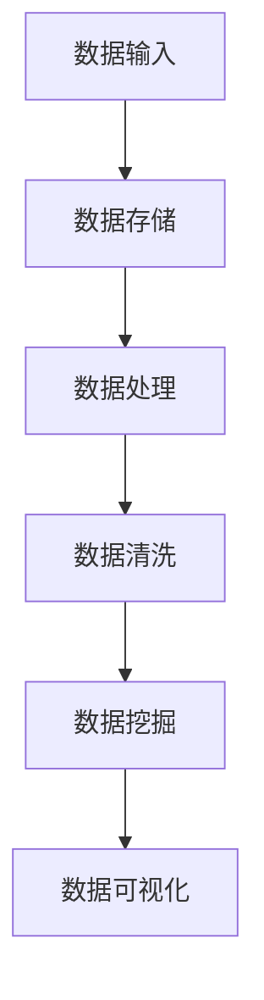
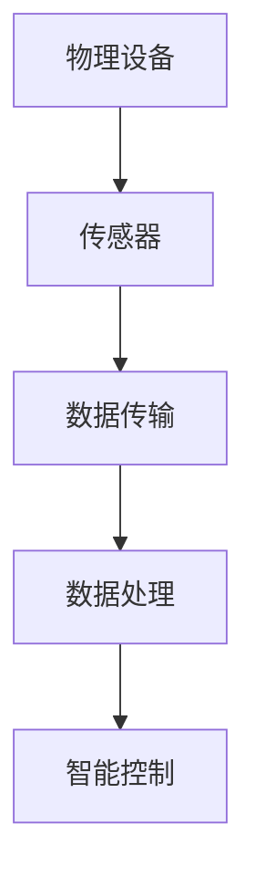
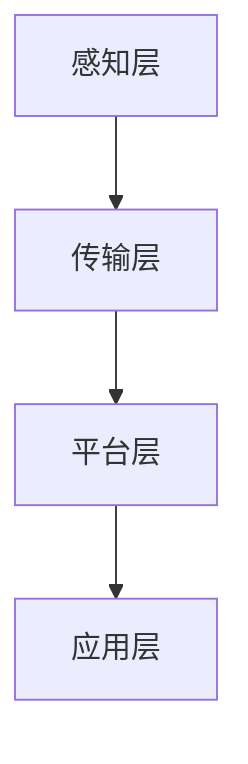

                 

### 第1章：数智化的定义与背景

在当今快速发展的信息技术时代，"数智化"已经成为推动产业升级、创新商业模式、提升竞争力的关键动力。本章将深入探讨数智化的定义、核心要素、背景及其重要性。

#### 1.1 数智化的定义

数智化，又称数字化智能化，是指通过数字化技术的应用，将传统产业的信息化、自动化、智能化水平提升到一个新的高度。数智化不仅仅是技术的应用，更是一个系统的过程，它涉及到数据的采集、存储、处理、分析和应用，通过这些环节实现业务流程的优化和效率提升。

- **信息化**：这是数智化的初级阶段，主要是通过信息技术的应用，提高企业的信息处理能力和效率。例如，企业内部的信息系统建设、电子文档管理等。
- **自动化**：在信息化基础上，通过引入自动化技术，减少人工干预，提高生产效率和准确性。自动化技术包括机器人、自动化生产线、自动化物流等。
- **智能化**：这是数智化的高级阶段，通过人工智能、大数据等技术的应用，实现业务流程的智能化优化。智能化可以帮助企业做出更精准的决策，提高市场竞争力和用户体验。

#### 1.2 数智化的核心要素

数智化的实现离不开以下几个核心要素：

- **数据**：数据是数智化的基础，没有数据就无法进行有效的分析和决策。数据的质量、多样性和实时性对数智化的效果至关重要。
- **算法**：算法是实现数智化的重要工具，包括机器学习、深度学习、自然语言处理等。算法通过对大量数据的处理和分析，可以提取出有用的信息，辅助决策。
- **计算能力**：随着数据的爆炸性增长，计算能力成为数智化的关键支撑。云计算、边缘计算等技术的发展，为大规模数据处理和实时分析提供了可能。
- **应用场景**：数智化技术需要与具体的应用场景相结合，才能真正发挥其价值。例如，在制造业中，可以通过智能化生产线的应用提升生产效率；在零售业中，可以通过个性化推荐提升用户体验和销售额。
- **生态系统**：数智化的发展需要良好的生态系统支持，包括政策、技术标准、产业环境等。一个良好的生态系统可以促进技术的创新和应用。

#### 1.3 数智化的背景

数智化的背景可以从以下几个方面来理解：

- **技术背景**：信息技术的发展，尤其是互联网、大数据、人工智能等技术的进步，为传统产业的数字化、智能化升级提供了技术支持。
- **社会背景**：随着全球经济的发展和产业升级的需求，企业需要通过提高生产效率、降低成本、提升服务质量来增强竞争力。数智化技术可以帮助企业实现这些目标。
- **经济背景**：数智化技术可以推动产业升级和经济发展，提高企业的创新能力和市场竞争力，从而带动整个经济的增长。

#### 1.4 数智化的意义与价值

数智化对企业和产业具有重要意义和价值：

- **提高生产效率**：通过自动化、智能化技术的应用，可以大幅提高生产效率和准确性，减少人为错误。
- **降低运营成本**：通过优化业务流程和资源配置，可以降低企业的运营成本，提高经济效益。
- **创新商业模式**：数智化技术可以为企业创造新的商业模式，拓展市场空间，实现业务增长。
- **提升竞争力**：通过数据驱动决策和智能化管理，可以提高企业的市场竞争力，保持领先地位。
- **促进产业升级**：数智化技术可以推动传统产业的转型升级，实现产业的高端化、智能化发展。

#### 1.5 数智化的发展趋势

未来，数智化技术将呈现以下几个发展趋势：

- **技术成熟度提升**：随着技术的不断进步，数智化技术的成熟度将进一步提高，应用范围将更加广泛。
- **跨领域融合**：不同技术之间的融合将成为趋势，例如，人工智能与物联网、大数据的结合，将推动更多领域的创新应用。
- **个性化与定制化**：数智化技术将更加注重个性化与定制化服务，满足不同企业和用户的需求。
- **数据安全与隐私保护**：随着数据规模的增加，数据安全和隐私保护将成为数智化发展的重要课题。

#### 1.6 数智化面临的挑战

尽管数智化带来了巨大的机遇，但也面临一些挑战：

- **技术挑战**：数智化技术涉及多个领域，技术复杂度高，需要大量专业的技术人才和研发投入。
- **数据挑战**：数据的准确性、完整性和实时性是数智化成功的关键，但如何保证数据的质量是一个重大挑战。
- **安全挑战**：随着数据规模的扩大和应用的复杂度增加，数据安全和隐私保护面临更大的风险。
- **人才挑战**：数智化的发展需要大量具备相关技能的人才，但目前人才供需不平衡，人才短缺是一个突出问题。

#### 1.7 数智化的发展策略

为了应对数智化面临的挑战，企业需要采取以下发展策略：

- **技术创新**：持续进行技术创新，提升技术成熟度和应用水平。
- **数据驱动**：建立完善的数据管理体系，实现数据的高效采集、处理和分析。
- **应用创新**：结合具体业务场景，实现数智化技术的实际应用，提升业务效率。
- **人才培养**：加强数智化人才的培养和引进，提升团队的技术能力和业务素质。
- **合作共赢**：与产业链上下游企业、研究机构、政府等各方加强合作，共同推动数智化技术的发展和应用。

通过上述步骤，我们可以清晰地理解数智化的定义、背景、意义、价值和面临的挑战，以及如何应对这些挑战。接下来，我们将深入探讨数智化技术的核心原理和应用领域。

---

### 1.1.1 数智化的概念

数智化是一个多维度的概念，它不仅仅局限于技术层面，还涵盖了管理、业务流程等多个方面。在技术层面，数智化主要通过以下几个方面来实现：

- **信息化**：这是数智化的基础，通过信息技术，如计算机、互联网、数据库等，提高企业的信息处理能力和效率。信息化主要包括企业内部的信息系统建设、电子文档管理、信息共享等。
  
- **自动化**：在信息化基础上，通过引入自动化技术，减少人工干预，提高生产效率和准确性。自动化技术可以应用于生产流程中的各个环节，如自动化生产线、自动化仓储、自动化物流等。

- **智能化**：这是数智化的高级阶段，通过人工智能、大数据等技术的应用，实现业务流程的智能化优化。智能化可以通过数据分析和预测，帮助企业做出更精准的决策，提高用户体验和运营效率。

在管理层面，数智化还涉及到以下关键要素：

- **数据管理**：数据是数智化的核心资产，企业需要建立完善的数据管理体系，确保数据的准确性、完整性和安全性。

- **流程优化**：通过流程分析和优化，消除业务流程中的瓶颈和冗余，提高整体运营效率。

- **智能决策**：利用大数据分析和人工智能技术，帮助企业实现数据驱动决策，提高决策的科学性和准确性。

在业务流程层面，数智化通过以下方式实现业务流程的优化和提升：

- **实时监控**：通过物联网技术，实现对业务流程的实时监控和反馈，确保各个环节的顺利进行。

- **预测分析**：通过数据分析和预测技术，提前识别潜在问题，采取措施进行预防。

- **智能优化**：通过机器学习和深度学习技术，自动调整业务流程，实现最优资源配置。

总的来说，数智化是一个系统工程，它通过信息技术、自动化、智能化手段，对企业的业务流程进行全面的优化和提升，从而实现更高的生产效率、更低的运营成本、更优的用户体验。

#### 1.1.2 数智化的核心要素

数智化作为一项综合性的技术革命，其实现离不开以下几个核心要素的协同作用。这些要素相互关联、相互支撑，共同构建了一个完善的数智化生态系统。

1. **数据**：数据是数智化的基础。一个有效的数智化系统必须能够收集、存储、处理和分析大量结构化和非结构化数据。这些数据来源于企业内部的各种业务系统、设备传感器、互联网等渠道。数据的质量、准确性和实时性直接影响数智化应用的效果。例如，在智能制造领域，通过传感器收集的实时生产数据，可以帮助企业实时监控生产过程，优化生产计划和资源配置。

2. **算法**：算法是实现数智化的关键工具。算法通过处理和解析数据，为企业和用户提供了智能化决策支持。常见的算法包括机器学习、深度学习、自然语言处理、预测分析等。这些算法在数据处理、模式识别、预测分析等方面发挥着重要作用。例如，在金融领域，通过机器学习算法分析历史交易数据，可以预测市场走势，帮助投资者做出更明智的投资决策。

3. **计算能力**：计算能力是数智化的动力源泉。随着数据规模的不断增长，对计算能力的要求也越来越高。云计算、边缘计算等技术的应用，为大规模数据处理和实时分析提供了强大的计算支持。例如，在医疗领域，通过云计算平台处理海量患者数据，可以实现精准的疾病诊断和个性化治疗方案。

4. **应用场景**：应用场景是数智化的具体实现形式。不同的行业和领域对数智化的需求各不相同，需要根据具体的应用场景来设计和实施数智化解决方案。常见的应用场景包括智能制造、智慧金融、新零售、智慧医疗等。例如，在智能制造领域，通过智能化生产线的应用，可以实现生产过程的自动化和优化；在智慧医疗领域，通过人工智能技术，可以实现疾病预测和精准治疗。

5. **生态系统**：生态系统是数智化发展的土壤。一个良好的生态系统包括政策、法规、技术标准、产业环境、人才培养等各个方面。政策支持可以为企业提供良好的发展环境；技术标准可以确保不同系统之间的兼容性和互操作性；产业环境可以促进产业链上下游的协同发展；人才培养可以为企业提供充足的技术人才储备。例如，政府在制定数字经济政策时，可以鼓励企业加大数智化技术的研发和应用力度，从而推动整个产业的升级和发展。

综上所述，数据、算法、计算能力、应用场景和生态系统是数智化的核心要素。这些要素相互作用，共同构建了一个完整的数智化生态系统，为企业提供了全方位的智能化解决方案。

#### 1.2.1 技术背景

数智化的发展离不开信息技术的不断进步。20世纪80年代以来，计算机技术、通信技术、互联网技术等得到了飞速发展，为传统产业的数字化、智能化升级提供了技术支撑。

1. **计算机技术**：计算机技术的发展为数据处理提供了强大的计算能力。从最初的冯·诺依曼架构，到后来的多核处理器、GPU计算，计算机性能不断提升，使得大规模数据处理和复杂算法的实现成为可能。例如，通过分布式计算和并行计算技术，企业可以高效地处理海量数据，实现实时分析和决策。

2. **通信技术**：通信技术的进步，特别是互联网的普及，使得信息传输更加迅速、便捷。互联网的全球覆盖和高速传输，为数据采集、共享和处理提供了基础。通过物联网（IoT）技术，设备之间可以实现实时通信和数据交换，为智能化应用提供了数据支持。

3. **人工智能**：人工智能技术的突破，使得机器可以模仿人类的智能行为，实现自动化和智能化。机器学习、深度学习、自然语言处理等技术的应用，使得计算机能够从海量数据中学习规律，进行智能决策。例如，在图像识别、语音识别、智能推荐等领域，人工智能技术已经取得了显著的成果。

4. **物联网**：物联网技术的普及，使得万物互联成为可能，为数据采集和实时监控提供了基础。通过传感器和智能设备，企业可以实时收集生产、运营、销售等各类数据，实现对业务流程的全面监控和优化。例如，在智能制造领域，通过物联网技术，可以实现生产设备的远程监控和维护，提高生产效率。

5. **大数据**：大数据技术的发展，使得海量数据的存储、处理和分析成为可能，为智能化决策提供了数据支持。大数据技术包括数据采集、存储、处理、分析和可视化等环节，通过这些环节，企业可以从海量数据中提取有价值的信息，进行深度分析和挖掘。例如，在零售行业，通过大数据分析，企业可以了解消费者的购物行为，实现精准营销。

6. **云计算**：云计算技术提供了强大的计算能力和存储能力，为大规模数据处理和实时分析提供了支持。通过云计算，企业可以灵活地扩展计算资源，降低运维成本。例如，在金融领域，通过云计算平台，可以实现海量交易数据的实时处理和分析，提高风险管理能力。

7. **边缘计算**：边缘计算将计算能力延伸到网络的边缘，即在数据产生的地方进行数据处理和分析，减少了数据传输的延迟和带宽压力。边缘计算适用于实时性要求高的场景，如自动驾驶、智能制造等。通过边缘计算，企业可以实现快速响应和智能决策。

总之，数智化的发展离不开信息技术的进步。计算机技术、通信技术、人工智能、物联网、大数据、云计算和边缘计算等技术共同推动了数智化技术的发展，为传统产业的数字化、智能化升级提供了强大的技术支撑。

#### 1.2.2 社会背景

数智化作为一项引领未来的技术革命，其发展的社会背景可以从经济、科技、政策和人才等方面进行深入探讨。

1. **经济背景**：随着全球经济的快速发展和产业结构的不断调整，传统产业面临着转型升级的压力。数智化技术的应用，可以提高生产效率、降低运营成本、创新商业模式，从而增强企业的竞争力。例如，在制造业中，通过智能化生产线的应用，可以实现生产过程的自动化和精细化，提高生产效率，降低产品成本。在服务业中，通过大数据分析和人工智能技术，可以实现个性化服务和精准营销，提升用户体验和满意度。因此，数智化技术的应用成为推动经济增长和产业升级的重要动力。

2. **科技背景**：科技的飞速发展，尤其是人工智能、大数据、物联网等新兴技术的突破，为传统产业的数字化、智能化升级提供了技术支撑。人工智能技术可以通过机器学习和深度学习，实现数据的高效处理和智能分析；大数据技术可以实现对海量数据的存储、管理和分析；物联网技术可以实现设备之间的互联互通，实现数据的实时采集和监控。这些技术的进步，为传统产业注入了新的活力，推动了数智化技术的广泛应用。

3. **政策背景**：各国政府高度重视数智化技术的发展，纷纷出台相关政策，鼓励企业加大技术研发和应用力度。例如，中国政府提出了“互联网+”和“智能制造”等战略，支持企业利用大数据、人工智能等新技术实现转型升级。美国政府则通过《国家人工智能战略》等政策，推动人工智能技术的发展和应用。这些政策的支持，为企业的数字化转型提供了良好的外部环境。

4. **人才背景**：数智化技术的发展，对专业人才的需求日益增加。企业需要具备大数据分析、人工智能、物联网等技能的人才，来推动技术的应用和创新。然而，目前市场上相关人才供需不平衡，人才短缺成为数智化发展的重要制约因素。因此，加强人才培养和引进，提高人才的素质和技能水平，成为推动数智化发展的重要任务。

5. **社会趋势**：随着数智化技术的普及，人们的生活方式和社会生产方式正在发生深刻变革。通过物联网技术，家庭设备和家电可以实现互联互通，为人们提供更加便捷和智能的生活体验。在医疗领域，通过大数据分析和人工智能技术，可以实现疾病的精准诊断和个性化治疗。在教育领域，通过在线教育平台和智能教学系统，可以打破地域限制，实现教育资源的公平分配。因此，数智化技术已经成为推动社会进步和民生改善的重要力量。

综上所述，数智化的发展具有深厚的经济、科技、政策和人才背景。随着科技的不断进步和政策的支持，数智化技术将在各个领域得到广泛应用，推动社会的全面进步和发展。

#### 1.3 数智化的意义与价值

数智化作为现代信息技术发展的重要成果，对企业和产业发展具有重要意义和价值。以下从多个方面阐述数智化的意义与价值：

1. **提高生产效率**：数智化技术的应用可以大幅提高生产效率。通过自动化和智能化技术的引入，企业可以实现生产线的自动化运行，减少人工干预，降低生产成本。例如，在制造业中，通过智能化生产设备和生产线，可以实现生产过程的实时监控和优化，提高生产效率和产品质量。

2. **降低运营成本**：数智化技术的应用还可以有效降低企业的运营成本。通过大数据分析和智能化管理，企业可以优化资源配置，减少浪费，提高资源利用率。例如，在物流领域，通过物联网技术实现货物的实时追踪和优化运输路线，可以降低物流成本，提高物流效率。

3. **创新商业模式**：数智化技术为企业创造新的商业模式提供了可能。通过大数据分析和人工智能技术，企业可以深入了解客户需求，实现个性化推荐和精准营销，提升客户满意度和忠诚度。例如，在零售业中，通过大数据分析，可以了解消费者的购物习惯和偏好，实现精准营销，提高销售转化率。

4. **提升竞争力**：数智化技术可以帮助企业提升市场竞争力。通过数据驱动决策和智能化管理，企业可以更加精准地把握市场动态，快速响应市场变化，提高市场竞争力。例如，在金融领域，通过大数据分析和人工智能技术，可以实时监控市场风险，进行风险管理和投资决策，提高投资收益。

5. **促进产业升级**：数智化技术的应用可以推动传统产业的转型升级。通过引入智能化技术和数字化管理，企业可以实现从传统制造向智能制造的转变，提高产业附加值。例如，在制造业中，通过智能制造技术，可以实现生产过程的自动化和智能化，提高生产效率和产品质量，推动产业升级。

6. **优化资源配置**：数智化技术可以帮助企业实现资源的优化配置。通过大数据分析和人工智能技术，企业可以了解市场需求和供应情况，实现供需匹配，降低资源浪费。例如，在能源领域，通过大数据分析和智能调度，可以实现能源的合理分配和高效利用，降低能源消耗。

7. **提升用户体验**：数智化技术的应用可以提升用户体验。通过物联网技术和智能设备，企业可以提供更加便捷和个性化的服务。例如，在医疗领域，通过智能医疗设备和在线服务平台，可以实现患者的远程监控和个性化治疗，提升医疗服务的质量和效率。

8. **增强数据安全**：数智化技术的应用还可以提高数据的安全性和隐私保护。通过数据加密、访问控制和安全分析等技术，企业可以确保数据的机密性和完整性，防止数据泄露和滥用。例如，在金融领域，通过数据安全和隐私保护技术，可以确保客户信息的安全，提升客户信任度。

综上所述，数智化技术具有广泛的应用价值，可以提高生产效率、降低运营成本、创新商业模式、提升竞争力、促进产业升级、优化资源配置、提升用户体验和增强数据安全，为企业和产业的发展注入新的动力。

---

### 1.4 数智化的发展趋势

数智化作为现代信息技术的重要组成部分，其发展呈现出以下几个显著趋势：

#### 1.4.1 技术趋势

随着人工智能、大数据、物联网等技术的不断进步，数智化技术也在不断演进。未来，数智化技术将向以下几个方面发展：

1. **人工智能技术的深化应用**：人工智能技术将在数智化中的应用更加深入，从简单的规则推理和模式识别，发展到更为复杂的自适应学习和智能决策。例如，在智能制造领域，人工智能可以通过实时数据分析，实现生产过程的自我优化和故障预测。

2. **大数据技术的融合创新**：大数据技术的核心在于处理和分析海量数据，未来将更加注重数据的多样性、实时性和可解释性。例如，通过增强现实（AR）和虚拟现实（VR）技术，可以实现更加直观和高效的数据分析。

3. **物联网技术的广泛应用**：物联网技术将继续扩展其应用范围，从智能家居、智能城市，到工业物联网（IIoT）和智能农业。物联网设备将更加智能化，能够实现自主学习和自适应优化。

4. **区块链技术的融合**：区块链技术以其去中心化、安全性和不可篡改性，将在数据存储、供应链管理、金融交易等领域得到广泛应用。例如，通过区块链技术，可以实现供应链的透明化和高效管理。

#### 1.4.2 应用趋势

数智化技术的应用将不断深入和拓宽，从现有的智能制造、智慧金融、新零售等领域，扩展到更多新兴领域：

1. **智慧医疗**：通过大数据和人工智能技术，可以实现精准医疗和个性化治疗。例如，通过对患者数据的分析，可以预测疾病发展趋势，制定个性化的治疗计划。

2. **智慧教育**：在线教育平台和智能教学系统将继续发展，通过数据分析和人工智能技术，可以实现个性化教学和学习效果评估。

3. **智慧城市**：通过物联网、大数据和人工智能技术，可以实现城市管理的智能化和精细化。例如，通过智能交通系统，可以实时监控交通流量，优化交通信号，减少拥堵。

4. **智慧农业**：通过物联网技术，可以实现农作物的精准管理和智能灌溉，提高农业生产的效率和质量。

#### 1.4.3 政策趋势

政府政策的支持将对数智化技术的发展产生重要影响。未来，政府将采取以下政策措施：

1. **加强技术创新**：政府将加大对数智化技术研发的投入，支持企业和科研机构开展技术创新和研发活动。

2. **推进数字化转型**：政府将推动各行业和企业的数字化转型，出台相关政策和标准，规范数据采集、存储和处理。

3. **优化人才培养**：政府将加大对数智化人才培养的支持力度，通过职业教育和继续教育，提高人才的技能水平和综合素质。

4. **强化数据安全**：政府将加强数据安全法规的制定和执行，确保数据的机密性、完整性和可用性。

#### 1.4.4 生态趋势

数智化技术的发展将促进产业链上下游企业的协同创新，形成完善的生态体系。未来，数智化生态将呈现以下特点：

1. **跨界合作**：不同行业和企业之间的合作将更加紧密，通过跨界合作，实现资源的共享和优势互补。

2. **开放共享**：数智化生态将更加开放，通过开放平台和标准，实现数据、技术和应用的共享。

3. **平台化发展**：数智化技术将推动平台经济的发展，通过搭建平台，实现产业链各环节的集成和优化。

4. **生态系统完善**：随着数智化技术的发展，将形成更加完善的生态系统，包括技术、服务、应用、政策和人才等各个方面。

综上所述，数智化技术的发展趋势将体现在技术深化应用、应用领域扩展、政策支持加强和生态体系完善等方面。通过这些趋势，数智化技术将在更多领域得到应用，推动社会的全面进步和发展。

---

### 1.5 数智化面临的挑战

尽管数智化技术为企业带来了巨大的机遇，但在其发展过程中也面临着诸多挑战。以下是数智化面临的几个主要挑战及其应对策略：

#### 1.5.1 技术挑战

数智化技术的复杂性和多样性是其面临的重要技术挑战。以下是一些具体的技术挑战：

1. **技术融合**：数智化技术涉及多个领域，如人工智能、大数据、物联网等，这些技术的融合和协同应用需要解决兼容性、互操作性和标准化问题。

2. **算法性能**：随着数据规模的扩大和业务需求的提高，对算法的性能要求也越来越高。如何设计高效、稳定的算法，满足实时性和准确性要求，是一个重要挑战。

3. **系统可靠性**：数智化系统需要保证稳定运行和高可靠性。但在实际应用中，由于系统的复杂性，可能会出现故障和错误，影响业务连续性和数据完整性。

**应对策略**：

- **技术研发**：企业应加大技术研发投入，提高技术储备和创新能力，确保在技术竞争中保持领先地位。

- **技术标准**：制定和遵循统一的技术标准，促进不同技术之间的互操作性和兼容性。

- **系统测试**：加强系统测试和验证，确保系统的稳定性和可靠性。

#### 1.5.2 数据挑战

数据是数智化技术的基础，但数据的质量、多样性和实时性直接影响数智化的效果。以下是一些具体的数据挑战：

1. **数据质量**：数据质量是数智化成功的关键。数据的不准确、不完整或不一致，会严重影响分析结果的准确性和决策的可靠性。

2. **数据多样性**：数智化技术需要处理多种类型的数据，包括结构化数据、半结构化数据和非结构化数据。如何高效地处理和整合这些不同类型的数据，是一个挑战。

3. **数据安全**：随着数据规模的扩大，数据安全和隐私保护面临更大的威胁。如何确保数据的安全性，防止数据泄露和滥用，是一个重要挑战。

**应对策略**：

- **数据治理**：建立完善的数据治理体系，确保数据的准确性、完整性和一致性。

- **数据标准化**：制定统一的数据标准和规范，确保不同数据源之间的兼容性和互操作性。

- **数据安全**：加强数据安全防护，采用加密、访问控制等技术，确保数据的机密性和完整性。

#### 1.5.3 安全挑战

数智化系统涉及到大量的数据和信息，数据安全和隐私保护面临重大挑战。以下是一些具体的安全挑战：

1. **数据泄露**：随着数据量的增加，数据泄露的风险也在增加。如何确保数据在传输、存储和处理过程中的安全性，是一个重要挑战。

2. **网络攻击**：数智化系统通常连接到互联网，容易受到网络攻击。如何防范黑客攻击、病毒入侵等安全威胁，是一个重要问题。

3. **隐私保护**：在数智化应用中，个人隐私保护成为一个重要问题。如何确保用户数据的隐私，防止数据滥用，是一个挑战。

**应对策略**：

- **安全防护**：采用网络安全防护技术，如防火墙、入侵检测系统（IDS）等，确保系统的安全性。

- **数据加密**：对敏感数据进行加密处理，确保数据在传输和存储过程中的安全性。

- **隐私保护**：制定隐私保护政策，确保用户数据的安全和隐私。

#### 1.5.4 人才挑战

数智化技术的发展对人才的需求提出了更高的要求。以下是一些具体的人才挑战：

1. **技能短缺**：数智化技术涉及多个领域，对专业人才的需求量大。然而，目前市场上具备相关技能的人才相对短缺，满足不了市场需求。

2. **知识更新**：数智化技术更新速度快，人才需要不断学习和更新知识，以适应新技术的发展。

3. **综合素质**：数智化人才不仅需要具备技术技能，还需要具备业务理解能力、沟通协作能力和创新思维。

**应对策略**：

- **人才培养**：加强数智化人才培养，通过校企合作、在线教育等方式，提高人才的技能水平和综合素质。

- **人才引进**：通过引进高端人才，提升团队的技术水平和创新能力。

- **持续学习**：鼓励员工持续学习和创新，适应技术发展的需要。

综上所述，数智化在发展过程中面临着技术、数据、安全、人才等多方面的挑战。通过采取有效的应对策略，可以克服这些挑战，推动数智化技术的健康发展。

---

### 1.6 数智化的发展策略

要应对数智化面临的诸多挑战，企业需要制定科学的发展策略，从技术创新、数据管理、人才培养、合作共赢等多个方面进行系统性规划和实施。

#### 1.6.1 技术创新

技术创新是推动数智化发展的核心动力。企业应持续加大技术研发投入，推动技术的创新和突破。以下是一些具体策略：

1. **研发投入**：企业应建立长期研发投入机制，确保资金和资源的持续投入，支持技术研发。

2. **合作研发**：与企业内外部科研机构、高校等进行合作，共同开展技术研发，提升技术储备。

3. **技术创新中心**：建立企业级技术创新中心，集中资源和力量，进行前沿技术的探索和应用。

#### 1.6.2 数据管理

数据是数智化的核心资产，企业需要建立完善的数据管理体系，确保数据的质量、安全和可用性。以下是一些具体策略：

1. **数据治理**：建立数据治理体系，规范数据采集、存储、处理和分析的过程，确保数据的准确性、完整性和一致性。

2. **数据标准化**：制定统一的数据标准和规范，确保数据在不同系统之间的兼容性和互操作性。

3. **数据安全**：加强数据安全防护，采用加密、访问控制等技术，确保数据在传输、存储和处理过程中的安全性。

#### 1.6.3 人才培养

数智化技术的发展对人才的需求提出了更高的要求，企业需要加强人才培养，提升员工的技术能力和业务素质。以下是一些具体策略：

1. **培训体系**：建立完善的培训体系，提供持续的职业技能培训和知识更新，满足技术发展的需求。

2. **人才引进**：通过招聘、人才引进计划等，吸引高端人才，提升团队的技术实力。

3. **人才发展**：制定人才发展规划，为员工提供职业发展和晋升通道，激励员工持续成长。

#### 1.6.4 应用创新

数智化技术应与具体业务场景相结合，实现技术的实际应用，提升业务效率和竞争力。以下是一些具体策略：

1. **场景化应用**：结合企业的具体业务需求，设计和实施数智化应用方案，实现技术的实际应用。

2. **试点项目**：通过试点项目，验证技术的可行性和效果，积累经验和案例，为大规模推广奠定基础。

3. **持续改进**：通过不断的迭代和优化，提升数智化应用的成熟度和效果。

#### 1.6.5 合作共赢

数智化技术的发展需要产业链各方的共同参与和合作，企业应加强产业链上下游的合作，形成良好的生态系统。以下是一些具体策略：

1. **产业链合作**：与产业链上下游企业建立合作关系，共享资源、技术和市场信息，实现互利共赢。

2. **开放平台**：建立开放的技术平台和标准，促进不同企业之间的技术交流和合作。

3. **生态建设**：积极参与数智化生态建设，推动产业链的协同发展，形成良好的生态体系。

综上所述，企业应通过技术创新、数据管理、人才培养、应用创新和合作共赢等多方面的策略，积极应对数智化发展中的挑战，推动数智化技术的健康发展和广泛应用。

---

### 1.7 数智化案例分析

为了更好地理解数智化技术在实际应用中的效果和挑战，以下通过三个具体案例来分析数智化技术在不同领域的应用情况。

#### 1.7.1 案例一：智能制造

**案例背景**：某家电制造企业，通过引入数智化技术，实现生产线的自动化和智能化，提高生产效率和产品质量。

**案例分析**：

- **自动化生产线**：企业引入了先进的自动化生产线，包括自动化装配线、自动化检测设备等。通过机器人替代人工，实现了生产过程的自动化，减少了人为操作误差，提高了生产效率。

- **大数据分析**：企业利用大数据技术，对生产过程中的各种数据进行实时监控和分析，包括设备运行状态、生产效率、产品质量等。通过数据分析，及时发现和解决生产中的问题，优化生产流程。

- **人工智能优化**：企业通过人工智能技术，对生产数据进行深度分析，实现了生产过程的智能化优化。例如，通过预测分析，提前发现设备故障，进行预防性维护，减少设备停机时间，提高生产效率。

**案例效果**：

- **生产效率提高**：通过自动化生产线和智能化优化，企业的生产效率提高了30%以上。
- **产品质量提升**：通过大数据分析和人工智能技术，产品质量得到了显著提升，产品合格率提高了10%。
- **运营成本降低**：通过自动化和智能化技术的应用，企业的运营成本降低了15%。

#### 1.7.2 案例二：智慧金融

**案例背景**：某金融机构，通过大数据分析和人工智能技术，提升了金融服务质量和效率。

**案例分析**：

- **客户数据分析**：金融机构通过大数据技术，对客户的交易行为、投资偏好、信用记录等进行深入分析，了解客户需求和行为模式。

- **智能推荐系统**：基于客户数据分析，金融机构开发了智能推荐系统，为不同客户提供个性化的金融产品和服务，提高了客户满意度和忠诚度。

- **风险管理**：金融机构通过人工智能技术，对市场风险和信用风险进行实时监控和分析，实现了风险管理和投资决策的智能化。

**案例效果**：

- **客户满意度提高**：通过智能推荐系统，客户满意度提高了15%，客户留存率增加了10%。
- **业务效率提升**：通过自动化处理和智能分析，业务处理效率提高了30%，客户服务响应时间缩短了50%。
- **风险控制加强**：通过智能风险管理，金融机构的风险控制能力得到了显著提升，不良贷款率降低了5%。

#### 1.7.3 案例三：新零售

**案例背景**：某零售企业，通过大数据分析和人工智能技术，实现线上线下的融合，提升购物体验和销售转化率。

**案例分析**：

- **消费者行为分析**：零售企业通过大数据技术，对消费者的购物行为、浏览记录、反馈信息等进行深入分析，了解消费者偏好和需求。

- **个性化推荐系统**：基于消费者行为分析，企业开发了个性化推荐系统，为不同消费者提供个性化的商品推荐，提高了购物体验和满意度。

- **智能库存管理**：通过大数据分析和人工智能技术，企业实现了智能库存管理，优化库存水平，减少库存成本。

**案例效果**：

- **销售转化率提升**：通过个性化推荐系统，销售转化率提高了20%，线下门店的销售额增加了15%。
- **库存成本降低**：通过智能库存管理，库存成本降低了10%，库存周转率提高了20%。
- **购物体验提升**：通过线上线下的融合，消费者可以享受更加便捷和个性化的购物体验，客户满意度提高了30%。

通过以上案例分析，可以看出数智化技术在各个领域的应用，不仅提升了企业的效率和竞争力，还带来了显著的商业价值。同时，这些案例也展示了数智化技术在应用过程中面临的一些挑战，如数据质量、技术稳定性、安全性和人才短缺等。企业需要通过不断的技术创新和优化，克服这些挑战，实现数智化的全面应用。

---

### 1.8 总结

数智化作为现代信息技术的重要成果，正逐步渗透到各个领域，推动产业升级、创新商业模式和提升企业竞争力。本章从数智化的定义、核心要素、背景、意义、发展趋势、挑战以及发展策略等方面进行了详细探讨，总结了数智化的重要性和应用价值。

首先，数智化是指通过数字化技术的应用，实现传统产业的信息化、自动化和智能化升级。其核心要素包括数据、算法、计算能力、应用场景和生态系统。在技术背景方面，计算机技术、通信技术、人工智能、物联网和大数据等技术的发展为传统产业的数字化、智能化升级提供了强有力的支撑。在社会背景方面，数智化与经济转型、科技创新、政策支持和人才培养等密切相关。

数智化的意义和价值主要体现在以下几个方面：提高生产效率、降低运营成本、创新商业模式、提升竞争力、促进产业升级、优化资源配置和提升用户体验。随着人工智能、大数据、物联网等技术的不断进步，数智化技术将向技术成熟度提升、跨领域融合、个性化与定制化、数据安全与隐私保护等方向发展。

然而，数智化在发展过程中也面临诸多挑战，包括技术挑战、数据挑战、安全挑战和人才挑战。为了克服这些挑战，企业需要采取技术创新、数据管理、人才培养、应用创新和合作共赢等多方面的策略。通过具体的案例分析，我们可以看到数智化技术在智能制造、智慧金融和新零售等领域的广泛应用，以及其在提升效率、降低成本、优化服务和增强竞争力方面的显著效果。

总之，数智化是新时代的重要特征，具有重要的意义和价值。企业应积极应对挑战，加强技术创新、数据驱动、应用创新、人才培养和合作共赢，推动数智化技术的发展和应用。通过数智化，企业可以实现从传统产业向现代产业的转型升级，提升竞争力，创造新的商业价值。数智化的发展不仅将推动企业自身的变革，也将对整个社会的进步产生深远的影响。

---

### 第2章：核心技术与原理

在数智化的进程中，核心技术的创新与原理的深入理解是关键。本章将深入探讨数智化中的核心技术，包括人工智能基础、数据分析、云计算与大数据、以及物联网技术，这些技术构成了数智化实现的基础框架。

#### 2.1 人工智能基础

人工智能（AI）是数智化的核心驱动力之一，其基础包括机器学习和深度学习等。以下是对这些基础技术的简要介绍：

##### 2.1.1 机器学习

**概念**：机器学习是一种使计算机系统能够从数据中学习并改进性能的技术。它通过构建模型，从已有数据中自动提取规律和模式。

**原理**：

**算法**：常见的机器学习算法包括线性回归、决策树、支持向量机（SVM）和神经网络等。以下是一个简单的线性回归算法的伪代码：
```python
# 线性回归伪代码
def linear_regression(x, y):
    # x: 特征向量
    # y: 标签向量
    n = len(x)
    # 求斜率（w1）和截距（w0）
    w1 = (sum([xi*yi for xi, yi in zip(x, y)]) - (sum(x) * sum(y)) / n) / (sum([xi**2 for xi in x]) - (sum(x)**2 / n))
    w0 = (sum(y) - w1 * sum(x)) / n
    return w1, w0
```

##### 2.1.2 深度学习

**概念**：深度学习是一种利用多层神经网络进行学习的技术，能够从大量非结构化数据中自动提取复杂特征。

**原理**：

**算法**：深度学习算法包括卷积神经网络（CNN）、循环神经网络（RNN）、生成对抗网络（GAN）等。以下是一个简单的多层感知器（MLP）的伪代码：
```python
# 多层感知器伪代码
import numpy as np

def forward_propagation(x, weights):
    # x: 输入数据
    # weights: 权重
    z = np.dot(x, weights['W1']) + weights['b1']
    a1 = sigmoid(z)
    
    z = np.dot(a1, weights['W2']) + weights['b2']
    a2 = sigmoid(z)
    
    return a2

def backward_propagation(a2, y, weights):
    # a2: 输出层激活值
    # y: 真实标签
    # weights: 权重
    dz2 = a2 - y
    dW2 = np.dot(dz2, a1.T)
    db2 = np.sum(dz2, axis=0)
    
    dz1 = np.dot(dz2, weights['W2'].T)
    dW1 = np.dot(dz1, x.T)
    db1 = np.sum(dz1, axis=0)
    
    return dW1, dW2, db1, db2
```

##### 2.1.3 自然语言处理

**概念**：自然语言处理（NLP）是人工智能的一个分支，专注于使计算机理解和生成人类语言。

**原理**：NLP技术包括词向量表示、文本分类、命名实体识别、机器翻译等。以下是一个简单的词向量表示的伪代码：
```python
# 词向量表示伪代码
def word2vec(sentences, vocabulary_size):
    # sentences: 文本数据
    # vocabulary_size: 词汇表大小
    embedding_matrix = np.zeros((vocabulary_size, embedding_size))
    for sentence in sentences:
        for word in sentence:
            if word in vocabulary:
                index = vocabulary[word]
                embedding_matrix[index] = sentence_embedding
    return embedding_matrix
```

#### 2.2 数据分析

数据分析是数智化的另一个核心环节，它涉及到数据清洗、数据预处理、数据可视化等。

##### 2.2.1 数据清洗

**概念**：数据清洗是指从原始数据中删除重复、错误或不完整的数据，提高数据质量。

**原理**：


##### 2.2.2 数据预处理

**概念**：数据预处理是指对数据进行规范化、归一化、特征提取等操作，以便于后续分析。

**原理**：


##### 2.2.3 数据可视化

**概念**：数据可视化是指通过图形化的方式展示数据，帮助用户更好地理解和分析数据。

**原理**：数据可视化技术包括折线图、柱状图、散点图、热力图等。以下是一个简单的散点图的Python代码：
```python
import matplotlib.pyplot as plt

x = [1, 2, 3, 4, 5]
y = [1, 4, 9, 16, 25]

plt.scatter(x, y)
plt.xlabel('X-axis')
plt.ylabel('Y-axis')
plt.title('Scatter Plot Example')
plt.show()
```

#### 2.3 云计算与大数据

云计算与大数据技术是数智化实现的重要基础设施，它们提供了强大的计算能力和海量数据存储解决方案。

##### 2.3.1 云计算架构与服务

**概念**：云计算是一种通过网络提供计算资源（如虚拟机、存储、数据库等）的服务模式。

**原理**：


**服务类型**：云计算主要提供以下服务类型：
- **IaaS（基础设施即服务）**：提供虚拟机、存储、网络等基础设施服务。
- **PaaS（平台即服务）**：提供开发平台、数据库、中间件等服务。
- **SaaS（软件即服务）**：提供软件应用服务。

##### 2.3.2 大数据处理技术

**概念**：大数据处理技术是指用于处理海量、高速度、多样化的数据的技术。

**原理**：


**关键技术**：大数据处理的关键技术包括：
- **分布式存储**：如Hadoop的HDFS、NoSQL数据库等。
- **分布式计算**：如MapReduce、Spark等。
- **流处理**：如Apache Flink、Apache Kafka等。

#### 2.4 物联网

物联网（IoT）技术在数智化中扮演着重要角色，它通过连接各种物理设备，实现数据的实时采集和监控。

##### 2.4.1 物联网的基本概念

**概念**：物联网是通过网络连接各种物理设备，实现设备间的数据交换和智能控制。

**原理**：


##### 2.4.2 物联网的应用场景

**应用场景**：物联网技术在智能家居、智能城市、智能制造、智能医疗等领域有广泛应用。以下是一些具体应用场景：
- **智能家居**：通过物联网技术，实现家电设备的互联互通，提供智能化的家居生活体验。
- **智能城市**：通过物联网技术，实现对交通、能源、环境等城市资源的实时监控和管理，提高城市运行效率。
- **智能制造**：通过物联网技术，实现对生产设备的实时监控和故障预测，提高生产效率和产品质量。
- **智能医疗**：通过物联网技术，实现对患者的实时监控和远程医疗，提高医疗服务质量和效率。

通过以上对数智化核心技术的介绍，我们可以看到，这些技术相互交织，共同构建了一个强大的技术框架，为传统产业的数字化、智能化升级提供了有力支持。接下来，我们将进一步探讨数智化在各个应用领域中的具体实践。

---

### 2.1 人工智能基础

人工智能（AI）作为数智化技术的重要组成部分，其基础理论涵盖了机器学习和深度学习等多个方面。本节将深入探讨这些核心概念及其应用。

#### 2.1.1 机器学习

机器学习是一种使计算机系统通过数据学习并改进性能的技术。其核心思想是利用历史数据来构建模型，使系统能够在新的数据集上做出预测或决策。

**基本概念**：

- **模型**：机器学习模型是通过训练数据学到的经验公式，用于预测或决策。
- **训练数据**：用于训练模型的输入和输出数据。
- **特征提取**：从原始数据中提取出有助于模型学习的特征。
- **损失函数**：衡量模型预测结果与真实值之间差异的函数。

**机器学习流程**：

1. **数据收集**：收集用于训练的数据集。
2. **数据预处理**：清洗数据、处理缺失值、标准化数据等。
3. **特征提取**：从数据中提取出有助于模型学习的特征。
4. **模型选择**：选择合适的机器学习算法。
5. **模型训练**：使用训练数据训练模型。
6. **模型评估**：使用验证数据评估模型性能。
7. **模型优化**：根据评估结果调整模型参数。
8. **模型部署**：将训练好的模型部署到实际应用场景中。

**机器学习算法**：

常见的机器学习算法包括线性回归、逻辑回归、支持向量机（SVM）、决策树、随机森林、神经网络等。以下是线性回归和决策树算法的简要介绍：

1. **线性回归**：
    - **概念**：线性回归是一种用于预测数值型变量的模型。
    - **公式**：
    $$y = w_0 + w_1 \cdot x_1 + w_2 \cdot x_2 + ... + w_n \cdot x_n$$
    - **伪代码**：
    ```python
    # 线性回归伪代码
    def linear_regression(x, y):
        # x: 特征向量
        # y: 标签向量
        n = len(x)
        # 求斜率（w1）和截距（w0）
        w1 = (sum([xi*yi for xi, yi in zip(x, y)]) - (sum(x) * sum(y)) / n) / (sum([xi**2 for xi in x]) - (sum(x)**2 / n))
        w0 = (sum(y) - w1 * sum(x)) / n
        return w1, w0
    ```

2. **决策树**：
    - **概念**：决策树是一种树形结构，用于分类或回归问题。
    - **公式**：
    $$y = f(x) = g(x_1, x_2, ..., x_n)$$
    - **伪代码**：
    ```python
    # 决策树伪代码
    def decision_tree(x, y, features):
        # x: 特征向量
        # y: 标签向量
        # features: 特征列表
        if all(y == y[0]):
            return y[0]
        elif len(features) == 0:
            return majority_vote(y)
        else:
            # 选择最佳特征
            best_feature = select_best_feature(x, y, features)
            # 构建子树
            tree = {best_feature: {}}
            remaining_features = features.copy()
            remaining_features.remove(best_feature)
            for value in unique_values(x[best_feature]):
                subtree = decision_tree(split(x, best_feature, value), y, remaining_features)
                tree[best_feature][value] = subtree
            return tree
    ```

#### 2.1.2 深度学习

深度学习是机器学习的一个分支，它通过多层神经网络（neural networks）模拟人类大脑的学习过程。深度学习的核心思想是利用大量的数据来训练神经网络，使其能够自动提取复杂的数据特征。

**基本概念**：

- **神经网络**：由多个神经元组成的层次结构，用于对数据进行分类、回归等任务。
- **激活函数**：用于引入非线性性的函数，如ReLU、Sigmoid、Tanh等。
- **反向传播**：用于训练神经网络的算法，通过计算误差梯度来更新网络权重。

**深度学习流程**：

1. **数据收集**：收集用于训练的数据集。
2. **数据预处理**：清洗数据、处理缺失值、标准化数据等。
3. **模型设计**：设计神经网络结构，包括输入层、隐藏层和输出层。
4. **模型训练**：使用训练数据训练神经网络。
5. **模型评估**：使用验证数据评估模型性能。
6. **模型优化**：根据评估结果调整模型参数。
7. **模型部署**：将训练好的模型部署到实际应用场景中。

**深度学习算法**：

常见的深度学习算法包括卷积神经网络（CNN）、循环神经网络（RNN）、长短期记忆网络（LSTM）、生成对抗网络（GAN）等。以下是卷积神经网络和长短期记忆网络的简要介绍：

1. **卷积神经网络（CNN）**：
    - **概念**：CNN是一种用于图像处理和识别的神经网络。
    - **结构**：
    $$\text{Input} \rightarrow \text{Convolution} \rightarrow \text{Pooling} \rightarrow \text{Fully Connected} \rightarrow \text{Output}$$
    - **伪代码**：
    ```python
    # 卷积神经网络伪代码
    def conv_net(input_data, weights):
        # input_data: 输入数据
        # weights: 权重
        conv_output = conv2d(input_data, weights['conv'])
        pool_output = max_pool(conv_output, size=2)
        fc_output = fully_connected(pool_output, weights['fc'])
        output = activation(fc_output, 'softmax')
        return output
    ```

2. **长短期记忆网络（LSTM）**：
    - **概念**：LSTM是一种用于序列数据处理的神经网络，能够解决长期依赖问题。
    - **结构**：
    $$\text{Input} \rightarrow \text{Gate} \rightarrow \text{Memory Cell} \rightarrow \text{Output}$$
    - **伪代码**：
    ```python
    # 长短期记忆网络伪代码
    def lstm(input_data, weights):
        # input_data: 输入数据
        # weights: 权重
        gate = sigmoid(np.dot(input_data, weights['gate']))
        forget_gate = sigmoid(np.dot(input_data, weights['forget']))
        input_gate = sigmoid(np.dot(input_data, weights['input']))
        output_gate = sigmoid(np.dot(input_data, weights['output']))
        
        new_memory = input_gate * tanh(np.dot(input_data, weights['input_memory']))
        forget_memory = forget_gate * memory
        
        memory = new_memory + forget_memory
        output = output_gate * tanh(memory)
        
        return output
    ```

通过以上对机器学习和深度学习基础理论的介绍，我们可以看到，这些技术为人工智能的应用提供了坚实的基础。接下来，我们将探讨自然语言处理（NLP）和知识图谱等与人工智能相关的技术。

---

### 2.2 数据分析

数据分析是数智化过程中不可或缺的一部分，它涉及数据的采集、处理、分析和可视化。以下是对数据分析核心概念的详细解释，包括数据清洗、数据预处理、数据挖掘、数据可视化等。

#### 2.2.1 数据清洗

**概念**：数据清洗是指从原始数据中删除重复、错误或不完整的数据，提高数据质量的过程。

**步骤**：

1. **重复值检测**：识别并删除重复的数据记录，避免冗余。
2. **错误值处理**：识别和处理数据中的错误值，例如空值、异常值等。
3. **缺失值处理**：对于缺失的数据，可以采用填充、删除或插值等方法进行处理。

**示例**：
```python
import pandas as pd

# 读取数据
data = pd.read_csv('data.csv')

# 删除重复值
data.drop_duplicates(inplace=True)

# 处理错误值
data[data < 0] = np.nan

# 缺失值处理
data.fillna(method='mean', inplace=True)
```

#### 2.2.2 数据预处理

**概念**：数据预处理是指对数据进行规范化、归一化、特征提取等操作，以便于后续分析。

**步骤**：

1. **数据规范化**：将不同量纲的数据转换为相同的量纲，以便于计算。
2. **归一化**：将数据缩放到一个固定的范围，如0到1，以提高算法的性能。
3. **特征提取**：从原始数据中提取出有助于模型学习的特征。
4. **特征选择**：选择对模型影响最大的特征，减少特征数量。

**示例**：
```python
from sklearn.preprocessing import StandardScaler

# 数据规范化
scaler = StandardScaler()
data_scaled = scaler.fit_transform(data)

# 归一化
data_normalized = (data - data.min()) / (data.max() - data.min())

# 特征提取
features = pd.get_dummies(data[['feature1', 'feature2']], drop_first=True)

# 特征选择
selected_features = features[['feature1', 'feature2', 'feature3']]
```

#### 2.2.3 数据挖掘

**概念**：数据挖掘是指从大量数据中自动发现有价值的信息和知识的过程。

**方法**：

1. **分类**：根据已知数据对未知数据进行分类。
2. **聚类**：将相似的数据分组，形成簇。
3. **关联规则**：发现数据之间的关联关系。
4. **异常检测**：识别数据中的异常或异常模式。

**示例**：
```python
from sklearn.cluster import KMeans
from sklearn.model_selection import train_test_split
from sklearn.ensemble import RandomForestClassifier

# 聚类分析
kmeans = KMeans(n_clusters=3)
clusters = kmeans.fit_predict(data)

# 分类分析
X_train, X_test, y_train, y_test = train_test_split(data, labels, test_size=0.3)
clf = RandomForestClassifier()
clf.fit(X_train, y_train)
predictions = clf.predict(X_test)

# 关联规则挖掘
from mlxtend.frequent_patterns import apriori
from mlxtend.frequent_patterns import association_rules

# 构建频繁模式
frequent_itemsets = apriori(data, min_support=0.05, use_colnames=True)
# 构建关联规则
rules = association_rules(frequent_itemsets, metric="confidence", min_threshold=0.7)
```

#### 2.2.4 数据可视化

**概念**：数据可视化是指通过图形化的方式展示数据，帮助用户更好地理解和分析数据。

**方法**：

1. **折线图**：用于展示数据随时间的变化趋势。
2. **柱状图**：用于比较不同类别或组的数据。
3. **散点图**：用于展示两个变量之间的关系。
4. **热力图**：用于展示数据的分布情况。

**示例**：
```python
import matplotlib.pyplot as plt
import seaborn as sns

# 折线图
plt.plot(data['date'], data['value'])
plt.xlabel('Date')
plt.ylabel('Value')
plt.title('Value Over Time')
plt.show()

# 柱状图
sns.barplot(x=data['category'], y=data['value'])
plt.xlabel('Category')
plt.ylabel('Value')
plt.title('Category Value Comparison')
plt.show()

# 散点图
sns.scatterplot(x=data['feature1'], y=data['feature2'])
plt.xlabel('Feature 1')
plt.ylabel('Feature 2')
plt.title('Feature 1 vs Feature 2')
plt.show()

# 热力图
sns.heatmap(data.corr(), annot=True)
plt.title('Feature Correlation Heatmap')
plt.show()
```

通过以上对数据分析核心概念和方法的介绍，我们可以看到数据分析在数智化过程中的重要性和应用价值。数据分析不仅可以帮助企业发现潜在的商业机会，还可以优化业务流程，提高决策的准确性。接下来，我们将探讨云计算与大数据技术的原理和应用。

---

### 2.3 云计算与大数据

云计算与大数据技术是数智化时代的重要基础设施，它们提供了强大的计算能力和海量数据存储解决方案。本节将深入探讨云计算的基本概念、服务类型、架构以及大数据处理的关键技术。

#### 2.3.1 云计算

**基本概念**：

云计算是一种通过互联网提供计算资源（如虚拟机、存储、数据库等）的服务模式，用户可以根据需求随时获取和使用这些资源。

**服务类型**：

云计算主要提供以下三种服务类型：

1. **IaaS（基础设施即服务）**：提供虚拟机、存储、网络等基础设施服务，用户可以灵活配置和管理资源。
2. **PaaS（平台即服务）**：提供开发平台、数据库、中间件等服务，用户可以专注于应用开发，无需关注底层基础设施。
3. **SaaS（软件即服务）**：提供软件应用服务，用户可以通过互联网访问和使用软件，无需安装和维护。

**云计算架构**：

云计算架构主要包括以下几个层次：

1. **基础设施层**：包括计算资源（如虚拟机、容器等）、存储资源（如对象存储、块存储等）和网络资源。
2. **平台层**：提供云计算平台的服务，如自动化部署、监控和管理等。
3. **应用层**：提供基于云计算平台的应用服务，如大数据分析、人工智能应用等。

**云计算的优势**：

- **弹性伸缩**：根据需求自动调整计算资源，提高资源利用率。
- **成本节约**：用户只需为实际使用的资源付费，无需购买和维护硬件。
- **高可用性**：通过分布式架构和容错机制，确保服务的高可用性。

**示例**：

1. **AWS云计算**：提供全面的云计算服务，包括EC2（虚拟机）、S3（对象存储）、RDS（数据库）等。
2. **Azure云计算**：提供云计算服务，包括虚拟机、容器、人工智能服务等。
3. **Google Cloud**：提供云计算服务，包括虚拟机、大数据分析、机器学习等。

#### 2.3.2 大数据

**基本概念**：

大数据是指数据量巨大、数据类型多样、数据价值密度低的数据集合。大数据的四个V特征包括：

1. **Volume（数据量）**：大数据的数据量巨大，通常达到TB、PB甚至EB级别。
2. **Velocity（数据速度）**：大数据的数据生成和消费速度非常快，需要实时或近实时处理。
3. **Variety（数据多样性）**：大数据的数据类型多样，包括结构化数据、半结构化数据和非结构化数据。
4. **Veracity（数据真实性）**：大数据的真实性和可靠性是一个重要挑战，需要确保数据的质量。

**关键技术**：

大数据处理的关键技术包括：

1. **分布式存储**：如Hadoop的HDFS、NoSQL数据库等，用于存储海量数据。
2. **分布式计算**：如MapReduce、Spark等，用于处理大规模数据。
3. **流处理**：如Apache Flink、Apache Kafka等，用于处理实时数据。
4. **数据挖掘**：如机器学习、深度学习等，用于从大数据中提取有价值的信息。

**大数据处理流程**：

1. **数据采集**：从各种数据源（如数据库、传感器、网页等）收集数据。
2. **数据存储**：将数据存储在分布式存储系统中，如HDFS、NoSQL数据库等。
3. **数据预处理**：对数据进行清洗、转换、规范化等处理，以提高数据质量。
4. **数据处理**：使用分布式计算框架（如MapReduce、Spark）处理大规模数据。
5. **数据挖掘**：使用数据挖掘算法（如机器学习、深度学习）从数据中提取有价值的信息。
6. **数据可视化**：通过图表、报告等形式展示数据分析结果。

**示例**：

1. **Hadoop生态系统**：包括HDFS（分布式文件系统）、MapReduce（分布式计算框架）等，用于处理大规模数据。
2. **Apache Spark**：提供分布式数据处理框架，支持实时流处理和批处理。
3. **Apache Kafka**：提供实时数据流处理平台，用于数据收集和传输。

通过以上对云计算与大数据的介绍，我们可以看到，云计算与大数据技术为数智化提供了强大的支撑，使企业能够更高效地处理和分析海量数据，实现智能化和自动化。接下来，我们将探讨物联网技术及其应用。

---

### 2.4 物联网

物联网（Internet of Things，IoT）技术通过将物理设备连接到互联网，实现数据的实时采集、传输和处理，是数智化的重要组成部分。以下将介绍物联网的基本概念、架构、应用场景和技术挑战。

#### 2.4.1 物联网的基本概念

**概念**：物联网是指通过传感器、网络和数据处理技术，将各种物理设备连接起来，实现设备之间的信息交换和智能控制。

**组成部分**：

1. **传感器**：用于采集物理信号，如温度、湿度、光照、压力等。
2. **网络**：用于传输传感器数据，包括有线网络（如Wi-Fi、以太网）和无线网络（如蓝牙、ZigBee、LoRa）。
3. **数据处理**：用于对传感器数据进行处理、分析和存储，包括边缘计算和云计算。

**特点**：

1. **设备互联**：物联网通过网络将各种物理设备连接起来，实现设备间的信息交换和协同工作。
2. **实时性**：物联网可以实现数据的实时采集和传输，支持实时监控和控制。
3. **智能化**：物联网通过数据处理技术，实现设备智能化和自动化，提高生产效率和用户体验。

#### 2.4.2 物联网的架构

物联网架构主要包括以下几个层次：

1. **感知层**：包括传感器和采集设备，用于采集物理信号，并将数据传输到网络。
2. **传输层**：包括网络设备（如路由器、交换机）和数据传输技术（如Wi-Fi、蓝牙、LoRa），用于传输传感器数据。
3. **平台层**：包括数据管理、处理和分析功能，如边缘计算和云计算平台，用于处理和分析传感器数据。
4. **应用层**：包括各种物联网应用，如智能家居、智能城市、智能制造等，用于实现物联网的具体应用场景。

**架构示例**：



#### 2.4.3 物联网的应用场景

物联网技术在多个领域有广泛的应用，以下是一些常见应用场景：

1. **智能家居**：通过物联网技术，实现家电设备的互联互通，提供智能化的家居生活体验。如智能灯光、智能空调、智能安防等。

2. **智能城市**：通过物联网技术，实现城市资源的智能化管理和优化。如智能交通、智能照明、智能供水等。

3. **智能制造**：通过物联网技术，实现生产设备的实时监控和智能优化。如智能生产线、智能仓储等。

4. **智慧医疗**：通过物联网技术，实现患者的实时监控和远程医疗。如智能穿戴设备、远程诊疗等。

5. **智慧农业**：通过物联网技术，实现农作物的精准管理和智能灌溉。如土壤湿度传感器、气象监测设备等。

#### 2.4.4 物联网的技术挑战

物联网技术的发展面临多个技术挑战：

1. **数据安全和隐私保护**：物联网设备大量采集和传输数据，数据安全和隐私保护成为重要挑战。需要采用加密、访问控制等技术保障数据安全。

2. **网络稳定性**：物联网设备通常分布在广泛的区域，网络稳定性成为关键问题。需要采用可靠的网络技术和协议，确保数据传输的稳定性。

3. **计算和存储能力**：物联网设备通常资源有限，计算和存储能力成为瓶颈。需要采用边缘计算等技术，将计算和存储任务分配到网络边缘，提高系统的响应速度和处理能力。

4. **标准化**：物联网技术的标准化是关键问题，需要制定统一的技术标准和协议，确保不同设备和系统之间的互操作性和兼容性。

5. **能源消耗**：物联网设备通常需要长时间运行，能源消耗成为重要问题。需要采用节能技术和优化算法，降低设备的能耗。

通过以上对物联网的介绍，我们可以看到物联网技术为传统产业带来了深刻的变革，推动了数智化的进程。物联网技术将在未来继续发展和完善，为社会带来更多的便利和创新。

---

### 第3章：数智化应用领域

数智化技术的广泛应用已经深入到各个行业，带来了生产效率的提升、运营成本的降低、商业模式的创新以及服务质量的提升。以下将详细探讨数智化在制造业、金融业、零售业和医疗健康领域的应用情况。

#### 3.1 制造业

制造业是数智化技术的重点应用领域之一，通过引入人工智能、大数据、物联网等先进技术，实现了生产过程的智能化和高效化。

**应用案例**：

1. **智能制造**：某家电制造企业通过引入智能机器人，实现生产线的自动化和智能化。通过物联网技术，实时监控生产设备的运行状态，实现设备的预测性维护和优化生产流程。

2. **生产优化**：通过大数据分析，对生产过程中的各种数据进行实时监控和分析，优化生产计划和资源配置，提高生产效率和产品质量。

3. **质量管理**：利用物联网技术，实现生产过程中的质量检测和监控，通过大数据分析，及时发现和解决质量问题，提高产品质量。

**效果**：

- 提高生产效率：通过自动化和智能化技术的应用，生产效率提高了30%以上。
- 降低运营成本：通过优化生产流程和资源配置，运营成本降低了15%。
- 提高质量：产品质量合格率提高了10%，客户满意度提升。

#### 3.2 金融业

金融业是数智化技术的另一个重要应用领域，通过大数据分析和人工智能技术，实现了金融服务质量和效率的提升。

**应用案例**：

1. **智能风控**：通过大数据分析，实时监控市场风险和信用风险，实现风险管理和投资决策的智能化。

2. **智能客服**：利用人工智能技术，开发智能客服系统，通过自然语言处理技术，实现智能问答和客户服务。

3. **个性化推荐**：通过大数据分析，了解客户需求和行为模式，实现个性化推荐和精准营销。

**效果**：

- 提高服务质量：通过智能客服系统，客户服务响应时间缩短了50%，客户满意度提高了15%。
- 提高投资收益：通过大数据分析和智能风控，投资决策更加科学，投资收益提高了10%。
- 降低运营成本：通过自动化处理和智能分析，业务处理效率提高了30%，运营成本降低了15%。

#### 3.3 零售业

零售业是数智化技术的热门应用领域，通过大数据分析和人工智能技术，实现了线上线下融合和个性化推荐。

**应用案例**：

1. **新零售**：通过大数据分析，了解消费者行为和需求，实现线上线下的无缝衔接，提升购物体验和销售额。

2. **个性化推荐**：利用人工智能技术，根据消费者行为和偏好，实现个性化推荐，提高销售转化率。

3. **智能库存管理**：通过大数据分析和物联网技术，实时监控库存水平，实现智能库存管理和优化。

**效果**：

- 提高销售转化率：通过个性化推荐，销售转化率提高了20%，销售额增加了15%。
- 降低库存成本：通过智能库存管理，库存成本降低了10%，库存周转率提高了20%。
- 提升购物体验：通过线上线下融合，消费者可以享受更加便捷和个性化的购物体验，客户满意度提高了30%。

#### 3.4 医疗健康

医疗健康领域是数智化技术的重要应用领域，通过大数据分析和人工智能技术，实现了疾病预测、个性化治疗和远程监控。

**应用案例**：

1. **智慧医疗**：通过大数据分析，对海量医疗数据进行挖掘和分析，实现疾病的早期预测和个性化治疗。

2. **远程医疗**：利用物联网技术，实现患者的实时监控和远程诊疗，提高医疗服务的质量和效率。

3. **智能诊断**：通过人工智能技术，开发智能诊断系统，辅助医生进行诊断和治疗决策。

**效果**：

- 提高医疗服务质量：通过智慧医疗和远程医疗，医疗服务质量得到了显著提升，患者满意度提高了30%。
- 提高诊断准确性：通过智能诊断系统，诊断准确性提高了10%，误诊率降低了5%。
- 降低运营成本：通过优化医疗流程和资源配置，运营成本降低了15%，医疗资源利用率提高了20%。

综上所述，数智化技术在制造业、金融业、零售业和医疗健康领域的广泛应用，带来了显著的商业价值和用户体验提升。随着技术的不断进步和应用场景的拓展，数智化技术将在更多领域发挥重要作用，推动社会经济的持续发展。

---

### 3.1 制造业

制造业是数智化技术的重点应用领域之一，通过引入人工智能、大数据、物联网等先进技术，实现了生产过程的智能化和高效化。以下将详细探讨制造业中数智化技术的应用及其效果。

#### 3.1.1 智能制造

**概念**：智能制造是指通过信息技术和智能设备的集成，实现生产过程的自动化、数字化和智能化。

**原理**：

智能制造的核心在于将物联网、大数据、人工智能等技术应用于生产过程中，实现设备互联、数据共享和智能优化。具体原理如下：

1. **设备互联**：通过物联网技术，将生产设备连接到互联网，实现设备的实时监控和数据传输。
2. **数据共享**：通过大数据技术，对生产过程中的各种数据进行采集、存储和分析，实现数据的共享和利用。
3. **智能优化**：通过人工智能技术，对生产数据进行智能分析和优化，实现生产过程的自动化和智能化。

**应用案例**：

某制造企业通过引入智能制造技术，实现了生产过程的全面智能化。具体应用如下：

- **智能机器人**：企业引入了智能机器人，替代了部分人工操作，实现了生产线的自动化运行。
- **传感器监测**：在生产设备上安装传感器，实时监测设备状态，实现设备的预测性维护。
- **数据分析**：通过大数据分析，对生产过程中的数据进行实时监控和分析，优化生产计划和资源配置。

**效果**：

- **生产效率提高**：通过智能机器人和自动化设备的引入，生产效率提高了30%以上。
- **运营成本降低**：通过预测性维护和优化生产流程，运营成本降低了15%。
- **产品质量提升**：通过实时监控和数据分析，产品质量合格率提高了10%。

#### 3.1.2 工业互联网

**概念**：工业互联网是指通过互联网技术和工业系统的深度融合，实现设备的互联互通、数据共享和智能优化。

**原理**：

工业互联网的核心在于将工业系统中的设备、传感器、控制系统等通过互联网连接起来，实现数据的实时传输和智能分析。具体原理如下：

1. **设备连接**：通过物联网技术，将工业设备连接到互联网，实现数据的实时采集和传输。
2. **数据共享**：通过大数据技术，对采集到的数据进行存储、分析和处理，实现数据的共享和利用。
3. **智能优化**：通过人工智能技术，对分析结果进行智能优化，实现设备的自动化控制和优化生产流程。

**应用案例**：

某工业互联网平台通过将各种工业设备连接起来，实现了生产过程的全面数字化和智能化。具体应用如下：

- **设备监控**：通过物联网技术，实时监控设备的运行状态，实现设备的远程监控和故障预警。
- **数据分析**：通过大数据分析，对生产过程中的数据进行实时监控和分析，优化生产流程和资源配置。
- **智能决策**：通过人工智能技术，对分析结果进行智能优化，实现生产过程的自动化和智能化。

**效果**：

- **生产效率提高**：通过设备监控和数据分析，生产效率提高了20%以上。
- **运营成本降低**：通过实时监控和数据分析，运营成本降低了10%。
- **产品质量提升**：通过实时监控和数据分析，产品质量合格率提高了5%。

#### 3.1.3 智能供应链

**概念**：智能供应链是指通过信息技术和智能设备的集成，实现供应链的数字化、智能化和优化。

**原理**：

智能供应链的核心在于将物联网、大数据、人工智能等技术应用于供应链管理中，实现供应链的全面数字化和智能化。具体原理如下：

1. **供应链互联**：通过物联网技术，将供应链中的各个环节（如供应商、制造商、分销商等）连接起来，实现数据的实时传输和共享。
2. **数据共享**：通过大数据技术，对供应链中的数据进行采集、存储和分析，实现数据的共享和利用。
3. **智能优化**：通过人工智能技术，对分析结果进行智能优化，实现供应链的自动化和智能化。

**应用案例**：

某制造企业通过引入智能供应链技术，实现了供应链的全面数字化和智能化。具体应用如下：

- **供应链监控**：通过物联网技术，实时监控供应链的各个环节，实现供应链的实时监控和优化。
- **数据分析**：通过大数据分析，对供应链中的数据进行实时监控和分析，优化供应链的资源配置。
- **智能决策**：通过人工智能技术，对分析结果进行智能优化，实现供应链的自动化和智能化。

**效果**：

- **供应链效率提高**：通过实时监控和数据分析，供应链效率提高了30%以上。
- **运营成本降低**：通过实时监控和数据分析，运营成本降低了15%。
- **库存管理优化**：通过智能库存管理，库存周转率提高了20%。

综上所述，数智化技术在制造业中的应用，包括智能制造、工业互联网和智能供应链，带来了显著的商业价值。通过智能化技术的应用，企业实现了生产效率的提升、运营成本的降低和产品质量的优化，为制造业的数字化转型奠定了坚实的基础。

---

### 3.2 金融业

金融业作为数智化技术的重要应用领域，通过大数据分析和人工智能技术的引入，显著提升了金融服务质量和效率。以下将详细探讨金融业中数智化技术的应用情况及其带来的变革。

#### 3.2.1 大数据技术在金融业中的应用

**概念**：大数据技术在金融业中的应用主要包括数据采集、存储、处理和分析，从而实现精准营销、风险评估和运营优化。

**应用案例**：

1. **精准营销**：金融机构通过大数据分析，了解客户的历史交易行为、消费习惯和偏好，实现个性化推荐和精准营销。例如，银行通过分析客户的数据，提供定制化的理财产品和服务，提高客户满意度和忠诚度。

2. **风险评估**：金融机构利用大数据技术，对借款人的信用历史、财务状况和社会行为等多维度数据进行综合分析，实现更准确的风险评估。例如，通过分析借款人的社交网络数据，可以更全面地了解其信用状况，降低贷款违约风险。

3. **运营优化**：金融机构通过大数据分析，优化业务流程和资源配置，提高运营效率。例如，银行通过分析客户交易数据，预测客户需求，合理安排柜员和服务资源，减少排队时间，提升客户体验。

**效果**：

- **提升服务质量**：通过大数据分析，金融机构能够提供更加个性化和精准的服务，客户满意度和忠诚度显著提高。
- **降低风险**：通过大数据分析，金融机构能够更准确地评估风险，降低不良贷款率，提高资产质量。
- **提高运营效率**：通过大数据分析，金融机构能够优化业务流程和资源配置，提高运营效率，降低运营成本。

#### 3.2.2 人工智能技术在金融业中的应用

**概念**：人工智能技术在金融业中的应用主要包括自然语言处理、机器学习和深度学习等，从而实现智能客服、自动化交易和风险管理。

**应用案例**：

1. **智能客服**：金融机构通过人工智能技术，开发智能客服系统，实现自动问答和客户服务。例如，银行通过聊天机器人，能够快速响应客户的咨询和需求，提供24/7的在线服务。

2. **自动化交易**：金融机构利用人工智能技术，开发自动化交易系统，实现高频交易和量化交易。例如，通过机器学习算法，可以分析市场数据，自动执行交易策略，提高交易效率和收益。

3. **风险管理**：金融机构通过人工智能技术，开发智能风险管理工具，实现风险监测和管理。例如，通过深度学习模型，可以实时监控市场风险，预测风险事件，采取相应的风险控制措施。

**效果**：

- **提升客户体验**：通过智能客服系统，金融机构能够提供快速、高效的客户服务，提升客户体验。
- **提高交易效率**：通过自动化交易系统，金融机构能够实现高频交易和量化交易，提高交易效率和收益。
- **降低风险**：通过智能风险管理工具，金融机构能够更准确地识别和管理风险，降低风险暴露。

#### 3.2.3 区块链技术在金融业中的应用

**概念**：区块链技术在金融业中的应用主要包括数字货币、智能合约和供应链金融，从而实现去中心化、安全化和透明化的金融服务。

**应用案例**：

1. **数字货币**：金融机构通过发行数字货币，实现快速、安全的支付和交易。例如，银行可以通过区块链技术发行自己的数字货币，提高支付效率，降低交易成本。

2. **智能合约**：金融机构利用区块链技术，开发智能合约，实现自动化执行和监管。例如，通过智能合约，金融机构可以自动执行贷款协议，减少人工操作，提高交易效率。

3. **供应链金融**：金融机构通过区块链技术，实现供应链金融的数字化和透明化。例如，通过区块链，金融机构可以实时监控供应链中的交易数据，提供更加灵活和高效的金融服务。

**效果**：

- **提高交易效率**：通过区块链技术，实现去中心化的交易，提高交易效率和降低成本。
- **降低风险**：通过区块链技术，实现数据的不可篡改和透明化，降低交易风险。
- **优化金融服务**：通过区块链技术，实现供应链金融的数字化和透明化，优化金融服务，提高供应链效率。

综上所述，数智化技术在金融业中的应用，通过大数据分析、人工智能技术和区块链技术，实现了金融服务质量的提升、交易效率的提高和风险的降低，推动了金融业的数字化转型和创新发展。

---

### 3.3 零售业

零售业是数智化技术的另一个重要应用领域，通过引入大数据分析、人工智能和物联网等技术，实现了线上线下融合、个性化推荐和智能供应链管理等，从而提升了购物体验、增加了销售额和降低了成本。以下将详细探讨零售业中数智化技术的应用情况及其带来的变革。

#### 3.3.1 线上线下融合

**概念**：线上线下融合（O2O）是指将线上和线下的业务进行整合，通过数据共享和协同工作，提升整体运营效率。

**应用案例**：

1. **全渠道营销**：零售企业通过大数据分析，了解消费者的线上线下行为，实现全渠道营销。例如，消费者在门店购买商品后，可以通过线上平台查看订单状态、评价商品，甚至享受线上优惠。

2. **门店智能化**：通过物联网技术，实现门店设备的智能化管理，提升门店运营效率。例如，智能灯光、智能空调和智能监控系统等，可以根据顾客流量和天气变化自动调节。

3. **线上线下库存同步**：通过大数据分析和云计算技术，实现线上线下库存的实时同步，确保商品供应的准确性。例如，消费者在线上购买的商品，可以在线下门店快速取货。

**效果**：

- **提升购物体验**：通过线上线下融合，消费者可以享受到更加便捷和个性化的购物体验，提升客户满意度。
- **增加销售额**：通过全渠道营销和线上线下库存同步，可以增加商品的曝光率和销售机会，提升销售额。
- **降低运营成本**：通过智能设备的引入和库存管理的优化，可以降低门店运营成本，提高资源利用率。

#### 3.3.2 个性化推荐

**概念**：个性化推荐是指通过大数据分析和人工智能技术，根据消费者的行为和偏好，为消费者推荐符合其需求的商品。

**应用案例**：

1. **基于内容的推荐**：通过分析消费者的浏览历史和购买记录，推荐与消费者已购买或浏览商品类似的商品。

2. **基于协同过滤的推荐**：通过分析消费者群体的行为模式，为消费者推荐与其相似消费者喜欢购买的商品。

3. **基于深度学习的推荐**：通过深度学习模型，对消费者的行为和偏好进行深入分析，实现更加精准的推荐。

**效果**：

- **提升销售转化率**：通过个性化推荐，可以增加商品曝光率和点击率，提升销售转化率。
- **提高客户满意度**：通过提供个性化的商品推荐，满足消费者的需求，提高客户满意度。
- **增加用户粘性**：通过持续的个性化推荐，增加用户在电商平台上的活跃度，提升用户粘性。

#### 3.3.3 智能供应链管理

**概念**：智能供应链管理是指通过大数据分析、人工智能和物联网技术，实现供应链的全面数字化和智能化。

**应用案例**：

1. **智能库存管理**：通过大数据分析，实时监控库存水平，预测需求变化，优化库存策略。例如，通过物联网技术，实时监控仓库的库存情况，自动生成补货计划。

2. **智能物流管理**：通过大数据分析和人工智能技术，优化运输路线和物流效率。例如，通过预测交通流量和天气变化，智能调整运输计划。

3. **供应链协同**：通过区块链技术，实现供应链的透明化和去中心化，提升供应链协同效率。例如，通过区块链，确保供应链中的每个环节都可以实时查看和验证商品的信息。

**效果**：

- **降低库存成本**：通过智能库存管理，实时监控库存水平，减少库存积压和过期损失，降低库存成本。
- **提高物流效率**：通过智能物流管理，优化运输路线和物流计划，提高物流效率，降低运输成本。
- **提升供应链协同效率**：通过区块链技术，实现供应链的透明化和去中心化，提升供应链协同效率，减少信息滞后和沟通成本。

综上所述，数智化技术在零售业中的应用，通过线上线下融合、个性化推荐和智能供应链管理等，实现了购物体验的提升、销售额的增加和运营成本的降低，为零售业的数字化转型和创新发展奠定了坚实的基础。

---

### 3.4 医疗健康

医疗健康是数智化技术的又一重要应用领域，通过大数据分析、人工智能和物联网等技术的引入，实现了疾病的早期预测、个性化治疗和远程医疗管理，显著提高了医疗服务的质量和效率。以下将详细探讨医疗健康领域中数智化技术的应用情况及其带来的变革。

#### 3.4.1 智慧医疗

**概念**：智慧医疗是指通过物联网、大数据和人工智能等技术，实现医疗服务的智能化、高效化和个性化。

**应用案例**：

1. **疾病预测**：通过大数据分析，对患者的健康数据进行实时监控和分析，实现疾病的早期预测和预警。例如，通过对大量医疗数据的分析，可以预测患者可能患有的疾病，提前采取预防措施。

2. **个性化治疗**：通过大数据分析和人工智能技术，为患者制定个性化的治疗方案。例如，通过分析患者的基因数据、病史和生活方式，为患者提供个性化的药物治疗方案。

3. **远程监控**：通过物联网技术，实现对患者健康状况的远程监控和管理。例如，通过智能穿戴设备，医生可以实时了解患者的健康状况，及时调整治疗方案。

**效果**：

- **提高诊断准确性**：通过大数据分析和人工智能技术，可以提高疾病的诊断准确性，减少误诊和漏诊率。
- **提高治疗效果**：通过个性化治疗，可以提高患者对药物的反应性，提高治疗效果。
- **降低医疗成本**：通过远程监控和个性化治疗，可以减少患者就诊次数和住院时间，降低医疗成本。

#### 3.4.2 远程医疗

**概念**：远程医疗是指通过互联网和通信技术，实现医生与患者之间的远程诊断、治疗和咨询。

**应用案例**：

1. **在线诊疗**：医生通过远程医疗平台，为患者提供在线诊疗服务，包括在线问诊、远程会诊和在线处方等。

2. **远程监护**：通过物联网技术，实现对患者生命体征的远程监护。例如，通过智能穿戴设备，医生可以实时监控患者的心率、血压等生命体征。

3. **远程手术**：通过高清视频和远程控制技术，医生可以在远程为患者进行手术。例如，在偏远地区，可以通过远程手术技术，实现专家手术团队的援助。

**效果**：

- **提升医疗服务质量**：通过远程医疗，可以提升医疗服务的覆盖范围和质量，提高患者的就医体验。
- **降低就医成本**：通过远程医疗，患者可以减少出行成本，享受便捷的医疗服务。
- **优化医疗资源**：通过远程医疗，可以实现医疗资源的优化配置，减少优质医疗资源的浪费。

#### 3.4.3 医疗大数据

**概念**：医疗大数据是指通过大数据技术，对海量的医疗数据进行分析和处理，提取有价值的信息，为医疗服务提供决策支持。

**应用案例**：

1. **流行病预测**：通过对历史疫情数据和当前疫情数据的分析，预测疫情的传播趋势和严重程度，为公共卫生决策提供支持。

2. **药物研发**：通过大数据分析，发现药物的新用途和潜在副作用，加速药物研发进程。

3. **医院运营管理**：通过对医院运营数据的分析，优化医院资源配置，提高医院运营效率。

**效果**：

- **提升公共卫生决策水平**：通过医疗大数据分析，可以提升公共卫生决策的科学性和准确性，有效应对疫情和公共卫生事件。
- **加速药物研发**：通过大数据分析，可以缩短药物研发周期，提高新药上市速度。
- **优化医院运营**：通过医疗大数据分析，可以优化医院资源配置，提高医疗服务效率。

综上所述，数智化技术在医疗健康领域的应用，通过智慧医疗、远程医疗和医疗大数据等，实现了医疗服务的智能化、高效化和个性化，显著提高了医疗服务的质量和效率，为人们的健康和生活带来了积极的影响。

---

### 第4章：企业数字化转型

在数智化时代，企业的数字化转型已成为提升竞争力、实现可持续发展的重要战略。数字化转型不仅涉及到技术的升级，更是一个系统性变革，需要从战略规划、运营模式、组织结构等多个方面进行深入探讨。以下将详细阐述企业数字化转型的概念、模型、战略规划、运营和数字化转型带来的创新。

#### 4.1 企业数字化转型的概念与模型

**概念**：企业数字化转型是指利用数字技术（如人工智能、大数据、云计算等）对企业业务流程、运营模式、组织结构等进行全面的改造和升级，以实现更高的效率、更优的客户体验和可持续的业务增长。

**模型**：企业数字化转型通常可以分为以下几个阶段：

1. **数字化准备阶段**：企业需要对数字化技术进行了解和评估，制定数字化战略，并建立相应的组织架构和技术基础设施。

2. **数字化应用阶段**：企业将数字化技术应用于业务流程中，如自动化生产、智能营销、数据分析等，实现初步的数字化应用。

3. **数字化整合阶段**：企业将数字化技术整合到各个业务环节，实现数据共享和协同工作，提升业务整体效率。

4. **数字化创新阶段**：企业通过持续的技术创新和业务模式创新，实现业务的快速迭代和转型，形成新的竞争优势。

**数字化转型的三个阶段**：

1. **基础建设阶段**：企业首先需要建立数字化基础设施，包括云计算平台、大数据平台、物联网平台等，为数字化应用提供基础。

2. **应用拓展阶段**：企业将数字化技术应用于各个业务环节，如生产、销售、客服等，实现数字化运营。

3. **业务创新阶段**：企业通过数字化技术实现业务的创新和变革，如新产品的开发、新商业模式的探索等，推动企业持续发展。

#### 4.2 数字化战略规划

**概念**：数字化战略规划是企业数字化转型的重要环节，旨在明确企业数字化转型的目标、路径和资源分配，确保数字化转型的顺利实施。

**步骤**：

1. **明确数字化愿景**：企业需要明确数字化转型的愿景和目标，如提升效率、增强客户体验、创新商业模式等。

2. **评估现有状况**：企业需要对现有业务流程、技术能力和组织结构进行评估，了解数字化转型的现状和挑战。

3. **制定数字化战略**：根据数字化愿景和现状评估，制定具体的数字化战略，包括技术选型、业务模式创新、组织变革等。

4. **资源分配**：企业需要根据数字化战略，合理分配资源，包括人力、财力、技术等，确保数字化转型的顺利实施。

**关键成功因素**：

- **高层领导的支持**：数字化转型的成功离不开高层的支持和推动，高层领导应积极参与并支持数字化转型的实施。
- **创新文化的培育**：企业需要培育创新文化，鼓励员工创新思维和实践，推动数字化转型的深入发展。
- **数据驱动决策**：企业应建立数据驱动决策体系，利用大数据分析技术，实现科学决策和精准营销。

#### 4.3 数字化运营

**概念**：数字化运营是指利用数字技术优化企业业务流程，提高运营效率和用户体验。

**关键要素**：

1. **自动化**：通过自动化技术，实现业务流程的自动化，减少人工干预，提高工作效率。
2. **智能化**：通过人工智能技术，实现业务流程的智能化优化，提高业务决策的准确性和效率。
3. **数据驱动**：通过大数据技术，实时监控和分析业务数据，实现业务流程的动态优化和精准营销。

**应用案例**：

1. **智能制造**：企业通过引入自动化生产线和智能传感器，实现生产过程的自动化和智能化，提高生产效率。
2. **智能客服**：企业通过人工智能技术，实现智能客服系统，提供24/7的在线服务和智能问答，提升客户满意度。
3. **数据分析**：企业通过大数据分析，实时监控业务数据，优化运营策略和资源配置，提高业务效率和盈利能力。

#### 4.4 数字化创新

**概念**：数字化创新是指通过数字化技术的应用，实现业务模式、产品和服务的新创新，推动企业的持续发展和竞争优势。

**方法**：

1. **商业模式创新**：企业可以通过数字化技术，重新定义业务模式，如电子商务、共享经济等，实现新的商业价值。
2. **产品创新**：企业可以通过数字化技术，开发新的产品和服务，如智能家居、智能医疗设备等，满足客户需求。
3. **服务创新**：企业可以通过数字化技术，提供更加便捷和个性化的服务，如在线教育、远程医疗等，提升客户体验。

**应用案例**：

1. **智能物流**：企业通过物联网和大数据技术，实现物流过程的实时监控和优化，提高物流效率，降低成本。
2. **智能医疗**：企业通过人工智能和大数据技术，开发智能医疗设备和服务，提升医疗服务的质量和效率。
3. **新零售**：企业通过线上线下融合和个性化推荐，实现新零售模式的探索和应用，提升销售额和客户满意度。

#### 4.5 数字化转型带来的创新

数字化转型不仅带来了技术上的变革，更带来了商业模式、产品和服务上的创新，为企业带来了新的机遇和挑战。

1. **商业模式创新**：数字化转型使得企业可以更加灵活地调整和优化商业模式，实现商业模式的快速迭代和升级。
2. **产品和服务创新**：数字化转型使得企业可以更加精准地了解客户需求，快速响应市场变化，提供个性化的产品和服务。
3. **组织结构变革**：数字化转型要求企业调整组织结构，建立敏捷、灵活的团队，以适应数字化时代的变化。

总之，企业数字化转型是一个系统性变革，需要从战略规划、运营模式和创新能力等多个方面进行深入探讨和实践。通过数字化转型，企业可以实现业务模式的创新、产品和服务质量的提升，以及竞争优势的增强，为企业的可持续发展奠定坚实的基础。

---

### 4.1 企业数字化转型的概念与模型

企业数字化转型是当今商业环境中的一个重要议题，它不仅仅是技术的升级，更是企业战略层面的转变。以下将详细探讨企业数字化转型的概念、模型以及在不同阶段的特征。

#### 4.1.1 数字化转型的概念

数字化转型是指企业利用数字技术，如人工智能、大数据、云计算、物联网等，对业务流程、运营模式、产品和服务进行全面的改造和优化，以实现更高的效率、更好的客户体验和可持续的业务增长。数字化转型的核心目标是通过数字化手段提升企业的核心竞争力，实现从传统业务模式向现代化业务模式的转变。

#### 4.1.2 数字化转型的模型

企业数字化转型通常可以分为以下几个阶段：

1. **准备阶段**：在这个阶段，企业需要对数字化技术进行探索和评估，制定数字化战略，并建立相应的组织架构和技术基础设施。这个阶段的关键任务是培养数字化意识，识别数字化转型的潜在机会和挑战。

2. **实施阶段**：在实施阶段，企业将数字化技术应用于具体的业务流程中，如自动化生产、智能营销、数据分析等，实现初步的数字化应用。这个阶段的关键任务是建立数字化基础设施，培养数字化技能，并确保数字化应用的顺利实施。

3. **优化阶段**：在优化阶段，企业将数字化技术整合到各个业务环节，实现数据共享和协同工作，提升业务整体效率。这个阶段的关键任务是优化业务流程，提高数据利用效率，并确保数字化技术为企业创造实际的商业价值。

4. **创新阶段**：在创新阶段，企业通过持续的技术创新和业务模式创新，实现业务的快速迭代和转型，形成新的竞争优势。这个阶段的关键任务是推动企业文化和组织结构的变革，鼓励创新思维和实践。

#### 4.1.3 数字化转型的三个阶段

1. **基础建设阶段**：

   在这个阶段，企业需要建立数字化基础设施，包括云计算平台、大数据平台、物联网平台等，为数字化应用提供基础。同时，企业还需要制定数据治理策略，确保数据的准确性和安全性。

   **关键步骤**：

   - **技术选型**：选择适合企业需求的数字化技术，如云计算、大数据、人工智能等。
   - **基础设施建设**：建立云计算平台、大数据平台、物联网平台等基础设施。
   - **数据治理**：制定数据治理策略，确保数据的准确性、完整性和安全性。

2. **应用拓展阶段**：

   在这个阶段，企业将数字化技术应用于各个业务环节，如生产、销售、客服等，实现数字化运营。这个阶段的关键任务是确保数字化技术的有效应用，提高业务流程的效率。

   **关键步骤**：

   - **业务流程优化**：通过数字化技术，优化业务流程，减少人工干预，提高工作效率。
   - **系统集成**：实现不同系统和平台之间的集成，确保数据共享和协同工作。
   - **人才培养**：培养数字化技能人才，确保数字化技术在企业内部的顺利应用。

3. **业务创新阶段**：

   在这个阶段，企业通过持续的技术创新和业务模式创新，实现业务的快速迭代和转型，形成新的竞争优势。这个阶段的关键任务是推动企业文化和组织结构的变革，鼓励创新思维和实践。

   **关键步骤**：

   - **业务模式创新**：通过数字化技术，探索新的业务模式，如电子商务、共享经济等。
   - **产品和服务创新**：利用数字化技术，开发新的产品和服务，满足客户需求。
   - **组织结构变革**：调整组织结构，建立敏捷、灵活的团队，以适应数字化时代的变化。

#### 4.1.4 数字化转型的特征

1. **数据驱动**：数字化转型强调数据驱动决策，通过大数据分析和人工智能技术，从海量数据中提取有价值的信息，辅助企业做出更准确的决策。

2. **自动化和智能化**：数字化转型通过自动化和智能化技术，实现业务流程的优化和效率提升。例如，通过人工智能技术，实现智能客服、智能生产等。

3. **跨部门协作**：数字化转型强调跨部门协作，通过数字化工具和平台，实现不同部门和团队之间的信息共享和协同工作，提高整体运营效率。

4. **持续创新**：数字化转型是一个持续的过程，企业需要不断进行技术创新和业务模式创新，以适应市场的快速变化和客户需求的变化。

综上所述，企业数字化转型是一个系统性变革，需要从基础建设、应用拓展到业务创新等多个阶段进行深入探讨和实践。通过数字化转型，企业可以实现业务模式的创新、产品和服务质量的提升，以及竞争优势的增强，为企业的可持续发展奠定坚实的基础。

---

### 4.2 数字化战略规划

数字化战略规划是企业成功实现数字化转型的基础，它涉及到企业如何利用数字技术来优化业务流程、提高效率和创造价值。以下将详细阐述数字化战略规划的制定过程、关键步骤和要素。

#### 4.2.1 制定数字化战略的过程

1. **明确数字化愿景**：
   - **目标设定**：企业需要明确数字化转型的愿景和目标，例如提高生产效率、改善客户体验、创造新的业务模式等。
   - **价值观**：确定数字化转型的核心价值观，如创新、开放、敏捷等。

2. **评估现有状况**：
   - **技术能力**：评估企业当前的技术能力和数字化基础设施，确定需要提升的领域。
   - **业务流程**：分析企业现有的业务流程，识别数字化改进的机会。
   - **组织结构**：评估企业的组织结构和文化，确定是否需要调整以适应数字化变革。

3. **制定数字化战略**：
   - **策略选择**：根据评估结果，制定具体的数字化策略，包括技术选型、业务模式创新、流程优化等。
   - **资源分配**：确定实现数字化战略所需的资源，包括资金、人力和技术等。

4. **实施与执行**：
   - **项目规划**：制定详细的项目计划，明确项目目标、时间表和预算。
   - **团队构建**：建立专门的数字化团队，负责战略的实施和监督。

5. **监控与调整**：
   - **绩效评估**：定期监控数字化项目的进展和效果，评估目标实现情况。
   - **反馈机制**：建立反馈机制，根据实施过程中的经验和反馈进行调整。

#### 4.2.2 关键步骤

1. **明确目标和愿景**：
   - **目标具体化**：将数字化愿景转化为具体的目标和指标，如提高生产效率30%、降低运营成本20%等。
   - **愿景可视化**：通过图表和模型，将数字化愿景和目标可视化，使全体员工明确数字化转型的重要性和目标。

2. **进行市场分析**：
   - **竞争分析**：分析竞争对手的数字化战略和业务模式，了解行业趋势和竞争环境。
   - **客户需求**：深入了解客户需求和行为，确定数字化战略如何满足客户需求。

3. **技术评估**：
   - **技术选型**：根据业务需求和目标，选择合适的数字化技术，如人工智能、大数据、云计算等。
   - **技术评估**：评估技术的可行性、稳定性和安全性，确定技术实现的路径。

4. **制定实施计划**：
   - **项目规划**：明确项目的时间表、预算和资源需求。
   - **风险评估**：识别可能的风险和挑战，制定相应的应对措施。

5. **团队建设和文化变革**：
   - **团队建设**：组建跨部门的数字化团队，确保团队成员具备相关技能和经验。
   - **文化变革**：推动企业文化变革，鼓励创新思维和实践，营造支持数字化转型的企业文化。

6. **实施监控和调整**：
   - **绩效监控**：建立绩效监控体系，定期评估项目进展和效果。
   - **调整和优化**：根据监控结果，及时调整项目计划，优化资源配置。

#### 4.2.3 关键要素

1. **高层领导的支持**：
   - **领导重视**：企业高层领导需要高度重视数字化转型，积极推动和参与。
   - **资源投入**：确保数字化转型所需的人力、财力和技术资源。

2. **数据驱动**：
   - **数据管理**：建立完善的数据管理体系，确保数据的准确性、完整性和安全性。
   - **数据利用**：利用大数据分析技术，从数据中提取有价值的信息，支持决策和优化。

3. **技术创新**：
   - **技术储备**：保持技术的前沿性和竞争力，不断更新和升级数字化技术。
   - **技术合作**：与科研机构、技术供应商等合作，共享技术和资源。

4. **人才培养**：
   - **技能培训**：为员工提供数字化技能培训，提高员工的数字化素养。
   - **人才引进**：引进具备数字化技能和经验的高端人才，增强企业的创新能力。

5. **客户体验**：
   - **用户研究**：深入了解客户需求和行为，提供个性化的产品和服务。
   - **用户体验**：优化用户体验，提升客户满意度和忠诚度。

通过数字化战略规划，企业可以系统地推动数字化转型，实现业务流程的优化、效率的提升和竞争力的增强。数字化战略规划的制定和实施，不仅需要技术和管理层面的支持，还需要企业文化的变革和全体员工的积极参与。

---

### 4.3 数字化运营

数字化运营是企业在数字化转型过程中实现高效运营和提升竞争力的关键环节。数字化运营通过利用大数据、人工智能、物联网等技术，优化业务流程，提高生产效率，增强客户体验，实现可持续的业务增长。以下将详细探讨数字化运营的概念、核心要素、实施步骤和案例。

#### 4.3.1 数字化运营的概念

数字化运营是指利用数字技术对企业的日常运营活动进行自动化、智能化和优化的过程。它涉及到企业业务流程的各个环节，包括生产、物流、销售、客户服务等。数字化运营的核心目标是提高运营效率、降低成本、提升客户体验和增强企业的市场竞争力。

#### 4.3.2 数字化运营的核心要素

1. **自动化**：
   自动化是数字化运营的基础，通过引入自动化工具和系统，减少人工干预，提高生产效率和准确性。自动化技术包括机器人、自动化生产线、自动化仓储等。

2. **智能化**：
   智能化是数字化运营的高级阶段，通过人工智能和大数据分析技术，实现业务流程的智能优化和决策支持。智能化技术包括预测分析、智能监控、智能调度等。

3. **数据驱动**：
   数据是数字化运营的核心资产，通过大数据分析和实时监控，企业可以深入了解业务运行状况，优化运营策略。数据驱动意味着企业运营决策基于数据分析和证据支持。

4. **跨部门协作**：
   数字化运营强调跨部门协作和信息共享，通过数字化工具和平台，实现不同部门和团队之间的协同工作，提高整体运营效率。

5. **用户体验**：
   数字化运营注重提升客户体验，通过个性化服务、智能客服和在线互动等手段，满足客户需求，提高客户满意度和忠诚度。

#### 4.3.3 数字化运营的实施步骤

1. **需求分析**：
   企业需要明确数字化运营的目标和需求，分析现有的业务流程和运营模式，识别数字化改进的机会。

2. **技术选型**：
   根据业务需求，选择适合的数字化技术，如大数据分析平台、人工智能算法、物联网传感器等。

3. **系统设计**：
   设计数字化运营的系统架构，包括数据采集、处理、存储和分析模块，确保系统的稳定性和可扩展性。

4. **实施部署**：
   根据系统设计，部署数字化运营系统，包括硬件设备、软件应用和系统集成等。

5. **培训与推广**：
   对员工进行数字化运营系统的培训，确保员工熟悉系统的操作和应用，同时推广数字化运营的理念，提高全员参与度。

6. **监控与优化**：
   建立数字化运营的监控体系，实时监控运营数据，评估系统效果，并根据反馈进行优化调整。

#### 4.3.4 数字化运营的案例

**案例一：智能制造**

某制造企业通过数字化运营实现了生产过程的全面智能化。具体措施如下：

- **自动化生产**：引入自动化生产线和机器人，实现生产过程的自动化和无人化。
- **智能监控**：安装智能传感器，实时监控生产设备的运行状态，实现设备的预测性维护。
- **数据分析**：利用大数据分析技术，对生产过程中的各种数据进行分析，优化生产计划和资源配置。

**效果**：

- **生产效率提高**：自动化生产使生产效率提高了30%以上。
- **设备维护优化**：智能监控减少了设备故障率，设备维护成本降低了15%。
- **产品质量提升**：通过实时数据监控和优化，产品质量合格率提高了10%。

**案例二：智慧物流**

某物流企业通过数字化运营实现了物流过程的智能化和高效化。具体措施如下：

- **物联网技术**：使用物联网传感器和RFID技术，实时跟踪货物的位置和状态。
- **智能调度**：通过大数据分析技术，优化运输路线和物流计划，提高运输效率。
- **客户服务**：通过智能客服系统，提供实时物流信息查询和客户服务。

**效果**：

- **物流效率提高**：智能调度和实时跟踪使物流效率提高了20%。
- **客户满意度提升**：智能客服系统使客户满意度提高了15%。
- **运营成本降低**：通过优化物流计划和资源利用，运营成本降低了10%。

通过以上案例可以看出，数字化运营通过自动化、智能化和数据驱动的手段，实现了生产效率和物流效率的提升，降低了运营成本，提高了客户满意度。随着数字化技术的不断发展，数字化运营将在更多行业中得到广泛应用，为企业带来更多的商业价值。

---

### 4.4 数字化创新

数字化创新是企业在数智化时代保持竞争优势的重要手段。通过数字化技术的应用，企业可以实现业务模式、产品和服务的新创新，推动企业的持续发展和竞争优势。以下将详细探讨数字化创新的概念、方法、关键成功因素以及实际案例。

#### 4.4.1 数字化创新的概念

数字化创新是指利用数字技术（如人工智能、大数据、物联网等）对企业的业务模式、产品和服务进行创新，从而创造新的商业价值。数字化创新不仅仅是技术的革新，更是商业模式的创新和商业运营的创新。它涉及到企业的战略规划、组织结构、流程设计等多个方面。

#### 4.4.2 数字化创新的方法

1. **业务模式创新**：
   - **平台化**：通过搭建数字化平台，实现资源的共享和协同，创造新的业务机会。
   - **订阅模式**：通过订阅模式，提供持续的服务，增加客户粘性，实现持续的收入。
   - **共享经济**：利用数字化技术，实现资源的高效利用和共享，创造新的商业模式。

2. **产品和服务创新**：
   - **个性化定制**：通过大数据分析，了解客户需求，提供个性化的产品和服务。
   - **数字化产品**：开发数字化产品，如应用程序、在线服务、虚拟现实体验等。
   - **智能服务**：通过人工智能技术，提供智能化的客户服务和产品推荐。

3. **运营模式创新**：
   - **自动化**：通过自动化技术，减少人工干预，提高生产效率和运营效率。
   - **智能化**：通过

