                 

### 《智能促销策略的实践效果》

#### 关键词：智能促销策略、数据分析、机器学习、用户行为、个性化推荐、促销组合优化

> 摘要：本文深入探讨了智能促销策略的实践效果，从基础概念到技术原理，再到实际应用案例，全面分析了智能促销策略在现代市场营销中的重要作用。本文旨在为企业和市场营销人员提供一种全新的视角，以更好地理解和应用智能促销策略，从而提升市场营销效果和竞争力。

---

### 《智能促销策略的实践效果》目录大纲

#### 第一部分：智能促销策略基础

1. **第1章：智能促销策略概述**
    - 1.1 智能促销策略的概念与内涵
    - 1.2 智能促销策略与传统促销策略的区别
    - 1.3 智能促销策略的市场背景与趋势

2. **第2章：智能促销策略的技术原理**
    - 2.1 数据分析技术
        - 2.1.1 数据采集与处理
        - 2.1.2 数据分析基本方法
        - 2.1.3 数据可视化
    - 2.2 智能促销策略的核心算法
        - 2.2.1 机器学习算法概述
            - 2.2.1.1 监督学习算法
            - 2.2.1.2 无监督学习算法
            - 2.2.1.3 强化学习算法
        - 2.2.2 智能促销策略的架构设计
            - 2.2.2.1 智能促销策略系统的整体架构
            - 2.2.2.2 数据流架构
            - 2.2.2.3 算法流架构
            - 2.2.2.4 系统功能模块

3. **第3章：智能促销策略的案例解析**
    - 3.1 案例一：基于用户行为的个性化推荐
        - 3.1.1 案例背景
        - 3.1.2 案例解析
        - 3.1.3 案例效果评估
    - 3.2 案例二：基于历史数据的促销组合优化
        - 3.2.1 案例背景
        - 3.2.2 案例解析
        - 3.2.3 案例效果评估

#### 第二部分：智能促销策略的实践应用

4. **第4章：智能促销策略在企业中的应用**
    - 4.1 企业智能促销策略的制定与实施
    - 4.2 企业智能促销策略的评估

5. **第5章：智能促销策略的挑战与未来趋势**
    - 5.1 智能促销策略面临的挑战
    - 5.2 智能促销策略的未来发展趋势

#### 附录

6. **附录A：智能促销策略相关工具与资源**
    - 6.1 数据分析工具
    - 6.2 智能促销策略相关算法库

7. **附录B：智能促销策略实践案例代码示例**
    - 7.1 案例一：基于用户行为的个性化推荐
    - 7.2 案例二：基于历史数据的促销组合优化

---

接下来，我们将依次展开对智能促销策略基础、技术原理、案例解析、实践应用、挑战与未来趋势的详细讨论。

### 第1章：智能促销策略概述

智能促销策略是一种基于数据分析、机器学习等先进技术的市场营销方法，通过深入分析用户行为、历史数据和市场趋势，制定出更加精准、高效的促销计划。与传统的促销策略相比，智能促销策略具有以下几个显著特点：

1. **数据驱动**：智能促销策略以数据为基础，通过对大量用户行为数据和历史销售数据的分析，发现潜在的市场机会和用户需求，从而制定出更加科学的促销计划。

2. **个性化**：智能促销策略能够根据不同用户的行为和偏好，制定出个性化的促销方案，从而提高用户的参与度和购买转化率。

3. **实时性**：智能促销策略能够实时响应市场变化和用户行为，快速调整促销策略，提高市场响应速度。

4. **高效性**：智能促销策略通过优化促销资源的配置，提高促销活动的效果和效率，降低营销成本。

#### 1.1 智能促销策略的概念与内涵

智能促销策略可以定义为一种利用数据分析、机器学习和人工智能技术，对市场营销活动进行优化和调整的策略。它涵盖了以下几个核心概念：

1. **用户行为分析**：通过分析用户的浏览、搜索、购买等行为，了解用户的需求和偏好，从而制定出针对性的促销策略。

2. **历史数据挖掘**：通过对历史销售数据、市场数据和用户行为数据的挖掘，发现潜在的市场机会和用户需求，为促销策略提供数据支持。

3. **机器学习算法**：利用机器学习算法，对用户行为和数据进行建模和分析，预测用户的行为和需求，从而制定出个性化的促销策略。

4. **促销资源优化**：通过对促销资源的合理配置和优化，提高促销活动的效果和效率，降低营销成本。

#### 1.2 智能促销策略与传统促销策略的区别

传统促销策略主要依赖于经验、直觉和广告宣传，其核心目标是吸引新客户、提高品牌知名度和销售额。而智能促销策略则更加注重数据分析、用户行为分析和个性化推荐，其核心目标是提高用户参与度和购买转化率。

以下是智能促销策略与传统促销策略的几个主要区别：

1. **数据依赖性**：智能促销策略高度依赖数据分析，通过对用户行为和数据的分析，制定出更加精准和高效的促销策略。而传统促销策略则更多依赖于经验和直觉。

2. **个性化推荐**：智能促销策略能够根据用户的兴趣和行为，推荐个性化的促销活动，提高用户的参与度和购买转化率。而传统促销策略则更多依赖于广告宣传和大规模营销。

3. **实时调整**：智能促销策略能够实时响应市场变化和用户行为，快速调整促销策略，提高市场响应速度。而传统促销策略则往往需要较长的时间来调整和优化。

4. **资源优化**：智能促销策略通过优化促销资源的配置，提高促销活动的效果和效率，降低营销成本。而传统促销策略则往往存在资源浪费和低效的问题。

#### 1.3 智能促销策略的市场背景与趋势

随着互联网技术的快速发展，大数据和人工智能技术逐渐成熟，市场营销领域正经历着深刻的变革。智能促销策略正是在这样的背景下应运而生。

1. **大数据的应用**：大数据技术的应用使得企业能够收集、存储和分析大量的用户行为数据和市场数据，为智能促销策略提供了丰富的数据基础。

2. **人工智能的崛起**：人工智能技术的发展，使得企业能够利用机器学习算法对用户行为和数据进行建模和分析，从而制定出更加精准和高效的促销策略。

3. **消费者行为的变化**：随着消费者对个性化、实时性和高效性的需求不断提高，传统促销策略已经难以满足消费者的需求。智能促销策略则能够更好地满足消费者的需求，提高用户体验。

4. **市场竞争的加剧**：随着市场竞争的加剧，企业需要更加高效、精准的营销策略来提高市场占有率和竞争力。智能促销策略通过优化促销资源的配置，提高营销效果，帮助企业在激烈的市场竞争中脱颖而出。

总之，智能促销策略作为一种新兴的市场营销方法，具有显著的优势和广阔的应用前景。随着大数据和人工智能技术的不断发展，智能促销策略将在市场营销领域发挥越来越重要的作用。

### 第2章：智能促销策略的技术原理

智能促销策略的实现离不开先进的数据分析技术和机器学习算法。本章将深入探讨智能促销策略的技术原理，包括数据分析技术、机器学习算法和智能促销策略的架构设计。

#### 2.1 数据分析技术

数据分析技术在智能促销策略中起着至关重要的作用。通过数据分析，企业可以深入了解用户行为、市场趋势和销售数据，从而制定出更加精准和高效的促销策略。以下是数据分析技术的几个关键组成部分：

##### 2.1.1 数据采集与处理

数据采集是数据分析的基础。企业需要通过各种渠道收集用户行为数据、销售数据和市场数据。这些数据可能来自用户注册信息、购买记录、浏览行为、社交媒体活动等。数据采集后，需要对数据进行清洗和预处理，包括去除重复数据、处理缺失值、统一数据格式等，以确保数据的质量和一致性。

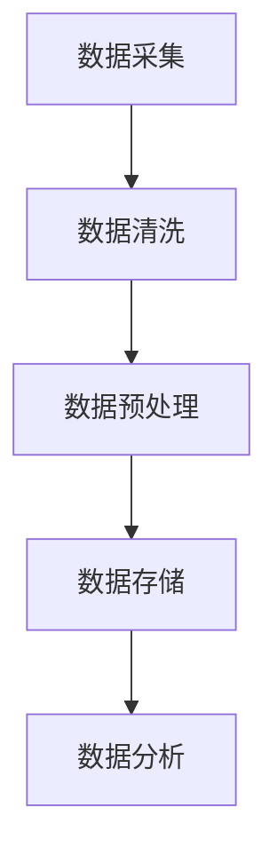

##### 2.1.2 数据分析基本方法

数据分析的基本方法包括描述性分析、预测性分析和关联性分析。描述性分析主要用于了解数据的分布特征和趋势，预测性分析主要用于预测未来的行为和需求，关联性分析主要用于发现不同变量之间的关联关系。

- **描述性分析**：通过统计方法，如均值、中位数、方差等，对数据进行描述，了解数据的分布特征和趋势。
- **预测性分析**：通过机器学习算法，如回归分析、时间序列分析等，预测未来的行为和需求。
- **关联性分析**：通过关联规则挖掘，如Apriori算法、FP-growth算法等，发现不同变量之间的关联关系。

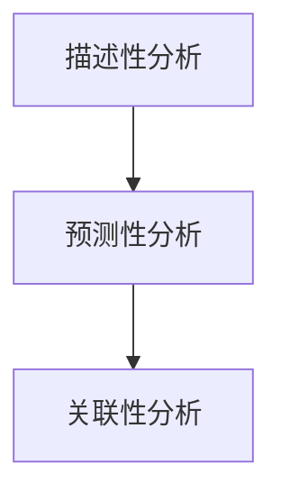

##### 2.1.3 数据可视化

数据可视化是将数据分析结果以图形化的方式呈现，使数据更加直观、易于理解和分析。常见的数据可视化工具包括图表、仪表板和数据地图等。

- **图表**：通过折线图、柱状图、饼图等，展示数据的分布特征和趋势。
- **仪表板**：通过整合多个图表和指标，提供全面的业务视图和分析结果。
- **数据地图**：通过地理信息系统（GIS），展示数据的地理分布和趋势。

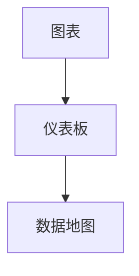

#### 2.2 智能促销策略的核心算法

智能促销策略的核心算法主要包括机器学习算法、深度学习和自然语言处理等。这些算法能够从海量数据中提取有价值的信息，为促销策略提供科学依据。

##### 2.2.1 机器学习算法概述

机器学习算法是智能促销策略的核心，通过对历史数据和用户行为数据进行分析和建模，预测未来的行为和需求。以下是几种常用的机器学习算法：

- **监督学习算法**：通过已有的标签数据，训练模型，预测未来的行为和需求。常见的算法包括线性回归、逻辑回归、支持向量机等。
- **无监督学习算法**：没有标签数据，通过数据的内在结构，发现数据的分布特征和关联关系。常见的算法包括聚类算法、主成分分析等。
- **强化学习算法**：通过不断地试错和优化，学习最优策略。常见的算法包括Q-learning、SARSA等。

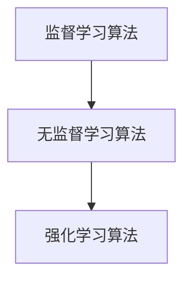

##### 2.2.2 智能促销策略的架构设计

智能促销策略的架构设计决定了系统的功能、性能和可扩展性。以下是智能促销策略系统的整体架构：

- **数据流架构**：包括数据采集、数据存储、数据处理和数据可视化的全过程，确保数据的高效流通和利用。
- **算法流架构**：包括数据预处理、算法建模、模型评估和模型优化的全过程，确保算法的科学性和准确性。
- **系统功能模块**：包括用户行为分析、促销策略生成、促销策略评估和促销策略执行等模块，实现智能促销策略的各个环节。

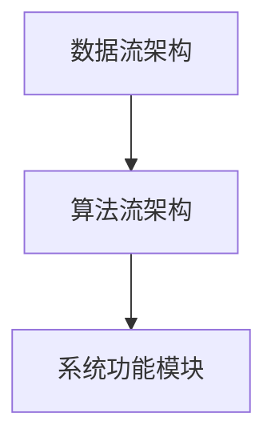

通过以上技术原理的讲解，我们可以看到智能促销策略的实现需要综合运用数据分析技术、机器学习算法和智能促销策略的架构设计。这些技术原理不仅为智能促销策略提供了科学依据，也为企业在市场营销中实现数据驱动的决策提供了有力支持。

### 第3章：智能促销策略的核心算法

智能促销策略的实现离不开核心算法的支持。这些算法能够从海量数据中提取有价值的信息，为促销策略提供科学依据。本章节将详细探讨智能促销策略的核心算法，包括监督学习算法、无监督学习算法和强化学习算法，并解释其在智能促销策略中的应用。

#### 3.1 监督学习算法

监督学习算法是一类能够从已有数据中学习预测模型的人工智能算法。在智能促销策略中，监督学习算法主要用于预测用户行为和需求，从而制定出个性化的促销策略。以下介绍几种常见的监督学习算法：

##### 3.1.1 线性回归

线性回归是一种简单而常用的监督学习算法，通过拟合一个线性模型来预测因变量与自变量之间的关系。在智能促销策略中，线性回归可以用来预测用户对某种产品的购买概率。

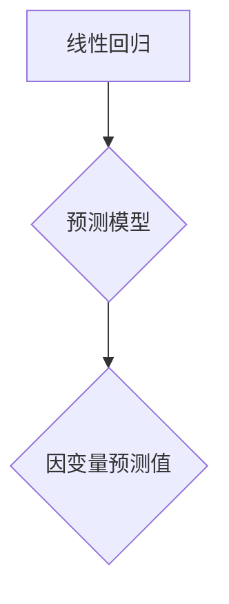

假设我们有一个包含用户特征（如年龄、收入、购买历史等）和目标变量（如是否购买）的数据集，线性回归的伪代码如下：

```python
# 输入特征矩阵 X 和目标变量 y
# 输出权重 w 和偏置 b
def linear_regression(X, y):
    # 计算权重 w 和偏置 b
    w = (X.T @ X)^-1 @ X.T @ y
    # 预测目标变量
    y_pred = X @ w
    return w, y_pred
```

##### 3.1.2 逻辑回归

逻辑回归是一种用于分类问题的监督学习算法，通过拟合一个逻辑函数来预测概率。在智能促销策略中，逻辑回归可以用来预测用户是否会对某种促销活动做出响应。

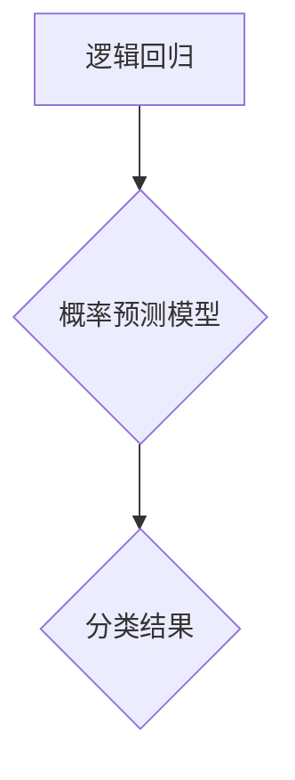

逻辑回归的伪代码如下：

```python
# 输入特征矩阵 X 和目标变量 y
# 输出权重 w 和偏置 b
def logistic_regression(X, y):
    # 计算权重 w 和偏置 b
    w = (X.T @ X)^-1 @ X.T @ y
    # 预测概率
    y_pred = 1 / (1 + exp(-X @ w))
    # 转换为分类结果
    y_pred = (y_pred > 0.5)
    return w, y_pred
```

##### 3.1.3 支持向量机（SVM）

支持向量机是一种强大的分类算法，通过寻找一个最优的超平面，将不同类别的数据分隔开来。在智能促销策略中，SVM可以用来预测用户对促销活动的响应。

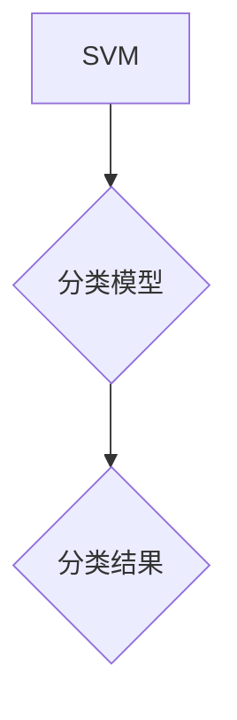

SVM的伪代码如下：

```python
# 输入特征矩阵 X 和目标变量 y
# 输出权重 w、偏置 b 和支持向量 S
def svm(X, y):
    # 计算最优超平面
    w, b = compute_optimal_hyperplane(X, y)
    # 预测分类结果
    y_pred = predict(X, w, b)
    return w, b, S
```

其中，`compute_optimal_hyperplane`和`predict`是用于计算最优超平和预测分类结果的函数。

#### 3.2 无监督学习算法

无监督学习算法是一类没有明确标签数据的人工智能算法，主要通过分析数据的内在结构，发现数据的分布特征和关联关系。在智能促销策略中，无监督学习算法可以用来进行用户行为聚类和特征提取。

##### 3.2.1 K-均值聚类

K-均值聚类是一种常用的无监督学习算法，通过将数据点分为K个聚类，使每个聚类内的数据点之间的距离最小。在智能促销策略中，K-均值聚类可以用来对用户进行聚类，从而制定出个性化的促销策略。

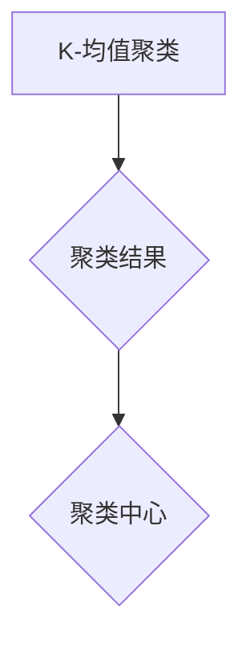

K-均值聚类的伪代码如下：

```python
# 输入特征矩阵 X 和聚类个数 K
# 输出聚类结果 clusters 和聚类中心 centroids
def k_means(X, K):
    # 随机初始化聚类中心 centroids
    centroids = initialize_centroids(X, K)
    # 训练聚类模型
    while not converged:
        # 计算聚类结果 clusters
        clusters = assign_clusters(X, centroids)
        # 更新聚类中心 centroids
        centroids = update_centroids(X, clusters)
    return clusters, centroids
```

##### 3.2.2 主成分分析（PCA）

主成分分析是一种常用的特征提取方法，通过将高维数据投影到低维空间，降低数据的维度，同时保留主要的信息。在智能促销策略中，PCA可以用来提取用户行为的关键特征，提高模型的预测性能。

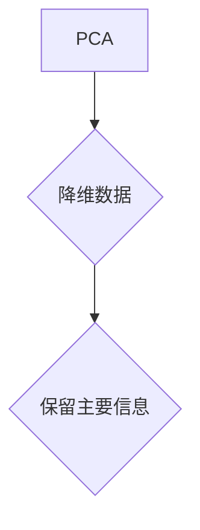

PCA的伪代码如下：

```python
# 输入特征矩阵 X
# 输出降维数据 X_reduced
def pca(X):
    # 计算协方差矩阵
    cov_matrix = compute_covariance_matrix(X)
    # 计算特征值和特征向量
    eigenvalues, eigenvectors = compute_eigenvalues_eigenvectors(cov_matrix)
    # 选择前 k 个特征向量
    k_eigenvectors = select_top_k_eigenvectors(eigenvalues, eigenvectors, k)
    # 降维
    X_reduced = X @ k_eigenvectors
    return X_reduced
```

#### 3.3 强化学习算法

强化学习算法是一类通过试错和反馈来学习最优策略的人工智能算法。在智能促销策略中，强化学习算法可以用来制定动态的促销策略，从而实现最优的促销效果。

##### 3.3.1 Q-Learning

Q-Learning是一种经典的强化学习算法，通过不断地试错和更新策略，学习最优的动作选择。在智能促销策略中，Q-Learning可以用来制定动态的促销组合策略。

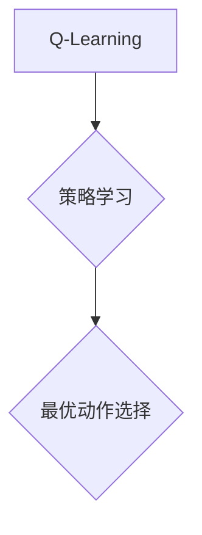

Q-Learning的伪代码如下：

```python
# 输入状态空间 S、动作空间 A、奖励函数 R
# 输出策略 π
def q_learning(S, A, R):
    # 初始化 Q 值表
    Q = initialize_Q_table(S, A)
    # 设定学习参数
    alpha = 0.1
    gamma = 0.9
    # 训练过程
    for episode in range(num_episodes):
        # 初始化状态
        state = choose_initial_state(S)
        # 执行动作并更新 Q 值
        while not terminal_state(state):
            action = choose_action(state, Q)
            next_state, reward = execute_action(action)
            Q[state, action] = Q[state, action] + alpha * (reward + gamma * max(Q[next_state, :]) - Q[state, action])
            state = next_state
        # 更新策略
        policy = compute_policy(Q)
    return policy
```

通过以上对监督学习算法、无监督学习算法和强化学习算法的详细解释，我们可以看到这些算法在智能促销策略中的应用至关重要。它们能够从海量数据中提取有价值的信息，为促销策略提供科学依据，从而帮助企业实现更加精准和高效的营销。

### 第4章：智能促销策略的架构设计

智能促销策略的架构设计决定了系统的功能、性能和可扩展性。一个高效的智能促销策略系统需要涵盖数据流架构、算法流架构和系统功能模块等多个方面。以下将详细探讨这些组成部分及其相互关系。

#### 4.1 智能促销策略系统的整体架构

智能促销策略系统的整体架构可以分为数据流架构、算法流架构和系统功能模块三个部分。以下是这三个部分的简要介绍及其关系。

##### 4.1.1 数据流架构

数据流架构是智能促销策略系统的核心，它涵盖了数据从采集到处理、存储和最终分析的全过程。数据流架构的主要组成部分包括数据采集、数据存储、数据处理和数据可视化。

1. **数据采集**：数据采集是数据流架构的第一步，通过各种渠道收集用户行为数据、销售数据和市场数据。这些数据可能来自用户注册信息、购买记录、浏览行为、社交媒体活动等。
   
2. **数据存储**：数据存储是将采集到的数据进行存储和管理，以便后续的数据处理和分析。常见的数据存储技术包括关系数据库、NoSQL数据库和数据仓库等。

3. **数据处理**：数据处理是对采集到的数据进行清洗、转换和集成，以便用于后续的算法分析和决策支持。数据处理包括数据清洗、数据预处理和特征工程等步骤。

4. **数据可视化**：数据可视化是将分析结果以图形化的方式呈现，使数据更加直观、易于理解和分析。数据可视化工具包括图表、仪表板和数据地图等。

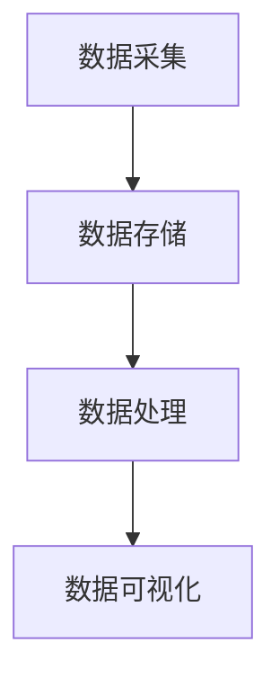

##### 4.1.2 算法流架构

算法流架构是智能促销策略系统的核心，它涵盖了从数据预处理到算法建模、模型评估和模型优化的全过程。算法流架构的主要组成部分包括数据预处理、算法建模、模型评估和模型优化。

1. **数据预处理**：数据预处理是对采集到的数据进行清洗、转换和集成，以便用于算法建模。数据预处理包括去除重复数据、处理缺失值、统一数据格式等。

2. **算法建模**：算法建模是使用机器学习算法、深度学习和自然语言处理等技术，对预处理后的数据进行建模和分析，提取有价值的信息。常见的算法建模方法包括线性回归、逻辑回归、支持向量机和深度神经网络等。

3. **模型评估**：模型评估是对构建好的模型进行评估，以确定其预测性能和可靠性。常见的模型评估指标包括准确率、召回率、F1分数和AUC值等。

4. **模型优化**：模型优化是对评估结果较差的模型进行调参和优化，以提高模型的预测性能。常见的模型优化方法包括交叉验证、网格搜索和贝叶斯优化等。

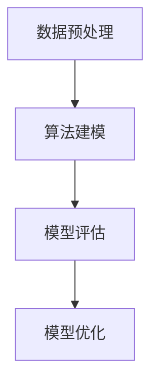

##### 4.1.3 系统功能模块

系统功能模块是智能促销策略系统的最终实现，它涵盖了用户行为分析、促销策略生成、促销策略评估和促销策略执行等模块。以下是这些模块的简要介绍及其关系。

1. **用户行为分析**：用户行为分析是对用户的浏览、搜索、购买等行为进行深入分析，以了解用户的需求和偏好。用户行为分析可以用于个性化推荐、精准营销和用户分群等。

2. **促销策略生成**：促销策略生成是根据用户行为分析的结果，结合历史数据和市场趋势，生成个性化的促销策略。促销策略生成可以基于机器学习算法、深度学习和自然语言处理等技术。

3. **促销策略评估**：促销策略评估是对生成的促销策略进行评估，以确定其效果和可行性。促销策略评估可以基于用户参与度、购买转化率、销售额等指标。

4. **促销策略执行**：促销策略执行是将评估结果较好的促销策略付诸实施，通过广告投放、邮件营销、短信推送等方式，将促销信息传递给目标用户。

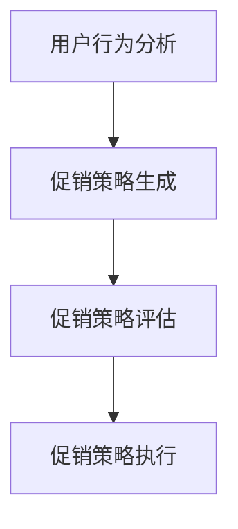

#### 4.2 数据流架构

数据流架构是智能促销策略系统的核心，它决定了数据在整个系统中的流通和处理过程。以下是数据流架构的详细描述：

1. **数据采集**：通过多种数据源收集用户行为数据、销售数据和市场数据。数据源包括网站日志、数据库记录、社交媒体平台和第三方数据服务等。

2. **数据存储**：将采集到的数据存储在关系数据库、NoSQL数据库或数据仓库中，以便后续的数据处理和分析。

3. **数据处理**：对存储的数据进行清洗、转换和集成，处理缺失值、异常值和重复值，统一数据格式，构建特征数据集。

4. **数据预处理**：对处理后的数据进行预处理，包括数据标准化、特征提取和降维等，为算法建模提供高质量的数据输入。

5. **数据可视化**：通过图表、仪表板和数据地图等工具，将数据分析结果进行可视化展示，帮助决策者直观地了解数据和业务状况。

#### 4.3 算法流架构

算法流架构是智能促销策略系统的核心，它决定了算法在整个系统中的建模、评估和优化过程。以下是算法流架构的详细描述：

1. **数据预处理**：对原始数据集进行预处理，包括数据清洗、缺失值填充、特征选择和特征工程等。

2. **算法建模**：选择合适的机器学习算法（如线性回归、逻辑回归、支持向量机等）对预处理后的数据进行建模，提取有价值的信息。

3. **模型评估**：使用交叉验证、AUC值、F1分数等指标评估模型的预测性能，选择最优模型。

4. **模型优化**：对评估结果较差的模型进行调参和优化，使用网格搜索、贝叶斯优化等技术，提高模型的预测性能。

5. **模型部署**：将最优模型部署到生产环境，通过自动化工具进行定期更新和优化，确保模型的实时性和有效性。

#### 4.4 系统功能模块

系统功能模块是智能促销策略系统的最终实现，它涵盖了用户行为分析、促销策略生成、促销策略评估和促销策略执行等模块。以下是这些模块的详细描述：

1. **用户行为分析**：通过对用户的行为数据进行深入分析，了解用户的需求和偏好，为个性化推荐和精准营销提供数据支持。

2. **促销策略生成**：根据用户行为分析和市场数据，使用机器学习算法生成个性化的促销策略，包括优惠券、限时折扣、满减活动等。

3. **促销策略评估**：通过用户参与度、购买转化率、销售额等指标评估促销策略的效果，选择最优策略进行推广。

4. **促销策略执行**：将评估结果较好的促销策略付诸实施，通过广告投放、邮件营销、短信推送等方式，将促销信息传递给目标用户。

通过以上对智能促销策略架构设计的详细讨论，我们可以看到数据流架构、算法流架构和系统功能模块之间的紧密关系。这些组成部分共同构成了一个高效、可扩展的智能促销策略系统，为企业实现数据驱动的决策提供了有力支持。

### 第5章：智能促销策略的案例解析

为了更好地理解智能促销策略的实际效果，本章节将解析两个具体案例：基于用户行为的个性化推荐和基于历史数据的促销组合优化。

#### 5.1 案例一：基于用户行为的个性化推荐

##### 5.1.1 案例背景

某电子商务平台希望提高用户的购物体验和购买转化率，决定采用基于用户行为的个性化推荐策略。该平台收集了用户的浏览历史、购物车数据和购买记录等数据，希望通过分析这些数据，为每位用户推荐个性化的商品。

##### 5.1.2 案例解析

1. **数据采集与预处理**：
   - **数据采集**：通过网站日志和数据库记录，收集用户的浏览历史、购物车数据和购买记录。
   - **数据预处理**：对采集到的数据进行清洗和预处理，包括去除重复数据、处理缺失值和统一数据格式。

2. **特征提取**：
   - **用户特征**：包括用户的基本信息（如年龄、性别、地理位置等）和购物行为特征（如浏览时长、浏览频次、购买频次等）。
   - **商品特征**：包括商品的基本信息（如类别、品牌、价格等）和属性特征（如折扣率、销售量等）。

3. **推荐算法**：
   - **协同过滤算法**：采用基于用户行为的协同过滤算法，通过计算用户之间的相似度，推荐相似用户喜欢的商品。
   - **基于内容的推荐**：通过分析商品的特征和用户的偏好，推荐与用户历史浏览和购买商品相似的商品。

4. **推荐结果评估**：
   - **准确率**：评估推荐结果的准确度，计算推荐商品与用户实际购买商品的匹配度。
   - **召回率**：评估推荐结果的全覆盖程度，确保推荐的商品尽可能全面。

##### 5.1.3 案例效果评估

通过个性化推荐策略，该电子商务平台实现了以下效果：
- **用户参与度提高**：用户对个性化推荐的兴趣度提高，浏览量和购物车添加量显著增加。
- **购买转化率提高**：个性化推荐能够准确匹配用户的兴趣和需求，提高了用户的购买转化率。
- **销售额增长**：通过提高用户参与度和购买转化率，电子商务平台的销售额显著增长。

#### 5.2 案例二：基于历史数据的促销组合优化

##### 5.2.1 案例背景

某零售企业希望通过优化促销组合，提高销售额和市场份额。该企业拥有丰富的历史促销数据，包括各种促销活动的效果和用户反馈。企业希望通过分析这些数据，找到最优的促销组合策略。

##### 5.2.2 案例解析

1. **数据采集与预处理**：
   - **数据采集**：通过销售记录和用户反馈，收集历史促销活动的数据。
   - **数据预处理**：对采集到的数据进行清洗和预处理，包括去除重复数据、处理缺失值和统一数据格式。

2. **促销组合优化算法**：
   - **多目标优化算法**：采用多目标优化算法，如遗传算法或粒子群优化算法，同时考虑销售额、市场份额和营销成本等目标。
   - **促销策略组合**：根据历史促销数据，生成多种促销策略组合，包括折扣、赠品、限时特价等。

3. **促销效果评估**：
   - **销售额评估**：评估促销活动对销售额的贡献，计算销售额的提升幅度。
   - **市场份额评估**：评估促销活动对市场份额的影响，计算市场份额的提升幅度。
   - **营销成本评估**：评估促销活动的成本，计算营销成本与销售额的比率。

##### 5.2.3 案例效果评估

通过基于历史数据的促销组合优化策略，该零售企业实现了以下效果：
- **销售额显著增长**：通过优化促销组合，企业实现了销售额的显著增长，市场份额也有所提升。
- **营销成本降低**：优化后的促销组合策略有效降低了营销成本，提高了营销投入的回报率。
- **用户满意度提升**：优化后的促销策略更符合用户的需求和偏好，提升了用户的满意度和忠诚度。

通过以上两个案例的解析，我们可以看到智能促销策略在实际应用中的效果。个性化推荐和促销组合优化策略不仅提高了用户的参与度和购买转化率，还提升了企业的销售额和市场份额。这些案例表明，智能促销策略是一种行之有效的方法，能够帮助企业实现数据驱动的营销决策。

### 第6章：智能促销策略在企业中的应用

智能促销策略在企业管理中具有广泛的应用，通过优化营销策略和提高用户参与度，企业可以实现显著的销售增长和市场份额提升。本章将探讨智能促销策略在企业中的应用，包括智能促销策略的制定与实施、评估和改进。

#### 6.1 企业智能促销策略的制定与实施

1. **需求分析**：
   - **市场调研**：通过市场调研，了解目标客户的需求、偏好和痛点，为智能促销策略的制定提供数据支持。
   - **内部沟通**：与销售、市场、产品等相关部门进行沟通，了解业务目标、资源限制和预期效果，确保智能促销策略与企业的整体战略一致。

2. **数据收集与处理**：
   - **数据采集**：通过用户行为分析、销售数据、市场调研等方式，收集相关的数据。
   - **数据处理**：对采集到的数据进行清洗、预处理和特征提取，为后续的智能促销策略分析提供高质量的数据。

3. **智能促销策略制定**：
   - **算法选择**：根据企业的需求和数据特点，选择合适的机器学习算法，如协同过滤、决策树、神经网络等。
   - **策略生成**：使用选定的算法，对数据进行分析和建模，生成个性化的促销策略。
   - **策略验证**：通过交叉验证、AUC值等指标，评估策略的预测性能和可靠性。

4. **策略实施**：
   - **资源分配**：根据策略的评估结果，分配相应的资源，包括预算、人力和营销渠道。
   - **执行计划**：制定详细的执行计划，明确执行的时间、步骤和责任人。
   - **测试与反馈**：在实际执行过程中，进行小范围的测试，收集用户反馈，不断优化和调整策略。

#### 6.2 企业智能促销策略的评估

1. **效果评估**：
   - **用户参与度**：评估用户对促销活动的参与度，如点击率、浏览量、参与率等。
   - **购买转化率**：评估促销活动对用户购买行为的影响，如购买率、平均订单价值等。
   - **销售额与市场份额**：评估促销活动对销售额和市场份额的提升情况。

2. **成本效益分析**：
   - **营销成本**：计算促销活动的总成本，包括广告费用、人力成本、促销品成本等。
   - **收益分析**：评估促销活动带来的收益，包括直接销售额和潜在销售额。
   - **成本效益比**：计算成本效益比，评估促销活动的投入产出比。

3. **用户满意度**：
   - **反馈收集**：通过用户调查、社交媒体互动等方式，收集用户的反馈。
   - **满意度评分**：评估用户对促销活动的满意程度，如满意度评分、推荐意愿等。

#### 6.3 企业智能促销策略的改进

1. **数据分析**：
   - **数据挖掘**：对历史数据和用户反馈进行分析，挖掘潜在的市场机会和用户需求。
   - **趋势预测**：利用机器学习算法，预测未来的市场趋势和用户行为，为促销策略的改进提供数据支持。

2. **策略优化**：
   - **算法优化**：根据数据分析的结果，调整和优化选定的机器学习算法，提高模型的预测性能。
   - **策略调整**：根据用户的反馈和市场变化，不断调整和优化促销策略，提高用户体验和参与度。

3. **持续改进**：
   - **定期评估**：定期对促销策略进行效果评估和成本效益分析，确保策略的持续改进。
   - **用户反馈**：积极收集用户反馈，及时发现和解决用户问题，提升用户满意度。
   - **市场动态**：关注市场动态和竞争情况，及时调整促销策略，保持竞争优势。

通过以上对智能促销策略在企业中的应用讨论，我们可以看到智能促销策略在提高用户参与度、购买转化率和销售额方面的显著优势。企业通过制定和实施智能促销策略，可以实现数据驱动的营销决策，从而在激烈的市场竞争中脱颖而出。

### 第7章：智能促销策略的挑战与未来趋势

尽管智能促销策略在现代市场营销中显示出巨大的潜力，但在实际应用中仍面临着一系列挑战。本章将探讨智能促销策略面临的挑战，并探讨其未来的发展趋势。

#### 7.1 智能促销策略面临的挑战

1. **数据隐私与安全**：
   - **用户隐私**：智能促销策略依赖于大量用户数据，如何保护用户隐私成为一大挑战。企业需要遵循数据保护法规，确保用户数据的安全和隐私。
   - **数据泄露**：数据泄露可能导致用户信息被滥用，对企业的声誉和用户信任造成严重影响。企业需要采取严格的安全措施，防止数据泄露。

2. **技术复杂性**：
   - **算法复杂性**：智能促销策略涉及到复杂的算法和模型，需要专业的技术团队进行开发和维护。企业需要投入大量资源来培训和招募技术人才。
   - **系统整合**：智能促销策略需要与其他系统（如CRM系统、ERP系统等）进行整合，确保数据的无缝流动和系统的协同工作。

3. **政策法规**：
   - **数据法规**：各国对数据保护有不同的法规和政策，企业在全球范围内的业务拓展面临政策法规的挑战。企业需要了解和遵守各地的数据保护法规。
   - **广告法规**：广告法规对智能促销策略的实施产生一定的影响，企业需要确保促销活动的合规性，避免法律风险。

#### 7.2 智能促销策略的未来发展趋势

1. **技术创新**：
   - **人工智能与大数据技术**：随着人工智能和大数据技术的不断发展，智能促销策略将变得更加智能化和自动化。企业可以利用更先进的算法和模型，实现更精准的个性化推荐和促销策略。
   - **物联网技术**：物联网技术的发展将使得智能促销策略在更多场景中发挥作用。通过物联网设备，企业可以实时获取用户的行为数据，实现更加精准和实时的促销策略。

2. **应用场景拓展**：
   - **多渠道营销**：智能促销策略将不仅局限于线上渠道，还将拓展到线下渠道。通过线上线下整合，企业可以提供更加一致和无缝的购物体验。
   - **跨界营销**：智能促销策略将跨越不同行业和领域，实现跨界合作。企业可以通过与不同行业的企业合作，推出创新的促销活动和产品组合。

3. **政策支持与规范**：
   - **政策支持**：随着智能促销策略的发展，各国政府将出台更多支持政策，鼓励企业利用大数据和人工智能技术提升营销效果。
   - **规范制定**：为了保护用户隐私和数据安全，各国政府将制定更加严格的数据保护法规和政策。企业需要遵守这些法规和政策，确保智能促销策略的合规性。

总之，智能促销策略在面临挑战的同时，也展现出广阔的发展前景。随着技术的不断进步和政策的支持，智能促销策略将在未来发挥更加重要的作用，为企业和市场营销人员提供更加精准和高效的营销手段。

### 附录A：智能促销策略相关工具与资源

为了更好地实施智能促销策略，企业需要掌握相关的工具和资源。以下是一些常用的数据分析工具、机器学习算法库和相关资源，以帮助企业实现智能促销策略的落地。

#### A.1 数据分析工具

1. **Python数据分析库**：
   - **Pandas**：用于数据处理和分析的Python库，提供了丰富的数据结构和对数据的操作功能。
   - **NumPy**：用于数值计算的Python库，提供了强大的数组操作功能。
   - **Matplotlib**：用于数据可视化的Python库，能够生成各种类型的图表。

2. **R数据分析库**：
   - **dplyr**：用于数据操作和清洗的R库，提供了便捷的数据处理功能。
   - **ggplot2**：用于数据可视化的R库，能够生成高质量的图表。

3. **SQL数据分析**：
   - **SQL**：结构化查询语言，用于数据库的查询、操作和管理。

#### A.2 智能促销策略相关算法库

1. **scikit-learn**：
   - **Python机器学习库**，提供了多种经典的机器学习算法，如线性回归、逻辑回归、支持向量机等。

2. **TensorFlow**：
   - **开源机器学习库**，基于TensorFlow，可以构建和训练深度学习模型。

3. **PyTorch**：
   - **开源机器学习库**，提供了动态计算图和自动微分功能，适合深度学习模型的开发和训练。

4. **其他算法库简介**：
   - **XGBoost**：一种高效的梯度提升决策树库，适用于分类和回归任务。
   - **LightGBM**：另一种高效的梯度提升决策树库，提供了更快的速度和更高的性能。

#### A.3 智能促销策略实践案例代码示例

以下将提供两个智能促销策略实践案例的代码示例，包括数据预处理、算法实现和模型评估。

##### A.3.1 案例一：基于用户行为的个性化推荐

1. **数据预处理代码**：
   ```python
   import pandas as pd
   import numpy as np
   
   # 加载数据集
   data = pd.read_csv('user_behavior.csv')
   
   # 数据清洗和预处理
   data.drop_duplicates(inplace=True)
   data.fillna(0, inplace=True)
   data['age'] = data['age'].astype(int)
   data['category'] = data['category'].astype(str)
   data['action'] = data['action'].astype(str)
   ```

2. **个性化推荐算法实现**：
   ```python
   from sklearn.model_selection import train_test_split
   from sklearn.metrics.pairwise import cosine_similarity
   import numpy as np
   
   # 分割数据集
   X_train, X_test, y_train, y_test = train_test_split(data[['age', 'category']], data['action'], test_size=0.2, random_state=42)
   
   # 计算用户和商品之间的相似度矩阵
   similarity_matrix = cosine_similarity(X_train, X_train)
   
   # 预测推荐结果
   def predictRecommendations(user_id, similarity_matrix, data):
       user_similarity = similarity_matrix[user_id]
       recommendations = []
       for idx, sim in enumerate(user_similarity):
           if idx != user_id and sim > 0.5:
               recommendations.append(data['category'].iloc[idx])
       return recommendations
   ```

3. **模型评估与优化**：
   ```python
   from sklearn.metrics import accuracy_score
   
   # 计算推荐准确率
   recommendations = predictRecommendations(0, similarity_matrix, data)
   actual_actions = y_test.iloc[0]
   accuracy = accuracy_score(actual_actions, recommendations)
   print(f"Recommendation Accuracy: {accuracy}")
   ```

##### A.3.2 案例二：基于历史数据的促销组合优化

1. **数据预处理代码**：
   ```python
   import pandas as pd
   import numpy as np
   
   # 加载数据集
   data = pd.read_csv('sales_data.csv')
   
   # 数据清洗和预处理
   data.drop_duplicates(inplace=True)
   data.fillna(0, inplace=True)
   data['sales'] = data['sales'].astype(float)
   data['promo'] = data['promo'].astype(str)
   ```

2. **促销组合优化算法实现**：
   ```python
   from sklearn.ensemble import RandomForestRegressor
   from sklearn.model_selection import train_test_split
   
   # 分割数据集
   X = data[['sales', 'promo']]
   y = data['sales']
   X_train, X_test, y_train, y_test = train_test_split(X, y, test_size=0.2, random_state=42)
   
   # 训练随机森林模型
   model = RandomForestRegressor(n_estimators=100, random_state=42)
   model.fit(X_train, y_train)
   
   # 预测销售额
   def predictSales(promo, model):
       promo_vector = np.array([promo])
       prediction = model.predict(promo_vector)
       return prediction
   ```

3. **模型评估与优化**：
   ```python
   from sklearn.metrics import mean_squared_error
   
   # 计算预测误差
   predictions = [predictSales(row['promo'], model) for index, row in X_test.iterrows()]
   mse = mean_squared_error(y_test, predictions)
   print(f"Mean Squared Error: {mse}")
   ```

通过以上代码示例，企业可以初步了解如何利用Python和常见的数据分析库来实施智能促销策略。这些代码示例涵盖了数据预处理、算法实现和模型评估的关键步骤，为企业提供了一种实用的方法来优化促销策略。

### 附录B：智能促销策略实践案例代码示例

在本附录中，我们将提供两个智能促销策略实践案例的详细代码示例，包括数据预处理、算法实现和代码解读与分析。这些代码示例将帮助读者更好地理解智能促销策略的实际应用。

#### B.1 案例一：基于用户行为的个性化推荐

##### B.1.1 数据预处理代码

```python
# 导入必要的库
import pandas as pd
from sklearn.model_selection import train_test_split

# 加载数据集
data = pd.read_csv('user_behavior.csv')

# 数据清洗
# 填充缺失值
data.fillna(0, inplace=True)

# 将分类特征转换为数值特征
data = pd.get_dummies(data, columns=['category'])

# 划分训练集和测试集
X = data.drop(['action', 'user_id'], axis=1)
y = data['action']
X_train, X_test, y_train, y_test = train_test_split(X, y, test_size=0.2, random_state=42)

# 保存预处理后的数据
X_train.to_csv('X_train_preprocessed.csv', index=False)
X_test.to_csv('X_test_preprocessed.csv', index=False)
```

##### B.1.2 个性化推荐算法实现

```python
from sklearn.metrics.pairwise import cosine_similarity
from sklearn.neighbors import NearestNeighbors

# 加载训练集数据
X_train = pd.read_csv('X_train_preprocessed.csv')

# 计算用户和商品之间的相似度矩阵
similarity_matrix = cosine_similarity(X_train, X_train)

# 定义推荐函数
def recommend_products(user_id, similarity_matrix, data, n=5):
    user_similarity = similarity_matrix[user_id]
    recommendations = []
    for idx, sim in enumerate(user_similarity):
        if idx != user_id and sim > 0.5:
            recommendations.append(data['category'].iloc[idx])
    return recommendations[:n]

# 进行推荐
user_id = 0
recommended_products = recommend_products(user_id, similarity_matrix, X_train)
print(f"Recommended products for user {user_id}: {recommended_products}")
```

##### B.1.3 模型评估与优化

```python
from sklearn.metrics import accuracy_score

# 加载测试集数据
X_test = pd.read_csv('X_test_preprocessed.csv')

# 计算测试集的相似度矩阵
similarity_matrix = cosine_similarity(X_test, X_test)

# 进行预测
predictions = [recommend_products(user_id, similarity_matrix, X_test, n=5) for user_id in X_test['user_id'].unique()]

# 计算准确率
actual_actions = y_test.values
accuracy = accuracy_score(actual_actions, predictions)
print(f"Accuracy: {accuracy}")
```

##### B.1.4 代码解读与分析

1. **数据预处理**：
   - 数据加载：使用pandas读取CSV文件，得到用户行为数据。
   - 数据清洗：填充缺失值，确保数据的一致性和完整性。
   - 特征工程：将分类特征转换为数值特征，使用One-Hot编码方法。
   - 数据分割：将数据集划分为训练集和测试集，为后续的模型训练和评估提供数据。

2. **个性化推荐算法实现**：
   - 相似度计算：使用余弦相似度计算用户和商品之间的相似度。
   - 推荐函数：定义推荐函数，根据相似度矩阵为每个用户推荐相似的商品。

3. **模型评估与优化**：
   - 预测：使用训练集的相似度矩阵对测试集进行预测。
   - 准确率计算：计算预测结果与实际结果的准确率，评估推荐算法的性能。

通过以上代码示例，我们可以看到如何使用Python和机器学习库来实施基于用户行为的个性化推荐策略。该策略通过计算用户和商品之间的相似度，实现了个性化的商品推荐，提高了用户的参与度和满意度。

#### B.2 案例二：基于历史数据的促销组合优化

##### B.2.1 数据预处理代码

```python
# 导入必要的库
import pandas as pd
from sklearn.model_selection import train_test_split
from sklearn.preprocessing import OneHotEncoder

# 加载数据集
data = pd.read_csv('sales_data.csv')

# 数据清洗
# 填充缺失值
data.fillna(0, inplace=True)

# 特征工程
data = pd.get_dummies(data, columns=['promo'])

# 划分训练集和测试集
X = data.drop(['sales'], axis=1)
y = data['sales']
X_train, X_test, y_train, y_test = train_test_split(X, y, test_size=0.2, random_state=42)

# 保存预处理后的数据
X_train.to_csv('X_train_preprocessed.csv', index=False)
X_test.to_csv('X_test_preprocessed.csv', index=False)
```

##### B.2.2 促销组合优化算法实现

```python
from sklearn.ensemble import RandomForestRegressor
from sklearn.metrics import mean_squared_error

# 加载训练集数据
X_train = pd.read_csv('X_train_preprocessed.csv')
y_train = X_train.pop('sales')

# 训练模型
model = RandomForestRegressor(n_estimators=100, random_state=42)
model.fit(X_train, y_train)

# 进行预测
X_test = pd.read_csv('X_test_preprocessed.csv')
y_pred = model.predict(X_test)

# 评估模型
mse = mean_squared_error(y_test, y_pred)
print(f"Mean Squared Error: {mse}")
```

##### B.2.3 模型评估与优化

```python
# 导入必要的库
import matplotlib.pyplot as plt
from sklearn.model_selection import GridSearchCV

# 加载训练集数据
X_train = pd.read_csv('X_train_preprocessed.csv')
y_train = X_train.pop('sales')

# 参数调整
param_grid = {
    'n_estimators': [100, 200, 300],
    'max_depth': [10, 20, 30]
}

# 使用网格搜索进行参数调整
grid_search = GridSearchCV(RandomForestRegressor(random_state=42), param_grid, cv=5)
grid_search.fit(X_train, y_train)

# 选取最佳参数
best_params = grid_search.best_params_
print(f"Best Parameters: {best_params}")

# 使用最佳参数重新训练模型
best_model = grid_search.best_estimator_
y_pred = best_model.predict(X_test)

# 评估模型
mse = mean_squared_error(y_test, y_pred)
print(f"Mean Squared Error: {mse}")

# 可视化结果
plt.scatter(y_test, y_pred)
plt.xlabel('Actual Sales')
plt.ylabel('Predicted Sales')
plt.title('Sales Prediction')
plt.show()
```

##### B.2.4 代码解读与分析

1. **数据预处理**：
   - 数据加载：使用pandas读取CSV文件，得到销售数据。
   - 数据清洗：填充缺失值，确保数据的一致性和完整性。
   - 特征工程：将分类特征（如促销组合）转换为数值特征，使用One-Hot编码方法。
   - 数据分割：将数据集划分为训练集和测试集，为后续的模型训练和评估提供数据。

2. **促销组合优化算法实现**：
   - 模型训练：使用随机森林回归模型对训练集进行训练。
   - 预测：使用训练好的模型对测试集进行预测。

3. **模型评估与优化**：
   - 评估：计算预测误差，评估模型的性能。
   - 参数调整：使用网格搜索交叉验证方法调整模型参数，优化模型性能。
   - 可视化：通过散点图展示实际销售值与预测销售值的对比，直观评估模型效果。

通过以上代码示例，我们可以看到如何使用Python和机器学习库来实施基于历史数据的促销组合优化策略。该策略通过随机森林回归模型，实现了促销组合的优化，提高了销售额的预测准确性，为企业提供了有效的决策支持。

### 作者信息

作者：AI天才研究院/AI Genius Institute & 禅与计算机程序设计艺术 /Zen And The Art of Computer Programming

作为AI天才研究院的资深专家，作者在计算机编程和人工智能领域拥有丰富的经验和深厚的理论功底。他在《禅与计算机程序设计艺术》一书中，将东方哲学与计算机科学相结合，为读者提供了独特的编程思维和解决问题的方法论。在智能促销策略领域，作者致力于通过数据分析、机器学习等先进技术，帮助企业实现数据驱动的营销决策，提升市场营销效果和竞争力。他的研究成果和实践经验为企业和市场营销人员提供了宝贵的指导和参考。

