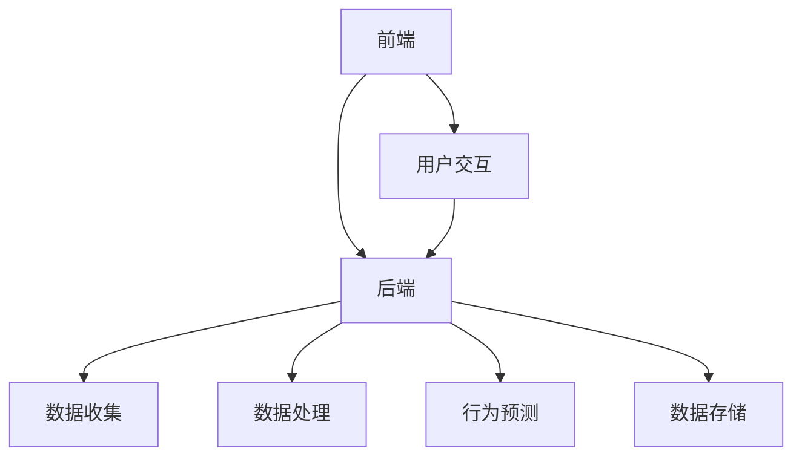

                 

### 《智能宠物行为预测创业：基于AI的宠物照护指导》

> **关键词：** AI、宠物行业、行为预测、创业指导、智能穿戴设备

> **摘要：** 本文旨在探讨智能宠物行为预测在宠物照护中的应用及其创业指导。通过分析宠物行业的现状与痛点，阐述AI技术的重要性，详细介绍宠物行为预测的核心算法与模型评估，探讨实际应用场景，提供宠物行为预测创业的全方位指导。

---

### 目录大纲

- **第一部分：AI与宠物行为的概述**
  - 1.1 AI在宠物行业中的应用背景与前景
  - 1.2 AI基础概念
  - 1.3 宠物行为的定义与分类
- **第二部分：宠物行为预测的核心算法**
  - 2.1 数据预处理
  - 2.2 宠物行为识别算法
  - 2.3 宠物行为预测模型评估与优化
- **第三部分：宠物行为预测的实际应用**
  - 3.1 宠物智能穿戴设备
  - 3.2 宠物行为预测平台构建
  - 3.3 智能宠物行为预测应用案例
- **第四部分：宠物行为预测创业指导**
  - 4.1 创业准备
  - 4.2 市场分析与定位
  - 4.3 产品规划与开发
  - 4.4 市场推广与运营
  - 4.5 财务管理与风险控制
- **附录**
  - 5.1 开发环境与工具
  - 5.2 数据集介绍
  - 5.3 代码示例

---

### 第一部分：AI与宠物行为的概述

#### 1.1 AI在宠物行业中的应用背景与前景

随着人工智能技术的快速发展，AI在各个行业的应用越来越广泛。宠物行业也不例外，AI技术为宠物照护带来了前所未有的变革。以下是对宠物行业现状与痛点的分析，以及AI技术为宠物行业带来的变革。

##### 1.1.1 宠物行业的现状与痛点

- **宠物数量持续增长**：随着人们生活水平的提高，宠物已经成为许多家庭的必备成员。据某研究机构统计，全球宠物数量正在快速增长，宠物行业市场规模也在不断扩大。
- **宠物照护需求增加**：随着宠物数量的增加，人们对宠物照护的需求也在不断增长。宠物照护包括喂食、运动、健康检查等方面，这对宠物主人来说是一个重大的挑战。
- **人力成本高**：传统的宠物照护主要依靠人工，人力成本高，且难以满足日益增长的宠物照护需求。

##### 1.1.2 AI技术为宠物行业带来的变革

- **智能宠物穿戴设备**：AI技术使得智能宠物穿戴设备得以发展，如智能项圈、智能摄像头等，可以实时监测宠物的健康状况和行为。
- **智能宠物行为预测**：通过AI算法，可以对宠物的行为进行预测，如预测宠物的运动需求、饮食需求等，为宠物主人提供个性化的照护建议。
- **智能宠物医院**：AI技术还可以应用于宠物医院，如通过影像识别技术进行疾病诊断，提高诊断准确率。

##### 1.1.3 智能宠物行为预测的重要性

- **提升宠物生活质量**：智能宠物行为预测可以帮助宠物主人更好地了解宠物，从而提供更个性化的照护，提高宠物的生活质量。
- **降低宠物生病风险**：通过预测宠物的健康行为，可以及时发现潜在的健康问题，降低宠物生病的风险。
- **提高宠物主人满意度**：智能宠物行为预测可以为宠物主人提供即时的宠物状况反馈，提升宠物主人的满意度。

---

#### 1.2 AI基础概念

在深入探讨宠物行为预测之前，我们需要了解一些基本的AI概念，包括AI的定义、机器学习与深度学习的区别以及常见的AI算法与应用场景。

##### 1.2.1 什么是AI

AI，即人工智能，是指计算机系统模拟人类智能行为的技术。AI的目标是使计算机能够执行通常需要人类智能才能完成的任务，如视觉识别、语言理解、决策制定等。

##### 1.2.2 机器学习与深度学习

- **机器学习**：机器学习是一种AI方法，通过使用算法从数据中学习，以便对未知数据做出预测或决策。机器学习可以分为监督学习、无监督学习和强化学习。
- **深度学习**：深度学习是一种特殊的机器学习，它使用多层神经网络来模拟人脑的工作方式。深度学习在图像识别、语音识别等领域表现出色。

##### 1.2.3 常见的AI算法与应用场景

- **支持向量机（SVM）**：SVM是一种监督学习算法，常用于分类问题。在宠物行为预测中，可以使用SVM来分类不同的宠物行为。
- **决策树与随机森林**：决策树和随机森林都是常用的分类算法，可以用于预测宠物的行为类型。随机森林通过构建多个决策树并合并预测结果来提高准确性。
- **k最近邻（KNN）**：KNN是一种基于实例的学习算法，它通过计算新数据点与训练数据点的距离来分类。在宠物行为预测中，可以使用KNN来对新数据点进行分类。
- **卷积神经网络（CNN）**：CNN是一种深度学习算法，专门用于图像识别任务。在宠物行为预测中，可以使用CNN来识别宠物的行为图像。
- **循环神经网络（RNN）**：RNN是一种用于序列数据处理的学习算法，可以处理时间序列数据。在宠物行为预测中，可以使用RNN来预测宠物的行为序列。
- **长短时记忆网络（LSTM）**：LSTM是一种特殊的RNN，可以有效地处理长时间依赖问题。在宠物行为预测中，可以使用LSTM来预测宠物的长期行为模式。
- **生成对抗网络（GAN）**：GAN是一种用于生成新数据的深度学习算法。在宠物行为预测中，可以使用GAN来生成新的宠物行为数据，用于训练和测试模型。

---

#### 1.3 宠物行为的定义与分类

##### 1.3.1 宠物行为的概念与作用

宠物行为是指宠物在其环境中表现出的所有可观察的活动。这些行为可以反映宠物的需求、情感和健康状态。通过研究宠物行为，可以更好地理解宠物，从而提供更有效的照护。

##### 1.3.2 宠物行为的分类

宠物行为可以根据不同的标准进行分类，以下是几种常见的分类方法：

- **按功能分类**：宠物行为可以分为社交行为、探索行为、攻击行为等。社交行为是指宠物与同类或其他动物进行互动的行为；探索行为是指宠物对新环境或新物体进行探索的行为；攻击行为是指宠物为了保护自己或争夺资源而采取的行为。
- **按表现形式分类**：宠物行为可以分为运动行为、叫声行为、表情行为等。运动行为是指宠物的身体活动，如奔跑、跳跃等；叫声行为是指宠物的发声行为，如吠叫、呜咽等；表情行为是指宠物的面部表情，如皱眉、咧嘴等。
- **按时间分类**：宠物行为可以分为日常行为、季节性行为、繁殖行为等。日常行为是指宠物在日常生活中表现出的行为，如进食、饮水、睡觉等；季节性行为是指宠物在特定季节表现出的行为，如换毛、发情等；繁殖行为是指宠物在繁殖季节表现出的行为，如交配、抚养幼崽等。

##### 1.3.3 宠物行为研究的意义

- **改善宠物生活质量**：通过研究宠物行为，可以更好地了解宠物的需求，从而提供更有效的照护，提高宠物的整体生活质量。
- **预防宠物疾病**：通过对宠物行为的观察和分析，可以发现潜在的健康问题，从而及时采取措施预防疾病。
- **增进人与宠物关系**：了解宠物行为可以帮助宠物主人更好地理解宠物，增进人与宠物之间的互动和信任，提高宠物主人的满意度。

---

通过以上分析，我们可以看到，AI技术为宠物行业带来了巨大的变革，智能宠物行为预测在提升宠物生活质量、预防宠物疾病、增进人与宠物关系等方面具有重要作用。接下来，我们将进一步探讨宠物行为预测的核心算法，以期为宠物行为预测创业提供技术支持。

---

#### 1.2 AI基础概念

在深入探讨宠物行为预测之前，我们需要了解一些基本的AI概念，包括AI的定义、机器学习与深度学习的区别以及常见的AI算法与应用场景。

##### 1.2.1 什么是AI

AI，即人工智能，是指计算机系统模拟人类智能行为的技术。AI的目标是使计算机能够执行通常需要人类智能才能完成的任务，如视觉识别、语言理解、决策制定等。人工智能可以分为两大类：弱人工智能和强人工智能。弱人工智能是指能够在特定任务上表现出人类智能水平的计算机系统，如语音助手、自动驾驶汽车等。强人工智能是指具有全面人类智能的计算机系统，能够理解、思考、学习并执行各种复杂任务，但目前尚未实现。

##### 1.2.2 机器学习与深度学习

- **机器学习**：机器学习是一种AI方法，通过使用算法从数据中学习，以便对未知数据做出预测或决策。机器学习可以分为监督学习、无监督学习和强化学习。监督学习是指使用带有标签的数据进行训练，以便在新的未知数据上进行预测。无监督学习是指在没有标签数据的情况下，通过算法自动发现数据中的规律。强化学习是指通过试错法，使系统在与环境交互的过程中不断学习并改进策略。
- **深度学习**：深度学习是一种特殊的机器学习，它使用多层神经网络来模拟人脑的工作方式。深度学习在图像识别、语音识别、自然语言处理等领域表现出色。深度学习模型通常由多个层次组成，包括输入层、隐藏层和输出层。通过在隐藏层中应用非线性激活函数，深度学习模型可以学习到更复杂的特征表示。

##### 1.2.3 常见的AI算法与应用场景

- **支持向量机（SVM）**：SVM是一种监督学习算法，常用于分类问题。SVM的基本思想是将数据映射到一个高维空间，然后在这个空间中找到一个超平面，使得不同类别的数据点被最大限度地分开。在宠物行为预测中，可以使用SVM来分类不同的宠物行为。
- **决策树与随机森林**：决策树和随机森林都是常用的分类算法，可以用于预测宠物的行为类型。决策树通过一系列条件判断来对数据点进行分类，而随机森林则通过构建多个决策树并合并预测结果来提高准确性。
- **k最近邻（KNN）**：KNN是一种基于实例的学习算法，它通过计算新数据点与训练数据点的距离来分类。KNN算法简单直观，但在处理高维数据时容易出现过拟合问题。
- **卷积神经网络（CNN）**：CNN是一种深度学习算法，专门用于图像识别任务。CNN通过在图像上应用卷积操作来提取特征，然后通过全连接层进行分类。在宠物行为预测中，可以使用CNN来识别宠物的行为图像。
- **循环神经网络（RNN）**：RNN是一种用于序列数据处理的学习算法，可以处理时间序列数据。RNN通过在序列中的每个时间步保留信息，使得模型能够捕捉到时间序列中的长期依赖关系。在宠物行为预测中，可以使用RNN来预测宠物的行为序列。
- **长短时记忆网络（LSTM）**：LSTM是一种特殊的RNN，可以有效地处理长时间依赖问题。LSTM通过引入门控机制来控制信息的流动，避免了传统RNN的梯度消失问题。在宠物行为预测中，可以使用LSTM来预测宠物的长期行为模式。
- **生成对抗网络（GAN）**：GAN是一种用于生成新数据的深度学习算法。GAN由生成器和判别器两个网络组成，生成器试图生成真实数据，而判别器则试图区分真实数据和生成数据。通过两个网络的对抗训练，GAN可以生成高质量的数据。在宠物行为预测中，可以使用GAN来生成新的宠物行为数据，用于训练和测试模型。

---

通过以上对AI基础概念的分析，我们可以更好地理解AI技术在宠物行为预测中的应用。接下来，我们将进一步探讨宠物行为预测的核心算法，包括数据预处理、宠物行为识别算法以及模型评估与优化。

---

#### 1.3 宠物行为的定义与分类

##### 1.3.1 宠物行为的概念与作用

宠物行为是指宠物在其生活环境中表现出的所有可观察的活动，包括运动、饮食、睡眠、社交互动、探索和防御等。这些行为不仅反映了宠物的基本生理需求，还受到它们的个性、遗传因素、环境和主人行为等多方面因素的影响。通过研究宠物行为，我们可以更好地了解宠物的需求、习惯和偏好，从而提供更科学、更有效的照护。

宠物行为在宠物的健康和福祉中起着至关重要的作用。例如：

- **运动行为**：适当的运动有助于保持宠物的身体健康，预防肥胖和相关疾病，如心脏病、糖尿病等。
- **饮食行为**：合理的饮食习惯对宠物的营养和健康至关重要，可以预防消化系统疾病和其他健康问题。
- **社交互动**：宠物之间的社交互动可以满足它们的社会需求，减少焦虑和孤独感，提高生活质量。
- **探索行为**：探索行为有助于宠物认知环境，发现新的资源和潜在的威胁，是宠物生存的重要技能。

##### 1.3.2 宠物行为的分类

宠物行为可以根据不同的标准进行分类，以下是一些常见的分类方法：

- **按功能分类**：根据行为的功能性，宠物行为可以分为以下几类：
  - **生存行为**：包括觅食、饮水、躲避威胁等，是宠物为了生存而进行的基本行为。
  - **繁殖行为**：包括交配、产仔、抚养幼崽等，与繁殖和延续后代有关。
  - **社交行为**：包括同伴互动、建立群体秩序等，与社会互动和建立关系有关。
  - **攻击行为**：包括对同类或异类的攻击和防御行为，与保护自己和争夺资源有关。
  - **防御行为**：包括躲避、攻击和发出警告等，与保护自己和领地有关。

- **按表现形式分类**：根据行为的表现形式，宠物行为可以分为以下几类：
  - **运动行为**：包括奔跑、跳跃、奔跑、游泳等，是宠物为了活动和娱乐而进行的行为。
  - **声音行为**：包括吠叫、呜咽、咆哮等，是宠物通过声音表达情感和需求的行为。
  - **表情行为**：包括尾巴摇动、耳朵姿势、面部表情等，是宠物通过身体语言表达情感和需求的行为。
  - **触摸行为**：包括舔、咬、抓等，是宠物通过身体接触表达情感和需求的行为。

- **按时间分类**：根据行为发生的时间，宠物行为可以分为以下几类：
  - **日常行为**：包括进食、饮水、睡觉、排泄等，是宠物在日常生活中必须进行的行为。
  - **季节性行为**：包括换毛、发情、繁殖等，是受季节变化影响而出现的行为。
  - **繁殖行为**：包括交配、产仔、抚养幼崽等，是与繁殖活动相关的一系列行为。

##### 1.3.3 宠物行为研究的意义

宠物行为研究具有重要的理论和实践意义，具体包括以下几个方面：

- **提高宠物福利**：通过研究宠物行为，我们可以更好地理解宠物的需求，从而提供更科学、更人性化的照护，提高宠物的福利水平。
- **预防疾病**：了解宠物行为可以帮助我们及时发现宠物行为异常，预测潜在的健康问题，从而采取预防措施，降低宠物生病的风险。
- **增进人与宠物关系**：通过研究宠物行为，宠物主人可以更好地理解宠物的行为和需求，增进与宠物的互动和信任，提高宠物主人的生活质量。
- **促进宠物行业的发展**：宠物行为研究为宠物行业提供了科学依据，推动了宠物产品的研发和宠物服务的优化，促进了宠物行业的发展。

通过以上对宠物行为定义与分类的探讨，我们可以更好地理解宠物行为的重要性和研究价值。在接下来的部分，我们将深入探讨AI技术在宠物行为预测中的应用，包括数据预处理、行为识别算法以及模型评估与优化。

---

## 第二部分：宠物行为预测的核心算法

在第一部分中，我们了解了AI在宠物行为预测中的重要性以及宠物行为的定义与分类。接下来，我们将深入探讨宠物行为预测的核心算法，包括数据预处理、宠物行为识别算法以及模型评估与优化。这些算法和模型是构建智能宠物行为预测系统的基础。

### 2.1 数据预处理

数据预处理是机器学习任务中至关重要的一步，尤其是在宠物行为预测这种复杂的应用场景中。数据预处理包括数据清洗、数据归一化、数据增强和数据采样等步骤。

#### 2.1.1 宠物行为数据的特点

在宠物行为预测中，数据通常包含以下特点：

- **多样性**：宠物行为数据可能包含多种类型的信息，如视频、音频、文本和传感器数据。
- **噪声**：由于环境因素和设备限制，宠物行为数据中可能包含噪声和异常值。
- **不平衡**：某些行为类别可能在数据集中出现得更多，导致模型偏向这些类别。
- **时间序列**：宠物行为数据通常是时间序列数据，具有时间依赖性。

#### 2.1.2 数据清洗与归一化

- **数据清洗**：数据清洗的目的是去除数据中的噪声和异常值，确保数据质量。这通常包括以下步骤：

  - 去除缺失值：使用均值、中位数或插值方法填补缺失值。
  - 去除重复数据：通过比较数据记录的唯一性来删除重复数据。
  - 处理异常值：通过统计学方法（如三倍标准差法则）识别和处理异常值。

- **数据归一化**：数据归一化是将不同特征缩放到相同的尺度，以便算法能够更好地处理数据。常用的归一化方法包括：

  - 归一化到[0,1]：将每个特征的值缩放到0到1之间。
  - 标准化到均值和标准差：将每个特征的值标准化到均值为0，标准差为1。

#### 2.1.3 数据增强与采样

- **数据增强**：数据增强是通过生成新的数据样本来增加训练数据集的多样性，从而提高模型的泛化能力。数据增强的方法包括：

  - 随机旋转：对图像进行随机旋转。
  - 随机裁剪：对图像进行随机裁剪。
  - 随机缩放：对图像进行随机缩放。

- **数据采样**：数据采样是通过从数据集中随机抽取一定数量的样本来构建训练集和测试集。数据采样的方法包括：

  - 随机抽样：从数据集中随机抽取样本。
  - 上下文抽样：从数据集中抽取连续的时间序列样本。
  - 重采样：根据类别比例对样本进行重新分配，以解决数据不平衡问题。

---

### 2.2 宠物行为识别算法

宠物行为识别是指通过分析宠物行为数据，识别宠物的行为类型。宠物行为识别算法可以分为基于传统机器学习和基于深度学习的两大类。

#### 2.2.1 基于传统机器学习的算法

传统机器学习算法在宠物行为识别中有着广泛的应用，以下是一些常用的算法：

- **支持向量机（SVM）**：SVM是一种高效的分类算法，通过寻找最优分隔超平面来分类数据。在宠物行为识别中，可以使用SVM对宠物行为进行分类。

  ```python
  from sklearn.svm import SVC
  model = SVC(kernel='linear')
  model.fit(X_train, y_train)
  predictions = model.predict(X_test)
  ```

- **决策树与随机森林**：决策树和随机森林都是基于树结构的分类算法，可以通过构建决策树来对宠物行为进行分类。随机森林通过构建多棵决策树并合并预测结果来提高模型的准确性。

  ```python
  from sklearn.ensemble import RandomForestClassifier
  model = RandomForestClassifier(n_estimators=100)
  model.fit(X_train, y_train)
  predictions = model.predict(X_test)
  ```

- **k最近邻（KNN）**：KNN是一种基于实例的算法，通过计算新数据点与训练数据点的距离来分类。在宠物行为识别中，可以使用KNN对新数据点进行分类。

  ```python
  from sklearn.neighbors import KNeighborsClassifier
  model = KNeighborsClassifier(n_neighbors=3)
  model.fit(X_train, y_train)
  predictions = model.predict(X_test)
  ```

#### 2.2.2 基于深度学习的算法

深度学习算法在图像识别、语音识别和自然语言处理等领域取得了巨大的成功。以下是一些用于宠物行为识别的深度学习算法：

- **卷积神经网络（CNN）**：CNN是一种用于图像识别的深度学习算法，通过在图像上应用卷积操作来提取特征，然后通过全连接层进行分类。

  ```python
  from keras.models import Sequential
  from keras.layers import Conv2D, Flatten, Dense

  model = Sequential()
  model.add(Conv2D(32, (3, 3), activation='relu', input_shape=(64, 64, 3)))
  model.add(Flatten())
  model.add(Dense(128, activation='relu'))
  model.add(Dense(num_classes, activation='softmax'))

  model.compile(optimizer='adam', loss='categorical_crossentropy', metrics=['accuracy'])
  model.fit(X_train, y_train, epochs=10, batch_size=64)
  ```

- **循环神经网络（RNN）**：RNN是一种用于序列数据处理的深度学习算法，可以通过在序列中的每个时间步保留信息来处理时间序列数据。在宠物行为识别中，可以使用RNN来预测宠物的行为序列。

  ```python
  from keras.models import Sequential
  from keras.layers import LSTM, Dense

  model = Sequential()
  model.add(LSTM(128, input_shape=(timesteps, features)))
  model.add(Dense(1, activation='sigmoid'))

  model.compile(optimizer='adam', loss='binary_crossentropy', metrics=['accuracy'])
  model.fit(X_train, y_train, epochs=20, batch_size=64)
  ```

- **长短时记忆网络（LSTM）**：LSTM是一种特殊的RNN，可以有效地处理长时间依赖问题。在宠物行为识别中，可以使用LSTM来预测宠物的长期行为模式。

  ```python
  from keras.models import Sequential
  from keras.layers import LSTM, Dense

  model = Sequential()
  model.add(LSTM(128, input_shape=(timesteps, features)))
  model.add(Dense(1, activation='sigmoid'))

  model.compile(optimizer='adam', loss='binary_crossentropy', metrics=['accuracy'])
  model.fit(X_train, y_train, epochs=20, batch_size=64)
  ```

- **生成对抗网络（GAN）**：GAN是一种用于生成新数据的深度学习算法。在宠物行为识别中，可以使用GAN来生成新的宠物行为数据，用于训练和测试模型。

  ```python
  from keras.models import Sequential
  from keras.layers import Conv2D, Dense

  generator = Sequential()
  generator.add(Conv2D(128, (3, 3), activation='relu', input_shape=(64, 64, 3)))
  generator.add(Dense(128, activation='relu'))
  generator.add(Dense(num_classes, activation='softmax'))

  discriminator = Sequential()
  discriminator.add(Conv2D(128, (3, 3), activation='relu', input_shape=(64, 64, 3)))
  discriminator.add(Dense(128, activation='relu'))
  discriminator.add(Dense(1, activation='sigmoid'))

  model = Sequential()
  model.add(generator)
  model.add(discriminator)

  model.compile(optimizer='adam', loss='binary_crossentropy', metrics=['accuracy'])
  model.fit(X_train, y_train, epochs=20, batch_size=64)
  ```

---

#### 2.3 宠物行为预测模型评估与优化

模型评估是确保模型性能的重要步骤，可以通过多种指标来评估模型的表现。以下是一些常用的评估指标和优化策略：

#### 2.3.1 评估指标

- **准确率**：准确率是模型预测正确的样本数量与总样本数量的比值，是衡量分类模型性能的基本指标。
  
  $$ \text{准确率} = \frac{\text{预测正确数}}{\text{总样本数}} $$

- **召回率**：召回率是模型在正类中预测正确的样本数量与实际正类样本数量的比值，反映了模型识别正类样本的能力。

  $$ \text{召回率} = \frac{\text{预测正确数}}{\text{实际正类样本数}} $$

- **F1值**：F1值是准确率和召回率的调和平均值，是综合考虑准确率和召回率的指标。

  $$ \text{F1值} = 2 \times \frac{\text{准确率} \times \text{召回率}}{\text{准确率} + \text{召回率}} $$

- **ROC曲线与AUC值**：ROC曲线是模型在不同阈值下的真正率与假正率之间的关系曲线。AUC值是ROC曲线下面积，反映了模型区分正负类的能力。

#### 2.3.2 模型优化策略

- **超参数调优**：超参数是影响模型性能的关键参数，如学习率、隐藏层节点数、卷积核大小等。通过网格搜索、随机搜索或贝叶斯优化等方法，可以找到最优的超参数组合。

- **正则化与dropout**：正则化是防止模型过拟合的一种技术，如L1正则化、L2正则化等。dropout是一种在训练过程中随机丢弃神经元的方法，可以防止模型过拟合。

- **模型集成**：模型集成是将多个模型组合起来，以提高预测性能。常见的集成方法包括Bagging、Boosting和Stacking等。

---

通过以上对宠物行为预测核心算法的详细分析，我们可以看到，数据预处理、宠物行为识别算法以及模型评估与优化是构建智能宠物行为预测系统的基础。在接下来的部分，我们将探讨宠物行为预测的实际应用，包括宠物智能穿戴设备和宠物行为预测平台构建。

---

## 第三部分：宠物行为预测的实际应用

在第二部分中，我们详细探讨了宠物行为预测的核心算法。接下来，我们将探讨这些算法在实际应用中的具体实现，主要包括宠物智能穿戴设备、宠物行为预测平台构建以及智能宠物行为预测应用案例。

### 3.1 宠物智能穿戴设备

宠物智能穿戴设备是宠物行为预测的重要工具，通过实时监测宠物的行为数据，为宠物主人提供个性化的照护建议。以下将介绍宠物智能穿戴设备的发展与分类、宠物行为数据的收集与传输，以及宠物智能穿戴设备的应用场景。

#### 3.1.1 宠物智能穿戴设备的发展与分类

随着人工智能技术的不断发展，宠物智能穿戴设备也在不断进化。根据监测数据类型和功能，宠物智能穿戴设备可以分为以下几类：

- **运动监测设备**：如智能项圈、智能手环等，主要用于监测宠物的运动量、步数、消耗的卡路里等。
- **健康监测设备**：如智能宠物秤、智能血压计等，主要用于监测宠物的体重、体温、心率等健康指标。
- **行为监测设备**：如智能摄像头、智能喂食器等，主要用于监测宠物的行为模式、进食习惯等。
- **定位设备**：如GPS项圈、蓝牙追踪器等，主要用于定位宠物的位置，防止宠物走失。

#### 3.1.2 宠物行为数据的收集与传输

宠物智能穿戴设备通过内置的传感器实时收集宠物的行为数据，然后将这些数据传输到云端进行分析和处理。以下是一个典型的数据收集与传输流程：

1. **数据采集**：宠物智能穿戴设备通过加速度计、陀螺仪、GPS等传感器实时收集宠物的行为数据，如运动轨迹、心率、体温等。
2. **数据预处理**：设备对采集到的数据进行预处理，包括数据清洗、数据归一化等，以确保数据质量。
3. **数据上传**：通过无线网络（如Wi-Fi、蓝牙、蜂窝网络等），设备将预处理后的数据上传到云端服务器。
4. **数据处理**：云端服务器对上传的数据进行进一步处理，如数据存储、数据分析和模型预测等。
5. **结果反馈**：处理结果通过APP或其他途径反馈给宠物主人，宠物主人可以根据结果调整宠物的照护策略。

#### 3.1.3 宠物智能穿戴设备的应用场景

宠物智能穿戴设备的应用场景非常广泛，以下是一些典型的应用场景：

- **宠物健康监测**：通过宠物智能穿戴设备，宠物主人可以实时了解宠物的健康状况，如体温、心率等，及时发现异常并采取相应措施。
- **行为分析**：宠物智能穿戴设备可以记录宠物的行为数据，通过行为分析模型预测宠物的行为模式，如宠物的运动需求、睡眠质量等，为宠物主人提供个性化的照护建议。
- **定位追踪**：宠物智能穿戴设备可以帮助宠物主人实时了解宠物的位置，防止宠物走失。
- **社交互动**：宠物智能穿戴设备可以记录宠物的互动数据，通过社交网络分享宠物的日常活动，增进宠物主人之间的互动和交流。

---

### 3.2 宠物行为预测平台构建

宠物行为预测平台是一个集数据收集、存储、处理和分析于一体的系统，通过该平台，宠物主人可以获得实时的宠物行为分析和建议。以下将介绍宠物行为预测平台的需求分析、平台架构设计以及数据库设计与存储方案。

#### 3.2.1 宠物行为预测平台的需求分析

宠物行为预测平台的需求分析主要包括以下几个方面：

- **数据收集**：平台需要能够接收来自宠物智能穿戴设备的实时数据，包括运动数据、健康数据、行为数据等。
- **数据处理**：平台需要对收集到的数据进行预处理，包括数据清洗、数据归一化、数据增强等，以确保数据质量。
- **存储管理**：平台需要能够存储和管理大量的行为数据，包括历史数据和实时数据。
- **行为预测**：平台需要能够使用机器学习算法对行为数据进行分析，预测宠物的行为模式，如运动需求、健康风险等。
- **用户交互**：平台需要提供用户友好的界面，让宠物主人可以方便地查看宠物的行为数据和分析结果，并根据结果调整宠物的照护策略。

#### 3.2.2 平台架构设计

宠物行为预测平台的架构设计主要包括前端、后端和数据存储三部分。

- **前端**：前端主要负责与用户交互，包括展示宠物行为数据和分析结果、接收用户输入等。前端通常使用Web技术（如HTML、CSS、JavaScript）和框架（如React、Vue.js）进行开发。
- **后端**：后端主要负责处理业务逻辑，包括数据收集、数据处理、行为预测等。后端通常使用Python（如Flask、Django）、Java（如Spring Boot）等编程语言和框架进行开发。
- **数据存储**：数据存储主要负责存储和管理行为数据，包括历史数据和实时数据。数据存储通常使用关系型数据库（如MySQL、PostgreSQL）和非关系型数据库（如MongoDB、Cassandra）。

以下是宠物行为预测平台的架构示意图：



#### 3.2.3 数据库设计与存储方案

宠物行为预测平台的数据库设计主要包括数据模型设计和存储方案。

- **数据模型设计**：数据模型设计主要涉及行为数据的结构设计和关系设计。行为数据包括宠物基本信息、行为数据、预测结果等。以下是一个简化的数据模型示例：

  ```plaintext
  用户表（UserID, 姓名，联系方式，宠物ID）
  宠物表（PetID, 类型，品种，年龄，体重）
  行为记录表（RecordID，PetID，时间，行为类型，行为值）
  预测结果表（ResultID，PetID，时间，预测类型，预测值）
  ```

- **存储方案**：存储方案主要涉及数据存储的选择和优化。对于宠物行为预测平台，通常采用分布式存储方案，以提高数据存储和访问的性能。以下是一些常见的存储方案：

  - **关系型数据库**：如MySQL、PostgreSQL，适合存储结构化数据，可以通过SQL查询进行高效的数据访问。
  - **非关系型数据库**：如MongoDB、Cassandra，适合存储半结构化或非结构化数据，可以通过NoSQL查询进行高效的数据访问。
  - **分布式文件系统**：如HDFS、CFS，适合存储大规模数据集，可以通过分布式计算框架进行数据分析和处理。

---

### 3.3 智能宠物行为预测应用案例

在宠物行为预测的实际应用中，有许多成功的案例。以下将介绍两个典型的应用案例：宠物行为异常检测和宠物行为分析。

#### 3.3.1 宠物行为异常检测

宠物行为异常检测是指通过分析宠物的行为数据，识别宠物的不正常行为，如过度运动、进食异常等。以下是一个宠物行为异常检测的应用案例：

**案例一：宠物过度运动检测**

某宠物主人发现其宠物每天的运动量异常大，担心宠物是否患有某种疾病。为了解决这个问题，宠物主人为其宠物佩戴了一款智能项圈，该智能项圈能够实时监测宠物的运动数据。

1. **数据收集**：智能项圈通过内置的加速度计、陀螺仪等传感器实时收集宠物的运动数据，如步数、运动时长等。
2. **数据处理**：平台对收集到的数据进行预处理，包括数据清洗、数据归一化等，以确保数据质量。
3. **行为预测**：平台使用机器学习算法对宠物的行为数据进行训练，建立行为预测模型。
4. **异常检测**：平台通过行为预测模型对宠物的行为数据进行实时预测，如果宠物的实际运动量远高于预测值，则触发异常检测。
5. **结果反馈**：平台将异常检测结果反馈给宠物主人，宠物主人可以及时带宠物去医院进行检查。

**案例二：宠物进食异常检测**

某宠物主人发现其宠物进食的次数和时间规律发生了变化，担心宠物是否患有消化系统疾病。为了解决这个问题，宠物主人为其宠物安装了一款智能喂食器，该智能喂食器能够记录宠物的进食行为。

1. **数据收集**：智能喂食器通过内置的传感器记录宠物的进食次数和时间，如进食时长、进食频率等。
2. **数据处理**：平台对收集到的数据进行预处理，包括数据清洗、数据归一化等，以确保数据质量。
3. **行为预测**：平台使用机器学习算法对宠物的进食行为数据进行训练，建立行为预测模型。
4. **异常检测**：平台通过行为预测模型对宠物的进食行为数据进行实时预测，如果宠物的实际进食行为与预测值有显著差异，则触发异常检测。
5. **结果反馈**：平台将异常检测结果反馈给宠物主人，宠物主人可以及时带宠物去医院进行检查。

---

#### 3.3.2 宠物行为分析

宠物行为分析是指通过对宠物的行为数据进行深度分析，了解宠物的行为习惯、健康状况和需求，为宠物主人提供个性化的照护建议。以下是一个宠物行为分析的应用案例：

**案例三：宠物行为模式识别**

某宠物主人希望了解其宠物的行为模式，以便更好地照顾宠物。为了解决这个问题，宠物主人为其宠物佩戴了一款智能项圈，该智能项圈能够实时监测宠物的行为数据。

1. **数据收集**：智能项圈通过内置的加速度计、陀螺仪等传感器实时收集宠物的行为数据，如运动轨迹、活动强度等。
2. **数据处理**：平台对收集到的数据进行预处理，包括数据清洗、数据归一化等，以确保数据质量。
3. **行为预测**：平台使用机器学习算法对宠物的行为数据进行训练，建立行为预测模型。
4. **行为模式识别**：平台通过行为预测模型对宠物的行为数据进行实时预测，分析宠物的行为模式，如宠物的运动高峰期、活动强度等。
5. **结果反馈**：平台将行为模式识别结果反馈给宠物主人，宠物主人可以根据结果调整宠物的照护策略。

**案例四：宠物行为与健康评估**

某宠物主人希望了解其宠物的健康状况，以便及时采取预防措施。为了解决这个问题，宠物主人为其宠物佩戴了一款智能项圈，该智能项圈能够实时监测宠物的行为数据和健康数据。

1. **数据收集**：智能项圈通过内置的加速度计、陀螺仪等传感器实时收集宠物的行为数据，如运动轨迹、活动强度等；同时，通过连接智能宠物秤等设备，收集宠物的健康数据，如体重、体温等。
2. **数据处理**：平台对收集到的数据进行预处理，包括数据清洗、数据归一化等，以确保数据质量。
3. **行为预测与健康评估**：平台使用机器学习算法对宠物的行为数据和健康数据进行联合训练，建立行为预测与健康评估模型。
4. **行为评估**：平台通过行为预测与健康评估模型对宠物的行为数据进行实时预测和评估，分析宠物的行为习惯和健康状况。
5. **结果反馈**：平台将行为评估结果反馈给宠物主人，宠物主人可以根据结果调整宠物的照护策略，并定期带宠物去医院进行检查。

---

通过以上对宠物行为预测实际应用的探讨，我们可以看到，宠物行为预测技术在实际应用中具有广泛的应用前景。在接下来的部分，我们将探讨宠物行为预测创业指导，包括创业准备、市场分析与定位、产品规划与开发、市场推广与运营以及财务管理与风险控制。

---

### 第四部分：宠物行为预测创业指导

在第三部分中，我们探讨了宠物行为预测在实际应用中的各种可能性。现在，我们将关注创业指导，帮助有意在这一领域创业的人士了解如何准备、市场分析、产品规划、市场推广以及财务管理与风险控制。

#### 4.1 创业准备

创业准备是成功创业的关键步骤。以下是一些关键的准备事项：

- **市场研究**：了解宠物行业的现状、发展趋势和市场需求。研究竞争对手的产品和服务，找到市场缺口。
- **技术储备**：确保团队拥有足够的AI技术储备，包括机器学习、深度学习、数据预处理等。
- **资金筹备**：根据创业计划，估算启动资金需求，寻找投资者或资金来源。
- **团队组建**：组建一个具有专业技能和丰富经验的团队，包括AI专家、软件工程师、市场营销专家等。
- **法律手续**：了解相关法律法规，办理公司注册、商标注册等手续。

#### 4.2 市场分析与定位

市场分析与定位是创业成功的重要基础。以下是一些关键步骤：

- **目标市场**：确定目标客户群体，如年轻家庭、养宠物多年的宠物主人等。
- **市场容量**：估算目标市场的规模，包括潜在客户数量和市场规模。
- **竞争对手**：分析主要竞争对手的产品、市场份额、优势和劣势。
- **差异化策略**：找到自己产品的差异化点，如更精准的行为预测、更方便的用户界面等。
- **定位**：明确产品的市场定位，如高端智能宠物产品、性价比高的智能宠物设备等。

#### 4.3 产品规划与开发

产品规划与开发是创业的核心环节。以下是一些关键步骤：

- **产品概念验证**：开发最小可行性产品（MVP），验证市场需求的假设。
- **产品设计与开发**：根据市场反馈和用户需求，设计并开发产品。确保产品的功能完备、用户体验良好。
- **技术路线选择**：选择合适的技术路线，如基于传统机器学习的简单模型还是基于深度学习的复杂模型。
- **质量控制**：确保产品的质量符合行业标准，通过严格的质量控制流程。
- **持续迭代**：根据用户反馈和市场需求，不断优化产品功能，提升用户体验。

#### 4.4 市场推广与运营

市场推广与运营是确保产品成功上市并持续发展的关键。以下是一些关键步骤：

- **品牌建设**：建立品牌形象，包括品牌标识、网站、社交媒体等。
- **市场营销策略**：制定有效的市场营销策略，如线上广告、社交媒体推广、线下活动等。
- **用户获取**：通过各种渠道获取潜在用户，如通过社交媒体、线上广告、线下活动等。
- **用户留存**：通过提供优质的产品和服务，提升用户满意度，增加用户留存率。
- **客户关系管理**：建立良好的客户关系，通过客户反馈和满意度调查，不断优化产品和服务。

#### 4.5 财务管理与风险控制

财务管理和风险控制是确保创业项目可持续发展的关键。以下是一些关键步骤：

- **财务规划**：制定详细的财务规划，包括收入预测、成本预算、现金流管理等。
- **成本控制**：通过精细化的成本控制，确保创业项目的成本在可控范围内。
- **利润分析**：分析产品或服务的利润率，确保项目有足够的利润空间。
- **风险管理**：识别和评估创业过程中的风险，制定相应的风险控制策略。
- **财务审计**：定期进行财务审计，确保财务数据的准确性和透明度。

---

通过以上创业指导，我们可以看到，宠物行为预测创业需要充分的市场调研、技术储备、团队协作以及有效的市场推广和财务管理。在创业过程中，不断学习和调整策略是成功的关键。在接下来的附录中，我们将提供开发环境与工具、数据集介绍以及代码示例，以帮助读者更好地理解和实践宠物行为预测技术。

---

## 附录

### 5.1 开发环境与工具

在开发宠物行为预测系统时，选择合适的开发环境与工具是确保项目顺利进行的关键。以下列出了一些常用的开发环境与工具：

#### 硬件设备

- **计算机**：高性能计算机，推荐配置为Intel i7或以上处理器，16GB及以上内存，NVIDIA GTX 1080或以上显卡。
- **传感器设备**：用于数据收集的宠物智能穿戴设备，如智能项圈、智能手环等。

#### 软件工具

- **编程语言**：Python是机器学习和深度学习中最常用的编程语言，推荐使用Python 3.x版本。
- **开发框架**：以下是一些常用的开发框架：
  - **TensorFlow**：一个开源的深度学习框架，适用于构建和训练深度神经网络。
  - **PyTorch**：一个开源的深度学习框架，提供了动态计算图，适合快速原型开发。
  - **Scikit-learn**：一个开源的机器学习库，提供了丰富的算法和工具，适用于传统机器学习任务。
- **集成开发环境（IDE）**：推荐使用PyCharm、Visual Studio Code等IDE，这些IDE提供了丰富的编程工具和调试功能。
- **数据处理工具**：Pandas和NumPy是Python中常用的数据处理库，用于数据清洗、数据分析和数据可视化。
- **数据可视化工具**：Matplotlib和Seaborn是Python中常用的数据可视化库，用于绘制各种图表和分析结果。
- **版本控制工具**：Git是常用的版本控制工具，用于代码管理和协作开发。

---

### 5.2 数据集介绍

在宠物行为预测中，数据集的质量直接影响模型的性能。以下介绍一些常用的公开数据集和如何采集和处理自定义数据集。

#### 公共数据集

- **UCI Machine Learning Repository**：提供了一些宠物行为数据集，如犬类行为数据集（Dogs and Jumps）和猫类行为数据集（Cats and Mice）。
- **PetFinder**：PetFinder提供了宠物行为的视频数据集，可用于训练视频识别模型。
- **Kaggle**：Kaggle上也有一些宠物行为预测的竞赛数据集，如2019年宠物行为识别竞赛数据集。

#### 自定义数据集

自定义数据集是通过收集、标注和预处理特定场景的宠物行为数据得到的。以下是如何采集和处理自定义数据集的步骤：

1. **数据采集**：通过宠物智能穿戴设备或摄像头等设备收集宠物行为数据，包括运动轨迹、行为图像、声音等。
2. **数据标注**：对采集到的数据进行标注，包括分类标签（如运动、休息、进食等）和属性标签（如速度、动作等）。
3. **数据预处理**：对数据集进行清洗、归一化和增强等预处理操作，以提高数据质量和模型的泛化能力。
4. **数据存储**：将预处理后的数据存储在数据库或数据湖中，以便于后续的数据分析和模型训练。

---

### 5.3 代码示例

以下提供了一些宠物行为识别算法的代码示例，包括基于SVM和CNN的宠物行为识别，以及LSTM和GAN的宠物行为预测。

#### 5.3.1 基于SVM的宠物行为识别

```python
from sklearn import svm
from sklearn.model_selection import train_test_split
from sklearn.metrics import classification_report

# 加载数据集
X, y = load_data()

# 划分训练集和测试集
X_train, X_test, y_train, y_test = train_test_split(X, y, test_size=0.2, random_state=42)

# 创建SVM模型
model = svm.SVC(kernel='linear')

# 训练模型
model.fit(X_train, y_train)

# 预测测试集
predictions = model.predict(X_test)

# 评估模型
print(classification_report(y_test, predictions))
```

#### 5.3.2 基于CNN的宠物行为识别

```python
from tensorflow.keras.models import Sequential
from tensorflow.keras.layers import Conv2D, Flatten, Dense

# 创建CNN模型
model = Sequential()
model.add(Conv2D(32, (3, 3), activation='relu', input_shape=(64, 64, 3)))
model.add(Conv2D(64, (3, 3), activation='relu'))
model.add(Flatten())
model.add(Dense(128, activation='relu'))
model.add(Dense(num_classes, activation='softmax'))

# 编译模型
model.compile(optimizer='adam', loss='categorical_crossentropy', metrics=['accuracy'])

# 训练模型
model.fit(X_train, y_train, epochs=10, batch_size=64)

# 预测测试集
predictions = model.predict(X_test)

# 评估模型
model.evaluate(X_test, y_test)
```

#### 5.3.3 基于LSTM的宠物行为预测

```python
from tensorflow.keras.models import Sequential
from tensorflow.keras.layers import LSTM, Dense

# 创建LSTM模型
model = Sequential()
model.add(LSTM(128, input_shape=(timesteps, features)))
model.add(Dense(1, activation='sigmoid'))

# 编译模型
model.compile(optimizer='adam', loss='binary_crossentropy', metrics=['accuracy'])

# 训练模型
model.fit(X_train, y_train, epochs=20, batch_size=64)

# 预测测试集
predictions = model.predict(X_test)

# 评估模型
model.evaluate(X_test, y_test)
```

#### 5.3.4 基于GAN的宠物行为预测

```python
from tensorflow.keras.models import Sequential
from tensorflow.keras.layers import Conv2D, Dense

# 创建生成器模型
generator = Sequential()
generator.add(Conv2D(128, (3, 3), activation='relu', input_shape=(64, 64, 3)))
generator.add(Dense(128, activation='relu'))
generator.add(Dense(num_classes, activation='softmax'))

# 创建判别器模型
discriminator = Sequential()
discriminator.add(Conv2D(128, (3, 3), activation='relu', input_shape=(64, 64, 3)))
discriminator.add(Dense(128, activation='relu'))
discriminator.add(Dense(1, activation='sigmoid'))

# 创建GAN模型
model = Sequential()
model.add(generator)
model.add(discriminator)

# 编译GAN模型
model.compile(optimizer='adam', loss='binary_crossentropy', metrics=['accuracy'])

# 训练GAN模型
model.fit(X_train, y_train, epochs=20, batch_size=64)

# 评估GAN模型
model.evaluate(X_test, y_test)
```

---

通过以上代码示例，我们可以看到如何使用不同的算法进行宠物行为识别和预测。在实际项目中，需要根据具体需求和数据集调整模型结构和参数，以达到最佳性能。希望这些代码示例能够为读者提供实际的参考和帮助。

