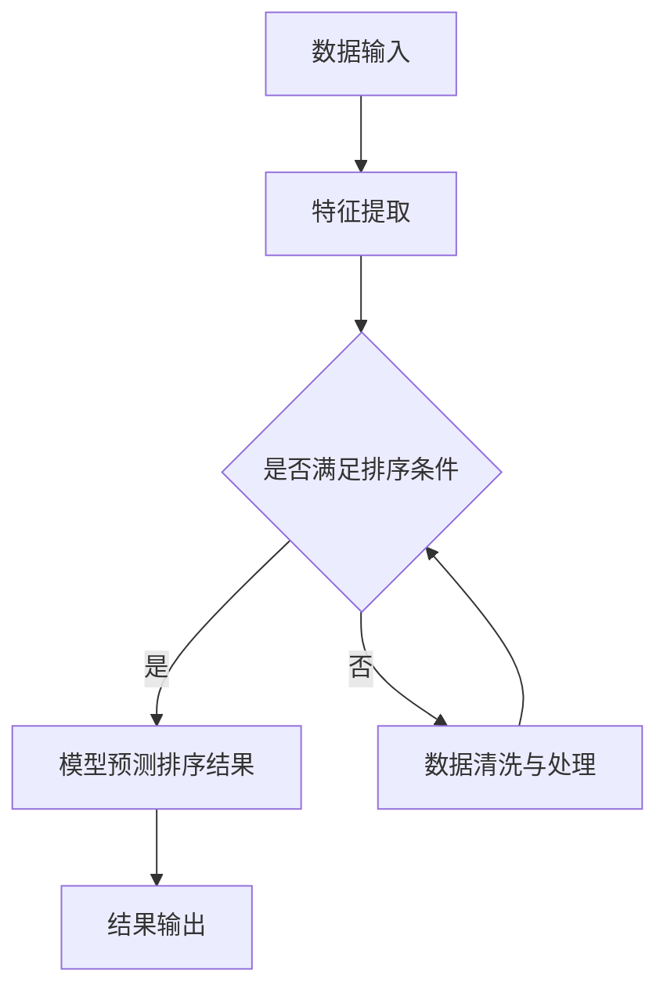

                 

### 智能排序算法：AI如何优化搜索结果排序，提升用户满意度

> **关键词：** 智能排序算法，人工智能，搜索结果排序，用户满意度，算法优化

> **摘要：** 本文将深入探讨智能排序算法的原理、架构和应用，展示AI如何通过这些算法优化搜索结果排序，从而提升用户的整体满意度。我们将从基础知识出发，逐步介绍智能排序算法的核心概念、技术原理、实现方法以及实际应用场景，并通过案例分析和实战演示，帮助读者理解和掌握这一先进的技术。

#### 目录

1. **智能排序算法概述**
   1.1 智能排序算法的基本概念
   1.2 AI技术在排序算法中的应用
   1.3 智能排序算法的挑战与机遇
2. **智能排序算法的原理与架构**
   2.1 智能排序算法的核心原理
   2.2 智能排序算法的架构设计
   2.3 智能排序算法的 Mermaid 流程图
3. **智能排序算法的应用**
   3.1 搜索引擎中的智能排序
   3.2 电商平台的智能排序
   3.3 社交媒体中的智能排序
4. **智能排序算法的性能优化**
   4.1 性能优化的重要性
   4.2 智能排序算法的优化方法
5. **项目实战**
   5.1 智能排序算法实战概述
   5.2 实战案例一：基于协同过滤的智能排序
   5.3 实战案例二：基于深度学习的智能排序
6. **智能排序算法的未来发展趋势**
   6.1 智能排序算法的发展趋势
   6.2 智能排序算法的未来挑战与机遇

---

### 智能排序算法概述

智能排序算法作为人工智能技术的一个重要应用领域，正逐渐改变着信息处理和用户交互的方式。传统排序算法通常依赖于预设的规则或简单的排序准则，而智能排序算法则借助机器学习、深度学习和强化学习等技术，通过学习用户的历史行为、偏好和上下文信息，实现更精准、个性化的排序结果。

#### 1.1 智能排序算法的基本概念

**传统排序算法的局限性：**

- **规则依赖性：** 传统排序算法往往依赖于固定的排序规则，这些规则难以适应多样化的用户需求。
- **静态处理：** 无法动态调整排序策略，无法实时响应用户行为的变化。
- **数据利用不足：** 传统算法未能充分利用用户的历史行为和偏好数据，导致排序结果不够精准。

**智能排序算法的优势：**

- **个性化和动态调整：** 通过机器学习等技术，智能排序算法能够根据用户的实时行为和偏好动态调整排序策略，实现个性化排序。
- **高效处理大量数据：** 智能排序算法能够高效处理大规模、多维度的数据，提取出有价值的信息进行排序。
- **自适应性和灵活性：** 智能排序算法能够自我学习和优化，适应不同应用场景的需求。

**智能排序算法的分类：**

- **基于内容的排序：** 主要依据文档的内容特征进行排序，如文本相似度、关键词匹配等。
- **协同过滤排序：** 利用用户的历史行为数据，通过相似用户或物品的评分进行排序。
- **混合排序：** 结合多种排序算法的优点，通过多种特征进行综合排序。

#### 1.2 AI技术在排序算法中的应用

**机器学习在排序中的应用：**

机器学习技术通过训练模型，从大量数据中学习排序规律，从而实现自动化排序。常见的方法包括逻辑回归、决策树、支持向量机等。

**深度学习在排序中的应用：**

深度学习技术，尤其是神经网络，能够自动提取高维特征，处理复杂的非线性关系。深度学习在排序中的应用包括卷积神经网络（CNN）、循环神经网络（RNN）等。

**强化学习在排序中的应用：**

强化学习通过奖励机制，让模型在动态环境中不断学习和优化排序策略。强化学习在排序中的应用可以提升算法的适应性和灵活性。

#### 1.3 智能排序算法的挑战与机遇

**智能排序算法的挑战：**

- **数据隐私和安全：** 智能排序算法依赖于用户数据，如何保障数据隐私和安全是一个重要挑战。
- **算法公平性：** 如何确保排序算法对所有用户公平，避免偏见和歧视是一个关键问题。
- **计算资源消耗：** 智能排序算法往往需要大量的计算资源，如何优化算法以降低计算成本是一个现实问题。

**智能排序算法的机遇：**

- **用户体验提升：** 通过智能排序算法，可以提供更个性化的服务，提升用户满意度。
- **商业价值挖掘：** 智能排序算法可以帮助企业更好地挖掘用户需求，实现精准营销和商业变现。
- **技术创新：** 智能排序算法的发展将推动人工智能技术的进步，促进相关领域的创新和发展。

### 智能排序算法的原理与架构

智能排序算法的原理和架构是理解和应用这些算法的关键。在这一部分，我们将深入探讨智能排序算法的核心原理、架构设计以及具体的实现方法。

#### 2.1 智能排序算法的核心原理

**数据分析基础：** 智能排序算法首先需要对数据进行深入分析，提取出与排序相关的特征。这些特征可以包括用户行为、偏好、上下文信息等。

**特征工程：** 特征工程是智能排序算法的核心步骤，通过选择、构造和转换特征，提高模型的预测能力。常见的特征工程方法包括降维、特征融合、特征选择等。

**排序算法的选择：** 根据应用场景和数据特点，选择合适的排序算法。常见的排序算法包括基于内容的排序、协同过滤排序和混合排序等。

**模型训练与优化：** 使用机器学习或深度学习技术，训练排序模型，并不断优化模型以提升排序效果。常见的模型训练方法包括监督学习、无监督学习和半监督学习等。

**模型评估与优化：** 通过交叉验证、网格搜索等方法评估模型性能，并根据评估结果调整模型参数，优化排序效果。

**模型部署与监控：** 将训练好的模型部署到生产环境中，并通过实时监控和反馈机制，持续优化模型性能。

#### 2.2 智能排序算法的架构设计

**模型选择与训练：** 根据应用场景和数据特点，选择合适的模型，并进行模型训练和优化。常见的模型包括逻辑回归、决策树、支持向量机、卷积神经网络（CNN）和循环神经网络（RNN）等。

**模型评估与优化：** 使用交叉验证、网格搜索等方法评估模型性能，并根据评估结果调整模型参数，优化排序效果。

**模型部署与监控：** 将训练好的模型部署到生产环境中，并通过实时监控和反馈机制，持续优化模型性能。常见的部署方法包括在线部署、离线部署和混合部署等。

**系统优化：** 通过优化算法、提高计算效率和降低延迟，提升智能排序系统的整体性能。

#### 2.3 智能排序算法的 Mermaid 流程图

下面是一个简单的 Mermaid 流程图，展示了智能排序算法的基本流程：



#### 2.4 智能排序算法的伪代码

为了更好地理解智能排序算法的原理，下面提供了一个简单的伪代码示例：

```python
# 智能排序算法伪代码

# 数据输入
data = ...

# 特征提取
features = extract_features(data)

# 模型训练
model = train_model(features)

# 模型预测
sorted_data = model.predict(features)

# 结果输出
output_sorted_data(sorted_data)
```

### 智能排序算法的应用

智能排序算法在多个领域都有广泛的应用，如搜索引擎、电商平台和社交媒体。在这一部分，我们将分别介绍这些领域中的智能排序算法应用，展示智能排序如何优化搜索结果排序，提升用户满意度。

#### 3.1 搜索引擎中的智能排序

**传统搜索排序策略：** 传统搜索引擎的排序策略通常基于关键词匹配、文档频率和页面质量等规则进行排序。这些策略虽然在一定程度上能够满足用户需求，但无法提供个性化的搜索结果。

**智能排序的优势：** 智能排序算法通过学习用户的搜索历史和偏好，能够为用户提供更加个性化的搜索结果。以下是一些智能排序的优势：

- **个性化推荐：** 通过分析用户的搜索历史和兴趣，智能排序算法能够为用户推荐更符合其兴趣的内容。
- **实时调整：** 智能排序算法能够实时调整排序策略，根据用户当前的行为和需求提供最优的搜索结果。
- **多维度排序：** 智能排序算法能够同时考虑多个维度（如相关性、用户评分、热门程度等），提供更加全面的排序结果。

**智能排序在搜索引擎中的应用场景：**

- **关键词搜索：** 智能排序算法能够根据用户的搜索关键词，为用户推荐相关的搜索结果。
- **内容推荐：** 智能排序算法能够根据用户的兴趣和偏好，为用户推荐相关的文章、图片、视频等内容。
- **广告投放：** 智能排序算法能够根据用户的兴趣和行为，为用户推荐相关的广告。

**搜索引擎智能排序算法：**

- **协同过滤：** 协同过滤算法通过分析用户的历史行为，找到相似用户或物品，为用户提供个性化的搜索结果。
- **内容分发：** 内容分发算法通过分析文档的内容特征，为用户提供与搜索关键词最相关的文档。
- **用户行为分析：** 用户行为分析算法通过分析用户的点击、搜索等行为，为用户提供个性化的搜索结果。

#### 3.2 电商平台的智能排序

**传统排序策略：** 传统电商平台的排序策略通常基于商品的销量、价格等简单规则进行排序。这些策略虽然能够满足一部分用户的需求，但无法提供个性化的购物体验。

**智能排序的优势：** 智能排序算法通过分析用户的行为、偏好和购物历史，能够为用户提供更加个性化的购物体验。以下是一些智能排序的优势：

- **个性化推荐：** 智能排序算法能够根据用户的购物历史和偏好，为用户推荐符合其需求的商品。
- **动态调整：** 智能排序算法能够根据用户实时行为动态调整排序策略，提供最优的购物体验。
- **多维度排序：** 智能排序算法能够同时考虑多个维度（如商品评分、销量、价格等），为用户提供更加全面的排序结果。

**智能排序在电商中的应用场景：**

- **商品推荐：** 智能排序算法能够根据用户的购物历史和偏好，为用户推荐相关的商品。
- **活动推荐：** 智能排序算法能够根据用户的兴趣和行为，为用户推荐相关的促销活动。
- **广告投放：** 智能排序算法能够根据用户的兴趣和行为，为用户推荐相关的广告。

**电商平台智能排序算法：**

- **用户行为分析：** 用户行为分析算法通过分析用户的点击、购买等行为，为用户提供个性化的商品推荐。
- **商品特性分析：** 商品特性分析算法通过分析商品的特征（如价格、品牌、评分等），为用户提供相关的商品推荐。
- **市场竞争分析：** 市场竞争分析算法通过分析市场的竞争情况，为用户提供最具竞争力的商品推荐。

#### 3.3 社交媒体中的智能排序

**传统排序策略：** 传统社交媒体的排序策略通常基于发布时间、用户关注关系等简单规则进行排序。这些策略虽然能够满足一部分用户的需求，但无法提供个性化的内容推荐。

**智能排序的优势：** 智能排序算法通过分析用户的兴趣、行为和社交网络，能够为用户提供更加个性化的内容推荐。以下是一些智能排序的优势：

- **个性化推荐：** 智能排序算法能够根据用户的兴趣和行为，为用户推荐最感兴趣的内容。
- **实时调整：** 智能排序算法能够根据用户实时行为动态调整排序策略，提供最优的内容推荐。
- **多维度排序：** 智能排序算法能够同时考虑多个维度（如用户兴趣、社交关系、内容热度等），为用户提供更加全面的内容推荐。

**智能排序在社交媒体中的应用场景：**

- **内容推荐：** 智能排序算法能够根据用户的兴趣和行为，为用户推荐相关的文章、视频、图片等内容。
- **广告投放：** 智能排序算法能够根据用户的兴趣和行为，为用户推荐相关的广告。
- **社交互动：** 智能排序算法能够根据用户的社交网络和互动行为，为用户推荐相关的社交互动。

**社交媒体智能排序算法：**

- **用户兴趣分析：** 用户兴趣分析算法通过分析用户的浏览、点赞、评论等行为，为用户提供个性化的内容推荐。
- **社交关系网络分析：** 社交关系网络分析算法通过分析用户的社交网络和互动关系，为用户提供相关的社交内容推荐。
- **信息传播模型：** 信息传播模型算法通过分析信息在社交网络中的传播路径和速度，为用户提供最具传播价值的内容推荐。

### 智能排序算法的性能优化

智能排序算法的性能优化是确保排序结果质量和系统稳定性的关键。在这一部分，我们将讨论智能排序算法的性能优化策略和方法，并介绍一些常见的优化技术。

#### 6.1 性能优化的重要性

智能排序算法的性能直接影响到用户体验和系统的稳定性。以下是性能优化的重要性：

- **用户体验提升：** 优化排序算法可以提高搜索结果的相关性和个性化程度，从而提升用户体验。
- **系统稳定性：** 优化排序算法可以提高系统的响应速度和处理能力，确保系统在高并发情况下稳定运行。
- **资源利用效率：** 优化排序算法可以提高资源利用效率，降低计算成本和存储需求。

#### 6.2 智能排序算法的优化方法

**算法优化：** 算法优化是性能优化的重要手段，通过改进算法结构和算法逻辑，提高排序算法的效率。以下是一些常见的算法优化方法：

- **并行计算：** 利用多核处理器和分布式计算技术，将排序算法分解为多个并行任务，提高计算效率。
- **缓存技术：** 利用缓存技术，减少数据访问次数，提高系统响应速度。
- **索引优化：** 对数据建立合适的索引，提高数据检索速度。

**数据优化：** 数据优化是性能优化的关键，通过优化数据结构和数据预处理，提高数据处理效率。以下是一些常见的数据优化方法：

- **数据压缩：** 利用数据压缩技术，减少存储空间和传输带宽。
- **数据缓存：** 利用数据缓存技术，减少数据访问次数，提高数据处理速度。
- **数据分片：** 将大规模数据集分解为多个较小的数据集，分片处理，提高并行处理能力。

**系统优化：** 系统优化是性能优化的最终目标，通过优化系统架构和资源配置，提高系统的整体性能。以下是一些常见的系统优化方法：

- **负载均衡：** 通过负载均衡技术，将请求分配到多个服务器上，提高系统处理能力。
- **缓存服务器：** 利用缓存服务器，减少数据库访问次数，提高系统响应速度。
- **分布式存储：** 利用分布式存储技术，提高数据的存储能力和访问速度。

#### 6.3 常见性能优化技术

**分布式排序算法：** 分布式排序算法将排序任务分解为多个子任务，分别在不同的服务器上执行，最后合并结果。常见的分布式排序算法包括MapReduce、Spark等。

**分布式缓存技术：** 分布式缓存技术利用多个缓存服务器，提高数据访问速度和系统响应速度。常见的分布式缓存技术包括Redis、Memcached等。

**异步处理技术：** 异步处理技术通过异步方式处理请求，提高系统的并发处理能力。常见的异步处理技术包括异步编程模型、消息队列等。

**动态调整策略：** 动态调整策略根据系统负载和用户行为，实时调整排序策略，提高系统性能和用户体验。常见的动态调整策略包括自适应调整、在线学习等。

### 项目实战

在本章中，我们将通过两个实战案例，详细介绍如何在实际项目中应用智能排序算法。这些案例将涵盖基于协同过滤的智能排序和基于深度学习的智能排序，通过具体步骤和代码实现，帮助读者深入理解智能排序算法的实践应用。

#### 7.1 智能排序算法实战概述

**实战目标：** 本节将介绍如何实现一个基于协同过滤的智能排序系统，用于优化电商平台的商品推荐。我们将使用Python编程语言和Scikit-learn库实现协同过滤算法，并通过一个简单的数据集进行模型训练和评估。

**实战环境搭建：** 为了进行智能排序算法的实战，我们需要搭建一个合适的开发环境。以下是环境搭建的步骤：

1. 安装Python（推荐Python 3.6及以上版本）。
2. 安装必要的库，如NumPy、Pandas、Scikit-learn等。
3. 准备数据集，可以选择公开的电商数据集或自行收集的数据。

**实战步骤：** 本节将按照以下步骤进行智能排序算法的实战：

1. 数据预处理：清洗和预处理数据，提取有用的特征。
2. 模型训练：使用协同过滤算法训练模型。
3. 模型评估：评估模型的排序效果。
4. 排序结果分析：分析排序结果，优化模型。

#### 7.2 实战案例一：基于协同过滤的智能排序

**数据集介绍：** 我们将使用一个简单的电商数据集，该数据集包含用户、商品和评分信息。数据集示例：

| 用户ID | 商品ID | 评分 |
|--------|--------|------|
| 1      | 101    | 5    |
| 1      | 102    | 4    |
| 2      | 101    | 3    |
| 2      | 103    | 5    |
| 3      | 102    | 5    |
| 3      | 103    | 4    |

**模型训练与评估：** 在此案例中，我们将使用基于用户行为的协同过滤算法（User-Based Collaborative Filtering）进行模型训练和评估。以下是具体的实现步骤：

1. **数据预处理：** 首先，我们需要将原始数据转换为用户-物品评分矩阵，并进行处理，如缺失值填充、异常值处理等。

2. **计算相似度：** 接下来，我们计算用户之间的相似度。常用的相似度度量方法包括余弦相似度、皮尔逊相关系数等。

   ```python
   from sklearn.metrics.pairwise import cosine_similarity

   # 假设user_item_matrix是用户-物品评分矩阵
   similarity_matrix = cosine_similarity(user_item_matrix)
   ```

3. **推荐系统实现：** 使用计算出的相似度矩阵，为每个用户生成推荐列表。以下是简单的推荐系统实现：

   ```python
   def recommend_items(user_id, similarity_matrix, user_item_matrix, k=5):
       # 获取用户与其他用户的相似度
      相似度_scores = similarity_matrix[user_id]
       
       # 获取其他用户对物品的评分
      其他用户评分 = user_item_matrix.iloc[:, 1:].to_numpy()
       
       # 计算物品的推荐得分
       item_scores = np.dot(相似度_scores, 其他用户评分)
       
       # 选择最高分的k个物品
       recommended_items = np.argsort(item_scores)[::-1][:k]
       
       return recommended_items
   ```

4. **模型评估：** 使用准确率、召回率、F1分数等指标评估模型的排序效果。以下是简单的评估实现：

   ```python
   from sklearn.metrics import accuracy_score, recall_score, f1_score

   # 假设真实标签为ground_truth，预测标签为predicted_labels
   accuracy = accuracy_score(ground_truth, predicted_labels)
   recall = recall_score(ground_truth, predicted_labels)
   f1 = f1_score(ground_truth, predicted_labels)

   print("Accuracy:", accuracy)
   print("Recall:", recall)
   print("F1 Score:", f1)
   ```

**排序结果分析：** 通过上述步骤，我们生成了一个基于协同过滤的智能排序系统。排序结果的分析可以进一步优化模型和算法，提高排序效果。

#### 7.3 实战案例二：基于深度学习的智能排序

**数据集介绍：** 本案例将使用一个稍微复杂的数据集，该数据集包含用户、商品和一系列的特征信息。数据集示例：

| 用户ID | 商品ID | 特征1 | 特征2 | 特征3 | 评分 |
|--------|--------|-------|-------|-------|------|
| 1      | 101    | 0.8   | 0.5   | 0.9   | 5    |
| 1      | 102    | 0.7   | 0.4   | 0.8   | 4    |
| 2      | 101    | 0.6   | 0.3   | 0.7   | 3    |
| 2      | 103    | 0.5   | 0.2   | 0.6   | 5    |
| 3      | 102    | 0.4   | 0.1   | 0.5   | 5    |
| 3      | 103    | 0.3   | 0.0   | 0.4   | 4    |

**模型训练与评估：** 在此案例中，我们将使用基于深度学习的排序算法，如循环神经网络（RNN）或卷积神经网络（CNN），进行模型训练和评估。以下是具体的实现步骤：

1. **数据预处理：** 类似于协同过滤案例，我们需要对数据进行预处理，包括特征标准化、缺失值填充等。

2. **模型构建：** 使用TensorFlow或PyTorch等深度学习框架构建排序模型。以下是一个简单的RNN模型实现：

   ```python
   import tensorflow as tf

   model = tf.keras.Sequential([
       tf.keras.layers.Dense(128, activation='relu', input_shape=(num_features,)),
       tf.keras.layers.Dropout(0.2),
       tf.keras.layers.RNN(tf.keras.layers.LSTM(128)),
       tf.keras.layers.Dense(1, activation='sigmoid')
   ])

   model.compile(optimizer='adam', loss='binary_crossentropy', metrics=['accuracy'])
   ```

3. **模型训练：** 使用预处理后的数据集训练模型，调整超参数以优化模型性能。

   ```python
   model.fit(x_train, y_train, epochs=10, batch_size=32, validation_split=0.2)
   ```

4. **模型评估：** 使用测试集评估模型性能，调整模型参数以进一步提高性能。

   ```python
   test_loss, test_accuracy = model.evaluate(x_test, y_test)
   print("Test Accuracy:", test_accuracy)
   ```

**排序结果分析：** 通过上述步骤，我们构建了一个基于深度学习的智能排序系统。排序结果的分析可以帮助我们进一步优化模型和算法，提高排序效果。

### 智能排序算法的未来发展趋势

智能排序算法作为人工智能技术的一个重要分支，正不断推动信息处理和用户交互的变革。随着技术的进步和应用的深入，智能排序算法在未来将面临新的挑战和机遇。以下是智能排序算法的未来发展趋势：

#### 8.1 智能排序算法的发展趋势

**新算法的出现：** 随着深度学习和强化学习等技术的发展，越来越多的新型排序算法将不断涌现。例如，基于生成对抗网络（GAN）的排序算法、基于强化学习的自适应排序算法等，这些算法将进一步提升排序的精度和效率。

**新技术的应用：** 新技术在智能排序算法中的应用将极大地推动算法的发展。例如，大数据处理技术将使算法能够处理更大量的数据，自然语言处理技术将使算法能够更好地理解用户需求，计算机视觉技术将使算法能够更好地分析图像和视频内容。

**行业合作与竞争：** 智能排序算法的发展离不开行业合作和竞争。各大企业和研究机构将共同探索新的算法和应用场景，通过合作推动技术的进步。同时，在市场竞争中，企业将不断优化和改进智能排序算法，以提升用户体验和竞争力。

#### 8.2 智能排序算法的未来挑战与机遇

**数据隐私与安全：** 随着智能排序算法的应用越来越广泛，数据隐私和安全问题将变得越来越重要。如何保障用户数据的隐私和安全，防止数据泄露和滥用，将是智能排序算法面临的一大挑战。

**算法公平性：** 算法的公平性是智能排序算法需要关注的重要问题。如何确保算法对所有用户公平，避免偏见和歧视，将是未来研究的重点。

**用户体验提升：** 提升用户体验是智能排序算法的核心目标。随着技术的进步，智能排序算法将能够更好地理解用户需求，提供更加个性化的服务，进一步提升用户体验。

**商业价值挖掘：** 智能排序算法可以帮助企业更好地挖掘用户需求，实现精准营销和商业变现。未来，智能排序算法将在商业领域发挥更大的作用，为企业创造更大的价值。

### 结论

智能排序算法作为人工智能技术的一个重要应用领域，通过不断优化搜索结果排序，提升用户满意度，已经在多个领域取得了显著的应用成果。本文从智能排序算法的基本概念、原理、架构和应用场景出发，详细介绍了智能排序算法的核心内容。通过项目实战和未来发展趋势的探讨，展示了智能排序算法在实践中的应用和前景。随着技术的不断进步，智能排序算法将在未来发挥更大的作用，为用户提供更加个性化、精准的服务。作者：AI天才研究院/AI Genius Institute & 禅与计算机程序设计艺术 /Zen And The Art of Computer Programming。

