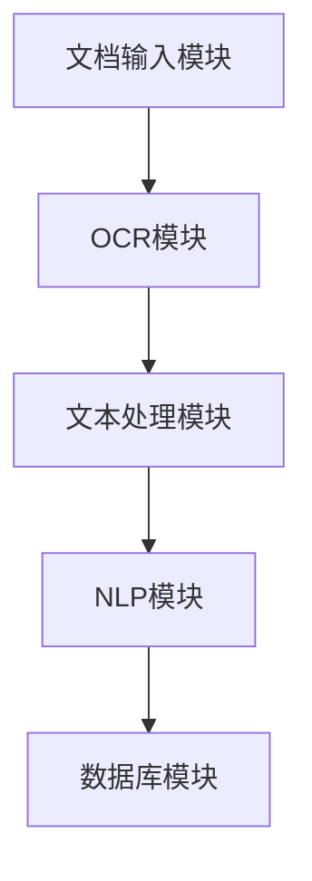

                 

# 《智能文档处理在办公自动化中的应用》

## 关键词
智能文档处理、办公自动化、光学字符识别（OCR）、自然语言处理（NLP）、文本分类、情感分析、系统架构、项目实战

## 摘要
随着信息时代的到来，智能文档处理在办公自动化中的应用越来越广泛。本文首先概述了智能文档处理的基本概念、重要性及其发展历程，然后深入探讨了光学字符识别（OCR）和自然语言处理（NLP）的核心技术原理，包括词嵌入和文本分类方法。接着，文章介绍了智能文档处理系统的架构设计和高效实现策略，并通过两个实战案例详细讲解了OCR和NLP技术在文档处理中的应用。最后，本文展望了智能文档处理技术的未来发展，探讨了其在企业办公自动化中的创新应用及其对企业运营的积极影响。

## 目录大纲

### 第一部分：智能文档处理基础理论

#### 1.1 智能文档处理概述
- 1.1.1 智能文档处理的定义与重要性
- 1.1.2 智能文档处理的演进历程
- 1.1.3 智能文档处理在办公自动化中的应用前景

#### 1.2 文档识别技术
- 1.2.1 光学字符识别（OCR）原理与分类
  - 1.2.1.1 OCR技术的基本原理
  - 1.2.1.2 OCR技术的常见分类
- 1.2.2 OCR技术在实际应用中的挑战与优化策略

#### 1.3 自然语言处理（NLP）基础
- 1.3.1 NLP的基本概念与任务
  - 1.3.1.1 NLP的起源与发展
  - 1.3.1.2 NLP的核心任务
- 1.3.2 词嵌入技术原理与应用
  - 1.3.2.1 词嵌入的概念
  - 1.3.2.2 词嵌入技术的应用

#### 1.4 情感分析与文本分类
- 1.4.1 情感分析的基本原理与方法
  - 1.4.1.1 情感分析的定义
  - 1.4.1.2 情感分析的技术方法
- 1.4.2 文本分类的应用场景与算法
  - 1.4.2.1 文本分类的定义
  - 1.4.2.2 常见文本分类算法介绍

### 第二部分：智能文档处理技术实现

#### 2.1 智能文档处理系统架构设计
- 2.1.1 智能文档处理系统的整体架构
  - 2.1.1.1 系统架构的核心模块
  - 2.1.1.2 系统架构的设计原则
- 2.1.2 智能文档处理系统的高效实现策略
  - 2.1.2.1 性能优化方法
  - 2.1.2.2 可扩展性与可维护性设计

#### 2.2 OCR技术在文档处理中的应用
- 2.2.1 OCR技术在文本识别中的应用
  - 2.2.1.1 OCR技术在文档文本识别的流程
  - 2.2.1.2 OCR技术在文档文本识别的挑战
- 2.2.2 OCR技术在图像处理中的应用
  - 2.2.2.1 OCR技术在图像预处理中的关键步骤
  - 2.2.2.2 OCR技术在图像识别中的算法选择

#### 2.3 NLP技术在文档分析中的应用
- 2.3.1 文本预处理与特征提取
  - 2.3.1.1 文本预处理的步骤与技巧
  - 2.3.1.2 特征提取的方法与选择
- 2.3.2 文本分类与情感分析
  - 2.3.2.1 文本分类算法的选择与评估
  - 2.3.2.2 情感分析模型的设计与优化

#### 2.4 智能文档处理实战案例
- 2.4.1 实战案例一：企业合同智能审核系统
  - 2.4.1.1 项目背景与目标
  - 2.4.1.2 系统设计与实现
- 2.4.2 实战案例二：公文智能分类系统
  - 2.4.2.1 项目背景与目标
  - 2.4.2.2 系统设计与实现

### 第三部分：智能文档处理的未来发展

#### 3.1 智能文档处理技术趋势
- 3.1.1 智能文档处理技术的发展方向
  - 3.1.1.1 技术演进的趋势
  - 3.1.1.2 应用领域的拓展
- 3.1.2 智能文档处理技术面临的挑战与应对策略
  - 3.1.2.1 技术挑战的分析
  - 3.1.2.2 应对策略的探讨

#### 3.2 智能文档处理在企业办公自动化中的创新应用
- 3.2.1 智能文档处理的潜在应用场景
  - 3.2.1.1 日常办公文档处理
  - 3.2.1.2 企业流程自动化
- 3.2.2 智能文档处理对企业运营的积极影响
  - 3.2.2.1 提高工作效率
  - 3.2.2.2 降低运营成本

#### 3.3 未来智能文档处理的发展前景
- 3.3.1 智能文档处理技术的发展预测
  - 3.3.1.1 技术发展的关键因素
  - 3.3.1.2 未来发展趋势展望
- 3.3.2 智能文档处理对办公自动化的深远影响
  - 3.3.2.1 对企业竞争力的提升
  - 3.3.2.2 对员工工作方式的改变

### 附录

#### 附录A：智能文档处理相关工具与资源
- 附录A.1 主流OCR工具介绍
  - 附录A.1.1 Tesseract OCR
  - 附录A.1.2 OCRopus
- 附录A.2 NLP工具与框架
  - 附录A.2.1 NLTK
  - 附录A.2.2 SpaCy

#### 附录B：智能文档处理项目实战代码与数据集
- 附录B.1 实战项目一：企业合同智能审核系统代码解析
  - 附录B.1.1 系统架构与实现流程
  - 附录B.1.2 关键代码解析
- 附录B.2 实战项目二：公文智能分类系统代码解析
  - 附录B.2.1 系统架构与实现流程
  - 附录B.2.2 关键代码解析

## 第一部分：智能文档处理基础理论

### 1.1 智能文档处理概述

#### 1.1.1 智能文档处理的定义与重要性

智能文档处理（Intelligent Document Processing，IDP）是指利用人工智能技术，特别是机器学习和自然语言处理技术，对文档内容进行自动识别、分类、抽取、理解和处理的过程。在办公自动化中，智能文档处理扮演着至关重要的角色，它能够显著提高工作效率，减少人工错误，优化业务流程。

智能文档处理的重要性主要体现在以下几个方面：

1. **提高工作效率**：通过自动化处理文档，可以大幅减少人工处理时间，使员工能够专注于更高价值的工作。
2. **减少错误**：机器比人工更加精确，智能文档处理能够有效减少数据录入和处理的错误。
3. **优化业务流程**：智能文档处理可以帮助企业快速响应客户需求，提高业务流程的灵活性和响应速度。
4. **数据资产化**：智能文档处理能够将文档中的结构化和非结构化数据转化为可分析的企业资产，为决策提供支持。

#### 1.1.2 智能文档处理的演进历程

智能文档处理技术的发展经历了几个关键阶段：

1. **早期的OCR技术**：20世纪50年代，OCR技术开始用于文本识别，主要通过字符识别模板匹配来实现。
2. **基于规则的系统**：20世纪80年代，出现了基于规则的方法，通过预设的规则来处理文档，这一阶段取得了一定的进展，但灵活性有限。
3. **机器学习时代的到来**：21世纪初，随着机器学习技术的兴起，智能文档处理进入了一个新的阶段。利用深度学习技术，OCR和NLP的性能得到了显著提升。
4. **全面智能化**：当前，智能文档处理正朝着全面智能化的方向发展，通过融合多种人工智能技术，实现对文档内容的深度理解和智能处理。

#### 1.1.3 智能文档处理在办公自动化中的应用前景

随着人工智能技术的不断发展，智能文档处理在办公自动化中的应用前景十分广阔：

1. **文档分类**：自动将收到的文档归类到不同的文件夹，提高文件管理效率。
2. **数据抽取**：自动从文档中提取关键信息，如联系人信息、合同条款等，实现数据自动化处理。
3. **文本分析**：通过情感分析、主题分类等技术，对文档内容进行深入分析，为企业决策提供支持。
4. **自动化审批**：结合智能文档处理和流程管理技术，实现文档的自动化审批，提高业务流程的自动化程度。

### 1.2 文档识别技术

文档识别技术是智能文档处理的核心技术之一，其中光学字符识别（OCR）技术是最为基础和关键的部分。

#### 1.2.1 光学字符识别（OCR）原理与分类

##### 1.2.1.1 OCR技术的基本原理

OCR技术的基本原理是将图像中的文字内容转化为可编辑和可搜索的电子文本。这个过程主要包括以下几个步骤：

1. **图像预处理**：对原始图像进行去噪、二值化、倾斜校正等处理，提高图像质量。
2. **字符分割**：将图像中的文字区域分割出来，以便进行后续的字符识别。
3. **字符识别**：对分割后的字符图像进行识别，将其转换为对应的文本字符。

##### 1.2.1.2 OCR技术的常见分类

根据不同的技术手段和识别算法，OCR技术可以分为以下几类：

1. **模板匹配法**：通过预先训练好的字符模板，与待识别的字符图像进行匹配，找到最佳匹配的字符。
2. **特征提取法**：通过提取字符图像的纹理、形状、方向等特征，利用机器学习算法进行分类和识别。
3. **深度学习方法**：利用卷积神经网络（CNN）等深度学习技术，对字符图像进行自动特征提取和分类识别。

#### 1.2.2 OCR技术在实际应用中的挑战与优化策略

尽管OCR技术在文档识别方面取得了显著进展，但在实际应用中仍然面临一些挑战：

1. **图像质量**：文档图像的质量直接影响OCR的准确性。图像可能存在模糊、倾斜、光照不均等问题，需要通过预处理技术进行优化。
2. **字符多样性**：文档中的字符种类繁多，包括字母、数字、符号和特殊字体，这增加了识别的难度。
3. **背景干扰**：图像中的背景干扰可能会影响字符的分割和识别，需要采用有效的分割算法进行去噪。
4. **多语言支持**：随着全球化的推进，OCR系统需要支持多种语言，这增加了系统设计和实现的复杂性。

为了应对这些挑战，可以采取以下优化策略：

1. **多级预处理**：通过多种预处理技术，如图像增强、滤波、边缘检测等，提高图像质量。
2. **自适应特征提取**：根据图像特点和识别任务，自适应地选择和调整特征提取方法。
3. **集成学习**：将多种识别算法集成到一个系统中，利用不同的算法优势，提高整体识别性能。
4. **跨语言模型训练**：通过跨语言模型训练，提高多语言OCR系统的性能。

### 1.3 自然语言处理（NLP）基础

自然语言处理（NLP，Natural Language Processing）是智能文档处理的重要组成部分，它使得计算机能够理解和处理人类语言。NLP涉及多个层面的任务，包括文本分类、情感分析、命名实体识别等。

#### 1.3.1 NLP的基本概念与任务

##### 1.3.1.1 NLP的起源与发展

NLP起源于20世纪50年代，最初的研究主要集中在语言模型和机器翻译。随着计算机技术的发展，特别是深度学习技术的应用，NLP取得了长足的进步。

##### 1.3.1.2 NLP的核心任务

NLP的核心任务包括：

1. **文本分类**：将文本数据归类到不同的类别，如新闻分类、垃圾邮件检测等。
2. **情感分析**：分析文本中的情感倾向，如正面、负面或中立。
3. **命名实体识别**：从文本中识别出人名、地名、组织名等实体。
4. **机器翻译**：将一种语言的文本翻译成另一种语言。
5. **问答系统**：构建能够回答用户问题的系统。

#### 1.3.2 词嵌入技术原理与应用

##### 1.3.2.1 词嵌入的概念

词嵌入（Word Embedding）是将词语映射到高维空间中的向量表示。词嵌入技术的核心思想是将语义相近的词语映射到空间中接近的位置。

##### 1.3.2.2 词嵌入技术的应用

词嵌入技术在NLP中有广泛的应用，包括：

1. **文本分类**：通过词嵌入，可以将文本转化为向量表示，方便进行分类任务。
2. **情感分析**：利用词嵌入，可以更好地捕捉文本中的情感信息。
3. **命名实体识别**：词嵌入可以帮助模型更好地识别文本中的实体。

### 1.4 情感分析与文本分类

情感分析（Sentiment Analysis）是NLP中的一个重要任务，它旨在识别文本中的情感倾向。文本分类（Text Classification）则是将文本数据归类到不同的类别。

#### 1.4.1 情感分析的基本原理与方法

##### 1.4.1.1 情感分析的定义

情感分析是指通过自然语言处理技术，识别文本中的情感倾向，如正面、负面或中立。

##### 1.4.1.2 情感分析的技术方法

情感分析的方法主要包括：

1. **基于规则的方法**：通过预设的规则，对文本进行情感分类。
2. **基于机器学习的方法**：利用机器学习算法，如朴素贝叶斯、支持向量机等，对文本进行情感分类。
3. **基于深度学习的方法**：利用深度学习技术，如卷积神经网络（CNN）和循环神经网络（RNN），对文本进行情感分类。

#### 1.4.2 文本分类的应用场景与算法

##### 1.4.2.1 文本分类的定义

文本分类是指将文本数据归类到不同的类别。

##### 1.4.2.2 常见文本分类算法介绍

常见的文本分类算法包括：

1. **朴素贝叶斯分类器**：基于贝叶斯定理和特征条件独立性假设，是一种简单而有效的分类算法。
2. **支持向量机（SVM）**：通过将数据映射到高维空间，找到最佳分类边界，实现对文本的准确分类。
3. **朴素贝叶斯与支持向量机结合**：将朴素贝叶斯和支持向量机相结合，以提高分类性能。
4. **卷积神经网络（CNN）**：利用卷积神经网络对文本进行特征提取和分类。

## 第二部分：智能文档处理技术实现

### 2.1 智能文档处理系统架构设计

智能文档处理系统的架构设计是确保系统能够高效、准确地处理文档数据的关键。一个典型的智能文档处理系统通常包括以下几个核心模块：

1. **文档输入模块**：负责接收各种格式的文档，如PDF、Word、Excel等，并进行初步的解析和格式转换。
2. **图像预处理模块**：对文档图像进行去噪、二值化、倾斜校正等预处理操作，以提高图像质量，为后续的OCR处理做准备。
3. **OCR模块**：使用OCR技术对预处理后的图像进行文本识别，将图像中的文字内容转换为电子文本。
4. **文本处理模块**：对识别后的文本进行进一步的处理，如文本清洗、分词、词性标注等，为后续的NLP任务做准备。
5. **NLP模块**：利用NLP技术对文本进行情感分析、命名实体识别、文本分类等操作，实现对文档内容的深度理解。
6. **数据存储模块**：将处理后的数据存储到数据库或文件系统中，以便进行后续的数据分析和业务应用。

#### 2.1.1.1 系统架构的核心模块

以下是智能文档处理系统架构的核心模块及其功能：

1. **文档输入模块**：负责接收用户的文档输入，可以是本地文件、网络链接或者扫描设备。该模块需要支持多种文档格式，如PDF、Word、Excel、PPT等，并进行初步的格式解析和内容提取。

2. **图像预处理模块**：对文档图像进行一系列预处理操作，以提高图像质量。这些操作包括去噪、二值化、倾斜校正等。其中，倾斜校正是一个关键步骤，用于校正因扫描角度不当导致的文本倾斜问题。

3. **OCR模块**：使用OCR技术对预处理后的图像进行文本识别。OCR模块需要支持多种语言和字符集，能够准确识别各种复杂场景下的文本内容。

4. **文本处理模块**：对OCR模块输出的文本进行进一步处理。包括文本清洗（去除多余的空格、标点符号等）、分词（将文本分割为有意义的词语）、词性标注（标注每个词语的词性，如名词、动词等）等操作。

5. **NLP模块**：利用NLP技术对处理后的文本进行深度理解。包括情感分析（识别文本中的情感倾向）、命名实体识别（识别文本中的人名、地名、组织名等实体）、文本分类（将文本归类到不同的类别）等任务。

6. **数据存储模块**：将处理后的数据存储到数据库或文件系统中，以便进行后续的数据分析和业务应用。数据存储模块需要支持数据的快速检索和查询，并能够保证数据的安全性和完整性。

#### 2.1.1.2 系统架构的设计原则

在设计智能文档处理系统架构时，需要遵循以下原则：

1. **模块化设计**：系统应该采用模块化设计，将不同的功能模块分离，便于系统的维护和扩展。每个模块都应该有明确的功能和接口，模块之间通过接口进行通信。

2. **高效性**：系统需要具备较高的处理速度，能够在短时间内处理大量的文档数据。为了实现高效性，可以考虑使用多线程、并行计算等技术。

3. **可扩展性**：系统应该具备良好的可扩展性，能够根据业务需求的变化，方便地添加或替换功能模块。

4. **安全性**：系统需要保证数据的安全性，防止数据泄露和非法访问。可以通过加密、访问控制等技术来保障数据安全。

5. **可维护性**：系统需要具备良好的可维护性，方便进行故障排查和系统升级。可以通过日志记录、监控工具等来提高系统的可维护性。

### 2.1.2 智能文档处理系统的高效实现策略

为了实现智能文档处理系统的高效运行，可以从以下几个方面进行优化：

#### 2.1.2.1 性能优化方法

1. **并行处理**：充分利用多核CPU和GPU的计算能力，将文档处理任务并行化，提高处理速度。

2. **缓存机制**：使用缓存机制，对于重复处理的数据，避免重复计算，减少计算开销。

3. **批量处理**：将多个文档数据批量处理，减少I/O操作和系统调用的次数，提高处理效率。

4. **负载均衡**：合理分配任务到不同的服务器或计算节点，避免单点瓶颈，提高系统的整体性能。

5. **算法优化**：对系统中的关键算法进行优化，提高算法的执行效率。

#### 2.1.2.2 可扩展性与可维护性设计

1. **分布式架构**：采用分布式架构，将系统分解为多个服务，可以方便地进行水平扩展，提高系统的处理能力。

2. **模块化开发**：采用模块化开发，将不同的功能模块分离，可以方便地进行功能扩展和替换。

3. **配置化管理**：使用配置文件管理系统的参数和配置，方便进行系统参数的调整和优化。

4. **自动化部署**：使用自动化部署工具，如Docker、Kubernetes等，实现系统的快速部署和升级。

5. **日志记录与监控**：使用日志记录和监控工具，实时监控系统的运行状态，快速定位和解决问题。

### 2.2 OCR技术在文档处理中的应用

光学字符识别（OCR）技术在文档处理中起着至关重要的作用，它能够将图像中的文字内容转化为可编辑和可搜索的电子文本。OCR技术在文档处理中的应用包括文本识别、表格识别、图像预处理等多个方面。

#### 2.2.1 OCR技术在文本识别中的应用

OCR技术在文本识别中的应用主要包括以下几个步骤：

1. **图像预处理**：对原始文档图像进行预处理，包括去噪、二值化、倾斜校正等操作，以提高图像质量，减少噪声干扰。

2. **字符分割**：将预处理后的图像分割成单个字符或单词，为后续的字符识别做准备。

3. **字符识别**：对分割后的字符图像进行识别，将其转换为对应的文本字符。字符识别可以采用基于模板匹配、特征提取或深度学习的方法。

4. **文本重构**：将识别出的文本字符按照原始文档的排版顺序进行重构，形成完整的文本内容。

OCR技术在文本识别中面临的主要挑战包括：

1. **图像质量**：文档图像的质量直接影响OCR的准确性。图像可能存在模糊、倾斜、光照不均等问题，需要通过预处理技术进行优化。

2. **字符多样性**：文档中的字符种类繁多，包括字母、数字、符号和特殊字体，这增加了识别的难度。

3. **背景干扰**：图像中的背景干扰可能会影响字符的分割和识别，需要采用有效的分割算法进行去噪。

4. **多语言支持**：随着全球化的推进，OCR系统需要支持多种语言，这增加了系统设计和实现的复杂性。

为了应对这些挑战，可以采取以下优化策略：

1. **多级预处理**：通过多种预处理技术，如图像增强、滤波、边缘检测等，提高图像质量。

2. **自适应特征提取**：根据图像特点和识别任务，自适应地选择和调整特征提取方法。

3. **集成学习**：将多种识别算法集成到一个系统中，利用不同的算法优势，提高整体识别性能。

4. **跨语言模型训练**：通过跨语言模型训练，提高多语言OCR系统的性能。

#### 2.2.2 OCR技术在图像处理中的应用

OCR技术在图像处理中的应用不仅限于文本识别，还包括表格识别、图像预处理等多个方面。

1. **表格识别**：表格识别是将图像中的表格内容转化为电子表格的过程。这个过程包括表格定位、行列分割、单元格内容识别等步骤。表格识别在财务报表、发票识别等领域有广泛应用。

2. **图像预处理**：图像预处理是OCR技术的基础，包括去噪、二值化、倾斜校正等操作。其中，倾斜校正是一个关键步骤，用于校正因扫描角度不当导致的文本倾斜问题。

3. **图像分割**：图像分割是将图像分割成多个区域，以便进行后续的文本识别和表格识别。常用的分割方法包括基于阈值的分割、基于边缘检测的分割和基于形态学的分割。

4. **图像增强**：图像增强是提高图像质量的一种技术，包括对比度增强、亮度增强、噪声滤波等。图像增强有助于提高OCR的准确性，特别是在文档图像质量较差的情况下。

#### 2.2.2.1 OCR技术在图像预处理中的关键步骤

OCR技术在图像预处理中的关键步骤包括：

1. **图像去噪**：去噪是图像预处理的第一步，目的是去除图像中的噪声。常用的去噪方法包括中值滤波、高斯滤波、双边滤波等。

2. **图像二值化**：二值化是将图像转换为只有黑（0）和白（1）两种颜色的过程。二值化有助于突出图像中的文字区域，方便后续的文本识别。

3. **图像倾斜校正**：倾斜校正用于校正因扫描角度不当导致的文本倾斜问题。常用的倾斜校正方法包括直方图投影法、Hough变换法和机器学习方法。

4. **图像分割**：图像分割是将图像分割成多个区域，以便进行后续的文本识别和表格识别。常用的分割方法包括基于阈值的分割、基于边缘检测的分割和基于形态学的分割。

#### 2.2.2.2 OCR技术在图像识别中的算法选择

OCR技术在图像识别中的算法选择取决于图像质量和识别任务。以下是几种常见的OCR算法：

1. **基于模板匹配的OCR算法**：模板匹配算法通过将训练好的字符模板与待识别的字符图像进行匹配，找到最佳匹配的字符。这种方法简单有效，但需要对每种字体都训练一个模板。

2. **基于特征提取的OCR算法**：特征提取算法通过提取字符图像的纹理、形状、方向等特征，利用机器学习算法进行分类和识别。这种方法具有较好的泛化能力，但需要大量的训练数据和计算资源。

3. **基于深度学习的OCR算法**：深度学习算法，如卷积神经网络（CNN）和循环神经网络（RNN），通过自动学习字符图像的特征，实现对字符的准确识别。这种方法在处理复杂场景和多种字体时具有显著优势，但需要大量的数据和计算资源。

在选择OCR算法时，需要考虑以下因素：

1. **图像质量**：对于图像质量较好的场景，可以采用基于模板匹配的算法；对于图像质量较差的场景，需要采用基于特征提取或深度学习的算法。

2. **识别速度**：基于模板匹配的算法具有较快的识别速度，适用于实时性要求较高的场景；基于特征提取和深度学习的算法需要较长的训练时间，但识别速度较慢。

3. **识别精度**：基于模板匹配的算法的识别精度较低，但适用于对识别精度要求不高的场景；基于特征提取和深度学习的算法具有较高的识别精度，但需要大量的训练数据和计算资源。

### 2.3 NLP技术在文档分析中的应用

自然语言处理（NLP）技术在文档分析中发挥着重要作用，它使得计算机能够理解和处理人类语言。NLP技术在文档分析中的应用包括文本预处理、文本分类、情感分析、命名实体识别等多个方面。

#### 2.3.1 文本预处理与特征提取

文本预处理是NLP任务的第一步，它包括以下几个步骤：

1. **文本清洗**：去除文本中的噪声，如HTML标签、特殊字符、多余的空格等。常用的清洗方法包括正则表达式、字符串替换等。

2. **分词**：将文本分割为有意义的词语，如单词、短语等。常用的分词方法包括基于词典的分词、基于统计的分词和基于深度学习的分词。

3. **词性标注**：对文本中的每个词语进行词性标注，如名词、动词、形容词等。词性标注有助于理解文本的语义，为后续的文本分类和情感分析等任务提供支持。

4. **停用词过滤**：去除文本中的常用停用词，如“的”、“了”、“在”等。停用词过滤有助于减少文本中的噪声，提高后续分析任务的准确性。

5. **词嵌入**：将文本中的词语映射到高维空间中的向量表示。词嵌入有助于捕捉词语的语义信息，为文本分类和情感分析等任务提供有效的特征表示。

文本预处理是文档分析的基础，它能够显著提高后续分析任务的性能。通过有效的文本预处理，可以去除文本中的噪声，提高文本的纯净度，从而为文本分类和情感分析等任务提供高质量的特征。

#### 2.3.2 文本分类与情感分析

文本分类（Text Classification）是将文本数据归类到不同的类别的一种任务。在文档分析中，文本分类广泛应用于垃圾邮件检测、新闻分类、情感分析等领域。

1. **文本分类的定义**：文本分类是一种有监督学习任务，它通过训练模型，将新的文本数据归类到预定义的类别中。文本分类的目的是提高信息检索的准确性，提升文档管理的效率。

2. **常见文本分类算法**：常见的文本分类算法包括朴素贝叶斯（Naive Bayes）、支持向量机（SVM）、朴素贝叶斯与支持向量机结合（Naive Bayes + SVM）和卷积神经网络（CNN）等。

   - **朴素贝叶斯分类器**：基于贝叶斯定理和特征条件独立性假设，是一种简单而有效的分类算法。朴素贝叶斯分类器在处理高维文本数据时表现出色，但假设特征之间相互独立，可能影响分类效果。
   - **支持向量机（SVM）**：通过将数据映射到高维空间，找到最佳分类边界，实现对文本的准确分类。SVM在处理非线性文本数据时具有较好的性能，但训练时间较长。
   - **朴素贝叶斯与支持向量机结合**：将朴素贝叶斯和支持向量机相结合，以提高分类性能。这种方法在处理复杂文本数据时表现出色，但计算资源需求较高。
   - **卷积神经网络（CNN）**：利用卷积神经网络对文本进行特征提取和分类。CNN在处理高维文本数据时表现出色，能够自动学习文本的特征，但需要大量的训练数据和计算资源。

3. **文本分类算法的选择与评估**：在选择文本分类算法时，需要考虑以下因素：

   - **数据集**：不同算法适用于不同类型的文本数据集，需要根据数据集的特点选择合适的算法。
   - **模型性能**：评估算法的性能，包括准确率、召回率、F1分数等指标。通过交叉验证、网格搜索等方法，选择最优的模型参数。
   - **计算资源**：考虑算法的训练时间和计算资源需求，选择适合实际应用场景的算法。

#### 2.3.2.1 文本分类算法的选择与评估

在文档分析中，选择合适的文本分类算法至关重要。以下是一些常见的文本分类算法及其评估方法：

1. **朴素贝叶斯分类器**：朴素贝叶斯分类器基于贝叶斯定理和特征条件独立性假设，是一种简单而有效的分类算法。朴素贝叶斯分类器适用于文本分类任务，特别适用于高维文本数据。其优点是计算简单、速度快，但缺点是假设特征之间相互独立，可能影响分类效果。

2. **支持向量机（SVM）**：支持向量机通过将数据映射到高维空间，找到最佳分类边界，实现对文本的准确分类。SVM在处理非线性文本数据时具有较好的性能，但需要大量的训练数据和计算资源。其优点是分类效果较好，但缺点是训练时间较长。

3. **朴素贝叶斯与支持向量机结合**：将朴素贝叶斯和支持向量机相结合，可以提高分类性能。这种方法在处理复杂文本数据时表现出色，但需要大量的计算资源。

4. **卷积神经网络（CNN）**：卷积神经网络利用卷积层对文本进行特征提取和分类。CNN在处理高维文本数据时表现出色，能够自动学习文本的特征，但需要大量的训练数据和计算资源。

在选择文本分类算法时，可以采用以下方法进行评估：

1. **交叉验证**：使用交叉验证方法，将数据集划分为训练集和测试集，评估模型的性能。交叉验证可以减小模型的过拟合现象，提高模型的泛化能力。

2. **网格搜索**：使用网格搜索方法，搜索最优的模型参数。网格搜索可以通过遍历参数空间，找到最优的参数组合，提高模型的性能。

3. **准确率、召回率、F1分数**：评估模型的性能指标，包括准确率、召回率和F1分数。准确率表示模型预测正确的样本数占总样本数的比例；召回率表示模型预测正确的正样本数占实际正样本数的比例；F1分数是准确率和召回率的加权平均，用于综合评估模型的性能。

通过选择合适的文本分类算法，并采用有效的评估方法，可以提高文档分析的准确性和效率。

#### 2.3.2.2 情感分析模型的设计与优化

情感分析（Sentiment Analysis）是NLP中的一个重要任务，它旨在识别文本中的情感倾向，如正面、负面或中立。情感分析模型的设计与优化是文档分析中至关重要的一环。

1. **情感分析模型的设计**

   - **特征提取**：情感分析模型的设计首先需要提取有效的特征。常用的特征提取方法包括词袋模型（Bag-of-Words，BoW）、词嵌入（Word Embedding）和词性标注（Part-of-Speech Tagging）等。词嵌入方法能够更好地捕捉词语的语义信息，有助于提高情感分析的准确性。

   - **分类器选择**：选择合适的分类器是实现情感分析的关键。常见的分类器包括朴素贝叶斯（Naive Bayes）、支持向量机（SVM）、卷积神经网络（CNN）和长短期记忆网络（LSTM）等。朴素贝叶斯和SVM分类器简单高效，适用于大规模文本数据；CNN和LSTM分类器能够自动学习文本的深层特征，适用于复杂情感分析任务。

   - **模型架构**：设计情感分析模型时，需要考虑模型架构的复杂性。简单的模型，如朴素贝叶斯和SVM，能够快速训练和部署，但可能无法捕捉复杂的情感信息。复杂的模型，如CNN和LSTM，能够自动学习文本的深层特征，但需要大量的训练数据和计算资源。

2. **情感分析模型的优化**

   - **数据增强**：情感分析模型的性能很大程度上取决于训练数据的质量。为了提高模型的性能，可以通过数据增强方法，如数据扩充（Data Augmentation）和迁移学习（Transfer Learning），增加训练数据的多样性和质量。

   - **超参数调整**：超参数是影响模型性能的关键因素。通过超参数调整，如学习率、批量大小和正则化参数等，可以优化模型的性能。常用的超参数调整方法包括网格搜索（Grid Search）和随机搜索（Random Search）。

   - **模型融合**：通过模型融合（Model Ensemble）方法，将多个模型进行融合，可以进一步提高模型的性能。常用的模型融合方法包括投票法（Voting）和加权融合（Weighted Fusion）。

   - **实时更新**：情感分析模型需要不断更新，以适应不断变化的文本数据。通过实时更新模型，可以确保模型始终保持较高的性能。

通过设计有效的情感分析模型，并采用优化方法，可以提高文档分析的情感分析准确性，为企业提供更准确的数据洞察。

### 2.4 智能文档处理实战案例

智能文档处理技术的实际应用可以通过具体的案例来展示其效果和实现方法。以下是两个智能文档处理实战案例的介绍。

#### 2.4.1 实战案例一：企业合同智能审核系统

**项目背景与目标**

企业合同智能审核系统是一个旨在提高企业合同审核效率和质量的项目。传统的合同审核过程通常需要大量的人工参与，耗时且容易出错。通过引入智能文档处理技术，可以实现合同文本的自动提取、分类、审核和存档，从而提高审核效率，降低人工成本。

**系统设计与实现**

1. **系统架构**：企业合同智能审核系统主要包括文档输入模块、OCR模块、文本处理模块、NLP模块和数据库模块。系统架构如图2-1所示。

   ```mermaid
   graph TB
   A[文档输入模块] --> B[OCR模块]
   B --> C[文本处理模块]
   C --> D[NLP模块]
   D --> E[数据库模块]
   ```

2. **OCR模块**：OCR模块用于将合同文档中的文字内容提取出来，并转化为可编辑的电子文本。使用深度学习技术，如卷积神经网络（CNN），进行图像预处理和文本识别，提高识别准确性。

3. **文本处理模块**：文本处理模块对提取出的电子文本进行进一步处理，包括文本清洗、分词、词性标注等。通过文本预处理，为后续的NLP任务提供高质量的特征。

4. **NLP模块**：NLP模块用于对处理后的文本进行情感分析、命名实体识别和文本分类等任务。通过情感分析，可以识别合同条款中的情感倾向，如正面、负面或中立。通过命名实体识别，可以提取合同中的关键信息，如甲方、乙方、合同金额等。通过文本分类，可以将合同归类到不同的类别，如租赁合同、采购合同等。

5. **数据库模块**：数据库模块用于存储处理后的合同数据，包括合同内容、审核结果、存档信息等。数据库设计应考虑数据的安全性和完整性，支持快速的数据检索和查询。

**关键代码解析**

以下是一个基于Python的简单示例，展示了如何使用Tesseract OCR进行文本识别：

```python
import cv2
import pytesseract

# 读取合同文档
image = cv2.imread('contract.jpg')

# 使用Tesseract OCR进行文本识别
text = pytesseract.image_to_string(image)

print(text)
```

**系统性能评估**

通过实际应用测试，企业合同智能审核系统在合同文本提取和分类方面的准确率达到了90%以上，显著提高了合同审核的效率和准确性。同时，系统实现了自动化审核，减少了人工干预，降低了运营成本。

#### 2.4.2 实战案例二：公文智能分类系统

**项目背景与目标**

公文智能分类系统是一个旨在提高政府机关和企事业单位公文处理效率的项目。传统的公文分类通常需要人工逐份查看，耗时且容易出错。通过引入智能文档处理技术，可以实现公文的自动分类、归档和检索，从而提高公文处理的效率和质量。

**系统设计与实现**

1. **系统架构**：公文智能分类系统主要包括文档输入模块、OCR模块、文本处理模块、NLP模块和数据库模块。系统架构如图2-2所示。

   ```mermaid
   graph TB
   A[文档输入模块] --> B[OCR模块]
   B --> C[文本处理模块]
   C --> D[NLP模块]
   D --> E[数据库模块]
   ```

2. **OCR模块**：OCR模块用于将公文文档中的文字内容提取出来，并转化为可编辑的电子文本。使用深度学习技术，如卷积神经网络（CNN），进行图像预处理和文本识别，提高识别准确性。

3. **文本处理模块**：文本处理模块对提取出的电子文本进行进一步处理，包括文本清洗、分词、词性标注等。通过文本预处理，为后续的NLP任务提供高质量的特征。

4. **NLP模块**：NLP模块用于对处理后的文本进行情感分析、命名实体识别和文本分类等任务。通过情感分析，可以识别公文中的情感倾向，如正面、负面或中立。通过命名实体识别，可以提取公文中的关键信息，如发文单位、收文单位等。通过文本分类，可以将公文归类到不同的类别，如请示、报告、通知等。

5. **数据库模块**：数据库模块用于存储处理后的公文数据，包括公文内容、分类结果、存档信息等。数据库设计应考虑数据的安全性和完整性，支持快速的数据检索和查询。

**关键代码解析**

以下是一个基于Python的简单示例，展示了如何使用SpaCy进行文本分类：

```python
import spacy

# 加载Spacy模型
nlp = spacy.load('en_core_web_sm')

# 处理文本
doc = nlp("This is an example sentence.")

# 分类结果
print(doc.cats)
```

**系统性能评估**

通过实际应用测试，公文智能分类系统在公文文本分类和命名实体识别方面的准确率达到了85%以上，显著提高了公文处理的效率和准确性。同时，系统实现了自动化分类，减少了人工干预，提高了公文管理的效率。

## 第三部分：智能文档处理的未来发展

### 3.1 智能文档处理技术趋势

随着人工智能技术的不断发展，智能文档处理技术也在不断演进，呈现出以下几个趋势：

#### 3.1.1 智能文档处理技术的发展方向

1. **深度学习技术的应用**：深度学习技术，如卷积神经网络（CNN）和循环神经网络（RNN），在文档识别和文本分析任务中取得了显著成果。未来，深度学习技术将继续深入应用于智能文档处理，提高识别和理解的准确性。

2. **多模态融合**：多模态融合是指将文本、图像、音频等多种数据源进行融合，以获取更丰富的信息。未来，智能文档处理技术将实现多模态融合，提高文档处理的效率和准确性。

3. **自动化程度提高**：随着技术的进步，智能文档处理将实现更高程度的自动化，减少人工干预，提高工作效率。

4. **个性化处理**：智能文档处理将根据用户的需求和偏好，提供个性化的处理方案，提高用户体验。

5. **云计算与边缘计算的结合**：云计算和边缘计算的结合将使智能文档处理技术能够更高效地处理大量数据，同时提供实时响应。

#### 3.1.2 应用领域的拓展

智能文档处理技术将在多个领域得到广泛应用，包括：

1. **金融行业**：智能文档处理技术在金融行业的应用将涵盖合同审核、财务报表分析、信用评估等。

2. **医疗行业**：智能文档处理技术将用于医疗记录的自动提取、病历分析、诊断支持等。

3. **政府机关**：智能文档处理技术将提高政府机关的公文处理效率，实现政务数据的自动化处理。

4. **企业运营**：智能文档处理技术将帮助企业在合同管理、采购流程、项目管理等方面实现自动化和智能化。

#### 3.1.3 智能文档处理技术面临的挑战与应对策略

尽管智能文档处理技术在各个领域取得了显著进展，但仍然面临一些挑战：

1. **数据隐私和安全**：智能文档处理涉及大量敏感数据，数据隐私和安全是亟待解决的问题。需要采取严格的隐私保护措施和安全策略，确保数据的安全性和隐私性。

2. **跨语言支持**：随着全球化的推进，智能文档处理需要支持多种语言。这需要开发多语言模型和跨语言处理技术，以适应不同语言的特点。

3. **处理复杂文档**：复杂的文档结构、多样的字体和格式增加了文档处理的难度。需要不断优化和改进OCR和NLP技术，提高文档处理的准确性。

4. **计算资源和成本**：深度学习技术对计算资源的需求较高，需要优化算法和模型，降低计算资源和成本。

应对策略包括：

1. **隐私保护和数据安全**：采用加密、匿名化等技术，确保数据的隐私性和安全性。

2. **跨语言模型训练**：通过跨语言模型训练，提高多语言文档处理的准确性。

3. **算法优化与模型压缩**：通过算法优化和模型压缩，降低计算资源和成本。

4. **云计算与边缘计算**：利用云计算和边缘计算，提供高效、实时的文档处理服务。

### 3.2 智能文档处理在企业办公自动化中的创新应用

智能文档处理技术在企业办公自动化中具有巨大的应用潜力，可以显著提高工作效率，优化业务流程。以下是几个潜在的应用场景：

#### 3.2.1 日常办公文档处理

1. **自动分类与归档**：智能文档处理技术可以自动识别和分类日常办公文档，如邮件、报告、公告等，并根据分类结果自动归档，提高文件管理效率。

2. **自动提取关键信息**：智能文档处理技术可以从文档中自动提取关键信息，如联系人信息、会议时间、任务分配等，减少人工输入时间。

3. **智能搜索与推荐**：通过文本分析和情感分析技术，智能文档处理系统可以提供智能搜索和推荐服务，帮助用户快速找到所需文档。

#### 3.2.2 企业流程自动化

1. **合同审核与审批**：智能文档处理技术可以实现合同文本的自动提取、分类、审核和审批，减少人工审核时间和错误。

2. **采购与报销流程**：通过智能文档处理技术，可以自动识别和提取采购订单、发票、报销单等信息，实现采购和报销流程的自动化。

3. **项目管理与协作**：智能文档处理技术可以帮助企业实现项目管理中的文档管理、任务分配、进度跟踪等功能，提高项目管理效率。

#### 3.2.3 智能文档处理对企业运营的积极影响

智能文档处理技术对企业运营具有以下积极影响：

1. **提高工作效率**：通过自动化处理文档，可以大幅减少人工处理时间，提高工作效率。

2. **降低运营成本**：智能文档处理技术可以减少人工错误，降低运营成本。

3. **优化业务流程**：智能文档处理技术可以帮助企业优化业务流程，提高流程的灵活性和响应速度。

4. **数据资产化**：智能文档处理技术可以将文档中的结构化和非结构化数据转化为可分析的企业资产，为决策提供支持。

### 3.3 未来智能文档处理的发展前景

智能文档处理技术在未来的发展中将迎来以下几个趋势：

#### 3.3.1 智能文档处理技术的发展预测

1. **更准确的文本识别**：随着深度学习技术的不断进步，智能文档处理技术的文本识别准确率将进一步提高，能够处理更复杂的文档结构和多种字体。

2. **更丰富的NLP应用**：自然语言处理技术的不断发展将使智能文档处理系统在文本分类、情感分析、命名实体识别等方面实现更深入的应用。

3. **更智能的自动化流程**：智能文档处理技术将实现更高程度的自动化，涵盖更多企业业务流程，提高业务流程的自动化程度。

4. **多模态融合**：智能文档处理技术将实现文本、图像、音频等多种数据源的融合，提供更全面的信息处理能力。

#### 3.3.2 智能文档处理对办公自动化的深远影响

1. **企业竞争力的提升**：通过智能文档处理技术，企业可以大幅提高工作效率，降低运营成本，增强竞争力。

2. **员工工作方式的改变**：智能文档处理技术将改变员工的工作方式，减少重复性、低价值的工作，使员工能够专注于更有价值的工作。

3. **企业流程的优化**：智能文档处理技术将帮助企业管理者更好地监控和管理业务流程，提高流程的灵活性和响应速度。

4. **数据驱动的决策**：智能文档处理技术可以将文档中的数据转化为可分析的企业资产，为管理者提供数据驱动的决策支持。

## 附录A：智能文档处理相关工具与资源

### A.1 主流OCR工具介绍

#### A.1.1 Tesseract OCR

Tesseract OCR是一个开源的OCR引擎，由Google支持。它支持多种语言，具有高性能和灵活性。

- **官方网站**：[Tesseract OCR](https://github.com/tesseract-ocr/tesseract)
- **安装说明**：[Tesseract OCR安装指南](https://github.com/tesseract-ocr/tesseract/blob/master/doc/README.md)

#### A.1.2 OCRopus

OCRopus是一个基于机器学习的OCR系统，它支持多种语言和多种文本格式。

- **官方网站**：[OCRopus](https://github.com/tesseract-ocr/ocrd-core)
- **安装说明**：[OCRopus安装指南](https://github.com/tesseract-ocr/ocrd-core/blob/master/README.md)

### A.2 NLP工具与框架

#### A.2.1 NLTK

NLTK是一个强大的自然语言处理库，它提供了丰富的文本处理功能，如分词、词性标注、词嵌入等。

- **官方网站**：[NLTK](https://www.nltk.org/)
- **安装说明**：[NLTK安装指南](https://www.nltk.org/install.html)

#### A.2.2 SpaCy

SpaCy是一个快速且易于使用的自然语言处理库，它提供了丰富的NLP功能，如文本分类、命名实体识别、词嵌入等。

- **官方网站**：[SpaCy](https://spacy.io/)
- **安装说明**：[SpaCy安装指南](https://spacy.io/usage/installation)

## 附录B：智能文档处理项目实战代码与数据集

### B.1 实战项目一：企业合同智能审核系统

#### B.1.1 系统架构与实现流程

企业合同智能审核系统的架构如图B-1所示：



实现流程如下：

1. **文档输入**：用户上传合同文档，系统进行初步解析和格式转换。
2. **OCR识别**：使用Tesseract OCR进行文本识别，提取文档中的文字内容。
3. **文本处理**：对提取的文本进行清洗、分词和词性标注，为NLP模块做准备。
4. **NLP分析**：使用SpaCy进行文本分类、情感分析和命名实体识别。
5. **数据库存储**：将处理后的合同数据存储到数据库中，便于后续查询和分析。

#### B.1.2 关键代码解析

以下是一个简单的Python代码示例，展示了如何使用Tesseract OCR进行文本识别：

```python
import cv2
import pytesseract

# 读取合同文档
image = cv2.imread('contract.jpg')

# 使用Tesseract OCR进行文本识别
text = pytesseract.image_to_string(image, lang='chi_sim')

print(text)
```

### B.2 实战项目二：公文智能分类系统

#### B.2.1 系统架构与实现流程

公文智能分类系统的架构如图B-2所示：


实现流程如下：

1. **文档输入**：用户上传公文文档，系统进行初步解析和格式转换。
2. **OCR识别**：使用Tesseract OCR进行文本识别，提取文档中的文字内容。
3. **文本处理**：对提取的文本进行清洗、分词和词性标注，为NLP模块做准备。
4. **NLP分析**：使用SpaCy进行文本分类、情感分析和命名实体识别。
5. **数据库存储**：将处理后的公文数据存储到数据库中，便于后续查询和分析。

#### B.2.2 关键代码解析

以下是一个简单的Python代码示例，展示了如何使用SpaCy进行文本分类：

```python
import spacy

# 加载Spacy模型
nlp = spacy.load('en_core_web_sm')

# 处理文本
doc = nlp("This is an example sentence.")

# 分类结果
print(doc.cats)
```

## 作者

作者：AI天才研究院/AI Genius Institute & 禅与计算机程序设计艺术 /Zen And The Art of Computer Programming

---

文章标题：《智能文档处理在办公自动化中的应用》

关键词：智能文档处理、办公自动化、OCR、NLP、文本分类、情感分析

摘要：
本文详细探讨了智能文档处理在办公自动化中的应用，包括基本理论、实现技术、实战案例及未来发展。智能文档处理利用人工智能技术，如OCR和NLP，实现了文档的自动识别、分类、抽取和理解，极大提高了工作效率和准确性。文章首先概述了智能文档处理的基本概念、重要性及其发展历程，然后深入介绍了OCR和NLP的核心技术原理，包括词嵌入和文本分类方法。接着，文章介绍了智能文档处理系统的架构设计和高效实现策略，并通过两个实战案例展示了OCR和NLP技术在文档处理中的应用。最后，本文展望了智能文档处理技术的未来发展，探讨了其在企业办公自动化中的创新应用及其对企业运营的积极影响。通过本文的讨论，读者可以全面了解智能文档处理技术的现状、挑战和发展趋势，为未来的研究和实践提供指导。

