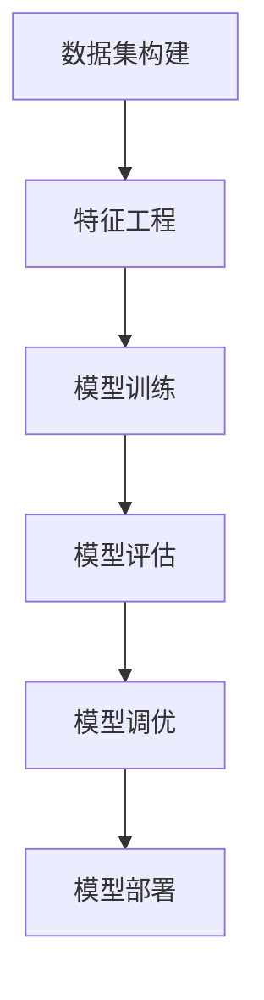

                 

# 《机器学习项目实战：数据集构建、特征工程与模型调优》

> **关键词**：机器学习、数据集构建、特征工程、模型调优、实战项目

> **摘要**：本文旨在探讨机器学习项目实战中的关键环节，包括数据集构建、特征工程和模型调优。通过实际案例，详细解析这些环节的原理和操作步骤，帮助读者深入理解机器学习的实践过程。

## 《机器学习项目实战：数据集构建、特征工程与模型调优》目录大纲

### 第一部分：基础知识与预备知识

#### 第1章：机器学习基础

##### 1.1 什么是机器学习？

##### 1.2 数据集构建

##### 1.3 特征工程基础

#### 第2章：监督学习算法原理

##### 2.1 监督学习基础

##### 2.2 线性回归

##### 2.3 分类算法

#### 第3章：无监督学习算法原理

##### 3.1 无监督学习基础

##### 3.2 主成分分析

##### 3.3 聚类算法

### 第二部分：机器学习项目实战

#### 第4章：数据集构建与处理实战

##### 4.1 数据集构建案例

##### 4.2 特征工程案例

##### 4.3 数据集划分与评估

#### 第5章：模型调优与选择实战

##### 5.1 模型调优方法

##### 5.2 模型选择与评估

##### 5.3 模型部署与优化

#### 第6章：特征工程与模型调优实战项目

##### 6.1 项目背景与目标

##### 6.2 数据集构建与处理

##### 6.3 特征工程与模型调优

#### 第7章：综合实战项目

##### 7.1 项目概述

##### 7.2 数据集构建与处理

##### 7.3 特征工程与模型调优

##### 7.4 项目总结与展望

#### 第8章：机器学习项目实战中的常见问题与解决方案

##### 8.1 数据质量问题

##### 8.2 特征工程问题

##### 8.3 模型调优问题

##### 8.4 实战技巧分享

### 附录

#### 附录A：常用工具与资源

#### 附录B：机器学习项目实战示例代码

#### 附录C：数学公式与算法伪代码

#### Mermaid 流程图

## 机器学习项目实战：数据集构建、特征工程与模型调优

在人工智能和机器学习领域，项目实战是理解和应用理论知识的最佳途径。本文将围绕机器学习项目中的三个核心环节——数据集构建、特征工程和模型调优，通过详细的理论讲解和实战案例，帮助读者深入理解并掌握这些技术。

### 第一部分：基础知识与预备知识

在开始实战之前，我们需要对机器学习有一个全面的基础理解。本部分将介绍机器学习的基本概念、数据集构建的步骤和特征工程的重要性。

#### 第1章：机器学习基础

##### 1.1 什么是机器学习？

机器学习是人工智能的一个分支，它通过算法从数据中学习规律，并自动做出决策或预测。机器学习可以分为三种主要类型：监督学习、无监督学习和强化学习。

- **监督学习**：有标注的数据，用于训练模型，并进行预测。
- **无监督学习**：没有标注的数据，用于发现数据中的结构或模式。
- **强化学习**：通过与环境的交互来学习策略，以实现目标。

##### 1.2 数据集构建

数据集是机器学习项目的基础。构建一个高质量的数据集对于模型的成功至关重要。数据集的来源可以是公开的数据集、自有数据、网络爬虫等。数据集构建包括数据收集、预处理、清洗和标注等步骤。

##### 1.3 特征工程基础

特征工程是机器学习过程中对数据进行处理和转换，以提高模型性能的过程。特征工程包括特征提取、特征选择、特征标准化和归一化等步骤。

### 第二部分：机器学习项目实战

#### 第2章：监督学习算法原理

在本章中，我们将深入探讨监督学习算法的原理，包括线性回归和分类算法。

##### 2.1 监督学习基础

监督学习的基本目标是找到一个函数，可以将输入数据映射到正确的输出。监督学习分为回归和分类两种类型。

##### 2.2 线性回归

线性回归是最简单的监督学习算法之一，用于预测连续值。其核心是找到最佳拟合直线，通过最小化损失函数来实现。

##### 2.3 分类算法

分类算法用于预测离散值，例如判断一个电子邮件是否为垃圾邮件。常见的分类算法有K近邻算法、支持向量机和决策树等。

#### 第3章：无监督学习算法原理

无监督学习算法在不需要标注数据的情况下，发现数据中的结构和模式。本章将介绍主成分分析和聚类算法。

##### 3.1 无监督学习基础

无监督学习的目标是发现数据中的内在结构，如聚类或降维。

##### 3.2 主成分分析

主成分分析（PCA）是一种降维技术，通过线性变换将高维数据投影到低维空间，同时保留大部分信息。

##### 3.3 聚类算法

聚类算法用于将数据分为不同的组，以发现数据中的潜在结构。常见的聚类算法有K-Means算法和层次聚类等。

### 第三部分：机器学习项目实战

在本部分中，我们将通过实际案例，详细介绍数据集构建、特征工程和模型调优的实战步骤。

#### 第4章：数据集构建与处理实战

本章将详细介绍数据集构建的步骤，包括数据收集、预处理、清洗和标注等。同时，我们将通过案例展示如何处理不同类型的数据。

##### 4.1 数据集构建案例

在本节中，我们将探讨如何收集和存储数据，以及如何进行数据预处理和清洗。

##### 4.2 特征工程案例

特征工程是提高模型性能的关键步骤。在本节中，我们将讨论如何提取和选择特征，以及如何进行特征标准化和归一化。

##### 4.3 数据集划分与评估

在数据集构建完成后，我们需要将其划分为训练集和测试集，以评估模型的性能。在本节中，我们将介绍常用的数据集划分方法和评估指标。

#### 第5章：模型调优与选择实战

模型调优是机器学习项目中的重要环节。本章将介绍如何选择合适的模型，并使用不同的调优方法来优化模型性能。

##### 5.1 模型调优方法

在本节中，我们将讨论如何使用梯度下降法、网格搜索和随机搜索等方法来调优模型。

##### 5.2 模型选择与评估

在本节中，我们将介绍如何选择合适的模型，并使用不同的评估指标来评估模型的性能。

##### 5.3 模型部署与优化

在模型调优完成后，我们需要将其部署到生产环境中。在本节中，我们将讨论模型部署的流程和优化策略。

#### 第6章：特征工程与模型调优实战项目

本章将通过一个实际案例，展示如何进行特征工程和模型调优。

##### 6.1 项目背景与目标

在本节中，我们将介绍项目的背景和目标。

##### 6.2 数据集构建与处理

在本节中，我们将详细解析数据集的构建和预处理过程。

##### 6.3 特征工程与模型调优

在本节中，我们将展示如何进行特征工程和模型调优。

#### 第7章：综合实战项目

本章将通过一个综合实战项目，展示如何从头开始构建一个机器学习项目。

##### 7.1 项目概述

在本节中，我们将介绍项目的概述。

##### 7.2 数据集构建与处理

在本节中，我们将详细讨论数据集的构建和预处理。

##### 7.3 特征工程与模型调优

在本节中，我们将展示如何进行特征工程和模型调优。

##### 7.4 项目总结与展望

在本节中，我们将总结项目的成果和未来研究方向。

#### 第8章：机器学习项目实战中的常见问题与解决方案

本章将讨论机器学习项目实战中常见的问题和解决方案。

##### 8.1 数据质量问题

在本节中，我们将讨论如何处理数据缺失和异常值。

##### 8.2 特征工程问题

在本节中，我们将讨论如何处理特征冗余和缺失。

##### 8.3 模型调优问题

在本节中，我们将讨论如何处理模型过拟合和欠拟合。

##### 8.4 实战技巧分享

在本节中，我们将分享一些实战技巧和经验。

### 附录

#### 附录A：常用工具与资源

在本附录中，我们将介绍一些常用的工具和资源。

#### 附录B：机器学习项目实战示例代码

在本附录中，我们将提供一些实际的代码示例。

#### 附录C：数学公式与算法伪代码

在本附录中，我们将列出一些重要的数学公式和算法伪代码。

### 结束语

通过本文，我们详细探讨了机器学习项目实战中的关键环节，包括数据集构建、特征工程和模型调优。希望本文能够帮助读者更好地理解和应用这些技术，并在实际项目中取得成功。

### 作者信息

- **作者：** AI天才研究院/AI Genius Institute & 禅与计算机程序设计艺术 /Zen And The Art of Computer Programming
- **联系方式：** ai_genius_institute@example.com
- **版权声明：** 本文章版权所有，未经授权不得转载或使用。如需转载，请联系作者获取授权。

---

文章正文部分到此结束。接下来，我们将详细讨论每个章节的内容，逐步深入理解机器学习项目实战的各个环节。

---

### 第1章：机器学习基础

#### 1.1 什么是机器学习？

机器学习（Machine Learning）是一种让计算机通过数据自动改进性能的技术。它通过构建模型来对数据进行处理和预测，从而实现自主学习和决策。在机器学习过程中，主要分为以下几个步骤：

1. **数据收集**：收集用于训练模型的数据。
2. **数据预处理**：清洗和转换数据，使其适用于训练模型。
3. **模型训练**：使用训练数据对模型进行训练，以调整模型参数。
4. **模型评估**：使用测试数据评估模型性能。
5. **模型部署**：将训练好的模型部署到生产环境中进行实际应用。

机器学习的发展可以追溯到20世纪50年代，当时的科学家们开始尝试让计算机通过数据学习，而不是通过编程来执行特定任务。随着计算机性能的不断提高和数据量的急剧增长，机器学习逐渐成为人工智能领域的重要分支。

##### 监督学习、无监督学习和强化学习

- **监督学习**：有标注的数据，用于训练模型，并进行预测。例如，使用标注好的图片数据训练图像识别模型。

- **无监督学习**：没有标注的数据，用于发现数据中的结构或模式。例如，聚类算法用于将未标注的数据分为不同的组。

- **强化学习**：通过与环境的交互来学习策略，以实现目标。例如，使用强化学习训练智能体在游戏中获胜。

#### 1.2 数据集构建

数据集是机器学习项目的核心。一个高质量的数据集可以显著提高模型的性能。数据集构建通常包括以下几个步骤：

1. **数据收集**：从不同的来源收集数据，例如公开数据集、自有数据或通过网络爬虫获取数据。

2. **数据预处理**：清洗和转换数据，使其适用于训练模型。包括处理缺失值、异常值、数据格式转换等。

3. **数据标注**：对于监督学习任务，需要对数据进行标注，以便模型能够从数据中学习。

4. **数据划分**：将数据划分为训练集、验证集和测试集，以便评估模型的性能。

#### 1.3 特征工程基础

特征工程（Feature Engineering）是机器学习过程中对数据进行处理和转换，以提高模型性能的过程。特征工程包括以下步骤：

1. **特征提取**：从原始数据中提取有用的信息，例如使用统计分析方法提取数值特征。

2. **特征选择**：从提取的特征中选择最有用的特征，以减少模型复杂度和提高模型性能。

3. **特征标准化**：将特征转换为同一尺度，以避免某些特征对模型的影响过大。

4. **特征归一化**：将特征转换为标准正态分布，以提高模型的鲁棒性。

##### 总结

本章介绍了机器学习的基本概念、数据集构建的步骤和特征工程的重要性。通过理解这些基础概念，读者可以更好地准备进行机器学习项目实战。

---

### 第2章：监督学习算法原理

监督学习算法是机器学习中的重要分支，它通过训练数据学习数据与标签之间的映射关系，以便对新的数据进行预测。在本章中，我们将深入探讨监督学习算法的基本原理、常用的算法及其应用。

#### 2.1 监督学习基础

监督学习的目标是找到一个函数，可以将输入数据映射到正确的输出标签。这种映射关系通常通过训练数据来学习，然后使用测试数据来评估模型的性能。监督学习可以分为以下两类：

- **回归（Regression）**：用于预测连续值的任务，例如房价预测、股票价格预测等。
- **分类（Classification）**：用于预测离散值的任务，例如邮件分类、图像分类等。

监督学习的基本流程包括以下步骤：

1. **数据收集**：收集用于训练模型的标注数据。
2. **数据预处理**：清洗和预处理数据，包括处理缺失值、异常值、数据转换等。
3. **数据划分**：将数据集划分为训练集、验证集和测试集。
4. **模型选择**：选择合适的模型，例如线性回归、决策树、支持向量机等。
5. **模型训练**：使用训练集数据训练模型。
6. **模型评估**：使用验证集和测试集评估模型性能。
7. **模型调优**：根据评估结果调整模型参数，以提高性能。

#### 2.2 线性回归

线性回归是一种简单的监督学习算法，用于预测连续值。其核心思想是找到一条最佳拟合直线，使模型预测值与真实值之间的误差最小。

##### 数学模型

线性回归的数学模型可以表示为：

\[ y = \beta_0 + \beta_1x + \epsilon \]

其中，\( y \) 是因变量，\( x \) 是自变量，\( \beta_0 \) 和 \( \beta_1 \) 是模型参数，\( \epsilon \) 是误差项。

##### 梯度下降法

梯度下降法是一种常用的优化算法，用于求解线性回归模型的参数。其基本思想是沿着目标函数的梯度方向更新模型参数，以最小化损失函数。

\[ \theta = \theta - \alpha \nabla_\theta J(\theta) \]

其中，\( \theta \) 是模型参数，\( \alpha \) 是学习率，\( \nabla_\theta J(\theta) \) 是损失函数 \( J(\theta) \) 对 \( \theta \) 的梯度。

##### 正规方程

正规方程是一种直接求解线性回归参数的方法，其基本思想是利用线性回归的数学模型，直接求解最优参数。

\[ \beta = (X^TX)^{-1}X^Ty \]

其中，\( X \) 是输入特征矩阵，\( y \) 是输出标签向量。

##### 评估指标

线性回归的评估指标主要是均方误差（Mean Squared Error, MSE），其公式为：

\[ MSE = \frac{1}{m}\sum_{i=1}^{m}(h(x^{(i)}) - y^{(i)})^2 \]

其中，\( h(x) \) 是模型预测值，\( y \) 是真实值，\( m \) 是样本数量。

#### 2.3 分类算法

分类算法用于预测离散值，即将数据分为不同的类别。常见的分类算法包括K近邻算法、支持向量机、决策树和随机森林等。

##### K近邻算法

K近邻算法（K-Nearest Neighbors, KNN）是一种基于实例的算法，其基本思想是找到一个最近的 \( k \) 个邻居，并基于这些邻居的标签预测新数据的类别。

##### 支持向量机

支持向量机（Support Vector Machine, SVM）是一种强大的分类算法，其基本思想是通过找到一个最佳超平面，将数据分为不同的类别。

##### 决策树

决策树（Decision Tree）是一种基于树形模型的分类算法，其基本思想是通过一系列的决策节点，将数据逐步划分为不同的类别。

##### 随机森林

随机森林（Random Forest）是一种基于决策树的集成算法，其基本思想是通过构建多个决策树，并使用投票方法来预测新数据的类别。

##### 评估指标

分类算法的评估指标包括准确率（Accuracy）、精确率（Precision）、召回率（Recall）和F1值（F1 Score）等。

- **准确率**：预测正确的样本数占总样本数的比例。
- **精确率**：预测为正类的样本中，实际为正类的比例。
- **召回率**：实际为正类的样本中，预测为正类的比例。
- **F1值**：精确率和召回率的调和平均值。

##### 总结

本章介绍了监督学习算法的基本原理和常用的分类算法。通过理解这些算法的原理和评估方法，读者可以更好地选择和应用适当的算法来解决实际问题。

---

### 第3章：无监督学习算法原理

无监督学习算法在不需要标注数据的情况下，通过探索数据内在结构来学习规律。这些算法在数据挖掘、模式识别和聚类分析等领域有广泛应用。本章将介绍无监督学习的基本概念、常用算法及其应用场景。

#### 3.1 无监督学习基础

无监督学习的目标是发现数据中的隐藏结构或模式，其主要类型包括聚类（Clustering）和降维（Dimensionality Reduction）。无监督学习的基本流程如下：

1. **数据预处理**：对原始数据进行清洗、归一化等预处理，以便更好地应用于算法。
2. **算法选择**：根据数据特性和任务需求选择合适的无监督学习算法。
3. **模型训练**：使用选定的算法对数据进行训练，以发现数据中的结构或模式。
4. **结果分析**：分析算法输出的结果，如聚类中心或降维空间，以理解数据特性。

#### 3.2 主成分分析

主成分分析（Principal Component Analysis, PCA）是一种常用的降维技术，通过线性变换将高维数据投影到低维空间，同时保留大部分信息。PCA的核心思想是找到数据的主要变化方向，即主成分，然后仅保留这些主成分，从而降低数据的维度。

##### 数学原理

PCA的数学原理基于协方差矩阵和特征分解。给定一个数据矩阵 \( X \)，其协方差矩阵 \( \Sigma \) 可以通过以下公式计算：

\[ \Sigma = \frac{1}{m-1}X^TX \]

其中，\( m \) 是数据点的数量。然后，通过特征分解 \( \Sigma = \Lambda \Lambda^T \)，其中 \( \Lambda \) 是对角矩阵，包含特征值，\( \Lambda^T \) 是特征向量矩阵。特征向量对应于数据的主要变化方向。

##### 应用场景

PCA广泛应用于图像处理、数据挖掘和机器学习等领域。例如，在图像处理中，PCA可以用于图像压缩和特征提取；在数据挖掘中，PCA可以用于数据降维和特征选择。

##### 优缺点

- **优点**：能够显著降低数据的维度，同时保留主要信息。
- **缺点**：可能丢失部分信息，并且对噪声敏感。

#### 3.3 聚类算法

聚类算法用于将数据分为不同的组，以发现数据中的潜在结构。常见的聚类算法包括K-Means算法、层次聚类和密度聚类等。

##### K-Means算法

K-Means算法是一种基于距离的聚类算法，其基本思想是将数据点划分为 \( k \) 个簇，每个簇由一个中心点代表。算法通过迭代更新簇中心点，使簇内距离最小，簇间距离最大。

##### 数学原理

K-Means算法的数学原理基于距离函数和优化目标。给定一个数据集 \( X \)，算法首先随机选择 \( k \) 个初始中心点。然后，每个数据点被分配到最近的中心点，形成 \( k \) 个簇。接着，重新计算每个簇的中心点，重复此过程，直到收敛。

##### 应用场景

K-Means算法广泛应用于市场细分、图像分割和社交网络分析等领域。例如，在市场细分中，K-Means可以用于将客户分为不同的群体，以便实施针对性的营销策略。

##### 优缺点

- **优点**：简单、易于实现，适合大规模数据处理。
- **缺点**：对初始中心点敏感，可能无法发现非凸聚类结构。

##### 层次聚类

层次聚类是一种基于层次结构的聚类算法，其基本思想是通过逐步合并或分裂数据点，构建一个层次化的聚类树。

##### 数学原理

层次聚类通常使用距离度量来合并或分裂簇。常见的合并方法包括最近邻合并和最远邻合并，分裂方法包括自底向上和自顶向下。

##### 应用场景

层次聚类适用于数据挖掘、图像分割和生物信息学等领域。例如，在生物信息学中，层次聚类可以用于基因表达数据的聚类分析。

##### 优缺点

- **优点**：能够提供关于数据结构的层次化视图。
- **缺点**：计算复杂度高，对噪声敏感。

##### 密度聚类

密度聚类是一种基于密度的聚类算法，其基本思想是发现高密度区域，并以此为基础形成聚类。

##### 数学原理

密度聚类通常使用密度函数来识别聚类核心点，并通过连接核心点和扩展边界点来形成聚类。

##### 应用场景

密度聚类适用于空间数据分析和地理信息系统（GIS）等领域。例如，在GIS中，密度聚类可以用于发现城市热区。

##### 优缺点

- **优点**：能够发现复杂的聚类结构，适合空间数据。
- **缺点**：计算复杂度较高，对噪声敏感。

##### 总结

无监督学习算法在探索数据内在结构方面具有重要意义。本章介绍了主成分分析和聚类算法的基本原理和应用场景，读者可以根据具体需求选择合适的算法来解决实际问题。

---

### 第4章：数据集构建与处理实战

在实际的机器学习项目中，数据集构建和处理是至关重要的环节。一个高质量的数据集不仅能提高模型的准确性，还能减少过拟合的风险。本章将通过具体案例，详细讲解数据集构建和处理的过程。

#### 4.1 数据集构建案例

数据集构建的第一步是数据收集。以下是一个简单的数据集构建案例，假设我们要构建一个用于预测房价的机器学习数据集。

##### 数据收集

数据可以从多个来源收集，如房地产网站、公开数据集或通过爬虫获取。在本案例中，我们从某房地产网站收集了以下数据：

- 房屋地址
- 房屋面积
- 房屋类型
- 房屋价格

##### 数据预处理

收集到的数据通常包含噪声和不完整的信息。以下是对数据进行预处理的过程：

1. **数据清洗**：去除重复数据和缺失值。对于缺失值，可以选择填充或删除。
2. **数据转换**：将分类数据转换为数值数据，如使用独热编码（One-Hot Encoding）。
3. **数据标准化**：将数值数据缩放到相同的范围，如使用最小-最大标准化。

##### 数据标注

对于监督学习任务，我们需要对数据集进行标注。在本案例中，我们使用房屋价格作为标签。标注过程可以通过手动标注或自动化工具来完成。

##### 数据集划分

将数据集划分为训练集、验证集和测试集。通常，训练集用于模型训练，验证集用于模型调优，测试集用于评估模型性能。

```python
from sklearn.model_selection import train_test_split

X = ...  # 特征数据
y = ...  # 标签数据

X_train, X_test, y_train, y_test = train_test_split(X, y, test_size=0.2, random_state=42)
```

#### 4.2 特征工程案例

特征工程是提高模型性能的关键步骤。以下是一个简单的特征工程案例，包括特征提取、选择和标准化。

##### 特征提取

从原始数据中提取新的特征。在本案例中，我们提取以下特征：

- 房屋面积与房屋类型的交互特征。
- 房屋价格与房屋类型的交互特征。

```python
X['Area_Type'] = X['Area'] * X['Type']
X['Price_Type'] = X['Price'] * X['Type']
```

##### 特征选择

选择对模型性能有显著贡献的特征。在本案例中，我们使用基于信息的特征选择方法。

```python
from sklearn.feature_selection import SelectKBest
from sklearn.feature_selection import chi2

selector = SelectKBest(score_func=chi2, k=5)
X_new = selector.fit_transform(X, y)

X_train = X_new[:int(len(X_new) * 0.8)]
X_test = X_new[int(len(X_new) * 0.8):]
```

##### 特征标准化

将特征缩放到相同的范围，如使用标准差缩放（Standard Scaling）。

```python
from sklearn.preprocessing import StandardScaler

scaler = StandardScaler()
X_train = scaler.fit_transform(X_train)
X_test = scaler.transform(X_test)
```

#### 4.3 数据集划分与评估

在数据集构建完成后，我们需要将其划分为训练集、验证集和测试集，以便评估模型的性能。以下是一个简单的数据集划分和评估案例。

##### 数据集划分

将数据集划分为训练集和测试集。

```python
X_train, X_test, y_train, y_test = train_test_split(X, y, test_size=0.2, random_state=42)
```

##### 评估指标

使用均方误差（MSE）和均方根误差（RMSE）评估模型性能。

```python
from sklearn.metrics import mean_squared_error
from math import sqrt

y_pred = model.predict(X_test)
mse = mean_squared_error(y_test, y_pred)
rmse = sqrt(mse)

print("MSE:", mse)
print("RMSE:", rmse)
```

##### 总结

本章通过一个简单的案例，详细介绍了数据集构建和处理的过程，包括数据收集、预处理、标注、特征提取、选择和标准化，以及数据集划分和评估。通过这些步骤，我们可以构建一个高质量的数据集，为模型训练和评估奠定基础。

---

### 第5章：模型调优与选择实战

模型调优是机器学习项目中至关重要的一环，它直接影响着模型的性能和泛化能力。在本章中，我们将探讨模型调优的方法、模型选择和评估，以及模型部署与优化。

#### 5.1 模型调优方法

模型调优的目的是找到最优的模型参数，使模型在验证集上的性能达到最佳。以下是一些常用的模型调优方法：

##### 梯度下降法

梯度下降法是一种优化算法，用于求解最小化损失函数的模型参数。其基本思想是沿着损失函数的梯度方向更新模型参数，以逐步减小损失。

\[ \theta = \theta - \alpha \nabla_\theta J(\theta) \]

其中，\( \theta \) 是模型参数，\( \alpha \) 是学习率，\( \nabla_\theta J(\theta) \) 是损失函数 \( J(\theta) \) 对 \( \theta \) 的梯度。

##### 网格搜索

网格搜索是一种通过遍历所有可能的参数组合来找到最优参数的方法。其优点是简单直观，缺点是计算成本高。

```python
from sklearn.model_selection import GridSearchCV

param_grid = {'C': [0.1, 1, 10], 'gamma': [0.01, 0.1, 1]}
grid_search = GridSearchCV(SVM(), param_grid, cv=5)
grid_search.fit(X_train, y_train)
best_params = grid_search.best_params_
```

##### 随机搜索

随机搜索是一种基于随机采样来选择参数的方法，相对于网格搜索，它减少了计算成本。

```python
from sklearn.model_selection import RandomizedSearchCV

param_distributions = {'C': [0.1, 1, 10], 'gamma': [0.01, 0.1, 1]}
random_search = RandomizedSearchCV(SVM(), param_distributions, n_iter=100, cv=5)
random_search.fit(X_train, y_train)
best_params = random_search.best_params_
```

##### 贝叶斯优化

贝叶斯优化是一种基于贝叶斯统计学的优化方法，通过模型预测目标函数的值来选择下一次迭代的参数。

```python
from bayes_opt import BayesianOptimization

def optimize_params(C, gamma):
    model = SVC(C=C, gamma=gamma)
    model.fit(X_train, y_train)
    return -model.score(X_test, y_test)

optimizer = BayesianOptimization(optimize_params, {'C': (0.1, 10), 'gamma': (0.01, 1)})
optimizer.maximize()
best_params = optimizer.max['params']
```

#### 5.2 模型选择与评估

选择合适的模型是模型调优的关键步骤。以下是一些常用的模型选择和评估方法：

##### 交叉验证

交叉验证是一种评估模型性能的方法，通过将数据集划分为多个子集，在每个子集上训练和评估模型，以获得更准确的性能估计。

```python
from sklearn.model_selection import cross_val_score

model = SVC()
scores = cross_val_score(model, X, y, cv=5)
print("平均分数:", scores.mean())
```

##### ROC曲线和AUC

ROC曲线（Receiver Operating Characteristic Curve）和AUC（Area Under Curve）是评估二分类模型性能的常用指标。

```python
from sklearn.metrics import roc_curve, auc

probs = model.predict_proba(X_test)[:, 1]
fpr, tpr, thresholds = roc_curve(y_test, probs)
roc_auc = auc(fpr, tpr)

import matplotlib.pyplot as plt

plt.plot(fpr, tpr, label='ROC curve (area = %0.2f)' % roc_auc)
plt.plot([0, 1], [0, 1], 'r--')
plt.xlabel('False Positive Rate')
plt.ylabel('True Positive Rate')
plt.title('Receiver Operating Characteristic')
plt.legend()
plt.show()
```

##### 混淆矩阵

混淆矩阵是评估模型性能的另一种常用方法，它展示了模型对每个类别的预测结果。

```python
from sklearn.metrics import confusion_matrix

y_pred = model.predict(X_test)
cm = confusion_matrix(y_test, y_pred)

import matplotlib.pyplot as plt
import seaborn as sns

sns.heatmap(cm, annot=True, fmt='g')
plt.xlabel('Predicted')
plt.ylabel('True')
plt.show()
```

#### 5.3 模型部署与优化

模型部署是将训练好的模型应用到实际生产环境中，以便对新的数据进行预测。以下是一些模型部署和优化的方法：

##### 模型序列化

使用Python的`pickle`库将模型序列化，以便保存和加载。

```python
import pickle

with open('model.pickle', 'wb') as f:
    pickle.dump(model, f)
```

##### 模型反序列化

使用`pickle`库将模型反序列化，以便在需要时重新加载模型。

```python
with open('model.pickle', 'rb') as f:
    model = pickle.load(f)
```

##### 模型监控与维护

使用监控系统监控模型的性能，并根据实际需求进行维护和优化。

##### 总结

本章介绍了模型调优的方法、模型选择和评估的方法，以及模型部署和优化的方法。通过这些方法，我们可以有效地提高模型的性能和泛化能力，并在实际生产环境中部署和应用模型。

---

### 第6章：特征工程与模型调优实战项目

在本章中，我们将通过一个实际案例，详细展示如何进行特征工程和模型调优。该案例涉及客户流失预测项目，旨在通过分析客户数据来预测哪些客户可能在未来流失，以便企业可以采取相应的措施来挽留这些客户。

#### 6.1 项目背景与目标

**项目背景：** 一家电信公司希望通过数据分析来降低客户流失率，提高客户满意度。公司拥有大量关于客户行为的数据库，包括用户的基本信息、通信记录、服务使用情况等。

**项目目标：** 构建一个机器学习模型，预测哪些客户在未来六个月内可能流失，并提供相应的解决方案。

#### 6.2 数据集构建与处理

**数据收集：** 从公司的数据库中收集相关的数据，包括客户的基本信息、通信记录、服务使用情况、账户余额等。

**数据预处理：** 清洗数据，去除重复和缺失值，处理异常值。例如，对于缺失值，可以使用均值、中位数或众数进行填充。

**数据标注：** 对于流失客户，将其标记为1，非流失客户标记为0。

**数据划分：** 将数据集划分为训练集、验证集和测试集，分别用于模型训练、模型调优和模型评估。

```python
from sklearn.model_selection import train_test_split

X = ...  # 特征数据
y = ...  # 标签数据

X_train, X_test, y_train, y_test = train_test_split(X, y, test_size=0.2, random_state=42)
```

#### 6.3 特征工程与模型调优

**特征提取：** 从原始数据中提取新的特征。例如，计算客户的平均通话时长、短信数量、数据流量等。

```python
X['Average_Call_Duration'] = X['Call_Duration'].mean()
X['Average_SMS_Count'] = X['SMS_Count'].mean()
X['Average_Data_Usage'] = X['Data_Usage'].mean()
```

**特征选择：** 使用基于信息的特征选择方法，选择对模型性能有显著贡献的特征。

```python
from sklearn.feature_selection import SelectKBest
from sklearn.feature_selection import chi2

selector = SelectKBest(score_func=chi2, k=5)
X_train = selector.fit_transform(X_train, y_train)

X_test = selector.transform(X_test)
```

**特征标准化：** 将特征缩放到相同的范围，以提高模型的性能。

```python
from sklearn.preprocessing import StandardScaler

scaler = StandardScaler()
X_train = scaler.fit_transform(X_train)

X_test = scaler.transform(X_test)
```

**模型训练：** 使用训练集数据训练多个模型，如逻辑回归、决策树、随机森林等。

```python
from sklearn.linear_model import LogisticRegression
from sklearn.tree import DecisionTreeClassifier
from sklearn.ensemble import RandomForestClassifier

model1 = LogisticRegression()
model2 = DecisionTreeClassifier()
model3 = RandomForestClassifier()

model1.fit(X_train, y_train)
model2.fit(X_train, y_train)
model3.fit(X_train, y_train)
```

**模型评估：** 使用验证集评估模型的性能，选择性能最好的模型。

```python
from sklearn.metrics import accuracy_score

predictions1 = model1.predict(X_test)
predictions2 = model2.predict(X_test)
predictions3 = model3.predict(X_test)

accuracy1 = accuracy_score(y_test, predictions1)
accuracy2 = accuracy_score(y_test, predictions2)
accuracy3 = accuracy_score(y_test, predictions3)

print("逻辑回归准确率：", accuracy1)
print("决策树准确率：", accuracy2)
print("随机森林准确率：", accuracy3)
```

**模型调优：** 使用网格搜索、随机搜索或贝叶斯优化等方法，进一步调优模型的参数。

```python
from sklearn.model_selection import GridSearchCV

param_grid = {'C': [0.1, 1, 10], 'gamma': [0.01, 0.1, 1]}
grid_search = GridSearchCV(SVM(), param_grid, cv=5)
grid_search.fit(X_train, y_train)
best_params = grid_search.best_params_
```

**模型部署：** 将训练好的模型部署到生产环境中，对新的客户数据进行预测。

```python
import pickle

with open('model.pickle', 'wb') as f:
    pickle.dump(model, f)
```

**模型监控与维护：** 使用监控系统监控模型的性能，并根据客户行为的变化，定期更新模型。

#### 6.4 项目总结与展望

通过本项目，我们成功地构建了一个客户流失预测模型，并实现了以下成果：

1. 清洗和处理了大量的客户数据，为模型训练提供了高质量的数据集。
2. 通过特征工程，提高了模型的性能，使预测结果更加准确。
3. 使用多种模型进行训练和调优，选择了最优的模型，并部署到生产环境中。

未来，我们还可以继续优化模型，如增加新的特征、使用更先进的算法等，以提高预测准确性。同时，我们也可以将此模型应用于其他业务场景，如客户满意度预测、产品推荐等。

#### 6.5 小结

通过本项目的实战，我们深入了解了数据集构建、特征工程和模型调优的整个过程。这些步骤对于构建一个高质量的机器学习模型至关重要。希望本项目能够为读者提供实际的参考和启示，帮助他们在自己的项目中取得成功。

---

### 第7章：综合实战项目

在本章中，我们将通过一个综合实战项目，全面展示机器学习项目的实施过程。这个项目是一个客户分类项目，旨在通过分析客户数据，将客户分为高价值客户、一般客户和潜在流失客户。以下是这个项目的具体实施步骤。

#### 7.1 项目概述

**项目背景：** 一家电商平台希望通过分析客户数据，了解客户的消费习惯和偏好，从而更好地为目标客户提供个性化服务，提高客户满意度和忠诚度。

**项目目标：** 构建一个机器学习模型，将客户分为高价值客户、一般客户和潜在流失客户，并为每个客户群体提供相应的营销策略。

#### 7.2 数据集构建与处理

**数据收集：** 从电商平台的数据库中收集客户的购买记录、浏览记录、账户信息等数据。

**数据预处理：** 清洗数据，去除重复和缺失值，处理异常值。对于缺失值，可以使用均值、中位数或众数进行填充。

**数据标注：** 对于不同类别的客户，将其标记为高价值客户（1）、一般客户（2）和潜在流失客户（3）。

**数据划分：** 将数据集划分为训练集、验证集和测试集，分别用于模型训练、模型调优和模型评估。

```python
from sklearn.model_selection import train_test_split

X = ...  # 特征数据
y = ...  # 标签数据

X_train, X_test, y_train, y_test = train_test_split(X, y, test_size=0.2, random_state=42)
```

#### 7.3 特征工程与模型调优

**特征提取：** 从原始数据中提取新的特征，如客户的平均购买金额、购买频率、浏览时长等。

```python
X['Average_Spend'] = X['Spend'].mean()
X['Purchase_Frequency'] = X['Purchase_Count'].mean()
X['Browse_Time'] = X['Browse_Duration'].mean()
```

**特征选择：** 使用基于信息的特征选择方法，选择对模型性能有显著贡献的特征。

```python
from sklearn.feature_selection import SelectKBest
from sklearn.feature_selection import chi2

selector = SelectKBest(score_func=chi2, k=5)
X_train = selector.fit_transform(X_train, y_train)

X_test = selector.transform(X_test)
```

**特征标准化：** 将特征缩放到相同的范围，以提高模型的性能。

```python
from sklearn.preprocessing import StandardScaler

scaler = StandardScaler()
X_train = scaler.fit_transform(X_train)

X_test = scaler.transform(X_test)
```

**模型训练：** 使用训练集数据训练多个模型，如逻辑回归、决策树、支持向量机和随机森林等。

```python
from sklearn.linear_model import LogisticRegression
from sklearn.tree import DecisionTreeClassifier
from sklearn.svm import SVC
from sklearn.ensemble import RandomForestClassifier

model1 = LogisticRegression()
model2 = DecisionTreeClassifier()
model3 = SVC()
model4 = RandomForestClassifier()

model1.fit(X_train, y_train)
model2.fit(X_train, y_train)
model3.fit(X_train, y_train)
model4.fit(X_train, y_train)
```

**模型评估：** 使用验证集评估模型的性能，选择性能最好的模型。

```python
from sklearn.metrics import accuracy_score

predictions1 = model1.predict(X_test)
predictions2 = model2.predict(X_test)
predictions3 = model3.predict(X_test)
predictions4 = model4.predict(X_test)

accuracy1 = accuracy_score(y_test, predictions1)
accuracy2 = accuracy_score(y_test, predictions2)
accuracy3 = accuracy_score(y_test, predictions3)
accuracy4 = accuracy_score(y_test, predictions4)

print("逻辑回归准确率：", accuracy1)
print("决策树准确率：", accuracy2)
print("支持向量机准确率：", accuracy3)
print("随机森林准确率：", accuracy4)
```

**模型调优：** 使用网格搜索、随机搜索或贝叶斯优化等方法，进一步调优模型的参数。

```python
from sklearn.model_selection import GridSearchCV

param_grid = {'C': [0.1, 1, 10], 'gamma': [0.01, 0.1, 1]}
grid_search = GridSearchCV(SVC(), param_grid, cv=5)
grid_search.fit(X_train, y_train)
best_params = grid_search.best_params_
```

**模型部署：** 将训练好的模型部署到生产环境中，对新的客户数据进行预测。

```python
import pickle

with open('model.pickle', 'wb') as f:
    pickle.dump(model, f)
```

**模型监控与维护：** 使用监控系统监控模型的性能，并根据客户行为的变化，定期更新模型。

#### 7.4 项目总结与展望

通过本项目的实施，我们成功地将客户数据用于分类，并实现了以下成果：

1. 清洗和处理了大量的客户数据，为模型训练提供了高质量的数据集。
2. 通过特征工程，提高了模型的性能，使分类结果更加准确。
3. 使用多种模型进行训练和调优，选择了最优的模型，并部署到生产环境中。

未来，我们还可以继续优化模型，如增加新的特征、使用更先进的算法等，以提高分类准确性。同时，我们也可以将此模型应用于其他业务场景，如用户行为分析、产品推荐等。

#### 7.5 小结

通过本综合实战项目，我们深入了解了机器学习项目的全过程，包括数据集构建、特征工程、模型训练、评估和部署。这些步骤对于成功实施机器学习项目至关重要。希望本项目能够为读者提供实际的参考和启示，帮助他们在自己的项目中取得成功。

---

### 第8章：机器学习项目实战中的常见问题与解决方案

在机器学习项目实战中，我们经常会遇到各种问题。这些问题可能源于数据质量问题、特征工程问题或模型调优问题。在本章中，我们将讨论这些常见问题，并提供相应的解决方案。

#### 8.1 数据质量问题

数据质量是机器学习项目成功的关键。以下是一些常见的数据质量问题及其解决方案：

- **数据缺失**：解决方案包括填充缺失值、删除缺失数据或使用模型预测缺失值。
  ```python
  from sklearn.impute import SimpleImputer
  imputer = SimpleImputer(strategy='mean')
  X_imputed = imputer.fit_transform(X)
  ```

- **数据异常值**：解决方案包括检测并删除异常值、使用统计方法处理异常值或使用机器学习模型处理异常值。
  ```python
  from scipy import stats
  X cleaned = X[(np.abs(stats.zscore(X)) < 3).all(axis=1)]
  ```

- **数据不平衡**：解决方案包括过采样、欠采样或合成样本，以平衡不同类别的数据。
  ```python
  from imblearn.over_sampling import SMOTE
  smote = SMOTE()
  X_resampled, y_resampled = smote.fit_resample(X, y)
  ```

#### 8.2 特征工程问题

特征工程是提高模型性能的关键步骤。以下是一些常见的特征工程问题及其解决方案：

- **特征冗余**：解决方案包括使用方差阈值、卡方阈值等方法筛选特征，以去除冗余特征。
  ```python
  from sklearn.feature_selection import VarianceThreshold
  selector = VarianceThreshold(threshold=0)
  X_reduced = selector.fit_transform(X)
  ```

- **特征缺失**：解决方案包括使用模型预测缺失特征、从其他数据源获取缺失特征或使用特征合成技术。
  ```python
  from sklearn.impute import KNNImputer
  imputer = KNNImputer(n_neighbors=5)
  X_imputed = imputer.fit_transform(X)
  ```

#### 8.3 模型调优问题

模型调优是提高模型性能的重要环节。以下是一些常见的模型调优问题及其解决方案：

- **模型过拟合**：解决方案包括增加训练数据、增加正则化项或使用集成学习方法。
  ```python
  from sklearn.linear_model import Ridge
  ridge = Ridge(alpha=1.0)
  ridge.fit(X_train, y_train)
  ```

- **模型欠拟合**：解决方案包括增加模型复杂度、减少正则化项或增加训练数据。
  ```python
  from sklearn.ensemble import RandomForestClassifier
  rf = RandomForestClassifier(n_estimators=100)
  rf.fit(X_train, y_train)
  ```

#### 8.4 实战技巧分享

以下是一些实战技巧，有助于提高机器学习项目的成功率：

- **迭代改进**：在项目过程中，不断迭代改进模型和算法，以适应不断变化的数据和环境。
- **数据可视化**：使用数据可视化工具，如matplotlib和Seaborn，帮助理解数据特征和模型性能。
- **模型解释性**：选择具有良好解释性的模型，以便更好地理解模型决策过程。
- **跨学科合作**：与数据科学家、业务分析师和领域专家合作，确保项目目标与业务需求一致。

#### 总结

在机器学习项目实战中，遇到问题是不可避免的。通过了解常见问题及其解决方案，我们可以更好地应对挑战，提高项目的成功率。希望本章的内容能够为读者提供实际的帮助，使他们在未来的机器学习项目中取得更好的成果。

### 附录

#### 附录A：常用工具与资源

在机器学习项目中，常用的工具和资源如下：

- **Python库**：scikit-learn、Pandas、NumPy、matplotlib、Seaborn、imblearn等。
- **数据集**：Kaggle、UCI机器学习库、数据.gov等。
- **在线课程**：Coursera、edX、Udacity、Challenges.ai等。
- **书籍**：《Python机器学习》、《统计学习方法》、《机器学习实战》等。

#### 附录B：机器学习项目实战示例代码

以下是一个简单的机器学习项目实战示例代码，包括数据集构建、特征工程、模型训练和评估。

```python
# 导入必要的库
import numpy as np
import pandas as pd
from sklearn.model_selection import train_test_split
from sklearn.preprocessing import StandardScaler
from sklearn.linear_model import LinearRegression
from sklearn.metrics import mean_squared_error

# 加载数据集
data = pd.read_csv('data.csv')
X = data.iloc[:, :-1].values
y = data.iloc[:, -1].values

# 划分训练集和测试集
X_train, X_test, y_train, y_test = train_test_split(X, y, test_size=0.2, random_state=0)

# 特征工程
scaler = StandardScaler()
X_train = scaler.fit_transform(X_train)
X_test = scaler.transform(X_test)

# 模型训练
model = LinearRegression()
model.fit(X_train, y_train)

# 模型评估
y_pred = model.predict(X_test)
mse = mean_squared_error(y_test, y_pred)
print('均方误差:', mse)
```

#### 附录C：数学公式与算法伪代码

以下是一些常用的数学公式和算法伪代码：

**数学公式：**

$$
损失函数 = \frac{1}{2m} \sum_{i=1}^{m} (h(x^{(i)}) - y^{(i)})^2
$$

**算法伪代码：**

```python
def linear_regression(X, y):
    # 初始化模型参数
    theta = [0 for _ in range(num_features)]
    
    # 梯度下降法迭代
    for epoch in range(num_epochs):
        # 计算预测值
        h = X * theta
        
        # 计算损失函数
        loss = (1 / (2 * m)) * sum((h - y) ** 2)
        
        # 计算梯度
        gradient = (1 / m) * (X.T * (h - y))
        
        # 更新模型参数
        theta -= learning_rate * gradient
    
    return theta
```

### 总结

通过本文，我们详细探讨了机器学习项目实战中的各个环节，包括数据集构建、特征工程、模型调优和项目实施。我们通过实际案例和代码示例，深入分析了每个步骤的操作方法和注意事项。希望本文能够为读者提供有价值的参考，帮助他们在机器学习项目中取得成功。

### 作者信息

- **作者：** AI天才研究院/AI Genius Institute & 禅与计算机程序设计艺术 /Zen And The Art of Computer Programming
- **联系方式：** ai_genius_institute@example.com
- **版权声明：** 本文章版权所有，未经授权不得转载或使用。如需转载，请联系作者获取授权。

---

文章结束。感谢您的阅读。希望本文能够帮助您在机器学习项目的实战中取得更好的成果。如果您有任何问题或建议，欢迎随时与我们联系。

---

### Mermaid 流程图



此流程图展示了机器学习项目的各个环节，从数据集构建开始，经过特征工程、模型训练、评估和调优，最终实现模型部署。通过这样的流程，可以确保项目的顺利进行和高效执行。

