                 

### 第1章 李开复：AI 2.0 时代的社会价值概述

> 在本章节中，我们将深入探讨李开复关于AI 2.0时代的社会价值的重要论述。首先，我们需要理解AI 2.0时代的概念与特征，然后分析其技术基础以及社会价值与伦理问题。

---

#### 1.1 AI 2.0 时代的概念与特征

##### 1.1.1 从AI 1.0到AI 2.0的演进

AI 1.0时代主要以规则驱动的专家系统为主，这些系统能够在特定领域内进行推理和决策，但缺乏自我学习和适应能力。AI 2.0时代则标志着人工智能的深度学习和自我学习能力的提升。在这一阶段，人工智能系统能够从大量数据中学习，并通过不断的迭代优化，实现更智能的决策和更高效的运行。


**图1.1 从AI 1.0到AI 2.0的演进**

##### 1.1.2 AI 2.0的核心价值

AI 2.0的核心价值在于其广泛的应用场景和强大的生产力。首先，AI 2.0在医疗、教育、金融、制造等领域具有巨大的应用潜力，可以显著提高行业效率和服务质量。其次，AI 2.0的技术进步为创新提供了新的动力，推动了新一轮产业升级和技术革命。

##### 1.1.3 AI 2.0的社会影响

AI 2.0将对社会产生深远的影响。一方面，它将带来生产力的提升，推动经济增长。另一方面，它也将引发一系列社会问题，如就业结构的调整、隐私保护和伦理问题等。

---

#### 1.2 AI 2.0的技术基础

##### 1.2.1 人工智能的定义与分类

人工智能（Artificial Intelligence，简称AI）是指由计算机实现的智能行为。根据智能水平的不同，人工智能可以分为弱人工智能（Weak AI）和强人工智能（Strong AI）。弱人工智能在特定任务上具有人类水平的智能，而强人工智能则能够在任何领域达到或超过人类智能水平。

##### 1.2.2 AI 2.0的核心算法与技术

AI 2.0的核心算法包括深度学习、强化学习、迁移学习等。深度学习通过多层神经网络模拟人脑的决策过程，强化学习则通过试错和奖励机制实现智能体的自我优化。迁移学习则通过在不同任务间共享知识，提高学习效率。

##### 1.2.3 机器学习与深度学习的基础理论

机器学习是人工智能的核心技术之一，它通过数据驱动的方式实现智能体的自我优化。深度学习是机器学习的一个子领域，它通过多层神经网络模拟人脑的决策过程。机器学习和深度学习的基础理论包括神经网络、反向传播算法、损失函数等。

---

#### 1.3 AI 2.0的社会价值与伦理

##### 1.3.1 AI 2.0对社会生产力的推动

AI 2.0将在各个行业推动生产力的大幅提升。例如，在医疗领域，AI可以协助医生进行诊断和治疗，提高医疗服务的效率和质量。在教育领域，AI可以提供个性化的学习方案，帮助学生更好地掌握知识。

##### 1.3.2 AI 2.0对教育、医疗等领域的变革

AI 2.0将对教育、医疗等领域产生深远影响。在教育领域，AI可以改变传统教学模式，实现个性化教育和教育资源的智能化共享。在医疗领域，AI可以提升医疗服务的效率和质量，改善患者的就医体验。

##### 1.3.3 AI 2.0伦理问题的探讨与应对策略

AI 2.0的发展也带来了一系列伦理问题，如隐私保护、算法偏见、责任归属等。为了应对这些挑战，我们需要制定相应的伦理规范和法律法规，同时提高公众的伦理意识和法律意识。

---

在本章节中，我们初步探讨了AI 2.0时代的概念与特征、技术基础以及社会价值与伦理问题。在接下来的章节中，我们将进一步分析AI 2.0时代的经济价值、政策环境、应用场景、伦理与安全挑战以及国际合作与竞争。通过这些分析，我们将更全面地理解AI 2.0时代的社会价值。|[<sop]--|>### 第1章 李开复：AI 2.0 时代的社会价值概述

#### 1.1 AI 2.0 时代的概念与特征

##### 1.1.1 从AI 1.0到AI 2.0的演进

AI 1.0时代主要依靠专家系统，这些系统基于人类的先验知识和规则进行决策。然而，这种方法在处理复杂问题方面存在局限性，因为专家系统的知识库需要手动构建，并且难以适应不断变化的环境。随着计算能力和数据量的提升，AI 2.0时代应运而生。AI 2.0强调机器学习，特别是深度学习，使得计算机能够从海量数据中自动学习，无需人类的显式指导。这一阶段的人工智能更具自适应性和通用性。


**图1.1 从AI 1.0到AI 2.0的演进**

##### 1.1.2 AI 2.0的核心价值

AI 2.0的核心价值体现在其广泛的应用潜力和生产力提升上。首先，AI 2.0能够处理复杂的模式识别和预测任务，这在医疗诊断、金融分析等领域具有显著优势。其次，AI 2.0能够优化生产流程，提高制造业的自动化程度，从而降低成本、提高效率。此外，AI 2.0在自然语言处理、图像识别等领域也展示了强大的能力，为智能客服、自动驾驶等应用提供了技术支持。

##### 1.1.3 AI 2.0的社会影响

AI 2.0对社会的影响是多方面的。一方面，它将极大地提高生产效率，推动经济增长。例如，AI技术在制造业中的应用可以实现生产线的自动化，减少人力成本，提高生产速度和产品质量。另一方面，AI 2.0也可能带来就业结构的变化，某些岗位可能会被自动化取代，而新的就业机会也将随之出现。此外，AI 2.0在医疗、教育、金融等领域的影响也将深远，它能够提供更精准的诊断和治疗，改善教育质量和效率，以及优化金融服务。

---

#### 1.2 AI 2.0的技术基础

##### 1.2.1 人工智能的定义与分类

人工智能（AI）是指使计算机系统具备类似人类智能的能力的技术。根据智能水平和应用场景，AI可以分为以下几类：

- **弱人工智能（Narrow AI）**：专注于特定任务，如语音识别、图像分类等。
- **强人工智能（General AI）**：具备广泛认知能力，能够进行复杂推理和决策，类似于人类智能。
- **自适应人工智能（Adaptive AI）**：能够在不断变化的环境中自我学习和适应。

##### 1.2.2 AI 2.0的核心算法与技术

AI 2.0的核心算法主要包括：

- **深度学习（Deep Learning）**：通过多层神经网络模拟人类大脑的处理方式，能够自动从数据中学习特征。
- **强化学习（Reinforcement Learning）**：通过试错和奖励机制，使智能体能够在复杂环境中学习最优策略。
- **迁移学习（Transfer Learning）**：将一个任务上学习到的知识应用到其他相关任务上，提高学习效率。

##### 1.2.3 机器学习与深度学习的基础理论

机器学习和深度学习是AI 2.0的基础，以下是其核心概念：

- **神经网络（Neural Networks）**：模仿生物神经网络的结构和工作原理，通过神经元之间的连接进行信息传递和处理。
- **反向传播算法（Backpropagation）**：用于训练神经网络，通过反向传播误差信号来更新网络权重。
- **损失函数（Loss Function）**：衡量模型预测与真实值之间的差距，用于指导模型优化。

---

#### 1.3 AI 2.0的社会价值与伦理

##### 1.3.1 AI 2.0对社会生产力的推动

AI 2.0通过提高生产效率和优化资源分配，显著推动了社会生产力的发展。在制造业，AI技术可以实现生产过程的自动化和智能化，减少人力成本，提高产品质量和产量。在服务业，AI技术可以优化业务流程，提高客户体验，增加企业收益。

**核心概念与联系：**

为了更好地理解AI 2.0对社会生产力的推动，我们可以绘制一个Mermaid流程图：

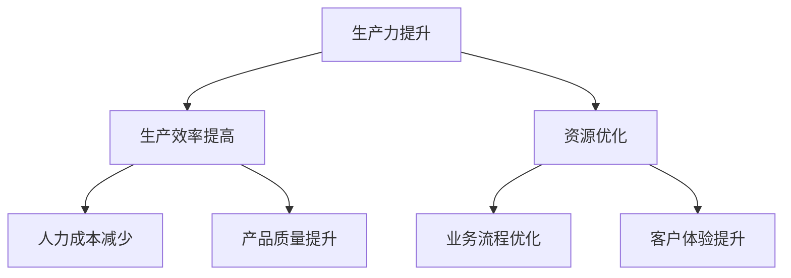

**图1.3 AI 2.0对社会生产力的推动**

##### 1.3.2 AI 2.0对教育、医疗等领域的变革

AI 2.0在教育领域带来了个性化学习和智能化教学的支持，通过分析学生的学习行为和知识水平，提供量身定制的教育方案。在医疗领域，AI技术可以协助医生进行疾病诊断和治疗方案的制定，提高医疗服务的准确性和效率。

**核心概念与联系：**

为了更清晰地展示AI 2.0对教育、医疗领域的变革，我们可以用Mermaid流程图表示：

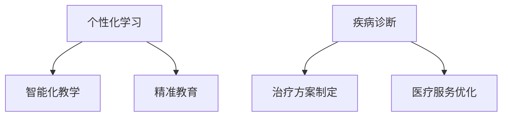

**图1.4 AI 2.0对教育、医疗领域的变革**

##### 1.3.3 AI 2.0伦理问题的探讨与应对策略

随着AI 2.0技术的广泛应用，伦理问题也日益突出。例如，算法偏见可能导致不公平现象，数据隐私保护需要得到重视，AI决策的责任归属也成为一个重要议题。为了应对这些挑战，需要建立相应的伦理规范和法律框架，同时提高公众的伦理意识和参与度。

**核心概念与联系：**

为了探讨AI 2.0伦理问题，我们可以使用Mermaid流程图来梳理关键点：

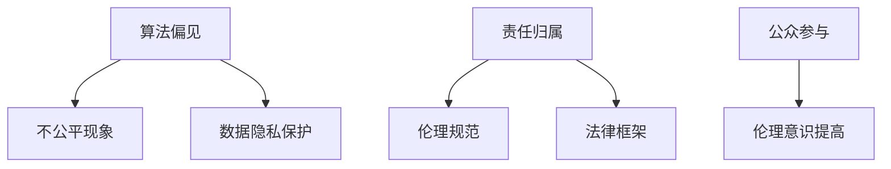

**图1.5 AI 2.0伦理问题的探讨与应对策略**

---

在本章节中，我们通过分析AI 2.0时代的概念与特征、技术基础以及社会价值与伦理问题，初步了解了这一时代的重要性和挑战。在接下来的章节中，我们将深入探讨AI 2.0时代的经济价值、政策环境、应用场景、伦理与安全挑战以及国际合作与竞争。通过这些分析，我们将更全面地理解AI 2.0时代的社会价值。|[<sop]--|>### 第2章 AI 2.0时代的经济价值分析

#### 2.1 AI 2.0时代的企业机遇

##### 2.1.1 企业在AI 2.0时代的转型策略

AI 2.0时代的到来为企业带来了巨大的机遇，但同时也要求企业必须进行深度的转型。以下是一些关键策略：

- **数字化升级**：企业应加快数字化进程，通过物联网、大数据等技术实现业务流程的自动化和智能化。
- **数据驱动决策**：利用AI技术分析海量数据，帮助企业做出更精准的决策。
- **创新业务模式**：AI技术可以催生新的商业模式，如共享经济、智能制造等。

**核心概念与联系：**

为了更好地理解企业在AI 2.0时代的转型策略，我们可以使用Mermaid流程图来表示：

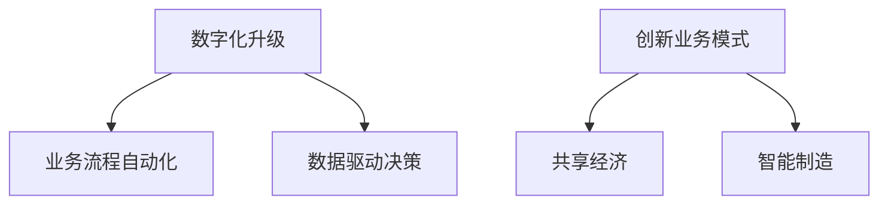

**图2.1 企业在AI 2.0时代的转型策略**

##### 2.1.2 创新型企业的崛起与竞争

AI 2.0时代推动了创新型企业的崛起。这些企业通常具备以下特点：

- **技术领先**：在AI领域拥有先进的技术和研发能力。
- **快速迭代**：能够快速响应市场变化，不断推出新的产品和服务。
- **跨界合作**：通过与不同行业的合作，实现资源共享和优势互补。

**核心概念与联系：**

为了分析创新型企业的崛起与竞争，我们可以用Mermaid流程图表示：

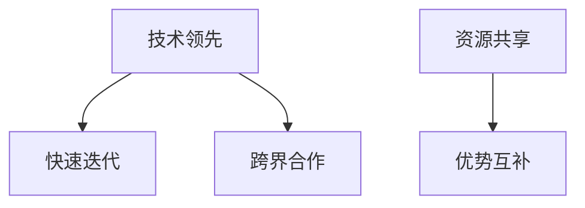

**图2.2 创新型企业的崛起与竞争**

##### 2.1.3 传统行业的AI 2.0应用案例

传统行业也在积极拥抱AI 2.0技术，以下是一些应用案例：

- **制造业**：通过智能制造，提高生产效率和质量。例如，某汽车制造企业利用AI技术实现了生产线自动化，减少了50%的生产成本。
- **金融业**：利用AI技术进行风险管理和智能投顾，提高金融服务的质量和效率。例如，某银行利用AI技术分析客户行为，实现了精准营销和风险管理。
- **医疗健康**：通过AI技术提高疾病诊断和治疗效率。例如，某医疗公司利用AI技术开发了一套智能诊断系统，提高了肺癌诊断的准确率。

**核心概念与联系：**

为了展示传统行业的AI 2.0应用案例，我们可以使用Mermaid流程图：

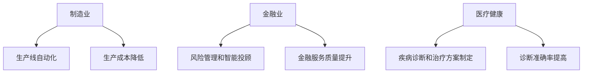

**图2.3 传统行业的AI 2.0应用案例**

---

#### 2.2 AI 2.0时代的投资趋势

##### 2.2.1 AI 2.0行业的投资热点

AI 2.0行业的投资热点主要集中在以下几个方面：

- **人工智能基础技术**：包括深度学习、强化学习、自然语言处理等核心技术。
- **AI应用领域**：如医疗健康、金融科技、智能制造、自动驾驶等。
- **AI基础设施建设**：如云计算、大数据、物联网等基础设施。

**核心概念与联系：**

为了分析AI 2.0行业的投资热点，我们可以使用Mermaid流程图表示：

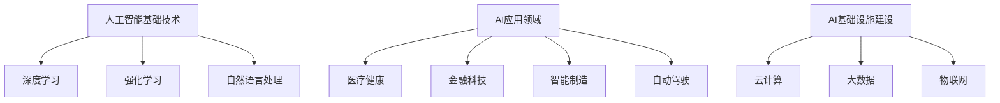

**图2.4 AI 2.0行业的投资热点**

##### 2.2.2 创投机构的投资策略与案例分析

创投机构在AI 2.0领域的投资策略通常包括：

- **早期投资**：寻找具有技术创新和市场前景的初创企业。
- **垂直行业投资**：针对特定行业进行深入研究和投资，如医疗健康、金融科技等。
- **国际化布局**：通过投资全球范围内的优秀AI企业，实现资源整合和风险分散。

**核心概念与联系：**

为了分析创投机构的投资策略与案例分析，我们可以使用Mermaid流程图：

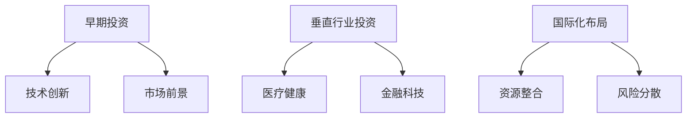

**图2.5 创投机构的投资策略与案例分析**

##### 2.2.3 AI 2.0领域的并购与整合

AI 2.0领域的并购与整合是推动行业发展的重要动力。通过并购，企业可以迅速获得先进技术和市场份额。以下是一些AI 2.0领域的并购案例：

- **微软收购GitHub**：微软通过收购GitHub，加强了自己在软件开发和云计算领域的竞争力。
- **谷歌收购DeepMind**：谷歌通过收购DeepMind，获得了在人工智能领域的领先地位。

**核心概念与联系：**

为了展示AI 2.0领域的并购与整合，我们可以使用Mermaid流程图：

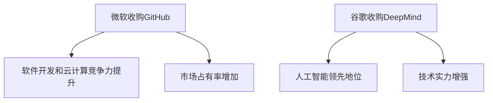

**图2.6 AI 2.0领域的并购与整合**

---

#### 2.3 AI 2.0时代的劳动力市场变革

##### 2.3.1 AI 2.0对职业岗位的影响

AI 2.0的发展将对劳动力市场产生深远影响。一方面，一些传统岗位可能会被自动化取代，如生产线操作员、数据录入员等。另一方面，新的职业岗位也将随之出现，如数据科学家、机器学习工程师、AI产品经理等。

**核心概念与联系：**

为了分析AI 2.0对职业岗位的影响，我们可以使用Mermaid流程图表示：

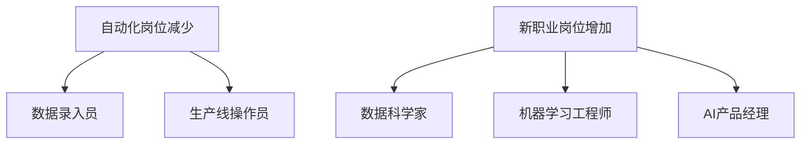

**图2.7 AI 2.0对职业岗位的影响**

##### 2.3.2 劳动力市场的供需调整

随着AI 2.0的发展，劳动力市场的供需关系也将发生调整。一方面，企业对高技能人才的需求将增加，如数据科学家、AI工程师等。另一方面，低技能劳动力的需求可能会减少，这将对劳动力市场产生结构性变化。

**核心概念与联系：**

为了分析劳动力市场的供需调整，我们可以使用Mermaid流程图表示：

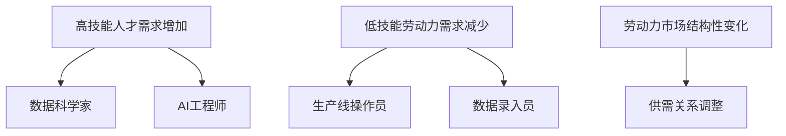

**图2.8 劳动力市场的供需调整**

##### 2.3.3 职业教育与培训的转型方向

为了应对AI 2.0时代的劳动力市场变革，职业教育与培训也需要进行转型。以下是一些关键方向：

- **技术技能培训**：加强对新兴技术的培训，如人工智能、大数据分析等。
- **跨界融合培训**：培养具备跨学科知识和技能的人才，以适应快速变化的市场需求。
- **终身学习理念**：鼓励劳动者终身学习，不断提升自己的技能和知识水平。

**核心概念与联系：**

为了展示职业教育与培训的转型方向，我们可以使用Mermaid流程图表示：

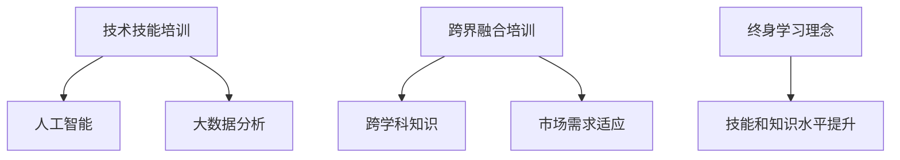

**图2.9 职业教育与培训的转型方向**

---

在本章节中，我们详细分析了AI 2.0时代的经济价值，包括企业机遇、投资趋势以及劳动力市场变革。通过这些分析，我们可以看到AI 2.0时代为企业带来了巨大的机遇，但同时也要求企业进行深度转型。在接下来的章节中，我们将进一步探讨AI 2.0时代的政策环境、应用场景、伦理与安全挑战以及国际合作与竞争。通过这些分析，我们将更全面地理解AI 2.0时代的社会价值。|[<sop]--|>### 第3章 AI 2.0时代的政策环境与法规框架

#### 3.1 政策环境概述

##### 3.1.1 全球主要国家的AI政策

在全球范围内，许多国家和地区已经开始制定和实施AI政策，以推动人工智能技术的发展和利用。以下是一些主要国家的AI政策：

- **美国**：美国政府在AI领域采取了一系列措施，包括投资研发、制定AI伦理准则、推动AI教育等。例如，美国国家科学基金会（NSF）和能源部（DOE）等机构已经投入大量资金支持AI研究。
- **欧盟**：欧盟发布了《人工智能伦理准则》，旨在确保AI技术的安全、可靠和公平。此外，欧盟还计划投入数百亿欧元用于AI研究和创新。
- **中国**：中国政府将AI作为国家战略，制定了《新一代人工智能发展规划》，旨在实现AI技术的跨越式发展。中国政府还通过一系列政策，支持AI技术在各行业的应用。
- **日本**：日本政府提出了“AI立国”战略，通过投资研发、人才培养和政策支持，推动AI技术的发展。

**核心概念与联系：**

为了更好地理解全球主要国家的AI政策，我们可以使用Mermaid流程图表示：

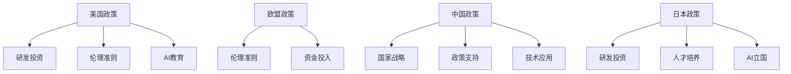

**图3.1 全球主要国家的AI政策**

##### 3.1.2 中国的AI发展战略

中国的AI发展战略主要包括以下几个方面：

- **加强研发投入**：中国政府通过增加研发投入，支持AI技术的创新和发展。
- **推动产业应用**：中国政府鼓励AI技术在各行业的应用，以推动产业升级和经济增长。
- **培育人才**：中国政府通过教育改革和人才引进，培育AI领域的高素质人才。
- **建设基础设施**：中国政府加大基础设施建设投入，为AI技术的发展提供支持。

**核心概念与联系：**

为了分析中国AI发展战略的关键点，我们可以使用Mermaid流程图：

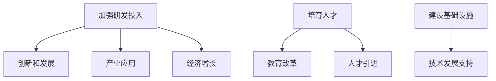

**图3.2 中国的AI发展战略**

##### 3.1.3 地方政府的AI扶持政策

地方政府也在积极推动AI技术的发展，制定了一系列扶持政策。以下是一些地方政府的AI扶持政策：

- **北京市**：北京市设立了AI产业基金，支持AI企业的创新和发展。
- **上海市**：上海市通过税收优惠、资金支持等政策，鼓励AI企业在该地区落地发展。
- **深圳市**：深圳市加强了AI领域的人才培养和引进，为AI企业提供政策支持。

**核心概念与联系：**

为了展示地方政府的AI扶持政策，我们可以使用Mermaid流程图：

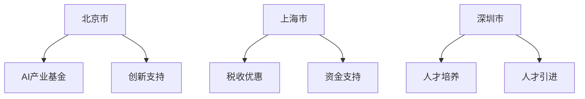

**图3.3 地方政府的AI扶持政策**

---

#### 3.2 法规框架建设

##### 3.2.1 数据隐私与安全法律法规

随着AI技术的广泛应用，数据隐私和安全问题日益突出。为此，各国政府开始制定相关法律法规，以保护个人隐私和数据安全。以下是一些关键法律法规：

- **欧盟**：《通用数据保护条例（GDPR）》是欧盟推出的重要数据隐私法规，对数据处理者的责任和义务做出了详细规定。
- **美国**：《加州消费者隐私法案（CCPA）》旨在保护加州居民的隐私权。
- **中国**：《网络安全法》和《个人信息保护法》等法规对数据收集、存储、处理和使用做出了严格规定。

**核心概念与联系：**

为了分析数据隐私与安全法律法规，我们可以使用Mermaid流程图：

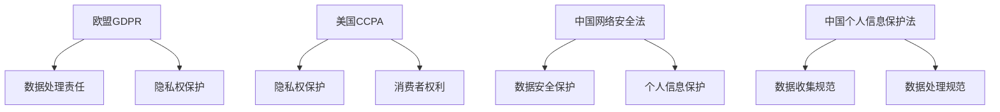

**图3.4 数据隐私与安全法律法规**

##### 3.2.2 AI伦理与公平性法规

AI技术的伦理与公平性问题也引起了广泛关注。各国政府开始制定相关法规，以确保AI技术的公平、公正和安全。以下是一些关键法规：

- **欧盟**：《人工智能伦理准则》规定了AI技术的伦理要求，如透明性、可解释性和非歧视性。
- **美国**：部分州已经制定了相关法规，要求AI系统具备可解释性。
- **中国**：《新一代人工智能发展规划》提出了加强AI伦理研究的政策目标。

**核心概念与联系：**

为了分析AI伦理与公平性法规，我们可以使用Mermaid流程图：

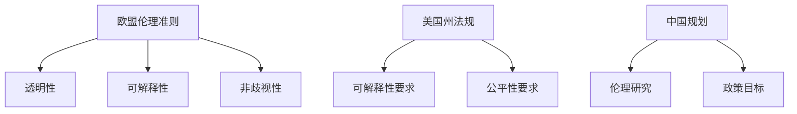

**图3.5 AI伦理与公平性法规**

##### 3.2.3 AI监管体系与法律法规的实施

AI监管体系与法律法规的实施是确保AI技术安全、可靠和公平的关键。以下是一些关键措施：

- **监管机构设立**：各国政府设立专门的AI监管机构，负责监督和指导AI技术的发展。
- **监管标准制定**：制定统一的AI监管标准，确保AI技术的合规性和安全性。
- **法律法规执行**：加强法律法规的执行力度，对违法行为进行严厉处罚。

**核心概念与联系：**

为了分析AI监管体系与法律法规的实施，我们可以使用Mermaid流程图：

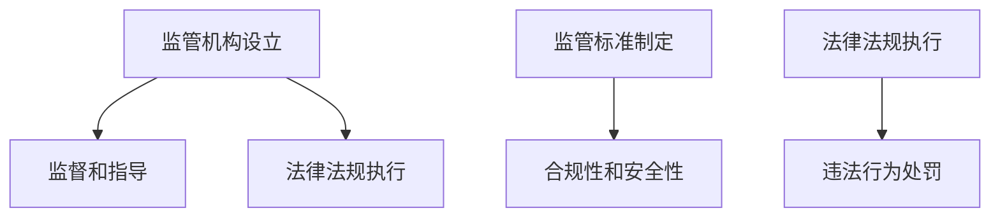

**图3.6 AI监管体系与法律法规的实施**

---

#### 3.3 政策法规对AI 2.0发展的影响

##### 3.3.1 政策法规的激励作用

政策法规对AI 2.0发展的激励作用主要体现在以下几个方面：

- **资金支持**：政府通过专项资金和税收优惠等政策，支持AI企业的研发和创新。
- **人才引进**：政府通过人才引进计划，吸引全球顶尖的AI人才。
- **市场环境优化**：政府通过制定监管标准，优化市场环境，降低企业创新和发展的风险。

**核心概念与联系：**

为了分析政策法规的激励作用，我们可以使用Mermaid流程图：

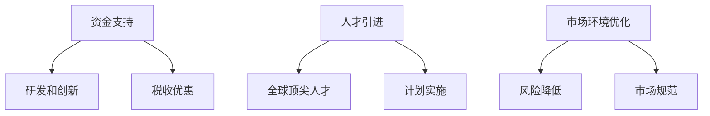

**图3.7 政策法规的激励作用**

##### 3.3.2 政策法规的规范与约束作用

政策法规的规范与约束作用主要体现在以下几个方面：

- **技术标准制定**：政府通过制定技术标准，确保AI技术的安全、可靠和公平。
- **数据处理规范**：政府通过法律法规，规范数据的收集、存储、处理和使用。
- **伦理要求**：政府通过制定伦理准则，确保AI技术的开发和应用符合伦理标准。

**核心概念与联系：**

为了分析政策法规的规范与约束作用，我们可以使用Mermaid流程图：

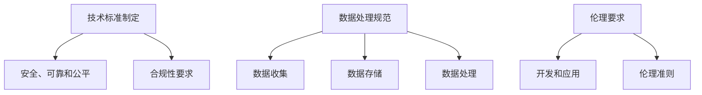

**图3.8 政策法规的规范与约束作用**

##### 3.3.3 政策法规的创新驱动作用

政策法规的创新驱动作用主要体现在以下几个方面：

- **科研投入**：政府通过增加科研投入，推动AI技术的创新和发展。
- **产业扶持**：政府通过产业扶持政策，鼓励企业进行AI技术的研发和应用。
- **国际合作**：政府通过国际合作，推动全球AI技术的研究和交流。

**核心概念与联系：**

为了分析政策法规的创新驱动作用，我们可以使用Mermaid流程图：

```mermaid
graph TD
KK[科研投入] --> LL[技术创新]
KK --> MM[研发投入]
NN[产业扶持] --> OO[企业研发]
NN --> PP[产业应用]
QQ[国际合作] --> RR[技术研究]
QQ --> SS[交流合作]
```

**图3.9 政策法规的创新驱动作用**

---

在本章节中，我们详细分析了AI 2.0时代的政策环境与法规框架，包括全球主要国家的AI政策、中国的AI发展战略、地方政府的AI扶持政策、数据隐私与安全法律法规、AI伦理与公平性法规、AI监管体系与法律法规的实施，以及政策法规对AI 2.0发展的影响。通过这些分析，我们可以看到政策法规在推动AI技术发展、规范市场行为、保障社会安全等方面发挥着重要作用。在接下来的章节中，我们将进一步探讨AI 2.0时代的创新与应用场景、伦理与安全挑战以及国际合作与竞争。通过这些分析，我们将更全面地理解AI 2.0时代的社会价值。|[<sop]--|>### 第4章 AI 2.0时代的创新与应用场景

#### 4.1 AI 2.0在医疗健康领域的应用

##### 4.1.1 医疗诊断与治疗的智能化

AI 2.0在医疗健康领域的应用主要体现在医疗诊断和治疗的智能化。通过深度学习和图像识别技术，AI系统可以辅助医生进行疾病诊断。例如，在肿瘤诊断中，AI系统可以通过分析医学影像数据，提供准确的诊断建议，提高诊断的准确率。在治疗方案制定方面，AI系统可以根据患者的病情、病史和基因信息，为医生提供个性化的治疗方案。

**核心概念与联系：**

为了更好地理解医疗诊断与治疗的智能化，我们可以使用Mermaid流程图表示：

```mermaid
graph TD
AA[医学影像数据] --> BB[深度学习]
AA --> CC[图像识别]
DD[诊断建议] --> EE[诊断准确率]
FF[个性化治疗方案] --> GG[病情、病史、基因信息]
```

**图4.1 医疗诊断与治疗的智能化**

##### 4.1.2 公共卫生管理的创新

AI 2.0技术还可以在公共卫生管理中发挥重要作用，如疫情预测和防控。通过大数据分析和机器学习算法，AI系统可以实时监测疫情数据，预测疫情发展趋势，为政府和公共卫生机构提供决策支持。此外，AI系统还可以协助进行疫苗接种计划的优化，提高疫苗分配的效率。

**核心概念与联系：**

为了分析公共卫生管理的创新，我们可以使用Mermaid流程图表示：

```mermaid
graph TD
HH[大数据分析] --> II[疫情预测]
HH --> JJ[决策支持]
KK[疫苗接种计划] --> LL[疫苗分配优化]
```

**图4.2 公共卫生管理的创新**

##### 4.1.3 健康管理的个性化服务

AI 2.0技术还可以提供个性化的健康管理服务。通过分析个体的生活习惯、基因数据和环境因素，AI系统可以制定个性化的健康方案，如运动建议、饮食指导和心理健康评估。此外，AI系统还可以实时监测个体的健康状况，提供及时的预警和建议。

**核心概念与联系：**

为了展示健康管理的个性化服务，我们可以使用Mermaid流程图表示：

```mermaid
graph TD
MM[生活习惯] --> NN[基因数据]
MM --> OO[环境因素]
PP[个性化健康方案] --> QQ[运动建议]
PP --> RR[饮食指导]
PP --> SS[心理健康评估]
TT[实时健康监测] --> UU[预警和建议]
```

**图4.3 健康管理的个性化服务**

---

#### 4.2 AI 2.0在教育领域的应用

##### 4.2.1 智能教学系统的开发与应用

AI 2.0技术可以用于开发智能教学系统，实现个性化教育和教育资源的智能化共享。智能教学系统可以通过分析学生的学习行为和知识水平，提供个性化的学习方案。例如，通过智能推荐算法，系统可以为每个学生推荐最适合的学习资源，提高学习效率。同时，智能教学系统还可以实现教育资源的智能化共享，如在线课程、学习资料和教学工具等。

**核心概念与联系：**

为了分析智能教学系统的开发与应用，我们可以使用Mermaid流程图表示：

```mermaid
graph TD
AA[学习行为分析] --> BB[个性化学习方案]
AA --> CC[智能推荐算法]
DD[教育资源智能化共享] --> EE[在线课程]
DD --> FF[学习资料]
DD --> GG[教学工具]
```

**图4.4 智能教学系统的开发与应用**

##### 4.2.2 学生个性化学习方案的定制

学生个性化学习方案是指根据学生的学习习惯、兴趣和能力，为其定制个性化的学习路径和资源。通过AI技术，教育系统可以实时分析学生的学习进度和知识掌握情况，自动调整学习方案，确保每个学生都能在最佳状态下进行学习。

**核心概念与联系：**

为了展示学生个性化学习方案的定制，我们可以使用Mermaid流程图表示：

```mermaid
graph TD
HH[学习习惯分析] --> II[学习路径定制]
HH --> JJ[兴趣分析]
KK[学习进度分析] --> LL[知识掌握情况]
LL --> MM[学习方案调整]
```

**图4.5 学生个性化学习方案的定制**

##### 4.2.3 教育资源的智能化共享

教育资源的智能化共享是指通过AI技术，实现教育资源的自动化分配和优化。例如，智能教学系统能够根据学生的需求和学习进度，自动推荐合适的课程和学习资料，实现教育资源的最大化利用。同时，教育资源的智能化共享还可以促进优质教育资源的普及，让更多学生享受到高质量的教育。

**核心概念与联系：**

为了分析教育资源的智能化共享，我们可以使用Mermaid流程图表示：

```mermaid
graph TD
NN[学生需求分析] --> OO[课程推荐]
NN --> PP[学习资料推荐]
QQ[优质教育资源普及] --> RR[教育资源优化]
QQ --> SS[教育资源利用最大化]
```

**图4.6 教育资源的智能化共享**

---

#### 4.3 AI 2.0在金融领域的应用

##### 4.3.1 信贷评估与风险管理的智能化

AI 2.0技术可以用于信贷评估和风险管理，提高金融服务的准确性和效率。通过大数据分析和机器学习算法，AI系统可以分析借款人的信用记录、财务状况、行为习惯等数据，评估其信用风险。同时，AI系统还可以实时监控借款人的还款行为，预测潜在的风险，为金融机构提供风险预警和建议。

**核心概念与联系：**

为了分析信贷评估与风险管理的智能化，我们可以使用Mermaid流程图表示：

```mermaid
graph TD
AA[信用记录] --> BB[财务状况]
AA --> CC[行为习惯]
DD[信用风险评估] --> EE[风险预警]
DD --> FF[风险预警]
GG[还款行为监控] --> HH[风险预测]
```

**图4.7 信贷评估与风险管理的智能化**

##### 4.3.2 投资决策的智能化

AI 2.0技术在投资决策中发挥着重要作用，通过大数据分析和机器学习算法，AI系统可以分析市场趋势、宏观经济数据、公司财务状况等，为投资者提供精准的投资建议。例如，AI系统可以通过分析历史数据和实时数据，预测股票价格的走势，帮助投资者做出更明智的投资决策。

**核心概念与联系：**

为了展示投资决策的智能化，我们可以使用Mermaid流程图表示：

```mermaid
graph TD
II[市场趋势分析] --> JJ[宏观经济数据]
II --> KK[公司财务状况]
LL[股票价格预测] --> MM[投资建议]
```

**图4.8 投资决策的智能化**

##### 4.3.3 金融服务的数字化升级

AI 2.0技术推动了金融服务的数字化升级，通过智能客服、在线银行等应用，提高金融服务的便捷性和用户体验。例如，智能客服系统可以通过自然语言处理技术，实现与用户的智能对话，提供24/7的在线服务。在线银行系统则可以通过大数据分析和风险控制技术，提供个性化的金融产品和服务。

**核心概念与联系：**

为了分析金融服务的数字化升级，我们可以使用Mermaid流程图表示：

```mermaid
graph TD
NN[智能客服] --> OO[自然语言处理]
NN --> PP[24/7在线服务]
QQ[在线银行] --> RR[大数据分析]
QQ --> SS[风险控制]
```

**图4.9 金融服务的数字化升级**

---

#### 4.4 AI 2.0在制造与物流领域的应用

##### 4.4.1 智能制造系统的构建

AI 2.0技术在智能制造系统中发挥着关键作用，通过机器学习、深度学习和物联网技术，实现生产过程的自动化和智能化。例如，智能机器人可以通过视觉识别技术，自动完成生产线上的组装和检测工作。同时，智能制造系统还可以通过实时数据分析，优化生产流程，提高生产效率。

**核心概念与联系：**

为了分析智能制造系统的构建，我们可以使用Mermaid流程图表示：

```mermaid
graph TD
AA[机器学习] --> BB[深度学习]
AA --> CC[物联网技术]
DD[智能机器人] --> EE[视觉识别]
DD --> FF[生产线自动化]
GG[实时数据分析] --> HH[生产流程优化]
```

**图4.10 智能制造系统的构建**

##### 4.4.2 物流与供应链管理的优化

AI 2.0技术可以用于优化物流与供应链管理，提高物流效率和服务质量。通过大数据分析和机器学习算法，AI系统可以预测货物的运输需求和最佳路线，优化物流资源分配。同时，AI系统还可以实时监控物流过程，提高物流的透明度和可控性。

**核心概念与联系：**

为了展示物流与供应链管理的优化，我们可以使用Mermaid流程图表示：

```mermaid
graph TD
HH[大数据分析] --> II[运输需求预测]
HH --> JJ[最佳路线预测]
KK[物流资源优化] --> LL[实时监控]
KK --> MM[物流透明度提高]
```

**图4.11 物流与供应链管理的优化**

##### 4.4.3 智能配送与无人驾驶技术的发展

AI 2.0技术在智能配送和无人驾驶技术中有着广泛的应用。通过自动驾驶技术和智能配送系统，可以实现无人驾驶车辆在城市道路上的自主行驶和配送。例如，无人驾驶出租车和无人配送车可以通过AI技术，实现自动驾驶、路径规划和实时决策，提高配送效率和服务质量。

**核心概念与联系：**

为了分析智能配送与无人驾驶技术的发展，我们可以使用Mermaid流程图表示：

```mermaid
graph TD
NN[自动驾驶技术] --> OO[路径规划]
NN --> PP[实时决策]
QQ[无人配送车] --> RR[自主行驶]
QQ --> SS[配送效率提升]
```

**图4.12 智能配送与无人驾驶技术的发展**

---

在本章节中，我们详细分析了AI 2.0时代在医疗健康、教育、金融、制造与物流领域的创新与应用场景。通过这些分析，我们可以看到AI 2.0技术在各个领域都有着广泛的应用前景，为社会的进步和人们的生活带来巨大的改变。在接下来的章节中，我们将进一步探讨AI 2.0时代的伦理与安全挑战、国际合作与竞争以及未来展望。通过这些分析，我们将更全面地理解AI 2.0时代的社会价值。|[<sop]--|>### 第5章 AI 2.0时代的伦理与安全挑战

#### 5.1 伦理问题的探讨

##### 5.1.1 AI偏见与歧视

AI偏见与歧视是AI 2.0时代最突出的伦理问题之一。由于AI系统在训练过程中可能受到训练数据的偏差影响，导致AI系统在决策过程中产生偏见。例如，在招聘、信贷评估、司法判决等场景中，AI系统可能会对特定群体产生歧视，从而导致不公平现象。为了解决这一问题，我们需要从以下几个方面进行努力：

- **数据预处理**：在训练AI系统之前，对数据进行清洗和预处理，消除数据中的偏见和歧视。
- **算法透明性**：提高AI算法的透明性，使人们能够理解和监督AI系统的决策过程。
- **多样性培训**：在AI系统的设计和训练过程中，引入多样性，避免单一视角和偏见。

**核心概念与联系：**

为了探讨AI偏见与歧视，我们可以使用Mermaid流程图表示：

```mermaid
graph TD
AA[数据预处理] --> BB[消除偏见]
AA --> CC[数据清洗]
DD[算法透明性] --> EE[决策过程理解]
DD --> FF[监督和监督]
GG[多样性培训] --> HH[避免单一视角]
GG --> II[引入多样性]
```

**图5.1 AI偏见与歧视**

##### 5.1.2 AI责任归属

在AI 2.0时代，AI系统的决策可能导致负面影响，如错误诊断、错误推荐等。然而，当前的法律框架往往难以确定AI责任归属。为了解决这个问题，我们需要从以下几个方面进行探讨：

- **明确责任主体**：在法律法规中明确AI系统的责任主体，如开发者、使用者等。
- **算法可解释性**：提高AI算法的可解释性，使人们能够理解AI系统的决策依据，从而便于责任归属。
- **责任保险**：建立AI责任保险制度，为AI系统的错误决策提供经济赔偿。

**核心概念与联系：**

为了探讨AI责任归属，我们可以使用Mermaid流程图表示：

```mermaid
graph TD
JJ[明确责任主体] --> KK[法律法规明确]
JJ --> LL[开发者责任]
MM[算法可解释性] --> NN[决策依据理解]
MM --> OO[责任归属明确]
PP[责任保险] --> QQ[经济赔偿]
PP --> RR[错误决策赔偿]
```

**图5.2 AI责任归属**

##### 5.1.3 人工智能的道德决策

人工智能的道德决策是AI 2.0时代的另一个重要伦理问题。在特定场景中，AI系统可能需要做出道德决策，如是否拯救多数人还是少数人。这种决策往往涉及到复杂的道德判断和伦理原则。为了解决这个问题，我们需要从以下几个方面进行努力：

- **伦理准则制定**：在AI系统的设计过程中，制定明确的伦理准则，确保AI系统的决策符合伦理要求。
- **伦理审查机制**：建立伦理审查机制，对AI系统的决策过程进行审查和监督，确保其符合道德原则。
- **道德教育**：加强人工智能领域的道德教育，提高研发人员和社会公众的道德素养。

**核心概念与联系：**

为了探讨人工智能的道德决策，我们可以使用Mermaid流程图表示：

```mermaid
graph TD
SS[伦理准则制定] --> TT[设计过程中引入]
SS --> UU[伦理要求符合]
VV[伦理审查机制] --> WW[决策过程审查]
VV --> XX[监督和监督]
YY[道德教育] --> ZZ[道德素养提高]
YY --> AA[研发人员教育]
```

**图5.3 人工智能的道德决策**

---

#### 5.2 安全问题的分析

##### 5.2.1 AI系统的安全性评估

AI系统的安全性评估是确保AI系统在复杂环境中运行的关键。在AI系统开发过程中，我们需要对其安全性进行全面评估，包括以下几个方面：

- **攻击性测试**：通过模拟各种攻击场景，测试AI系统的抗攻击能力。
- **数据安全**：确保训练数据和测试数据的安全，防止数据泄露和滥用。
- **模型鲁棒性**：评估AI系统在面临异常输入时的鲁棒性，确保系统能够稳定运行。

**核心概念与联系：**

为了分析AI系统的安全性评估，我们可以使用Mermaid流程图表示：

```mermaid
graph TD
AA[攻击性测试] --> BB[抗攻击能力评估]
AA --> CC[攻击场景模拟]
DD[数据安全] --> EE[数据泄露防护]
DD --> FF[数据滥用防护]
GG[模型鲁棒性] --> HH[异常输入处理]
GG --> II[系统稳定性评估]
```

**图5.4 AI系统的安全性评估**

##### 5.2.2 数据泄露与网络攻击

数据泄露和网络攻击是AI系统面临的主要安全威胁。随着AI系统的广泛应用，大量的敏感数据被存储和处理，这使得数据泄露和网络攻击的风险增加。为了解决这个问题，我们需要从以下几个方面进行努力：

- **加密技术**：使用加密技术保护数据，防止未经授权的访问。
- **网络安全**：加强网络安全防护，防止网络攻击和数据泄露。
- **威胁监测与响应**：建立威胁监测与响应机制，及时发现并应对潜在的安全威胁。

**核心概念与联系：**

为了分析数据泄露与网络攻击，我们可以使用Mermaid流程图表示：

```mermaid
graph TD
JJ[加密技术] --> KK[数据保护]
JJ --> LL[访问控制]
MM[网络安全] --> NN[防护措施]
MM --> OO[入侵检测]
PP[威胁监测与响应] --> QQ[威胁监测]
PP --> RR[响应措施]
```

**图5.5 数据泄露与网络攻击**

##### 5.2.3 AI武器的潜在威胁

AI武器，如自主武器系统（Autonomous Weapon Systems, AWS），是AI 2.0时代的一个重大安全威胁。这些武器系统可以在没有人类干预的情况下自主决策和执行攻击任务。然而，这可能导致一系列道德和安全问题。为了解决这个问题，我们需要从以下几个方面进行努力：

- **国际法规**：制定国际法规，禁止或限制AI武器的开发和使用。
- **透明性和可解释性**：提高AI武器系统的透明性和可解释性，确保其决策过程符合伦理标准。
- **技术控制**：建立技术控制措施，防止AI武器系统被滥用。

**核心概念与联系：**

为了分析AI武器的潜在威胁，我们可以使用Mermaid流程图表示：

```mermaid
graph TD
SS[国际法规] --> TT[开发和使用限制]
SS --> UU[道德标准符合]
VV[透明性和可解释性] --> WW[决策过程审查]
VV --> XX[伦理要求符合]
YY[技术控制] --> ZZ[滥用防范]
YY --> AA[技术措施实施]
```

**图5.6 AI武器的潜在威胁**

---

#### 5.3 伦理与安全挑战的应对策略

##### 5.3.1 全球伦理规范的制定与推广

为了应对AI 2.0时代的伦理与安全挑战，全球各国需要共同制定伦理规范，并推动其在全球范围内的推广。以下是一些关键策略：

- **国际合作**：通过国际合作，制定全球统一的AI伦理规范。
- **伦理审查**：建立AI系统的伦理审查机制，确保AI系统的设计、开发和应用符合伦理标准。
- **公众参与**：加强公众对AI伦理问题的关注和参与，提高社会对AI伦理规范的认同度。

**核心概念与联系：**

为了分析全球伦理规范的制定与推广，我们可以使用Mermaid流程图表示：

```mermaid
graph TD
AA[国际合作] --> BB[全球规范制定]
AA --> CC[公众参与]
DD[伦理审查] --> EE[审查机制建立]
DD --> FF[伦理标准符合]
GG[公众参与] --> HH[社会认同度提高]
```

**图5.7 全球伦理规范的制定与推广**

##### 5.3.2 企业内部伦理政策的制定

除了全球伦理规范，企业也需要制定内部伦理政策，以确保AI系统的设计、开发和应用符合伦理要求。以下是一些关键策略：

- **伦理培训**：为研发人员和员工提供伦理培训，提高其伦理意识和道德素养。
- **伦理委员会**：建立伦理委员会，对AI系统的伦理问题进行审查和决策。
- **透明度和可解释性**：提高AI系统的透明度和可解释性，确保其决策过程符合伦理要求。

**核心概念与联系：**

为了分析企业内部伦理政策的制定，我们可以使用Mermaid流程图表示：

```mermaid
graph TD
JJ[伦理培训] --> KK[伦理意识提高]
JJ --> LL[道德素养提升]
MM[伦理委员会] --> NN[审查决策]
MM --> OO[伦理问题审查]
PP[透明度和可解释性] --> QQ[决策过程透明]
PP --> RR[伦理要求符合]
```

**图5.8 企业内部伦理政策的制定**

##### 5.3.3 技术安全机制的构建与实施

为了应对AI 2.0时代的安全挑战，我们需要构建和实施技术安全机制，以下是一些关键策略：

- **安全评估**：对AI系统进行全面的安全性评估，确保其在复杂环境中运行的安全性和稳定性。
- **安全监控**：建立安全监控系统，实时监测AI系统的运行状态，及时发现并应对潜在的安全威胁。
- **应急响应**：建立应急响应机制，确保在AI系统发生安全事件时，能够迅速采取措施，降低风险和损失。

**核心概念与联系：**

为了分析技术安全机制的构建与实施，我们可以使用Mermaid流程图表示：

```mermaid
graph TD
SS[安全评估] --> TT[安全性评估]
SS --> UU[稳定性评估]
VV[安全监控] --> WW[实时监测]
VV --> XX[威胁检测]
YY[应急响应] --> ZZ[应急措施]
YY --> AA[风险降低]
```

**图5.9 技术安全机制的构建与实施**

---

在本章节中，我们详细分析了AI 2.0时代的伦理与安全挑战，包括伦理问题（AI偏见与歧视、AI责任归属、人工智能的道德决策）和安全问题（AI系统的安全性评估、数据泄露与网络攻击、AI武器的潜在威胁）。同时，我们探讨了全球伦理规范的制定与推广、企业内部伦理政策的制定以及技术安全机制的构建与实施。通过这些分析，我们可以看到，AI 2.0时代的伦理与安全挑战是多方面的，需要全球合作、政策法规和技术手段的共同努力。在接下来的章节中，我们将进一步探讨AI 2.0时代的国际合作与竞争，以及未来展望。通过这些分析，我们将更全面地理解AI 2.0时代的社会价值。|[<sop]--|>### 第6章 AI 2.0时代的国际合作与竞争

#### 6.1 国际合作的重要性

##### 6.1.1 AI领域的国际合作现状

随着AI技术的快速发展，国际合作在AI领域变得愈发重要。当前，全球各国在AI领域展开了广泛的研究与合作，以共同推动技术的进步和应用。以下是一些主要的国际合作现状：

- **跨国研究项目**：全球多家研究机构和大学合作开展AI研究项目，如欧盟的Horizon 2020计划和美国的AI研究计划。
- **国际学术会议**：AI领域的国际学术会议，如NeurIPS、ICML等，吸引了全球各地的学者和研究者，促进了知识的共享和交流。
- **政府间合作**：政府间的合作也在不断加强，例如中美两国在AI领域的合作，包括技术交流、研发合作和标准制定。

**核心概念与联系：**

为了分析AI领域的国际合作现状，我们可以使用Mermaid流程图表示：

```mermaid
graph TD
AA[跨国研究项目] --> BB[知识共享]
AA --> CC[技术交流]
DD[国际学术会议] --> EE[学术交流]
DD --> FF[研究合作]
GG[政府间合作] --> HH[技术交流]
GG --> II[研发合作]
GG --> JJ[标准制定]
```

**图6.1 AI领域的国际合作现状**

##### 6.1.2 国际合作在AI研发中的应用

国际合作在AI研发中的应用主要体现在以下几个方面：

- **技术共享**：各国通过合作，共享AI技术的研究成果，加速技术的迭代和创新。
- **资源整合**：国际合作能够整合全球的科研资源，提高研发效率，降低研发成本。
- **人才流动**：国际间的学术交流促进了人才的流动，为各国AI领域的发展注入了新的活力。

**核心概念与联系：**

为了展示国际合作在AI研发中的应用，我们可以使用Mermaid流程图表示：

```mermaid
graph TD
KK[技术共享] --> LL[成果迭代]
KK --> MM[技术创新]
NN[资源整合] --> OO[研发效率提升]
NN --> PP[研发成本降低]
QQ[人才流动] --> RR[学术交流]
QQ --> SS[发展活力注入]
```

**图6.2 国际合作在AI研发中的应用**

##### 6.1.3 国际合作在AI治理中的角色

国际合作在AI治理中也扮演着重要角色。通过国际合作，各国能够共同制定AI治理的规则和标准，确保AI技术的健康发展。以下是一些关键角色：

- **政策协调**：国际合作能够协调各国的AI政策，避免政策冲突，推动全球AI治理的统一性。
- **伦理规范**：通过国际合作，制定全球统一的AI伦理规范，保障AI技术的公平、公正和安全。
- **法律法规**：国际合作有助于推动全球AI法律法规的统一，提高法律的适用性和执行力。

**核心概念与联系：**

为了分析国际合作在AI治理中的角色，我们可以使用Mermaid流程图表示：

```mermaid
graph TD
TT[政策协调] --> UU[政策统一]
TT --> VW[避免冲突]
XX[伦理规范] --> YY[伦理要求统一]
XX --> ZZ[安全保障]
AA[法律法规] --> BB[法律统一]
AA --> CC[执行力提升]
```

**图6.3 国际合作在AI治理中的角色**

---

#### 6.2 竞争格局分析

##### 6.2.1 全球主要国家的AI战略与布局

在全球范围内，主要国家纷纷制定了AI战略，并通过不同的布局推动AI技术的发展。以下是一些主要国家的AI战略与布局：

- **美国**：美国将AI视为国家战略，通过研发投入、人才培养和政策支持，推动AI技术的发展。美国在AI领域的布局主要集中在高校、研究机构和大型科技公司。
- **中国**：中国将AI作为国家战略，通过《新一代人工智能发展规划》，加大对AI技术的研发投入和产业应用。中国在AI领域的布局包括政府支持、企业研发和地方政府的积极推动。
- **欧盟**：欧盟通过制定《人工智能伦理准则》和《人工智能战略》，推动AI技术的发展和应用。欧盟的布局主要集中在科研机构、大型企业和政策制定。
- **日本**：日本将AI作为“AI立国”战略的核心，通过研发投入、人才培养和政策支持，推动AI技术的发展。日本的布局主要集中在企业和研究机构。

**核心概念与联系：**

为了分析全球主要国家的AI战略与布局，我们可以使用Mermaid流程图表示：

```mermaid
graph TD
DD[美国战略] --> EE[研发投入]
DD --> FF[人才培养]
GG[中国战略] --> HH[研发投入]
GG --> II[产业应用]
JJ[欧盟战略] --> KK[伦理准则]
JJ --> LL[政策支持]
MM[日本战略] --> NN[研发投入]
MM --> OO[人才培养]
```

**图6.4 全球主要国家的AI战略与布局**

##### 6.2.2 企业在国际AI竞争中的地位

在国际AI竞争中，企业扮演着至关重要的角色。以下是一些主要企业在国际AI竞争中的地位：

- **科技公司**：如谷歌、微软、亚马逊等，这些公司通过强大的研发能力和丰富的应用场景，成为国际AI竞争的领先者。
- **中国企业**：如百度、阿里巴巴、腾讯等，这些公司通过政府支持和强大的市场基础，在国际AI竞争中逐渐崛起。
- **初创企业**：一些初创企业在特定领域（如自动驾驶、无人机等）展现出了强大的创新能力和竞争力。

**核心概念与联系：**

为了分析企业在国际AI竞争中的地位，我们可以使用Mermaid流程图表示：

```mermaid
graph TD
PP[科技公司] --> QQ[研发能力]
PP --> RR[应用场景]
SS[中国企业] --> TT[政府支持]
SS --> UU[市场基础]
VV[初创企业] --> WW[创新能力]
VV --> XX[特定领域竞争力]
```

**图6.5 企业在国际AI竞争中的地位**

##### 6.2.3 国际AI竞争的挑战与机遇

国际AI竞争既带来了挑战，也带来了机遇。以下是一些关键点：

- **技术领先**：技术领先是国际AI竞争的核心，各国和企业都在努力提升自身的研发能力。
- **数据资源**：数据资源是AI系统的重要驱动力，拥有丰富数据资源的国家和企业将在国际竞争中占据优势。
- **人才培养**：人才是AI技术发展的关键，各国和企业都需要加强人才培养和引进。
- **国际合作**：国际合作是推动AI技术发展和应用的重要途径，通过合作，各国和企业可以共同应对挑战，抓住机遇。

**核心概念与联系：**

为了分析国际AI竞争的挑战与机遇，我们可以使用Mermaid流程图表示：

```mermaid
graph TD
YY[技术领先] --> ZZ[研发能力提升]
YY --> AA[竞争优势]
BB[数据资源] --> CC[数据驱动力]
BB --> DD[竞争优势]
EE[人才培养] --> FF[人才引进]
EE --> GG[技术创新]
HH[国际合作] --> II[技术发展]
HH --> JJ[共同应对挑战]
```

**图6.6 国际AI竞争的挑战与机遇**

---

#### 6.3 国际合作与竞争的平衡策略

##### 6.3.1 合作与竞争的双边关系

在国际合作与竞争中，合作与竞争是相互交织的。以下是一些关键的双边关系：

- **合作中的竞争**：在合作过程中，各国和企业可能会在技术、市场等方面进行竞争。
- **竞争中的合作**：在竞争中，各国和企业可能会通过合作，共同推动技术的发展和应用。

**核心概念与联系：**

为了分析合作与竞争的双边关系，我们可以使用Mermaid流程图表示：

```mermaid
graph TD
KK[合作中的竞争] --> LL[技术竞争]
KK --> MM[市场竞争]
NN[竞争中的合作] --> OO[技术合作]
NN --> PP[市场合作]
```

**图6.7 合作与竞争的双边关系**

##### 6.3.2 全球AI治理机制的建立

为了实现国际合作与竞争的平衡，全球AI治理机制的建立至关重要。以下是一些关键点：

- **全球规则制定**：通过全球合作，制定统一的AI治理规则，确保AI技术的公平、公正和安全。
- **国际监督机制**：建立国际监督机制，监督各国和企业遵守AI治理规则，确保全球AI治理的有效性。
- **合作平台**：建立全球AI合作平台，促进各国和企业之间的技术交流与合作。

**核心概念与联系：**

为了展示全球AI治理机制的建立，我们可以使用Mermaid流程图表示：

```mermaid
graph TD
QQ[全球规则制定] --> RR[规则统一]
QQ --> SS[公正性保障]
TT[国际监督机制] --> UU[监督机制建立]
TT --> VW[遵守规则]
XX[合作平台] --> YY[技术交流]
XX --> ZZ[合作促进]
```

**图6.8 全球AI治理机制的建立**

##### 6.3.3 企业在国际AI竞争中的战略选择

企业在国际AI竞争中的战略选择至关重要。以下是一些关键点：

- **技术创新**：通过持续的研发投入，推动技术创新，保持技术领先地位。
- **市场拓展**：通过拓展海外市场，扩大市场份额，提高国际竞争力。
- **国际合作**：通过国际合作，共享技术资源，共同推动AI技术的发展。

**核心概念与联系：**

为了分析企业在国际AI竞争中的战略选择，我们可以使用Mermaid流程图表示：

```mermaid
graph TD
AA[技术创新] --> BB[研发投入]
AA --> CC[技术领先]
DD[市场拓展] --> EE[市场份额扩大]
DD --> FF[国际竞争力提高]
GG[国际合作] --> HH[技术资源共享]
GG --> II[技术发展]
```

**图6.9 企业在国际AI竞争中的战略选择**

---

在本章节中，我们详细分析了AI 2.0时代的国际合作与竞争，包括国际合作的重要性、全球主要国家的AI战略与布局、企业在国际AI竞争中的地位以及国际合作与竞争的平衡策略。通过这些分析，我们可以看到国际合作与竞争在AI 2.0时代的重要性，以及如何通过全球治理机制和企业战略选择实现国际合作与竞争的平衡。在接下来的章节中，我们将进一步探讨AI 2.0时代的未来展望。通过这些分析，我们将更全面地理解AI 2.0时代的社会价值。|[<sop]--|>### 第7章 AI 2.0时代的未来展望

#### 7.1 AI 2.0发展的未来趋势

AI 2.0的发展将继续推动技术进步和社会变革，以下是几个关键趋势：

##### 7.1.1 AI技术的持续进化

随着计算能力的提升和算法的优化，AI技术将不断进化，实现更高层次的智能化。深度学习、强化学习、迁移学习等技术将继续发展，同时新兴技术如生成对抗网络（GANs）、变分自编码器（VAEs）等也将逐渐成熟，推动AI技术的创新。

**核心概念与联系：**

为了分析AI技术的持续进化，我们可以使用Mermaid流程图表示：

```mermaid
graph TD
AA[深度学习] --> BB[计算能力提升]
AA --> CC[算法优化]
DD[GANs] --> EE[技术成熟]
DD --> FF[创新驱动]
GG[VAEs] --> HH[技术成熟]
GG --> II[创新驱动]
```

**图7.1 AI技术的持续进化**

##### 7.1.2 AI应用场景的拓展

AI技术的广泛应用将进一步拓展其应用场景，包括但不限于：

- **智能制造**：AI技术将在制造业中发挥更大作用，实现生产线的智能化、自动化。
- **智慧城市**：AI技术将用于城市管理、交通优化、环境保护等，提升城市运行效率。
- **医疗健康**：AI技术将广泛应用于疾病诊断、个性化治疗、公共卫生管理等，改善医疗服务质量。
- **金融科技**：AI技术将在金融领域发挥更大作用，如信用评估、风险管理、智能投顾等。

**核心概念与联系：**

为了展示AI应用场景的拓展，我们可以使用Mermaid流程图表示：

```mermaid
graph TD
JJ[智能制造] --> KK[生产线智能化]
JJ --> LL[自动化]
MM[智慧城市] --> NN[城市管理]
MM --> OO[交通优化]
PP[医疗健康] --> QQ[疾病诊断]
PP --> RR[个性化治疗]
SS[金融科技] --> TT[信用评估]
SS --> UU[风险管理]
VV[智能投顾]
```

**图7.2 AI应用场景的拓展**

##### 7.1.3 AI与社会发展的深度融合

AI技术将与社会发展深度融合，影响社会的各个方面：

- **教育**：AI技术将改变教育模式，实现个性化教育和智能化教学。
- **就业**：AI技术将改变就业结构，创造新的工作岗位，同时淘汰一些传统岗位。
- **法律与伦理**：AI技术的广泛应用将引发新的法律和伦理问题，需要社会共同解决。
- **生活品质**：AI技术将提高生活质量，提供更便捷、高效的服务。

**核心概念与联系：**

为了分析AI与社会发展的深度融合，我们可以使用Mermaid流程图表示：

```mermaid
graph TD
AA[教育] --> BB[个性化教育]
AA --> CC[智能化教学]
DD[就业] --> EE[就业结构变化]
DD --> FF[新工作岗位创造]
GG[法律与伦理] --> HH[新法律问题]
GG --> II[新伦理问题]
JJ[生活品质] --> KK[便捷服务]
JJ --> LL[高效服务]
```

**图7.3 AI与社会发展的深度融合**

---

#### 7.2 AI 2.0时代的机遇与挑战

##### 7.2.1 技术发展的机遇

AI 2.0时代为技术发展带来了巨大机遇：

- **创新驱动**：AI技术的进步将推动新一轮科技创新，促进技术突破和产业升级。
- **产业链重构**：AI技术将重构产业链，推动传统产业向智能化、数字化转型。
- **国际化发展**：AI技术的全球化应用将推动国际合作，创造更多国际商业机会。

**核心概念与联系：**

为了分析技术发展的机遇，我们可以使用Mermaid流程图表示：

```mermaid
graph TD
AA[创新驱动] --> BB[技术突破]
AA --> CC[产业升级]
DD[产业链重构] --> EE[智能化转型]
DD --> FF[数字化转型]
GG[国际化发展] --> HH[国际合作]
GG --> II[商业机会]
```

**图7.4 技术发展的机遇**

##### 7.2.2 社会变革的挑战

AI 2.0时代也带来了一系列社会变革的挑战：

- **就业市场变化**：AI技术的发展可能导致部分岗位的消失，需要社会提供新的就业机会和培训。
- **隐私保护**：AI技术的广泛应用可能侵犯个人隐私，需要加强隐私保护法律法规。
- **伦理问题**：AI技术的决策可能涉及伦理问题，需要社会共同制定伦理标准和规范。
- **安全风险**：AI技术的安全性问题可能导致数据泄露和网络攻击，需要加强安全防护。

**核心概念与联系：**

为了分析社会变革的挑战，我们可以使用Mermaid流程图表示：

```mermaid
graph TD
JJ[就业市场变化] --> KK[就业机会]
JJ --> LL[岗位消失]
MM[隐私保护] --> NN[隐私侵犯]
MM --> OO[法律法规加强]
PP[伦理问题] --> QQ[伦理标准]
PP --> RR[规范制定]
SS[安全风险] --> TT[数据泄露]
SS --> UU[网络攻击]
VV[安全防护] --> WW[风险降低]
```

**图7.5 社会变革的挑战**

##### 7.2.3 未来发展的策略选择

为了应对AI 2.0时代的机遇与挑战，需要采取一系列策略：

- **技术发展战略**：加大对AI技术的研发投入，推动技术创新和产业应用。
- **人才培养**：加强AI领域的人才培养，提高人才素质和创新能力。
- **国际合作**：加强国际合作，共同推动AI技术的发展和应用。
- **法律法规**：制定完善的法律法规，保护个人隐私和安全，规范AI技术应用。

**核心概念与联系：**

为了分析未来发展的策略选择，我们可以使用Mermaid流程图表示：

```mermaid
graph TD
AA[技术发展战略] --> BB[研发投入]
AA --> CC[技术创新]
DD[人才培养] --> EE[人才素质提高]
DD --> FF[创新能力提升]
GG[国际合作] --> HH[技术交流]
GG --> II[共同发展]
JJ[法律法规] --> KK[隐私保护]
JJ --> LL[安全规范]
```

**图7.6 未来发展的策略选择**

---

#### 7.3 全球AI治理的未来方向

##### 7.3.1 全球AI治理的进展与问题

全球AI治理的进展主要包括：

- **国际合作**：各国通过合作，共同制定AI治理规则和标准。
- **法律法规**：各国制定相关的法律法规，规范AI技术的研发和应用。

然而，全球AI治理仍面临一些问题：

- **法律差异**：各国法律体系不同，可能导致AI治理的协调和统一困难。
- **伦理问题**：AI技术的应用可能涉及伦理问题，需要全球共同制定伦理标准。
- **技术垄断**：大型科技公司可能在AI领域形成垄断，影响全球AI治理的公平性。

**核心概念与联系：**

为了分析全球AI治理的进展与问题，我们可以使用Mermaid流程图表示：

```mermaid
graph TD
AA[国际合作] --> BB[规则制定]
AA --> CC[标准制定]
DD[法律法规] --> EE[规范应用]
DD --> FF[法律差异]
GG[伦理问题] --> HH[伦理标准]
GG --> II[伦理协调]
JJ[技术垄断] --> KK[公平性影响]
JJ --> LL[垄断问题]
```

**图7.7 全球AI治理的进展与问题**

##### 7.3.2 国际合作与协调的加强

为了解决全球AI治理的问题，需要加强国际合作与协调：

- **全球治理机制**：建立全球AI治理机制，协调各国政策，推动全球AI治理的统一性。
- **跨国合作项目**：开展跨国合作项目，促进AI技术的共享和创新。
- **伦理规范**：制定全球统一的伦理规范，确保AI技术的公平、公正和安全。

**核心概念与联系：**

为了展示国际合作与协调的加强，我们可以使用Mermaid流程图表示：

```mermaid
graph TD
AA[全球治理机制] --> BB[政策协调]
AA --> CC[统一性推动]
DD[跨国合作项目] --> EE[技术共享]
DD --> FF[创新驱动]
GG[伦理规范] --> HH[公平性保障]
GG --> II[安全性保障]
```

**图7.8 国际合作与协调的加强**

##### 7.3.3 未来AI治理的展望

未来AI治理的展望包括：

- **技术中立**：在AI治理中，应保持技术中立，避免技术垄断和不公平现象。
- **伦理导向**：AI治理应以伦理为导向，确保AI技术的公平、公正和安全。
- **全球参与**：全球各国应积极参与AI治理，共同制定规则和标准。

**核心概念与联系：**

为了分析未来AI治理的展望，我们可以使用Mermaid流程图表示：

```mermaid
graph TD
AA[技术中立] --> BB[避免垄断]
AA --> CC[公平性保障]
DD[伦理导向] --> EE[伦理要求]
DD --> FF[安全性保障]
GG[全球参与] --> HH[规则制定]
GG --> II[标准制定]
```

**图7.9 未来AI治理的展望**

---

在本章节中，我们详细探讨了AI 2.0时代的未来趋势、机遇与挑战以及全球AI治理的未来方向。通过分析，我们可以看到AI 2.0时代的发展前景广阔，但也面临诸多挑战。未来，我们需要在技术发展、人才培养、国际合作和治理机制建设等方面采取有效策略，以应对AI 2.0时代带来的机遇与挑战。通过这些分析，我们将更全面地理解AI 2.0时代的社会价值。|[<sop]--|>### 附录

#### A.1 研究机构与学术论文

在AI 2.0时代，众多研究机构在AI领域进行了深入的研究，并发表了大量的学术论文。以下是一些知名的研究机构和其发表的代表性论文：

1. **斯坦福大学（Stanford University）**
   - 论文：“Effective Private Aggregation of Deep Neural Networks”（2016）
   - 简介：该论文提出了一种有效的深度神经网络隐私聚合方法，提高了模型训练的隐私保护性。

2. **麻省理工学院（MIT）**
   - 论文：“Adversarial Examples for Computer Vision: A Survey”（2018）
   - 简介：该论文对计算机视觉领域的对抗性攻击方法进行了全面的综述，为对抗性攻击的研究提供了重要参考。

3. **谷歌（Google）**
   - 论文：“Bert: Pre-training of Deep Bidirectional Transformers for Language Understanding”（2018）
   - 简介：该论文提出了BERT模型，为自然语言处理领域带来了重大突破，推动了预训练模型的发展。

4. **牛津大学（University of Oxford）**
   - 论文：“Data-efficiency and Neural Network Design for Small-footprint, On-device AI”（2020）
   - 简介：该论文研究了在小型设备上进行AI应用的数据效率和神经网络设计方法，为移动AI应用提供了重要指导。

#### A.2 开源框架与工具

开源框架与工具是AI 2.0时代的重要基础设施，许多开源项目和工具为AI研发提供了强大的支持。以下是一些常用的开源框架和工具：

1. **TensorFlow**
   - 简介：由谷歌开发的开源深度学习框架，支持各种深度学习模型的构建和训练。

2. **PyTorch**
   - 简介：由Facebook开发的开源深度学习框架，以其灵活的动态计算图和强大的社区支持著称。

3. **Keras**
   - 简介：一个高层次的神经网络API，可以在TensorFlow和Theano后端运行，简化了深度学习模型的构建。

4. **Scikit-learn**
   - 简介：一个开源的Python机器学习库，提供了丰富的机器学习算法和工具，适用于数据挖掘和数据分析。

5. **MXNet**
   - 简介：由亚马逊开发的开源深度学习框架，支持多种编程语言，具有高效的模型训练和部署能力。

#### A.3 重要的学术会议与期刊

在AI 2.0时代，许多学术会议和期刊在推动AI技术的发展和传播方面发挥了重要作用。以下是一些重要的学术会议和期刊：

1. **NeurIPS（神经信息处理系统大会）**
   - 简介：全球最权威的机器学习与人工智能学术会议之一，每年吸引大量学者和研究人员参会。

2. **ICML（国际机器学习会议）**
   - 简介：国际机器学习领域的重要学术会议，涵盖了机器学习的各个方面，包括理论、算法和应用。

3. **JMLR（机器学习研究期刊）**
   - 简介：是机器学习领域的顶级期刊之一，发表了大量的高水平学术论文，对AI领域的发展产生了深远影响。

4. **AI Magazine**
   - 简介：由美国计算机协会（ACM）出版的AI领域期刊，提供了广泛的AI领域研究、技术和应用论文。

5. **IEEE Transactions on Pattern Analysis and Machine Intelligence**
   - 简介：IEEE出版的顶级期刊，涵盖了计算机视觉、模式识别和机器学习等领域的研究成果。

#### A.4 AI 2.0相关的书籍与资料

以下是一些关于AI 2.0的推荐书籍和资料，这些书籍涵盖了AI技术的理论基础、应用场景以及未来发展：

1. **《深度学习》（Deep Learning）**
   - 作者：Ian Goodfellow、Yoshua Bengio、Aaron Courville
   - 简介：这是一本经典的深度学习教材，详细介绍了深度学习的理论基础、算法和应用。

2. **《人工智能：一种现代方法》（Artificial Intelligence: A Modern Approach）**
   - 作者：Stuart J. Russell、Peter Norvig
   - 简介：这是一本全面的人工智能教材，涵盖了AI领域的各个方面，从理论基础到应用实例。

3. **《机器学习实战》（Machine Learning in Action）**
   - 作者：Peter Harrington
   - 简介：这本书通过具体的案例和实例，介绍了机器学习的基本算法和应用，适合初学者入门。

4. **《Python机器学习》（Python Machine Learning）**
   - 作者：Sebastian Raschka、Vahid Mirjalili
   - 简介：这本书介绍了Python在机器学习领域的应用，包括数据处理、模型构建和性能优化等。

5. **《AI超简史》（The Master Algorithm: How the Quest for the Ultimate Learning Machine Will Remake Our World）**
   - 作者：Pedro Domingos
   - 简介：这本书探讨了AI技术的未来发展，以及如何通过统一的算法实现人工智能的终极目标。

通过附录部分，我们汇集了AI 2.0时代的研究资源、开源框架与工具、学术会议与期刊以及相关书籍和资料。这些资源将为读者提供全面而深入的AI知识体系，助力他们在AI领域的研究和探索。

