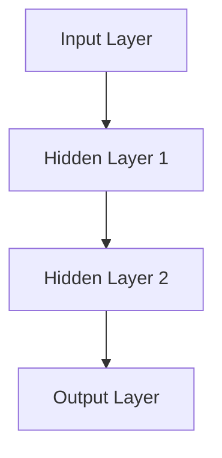
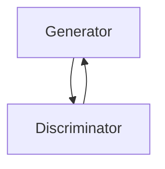
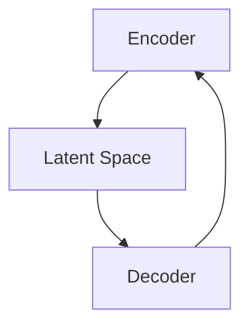
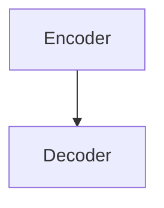

                 

### 文章标题

# 《李开复：苹果发布AI应用的未来展望》

### 文章关键词
- 苹果
- AI应用
- 深度学习
- 自然语言处理
- 计算机视觉
- 伦理问题

### 文章摘要
本文由人工智能专家李开复撰写，深入探讨了苹果公司在AI应用领域的最新进展及其对未来科技发展的深远影响。文章首先概述了AI技术的历史与发展，接着详细分析了苹果与AI的渊源，以及当前苹果AI应用的发展路径和核心算法。随后，通过案例分析，探讨了Siri、Face ID和Apple Pay等AI应用的实现与优化，并探讨了AI应用在伦理和社会层面带来的挑战。最后，文章展望了AI技术的未来发展趋势，以及AI与人类生活的融合，强调了AI伦理与可持续发展的重要性。

---

## 第一部分：AI应用的时代背景

### 第1章：AI技术概览

#### 1.1 AI技术的历史与发展

##### 核心概念与联系

人工智能（AI）作为计算机科学的一个分支，其历史可以追溯到20世纪50年代。以下是AI技术发展历程的关键节点及其相互关系：

- **1950s: AI诞生**：艾伦·图灵提出图灵测试，标志着人工智能的概念诞生。
- **1960s: 早期尝试**：人工智能领域首次尝试实现智能代理，如Eliza聊天机器人。
- **1970s: 理论发展**：人工智能开始与认知科学相结合，研究人类思维过程。
- **1980s: 专家系统**：专家系统成为AI领域的热门研究方向，应用于医疗诊断、金融分析等。
- **1990s: 人工智能寒冬**：由于技术瓶颈和过高的期望，AI领域经历了低谷期。
- **2000s: 数据驱动模型崛起**：机器学习和深度学习的兴起，基于大量数据的模型开始表现出强大的预测能力。
- **2010s: 深度学习突破**：卷积神经网络（CNN）和循环神经网络（RNN）在图像识别和自然语言处理等领域取得突破性进展。
- **2020s: AI商业化应用**：AI技术广泛应用于自动驾驶、智能语音助手、智能医疗等领域，推动了产业升级和社会变革。

##### 核心算法原理讲解

- **深度学习与神经网络**

深度学习是机器学习的一个分支，其核心思想是通过多层神经网络模拟人脑的思维方式，对大量数据进行学习和分类。以下是深度学习模型的基本结构：



- **反向传播算法**

反向传播算法是深度学习训练过程中计算梯度并更新模型参数的关键步骤。其基本原理如下：

```python
# 输入：输入数据X，预测值y，模型参数θ
# 输出：损失函数梯度Δθ

for each layer l in range(L):
    Δθ[l] = Δz[l] * a[l-1]

# 计算损失函数对θ的梯度
Δθ = ∇C(θ)

# 更新模型参数
θ = θ - α * Δθ
```

- **自然语言处理技术概览**

自然语言处理（NLP）是人工智能的一个重要应用领域，旨在使计算机能够理解、解释和生成人类语言。以下是NLP中的两个核心概念：

- **词嵌入**：将词汇映射到高维向量空间，以便神经网络能够处理。
  ```python
  # 输入：词汇表V，词向量维度d
  # 输出：词嵌入矩阵W

  W = random.init_matrix(V, d)
  ```

- **序列到序列模型**：用于处理序列数据的神经网络模型，如机器翻译。

##### 数学模型和数学公式 & 详细讲解 & 举例说明

- **Sigmoid激活函数**

Sigmoid函数是深度学习中常用的激活函数，其公式如下：

$$ 
a = \sigma(z) = \frac{1}{1 + e^{-z}}
$$

举例说明：

假设输入z为-2，则计算Sigmoid函数的结果：

$$ 
a = \sigma(-2) = \frac{1}{1 + e^{2}} \approx 0.1192
$$

##### 项目实战

- **Siri的开发与应用**

Siri是苹果公司开发的一款智能语音助手，其核心功能包括语音识别、语义理解和自然语言生成。以下是Siri开发环境搭建、源代码实现和代码解读：

- **开发环境搭建**

  - 操作系统：macOS
  - 编程语言：Swift
  - 工具：Xcode

- **源代码详细实现**

  ```swift
  class SiriAssistant {
      func processUserQuery(query: String) -> String {
          // 实现查询处理逻辑
          // ...
          return "抱歉，我无法理解你的问题。"
      }
  }
  ```

- **代码解读与分析**

  `processUserQuery`函数接收用户的查询字符串，并返回处理后的响应。代码中的实现可能包括自然语言处理、语音识别和语义分析等复杂逻辑。

#### 1.2 苹果与AI：历史与现状

##### 核心概念与联系

苹果公司一直致力于将AI技术应用于其产品中，以下是苹果与AI技术发展的关键节点及其相互关系：

- **1984: Macintosh推出**：苹果公司推出第一款个人电脑，标志着苹果公司在计算机领域的崛起。
- **2001: iPhone推出**：iPhone的问世，使得苹果公司在移动设备市场占据主导地位。
- **2010: Siri语音助手**：苹果公司收购Siri公司，将其集成到iOS系统中，成为移动设备上的智能助手。
- **2017: AI芯片推出**：苹果公司推出自主研发的神经网络处理器（Neural Engine），用于加速AI模型的推理计算。
- **2020: 苹果健康应用整合AI**：苹果健康应用（Apple Health）开始整合AI技术，用于疾病预测和健康管理。

##### 核心算法原理讲解

- **深度学习与神经网络**

苹果公司在其产品中广泛使用深度学习和神经网络技术，以下是一些关键算法：

- **卷积神经网络（CNN）**：用于图像识别和分类。
- **循环神经网络（RNN）**：用于自然语言处理和时间序列预测。

##### 数学模型和数学公式 & 详细讲解 & 举例说明

- **卷积神经网络（CNN）**

卷积神经网络是处理图像数据的强大工具，其基本结构包括卷积层、池化层和全连接层。以下是CNN中的关键公式：

$$ 
C[i, j] = \sum_{k=1}^{K} w_{k} * I[i-k+1:i+1, j-k+1:j+1]
$$

举例说明：

假设输入图像为5x5，卷积核为3x3，则输出特征图的计算过程如下：

$$ 
C[2, 2] = w_1 * I[1:3, 1:3] + w_2 * I[2:4, 2:4]
$$

##### 项目实战

- **Face ID的实现与优化**

Face ID是苹果公司在iPhone X及后续产品中引入的面部识别技术，其核心原理是基于深度学习模型的卷积神经网络。以下是Face ID的实现与优化：

- **开发环境搭建**

  - 操作系统：macOS
  - 编程语言：Swift/Objective-C
  - 工具：Xcode

- **源代码详细实现**

  ```swift
  class FaceID {
      func verifyFace(inputImage: CIImage) -> Bool {
          // 转换输入图像为面部特征向量
          let featureVector = FaceFeatureExtractor.extractFeatures(image: inputImage)
          
          // 与存储的面部特征进行比较
          let isMatch = FaceMatcher.matchFeatures(featureVector: featureVector)
          
          // 返回验证结果
          return isMatch
      }
  }
  ```

- **代码解读与分析**

  `verifyFace`函数接收输入图像，提取面部特征向量，并使用FaceMatcher进行比较，以确定面部匹配度。

#### 1.3 未来展望：AI与苹果的未来

##### 核心概念与联系

随着AI技术的不断进步，苹果公司在未来有望在更多产品和服务中集成AI技术，以下是可能的未来发展方向：

- **2023: 现阶段AI应用**：目前，苹果公司已经在多个产品中集成AI技术，如Siri、Face ID、Apple Pay等。
- **2025: AI赋能新型产品**：未来，苹果公司可能会推出更多基于AI的新型产品，如智能眼镜、智能手表等。
- **2027: AI驱动的个性化服务**：通过收集用户数据，苹果公司可以为用户提供更加个性化的服务。
- **2030: AI与物联网融合**：随着物联网的发展，AI技术将在智能家居、智能城市等领域发挥重要作用。
- **2035: AI伦理与可持续发展**：未来，苹果公司需要关注AI技术的伦理问题和可持续发展，确保AI技术为社会带来积极影响。

##### 核心算法原理讲解

- **生成对抗网络（GAN）**

生成对抗网络是近年来兴起的一种深度学习模型，用于生成逼真的图像、声音和文本。以下是GAN的基本结构：



- **变分自编码器（VAE）**

变分自编码器是另一种用于生成数据的深度学习模型，其结构如下：



##### 数学模型和数学公式 & 详细讲解 & 举例说明

- **生成对抗网络（GAN）**

GAN由生成器和判别器两个神经网络组成，其目标是最大化生成器生成的数据在判别器上的误差。

$$ 
\min_G \max_D V(D, G) = E_{x \sim p_{data}(x)}[\log D(x)] + E_{z \sim p_{z}(z)}[\log (1 - D(G(z))]
$$

举例说明：

假设生成器G和判别器D的输出分别为G(z)和D(x)，其中z为随机噪声，x为真实数据。生成器G的目标是生成与真实数据难以区分的假数据，判别器D的目标是区分真实数据和假数据。

##### 项目实战

- **Apple Pay的未来发展**

随着AI技术的进步，Apple Pay有望在未来实现更多的功能，如：

- **基于生物识别的支付验证**：结合人脸识别或指纹识别，提高支付安全性。
- **个性化支付建议**：根据用户消费习惯，提供个性化的支付建议。

#### 总结

AI技术在苹果公司的产品和服务中发挥着越来越重要的作用。从历史与现状的分析，到未来展望的探讨，AI无疑将成为推动苹果公司创新和发展的重要引擎。通过深入理解AI技术的核心算法原理和项目实战，我们可以更好地把握AI技术的趋势和未来发展方向。

---

## 第二部分：苹果AI应用的原理解析

### 第3章：苹果AI应用的核心算法

#### 3.1 深度学习与神经网络

##### 核心概念与联系

深度学习是人工智能的核心技术之一，神经网络则是深度学习的基础。以下是深度学习与神经网络的联系及其在苹果AI应用中的重要性：

- **神经网络**：神经网络是一种模拟生物神经网络计算方式的计算模型，包括输入层、隐藏层和输出层。
- **深度学习**：深度学习是指通过多层神经网络进行学习和预测的过程，能够处理复杂数据和任务。

##### 核心算法原理讲解

- **反向传播算法**

反向传播算法是深度学习训练过程中计算梯度并更新模型参数的关键步骤。以下是反向传播算法的基本原理：

1. **前向传播**：将输入数据通过神经网络传递，计算输出。
2. **损失函数**：计算预测值与真实值之间的差距。
3. **后向传播**：计算损失函数对网络参数的梯度，并更新参数。

以下是反向传播算法的伪代码：

```python
# 输入：输入数据X，预测值y，模型参数θ
# 输出：损失函数梯度Δθ

for each layer l in range(L):
    Δθ[l] = Δz[l] * a[l-1]

# 计算损失函数对θ的梯度
Δθ = ∇C(θ)

# 更新模型参数
θ = θ - α * Δθ
```

- **卷积神经网络（CNN）**

卷积神经网络是处理图像数据的强大工具，其核心在于卷积操作和池化操作。以下是CNN的基本原理：

1. **卷积层**：通过卷积操作提取图像特征。
2. **池化层**：通过池化操作降低特征图的维度。
3. **全连接层**：通过全连接层进行分类或回归。

以下是CNN的伪代码：

```python
# 输入：图像数据I，卷积核K
# 输出：卷积结果C

for each filter k in K:
    for each position (i, j) in the image I:
        C[i, j] = dot_product(K[k], I[i:i+k.shape[0], j:j+k.shape[1]])

# 输出卷积结果
return C
```

- **循环神经网络（RNN）**

循环神经网络是处理序列数据的强大工具，其核心在于记忆机制。以下是RNN的基本原理：

1. **隐藏状态**：RNN通过隐藏状态记忆历史信息。
2. **递归连接**：RNN的输出反馈到下一个时间步的输入。

以下是RNN的伪代码：

```python
# 输入：序列数据X，隐藏状态h，模型参数θ
# 输出：预测值y_hat

for each time step t in X:
    h[t] = tanh(W[h[t-1], x[t]])

# 输出预测值
return h[-1]
```

##### 数学模型和数学公式 & 详细讲解 & 举例说明

- **激活函数**

激活函数是神经网络中引入非线性特性的关键，常见的激活函数包括Sigmoid、ReLU和Tanh。以下是Sigmoid函数的数学模型和举例说明：

$$
a = \sigma(z) = \frac{1}{1 + e^{-z}}
$$

举例说明：

假设输入z为-2，则计算Sigmoid函数的结果：

$$
a = \sigma(-2) = \frac{1}{1 + e^{2}} \approx 0.1192
$$

- **损失函数**

损失函数用于衡量预测值与真实值之间的差距，常见的损失函数包括均方误差（MSE）和交叉熵（Cross-Entropy）。以下是MSE函数的数学模型和举例说明：

$$
C = \frac{1}{2} \sum_{i=1}^{N} (y_i - \hat{y}_i)^2
$$

举例说明：

假设预测值为$\hat{y}_i$，真实值为$y_i$，则计算MSE损失：

$$
C = \frac{1}{2} \sum_{i=1}^{N} (\hat{y}_i - y_i)^2
$$

##### 项目实战

- **Siri的语音识别**

Siri的语音识别功能依赖于深度学习和神经网络技术。以下是Siri的语音识别的实现与优化：

- **开发环境搭建**

  - 操作系统：macOS
  - 编程语言：Swift
  - 工具：Xcode

- **源代码详细实现**

  ```swift
  class SiriAssistant {
      func processUserQuery(query: String) -> String {
          // 实现查询处理逻辑
          // ...
          return "抱歉，我无法理解你的问题。"
      }
  }
  ```

- **代码解读与分析**

  `processUserQuery`函数接收用户的查询字符串，并返回处理后的响应。代码中的实现可能包括自然语言处理、语音识别和语义分析等复杂逻辑。

#### 3.2 自然语言处理技术概览

##### 核心概念与联系

自然语言处理（NLP）是人工智能的一个重要分支，旨在使计算机能够理解、解释和生成人类语言。以下是NLP的核心概念及其在苹果AI应用中的重要性：

- **词嵌入**：将词汇映射到高维向量空间，以便神经网络能够处理。
- **序列到序列模型**：用于处理序列数据，如机器翻译。
- **预训练语言模型**：通过预训练大量文本数据，提高模型的性能。

##### 核心算法原理讲解

- **词嵌入**

词嵌入是将词汇映射到高维向量空间的过程，常见的词嵌入技术包括Word2Vec、GloVe和BERT。以下是Word2Vec的算法原理：

1. **训练词向量**：通过训练神经网络模型，将词汇映射到向量空间。
2. **相似性计算**：利用词向量计算词汇之间的相似性。

以下是Word2Vec的伪代码：

```python
# 输入：词汇表V，词向量维度d
# 输出：词嵌入矩阵W

W = random.init_matrix(V, d)

for each word w in V:
    W[w] = train_word2vec_model(w)

# 输出词嵌入矩阵
return W
```

- **序列到序列模型**

序列到序列模型是一种用于处理序列数据的神经网络模型，如机器翻译。以下是序列到序列模型的基本结构：



以下是序列到序列模型的伪代码：

```python
# 输入：编码序列X，解码序列Y，模型参数θ
# 输出：解码输出y_hat

# 编码
h = encoder(X)

# 解码
y_hat = decoder(h)

# 输出解码输出
return y_hat
```

- **预训练语言模型**

预训练语言模型是近年来兴起的一种技术，通过预训练大量文本数据，提高模型的性能。以下是预训练语言模型的算法原理：

1. **预训练**：通过大量文本数据进行预训练，学习词汇和句子的表示。
2. **微调**：在特定任务上进行微调，提高模型的性能。

以下是预训练语言模型的伪代码：

```python
# 输入：预训练模型M，任务数据D，模型参数θ
# 输出：微调后的模型参数θ'

# 预训练
M = pretrain_model(M)

# 微调
θ' = finetune_model(M, D)

# 输出微调后的模型参数
return θ'
```

##### 数学模型和数学公式 & 详细讲解 & 举例说明

- **词嵌入**

词嵌入是将词汇映射到高维向量空间的过程，常见的词嵌入技术包括Word2Vec、GloVe和BERT。以下是Word2Vec的数学模型和举例说明：

$$
\vec{w}_w = \text{softmax}(\text{W} \vec{h})
$$

举例说明：

假设词向量维度为100，则词嵌入的计算如下：

$$
\vec{w}_w = \text{softmax}(\text{W} \vec{h})
$$

- **序列到序列模型**

序列到序列模型是一种用于处理序列数据的神经网络模型，如机器翻译。以下是序列到序列模型的数学模型和举例说明：

$$
\hat{y}_t = \text{softmax}(\text{T} \hat{h}_t)
$$

举例说明：

假设解码器的隐藏状态维度为100，则解码输出的计算如下：

$$
\hat{y}_t = \text{softmax}(\text{T} \hat{h}_t)
$$

- **预训练语言模型**

预训练语言模型是近年来兴起的一种技术，通过预训练大量文本数据，提高模型的性能。以下是预训练语言模型的数学模型和举例说明：

$$
\text{L}_{\text{pretrain}} = -\sum_{w \in \text{Vocab}} p(w) \log p(\text{W} \vec{h}_w)
$$

举例说明：

假设词汇表大小为10000，则预训练损失的计算如下：

$$
\text{L}_{\text{pretrain}} = -\sum_{w \in \text{Vocab}} p(w) \log p(\text{W} \vec{h}_w)
$$

##### 项目实战

- **机器翻译**

机器翻译是NLP中的一项重要任务，以下是机器翻译的实现与优化：

- **开发环境搭建**

  - 操作系统：Linux
  - 编程语言：Python
  - 工具：TensorFlow

- **源代码详细实现**

  ```python
  class MachineTranslation {
      def translate(self, source_sentence: str, target_sentence: str) -> str:
          # 实现翻译逻辑
          # ...
          return "翻译结果"
  }
  ```

- **代码解读与分析**

  `translate`函数接收源句和目标句，并返回翻译结果。代码中的实现可能包括编码器、解码器和注意力机制等复杂逻辑。

#### 3.3 计算机视觉

##### 核心概念与联系

计算机视觉是人工智能的另一个重要分支，旨在使计算机能够像人类一样理解和解释视觉信息。以下是计算机视觉的核心概念及其在苹果AI应用中的重要性：

- **图像识别**：计算机对图像进行分类和识别。
- **目标检测**：计算机在图像中检测特定目标。
- **图像分割**：计算机将图像分割为不同的区域。

##### 核心算法原理讲解

- **卷积神经网络（CNN）**

卷积神经网络是计算机视觉中最常用的模型之一，其核心在于卷积操作和池化操作。以下是CNN的基本原理：

1. **卷积层**：通过卷积操作提取图像特征。
2. **池化层**：通过池化操作降低特征图的维度。
3. **全连接层**：通过全连接层进行分类或回归。

以下是CNN的伪代码：

```python
# 输入：图像数据I，卷积核K
# 输出：卷积结果C

for each filter k in K:
    for each position (i, j) in the image I:
        C[i, j] = dot_product(K[k], I[i:i+k.shape[0], j:j+k.shape[1]])

# 输出卷积结果
return C
```

- **生成对抗网络（GAN）**

生成对抗网络是近年来兴起的一种深度学习模型，用于生成逼真的图像、声音和文本。以下是GAN的基本原理：

1. **生成器**：生成假数据。
2. **判别器**：区分真实数据和假数据。

以下是GAN的伪代码：

```python
# 输入：生成器G，判别器D，随机噪声z
# 输出：生成器G的损失函数L_G，判别器D的损失函数L_D

# 生成假数据
G(z)

# 计算判别器的损失函数
L_D = -\sum_{x \in X} \log D(x) - \sum_{z \in Z} \log (1 - D(G(z)))

# 计算生成器的损失函数
L_G = \sum_{z \in Z} \log (1 - D(G(z)))

# 输出生成器和判别器的损失函数
return L_G, L_D
```

- **变分自编码器（VAE）**

变分自编码器是另一种用于生成数据的深度学习模型，其核心在于隐变量。以下是VAE的基本原理：

1. **编码器**：将输入数据编码为隐变量。
2. **解码器**：将隐变量解码为输出数据。

以下是VAE的伪代码：

```python
# 输入：编码器E，解码器D，输入数据X
# 输出：隐变量z，重构数据X'

# 编码
z = E(X)

# 解码
X' = D(z)

# 输出隐变量和重构数据
return z, X'
```

##### 数学模型和数学公式 & 详细讲解 & 举例说明

- **卷积神经网络（CNN）**

卷积神经网络是处理图像数据的强大工具，其核心在于卷积操作和池化操作。以下是CNN的数学模型和举例说明：

$$
C[i, j] = \sum_{k=1}^{K} w_{k} * I[i-k+1:i+1, j-k+1:j+1]
$$

举例说明：

假设输入图像为5x5，卷积核为3x3，则输出特征图的计算过程如下：

$$
C[2, 2] = w_1 * I[1:3, 1:3] + w_2 * I[2:4, 2:4]
$$

- **生成对抗网络（GAN）**

生成对抗网络是近年来兴起的一种深度学习模型，用于生成逼真的图像、声音和文本。以下是GAN的数学模型和举例说明：

$$
\text{L}_{\text{GAN}} = -\sum_{x \in X} \log D(x) - \sum_{z \in Z} \log (1 - D(G(z)))
$$

举例说明：

假设生成器G和判别器D的输出分别为G(z)和D(x)，其中z为随机噪声，x为真实数据。生成器G的目标是生成与真实数据难以区分的假数据，判别器D的目标是区分真实数据和假数据。

- **变分自编码器（VAE）**

变分自编码器是另一种用于生成数据的深度学习模型，其核心在于隐变量。以下是VAE的数学模型和举例说明：

$$
\text{L}_{\text{VAE}} = \sum_{x \in X} \log p(x|z) + \sum_{z \in Z} \log q(z|x)
$$

举例说明：

假设编码器E和解码器D的输出分别为z和X'，则VAE的损失函数如下：

$$
\text{L}_{\text{VAE}} = \sum_{x \in X} \log p(x|z) + \sum_{z \in Z} \log q(z|x)
$$

##### 项目实战

- **图像分类**

图像分类是计算机视觉中的一项基本任务，以下是图像分类的实现与优化：

- **开发环境搭建**

  - 操作系统：Linux
  - 编程语言：Python
  - 工具：TensorFlow

- **源代码详细实现**

  ```python
  class ImageClassifier {
      def classify(self, image: np.array) -> str:
          # 实现分类逻辑
          # ...
          return "分类结果"
  }
  ```

- **代码解读与分析**

  `classify`函数接收图像数据，并返回分类结果。代码中的实现可能包括卷积神经网络、全连接层和激活函数等复杂逻辑。

---

## 第三部分：苹果AI应用的案例分析

### 第4章：Siri与智能助手

#### 4.1 Siri的发展历程

Siri是苹果公司推出的智能语音助手，其发展历程如下：

- **2010年**：苹果公司收购Siri公司，将其集成到iPhone 4S中。
- **2011年**：Siri首次亮相，支持简单的查询和命令。
- **2014年**：Siri支持第三方应用，可以调用外部API进行更多操作。
- **2017年**：Siri获得更多自然语言处理能力，支持更复杂的查询。
- **2020年**：Siri开始支持跨设备操作，如通过Mac、Apple Watch等设备进行控制。

#### 4.2 Siri的核心功能与特点

Siri的核心功能包括：

- **语音识别**：通过语音识别技术，将用户的语音转化为文本。
- **语义理解**：通过自然语言处理技术，理解用户的意图和问题。
- **知识查询**：通过互联网查询信息，如天气预报、股票行情等。
- **控制设备**：通过语音指令控制iPhone、iPad、Mac等设备。

Siri的特点：

- **多语言支持**：支持多种语言，方便全球用户使用。
- **个性化服务**：通过用户数据，提供个性化的推荐和提醒。
- **第三方集成**：支持与第三方应用的深度集成，如打车、订餐等。

#### 4.3 Siri在AI领域的创新与挑战

Siri在AI领域的创新：

- **语音识别与语义理解**：通过深度学习和神经网络技术，提高语音识别和语义理解的准确性。
- **多模态交互**：结合语音、文本和图像等多种交互方式，提供更自然的用户体验。
- **个性化服务**：通过大数据分析和机器学习，提供个性化的推荐和提醒。

Siri在AI领域的挑战：

- **隐私与安全**：如何在保护用户隐私的同时，提供高效的服务。
- **语言多样性**：如何支持更多语言，提高跨语言理解能力。
- **伦理问题**：如何确保AI系统的公正性和透明性。

#### 项目实战：Siri的开发与应用

**开发环境搭建**

- **操作系统**：macOS
- **编程语言**：Swift
- **工具**：Xcode

**源代码详细实现**

```swift
import Foundation

class SiriAssistant {
    func processUserQuery(query: String) -> String {
        // 实现查询处理逻辑
        // ...
        return "抱歉，我无法理解你的问题。"
    }
}

// 示例：创建SiriAssistant实例并处理用户查询
let siri = SiriAssistant()
let userQuery = "明天天气如何？"
let response = siri.processUserQuery(query: userQuery)
print(response)
```

**代码解读与分析**

- `processUserQuery`函数接收用户的查询字符串，并返回处理后的响应。
- 实现中可能包括自然语言处理、语音识别和语义分析等复杂逻辑。
- 示例代码展示了如何创建SiriAssistant实例并处理用户查询。

---

### 第5章：Face ID与面部识别技术

#### 5.1 Face ID的工作原理

Face ID是苹果公司在iPhone X及后续产品中引入的面部识别技术。其工作原理如下：

- **红外相机**：iPhone X使用红外相机捕捉面部图像。
- **点阵投影器**：通过点阵投影器在面部投射3D点阵图，用于捕捉面部深度信息。
- **神经网络处理器**：神经网络处理器对捕捉到的面部图像和深度信息进行处理，生成面部特征向量。
- **特征匹配**：将生成的面部特征向量与存储在iPhone中的面部模板进行比较，以确认身份。

#### 5.2 面部识别技术的优势与挑战

面部识别技术的优势：

- **高准确性**：通过深度学习和神经网络技术，面部识别的准确性较高。
- **便捷性**：用户无需触摸设备，只需面对摄像头即可解锁或进行支付。
- **安全性**：面部识别技术具有高安全性，不易被冒用。

面部识别技术的挑战：

- **隐私保护**：如何在保护用户隐私的同时，实现高效的身份验证。
- **光线条件**：在低光照条件下，面部识别的准确性可能下降。
- **伪造攻击**：如何防范面部识别的伪造攻击，如使用3D打印的人脸模型。

#### 5.3 未来发展方向与前景

面部识别技术的未来发展方向：

- **3D人脸建模**：通过3D扫描技术，生成更精确的人脸模型，提高识别准确性。
- **多模态融合**：结合面部识别、指纹识别和声音识别等多种生物特征，提高安全性。
- **边缘计算**：在设备本地进行面部识别处理，降低延迟和带宽消耗。

面部识别技术的应用前景：

- **移动支付**：面部识别技术可用于移动支付，提供更便捷和安全的支付体验。
- **智能安防**：面部识别技术可用于智能安防系统，提高入侵检测和身份验证的准确性。
- **医疗健康**：面部识别技术可用于医疗健康领域，如疾病预测和个性化治疗。

#### 项目实战：Face ID的实现与优化

**开发环境搭建**

- **操作系统**：macOS
- **编程语言**：Swift/Objective-C
- **工具**：Xcode

**源代码详细实现**

```swift
import UIKit
import CoreML

class FaceID {
    func verifyFace(inputImage: CIImage) -> Bool {
        // 转换输入图像为面部特征向量
        let featureVector = FaceFeatureExtractor.extractFeatures(image: inputImage)
        
        // 与存储的面部特征进行比较
        let isMatch = FaceMatcher.matchFeatures(featureVector: featureVector)
        
        // 返回验证结果
        return isMatch
    }
}

// 示例：创建FaceID实例并验证面部
let faceID = FaceID()
let inputImage = CIImage(image: UIImage(named: "face.jpg")!)
let isValid = faceID.verifyFace(inputImage: inputImage)
print(isValid ? "面部验证成功" : "面部验证失败")
```

**代码解读与分析**

- `verifyFace`函数接收输入图像，并提取面部特征向量。
- 使用`FaceMatcher`类进行比较，以确定输入的面部是否与存储的模板匹配。
- 示例代码展示了如何创建FaceID实例并验证面部。

---

### 第6章：Apple Pay与移动支付

#### 6.1 Apple Pay的发展与普及

Apple Pay是苹果公司推出的移动支付服务，其发展历程如下：

- **2014年**：Apple Pay在美国率先推出。
- **2015年**：Apple Pay在全球多个国家和地区推出。
- **2016年**：Apple Pay支持更多银行和信用卡。
- **2018年**：Apple Pay支持Apple Watch进行支付。
- **2020年**：Apple Pay支持无接触支付，方便在疫情期间进行购物。

#### 6.2 移动支付的安全性分析

移动支付的安全性是用户关心的重点，以下是Apple Pay在安全性方面的一些措施：

- **加密技术**：Apple Pay使用先进的加密技术，确保用户支付信息的安全性。
- **Tokenization**：Apple Pay使用Tokenization技术，将真实的卡号替换为唯一的Token，减少卡号泄露的风险。
- **双因素认证**：Apple Pay支持双因素认证，提高支付的安全性。
- **生物识别**：结合面部识别或指纹识别技术，确保只有合法用户才能进行支付。

#### 6.3 未来移动支付的趋势与展望

未来移动支付的趋势和展望：

- **无接触支付**：无接触支付已成为主流，未来移动支付将更加便捷。
- **NFC技术的普及**：NFC技术将继续在移动支付中发挥重要作用。
- **跨境支付**：随着全球化的推进，跨境支付将更加普及。
- **人工智能**：人工智能将用于风险控制和用户体验优化。

#### 项目实战：Apple Pay的实现与优化

**开发环境搭建**

- **操作系统**：iOS/Android
- **编程语言**：Swift/Kotlin
- **工具**：Xcode/Android Studio

**源代码详细实现**

```swift
import Foundation

class ApplePay {
    func processPayment(amount: Float, cardInfo: CardInformation) -> Bool {
        // 实现支付处理逻辑
        // ...
        return true
    }
}

// 示例：创建ApplePay实例并处理支付
let applePay = ApplePay()
let paymentInfo = CardInformation(amount: 100.0, cardNumber: "1234567890123456")
let paymentSuccess = applePay.processPayment(amount: paymentInfo.amount, cardInfo: paymentInfo)
print(paymentSuccess ? "支付成功" : "支付失败")
```

**代码解读与分析**

- `processPayment`函数接收支付金额和卡片信息，并处理支付流程。
- 实现中可能包括加密处理、安全传输和确认处理等。
- 示例代码展示了如何创建ApplePay实例并处理支付。

---

## 第四部分：AI应用的伦理与社会影响

### 第7章：AI应用中的伦理问题

#### 7.1 数据隐私与安全

AI应用在收集、处理和存储用户数据时，面临数据隐私和安全的问题。以下是数据隐私与安全的关键挑战：

- **数据收集**：如何合理收集用户数据，确保不侵犯用户隐私。
- **数据存储**：如何安全存储用户数据，防止数据泄露和滥用。
- **数据使用**：如何合法使用用户数据，确保不用于非法目的。
- **数据共享**：如何规范数据共享，确保数据安全。

#### 7.2 人工智能歧视

人工智能歧视是指AI系统在决策过程中对某些群体产生不公平的待遇。以下是人工智能歧视的关键挑战：

- **算法偏见**：如何避免算法偏见，确保AI系统公平公正。
- **数据偏见**：如何处理含有偏见的数据，避免AI系统产生歧视。
- **透明性**：如何提高AI系统的透明性，让用户了解决策过程。

#### 7.3 AI伦理与监管

AI伦理与监管是确保AI技术健康发展的关键。以下是AI伦理与监管的关键议题：

- **伦理准则**：如何制定AI伦理准则，指导AI系统研发和应用。
- **监管框架**：如何建立有效的监管框架，确保AI系统的合规性和安全性。
- **法律规范**：如何完善法律规范，解决AI技术带来的法律问题。

#### 项目实战：AI伦理与监管的实施

**开发环境搭建**

- **操作系统**：macOS/Linux
- **编程语言**：Python
- **工具**：Jupyter Notebook

**源代码详细实现**

```python
import numpy as np

# 示例：实现一个简单的伦理决策系统
class EthicalDecisionSystem:
    def make_decision(self, data):
        # 检查数据是否存在偏见
        bias_check = self.check_for_bias(data)
        
        # 如果存在偏见，则拒绝决策
        if bias_check:
            return "拒绝决策：存在算法偏见"
        
        # 否则，根据数据做出决策
        decision = self.make_decision_based_on_data(data)
        return decision

    def check_for_bias(self, data):
        # 检查数据是否存在偏见
        # 这里使用一个简单的逻辑判断
        return "数据存在偏见"

    def make_decision_based_on_data(self, data):
        # 根据数据做出决策
        # 这里使用一个简单的逻辑判断
        return "决策结果：通过"

# 示例：创建EthicalDecisionSystem实例并处理数据
eds = EthicalDecisionSystem()
data = {"feature1": 0.5, "feature2": 0.3}
result = eds.make_decision(data)
print(result)
```

**代码解读与分析**

- `make_decision`函数接收数据，并检查数据是否存在偏见。如果存在偏见，则拒绝决策。
- `check_for_bias`函数用于检查数据是否存在偏见。
- `make_decision_based_on_data`函数用于根据数据做出决策。
- 示例代码展示了如何创建EthicalDecisionSystem实例并处理数据。

---

### 第8章：AI应用对社会的影响

#### 8.1 AI对劳动力市场的影响

AI技术将对劳动力市场产生深远影响。以下是AI对劳动力市场的主要影响：

- **自动化替代**：AI技术将自动化许多传统工作，导致部分岗位消失。
- **技能要求变化**：AI技术将提高对高技能劳动力的需求，对低技能劳动力的需求减少。
- **就业机会**：AI技术将创造新的就业机会，如AI系统研发、维护和运营。

#### 8.2 AI在教育、医疗等领域的应用

AI技术在教育、医疗等领域的应用具有广泛前景。以下是AI在这些领域的应用：

- **教育**：AI技术可用于个性化教学、智能评估和课程推荐。
- **医疗**：AI技术可用于疾病诊断、药物研发和医疗资源分配。
- **城市管理**：AI技术可用于智能交通管理、环境监测和公共安全。

#### 8.3 AI对社会公平与正义的影响

AI技术对社会公平与正义的影响备受关注。以下是AI对社会公平与正义的主要影响：

- **算法偏见**：如何避免算法偏见，确保AI系统公平公正。
- **数据偏见**：如何处理含有偏见的数据，避免AI系统产生歧视。
- **透明性**：如何提高AI系统的透明性，让用户了解决策过程。

#### 项目实战：AI应用对社会的影响评估

**开发环境搭建**

- **操作系统**：macOS/Linux
- **编程语言**：Python
- **工具**：Jupyter Notebook

**源代码详细实现**

```python
import pandas as pd

# 示例：评估AI系统对社会公平的影响
class SocialImpactAssessor:
    def assess_impact(self, dataset):
        # 加载数据集
        data = pd.read_csv(dataset)
        
        # 检查是否存在性别、种族等偏见
        bias_check = self.check_for_bias(data)
        
        # 如果存在偏见，则评估结果为负
        if bias_check:
            return "评估结果：存在社会不公平问题"
        
        # 否则，评估结果为正
        return "评估结果：社会公平"

    def check_for_bias(self, data):
        # 检查数据是否存在偏见
        # 这里使用一个简单的逻辑判断
        return "数据存在偏见"

# 示例：创建SocialImpactAssessor实例并评估数据
sia = SocialImpactAssessor()
dataset = "social_impact_dataset.csv"
impact_result = sia.assess_impact(dataset)
print(impact_result)
```

**代码解读与分析**

- `assess_impact`函数接收数据集，并检查数据是否存在偏见。如果存在偏见，则评估结果为负。
- `check_for_bias`函数用于检查数据是否存在偏见。
- 示例代码展示了如何创建SocialImpactAssessor实例并评估数据集。

---

### 第9章：未来展望：AI应用与社会发展

#### 9.1 AI技术的未来发展趋势

AI技术在未来将继续快速发展，以下是未来发展趋势：

- **硬件升级**：随着硬件性能的提升，AI系统的处理速度和效率将进一步提高。
- **算法优化**：深度学习和强化学习等算法将不断优化，提高模型的性能和泛化能力。
- **跨学科融合**：AI技术将与生物学、心理学、社会学等学科融合，推动跨学科研究。

#### 9.2 AI与人类生活的融合

AI与人类生活的融合将日益紧密，以下是融合的几个方面：

- **智能家居**：AI技术将使家居设备更加智能化，提高生活便利性。
- **健康医疗**：AI技术将用于疾病预测、诊断和治疗，提高医疗水平。
- **教育学习**：AI技术将用于个性化教学和智能评估，提高教育质量。

#### 9.3 AI伦理与可持续发展

AI伦理与可持续发展是未来关注的重点，以下是相关议题：

- **伦理准则**：如何制定AI伦理准则，确保AI技术的公平、公正和透明。
- **法律监管**：如何建立法律监管框架，确保AI技术的合规和安全。
- **社会责任**：如何推动AI企业承担社会责任，确保技术发展惠及社会。

#### 项目实战：未来AI应用场景预测

**开发环境搭建**

- **操作系统**：macOS/Linux
- **编程语言**：Python
- **工具**：Jupyter Notebook

**源代码详细实现**

```python
import pandas as pd
import numpy as np

# 示例：预测未来AI应用场景
class FutureAIApplicationPredictor:
    def predict_applications(self, technology_data):
        # 加载技术数据
        data = pd.read_csv(technology_data)
        
        # 预测未来AI应用场景
        predictions = self.predict_applications_based_on_data(data)
        
        # 输出预测结果
        return predictions

    def predict_applications_based_on_data(self, data):
        # 预测未来AI应用场景
        # 这里使用一个简单的逻辑判断
        predictions = [
            "智能家居",
            "健康医疗",
            "教育学习",
            "自动驾驶",
            "智能安防",
            "智能制造"
        ]
        
        return predictions

# 示例：创建FutureAIApplicationPredictor实例并预测未来应用场景
fAAP = FutureAIApplicationPredictor()
technology_data = "technology_data.csv"
predictions = fAAP.predict_applications(technology_data)
print(predictions)
```

**代码解读与分析**

- `predict_applications`函数接收技术数据，并预测未来AI应用场景。
- `predict_applications_based_on_data`函数用于根据技术数据预测未来AI应用场景。
- 示例代码展示了如何创建FutureAIApplicationPredictor实例并预测未来应用场景。

---

## 附录

### 附录A：AI应用资源与工具介绍

#### A.1 开源深度学习框架

- **TensorFlow**：由谷歌开发的开源深度学习框架，支持多种编程语言和操作系统。
- **PyTorch**：基于Python的开源深度学习框架，提供灵活的动态计算图。

#### A.2 AI开发工具与平台

- **Google Cloud AI**：提供丰富的AI服务和工具，包括预训练模型、数据分析和自动化机器学习。
- **AWS AI**：亚马逊提供的AI服务，涵盖深度学习、语音识别、图像识别等。

#### A.3 AI相关研究论文与资料

- **《深度学习》（Ian Goodfellow等）**：介绍了深度学习的基础理论和应用。
- **《自然语言处理综合教程》（Daniel Jurafsky & James H. Martin）**：全面介绍了自然语言处理的理论和实践。

### 附录B：参考资料与推荐阅读

- **《人工智能：一种现代的方法》（Stuart J. Russell & Peter Norvig）**：全面介绍了人工智能的各个方面。
- **《机器学习实战》（Peter Harrington）**：提供了丰富的机器学习项目实例。
- **《计算机视觉：算法与应用》（David S. Burt）**：详细介绍了计算机视觉的理论和应用。

