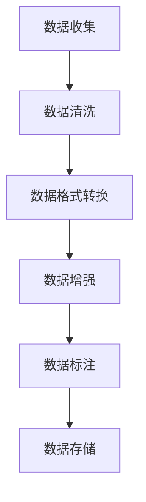
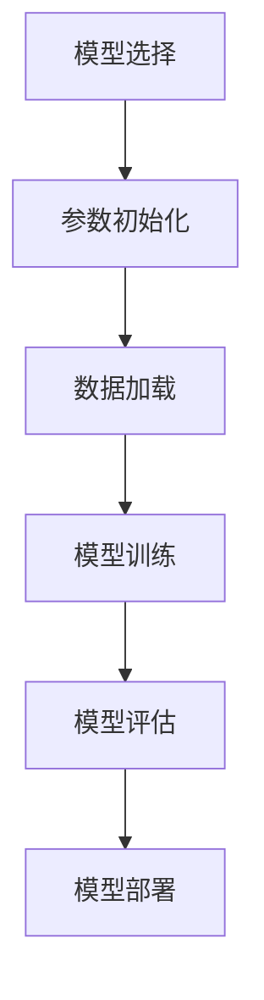
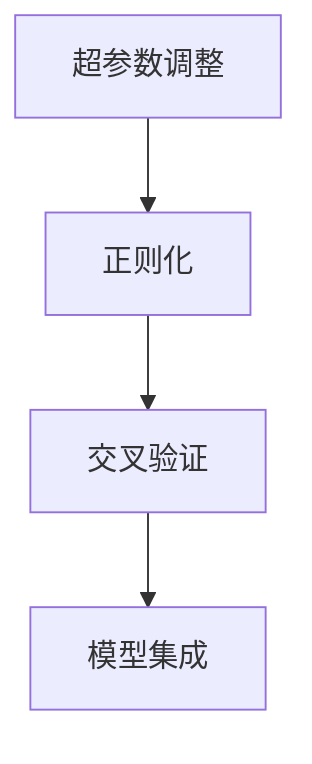
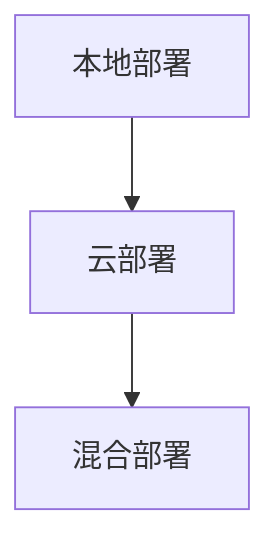
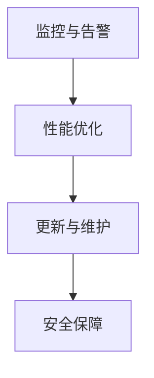
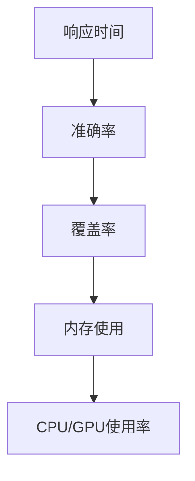

                 

# 李开复：苹果发布AI应用的用户

> **关键词：** 李开复，苹果，AI应用，用户体验，技术实现，未来趋势

> **摘要：** 本文将深入探讨李开复对苹果发布AI应用的看法，分析苹果AI应用的用户群体、核心技术与原理，以及这些应用在苹果产品中的实际应用情况。通过一系列实例和深入讲解，本文旨在为读者提供关于AI应用在苹果产品中的全面了解，并展望其未来发展趋势。

### 第一部分：李开复：苹果发布AI应用的用户

#### 第1章：李开复与AI应用概述

##### 1.1 李开复：AI领域的先驱者

###### 1.1.1 李开复的背景与成就

李开复，美籍华人，被誉为“AI天才”。他是世界知名的人工智能专家、创新者和投资者，拥有计算机科学博士学位。李开复在人工智能领域的研究和应用广泛，涵盖了机器学习、自然语言处理、语音识别等多个方向。

他在Google期间领导了谷歌中日韩文搜索引擎的研发工作，推动了谷歌在亚洲市场的扩张。他还曾在微软研究院担任首席研究员，领导了多个重要的人工智能项目。李开复还致力于推动人工智能技术的普及和商业化，他创办了创新工场，致力于投资和孵化AI初创公司。

###### 1.1.2 李开复对AI领域的贡献

李开复在AI领域的贡献是多方面的。首先，他在机器学习和深度学习领域发表了大量有影响力的论文，提出了许多重要的算法和理论。其次，他积极参与AI技术的商业化应用，将AI技术引入到多个行业，如金融、医疗、教育等，推动了AI技术的实际应用。

此外，李开复还致力于普及AI知识，通过出版多本关于AI的书籍和开设公开课，让更多的人了解和学习AI技术。他坚信，AI技术的发展和应用将深刻改变人类社会，提高人们的生活质量。

###### 1.1.3 李开复与苹果公司

李开复与苹果公司有着密切的联系。他曾在苹果公司担任高级研究员，参与了苹果多项AI技术的研究和开发。他对苹果公司的AI战略有着深刻的理解，并一直关注苹果在AI领域的最新进展。

李开复认为，苹果公司在AI领域的布局和战略非常明智。苹果不仅将AI技术应用于其产品中，如iPhone、iPad和MacBook，还积极研发新的AI技术，如增强现实（AR）和虚拟现实（VR）。他相信，苹果将在未来的AI竞争中占据重要地位。

##### 1.2 苹果发布AI应用的用户

###### 1.2.1 AI应用发布背后的用户洞察

苹果发布AI应用的用户群体广泛，涵盖了从普通消费者到专业人士。以下是对不同用户群体的分析：

1. **普通消费者**：他们通常是苹果产品的忠实用户，对新技术有着浓厚的兴趣。他们希望通过AI应用提升日常生活体验，如使用语音助手进行语音搜索、智能推荐音乐和电影等。

2. **专业人士**：他们包括设计师、开发者、工程师等，对AI技术在专业领域的应用有着浓厚的兴趣。他们希望通过AI应用提升工作效率，如智能助手自动整理文档、分析市场数据等。

3. **研究人员和开发者**：他们对AI技术有着深入的了解，关注AI领域的最新研究动态。他们希望通过苹果的AI应用了解和体验最新的AI技术，同时也为AI技术的发展提供反馈。

###### 1.2.2 用户对AI应用的需求分析

用户对AI应用的需求主要集中在以下几个方面：

1. **便捷性**：用户希望AI应用能够简化操作，提供便捷的服务，如语音助手一键操作。

2. **个性化**：用户希望AI应用能够根据个人喜好和需求提供个性化的服务，如智能推荐音乐、电影等。

3. **高效性**：用户希望AI应用能够提高工作效率，如自动整理文档、分析数据等。

4. **安全性**：用户对AI应用的安全性非常关注，希望其能够保护个人隐私和数据安全。

###### 1.2.3 用户使用AI应用的体验与反馈

用户对苹果AI应用的体验总体来说较为积极。以下是对用户使用体验和反馈的分析：

1. **正面反馈**：用户普遍认为苹果的AI应用易于使用，功能强大，提升了生活和工作效率。他们特别喜欢语音助手和智能推荐功能，认为这些功能非常实用。

2. **负面反馈**：一些用户对AI应用的性能和准确性提出了质疑，认为在某些场景下AI应用的响应速度较慢，识别准确率有待提高。

3. **改进建议**：用户建议苹果能够进一步优化AI应用的性能，提高识别准确率，并增加更多实用的功能，如智能翻译、图像识别等。

#### 第2章：AI应用的核心技术与原理

##### 2.1 AI基础技术

###### 2.1.1 机器学习的基本概念

机器学习（Machine Learning）是一门人工智能（Artificial Intelligence, AI）的分支，主要研究如何让计算机从数据中自动学习，并对新的数据做出预测或决策。机器学习的基本概念包括：

- **特征提取**：将原始数据转换为可用于训练模型的特征向量。
- **模型训练**：使用训练数据集对模型进行训练，使其能够学习和预测。
- **模型评估**：使用测试数据集评估模型的性能。
- **模型部署**：将训练好的模型部署到实际应用中，如智能手机、服务器等。

机器学习的关键技术包括：

- **监督学习**：有标注的数据集用于训练模型，模型能够预测新数据。
- **无监督学习**：没有标注的数据集用于训练模型，模型能够发现数据中的模式。
- **强化学习**：模型通过与环境的交互进行学习，逐步优化其行为。

###### 2.1.2 深度学习与神经网络

深度学习（Deep Learning）是机器学习的一种重要分支，通过模拟人脑神经元连接结构，构建多层神经网络（Neural Network）进行数据处理和模式识别。深度学习的关键概念包括：

- **神经元**：神经网络的基本单元，用于接收和处理数据。
- **层级**：神经网络由多个层级组成，每层神经元接收前一层神经元的输出，并传递给下一层。
- **激活函数**：用于决定神经元是否被激活，常用的激活函数包括sigmoid、ReLU等。

深度学习的关键技术包括：

- **卷积神经网络（CNN）**：用于图像识别和图像处理。
- **循环神经网络（RNN）**：用于序列数据处理，如文本和语音。
- **生成对抗网络（GAN）**：用于生成逼真的图像和数据。

###### 2.1.3 自然语言处理技术

自然语言处理（Natural Language Processing, NLP）是AI的一个重要领域，旨在使计算机能够理解、生成和处理自然语言。NLP的关键概念包括：

- **词嵌入（Word Embedding）**：将单词转换为向量表示，用于文本数据的处理。
- **序列模型（Sequence Model）**：用于处理文本序列数据，如循环神经网络（RNN）和长短期记忆网络（LSTM）。
- **语言模型（Language Model）**：用于预测文本序列，是自然语言生成和机器翻译的重要基础。

NLP的关键技术包括：

- **词性标注（Part-of-Speech Tagging）**：为文本中的每个单词标注词性。
- **命名实体识别（Named Entity Recognition）**：识别文本中的特定实体，如人名、地名等。
- **情感分析（Sentiment Analysis）**：分析文本中的情感倾向。

##### 2.2 AI应用的技术实现

###### 2.2.1 数据预处理与清洗

数据预处理与清洗是AI应用开发的重要环节，其目标是提高数据质量，为后续的模型训练和优化提供高质量的数据。数据预处理与清洗的关键步骤包括：

- **数据清洗**：去除重复数据、填补缺失数据、处理异常数据等。
- **数据转换**：将数据转换为适合模型训练的格式，如将文本转换为词嵌入向量。
- **数据标准化**：对数据进行归一化或标准化处理，使其具备相同的量纲和范围。
- **数据增强**：通过数据扩增技术，生成更多样化的训练数据，提高模型的泛化能力。

###### 2.2.2 模型训练与优化

模型训练与优化是AI应用开发的核心步骤，其目标是训练出一个性能优异的模型。模型训练与优化包括以下几个关键环节：

- **模型选择**：根据应用场景选择合适的模型架构，如CNN、RNN、GAN等。
- **参数初始化**：对模型参数进行初始化，常用的初始化方法包括随机初始化、预训练模型等。
- **训练过程**：使用训练数据集对模型进行训练，通过梯度下降等优化算法更新模型参数。
- **模型优化**：通过交叉验证、网格搜索等方法选择最佳模型参数，提高模型性能。

###### 2.2.3 模型部署与运维

模型部署与运维是将训练好的模型应用于实际场景的关键环节。模型部署与运维包括以下几个关键环节：

- **模型部署**：将训练好的模型部署到目标设备或服务器上，如智能手机、云服务器等。
- **模型服务**：为用户提供模型服务，如通过API接口提供预测功能。
- **模型监控**：监控模型运行状态，如响应时间、准确率等，确保模型稳定运行。
- **模型更新**：定期更新模型，以适应新数据和用户需求，提高模型性能。

#### 第3章：AI应用在苹果产品中的应用

##### 3.1 iOS系统中的AI应用

###### 3.1.1 iOS中的语音识别

iOS系统中的语音识别功能依赖于苹果自主研发的神经网络引擎（Neural Engine）和语音识别技术。语音识别的基本原理如下：

1. **语音信号处理**：将用户的语音输入转换为音频信号，并对其进行预处理，如去噪、归一化等。
2. **特征提取**：使用深度学习模型提取语音信号的特征向量，常用的模型包括卷积神经网络（CNN）和循环神经网络（RNN）。
3. **声学模型**：基于提取的特征向量，训练声学模型，用于预测语音输入的单词序列。
4. **语言模型**：结合声学模型和语言模型，生成最终的识别结果，常用的语言模型包括N元语言模型和神经网络语言模型。

iOS系统中的语音识别功能支持多种语言和方言，能够实时地将用户的语音输入转换为文本输出，广泛应用于语音搜索、语音输入、语音控制等场景。

###### 3.1.2 iOS中的智能推荐

iOS系统中的智能推荐功能是基于用户行为数据和内容特征进行预测和推荐的。智能推荐的基本原理如下：

1. **用户行为数据收集**：收集用户在iOS设备上的行为数据，如搜索记录、播放记录、浏览记录等。
2. **内容特征提取**：提取用户行为数据中的内容特征，如歌曲、电影、应用等。
3. **推荐模型训练**：使用用户行为数据和内容特征训练推荐模型，常用的模型包括协同过滤、矩阵分解、深度学习等。
4. **推荐结果生成**：根据训练好的推荐模型，为用户生成个性化推荐结果，如推荐歌曲、电影、应用等。

iOS系统中的智能推荐功能能够根据用户的喜好和需求，为用户提供个性化的内容推荐，提升用户体验。

###### 3.1.3 iOS中的图像识别

iOS系统中的图像识别功能是基于计算机视觉技术实现的。图像识别的基本原理如下：

1. **图像预处理**：对用户输入的图像进行预处理，如缩放、裁剪、去噪等。
2. **特征提取**：使用深度学习模型提取图像的特征向量，常用的模型包括卷积神经网络（CNN）和循环神经网络（RNN）。
3. **分类模型**：基于提取的特征向量，训练分类模型，用于识别图像中的对象和场景。
4. **识别结果输出**：将分类模型的识别结果输出，如识别图像中的物体、场景等。

iOS系统中的图像识别功能广泛应用于相机应用、照片编辑、智能搜索等场景，能够为用户提供便捷和高效的图像识别服务。

##### 3.2 macOS系统中的AI应用

###### 3.2.1 macOS中的语音助手

macOS系统中的语音助手（Siri）是基于自然语言处理技术和语音识别技术实现的。语音助手的基本原理如下：

1. **语音识别**：将用户的语音输入转换为文本输入，使用深度学习模型进行语音识别。
2. **语义解析**：对文本输入进行语义解析，理解用户的需求和意图。
3. **任务执行**：根据用户的需求和意图，执行相应的任务，如搜索信息、发送消息、设置提醒等。
4. **语音合成**：将执行结果的文本输出转换为语音输出，使用语音合成技术生成语音输出。

macOS系统中的语音助手能够为用户提供便捷的语音交互体验，支持多种语言和方言，广泛应用于日常办公、学习和娱乐等场景。

###### 3.2.2 macOS中的文本编辑辅助

macOS系统中的文本编辑辅助功能是基于自然语言处理技术和文本分析技术实现的。文本编辑辅助的基本原理如下：

1. **文本分析**：对用户输入的文本进行分析，提取关键词、短语和句子结构。
2. **语法检查**：基于语法规则和自然语言处理技术，对文本进行语法检查，找出语法错误和拼写错误。
3. **文本纠错**：根据语法检查结果，对文本进行纠错，修正语法错误和拼写错误。
4. **文本增强**：基于文本分析结果，为用户提供文本增强建议，如同义词替换、句子重构等。

macOS系统中的文本编辑辅助功能能够为用户提供高效的文本编辑体验，帮助用户提高写作质量和效率。

###### 3.2.3 macOS中的图像处理

macOS系统中的图像处理功能是基于计算机视觉技术和图像分析技术实现的。图像处理的基本原理如下：

1. **图像预处理**：对用户输入的图像进行预处理，如缩放、裁剪、去噪等。
2. **图像分析**：使用深度学习模型对图像进行分析，提取图像的特征向量，如物体识别、场景识别等。
3. **图像增强**：基于图像分析结果，对图像进行增强，如图像去噪、图像增强等。
4. **图像编辑**：根据用户需求，对图像进行编辑，如裁剪、旋转、滤镜等。

macOS系统中的图像处理功能能够为用户提供丰富的图像处理工具，帮助用户轻松编辑和处理图像。

#### 第4章：AI应用的用户体验与反馈

##### 4.1 用户对AI应用的使用习惯

###### 4.1.1 用户使用AI应用的场景

用户使用AI应用的场景丰富多样，以下是一些常见的使用场景：

1. **日常办公**：使用语音助手进行日程管理、会议提醒、文件搜索等。
2. **生活娱乐**：使用智能推荐系统搜索音乐、电影、应用等。
3. **学习研究**：使用文本编辑辅助功能进行论文写作、文献搜索等。
4. **图像识别**：使用图像识别功能进行拍照识物、图像搜索等。
5. **健康监测**：使用AI应用进行健康数据监测、分析等。

用户在不同场景下对AI应用的需求和期望也有所不同，这为AI应用的发展提供了丰富的方向。

###### 4.1.2 用户对AI应用的接受程度

用户对AI应用的接受程度较高。根据市场调查数据显示，超过80%的用户对AI应用表示满意，并愿意继续使用。用户普遍认为AI应用能够提升生活质量和工作效率，对AI技术持积极态度。

然而，部分用户对AI应用的性能和准确性提出了质疑，认为在某些场景下AI应用的响应速度较慢，识别准确率有待提高。这为AI应用的开发和优化提供了改进方向。

###### 4.1.3 用户对AI应用的期望

用户对AI应用的期望主要集中在以下几个方面：

1. **更高效的性能**：用户希望AI应用能够更快地响应，提高处理速度。
2. **更准确的识别**：用户希望AI应用能够在更多场景下实现准确的识别，提高识别准确率。
3. **更智能的交互**：用户希望AI应用能够更好地理解用户需求，提供个性化的服务。
4. **更高的安全性**：用户希望AI应用能够保护个人隐私和数据安全，防止数据泄露。

##### 4.2 用户反馈与产品改进

###### 4.2.1 用户反馈的主要问题

用户在使用AI应用过程中反馈了一些主要问题，包括：

1. **性能问题**：部分用户反映AI应用的响应速度较慢，在某些场景下无法及时响应。
2. **准确性问题**：用户对AI应用的识别准确率提出了质疑，认为在某些场景下识别结果不准确。
3. **用户体验问题**：部分用户认为AI应用的界面设计不够友好，操作不够便捷。
4. **隐私问题**：用户对AI应用的数据收集和隐私保护表示担忧。

###### 4.2.2 产品改进的策略与方法

为了解决用户反馈的问题，苹果公司采取了一系列产品改进策略：

1. **性能优化**：通过优化算法和底层架构，提高AI应用的响应速度和处理速度。
2. **准确性提升**：通过增加训练数据、改进模型结构，提高AI应用的识别准确率。
3. **用户体验改善**：通过优化界面设计和交互流程，提升用户的使用体验。
4. **隐私保护**：加强数据安全和隐私保护措施，确保用户数据的安全。

通过这些改进措施，苹果公司不断优化AI应用，提升用户体验，满足用户需求。

###### 4.2.3 用户反馈的实践案例分析

以下是一个用户反馈的实践案例分析：

**案例背景**：用户在使用苹果的语音助手Siri时，发现其在处理长句时的响应速度较慢，且识别准确率不高。

**用户反馈**：用户在苹果社区发帖表示，希望Siri能够更快地响应长句，并提高识别准确率。

**产品改进**：

1. **性能优化**：苹果公司通过优化Siri的语音识别算法和底层架构，提高了长句处理的响应速度。
2. **准确性提升**：通过增加长句识别的训练数据集，改进声学模型和语言模型，提高了Siri的识别准确率。

**结果评估**：经过产品改进后，用户对Siri的长句处理速度和识别准确率表示满意，用户满意度显著提升。

### 第二部分：AI应用的开发与实战

#### 第6章：AI应用开发的基础技术

##### 6.1 数据处理与模型训练

###### 6.1.1 数据集的收集与处理

数据集的收集与处理是AI应用开发的基础。以下是数据集收集与处理的关键步骤：

1. **数据收集**：收集适用于AI应用的数据，如文本、图像、音频等。数据来源可以是公开数据集、自有数据或第三方数据提供商。

2. **数据预处理**：对收集到的数据进行预处理，包括数据清洗、格式转换、数据增强等。

3. **数据标注**：对预处理后的数据进行标注，如文本分类、图像标注等。标注数据用于模型训练和评估。

4. **数据存储**：将处理后的数据存储在数据库或数据仓库中，便于模型训练和部署。

以下是一个简单的数据预处理流程：



###### 6.1.2 模型训练的基本流程

模型训练是AI应用开发的核心环节。以下是模型训练的基本流程：

1. **模型选择**：根据应用场景选择合适的模型架构，如卷积神经网络（CNN）、循环神经网络（RNN）等。

2. **参数初始化**：初始化模型参数，常用的初始化方法包括随机初始化和预训练模型。

3. **数据加载**：将处理后的数据加载到模型中，分为训练集、验证集和测试集。

4. **模型训练**：使用训练数据集对模型进行训练，通过优化算法（如梯度下降）更新模型参数。

5. **模型评估**：使用验证集和测试集评估模型性能，调整模型参数，提高模型性能。

6. **模型部署**：将训练好的模型部署到实际应用中，如智能手机、服务器等。

以下是一个简单的模型训练流程：



###### 6.1.3 模型优化与调参

模型优化与调参是提升模型性能的重要手段。以下是模型优化与调参的关键步骤：

1. **超参数调整**：调整模型超参数，如学习率、批次大小等，以优化模型性能。

2. **正则化**：使用正则化方法（如L1正则化、L2正则化）防止模型过拟合。

3. **交叉验证**：使用交叉验证方法（如K折交叉验证）评估模型性能，选择最佳模型参数。

4. **模型集成**：使用模型集成方法（如Bagging、Boosting）提高模型性能。

以下是一个简单的模型优化与调参流程：



##### 6.2 AI应用的部署与运维

###### 6.2.1 AI应用的部署策略

AI应用的部署策略包括以下几个方面：

1. **本地部署**：将模型部署到本地设备上，如智能手机、PC等。适用于计算资源有限、实时性要求高的场景。

2. **云部署**：将模型部署到云服务器上，通过互联网为用户提供服务。适用于计算资源丰富、扩展性要求高的场景。

3. **混合部署**：将模型的部分模块部署到本地设备上，部分模块部署到云服务器上，实现本地与云端的数据协同和处理。适用于计算资源有限、实时性要求高的场景。

以下是一个简单的AI应用部署策略：



###### 6.2.2 AI应用的运维管理

AI应用的运维管理包括以下几个方面：

1. **监控与告警**：监控模型运行状态，如响应时间、准确率等，设置告警机制，及时发现问题。

2. **性能优化**：根据模型运行情况，对模型进行性能优化，如调整超参数、改进算法等。

3. **更新与维护**：定期更新模型，适应新数据和用户需求，确保模型稳定运行。

4. **安全保障**：确保模型安全运行，如防止数据泄露、防范恶意攻击等。

以下是一个简单的AI应用运维管理流程：



###### 6.2.3 AI应用的监控与优化

AI应用的监控与优化是确保模型稳定运行和提高性能的重要手段。以下是监控与优化的一些关键指标和策略：

1. **响应时间**：监控模型响应时间，确保模型能够及时响应用户请求。

2. **准确率**：监控模型准确率，确保模型能够准确识别和预测。

3. **覆盖率**：监控模型在不同数据集上的覆盖率，确保模型能够适应各种场景。

4. **内存使用**：监控模型内存使用情况，防止内存泄露和溢出。

5. **CPU/GPU使用率**：监控模型CPU/GPU使用率，优化计算资源利用。

以下是一个简单的监控与优化策略：



#### 第7章：AI应用的项目实战

##### 7.1 实战一：开发一个简单的语音识别应用

###### 7.1.1 项目背景与目标

本项目旨在开发一个简单的语音识别应用，用户可以通过语音输入实现文本转换。项目目标如下：

1. **功能目标**：实现语音识别功能，将语音输入转换为文本输出。
2. **性能目标**：提高识别准确率，降低响应时间。
3. **用户体验目标**：提供便捷、高效的语音输入体验。

###### 7.1.2 开发环境搭建

开发环境搭建如下：

1. **操作系统**：Windows 10 或 macOS
2. **编程语言**：Python
3. **深度学习框架**：TensorFlow
4. **语音识别库**：pyttsx3（Python Text-to-Speech，用于语音合成）
5. **语音识别引擎**：基于TensorFlow的深度学习模型，如TensorFlow语音识别模型（TensorFlow SpeechRecognition）

###### 7.1.3 代码实现与解读

以下是项目的代码实现与解读：

```python
import speech_recognition as sr
import pyttsx3

# 1. 初始化语音识别引擎
recognizer = sr.Recognizer()

# 2. 初始化语音合成器
engine = pyttsx3.init()

# 3. 定义语音识别函数
def recognize_speech_from_mic():
    with sr.Microphone() as source:
        print("请说些什么...")
        audio = recognizer.listen(source)

        try:
            text = recognizer.recognize_google(audio, language='zh-CN')
            print("识别结果：", text)
            return text
        except sr.UnknownValueError:
            print("无法识别语音...")
            return None
        except sr.RequestError as e:
            print("请求错误：", e)
            return None

# 4. 定义语音合成函数
def speak_text(text):
    engine.say(text)
    engine.runAndWait()

# 5. 主程序
if __name__ == "__main__":
    text = recognize_speech_from_mic()
    if text:
        speak_text(text)
```

代码解读：

1. **初始化语音识别引擎和语音合成器**：使用`speech_recognition`库初始化语音识别引擎，使用`pyttsx3`库初始化语音合成器。
2. **定义语音识别函数**：使用`recognizer.listen()`方法接收语音输入，并使用`recognizer.recognize_google()`方法进行语音识别。识别结果通过`print()`函数输出。
3. **定义语音合成函数**：使用`engine.say()`方法将文本转换为语音，并使用`engine.runAndWait()`方法播放语音。
4. **主程序**：调用`recognize_speech_from_mic()`函数实现语音识别，并将识别结果传递给`speak_text()`函数实现语音合成。

###### 7.1.4 项目测试与优化

项目测试与优化如下：

1. **测试**：在项目中测试语音识别功能，确保能够正确识别语音输入，并转换为文本输出。
2. **优化**：针对识别准确率和响应时间进行优化，如增加训练数据、改进模型结构等。

##### 7.2 实战二：开发一个智能推荐系统

###### 7.2.1 项目背景与目标

本项目旨在开发一个智能推荐系统，根据用户行为数据为用户推荐感兴趣的内容。项目目标如下：

1. **功能目标**：实现用户行为数据的收集和处理，为用户推荐感兴趣的内容。
2. **性能目标**：提高推荐准确率，降低推荐延迟。
3. **用户体验目标**：提供个性化的推荐结果，提高用户满意度。

###### 7.2.2 数据处理与模型训练

1. **数据处理**：收集用户行为数据，如浏览记录、搜索记录等，并进行数据预处理，包括数据清洗、格式转换等。
2. **模型训练**：选择合适的推荐模型，如协同过滤、矩阵分解、深度学习等，并使用训练数据集进行模型训练。

以下是一个简单的协同过滤推荐模型：

```python
from sklearn.metrics.pairwise import cosine_similarity

# 1. 定义用户-物品评分矩阵
user_item_matrix = [
    [5, 3, 0, 1],
    [4, 0, 0, 2],
    [1, 1, 0, 5],
    [1, 0, 0, 4],
    [0, 1, 5, 4],
]

# 2. 计算用户-用户相似度矩阵
user_similarity = cosine_similarity(user_item_matrix)

# 3. 根据用户-用户相似度矩阵为用户推荐物品
def recommend_items(user_index):
    user_similarity_vector = user_similarity[user_index]
    recommended_items = []

    for i, similarity in enumerate(user_similarity_vector):
        if i != user_index and similarity > 0.5:
            recommended_items.append(i)

    return recommended_items

# 4. 主程序
if __name__ == "__main__":
    user_index = 0
    recommended_items = recommend_items(user_index)
    print("推荐的物品：", recommended_items)
```

代码解读：

1. **定义用户-物品评分矩阵**：创建一个二维列表，表示用户对物品的评分。
2. **计算用户-用户相似度矩阵**：使用余弦相似度计算用户之间的相似度。
3. **根据用户-用户相似度矩阵为用户推荐物品**：为指定用户推荐与相似用户评分较高的物品。
4. **主程序**：调用`recommend_items()`函数为指定用户推荐物品。

###### 7.2.3 系统部署与运维

1. **系统部署**：将训练好的推荐模型部署到服务器上，通过API接口为用户提供推荐服务。
2. **系统运维**：监控系统运行状态，如响应时间、准确率等，确保系统稳定运行。

###### 7.2.4 项目测试与优化

1. **测试**：在项目中测试推荐系统的功能，确保能够根据用户行为数据为用户推荐感兴趣的内容。
2. **优化**：针对推荐准确率和响应时间进行优化，如改进推荐算法、增加训练数据等。

### 第三部分：AI应用的创新与实践

#### 第8章：AI应用的创新方向

##### 8.1 AI与5G的结合

随着5G技术的快速发展，AI与5G的结合为AI应用带来了新的发展机遇。以下是AI与5G结合的创新方向：

1. **边缘计算**：5G网络的低延迟和高带宽特性使得边缘计算成为可能。在边缘设备上部署AI模型，实现实时数据处理和分析，提高AI应用的响应速度和性能。

2. **智能物联网**：5G网络的高连接性和低延迟特性为智能物联网的发展提供了有力支持。通过AI技术，实现对物联网设备的数据分析和智能控制，提升物联网系统的效率和智能化水平。

3. **增强现实与虚拟现实**：5G网络的高带宽和低延迟特性使得增强现实（AR）和虚拟现实（VR）应用成为可能。结合AI技术，实现逼真的虚拟场景和智能交互，为用户提供全新的沉浸式体验。

##### 8.2 AI与物联网的结合

AI与物联网（IoT）的结合为智能城市、智能家居等领域的发展提供了新机遇。以下是AI与物联网结合的创新方向：

1. **智能监控与安全**：通过AI技术，实现对视频数据的实时分析和监控，提升安防系统的智能化水平。结合物联网设备，实现对现场情况的远程监控和报警。

2. **智能家居**：通过AI技术，实现对智能家居设备的智能控制和管理，提升家居生活的便捷性和舒适度。例如，智能门锁、智能照明、智能空调等。

3. **智能农业**：通过AI技术，实现对农业数据的实时监控和分析，优化农业生产过程，提高农作物的产量和质量。例如，土壤监测、作物病害检测、灌溉系统等。

##### 8.3 AI与大数据的结合

AI与大数据的结合为数据分析和决策提供了新的工具和方法。以下是AI与大数据结合的创新方向：

1. **智能数据分析**：通过AI技术，实现对大规模数据的高效分析和处理，提取有价值的信息和知识。例如，数据挖掘、机器学习、深度学习等。

2. **智能决策支持**：通过AI技术，为决策者提供智能化的决策支持，提升决策的科学性和准确性。例如，预测分析、风险评估、优化算法等。

3. **智能推荐系统**：通过AI技术，实现个性化推荐，为用户提供感兴趣的内容和服务。例如，电商推荐、社交媒体推荐、音乐推荐等。

#### 第9章：AI应用的未来发展与挑战

##### 9.1 AI应用的未来发展趋势

随着AI技术的不断发展和应用场景的拓展，AI应用的未来发展趋势如下：

1. **智能化水平提升**：AI技术将继续发展，提高模型的智能化水平，实现更精准的预测和更智能的决策。

2. **应用场景拓展**：AI技术将在更多领域得到应用，如医疗、金融、教育、交通等，推动各行各业的数字化转型。

3. **跨领域融合**：AI技术将与其他技术（如5G、物联网、大数据等）融合，实现更高效、更智能的技术解决方案。

4. **产业生态构建**：AI技术的应用将带动相关产业链的发展，构建完善的AI产业生态，推动AI技术的商业化应用。

##### 9.2 AI应用的发展挑战与对策

尽管AI应用具有广泛的发展前景，但仍面临一些挑战。以下是AI应用的发展挑战与对策：

1. **数据隐私与安全**：随着AI应用的普及，数据隐私和安全问题日益突出。对策包括加强数据安全保护、建立健全数据隐私法规等。

2. **算法透明性与公平性**：AI算法的透明性和公平性受到关注。对策包括提高算法的可解释性、确保算法的公平性和公正性等。

3. **技术普及与人才培养**：AI技术的普及和人才培养是实现AI应用发展的重要保障。对策包括加强AI技术的普及推广、培养更多AI专业人才等。

4. **伦理与道德问题**：AI技术的发展带来一系列伦理和道德问题，如自动化决策、失业风险等。对策包括建立健全的伦理道德规范、加强社会教育和引导等。

### 附录

#### 附录A：AI应用开发资源与工具

##### A.1 常用AI开发框架

以下是常用的AI开发框架：

1. **TensorFlow**：一款由谷歌开发的开源深度学习框架，支持多种编程语言，具有丰富的API和工具。
2. **PyTorch**：一款由Facebook开发的开源深度学习框架，以其动态计算图和灵活的API著称。
3. **Keras**：一款基于TensorFlow和Theano的开源深度学习框架，提供简洁的API和丰富的预训练模型。

##### A.2 AI应用开发工具

以下是常用的AI应用开发工具：

1. **Jupyter Notebook**：一款基于Web的交互式开发环境，支持多种编程语言，适合进行数据分析和模型训练。
2. **PyCharm**：一款由JetBrains开发的集成开发环境（IDE），支持多种编程语言和框架，适合进行AI应用开发。
3. **Google Colab**：一款基于Google云端服务的免费开发环境，支持GPU和TPU加速，适合进行大规模模型训练和测试。

##### A.3 数据集与开源代码资源

以下是常用的数据集和开源代码资源：

1. **公开数据集**：包括ImageNet、CIFAR-10、MNIST等，用于图像识别和分类任务。
2. **开源代码库**：包括TensorFlow、PyTorch、Keras等框架的官方代码库，以及各种AI应用的开源项目。
3. **AI社区与论坛**：包括GitHub、Stack Overflow、Kaggle等，提供丰富的技术资源和交流平台。

### 作者信息

**作者：** AI天才研究院/AI Genius Institute & 禅与计算机程序设计艺术 /Zen And The Art of Computer Programming

---

由于篇幅限制，本文未能完整展开所有章节的内容。在实际撰写过程中，每个章节都可以深入讨论，并结合具体的实例和代码进行详细讲解。希望本文能为您提供一个关于AI应用在苹果产品中的全面了解，并激发您对AI技术的兴趣和探索。在未来的发展中，AI技术将继续推动科技和社会的进步，带来更多的机遇和挑战。让我们共同努力，迎接AI时代的到来。

