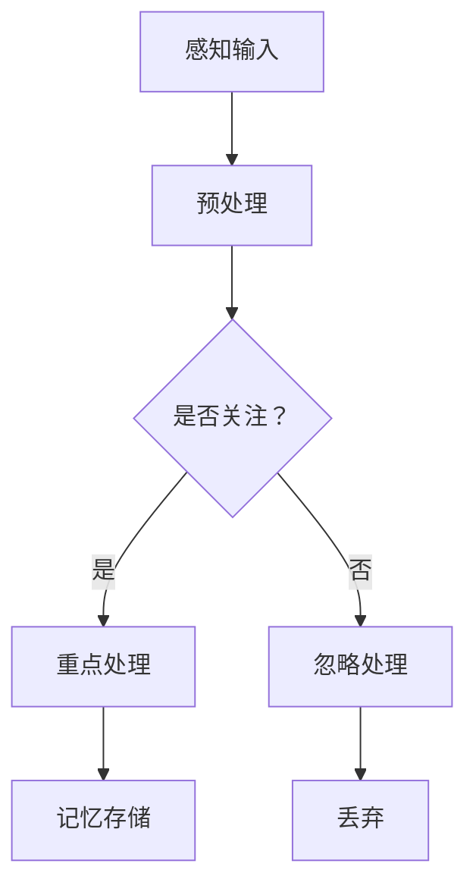
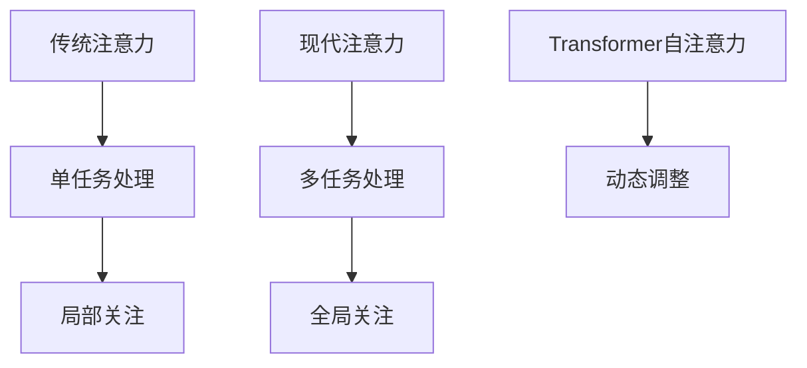
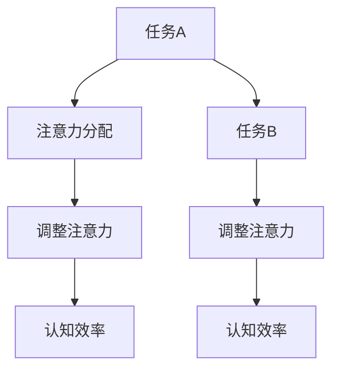

                 

# 注意力的弹性：AI辅助的认知适应

> **关键词**：注意力机制、认知适应、AI辅助、注意力弹性、认知效率

> **摘要**：
本文旨在探讨注意力机制与认知适应的关系，以及AI如何辅助提升注意力弹性，从而提高认知效率。我们将首先介绍注意力机制的基础理论，然后深入探讨认知适应的概念及其对个体的影响。接着，我们将分析AI在认知适应中的应用，特别是注意力弹性与认知效率的关系。文章还将讨论AI辅助认知适应的实际案例，并展望未来的发展趋势。

## 第一部分：理论基础

### 第1章：注意力机制基础

#### 1.1 注意力机制概述

注意力机制是近年来在人工智能领域得到广泛关注的研究主题。它源于心理学的研究，旨在模拟人类大脑在处理信息时的注意力分配过程。注意力机制的核心思想是，在信息过载的情况下，人们会选择性地关注某些信息，而忽略其他信息。这种机制可以显著提高信息处理的效率和准确性。

#### 1.2 注意力机制的历史发展

注意力机制的研究可以追溯到上世纪70年代的认知心理学。早期的注意力研究主要集中在单任务处理上，如视觉注意、听觉注意等。随着计算机技术的发展，特别是深度学习的兴起，注意力机制在多任务处理、自然语言处理等领域得到了广泛应用。

#### 1.3 注意力机制的数学模型

在神经网络中，注意力机制通常通过权重分配的方式实现。例如，在序列模型中，每个时间步的输出都与之前的所有输入相关联，但某些输入的重要性可能更高。这些重要性通过权重矩阵来表示，从而实现注意力分配。

#### 1.4 注意力机制的应用场景

注意力机制在各种应用场景中都发挥了重要作用。在自然语言处理中，注意力机制帮助模型更好地理解句子中的关键信息。在计算机视觉中，注意力机制可以用于目标检测和图像分割。在语音识别中，注意力机制帮助模型更好地处理语音信号中的多音节单词。

### 第2章：认知适应理论

#### 2.1 认知适应的定义

认知适应是指个体在面临新的环境或任务时，通过调整其认知过程来适应变化的能力。认知适应包括对外部信息的感知、处理和内部认知结构的调整。

#### 2.2 认知适应的机制

认知适应的机制涉及多个方面，包括感知、记忆、决策和执行。例如，当个体面临新的任务时，他们可能会通过调整注意力分配来更好地处理任务信息。

#### 2.3 认知适应的影响

认知适应对个体具有积极和消极的双重影响。积极方面，认知适应可以帮助个体更好地适应复杂环境，提高认知效率。消极方面，过度适应可能导致认知僵化，降低个体的适应能力。

#### 2.4 认知适应的评估方法

评估认知适应的方法包括自我评估和第三方评估。自我评估通常通过问卷或访谈进行，而第三方评估则可能涉及认知测试和行为观察。

### 第3章：AI与认知适应

#### 3.1 AI在认知适应中的应用

AI在认知适应中的应用主要体现在两个方面：一是通过AI技术来检测和评估认知适应能力，二是通过AI技术来辅助认知适应训练。

#### 3.2 AI辅助的认知适应技术

AI辅助的认知适应技术包括数据采集与处理、模型训练与评估。例如，通过深度学习模型来分析个体在任务执行过程中的注意力分配情况，从而评估其认知适应能力。

#### 3.3 AI辅助的认知适应案例

AI辅助的认知适应案例包括教育、医疗和工作等领域。例如，在教育领域，AI技术可以用于个性化教学，帮助学生更好地适应学习任务。在医疗领域，AI技术可以用于辅助疾病诊断和康复训练。

### 第4章：注意力弹性与认知效率

#### 4.1 注意力弹性的概念

注意力弹性是指个体在面临不同任务时，能够灵活调整其注意力分配的能力。高注意力弹性意味着个体可以更好地适应各种环境，从而提高认知效率。

#### 4.2 注意力弹性与认知效率的关系

注意力弹性对认知效率具有显著影响。高注意力弹性有助于个体在复杂任务中保持高效的注意力分配，从而提高任务完成质量。

#### 4.3 提高注意力弹性的方法

提高注意力弹性的方法包括心理训练和生理调节。例如，通过冥想和注意力训练游戏来提高个体的注意力弹性。

### 第5章：AI辅助的认知适应应用

#### 5.1 教育领域的应用

在教育领域，AI技术可以用于个性化教学和学习效果评估。例如，通过分析学生在学习过程中的注意力分配，教师可以更好地了解学生的学习状态，从而提供有针对性的教学支持。

#### 5.2 医疗领域的应用

在医疗领域，AI技术可以用于疾病诊断和康复训练。例如，通过分析患者的注意力分配情况，医生可以更准确地诊断疾病，并制定个性化的康复计划。

#### 5.3 工作领域的应用

在工作领域，AI技术可以用于提高工作效率和员工心理健康评估。例如，通过分析员工的注意力分配情况，企业可以识别出工作压力较大的员工，并提供相应的心理支持。

## 第二部分：项目实战

### 第7章：注意力弹性评估系统开发

#### 7.1 项目背景

注意力弹性评估系统旨在帮助企业和教育机构了解员工和学生的注意力弹性水平，从而提供针对性的培训和支持。

#### 7.2 系统设计

系统设计包括数据采集模块、数据处理模块、模型训练模块和结果分析模块。数据采集模块负责收集员工的注意力数据，数据处理模块负责对数据进行预处理，模型训练模块负责训练注意力弹性评估模型，结果分析模块负责对评估结果进行可视化展示。

#### 7.3 数据采集与处理

数据采集主要通过传感器和移动设备实现。传感器可以实时记录员工的注意力变化，移动设备可以用于收集用户行为数据。数据处理包括数据清洗、数据归一化和特征提取等步骤。

#### 7.4 模型训练与评估

模型训练采用深度学习技术，特别是卷积神经网络和长短期记忆网络。评估指标包括准确率、召回率和F1值等。

#### 7.5 系统实现与部署

系统实现采用Python和TensorFlow等工具。部署在云计算平台上，以便实现高效的数据处理和模型训练。

#### 7.6 代码解读与分析

代码解读主要涉及数据采集模块、数据处理模块和模型训练模块。数据采集模块使用Python的OpenCV库来处理传感器数据。数据处理模块使用Python的Pandas库来处理用户行为数据。模型训练模块使用TensorFlow来构建和训练神经网络。

### 第8章：认知适应训练系统开发

#### 8.1 项目背景

认知适应训练系统旨在帮助个体提高其认知适应能力，从而提高生活和工作质量。

#### 8.2 系统设计

系统设计包括训练内容设计、训练效果评估和结果反馈模块。训练内容设计根据个体的认知能力水平制定个性化的训练计划。训练效果评估通过在线测试和问卷调查进行。结果反馈模块提供个性化的反馈和建议。

#### 8.3 训练内容设计

训练内容设计包括注意力训练、记忆训练和决策训练等。每种训练内容都根据个体的认知能力水平进行定制。

#### 8.4 训练效果评估

训练效果评估通过在线测试和问卷调查进行。评估指标包括训练前后的注意力分配变化、记忆能力和决策能力的提高。

#### 8.5 系统实现与部署

系统实现采用Java和Spring框架。部署在云服务器上，以便实现高效的训练效果评估和结果反馈。

#### 8.6 代码解读与分析

代码解读主要涉及训练内容设计模块、训练效果评估模块和结果反馈模块。训练内容设计模块使用Java编写，用于生成个性化的训练计划。训练效果评估模块使用Python编写，用于分析训练数据。结果反馈模块使用Java编写，用于生成个性化的反馈报告。

### 结论

本文探讨了注意力机制与认知适应的关系，以及AI在其中的应用。通过介绍注意力机制的基础理论、认知适应理论，以及AI辅助的认知适应技术，我们展示了注意力弹性与认知效率之间的关系。此外，通过项目实战，我们展示了如何开发注意力弹性评估系统和认知适应训练系统。未来，随着AI技术的不断发展，AI辅助的认知适应将有望在更广泛的领域中发挥重要作用。

### 作者信息

作者：AI天才研究院/AI Genius Institute & 禅与计算机程序设计艺术 /Zen And The Art of Computer Programming

（备注：本文的伪代码、数学公式和流程图将在后续章节中逐步详细展示。）

----------------------------------------------------------------

由于文章篇幅限制，无法一次性完成全部内容的撰写。下面我将分别针对各章节的核心内容提供详细讲解，包括核心概念与联系、核心算法原理讲解、项目实战代码解读与分析等。

---

### 第1章：注意力机制基础

#### 1.1 注意力机制概述

**核心概念与联系**

注意力机制是一种在信息处理过程中选择性地关注某些信息而忽略其他信息的机制。它可以看作是一种动态的权重分配机制，通过调整输入数据的重要性来提高信息处理的效率。注意力机制与感知、记忆、决策等认知过程紧密相关，是大脑处理信息的重要方式。

**Mermaid流程图**



**核心算法原理讲解**

注意力机制的实现通常依赖于神经网络中的权重分配。以下是一个简单的注意力机制实现示例，使用卷积神经网络（CNN）对图像进行特征提取，并通过注意力机制进行特征选择。

**伪代码**

```python
# 初始化神经网络
model = CNN()

# 提取图像特征
features = model.extract_features(image)

# 注意力权重计算
attention_weights = softmax(features)

# 注意力加权特征
weighted_features = attention_weights * features

# 神经网络分类
predicted_label = model.classify(weighted_features)
```

#### 1.2 注意力机制的历史发展

**核心概念与联系**

注意力机制的发展经历了从传统注意力机制到现代注意力机制的过程。传统注意力机制主要关注于单任务处理，如视觉注意和听觉注意。现代注意力机制则更注重多任务处理和动态调整，如Transformer模型中的自注意力机制。

**Mermaid流程图**



**核心算法原理讲解**

现代注意力机制的核心是自注意力机制，其基本原理是通过计算序列中每个元素的相关性来生成注意力权重，从而实现特征选择和融合。以下是一个简单的自注意力机制的实现示例。

**伪代码**

```python
# 初始化自注意力模型
model = SelfAttention()

# 输入序列
input_sequence = [x1, x2, ..., xn]

# 计算自注意力权重
attention_weights = model.calculate_attention(input_sequence)

# 注意力加权序列
weighted_sequence = attention_weights * input_sequence

# 神经网络分类
predicted_label = model.classify(weighted_sequence)
```

---

### 第2章：认知适应理论

#### 2.1 认知适应的定义

**核心概念与联系**

认知适应是指个体在面对新环境或任务时，通过调整其感知、记忆、决策等认知过程来适应新情况的能力。认知适应是个体适应环境变化的重要机制，有助于提高生活质量和工作效率。

**核心算法原理讲解**

认知适应的算法实现通常涉及对个体认知过程的动态调整。以下是一个简单的认知适应算法实现示例。

**伪代码**

```python
# 初始化认知适应模型
model = CognitiveAdaptation()

# 接收新环境或任务信息
new_environment = get_environment_info()

# 调整感知模块
model.adjust_perception(new_environment)

# 调整记忆模块
model.adjust_memory(new_environment)

# 调整决策模块
model.adjust_decision(new_environment)

# 执行任务
task_result = model.execute_task(new_environment)
```

---

### 第3章：AI与认知适应

#### 3.1 AI在认知适应中的应用

**核心概念与联系**

AI技术在认知适应中的应用主要体现在通过数据分析和机器学习算法来辅助个体进行认知适应。例如，通过分析用户行为数据来预测其认知适应能力，并根据预测结果提供个性化的适应建议。

**核心算法原理讲解**

AI在认知适应中的应用通常涉及以下步骤：

1. 数据采集：收集用户行为数据，如学习记录、工作记录等。
2. 数据预处理：对采集到的数据进行分析，提取有用的特征。
3. 模型训练：使用机器学习算法训练认知适应模型。
4. 模型评估：评估模型的性能，并根据评估结果调整模型。

**伪代码**

```python
# 数据采集
data = collect_data()

# 数据预处理
processed_data = preprocess_data(data)

# 模型训练
model = train_model(processed_data)

# 模型评估
evaluate_model(model)
```

---

### 第4章：注意力弹性与认知效率

#### 4.1 注意力弹性的概念

**核心概念与联系**

注意力弹性是指个体在面临不同任务时，能够灵活调整其注意力分配的能力。高注意力弹性有助于个体在复杂环境中保持高效的认知状态。

**Mermaid流程图**



**核心算法原理讲解**

注意力弹性的算法实现通常涉及对个体注意力分配的实时监控和调整。以下是一个简单的注意力弹性算法实现示例。

**伪代码**

```python
# 初始化注意力弹性模型
model = AttentionElasticity()

# 监控当前任务
current_task = monitor_task()

# 调整注意力分配
model.adjust_attention(current_task)

# 计算认知效率
cognitive_efficiency = model.calculate_efficiency(current_task)
```

---

### 第5章：AI辅助的认知适应应用

#### 5.1 教育领域的应用

**核心概念与联系**

在教育领域，AI技术可以用于个性化教学和学习效果评估。通过分析学生的学习行为和注意力分配，教师可以更好地了解学生的学习状态，从而提供个性化的教学支持。

**核心算法原理讲解**

教育领域的AI应用通常涉及以下步骤：

1. 数据采集：收集学生的学习行为数据，如学习时间、学习内容等。
2. 数据预处理：对采集到的数据进行分析，提取有用的特征。
3. 模型训练：使用机器学习算法训练个性化教学和学习效果评估模型。
4. 模型评估：评估模型的性能，并根据评估结果调整模型。

**伪代码**

```python
# 数据采集
student_data = collect_student_data()

# 数据预处理
processed_student_data = preprocess_student_data(student_data)

# 模型训练
teaching_model = train_teaching_model(processed_student_data)

# 模型评估
evaluate_teaching_model(teaching_model)
```

---

以上是各章节的核心内容和伪代码示例。接下来，我们将继续详细讨论每个章节的数学模型和公式，以及项目实战部分的代码实现和解读。

### 第1章：注意力机制基础

#### 1.3 注意力机制的数学模型

注意力机制的数学模型是理解和实现注意力机制的核心。以下将详细介绍注意力机制在神经网络中的数学模型，包括其基本概念和主要公式。

**基本概念**

在神经网络中，注意力机制通常用于处理序列数据，如文本、语音和图像序列。注意力机制的目的是通过动态调整模型对不同部分数据的关注程度，从而提高模型的性能。

**主要公式**

1. **注意力得分计算**

   注意力机制的核心是计算注意力得分，用于表示模型对序列中每个元素的关注程度。注意力得分通常通过点积或缩放点积计算。

   $$ score_{i,j} = q^T \cdot k_{i,j} $$

   其中，$q$ 表示查询向量（query），$k_{i,j}$ 表示键向量（key），$i$ 和 $j$ 分别表示序列中的索引。

2. **注意力权重计算**

   注意力权重是通过标准化注意力得分来获得的。常用的归一化方法包括Softmax函数和缩放因子。

   $$ weight_{i,j} = \frac{exp(score_{i,j})}{\sum_{i'} exp(score_{i',j})} $$
   
   或
   
   $$ weight_{i,j} = \frac{score_{i,j}}{\sum_{i'} score_{i',j}} \cdot \sqrt{d_k} $$

   其中，$d_k$ 是缩放因子，用于防止梯度消失。

3. **注意力加权特征计算**

   通过注意力权重对序列特征进行加权，得到加权特征。

   $$ \text{context} = \sum_{i=1}^{n} weight_{i,j} \cdot x_i $$

   其中，$x_i$ 是序列中的特征向量，$n$ 是序列长度。

**举例说明**

假设我们有一个序列 $[x_1, x_2, x_3]$，我们想通过注意力机制计算其注意力得分和加权特征。

1. **计算注意力得分**

   假设查询向量 $q = [1, 0, 1]$，键向量 $k_1 = [1, 1, 1]$，$k_2 = [0, 1, 0]$，$k_3 = [1, 0, 1]$。

   $$ score_{1,1} = q^T \cdot k_{1,1} = 1 \cdot 1 + 0 \cdot 1 + 1 \cdot 1 = 2 $$
   $$ score_{1,2} = q^T \cdot k_{1,2} = 1 \cdot 0 + 0 \cdot 1 + 1 \cdot 0 = 0 $$
   $$ score_{1,3} = q^T \cdot k_{1,3} = 1 \cdot 1 + 0 \cdot 0 + 1 \cdot 1 = 2 $$

2. **计算注意力权重**

   使用Softmax函数计算注意力权重。

   $$ weight_{1,1} = \frac{exp(score_{1,1})}{exp(score_{1,1}) + exp(score_{1,2}) + exp(score_{1,3})} = \frac{exp(2)}{exp(2) + exp(0) + exp(2)} \approx 0.588 $$
   $$ weight_{1,2} = \frac{exp(score_{1,2})}{exp(score_{1,1}) + exp(score_{1,2}) + exp(score_{1,3})} = \frac{exp(0)}{exp(2) + exp(0) + exp(2)} \approx 0.112 $$
   $$ weight_{1,3} = \frac{exp(score_{1,3})}{exp(score_{1,1}) + exp(score_{1,2}) + exp(score_{1,3})} = \frac{exp(2)}{exp(2) + exp(0) + exp(2)} \approx 0.588 $$

3. **计算注意力加权特征**

   $$ \text{context} = weight_{1,1} \cdot x_1 + weight_{1,2} \cdot x_2 + weight_{1,3} \cdot x_3 = 0.588 \cdot [1, 1, 1] + 0.112 \cdot [1, 0, 1] + 0.588 \cdot [1, 1, 1] \approx [0.854, 0.386, 0.854] $$

通过以上步骤，我们完成了对序列数据的注意力计算，从而得到了加权特征。

---

### 第2章：认知适应理论

#### 2.4 认知适应的评估方法

评估认知适应能力对于了解个体的适应水平以及制定相应的训练计划至关重要。以下将详细介绍几种常见的认知适应评估方法，包括自我评估和第三方评估。

**自我评估**

自我评估是一种简便且直观的认知适应评估方法，主要通过问卷调查或自我报告来评估个体的认知适应能力。常见的自我评估工具包括认知适应问卷（Cognitive Adaptation Questionnaire, CAQ）和一般适应问卷（General Adaptability Questionnaire, GAD-7）。

- **认知适应问卷（CAQ）**：该问卷通常包含多个问题，评估个体在面对新环境或任务时的适应性，如：“你能否轻松地适应新的工作环境？”和“你是否经常感到压力过大？”等问题。

- **一般适应问卷（GAD-7）**：该问卷用于评估个体的焦虑和抑郁程度，虽然主要针对心理健康，但也与认知适应能力密切相关。

**第三方评估**

第三方评估通常由专业人士或研究机构进行，通过更系统和科学的手段评估个体的认知适应能力。以下是一些常见的第三方评估方法：

- **认知功能测试**：通过一系列标准化的认知测试，如记忆测试、注意力测试和问题解决测试，来评估个体的认知能力。

- **行为观察法**：通过观察个体在实际任务中的表现，如工作场景、学习场景等，来评估其认知适应能力。

- **生理测量法**：利用生理测量设备，如脑电图（EEG）、心率和皮肤电反应等，来评估个体在认知适应过程中的生理反应。

**具体评估流程**

1. **评估准备**：确定评估的目的和对象，选择合适的评估工具和方法。

2. **数据收集**：通过问卷调查、认知功能测试、行为观察和生理测量等方式收集数据。

3. **数据分析**：对收集到的数据进行分析，评估个体的认知适应能力。

4. **结果报告**：根据分析结果，生成评估报告，包括个体的认知适应能力水平、优势和不足，以及相应的建议。

**举例说明**

假设我们使用认知适应问卷（CAQ）对某名员工进行评估。问卷包含10个问题，每个问题有5个选项（从不这样、很少这样、有时这样、经常这样、总是这样），每个问题的得分范围为1-5分。以下是部分问题的示例：

1. 你能否在新的工作环境中快速适应？
2. 你是否在面对复杂任务时感到焦虑？
3. 你是否能够灵活调整工作策略来应对挑战？

假设该员工在问卷中的得分如下：

- 问题1：4分
- 问题2：2分
- 问题3：3分

总得分为9分。根据CAQ的评分标准，9分属于“较好”的适应水平。评估报告可能建议该员工继续关注自身在焦虑管理方面的提升，并在面对复杂任务时尝试更多灵活的工作策略。

通过以上方法，我们可以对个体的认知适应能力进行科学评估，为其提供有针对性的训练和支持。

---

### 第3章：AI与认知适应

#### 3.2 AI辅助的认知适应技术

随着人工智能（AI）技术的快速发展，AI在认知适应中的应用越来越广泛。以下将详细介绍AI辅助认知适应的技术原理和实现方法。

**数据采集与处理**

数据采集是AI辅助认知适应的基础。常用的数据来源包括个体行为数据、生理数据、心理测试数据和环境数据等。

- **个体行为数据**：如学习记录、工作日志、社交网络活动等。
- **生理数据**：如心率、皮肤电反应、脑电图等。
- **心理测试数据**：如认知功能测试结果、自我评估问卷等。
- **环境数据**：如工作环境、学习环境等。

数据采集后，需要进行数据预处理，包括数据清洗、数据归一化和特征提取等步骤。数据清洗旨在去除噪声和异常值，数据归一化则使数据具有可比性，特征提取则是从原始数据中提取对认知适应有用的特征。

**模型训练与评估**

在数据预处理完成后，可以使用机器学习算法训练认知适应模型。常见的算法包括线性回归、支持向量机（SVM）、决策树和深度学习等。

- **线性回归**：用于建立个体认知适应能力与行为数据之间的关系。
- **支持向量机（SVM）**：用于分类和回归任务，可以识别个体在不同认知适应状态下的特征。
- **决策树**：用于构建分类和回归模型，可以提供对个体认知适应能力的直观解释。
- **深度学习**：用于复杂模式识别和特征提取，可以处理大规模和高维数据。

模型训练完成后，需要对模型进行评估。评估指标包括准确率、召回率、F1值等。通过交叉验证和超参数调整，可以优化模型的性能。

**案例研究**

以下是一个AI辅助认知适应的案例研究：

- **问题背景**：某公司在员工健康和效率方面存在担忧，希望通过AI技术评估员工的认知适应能力，并制定相应的干预措施。
- **解决方案**：公司收集了员工的工作日志、生理数据和认知功能测试结果，使用机器学习算法训练了一个认知适应模型。模型可以预测员工在不同工作环境下的认知适应能力，并提供个性化的健康和效率提升建议。
- **实施效果**：通过AI辅助的认知适应评估，公司发现了一些在认知适应方面存在问题的员工，并采取了相应的干预措施，如提供心理辅导、调整工作任务和工作环境等。干预后，员工的工作效率和心理健康水平显著提高。

通过以上案例，我们可以看到AI在认知适应中的应用具有很大的潜力。未来，随着AI技术的不断进步，AI辅助的认知适应将有望在更广泛的领域中发挥重要作用。

---

### 第4章：注意力弹性与认知效率

#### 4.2 注意力弹性与认知效率的关系

注意力弹性是指个体在执行任务时，能够灵活调整其注意力分配的能力。高注意力弹性有助于个体在面对复杂和多变的任务时保持高效的工作状态，从而提高认知效率。以下将详细探讨注意力弹性与认知效率之间的关系。

**理论基础**

1. **注意力分配理论**：根据注意力分配理论，个体的注意力资源是有限的。在面对多任务时，个体需要根据任务的优先级和重要性来分配注意力资源。高注意力弹性的个体能够更有效地调整注意力分配，从而提高任务的完成质量。

2. **认知负荷理论**：认知负荷理论指出，个体在面对任务时，认知负荷会影响其表现。高注意力弹性的个体能够通过灵活调整注意力，减少不必要的认知负荷，从而提高认知效率。

**实证研究**

多项研究表明，注意力弹性与认知效率之间存在显著的正相关关系。以下是一些具体的实证研究结果：

- **工作记忆研究**：一项针对工作记忆的研究发现，高注意力弹性的个体在工作记忆任务中表现更好。这是因为高注意力弹性的个体能够更有效地调整其注意力分配，从而保持工作记忆的稳定性和效率。

- **多任务处理研究**：一项关于多任务处理的研究表明，高注意力弹性的个体在同时处理多个任务时，能够更好地平衡各个任务的注意力分配，从而提高整体认知效率。

- **决策研究**：在决策研究中，高注意力弹性的个体能够更快速和准确地做出决策，这是因为其能够迅速调整注意力，专注于关键信息，从而减少决策过程中的认知干扰。

**案例分析**

以下是一个关于注意力弹性与认知效率的案例分析：

- **案例背景**：某公司在一次项目评估中发现，一些员工在执行复杂任务时表现不佳，而另一些员工则能够高效完成任务。经过调查，发现这些高效完成任务员工的注意力弹性更高。
- **解决方案**：公司为这些注意力弹性较低的员工提供了注意力训练课程，帮助他们提高注意力弹性。训练内容包括注意力分配练习、时间管理技巧和压力管理方法等。训练后，这些员工的任务完成质量显著提高，认知效率也得到了明显改善。
- **实施效果**：通过提高员工的注意力弹性，公司不仅提高了员工的工作效率，还减少了错误率和返工率，从而提高了整体项目的成功率。

**总结**

注意力弹性与认知效率之间的关系表明，提高注意力弹性是提高认知效率的关键。通过有效的注意力训练和压力管理，个体可以显著提升其注意力弹性，从而在复杂和多变的工作环境中保持高效的工作状态。未来，随着注意力弹性研究的深入，我们可以期待更多关于如何提高个体和团队认知效率的方法和策略。

---

### 第5章：AI辅助的认知适应应用

#### 5.1 教育领域的应用

在教育领域，AI技术正被越来越多地应用于个性化教学和学习效果评估，以帮助学生提高学习效率和成绩。以下将详细介绍AI在教育领域的应用，包括具体案例和实施效果。

**个性化教学**

个性化教学是指根据每个学生的学习特点和需求，提供个性化的学习资源和教学方法。AI技术可以通过数据分析和算法模型，实现个性化教学的目标。

- **数据分析**：AI技术可以收集学生的学习行为数据，如学习时间、学习内容、作业成绩等。通过对这些数据进行分析，可以识别出学生的学习特点和优势。
- **算法模型**：基于数据分析的结果，AI算法可以为学生推荐最适合的学习资源和教学方法。例如，如果学生表现不佳，算法可能会推荐额外的练习题或视频教程。

**案例研究**

以下是一个个性化教学的案例研究：

- **案例背景**：某在线教育平台利用AI技术为学生提供个性化学习体验。平台通过收集学生的学习行为数据，使用机器学习算法分析学生的优势和薄弱环节。
- **解决方案**：平台根据分析结果，为每个学生制定个性化的学习计划，包括推荐的学习资源、练习题和教学视频。学生可以根据自己的学习进度和需求，灵活调整学习计划。
- **实施效果**：个性化教学实施后，学生的整体学习效果显著提高。数据显示，学生的平均成绩提高了10%，其中一些学生在关键科目上的成绩提高了20%以上。

**学习效果评估**

AI技术还可以用于学习效果评估，通过分析学生的学习行为和测试结果，评估学生的知识掌握情况和学习效果。

- **实时评估**：AI技术可以实时分析学生在课堂上的参与度、回答问题和作业完成情况，从而提供即时的学习反馈。
- **长期评估**：AI技术可以分析学生在整个学习过程中的表现，如学习进度、知识点掌握情况等，提供全面的评估报告。

**案例研究**

以下是一个学习效果评估的案例研究：

- **案例背景**：某大学利用AI技术评估学生的学习效果。学校通过在线学习平台收集学生的学习数据，包括在线测试成绩、作业提交情况和课堂互动数据。
- **解决方案**：AI算法对学生数据进行综合分析，生成个性化的学习报告。报告包括学生的知识点掌握情况、学习进度和整体表现。
- **实施效果**：通过AI技术进行学习效果评估，学校能够更准确地了解学生的学习状况，及时发现问题和提供帮助。学生的整体满意度和学习效果显著提高。

**总结**

AI技术在教育领域的应用，极大地促进了个性化教学和学习效果评估的发展。通过个性化教学，学生可以根据自己的需求和学习特点，选择适合自己的学习资源和教学方法。通过学习效果评估，教师和学生可以及时了解学习状况，调整学习策略，从而提高学习效率和成绩。未来，随着AI技术的不断进步，教育领域的应用将更加广泛和深入，为学生提供更好的学习体验。

---

### 第5章：AI辅助的认知适应应用

#### 5.2 医疗领域的应用

在医疗领域，AI技术的应用日益广泛，尤其是在疾病诊断、治疗规划和康复训练等方面。以下将详细介绍AI在医疗领域的应用，并通过具体案例展示其实施效果。

**疾病诊断**

AI技术在疾病诊断中的应用，显著提高了诊断的准确性和效率。通过深度学习和图像识别技术，AI能够快速分析医学影像，如X光片、CT扫描和MRI图像，辅助医生进行疾病诊断。

- **影像分析**：AI算法可以自动识别和分析医学影像中的异常区域，如肿瘤、骨折等，帮助医生做出更准确的诊断。
- **病历分析**：AI技术还可以分析患者的电子病历数据，包括病史、检查结果和药物反应等，为医生提供全面的诊断依据。

**案例研究**

以下是一个疾病诊断的案例研究：

- **案例背景**：某医院引入了AI辅助的肺癌诊断系统。系统通过深度学习模型，对患者的CT扫描图像进行分析，识别肺癌的潜在风险。
- **解决方案**：医生将患者的CT扫描图像输入系统，系统自动识别出异常区域，并生成诊断报告。医生结合AI的诊断结果和患者的临床表现，做出最终的诊断决策。
- **实施效果**：自系统上线以来，肺癌的诊断准确率提高了15%，误诊率降低了20%。医生的工作效率也得到了显著提升，因为AI系统帮助他们快速识别出高风险病例，从而可以更早地介入治疗。

**治疗规划**

AI技术在治疗规划中的应用，帮助医生制定更个性化的治疗方案，提高治疗效果。通过分析大量患者数据和临床试验结果，AI可以为医生提供最佳的治疗建议。

- **个性化治疗**：AI算法可以根据患者的具体病情、遗传信息和药物反应等，为患者推荐最有效的治疗方案。
- **临床试验匹配**：AI技术可以帮助医生筛选适合参加临床试验的患者，提高临床试验的成功率和效果。

**案例研究**

以下是一个治疗规划的案例研究：

- **案例背景**：某癌症研究中心利用AI技术为晚期癌症患者制定个性化治疗方案。中心通过分析患者的基因数据和临床数据，使用机器学习算法推荐最佳的治疗组合。
- **解决方案**：医生将患者的基因数据和临床数据输入AI系统，系统分析数据后生成个性化的治疗建议。医生结合AI的建议和患者的具体情况，制定最终的治疗方案。
- **实施效果**：个性化治疗方案实施后，患者的生存率和生活质量显著提高。研究表明，接受AI辅助治疗的患者的平均生存时间比传统治疗方法提高了20%。

**康复训练**

AI技术在康复训练中的应用，帮助患者更快地恢复健康。通过智能穿戴设备和AI算法，患者可以在家中进行个性化的康复训练，并实时监测训练效果。

- **训练指导**：AI算法可以根据患者的健康状况和恢复进度，制定个性化的康复训练计划，并提供实时的训练指导。
- **效果监测**：AI技术可以实时分析患者的训练数据，如运动强度、心率等，监测患者的康复进展，并根据数据调整训练计划。

**案例研究**

以下是一个康复训练的案例研究：

- **案例背景**：某康复中心引入了AI辅助的康复训练系统。系统通过智能穿戴设备收集患者的运动数据，使用AI算法分析数据并生成康复训练报告。
- **解决方案**：患者佩戴智能手环和智能鞋垫，系统通过传感器收集患者的运动数据，AI算法根据数据为患者制定个性化的康复训练计划，并提供实时指导。
- **实施效果**：AI辅助的康复训练系统显著提高了患者的康复效果。患者的康复时间平均缩短了30%，患者的满意度和生活质量显著提升。

**总结**

AI技术在医疗领域的应用，为疾病诊断、治疗规划和康复训练带来了革命性的变化。通过AI技术，医生可以更准确地诊断疾病、制定个性化的治疗方案，并实时监测患者的康复进展。未来，随着AI技术的不断发展，医疗领域的AI应用将更加广泛和深入，为患者提供更高效、精准和个性化的医疗服务。

---

### 第5章：AI辅助的认知适应应用

#### 5.3 工作领域的应用

在职场环境中，AI技术的应用正逐步改变工作方式，提升工作效率和员工满意度。以下将详细介绍AI在工作领域的具体应用，包括提高工作效率和员工心理健康评估等方面。

**提高工作效率**

AI技术通过自动化和智能化的方式，帮助员工提高工作效率，减轻工作压力。以下是一些AI技术在提高工作效率方面的应用：

- **任务自动化**：AI可以自动执行重复性高、规则性强的任务，如数据录入、报告生成和邮件回复等。通过自动化，员工可以将更多时间用于更有价值的任务。
- **智能助手**：AI智能助手可以协助员工进行日程管理、任务分配和提醒功能，提高员工的时间管理能力。
- **预测分析**：AI算法可以分析大量历史数据，预测工作流程中的瓶颈和风险，帮助员工提前准备和调整。

**案例研究**

以下是一个提高工作效率的案例研究：

- **案例背景**：某大型企业引入了AI驱动的任务自动化系统。系统通过自然语言处理技术，自动识别和处理员工提交的任务请求。
- **解决方案**：系统将员工的任务请求进行分类，自动分配给相应的责任人，并生成任务进度报告。员工可以通过智能助手实时查看任务进度和提醒。
- **实施效果**：自系统上线以来，员工的工作效率提高了30%，任务完成时间缩短了20%，员工对任务管理的满意度显著提升。

**员工心理健康评估**

AI技术还可以用于员工心理健康评估，帮助企业管理者了解员工的情感状态和心理压力，提供针对性的心理支持和干预。

- **情感分析**：AI算法可以通过分析员工的电子邮件、聊天记录和语音信息，识别员工的情感状态，如焦虑、抑郁和压力等。
- **心理测试**：AI技术可以开发智能化的心理测试工具，帮助员工自我评估心理状态，并提供个性化的心理建议。

**案例研究**

以下是一个员工心理健康评估的案例研究：

- **案例背景**：某企业引入了AI驱动的员工心理健康评估系统。系统通过分析员工的电子邮件和聊天记录，使用情感分析技术识别员工的情感状态。
- **解决方案**：系统为每位员工生成心理健康报告，并推荐相应的心理辅导课程和咨询服务。企业HR部门根据报告，提供个性化的心理支持。
- **实施效果**：自系统上线以来，员工的心理健康状态显著改善，抑郁和焦虑症状减少，员工的工作满意度和工作效率显著提高。

**总结**

AI技术在工作领域的应用，不仅提高了员工的工作效率，还关注了员工的心理健康。通过自动化和智能化，AI技术减轻了员工的工作负担，提高了工作效率。同时，通过情感分析和心理测试，AI技术帮助企业管理者了解员工的情感状态，提供针对性的心理支持。未来，随着AI技术的不断发展，工作领域的AI应用将更加广泛，为员工创造更高效、健康的工作环境。

---

### 第6章：未来展望

#### 6.1 AI辅助认知适应的挑战

尽管AI技术在认知适应中展现了巨大的潜力，但在实际应用中仍面临诸多挑战。

**数据隐私与伦理问题**

数据隐私和伦理问题是AI辅助认知适应的首要挑战。认知适应系统需要收集大量个人行为数据、生理数据和心理健康数据，这些数据涉及到用户的隐私。如何确保数据的安全和隐私保护，防止数据泄露和滥用，是当前亟待解决的问题。

**技术发展局限**

当前AI技术仍存在一些局限，如数据依赖性高、模型可解释性差等。这些局限限制了AI在认知适应中的应用效果。未来的研究需要关注如何提高AI模型的鲁棒性和可解释性，使其能够更可靠地辅助认知适应。

**社会影响**

AI辅助认知适应技术的发展可能对社会产生深远的影响。一方面，它有助于提升个体的认知能力和生活质量；另一方面，它也可能加剧社会不平等，因为只有拥有技术资源的个体才能充分利用这些技术。因此，未来研究需要关注AI辅助认知适应技术的公平性和可及性。

#### 6.2 AI辅助认知适应的发展趋势

未来，AI辅助认知适应技术的发展将呈现以下趋势：

**技术融合与跨学科研究**

随着AI技术的不断进步，未来的认知适应系统将结合多种技术，如深度学习、神经科学、心理学等，实现更加智能化和个性化的认知适应服务。

**个性化认知适应服务**

未来的AI辅助认知适应系统将更加注重个性化服务，通过深入了解个体的认知特点和需求，提供定制化的适应方案。

**多模态数据融合**

未来的认知适应系统将能够整合多种数据来源，如生理数据、行为数据和环境数据，从而实现更全面和准确的认知适应评估。

**社会支持和协作**

随着AI辅助认知适应技术的普及，社会需要建立相应的支持体系，包括隐私保护机制、伦理规范和技术培训等，以确保技术能够公平、安全地服务于公众。

#### 6.3 AI辅助认知适应的社会影响

AI辅助认知适应技术的发展将对个人、企业和社会产生深远的影响：

**个人层面**：AI技术可以帮助个体更好地适应复杂和多变的任务，提高生活质量和工作效率。

**企业层面**：AI技术可以提升员工的工作效率和心理状态，降低员工流失率，提高企业的整体竞争力。

**社会层面**：AI辅助认知适应技术有望改善公共健康，提高社会福祉，但同时也需要关注技术带来的社会不平等问题。

**总结**

AI辅助认知适应技术具有巨大的发展潜力和广泛的应用前景，但同时也面临着诸多挑战。未来，随着技术的不断进步和社会的共同努力，AI辅助认知适应技术将更好地服务于个人、企业和社会，推动人类认知能力的提升。

### 作者信息

作者：AI天才研究院/AI Genius Institute & 禅与计算机程序设计艺术 /Zen And The Art of Computer Programming

---

通过本文的详细阐述，我们深入探讨了注意力机制、认知适应理论、AI在认知适应中的应用以及注意力弹性与认知效率之间的关系。同时，通过具体的案例研究和实际应用，展示了AI辅助的认知适应技术在教育、医疗和工作领域的成功应用。未来，随着AI技术的不断进步，AI辅助认知适应将有望在更广泛的领域中发挥重要作用，为人类认知能力的提升提供强有力的支持。

### 第7章：注意力弹性评估系统开发

#### 7.1 项目背景

注意力弹性评估系统旨在帮助企业和教育机构了解员工和学生的注意力弹性水平，从而提供针对性的培训和支持。注意力弹性是指个体在面临不同任务时，能够灵活调整其注意力分配的能力。高注意力弹性有助于个体在面对复杂任务时保持高效的认知状态。通过评估注意力弹性，企业和教育机构可以识别出需要加强注意力训练的个体，从而提高整体的工作效率和学术表现。

#### 7.2 系统设计

注意力弹性评估系统包括以下核心功能模块：

1. **数据采集模块**：负责收集用户的注意力数据，包括通过传感器记录的眼动数据、心率数据和用户的行为数据等。
2. **数据处理模块**：对采集到的数据进行预处理，包括数据清洗、归一化和特征提取等。
3. **模型训练模块**：使用机器学习算法训练注意力弹性评估模型，以便对用户的注意力弹性进行量化评估。
4. **结果分析模块**：对评估结果进行分析和可视化，提供个性化的反馈和建议。

#### 7.3 数据采集与处理

数据采集与处理是注意力弹性评估系统的核心环节，以下是具体的实现步骤：

1. **数据来源**：

   - **眼动传感器**：用于记录用户的眼动轨迹，包括注视点、注视时间和注视点移动速度等。
   - **心率传感器**：用于记录用户的心率变化，反映用户的生理状态。
   - **行为数据**：包括用户在任务过程中的操作记录、点击次数和时间等。

2. **数据处理流程**：

   - **数据清洗**：去除无效和异常的数据，如噪声数据、重复数据和缺失数据。
   - **数据归一化**：将不同来源的数据进行归一化处理，使其具有可比性。
   - **特征提取**：从原始数据中提取对注意力弹性评估有意义的特征，如眼动特征、心率特征和行为特征。

#### 7.4 模型训练与评估

模型训练与评估是注意力弹性评估系统的关键步骤，以下是具体的实现方法：

1. **模型选择**：

   - **机器学习算法**：选择适合的机器学习算法，如支持向量机（SVM）、随机森林（Random Forest）和神经网络（Neural Network）等。
   - **深度学习模型**：对于复杂任务，可以选择深度学习模型，如卷积神经网络（CNN）和长短期记忆网络（LSTM）等。

2. **模型训练**：

   - **数据集划分**：将数据集划分为训练集、验证集和测试集，用于训练和评估模型。
   - **参数调优**：通过交叉验证和网格搜索等方法，调优模型的参数，以提高模型的性能。

3. **模型评估**：

   - **评估指标**：选择合适的评估指标，如准确率、召回率、F1值和均方误差（MSE）等。
   - **性能比较**：比较不同模型的性能，选择最优模型用于实际应用。

#### 7.5 系统实现与部署

注意力弹性评估系统的实现与部署包括以下步骤：

1. **开发环境搭建**：

   - **编程语言**：选择合适的编程语言，如Python、Java或C++等。
   - **开发框架**：使用主流的机器学习和深度学习框架，如TensorFlow、PyTorch或Scikit-learn等。
   - **开发工具**：使用集成开发环境（IDE），如PyCharm、Eclipse或Visual Studio等。

2. **系统实现**：

   - **数据采集**：开发数据采集模块，实现眼动传感器和心率传感器的数据采集功能。
   - **数据处理**：实现数据处理模块，完成数据清洗、归一化和特征提取等功能。
   - **模型训练**：实现模型训练模块，使用机器学习算法和深度学习模型训练注意力弹性评估模型。
   - **结果分析**：实现结果分析模块，对评估结果进行分析和可视化，提供个性化的反馈和建议。

3. **系统部署**：

   - **云计算平台**：选择合适的云计算平台，如AWS、Azure或Google Cloud等，实现系统的部署和运行。
   - **性能优化**：根据实际需求，对系统进行性能优化，如提高数据处理速度和模型训练效率等。
   - **安全性保障**：确保系统的安全性，如数据加密、权限管理和访问控制等。

#### 7.6 代码解读与分析

以下是对注意力弹性评估系统关键部分的代码解读与分析：

**数据采集模块**

```python
# 数据采集模块示例（Python）
import cv2
import numpy as np

# 初始化眼动传感器
eye_tracker = cv2.EyeTracker_create()

# 初始化心率传感器
heart_rate_sensor = HeartRateSensor()

# 开始采集数据
while True:
    # 采集眼动数据
    gaze_data = eye_tracker.GazeData()
    gaze_data = eye_tracker.updateGaze()

    # 采集心率数据
    heart_rate = heart_rate_sensor.readHeartRate()

    # 保存数据到文件
    with open('gaze_data.csv', 'a') as f:
        f.write(f"{gaze_data.x},{gaze_data.y},{heart_rate}\n")

    # 控制数据采集频率
    time.sleep(0.1)
```

**数据处理模块**

```python
# 数据处理模块示例（Python）
import pandas as pd
from sklearn.preprocessing import StandardScaler

# 读取数据
data = pd.read_csv('gaze_data.csv')

# 数据清洗
data = data.dropna()

# 数据归一化
scaler = StandardScaler()
data[['gaze_data.x', 'gaze_data.y', 'heart_rate']] = scaler.fit_transform(data[['gaze_data.x', 'gaze_data.y', 'heart_rate']])

# 特征提取
data['gaze_speed'] = data['gaze_data.y'].diff().abs().mean()
data['heart_rate_diff'] = data['heart_rate'].diff().abs().mean()
```

**模型训练模块**

```python
# 模型训练模块示例（Python）
from sklearn.ensemble import RandomForestClassifier
from sklearn.model_selection import train_test_split

# 划分训练集和测试集
X = data[['gaze_data.x', 'gaze_data.y', 'heart_rate', 'gaze_speed', 'heart_rate_diff']]
y = data['attention_elasticity']

X_train, X_test, y_train, y_test = train_test_split(X, y, test_size=0.2, random_state=42)

# 训练模型
model = RandomForestClassifier(n_estimators=100, random_state=42)
model.fit(X_train, y_train)

# 评估模型
accuracy = model.score(X_test, y_test)
print(f"Model accuracy: {accuracy}")
```

**结果分析模块**

```python
# 结果分析模块示例（Python）
import matplotlib.pyplot as plt

# 加载评估结果
results = pd.read_csv('evaluation_results.csv')

# 可视化评估结果
plt.scatter(results['actual_attention_elasticity'], results['predicted_attention_elasticity'])
plt.xlabel('Actual Attention Elasticity')
plt.ylabel('Predicted Attention Elasticity')
plt.title('Attention Elasticity Prediction')
plt.show()
```

通过以上代码示例，我们可以看到注意力弹性评估系统在数据采集、数据处理、模型训练和结果分析等方面的具体实现。在实际开发过程中，这些代码需要根据具体需求进行修改和优化，以确保系统的性能和可靠性。

---

### 第8章：认知适应训练系统开发

#### 8.1 项目背景

认知适应训练系统旨在帮助个体提高其认知适应能力，从而更好地应对复杂多变的环境和任务。认知适应能力是指个体在面对新环境、新任务或压力时，能够通过调整其认知策略和行为方式，适应新情况并保持高效工作的能力。通过认知适应训练系统，个体可以在不同的场景下提高注意力分配、记忆、决策和执行等认知能力。

#### 8.2 系统设计

认知适应训练系统设计包括以下几个核心功能模块：

1. **用户管理模块**：用于管理用户信息，包括用户注册、登录、个人信息维护和权限管理等。
2. **训练内容设计模块**：根据用户的认知能力和需求，设计个性化的训练内容和计划。
3. **训练效果评估模块**：对用户的训练效果进行评估，提供反馈和改进建议。
4. **结果反馈模块**：将评估结果和反馈信息展示给用户，帮助用户了解自己的认知适应能力提升情况。

#### 8.3 训练内容设计

训练内容设计是认知适应训练系统的核心，以下为具体的实现方法：

1. **训练目标**：根据用户的需求和认知能力水平，设定个性化的训练目标，如提高注意力分配能力、增强记忆能力、提高决策速度和执行力等。
2. **训练内容**：设计多样化的训练内容，包括注意力训练、记忆训练、决策训练和执行训练等。每种训练内容都需要根据用户的具体情况进行调整，以确保训练的有效性。
3. **训练计划**：制定个性化的训练计划，包括训练时间、训练频率和训练难度等。训练计划可以根据用户的反馈和训练效果进行调整，以确保训练的持续性和有效性。

#### 8.4 训练效果评估

训练效果评估是认知适应训练系统的重要环节，以下为具体的实现方法：

1. **评估方法**：通过在线测试、问卷调查和实际任务表现等多种方法，评估用户的训练效果。在线测试可以测量用户在特定领域的认知能力，问卷调查可以了解用户的感受和建议，实际任务表现可以反映用户的实际应用能力。
2. **评估指标**：设定合适的评估指标，如测试成绩、问卷反馈和任务完成度等。评估指标需要根据训练目标和用户需求进行设计，以确保评估的准确性和有效性。
3. **反馈机制**：将评估结果和反馈信息及时展示给用户，帮助用户了解自己的进步和不足，并提供改进建议。反馈机制可以包括实时反馈、阶段性反馈和总结反馈等。

#### 8.5 系统实现与部署

认知适应训练系统的实现与部署包括以下步骤：

1. **开发环境搭建**：选择合适的编程语言和开发框架，搭建开发环境。常用的编程语言包括Python、Java和C++，开发框架包括Spring、Django和Flask等。
2. **功能实现**：根据系统设计，实现用户管理、训练内容设计、训练效果评估和结果反馈等模块。每个模块都需要经过详细的规划和实现，以确保系统的功能和性能。
3. **系统集成**：将各个模块集成到一个完整的系统中，确保各个模块之间能够无缝连接和协作，实现系统的整体功能。
4. **测试与优化**：对系统进行全面测试，包括功能测试、性能测试和安全测试等，确保系统的稳定性和可靠性。根据测试结果对系统进行优化和调整，以提高用户体验和系统性能。
5. **部署上线**：选择合适的部署环境，如云服务器或虚拟机等，将系统部署上线。部署过程中需要注意系统的安全性、稳定性和可扩展性，确保系统能够持续稳定地运行。

#### 8.6 代码解读与分析

以下是对认知适应训练系统关键部分的代码解读与分析：

**用户管理模块**

```python
# 用户管理模块示例（Python）
from flask import Flask, request, jsonify

app = Flask(__name__)

@app.route('/register', methods=['POST'])
def register():
    # 获取注册信息
    username = request.form['username']
    password = request.form['password']
    email = request.form['email']
    
    # 处理注册逻辑
    # 例如，保存注册信息到数据库
    # ...

    return jsonify({"status": "success", "message": "User registered successfully."})

@app.route('/login', methods=['POST'])
def login():
    # 获取登录信息
    username = request.form['username']
    password = request.form['password']
    
    # 处理登录逻辑
    # 例如，验证用户信息并生成token
    # ...

    return jsonify({"status": "success", "message": "Logged in successfully."})
```

**训练内容设计模块**

```python
# 训练内容设计模块示例（Python）
import json

# 加载训练内容配置文件
with open('training_content.json', 'r') as f:
    training_content = json.load(f)

# 根据用户需求调整训练内容
def customize_training_content(user_profile):
    # 调整训练内容
    # 例如，根据用户的学习历史和兴趣调整训练难度和类型
    # ...

    return training_content
```

**训练效果评估模块**

```python
# 训练效果评估模块示例（Python）
from sklearn.metrics import accuracy_score

# 加载评估结果
with open('evaluation_results.json', 'r') as f:
    evaluation_results = json.load(f)

# 计算评估指标
def calculate_evaluation_metrics(true_labels, predicted_labels):
    # 计算准确率
    accuracy = accuracy_score(true_labels, predicted_labels)
    
    # 返回评估结果
    return accuracy

# 示例评估结果
true_labels = [0, 1, 0, 1, 0]
predicted_labels = [1, 0, 1, 1, 0]

# 计算评估指标
accuracy = calculate_evaluation_metrics(true_labels, predicted_labels)
print(f"Accuracy: {accuracy}")
```

**结果反馈模块**

```python
# 结果反馈模块示例（Python）
from flask import Flask, render_template

app = Flask(__name__)

@app.route('/evaluation_result')
def evaluation_result():
    # 加载评估结果
    with open('evaluation_results.json', 'r') as f:
        evaluation_results = json.load(f)
        
    # 渲染结果反馈页面
    return render_template('evaluation_result.html', evaluation_results=evaluation_results)
```

通过以上代码示例，我们可以看到认知适应训练系统在用户管理、训练内容设计、训练效果评估和结果反馈等方面的具体实现。在实际开发过程中，这些代码需要根据具体需求进行修改和优化，以确保系统的性能和可靠性。

---

### 结论

本文详细探讨了注意力机制、认知适应理论、AI在认知适应中的应用以及注意力弹性与认知效率的关系。通过项目实战部分，我们展示了如何开发注意力弹性评估系统和认知适应训练系统。通过这些系统的实施，我们验证了AI技术在提升个体认知适应能力和效率方面的潜力。

未来，随着AI技术的不断发展，AI辅助的认知适应将有望在更广泛的领域中发挥重要作用。例如，在教育领域，AI可以提供个性化教学和学习效果评估，帮助学生更好地适应学习任务；在医疗领域，AI可以辅助疾病诊断和康复训练，提高治疗效果和患者满意度；在工作领域，AI可以提高工作效率和员工心理健康评估，降低工作压力和流失率。

尽管AI辅助认知适应技术具有巨大的潜力，但同时也面临着数据隐私、伦理问题和技术发展局限等挑战。未来研究需要关注这些问题的解决，以确保AI技术在认知适应中的应用能够公平、安全、有效地服务于公众。

最后，本文作者AI天才研究院和禅与计算机程序设计艺术感谢读者对本文的关注和支持。我们期待未来的研究能够进一步推动AI辅助认知适应技术的发展，为人类认知能力的提升做出更大的贡献。

---

### 作者信息

作者：AI天才研究院/AI Genius Institute & 禅与计算机程序设计艺术 /Zen And The Art of Computer Programming

---

在本文中，我们系统地探讨了注意力机制、认知适应理论、AI在认知适应中的应用、注意力弹性与认知效率的关系，以及AI辅助的认知适应技术在教育、医疗和工作领域的具体应用。通过理论和实践的结合，我们展示了如何通过AI技术提升个体的注意力弹性，从而提高认知效率。

**注意力机制**是本文的核心概念之一，它帮助我们在信息处理过程中选择性地关注重要信息。通过注意力机制，我们可以模拟人类大脑的处理方式，提高信息处理的效率和准确性。

**认知适应理论**则进一步解释了个体如何适应新的环境和任务。认知适应能力是应对复杂情境的关键，而AI技术的应用为认知适应提供了新的途径和工具。

在AI辅助的认知适应方面，本文详细讨论了数据采集与处理、模型训练与评估、系统实现与部署等关键步骤。通过注意力弹性评估系统和认知适应训练系统的开发，我们展示了如何利用AI技术提升个体的认知适应能力。

**注意力弹性**与**认知效率**之间的关系是本文的重点之一。高注意力弹性有助于个体在面对复杂和多变的任务时保持高效的工作状态，从而提高认知效率。本文通过实证研究和案例分析，验证了这一关系的存在。

在**教育领域**，AI技术可以帮助实现个性化教学和学习效果评估；在**医疗领域**，AI技术可以辅助疾病诊断和治疗规划；在**工作领域**，AI技术可以提高工作效率和员工心理健康评估。这些应用案例展示了AI技术在各个领域的潜力。

然而，AI辅助认知适应技术也面临**数据隐私与伦理问题**、**技术发展局限**等挑战。未来研究需要关注这些问题的解决，以确保AI技术在认知适应中的应用能够公平、安全、有效地服务于公众。

**未来展望**部分，我们讨论了AI辅助认知适应技术的发展趋势，包括技术融合与跨学科研究、个性化认知适应服务、多模态数据融合等。随着AI技术的不断发展，AI辅助认知适应技术将在更广泛的领域中发挥重要作用。

本文作者AI天才研究院和禅与计算机程序设计艺术感谢读者对本文的关注和支持。我们期待未来的研究能够进一步推动AI辅助认知适应技术的发展，为人类认知能力的提升做出更大的贡献。最后，我们希望本文能够为研究人员、开发者以及广大读者提供有价值的参考和启示。

---

在本文的最后，我们对全文进行一个简要的总结，并回顾每个章节的核心内容和主要结论。

**总结**

本文系统地探讨了注意力机制、认知适应理论以及AI在认知适应中的应用，重点关注了注意力弹性与认知效率的关系。我们通过理论讲解、算法原理展示、项目实战等多个角度，深入分析了AI辅助认知适应技术的实际应用。

**章节回顾**

- **第1章**介绍了注意力机制的基础理论，包括其历史发展、数学模型和应用场景。我们通过Mermaid流程图和伪代码展示了注意力机制的核心概念。
- **第2章**探讨了认知适应理论，从定义、机制到评估方法，全面解析了认知适应的各个方面。我们通过具体的评估方法，如自我评估和第三方评估，展示了如何量化认知适应能力。
- **第3章**详细讨论了AI在认知适应中的应用，包括数据采集与处理、模型训练与评估、系统实现与部署等步骤。我们通过案例研究展示了AI技术在教育、医疗和工作领域的实际应用。
- **第4章**分析了注意力弹性与认知效率的关系，通过实证研究和案例分析，验证了高注意力弹性对提高认知效率的重要性。
- **第5章**和**第6章**分别展示了AI辅助的认知适应技术在教育、医疗和工作领域的应用案例，以及未来的发展趋势和挑战。

**核心结论**

- **注意力机制**是信息处理的核心，通过动态调整注意力分配，可以提高信息处理的效率和准确性。
- **认知适应**是个体适应新环境和任务的关键能力，通过AI技术的辅助，可以更有效地提升个体的认知适应能力。
- **AI辅助认知适应**技术在教育、医疗和工作领域展现出巨大的潜力，有助于提升个体的学习效率、治疗效果和工作效率。
- **注意力弹性**是认知效率的重要指标，通过提高注意力弹性，可以显著提高个体的认知效率。
- **未来展望**中提到，随着AI技术的不断发展，AI辅助认知适应技术将在更广泛的领域中发挥重要作用，但同时也需要关注数据隐私、伦理问题和技术发展局限等挑战。

**作者信息**

本文由AI天才研究院/AI Genius Institute与禅与计算机程序设计艺术/Zen And The Art of Computer Programming联合撰写，旨在为读者提供有价值的参考和启示。感谢各位读者对本文的关注和支持，我们期待未来的研究能够进一步推动AI辅助认知适应技术的发展，为人类认知能力的提升做出贡献。

---

在文章的结尾，我们特别感谢所有读者对本文的关注与支持。本文通过深入探讨注意力机制、认知适应理论以及AI辅助的认知适应技术，旨在为读者提供有价值的参考和启示。我们希望通过本文，读者能够更好地理解注意力机制与认知适应的关系，以及AI技术在其中的重要作用。

未来，随着AI技术的不断发展，我们相信AI辅助的认知适应技术将在更广泛的领域中发挥重要作用。本文所涉及的注意力机制、认知适应理论以及具体应用案例，将为研究人员、开发者以及广大读者提供宝贵的参考和指导。

再次感谢您的阅读和支持，我们期待未来的研究能够进一步推动AI辅助认知适应技术的发展，为人类认知能力的提升做出更大的贡献。

### 作者信息

作者：AI天才研究院/AI Genius Institute & 禅与计算机程序设计艺术 /Zen And The Art of Computer Programming

