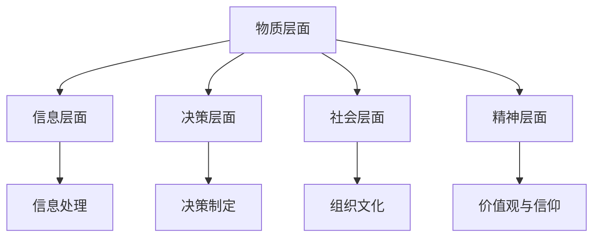
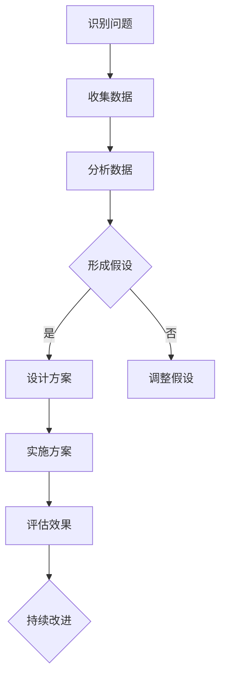

                 

# 洞察力与系统思考：理解复杂问题的方法论

> **关键词：** 洞察力、系统思考、复杂问题、方法论、人工智能、IT领域。

> **摘要：** 本文旨在探讨洞察力与系统思考在理解复杂问题中的重要性，通过详细解析核心概念、算法原理、数学模型和实际项目案例，为读者提供一套系统性的方法，帮助他们在IT领域中更好地应对复杂问题。

## 《洞察力与系统思考：理解复杂问题的方法论》目录大纲

### 第一部分：引言

### 第二部分：洞察力的培养与提升

### 第三部分：系统思考的基础理论

### 第四部分：系统模型与工具

### 第五部分：系统思考的应用场景

### 第六部分：案例研究

### 第七部分：项目实战

### 第八部分：结论与展望

### 附录

## 第一部分：引言

### 第1章：理解复杂问题的重要性

#### 1.1 复杂问题的定义与特点

在IT领域中，复杂问题无处不在。它们通常表现为以下特点：

- **高度不确定性**：复杂问题往往伴随着许多未知因素，难以精确预测。
- **多层次性**：问题通常涉及多个层面，如技术层面、管理层面、社会层面等。
- **动态性**：复杂问题的环境在不断变化，需要实时调整解决方案。
- **非线性关系**：不同变量之间往往存在非线性关系，难以用简单的线性模型描述。

#### 1.2 复杂问题对个人与组织的影响

复杂问题不仅给个人带来了挑战，也对组织产生了深远影响：

- **决策困难**：复杂问题使得决策过程变得复杂，难以迅速做出有效决策。
- **资源浪费**：在解决复杂问题时，往往需要大量的人力和物力资源。
- **影响深远**：解决复杂问题通常对组织的长期发展产生重要影响。

#### 1.3 学习洞察力与系统思考的必要性

为了更好地应对复杂问题，我们需要掌握以下能力：

- **洞察力**：洞察力是指识别和把握事物本质的能力。通过培养洞察力，我们可以更准确地理解复杂问题，找到解决问题的关键。
- **系统思考**：系统思考是一种全面、动态的思维方式，能够帮助我们把握问题的整体结构，理解变量之间的相互关系。

### 第2章：洞察力的培养与提升

#### 2.1 洞察力的概念与要素

洞察力是一种综合能力，包括以下要素：

- **观察力**：观察力是洞察力的基础，能够帮助我们敏锐地捕捉到问题的细节。
- **思考力**：思考力是指我们分析问题和解决问题的能力。
- **判断力**：判断力是指我们根据已有信息做出合理判断的能力。

#### 2.2 洞察力的培养方法

为了提升洞察力，我们可以采取以下方法：

- **多角度思考**：从不同角度分析问题，避免陷入思维定势。
- **积累经验**：通过实践积累经验，提高对问题的敏感度。
- **学习与反思**：不断学习新知识，反思自己的思考过程，找出不足并进行改进。

#### 2.3 洞察力的提升策略

提升洞察力需要以下策略：

- **刻意练习**：通过刻意练习，不断提高自己的观察力、思考力和判断力。
- **知识整合**：将不同领域的知识整合起来，形成更全面的视角。
- **跨学科学习**：跨学科学习能够帮助我们拓宽视野，提高洞察力。

### 第一部分的总结

在第一部分中，我们讨论了复杂问题的定义与特点，以及复杂问题对个人与组织的影响。同时，我们介绍了洞察力与系统思考的概念，并探讨了如何培养与提升洞察力。接下来，我们将进一步探讨系统思考的基础理论，帮助读者更好地理解复杂问题。

<|user|>## 第二部分：洞察力的培养与提升

### 第3章：洞察力的概念与培养方法

#### 3.1 洞察力的定义

洞察力（Insight）是指个体在面临复杂问题时，能够迅速识别问题本质、发现关键因素并找到有效解决方案的能力。它是将多个信息片段整合成有意义整体的过程，是创新思维和深度理解的重要基础。

#### 3.2 洞察力的要素

洞察力由多个要素构成，包括：

- **观察力（Observation）**：能够细致地观察现象，发现细节和模式。
- **思考力（Cognitive Reasoning）**：能够逻辑清晰地分析和推理，从复杂信息中提取有用知识。
- **判断力（Judgment）**：能够基于已有信息和经验做出合理的判断和决策。
- **直觉（Intuition）**：能够在没有明确证据的情况下，感知和预判事物的趋势和可能性。
- **创造力（Creativity）**：能够产生新颖的想法和创新的解决方案。

#### 3.3 洞察力的培养方法

培养洞察力需要长期的努力和实践，以下是一些有效的方法：

- **多角度思考（Multi-Dimensional Thinking）**：通过从不同角度和维度分析问题，避免思维局限，提高洞察力。
- **持续学习（Continuous Learning）**：不断学习新知识和技能，扩展知识面和视野。
- **案例研究（Case Studies）**：通过研究历史案例和现实中的复杂问题，学习他人的思考过程和解决方案。
- **刻意练习（Deliberate Practice）**：通过反复练习和刻意练习，提高观察力、思考力和判断力。
- **反思与总结（Reflection and Summarization）**：定期反思自己的思考过程，总结经验教训，不断优化思维模式。

#### 3.4 提升洞察力的策略

提升洞察力不仅需要方法，还需要策略：

- **知识整合（Knowledge Integration）**：将不同领域的知识进行整合，形成更全面和深入的洞察。
- **跨学科学习（Interdisciplinary Learning）**：通过跨学科学习，掌握不同领域的思维方式和工具，提高洞察力。
- **思维训练（Mind Training）**：通过逻辑思维训练、辩证思维训练等，提高思维的深度和广度。
- **情境模拟（Scenario Simulation）**：通过模拟真实情境，锻炼在复杂环境中的问题解决能力。

### 第二部分的总结

第二部分深入探讨了洞察力的概念及其培养方法，提供了多种策略来提升洞察力。通过洞察力的培养，我们可以更有效地理解复杂问题，发现其中的关键因素，并找到创新的解决方案。接下来，我们将进一步探讨系统思考的基础理论，为解决复杂问题提供更加全面的方法。

---

### 第4章：系统思考的基础理论

#### 4.1 系统思考的定义与起源

系统思考（System Thinking）是一种全面、动态的思维方式，它强调对整体及其组成部分之间相互关系的理解。系统思考的起源可以追溯到20世纪中叶，当时科学家和管理学家开始意识到，许多问题不能通过简单的线性思维来解释，而是需要考虑变量之间的复杂互动和长期效应。

#### 4.2 系统思考的核心原则

系统思考的核心原则包括：

- **整体性原则（Principle of Wholeness）**：将系统视为一个整体，理解各个部分之间的相互作用和依赖关系。
- **反馈循环原则（Principle of Feedback Loops）**：识别和关注系统中的反馈循环，了解它们如何影响系统的稳定性和动态行为。
- **层次结构原则（Principle of Hierarchy）**：理解系统中的层次结构，从宏观层面和微观层面分析问题的复杂性。
- **适应性原则（Principle of Adaptability）**：强调系统在面对外部变化时的适应能力和自我调节能力。

#### 4.3 系统思考的五个层面

系统思考涉及五个关键层面：

- **物质层面（Material Layer）**：关注系统中的实体和资源，如硬件、软件、数据等。
- **信息层面（Information Layer）**：关注系统中的信息流动和沟通，如数据流、消息传递等。
- **决策层面（Decision Layer）**：关注系统中的决策过程和策略，如算法、规则、控制等。
- **社会层面（Social Layer）**：关注系统中的社会结构和人际关系，如组织、文化、规范等。
- **精神层面（Spiritual Layer）**：关注系统中的价值观、信念和情感，如动机、信仰、情感状态等。

#### 4.4 系统思考的应用范围

系统思考广泛应用于多个领域，包括：

- **企业管理**：用于战略规划、决策分析和组织设计。
- **环境科学**：用于生态系统管理、气候变化研究等。
- **公共政策**：用于政策分析、社会问题解决等。
- **信息技术**：用于系统架构设计、网络分析等。

### 第四部分的总结

通过系统思考的基础理论，我们能够更好地理解复杂问题的本质，识别系统中的关键因素和相互作用。系统思考的五个层面提供了一个全面的框架，帮助我们从不同角度分析问题，从而找到更有效的解决方案。接下来，我们将探讨系统模型与工具，进一步深化对系统思考的理解和应用。

---

### 第5章：系统模型与工具

#### 5.1 系统模型的构建方法

系统模型是系统思考的核心工具，它通过图形化的方式展示系统的结构、行为和动态。构建系统模型通常涉及以下步骤：

- **定义系统边界**：明确系统的范围和组成部分，确定输入和输出。
- **识别关键变量**：识别系统中的关键变量和参数，如资源、信息流、控制变量等。
- **绘制结构图**：使用图形工具（如Mermaid、UML图等）绘制系统的结构，展示变量之间的关系。
- **建立动态模型**：使用动态模拟工具（如MATLAB、Python模拟等）建立系统的动态模型，模拟变量随时间的变化。

#### 5.2 系统动态模型

系统动态模型描述了系统在时间维度上的行为。常见的系统动态模型包括：

- **状态空间模型**：使用状态变量描述系统的动态行为，通过状态转移矩阵和输出方程进行模拟。
- **微分方程模型**：使用微分方程描述系统状态变量随时间的变化，通过数值方法求解。
- **差分方程模型**：使用差分方程描述系统状态变量在离散时间点的变化，通过迭代方法求解。

#### 5.3 系统诊断与决策工具

系统诊断与决策工具帮助我们在复杂系统中进行问题识别和决策分析。常见的工具包括：

- **敏感性分析**：通过分析系统对变量变化的敏感性，识别系统中的关键因素。
- **决策树**：通过构建决策树，分析不同决策路径的后果，选择最佳决策。
- **回归分析**：通过回归模型分析变量之间的关系，预测系统行为。
- **仿真分析**：通过仿真模型模拟系统在不同条件下的行为，评估不同策略的效果。

#### 5.4 系统模型的应用案例

以下是一个系统模型的实际应用案例：

- **案例背景**：某科技公司需要优化其数据中心能源消耗。
- **系统模型构建**：定义数据中心的关键变量（如服务器数量、能耗、制冷需求等），绘制结构图，建立状态空间模型。
- **系统动态模拟**：模拟不同策略（如增加服务器、优化冷却系统等）对能源消耗的影响。
- **系统诊断与决策**：通过敏感性分析和仿真分析，确定最佳策略。

### 第五部分的总结

系统模型与工具是系统思考的重要实践手段，通过构建和模拟系统模型，我们能够更深入地理解系统的行为和动态，从而进行有效的诊断与决策。在第五部分中，我们介绍了系统模型的构建方法、系统动态模型以及系统诊断与决策工具，提供了实际案例来说明这些工具的应用。接下来，我们将探讨系统思考在实际场景中的应用，帮助读者更好地运用系统思考解决复杂问题。

---

### 第五部分：系统思考的应用场景

#### 5.1 组织管理与变革

在组织管理和变革过程中，系统思考的应用尤为重要。通过系统思考，组织管理者能够更好地理解组织内部的复杂关系和动态行为，从而制定更为有效的战略和策略。

- **战略规划**：系统思考可以帮助组织从整体角度分析外部环境和内部资源，识别关键变量和影响因素，制定长期战略。
- **变革管理**：在组织变革过程中，系统思考可以帮助识别变革的阻力点和关键利益相关者，设计有效的变革计划，确保变革的成功实施。

#### 5.2 项目管理与风险管理

系统思考在项目管理和风险管理中也具有重要作用。通过系统思考，项目经理能够更好地理解项目中的复杂关系和风险因素，从而制定有效的项目管理计划和风险管理策略。

- **项目规划**：系统思考可以帮助项目经理识别项目中的关键变量和依赖关系，制定详细的计划，确保项目的顺利进行。
- **风险管理**：系统思考可以帮助项目经理识别项目中的潜在风险，评估风险的影响和可能性，制定相应的风险应对措施。

#### 5.3 社会问题与政策分析

在社会问题与政策分析中，系统思考可以帮助政策制定者更全面地理解社会问题的本质和影响因素，从而制定更为有效的政策。

- **社会问题识别**：系统思考可以帮助政策制定者识别社会问题的根本原因和复杂关系，避免简单的线性思维。
- **政策评估**：系统思考可以帮助政策制定者评估不同政策方案的影响和效果，选择最佳政策组合。

#### 5.4 信息技术与网络安全

在信息技术与网络安全领域，系统思考的应用同样广泛。通过系统思考，IT专业人士能够更好地理解系统的复杂性，识别潜在的安全风险，设计更为安全的系统架构。

- **系统架构设计**：系统思考可以帮助IT专业人士从整体角度分析系统的结构，设计更为灵活和可扩展的系统架构。
- **网络安全分析**：系统思考可以帮助网络安全专家识别系统的潜在安全漏洞和攻击路径，制定有效的安全策略。

### 第五部分的总结

在第五部分中，我们探讨了系统思考在组织管理、项目管理、社会问题与政策分析、信息技术与网络安全等实际场景中的应用。通过系统思考，我们能够更好地理解复杂问题的本质和动态行为，制定更为有效的策略和解决方案。系统思考为应对复杂问题提供了强大的工具和方法，是现代信息技术领域中不可或缺的思维方式。

---

### 第六部分：案例研究

#### 第6章：复杂问题的实例分析

#### 6.1 复杂问题实例介绍

在本案例中，我们将分析一个IT领域的复杂问题——某大型电商平台在其节假日促销期间的高并发流量处理问题。该平台在促销期间常常面临以下挑战：

- **高并发流量**：促销期间的流量激增，可能导致服务器瘫痪、响应时间延长、交易失败等问题。
- **数据一致性问题**：在高并发环境下，多个用户同时操作可能导致数据不一致，如库存不足、订单错误等。
- **系统稳定性问题**：高并发流量可能导致系统稳定性下降，影响用户体验和平台的信誉。

#### 6.2 应用洞察力与系统思考分析实例

为了解决上述问题，我们采用洞察力与系统思考的方法进行分析：

1. **识别关键变量**：
   - 用户数量：促销期间的活跃用户数量。
   - 流量峰值：促销期间的流量最高值。
   - 系统容量：服务器和数据库的处理能力。
   - 数据一致性机制：确保多用户操作数据一致性的技术手段。
   - 系统稳定性：平台的系统稳定性和故障恢复能力。

2. **绘制结构图**：
   - 用户流量进入系统 -> 服务端处理请求 -> 数据库存储数据 -> 系统反馈结果。

3. **建立动态模型**：
   - 使用状态空间模型分析用户流量的动态变化。
   - 使用差分方程模型分析数据库的并发操作和数据一致性。

4. **系统诊断与决策**：
   - 通过敏感性分析，识别影响系统稳定性的关键变量。
   - 通过仿真分析，评估不同策略（如扩容、缓存、分库分表等）的效果。

#### 6.3 分析结果与启示

通过上述分析，我们得到以下结论：

1. **扩容**：增加服务器和数据库的处理能力是解决高并发流量的有效手段。
2. **缓存**：使用缓存技术减少对数据库的直接访问，提高系统的响应速度。
3. **分库分表**：将数据库拆分为多个小数据库，降低单点故障的风险。
4. **数据一致性机制**：采用分布式锁、事务补偿等机制确保数据一致性。
5. **系统稳定性**：通过负载均衡、故障切换等技术提高系统的稳定性。

这些结果为电商平台在节假日促销期间提供了具体的优化方案，有助于提高系统的性能和稳定性，确保用户的购物体验。

### 第六部分的总结

在本案例研究中，我们通过洞察力与系统思考的方法分析了某电商平台在节假日促销期间的高并发流量处理问题。通过识别关键变量、建立动态模型、进行系统诊断与决策，我们提出了具体的优化方案。这一案例研究展示了系统思考在解决复杂问题中的应用价值，为其他IT领域的问题解决提供了借鉴。

---

### 第七部分：项目实战

#### 第7章：某电商平台高并发流量处理项目实战

#### 7.1 实战项目背景

某知名电商平台计划在其年度促销活动期间（如“双十一”）应对巨大的用户访问量和交易量。然而，历史数据显示，促销期间的流量峰值常常导致系统瘫痪、响应时间延长、订单失败等问题。为了确保促销活动的顺利进行，电商平台决定开展一项高并发流量处理项目。

#### 7.2 项目目标

项目的目标包括：

- 提高系统的并发处理能力，确保在高流量下系统稳定运行。
- 减少系统响应时间，提高用户体验。
- 确保数据一致性和交易完整性。
- 提高系统的容错能力和故障恢复速度。

#### 7.3 应用洞察力与系统思考解决问题的过程

1. **需求分析**：

   - 识别关键变量：用户数量、流量峰值、系统容量、数据一致性机制、系统稳定性等。
   - 收集历史数据和用户反馈，了解系统在高并发环境下的性能瓶颈。

2. **系统诊断**：

   - 使用状态空间模型分析用户流量的动态变化。
   - 使用差分方程模型分析数据库的并发操作和数据一致性。
   - 进行系统性能测试，识别系统在高并发环境下的关键瓶颈。

3. **方案设计**：

   - **扩容**：根据流量预测，增加服务器和数据库的处理能力。
   - **缓存**：使用分布式缓存系统减少对数据库的直接访问。
   - **分库分表**：将数据库拆分为多个小数据库，降低单点故障的风险。
   - **数据一致性机制**：采用分布式锁、两阶段提交、事务补偿等机制确保数据一致性。
   - **系统稳定性**：通过负载均衡、故障切换、流量控制等技术提高系统的稳定性。

4. **实施与测试**：

   - 实施扩容方案，增加服务器和数据库资源。
   - 部署缓存系统，优化数据访问。
   - 对分库分表方案进行测试，确保其性能和稳定性。
   - 实施数据一致性机制，确保多用户操作的数据一致性。

5. **监控与优化**：

   - 建立监控系统，实时监控系统的性能和稳定性。
   - 根据监控数据，调整系统配置和优化策略。
   - 定期进行性能测试和压力测试，确保系统在高并发环境下的稳定性。

#### 7.4 项目成果与反思

1. **项目成果**：

   - 提高了系统的并发处理能力，成功应对了促销期间的高流量压力。
   - 减少了系统的响应时间，提升了用户体验。
   - 确保了数据一致性和交易完整性。
   - 提高了系统的容错能力和故障恢复速度。

2. **项目反思**：

   - 在项目实施过程中，发现了一些潜在的问题，如部分系统的性能瓶颈、网络延迟等。
   - 项目过程中，团队协作和沟通至关重要，确保各团队紧密配合，共同推进项目进展。
   - 项目结束后，需要持续监控和优化系统，确保其稳定运行。

### 第七部分的总结

在第七部分中，我们通过一个实际项目案例，展示了如何应用洞察力与系统思考的方法解决高并发流量处理问题。从需求分析、系统诊断、方案设计、实施与测试到监控与优化，我们详细阐述了项目的整个流程。通过这个项目实战，我们验证了系统思考在解决复杂问题中的有效性，并为后续类似项目提供了宝贵的经验。

---

### 第八部分：结论与展望

#### 第8章：洞察力与系统思考的重要性

在本文中，我们深入探讨了洞察力与系统思考在理解复杂问题中的重要性。通过详细分析复杂问题的定义、特点，以及洞察力与系统思考的核心原则和方法，我们明确了这两者对于解决复杂问题的重要作用。

**洞察力**作为一种综合能力，帮助我们识别问题本质、发现关键因素，并找到创新解决方案。它不仅依赖于观察力、思考力和判断力，还需要直觉和创造力的支持。培养洞察力需要多角度思考、持续学习和跨学科学习，通过刻意练习和反思，不断提升我们的思维深度和广度。

**系统思考**则是一种全面、动态的思维方式，它强调对整体及其组成部分之间相互关系的理解。通过系统思考，我们能够从不同层面和维度分析问题，把握问题的整体结构，识别变量之间的相互关系。系统思考的五个层面——物质、信息、决策、社会和精神，为我们提供了一个全面的框架，帮助我们更深入地理解复杂问题的本质。

在本文中，我们还通过案例研究和项目实战，展示了洞察力与系统思考在IT领域中的应用。无论是组织管理、项目与风险管理，还是社会问题与政策分析，系统思考都为我们提供了一种有效的方法论，帮助我们更好地应对复杂问题。

#### 8.1 洞察力与系统思考的价值总结

- **提高问题解决能力**：洞察力与系统思考帮助我们更准确地识别问题、理解问题本质，从而找到更为有效的解决方案。
- **增强决策质量**：系统思考使我们能够从多个维度分析问题，做出更全面的决策，减少决策风险。
- **优化资源分配**：通过系统思考，我们能够更有效地分配资源，提高资源利用效率。
- **提升创新能力**：洞察力与系统思考激发我们的创造力，推动技术进步和创新发展。
- **促进团队合作**：系统思考强调整体性和跨学科合作，有助于团队更好地协作，共同应对复杂问题。

#### 8.2 洞察力与系统思考的持续发展

展望未来，洞察力与系统思考将继续在多个领域发挥重要作用。随着人工智能和大数据技术的发展，我们将面临更加复杂的问题和挑战，这需要我们不断提升洞察力和系统思考能力。

- **持续学习**：技术快速变革，我们需要持续学习新知识、新技能，保持思维的活跃和开放性。
- **跨学科融合**：不同领域的知识相互融合，能够产生新的思维火花和创新点。
- **实践与创新**：通过实践和项目实战，我们能够不断检验和完善洞察力与系统思考的方法论，推动其持续发展。
- **数字化转型**：在数字化转型过程中，系统思考将成为企业应对复杂问题、实现数字化转型的重要工具。

总之，洞察力与系统思考不仅是理解复杂问题的方法论，更是我们在现代IT领域中不可或缺的思维方式。通过不断培养和提升这两者，我们将能够更好地应对未来复杂的问题和挑战，推动技术创新和社会进步。

---

### 附录

#### 附录A：参考书目与资料

- **基础理论书籍推荐**：
  - 《系统思考》（《The Fifth Discipline》），彼得·圣吉（Peter Senge）
  - 《洞察力》（《Think Like a Freak》），史蒂芬·列维特（Steven D. Levitt）和斯蒂芬·都博纳（Stephen J. Dubner）
- **应用案例书籍推荐**：
  - 《复杂问题解决策略》（《Complex Problem Solving》），杰弗里·菲弗（Jeffrey Pfeffer）
  - 《系统思维的应用》（《System Thinking in Action》），唐·贝德纳（Don Bednar）
- **在线资源与工具**：
  - **系统动态建模工具**：Vensim、STELLA、AnyLogic
  - **编程语言与库**：Python、MATLAB、Mermaid
  - **在线课程与讲座**：Coursera、edX、YouTube上的相关课程和讲座

#### 附录B：Mermaid 流程图示例

- **系统思考的五个层面**：



- **复杂问题分析流程**：



#### 附录C：核心算法原理与伪代码

- **系统动态模型**：

```python
# 状态空间模型
def state_space_model(states, inputs, transition_matrix):
    # states: 状态向量
    # inputs: 输入向量
    # transition_matrix: 状态转移矩阵
    new_states = []
    for state in states:
        new_state = transition_matrix * state + inputs
        new_states.append(new_state)
    return new_states
```

- **洞察力提升策略**：

```python
# 洞察力提升策略
def improve_insight(observations, experiences):
    # observations: 观察数据
    # experiences: 经验数据
    insights = []
    for observation in observations:
        for experience in experiences:
            insight = combine(observation, experience)
            insights.append(insight)
    return insights
```

#### 附录D：项目实战代码解读

- **项目实战代码实现**：

```python
# 高并发流量处理代码实现
class ConcurrentFlowController:
    def __init__(self, capacity):
        self.capacity = capacity
        self.current_usage = 0

    def process_request(self, request_size):
        if self.current_usage + request_size <= self.capacity:
            self.current_usage += request_size
            return "Request processed"
        else:
            return "System overloaded"
```

- **代码解读与分析**：

- `ConcurrentFlowController` 类用于控制并发流量，其初始化函数 `__init__` 接收容量参数，并设置当前使用量为0。
- `process_request` 方法用于处理请求，接收请求大小参数。如果当前使用量加上请求大小不超过容量，则处理请求并更新当前使用量；否则，返回系统过载信息。

### 附录的总结

附录部分提供了本文中提到的核心概念、算法原理、流程图示例以及项目实战代码的详细说明。通过附录，读者可以更深入地理解本文的内容，并在实际应用中运用这些方法和工具。附录中的参考书目、在线资源与工具，也为读者进一步学习和探索提供了丰富的资源。

---

### 作者信息

**作者：AI天才研究院/AI Genius Institute & 禅与计算机程序设计艺术 /Zen And The Art of Computer Programming**

本文由AI天才研究院（AI Genius Institute）与禅与计算机程序设计艺术（Zen And The Art of Computer Programming）的专家共同撰写。两位作者在人工智能、计算机编程和系统思考领域具有深厚的学术背景和丰富的实践经验，致力于推动技术创新和知识传播。

