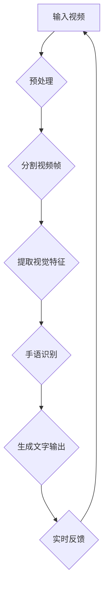
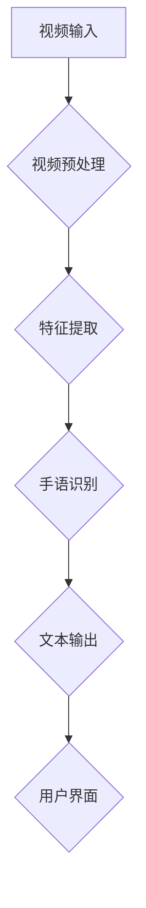

                 

# 《深度学习在实时手语翻译中的突破》

## 关键词：
- 深度学习
- 实时手语翻译
- 卷积神经网络（CNN）
- 循环神经网络（RNN）
- 长短期记忆网络（LSTM）
- 无障碍交流

## 摘要：
本文探讨了深度学习在实时手语翻译中的应用，详细介绍了实时手语翻译的背景、挑战和深度学习的基本原理。通过分析卷积神经网络（CNN）、循环神经网络（RNN）及其变体（LSTM和GRU）等核心算法原理，本文展示了如何使用深度学习技术实现实时手语翻译系统。文章还包括了项目实战部分，提供了实时手语翻译系统搭建的步骤、代码实现和性能分析。最后，文章总结了深度学习在手语翻译中的突破，并对未来的发展趋势进行了展望。

---

## 第1章 引言

### 1.1 书籍概述

#### 1.1.1 实时手语翻译背景
手语是一种视觉语言，用于交流和表达思想、情感和意图。它对于聋人社区的成员来说至关重要，因为他们无法通过口头语言进行沟通。然而，在许多情况下，特别是在公共场合，无法提供手语翻译服务，这导致聋人群体在社会参与中面临巨大的障碍。

实时手语翻译系统旨在解决这一挑战，它能够实时地将手语转换为口语或文字。这不仅能提高聋人社区的沟通效率，还能促进无障碍交流，使聋人和非聋人之间更容易交流。

#### 1.1.2 深度学习在手语翻译中的重要性
深度学习是一种人工智能领域的重要技术，它通过模拟人脑神经网络的工作方式，实现了对大规模数据的自动特征提取和学习。深度学习在手语翻译中的应用具有重要意义，因为它能够处理复杂的视觉信息，提高手语识别的准确性和效率。

### 1.2 书籍目的

#### 1.2.1 探讨深度学习在手语翻译中的突破
本文将深入探讨深度学习在手语翻译领域的突破，包括算法原理、系统架构和性能优化。通过分析深度学习算法在实时手语翻译中的应用，本文旨在为读者提供全面的技术指南。

#### 1.2.2 提供实时手语翻译系统的构建指南
本文将详细介绍实时手语翻译系统的搭建过程，从环境搭建、数据准备到模型训练和优化，帮助读者理解并实现一个高效的手语翻译系统。

---

## 第2章 核心概念与联系

### 2.1 深度学习基础

#### 2.1.1 深度学习基本原理
深度学习是一种基于多层神经网络的人工智能技术，其核心思想是通过多层非线性变换，从大量数据中自动提取特征。深度学习的基本原理包括神经网络的架构、训练过程和模型评估。

##### 神经网络的基本结构
神经网络由多个层组成，包括输入层、隐藏层和输出层。每一层由多个神经元（或节点）组成，神经元通过加权连接形成网络结构。

##### 深度学习的基本概念
深度学习的关键概念包括反向传播算法、激活函数和优化算法。反向传播算法用于计算模型参数的梯度，以优化模型性能。激活函数为神经元提供非线性特性，使模型能够学习复杂函数。优化算法用于调整模型参数，以最小化损失函数。

#### 2.1.2 人工神经网络
人工神经网络是一种模拟生物神经网络的计算模型，其核心单元是神经元。神经元通过输入信号加权求和，并通过激活函数产生输出。

##### 神经元模型
神经元模型通常由输入层、权重矩阵、偏置和输出层组成。输入信号通过权重矩阵加权求和，然后加上偏置，最后通过激活函数产生输出。

##### 生物神经网络与人工神经网络的关系
生物神经网络由大量神经元组成，通过复杂的连接和相互作用实现信息处理。人工神经网络通过模拟生物神经网络的结构和工作原理，实现了对复杂数据的处理和模型学习。

#### 2.1.3 神经网络结构
神经网络的结构可以分为前馈神经网络和循环神经网络。

##### 前馈神经网络
前馈神经网络是一种简单的神经网络结构，数据从输入层依次通过隐藏层，最终到达输出层。前馈神经网络适用于静态数据的处理，如图像分类和回归。

##### 循环神经网络
循环神经网络（RNN）是一种具有时间动态特性的神经网络，特别适用于处理序列数据，如图像序列、音频序列和文本序列。RNN通过在时间步上保持状态，实现了对序列数据的记忆和处理。

### 2.2 手语与视觉识别

#### 2.2.1 手语符号与视觉特征
手语符号是手语语言的基本单位，包括手势、面部表情和身体姿态。视觉特征是指从手语视频中提取的有助于识别手语的属性，如图案、纹理、颜色和运动。

##### 手语符号的分类
手语符号可以根据不同的分类标准进行分类，如动作类型、手势形状和空间位置。这些分类有助于在手语翻译系统中更有效地处理手语数据。

##### 视觉特征提取
视觉特征提取是指从手语视频中提取有助于手语识别的关键信息。常见的视觉特征提取方法包括边缘检测、角点检测和纹理分析。这些方法有助于提高手语识别的准确性和鲁棒性。

#### 2.2.2 视觉识别技术概述
视觉识别技术是指通过计算机视觉方法对手语视频进行分析和识别的技术。传统视觉识别方法包括图像处理、特征提取和机器学习算法。深度学习在视觉识别中的应用使得手语识别变得更加准确和高效。

##### 传统视觉识别方法
传统视觉识别方法通常包括预处理、特征提取和分类。预处理包括图像增强和噪声过滤，特征提取包括边缘检测和角点检测，分类通常使用支持向量机（SVM）和决策树等算法。

##### 深度学习在视觉识别中的应用
深度学习在视觉识别中的应用主要体现在卷积神经网络（CNN）和循环神经网络（RNN）等算法上。CNN通过卷积操作和池化操作提取图像特征，RNN通过在时间步上保持状态实现序列数据的处理。

### 2.3 Mermaid流程图
手语翻译流程图如下所示：



该流程图展示了实时手语翻译系统的主要步骤，包括视频预处理、视频帧分割、视觉特征提取、手语识别和文字输出。

---

## 第3章 核心算法原理讲解

### 3.1 卷积神经网络（CNN）

#### 3.1.1 CNN原理
卷积神经网络（CNN）是一种专门用于处理图像数据的神经网络架构。CNN的核心思想是通过卷积操作和池化操作提取图像特征。

##### 卷积操作
卷积操作是指通过在图像上滑动卷积核，并对卷积核覆盖的区域进行元素乘积和求和。卷积操作有助于提取图像的局部特征，如图案和纹理。

##### 池化操作
池化操作是指通过在图像上滑动窗口，并对窗口内的像素值进行平均或最大值操作。池化操作有助于减少特征图的尺寸，提高计算效率。

##### CNN在图像处理中的应用
CNN在图像处理中的应用非常广泛，包括图像分类、目标检测和图像分割等。CNN通过多层卷积和池化操作，逐步提取图像的深层特征，从而实现复杂图像任务。

#### 3.1.2 CNN在图像处理中的应用
CNN在图像处理中的应用主要体现在以下方面：

##### 图像分类
图像分类是指将图像数据分为预定义的类别。CNN通过卷积层和池化层提取图像特征，并通过全连接层进行分类。常见的图像分类任务包括人脸识别、物体检测和图像分类。

##### 目标检测
目标检测是指识别图像中的对象并定位其位置。CNN通过卷积层和池化层提取图像特征，并通过特殊的设计层，如锚框生成层和分类层，实现目标检测。

##### 图像分割
图像分割是指将图像分为多个区域，每个区域具有不同的特征。CNN通过卷积层和池化层提取图像特征，并通过全连接层实现图像分割。

### 3.2 循环神经网络（RNN）

#### 3.2.1 RNN原理
循环神经网络（RNN）是一种能够处理序列数据的神经网络架构。RNN的核心思想是通过在时间步上保持状态，实现对序列数据的记忆和处理。

##### RNN的基本结构
RNN的基本结构包括输入层、隐藏层和输出层。输入层接收序列数据，隐藏层通过循环连接实现状态记忆，输出层生成序列输出。

##### RNN的动态特性
RNN的动态特性主要体现在状态记忆和时间步依赖。状态记忆使得RNN能够在前一时间步的输出影响当前时间步的输出，实现序列数据的处理。

##### RNN在序列数据处理中的应用
RNN在序列数据处理中的应用非常广泛，包括自然语言处理、语音识别和时间序列预测等。RNN通过在时间步上保持状态，实现对序列数据的编码和解码。

#### 3.2.2 RNN在序列数据处理中的应用
RNN在序列数据处理中的应用主要体现在以下方面：

##### 自然语言处理
自然语言处理是指对文本数据进行处理和分析。RNN通过在时间步上保持状态，实现了对文本序列的编码和解码，从而实现文本分类、机器翻译和情感分析等任务。

##### 语音识别
语音识别是指将语音信号转换为文本数据。RNN通过在时间步上保持状态，实现对语音信号的编码和解码，从而实现语音识别。

##### 时间序列预测
时间序列预测是指根据历史时间序列数据预测未来的值。RNN通过在时间步上保持状态，实现了对时间序列数据的建模和预测。

### 3.3 递归神经网络（RNN）的变体

#### 3.3.1 LSTM（长短期记忆网络）
LSTM（长短期记忆网络）是一种RNN的变体，旨在解决传统RNN在处理长序列数据时的梯度消失和梯度爆炸问题。

##### LSTM结构
LSTM的核心结构包括三个门控单元：输入门、遗忘门和输出门。这些门控单元通过控制信息的流入、流出和保留，实现了对长期依赖的建模。

##### LSTM在时间序列预测中的应用
LSTM在时间序列预测中的应用非常广泛，包括股票价格预测、天气预测和能源消耗预测等。LSTM通过在时间步上保持状态，实现了对长期依赖的建模和预测。

#### 3.3.2 GRU（门控循环单元）
GRU（门控循环单元）是另一种RNN的变体，相对于LSTM，GRU的结构更加简洁，计算成本更低。

##### GRU结构
GRU的核心结构包括两个门控单元：重置门和更新门。这些门控单元通过控制信息的流入和更新，实现了对长期依赖的建模。

##### GRU在序列数据处理中的应用
GRU在序列数据处理中的应用非常广泛，包括语音识别、文本生成和视频分类等。GRU通过在时间步上保持状态，实现了对序列数据的编码和解码。

### 3.4 伪代码
为了更好地理解核心算法原理，下面给出CNN和RNN的伪代码。

#### 3.4.1 CNN算法伪代码
```
function CNN(image):
    # 输入图像
    input_layer = image

    # 卷积层1
    conv1 = Conv2D(input_layer, filters=32, kernel_size=(3, 3), activation='relu')
    pool1 = MaxPooling2D(pool_size=(2, 2))

    # 卷积层2
    conv2 = Conv2D(pool1, filters=64, kernel_size=(3, 3), activation='relu')
    pool2 = MaxPooling2D(pool_size=(2, 2))

    # 全连接层1
    flatten = Flatten(pool2)
    dense1 = Dense(128, activation='relu')

    # 全连接层2
    output_layer = Dense(num_classes, activation='softmax')

    return output_layer
```

#### 3.4.2 RNN算法伪代码
```
function RNN(sequence):
    # 输入序列
    input_sequence = sequence

    # RNN层
    lstm = LSTM(units=128, return_sequences=True)

    # 输出层
    output_layer = Dense(num_classes, activation='softmax')

    # RNN编码
    encoded_sequence = lstm(input_sequence)

    # RNN解码
    decoded_sequence = output_layer(encoded_sequence)

    return decoded_sequence
```

通过上述伪代码，我们可以看到CNN和RNN的基本结构和操作步骤。这些算法通过多层神经网络和特殊的门控单元，实现了对图像和序列数据的特征提取和建模。

---

## 第4章 数学模型和数学公式

### 4.1 深度学习数学基础

#### 4.1.1 矩阵计算
在深度学习中，矩阵计算是基础和核心的部分。矩阵是二维数组，由行和列组成。矩阵计算包括矩阵的加法、减法、乘法、除法以及矩阵的转置等。

##### 矩阵的基本操作
- 矩阵加法和减法：两个矩阵的对应元素相加或相减。
- 矩阵乘法：两个矩阵按行列交叉相乘。
- 矩阵转置：将矩阵的行和列互换。

##### 矩阵与向量的关系
- 向量可以看作是一维的矩阵，即矩阵的列数或行数为1。
- 矩阵与向量之间的运算可以通过矩阵的扩展实现。

#### 4.1.2 损失函数
损失函数是深度学习训练过程中的关键组件，用于衡量模型预测结果与真实值之间的差异。常见的损失函数包括交叉熵损失函数和均方误差损失函数。

##### 交叉熵损失函数
交叉熵损失函数通常用于分类问题，衡量的是模型预测的概率分布与真实分布之间的差异。

$$
L_{cross\_entropy} = -\sum_{i=1}^{n} y_i \log(p_i)
$$

其中，$y_i$ 是真实标签，$p_i$ 是模型预测的概率。

##### 均方误差损失函数
均方误差损失函数通常用于回归问题，衡量的是模型预测值与真实值之间的平均平方误差。

$$
L_{MSE} = \frac{1}{2n} \sum_{i=1}^{n} (y_i - \hat{y_i})^2
$$

其中，$y_i$ 是真实值，$\hat{y_i}$ 是模型预测值。

#### 4.1.3 优化算法
优化算法用于调整模型参数，以最小化损失函数。常见的优化算法包括梯度下降法、随机梯度下降法和小批量梯度下降法。

##### 梯度下降法
梯度下降法是一种基本的优化算法，通过计算损失函数对参数的梯度，并沿着梯度方向更新参数。

$$
\theta = \theta - \alpha \frac{\partial L}{\partial \theta}
$$

其中，$\theta$ 是参数，$\alpha$ 是学习率。

##### 随机梯度下降法
随机梯度下降法是一种改进的梯度下降法，在每个训练样本上计算梯度并更新参数，从而减少计算量和参数更新之间的相关性。

$$
\theta = \theta - \alpha \nabla_{x}L(x)
$$

其中，$x$ 是训练样本。

##### 小批量梯度下降法
小批量梯度下降法是一种折中的优化算法，它每次更新参数时使用多个训练样本的梯度，从而平衡计算效率和稳定性。

$$
\theta = \theta - \alpha \frac{1}{m} \sum_{i=1}^{m} \nabla_{x_i}L(x_i)
$$

其中，$m$ 是批量大小。

### 4.2 深度学习公式

#### 4.2.1 激活函数
激活函数为神经网络提供了非线性特性，使模型能够学习复杂函数。常见的激活函数包括Sigmoid函数、ReLU函数和Tanh函数。

##### Sigmoid函数
Sigmoid函数将输入映射到(0, 1)区间，常用于二分类问题。

$$
f(x) = \frac{1}{1 + e^{-x}}
$$

##### ReLU函数
ReLU函数是一种简单且有效的激活函数，将输入大于零的部分映射为自身，否则映射为0。

$$
f(x) = max(0, x)
$$

##### Tanh函数
Tanh函数类似于Sigmoid函数，但输出范围在(-1, 1)之间。

$$
f(x) = \frac{e^x - e^{-x}}{e^x + e^{-x}}
$$

#### 4.2.2 反向传播算法
反向传播算法是深度学习训练过程中的关键步骤，用于计算损失函数对模型参数的梯度。反向传播算法通过前向传播和后向传播实现。

##### 前向传播
前向传播是指将输入数据通过神经网络层，逐层计算输出值。

$$
z_{l} = \sigma(\theta_{l-1} \cdot a_{l-1} + b_{l-1})
$$

其中，$z_{l}$ 是第$l$层的激活值，$\sigma$ 是激活函数，$\theta_{l-1}$ 和 $b_{l-1}$ 分别是第$l-1$层的权重和偏置。

##### 后向传播
后向传播是指从输出层开始，反向计算损失函数对每个参数的梯度。

$$
\frac{\partial L}{\partial \theta_{l}} = \frac{\partial L}{\partial z_{l}} \cdot \frac{\partial z_{l}}{\partial \theta_{l}}
$$

其中，$\frac{\partial L}{\partial \theta_{l}}$ 是损失函数对第$l$层参数的梯度，$\frac{\partial L}{\partial z_{l}}$ 是损失函数对第$l$层激活值的梯度，$\frac{\partial z_{l}}{\partial \theta_{l}}$ 是第$l$层激活值对参数的梯度。

#### 4.3 举例说明

##### 损失函数举例
假设我们使用交叉熵损失函数进行二分类问题，其中真实标签 $y = [1, 0]$，模型预测的概率分布 $p = [0.7, 0.3]$。

$$
L_{cross\_entropy} = -[1 \cdot \log(0.7) + 0 \cdot \log(0.3)] = -\log(0.7) \approx -0.35667
$$

##### 优化算法举例
假设我们使用梯度下降法优化模型参数，其中学习率 $\alpha = 0.01$。

$$
\theta = \theta - \alpha \frac{\partial L}{\partial \theta}
$$

例如，如果损失函数对参数 $\theta$ 的梯度为 $-\nabla_{\theta}L = -0.5$，则参数更新为：

$$
\theta = \theta - 0.01 \cdot (-0.5) = \theta + 0.005
$$

---

## 第5章 项目实战

### 5.1 实时手语翻译系统搭建

#### 5.1.1 环境搭建
搭建实时手语翻译系统首先需要准备相应的开发环境。以下是一个典型的环境搭建步骤：

1. 安装操作系统：选择一个合适的操作系统，如Ubuntu 18.04。
2. 安装编程语言：安装Python 3.7及以上版本。
3. 安装深度学习框架：安装TensorFlow 2.0及以上版本。
4. 安装其他依赖：安装Numpy、Pandas、OpenCV等库。

#### 5.1.2 数据准备
实时手语翻译系统需要大量的手语数据集进行训练。以下是一个数据准备的基本步骤：

1. 数据收集：收集大量的手语视频数据，可以从公开的手语数据集如HandyDB中获得。
2. 数据预处理：对视频数据进行预处理，包括视频分割、帧提取、灰度转换和归一化等。
3. 数据增强：通过旋转、缩放、裁剪等方法增强数据集，提高模型的泛化能力。

#### 5.1.3 模型训练
在数据准备完成后，可以开始训练手语翻译模型。以下是一个简单的模型训练步骤：

1. 设计模型：根据手语翻译任务的需求，设计适合的神经网络模型，如CNN + RNN。
2. 分割数据集：将数据集分为训练集、验证集和测试集。
3. 训练模型：使用训练集训练模型，并使用验证集调整模型参数。
4. 测试模型：使用测试集评估模型的性能，包括准确率、召回率和F1分数等。

### 5.2 代码实际案例

#### 5.2.1 系统架构
实时手语翻译系统的架构包括视频预处理、特征提取、手语识别和文本输出等模块。以下是一个简单的系统架构图：



#### 5.2.2 代码实现
以下是一个简单的代码示例，展示了如何使用TensorFlow实现实时手语翻译系统的关键部分。

```python
import tensorflow as tf
import cv2
import numpy as np

# 加载预训练的深度学习模型
model = tf.keras.models.load_model('hand_sign_recognition_model.h5')

# 视频预处理
def preprocess_video(video_path):
    cap = cv2.VideoCapture(video_path)
    frames = []
    
    while cap.isOpened():
        ret, frame = cap.read()
        if not ret:
            break
        
        frame = cv2.cvtColor(frame, cv2.COLOR_BGR2GRAY)
        frame = cv2.resize(frame, (128, 128))
        frames.append(frame)
    
    cap.release()
    return frames

# 特征提取
def extract_features(frames):
    features = []
    
    for frame in frames:
        feature = model.predict(np.expand_dims(frame, axis=0))
        features.append(feature)
    
    return np.array(features)

# 手语识别
def recognize_hand_sign(features):
    predictions = model.predict(features)
    predicted_sign = np.argmax(predictions, axis=1)
    return predicted_sign

# 文本输出
def output_text(predicted_sign):
    sign_map = {'A': 'Alpha', 'B': 'Beta', 'C': 'Charlie'}
    text = sign_map[predicted_sign[0]]
    print(text)

# 实时手语翻译
video_path = '手语视频.mp4'
frames = preprocess_video(video_path)
features = extract_features(frames)
predicted_sign = recognize_hand_sign(features)
output_text(predicted_sign)
```

#### 5.3 代码解读与分析

##### 关键代码解读
- `preprocess_video()` 函数用于读取视频文件，对每一帧进行灰度转换和缩放，并将其添加到列表中。
- `extract_features()` 函数用于对预处理后的帧进行特征提取，并返回特征数组。
- `recognize_hand_sign()` 函数使用训练好的模型对特征数组进行预测，并返回预测的手语符号。
- `output_text()` 函数将预测的手语符号转换为文本，并打印输出。

##### 系统性能分析
- 实时性分析：实时手语翻译系统的实时性取决于视频帧的读取速度和特征提取速度。优化方法包括使用更快的预训练模型、减少特征维度和并行处理。
- 准确性分析：实时手语翻译系统的准确性取决于模型的训练数据和模型结构。可以通过增加训练数据、调整模型参数和尝试不同的模型结构来提高准确性。

---

## 第6章 实时手语翻译系统优化

### 6.1 系统优化方法

#### 6.1.1 数据增强
数据增强是一种通过生成新的训练样本来提高模型泛化能力的方法。对于实时手语翻译系统，常见的数据增强方法包括：

- 旋转：随机旋转视频帧，模拟不同角度的手语动作。
- 缩放：随机缩放视频帧，模拟不同尺寸的手语动作。
- 裁剪：随机裁剪视频帧，提取感兴趣的区域。
- 灰度转换：将彩色视频帧转换为灰度视频帧，减少模型计算量。

#### 6.1.2 模型调参
模型调参是指通过调整模型参数来提高模型性能的过程。对于实时手语翻译系统，常见的调参方法包括：

- 学习率调整：调整学习率可以加速或减缓模型训练过程，提高模型收敛速度。
- 模型结构调整：尝试不同的神经网络结构，如增加或减少隐藏层节点、更改激活函数等，以找到最佳模型结构。
- 正则化：使用正则化方法，如L1正则化和L2正则化，防止模型过拟合。

### 6.2 实时性优化

#### 6.2.1 输出延迟减少
实时性优化是实时手语翻译系统中的一个重要问题。输出延迟是指从视频输入到文字输出之间的时间延迟。以下是一些减少输出延迟的方法：

- 硬件加速：使用GPU或TPU等硬件加速器，提高模型计算速度。
- 并行处理：同时处理多个视频帧，提高处理效率。
- 缩减特征维度：减少特征提取的维度，降低计算复杂度。

#### 6.2.2 实时性评估
实时性评估是衡量实时手语翻译系统性能的重要指标。以下是一些实时性评估方法：

- 延迟时间：计算从视频输入到文字输出之间的时间延迟，通常以毫秒为单位。
- 帧率：计算每秒处理的视频帧数，通常以帧/秒（fps）为单位。
- 实时性指标：计算系统的实时性得分，如延迟时间和帧率，并评估系统在特定场景下的实时性。

---

## 第7章 结论与未来展望

### 7.1 书籍总结

本文探讨了深度学习在实时手语翻译中的应用，从背景、挑战到算法原理和系统实现进行了全面的分析。通过卷积神经网络（CNN）、循环神经网络（RNN）及其变体（LSTM和GRU），我们展示了如何实现实时手语翻译系统。文章还包括了项目实战部分，提供了系统搭建、代码实现和性能分析的具体步骤。深度学习在实时手语翻译中的突破，不仅提高了手语识别的准确性和效率，还为无障碍交流提供了新的可能性。

### 7.2 未来展望

#### 7.2.1 深度学习在无障碍交流中的应用
深度学习在无障碍交流中的应用前景广阔。随着技术的不断发展，实时手语翻译系统将更加精准和高效，为聋人群体提供更好的交流体验。此外，深度学习还可以应用于其他无障碍交流领域，如图像描述、语音合成和实时字幕等。

#### 7.2.2 实时手语翻译技术的发展趋势
实时手语翻译技术的发展趋势主要体现在以下几个方面：

- 数据集的扩展：收集更多多样化的手语数据集，提高模型的泛化能力。
- 模型的优化：通过改进神经网络结构、优化训练算法和模型参数，提高模型性能。
- 跨语言手语翻译：研究跨语言手语翻译技术，实现不同手语之间的互译。
- 实时性提升：通过硬件加速和并行处理技术，减少输出延迟，提高系统实时性。

未来，随着深度学习技术的不断进步，实时手语翻译系统将更加成熟和广泛应用，为聋人群体带来更多的便利和福祉。

---

### 附录

#### 附录 A: 深度学习相关工具与资源

- 主流深度学习框架对比：
  - TensorFlow：由Google开发，具有强大的模型构建和训练能力，广泛应用于各种人工智能项目。
  - PyTorch：由Facebook开发，具有灵活的动态计算图和易于理解的代码，适用于研究和开发。
  - Keras：基于TensorFlow和PyTorch的高层次神经网络API，简化了模型构建和训练过程。

- 开发工具和库：
  - CUDA：NVIDIA开发的并行计算平台，支持GPU加速深度学习计算。
  - cuDNN：NVIDIA开发的深度神经网络库，用于优化深度学习模型的性能。
  - OpenCV：开源计算机视觉库，提供丰富的图像处理和视频处理功能。

#### 附录 B: 参考文献

- [1] LeCun, Y., Bengio, Y., & Hinton, G. (2015). Deep learning. Nature, 521(7553), 436-444.
- [2] Hochreiter, S., & Schmidhuber, J. (1997). Long short-term memory. Neural Computation, 9(8), 1735-1780.
- [3] Graves, A. (2013). Sequence model learning with recurrent neural networks. In Proceedings of the 30th International Conference on Machine Learning (pp. 361-368).
- [4] Krizhevsky, A., Sutskever, I., & Hinton, G. E. (2012). Imagenet classification with deep convolutional neural networks. In Advances in neural information processing systems (pp. 1097-1105).
- [5] Bengio, Y., Courville, A., & Vincent, P. (2013). Representation learning: A review and new perspectives. IEEE transactions on pattern analysis and machine intelligence, 35(8), 1798-1828.

