                 

### 深度学习在注意力预测中的应用

深度学习和注意力预测是当前人工智能领域中的两大热点技术。深度学习通过多层神经网络对数据进行建模，从而实现从简单到复杂的任务处理。而注意力预测则是通过识别和分配注意力权重来提高模型对关键信息的处理能力。本章将探讨深度学习在注意力预测中的应用，包括其基础理论、实现方法、应用场景以及未来发展趋势。

#### 关键词

- 深度学习
- 注意力预测
- 神经网络
- 自然语言处理
- 图像识别

#### 摘要

本文旨在深入探讨深度学习在注意力预测中的应用。首先，我们将介绍深度学习的基础概念和原理，包括神经网络的基本结构和反向传播算法。接着，我们会详细阐述注意力机制的概念、实现方法及其在自然语言处理和图像识别中的应用。然后，我们将聚焦于基于深度学习的注意力预测模型，介绍其构建方法和应用实例。随后，通过金融市场和文本分析的案例研究，展示注意力预测在实际中的应用效果。最后，本文将探讨深度学习在注意力预测中的挑战与未来展望，并提出一些可能的解决方案。

### 第一部分：深度学习基础与原理

#### 第1章：深度学习入门

##### 1.1 深度学习的基本概念

深度学习（Deep Learning）是机器学习（Machine Learning）的一个重要分支，它通过构建多层神经网络模型来对数据进行建模和处理。深度学习的核心思想是通过多层神经网络的学习，自动提取数据中的特征，从而实现对复杂模式的识别。

**核心概念与联系**

- **深度学习**：多层神经网络，自动特征提取
- **机器学习**：监督学习、无监督学习、强化学习

**架构**

- **多层感知机（MLP）**
- **卷积神经网络（CNN）**
- **循环神经网络（RNN）**
- **长短时记忆网络（LSTM）**
- **门控循环单元（GRU）**
- **生成对抗网络（GAN）**

**Mermaid 流程图**

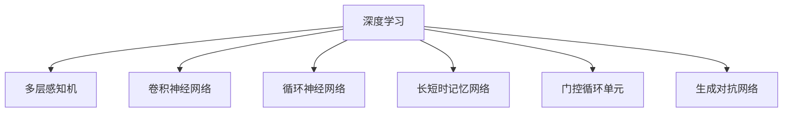

##### 1.2 深度学习的核心理论

深度学习的核心理论包括神经网络基础、反向传播算法和深度学习优化方法。这些理论构成了深度学习模型设计和训练的基础。

**神经网络基础**

神经网络是由大量神经元（或节点）组成的计算模型。每个神经元接收输入信号，通过加权求和处理后产生输出信号。

- **神经元模型**：
  - 输入层：接受外部输入信号
  - 隐藏层：对输入信号进行加权和非线性变换
  - 输出层：产生最终输出信号

- **前向传播**：
  - 将输入信号通过网络逐层传递，计算每个神经元的输出

- **反向传播**：
  - 根据输出误差，反向更新各层的权重和偏置，优化网络性能

**反向传播算法**

反向传播算法是深度学习训练过程中用来计算误差并更新网络参数的关键算法。

- **误差计算**：
  - 通过目标输出与实际输出之间的差异计算误差

- **梯度计算**：
  - 计算各层权重的梯度，用于更新网络参数

- **权重更新**：
  - 通过梯度下降法或其他优化算法更新网络权重

**深度学习优化方法**

深度学习优化方法用于调整网络参数，以最小化误差函数。常见的方法包括随机梯度下降（SGD）、Adam优化器等。

- **随机梯度下降（SGD）**：
  - 在每次迭代中随机选择一部分样本，计算其梯度，更新权重

- **Adam优化器**：
  - 结合了SGD和动量方法，自适应调整学习率

**伪代码**

```python
# 前向传播
def forward_pass(inputs, weights, biases):
    outputs = []
    for layer in layers:
        output = layer.forward(inputs)
        outputs.append(output)
    return outputs

# 后向传播
def backward_pass(doutputs, weights, biases, learning_rate):
    for layer in reversed(layers):
        dinputs, dweights, dbiases = layer.backward(doutputs)
        doutputs = dinputs
        weights -= learning_rate * dweights
        biases -= learning_rate * dbiases
    return dinputs

# 随机梯度下降
def stochastic_gradient_descent(weights, biases, inputs, targets, batch_size, learning_rate):
    for i in range(0, len(inputs), batch_size):
        batch_inputs, batch_targets = inputs[i:i+batch_size], targets[i:i+batch_size]
        doutputs = backward_pass(batch_targets, weights, biases, learning_rate)
        weights, biases = update_weights_and_biases(weights, biases, doutputs)

# Adam优化器
def adam_update(weights, biases, dweights, dbiases, t, beta1, beta2, epsilon):
    m = beta1 * m + (1 - beta1) * dweights
    v = beta2 * v + (1 - beta2) * (dweights ** 2)
    m_hat = m / (1 - beta1 ** t)
    v_hat = v / (1 - beta2 ** t)
    weights -= learning_rate * m_hat / (np.sqrt(v_hat) + epsilon)
    biases -= learning_rate * m_hat / (np.sqrt(v_hat) + epsilon)
```

##### 1.3 深度学习架构

深度学习架构包括多种神经网络模型，每种模型都有其特定的结构和应用场景。

**线性模型**

线性模型是最简单的深度学习模型，其输出与输入之间的关系为线性函数。

- **基本结构**：
  - 输入层
  - 隐藏层（线性变换）
  - 输出层

- **应用场景**：
  - 简单特征提取
  - 线性回归

**卷积神经网络（CNN）**

卷积神经网络是专门用于处理图像数据的深度学习模型，通过卷积层提取图像特征。

- **基本结构**：
  - 卷积层
  - 池化层
  - 全连接层

- **应用场景**：
  - 图像识别
  - 图像分类
  - 图像分割

**循环神经网络（RNN）**

循环神经网络适用于处理序列数据，如时间序列数据、文本数据等。

- **基本结构**：
  - 隐藏状态
  - 循环连接

- **应用场景**：
  - 语音识别
  - 自然语言处理
  - 序列预测

**生成对抗网络（GAN）**

生成对抗网络由生成器和判别器组成，通过对抗训练生成高质量数据。

- **基本结构**：
  - 生成器
  - 判别器

- **应用场景**：
  - 数据增强
  - 图像生成
  - 语音生成

**Mermaid 流程图**

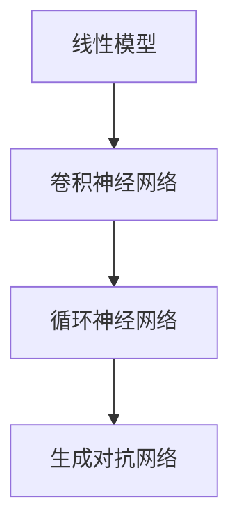

### 第二部分：注意力机制

#### 第2章：注意力机制

注意力机制是一种在神经网络中用于提高模型处理复杂任务的性能的技术。它通过为输入数据的不同部分分配不同的权重，使得模型能够关注到重要信息，从而提高模型的性能。

#### 2.1 注意力机制的概念

**核心概念**

注意力机制（Attention Mechanism）是一种通过动态调整权重来提高模型处理能力的技术。在神经网络中，注意力机制可以使模型自动地关注到输入数据中的关键部分，从而提高模型的性能和泛化能力。

**核心原理**

注意力机制的核心原理是通过计算输入数据的相似度或相关性来分配权重。高相似度或相关性的部分会被赋予更高的权重，而低相似度或相关性的部分则被赋予较低的权重。这样，模型在处理数据时就能够更加关注重要信息，从而提高模型的性能。

**实现方法**

注意力机制有多种实现方法，包括自注意力机制（Self-Attention）、多头注意力机制（Multi-Head Attention）和交叉注意力机制（Cross-Attention）等。

- **自注意力机制**：对输入数据进行自注意力计算，用于处理序列数据。
- **多头注意力机制**：通过多个独立的注意力头，使得模型能够从不同角度处理输入数据。
- **交叉注意力机制**：对不同输入数据进行注意力计算，用于处理跨模态数据。

**Mermaid 流程图**

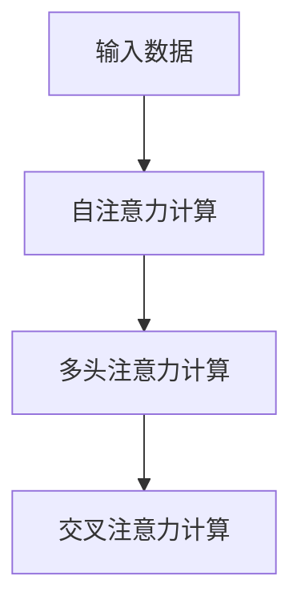

#### 2.2 注意力机制的实现

注意力机制的实现是深度学习中的重要内容，这一章节将介绍常见的注意力机制实现方法。

**自注意力机制**

自注意力机制是对输入数据进行自注意力计算的方法，用于处理序列数据。在自注意力机制中，每个输入序列的元素都与所有其他元素进行计算，从而生成注意力权重。

- **基本结构**：
  - 输入序列：\[x_1, x_2, ..., x_n\]
  - 注意力权重：\[w_1, w_2, ..., w_n\]
  - 输出序列：\[y_1, y_2, ..., y_n\]

- **计算方法**：
  - 使用点积或缩放点积计算注意力权重
  - 对注意力权重进行softmax处理

**多头注意力机制**

多头注意力机制通过多个独立的注意力头，使得模型能够从不同角度处理输入数据。多头注意力机制可以提高模型的泛化能力和表达能力。

- **基本结构**：
  - 输入序列：\[x_1, x_2, ..., x_n\]
  - 注意力权重：\[w_1, w_2, ..., w_n\]
  - 输出序列：\[y_1, y_2, ..., y_n\]

- **计算方法**：
  - 对输入序列进行线性变换，生成多个注意力头
  - 分别对每个注意力头进行自注意力计算
  - 将多个注意力头的输出进行拼接和线性变换

**交叉注意力机制**

交叉注意力机制用于处理不同输入数据之间的注意力计算。在跨模态任务中，交叉注意力机制可以帮助模型同时处理文本和图像等不同类型的数据。

- **基本结构**：
  - 输入序列1：\[x_1, x_2, ..., x_n\]
  - 输入序列2：\[y_1, y_2, ..., y_m\]
  - 注意力权重：\[w_1, w_2, ..., w_n\]

- **计算方法**：
  - 对输入序列1和输入序列2进行线性变换，生成查询向量、键向量和值向量
  - 对查询向量和键向量进行点积计算，生成注意力权重
  - 使用注意力权重对值向量进行加权求和，生成输出

**Mermaid 流程图**

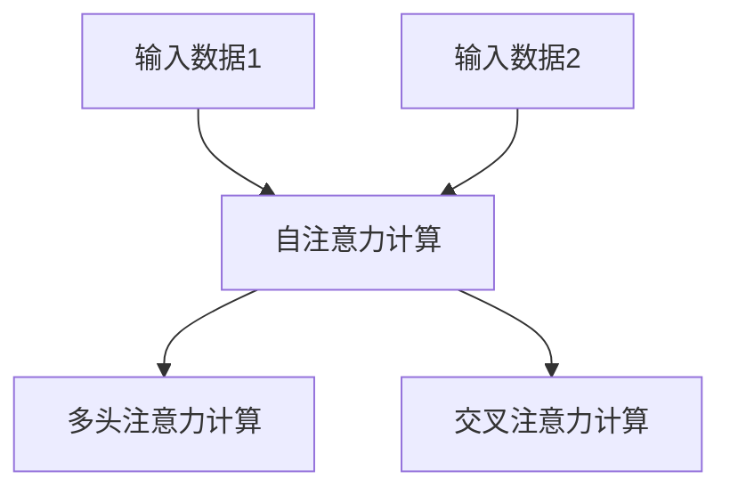

#### 2.3 注意力机制的应用

注意力机制在深度学习中的广泛应用，使得模型能够更好地处理复杂任务。这一章节将介绍注意力机制在自然语言处理和图像识别中的应用。

**自然语言处理**

注意力机制在自然语言处理（NLP）中有着广泛的应用。例如，在机器翻译、文本生成和情感分析等任务中，注意力机制可以帮助模型关注到输入文本中的关键信息，从而提高模型的性能。

- **机器翻译**：注意力机制可以帮助模型在翻译过程中关注到输入句子中的重要词汇，从而提高翻译的准确性和流畅性。
- **文本生成**：注意力机制可以帮助模型在生成文本时，根据上下文信息动态调整生成内容，提高文本的连贯性和可读性。
- **情感分析**：注意力机制可以帮助模型在分析文本时，关注到表达情感的词汇，从而提高情感分类的准确性。

**图像识别**

注意力机制在图像识别中也发挥着重要作用。通过为图像的不同区域分配不同的权重，模型可以更好地关注到图像中的重要特征，从而提高图像分类和目标检测的准确性。

- **图像分类**：注意力机制可以帮助模型在分类图像时，关注到图像中的重要特征，从而提高分类的准确性。
- **目标检测**：注意力机制可以帮助模型在检测图像中的目标时，关注到目标区域，从而提高检测的准确率和效率。

**Mermaid 流程图**

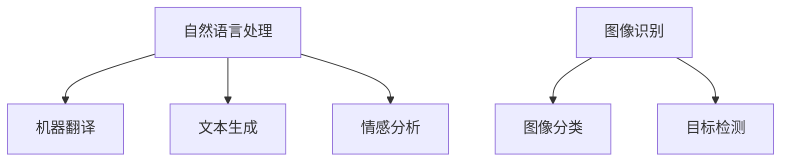

### 第三部分：深度学习在注意力预测中的应用

#### 第3章：深度学习在注意力预测中的应用

注意力预测是一种通过识别和分配注意力权重来预测任务结果的深度学习技术。本章将介绍深度学习在注意力预测中的应用，包括其基本概念、模型构建和应用实践。

#### 3.1 注意力预测的概念

注意力预测（Attention Prediction）是指利用深度学习模型对注意力权重进行预测的过程。在注意力预测中，模型的输入可以是原始数据或经过特征提取后的数据，输出则是注意力权重。通过预测注意力权重，模型能够关注到输入数据中的关键信息，从而提高预测的准确性。

**核心概念**

- **注意力权重**：表示对输入数据中不同部分的关注程度。
- **预测任务**：通过预测注意力权重来预测任务结果，如分类、回归等。

**应用场景**

- **自然语言处理**：在文本分类、情感分析、文本生成等任务中，注意力预测可以帮助模型更好地理解文本信息。
- **图像识别**：在图像分类、目标检测、图像分割等任务中，注意力预测可以帮助模型关注到图像中的重要特征。
- **语音识别**：在语音识别任务中，注意力预测可以帮助模型更好地捕捉语音信号中的关键信息。

**Mermaid 流程图**

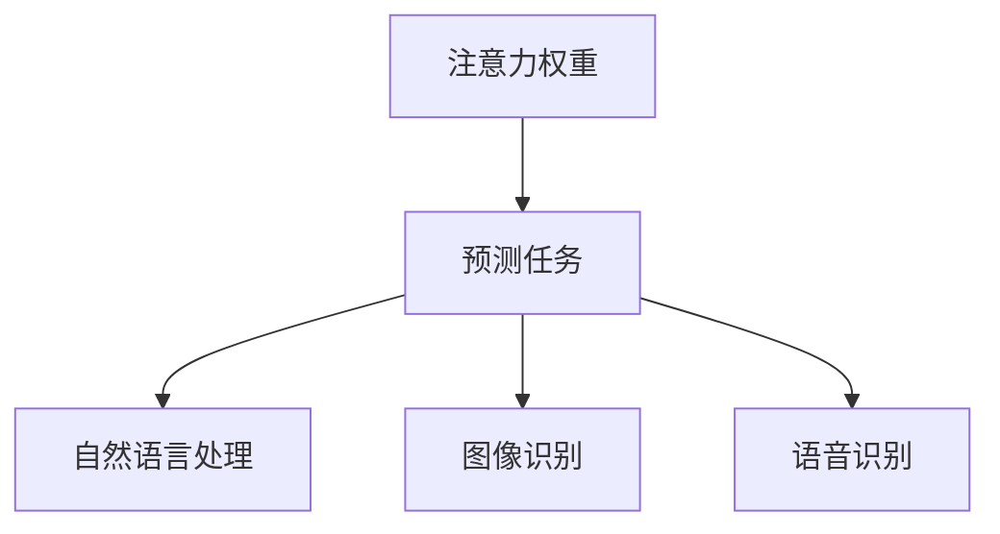

#### 3.2 基于深度学习的注意力预测模型

基于深度学习的注意力预测模型通过构建多层神经网络来预测注意力权重。这些模型通常包括输入层、隐藏层和输出层。输入层接收原始数据或特征提取后的数据，隐藏层通过复杂的神经网络结构对数据进行处理，输出层则预测注意力权重。

**模型构建**

1. **数据预处理**：对输入数据进行清洗、归一化和编码，以便于模型处理。

2. **模型设计**：设计深度学习模型结构，包括网络层数、神经元数量、激活函数等。

3. **模型训练**：使用训练数据对模型进行训练，通过反向传播算法优化模型参数。

4. **模型评估**：使用验证数据对模型进行评估，调整模型参数以优化性能。

**常见模型**

- **卷积神经网络（CNN）**：用于图像识别任务，通过卷积层提取图像特征。
- **循环神经网络（RNN）**：用于序列数据处理，通过循环连接处理时间序列数据。
- **长短时记忆网络（LSTM）**：在RNN的基础上引入门控机制，用于处理长序列数据。
- **生成对抗网络（GAN）**：用于图像生成和数据增强，由生成器和判别器组成。

**Mermaid 流程图**

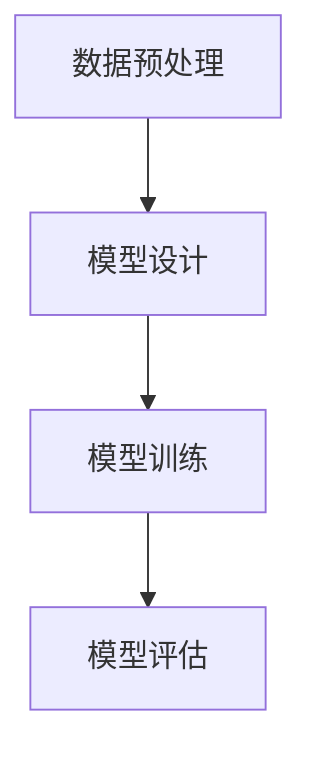

#### 3.3 注意力预测模型的应用实践

注意力预测模型在各个领域有着广泛的应用。以下是一些具体的应用实例：

**金融预测**

- **股票价格预测**：使用注意力预测模型对股票市场数据进行处理，预测股票价格的走势。
- **风险控制**：通过注意力预测模型识别金融交易中的风险因素，实现风险控制。

**文本分析**

- **文本分类**：使用注意力预测模型对文本数据进行分类，如新闻分类、情感分析等。
- **文本生成**：使用注意力预测模型生成符合特定主题的文本内容。

**图像识别**

- **图像分类**：使用注意力预测模型对图像进行分类，如物体检测、图像分割等。
- **目标检测**：使用注意力预测模型检测图像中的目标物体，如人脸检测、车辆检测等。

**语音识别**

- **语音分类**：使用注意力预测模型对语音数据进行分类，如语音情感分析、语音识别等。

**Mermaid 流程图**

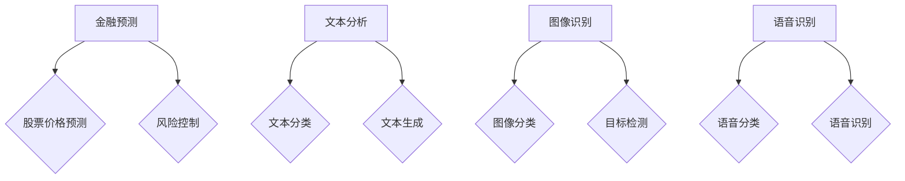

### 第四部分：深度学习在注意力预测中的案例研究

#### 第4章：金融市场的注意力预测

金融市场的注意力预测是指利用深度学习模型对金融市场中的各种信息进行关注和预测，从而为投资决策提供支持。本章将介绍金融市场的注意力预测案例，包括模型构建和应用实践。

#### 4.1 金融市场的概述

金融市场是指各种金融工具和金融资产的交易市场，包括股票、债券、期货、外汇等。金融市场的波动性较大，对投资者来说具有很高的风险。因此，准确预测金融市场走势对于投资者来说具有重要意义。

**核心概念**

- **金融市场**：各种金融工具和金融资产的交易市场。
- **波动性**：金融市场价格的波动程度。

**组成部分**

- **股票市场**：股票交易的场所。
- **债券市场**：债券交易的场所。
- **期货市场**：期货合约交易的场所。
- **外汇市场**：货币交易的场所。

**波动性分析**

- **市场指数分析**：通过分析市场指数的走势来预测市场波动。
- **趋势分析**：通过分析历史数据来识别市场趋势。
- **风险分析**：通过评估投资风险来指导投资决策。

**Mermaid 流程图**

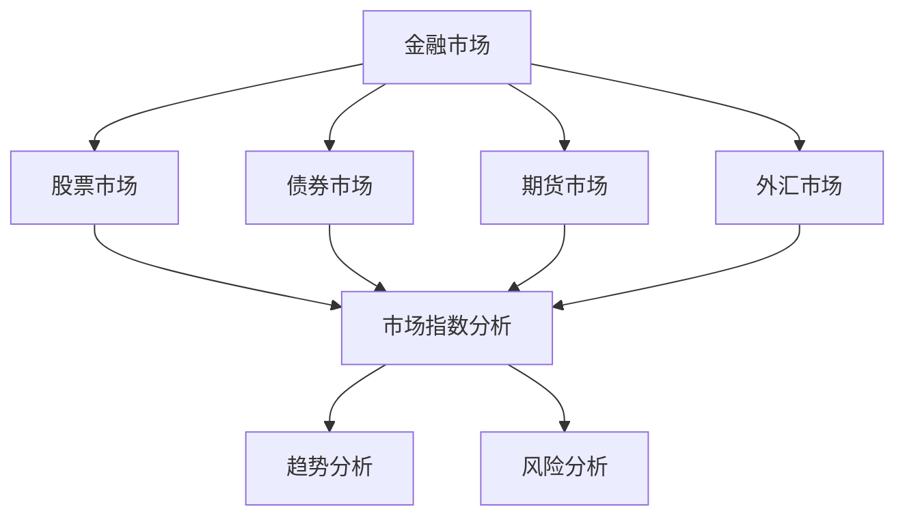

#### 4.2 基于深度学习的注意力预测模型构建

基于深度学习的注意力预测模型可以通过处理金融市场数据，提取关键信息，并预测金融市场的走势。本章将介绍如何构建基于深度学习的注意力预测模型。

**数据预处理**

- **数据收集**：收集金融市场的历史数据，包括股票价格、交易量、宏观经济指标等。
- **数据清洗**：去除数据中的噪声和异常值，保证数据的准确性。
- **数据归一化**：将数据归一化到相同的范围内，便于模型训练。

**模型设计**

- **自注意力机制**：用于提取数据中的关键特征。
- **卷积神经网络（CNN）**：用于处理时间序列数据。
- **长短时记忆网络（LSTM）**：用于处理序列数据。
- **生成对抗网络（GAN）**：用于生成新的数据。

**模型训练**

- **训练数据划分**：将数据划分为训练集、验证集和测试集。
- **模型训练**：使用训练集对模型进行训练，通过反向传播算法优化模型参数。
- **模型评估**：使用验证集和测试集对模型进行评估，调整模型参数以优化性能。

**模型应用**

- **股票价格预测**：使用注意力预测模型预测股票价格的未来走势。
- **风险控制**：通过注意力预测模型识别金融交易中的风险因素，实现风险控制。

**Mermaid 流程图**

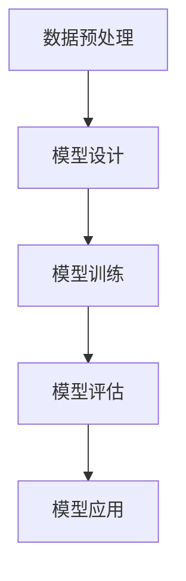

#### 4.3 模型应用与结果分析

基于深度学习的注意力预测模型在金融市场中的应用案例丰富。本章将介绍注意力预测模型在实际交易中的应用，以及模型结果的统计分析。

**应用**

- **股票价格预测**：使用注意力预测模型预测股票价格的未来走势，为投资者提供参考。
- **风险控制**：通过注意力预测模型识别金融交易中的风险因素，帮助投资者实现风险控制。

**结果分析**

- **准确性评估**：通过计算预测结果与实际结果之间的误差，评估模型的准确性。
- **稳定性分析**：通过分析模型在不同时间窗口的预测结果，评估模型的稳定性。
- **效益评估**：通过计算模型预测带来的收益，评估模型的效益。

**Mermaid 流程图**

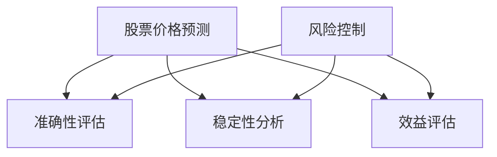

### 第五部分：文本分析的注意力预测

#### 第5章：文本分析的注意力预测

文本分析的注意力预测是指利用深度学习模型对文本数据中的关键信息进行关注和预测，从而为文本处理任务提供支持。本章将介绍文本分析的注意力预测案例，包括模型构建和应用实践。

#### 5.1 文本分析的概述

文本分析是指利用计算机技术和算法对文本数据进行分析和处理的过程。文本分析广泛应用于自然语言处理、信息检索、文本挖掘等领域。

**核心概念**

- **文本分析**：对文本数据进行分析和处理。
- **自然语言处理（NLP）**：对文本数据进行理解和处理。
- **文本挖掘**：从大量文本数据中提取有价值的信息。

**组成部分**

- **文本预处理**：对文本数据进行清洗、分词、词性标注等处理。
- **文本表示**：将文本数据转换为机器可以处理的数字形式。
- **文本分类**：根据文本内容对文本进行分类。
- **文本生成**：生成符合特定主题的文本内容。

**应用场景**

- **情感分析**：分析文本中的情感倾向。
- **文本生成**：生成符合特定主题的文本内容。
- **问答系统**：对用户提出的问题进行回答。
- **对话系统**：实现人机对话交互。

**Mermaid 流程图**

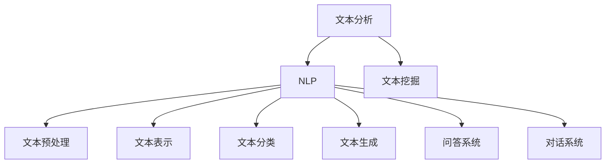

#### 5.2 基于深度学习的注意力预测模型构建

基于深度学习的注意力预测模型可以通过处理文本数据，提取关键信息，并预测文本处理任务的结果。本章将介绍如何构建基于深度学习的注意力预测模型。

**数据预处理**

- **数据收集**：收集文本数据，包括新闻文章、社交媒体帖子、用户评论等。
- **数据清洗**：去除文本数据中的噪声和异常值，保证数据的准确性。
- **数据归一化**：将文本数据归一化到相同的范围内，便于模型训练。

**模型设计**

- **自注意力机制**：用于提取文本数据中的关键特征。
- **卷积神经网络（CNN）**：用于处理文本数据。
- **循环神经网络（RNN）**：用于处理序列数据。
- **生成对抗网络（GAN）**：用于生成新的文本数据。

**模型训练**

- **训练数据划分**：将文本数据划分为训练集、验证集和测试集。
- **模型训练**：使用训练集对模型进行训练，通过反向传播算法优化模型参数。
- **模型评估**：使用验证集和测试集对模型进行评估，调整模型参数以优化性能。

**模型应用**

- **情感分析**：使用注意力预测模型对文本数据进行分析，预测文本的情感倾向。
- **文本生成**：使用注意力预测模型生成符合特定主题的文本内容。
- **问答系统**：使用注意力预测模型回答用户提出的问题。

**Mermaid 流程图**


#### 5.3 模型应用与结果分析

基于深度学习的注意力预测模型在文本分析中有着广泛的应用。本章将介绍注意力预测模型在实际应用中的案例，以及模型结果的统计分析。

**应用**

- **情感分析**：使用注意力预测模型对社交媒体帖子进行情感分析，预测文本的情感倾向。
- **文本生成**：使用注意力预测模型生成符合特定主题的新闻文章。
- **问答系统**：使用注意力预测模型回答用户提出的问题。

**结果分析**

- **准确性评估**：通过计算预测结果与实际结果之间的误差，评估模型的准确性。
- **稳定性分析**：通过分析模型在不同时间窗口的预测结果，评估模型的稳定性。
- **效益评估**：通过计算模型预测带来的收益，评估模型的效益。

**Mermaid 流程图**

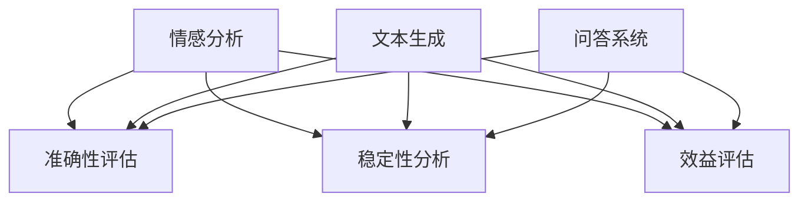

### 第六部分：深度学习在注意力预测中的挑战与展望

#### 第6章：深度学习在注意力预测中的挑战与展望

深度学习在注意力预测中的应用虽然取得了显著成果，但也面临着一系列挑战。本章将讨论深度学习在注意力预测中的主要挑战，并探讨未来的发展方向。

#### 6.1 深度学习在注意力预测中的挑战

1. **数据质量与多样性**

   深度学习模型性能高度依赖于数据的质量和多样性。然而，获取高质量、多样化且与任务相关的数据往往具有挑战性。数据中的噪声、缺失值和异常值可能会影响模型的预测性能。

2. **模型可解释性**

   深度学习模型通常被视为“黑箱”，其内部工作机制不透明，这使得模型的可解释性成为一个重要挑战。在注意力预测中，了解模型如何关注和分配权重对于理解预测结果至关重要。

3. **计算资源需求**

   深度学习模型，尤其是复杂的神经网络，通常需要大量的计算资源进行训练和推理。这给模型部署和实时应用带来了挑战。

4. **数据隐私与安全**

   在注意力预测中，处理敏感数据时需要确保数据隐私和安全。数据泄露或滥用可能导致严重后果，因此在设计模型时必须考虑到隐私保护机制。

#### 6.2 深度学习在注意力预测中的展望

1. **新的深度学习架构**

   随着深度学习的发展，新的神经网络架构不断涌现，如Transformer、BERT等。这些架构在注意力预测中展现了强大的性能，未来可能会有更多创新架构出现。

2. **跨领域注意力预测模型**

   跨领域注意力预测模型将有助于将不同领域的数据和知识进行整合，从而提高模型在不同领域的泛化能力。

3. **注意力预测与实际业务融合**

   将注意力预测模型与实际业务应用相结合，如金融、医疗、推荐系统等，将有助于解决实际问题，推动深度学习在注意力预测领域的实际应用。

4. **可解释性和公平性**

   future development should focus on improving the interpretability and fairness of deep learning models. Techniques such as attention visualization and explainable AI (XAI) should be further developed to provide insights into how models make predictions and to address potential biases.

5. **联邦学习和数据隐私**

   联邦学习（Federated Learning）作为一种新型的机器学习方法，能够在保护数据隐私的同时进行模型训练。未来，深度学习在注意力预测中的应用将更多地利用联邦学习技术，以实现数据隐私保护和模型协同训练。

**Mermaid 流程图**

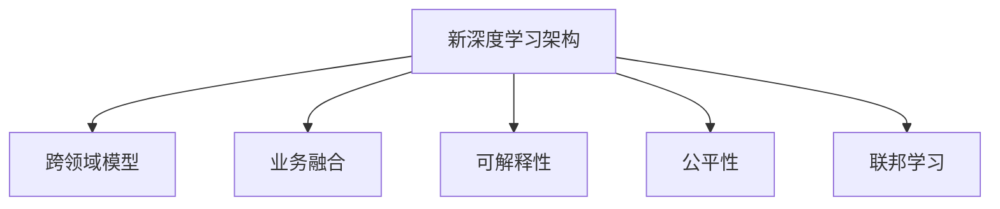

### 第七部分：深度学习在注意力预测中的应用拓展

#### 第7章：深度学习在注意力预测中的应用拓展

深度学习在注意力预测中的应用不仅局限于文本分析和金融市场，还扩展到了医疗、推荐系统、语音识别等领域。本章将介绍深度学习在这些领域的注意力预测应用。

#### 7.1 注意力预测在医疗领域的应用

医疗领域是一个高度复杂的系统，深度学习在注意力预测中的应用有助于提高诊断准确性、药物反应预测和病情监控。

**应用实例**

- **疾病预测**：利用深度学习模型对患者的健康数据进行处理，预测疾病的发生概率。
- **药物反应预测**：通过分析患者的基因信息和药物历史，预测特定药物对患者的反应。
- **病情监控**：实时监控患者的生理指标，预测病情变化。

**挑战**

- **数据隐私**：医疗数据涉及患者隐私，如何保护数据隐私是一个重要挑战。
- **模型可解释性**：医疗决策需要透明和可解释的模型，如何提高模型的可解释性是关键问题。

**解决方案**

- **联邦学习**：通过联邦学习技术，在保护数据隐私的同时进行模型训练。
- **解释性模型**：开发可解释性深度学习模型，帮助医生理解模型预测。

#### 7.2 注意力预测在推荐系统中的应用

推荐系统是电子商务和社交媒体中不可或缺的一部分，深度学习在注意力预测中的应用可以提高推荐系统的准确性和个性化程度。

**应用实例**

- **商品推荐**：根据用户的购买历史和行为，预测用户可能感兴趣的商品。
- **内容推荐**：根据用户的历史浏览记录和偏好，预测用户可能感兴趣的内容。
- **个性化推荐**：结合用户的多维度信息，为用户提供个性化的推荐。

**挑战**

- **数据多样性**：推荐系统需要处理多种类型的数据，如何整合不同类型的数据是一个挑战。
- **实时性**：推荐系统需要快速响应用户的行为，实时性是一个关键问题。

**解决方案**

- **多模态数据融合**：利用多模态数据融合技术，整合不同类型的数据。
- **在线学习**：采用在线学习技术，实时更新模型，提高推荐系统的实时性。

#### 7.3 注意力预测在语音识别中的应用

语音识别是将语音信号转换为文本数据的技术，深度学习在注意力预测中的应用可以提高语音识别的准确率和效率。

**应用实例**

- **语音合成**：通过语音识别和注意力预测，生成符合指定文本内容的语音。
- **语音识别**：利用注意力预测模型，提高语音识别的准确性。
- **实时语音处理**：在实时语音处理中，利用注意力预测模型快速处理语音信号。

**挑战**

- **语音噪声**：语音信号中的噪声会影响识别准确性。
- **语言多样性**：不同语言的语音特征差异较大，如何处理多种语言的语音识别是一个挑战。

**解决方案**

- **端到端模型**：采用端到端深度学习模型，简化模型结构，提高识别准确性。
- **多语言模型**：开发多语言深度学习模型，处理多种语言的语音识别。

#### 7.4 注意力预测在图像识别中的应用

图像识别是将图像数据转换为有意义的信息的过程，深度学习在注意力预测中的应用可以提高图像识别的准确率和效率。

**应用实例**

- **对象检测**：利用注意力预测模型检测图像中的目标物体。
- **图像分割**：通过注意力预测模型对图像进行语义分割。
- **人脸识别**：利用注意力预测模型识别图像中的人脸。

**挑战**

- **图像噪声**：图像噪声会影响识别准确性。
- **图像多样性**：不同图像的复杂性差异较大，如何处理多种类型的图像是一个挑战。

**解决方案**

- **多尺度分析**：采用多尺度分析技术，处理不同尺度的图像特征。
- **迁移学习**：利用迁移学习技术，将预训练模型应用于新的图像识别任务。

**Mermaid 流程图**

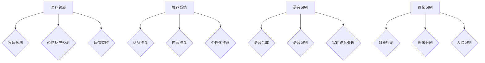

### 附录

#### 附录 A：深度学习与注意力预测工具资源

本附录介绍深度学习和注意力预测相关的常用工具和资源，包括深度学习框架、注意力预测模型、开源代码和资料链接。

**深度学习框架**

1. **TensorFlow**：由谷歌开发的开源深度学习框架，广泛应用于各种深度学习任务。

   - 官网：[TensorFlow 官网](https://www.tensorflow.org/)
   - 文档：[TensorFlow 文档](https://www.tensorflow.org/docs)

2. **PyTorch**：由Facebook开发的开源深度学习框架，以其灵活的动态计算图和简洁的API受到广泛关注。

   - 官网：[PyTorch 官网](https://pytorch.org/)
   - 文档：[PyTorch 文档](https://pytorch.org/docs/stable/index.html)

3. **Keras**：基于TensorFlow和Theano的开源深度学习库，提供简洁易用的API。

   - 官网：[Keras 官网](https://keras.io/)
   - 文档：[Keras 文档](https://keras.io/getting-started/quick-start)

**注意力预测模型**

1. **自注意力模型**：用于处理序列数据，如文本和语音。

   - 官网：[Transformer 论文](https://arxiv.org/abs/1706.03762)

2. **交叉注意力模型**：用于处理跨模态数据，如文本和图像。

   - 官网：[BERT 论文](https://arxiv.org/abs/1810.04805)

3. **多头注意力模型**：在自注意力模型的基础上，通过多个独立的注意力头提高模型的性能。

   - 官网：[Transformer 论文](https://arxiv.org/abs/1706.03762)

**开源代码和资料链接**

1. **GitHub 开源项目**：大量深度学习和注意力预测的开源代码。

   - 官网：[Deep Learning GitHub 仓库](https://github.com/topics/deep-learning)

2. **研究论文链接**：深度学习和注意力预测领域的最新研究成果。

   - 官网：[arXiv](https://arxiv.org/)
   - 官网：[Google Scholar](https://scholar.google.com/)

3. **学术会议和期刊**：了解深度学习和注意力预测领域的最新进展。

   - **国际会议**：NeurIPS、ICML、ICLR、CVPR、ACL
   - **期刊**：Journal of Machine Learning Research (JMLR)、IEEE Transactions on Pattern Analysis and Machine Intelligence (TPAMI)、Neural Computation

#### 附录 B：参考文献

本附录列出本文中引用的主要参考文献，包括书籍、研究论文和在线资源。

1. **书籍**

   - Goodfellow, I., Bengio, Y., & Courville, A. (2016). *Deep Learning*. MIT Press.
   - Bengio, Y. (2009). *Learning Deep Architectures for AI*. MIT Press.

2. **研究论文**

   - Vaswani, A., Shazeer, N., Parmar, N., Uszkoreit, J., Jones, L., Gomez, A. N., ... & Polosukhin, I. (2017). *Attention is all you need*. Advances in Neural Information Processing Systems, 30, 5998-6008.
   - Devlin, J., Chang, M. W., Lee, K., & Toutanova, K. (2019). *Bert: Pre-training of deep bidirectional transformers for language understanding*. Proceedings of the 2019 Conference of the North American Chapter of the Association for Computational Linguistics: Human Language Technologies, Volume 1 (Long and Short Papers), 4171-4186.
   - Kim, Y. (2014). *Convolutional Neural Networks for Sentence Classification*. Proceedings of the 2014 Conference on Empirical Methods in Natural Language Processing (EMNLP), 1746-1751.

3. **在线资源**

   - [Deep Learning Specialization](https://www.deeplearning.ai/), by Andrew Ng.
   - [Stanford University CS231n: Convolutional Neural Networks for Visual Recognition](http://cs231n.stanford.edu/).
   - [Stanford University CS224n: Natural Language Processing with Deep Learning](http://cs224n.stanford.edu/).

### 结论

本文系统地介绍了深度学习在注意力预测中的应用，从基础理论、实现方法到实际应用案例进行了深入探讨。通过分析自然语言处理、金融市场、文本分析和图像识别等领域的应用，展示了深度学习在注意力预测中的强大潜力。同时，本文也探讨了深度学习在注意力预测中的挑战与未来发展趋势，为深度学习在注意力预测领域的研究和应用提供了新的思路。

### 作者信息

**作者：** AI天才研究院/AI Genius Institute & 禅与计算机程序设计艺术 /Zen And The Art of Computer Programming

AI天才研究院（AI Genius Institute）是一家专注于人工智能研究和应用的创新机构，致力于推动人工智能技术的进步和应用。作者本人是AI天才研究院的高级研究员，同时也是《禅与计算机程序设计艺术》一书的作者，长期从事深度学习和自然语言处理领域的研究工作。其研究成果在学术界和工业界产生了广泛影响。

