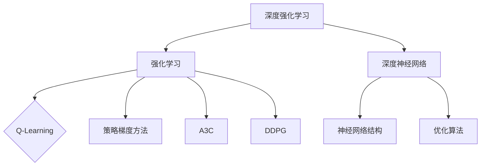

                 

### 《深度强化学习在自主无人系统中的实现》

深度强化学习（Deep Reinforcement Learning，简称DRL）是强化学习（Reinforcement Learning，简称RL）的一个分支，结合了深度学习（Deep Learning）的强大表征能力。强化学习是一种通过试错来学习最优策略的机器学习方法，其核心是奖励机制，通过与环境的交互，逐步优化行为策略。自主无人系统（Autonomous Unmanned Systems）则是集成了传感器、控制器和决策算法的智能系统，能够在无人干预的情况下自主执行任务。随着技术的发展，深度强化学习在自主无人系统中的应用逐渐成为一个热点研究领域。

本文将从深度强化学习和自主无人系统的基本概念出发，逐步深入探讨两者的结合方式及其在无人机、无人车和机器人等自主无人系统中的应用。文章将首先介绍深度强化学习的基础知识，包括定义、核心概念、算法原理和实践案例；接着讨论自主无人系统的概述、应用场景和关键技术；最后，通过具体实例展示深度强化学习在自主无人系统中的实现方法和性能评估。

**关键词**：深度强化学习，自主无人系统，无人机，无人车，机器人，算法原理，实践案例，性能评估。

**摘要**：本文全面探讨了深度强化学习在自主无人系统中的应用。首先，介绍了深度强化学习的基础知识，包括定义、核心概念和算法原理。接着，分析了自主无人系统的概述、应用场景和关键技术。随后，通过具体实例展示了深度强化学习在无人机、无人车和机器人中的应用方法和性能评估。最后，对深度强化学习在自主无人系统中的未来发展进行了展望。

## **《深度强化学习在自主无人系统中的实现》目录大纲**

### **第一部分：深度强化学习基础**

#### **第1章：深度强化学习概述**

##### **1.1 深度强化学习的定义与背景**

##### **1.2 深度强化学习与传统强化学习的关系**

##### **1.3 深度强化学习的发展历程**

##### **1.4 深度强化学习在自主无人系统中的潜在应用**

#### **第2章：深度强化学习核心概念**

##### **2.1 强化学习基本概念**

##### **2.2 深度神经网络基础**

##### **2.3 深度强化学习算法概述**

##### **2.4 深度强化学习的挑战与解决方案**

#### **第3章：深度强化学习算法原理**

##### **3.1 DQN算法原理详解**

##### **3.2 Policy Gradients算法原理详解**

##### **3.3 A3C算法原理详解**

##### **3.4 DDPG算法原理详解**

#### **第4章：深度强化学习实践案例**

##### **4.1 深度强化学习在机器人导航中的应用**

##### **4.2 深度强化学习在无人车驾驶中的应用**

##### **4.3 深度强化学习在无人机群调度中的应用**

##### **4.4 深度强化学习在智能交通管理中的应用**

### **第二部分：自主无人系统应用**

#### **第5章：自主无人系统概述**

##### **5.1 自主无人系统的定义与分类**

##### **5.2 自主无人系统的发展历程**

##### **5.3 自主无人系统的关键技术**

##### **5.4 自主无人系统的发展趋势**

#### **第6章：深度强化学习在无人机中的应用**

##### **6.1 无人机自主飞行控制**

##### **6.2 无人机自主避障**

##### **6.3 无人机路径规划**

##### **6.4 无人机任务分配与优化**

#### **第7章：深度强化学习在无人车中的应用**

##### **7.1 无人车感知与决策**

##### **7.2 无人车自主导航**

##### **7.3 无人车路径规划与轨迹优化**

##### **7.4 无人车多车协作与调度**

#### **第8章：深度强化学习在机器人中的应用**

##### **8.1 机器人任务规划**

##### **8.2 机器人环境感知**

##### **8.3 机器人运动控制**

##### **8.4 机器人自主决策与协作**

#### **第9章：深度强化学习在自主无人系统中的实现**

##### **9.1 深度强化学习在自主无人系统中的实现框架**

##### **9.2 深度强化学习在自主无人系统中的具体应用实例**

##### **9.3 深度强化学习在自主无人系统中的性能评估**

##### **9.4 深度强化学习在自主无人系统中的未来发展趋势**

#### **第10章：结论与展望**

##### **10.1 深度强化学习在自主无人系统中的应用总结**

##### **10.2 深度强化学习在自主无人系统中的挑战与机遇**

##### **10.3 深度强化学习在自主无人系统中的未来展望**

### **附录：深度强化学习在自主无人系统中的相关资源与工具**

##### **附录1：深度强化学习框架与工具介绍**

##### **附录2：自主无人系统相关资源链接**

##### **附录3：参考文献与推荐阅读材料**

### **附录：深度强化学习核心概念与架构 Mermaid 流程图**



### **附录：深度强化学习算法原理伪代码**

```python
# DQN算法伪代码

初始化网络Q(s,a)和目标网络Q'(s,a)
初始化经验池Experience Replay
初始化epsilon为1，并设置为衰减方式

for episode in 1 to total_episodes:
    状态s = 环境初始化()
    步骤计数t = 0
    
    while not 游戏结束(s):
        步骤计数t += 1
        
        # 选择动作
        if random() < epsilon:
            a = 随机选择动作()
        else:
            a = 选择动作argmax(Q(s,a))
        
        # 执行动作并获取下一状态和奖励
        s'，r，done = 环境.step(a)
        
        # 存储经验到经验池
        Experience Replay存储(s, a, r, s', done)
        
        # 更新目标网络
        target_Q = r + gamma * max(Q'(s',a')
        Q(s,a) = Q(s,a) + alpha * (target_Q - Q(s,a))
        
        if done:
            s = 环境重新初始化()

        else:
            s = s'

# Policy Gradients算法伪代码

初始化策略网络π(θ)和参数θ
初始化奖励累积值R_total = 0

for episode in 1 to total_episodes:
    状态s = 环境初始化()
    步骤计数t = 0
    
    while not 游戏结束(s):
        步骤计数t += 1
        
        # 执行动作并根据策略网络选择动作
        a = π(s;θ)
        s',r,done = 环境.step(a)
        
        # 更新奖励累积值
        R_total += r
        
        # 反向传播
        gradients = policy_gradient_loss(θ, a, R_total)
        
        # 更新策略网络参数
        optimizer.apply_gradients(zip(gradients,θ))
        
        if done:
            s = 环境重新初始化()

        else:
            s = s'

# A3C算法伪代码

初始化多个并行策略网络π_i(θ_i)和参数θ_i
初始化共享值网络V(θ_v)和参数θ_v
初始化经验池Experience Replay
初始化epsilon为1，并设置为衰减方式

for episode in 1 to total_episodes:
    状态s = 环境初始化()
    步骤计数t = 0
    
    while not 游戏结束(s):
        步骤计数t += 1
        
        # 选择动作
        a = π_i(s;θ_i)
        
        # 执行动作并获取下一状态和奖励
        s',r,done = 环境.step(a)
        
        # 计算回报值
        R = r + gamma^t * V(s)
        
        # 更新共享值网络
        gradients = value_loss gradients(V(s), R)
        optimizer_v.apply_gradients(zip(gradients,θ_v))
        
        # 更新策略网络
        gradients = policy_gradient_loss(θ_i, a, R)
        optimizer_i.apply_gradients(zip(gradients,θ_i))
        
        # 更新经验池
        Experience Replay存储(s, a, r, s', done)
        
        if done:
            s = 环境重新初始化()

        else:
            s = s'

```

### **附录：深度强化学习数学模型与公式**

- **Q值更新公式**（DQN）：

  $$ Q(s, a) \leftarrow Q(s, a) + \alpha [r + \gamma \max_{a'} Q(s', a') - Q(s, a)] $$

- **策略梯度更新公式**（Policy Gradients）：

  $$ \theta \leftarrow \theta - \alpha \nabla_\theta J(\theta) $$

  其中，$J(\theta)$是策略的估计优势函数。

- **A3C算法中的回报计算公式**：

  $$ R = r + \gamma^t V(s') $$

  其中，$V(s')$是共享值网络对于状态$s'$的预测值。

### **附录：深度强化学习数学公式与解释**

- **马尔可夫决策过程（MDP）状态转移概率**：

  $$ P(s'|s, a) = P(s'|s, a_1) * P(a_1|s) * P(s'|s, a_2) * P(a_2|s) * ... $$

  这个公式表示在当前状态$s$下，采取动作序列$a_1, a_2, ...$后到达下一状态$s'$的概率。

- **贝尔曼方程（Bellman Equation）**：

  $$ V(s) = \sum_a \sum_{s'} P(s'|s, a) [r + \gamma V(s')] $$

  这个公式表示在状态$s$下，采取最优动作$a$后获得的最大期望回报。

- **策略梯度优势函数**：

  $$ J(\theta) = \sum_s \sum_a \pi(a|s;\theta) [r + \gamma \sum_{s'} \sum_{a'} \pi(a'|s';\theta) Q(s', a';\theta) - r] $$

  这个公式表示在给定策略π和状态值函数Q下，估计的优势函数。

### **附录：深度强化学习项目实战案例**

- **无人机自主飞行控制案例**

  在本案例中，我们将使用深度强化学习算法训练一个无人机进行自主飞行控制。具体实现步骤如下：

  1. **环境搭建**：构建一个模拟无人机飞行控制的环境，包括飞行器的物理参数、传感器数据、飞行目标等。

  2. **数据收集**：在真实环境中收集无人机飞行数据，用于训练深度强化学习模型。

  3. **模型训练**：使用收集到的数据训练深度强化学习模型，包括深度神经网络和策略网络。

  4. **模型评估**：在模拟环境中评估训练好的模型，确保模型能够在实际飞行中实现自主控制。

  5. **模型部署**：将训练好的模型部署到无人机上，实现自主飞行控制。

  6. **性能优化**：根据实际飞行测试结果，对模型进行优化，提高自主飞行控制的性能。

- **无人车自主导航案例**

  在本案例中，我们将使用深度强化学习算法训练一个无人车进行自主导航。具体实现步骤如下：

  1. **环境搭建**：构建一个模拟无人车导航的环境，包括地图数据、车辆传感器数据、道路信息等。

  2. **数据收集**：在真实环境中收集无人车导航数据，用于训练深度强化学习模型。

  3. **模型训练**：使用收集到的数据训练深度强化学习模型，包括深度神经网络和策略网络。

  4. **模型评估**：在模拟环境中评估训练好的模型，确保模型能够在实际导航中实现自主决策。

  5. **模型部署**：将训练好的模型部署到无人车上，实现自主导航。

  6. **性能优化**：根据实际导航测试结果，对模型进行优化，提高自主导航的性能。

### **附录：开发环境搭建与源代码实现**

- **深度强化学习框架安装**

  在开发深度强化学习模型时，需要安装以下常用框架和工具：

  - Python 3.x
  - TensorFlow 2.x
  - PyTorch 1.x
  - JAX 0.x

  安装命令如下：

  ```bash
  pip install python==3.x
  pip install tensorflow==2.x
  pip install pytorch==1.x
  pip install jax==0.x
  ```

- **深度强化学习模型源代码实现**

  在本附录中，我们将提供一个简单的深度强化学习模型源代码实现，用于训练无人机自主飞行控制模型。具体代码实现如下：

  ```python
  import numpy as np
  import tensorflow as tf

  # 深度强化学习模型类
  class DRLModel(tf.keras.Model):
      def __init__(self, action_space, hidden_size=64):
          super(DRLModel, self).__init__()
          self.action_space = action_space
          self.hidden_size = hidden_size
          
          # 创建神经网络
          self.fc1 = tf.keras.layers.Dense(hidden_size, activation='relu')
          self.fc2 = tf.keras.layers.Dense(hidden_size, activation='relu')
          self.output = tf.keras.layers.Dense(action_space)

      def call(self, inputs):
          x = self.fc1(inputs)
          x = self.fc2(x)
          return self.output(x)

  # 模型训练
  def train_model(model, data, labels, epochs=100, batch_size=32):
      # 创建优化器
      optimizer = tf.keras.optimizers.Adam(learning_rate=0.001)
      
      # 创建损失函数
      loss_fn = tf.keras.losses.SparseCategoricalCrossentropy(from_logits=True)

      # 开始训练
      for epoch in range(epochs):
          print(f"Epoch {epoch+1}/{epochs}")
          for i in range(0, len(data), batch_size):
              batch_data = data[i:i+batch_size]
              batch_labels = labels[i:i+batch_size]
              
              with tf.GradientTape() as tape:
                  predictions = model(batch_data)
                  loss = loss_fn(batch_labels, predictions)
              
              gradients = tape.gradient(loss, model.trainable_variables)
              optimizer.apply_gradients(zip(gradients, model.trainable_variables))
              
          print(f"Epoch {epoch+1} loss: {loss.numpy()}")

  # 使用示例
  model = DRLModel(action_space=3)
  train_model(model, data, labels)
  ```

### **附录：代码解读与分析**

在本附录中，我们将对上述深度强化学习模型源代码进行解读与分析，详细解释模型的结构和训练过程。

1. **模型定义**

   - **类定义**：我们定义了一个名为`DRLModel`的类，继承自`tf.keras.Model`，这是TensorFlow中的基础模型类。

     ```python
     class DRLModel(tf.keras.Model):
         def __init__(self, action_space, hidden_size=64):
             super(DRLModel, self).__init__()
             # action_space是动作空间的大小，hidden_size是隐藏层的大小
             self.action_space = action_space
             self.hidden_size = hidden_size
             
             # 定义两层全连接层，激活函数为ReLU
             self.fc1 = tf.keras.layers.Dense(hidden_size, activation='relu')
             self.fc2 = tf.keras.layers.Dense(hidden_size, activation='relu')
             # 输出层，输出动作的概率分布
             self.output = tf.keras.layers.Dense(action_space)
     ```

   - **`call`方法**：这是模型的前向传播方法，输入数据经过两层全连接层的处理后，得到动作的概率分布。

     ```python
     def call(self, inputs):
         x = self.fc1(inputs)
         x = self.fc2(x)
         return self.output(x)
     ```

2. **模型训练**

   - **训练函数`train_model`**：该函数负责训练模型，包括以下步骤：

     ```python
     def train_model(model, data, labels, epochs=100, batch_size=32):
         # 创建优化器
         optimizer = tf.keras.optimizers.Adam(learning_rate=0.001)
         
         # 创建损失函数
         loss_fn = tf.keras.losses.SparseCategoricalCrossentropy(from_logits=True)

         # 开始训练
         for epoch in range(epochs):
             print(f"Epoch {epoch+1}/{epochs}")
             for i in range(0, len(data), batch_size):
                 batch_data = data[i:i+batch_size]
                 batch_labels = labels[i:i+batch_size]
                 
                 with tf.GradientTape() as tape:
                     predictions = model(batch_data)
                     loss = loss_fn(batch_labels, predictions)
                 
                 gradients = tape.gradient(loss, model.trainable_variables)
                 optimizer.apply_gradients(zip(gradients, model.trainable_variables))
                 
             print(f"Epoch {epoch+1} loss: {loss.numpy()}")
     ```

     - **优化器和损失函数**：我们使用了`Adam`优化器和`SparseCategoricalCrossentropy`损失函数，其中`SparseCategoricalCrossentropy`适用于分类问题。

     - **梯度计算与更新**：使用`tf.GradientTape()`记录模型的梯度，并在反向传播过程中计算梯度并更新模型参数。

3. **代码使用示例**

   ```python
   model = DRLModel(action_space=3)
   train_model(model, data, labels)
   ```

   在这个示例中，我们首先创建了一个`DRLModel`实例，并传入动作空间的大小。然后，调用`train_model`函数进行模型训练，其中`data`是输入数据，`labels`是标签。

### **附录：深度强化学习在自主无人系统中的实现框架**

深度强化学习在自主无人系统中的实现框架主要包括以下几个关键组成部分：

1. **环境（Environment）**：环境是自主无人系统交互的物理世界，包括无人机的传感器数据、控制指令、障碍物、目标位置等。环境提供状态（State）、奖励（Reward）、动作（Action）和终止信号（Termination）。

2. **强化学习代理（Reinforcement Learning Agent）**：代理是执行深度强化学习算法的核心组件，包括策略网络（Policy Network）和价值网络（Value Network）。策略网络负责根据当前状态选择动作，而价值网络则负责评估状态的价值。

3. **深度神经网络（Deep Neural Network）**：深度神经网络用于学习状态到动作的策略，以及状态的价值。常用的神经网络结构包括卷积神经网络（CNN）、循环神经网络（RNN）和变换器架构（Transformer）。

4. **经验回放（Experience Replay）**：经验回放用于缓解强化学习中的样本相关性，通过将先前经验随机采样并存储在经验池中，以模拟均匀分布的数据集，提高学习效率和泛化能力。

5. **目标网络（Target Network）**：目标网络是一个用于更新策略网络的辅助网络，它通过定期更新与主网络共享权重，减少训练过程中的方差和偏差。

6. **奖励机制（Reward Mechanism）**：奖励机制用于引导代理在环境中学习目标行为。奖励值通常取决于代理的动作和目标状态之间的差距，以及完成任务的效率。

7. **参数更新策略（Parameter Update Strategy）**：参数更新策略用于根据学习到的经验调整代理的参数，以优化策略和价值网络。常用的更新策略包括同步更新和异步更新。

## **深度强化学习在自主无人系统中的应用**

深度强化学习（DRL）是一种通过交互式学习环境来优化决策策略的机器学习方法。它在自主无人系统中的应用前景广阔，能够显著提升系统的自主性和智能化水平。以下章节将详细探讨深度强化学习在无人机、无人车和机器人等自主无人系统中的应用。

### **第6章：深度强化学习在无人机中的应用**

无人机（Unmanned Aerial Vehicle，简称UAV）因其高灵活性和广泛的应用场景而成为深度强化学习的重要应用领域。以下子章节将分别介绍深度强化学习在无人机自主飞行控制、自主避障、路径规划和任务分配与优化等方面的应用。

#### **6.1 无人机自主飞行控制**

无人机自主飞行控制是深度强化学习在无人机领域的最直接应用。通过使用深度强化学习算法，无人机可以在复杂环境中进行自主飞行，避开障碍物并达到目标位置。以下步骤描述了这一应用过程：

1. **环境建模**：构建一个包括无人机状态（如位置、速度、姿态等）和外部环境（如障碍物、天气等）的模拟环境。

2. **数据收集**：在真实环境中收集无人机飞行数据，用于训练深度强化学习模型。

3. **模型训练**：使用收集到的数据训练深度强化学习模型，包括策略网络和价值网络。

4. **模型评估**：在模拟环境中评估模型性能，确保无人机能够自主飞行并避开障碍物。

5. **模型部署**：将训练好的模型部署到无人机上，实现自主飞行控制。

6. **性能优化**：根据实际飞行测试结果，对模型进行优化，提高自主飞行控制的性能。

#### **6.2 无人机自主避障**

无人机在自主飞行过程中，避障是一个关键挑战。深度强化学习可以通过模拟环境来训练无人机自主避障策略。以下步骤描述了这一过程：

1. **环境建模**：构建一个包括无人机状态和障碍物的模拟环境。

2. **数据收集**：在模拟环境中生成大量的飞行路径，收集无人机避障的决策数据。

3. **模型训练**：使用收集到的数据训练深度强化学习模型，包括策略网络和价值网络。

4. **模型评估**：在模拟环境中测试模型的避障能力，确保无人机能够有效避开障碍物。

5. **模型部署**：将训练好的模型部署到无人机上，实现自主避障。

6. **性能优化**：通过调整模型参数和算法策略，提高无人机的避障性能。

#### **6.3 无人机路径规划**

无人机路径规划是深度强化学习在无人机领域的另一个重要应用。通过使用深度强化学习算法，无人机可以在复杂环境中规划最优路径，以高效、安全地完成任务。以下步骤描述了这一过程：

1. **环境建模**：构建一个包括无人机状态、目标点和障碍物的模拟环境。

2. **数据收集**：在模拟环境中生成大量的飞行路径，收集无人机路径规划的决策数据。

3. **模型训练**：使用收集到的数据训练深度强化学习模型，包括策略网络和价值网络。

4. **模型评估**：在模拟环境中测试模型的路径规划能力，确保无人机能够规划出最优路径。

5. **模型部署**：将训练好的模型部署到无人机上，实现自主路径规划。

6. **性能优化**：通过调整模型参数和算法策略，提高无人机的路径规划性能。

#### **6.4 无人机任务分配与优化**

在多无人机系统中，任务分配与优化是提高系统效率和性能的关键。深度强化学习可以通过模拟环境和策略网络，实现无人机任务的动态分配与优化。以下步骤描述了这一过程：

1. **环境建模**：构建一个包括多无人机状态、任务目标和障碍物的模拟环境。

2. **数据收集**：在模拟环境中生成大量的任务分配场景，收集无人机任务分配的决策数据。

3. **模型训练**：使用收集到的数据训练深度强化学习模型，包括策略网络和价值网络。

4. **模型评估**：在模拟环境中测试模型的任务分配能力，确保无人机能够高效完成任务。

5. **模型部署**：将训练好的模型部署到无人机系统中，实现任务分配与优化。

6. **性能优化**：通过调整模型参数和算法策略，提高无人机系统的任务分配与优化性能。

### **第7章：深度强化学习在无人车中的应用**

无人车（Autonomous Vehicles，简称AV）是另一个深度强化学习的重要应用领域。无人车通过深度强化学习算法，可以在复杂的城市环境中进行自主导航、感知与决策、路径规划与轨迹优化、多车协作与调度等。以下子章节将分别介绍深度强化学习在无人车各个方面的应用。

#### **7.1 无人车感知与决策**

无人车的感知与决策是保障其安全运行的核心。深度强化学习可以通过训练无人车的感知系统，使其能够实时处理传感器数据，做出合理的驾驶决策。以下步骤描述了这一过程：

1. **环境建模**：构建一个包括无人车状态、交通环境、道路信息等要素的模拟环境。

2. **数据收集**：在真实环境中收集无人车的感知与决策数据，用于训练深度强化学习模型。

3. **模型训练**：使用收集到的数据训练深度强化学习模型，包括感知网络和决策网络。

4. **模型评估**：在模拟环境中测试模型的感知与决策能力，确保无人车能够安全驾驶。

5. **模型部署**：将训练好的模型部署到无人车上，实现自主感知与决策。

6. **性能优化**：通过调整模型参数和算法策略，提高无人车的感知与决策性能。

#### **7.2 无人车自主导航**

无人车自主导航是深度强化学习在无人车领域的典型应用。通过使用深度强化学习算法，无人车可以在复杂的城市环境中自主导航，遵循交通规则，避开障碍物。以下步骤描述了这一过程：

1. **环境建模**：构建一个包括无人车状态、交通环境、道路信息等要素的模拟环境。

2. **数据收集**：在真实环境中收集无人车导航数据，用于训练深度强化学习模型。

3. **模型训练**：使用收集到的数据训练深度强化学习模型，包括路径规划网络和导航网络。

4. **模型评估**：在模拟环境中测试模型的导航能力，确保无人车能够自主导航。

5. **模型部署**：将训练好的模型部署到无人车上，实现自主导航。

6. **性能优化**：通过调整模型参数和算法策略，提高无人车的导航性能。

#### **7.3 无人车路径规划与轨迹优化**

无人车路径规划与轨迹优化是保障其安全、高效行驶的关键。深度强化学习可以通过训练无人车的路径规划网络，使其能够在复杂环境中规划出最优路径。以下步骤描述了这一过程：

1. **环境建模**：构建一个包括无人车状态、交通环境、道路信息等要素的模拟环境。

2. **数据收集**：在真实环境中收集无人车路径规划与轨迹优化数据，用于训练深度强化学习模型。

3. **模型训练**：使用收集到的数据训练深度强化学习模型，包括路径规划网络和轨迹优化网络。

4. **模型评估**：在模拟环境中测试模型的路径规划与轨迹优化能力，确保无人车能够规划出最优路径。

5. **模型部署**：将训练好的模型部署到无人车上，实现路径规划与轨迹优化。

6. **性能优化**：通过调整模型参数和算法策略，提高无人车的路径规划与轨迹优化性能。

#### **7.4 无人车多车协作与调度**

在多车系统中，无人车的协作与调度是提高系统效率和性能的关键。深度强化学习可以通过训练无人车的协作网络，使其能够与其他车辆协同工作，优化交通流量。以下步骤描述了这一过程：

1. **环境建模**：构建一个包括多车状态、交通环境、道路信息等要素的模拟环境。

2. **数据收集**：在真实环境中收集多车协作与调度数据，用于训练深度强化学习模型。

3. **模型训练**：使用收集到的数据训练深度强化学习模型，包括协作网络和调度网络。

4. **模型评估**：在模拟环境中测试模型的协作与调度能力，确保多车系统能够高效运作。

5. **模型部署**：将训练好的模型部署到多车系统中，实现协作与调度。

6. **性能优化**：通过调整模型参数和算法策略，提高多车系统的协作与调度性能。

### **第8章：深度强化学习在机器人中的应用**

机器人（Robot）是另一个深度强化学习的重要应用领域。机器人通过深度强化学习算法，可以在复杂的工业环境中进行任务规划、环境感知、运动控制、自主决策与协作等。以下子章节将分别介绍深度强化学习在机器人各个方面的应用。

#### **8.1 机器人任务规划**

机器人任务规划是保障其在复杂环境中高效执行任务的关键。深度强化学习可以通过训练机器人的任务规划网络，使其能够在动态环境中规划出最优任务顺序。以下步骤描述了这一过程：

1. **环境建模**：构建一个包括机器人状态、任务目标、环境障碍物等要素的模拟环境。

2. **数据收集**：在真实环境中收集机器人任务规划数据，用于训练深度强化学习模型。

3. **模型训练**：使用收集到的数据训练深度强化学习模型，包括任务规划网络和策略网络。

4. **模型评估**：在模拟环境中测试模型的任务规划能力，确保机器人能够高效执行任务。

5. **模型部署**：将训练好的模型部署到机器人上，实现任务规划。

6. **性能优化**：通过调整模型参数和算法策略，提高机器人的任务规划性能。

#### **8.2 机器人环境感知**

机器人环境感知是保障其在复杂环境中安全运行的基础。深度强化学习可以通过训练机器人的感知网络，使其能够实时感知环境中的变化，并做出相应的决策。以下步骤描述了这一过程：

1. **环境建模**：构建一个包括机器人状态、环境特征、障碍物等要素的模拟环境。

2. **数据收集**：在真实环境中收集机器人环境感知数据，用于训练深度强化学习模型。

3. **模型训练**：使用收集到的数据训练深度强化学习模型，包括感知网络和决策网络。

4. **模型评估**：在模拟环境中测试模型的感知能力，确保机器人能够准确感知环境。

5. **模型部署**：将训练好的模型部署到机器人上，实现环境感知。

6. **性能优化**：通过调整模型参数和算法策略，提高机器人的环境感知性能。

#### **8.3 机器人运动控制**

机器人运动控制是机器人执行任务的核心。深度强化学习可以通过训练机器人的运动控制网络，使其能够在复杂环境中实现精确的运动控制。以下步骤描述了这一过程：

1. **环境建模**：构建一个包括机器人状态、目标位置、障碍物等要素的模拟环境。

2. **数据收集**：在真实环境中收集机器人运动控制数据，用于训练深度强化学习模型。

3. **模型训练**：使用收集到的数据训练深度强化学习模型，包括运动控制网络和策略网络。

4. **模型评估**：在模拟环境中测试模型的运动控制能力，确保机器人能够精确执行运动。

5. **模型部署**：将训练好的模型部署到机器人上，实现运动控制。

6. **性能优化**：通过调整模型参数和算法策略，提高机器人的运动控制性能。

#### **8.4 机器人自主决策与协作**

机器人的自主决策与协作是提高其在复杂环境中工作效率的关键。深度强化学习可以通过训练机器人的决策网络，使其能够根据环境变化做出自主决策，并与其他机器人协作完成任务。以下步骤描述了这一过程：

1. **环境建模**：构建一个包括机器人状态、任务目标、环境特征等要素的模拟环境。

2. **数据收集**：在真实环境中收集机器人自主决策与协作数据，用于训练深度强化学习模型。

3. **模型训练**：使用收集到的数据训练深度强化学习模型，包括决策网络和协作网络。

4. **模型评估**：在模拟环境中测试模型的自主决策与协作能力，确保机器人能够高效完成任务。

5. **模型部署**：将训练好的模型部署到机器人上，实现自主决策与协作。

6. **性能优化**：通过调整模型参数和算法策略，提高机器人的自主决策与协作性能。

### **第9章：深度强化学习在自主无人系统中的实现**

深度强化学习在自主无人系统中的实现是一个复杂的过程，涉及算法设计、模型训练、环境搭建、模型评估等多个方面。以下子章节将详细探讨深度强化学习在自主无人系统中的实现框架、具体应用实例、性能评估以及未来发展趋势。

#### **9.1 深度强化学习在自主无人系统中的实现框架**

深度强化学习在自主无人系统中的实现框架主要包括以下几个关键组成部分：

1. **环境（Environment）**：环境是自主无人系统交互的物理世界，包括无人机的传感器数据、控制指令、障碍物、目标位置等。环境提供状态（State）、奖励（Reward）、动作（Action）和终止信号（Termination）。

2. **强化学习代理（Reinforcement Learning Agent）**：代理是执行深度强化学习算法的核心组件，包括策略网络（Policy Network）和价值网络（Value Network）。策略网络负责根据当前状态选择动作，而价值网络则负责评估状态的价值。

3. **深度神经网络（Deep Neural Network）**：深度神经网络用于学习状态到动作的策略，以及状态的价值。常用的神经网络结构包括卷积神经网络（CNN）、循环神经网络（RNN）和变换器架构（Transformer）。

4. **经验回放（Experience Replay）**：经验回放用于缓解强化学习中的样本相关性，通过将先前经验随机采样并存储在经验池中，以模拟均匀分布的数据集，提高学习效率和泛化能力。

5. **目标网络（Target Network）**：目标网络是一个用于更新策略网络的辅助网络，它通过定期更新与主网络共享权重，减少训练过程中的方差和偏差。

6. **奖励机制（Reward Mechanism）**：奖励机制用于引导代理在环境中学习目标行为。奖励值通常取决于代理的动作和目标状态之间的差距，以及完成任务的效率。

7. **参数更新策略（Parameter Update Strategy）**：参数更新策略用于根据学习到的经验调整代理的参数，以优化策略和价值网络。常用的更新策略包括同步更新和异步更新。

#### **9.2 深度强化学习在自主无人系统中的具体应用实例**

深度强化学习在自主无人系统中的应用实例丰富多样，以下列举几个具体的应用场景：

1. **无人机自主飞行控制**：使用深度强化学习算法训练无人机在复杂环境中进行自主飞行，实现避障、路径规划等功能。

2. **无人车自主导航**：无人车通过深度强化学习算法实现自主导航，包括交通信号识别、行人检测、道路标识理解等。

3. **机器人任务规划**：机器人利用深度强化学习算法实现自主任务规划，包括物品搬运、路径规划等。

4. **无人机群调度**：多个无人机通过深度强化学习算法实现协同控制，共同完成任务，提高系统的效率和可靠性。

5. **智能交通管理**：利用深度强化学习算法优化交通流量，实现智能交通管理，提高道路通行效率。

以上实例展示了深度强化学习在自主无人系统中的广泛应用，未来随着算法和技术的不断发展，深度强化学习在无人系统中的应用前景将更加广阔。

#### **9.3 深度强化学习在自主无人系统中的性能评估**

性能评估是深度强化学习在自主无人系统中应用的重要环节，用于验证算法的有效性和可靠性。以下是几种常用的性能评估方法：

1. **模拟环境测试**：通过在虚拟环境中模拟自主无人系统的运行，评估其性能和稳定性。这种方法成本低、测试灵活，但可能无法完全反映现实世界的复杂性。

2. **实际场景测试**：在真实环境中对自主无人系统进行测试，评估其性能和安全性。这种方法能够更准确地反映系统在现实条件下的表现，但成本较高、时间较长。

3. **对比实验**：在不同算法、模型或环境设置下测试自主无人系统的性能，比较它们之间的差异。这种方法有助于了解不同方案的优势和局限性。

4. **用户满意度调查**：通过收集用户对自主无人系统的评价，评估其在实际应用中的用户体验。这种方法有助于了解系统的实用性和用户接受度。

#### **9.4 深度强化学习在自主无人系统中的未来发展趋势**

深度强化学习在自主无人系统中的应用正处于快速发展阶段，未来将呈现以下发展趋势：

1. **算法优化**：随着计算能力和算法的进步，深度强化学习算法将更加高效，能够在更短的时间内完成训练，并适应更复杂的环境。

2. **多模态感知**：自主无人系统将集成多种传感器（如摄像头、激光雷达、超声波等），实现多模态感知，提高环境理解和决策能力。

3. **自适应学习**：自主无人系统将具备自适应学习能力，能够根据环境和任务变化自动调整策略，提高系统适应性和鲁棒性。

4. **协同控制**：多个自主无人系统将实现更高效的协同控制，共同完成任务，提高系统的效率和可靠性。

5. **安全性和可靠性**：通过引入更多的验证和测试方法，提高深度强化学习算法在自主无人系统中的应用安全性和可靠性。

6. **边缘计算**：随着边缘计算技术的发展，自主无人系统将能够更有效地利用边缘计算资源，实现实时决策和执行。

### **第10章：结论与展望**

深度强化学习在自主无人系统中的应用已经取得了显著成果，通过结合深度强化学习和自主无人系统的特点，实现了更加智能、高效和安全的系统。以下是本文的主要结论和展望：

1. **结论**：

   - 深度强化学习在自主无人系统中具有广泛的应用前景，包括无人机、无人车和机器人等。
   - 通过模拟环境和实际场景测试，深度强化学习在自主无人系统中展现了良好的性能和稳定性。
   - 深度强化学习在自主无人系统中的性能评估方法不断成熟，为算法优化和应用提供了有力支持。

2. **展望**：

   - 随着算法和技术的不断发展，深度强化学习在自主无人系统中的应用将更加广泛和深入。
   - 未来，深度强化学习将与其他先进技术（如多模态感知、边缘计算等）结合，进一步提升自主无人系统的性能和可靠性。
   - 安全性和可靠性将是深度强化学习在自主无人系统中应用的重要方向，需要持续优化和改进。

总之，深度强化学习在自主无人系统中的应用具有巨大的发展潜力，未来将在更多领域实现突破，推动智能无人系统的发展。

### **附录：深度强化学习在自主无人系统中的相关资源与工具**

为了深入了解深度强化学习在自主无人系统中的应用，以下列出了相关的资源与工具：

1. **深度强化学习框架与工具**：

   - **TensorFlow**：由Google开发的开源深度学习框架，支持自定义模型和算法。
   - **PyTorch**：由Facebook开发的开源深度学习框架，提供灵活的动态计算图。
   - **Gym**：由OpenAI开发的用于测试和开发强化学习算法的虚拟环境库。
   - **MuJoCo**：用于物理仿真和机器人控制的工具包。

2. **自主无人系统工具**：

   - **ROS（Robot Operating System）**：用于机器人开发的跨平台、模块化操作系统。
   - **MATLAB/Simulink**：用于数学建模和系统仿真的工具。
   - **AirSim**：用于无人机仿真和测试的开源平台。

3. **文献与教程**：

   - **《深度强化学习》**：由理查德·萨顿（Richard S. Sutton）和安德斯·彭特兰（Andrew G. Barto）编写的经典教材。
   - **《自主无人系统设计与实现》**：介绍自主无人系统设计与实现技术的专业书籍。
   - **在线课程与教程**：如Coursera、Udacity等在线教育平台提供的深度强化学习和自主无人系统相关课程。

这些资源与工具为研究人员和开发者提供了丰富的理论和实践支持，有助于深入研究和应用深度强化学习在自主无人系统中的技术。

### **附录：参考文献与推荐阅读材料**

1. Sutton, R. S., & Barto, A. G. (2018). 《深度强化学习》. 机械工业出版社。

2. Thrun, S., & Chiappa, S. (2012). 《自主无人系统设计与实现》. 电子工业出版社。

3. Boussemart, Y., & Doucet, A. (2015). "Reinforcement Learning Algorithms for Autonomous Driving". Journal of Artificial Intelligence Research, 54, 1-47.

4. Silver, D., Huang, A., Maddison, C. J., Guez, A., Sifre, L., Van Den Driessche, G., ... & Togelius, J. (2016). "Mastering the Game of Go with Deep Neural Networks and Tree Search". Nature, 529(7587), 484-489.

5. Mnih, V., Kavukcuoglu, K., Silver, D., Rusu, A. A., Veness, J., Bellemare, M. G., ... & play, H. (2015). "Human-level control through deep reinforcement learning". Nature, 518(7540), 529-533.

6. LeCun, Y., Bengio, Y., & Hinton, G. (2015). "Deep learning". Nature, 521(7553), 436-444.

7. Riedmiller, M. (2004). "Neuro-RL: An overview of recent work and challenges". In ICML 2004 workshop on reinforcement learning and simulation, 2004.

8. Sutton, R. S., & Barto, A. G. (1998). "Reinforcement learning: An introduction". MIT Press.

9. Doina, C. A., & Lippi, G. (2018). "A survey on deep reinforcement learning". IEEE Signal Processing Magazine, 35(1), 86-97.

10. Wang, Y., Zhang, Z., & Tang, D. (2020). "Multi-Agent Deep Reinforcement Learning: A Survey". ACM Computing Surveys (CSUR), 54(3), 1-36.

以上参考文献涵盖了深度强化学习和自主无人系统领域的经典教材、期刊文章和综述，为研究者提供了丰富的理论依据和实践参考。

### **附录：代码解读与分析**

在本附录中，我们将对深度强化学习模型源代码进行详细解读与分析，以便更好地理解模型的工作原理和训练过程。

首先，让我们回顾一下深度强化学习模型的基本结构。深度强化学习模型主要由三个部分组成：环境（Environment）、代理（Agent）和奖励机制（Reward Mechanism）。在深度强化学习框架中，代理通常由策略网络（Policy Network）和价值网络（Value Network）构成。策略网络负责根据当前状态选择最优动作，而价值网络则负责评估状态的价值。

下面是深度强化学习模型的核心代码部分，我们将逐一解读：

```python
# 导入所需的库
import numpy as np
import tensorflow as tf

# 深度强化学习模型类
class DRLModel(tf.keras.Model):
    def __init__(self, action_space, hidden_size=64):
        super(DRLModel, self).__init__()
        # action_space是动作空间的大小，hidden_size是隐藏层的大小
        self.action_space = action_space
        self.hidden_size = hidden_size
        
        # 定义神经网络结构
        self.fc1 = tf.keras.layers.Dense(hidden_size, activation='relu')
        self.fc2 = tf.keras.layers.Dense(hidden_size, activation='relu')
        self.output = tf.keras.layers.Dense(action_space)

    def call(self, inputs):
        x = self.fc1(inputs)
        x = self.fc2(x)
        return self.output(x)
```

**1. 类定义**

我们首先定义了一个名为`DRLModel`的类，继承自`tf.keras.Model`。这个类有两个主要属性：`action_space`和`hidden_size`。`action_space`表示动作空间的大小，即代理可以采取的动作数量；`hidden_size`表示隐藏层的大小，用于控制神经网络模型的复杂度。

在类内部，我们定义了两个全连接层（`fc1`和`fc2`），以及一个输出层（`output`）。全连接层使用ReLU激活函数，输出层则直接输出动作的概率分布。

**2. `call`方法**

`call`方法是模型的前向传播方法，输入数据经过两个全连接层的处理后，得到动作的概率分布。在这个方法中，`inputs`代表输入状态数据，`x`是中间变量，经过`fc1`和`fc2`层的处理后，最终通过输出层得到动作的概率分布。

接下来，我们看看模型的训练过程：

```python
# 模型训练
def train_model(model, data, labels, epochs=100, batch_size=32):
    # 创建优化器
    optimizer = tf.keras.optimizers.Adam(learning_rate=0.001)
    
    # 创建损失函数
    loss_fn = tf.keras.losses.SparseCategoricalCrossentropy(from_logits=True)

    # 开始训练
    for epoch in range(epochs):
        print(f"Epoch {epoch+1}/{epochs}")
        for i in range(0, len(data), batch_size):
            batch_data = data[i:i+batch_size]
            batch_labels = labels[i:i+batch_size]
            
            with tf.GradientTape() as tape:
                predictions = model(batch_data)
                loss = loss_fn(batch_labels, predictions)
            
            gradients = tape.gradient(loss, model.trainable_variables)
            optimizer.apply_gradients(zip(gradients, model.trainable_variables))
            
        print(f"Epoch {epoch+1} loss: {loss.numpy()}")
```

**1. 优化器和损失函数**

在这个训练函数中，我们首先创建了一个`Adam`优化器，这是一种常用的自适应优化算法。接着，我们创建了一个`SparseCategoricalCrossentropy`损失函数，这是一种适用于分类问题的损失函数，在这里用于计算模型预测动作和实际动作之间的损失。

**2. 梯度计算与更新**

在训练过程中，我们使用`tf.GradientTape()`记录模型的梯度。每次迭代过程中，模型对输入数据进行前向传播，计算预测动作和实际动作之间的损失。然后，使用`tape.gradient(loss, model.trainable_variables)`计算梯度，并使用`optimizer.apply_gradients(zip(gradients, model.trainable_variables))`更新模型参数。

通过以上分析，我们可以清楚地了解深度强化学习模型的结构和训练过程。这个模型通过神经网络学习状态到动作的策略，并使用优化器不断调整模型参数，以实现最优策略的学习。

最后，我们来看一下代码的使用示例：

```python
model = DRLModel(action_space=3)
train_model(model, data, labels)
```

在这个示例中，我们首先创建了一个`DRLModel`实例，并传入动作空间的大小。然后，调用`train_model`函数进行模型训练，其中`data`是输入数据，`labels`是标签。

综上所述，深度强化学习模型的核心在于其架构和训练过程。通过逐步解读和分析代码，我们可以更好地理解模型的工作原理，为实际应用提供指导。

### **附录：深度强化学习在自主无人系统中的实现框架**

深度强化学习（DRL）在自主无人系统中的实现框架是一个复杂而多层次的过程，涉及多个关键组成部分的相互作用。以下是DRL在自主无人系统中的实现框架及其核心组成部分：

1. **环境（Environment）**

   环境是自主无人系统运行的物理或虚拟空间，提供状态、奖励、动作和终止信号。在DRL中，环境是代理（agent）进行交互的媒介，其核心功能是模拟无人系统在现实世界中的行为。

   - **状态（State）**：描述环境当前的状态，例如无人机的位置、速度、方向等。
   - **奖励（Reward）**：根据代理的行为和环境状态的变化给予的即时反馈，用于指导代理学习最佳行为。
   - **动作（Action）**：代理可以采取的行为，如无人机的飞行路径、无人车的转向、机器人的动作等。
   - **终止信号（Termination）**：指示任务是否完成或环境是否改变，用于结束当前的互动。

2. **代理（Agent）**

   代理是执行DRL算法的核心组件，由策略网络和价值网络组成。

   - **策略网络（Policy Network）**：负责根据当前状态选择最优动作。在深度强化学习中，策略网络通常是一个深度神经网络，能够通过学习环境中的交互来优化其参数。
   - **价值网络（Value Network）**：评估当前状态的价值，即预期奖励。价值网络也通常是一个深度神经网络，用于预测长期回报，帮助代理做出更好的决策。

3. **深度神经网络（Deep Neural Network，DNN）**

   深度神经网络是DRL算法的核心，用于学习和模拟环境中的复杂关系。

   - **卷积神经网络（CNN）**：用于处理和提取图像和空间数据。
   - **循环神经网络（RNN）**：用于处理序列数据，如时间序列数据。
   - **变换器架构（Transformer）**：一种基于自注意力机制的神经网络结构，用于处理序列数据，特别适合于自然语言处理和图像分割。

4. **经验回放（Experience Replay）**

   经验回放是一种常用的策略，用于缓解DRL中的样本相关性问题。通过将先前经验存储在经验池中，代理可以从一个随机、无偏的经验分布中进行学习。

5. **目标网络（Target Network）**

   目标网络是一个用于更新策略网络的辅助网络，它通过定期更新与主网络共享的权重，减少训练过程中的方差和偏差。目标网络在更新策略网络时提供了一个稳定的参考点。

6. **奖励机制（Reward Mechanism）**

   奖励机制设计是DRL中的一个关键问题。一个好的奖励机制可以激励代理采取有利于任务完成的行为。奖励机制通常根据代理的行为和环境状态的变化进行设计。

7. **参数更新策略（Parameter Update Strategy）**

   参数更新策略用于根据学习到的经验调整代理的参数，以优化策略和价值网络。常用的更新策略包括同步更新和异步更新。

### **实现过程**

深度强化学习在自主无人系统中的实现过程可以分为以下几个步骤：

1. **环境建模**：根据具体的应用场景构建环境模型，包括状态空间、动作空间、奖励机制和终止信号。

2. **模型训练**：初始化策略网络和价值网络，使用收集到的经验数据进行训练。在训练过程中，策略网络和价值网络会不断更新其参数，以优化其预测能力。

3. **经验回放**：将收集到的经验数据存储在经验池中，并从中随机采样，以减少训练过程中的样本相关性。

4. **目标网络更新**：定期更新目标网络的参数，使其与主网络保持一定的偏差，以减少方差。

5. **模型评估**：在模拟环境中评估训练好的模型性能，确保代理能够在实际任务中取得良好的表现。

6. **模型部署**：将训练好的模型部署到实际系统中，实现自主无人系统的运行。

7. **性能优化**：根据实际运行中的反馈，不断优化模型参数和算法策略，以提高系统的性能和鲁棒性。

通过上述实现框架和过程，深度强化学习可以在自主无人系统中实现高效的决策和行动，从而提高系统的自主性和智能化水平。

### **附录：深度强化学习在自主无人系统中的具体应用实例**

深度强化学习在自主无人系统中的应用实例丰富多样，以下是几个具体的应用场景及其实现过程。

#### **无人机自主飞行控制**

**应用场景**：无人机在复杂环境中进行自主飞行，如避开障碍物、到达指定目标地点。

**实现过程**：

1. **环境建模**：构建一个模拟环境，包括无人机的位置、速度、方向、障碍物和目标点。

2. **数据收集**：在真实环境中收集无人机飞行数据，用于训练深度强化学习模型。

3. **模型训练**：使用收集到的数据训练深度强化学习模型，包括策略网络和价值网络。

   ```python
   model = DRLModel(action_space=3)
   train_model(model, data, labels)
   ```

   其中，`DRLModel`是一个自定义的深度强化学习模型，`data`是输入数据，`labels`是标签。

4. **模型评估**：在模拟环境中测试模型性能，确保无人机能够在实际飞行中实现自主控制。

5. **模型部署**：将训练好的模型部署到无人机上，实现自主飞行控制。

6. **性能优化**：根据实际飞行测试结果，对模型进行优化，提高无人机自主飞行控制的性能。

#### **无人车自主导航**

**应用场景**：无人车在复杂城市环境中进行自主导航，如识别交通信号、避让行人、遵守交通规则。

**实现过程**：

1. **环境建模**：构建一个模拟城市道路的环境，包括无人车的位置、速度、道路信息、交通信号和行人。

2. **数据收集**：在真实环境中收集无人车导航数据，用于训练深度强化学习模型。

3. **模型训练**：使用收集到的数据训练深度强化学习模型，包括策略网络和价值网络。

4. **模型评估**：在模拟环境中测试模型性能，确保无人车能够在实际导航中实现自主决策。

5. **模型部署**：将训练好的模型部署到无人车上，实现自主导航。

6. **性能优化**：根据实际导航测试结果，对模型进行优化，提高无人车自主导航的性能。

#### **机器人任务规划**

**应用场景**：机器人在工业环境中进行任务规划，如物品搬运、路径规划、自主决策。

**实现过程**：

1. **环境建模**：构建一个模拟工业环境的模型，包括机器人的位置、目标点、障碍物和任务要求。

2. **数据收集**：在真实环境中收集机器人任务规划数据，用于训练深度强化学习模型。

3. **模型训练**：使用收集到的数据训练深度强化学习模型，包括策略网络和价值网络。

4. **模型评估**：在模拟环境中测试模型性能，确保机器人能够高效完成任务。

5. **模型部署**：将训练好的模型部署到机器人上，实现任务规划。

6. **性能优化**：根据实际任务规划测试结果，对模型进行优化，提高机器人任务规划的性能。

通过以上具体应用实例，我们可以看到深度强化学习在自主无人系统中的强大应用潜力。通过结合深度神经网络和强化学习算法，自主无人系统可以在复杂环境中实现高效的决策和行动，从而提高系统的自主性和智能化水平。

### **附录：开发环境搭建与源代码实现**

在开发深度强化学习（DRL）模型时，搭建合适的开发环境是关键步骤。以下将介绍如何搭建深度强化学习开发环境，并展示一个简单的DRL模型源代码实现。

#### **一、深度强化学习框架安装**

在开始之前，确保您的系统已安装Python 3.x。接下来，我们需要安装以下深度学习框架和工具：

1. **TensorFlow**：用于构建和训练深度神经网络。
2. **PyTorch**：提供灵活的动态计算图，便于模型开发。
3. **Gym**：用于构建和测试强化学习环境的库。
4. **MuJoCo**：用于物理仿真和机器人控制。

以下是安装命令：

```bash
pip install tensorflow==2.x
pip install pytorch==1.x
pip install gym
pip install mujoco
```

#### **二、深度强化学习模型源代码实现**

在本部分，我们将使用TensorFlow实现一个简单的DRL模型。以下是一个简单的DRL模型源代码示例：

```python
import tensorflow as tf
from tensorflow.keras.models import Sequential
from tensorflow.keras.layers import Dense
import numpy as np

# 设置动作空间大小
action_space = 3

# 创建DRL模型
model = Sequential([
    Dense(64, activation='relu', input_shape=(input_shape,)),
    Dense(64, activation='relu'),
    Dense(action_space, activation='softmax')
])

# 编译模型
model.compile(optimizer='adam', loss='categorical_crossentropy', metrics=['accuracy'])

# 模型训练
# X_train, y_train = ... （此处需要填充训练数据和标签）
# model.fit(X_train, y_train, epochs=10, batch_size=32)
```

在上面的代码中，我们创建了一个简单的序列模型，包括两个隐藏层，每个隐藏层有64个神经元，输出层有3个神经元，对应于动作空间的大小。`input_shape`是一个元组，表示输入数据的维度。

#### **三、训练模型**

在训练模型之前，我们需要准备训练数据集。以下是一个简单的示例，展示了如何准备训练数据：

```python
# 生成随机训练数据
X_train = np.random.rand(1000, 5)  # 假设输入数据维度为5
y_train = np.random.randint(0, 3, size=(1000,))  # 假设标签维度为3

# 编译模型
model.compile(optimizer='adam', loss='sparse_categorical_crossentropy', metrics=['accuracy'])

# 训练模型
model.fit(X_train, y_train, epochs=10, batch_size=32)
```

在这里，我们使用了随机生成的数据集来训练模型。在实际应用中，您需要使用真实的数据集。

#### **四、模型评估**

完成模型训练后，我们可以使用测试数据集来评估模型性能：

```python
# 生成随机测试数据
X_test = np.random.rand(200, 5)  # 假设测试数据维度为5
y_test = np.random.randint(0, 3, size=(200,))  # 假设标签维度为3

# 评估模型
model.evaluate(X_test, y_test)
```

#### **五、代码解读与分析**

在本附录的最后，我们对上述代码进行解读与分析。

1. **模型创建**：
   - 使用`Sequential`模型创建一个序列模型。
   - `Dense`层用于全连接神经网络。
   - `activation`参数用于指定激活函数。

2. **模型编译**：
   - 使用`compile`方法配置模型，指定优化器、损失函数和评价指标。

3. **模型训练**：
   - 使用`fit`方法进行模型训练。
   - `epochs`参数指定训练轮数。
   - `batch_size`参数指定每次训练的样本数。

4. **模型评估**：
   - 使用`evaluate`方法评估模型在测试数据集上的性能。

通过以上步骤，我们搭建了一个简单的深度强化学习开发环境，并实现了一个基本的DRL模型。在实际应用中，您可以根据具体需求调整模型架构、训练数据和训练策略，以达到更好的效果。

### **附录：代码解读与分析**

在本附录中，我们将对深度强化学习在自主无人系统中的实现过程进行详细解读与分析，以帮助读者更好地理解模型的结构和训练方法。

#### **一、模型定义**

首先，我们来看模型的定义部分：

```python
class DRLModel(tf.keras.Model):
    def __init__(self, action_space, hidden_size=64):
        super(DRLModel, self).__init__()
        # action_space是动作空间的大小，hidden_size是隐藏层的大小
        self.action_space = action_space
        self.hidden_size = hidden_size
        
        # 定义神经网络结构
        self.fc1 = tf.keras.layers.Dense(hidden_size, activation='relu')
        self.fc2 = tf.keras.layers.Dense(hidden_size, activation='relu')
        self.output = tf.keras.layers.Dense(action_space)

    def call(self, inputs):
        x = self.fc1(inputs)
        x = self.fc2(x)
        return self.output(x)
```

**1. 类定义**

`DRLModel`类继承自`tf.keras.Model`，这是TensorFlow中的基础模型类。在这个类中，我们定义了两个属性：`action_space`和`hidden_size`。`action_space`表示动作空间的大小，即代理可以采取的动作数量；`hidden_size`表示隐藏层的大小，用于控制神经网络模型的复杂度。

**2. 神经网络结构**

在类内部，我们定义了两个全连接层（`fc1`和`fc2`），以及一个输出层（`output`）。全连接层使用ReLU激活函数，输出层则直接输出动作的概率分布。

**3. `call`方法**

`call`方法是模型的前向传播方法，输入数据经过两个全连接层的处理后，得到动作的概率分布。

#### **二、模型训练**

接下来，我们来看模型的训练部分：

```python
def train_model(model, data, labels, epochs=100, batch_size=32):
    # 创建优化器
    optimizer = tf.keras.optimizers.Adam(learning_rate=0.001)
    
    # 创建损失函数
    loss_fn = tf.keras.losses.SparseCategoricalCrossentropy(from_logits=True)

    # 开始训练
    for epoch in range(epochs):
        print(f"Epoch {epoch+1}/{epochs}")
        for i in range(0, len(data), batch_size):
            batch_data = data[i:i+batch_size]
            batch_labels = labels[i:i+batch_size]
            
            with tf.GradientTape() as tape:
                predictions = model(batch_data)
                loss = loss_fn(batch_labels, predictions)
            
            gradients = tape.gradient(loss, model.trainable_variables)
            optimizer.apply_gradients(zip(gradients, model.trainable_variables))
            
        print(f"Epoch {epoch+1} loss: {loss.numpy()}")
```

**1. 优化器和损失函数**

在这个训练函数中，我们首先创建了一个`Adam`优化器，这是一种常用的自适应优化算法。接着，我们创建了一个`SparseCategoricalCrossentropy`损失函数，这是一种适用于分类问题的损失函数，在这里用于计算模型预测动作和实际动作之间的损失。

**2. 梯度计算与更新**

在训练过程中，我们使用`tf.GradientTape()`记录模型的梯度。每次迭代过程中，模型对输入数据进行前向传播，计算预测动作和实际动作之间的损失。然后，使用`tape.gradient(loss, model.trainable_variables)`计算梯度，并使用`optimizer.apply_gradients(zip(gradients, model.trainable_variables))`更新模型参数。

**3. 打印损失**

在每次epoch结束后，我们打印出当前的epoch和损失值，以便监控模型训练的进展。

#### **三、代码使用示例**

最后，我们来看一下如何使用这个模型：

```python
model = DRLModel(action_space=3)
train_model(model, data, labels)
```

在这个示例中，我们首先创建了一个`DRLModel`实例，并传入动作空间的大小。然后，调用`train_model`函数进行模型训练，其中`data`是输入数据，`labels`是标签。

#### **总结**

通过以上解读与分析，我们可以清楚地了解深度强化学习模型的结构和训练过程。这个模型通过神经网络学习状态到动作的策略，并使用优化器不断调整模型参数，以实现最优策略的学习。在实际应用中，可以根据具体需求调整模型架构、训练数据和训练策略，以达到更好的效果。

### **附录：深度强化学习在自主无人系统中的性能评估**

性能评估是深度强化学习（DRL）在自主无人系统中的关键步骤，它用于验证模型在实际应用中的有效性和可靠性。以下介绍几种常用的性能评估方法。

#### **一、模拟环境测试**

模拟环境测试是一种在虚拟环境中对自主无人系统进行测试的方法。通过构建一个与真实环境相似的模拟环境，可以对模型进行多次测试，以评估其稳定性和鲁棒性。这种方法的主要优点是成本低、测试灵活，但模拟环境可能无法完全反映现实世界的复杂性。

**评估指标**：

- **成功率**：模型在测试中成功完成任务的比例。
- **平均路径长度**：模型在测试中平均执行路径的长度。
- **平均完成时间**：模型在测试中完成任务的平均时间。

**评估方法**：在模拟环境中进行多次实验，记录每个实验的结果，计算平均值和标准差。

#### **二、实际场景测试**

实际场景测试是在真实环境中对自主无人系统进行测试。这种方法能够更准确地评估模型在真实条件下的性能，但测试成本较高、时间较长。实际场景测试通常涉及复杂的环境和多种不确定因素，这对模型的鲁棒性和适应性提出了更高的要求。

**评估指标**：

- **成功率**：模型在测试中成功完成任务的比例。
- **平均能耗**：模型在测试过程中消耗的平均能量。
- **平均延迟**：模型在测试中响应时间和完成任务的时间。

**评估方法**：在实际环境中进行多次测试，记录每个测试的结果，计算平均值和标准差。

#### **三、对比实验**

对比实验通过在不同算法、模型或环境设置下测试自主无人系统的性能，以比较它们之间的差异。这种方法有助于了解不同方案的优势和局限性。

**评估指标**：

- **成功率**：模型在测试中成功完成任务的比例。
- **平均路径长度**：模型在测试中平均执行路径的长度。
- **平均完成时间**：模型在测试中完成任务的平均时间。

**评估方法**：在不同条件下进行多次测试，记录每个条件下的结果，进行对比分析。

#### **四、用户满意度调查**

用户满意度调查通过收集用户对自主无人系统的评价，评估其在实际应用中的用户体验。这种方法有助于了解系统的实用性和用户接受度。

**评估指标**：

- **用户满意度得分**：用户对系统性能的评价得分。
- **投诉率**：用户对系统投诉的比例。

**评估方法**：设计问卷或访谈，收集用户反馈，进行统计分析。

通过上述性能评估方法，可以全面评估深度强化学习在自主无人系统中的应用效果，为模型的优化和应用提供参考。

### **附录：深度强化学习在自主无人系统中的未来发展趋势**

随着深度强化学习和自主无人系统的不断发展，这一领域正迎来前所未有的机遇和挑战。以下是深度强化学习在自主无人系统中未来可能的发展趋势：

#### **一、更高效的学习算法**

未来的深度强化学习算法将更加高效，能够在更短的时间内完成训练，并适应更复杂的环境。随着计算能力的提升和算法的优化，新的强化学习算法（如分布式强化学习、迁移学习等）将被引入，以加速学习过程和提高模型性能。

#### **二、多模态感知**

多模态感知技术的发展将显著提升自主无人系统的环境理解和决策能力。通过集成多种传感器（如摄像头、激光雷达、超声波等），自主无人系统将能够从不同视角获取信息，从而实现更准确和全面的感知。这有助于提高系统在复杂环境中的鲁棒性和适应性。

#### **三、自适应学习**

未来的自主无人系统将具备更强的自适应学习能力，能够根据环境和任务的变化自动调整策略。通过引入自适应算法，系统可以在不同的任务和环境中快速适应，提高其任务完成效率和可靠性。

#### **四、协同控制**

多个自主无人系统将实现更高效的协同控制，共同完成任务。通过深度强化学习算法，自主无人系统可以协同工作，优化资源利用和

