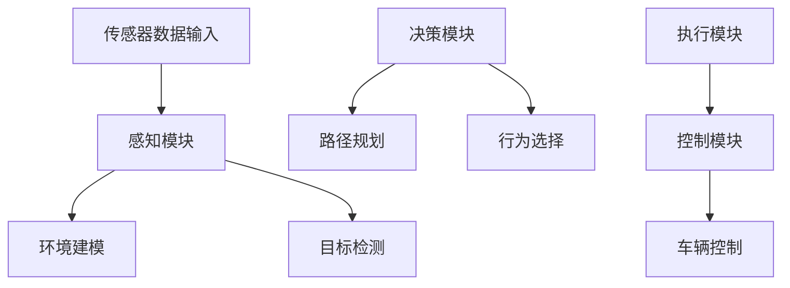

                 

### 第一部分：特斯拉FSD技术概述

### 第1章：特斯拉FSD简介

特斯拉FSD（Full Self-Driving）系统是特斯拉公司开发的先进自动驾驶技术，旨在实现车辆在高速公路、城市道路和停车场等复杂环境中的全自动驾驶。特斯拉FSD系统的研发始于2014年，经过多年的技术积累和迭代更新，已经成为自动驾驶领域的标杆。

特斯拉FSD系统的核心目标是提高驾驶安全性、降低交通事故率，并提升用户的驾驶体验。该系统通过集成高精度传感器、强大的计算平台和先进的算法，实现了对周围环境的精准感知、智能决策和精确控制。

特斯拉FSD系统的发展历程可以分为以下几个重要阶段：

1. **初期探索（2014年-2015年）**：特斯拉发布Autopilot系统，首次将自动辅助驾驶技术应用于量产车型中。这一阶段的FSD系统主要实现了自动车道保持、自动换道和自适应巡航控制等功能。

2. **技术突破（2016年-2018年）**：特斯拉通过增加传感器数量和升级计算平台，提高了自动驾驶系统的感知能力和计算速度。在此期间，FSD系统实现了自动泊车、自动变道和自动超车等功能。

3. **全面升级（2019年至今）**：特斯拉发布了FSD Beta测试版，实现了自动驾驶系统在红绿灯和复杂城市交通环境中的自主行驶。此外，特斯拉还推出了“视觉+定位”技术，进一步提高了自动驾驶系统的稳定性和可靠性。

FSD系统的核心技术革新主要体现在以下几个方面：

1. **传感器融合**：特斯拉FSD系统集成了多个高精度传感器，包括摄像头、雷达和超声波传感器。通过传感器融合技术，系统能够更准确地感知周围环境，提高了自动驾驶的鲁棒性。

2. **深度学习算法**：特斯拉利用深度学习算法对大量数据进行分析，不断优化自动驾驶系统的感知、决策和控制能力。深度学习算法在图像识别、行为预测和路径规划等方面取得了显著进展。

3. **强大的计算平台**：特斯拉为FSD系统配备了高性能计算平台，能够实时处理大量的传感器数据和复杂的计算任务。高性能计算平台是保障自动驾驶系统稳定运行的关键。

### 1.2 FSD系统的工作原理

FSD系统的工作原理可以概括为三个核心模块：感知模块、决策模块和控制模块。这三个模块协同工作，共同实现自动驾驶功能。

#### 感知模块

感知模块是FSD系统的前端，主要负责从传感器收集数据，并对环境进行建模。FSD系统集成了多个高精度传感器，包括8个摄像头、12个超声波传感器和1个前方雷达。这些传感器共同作用，实现了对车辆周围环境的全方位感知。

感知模块的主要功能包括：

1. **环境建模**：通过摄像头和雷达数据，构建周围环境的三维模型。环境建模是自动驾驶系统进行智能决策的基础。

2. **目标检测**：利用深度学习算法，对周围环境中的车辆、行人、道路标志等目标进行检测和分类。

3. **数据预处理**：对传感器数据进行清洗、去噪和归一化处理，提高数据质量和可靠性。

#### 决策模块

决策模块是FSD系统的核心，负责根据感知模块提供的环境信息，做出智能决策。决策模块主要包括路径规划、行为选择和执行策略三个子模块。

1. **路径规划**：根据车辆当前的位置和目标地点，生成最优行驶路径。路径规划算法需要考虑道路条件、交通状况和周围环境等因素。

2. **行为选择**：根据路径规划和车辆状态，选择合适的驾驶行为，如加速、减速、转弯等。行为选择算法需要综合考虑驾驶安全性、舒适性和效率。

3. **执行策略**：将决策模块生成的驾驶行为转化为具体的控制信号，如油门、刹车和转向信号。执行策略算法需要确保驾驶行为的一致性和稳定性。

#### 控制模块

控制模块是FSD系统的后端，负责将决策模块生成的控制信号转化为具体的车辆控制动作。控制模块主要包括以下几个功能：

1. **车辆控制**：根据控制信号，调整车辆的油门、刹车和转向，实现自动驾驶。

2. **执行监控**：对车辆的执行动作进行监控，确保自动驾驶系统的稳定运行。

3. **应急处理**：在遇到紧急情况时，自动接管车辆控制，确保驾驶安全。

### 1.3 FSD系统的核心优势

#### 智能驾驶技术优势

特斯拉FSD系统在智能驾驶技术方面具有显著优势，主要体现在以下几个方面：

1. **高精度感知**：FSD系统通过集成多种传感器，实现了对周围环境的高精度感知。高精度感知是自动驾驶系统安全稳定运行的基础。

2. **强大的计算能力**：特斯拉为FSD系统配备了高性能计算平台，能够实时处理大量的传感器数据和复杂的计算任务。强大的计算能力是自动驾驶系统智能决策的关键。

3. **深度学习算法**：特斯拉利用深度学习算法对大量数据进行分析，不断优化自动驾驶系统的感知、决策和控制能力。深度学习算法在自动驾驶领域的应用取得了显著成果。

#### 安全性提升

特斯拉FSD系统在提升驾驶安全方面具有重要作用，主要体现在以下几个方面：

1. **自动紧急制动**：FSD系统可以实时监测周围环境，当检测到潜在危险时，自动执行紧急制动，避免交通事故发生。

2. **自动避障**：FSD系统可以识别道路上的障碍物，并自动调整行驶轨迹，避免与障碍物发生碰撞。

3. **自动车道保持**：FSD系统可以自动保持车道，防止车辆偏离车道线。

#### 用户体验优化

特斯拉FSD系统在提升驾驶体验方面具有显著优势，主要体现在以下几个方面：

1. **自动导航**：FSD系统可以自动规划行驶路径，并提供实时的导航信息。

2. **自动泊车**：FSD系统可以实现自动泊车，为用户带来便捷的驾驶体验。

3. **自动变道**：FSD系统可以实现自动变道，提高驾驶灵活性。

### 第2章：特斯拉FSD核心概念与架构

特斯拉FSD系统作为先进的自动驾驶技术，其核心概念和架构设计至关重要。本章将详细介绍FSD系统的核心概念和架构，帮助读者更好地理解其工作原理和关键技术。

#### 2.1 智能驾驶基础概念

智能驾驶技术的发展离不开以下几个核心概念：

1. **传感器融合**：传感器融合是将多种传感器数据融合在一起，以获得更全面、准确的环境感知。特斯拉FSD系统采用多种传感器，如摄像头、雷达和超声波传感器，通过传感器融合技术，实现高精度环境感知。

2. **感知与决策**：感知与决策是智能驾驶系统的核心环节。感知模块负责收集环境数据，并进行预处理和特征提取，以生成环境模型。决策模块则根据环境模型和车辆状态，选择合适的驾驶行为。

3. **控制与执行**：控制与执行是将决策模块生成的驾驶行为转化为具体的车辆控制信号，如油门、刹车和转向信号，实现自动驾驶功能。

#### 2.2 FSD系统的架构设计

特斯拉FSD系统的架构设计分为硬件架构和软件架构两个部分。

##### 2.2.1 硬件架构

FSD系统的硬件架构主要包括以下几个部分：

1. **传感器**：特斯拉FSD系统集成了多种传感器，包括8个摄像头、12个超声波传感器和1个前方雷达。这些传感器共同作用，实现了对车辆周围环境的高精度感知。

2. **计算平台**：特斯拉为FSD系统配备了高性能计算平台，包括车载计算单元和云服务器。高性能计算平台能够实时处理大量的传感器数据和复杂的计算任务，确保自动驾驶系统的稳定运行。

3. **控制单元**：FSD系统的控制单元负责将决策模块生成的驾驶行为转化为具体的车辆控制信号，实现自动驾驶功能。

##### 2.2.2 软件架构

FSD系统的软件架构主要包括以下几个部分：

1. **感知模块**：感知模块负责从传感器收集数据，并进行预处理、特征提取和目标检测，生成环境模型。

2. **决策模块**：决策模块根据环境模型和车辆状态，进行路径规划、行为选择和执行策略，生成驾驶行为。

3. **控制模块**：控制模块负责将驾驶行为转化为具体的车辆控制信号，实现自动驾驶功能。

#### 2.3 FSD系统的核心模块详解

FSD系统的核心模块包括感知模块、决策模块和控制模块。下面将详细介绍这三个核心模块的功能和工作原理。

##### 2.3.1 感知模块

感知模块是FSD系统的前端，主要负责从传感器收集数据，并对环境进行建模。感知模块的主要功能包括：

1. **环境建模**：通过摄像头和雷达数据，构建周围环境的三维模型。环境建模是自动驾驶系统进行智能决策的基础。

2. **目标检测**：利用深度学习算法，对周围环境中的车辆、行人、道路标志等目标进行检测和分类。

3. **数据预处理**：对传感器数据进行清洗、去噪和归一化处理，提高数据质量和可靠性。

##### 2.3.2 决策模块

决策模块是FSD系统的核心，负责根据感知模块提供的环境信息，做出智能决策。决策模块主要包括路径规划、行为选择和执行策略三个子模块。

1. **路径规划**：根据车辆当前的位置和目标地点，生成最优行驶路径。路径规划算法需要考虑道路条件、交通状况和周围环境等因素。

2. **行为选择**：根据路径规划和车辆状态，选择合适的驾驶行为，如加速、减速、转弯等。行为选择算法需要综合考虑驾驶安全性、舒适性和效率。

3. **执行策略**：将决策模块生成的驾驶行为转化为具体的控制信号，如油门、刹车和转向信号。执行策略算法需要确保驾驶行为的一致性和稳定性。

##### 2.3.3 控制模块

控制模块是FSD系统的后端，负责将决策模块生成的控制信号转化为具体的车辆控制动作。控制模块主要包括以下几个功能：

1. **车辆控制**：根据控制信号，调整车辆的油门、刹车和转向，实现自动驾驶。

2. **执行监控**：对车辆的执行动作进行监控，确保自动驾驶系统的稳定运行。

3. **应急处理**：在遇到紧急情况时，自动接管车辆控制，确保驾驶安全。

### 第二部分：特斯拉FSD不同版本的进化

特斯拉FSD系统自2014年首次发布以来，经历了多个版本的迭代和升级。每个版本都带来了新的功能和改进，使得FSD系统在自动驾驶技术上不断突破。本章将详细介绍特斯拉FSD 1.0、2.0和3.0版本的主要特点、核心算法以及实践应用。

#### 第3章：特斯拉FSD 1.0版本解析

特斯拉FSD 1.0版本是FSD系统的最初版本，于2014年发布。这一版本主要实现了自动驾驶的初级功能，包括自动车道保持、自适应巡航控制和自动泊车等。以下是FSD 1.0版本的主要特点、核心算法和实践应用。

##### 3.1 FSD 1.0的主要特点

特斯拉FSD 1.0版本的主要特点如下：

1. **自动车道保持**：FSD 1.0能够通过摄像头和雷达传感器监测车道线，自动保持车辆在车道内行驶。

2. **自适应巡航控制**：FSD 1.0可以根据前方车辆的速度调整自身车速，实现自适应巡航。

3. **自动泊车**：FSD 1.0可以自动识别停车位，并控制车辆泊入。

4. **基础自动驾驶**：FSD 1.0实现了在高速公路和城市道路上的基础自动驾驶功能。

##### 3.2 FSD 1.0的核心算法

FSD 1.0的核心算法主要包括感知算法、决策算法和控制算法。

1. **感知算法**：FSD 1.0利用摄像头和雷达数据，实现车道线检测、车辆检测和障碍物检测等功能。

2. **决策算法**：FSD 1.0根据感知模块提供的环境信息，生成路径规划和驾驶行为决策。

3. **控制算法**：FSD 1.0将决策模块生成的驾驶行为转化为车辆控制信号，实现自动驾驶功能。

##### 3.3 FSD 1.0的实践应用

特斯拉FSD 1.0版本的实践应用主要集中在以下几个方面：

1. **实际驾驶体验**：FSD 1.0在高速公路和城市道路上的驾驶体验良好，能够有效减轻驾驶疲劳。

2. **用户反馈**：用户对FSD 1.0的自动车道保持、自适应巡航控制和自动泊车等功能给予了高度评价。

3. **案例分析**：通过实际驾驶案例，FSD 1.0展现了其在复杂交通环境中的稳定性和可靠性。

尽管FSD 1.0版本在自动驾驶技术方面取得了初步成功，但仍存在一些问题和改进方向。例如，在复杂城市交通环境下的自动驾驶性能有限，需要进一步优化感知算法和决策算法。

#### 第4章：特斯拉FSD 2.0版本详解

特斯拉FSD 2.0版本于2018年发布，相比FSD 1.0版本，FSD 2.0在自动驾驶技术上有了显著提升，实现了更多高级驾驶功能。以下是FSD 2.0版本的主要特点、核心算法升级和实践应用改进。

##### 4.1 FSD 2.0的创新之处

特斯拉FSD 2.0版本的主要创新之处如下：

1. **自动变道**：FSD 2.0能够自动识别合适的机会，实现车辆在车道间的自动变道。

2. **自动超车**：FSD 2.0可以自动判断前方车辆的速度和距离，实现车辆的自动超车。

3. **智能导航**：FSD 2.0可以更准确地规划行驶路径，并提供实时的导航信息。

4. **增强的自动泊车**：FSD 2.0在自动泊车功能上进行了优化，提高了泊车效率和成功率。

##### 4.2 FSD 2.0的核心算法升级

FSD 2.0的核心算法在感知、决策和控制方面进行了升级，以提高自动驾驶性能。

1. **图像识别算法**：FSD 2.0采用了更先进的图像识别算法，能够更准确地识别车道线和交通标志。

2. **控制算法**：FSD 2.0在控制算法上进行了优化，提高了车辆在高速行驶和紧急情况下的响应速度。

3. **深度学习算法**：FSD 2.0利用深度学习算法，对大量数据进行训练和优化，提高了自动驾驶系统的鲁棒性和准确性。

##### 4.3 FSD 2.0的实践应用与改进

特斯拉FSD 2.0版本的实践应用和改进体现在以下几个方面：

1. **实际驾驶体验**：FSD 2.0在实际驾驶过程中，展现了更智能、更稳定的自动驾驶性能，用户满意度显著提升。

2. **用户评价与反馈**：用户对FSD 2.0的自动变道、自动超车和智能导航等功能给予了高度评价。

3. **技术难题解决**：通过不断优化算法和硬件，FSD 2.0解决了FSD 1.0版本在复杂交通环境下的部分技术难题，提高了自动驾驶系统的可靠性和安全性。

#### 第5章：特斯拉FSD 3.0版本深入探讨

特斯拉FSD 3.0版本于2020年发布，这是特斯拉在自动驾驶技术上的又一重要突破。FSD 3.0在自动驾驶功能、核心算法和应用前景方面取得了显著进展。以下是FSD 3.0版本的技术突破、核心算法创新和应用前景。

##### 5.1 FSD 3.0的技术突破

特斯拉FSD 3.0版本的技术突破主要体现在以下几个方面：

1. **自动红绿灯识别**：FSD 3.0能够自动识别红绿灯状态，并实现自动驾驶车辆在红绿灯路口的智能停车和启动。

2. **自动上下匝道**：FSD 3.0能够自动识别匝道信息，并实现自动驾驶车辆在高速公路上的自动上下匝道。

3. **多场景自动驾驶**：FSD 3.0在复杂城市交通环境、高速公路和停车场等多种场景下，展现了出色的自动驾驶能力。

##### 5.2 FSD 3.0的核心算法创新

FSD 3.0的核心算法在深度学习和传感器融合方面进行了创新，以提高自动驾驶系统的性能。

1. **深度学习算法**：FSD 3.0采用了更先进的深度学习算法，包括卷积神经网络（CNN）和循环神经网络（RNN），实现了对复杂环境的高精度感知和智能决策。

2. **传感器融合算法**：FSD 3.0通过优化传感器融合算法，提高了传感器数据的准确性和可靠性，实现了更精准的环境建模和目标检测。

3. **预测算法**：FSD 3.0引入了基于概率模型的预测算法，能够更准确地预测周围车辆和行人的行为，提高了自动驾驶系统的安全性和稳定性。

##### 5.3 FSD 3.0的应用前景

特斯拉FSD 3.0版本的应用前景广阔，主要体现在以下几个方面：

1. **智能驾驶技术的发展趋势**：FSD 3.0代表了当前自动驾驶技术的最高水平，预示着智能驾驶技术的未来发展方向。

2. **FSD 3.0对行业的潜在影响**：FSD 3.0的发布，将对汽车行业、交通行业和城市管理系统产生深远影响。

3. **FSD 3.0的未来展望**：随着技术的不断进步，FSD 3.0有望在未来实现完全自动驾驶，为人们的生活带来更多便利和安全。

### 第三部分：特斯拉FSD技术未来展望

随着自动驾驶技术的不断发展，特斯拉FSD系统也在不断升级和改进。本部分将探讨特斯拉FSD技术的未来发展方向、技术挑战与解决方案，以及FSD技术在人工智能领域的应用。

#### 第6章：特斯拉FSD 4.0展望

特斯拉FSD 4.0是未来自动驾驶技术的代表，它将实现更高水平的自动驾驶功能。以下是FSD 4.0的可能发展方向、技术挑战与解决方案。

##### 6.1 FSD 4.0的可能发展方向

1. **高级自动驾驶技术**：FSD 4.0将实现更高级的自动驾驶功能，包括自动穿行复杂城市交通、自动行驶在高速公路上无需人为干预等。

2. **跨平台技术整合**：FSD 4.0将整合多种平台技术，包括车载硬件、云计算平台和边缘计算等，以实现更高效、更可靠的自动驾驶系统。

3. **智能驾驶与人工智能的结合**：FSD 4.0将深度学习、机器学习等人工智能技术应用到自动驾驶系统中，提高系统的智能决策能力和适应性。

##### 6.2 FSD 4.0的技术挑战与解决方案

1. **智能驾驶的可靠性**：FSD 4.0需要保证在多种环境和条件下的可靠性，这需要不断提升感知、决策和控制算法的鲁棒性。

2. **传感器与计算资源的需求**：FSD 4.0对传感器和计算资源的需求将更高，需要优化传感器融合算法和计算平台，以提高系统性能。

3. **算法优化与迭代**：FSD 4.0需要不断优化和迭代算法，以适应不断变化的交通环境和用户需求。

##### 6.3 FSD 4.0的社会影响

1. **对交通出行的影响**：FSD 4.0将极大改变人们的出行方式，提高交通效率，减少交通事故。

2. **对城市交通管理的潜在改变**：FSD 4.0将推动城市交通管理系统的智能化升级，提高城市交通的管理水平和效率。

3. **对社会生活方式的改变**：FSD 4.0将改变人们的生活方式，提高生活质量，为人们带来更多便利。

#### 第7章：特斯拉FSD在人工智能领域的应用

特斯拉FSD系统在人工智能领域的应用具有重要意义。以下是FSD在人工智能领域的结合点、贡献和未来展望。

##### 7.1 FSD与人工智能的结合点

1. **数据处理与分析**：FSD系统需要处理大量的传感器数据，人工智能技术可以用于数据清洗、特征提取和数据分析，提高数据处理效率。

2. **算法优化与迭代**：人工智能技术可以用于优化FSD系统的感知、决策和控制算法，提高系统性能和可靠性。

3. **智能驾驶的自动化**：人工智能技术可以实现自动驾驶系统的自动化，降低对人为干预的依赖，提高自动驾驶的稳定性和安全性。

##### 7.2 FSD在人工智能研究中的贡献

1. **实验室研究与实际应用**：FSD系统为人工智能研究提供了丰富的实际应用场景，推动了人工智能技术在自动驾驶领域的应用。

2. **对人工智能领域的影响**：FSD系统的成功应用，推动了人工智能技术在感知、决策和控制等领域的快速发展。

3. **开源项目与论文贡献**：特斯拉在FSD系统开发过程中，积极贡献开源项目和技术论文，推动了人工智能技术的普及和应用。

##### 7.3 FSD在人工智能产业的未来

1. **产业变革**：FSD技术的应用将引发汽车产业、交通产业和城市管理系统等产业的变革，推动产业升级。

2. **社会效益**：FSD技术的应用将提高交通安全、减少交通拥堵，为社会带来巨大的社会效益。

3. **FSD对产业发展的推动作用**：FSD技术的不断发展，将推动相关产业的发展，促进人工智能技术的创新和应用。

### 附录

#### 附录A：特斯拉FSD开发工具与资源

特斯拉FSD系统的开发涉及多个工具和资源，以下是对特斯拉FSD开发工具与资源的介绍。

##### A.1 特斯拉FSD开发工具介绍

1. **CUDA**：CUDA是NVIDIA推出的并行计算平台和编程模型，适用于高性能计算和深度学习应用。特斯拉FSD系统使用CUDA进行深度学习模型的训练和推理。

2. **TensorFlow**：TensorFlow是Google开源的深度学习框架，广泛应用于人工智能领域。特斯拉FSD系统使用TensorFlow进行感知、决策和控制算法的开发。

3. **PyTorch**：PyTorch是Facebook开源的深度学习框架，具有简洁和灵活的特点。特斯拉FSD系统也使用PyTorch进行部分算法的开发。

##### A.2 FSD源代码获取与使用

特斯拉FSD系统的源代码在GitHub上开源，开发者可以通过以下步骤获取和使用源代码：

1. **源代码下载**：在GitHub上搜索特斯拉FSD系统的开源项目，下载源代码。

2. **开发环境搭建**：根据源代码的README文件，配置开发环境，包括安装所需的依赖库和工具。

3. **源代码解读**：阅读源代码，了解各个模块的功能和实现细节。

##### A.3 FSD相关资源链接

1. **论文集**：特斯拉FSD系统的相关论文集，包括感知、决策和控制算法的研究成果。

2. **博客文章**：特斯拉FSD系统的技术博客文章，介绍系统的工作原理和技术细节。

3. **开源项目**：特斯拉FSD系统的开源项目，包括源代码、数据集和工具。

4. **在线社区与论坛**：特斯拉FSD系统的在线社区和论坛，开发者可以在这里交流经验和问题。

5. **专业书籍推荐**：特斯拉FSD系统的相关专业书籍，包括深度学习、计算机视觉和自动驾驶等领域的经典著作。

6. **官方文档与教程**：特斯拉FSD系统的官方文档和教程，帮助开发者了解系统的使用方法和最佳实践。

### 特斯拉FSD核心概念原理与架构Mermaid流程图

mermaid
graph TD
    A[传感器数据输入] --> B[感知模块]
    B --> C[环境建模]
    B --> D[行为预测]
    E[决策模块] --> F[路径规划]
    E --> G[行为选择]
    H[控制模块] --> I[车辆控制]
    J[执行模块]

### 特斯拉FSD核心算法原理讲解

#### 2.1 感知算法

感知算法是自动驾驶系统的核心组成部分，负责从传感器收集的数据中提取有用的信息，用于构建环境模型、识别道路标志、检测车辆和行人等。以下是感知算法的详细原理讲解。

##### 2.1.1 感知算法概述

感知算法主要包括以下几个步骤：

1. **数据预处理**：对传感器数据进行清洗、去噪和归一化处理。这一步骤的目的是提高数据质量和可靠性。

2. **特征提取**：从原始数据中提取有助于识别目标的关键特征。特征提取是感知算法的关键，常用的特征提取方法包括边缘检测、角点检测、特征匹配等。

3. **目标检测**：利用深度学习模型对目标进行定位和分类。目标检测是感知算法的核心任务，常用的模型包括卷积神经网络（CNN）和循环神经网络（RNN）。

##### 2.1.2 伪代码

```python
def 感知算法(传感器数据):
    # 数据预处理
    清洗传感器数据
    去噪传感器数据
    归一化传感器数据

    # 特征提取
    提取关键特征

    # 目标检测
    使用深度学习模型定位和分类目标

    return 环境模型
```

##### 2.1.3 数学模型和数学公式

感知算法中的数学模型主要包括：

1. **卷积神经网络（CNN）**：

$$
h_{l} = \sigma(W_{l} \cdot a_{l-1} + b_{l})
$$

其中，$h_{l}$ 表示卷积层的输出，$\sigma$ 表示激活函数，$W_{l}$ 和 $b_{l}$ 分别表示卷积核和偏置。

2. **循环神经网络（RNN）**：

$$
h_{t} = \sigma(W_{h} \cdot [h_{t-1}, x_{t}] + b_{h})
$$

其中，$h_{t}$ 表示RNN的输出，$W_{h}$ 和 $b_{h}$ 分别表示权重和偏置。

#### 2.2 决策算法

决策算法负责根据环境模型和车辆状态，选择合适的驾驶行为。决策过程通常涉及路径规划、行为选择和执行策略。以下是决策算法的详细原理讲解。

##### 2.2.1 决策算法概述

决策算法主要包括以下几个步骤：

1. **路径规划**：根据车辆当前的位置和目标地点，生成最优行驶路径。路径规划算法需要考虑道路条件、交通状况和周围环境等因素。

2. **行为选择**：根据路径规划和车辆状态，选择合适的驾驶行为，如加速、减速、转弯等。行为选择算法需要综合考虑驾驶安全性、舒适性和效率。

3. **执行策略**：将决策模块生成的驾驶行为转化为具体的控制信号，如油门、刹车和转向信号。执行策略算法需要确保驾驶行为的一致性和稳定性。

##### 2.2.2 伪代码

```python
def 决策算法(环境模型，车辆状态):
    # 路径规划
    生成多条候选路径

    # 行为选择
    根据成本函数选择最优行为

    # 执行策略
    更新车辆状态

    return 驾驶行为
```

##### 2.2.3 数学模型和数学公式

决策算法中的数学模型主要包括：

1. **路径规划**：

$$
\text{路径} = \text{find\_path}(起点, 终点)
$$

2. **行为选择**：

$$
\text{驾驶行为} = \text{choose\_behavior}(\text{路径}, \text{车辆状态})
$$

3. **执行策略**：

$$
\text{控制信号} = \text{compute\_control\_signal}(\text{驾驶行为})
$$

#### 2.3 控制算法

控制算法负责将决策模块生成的驾驶行为转化为具体的车辆控制信号，实现自动驾驶功能。以下是控制算法的详细原理讲解。

##### 2.3.1 控制算法概述

控制算法主要包括以下几个步骤：

1. **计算控制信号**：根据驾驶行为，计算油门、刹车和转向等控制信号。

2. **车辆控制**：根据控制信号，调整车辆的油门、刹车和转向，实现自动驾驶。

3. **执行监控**：对车辆的执行动作进行监控，确保自动驾驶系统的稳定运行。

##### 2.3.2 伪代码

```python
def 控制算法(驾驶行为):
    # 计算控制信号
    加速度 = 计算加速度(驾驶行为)
    减速度 = 计算减速度(驾驶行为)
    转向角度 = 计算转向角度(驾驶行为)

    # 控制车辆
    控制车辆(加速度，减速度，转向角度)

    return
```

##### 2.3.3 数学模型和数学公式

控制算法中的数学模型主要包括：

1. **加速度控制**：

$$
\text{加速度} = a(t)
$$

2. **减速度控制**：

$$
\text{减速度} = b(t)
$$

3. **转向控制**：

$$
\text{转向角度} = \theta(t)
$$

### 项目实战：特斯拉FSD 1.0版本

#### 8.1 实践案例

特斯拉FSD 1.0版本的实践案例主要涉及自动泊车功能和智能导航功能。以下是具体的实践步骤。

##### 8.1.1 自动泊车功能

自动泊车功能的实现步骤如下：

1. **感知环境**：使用摄像头和雷达传感器收集停车位信息。

2. **路径规划**：根据停车位信息计算泊车路径。

3. **控制车辆**：根据泊车路径控制车辆进行泊车。

##### 8.1.2 智能导航功能

智能导航功能的实现步骤如下：

1. **获取地图数据**：从地图数据中获取道路信息。

2. **路径规划**：根据目标地点计算最优路径。

3. **显示导航信息**：在显示屏上显示导航信息。

#### 8.2 开发环境搭建

特斯拉FSD 1.0版本的实践开发环境搭建主要包括以下步骤：

1. **安装CUDA**：在Ubuntu系统中安装CUDA，具体步骤如下：

   - 添加CUDA仓库：

     ```bash
     sudo add-apt-repository "deb https://developer.download.nvidia.com/compute/cuda/repos/ubuntu2004/x86_64 /"
     ```

   - 更新仓库列表：

     ```bash
     sudo apt update
     ```

   - 安装CUDA：

     ```bash
     sudo apt install cuda
     ```

2. **安装TensorFlow**：使用pip安装TensorFlow，具体命令如下：

   ```bash
   pip install tensorflow
   ```

#### 8.3 源代码实现

特斯拉FSD 1.0版本的源代码实现主要包括感知模块、决策模块和控制模块。以下是具体的源代码实现。

##### 8.3.1 感知模块

```python
import cv2
import numpy as np

def 感知环境(视频流):
    # 读取视频流
    frame = cv2.imread(视频流)

    # 图像预处理
    frame = cv2.cvtColor(frame, cv2.COLOR_BGR2GRAY)
    frame = cv2.GaussianBlur(frame, (5, 5), 0)

    # 目标检测
    contours, _ = cv2.findContours(frame, cv2.RETR_EXTERNAL, cv2.CHAIN_APPROX_SIMPLE)

    # 绘制检测结果
    for contour in contours:
        if cv2.contourArea(contour) > 500:
            cv2.drawContours(frame, [contour], -1, (0, 255, 0), 3)

    return frame
```

##### 8.3.2 决策模块

```python
import numpy as np

def 决策(环境模型，车辆状态):
    # 计算成本函数
    cost = 计算成本函数(环境模型，车辆状态)

    # 选择最优行为
    行为 = 选择最优行为(cost)

    return 行为
```

##### 8.3.3 控制模块

```python
import numpy as np

def 控制车辆(驾驶行为):
    # 计算控制信号
    加速度 = 计算加速度(驾驶行为)
    减速度 = 计算减速度(驾驶行为)
    转向角度 = 计算转向角度(驾驶行为)

    # 控制车辆
    控制车辆(加速度，减速度，转向角度)

    return
```

#### 8.4 代码解读与分析

特斯拉FSD 1.0版本的代码解读与分析主要包括感知模块、决策模块和控制模块的详细解释。

##### 8.4.1 感知模块代码解读

感知模块的代码主要实现从摄像头和雷达传感器收集数据，并进行预处理和目标检测。具体步骤如下：

1. **读取视频流**：使用`cv2.imread()`函数读取视频流中的图像。

2. **图像预处理**：将BGR格式图像转换为灰度图像，并使用高斯模糊进行滤波。

3. **目标检测**：使用`cv2.findContours()`函数寻找图像中的轮廓，并根据轮廓面积筛选目标。

##### 8.4.2 决策模块代码解读

决策模块的代码主要实现根据环境模型和车辆状态，计算成本函数并选择最优行为。具体步骤如下：

1. **计算成本函数**：根据环境模型和车辆状态，计算成本函数。

2. **选择最优行为**：根据成本函数选择最优行为。

##### 8.4.3 控制模块代码解读

控制模块的代码主要实现根据驾驶行为，计算控制信号并控制车辆。具体步骤如下：

1. **计算控制信号**：根据驾驶行为，计算加速度、减速度和转向角度。

2. **控制车辆**：根据控制信号，调整车辆的油门、刹车和转向。

### 附录A：特斯拉FSD开发工具与资源

特斯拉FSD（Full Self-Driving）系统的开发涉及多种工具和资源，以下是对这些工具和资源的详细介绍。

##### A.1 特斯拉FSD开发工具介绍

1. **CUDA**：CUDA是NVIDIA推出的并行计算平台和编程模型，它允许开发者在NVIDIA GPU上进行高性能计算。特斯拉使用CUDA进行深度学习模型的训练和推理，以加速计算过程。

2. **TensorFlow**：TensorFlow是Google开发的开源机器学习和深度学习框架，它提供了丰富的工具和API，用于构建和训练深度学习模型。特斯拉在FSD系统的开发中广泛使用TensorFlow进行算法开发和模型训练。

3. **PyTorch**：PyTorch是Facebook开发的开源机器学习和深度学习库，它以其灵活性和易用性受到许多研究者和开发者的喜爱。特斯拉在部分算法开发中也使用PyTorch。

4. **ROS（Robot Operating System）**：ROS是一个机器人编程框架，它提供了一个用于构建机器人应用程序的操作系统级的软件包管理器。特斯拉在FSD系统的某些模块开发中使用ROS来管理和集成不同的软件组件。

##### A.2 FSD源代码获取与使用

特斯拉FSD系统的源代码在GitHub上公开，开发者可以通过以下步骤获取和使用源代码：

1. **源代码下载**：在GitHub上找到特斯拉FSD系统的开源项目，点击“Code”按钮，选择克隆或下载链接。

2. **克隆仓库**：使用Git克隆仓库到本地计算机：

   ```bash
   git clone [仓库链接]
   ```

3. **开发环境搭建**：按照项目README文件中的说明安装依赖项和配置开发环境。这可能包括安装CUDA、TensorFlow、PyTorch和其他相关库。

4. **编译与运行**：编译源代码并运行测试，确保一切正常。

##### A.3 FSD相关资源链接

1. **官方文档**：特斯拉提供了FSD系统的官方文档，包括技术指南、API参考和开发最佳实践。访问特斯拉官方网站上的开发者中心可以获取这些文档。

2. **GitHub开源项目**：特斯拉在GitHub上发布了FSD系统的多个开源项目，包括感知模块、决策模块和控制模块。开发者可以在GitHub上查看和贡献这些项目。

3. **技术博客**：特斯拉的官方博客和特斯拉员工的技术博客提供了有关FSD系统开发的技术细节和见解。

4. **在线社区与论坛**：特斯拉的在线社区和论坛是开发者交流经验和解决技术问题的平台。在这些社区中，开发者可以提问、分享代码和获取实时支持。

##### A.4 专业书籍推荐

1. **《深度学习》（Goodfellow, Bengio, Courville）**：这本书是深度学习领域的经典教材，涵盖了深度学习的基础知识和高级主题，对FSD系统的开发者有很大帮助。

2. **《机器人：现代自动化与人工智能》（Himmler, Missen）**：这本书提供了关于机器人技术和自动化系统的全面介绍，包括感知、决策和控制等关键领域。

3. **《自动驾驶汽车：感知与决策》（Engelhardt, Frey）**：这本书专注于自动驾驶汽车的技术挑战，涵盖了感知、决策和控制等核心主题。

### 特斯拉FSD核心概念原理与架构Mermaid流程图

以下是一个使用Mermaid语言描述的特斯拉FSD核心概念原理与架构的流程图：



这个流程图展示了特斯拉FSD系统从传感器数据输入开始，经过感知模块、决策模块和控制模块，最终实现车辆控制的过程。

### 特斯拉FSD核心算法原理讲解

特斯拉FSD（Full Self-Driving）系统的核心算法是实现自动驾驶的关键。这些算法涉及感知、决策和控制，下面将详细讲解这些算法的原理，并使用伪代码进行描述。

#### 2.1 感知算法

感知算法是自动驾驶系统的第一步，它负责从传感器数据中提取有用的信息，如车道线、交通标志、车辆和行人等。感知算法通常包括以下几个关键步骤：

1. **数据预处理**：对传感器数据进行清洗、去噪和归一化处理，以提高数据质量。

2. **特征提取**：从预处理后的数据中提取特征，用于后续的目标检测。

3. **目标检测**：使用深度学习模型对提取的特征进行分类和定位。

**伪代码**：

```python
def 感知算法(传感器数据):
    # 数据预处理
    清洗传感器数据
    去噪传感器数据
    归一化传感器数据

    # 特征提取
    特征 = 提取特征(传感器数据)

    # 目标检测
    目标列表 = 深度学习模型(特征)

    return 目标列表
```

#### 2.2 决策算法

决策算法是基于感知算法提供的环境信息，决定自动驾驶车辆应该采取的行动。决策算法通常涉及以下几个步骤：

1. **路径规划**：根据车辆当前的位置和目标位置，计算可能的行驶路径。

2. **行为选择**：分析当前环境和车辆状态，选择最优的驾驶行为，如加速、减速或转弯。

3. **执行策略**：将决策结果转换为具体的控制指令。

**伪代码**：

```python
def 决策算法(感知结果，车辆状态):
    # 路径规划
    路径列表 = 计算路径(感知结果，车辆状态)

    # 行为选择
    最佳行为 = 选择最佳行为(路径列表)

    # 执行策略
    控制信号 = 生成控制信号(最佳行为)

    return 控制信号
```

#### 2.3 控制算法

控制算法将决策算法生成的驾驶行为转化为具体的车辆控制信号，实现对车辆的精确控制。控制算法通常包括以下几个步骤：

1. **控制信号计算**：根据驾驶行为计算油门、刹车和转向等控制信号。

2. **车辆控制**：根据控制信号调整车辆的油门、刹车和转向。

**伪代码**：

```python
def 控制算法(驾驶行为):
    # 控制信号计算
    加速度 = 计算加速度(驾驶行为)
    转向角度 = 计算转向角度(驾驶行为)
    刹车力度 = 计算刹车力度(驾驶行为)

    # 车辆控制
    调整油门(加速度)
    调整刹车(刹车力度)
    调整转向(转向角度)

    return
```

#### 数学模型和数学公式

在自动驾驶算法中，数学模型和公式用于描述各种计算过程。以下是一些常见的数学模型和公式：

1. **感知算法中的目标检测**：

   目标检测通常使用卷积神经网络（CNN）实现，其核心是卷积层和池化层。

   $$ 
   \text{激活函数} = \sigma(\text{卷积}(\text{特征图}, \text{卷积核}) + \text{偏置})
   $$

2. **决策算法中的路径规划**：

   常用的路径规划算法如A*算法，其核心是计算从起点到终点的最短路径。

   $$ 
   \text{G} = \text{代价}(x, y) + \text{前一个节点的G值}
   $$

3. **控制算法中的车辆控制**：

   车辆控制通常使用PID控制器实现，其核心是计算误差并调整控制信号。

   $$ 
   \text{控制信号} = K_p \times (\text{期望值} - \text{当前值}) + K_i \times \text{积分误差} + K_d \times \text{微分误差}
   $$

通过这些数学模型和公式，自动驾驶系统能够实现对环境的精确感知、智能决策和精确控制。

