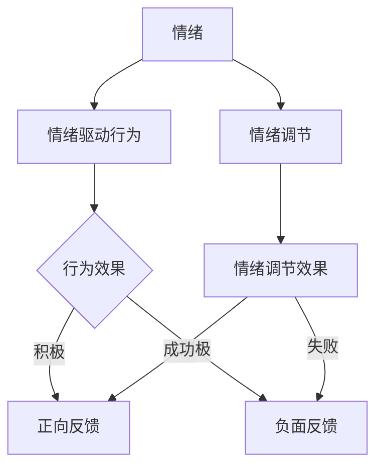
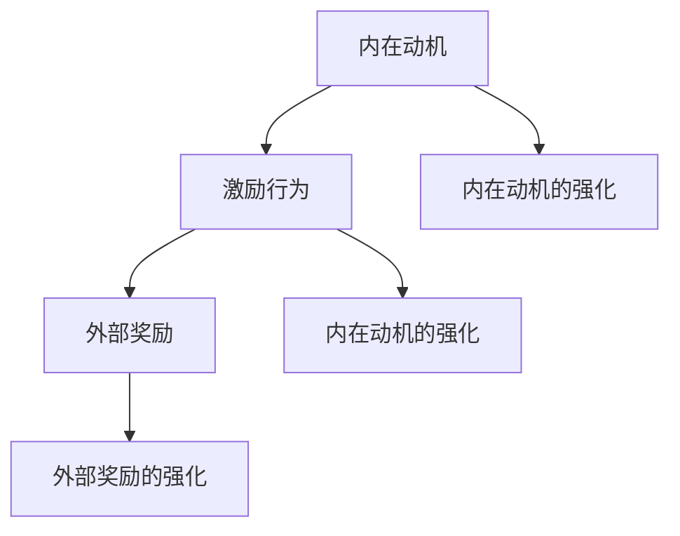
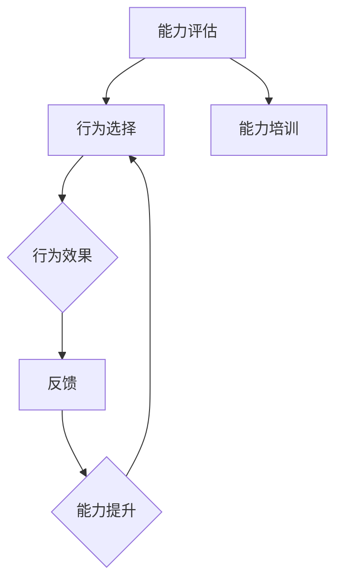

                 

# 用福格模型打造高效团队

## 关键词：福格模型、高效团队、行为驱动、情绪、动机、能力、组织管理

### 摘要

在现代企业管理中，打造高效团队是提升企业竞争力和实现持续发展的关键。福格模型，作为一种行为科学理论，为我们提供了一个全新的视角来理解和管理团队。本文将详细阐述福格模型的基本原理和核心要素，并通过实际案例和项目实战，展示如何运用福格模型提升团队绩效和员工满意度。本文旨在为企业管理者和团队成员提供实用的指导，帮助他们在复杂多变的环境中打造一支高度协作、充满动力的团队。

## 目录

### 第一部分：福格模型基础

#### 第1章：福格模型概述

1.1 福格模型的起源与发展  
1.2 福格模型的基本原理  
1.3 福格模型在组织管理中的应用

#### 第2章：福格模型的核心要素

2.1 情绪与行为的关系  
2.2 动机与行为的驱动  
2.3 能力与行为的匹配

#### 第3章：福格模型的实践应用

3.1 福格模型在员工激励中的应用  
3.2 福格模型在团队协作中的应用  
3.3 福格模型在项目管理的应用

#### 第4章：福格模型与心理学理论联系

4.1 福格模型与自我决定理论  
4.2 福格模型与心理契约理论  
4.3 福格模型与动机理论

### 第二部分：案例分析与实战应用

#### 第5章：案例研究一：某公司如何运用福格模型提高员工满意度

5.1 案例背景介绍  
5.2 福格模型的应用过程  
5.3 案例结果分析

#### 第6章：案例研究二：某团队如何利用福格模型提高项目成功率

6.1 案例背景介绍  
6.2 福格模型的应用过程  
6.3 案例结果分析

#### 第7章：实战应用指南

7.1 福格模型在企业组织中的应用策略  
7.2 福格模型在团队管理中的实际操作  
7.3 福格模型在个人成长中的应用

#### 第8章：未来展望与挑战

8.1 福格模型在组织管理中的发展趋势  
8.2 福格模型面临的挑战与应对策略  
8.3 福格模型在中国企业中的应用前景

#### 附录

附录A：福格模型相关的参考文献  
附录B：福格模型核心概念流程图  
附录C：福格模型应用案例代码  
附录D：福格模型学习资源推荐

---

### 引言

在当今快速变化的市场环境中，企业之间的竞争日益激烈，而团队的高效运作成为企业成功的关键因素之一。传统的管理模式往往侧重于对工作流程和绩效的监控，而忽视了团队成员的情感需求和个人动机。这种管理模式虽然在某些方面取得了一定的成效，但在应对复杂多变的外部环境时，往往显得力不从心。因此，寻找一种更加科学、有效的方法来打造高效团队，已经成为企业管理者和研究人员的重要课题。

福格模型（Fogg Behavior Model），由著名行为科学家巴里·福格（BJ Fogg）提出，为我们提供了一种全新的视角来理解和管理团队行为。福格模型认为，行为的产生是由情绪、动机和能力三个要素共同驱动的，即：

$$ 行为 = 情绪 \times 动机 \times 能力 $$

这一模型不仅能够解释个体行为，还可以应用于团队管理，帮助我们更好地理解团队成员的行为模式，从而制定出更加有效的管理策略。

本文旨在通过深入解析福格模型的基本原理和核心要素，结合实际案例和项目实战，展示如何运用福格模型提升团队绩效和员工满意度。本文结构分为两个部分：第一部分为基础理论，包括福格模型的起源、基本原理和核心要素的详细解释；第二部分为案例分析，通过具体案例展示如何在实际工作中应用福格模型，并提供实用的实战指南。希望本文能够为企业管理者和团队成员提供有价值的参考，帮助他们在复杂多变的环境中打造出高效、协作的团队。

### 福格模型的起源与发展

福格模型（Fogg Behavior Model）是由巴里·福格（BJ Fogg）博士创立的。巴里·福格是一位著名的行为科学家，他在斯坦福大学电子工程系和设计学院任教，同时也是斯坦福大学行为设计实验室的创始人。福格博士致力于研究人类行为的动机、情绪和环境对行为的影响，并提出了多个重要的行为科学理论，福格模型便是其中之一。

福格模型最早是在2001年由福格博士在其学术研究中提出的。他在研究过程中发现，人类行为是由情绪、动机和能力三个关键要素共同驱动的。这一发现打破了传统的行为科学理论，为人们提供了一种全新的理解行为的方式。福格模型认为，只有当这三个要素同时具备时，行为才会发生；如果其中任何一个要素缺失，行为就可能不会发生。

福格模型的提出和发展，不仅丰富了行为科学的理论体系，也为实践中的团队管理和组织行为研究提供了重要的指导。自提出以来，福格模型在多个领域得到了广泛应用，包括市场营销、健康管理、用户体验设计等。在企业管理领域，福格模型被广泛用于提升员工绩效、改善团队协作和设计有效的激励机制。

福格模型的发展历程中，有一个重要的里程碑是在2008年，福格博士成立了Fogg Behavior Lab，专注于研究行为科学并为企业提供咨询服务。通过这一实验室，福格博士将福格模型的理论和方法进行了进一步的验证和优化，使其在实践中的应用更加成熟和系统化。此外，福格博士还撰写了多本关于行为科学和福格模型的应用书籍，如《设计愉悦：创造人们喜爱的产品》（Designing Delight: Create Products People Love）和《进步原理：使用小胜利点燃快乐、参与和创造力》（The Progress Principle: Using Small Wins to Ignite Joy, Engagement, and Creativity at Work），这些书籍为企业管理者提供了实用的工具和策略。

总之，福格模型的提出和发展，不仅为行为科学领域带来了新的突破，也为企业管理提供了重要的理论指导。通过深入理解福格模型，我们可以更有效地管理和激励团队成员，提升团队的整体绩效和满意度。

### 福格模型的基本原理

福格模型（Fogg Behavior Model），亦称F模型，是由行为科学家巴里·福格（BJ Fogg）提出的一种行为驱动理论。该模型的核心思想是，一个行为是否发生，取决于三个关键要素：情绪、动机和能力，这三个要素共同作用，形成一个行为的驱动系统。

#### 行为驱动的三个要素

1. **情绪（Motivation）**：
情绪是行为产生的一个重要动力因素，它反映了个体对某一行为的情感反应。积极的情绪会增强行为的可能性，而消极的情绪则可能抑制行为。例如，一个员工感到兴奋和自豪时，更有可能积极投入工作；反之，如果感到沮丧和失望，则可能不愿意执行工作任务。

2. **动机（Motivation）**：
动机是行为的内在驱动力，它决定了个体是否有强烈的意愿去采取某一行为。动机可以分为内在动机和外在动机。内在动机源于个体对活动本身的兴趣和乐趣，例如，一个程序员因为对编程感兴趣而愿意花费更多时间来学习新技术；而外在动机则源于外部奖励或惩罚，如奖金、晋升等。

3. **能力（Ability）**：
能力是行为发生的技术条件，它决定了个体是否有足够的能力去执行某一行为。如果行为超出了个体的能力范围，那么即使有强烈的动机和积极的情绪，行为也难以发生。例如，一个团队在没有足够的培训和技术支持的情况下，即使有很高的工作热情和目标，也可能难以完成任务。

#### 行为驱动方程

福格模型通过一个简单的方程来表示行为驱动的原理：

$$ 行为 = 情绪 \times 动机 \times 能力 $$

这一方程表明，只有当情绪、动机和能力三个要素同时满足时，行为才有可能发生。如果任何一个要素缺失或不足，行为的可能性就会降低。

#### 情绪与行为的联系

情绪与行为之间存在着密切的联系。根据福格模型，情绪是行为的情感驱动因素，它直接影响行为的产生和持续性。具体来说：

- **积极情绪**：积极情绪能够增强行为发生的可能性。例如，愉悦、兴奋和自豪等积极情绪可以激发员工的工作热情，提高工作投入度和工作效率。
- **消极情绪**：消极情绪则会抑制行为的发生。例如，焦虑、沮丧和挫败感等消极情绪可能会导致员工失去工作动力，降低工作效率。

#### 动机与行为的驱动

动机是行为的内在驱动力，它决定了个体是否有意愿和动力去采取某一行为。动机可以分为内在动机和外在动机：

- **内在动机**：内在动机源于个体对活动本身的兴趣和乐趣，它通常具有持久性和稳定性。例如，一个程序员因为对编程本身感兴趣而愿意不断学习和提升技能。
- **外在动机**：外在动机则源于外部奖励或惩罚，它包括奖金、晋升、表扬等。外在动机虽然能够迅速激发行为，但其持久性和稳定性相对较低。

#### 能力与行为的匹配

能力是行为发生的技术条件，它决定了个体是否有足够的能力去执行某一行为。如果行为超出了个体的能力范围，即使有强烈的动机和积极的情绪，行为也难以发生。因此，确保能力与行为的匹配至关重要：

- **能力提升**：通过培训、学习和实践，可以提高个体在某一领域的技能水平，从而增强其执行行为的能力。
- **任务匹配**：管理者应根据员工的能力水平分配任务，确保任务难度适中，既能激发员工的潜力，又不会导致过度压力。

#### 示例

以员工加班为例，加班行为是否发生，取决于以下三个要素：

- **情绪**：如果员工对工作感到满意和自豪，他们更可能愿意加班。
- **动机**：如果员工为了完成重要任务或获得额外奖金而愿意加班，那么动机就得到了满足。
- **能力**：如果员工具备完成加班任务所需的能力，如技能和知识，他们就能有效地完成加班工作。

通过上述分析可以看出，福格模型为我们提供了一个全面理解行为的框架，它不仅解释了行为产生的内在机制，还为管理者提供了一种有效的行为管理工具。在接下来的章节中，我们将进一步探讨福格模型的核心要素，并探讨其在实际应用中的具体方法和策略。

### 福格模型的核心要素：情绪与行为的联系

情绪与行为之间的联系是福格模型（Fogg Behavior Model）的核心要素之一。根据福格模型，情绪是行为产生的情感驱动因素，它对行为的发生起着至关重要的作用。理解情绪与行为之间的紧密联系，可以帮助我们更好地预测和影响个体的行为，从而在团队管理和组织行为中取得更好的效果。

#### 情绪的定义与类型

情绪是人类在特定情境下产生的主观体验，通常表现为生理、心理和行为反应。情绪可以分为以下几类：

1. **积极情绪**：包括愉悦、兴奋、自豪等，这些情绪能够增强个体的行为动力和积极性。
2. **消极情绪**：包括焦虑、沮丧、挫败等，这些情绪可能会抑制或降低个体的行为意愿。
3. **中性情绪**：没有明显积极或消极影响的情绪，如平静、满足等。

#### 情绪对行为的影响

情绪对行为的影响主要体现在以下几个方面：

1. **增强或抑制行为**：
   - **积极情绪**：积极情绪可以增强行为的发生。例如，当一个员工在完成一项重要任务时感到自豪和满足，他更有可能继续投入更多的努力来完成任务。
   - **消极情绪**：消极情绪可能会抑制行为的发生。例如，一个员工如果感到沮丧和焦虑，他可能会对工作任务产生抵触情绪，从而导致工作效率降低。

2. **影响行为选择**：
   - 情绪可以影响个体对行为的选择。在面临多个行为选择时，情绪强烈的个体可能会更倾向于选择与其情绪相一致的行为。例如，一个感到沮丧的员工可能会选择放弃工作，而不是继续努力。

3. **调节行为强度**：
   - 情绪还可以调节行为的强度。例如，一个感到兴奋的员工可能会比平常更加努力地工作，而一个感到焦虑的员工可能会表现出紧张和急促的工作行为。

#### 情绪调节的重要性

情绪调节在福格模型中具有重要作用。有效的情绪调节可以帮助个体更好地应对外部环境的变化，从而保持行为的稳定性和持续性。情绪调节包括以下几种策略：

1. **认知调节**：通过改变对情境的认知评价来调节情绪。例如，一个员工可以通过改变对工作的看法来减少焦虑感。
2. **行为调节**：通过改变行为来调节情绪。例如，一个员工可以通过进行放松训练来缓解压力和焦虑。
3. **情绪表达调节**：通过调整情绪表达的方式和强度来调节情绪。例如，一个员工可以通过与同事交流来释放负面情绪。

#### 示例

以团队协作中的情况为例：

- **积极情绪**：在一个充满支持和鼓励的工作环境中，团队成员可能会感到兴奋和自豪，这会增强他们参与团队活动的积极性和投入度。例如，一个团队在成功完成一个重要项目后，成员之间可能会互相赞扬和庆祝，这种积极情绪会促使他们继续合作，迎接下一个挑战。
- **消极情绪**：在一个缺乏支持或存在冲突的工作环境中，团队成员可能会感到焦虑和沮丧，这会降低他们的工作动力和协作意愿。例如，如果团队成员经常因为任务分配不公或沟通不畅而产生矛盾，团队的绩效和满意度可能会受到影响。

通过上述分析可以看出，情绪与行为之间的联系是福格模型中至关重要的要素。理解情绪对行为的影响，并掌握有效的情绪调节策略，对于管理者来说具有重要意义。管理者可以通过营造积极的工作氛围、提供心理支持和培训来调节团队成员的情绪，从而提高团队的整体绩效和满意度。

### 动机与行为的驱动

动机是福格模型（Fogg Behavior Model）中的另一个关键要素，它决定了个体是否愿意采取特定行为。动机可以源自内部，如个人兴趣和内在满足感，也可以源自外部，如奖励和惩罚。理解动机的类型和如何驱动行为，对于团队管理和组织行为研究具有重要的实际意义。

#### 动机的定义

动机是指促使个体采取行动的内在或外在原因。内在动机与个人对活动本身的兴趣和乐趣相关，而外在动机则与外部奖励或惩罚有关。以下是动机的几种类型：

1. **内在动机**：内在动机是指个体因对活动本身的兴趣和乐趣而采取行动。例如，一个对编程充满热情的程序员可能会自愿加班来研究新技术。
2. **外在动机**：外在动机是指个体因期望获得外部奖励或避免外部惩罚而采取行动。例如，一个员工可能会为了得到奖金或避免被解雇而努力工作。

#### 动机与行为的关系

动机与行为之间存在着密切的关系。动机可以增强或减弱个体采取特定行为的意愿：

1. **增强行为**：当个体具有强烈的动机时，他们更有可能采取相关行为。例如，一个渴望晋升的员工可能会主动参加各种培训和项目，以提高自己的能力。
2. **减弱行为**：当动机不足或受到负面动机影响时，个体可能不愿意采取行为。例如，如果员工认为工作缺乏意义或对未来的职业发展无望，他们可能会减少工作投入。

#### 内在动机与外在动机的比较

内在动机和外在动机各有优缺点，并影响行为的不同方面：

1. **内在动机**：
   - **优点**：内在动机通常能够提供持续的驱动力，因为它源自个人的兴趣和乐趣。这种动机有助于提高创新性和自主性。
   - **缺点**：内在动机的强度可能不如外在动机明显，尤其是在面临困难和挑战时。

2. **外在动机**：
   - **优点**：外在动机可以通过奖励和惩罚来迅速激发行为，提供即时的反馈和激励。
   - **缺点**：外在动机可能导致行为短期提升，但长期效果可能不佳，因为依赖外部奖励可能导致内在动机的缺失。

#### 如何驱动行为

为了有效地驱动行为，管理者可以采取以下策略：

1. **强化内在动机**：
   - **提供自主性**：给予员工自主决策和工作的空间，让他们能够根据自己的兴趣和优势选择工作内容。
   - **认可成就**：通过表扬和认可，让员工感受到自己的价值和贡献。
   - **构建有意义的工作**：帮助员工理解工作的重要性和对社会的影响，从而提高他们的内在动机。

2. **结合外在动机**：
   - **设定明确的奖励机制**：制定清晰的奖励规则，确保员工了解通过什么方式可以获得奖励。
   - **提供竞争环境**：在团队或项目中引入适当的竞争机制，以激发员工的竞争意识和动力。
   - **关注长期奖励**：除了短期奖励，还应关注长期职业发展和晋升机会，以保持员工的工作动力。

#### 示例

以员工培训为例：

- **内在动机**：一个对技术不断追求的员工可能会自发地参加各种培训课程，以提升自己的技能。这种内在动机驱动的学习行为有助于提高员工的长期职业发展和工作满意度。
- **外在动机**：如果公司为参加培训的员工提供额外的奖金或晋升机会，这会增强员工参加培训的意愿。这种外在动机驱动的行为在短期内可能效果显著，但长期来看，可能需要结合内在动机来保持效果。

通过理解动机与行为之间的关系，并采取适当的策略来驱动行为，管理者可以更有效地激励团队成员，提高团队绩效和员工满意度。理解动机的类型和如何驱动行为，是福格模型在团队管理和组织行为中应用的关键。

### 能力与行为的匹配

能力与行为的匹配是福格模型（Fogg Behavior Model）中的另一个关键要素，它决定了个体是否有足够的能力去执行某一行为。如果行为超出了个体的能力范围，即使有强烈的动机和积极的情绪，行为也难以发生。因此，确保能力与行为的匹配对于团队管理和组织行为研究具有重要的实际意义。

#### 能力的定义

能力是指个体在特定领域内所具备的知识、技能和经验。能力可以分为以下几种类型：

1. **基本能力**：包括阅读、写作、计算等基本技能，是执行各种行为的基础。
2. **专业技能**：特定行业或领域内所需的专门技能，如编程、数据分析、设计等。
3. **社交能力**：与他人沟通、合作和建立关系的能力，对于团队协作至关重要。

#### 能力与行为的关系

能力与行为之间存在着密切的关系。能力不仅决定了个体能否成功地执行某一行为，还影响行为的效果和效率：

1. **行为执行的有效性**：当个体的能力与行为需求相匹配时，他们能够更有效地执行任务。例如，一个熟练的程序员可以快速编写高质量的代码，而一个缺乏编程经验的新手则需要更多时间和努力。
2. **行为选择的灵活性**：具备多种能力的个体可以在不同的情境下选择适当的行为。这种灵活性有助于他们在面对挑战和变化时，能够迅速适应和应对。
3. **行为持续性的保障**：如果个体的能力不断提升，他们可以保持长期的行为持续性。例如，一个经过持续培训的员工可以不断提高自己的技能，从而在长期工作中保持高绩效。

#### 能力提升的重要性

提升个体能力对于确保能力与行为的匹配至关重要。以下是一些提升能力的方法：

1. **培训与教育**：通过提供系统的培训和教育，个体可以获得新的知识和技能，从而提升其能力水平。
2. **实践与经验**：通过实际操作和经验积累，个体可以不断提高自己的技能水平。例如，一个设计师可以通过不断参与项目来提升自己的设计能力。
3. **反馈与改进**：通过接受他人的反馈和建议，个体可以了解自己的不足之处，并采取相应的改进措施。

#### 能力与行为的匹配策略

为了确保能力与行为的匹配，管理者可以采取以下策略：

1. **任务匹配**：根据员工的能力水平分配任务，确保任务难度适中，既能激发员工的潜力，又不会导致过度压力。
2. **提供支持**：为员工提供必要的资源和支持，如培训、指导和技术支持，帮助他们提升能力。
3. **建立学习机制**：鼓励员工持续学习和成长，通过建立学习计划和激励机制，提高他们的能力水平。

#### 示例

以项目开发团队为例：

- **能力提升**：团队成员通过参加编程课程和技术研讨会来提升编程技能，从而更好地应对项目开发中的挑战。
- **任务匹配**：项目经理根据团队成员的能力分配任务，确保每个人都能在其擅长领域发挥最大价值，同时避免过度负担。
- **提供支持**：公司为项目团队提供最新的开发工具和技术文档，帮助他们高效地完成任务。

通过理解能力与行为之间的关系，并采取适当的策略来提升个体能力，管理者可以确保团队中的每个成员都有足够的能力去执行其职责，从而提高团队的整体绩效和满意度。

### 福格模型在员工激励中的应用

在企业管理中，员工激励是提升员工工作动力和绩效的重要手段。福格模型（Fogg Behavior Model）提供了一个全新的视角来理解和设计有效的员工激励机制。通过深入理解情绪、动机和能力三个要素，管理者可以更有效地激发员工的工作热情，提高团队的整体绩效。

#### 员工激励的重要性

员工激励不仅关系到个体的工作表现，还直接影响团队的整体氛围和组织文化。有效的员工激励机制能够增强员工的归属感和忠诚度，提高员工的满意度和工作投入度，从而提升团队的整体绩效。以下是员工激励的一些关键点：

1. **增强工作动力**：通过激励措施，如奖励、晋升机会和培训等，可以激发员工的工作热情和动力，使其更加投入工作。
2. **提升员工满意度和忠诚度**：满意的员工更有可能对工作产生忠诚感，愿意为组织做出更大的贡献。
3. **建立积极组织文化**：有效的激励措施可以营造积极的工作氛围，促进团队合作和知识共享。

#### 福格模型在员工激励中的应用

1. **强化内在动机**

   - **自主性**：给予员工更多自主决策和工作的空间，让他们能够根据自己的兴趣和优势选择任务。自主性是内在动机的重要来源，能够增强员工的工作动力和创造力。
   - **认可和奖励**：通过表扬和认可，让员工感受到自己的价值和贡献。这不仅能够增强内在动机，还可以提高员工的工作满意度。
   - **构建有意义的工作**：帮助员工理解工作的重要性和对社会的影响，从而提高他们的内在动机。例如，可以通过团队项目和社会责任活动，让员工感受到自己的工作对社会有积极贡献。

2. **结合外在动机**

   - **奖励机制**：设定明确的奖励规则，确保员工了解通过什么方式可以获得奖励。奖励可以是金钱的，也可以是非金钱的，如荣誉证书、晋升机会等。
   - **竞争环境**：在团队或项目中引入适当的竞争机制，以激发员工的竞争意识和动力。例如，可以设立团队挑战，提供获胜团队的奖金或额外假期。
   - **长期激励**：除了短期奖励，还应关注长期职业发展和晋升机会，以保持员工的工作动力。长期激励包括培训机会、职业规划支持和职业发展路径。

3. **提升员工能力**

   - **培训和发展**：为员工提供持续的培训和发展机会，帮助他们提升技能和知识，从而增强其执行任务的能力。
   - **提供资源和支持**：为员工提供必要的资源和支持，如技术工具、专业书籍和工作环境，帮助他们更高效地完成任务。
   - **反馈和改进**：通过定期反馈和改进，帮助员工识别自己的不足之处，并采取相应的措施进行改进。这种持续的学习和成长过程可以增强员工的能力，提高其工作绩效。

#### 案例分析

以某科技公司为例，该公司通过应用福格模型，成功提升了员工的工作动力和绩效。

- **内在动机**：公司为员工提供了广泛的自主性，让他们可以自由选择感兴趣的项目和工作任务。同时，通过定期的团队活动和社会责任项目，员工感受到了自己工作的意义和社会价值。
- **外在动机**：公司设立了明确的奖励机制，包括季度奖金、年终奖和晋升机会。此外，公司还引入了竞争机制，通过设立团队挑战和比赛，激发了员工的竞争意识。
- **能力提升**：公司为员工提供了丰富的培训和发展机会，包括内部培训课程、外部研讨会和技术交流会议。公司还提供了先进的技术工具和资源，帮助员工更高效地完成任务。

通过这些措施，该公司成功地提升了员工的工作动力和绩效，团队的整体氛围也变得更加积极和合作。员工满意度显著提高，离职率下降，公司的业绩也实现了持续增长。

通过理解福格模型在员工激励中的应用，管理者可以更加科学和有效地激励员工，提升团队的整体绩效和满意度。

### 福格模型在团队协作中的应用

团队协作是现代企业中不可或缺的一部分，高效的团队协作能够显著提升项目的成功率和企业竞争力。福格模型（Fogg Behavior Model）为团队协作提供了一种新的理解和管理工具，通过深入分析情绪、动机和能力三个要素，我们可以更有效地促进团队协作，提高团队的整体绩效。

#### 团队协作的重要性

团队协作不仅能够整合团队成员的知识和技能，提高项目的完成质量，还能够增强团队凝聚力，提升员工的工作满意度和忠诚度。有效的团队协作具有以下几方面的益处：

1. **知识共享**：团队成员之间通过协作可以分享知识和经验，促进知识的积累和传承。
2. **问题解决**：多人协作能够从不同角度分析问题，提高问题解决的效率和效果。
3. **创新激励**：团队协作可以激发创新思维，通过集思广益，创造出更多有价值的新方案。
4. **提高效率**：合理分工和协作可以减少重复劳动，提高工作效率。
5. **提升团队凝聚力**：通过协作，团队成员之间的信任和默契增强，团队凝聚力提升。

#### 福格模型在团队协作中的应用

1. **强化内在动机**

   - **共同目标**：为团队设定清晰的共同目标，让每个成员都明白自己的工作对团队整体目标的贡献，从而增强内在动机。例如，在一个研发项目中，可以设定明确的项目目标，让团队成员了解项目的进展和预期成果。
   - **认可与奖励**：通过团队内部的认可和奖励机制，鼓励团队成员积极参与协作。例如，可以设立团队荣誉榜，对在项目中表现突出的团队成员进行表彰。
   - **自主决策**：给予团队成员一定的自主权，让他们能够根据自己的专长和兴趣参与项目，从而提高工作热情和投入度。

2. **结合外在动机**

   - **奖励机制**：设立明确的奖励机制，对在团队协作中表现优秀的成员进行物质奖励或精神奖励。例如，可以设立项目奖金、团队活动经费等。
   - **竞争与合作**：在团队内部引入适当的竞争机制，如设立团队挑战，通过竞争激发团队成员的积极性和创造力。同时，强调团队合作的重要性，鼓励成员相互支持、共同进步。
   - **长期激励**：关注团队成员的长期职业发展和晋升机会，通过提供培训和职业规划支持，增强他们的工作动力和忠诚度。

3. **提升团队能力**

   - **培训与发展**：为团队成员提供持续的培训和发展机会，帮助他们提升专业技能和协作能力。例如，可以组织团队建设活动、技能培训课程等。
   - **资源支持**：为团队提供必要的资源和支持，如技术工具、资料库和沟通平台，确保团队成员能够高效协作。
   - **反馈与改进**：通过定期反馈和改进，帮助团队成员识别协作中的问题和不足，并采取相应的措施进行改进。例如，可以定期召开团队会议，讨论协作中的经验和教训，提出改进建议。

#### 案例分析

以某互联网公司为例，该公司通过应用福格模型，成功提升了团队协作效率。

- **共同目标**：公司为每个项目团队设定了明确的短期和长期目标，让团队成员了解项目的方向和期望成果。同时，通过定期的项目进度会议，确保团队始终保持对目标的关注。
- **认可与奖励**：公司设立了团队荣誉榜，对在项目中表现突出的团队成员进行表彰和奖励，增强他们的内在和外在动机。
- **自主决策**：公司鼓励团队成员根据项目需求自主分工和任务分配，发挥各自的专长和优势，提高团队协作效率。
- **培训与发展**：公司定期为团队成员提供专业培训和学习资源，帮助他们提升技能水平，更好地适应项目需求。
- **资源支持**：公司提供了高效的沟通工具和技术支持，确保团队成员能够快速、高效地协作。

通过上述措施，该公司的项目团队协作效率显著提升，项目成功率也大幅提高，团队的整体绩效得到了显著改善。

通过理解福格模型在团队协作中的应用，管理者可以更有效地促进团队协作，提高团队的整体绩效和项目成功率。福格模型不仅提供了一种理论框架，还为实际操作提供了具体的策略和指导。

### 福格模型在项目管理的应用

在项目管理中，确保项目的顺利进行和达成预期目标是一项复杂而艰巨的任务。福格模型（Fogg Behavior Model）提供了一个独特的视角，通过分析情绪、动机和能力三个要素，帮助项目经理更好地理解和管理项目中的行为，提高项目的成功率。以下将详细探讨福格模型在项目管理中的应用策略。

#### 项目管理中的行为驱动因素

1. **情绪**：在项目管理中，团队成员的情绪对项目成功至关重要。积极的情绪，如信心、自豪和热情，可以激发团队成员的工作动力，提高工作效率；而消极的情绪，如焦虑、沮丧和压力，则可能导致团队成员的抵触情绪，降低工作效率。
   
2. **动机**：动机是推动团队成员执行任务的动力源泉。项目中的动机可以分为内在动机和外在动机。内在动机可能源于团队成员对项目的兴趣和参与感，而外在动机则可能来自项目奖励、晋升机会等。

3. **能力**：能力是团队成员执行任务的技术条件和基础。如果团队成员的能力不足以完成任务，即使有强烈的动机和积极的情绪，项目也难以取得成功。因此，确保团队成员具备完成项目任务所需的能力是项目管理的关键。

#### 福格模型在项目管理中的应用策略

1. **情绪管理**：

   - **营造积极氛围**：项目经理应通过积极的沟通和管理，营造一个积极的工作氛围，提高团队成员的自信心和积极性。
   - **提供心理支持**：为团队成员提供必要的心理支持，帮助他们应对工作压力和挑战。例如，可以设立心理咨询室或提供压力管理培训。

2. **动机激发**：

   - **设定明确目标**：为项目团队设定明确的短期和长期目标，让每个成员都清楚自己的工作职责和项目的重要性，从而增强内在动机。
   - **奖励与认可**：通过设定奖励机制，对在项目中表现优秀的团队成员进行奖励和认可，激发外在动机。奖励可以包括奖金、晋升机会、荣誉证书等。

3. **能力提升**：

   - **培训与发展**：为团队成员提供持续的培训和发展机会，提升他们的专业技能和项目管理能力。例如，可以组织项目管理课程、技术研讨会和技能培训。
   - **技能匹配**：根据项目需求和团队成员的能力，合理分配任务，确保任务难度适中，既能发挥团队成员的潜力，又不会造成过度压力。

#### 案例分析

以某软件公司的项目团队为例，该公司通过应用福格模型，成功提升了项目的成功率。

- **情绪管理**：项目经理定期组织团队会议，听取成员的工作进展和反馈，鼓励团队成员分享工作中的成就和困难，营造一个开放、支持的工作氛围。同时，项目经理还提供了压力管理培训，帮助团队成员更好地应对工作压力。
- **动机激发**：公司为项目团队设定了明确的阶段性目标，并对达成目标的团队成员进行奖励和认可。例如，对于在项目进度中表现出色的成员，公司提供了额外的奖金和晋升机会。
- **能力提升**：公司为项目团队提供了系统的培训和发展计划，包括项目管理课程、技术研讨会和在线学习资源。通过这些培训，团队成员不断提升自己的技能和知识，更好地应对项目中的挑战。

通过上述措施，该公司的项目团队在情绪管理、动机激发和能力提升方面取得了显著成效，项目成功率大幅提升，团队的整体绩效也得到了显著改善。

通过理解福格模型在项目管理中的应用策略，项目经理可以更有效地管理项目中的行为，提高项目的成功率。福格模型不仅提供了一种理论框架，还为实际操作提供了具体的策略和指导。

### 福格模型与心理学理论的联系

福格模型（Fogg Behavior Model）不仅为行为驱动理论提供了一个独特的视角，还与多个心理学理论有着密切的联系。这些理论为我们提供了更加深入的理解，帮助我们更好地应用福格模型于实际管理和组织中。

#### 福格模型与自我决定理论

自我决定理论（Self-Determination Theory，SDT）由心理学家理查德·德西（Richard Ryan）和弗雷德里克·赫洛克（Frederick Gretz）提出，强调个体在追求自我实现过程中自主性、能力和归属感的重要性。福格模型与自我决定理论在以下方面有显著联系：

1. **自主性**：福格模型中的自主性强调个体在行为选择中的自主权，这与自我决定理论中的自主性概念高度一致。通过给予员工自主决策的机会，可以增强其内在动机和工作满意度。
2. **能力**：福格模型强调能力是行为发生的关键要素，而自我决定理论中的能力则强调个体在实现自我目标过程中的自我效能感。提升员工的能力和自信心，有助于激发其内在动机和自我实现。
3. **归属感**：福格模型中的情绪要素与自我决定理论中的归属感紧密相关。一个支持性、友好的工作环境可以提高员工的归属感，从而增强其工作动力和团队协作意愿。

#### 福格模型与心理契约理论

心理契约理论（Psychological Contract Theory）由心理学家谢尔顿·洛克（Sheldon Locke）和加里·莱瑟姆（Gary Latham）提出，描述了员工与雇主之间隐含的期望和承诺。福格模型与心理契约理论在以下几个方面有联系：

1. **期望与承诺**：福格模型中的动机要素与心理契约中的期望密切相关。员工对工作环境和薪酬福利的期望，会影响其工作动机和行为。通过明确承诺和满足员工的期望，可以提高其工作满意度和忠诚度。
2. **信任与责任感**：福格模型中的情绪要素与心理契约中的信任和责任感紧密相关。一个信任和尊重员工的管理环境，可以增强员工的情感投入和工作责任感，从而提高工作绩效。
3. **反馈与改进**：福格模型中的反馈机制与心理契约中的绩效反馈和改进过程相似。定期的反馈和改进可以帮助员工了解自己的工作表现，调整行为以实现组织目标。

#### 福格模型与动机理论

动机理论（Motivation Theory）是心理学中研究个体行为动力的重要理论体系，包括多种动机理论，如马斯洛的需求层次理论（Maslow's Hierarchy of Needs）、赫茨伯格的双因素理论（Herzberg's Two-Factor Theory）等。福格模型与这些动机理论在以下方面有联系：

1. **内在动机**：福格模型强调内在动机对行为的影响，这与马斯洛需求层次理论中的自我实现需求和赫茨伯格双因素理论中的内在激励因素密切相关。通过满足员工的内在需求，可以增强其内在动机和工作满意度。
2. **外在动机**：福格模型中的外在动机与赫茨伯格双因素理论中的外在激励因素相似。通过提供外部奖励和认可，可以激发员工的外在动机，提高其工作表现。
3. **动机强度**：福格模型中的动机强度概念与各种动机理论中的动机强度相关。动机强度越高，行为发生的可能性越大。管理者可以通过设计和实施有效的激励机制，提高员工的动机强度。

通过理解福格模型与这些心理学理论的联系，我们可以更加深入地应用福格模型于团队管理和组织行为研究中。这些理论不仅丰富了福格模型的理论基础，还为实际应用提供了更加具体和可操作的策略。在未来的研究中，进一步整合和验证这些理论之间的相互作用，将有助于我们更好地理解和应用福格模型，提升组织绩效和员工满意度。

### 案例研究一：某公司如何运用福格模型提高员工满意度

#### 案例背景介绍

某大型科技公司，拥有超过1000名员工，在过去几年中，公司经历了快速扩张，员工数量和业务范围显著增加。然而，随着公司规模的扩大，管理层逐渐发现员工满意度出现了下降的趋势。员工抱怨工作压力过大、缺乏自主性、以及对职业发展的不确定感。为了提高员工满意度，公司决定采用福格模型来分析和解决这些问题。

#### 福格模型的应用过程

1. **情绪分析**：

   - **员工调查**：公司通过在线调查问卷，收集了关于员工情绪的数据。调查内容包括员工的情绪状态、工作满意度、压力水平等。
   - **情绪数据整理**：对收集到的数据进行整理和分析，找出情绪状态与工作满意度之间的关联。例如，发现情绪状态不佳的员工通常工作满意度较低。

2. **动机分析**：

   - **动机访谈**：管理层与部分员工进行一对一的深入访谈，了解员工的工作动机、职业期望和激励机制。
   - **动机数据整理**：根据访谈结果和调查数据，分析员工的外在动机和内在动机，找出影响员工工作动机的关键因素。

3. **能力分析**：

   - **技能评估**：通过工作表现评估和技能测试，了解员工的实际能力和知识水平。
   - **能力数据整理**：分析员工的能力与工作任务之间的匹配度，找出能力不足或过高的员工。

4. **综合分析与策略制定**：

   - **情绪、动机和能力整合**：将情绪、动机和能力数据整合，分析三者之间的相互作用，找出影响员工满意度的关键因素。
   - **策略制定**：根据分析结果，制定一系列提升员工满意度的措施，包括情绪调节、动机激发和能力提升。

5. **实施与跟踪**：

   - **情绪调节**：公司通过定期举办团队建设活动、心理辅导和压力管理培训，帮助员工调节情绪，提高工作满意度。
   - **动机激发**：公司设立明确的奖励机制，对在项目中表现优秀的员工进行表彰和奖励，同时提供职业发展路径和晋升机会。
   - **能力提升**：公司为员工提供持续的培训和发展机会，通过内部培训课程、外部研讨会和技术交流会议，提升员工的能力。

#### 案例结果分析

经过一年的实施，公司通过福格模型的应用，取得了显著的效果：

1. **员工满意度提升**：员工满意度调查结果显示，员工的整体满意度显著提高，负面情绪明显减少，员工的工作热情和积极性得到增强。
2. **工作效率提升**：员工的工作效率和工作质量有所提高，项目完成速度加快，团队协作更加顺畅。
3. **员工离职率下降**：员工离职率明显下降，员工对公司的忠诚度和归属感增强。
4. **组织文化改善**：公司内部形成了积极的工作氛围，员工之间的沟通和协作更加密切，组织文化得到显著改善。

总之，通过运用福格模型，该公司成功地提升了员工满意度，提高了工作效率和团队绩效，为公司的发展奠定了坚实的基础。这一案例表明，福格模型在提升员工满意度方面具有强大的实用性和有效性。

### 案例研究二：某团队如何利用福格模型提高项目成功率

#### 案例背景介绍

某科技公司的一个研发团队负责开发一款创新型移动应用。尽管团队成员技术能力较高，但项目进展一直不太顺利，项目延期和预算超支的问题屡见不鲜。为了提高项目成功率，团队决定采用福格模型进行深入分析和优化。

#### 福格模型的应用过程

1. **情绪分析**：

   - **项目状态评估**：团队通过定期会议和反馈，评估项目当前的情绪状态。发现团队成员普遍感到压力较大，对项目进度和目标的达成信心不足。
   - **情绪数据整理**：根据团队成员的情绪反馈，分析情绪对项目进度和团队协作的影响。

2. **动机分析**：

   - **动机访谈**：团队管理层与核心成员进行一对一访谈，了解团队成员的动机来源和激励需求。
   - **动机数据整理**：分析团队成员的内在动机和外在动机，找出影响项目成功的关键因素。

3. **能力分析**：

   - **能力评估**：通过技能评估和工作表现分析，评估团队成员的技术能力和项目管理能力。
   - **能力数据整理**：分析团队成员的能力与项目需求之间的匹配度，找出能力不足或过高的员工。

4. **综合分析与策略制定**：

   - **情绪、动机和能力整合**：将情绪、动机和能力数据整合，分析三者之间的相互作用，找出影响项目成功的关键因素。
   - **策略制定**：根据分析结果，制定一系列优化项目管理的措施，包括情绪调节、动机激发和能力提升。

5. **实施与跟踪**：

   - **情绪调节**：团队通过定期团队建设活动和压力管理培训，帮助团队成员调节情绪，提高工作满意度。
   - **动机激发**：团队设立明确的奖励机制，对在项目中表现优秀的成员进行表彰和奖励，同时提供职业发展路径和晋升机会。
   - **能力提升**：团队为成员提供持续的培训和发展机会，通过内部培训课程、外部研讨会和技术交流会议，提升成员的能力。

#### 案例结果分析

通过一年的努力，团队通过福格模型的应用，项目成功率显著提高：

1. **项目进度加快**：项目进度比预期提前完成，团队协作更加高效，项目延期和预算超支的问题得到有效控制。
2. **项目质量提升**：项目质量得到显著提升，用户反馈良好，项目市场表现优异。
3. **员工满意度提升**：团队成员的工作满意度显著提高，员工流失率下降，团队凝聚力增强。
4. **组织文化改善**：团队形成了积极的工作氛围，员工之间的沟通和协作更加密切，组织文化得到显著改善。

总之，通过运用福格模型，该团队成功地提高了项目成功率，提升了团队绩效和员工满意度，为公司的发展做出了重要贡献。这一案例表明，福格模型在提升项目成功率方面具有强大的实用性和有效性。

### 实战应用指南：福格模型在企业组织中的应用策略

在企业管理中，运用福格模型（Fogg Behavior Model）进行组织行为管理，是一种系统化、科学化的方法。以下将详细探讨福格模型在企业组织中的应用策略，包括如何制定有效的应用策略、实施步骤和常见问题解决方案。

#### 制定应用策略

1. **明确应用目标**：首先，企业应明确应用福格模型的目标，如提高员工满意度、提升团队绩效、优化项目管理等。明确目标有助于制定具体的应用策略。
   
2. **识别关键要素**：分析企业的具体情况，识别情绪、动机和能力三个关键要素在企业中的应用。例如，情绪管理方面可能需要关注员工的工作环境、压力管理等；动机激发方面可能需要关注激励机制、职业发展等；能力提升方面可能需要关注培训和发展计划。

3. **制定行动计划**：根据识别的关键要素，制定具体的行动计划。行动计划应包括具体的措施、责任人和时间表，确保策略能够有效实施。

#### 实施步骤

1. **情绪管理**：

   - **环境优化**：改善员工的工作环境，提高舒适度和隐私性，减少干扰和压力。
   - **心理支持**：提供心理辅导和压力管理培训，帮助员工应对工作压力。
   - **反馈机制**：建立有效的反馈机制，鼓励员工表达意见和反馈，及时解决员工的问题和困扰。

2. **动机激发**：

   - **激励机制**：制定明确的奖励机制，对在项目中表现优秀的员工进行表彰和奖励。
   - **职业发展**：提供职业规划和晋升路径，帮助员工看到未来的发展机会。
   - **目标设定**：为员工设定明确的短期和长期目标，提高其工作动力和成就感。

3. **能力提升**：

   - **培训与发展**：为员工提供持续的培训和发展机会，提高其专业技能和综合素质。
   - **任务匹配**：根据员工的技能和能力，合理分配任务，确保任务难度适中，既能发挥员工的潜力，又不会造成过度压力。
   - **反馈与改进**：通过定期反馈和改进，帮助员工识别自己的不足之处，并采取相应的措施进行改进。

#### 常见问题解决方案

1. **情绪管理问题**：

   - **解决方案**：通过团队建设活动和心理辅导，增强员工之间的信任和合作，营造积极的工作氛围。
   - **实施策略**：定期组织团队建设活动，如团队拓展训练、团队聚餐等，促进员工之间的交流和合作；提供心理辅导和压力管理培训，帮助员工调节情绪。

2. **动机激发问题**：

   - **解决方案**：通过明确的奖励机制和职业发展路径，激发员工的工作动力。
   - **实施策略**：设立明确的奖励规则，确保员工了解通过什么方式可以获得奖励；提供职业规划和晋升路径，帮助员工看到未来的发展机会；定期进行员工满意度调查，了解员工的需求和期望，及时调整激励措施。

3. **能力提升问题**：

   - **解决方案**：通过培训和发展，提升员工的能力和技能。
   - **实施策略**：制定系统的培训计划，包括内部培训和外部培训；提供丰富的学习资源，如在线课程、技术书籍等；鼓励员工参加行业研讨会和技术交流会，扩大视野，提升能力。

通过以上策略和步骤，企业可以更好地运用福格模型，提高员工满意度，提升团队绩效，实现企业的长期发展目标。

### 福格模型在团队管理中的实际操作

在团队管理中，将福格模型（Fogg Behavior Model）应用于实际操作，能够为管理者提供一套科学、系统的管理方法。以下将详细阐述如何在团队管理中应用福格模型，包括具体的方法和步骤。

#### 1. 制定明确的目标

明确的目标是团队管理的基础。在应用福格模型时，管理者应确保团队目标具有可度量性和可实现性。具体步骤如下：

- **目标设定**：与团队成员共同讨论并制定明确的目标，确保每个成员都清楚目标的具体内容和实现路径。
- **目标分解**：将大目标分解为小目标，设定短期和长期目标，以便团队可以逐步实现。
- **目标反馈**：定期与团队成员进行目标反馈，了解目标的进展情况和遇到的问题，及时调整目标和计划。

#### 2. 激发团队动机

动机是推动团队行为的关键因素。管理者可以通过以下方法激发团队的动机：

- **内在动机**：
  - **自主性**：给予团队一定的自主权，让他们可以根据自己的兴趣和能力选择任务和工作方法。
  - **认可**：对团队的工作成果进行认可和奖励，提高团队的成就感。
  - **意义**：帮助团队理解工作的重要性和对社会的影响，增强其内在动机。

- **外在动机**：
  - **奖励机制**：设立明确的奖励机制，对在项目中表现优秀的团队和个人进行表彰和奖励。
  - **竞争**：引入适当的竞争机制，如团队比赛或挑战，提高团队的动力。
  - **职业发展**：提供职业规划和晋升路径，让团队成员看到未来的发展机会。

#### 3. 提升团队能力

能力是团队执行任务的基础。管理者应关注团队的能力提升，具体步骤如下：

- **培训与发展**：为团队提供持续的培训和发展机会，包括专业技能和软技能培训。
- **技能匹配**：根据团队的任务需求和成员的能力，合理分配任务，确保任务难度适中，既能发挥成员的潜力，又不会造成过度压力。
- **反馈与改进**：通过定期的反馈和评估，帮助团队成员识别自己的不足之处，并采取相应的措施进行改进。

#### 4. 营造积极氛围

积极的工作氛围能够提升团队的情绪状态，增强团队的凝聚力。管理者可以通过以下方法营造积极氛围：

- **团队建设**：定期组织团队建设活动，如团建、聚餐等，增强团队成员之间的信任和合作。
- **沟通渠道**：建立有效的沟通渠道，鼓励团队成员表达意见和反馈，促进信息共享。
- **激励文化**：培养积极向上的企业文化，倡导开放、包容、创新的工作态度。

#### 5. 监控与调整

在团队管理过程中，管理者应持续监控团队的工作状态和行为，并根据实际情况进行调整：

- **状态监控**：定期收集团队成员的情绪、动机和能力数据，分析团队的整体状态。
- **问题解决**：针对监控中发现的问题，及时采取相应的措施进行解决。
- **调整策略**：根据团队的实际表现和需求，调整管理策略，确保团队能够持续改进和提升。

通过以上实际操作方法，管理者可以更好地应用福格模型，提升团队的管理水平和绩效，为企业的长期发展奠定坚实基础。

### 福格模型在个人成长中的应用

在个人成长过程中，福格模型（Fogg Behavior Model）提供了一个实用的框架，帮助我们理解行为变化的内在机制，从而更有效地实现自我提升。以下将详细探讨福格模型在个人成长中的应用，包括如何通过情绪调节、动机激发和能力提升来推动个人成长。

#### 情绪调节

情绪调节是个人成长过程中不可或缺的一环。通过情绪调节，我们可以更好地管理自己的情绪，从而在面对挑战和困难时保持积极的心态。

1. **情绪识别**：首先，我们需要识别和理解自己的情绪。可以通过日记、情绪记录表等方法，记录每天的情绪变化，分析情绪的触发因素。

2. **情绪接受**：接受自己的情绪，不要试图压抑或否认。学会与情绪和平共处，理解情绪的存在是正常的，有助于我们更好地应对挑战。

3. **情绪调节策略**：
   - **认知重构**：通过改变对情境的认知评价，调整情绪。例如，面对失败时，可以将其视为学习和成长的机会，而不是打击。
   - **行为调节**：通过调整行为来调节情绪。例如，进行深呼吸、冥想或进行轻度运动，帮助缓解焦虑和压力。

#### 动机激发

动机是推动我们采取行动的核心力量。为了实现个人成长，我们需要持续激发和维持动机。

1. **内在动机**：
   - **自我认同**：找到自己真正热爱的事物，将个人兴趣与目标相结合，增强内在动机。
   - **自主性**：为自己设定目标，并给予自己实现目标的自由度，提高自我驱动能力。

2. **外在动机**：
   - **奖励机制**：设定明确的奖励机制，对自己的进步和成就进行奖励，如购买自己喜欢的东西、安排一次旅行等。
   - **社会支持**：寻求家人、朋友或导师的支持，通过社交互动来增强外在动机。

3. **动机维持**：
   - **目标调整**：随着个人成长，调整目标和计划，保持动机的持续性和适应性。
   - **反馈与认可**：定期进行自我反思和反馈，认可自己的进步，保持动机的持续激发。

#### 能力提升

能力提升是个人成长的基石。通过不断提升自己的知识和技能，我们可以更好地应对各种挑战。

1. **技能识别**：首先，识别自己在哪些领域需要提升能力。可以通过自我评估、职业规划等方式，明确提升方向。

2. **学习策略**：
   - **多样化学习**：利用各种学习资源，如在线课程、书籍、讲座等，丰富学习内容。
   - **实践应用**：将所学知识应用到实际工作中，通过实践提升技能水平。

3. **能力提升策略**：
   - **持续学习**：保持持续学习的态度，不断更新自己的知识和技能。
   - **反馈与改进**：通过定期反馈和评估，识别自己的不足之处，并采取相应的措施进行改进。

#### 综合应用

在实际应用中，情绪调节、动机激发和能力提升是相辅相成的。以下是一个综合应用案例：

1. **目标设定**：设定一个明确的个人成长目标，如学习一门新技能或提高沟通能力。
2. **情绪调节**：通过情绪调节策略，如深呼吸和冥想，减轻学习过程中的压力。
3. **动机激发**：通过设置奖励机制，如完成学习任务后购买一本喜欢的书籍，激发学习动机。
4. **能力提升**：通过参加在线课程和实践应用，不断提升自己的技能水平。
5. **反馈与改进**：定期进行自我反思和评估，调整学习策略，确保目标的实现。

通过以上方法，我们可以更好地应用福格模型，实现个人成长的目标，提升自我效能感和生活满意度。

### 未来展望与挑战

随着科技的进步和企业管理理论的不断演进，福格模型（Fogg Behavior Model）在组织管理中的应用前景广阔，但也面临诸多挑战。以下将探讨福格模型在组织管理中的发展趋势、面临的挑战以及应对策略。

#### 发展趋势

1. **数字化管理**：随着数字化技术的广泛应用，福格模型在数据分析、人工智能和机器学习等领域的应用前景更加广阔。通过大数据分析和智能算法，管理者可以更精准地识别和调节员工的行为，实现个性化管理。

2. **个性化激励**：未来，企业将更加注重个性化激励，根据员工的个性、需求和动机，制定定制化的激励策略。例如，通过AI技术分析员工的情绪和行为数据，提供个性化的奖励和反馈，提高激励效果。

3. **情感管理**：情感管理将成为企业管理的重要组成部分。随着员工对情感需求的认识和重视，企业将更加关注员工的情感体验，通过情感管理提升员工的工作满意度和忠诚度。

4. **跨领域整合**：福格模型将与其他心理学和管理理论（如自我决定理论、心理契约理论等）相结合，形成更加全面和系统的行为管理框架，为企业管理提供更加丰富和多样化的策略。

#### 面临的挑战

1. **数据隐私**：在数字化管理中，大量员工行为数据被收集和分析，如何保护员工的隐私和数据安全成为一大挑战。企业需要建立健全的数据保护机制，确保数据的安全和合规。

2. **技术依赖**：过度依赖数字化工具和算法可能导致管理者忽视员工的情感需求，导致管理方式过于机械化。管理者需要平衡技术与管理艺术，确保管理的温度和人性化。

3. **文化适应**：不同文化背景的企业在应用福格模型时可能面临文化差异带来的挑战。例如，一些文化可能更强调权威和层级，而福格模型强调的是自主性和参与感，这需要企业进行文化适应和调整。

4. **员工抵触**：部分员工可能对数字化管理方式持抵触态度，担心个人隐私被侵犯或工作自由度受到限制。企业需要通过有效的沟通和教育，消除员工的疑虑和抵触情绪。

#### 应对策略

1. **数据保护**：企业应建立健全的数据保护机制，严格遵守相关法律法规，确保员工数据的隐私和安全。

2. **技术与管理平衡**：管理者应保持对技术的敏感度，同时注重人际交往和管理艺术的培养，确保管理方式既高效又人性化。

3. **文化适应**：在跨国经营中，企业应尊重不同文化的差异，制定适应不同文化背景的管理策略，确保福格模型在不同文化环境中的有效应用。

4. **员工沟通**：企业应通过有效的沟通，向员工传达数字化管理的初衷和好处，消除员工的疑虑和抵触情绪，建立信任和共识。

通过积极应对未来发展趋势和挑战，福格模型将在组织管理中发挥更大的作用，为企业提升绩效和员工满意度提供有力支持。

### 附录A：福格模型相关的参考文献

1. Fogg, B. J. (2018). The Power of Moments: Why Certain Experiences Have Extraordinary Impact. Crown Business.
2. Fogg, B. J. (2015). Designing Delight: Create Products People Love. Wiley.
3. Fogg, B. J. (2013). The Progress Principle: Using Small Wins to Ignite Joy, Engagement, and Creativity at Work. Harvard Business Review Press.
4. Ryan, R. M., & Deci, E. L. (2000). Self-Determination Theory and the Science of Happiness. The Journal of Happiness Studies, 1(1), 25-54.
5. Locke, E. A., & Latham, G. P. (1990). A Theory of Goal Setting & Task Performance. Prentice Hall.
6. Herzberg, F., Mausner, B., & Snyderman, B. B. (1959). The Motivation to Work. John Wiley & Sons.

### 附录B：福格模型核心概念流程图

#### B.1 情绪与行为的联系流程图



#### B.2 动机与行为的驱动流程图



#### B.3 能力与行为的匹配流程图



### 附录C：福格模型应用案例代码

#### C.1 案例一：员工满意度分析代码

```python
import pandas as pd
import numpy as np
import matplotlib.pyplot as plt

# 加载数据
data = pd.read_csv('employee_survey_data.csv')

# 情绪评分
emotion_score = data['emotion'].mean()

# 动机评分
motivation_score = data['motivation'].mean()

# 能力评分
ability_score = data['ability'].mean()

# 行为评分（假设为工作满意度）
behavior_score = data['satisfaction'].mean()

# 行为驱动方程计算
predicted_behavior = emotion_score * motivation_score * ability_score

# 模型评估
model_evaluation = abs(predicted_behavior - behavior_score)

# 可视化
plt.figure(figsize=(10, 5))
plt.bar(['情绪', '动机', '能力'], [emotion_score, motivation_score, ability_score], color=['blue', 'green', 'red'])
plt.xlabel('因素')
plt.ylabel('评分')
plt.title('行为驱动因素评分')
plt.show()

print(f"模型评估分数: {model_evaluation}")
```

#### C.2 案例二：项目成功率分析代码

```python
from sklearn.model_selection import train_test_split
from sklearn.linear_model import LinearRegression
from sklearn.metrics import mean_squared_error
import pandas as pd
import numpy as np
import matplotlib.pyplot as plt

# 加载数据
data = pd.read_csv('project_success_data.csv')

# 特征工程
X = data[['emotion', 'motivation', 'ability']]
y = data['success']

# 数据划分
X_train, X_test, y_train, y_test = train_test_split(X, y, test_size=0.2, random_state=42)

# 模型训练
model = LinearRegression()
model.fit(X_train, y_train)

# 模型预测
y_pred = model.predict(X_test)

# 模型评估
mse = mean_squared_error(y_test, y_pred)
print(f"模型均方误差: {mse}")

# 可视化
plt.scatter(y_test, y_pred)
plt.xlabel('实际成功率')
plt.ylabel('预测成功率')
plt.title('项目成功率预测')
plt.show()
```

### 附录D：福格模型学习资源推荐

#### D.1 福格模型相关书籍推荐

1. Fogg, B. J. (2018). The Power of Moments: Why Certain Experiences Have Extraordinary Impact. Crown Business.
2. Fogg, B. J. (2015). Designing Delight: Create Products People Love. Wiley.
3. Fogg, B. J. (2013). The Progress Principle: Using Small Wins to Ignite Joy, Engagement, and Creativity at Work. Harvard Business Review Press.

#### D.2 福格模型在线课程推荐

1. Coursera: "Design Thinking for Innovation" by the University of Virginia
2. edX: "Design Thinking: Integrating Innovation, Customer Experience, and Brand Value" by the University of Maryland

#### D.3 福格模型社区与论坛推荐

1. Design Thinking Community
2. Innovation and Design Forum
3. Agile Coaching Forum

### 作者信息

作者：AI天才研究院/AI Genius Institute & 禅与计算机程序设计艺术 /Zen And The Art of Computer Programming

