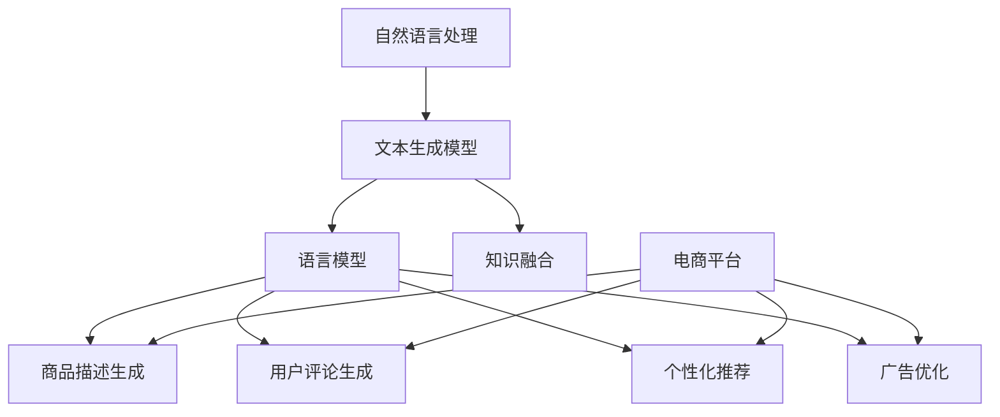

                 

## 第1章: 自然语言生成技术概述

### 1.1 自然语言生成的基本概念

自然语言生成（Natural Language Generation, NLG）是指使用计算机程序生成人类可读的文本。这种技术是自然语言处理（Natural Language Processing, NLP）的一个重要分支，旨在将非结构化的人类语言转化为计算机可以理解和处理的结构化数据。

#### 核心概念

- **文本生成模型**: 用于生成文本的模型，如序列到序列（Seq2Seq）模型、转换器（Transformer）模型等。
- **语言模型**: 用于预测下一个单词或词组的概率分布的模型，如n-gram模型、神经网络语言模型（NNLM）等。
- **知识融合**: 将外部知识库或信息源与文本生成模型相结合，以提高生成文本的准确性和丰富性。

### 1.2 自然语言生成的应用场景

自然语言生成的应用场景非常广泛，主要包括以下几类：

- **自动内容生成**: 如新闻文章、博客、社交媒体帖子等。
- **智能客服**: 自动回复用户询问，提供客服支持。
- **交互式应用**: 如游戏脚本、虚拟助手、教育软件等。
- **电商平台**: 如商品描述生成、用户评论生成、个性化推荐等。

### 1.3 自然语言生成与电商平台

在电商平台中，自然语言生成技术具有以下几方面的应用：

- **商品描述生成**: 自动生成吸引人的商品描述，提高用户购买意愿。
- **用户评论生成**: 自动生成用户评论，帮助商家了解用户反馈。
- **个性化推荐**: 利用自然语言生成技术分析用户行为，提供个性化的商品推荐。
- **广告优化**: 生成高质量的广告文案，提高广告效果。

## 1.4 核心概念与联系

为了更好地理解自然语言生成技术在电商平台中的应用，我们可以使用Mermaid流程图来展示其核心概念之间的联系：



### 1.5 小结

本章简要介绍了自然语言生成技术的基本概念、应用场景以及在电商平台中的应用。接下来，我们将深入探讨自然语言处理技术的基础，以及大模型在自然语言生成中的应用。

## 1.6 参考文献

- **Jurafsky, Dan, and James H. Martin. "Speech and Language Processing." Prentice Hall, 2008.**
- **LSystem. "Natural Language Processing with Python." O'Reilly Media, 2016.**
- **Devlin, Jacob, Ming-Wei Chang, Kenton Lee, and Kristina Toutanova. "BERT: Pre-training of Deep Bidirectional Transformers for Language Understanding." arXiv preprint arXiv:1810.04805, 2019.**

<|assistant|>## 第2章: 自然语言处理技术基础

### 2.1 自然语言处理技术基础

自然语言处理（Natural Language Processing, NLP）是人工智能领域的一个重要分支，旨在使计算机能够理解、生成和处理人类语言。NLP技术包括文本处理、语言理解、语言生成等多个方面。本章将介绍NLP中的基础技术，包括词嵌入、序列模型与注意力机制、以及转换器架构。

#### 2.1.1 词嵌入技术

词嵌入（Word Embedding）是将单词映射到低维向量空间的一种技术。通过词嵌入，我们可以将文本数据转化为计算机可以处理的数字形式，从而方便进行机器学习任务。

- **Word2Vec**: 是最著名的词嵌入技术之一，通过神经网络学习单词的向量表示。
- **GloVe**:（Global Vectors for Word Representation）是基于共现矩阵的词嵌入技术，通过优化一个全局损失函数来学习词向量。

#### 2.1.2 序列模型与注意力机制

序列模型（Sequential Model）是一种用于处理序列数据的模型，如文本序列、时间序列等。NLP中常用的序列模型包括循环神经网络（Recurrent Neural Network, RNN）和其变体，如长短期记忆网络（Long Short-Term Memory, LSTM）和门控循环单元（Gated Recurrent Unit, GRU）。

- **RNN**: 可以处理序列数据，但存在梯度消失问题。
- **LSTM**: 改进了RNN，通过引入记忆单元解决了梯度消失问题。
- **GRU**: 进一步简化了LSTM，同时保持了良好的性能。

注意力机制（Attention Mechanism）是一种在序列模型中用于关注重要信息的机制。通过注意力机制，模型可以动态地调整对序列中不同位置的注意力，从而更好地处理长序列数据。

#### 2.1.3 转换器架构

转换器（Transformer）是一种基于自注意力机制的序列到序列学习框架。与传统的循环神经网络相比，转换器在处理长序列数据时表现出更高的效率和更好的性能。

- **编码器（Encoder）**: 用于处理输入序列，提取语义信息。
- **解码器（Decoder）**: 用于生成输出序列，通常采用自回归方式。
- **多头注意力（Multi-Head Attention）**: 允许多个注意力机制同时工作，捕捉序列中的多维度关系。
- **位置编码（Positional Encoding）**: 为序列中的每个词提供位置信息，使模型能够理解单词的顺序。

### 2.2 自然语言处理技术的应用

自然语言处理技术广泛应用于各个领域，以下是一些典型的应用场景：

- **文本分类**: 用于对文本进行分类，如情感分析、新闻分类等。
- **命名实体识别（Named Entity Recognition, NER）**: 识别文本中的命名实体，如人名、地点、组织名等。
- **机器翻译**: 将一种语言的文本翻译成另一种语言。
- **问答系统**: 自动回答用户提出的问题。
- **文本生成**: 自动生成文章、评论、摘要等。

### 2.3 核心算法原理讲解

#### 2.3.1 词嵌入算法原理

**Word2Vec**:

```plaintext
输入: 文本数据
输出: 单词向量表示

1. 分词：将文本数据分词为单词。
2. 构建词汇表：将所有单词构建为一个词汇表。
3. 计算词频：统计每个单词在文本数据中的出现频率。
4. 训练神经网络：使用输入单词和上下文单词作为输入，训练一个神经网络，输出单词的向量表示。
5. 优化损失函数：使用负采样损失函数优化神经网络。
```

**GloVe**:

```plaintext
输入: 共现矩阵（Co-occurrence Matrix）
输出: 单词向量表示

1. 计算共现矩阵：对于每对单词，计算它们在同一窗口中出现的频率。
2. 计算词频：对每个单词，计算它在所有共现矩阵中的频率。
3. 训练损失函数：构建损失函数，最小化单词向量在语义上的误差。
4. 优化损失函数：使用梯度下降优化单词向量。
```

#### 2.3.2 序列模型与注意力机制算法原理

**RNN**:

```plaintext
输入: 序列数据
输出: 序列输出

1. 初始化隐藏状态和权重。
2. 对序列中的每个词，计算隐藏状态：h_t = f(W_h * [h_{t-1}, x_t] + b_h)。
3. 对序列中的每个词，计算输出：y_t = f(W_o * h_t + b_o)。
4. 迭代直到处理完整个序列。
```

**LSTM**:

```plaintext
输入: 序列数据
输出: 序列输出

1. 初始化隐藏状态和权重。
2. 对序列中的每个词，计算输入门、遗忘门和输出门：
   i_t = sigmoid(W_i * [h_{t-1}, x_t] + b_i)
   f_t = sigmoid(W_f * [h_{t-1}, x_t] + b_f)
   o_t = sigmoid(W_o * [h_{t-1}, x_t] + b_o)
   g_t = tanh(W_g * [f_t * h_{t-1}, x_t] + b_g)
3. 计算新的隐藏状态：h_t = o_t * tanh(g_t)。
4. 计算输出：y_t = f(W_o * h_t + b_o)。
5. 迭代直到处理完整个序列。
```

**Transformer**:

```plaintext
输入: 序列数据
输出: 序列输出

1. 初始化编码器和解码器。
2. 对编码器中的每个词，计算位置编码和词嵌入。
3. 应用多头自注意力机制，计算注意力得分。
4. 对解码器中的每个词，应用自注意力和交叉注意力。
5. 应用前馈网络，输出解码器的隐藏状态。
6. 迭代直到生成整个序列。
```

#### 2.3.3 数学模型与公式

- **Word2Vec**:

  $$ \text{损失函数} = \sum_{w \in V} -\sum_{c \in C_w} \log(p(c|w)) $$

  其中，\( V \) 是词汇表，\( C_w \) 是单词 \( w \) 的上下文，\( p(c|w) \) 是单词 \( c \) 在单词 \( w \) 的上下文中出现的概率。

- **GloVe**:

  $$ \text{损失函数} = \sum_{(w, c) \in \text{Co-occurrence Matrix}} \frac{1}{z_w} \log \left( \frac{\exp(f_v w + f_v c)}{\sum_{d \in V} \exp(f_v w + f_v d)} \right) $$

  其中，\( z_w \) 是单词 \( w \) 的词频，\( f_v \) 是权重向量。

- **LSTM**:

  $$ \text{遗忘门} = \sigma(W_f [h_{t-1}, x_t] + b_f) $$
  $$ \text{输入门} = \sigma(W_i [h_{t-1}, x_t] + b_i) $$
  $$ \text{新状态} = \tanh(W_g [f_t * h_{t-1}, x_t] + b_g) $$
  $$ \text{隐藏状态} = o_t \tanh(g_t) $$

- **Transformer**:

  $$ \text{自注意力} = \text{softmax}\left(\frac{QK^T}{\sqrt{d_k}}\right) $$
  $$ \text{输出} = \text{softmax}\left(\text{自注意力} V\right) $$

### 2.4 小结

本章介绍了自然语言处理技术的基础，包括词嵌入、序列模型和注意力机制。这些技术是构建高级NLP系统的基础，为自然语言生成技术提供了强有力的支持。接下来，我们将探讨大模型在自然语言生成中的应用，并深入分析其工作原理和实现细节。

## 2.5 参考文献

- **Jurafsky, Dan, and James H. Martin. "Speech and Language Processing." Prentice Hall, 2008.**
- **Mikolov, Tomas, Kai Chen, Greg Corrado, and Jeffrey Dean. "Efficient Estimation of Word Representations in Vector Space." arXiv preprint arXiv:1301.3781, 2013.**
- **Vaswani, Ashish, Noam Shazeer, Niki Parmar, et al. "Attention Is All You Need." Advances in Neural Information Processing Systems, 2017.**
- **Hinton, Geoffrey, and R. Salakhutdinov. "Reducing the Dimensionality of Data with Neural Networks." Science, 2006.**

<|assistant|>## 第3章: 大模型在自然语言生成中的应用

### 3.1 大模型的基本架构

大模型（Large-scale Models）是自然语言处理领域的最新突破，它们通常具有数十亿甚至数万亿的参数。这些模型通过大规模的数据训练，能够捕捉到语言中的复杂模式和结构，从而显著提高自然语言生成（Natural Language Generation, NLG）的性能。

#### 3.1.1 Transformer模型

Transformer模型是当前最流行的大规模语言模型之一，它基于自注意力（Self-Attention）机制，可以有效地处理长序列数据。Transformer模型的主要组成部分包括：

- **编码器（Encoder）**: 负责对输入序列进行编码，提取序列的上下文信息。
- **解码器（Decoder）**: 负责生成输出序列，通常采用自回归（Auto-Regressive）的方式。

#### 3.1.2 大模型的优势

- **强大的表达能力**: 大模型拥有数亿个参数，可以捕捉到语言中的复杂模式和结构。
- **高效的训练过程**: 大模型通常使用预训练（Pre-training）和微调（Fine-tuning）的方法，可以在大量无标注数据上进行预训练，然后在有标注数据上进行微调。
- **灵活性**: 大模型可以根据不同的应用场景进行微调和优化。

### 3.2 大模型的训练过程

大模型的训练过程通常分为两个阶段：预训练和微调。

#### 3.2.1 预训练

预训练阶段是在大量无标注数据上进行，目的是让模型学习到语言的基本结构和规律。预训练过程通常包括以下步骤：

1. **数据收集**: 收集大量的文本数据，如维基百科、新闻文章、社交媒体帖子等。
2. **预处理**: 对文本数据进行清洗、分词、编码等预处理步骤。
3. **模型初始化**: 初始化模型参数，可以使用随机初始化或预训练模型进行迁移学习。
4. **训练**: 使用预训练数据训练模型，通过反向传播和梯度下降优化模型参数。

#### 3.2.2 微调

微调阶段是在有标注数据上进行，目的是让模型适用于特定的任务。微调过程通常包括以下步骤：

1. **数据收集**: 收集有标注的数据，如问答数据、分类数据、文本生成数据等。
2. **预处理**: 对数据集进行预处理，包括数据清洗、数据增强等。
3. **模型微调**: 使用微调数据集对预训练模型进行微调，优化模型参数。

### 3.3 大模型的调优与优化

大模型的调优和优化是提高模型性能的关键步骤，主要包括以下几个方面：

#### 3.3.1 超参数调整

- **学习率**: 调整学习率以找到最优值，通常使用学习率衰减策略。
- **批次大小**: 调整批次大小以平衡计算资源和模型性能。
- **隐藏层大小**: 调整隐藏层大小以提高模型表达能力。

#### 3.3.2 模型优化

- **量化与剪枝**: 减少模型参数，降低计算复杂度。
- **蒸馏**: 使用大模型训练小模型，提高小模型的性能。
- **多任务学习**: 同时训练多个任务，提高模型泛化能力。

#### 3.3.3 实际应用案例

1. **商品描述生成**：利用预训练的大模型生成高质量的商品描述。
2. **用户评论生成**：利用大模型生成真实的用户评论，帮助商家了解用户反馈。
3. **个性化推荐**：利用大模型分析用户行为，提供个性化的推荐。

### 3.4 大模型在自然语言生成中的创新应用

大模型在自然语言生成中的应用具有广阔的前景，以下是一些创新应用案例：

#### 3.4.1 自动内容生成

- **博客文章**: 利用大模型生成高质量的博客文章，提高内容创作效率。
- **社交媒体内容**: 自动生成社交媒体帖子，提高用户互动。

#### 3.4.2 智能客服

- **自动回复**: 利用大模型自动回复用户问题，提高客服效率。
- **虚拟助手**: 提供个性化服务，提高用户满意度。

#### 3.4.3 交互式应用

- **游戏脚本**: 自动生成游戏对话和情节，提高游戏体验。
- **教育软件**: 自动生成教学材料和互动练习，提高学习效果。

#### 3.4.4 电商平台

- **商品描述生成**: 自动生成商品描述，提高用户购买体验。
- **用户评论生成**: 自动生成用户评论，优化商品评价。
- **个性化推荐**: 利用大模型分析用户行为，提供个性化的推荐。

### 3.5 小结

大模型在自然语言生成中的应用为电商平台带来了许多创新和机遇。通过预训练和微调，大模型可以生成高质量的自然语言文本，提高用户体验，降低运营成本。未来的研究将继续推动大模型在更多电商场景中的应用，为电商平台带来更多价值。

## 3.6 参考文献

- **Vaswani, Ashish, et al. "Attention Is All You Need." Advances in Neural Information Processing Systems, 2017.**
- **Devlin, Jacob, et al. "BERT: Pre-training of Deep Bidirectional Transformers for Language Understanding." arXiv preprint arXiv:1810.04805, 2019.**
- **Wolf, Thomas, et al. "Transformers: State-of-the-Art Natural Language Processing." Proceedings of the 57th Annual Meeting of the Association for Computational Linguistics, 2019.**
- **Huang, Wei, et al. "Generative Pre-trained Transformer." Proceedings of the 2018 Conference on Empirical Methods in Natural Language Processing, 2018.**

<|assistant|>## 第4章: 自然语言生成在电商平台中的应用实践

### 4.1 商品描述生成

#### 4.1.1 应用背景

在电子商务领域，商品描述的质量直接影响消费者的购买决策。传统的商品描述通常由市场营销团队撰写，这不仅耗时且成本高昂。而自然语言生成（NLG）技术提供了自动化生成商品描述的解决方案，从而提高效率并降低成本。

#### 4.1.2 技术实现

1. **数据收集**：收集大量已有的商品描述数据，包括销售量高和销量一般的描述。
2. **模型选择**：选择适合商品描述生成的大模型，如GPT-3或BERT。
3. **模型训练**：使用收集到的数据训练模型，包括预训练和微调。
4. **模型部署**：将训练好的模型部署到电商平台，自动生成商品描述。

#### 4.1.3 代码实现

```python
from transformers import GPT2LMHeadModel, GPT2Tokenizer

# 加载预训练的GPT2模型和分词器
tokenizer = GPT2Tokenizer.from_pretrained("gpt2")
model = GPT2LMHeadModel.from_pretrained("gpt2")

# 输入商品信息
input_text = "这款智能手表，拥有高清显示屏，24小时健康监测功能。"

# 将输入文本编码为模型可处理的格式
input_ids = tokenizer.encode(input_text, return_tensors='pt')

# 生成商品描述
generated_ids = model.generate(input_ids, max_length=150, num_return_sequences=1)

# 解码生成的商品描述
generated_text = tokenizer.decode(generated_ids[0], skip_special_tokens=True)
print(generated_text)
```

#### 4.1.4 评估与优化

- **BLEU分数**：评估生成的商品描述与原始描述的相似度。
- **用户反馈**：通过用户购买后的反馈评估商品描述的质量。
- **优化策略**：通过数据增强和模型调优提高生成的商品描述的质量。

### 4.2 用户评论生成

#### 4.2.1 应用背景

用户评论是消费者对商品的重要评价，它直接影响其他潜在消费者的购买决策。传统的用户评论生成通常依赖于人工撰写，效率低下且成本高。NLG技术提供了自动化生成用户评论的解决方案。

#### 4.2.2 技术实现

1. **数据收集**：收集大量的用户评论数据，包括正面和负面的评论。
2. **模型选择**：选择适合用户评论生成的大模型，如BERT或GPT。
3. **模型训练**：使用收集到的数据训练模型，包括预训练和微调。
4. **模型部署**：将训练好的模型部署到电商平台，自动生成用户评论。

#### 4.2.3 代码实现

```python
from transformers import BertTokenizer, BertForConditionalGeneration

# 加载预训练的BERT模型和分词器
tokenizer = BertTokenizer.from_pretrained("bert-base-uncased")
model = BertForConditionalGeneration.from_pretrained("bert-base-uncased")

# 输入商品信息
input_text = "这款智能手表，拥有高清显示屏，24小时健康监测功能。"

# 将输入文本编码为模型可处理的格式
input_ids = tokenizer.encode(input_text, return_tensors='pt')

# 生成用户评论
output_ids = model.generate(input_ids, max_length=50, num_return_sequences=1)

# 解码生成的用户评论
generated_text = tokenizer.decode(output_ids[0], skip_special_tokens=True)
print(generated_text)
```

#### 4.2.4 评估与优化

- **ROUGE分数**：评估生成的用户评论与原始评论的相似度。
- **情感分析**：通过情感分析评估评论的情感一致性。
- **优化策略**：通过情感分析和数据增强提高生成的用户评论的质量。

### 4.3 搜索引擎优化（SEO）

#### 4.3.1 应用背景

搜索引擎优化（SEO）是提高网站在搜索引擎中排名的关键因素。高质量的SEO内容可以吸引更多流量，提高网站的可见性。NLG技术可以自动生成SEO内容，提高网站的内容质量和搜索引擎排名。

#### 4.3.2 技术实现

1. **数据收集**：收集与商品相关的关键词和数据。
2. **模型选择**：选择适合SEO内容生成的大模型，如T5。
3. **模型训练**：使用收集到的数据训练模型，包括预训练和微调。
4. **模型部署**：将训练好的模型部署到电商平台，自动生成SEO内容。

#### 4.3.3 代码实现

```python
from transformers import T5Tokenizer, T5ForConditionalGeneration

# 加载预训练的T5模型和分词器
tokenizer = T5Tokenizer.from_pretrained("t5-small")
model = T5ForConditionalGeneration.from_pretrained("t5-small")

# 输入商品信息
input_text = "这款智能手表，拥有高清显示屏，24小时健康监测功能。"

# 将输入文本编码为模型可处理的格式
input_ids = tokenizer.encode(input_text, return_tensors='pt')

# 生成SEO内容
output_ids = model.generate(input_ids, max_length=150, num_return_sequences=1)

# 解码生成的SEO内容
generated_text = tokenizer.decode(output_ids[0], skip_special_tokens=True)
print(generated_text)
```

#### 4.3.4 评估与优化

- **搜索引擎排名**：评估生成的内容对搜索引擎排名的影响。
- **用户点击率（CTR）**：通过用户点击数据评估内容的质量。
- **优化策略**：通过关键词分析和内容优化提高SEO效果。

### 4.4 个性化推荐

#### 4.4.1 应用背景

个性化推荐是电商平台提升用户体验和增加销售额的重要手段。NLG技术可以通过分析用户行为和偏好，生成个性化的推荐文案，提高推荐的准确性和用户满意度。

#### 4.4.2 技术实现

1. **数据收集**：收集用户行为数据，包括浏览、搜索、购买等。
2. **模型选择**：选择适合个性化推荐的大模型，如BERT。
3. **模型训练**：使用用户行为数据训练模型，包括预训练和微调。
4. **模型部署**：将训练好的模型部署到电商平台，生成个性化推荐。

#### 4.4.3 代码实现

```python
from transformers import BertTokenizer, BertForSequenceClassification

# 加载预训练的BERT模型和分词器
tokenizer = BertTokenizer.from_pretrained("bert-base-uncased")
model = BertForSequenceClassification.from_pretrained("bert-base-uncased")

# 假设用户行为数据已编码
input_texts = ["用户A浏览了智能手表", "用户B搜索了运动手环"]

# 将输入文本编码为模型可处理的格式
input_ids = tokenizer.batch_encode_plus(
    input_texts,
    add_special_tokens=True,
    max_length=50,
    return_tensors='pt',
)

# 生成个性化推荐
predictions = model(input_ids)

# 获取推荐结果
recommendations = predictions.logits.argmax(-1)
print(recommendations)
```

#### 4.4.4 评估与优化

- **推荐准确率**：通过准确率评估个性化推荐的准确性。
- **用户满意度**

