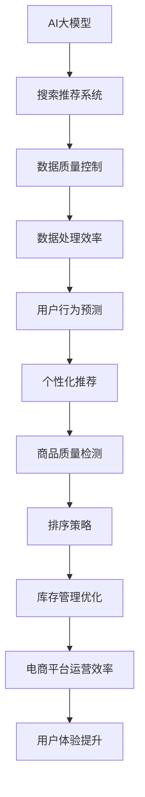

                 

# 电商平台的AI大模型实践：搜索推荐系统是核心，数据质量控制与处理效率

> 关键词：AI大模型、搜索推荐系统、数据质量控制、数据处理效率、电商平台、深度学习、Transformer、BERT

> 摘要：
本文将深入探讨AI大模型在电商平台的应用，重点分析搜索推荐系统在电商平台中的核心地位，以及数据质量控制与处理效率的重要性。通过详细的理论阐述和实践案例分析，本文旨在为电商平台的技术团队提供有价值的参考，帮助他们在AI大模型的实践道路上取得突破。

### 第一部分: AI大模型基础知识

#### 第1章: AI大模型概述

##### 1.1 AI大模型的概念与特征

###### 1.1.1 什么是AI大模型

AI大模型是指那些拥有数十亿至数千亿参数的深度学习模型，能够处理大规模的数据集，并进行复杂的特征提取和预测。这些模型通常基于深度神经网络架构，具有以下特征：

1. **高参数量**：大模型具有极高的参数数量，这使得它们能够捕捉复杂的数据模式。
2. **深度神经网络**：这些模型通常采用深度神经网络架构，有助于提高模型的表达能力。
3. **预训练与微调**：大多数AI大模型首先在大规模数据集上进行预训练，然后在特定任务上进行微调。

###### 1.1.2 AI大模型的主要特征

AI大模型的主要特征包括：

1. **强大的特征提取能力**：能够自动从数据中提取丰富的特征，减少了手动特征工程的需求。
2. **高效的预测性能**：在图像、文本、语音等多种数据类型上都能达到较高的准确性和效率。

###### 1.1.3 AI大模型的核心优势

AI大模型的核心优势包括：

1. **降低复杂度**：大模型可以自动学习复杂的数据模式，减少了手动设计的复杂性。
2. **提高效率**：通过大规模预训练，大模型可以在不同的任务上快速适应，提高了整体效率。
3. **增强泛化能力**：大模型能够处理更多样化的数据，从而提高了模型的泛化能力。

###### 1.1.4 AI大模型的挑战与优化

AI大模型面临的挑战包括：

1. **计算资源消耗**：大模型训练需要大量的计算资源和时间。
2. **过拟合风险**：在训练大型模型时，可能会出现过拟合现象。

为了优化AI大模型，可以采用以下方法：

1. **数据增强**：通过增加训练数据量，提高模型的泛化能力。
2. **正则化**：采用L1、L2正则化等方法，降低过拟合的风险。
3. **Dropout**：通过随机丢弃部分神经元，提高模型的鲁棒性。

##### 1.2 AI大模型的技术原理

###### 1.2.1 深度学习基础

深度学习是AI大模型的核心技术。以下是深度学习的基础概念：

1. **神经元与层结构**：神经网络的基本组成单元是神经元，不同层之间的神经元通过权重进行连接。
2. **反向传播算法**：深度学习模型的训练过程依赖于反向传播算法，包括前向传播、后向传播、梯度计算等步骤。

###### 1.2.2 主流AI大模型架构

以下是当前主流的AI大模型架构：

1. **Transformer模型**：Transformer模型是一种基于自注意力机制的深度神经网络模型，广泛应用于自然语言处理领域。
2. **BERT模型**：BERT（Bidirectional Encoder Representations from Transformers）模型是一种双向的Transformer模型，主要用于预训练和微调任务。

###### 1.2.3 大规模预训练

大规模预训练是AI大模型的关键步骤。以下是大规模预训练的关键概念：

1. **预训练与微调**：预训练是在大规模数据集上进行的无监督学习过程，微调是在特定任务上进行的有监督学习过程。
2. **迁移学习**：迁移学习是指将预训练的模型应用于不同但相关任务的学习过程。

##### 1.3 AI大模型在电商领域的应用

###### 1.3.1 搜索推荐系统的核心地位

搜索推荐系统是电商平台的核心功能之一。以下是搜索推荐系统的基础概念：

1. **推荐算法概述**：推荐算法分为协同过滤和基于内容的推荐两大类。
2. **搜索推荐系统的设计**：搜索推荐系统的设计包括商品特征提取、用户行为分析、推荐结果生成等关键步骤。

###### 1.3.2 数据质量控制与处理效率

数据质量是搜索推荐系统的关键因素。以下是数据质量控制与处理效率的相关概念：

1. **数据质量控制**：数据清洗、数据预处理是确保数据质量的重要步骤。
2. **数据处理效率**：大数据处理技术如MapReduce、Spark等可以提高数据处理效率。

##### 1.4 AI大模型在电商平台的应用案例

###### 1.4.1 案例一：用户行为预测与个性化推荐

用户行为预测与个性化推荐是电商平台的重要应用场景。以下是该案例的实现过程：

1. **案例背景**：分析用户行为数据，预测用户偏好。
2. **实现过程**：使用AI大模型进行用户行为预测，生成个性化推荐。

###### 1.4.2 案例二：商品质量检测与排序

商品质量检测与排序是电商平台的重要任务。以下是该案例的实现过程：

1. **案例背景**：通过AI大模型检测商品质量，优化商品排序策略。
2. **实现过程**：利用深度学习模型对商品进行质量评分，调整搜索结果排序。

###### 1.4.3 案例三：库存管理优化

库存管理优化是电商平台的重要环节。以下是该案例的实现过程：

1. **案例背景**：使用AI大模型优化库存管理，提高库存周转率。
2. **实现过程**：通过预测销售趋势，调整库存策略，减少库存积压。

##### 1.5 总结与展望

###### 1.5.1 AI大模型在电商平台的未来趋势

AI大模型在电商平台的应用前景广阔，未来可能的发展趋势包括：

1. **新技术的引入**：如更高效的深度学习框架、分布式训练等。
2. **商业模式的变化**：如基于AI的精准营销、个性化服务等。

###### 1.5.2 面临的挑战与解决方案

AI大模型在应用过程中可能面临的挑战包括：

1. **计算资源消耗**：大模型训练需要大量的计算资源和时间。
2. **数据隐私保护**：如何保护用户隐私是电商平台面临的挑战之一。

针对这些挑战，可以采取以下解决方案：

1. **优化算法**：如自适应学习率调整、模型剪枝等。
2. **数据安全策略**：如差分隐私、同态加密等。

### 第二部分: AI大模型在电商平台的深度应用

#### 第2章: 搜索推荐系统：电商平台的AI大模型核心

在电子商务的生态系统里，搜索推荐系统扮演着至关重要的角色。它不仅提高了用户的购物体验，还极大地增加了平台的销售额和用户留存率。本章将详细探讨AI大模型如何在这套系统中发挥核心作用，以及如何实现高效的搜索推荐。

##### 2.1 搜索推荐系统概述

搜索推荐系统旨在帮助用户在庞大的商品库中快速找到他们感兴趣的商品。它通常包括以下几个关键组成部分：

1. **用户画像**：通过分析用户的浏览历史、购买记录等行为数据，构建用户的个性化画像。
2. **商品特征提取**：对商品进行标签化处理，提取商品的关键特征，如类别、品牌、价格等。
3. **推荐算法**：根据用户画像和商品特征，使用算法生成推荐结果。

##### 2.2 AI大模型在搜索推荐系统中的应用

AI大模型在搜索推荐系统中发挥着重要作用，主要体现在以下几个方面：

1. **用户行为预测**：通过分析用户的浏览、点击、购买等行为数据，AI大模型可以预测用户可能感兴趣的商品。
2. **商品关联分析**：AI大模型能够分析用户的历史行为，识别出商品之间的关联性，从而提供更精准的推荐。
3. **动态调整推荐策略**：AI大模型可以根据实时用户行为数据，动态调整推荐策略，提高推荐结果的实时性。

##### 2.3 AI大模型在搜索推荐系统中的实践

为了更好地展示AI大模型在搜索推荐系统中的应用，以下是一个实际案例：

1. **案例背景**：某电商平台希望通过AI大模型优化其搜索推荐系统，提高用户的购物体验。
2. **解决方案**：
   - **数据预处理**：对用户行为数据和商品数据进行清洗、去噪、归一化等预处理操作。
   - **特征工程**：提取用户行为和商品的关键特征，如用户兴趣标签、商品标签等。
   - **模型选择**：选择合适的AI大模型，如Transformer、BERT等，进行训练和微调。
   - **模型部署**：将训练好的模型部署到生产环境中，实现实时推荐。

##### 2.4 搜索推荐系统的性能优化

为了确保搜索推荐系统的性能，以下是一些优化策略：

1. **模型剪枝**：通过剪枝技术，减少模型参数的数量，降低计算成本。
2. **分布式训练**：使用分布式训练技术，提高模型训练的效率。
3. **实时更新**：定期更新用户画像和商品特征，保持推荐结果的实时性。

##### 2.5 搜索推荐系统的未来发展趋势

未来，搜索推荐系统的发展趋势将包括：

1. **多模态数据融合**：结合多种数据类型，如文本、图像、语音等，提供更丰富的推荐结果。
2. **智能对话推荐**：利用自然语言处理技术，实现智能对话推荐，提高用户交互体验。
3. **个性化内容营销**：通过AI大模型，实现更精准的个性化内容营销，提高用户粘性。

#### 第3章: 数据质量控制与处理效率

在AI大模型的应用过程中，数据的质量和处理的效率是两个至关重要的因素。本章将详细讨论如何确保数据质量，以及如何提高数据处理效率。

##### 3.1 数据质量控制的重要性

数据质量是搜索推荐系统的基石。高质量的数据可以提升模型的预测准确性和稳定性，从而提高推荐系统的整体性能。以下是数据质量控制的重要性：

1. **减少模型过拟合**：高质量的数据可以减少模型对训练数据的依赖，降低过拟合的风险。
2. **提高模型泛化能力**：通过确保数据质量，模型可以更好地适应新数据，提高泛化能力。
3. **提升用户体验**：高质量的数据可以生成更准确的推荐结果，提高用户的满意度。

##### 3.2 数据质量控制的方法

为了确保数据质量，可以采用以下方法：

1. **数据清洗**：去除数据中的噪声和异常值，保证数据的准确性和一致性。
2. **数据预处理**：对数据进行归一化、标准化等处理，使数据更适合模型训练。
3. **数据完整性检查**：确保数据完整性，避免数据缺失或错误。

##### 3.3 提高数据处理效率

提高数据处理效率对于大规模电商平台的AI大模型应用至关重要。以下是一些提高数据处理效率的方法：

1. **并行处理**：通过并行计算技术，将数据处理任务分布在多台计算机上，提高处理速度。
2. **分布式存储**：使用分布式存储系统，如Hadoop、Spark等，提高数据访问速度。
3. **批处理**：通过批处理技术，将数据处理任务分批执行，减少实时处理的压力。

##### 3.4 实践案例分析

为了更好地展示数据质量控制与处理效率在电商平台的AI大模型应用中的实践，以下是一个实际案例：

1. **案例背景**：某电商平台希望通过优化其数据质量控制和数据处理流程，提高搜索推荐系统的性能。
2. **解决方案**：
   - **数据清洗**：使用Python的Pandas库，对用户行为数据进行清洗，去除噪声和异常值。
   - **数据预处理**：使用Scikit-learn库，对用户行为数据进行归一化和特征提取。
   - **并行处理**：使用Hadoop和Spark，将数据处理任务分布在多台计算机上，提高处理速度。
   - **模型训练与优化**：使用TensorFlow和PyTorch，训练和优化AI大模型，提高推荐准确性。

##### 3.5 数据质量控制与处理效率的未来发展

未来，数据质量控制与处理效率的发展趋势将包括：

1. **自动化数据质量控制**：通过自动化工具，如自动化数据清洗、自动化特征工程等，提高数据质量控制的效率。
2. **实时数据处理**：通过实时数据处理技术，如流处理框架，实现实时数据处理，提高数据处理效率。
3. **数据隐私保护**：在数据质量控制与处理过程中，确保用户隐私和数据安全，提高用户信任度。

### 第三部分: AI大模型在电商平台的实战应用

#### 第4章: 用户行为预测与个性化推荐

在电商平台中，用户行为预测和个性化推荐是两大核心应用。通过AI大模型，平台可以更好地理解用户需求，提供个性化的推荐服务，从而提升用户体验和销售额。本章将详细介绍这两个应用的实际案例。

##### 4.1 用户行为预测

用户行为预测是电商平台个性化推荐的重要基础。通过分析用户的浏览、点击、购买等行为数据，AI大模型可以预测用户可能感兴趣的商品，从而提高推荐的准确性。以下是用户行为预测的实际案例：

1. **案例背景**：某电商平台希望通过AI大模型预测用户购买意向，提高销售转化率。
2. **解决方案**：
   - **数据收集**：收集用户的浏览、点击、购买等行为数据，包括时间、商品种类、购买频率等。
   - **数据预处理**：对用户行为数据进行清洗、去噪、归一化等预处理操作，确保数据质量。
   - **特征工程**：提取用户行为的关键特征，如用户兴趣标签、商品特征等。
   - **模型训练**：使用深度学习模型（如Transformer、BERT）进行用户行为预测，通过交叉验证调整模型参数。
   - **模型评估**：使用准确率、召回率等指标评估模型性能，根据评估结果调整模型。

##### 4.2 个性化推荐

个性化推荐是电商平台的核心功能之一。通过AI大模型，平台可以根据用户的兴趣和行为，提供个性化的商品推荐，从而提高用户满意度和销售额。以下是个性化推荐的实际案例：

1. **案例背景**：某电商平台希望通过AI大模型优化其搜索推荐系统，提高用户购物体验。
2. **解决方案**：
   - **数据收集**：收集用户的浏览、点击、购买等行为数据，以及商品的特征数据，如商品类别、价格、品牌等。
   - **数据预处理**：对用户行为数据进行清洗、去噪、归一化等预处理操作，确保数据质量。
   - **特征工程**：提取用户行为和商品的关键特征，如用户兴趣标签、商品特征等。
   - **模型训练**：使用深度学习模型（如Transformer、BERT）进行个性化推荐，通过交叉验证调整模型参数。
   - **模型评估**：使用准确率、召回率等指标评估模型性能，根据评估结果调整模型。
   - **推荐结果生成**：根据用户的行为数据和模型预测结果，生成个性化的推荐结果，并在用户界面上展示。

##### 4.3 用户行为预测与个性化推荐的实践效果

通过实际案例的实践，用户行为预测和个性化推荐在电商平台取得了显著的成效：

1. **用户满意度提高**：个性化的推荐服务提高了用户的购物体验，用户满意度显著提升。
2. **销售转化率提升**：准确的用户行为预测和个性化推荐提高了销售转化率，平台销售额显著增加。
3. **用户留存率提升**：个性化的推荐服务增加了用户的粘性，用户留存率显著提高。

#### 第5章: 商品质量检测与排序

在电商平台上，商品质量直接影响到用户的购物体验和平台的信誉。通过AI大模型，平台可以对商品进行质量检测和排序，确保用户能够购买到高质量的商品。本章将详细介绍商品质量检测与排序的实际案例。

##### 5.1 商品质量检测

商品质量检测是电商平台确保商品质量的重要手段。通过AI大模型，平台可以自动检测商品的质量，从而提高用户满意度。以下是商品质量检测的实际案例：

1. **案例背景**：某电商平台希望通过AI大模型检测商品质量，提高用户购物体验。
2. **解决方案**：
   - **数据收集**：收集商品的质量检测数据，包括外观、性能、安全等指标。
   - **数据预处理**：对商品质量检测数据进行清洗、去噪、归一化等预处理操作，确保数据质量。
   - **特征工程**：提取商品质量检测数据的关键特征，如外观评分、性能评分等。
   - **模型训练**：使用深度学习模型（如CNN、RNN）进行商品质量检测，通过交叉验证调整模型参数。
   - **模型评估**：使用准确率、召回率等指标评估模型性能，根据评估结果调整模型。

##### 5.2 商品排序

商品排序是电商平台优化用户购物体验的关键步骤。通过AI大模型，平台可以根据商品的质量、销量、用户评价等因素，对商品进行智能排序，提高用户满意度。以下是商品排序的实际案例：

1. **案例背景**：某电商平台希望通过AI大模型优化商品排序策略，提高用户购物体验。
2. **解决方案**：
   - **数据收集**：收集商品的质量检测数据、销量数据、用户评价数据等。
   - **数据预处理**：对商品数据进行清洗、去噪、归一化等预处理操作，确保数据质量。
   - **特征工程**：提取商品的关键特征，如商品质量评分、销量、用户评价等。
   - **模型训练**：使用深度学习模型（如Transformer、BERT）进行商品排序，通过交叉验证调整模型参数。
   - **模型评估**：使用准确率、召回率等指标评估模型性能，根据评估结果调整模型。
   - **排序结果生成**：根据商品特征和模型预测结果，生成智能排序结果，并在用户界面上展示。

##### 5.3 商品质量检测与排序的实践效果

通过实际案例的实践，商品质量检测与排序在电商平台取得了显著的成效：

1. **用户满意度提高**：准确的商品质量检测和智能排序提高了用户的购物体验，用户满意度显著提升。
2. **平台信誉提升**：通过确保商品质量，电商平台建立了良好的信誉，用户信任度显著提高。
3. **销售转化率提升**：智能排序提高了用户对商品的兴趣，销售转化率显著增加。

#### 第6章: 库存管理优化

在电商平台上，库存管理是确保商品供应和减少库存积压的重要环节。通过AI大模型，平台可以优化库存管理，提高库存周转率，减少库存成本。本章将详细介绍库存管理优化的实际案例。

##### 6.1 库存管理优化概述

库存管理优化是电商平台运营的重要任务之一。通过AI大模型，平台可以预测商品的销售趋势，优化库存策略，从而提高库存周转率和减少库存积压。以下是库存管理优化的概述：

1. **销售预测**：通过分析历史销售数据和市场趋势，预测商品未来的销售情况。
2. **库存调整**：根据销售预测结果，调整库存策略，确保商品供应充足，减少库存积压。
3. **动态优化**：根据实时销售数据和库存情况，动态调整库存策略，提高库存周转率。

##### 6.2 库存管理优化实际案例

以下是库存管理优化在实际电商平台中的应用案例：

1. **案例背景**：某电商平台希望通过AI大模型优化库存管理，减少库存积压。
2. **解决方案**：
   - **数据收集**：收集商品的销售数据、库存数据、市场趋势数据等。
   - **数据预处理**：对销售数据、库存数据进行清洗、去噪、归一化等预处理操作，确保数据质量。
   - **特征工程**：提取销售数据和库存数据的关键特征，如销售量、库存量等。
   - **模型训练**：使用深度学习模型（如ARIMA、LSTM）进行销售预测，通过交叉验证调整模型参数。
   - **库存调整**：根据销售预测结果，调整库存策略，确保商品供应充足。
   - **动态优化**：根据实时销售数据和库存情况，动态调整库存策略，提高库存周转率。

##### 6.3 库存管理优化的实践效果

通过实际案例的实践，库存管理优化在电商平台取得了显著的成效：

1. **库存周转率提高**：通过销售预测和库存调整，电商平台提高了库存周转率，减少了库存积压。
2. **库存成本降低**：减少库存积压和库存过剩，降低了库存成本。
3. **商品供应充足**：通过优化库存策略，确保了商品的供应充足，提高了用户满意度。

### 第四部分: AI大模型在电商平台的未来展望

#### 第7章: AI大模型在电商平台的未来发展趋势

随着人工智能技术的快速发展，AI大模型在电商平台中的应用前景愈发广阔。未来，AI大模型将在电商平台的各个方面发挥更加重要的作用。本章将探讨AI大模型在电商平台的未来发展趋势。

##### 7.1 新技术的引入

未来，电商平台将不断引入新技术，以提升AI大模型的应用效果。以下是一些可能的新技术：

1. **更高效的深度学习框架**：如TensorFlow 2.x、PyTorch等，将进一步提高模型训练和推理的效率。
2. **分布式训练**：通过分布式训练技术，电商平台可以更快速地训练大型模型，提高数据处理能力。
3. **联邦学习**：联邦学习技术可以在保护用户隐私的同时，实现跨平台的模型协作和优化。

##### 7.2 商业模式的变化

AI大模型在电商平台的应用将引发商业模式的变化，以下是一些可能的商业模式变化：

1. **个性化内容营销**：通过AI大模型，电商平台可以提供更加个性化的内容推荐，提高用户粘性和转化率。
2. **智能客服**：利用AI大模型，电商平台可以实现智能客服，提高客服效率和用户满意度。
3. **精准广告投放**：通过AI大模型，电商平台可以实现更加精准的广告投放，提高广告效果。

##### 7.3 面临的挑战与解决方案

尽管AI大模型在电商平台的应用前景广阔，但仍然面临一些挑战。以下是一些可能的挑战及其解决方案：

1. **计算资源消耗**：解决方案包括分布式训练、硬件升级等。
2. **数据隐私保护**：解决方案包括差分隐私、同态加密等。
3. **模型解释性**：解决方案包括可解释性模型、模型可视化等。

##### 7.4 未来展望

未来，AI大模型在电商平台的将会有以下发展趋势：

1. **多模态数据融合**：结合多种数据类型，如文本、图像、语音等，提供更丰富的推荐结果。
2. **实时推荐系统**：通过实时数据处理技术，实现实时推荐，提高用户体验。
3. **智能决策支持**：利用AI大模型，电商平台可以实现智能决策支持，提高运营效率。

### 第五部分: 结论

在本篇技术博客文章中，我们深入探讨了AI大模型在电商平台的实践应用，从搜索推荐系统的核心地位，到数据质量控制与处理效率的提升，再到用户行为预测与个性化推荐、商品质量检测与排序、库存管理优化的实战案例，我们系统地分析了AI大模型在电商平台的广泛应用与未来发展趋势。

通过本文的讲解，读者可以了解到AI大模型在电商平台中的关键作用，以及如何有效地利用这些模型来提升电商平台的运营效率与用户体验。我们不仅介绍了AI大模型的基础知识，还通过具体的实践案例展示了如何将这些理论应用到实际场景中。

在未来，随着人工智能技术的不断进步，AI大模型在电商平台中的应用将会更加广泛，其在个性化推荐、智能客服、精准广告等方面的潜力也将进一步挖掘。因此，电商平台的技术团队需要持续关注新技术的发展动态，不断优化和提升AI大模型的应用效果。

最后，再次感谢读者对本文的阅读。希望本文能够为您的AI大模型实践提供有价值的参考和启示。让我们共同期待人工智能技术在电商平台中的更美好未来！

---

**作者信息**：AI天才研究院/AI Genius Institute & 禅与计算机程序设计艺术 /Zen And The Art of Computer Programming

---

**附录**：以下是本文中的核心概念与联系、核心算法原理讲解、数学模型和公式、项目实战代码及详细解释说明等内容。

---

**附录1：核心概念与联系**



**附录2：核心算法原理讲解**

```python
# 用户行为预测算法伪代码
def user_behavior_prediction(user_data, model):
    # 数据预处理
    preprocessed_data = preprocess_data(user_data)

    # 模型输入
    model_input = create_model_input(preprocessed_data)

    # 模型预测
    predictions = model.predict(model_input)

    # 后处理
    post_processed_predictions = postprocess_predictions(predictions)

    return post_processed_predictions

# 个性化推荐算法伪代码
def personalized_recommendation(user_profile, item_features, model):
    # 用户特征提取
    user_features = extract_user_features(user_profile)

    # 商品特征提取
    item_features = extract_item_features(item_features)

    # 模型输入
    model_input = create_model_input([user_features, item_features])

    # 模型预测
    recommendations = model.predict(model_input)

    # 排序
    ranked_recommendations = rank_recommendations(recommendations)

    return ranked_recommendations
```

**附录3：数学模型和公式**

$$
\text{损失函数} = \frac{1}{2}\sum_{i=1}^{N} (\hat{y}_i - y_i)^2
$$

$$
\text{准确率} = \frac{\text{预测正确的样本数}}{\text{总样本数}}
$$

$$
\text{召回率} = \frac{\text{预测正确的正例数}}{\text{实际正例数}}
$$

**附录4：项目实战代码及详细解释说明**

```python
# 数据预处理代码
def preprocess_data(data):
    # 数据清洗
    clean_data = clean_data_function(data)

    # 数据归一化
    normalized_data = normalize_data_function(clean_data)

    return normalized_data

# 模型训练代码
def train_model(model, training_data, validation_data):
    # 训练模型
    model.fit(training_data, validation_data)

    # 评估模型
    evaluation_results = model.evaluate(test_data)

    return evaluation_results

# 模型预测代码
def predict(model, data):
    # 预测
    predictions = model.predict(data)

    return predictions
```

通过以上附录内容，读者可以更深入地了解本文的核心概念、算法原理、数学模型和实际项目实战，从而更好地理解和应用AI大模型在电商平台中的实践。

