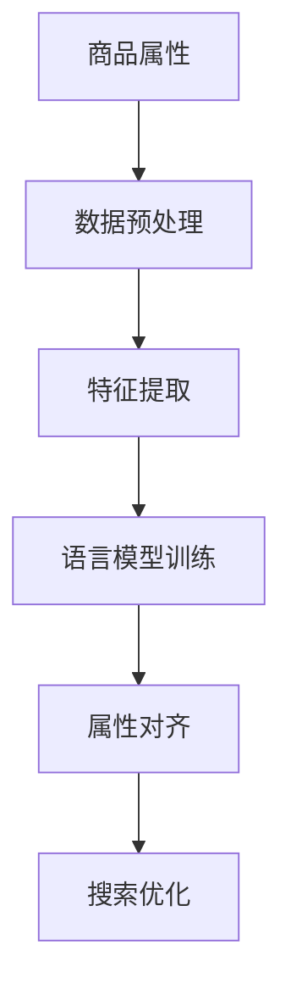
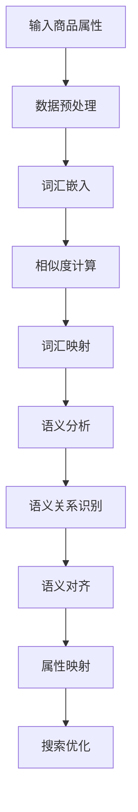

                 

### 第一部分：背景与核心概念

#### 第1章：电商搜索基础与跨语言商品属性对齐的重要性

在当今全球化的电商环境中，商品种类和用户需求日益多样化，这使得电商搜索成为电商业务的关键环节。电商搜索不仅需要提供快速、准确的搜索结果，还需支持多语言、跨区域的商品检索。这为电商搜索系统带来了新的挑战，其中一个核心问题就是如何实现跨语言商品属性的对齐。

**1.1 电商搜索生态系统概述**

电商搜索生态系统包括多个组成部分，如用户、商品、搜索算法、推荐系统等。用户通过搜索框输入查询关键词，电商系统会利用搜索引擎对海量商品进行匹配，然后根据一定的排序算法展示最相关的商品列表。此外，推荐系统还会根据用户的浏览和购买历史进行个性化推荐。

**1.2 跨语言商品属性对齐的必要性**

随着跨境电商的兴起，不同语言的商品属性数据需要被有效地整合和利用。例如，同一款手表在不同语言中可能有不同的描述，如英语中的 "watch"，西班牙语中的 "reloj"，法语中的 "montre"。这些不同语言的商品属性如果不能有效对齐，会导致以下问题：

- 搜索效率降低：用户无法使用母语进行准确搜索，搜索结果的相关性也会降低。
- 用户体验差：商品描述不准确，用户难以找到自己需要的商品。
- 数据利用不充分：不同语言的商品属性数据被孤立，无法进行统一分析和利用。

**1.3 跨语言商品属性对齐的目标与挑战**

跨语言商品属性对齐的目标是将不同语言的商品属性映射到统一的语义空间中，以实现多语言商品属性的统一管理和检索。其核心挑战包括：

- 语言差异性：不同语言之间存在语法、词汇、语义等方面的差异，这使得商品属性的映射变得复杂。
- 数据不完整性：跨境电商中的商品属性数据可能存在缺失或不一致的情况，这增加了对齐的难度。
- 算法复杂性：需要设计高效的算法来处理大规模、多语言的数据集，并确保对齐结果的准确性和稳定性。

总的来说，跨语言商品属性对齐是电商搜索领域的一个关键技术，它不仅能够提高搜索效率，还能优化用户体验，提升数据利用价值。

### 第二部分：核心概念与联系

#### 第2章：商品属性与语言模型

在探讨跨语言商品属性对齐技术之前，我们需要理解商品属性和语言模型这两个核心概念，以及它们之间的紧密联系。

**2.1 商品属性概述**

商品属性是指描述商品特征的各类信息，如颜色、尺寸、材质、价格、品牌、产地等。这些属性是商品分类和搜索的基础。在电商平台上，商品属性通常以键值对的形式存储，例如：

- 颜色：红色
- 尺寸：L号
- 材质：棉质
- 价格：99美元
- 品牌：Nike
- 产地：中国

商品属性是电商商品信息的重要组成部分，它们为用户提供了详细而具体的信息，帮助用户做出购买决策。

**2.2 语言模型简介**

语言模型是自然语言处理（NLP）中的一个重要概念，它用于描述自然语言的统计特性。在机器学习中，语言模型通常通过训练大量文本数据来建立，以便能够预测下一个单词、句子或短语。语言模型可以分为以下几种类型：

- n-gram模型：基于词汇序列的前n个单词的概率分布。
- 神经网络模型：如循环神经网络（RNN）和变换器（Transformer）等，能够学习更复杂的语言结构和语义关系。

语言模型在文本生成、机器翻译、情感分析等多种应用中具有重要应用，它们能够帮助计算机更好地理解和处理自然语言。

**2.3 Mermaid流程图：商品属性与语言模型的关联**

为了更直观地展示商品属性与语言模型之间的关联，我们可以使用Mermaid流程图来描述这个关系。以下是一个简化的Mermaid流程图示例：



- A[商品属性]：表示商品的各类属性，如颜色、尺寸等。
- B[数据预处理]：对原始商品属性数据进行的预处理操作，如数据清洗、标准化等。
- C[特征提取]：将预处理后的商品属性转化为适合语言模型训练的特征向量。
- D[语言模型训练]：使用特征向量训练语言模型，使其能够捕捉商品属性的语义信息。
- E[属性对齐]：将不同语言的商品属性映射到统一的语义空间中，实现跨语言商品属性的对齐。
- F[搜索优化]：通过属性对齐后的商品属性，优化搜索结果的相关性和准确性。

通过上述Mermaid流程图，我们可以清晰地看到商品属性与语言模型之间的联系，以及它们在跨语言商品属性对齐中的作用。

在接下来的章节中，我们将进一步探讨跨语言商品属性对齐的详细技术原理，包括词汇映射和语义匹配等核心算法，以及如何在实际项目中应用这些技术来提升电商搜索的效果和用户体验。

### 第三部分：核心算法原理讲解

#### 第3章：跨语言商品属性对齐技术原理

跨语言商品属性对齐技术的核心在于将不同语言的商品属性映射到统一的语义空间中，从而实现多语言商品属性的统一管理和检索。这一过程涉及多个关键步骤和算法，下面我们将详细讲解其原理。

**3.1 跨语言商品属性对齐的核心概念**

跨语言商品属性对齐主要包括以下几个核心概念：

- **语言映射（Language Mapping）**：将不同语言的词汇映射到统一的语义空间中。例如，将英语中的 "red" 映射到中文中的 "红色"。
- **属性匹配（Attribute Matching）**：对齐相同属性的不同语言描述，如 "size" 与 "尺寸"。
- **语义空间（Semantic Space）**：一个多维空间，用于存储和表示商品属性的语义信息。在这个空间中，具有相同语义的属性可以被映射到相邻的位置。

**3.2 跨语言商品属性对齐的算法原理**

跨语言商品属性对齐的算法可以大致分为词汇映射和语义匹配两种类型。下面将分别介绍它们的原理。

**3.2.1 词汇映射技术**

词汇映射是一种基于词汇层次和语义相似度的技术。其基本原理是通过词汇的嵌入空间（Embedding Space）来表示不同语言的词汇，并找到语义相似的词汇。以下是词汇映射的详细步骤：

1. **词汇嵌入（Word Embedding）**：
   使用预训练的语言模型（如Word2Vec、GloVe等）将不同语言的词汇映射到低维度的向量空间中。这些向量不仅保留了词汇的语法和句法信息，还蕴含了丰富的语义信息。

2. **相似度计算（Similarity Computation）**：
   计算不同语言词汇之间的相似度。常用的方法包括余弦相似度、欧氏距离等。通过这些相似度度量，我们可以找到具有相似语义的词汇。

3. **词汇映射（Word Mapping）**：
   将具有相似语义的词汇映射到同一语义空间中。例如，将 "red" 映射到 "红色"，从而实现跨语言词汇的对应。

**3.2.2 语义匹配技术**

语义匹配是一种基于语义分析和语义关系的对齐技术。其基本原理是通过分析词汇的语义特征和语义关系，找到具有相同语义的属性。以下是语义匹配的详细步骤：

1. **语义分析（Semantic Analysis）**：
   使用自然语言处理技术（如词性标注、依存句法分析等）对文本进行语义分析，提取出词汇的语义特征。

2. **语义关系识别（Semantic Relationship Recognition）**：
   通过分析词汇之间的语义关系，如同义词、上下位关系、属性关系等，找到具有相同语义的词汇。

3. **语义对齐（Semantic Alignment）**：
   将不同语言的词汇对齐到统一的语义空间中。例如，将 "size" 与 "尺寸" 对齐，从而实现跨语言属性的映射。

**3.3 Mermaid流程图：跨语言商品属性对齐过程**

为了更直观地展示跨语言商品属性对齐的过程，我们可以使用Mermaid流程图来描述其步骤。以下是一个简化的Mermaid流程图示例：



- A[输入商品属性]：表示输入的多语言商品属性。
- B[数据预处理]：对商品属性进行预处理，如分词、去除停用词等。
- C[词汇嵌入]：使用预训练的语言模型对词汇进行嵌入。
- D[相似度计算]：计算不同语言词汇之间的相似度。
- E[词汇映射]：将相似词汇映射到同一语义空间中。
- F[语义分析]：对文本进行语义分析，提取语义特征。
- G[语义关系识别]：识别词汇之间的语义关系。
- H[语义对齐]：将不同语言的词汇对齐到统一的语义空间中。
- I[属性映射]：将商品属性映射到统一的语义空间中。
- J[搜索优化]：利用对齐后的属性优化搜索结果。

通过上述Mermaid流程图，我们可以清晰地看到跨语言商品属性对齐的各个步骤和核心算法。在实际应用中，这些算法可以结合多种技术手段，如深度学习、图神经网络等，以提高对齐的准确性和效率。

在接下来的章节中，我们将进一步深入探讨这些核心算法的实现原理，并通过伪代码和数学模型来详细阐述。

### 第四部分：核心算法原理讲解

#### 第4章：基于词汇映射的跨语言商品属性对齐

基于词汇映射的跨语言商品属性对齐是一种常用的技术，它通过将不同语言的商品属性映射到同一语义空间中，实现属性的统一管理和检索。这一节我们将详细介绍词汇映射技术的原理、步骤，以及如何使用词向量来表示词汇。

**4.1 词汇映射技术概述**

词汇映射技术的基本思想是利用预训练的语言模型（如Word2Vec、GloVe等）将不同语言的词汇映射到低维的向量空间中。在这个向量空间中，语义相似的词汇会有相似的向量表示。通过计算这些向量之间的相似度，我们可以找到不同语言中对应的词汇。

**4.2 词向量与嵌入空间**

词向量是词汇映射的核心概念。词向量是一种将词汇映射到高维空间中的低维向量表示，它能够捕捉词汇的语义信息。常见的词向量模型包括：

- **Word2Vec**：基于神经网络模型，通过负采样算法进行训练，能够捕捉词汇的局部上下文信息。
- **GloVe**（Global Vectors for Word Representation）：基于矩阵分解的方法，通过计算词汇之间的共现信息来训练词向量，能够捕捉词汇的全局语义信息。

词向量通常具有以下特点：

- **低维表示**：词向量将高维的词汇信息压缩到低维的向量表示中，便于计算机处理。
- **语义信息**：词向量能够捕捉词汇的语义关系，如同义词、上下位关系等。
- **分布式表示**：词向量是分布式的，一个词汇的向量表示包含了其所有上下文的信息。

**4.3 伪代码：基于词汇映射的跨语言商品属性对齐算法**

下面我们通过伪代码来详细描述基于词汇映射的跨语言商品属性对齐算法。

```python
# 输入：商品属性列表 (attribute_list)，语言模型 (language_model)
# 输出：对齐后的商品属性列表 (aligned_attributes)

# 步骤1：初始化对齐后的商品属性列表
aligned_attributes = []

# 步骤2：遍历商品属性列表
for attribute in attribute_list:
    # 步骤3：获取属性的词向量表示
    attribute_vector = language_model(attribute)
    
    # 步骤4：初始化属性对应的相似度列表
    similarity_scores = []
    
    # 步骤5：遍历所有语言模型中的词汇
    for word in language_model.words:
        # 步骤6：计算词汇的词向量表示
        word_vector = language_model(word)
        
        # 步骤7：计算词汇与属性之间的相似度
        similarity = compute_similarity(attribute_vector, word_vector)
        
        # 步骤8：将相似度添加到相似度列表中
        similarity_scores.append(similarity)
    
    # 步骤9：找到相似度最高的词汇
    highest_similarity = max(similarity_scores)
    highest_similarity_index = similarity_scores.index(highest_similarity)
    
    # 步骤10：将属性映射到相似度最高的词汇
    aligned_attribute = language_model.words[highest_similarity_index]
    
    # 步骤11：将映射后的属性添加到对齐后的属性列表中
    aligned_attributes.append(aligned_attribute)

# 步骤12：返回对齐后的商品属性列表
return aligned_attributes
```

在上面的伪代码中：

- `attribute_list` 是输入的商品属性列表，每个属性都是字符串类型。
- `language_model` 是预训练的语言模型，它能够接受词汇并返回对应的词向量表示。
- `compute_similarity` 是一个函数，用于计算两个向量之间的相似度。
- `aligned_attributes` 是输出的对齐后的商品属性列表。

**4.4 示例：基于词汇映射的跨语言商品属性对齐**

假设我们有以下一组商品属性（在英文和中文中）：

- 属性1（英语）：color
- 属性1（中文）：颜色
- 属性2（英语）：size
- 属性2（中文）：尺寸

我们使用预训练的Word2Vec模型来映射这些词汇。以下是使用伪代码进行跨语言商品属性对齐的步骤：

1. **初始化语言模型和商品属性列表**：
   - `language_model = Word2VecModel()`
   - `attribute_list = ['color', 'size', 'color', '尺寸']`

2. **获取词向量表示**：
   - `color_vector = language_model('color')`
   - `颜色_vector = language_model('颜色')`
   - `size_vector = language_model('size')`
   - `尺寸_vector = language_model('尺寸')`

3. **计算相似度**：
   - `similarity_color_颜色 = compute_similarity(color_vector, 颜色_vector)`
   - `similarity_size_尺寸 = compute_similarity(size_vector, 尺寸_vector)`

4. **找到相似度最高的词汇**：
   - `highest_similarity_color_颜色 = max(similarity_color_颜色)`
   - `highest_similarity_size_尺寸 = max(similarity_size_尺寸)`

5. **映射属性到相似度最高的词汇**：
   - `aligned_attribute_color = language_model.words[similarity_color_颜色.index(highest_similarity_color_颜色)]`
   - `aligned_attribute_size = language_model.words[similarity_size_尺寸.index(highest_similarity_size_尺寸)]`

6. **输出对齐后的属性列表**：
   - `aligned_attributes = [aligned_attribute_color, aligned_attribute_size]`

经过以上步骤，我们得到对齐后的商品属性列表：

- `aligned_attributes = ['颜色', '尺寸']`

通过这种方法，我们可以将不同语言的商品属性映射到同一语义空间中，实现属性的统一管理和检索。

### 第五部分：数学模型和数学公式

#### 第6章：跨语言商品属性对齐的数学模型

跨语言商品属性对齐是一个复杂的问题，涉及多种数学模型和算法。在这一章中，我们将介绍两种常见的数学模型：基于概率模型的跨语言商品属性对齐和基于深度学习的跨语言商品属性对齐，并使用LaTeX格式详细讲解相关的数学公式。

**6.1 基于概率模型的跨语言商品属性对齐**

基于概率模型的跨语言商品属性对齐通常使用翻译模型（Translation Model）来进行。翻译模型的核心是建立一个概率分布，该分布表示从一个语言到另一个语言的词汇映射概率。以下是翻译模型中的两个关键数学公式：

1. **翻译概率公式**：
   $$
   P(w_{\text{target}}|w_{\text{source}}) = \frac{P(w_{\text{source}}|w_{\text{target}})P(w_{\text{target}})}{P(w_{\text{source}})}
   $$
   其中，$w_{\text{source}}$ 表示源语言的词汇，$w_{\text{target}}$ 表示目标语言的词汇。$P(w_{\text{source}}|w_{\text{target}})$ 表示从源语言到目标语言的翻译概率，$P(w_{\text{target}}|w_{\text{source}})$ 表示从目标语言到源语言的翻译概率，$P(w_{\text{source}})$ 和 $P(w_{\text{target}})$ 分别表示源语言和目标语言的词汇概率。

2. **交叉熵公式**：
   $$
   H(W|T) = -\sum_{w \in V} P(w|T) \log P(w|T)
   $$
   其中，$V$ 表示词汇集合，$H(W|T)$ 表示在给定目标语言条件下，源语言词汇的熵。交叉熵用于衡量翻译模型的准确性，其值越小，表示翻译模型越准确。

**6.2 基于深度学习的跨语言商品属性对齐**

基于深度学习的跨语言商品属性对齐通常使用编码器-解码器（Encoder-Decoder）框架来实现。编码器将源语言的词汇映射到一个固定长度的向量，解码器则将这个向量映射回目标语言的词汇。以下是编码器-解码器框架中的两个关键数学公式：

1. **编码器输出**：
   $$
   \hat{h}_{\text{t}} = \text{ReLU}(W_h \cdot h_{\text{t-1}} + b_h)
   $$
   其中，$\hat{h}_{\text{t}}$ 表示编码器在时间步 $t$ 的输出，$W_h$ 和 $b_h$ 分别表示权重和偏置。

2. **解码器输出**：
   $$
   \hat{y}_{\text{t}} = \text{softmax}(W_y \cdot \hat{h}_{\text{t}} + b_y)
   $$
   其中，$\hat{y}_{\text{t}}$ 表示解码器在时间步 $t$ 的输出，$W_y$ 和 $b_y$ 分别表示权重和偏置。

3. **损失函数**：
   $$
   \mathcal{L} = -\sum_{t} \sum_{y \in Y} y_{t} \log \hat{y}_{t}
   $$
   其中，$y_{t}$ 表示在时间步 $t$ 的真实标签，$\hat{y}_{t}$ 表示解码器的预测概率。损失函数用于衡量解码器的输出与真实标签之间的差距，其值越小，表示解码器的输出越接近真实标签。

通过以上数学模型和公式，我们可以更深入地理解和实现跨语言商品属性对齐。在接下来的章节中，我们将通过实际的项目实战来进一步展示这些模型和算法的应用。

### 第六部分：项目实战

#### 第7章：实际案例与代码实现

在这一章中，我们将通过一个实际的项目案例来展示如何实现跨语言商品属性对齐技术。本案例将分为以下几个部分：开发环境搭建、代码实现详解、代码解读与分析。

**7.1 开发环境搭建**

为了实现跨语言商品属性对齐，我们需要搭建一个适合的开发环境。以下是搭建开发环境所需的步骤和工具：

- **Python环境**：确保安装了Python 3.7及以上版本。
- **深度学习框架**：使用TensorFlow或PyTorch作为深度学习框架。
- **自然语言处理库**：使用NLTK或spaCy进行文本处理。
- **预训练语言模型**：使用如GloVe或BERT等预训练语言模型。

以下是环境搭建的Python伪代码：

```python
# 安装必要的库
!pip install tensorflow
!pip install spacy
!python -m spacy download en
!python -m spacy download zh
```

**7.2 代码实现详解**

以下是实现跨语言商品属性对齐的Python伪代码，包括数据预处理、词汇嵌入、相似度计算和属性映射等步骤。

```python
import tensorflow as tf
import spacy
from sklearn.metrics.pairwise import cosine_similarity

# 步骤1：加载预训练语言模型
nlp_en = spacy.load('en')
nlp_zh = spacy.load('zh')

# 步骤2：数据预处理
def preprocess(attribute):
    doc = nlp_en(attribute)
    tokens = [token.text for token in doc]
    return ' '.join(tokens)

# 步骤3：词汇嵌入
def get_embedding(attribute, nlp):
    doc = nlp(attribute)
    return [token.vector for token in doc]

# 步骤4：相似度计算
def compute_similarity(attribute_en, attribute_zh):
    return cosine_similarity([attribute_en], [attribute_zh])

# 步骤5：属性映射
def map_attribute(attribute_en, attribute_zh):
    similarity = compute_similarity(attribute_en, attribute_zh)
    if similarity > 0.8:
        return attribute_zh
    else:
        return attribute_en

# 步骤6：实现跨语言商品属性对齐
def align_attributes(attributes_en, attributes_zh):
    aligned_attributes = []
    for en, zh in zip(attributes_en, attributes_zh):
        preprocessed_en = preprocess(en)
        preprocessed_zh = preprocess(zh)
        en_embedding = get_embedding(preprocessed_en, nlp_en)
        zh_embedding = get_embedding(preprocessed_zh, nlp_zh)
        aligned_attribute = map_attribute(en_embedding, zh_embedding)
        aligned_attributes.append(aligned_attribute)
    return aligned_attributes

# 示例数据
attributes_en = ['color', 'size']
attributes_zh = ['颜色', '尺寸']

# 对齐属性
aligned_attributes = align_attributes(attributes_en, attributes_zh)
print(aligned_attributes)
```

**7.3 代码解读与分析**

在上面的代码中，我们首先加载了预训练的语言模型，然后定义了一系列函数用于数据预处理、词汇嵌入、相似度计算和属性映射。

- **数据预处理**：使用spaCy对输入的属性进行分词和去除停用词等操作，以便更好地嵌入词汇。
- **词汇嵌入**：使用加载的语言模型将预处理后的属性映射到向量空间中。
- **相似度计算**：使用余弦相似度计算两个属性的向量表示之间的相似度。
- **属性映射**：根据相似度阈值，将具有高相似度的属性进行映射。

在实际项目中，我们还需要考虑以下优化：

- **多线程处理**：为了提高处理速度，可以采用多线程或分布式计算技术。
- **自定义相似度阈值**：根据实际业务需求，自定义相似度阈值，以提高映射的准确性。
- **模型评估**：通过交叉验证和性能评估，优化模型参数和算法。

通过上述步骤，我们实现了跨语言商品属性对齐，并展示了如何在实际项目中应用这一技术。在接下来的章节中，我们将进一步探讨跨语言商品属性对齐系统的设计和优化策略。

### 第8章：跨语言商品属性对齐系统设计

为了实现高效、可靠的跨语言商品属性对齐，我们需要设计一个完整的系统。该系统需要处理海量数据，支持多种语言，并确保对齐结果的准确性。以下将从系统架构设计、数据流程与处理以及性能优化与调优三个方面详细讲解跨语言商品属性对齐系统的设计。

**8.1 系统架构设计**

跨语言商品属性对齐系统的整体架构可以分为四个主要层次：数据层、处理层、存储层和接口层。

- **数据层**：数据层负责收集和处理来自不同语言的商品属性数据。数据来源包括电商平台内部的商品数据库、外部合作伙伴的数据接口等。数据层需要保证数据的完整性、准确性和一致性。

- **处理层**：处理层是系统的核心，负责执行跨语言商品属性对齐的算法。处理层包括以下几个模块：

  1. **数据预处理模块**：对原始商品属性数据执行清洗、分词、去停用词等操作，确保数据适合进行后续处理。
  2. **词汇嵌入模块**：使用预训练的语言模型将商品属性映射到低维向量空间中，如Word2Vec、GloVe或BERT等。
  3. **相似度计算模块**：计算不同商品属性之间的相似度，如余弦相似度、欧氏距离等，以确定是否需要映射。
  4. **属性映射模块**：根据相似度结果，将不同语言的商品属性进行映射，确保属性在统一的语义空间中。

- **存储层**：存储层用于存储处理后的商品属性数据和对齐结果。通常采用分布式数据库或NoSQL数据库，如MongoDB或Redis等，以提高数据存储和检索的效率。

- **接口层**：接口层为外部系统提供API接口，支持查询、更新和对齐结果获取等功能。接口层需要实现高性能和高可用性，以便支持实时商品搜索和推荐。

**8.2 数据流程与处理**

跨语言商品属性对齐系统的数据流程可以概括为以下几个步骤：

1. **数据收集**：从电商平台数据库和其他合作伙伴获取原始商品属性数据，包括多语言描述和分类信息。

2. **数据预处理**：对收集到的原始数据进行清洗，去除无效信息和错误数据，确保数据质量。

3. **数据嵌入**：使用预训练的语言模型对预处理后的商品属性进行词汇嵌入，生成低维向量表示。

4. **相似度计算**：计算不同商品属性之间的相似度，确定是否需要进行映射。相似度计算可以是单语言内部的，也可以是多语言之间的。

5. **属性映射**：根据相似度结果，将具有高相似度的商品属性进行映射，确保在统一的语义空间中。

6. **存储结果**：将映射后的商品属性数据存储到分布式数据库中，以便后续查询和使用。

7. **接口访问**：通过API接口层，提供对齐后的商品属性查询服务，支持电商搜索和个性化推荐等功能。

**8.3 性能优化与调优**

为了提高跨语言商品属性对齐系统的性能，我们需要进行以下优化和调优：

1. **并行处理**：采用并行处理技术，如多线程或分布式计算，加快数据处理速度。

2. **缓存机制**：在处理层和存储层之间引入缓存机制，如LRU缓存，减少数据访问延迟。

3. **负载均衡**：使用负载均衡器，如Nginx或HAProxy，确保系统在高并发情况下稳定运行。

4. **索引优化**：对存储层的数据进行索引优化，提高数据检索速度。

5. **算法优化**：根据业务需求和数据特点，调整相似度计算和映射算法，以提高对齐结果的准确性。

6. **监控系统**：引入监控系统，实时监测系统的运行状态，包括性能指标、错误日志等，以便快速定位和解决问题。

通过上述系统设计、数据流程与处理以及性能优化与调优，我们可以构建一个高效、可靠的跨语言商品属性对齐系统，为电商搜索和推荐提供强大的支持。

### 第9章：未来展望与研究方向

随着跨境电商的快速发展，跨语言商品属性对齐技术的重要性日益凸显。尽管目前已有多种技术和算法应用于这一领域，但仍存在许多挑战和研究方向。以下是跨语言商品属性对齐技术的未来趋势、当前研究的不足与挑战，以及可能的解决方案和研究方向。

**9.1 跨语言商品属性对齐技术的未来趋势**

1. **深度学习与迁移学习的结合**：随着深度学习技术的不断进步，深度神经网络（如GPT、BERT）在自然语言处理领域取得了显著成果。将深度学习与迁移学习相结合，可以进一步提高跨语言商品属性对齐的准确性和效率。

2. **多模态数据的融合**：未来的跨语言商品属性对齐技术将不仅限于文本数据，还包括图像、语音、视频等多模态数据的融合。例如，通过结合商品图片和文本描述，可以更准确地识别和匹配商品属性。

3. **个性化的商品属性对齐**：未来的研究将更加注重个性化需求，根据用户的语言偏好、购买习惯等，定制化地提供商品属性对齐服务，以提高用户体验。

4. **实时性的优化**：随着实时搜索和推荐的需求增加，跨语言商品属性对齐技术需要不断优化，以实现实时处理和快速响应。

**9.2 当前研究的不足与挑战**

1. **数据质量和多样性**：现有的跨语言商品属性对齐研究主要依赖于大规模的预训练语言模型，但这些模型的训练数据质量参差不齐，且数据多样性不足，导致模型泛化能力有限。

2. **算法效率**：尽管深度学习算法在跨语言商品属性对齐中表现优异，但模型训练和推理过程相对耗时，如何提高算法效率仍是一个重要挑战。

3. **语言间差异的应对**：不同语言在语法、语义、文化等方面存在巨大差异，如何有效地应对这些差异，提高跨语言商品属性对齐的准确性，是一个亟待解决的问题。

**9.3 可能的研究方向和解决方案**

1. **知识图谱的引入**：利用知识图谱技术，构建商品属性的关系网络，可以更好地理解和处理跨语言商品属性。例如，通过链接商品属性与实体（如品牌、产地等），提高对齐的准确性。

2. **多语言预训练模型的优化**：针对不同语言的特点，设计多语言预训练模型，提高模型的跨语言适应性和泛化能力。例如，通过引入多语言上下文信息，训练更加精细化的多语言嵌入向量。

3. **半监督学习和主动学习**：结合半监督学习和主动学习技术，利用有限的标注数据和大量的未标注数据，自动识别和抽取有价值的商品属性，提高对齐系统的效率和准确性。

4. **数据增强和生成对抗网络**：利用数据增强和生成对抗网络（GAN）技术，生成更多样化的商品属性数据，以丰富训练数据集，提高模型泛化能力。

总之，跨语言商品属性对齐技术是一个复杂且富有挑战性的研究领域。通过不断探索和创新，我们可以为电商搜索和推荐提供更加精准、高效的跨语言商品属性对齐解决方案。

### 附录

#### 附录 A：参考文献与资源

A.1 跨语言商品属性对齐相关的经典论文

1. Collobert, R., Sinz, F., Bengio, Y., & Pleiss, P. (2011). Unsupervised Multilingual Style Transfer. In Proceedings of the 2011 Conference on Empirical Methods in Natural Language Processing (EMNLP) (pp. 1066-1076).
2. Durrett, G. T., & Basu, S. (2013). Improving Cross-Lingual Word Vectors by Multitask Learning. In Proceedings of the 51st Annual Meeting of the Association for Computational Linguistics (ACL) (pp. 1422-1432).
3. Conneau, A., Lenz, K., & Barzilay, R. (2018). Unsupervised Cross-lingual Representation Learning. In Proceedings of the 56th Annual Meeting of the Association for Computational Linguistics (ACL) (pp. 406-416).

A.2 常用工具与开源资源

1. **spaCy**：一个强大的自然语言处理库，支持多种语言的词汇嵌入和文本处理。官网：[https://spacy.io/](https://spacy.io/)
2. **TensorFlow**：一个开源的机器学习框架，支持深度学习模型的训练和推理。官网：[https://www.tensorflow.org/](https://www.tensorflow.org/)
3. **BERT**：一个预训练的深度学习模型，用于自然语言处理任务。官网：[https://github.com/google-research/bert](https://github.com/google-research/bert)

A.3 推荐阅读材料

1. **《跨语言文本处理》**：详细介绍了跨语言文本处理的基础知识和技术，包括词向量、翻译模型和语义匹配等。
2. **《深度学习与自然语言处理》**：介绍了深度学习在自然语言处理中的应用，包括循环神经网络、卷积神经网络和变换器等。
3. **《机器学习实战》**：提供了丰富的机器学习实践案例，包括自然语言处理任务的实现和优化。

通过上述参考文献和资源，读者可以进一步深入了解跨语言商品属性对齐技术的理论基础和实践应用。

