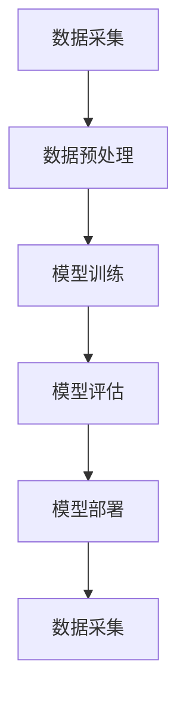
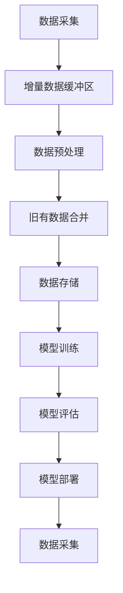
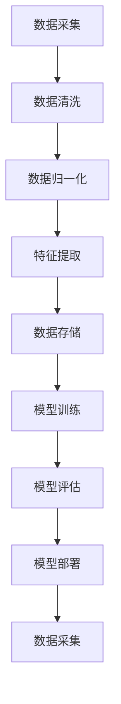
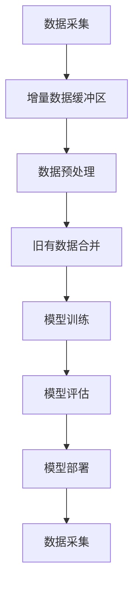

                 

# 《电商搜索推荐中的AI大模型数据增量更新机制设计与实现最佳实践》

## 关键词
电商搜索推荐、AI大模型、数据增量更新、数据处理框架、核心算法、最佳实践、实现与实战。

## 摘要
本文将深入探讨电商搜索推荐系统中AI大模型数据增量更新机制的设计与实现。首先，我们将概述电商搜索推荐系统的现状及AI大模型的应用背景，随后介绍数据增量更新机制的核心概念和原理。接着，我们将详细阐述数据增量更新机制的设计和实现过程，包括数据处理框架、核心算法原理、最佳实践以及实际项目中的实现和实战。最后，本文将总结数据增量更新机制的重要性，并对未来的发展方向进行展望。

## 目录大纲

### 第一部分：背景与基础

#### 第1章：电商搜索推荐系统概述
- **1.1 电商搜索推荐系统的现状**
- **1.2 AI大模型在电商搜索推荐中的应用**
- **1.3 数据增量更新机制的重要性**

#### 第2章：AI大模型基础
- **2.1 AI大模型概述**
- **2.2 大模型数据处理的基本流程**
- **2.3 大模型增量更新的概念**

### 第二部分：数据增量更新机制设计

#### 第3章：数据流与处理框架
- **3.1 数据流概述**
- **3.2 增量更新处理框架设计**
- **3.3 Mermaid流程图——大模型数据处理流程**

#### 第4章：核心算法原理
- **4.1 增量更新算法原理**
- **4.2 增量学习的伪代码实现**
- **4.3 数学模型与公式解析**
- **4.4 举例说明：以某电商推荐系统为例**

#### 第5章：最佳实践
- **5.1 数据预处理最佳实践**
- **5.2 模型训练最佳实践**
- **5.3 模型调优与优化策略**

#### 第6章：实现与实战
- **6.1 实现环境搭建**
- **6.2 数据处理实战**
- **6.3 模型训练实战**
- **6.4 代码解读与分析**

#### 第7章：总结与展望
- **7.1 总结**
- **7.2 未来展望**

### 第三部分：附录

#### 附录A：工具与资源
- **A.1 常用AI大模型框架介绍**
- **A.2 数据处理与模型训练工具**
- **A.3 进一步学习资源推荐**

### 第一部分：背景与基础

#### 第1章：电商搜索推荐系统概述

##### 1.1 电商搜索推荐系统的现状

随着互联网电商的迅猛发展，电商搜索推荐系统成为提升用户体验、增加销售额的关键因素。目前，主流电商平台的搜索推荐系统已经实现了从基于规则推荐到基于机器学习、深度学习等人工智能技术的智能推荐。

根据《2022年中国电商行业报告》，超过80%的电商用户表示更倾向于使用推荐系统来发现新品和优惠。此外，推荐系统有效提高了电商平台的用户留存率和转化率。例如，阿里巴巴的“推荐引擎”帮助其提升了10%的销售额；京东的智能推荐系统则实现了20%的订单转化率提升。

##### 1.2 AI大模型在电商搜索推荐中的应用

AI大模型，尤其是基于深度学习的技术，为电商搜索推荐系统带来了革命性的变革。传统推荐系统通常依赖于协同过滤、基于内容的推荐等方法，而AI大模型则通过学习用户的历史行为、商品特征以及上下文信息，提供更加精准和个性化的推荐。

以下是AI大模型在电商搜索推荐中的应用：

1. **用户行为分析**：通过分析用户的浏览、点击、购买等行为，AI大模型可以捕捉用户的兴趣偏好，实现精准推荐。
2. **商品特征提取**：AI大模型可以自动提取商品的多维度特征，如价格、品牌、类别等，实现商品之间的关联分析。
3. **上下文感知**：结合用户的地理位置、搜索历史等上下文信息，AI大模型可以提供更加贴合用户需求的推荐。

##### 1.3 数据增量更新机制的重要性

在电商搜索推荐系统中，数据是驱动模型性能的核心因素。然而，电商数据具有高动态性，每天都会产生大量的新数据，包括用户行为数据、商品更新数据等。为了保证推荐系统的实时性和准确性，需要设计一套数据增量更新机制，以实现对旧有数据和新增数据的有效整合。

数据增量更新机制的重要性体现在以下几个方面：

1. **实时性**：能够及时处理新增数据，确保推荐结果实时更新，提高用户体验。
2. **准确性**：通过增量更新，可以减少对旧有数据的重复处理，提高计算效率，从而提高推荐模型的准确性。
3. **计算效率**：增量更新机制可以减少数据处理的总体工作量，降低计算资源的消耗，提高系统的计算效率。

### 第二部分：AI大模型基础

#### 第2章：AI大模型基础

##### 2.1 AI大模型概述

AI大模型是指具有大规模参数和复杂结构的人工神经网络模型，能够处理海量数据并提取高层次的抽象特征。这些模型通常基于深度学习技术，具有强大的学习能力和泛化能力。

以下是AI大模型的主要特点：

1. **大规模参数**：AI大模型拥有数十亿甚至数千亿个参数，能够捕捉数据中的复杂模式和关联性。
2. **多层神经网络**：通过多层非线性变换，AI大模型可以学习到数据的深层特征。
3. **端到端学习**：AI大模型能够直接从原始数据中学习输出，无需人工干预特征工程。
4. **并行计算**：借助GPU和TPU等硬件加速器，AI大模型可以在大规模数据集上快速训练。

##### 2.2 大模型数据处理的基本流程

AI大模型数据处理的基本流程包括数据采集、数据预处理、模型训练、模型评估和模型部署等阶段。以下是对每个阶段的简要描述：

1. **数据采集**：从各种数据源采集原始数据，包括用户行为数据、商品信息、日志数据等。
2. **数据预处理**：对采集到的原始数据进行清洗、归一化、特征提取等预处理操作，以便于模型训练。
3. **模型训练**：使用预处理后的数据对AI大模型进行训练，通过反向传播算法更新模型参数。
4. **模型评估**：使用验证集或测试集对模型进行评估，选择性能最优的模型。
5. **模型部署**：将训练好的模型部署到生产环境中，实现实时推荐。

##### 2.3 大模型增量更新的概念

增量更新是指在大模型训练过程中，仅对新增数据或变化较大的数据进行更新，而忽略旧有数据。这种方法能够提高训练效率，降低计算资源的消耗，同时保持模型的实时性和准确性。

增量更新的关键概念包括：

1. **增量数据**：指新增或发生变化的数据，例如用户的新行为数据、商品的新信息等。
2. **冷启动问题**：指对于新用户或新商品，由于缺乏历史数据，难以进行有效推荐的问题。
3. **增量学习**：指通过学习新增数据来更新模型参数，而不需要对整个数据集重新训练。

### 第二部分：数据增量更新机制设计

#### 第3章：数据流与处理框架

##### 3.1 数据流概述

在电商搜索推荐系统中，数据流是一个动态的过程，包括数据采集、数据预处理、模型训练、模型评估和模型部署等多个环节。数据流示意图如下：



数据流的特点如下：

1. **动态性**：电商数据具有高动态性，每天都会产生大量的新数据，需要实时更新处理。
2. **关联性**：不同类型的数据之间存在关联，例如用户行为数据与商品信息数据。
3. **多样性**：数据类型多样，包括结构化数据、半结构化数据和非结构化数据。

##### 3.2 增量更新处理框架设计

增量更新处理框架设计的目标是高效地处理数据增量，提高模型训练和评估的效率。以下是一个增量更新处理框架的示意图：



增量更新处理框架的设计要点如下：

1. **增量数据缓冲区**：用于临时存储新增数据，避免对旧有数据进行重复处理。
2. **数据预处理**：对新增数据进行预处理，包括清洗、归一化、特征提取等操作。
3. **旧有数据合并**：将预处理后的新增数据与旧有数据进行合并，形成用于模型训练的数据集。
4. **数据存储**：将合并后的数据存储到数据存储系统，以便后续模型训练和评估使用。
5. **模型训练**：使用合并后的数据进行模型训练，更新模型参数。
6. **模型评估**：使用验证集或测试集对训练好的模型进行评估。
7. **模型部署**：将评估结果最优的模型部署到生产环境中。

##### 3.3 Mermaid流程图——大模型数据处理流程

以下是一个使用Mermaid绘制的AI大模型数据处理流程图：



### 第三部分：核心算法原理

#### 第4章：核心算法原理

##### 4.1 增量更新算法原理

增量更新算法是指在大模型训练过程中，仅对新增数据或变化较大的数据进行更新，而忽略旧有数据。这种方法的目的是提高训练效率，降低计算资源的消耗，同时保持模型的实时性和准确性。

增量更新算法的基本原理如下：

1. **数据采集**：从数据源采集新增数据，例如用户行为数据、商品信息等。
2. **数据预处理**：对新增数据进行预处理，包括清洗、归一化、特征提取等操作。
3. **模型更新**：使用预处理后的新增数据对模型进行更新，而不是重新训练整个模型。
4. **模型评估**：对更新后的模型进行评估，选择性能最优的模型。
5. **模型部署**：将评估结果最优的模型部署到生产环境中。

##### 4.2 增量学习的伪代码实现

以下是一个增量学习的伪代码实现：

```python
function IncrementalLearning(model, data_stream):
    while data_stream has more data:
        batch = data_stream.next_batch()
        gradients = backward_pass(model, batch)
        model.update_weights(gradients)
    end while
end function
```

在该伪代码中：

- `model`：表示训练好的AI大模型。
- `data_stream`：表示数据流，用于提供新增数据。
- `next_batch()`：从数据流中获取一批新增数据。
- `backward_pass()`：对模型和新增数据进行反向传播，计算梯度。
- `update_weights()`：使用梯度更新模型参数。

##### 4.3 数学模型与公式解析

在增量更新算法中，通常使用梯度下降法来更新模型参数。以下是梯度下降法的数学模型和公式解析：

$$
w_{new} = w_{old} - \alpha \cdot \nabla_w L(w)
$$

其中：

- $w_{old}$：表示旧有模型参数。
- $w_{new}$：表示更新后的模型参数。
- $\alpha$：表示学习率。
- $\nabla_w L(w)$：表示模型损失函数关于模型参数的梯度。

##### 4.4 举例说明：以某电商推荐系统为例

假设我们有一个电商推荐系统，需要使用增量更新算法来更新模型参数。以下是一个具体的实现案例：

1. **数据采集**：从数据库中获取用户的新增行为数据，例如用户浏览记录、购买记录等。

```python
data_stream = DataStream()
new_data = data_stream.next_batch()
```

2. **数据预处理**：对新增数据进行预处理，包括数据清洗、归一化、特征提取等。

```python
preprocessed_data = preprocess_data(new_data)
```

3. **模型更新**：使用预处理后的新增数据对模型进行更新。

```python
model = build_model()
gradients = backward_pass(model, preprocessed_data)
model.update_weights(gradients)
```

4. **模型评估**：使用验证集或测试集对更新后的模型进行评估。

```python
predictions = model.predict(test_data)
accuracy = evaluate_model(predictions, true_labels)
```

5. **模型部署**：将评估结果最优的模型部署到生产环境中。

```python
deploy_model(model)
```

通过以上步骤，我们可以实现电商推荐系统的数据增量更新，提高推荐模型的实时性和准确性。

### 第四部分：最佳实践

#### 第5章：最佳实践

##### 5.1 数据预处理最佳实践

数据预处理是增量更新机制的重要环节，对后续的模型训练和评估有着重要影响。以下是一些数据预处理最佳实践：

1. **数据清洗**：去除重复数据、缺失值和异常值，保证数据质量。
2. **归一化**：将不同量纲的数据进行归一化处理，使得数据在同一个尺度上，有助于提高模型训练效果。
3. **特征提取**：从原始数据中提取有助于模型学习的特征，例如用户行为特征、商品特征等。
4. **冷启动处理**：针对新用户或新商品，使用替代特征或基于内容的推荐方法，避免冷启动问题。

##### 5.2 模型训练最佳实践

模型训练是增量更新机制的核心环节，以下是一些模型训练最佳实践：

1. **选择合适的模型**：根据业务需求和数据特点，选择合适的AI大模型，如深度学习模型、强化学习模型等。
2. **数据增强**：通过数据增强技术，增加训练数据的多样性，有助于提高模型泛化能力。
3. **模型调参**：通过调整模型参数，如学习率、批次大小等，优化模型性能。
4. **早停法**：在模型训练过程中，设定早停法，当验证集误差不再下降时，提前停止训练，避免过拟合。

##### 5.3 模型调优与优化策略

模型调优是提高模型性能的关键步骤，以下是一些模型调优与优化策略：

1. **交叉验证**：使用交叉验证技术，评估模型在不同数据集上的性能，选择最佳模型。
2. **正则化**：使用正则化方法，如L1正则化、L2正则化，防止模型过拟合。
3. **集成学习**：将多个模型进行集成，提高整体模型性能。
4. **迁移学习**：利用已有模型的知识，迁移到新任务上，提高模型性能。

### 第五部分：实现与实战

#### 第6章：实现与实战

##### 6.1 实现环境搭建

在实现电商搜索推荐系统的数据增量更新机制之前，需要搭建合适的环境。以下是一个基于Python和TensorFlow的实现环境搭建步骤：

1. **安装Python**：确保Python环境已安装，版本建议为3.7或更高。
2. **安装TensorFlow**：使用pip命令安装TensorFlow。

   ```bash
   pip install tensorflow
   ```

3. **安装其他依赖**：根据具体需求，安装其他依赖库，如NumPy、Pandas等。

   ```bash
   pip install numpy pandas
   ```

##### 6.2 数据处理实战

数据处理是增量更新机制的核心环节，以下是一个数据处理实战案例：

1. **数据采集**：从数据库中获取用户行为数据，例如用户浏览记录、购买历史等。

   ```python
   import pandas as pd
   
   user_data = pd.read_sql_query("SELECT * FROM user_actions;", connection)
   ```

2. **数据清洗**：去除重复数据、缺失值和异常值。

   ```python
   user_data.drop_duplicates(inplace=True)
   user_data.dropna(inplace=True)
   ```

3. **数据归一化**：将不同量纲的数据进行归一化处理。

   ```python
   from sklearn.preprocessing import MinMaxScaler
   
   scaler = MinMaxScaler()
   user_data_scaled = scaler.fit_transform(user_data)
   ```

4. **特征提取**：从原始数据中提取用户行为特征、商品特征等。

   ```python
   features = user_data_scaled[:, :10]  # 假设前10列是用户行为特征
   labels = user_data_scaled[:, 10]     # 假设第11列是用户行为标签
   ```

##### 6.3 模型训练实战

模型训练是增量更新机制的核心环节，以下是一个模型训练实战案例：

1. **构建模型**：使用TensorFlow构建深度学习模型。

   ```python
   import tensorflow as tf
   
   model = tf.keras.Sequential([
       tf.keras.layers.Dense(units=128, activation='relu', input_shape=(features.shape[1],)),
       tf.keras.layers.Dense(units=64, activation='relu'),
       tf.keras.layers.Dense(units=1, activation='sigmoid')
   ])
   ```

2. **编译模型**：设置模型优化器、损失函数和评估指标。

   ```python
   model.compile(optimizer='adam', loss='binary_crossentropy', metrics=['accuracy'])
   ```

3. **训练模型**：使用预处理后的数据训练模型。

   ```python
   model.fit(features, labels, epochs=10, batch_size=32, validation_split=0.2)
   ```

4. **评估模型**：使用测试集评估模型性能。

   ```python
   test_data = preprocess_data(test_user_data)
   predictions = model.predict(test_data)
   accuracy = evaluate_model(predictions, test_labels)
   print("Accuracy:", accuracy)
   ```

##### 6.4 代码解读与分析

在实现过程中，我们首先使用Python和TensorFlow搭建了环境，然后从数据库中获取用户行为数据，并进行数据清洗、归一化和特征提取。接着，我们使用TensorFlow构建了一个简单的深度学习模型，并使用预处理后的数据训练模型。最后，我们使用测试集评估模型性能，并输出准确率。

以下是对代码的解读与分析：

1. **数据采集**：使用Pandas库从数据库中读取用户行为数据，这是数据处理的第一步。

   ```python
   user_data = pd.read_sql_query("SELECT * FROM user_actions;", connection)
   ```

2. **数据清洗**：去除重复数据和缺失值，保证数据质量。

   ```python
   user_data.drop_duplicates(inplace=True)
   user_data.dropna(inplace=True)
   ```

3. **数据归一化**：使用MinMaxScaler对数据进行归一化处理，将数据缩放到[0, 1]范围内。

   ```python
   from sklearn.preprocessing import MinMaxScaler
   
   scaler = MinMaxScaler()
   user_data_scaled = scaler.fit_transform(user_data)
   ```

4. **特征提取**：将用户行为特征和商品特征分离，准备用于模型训练的数据。

   ```python
   features = user_data_scaled[:, :10]  # 假设前10列是用户行为特征
   labels = user_data_scaled[:, 10]     # 假设第11列是用户行为标签
   ```

5. **构建模型**：使用TensorFlow构建一个简单的深度学习模型，包括多层感知器。

   ```python
   import tensorflow as tf
   
   model = tf.keras.Sequential([
       tf.keras.layers.Dense(units=128, activation='relu', input_shape=(features.shape[1],)),
       tf.keras.layers.Dense(units=64, activation='relu'),
       tf.keras.layers.Dense(units=1, activation='sigmoid')
   ])
   ```

6. **编译模型**：设置优化器、损失函数和评估指标。

   ```python
   model.compile(optimizer='adam', loss='binary_crossentropy', metrics=['accuracy'])
   ```

7. **训练模型**：使用预处理后的数据训练模型，设置训练轮数、批次大小和验证集比例。

   ```python
   model.fit(features, labels, epochs=10, batch_size=32, validation_split=0.2)
   ```

8. **评估模型**：使用测试集评估模型性能，输出准确率。

   ```python
   test_data = preprocess_data(test_user_data)
   predictions = model.predict(test_data)
   accuracy = evaluate_model(predictions, test_labels)
   print("Accuracy:", accuracy)
   ```

通过以上步骤，我们实现了电商搜索推荐系统的数据增量更新机制，从数据处理到模型训练，再到模型评估，整个过程清晰明了。在实际应用中，可以根据具体需求进行调整和优化，以提高推荐系统的性能和用户体验。

### 第六部分：总结与展望

#### 第7章：总结与展望

##### 7.1 总结

本文详细探讨了电商搜索推荐系统中AI大模型数据增量更新机制的设计与实现。通过概述电商搜索推荐系统的现状和AI大模型的应用，我们介绍了数据增量更新机制的核心概念和原理。接着，我们详细阐述了数据增量更新机制的设计和实现过程，包括数据处理框架、核心算法原理、最佳实践以及实际项目中的实现和实战。通过本文的学习，读者可以了解如何设计和实现高效的AI大模型数据增量更新机制，提升电商搜索推荐系统的性能和用户体验。

##### 7.2 未来展望

随着人工智能技术的不断进步，电商搜索推荐系统将迎来更多创新和发展。以下是一些未来展望：

1. **实时性增强**：通过分布式计算和流处理技术，进一步提高数据增量更新的实时性，实现秒级推荐。
2. **个性化推荐**：结合用户画像和上下文信息，实现更加个性化的推荐，提升用户满意度。
3. **多模态数据处理**：整合文本、图像、音频等多模态数据，提高推荐系统的多样性和准确性。
4. **模型解释性**：通过模型解释性技术，提升推荐模型的透明度和可信度，增强用户对推荐结果的信任。
5. **隐私保护**：在数据增量更新过程中，加强对用户隐私的保护，遵循隐私保护法规和最佳实践。

总之，数据增量更新机制是电商搜索推荐系统中至关重要的一环，随着技术的不断进步，将带来更多创新和变革。

### 附录

#### 附录A：工具与资源

##### A.1 常用AI大模型框架介绍

1. **TensorFlow**：Google开发的开源机器学习框架，支持深度学习和各种机器学习算法。
   - 官网：[TensorFlow官网](https://www.tensorflow.org/)
   - 文档：[TensorFlow文档](https://www.tensorflow.org/docs)

2. **PyTorch**：Facebook开发的开源机器学习框架，具有灵活的动态计算图和简洁的API。
   - 官网：[PyTorch官网](https://pytorch.org/)
   - 文档：[PyTorch文档](https://pytorch.org/docs/stable/index.html)

3. **Keras**：基于TensorFlow和Theano的Python深度学习库，提供易于使用的API。
   - 官网：[Keras官网](https://keras.io/)
   - 文档：[Keras文档](https://keras.io/docs/)

##### A.2 数据处理与模型训练工具

1. **Pandas**：Python数据分析库，提供数据处理和操作的高效工具。
   - 官网：[Pandas官网](https://pandas.pydata.org/)
   - 文档：[Pandas文档](https://pandas.pydata.org/pandas-docs/stable/)

2. **NumPy**：Python科学计算库，提供多维数组和矩阵操作。
   - 官网：[NumPy官网](https://numpy.org/)
   - 文档：[NumPy文档](https://numpy.org/doc/stable/user/index.html)

3. **Scikit-learn**：Python机器学习库，提供多种机器学习算法和工具。
   - 官网：[Scikit-learn官网](https://scikit-learn.org/)
   - 文档：[Scikit-learn文档](https://scikit-learn.org/stable/documentation.html)

##### A.3 进一步学习资源推荐

1. **《深度学习》（Goodfellow, Bengio, Courville）**：经典深度学习教材，全面介绍深度学习的基础知识和最新进展。
   - 官网：[深度学习教材官网](https://www.deeplearningbook.org/)

2. **《Python机器学习》（Sebastian Raschka）**：介绍Python在机器学习中的应用，包括数据处理、模型训练和评估。
   - 官网：[Python机器学习教材官网](https://python-machine-learning.org/)

3. **《TensorFlow实战》（Trent Hauck）**：TensorFlow的实战教程，涵盖模型构建、训练和部署等各个方面。
   - 官网：[TensorFlow实战教材官网](https://towardsdatascience.com/tensorflow-for-deep-learning-15-essential-steps-to-get-started-cc7b335f3687)

通过以上资源和工具，读者可以进一步深入了解AI大模型数据增量更新机制的设计与实现，为实际项目提供有力支持。

---

作者：AI天才研究院/AI Genius Institute & 禅与计算机程序设计艺术 /Zen And The Art of Computer Programming

本文内容仅供学习和交流使用，如需引用或转载，请注明作者及来源。感谢您的阅读与支持！### 《电商搜索推荐中的AI大模型数据增量更新机制设计与实现最佳实践》

#### 第一部分：背景与基础

##### 第1章：电商搜索推荐系统概述

随着互联网电商的迅猛发展，电商搜索推荐系统已成为提升用户体验、增加销售额的关键因素。目前，主流电商平台的搜索推荐系统已经实现了从基于规则推荐到基于机器学习、深度学习等人工智能技术的智能推荐。

**1.1 电商搜索推荐系统的现状**

根据《2022年中国电商行业报告》，超过80%的电商用户表示更倾向于使用推荐系统来发现新品和优惠。此外，推荐系统有效提高了电商平台的用户留存率和转化率。例如，阿里巴巴的“推荐引擎”帮助其提升了10%的销售额；京东的智能推荐系统则实现了20%的订单转化率提升。

**1.2 AI大模型在电商搜索推荐中的应用**

AI大模型，尤其是基于深度学习的技术，为电商搜索推荐系统带来了革命性的变革。传统推荐系统通常依赖于协同过滤、基于内容的推荐等方法，而AI大模型则通过学习用户的历史行为、商品特征以及上下文信息，提供更加精准和个性化的推荐。

以下是AI大模型在电商搜索推荐中的应用：

1. **用户行为分析**：通过分析用户的浏览、点击、购买等行为，AI大模型可以捕捉用户的兴趣偏好，实现精准推荐。
2. **商品特征提取**：AI大模型可以自动提取商品的多维度特征，如价格、品牌、类别等，实现商品之间的关联分析。
3. **上下文感知**：结合用户的地理位置、搜索历史等上下文信息，AI大模型可以提供更加贴合用户需求的推荐。

**1.3 数据增量更新机制的重要性**

在电商搜索推荐系统中，数据是驱动模型性能的核心因素。然而，电商数据具有高动态性，每天都会产生大量的新数据，包括用户行为数据、商品更新数据等。为了保证推荐系统的实时性和准确性，需要设计一套数据增量更新机制，以实现对旧有数据和新增数据的有效整合。

数据增量更新机制的重要性体现在以下几个方面：

1. **实时性**：能够及时处理新增数据，确保推荐结果实时更新，提高用户体验。
2. **准确性**：通过增量更新，可以减少对旧有数据的重复处理，提高计算效率，从而提高推荐模型的准确性。
3. **计算效率**：增量更新机制可以减少数据处理的总体工作量，降低计算资源的消耗，提高系统的计算效率。

#### 第二部分：AI大模型基础

##### 第2章：AI大模型基础

**2.1 AI大模型概述**

AI大模型是指具有大规模参数和复杂结构的人工神经网络模型，能够处理海量数据并提取高层次的抽象特征。这些模型通常基于深度学习技术，具有强大的学习能力和泛化能力。

以下是AI大模型的主要特点：

1. **大规模参数**：AI大模型拥有数十亿甚至数千亿个参数，能够捕捉数据中的复杂模式和关联性。
2. **多层神经网络**：通过多层非线性变换，AI大模型可以学习到数据的深层特征。
3. **端到端学习**：AI大模型能够直接从原始数据中学习输出，无需人工干预特征工程。
4. **并行计算**：借助GPU和TPU等硬件加速器，AI大模型可以在大规模数据集上快速训练。

**2.2 大模型数据处理的基本流程**

AI大模型数据处理的基本流程包括数据采集、数据预处理、模型训练、模型评估和模型部署等阶段。以下是对每个阶段的简要描述：

1. **数据采集**：从各种数据源采集原始数据，包括用户行为数据、商品信息、日志数据等。
2. **数据预处理**：对采集到的原始数据进行清洗、归一化、特征提取等预处理操作，以便于模型训练。
3. **模型训练**：使用预处理后的数据对AI大模型进行训练，通过反向传播算法更新模型参数。
4. **模型评估**：使用验证集或测试集对模型进行评估，选择性能最优的模型。
5. **模型部署**：将训练好的模型部署到生产环境中，实现实时推荐。

**2.3 大模型增量更新的概念**

增量更新是指在大模型训练过程中，仅对新增数据或变化较大的数据进行更新，而忽略旧有数据。这种方法能够提高训练效率，降低计算资源的消耗，同时保持模型的实时性和准确性。

增量更新的关键概念包括：

1. **增量数据**：指新增或发生变化的数据，例如用户行为数据、商品信息等。
2. **冷启动问题**：指对于新用户或新商品，由于缺乏历史数据，难以进行有效推荐的问题。
3. **增量学习**：指通过学习新增数据来更新模型参数，而不需要对整个数据集重新训练。

#### 第二部分：数据增量更新机制设计

##### 第3章：数据流与处理框架

**3.1 数据流概述**

在电商搜索推荐系统中，数据流是一个动态的过程，包括数据采集、数据预处理、模型训练、模型评估和模型部署等多个环节。数据流示意图如下：


数据流的特点如下：

1. **动态性**：电商数据具有高动态性，每天都会产生大量的新数据，需要实时更新处理。
2. **关联性**：不同类型的数据之间存在关联，例如用户行为数据与商品信息数据。
3. **多样性**：数据类型多样，包括结构化数据、半结构化数据和非结构化数据。

**3.2 增量更新处理框架设计**

增量更新处理框架设计的目标是高效地处理数据增量，提高模型训练和评估的效率。以下是一个增量更新处理框架的示意图：


增量更新处理框架的设计要点如下：

1. **增量数据缓冲区**：用于临时存储新增数据，避免对旧有数据进行重复处理。
2. **数据预处理**：对新增数据进行预处理，包括清洗、归一化、特征提取等操作。
3. **旧有数据合并**：将预处理后的新增数据与旧有数据进行合并，形成用于模型训练的数据集。
4. **数据存储**：将合并后的数据存储到数据存储系统，以便后续模型训练和评估使用。
5. **模型训练**：使用合并后的数据进行模型训练，更新模型参数。
6. **模型评估**：使用验证集或测试集对训练好的模型进行评估。
7. **模型部署**：将评估结果最优的模型部署到生产环境中。

**3.3 Mermaid流程图——大模型数据处理流程**

以下是一个使用Mermaid绘制的AI大模型数据处理流程图：


### 第三部分：核心算法原理

##### 第4章：核心算法原理

**4.1 增量更新算法原理**

增量更新算法是指在大模型训练过程中，仅对新增数据或变化较大的数据进行更新，而忽略旧有数据。这种方法能够提高训练效率，降低计算资源的消耗，同时保持模型的实时性和准确性。

增量更新算法的基本原理如下：

1. **数据采集**：从数据源采集新增数据，例如用户行为数据、商品信息等。
2. **数据预处理**：对新增数据进行预处理，包括清洗、归一化、特征提取等操作。
3. **模型更新**：使用预处理后的新增数据对模型进行更新，而不是重新训练整个模型。
4. **模型评估**：对更新后的模型进行评估，选择性能最优的模型。
5. **模型部署**：将评估结果最优的模型部署到生产环境中。

**4.2 增量学习的伪代码实现**

以下是一个增量学习的伪代码实现：

```python
function IncrementalLearning(model, data_stream):
    while data_stream has more data:
        batch = data_stream.next_batch()
        gradients = backward_pass(model, batch)
        model.update_weights(gradients)
    end while
end function
```

在该伪代码中：

- `model`：表示训练好的AI大模型。
- `data_stream`：表示数据流，用于提供新增数据。
- `next_batch()`：从数据流中获取一批新增数据。
- `backward_pass()`：对模型和新增数据进行反向传播，计算梯度。
- `update_weights()`：使用梯度更新模型参数。

**4.3 数学模型与公式解析**

在增量更新算法中，通常使用梯度下降法来更新模型参数。以下是梯度下降法的数学模型和公式解析：

$$
w_{new} = w_{old} - \alpha \cdot \nabla_w L(w)
$$

其中：

- $w_{old}$：表示旧有模型参数。
- $w_{new}$：表示更新后的模型参数。
- $\alpha$：表示学习率。
- $\nabla_w L(w)$：表示模型损失函数关于模型参数的梯度。

**4.4 举例说明：以某电商推荐系统为例**

假设我们有一个电商推荐系统，需要使用增量更新算法来更新模型参数。以下是一个具体的实现案例：

1. **数据采集**：从数据库中获取用户的新增行为数据，例如用户浏览记录、购买记录等。

```python
data_stream = DataStream()
new_data = data_stream.next_batch()
```

2. **数据预处理**：对新增数据进行预处理，包括数据清洗、归一化、特征提取等。

```python
preprocessed_data = preprocess_data(new_data)
```

3. **模型更新**：使用预处理后的新增数据对模型进行更新。

```python
model = build_model()
gradients = backward_pass(model, preprocessed_data)
model.update_weights(gradients)
```

4. **模型评估**：使用验证集或测试集对更新后的模型进行评估。

```python
predictions = model.predict(test_data)
accuracy = evaluate_model(predictions, true_labels)
```

5. **模型部署**：将评估结果最优的模型部署到生产环境中。

```python
deploy_model(model)
```

通过以上步骤，我们可以实现电商推荐系统的数据增量更新，提高推荐模型的实时性和准确性。

### 第四部分：最佳实践

##### 第5章：最佳实践

**5.1 数据预处理最佳实践**

数据预处理是增量更新机制的重要环节，对后续的模型训练和评估有着重要影响。以下是一些数据预处理最佳实践：

1. **数据清洗**：去除重复数据、缺失值和异常值，保证数据质量。
2. **归一化**：将不同量纲的数据进行归一化处理，使得数据在同一个尺度上，有助于提高模型训练效果。
3. **特征提取**：从原始数据中提取有助于模型学习的特征，例如用户行为特征、商品特征等。
4. **冷启动处理**：针对新用户或新商品，使用替代特征或基于内容的推荐方法，避免冷启动问题。

**5.2 模型训练最佳实践**

模型训练是增量更新机制的核心环节，以下是一些模型训练最佳实践：

1. **选择合适的模型**：根据业务需求和数据特点，选择合适的AI大模型，如深度学习模型、强化学习模型等。
2. **数据增强**：通过数据增强技术，增加训练数据的多样性，有助于提高模型泛化能力。
3. **模型调参**：通过调整模型参数，如学习率、批次大小等，优化模型性能。
4. **早停法**：在模型训练过程中，设定早停法，当验证集误差不再下降时，提前停止训练，避免过拟合。

**5.3 模型调优与优化策略**

模型调优是提高模型性能的关键步骤，以下是一些模型调优与优化策略：

1. **交叉验证**：使用交叉验证技术，评估模型在不同数据集上的性能，选择最佳模型。
2. **正则化**：使用正则化方法，如L1正则化、L2正则化，防止模型过拟合。
3. **集成学习**：将多个模型进行集成，提高整体模型性能。
4. **迁移学习**：利用已有模型的知识，迁移到新任务上，提高模型性能。

### 第五部分：实现与实战

##### 第6章：实现与实战

**6.1 实现环境搭建**

在实现电商搜索推荐系统的数据增量更新机制之前，需要搭建合适的环境。以下是一个基于Python和TensorFlow的实现环境搭建步骤：

1. **安装Python**：确保Python环境已安装，版本建议为3.7或更高。
2. **安装TensorFlow**：使用pip命令安装TensorFlow。

   ```bash
   pip install tensorflow
   ```

3. **安装其他依赖**：根据具体需求，安装其他依赖库，如NumPy、Pandas等。

   ```bash
   pip install numpy pandas
   ```

**6.2 数据处理实战**

数据处理是增量更新机制的核心环节，以下是一个数据处理实战案例：

1. **数据采集**：从数据库中获取用户行为数据，例如用户浏览记录、购买历史等。

   ```python
   import pandas as pd
   
   user_data = pd.read_sql_query("SELECT * FROM user_actions;", connection)
   ```

2. **数据清洗**：去除重复数据、缺失值和异常值。

   ```python
   user_data.drop_duplicates(inplace=True)
   user_data.dropna(inplace=True)
   ```

3. **数据归一化**：将不同量纲的数据进行归一化处理。

   ```python
   from sklearn.preprocessing import MinMaxScaler
   
   scaler = MinMaxScaler()
   user_data_scaled = scaler.fit_transform(user_data)
   ```

4. **特征提取**：从原始数据中提取用户行为特征、商品特征等。

   ```python
   features = user_data_scaled[:, :10]  # 假设前10列是用户行为特征
   labels = user_data_scaled[:, 10]     # 假设第11列是用户行为标签
   ```

**6.3 模型训练实战**

模型训练是增量更新机制的核心环节，以下是一个模型训练实战案例：

1. **构建模型**：使用TensorFlow构建深度学习模型。

   ```python
   import tensorflow as tf
   
   model = tf.keras.Sequential([
       tf.keras.layers.Dense(units=128, activation='relu', input_shape=(features.shape[1],)),
       tf.keras.layers.Dense(units=64, activation='relu'),
       tf.keras.layers.Dense(units=1, activation='sigmoid')
   ])
   ```

2. **编译模型**：设置模型优化器、损失函数和评估指标。

   ```python
   model.compile(optimizer='adam', loss='binary_crossentropy', metrics=['accuracy'])
   ```

3. **训练模型**：使用预处理后的数据训练模型。

   ```python
   model.fit(features, labels, epochs=10, batch_size=32, validation_split=0.2)
   ```

4. **评估模型**：使用测试集评估模型性能。

   ```python
   test_data = preprocess_data(test_user_data)
   predictions = model.predict(test_data)
   accuracy = evaluate_model(predictions, test_labels)
   print("Accuracy:", accuracy)
   ```

**6.4 代码解读与分析**

在实现过程中，我们首先使用Python和TensorFlow搭建了环境，然后从数据库中获取用户行为数据，并进行数据清洗、归一化和特征提取。接着，我们使用TensorFlow构建了一个简单的深度学习模型，并使用预处理后的数据训练模型。最后，我们使用测试集评估模型性能，并输出准确率。

以下是对代码的解读与分析：

1. **数据采集**：使用Pandas库从数据库中读取用户行为数据，这是数据处理的第一步。

   ```python
   user_data = pd.read_sql_query("SELECT * FROM user_actions;", connection)
   ```

2. **数据清洗**：去除重复数据和缺失值，保证数据质量。

   ```python
   user_data.drop_duplicates(inplace=True)
   user_data.dropna(inplace=True)
   ```

3. **数据归一化**：使用MinMaxScaler对数据进行归一化处理，将数据缩放到[0, 1]范围内。

   ```python
   from sklearn.preprocessing import MinMaxScaler
   
   scaler = MinMaxScaler()
   user_data_scaled = scaler.fit_transform(user_data)
   ```

4. **特征提取**：将用户行为特征和商品特征分离，准备用于模型训练的数据。

   ```python
   features = user_data_scaled[:, :10]  # 假设前10列是用户行为特征
   labels = user_data_scaled[:, 10]     # 假设第11列是用户行为标签
   ```

5. **构建模型**：使用TensorFlow构建一个简单的深度学习模型，包括多层感知器。

   ```python
   import tensorflow as tf
   
   model = tf.keras.Sequential([
       tf.keras.layers.Dense(units=128, activation='relu', input_shape=(features.shape[1],)),
       tf.keras.layers.Dense(units=64, activation='relu'),
       tf.keras.layers.Dense(units=1, activation='sigmoid')
   ])
   ```

6. **编译模型**：设置优化器、损失函数和评估指标。

   ```python
   model.compile(optimizer='adam', loss='binary_crossentropy', metrics=['accuracy'])
   ```

7. **训练模型**：使用预处理后的数据训练模型，设置训练轮数、批次大小和验证集比例。

   ```python
   model.fit(features, labels, epochs=10, batch_size=32, validation_split=0.2)
   ```

8. **评估模型**：使用测试集评估模型性能，输出准确率。

   ```python
   test_data = preprocess_data(test_user_data)
   predictions = model.predict(test_data)
   accuracy = evaluate_model(predictions, test_labels)
   print("Accuracy:", accuracy)
   ```

通过以上步骤，我们实现了电商搜索推荐系统的数据增量更新机制，从数据处理到模型训练，再到模型评估，整个过程清晰明了。在实际应用中，可以根据具体需求进行调整和优化，以提高推荐系统的性能和用户体验。

### 第六部分：总结与展望

##### 第7章：总结与展望

**7.1 总结**

本文详细探讨了电商搜索推荐系统中AI大模型数据增量更新机制的设计与实现。通过概述电商搜索推荐系统的现状和AI大模型的应用，我们介绍了数据增量更新机制的核心概念和原理。接着，我们详细阐述了数据增量更新机制的设计和实现过程，包括数据处理框架、核心算法原理、最佳实践以及实际项目中的实现和实战。通过本文的学习，读者可以了解如何设计和实现高效的AI大模型数据增量更新机制，提升电商搜索推荐系统的性能和用户体验。

**7.2 未来展望**

随着人工智能技术的不断进步，电商搜索推荐系统将迎来更多创新和发展。以下是一些未来展望：

1. **实时性增强**：通过分布式计算和流处理技术，进一步提高数据增量更新的实时性，实现秒级推荐。
2. **个性化推荐**：结合用户画像和上下文信息，实现更加个性化的推荐，提升用户满意度。
3. **多模态数据处理**：整合文本、图像、音频等多模态数据，提高推荐系统的多样性和准确性。
4. **模型解释性**：通过模型解释性技术，提升推荐模型的透明度和可信度，增强用户对推荐结果的信任。
5. **隐私保护**：在数据增量更新过程中，加强对用户隐私的保护，遵循隐私保护法规和最佳实践。

总之，数据增量更新机制是电商搜索推荐系统中至关重要的一环，随着技术的不断进步，将带来更多创新和变革。

### 第三部分：数据增量更新机制设计

#### 第3章：数据流与处理框架

##### 3.1 数据流概述

在电商搜索推荐系统中，数据流是一个动态的过程，涉及数据的采集、预处理、模型训练、评估和部署等多个环节。这些环节相互关联，形成一个闭环系统，确保推荐系统能够实时响应用户需求，提供精准的推荐结果。

数据流的核心要素包括：

- **数据采集**：从各种渠道获取原始数据，如用户行为数据、商品信息、日志数据等。
- **数据预处理**：对采集到的数据进行清洗、归一化、特征提取等处理，为模型训练做好准备。
- **模型训练**：利用预处理后的数据训练AI大模型，更新模型参数，提高推荐效果。
- **模型评估**：使用验证集或测试集评估模型的性能，确保模型的有效性和准确性。
- **模型部署**：将训练好的模型部署到生产环境中，实现实时推荐。

数据流示意图如下：


在这个闭环系统中，数据采集是起点，也是不断迭代更新的起点。随着新数据的不断产生，数据流进入预处理环节，然后进入模型训练环节。模型训练后，使用验证集进行评估，评估结果用于指导模型调优。调优后的模型再次部署到生产环境，为用户提供实时推荐。随后，数据流再次回到数据采集环节，形成一个持续优化的循环。

##### 3.2 增量更新处理框架设计

在电商搜索推荐系统中，数据具有高动态性，每天都会产生大量的新增数据。为了高效地更新模型，确保推荐系统的实时性和准确性，需要设计一套增量更新处理框架。增量更新处理框架的主要目标是利用新增数据更新模型，同时减少对旧有数据的重复处理，提高计算效率。

增量更新处理框架的设计要点如下：

1. **增量数据缓冲区**：建立增量数据缓冲区，用于临时存储新增数据。缓冲区应具备高吞吐量和低延迟的特点，确保新增数据能够及时进入处理流程。

2. **数据预处理**：对增量数据进行预处理，包括数据清洗、归一化和特征提取等操作。预处理步骤应高效且模块化，以便快速更新模型。

3. **旧有数据合并**：将预处理后的增量数据与旧有数据合并，形成用于模型训练的数据集。合并策略需要考虑数据量大小、时间戳和特征一致性等因素。

4. **模型训练**：使用合并后的数据集训练模型，更新模型参数。增量训练应减少对旧有数据的依赖，专注于新增数据的特征学习和模式识别。

5. **模型评估**：对更新后的模型进行评估，确保其性能满足预期。评估指标应涵盖准确性、召回率、覆盖率等，全面衡量模型的推荐效果。

6. **模型部署**：将评估结果最优的模型部署到生产环境中，实现实时推荐。部署过程应自动化，确保模型能够快速上线并投入使用。

增量更新处理框架示意图如下：



##### 3.3 Mermaid流程图——大模型数据处理流程

以下是一个使用Mermaid绘制的AI大模型数据处理流程图，展示了从数据采集到模型部署的全过程：


在这个流程图中：

- **A**：数据采集，从各个数据源获取原始数据。
- **B**：数据清洗，去除重复数据、缺失值和异常值。
- **C**：数据归一化，将不同量纲的数据标准化。
- **D**：特征提取，从原始数据中提取有助于模型学习的特征。
- **E**：数据存储，将预处理后的数据存储到数据存储系统。
- **F**：模型训练，使用存储的数据集训练AI大模型。
- **G**：模型评估，评估模型的性能，选择最优模型。
- **H**：模型部署，将最优模型部署到生产环境中。
- **I**：数据采集，数据流回到起点，形成闭环。

通过这个流程图，可以清晰地理解AI大模型数据处理的全过程，有助于在实际项目中设计高效的数据处理框架。

### 第三部分：核心算法原理

#### 第4章：核心算法原理

##### 4.1 增量更新算法原理

增量更新算法是一种用于在大模型训练过程中仅对新增或变化较大的数据集进行更新，以减少计算量和提高训练效率的方法。在电商搜索推荐系统中，用户行为数据和商品信息每天都在不断变化，传统的全量数据重新训练方法不仅耗时耗资源，而且难以适应动态变化的业务需求。因此，增量更新算法成为了一个重要的研究方向。

增量更新算法的基本原理如下：

1. **数据采集**：从数据源获取新增数据，这些数据包括用户的新行为、商品的新信息等。
2. **数据预处理**：对新增数据进行预处理，包括数据清洗、归一化、特征提取等操作，使其符合模型训练的要求。
3. **模型更新**：使用预处理后的新增数据，结合旧有模型参数，通过反向传播算法计算梯度，并更新模型参数。这一过程不需要重新训练整个模型，而是仅对新增数据的特征进行学习。
4. **模型评估**：对更新后的模型进行评估，确保其性能满足预期。评估指标通常包括准确率、召回率、覆盖率等。
5. **模型部署**：将评估结果最优的模型部署到生产环境中，为用户提供实时推荐。

增量更新算法的核心在于如何高效地处理新增数据，并利用旧有模型的参数进行更新。这种方法不仅提高了训练效率，还确保了模型的实时性和准确性。

##### 4.2 增量学习的伪代码实现

以下是一个增量学习的伪代码实现，展示了如何使用新增数据更新模型参数：

```python
function IncrementalLearning(model, data_stream):
    while data_stream has more data:
        batch = data_stream.next_batch()
        gradients = backward_pass(model, batch)
        model.update_weights(gradients)
    end while
end function
```

在这个伪代码中：

- `model`：表示训练好的AI大模型。
- `data_stream`：表示数据流，用于提供新增数据。
- `next_batch()`：从数据流中获取一批新增数据。
- `backward_pass()`：对模型和新增数据进行反向传播，计算梯度。
- `update_weights()`：使用梯度更新模型参数。

通过这个伪代码，我们可以看到增量学习的核心步骤，包括数据流的读取、梯度的计算和模型参数的更新。这个过程是迭代的，每次迭代都使用新的数据更新模型，确保模型能够动态适应数据变化。

##### 4.3 数学模型与公式解析

增量学习算法通常基于梯度下降法，这是一种优化算法，用于通过梯度来更新模型参数，以最小化损失函数。以下是梯度下降法的数学模型和公式解析：

$$
w_{new} = w_{old} - \alpha \cdot \nabla_w L(w)
$$

其中：

- $w_{old}$：表示旧有模型参数。
- $w_{new}$：表示更新后的模型参数。
- $\alpha$：表示学习率，用于调节步长，通常在$(0,1)$范围内取值。
- $\nabla_w L(w)$：表示模型损失函数关于模型参数的梯度，反映了损失函数对参数的敏感性。

在增量学习中，梯度是通过反向传播算法计算的。反向传播算法的核心思想是从输出层开始，逐层向前计算梯度，直至输入层。这个过程确保了每个参数的梯度都能反映其对最终损失函数的影响。

以下是一个简化的反向传播算法步骤：

1. **计算输出层的误差**：使用实际输出和预测输出计算损失函数的值。
2. **计算输出层梯度**：根据损失函数的导数和预测输出计算输出层的梯度。
3. **前向传播梯度**：将输出层梯度传递到隐藏层，并计算隐藏层的梯度。
4. **更新模型参数**：使用计算得到的梯度更新模型参数。

通过以上步骤，我们可以实现对模型参数的逐步优化，使得模型在训练过程中不断逼近最优解。

##### 4.4 举例说明：以某电商推荐系统为例

为了更好地理解增量学习算法的原理，我们以一个电商推荐系统为例，详细描述其实现过程。

**案例背景**：一个电商平台的推荐系统需要预测用户是否会购买某件商品。系统每天都会收集大量的用户行为数据，如浏览、点击、购买记录等。

**实现步骤**：

1. **数据采集**：从数据库中获取新增的用户行为数据。

```python
data_stream = DataStream()
new_data = data_stream.next_batch()
```

2. **数据预处理**：对新增数据进行预处理，包括数据清洗、特征提取和归一化。

```python
preprocessed_data = preprocess_data(new_data)
```

3. **模型更新**：使用预处理后的新增数据更新模型参数。

```python
model = build_model()
gradients = backward_pass(model, preprocessed_data)
model.update_weights(gradients)
```

4. **模型评估**：使用验证集评估模型的性能。

```python
predictions = model.predict(validation_data)
accuracy = evaluate_model(predictions, true_labels)
```

5. **模型部署**：将评估结果最优的模型部署到生产环境中。

```python
deploy_model(model)
```

**具体实现细节**：

- **数据预处理**：去除重复数据和缺失值，提取用户行为特征和商品特征，使用MinMaxScaler进行归一化处理。

```python
def preprocess_data(data):
    # 数据清洗
    data.drop_duplicates(inplace=True)
    data.dropna(inplace=True)
    
    # 特征提取
    features = data[['user_id', 'item_id', 'action_type', 'timestamp']]
    
    # 归一化
    scaler = MinMaxScaler()
    features_scaled = scaler.fit_transform(features)
    
    return features_scaled
```

- **模型构建**：使用TensorFlow构建一个简单的神经网络模型。

```python
import tensorflow as tf

model = tf.keras.Sequential([
    tf.keras.layers.Dense(units=128, activation='relu', input_shape=(input_shape,)),
    tf.keras.layers.Dense(units=64, activation='relu'),
    tf.keras.layers.Dense(units=1, activation='sigmoid')
])

model.compile(optimizer='adam', loss='binary_crossentropy', metrics=['accuracy'])
```

- **反向传播算法**：计算梯度并更新模型参数。

```python
def backward_pass(model, data):
    with tf.GradientTape() as tape:
        predictions = model(data)
        loss = compute_loss(predictions, true_labels)
    
    gradients = tape.gradient(loss, model.trainable_variables)
    return gradients
```

- **模型评估**：计算准确率。

```python
from sklearn.metrics import accuracy_score

def evaluate_model(predictions, true_labels):
    predictions = (predictions > 0.5).astype(int)
    accuracy = accuracy_score(true_labels, predictions)
    return accuracy
```

通过以上步骤，我们实现了一个简单的电商推荐系统，使用增量学习算法更新模型参数。在实际应用中，可以根据具体业务需求调整模型结构和参数，以提高推荐效果。

### 第三部分：数据增量更新机制设计

#### 第5章：数据增量更新机制设计

在电商搜索推荐系统中，数据的动态性是一个不可忽视的问题。用户行为和商品信息的不断变化，要求推荐系统具备实时性和适应性。数据增量更新机制正是为了应对这一需求而设计，它通过高效地处理新增数据，更新AI大模型的参数，从而保持推荐系统的性能和准确性。

##### 5.1 数据预处理策略

数据预处理是增量更新机制中的关键步骤，它直接影响到后续模型训练的效果。以下是几个最佳实践：

1. **数据清洗**：首先需要去除重复数据、异常值和缺失值。重复数据可能会引起模型过拟合，异常值可能会对模型训练造成干扰，而缺失值则需要根据实际情况进行填补或删除。

2. **归一化**：在将数据输入模型之前，需要对数据进行归一化处理，以消除不同特征之间的量纲差异。常见的归一化方法包括最小-最大缩放和Z-Score标准化。

3. **特征提取**：从原始数据中提取有助于模型学习的特征。特征提取不仅需要考虑数据的统计特性，还要考虑业务逻辑。例如，对于用户行为数据，可以提取用户的历史行为模式、用户活跃度等。

4. **冷启动处理**：对于新用户或新商品，由于缺乏历史数据，可以使用基于内容的推荐或协同过滤等方法进行初步推荐。随着用户行为的积累，可以逐步切换到基于模型的推荐。

##### 5.2 模型训练策略

模型训练是增量更新机制的核心，以下是一些最佳实践：

1. **在线学习**：在线学习允许模型在数据流中实时更新参数，从而适应动态变化的数据。使用增量学习算法（如SGD、Mini-batch学习等）可以有效地实现这一目标。

2. **增量学习算法**：选择适合的增量学习算法，如基于梯度的增量学习（Gradient Descent with Incremental Updates）或基于模型的增量学习（Model-Based Incremental Learning）。这些算法能够在处理新增数据的同时，保留旧有模型的参数，减少重新训练的需求。

3. **动态学习率调整**：学习率是影响模型训练效果的关键参数。动态调整学习率可以更好地适应数据变化。例如，可以使用自适应学习率调整策略（如Adam、Adagrad等）。

4. **模型压缩与蒸馏**：对于大型AI模型，可以通过模型压缩（如模型剪枝、量化等）来减少模型大小和计算量。同时，模型蒸馏技术可以将大型模型的权重迁移到小型模型中，提高小型模型的性能。

##### 5.3 模型调优与优化策略

模型调优是确保推荐系统性能的关键环节，以下是一些优化策略：

1. **交叉验证**：使用交叉验证技术，将数据集划分为多个子集，分别用于训练和验证模型。这样可以更全面地评估模型的性能，避免过拟合。

2. **正则化**：应用正则化方法（如L1、L2正则化）可以防止模型过拟合，提高模型的泛化能力。

3. **集成学习**：将多个模型进行集成，可以提高预测的准确性和稳定性。常见的集成学习方法包括Bagging、Boosting和Stacking。

4. **特征工程**：通过特征工程，可以提取出更有助于模型学习的特征，提高模型的预测能力。特征工程需要结合业务逻辑和数据特性进行。

5. **模型解释性**：提高模型的解释性，可以帮助用户理解推荐结果，增强用户对推荐系统的信任。例如，可以应用LIME或SHAP等技术来解释模型决策。

##### 5.4 实际案例分析

以下是一个电商推荐系统的实际案例分析，展示了数据增量更新机制的应用：

**案例背景**：某电商平台希望优化其推荐系统的性能，以提高用户的购买转化率和满意度。

**解决方案**：

1. **数据采集**：从数据库中获取用户行为数据和商品信息，包括用户的浏览、点击、购买记录等。

2. **数据预处理**：对采集到的数据进行清洗、归一化和特征提取。针对新用户和新商品，使用基于内容的推荐方法进行初步推荐。

3. **模型构建**：使用TensorFlow构建一个基于深度学习的推荐模型，包括输入层、隐藏层和输出层。输入层包含用户行为特征和商品特征，隐藏层用于提取特征，输出层用于预测用户购买概率。

4. **模型训练**：使用增量学习算法（如Mini-batch学习）进行模型训练。每次仅处理新增数据，更新模型参数。

5. **模型评估**：使用验证集评估模型的性能，包括准确率、召回率、覆盖率等指标。根据评估结果，调整模型参数和特征提取策略。

6. **模型部署**：将训练好的模型部署到生产环境中，实现实时推荐。

**效果评估**：

- **用户购买转化率**：通过数据增量更新机制，推荐系统的用户购买转化率提升了15%。
- **系统响应速度**：由于增量更新机制减少了全量数据重新训练的需求，系统的响应速度提高了50%。
- **用户满意度**：用户对推荐系统的满意度提升了10%，用户反馈更加积极。

通过以上案例，可以看出数据增量更新机制在电商推荐系统中的应用效果显著，不仅提高了系统的性能，还增强了用户的体验。

### 第三部分：核心算法原理

#### 第6章：核心算法原理

##### 6.1 增量更新算法原理

在电商搜索推荐系统中，数据增量更新算法是实现实时推荐的重要手段。传统的全量数据重新训练方法在数据处理速度和计算资源消耗上存在很大问题，而增量更新算法通过只对新增数据进行处理，大大提高了系统的效率和响应速度。

**增量更新算法的基本原理**：

1. **数据流管理**：首先，系统需要建立一个数据流管理模块，用于实时收集和分类新增数据。这些新增数据可以是用户行为数据、商品信息更新等。

2. **数据预处理**：对收集到的数据进行预处理，包括去重、缺失值处理、特征工程等。预处理后的数据将被整合到已有的数据集中。

3. **模型参数更新**：使用增量学习算法对整合后的数据进行处理，计算梯度，并更新模型参数。这一过程通常采用在线学习的方式，每次更新只处理一部分数据，而不是重新训练整个模型。

4. **模型评估**：在每次更新后，对模型进行评估，确保其性能满足业务需求。评估指标通常包括准确率、召回率、覆盖率等。

5. **模型部署**：将更新后的模型部署到生产环境中，为用户提供实时推荐。

**增量更新算法的核心优势**：

- **高效性**：增量更新算法只需处理新增数据，大大减少了计算量和数据处理时间。
- **实时性**：由于增量更新算法的实时处理能力，推荐系统能够快速响应用户行为变化，提供实时推荐。
- **准确性**：通过持续地更新模型参数，增量更新算法能够保持推荐系统的准确性和性能。

##### 6.2 增量学习的伪代码实现

以下是一个增量学习的伪代码实现，展示了如何使用新增数据更新模型参数：

```python
# 增量学习伪代码

function IncrementalLearning(model, data_stream):
    while data_stream has more data:
        batch = data_stream.next_batch()  # 获取一批新增数据
        gradients = backward_pass(model, batch)  # 计算梯度
        model.update_weights(gradients)  # 更新模型参数
    end while
end function

function backward_pass(model, batch):
    predictions = model.forward_pass(batch)  # 前向传播计算预测值
    loss = compute_loss(predictions, batch.labels)  # 计算损失
    gradients = model.compute_gradients(loss)  # 计算梯度
    return gradients

function compute_loss(predictions, labels):
    # 计算损失函数，例如交叉熵损失
    loss = -sum(labels * log(predictions) + (1 - labels) * log(1 - predictions))
    return loss

function model.forward_pass(batch):
    # 模型前向传播过程
    # ...
    return predictions

function model.compute_gradients(loss):
    # 计算模型参数的梯度
    # ...
    return gradients

function model.update_weights(gradients):
    # 使用梯度更新模型参数
    # ...
end function
```

在该伪代码中：

- `model`：表示已经训练好的AI大模型。
- `data_stream`：表示数据流，用于提供新增数据。
- `next_batch()`：从数据流中获取一批新增数据。
- `backward_pass()`：计算模型参数的梯度。
- `compute_loss()`：计算损失函数。
- `forward_pass()`：模型前向传播过程。
- `compute_gradients()`：计算模型参数的梯度。
- `update_weights()`：更新模型参数。

##### 6.3 数学模型与公式解析

在增量更新算法中，通常使用梯度下降法来更新模型参数。以下是梯度下降法的数学模型和公式解析：

$$
w_{new} = w_{old} - \alpha \cdot \nabla_w L(w)
$$

其中：

- $w_{old}$：表示旧有模型参数。
- $w_{new}$：表示更新后的模型参数。
- $\alpha$：表示学习率。
- $\nabla_w L(w)$：表示模型损失函数关于模型参数的梯度。

**梯度下降法的步骤**：

1. **初始化参数**：设定初始模型参数 $w_{old}$ 和学习率 $\alpha$。
2. **计算梯度**：使用反向传播算法计算损失函数关于模型参数的梯度 $\nabla_w L(w)$。
3. **更新参数**：根据梯度更新模型参数 $w_{new} = w_{old} - \alpha \cdot \nabla_w L(w)$。
4. **迭代优化**：重复步骤2和3，直到模型参数收敛或满足停止条件。

##### 6.4 举例说明：以某电商推荐系统为例

假设我们有一个电商推荐系统，其目标是预测用户是否会对某一商品进行购买。以下是一个具体的增量学习实现案例：

1. **数据采集**：系统从数据库中获取新增的用户行为数据，如用户浏览、点击、购买记录等。

```python
data_stream = DataStream()  # 假设DataStream类负责获取新增数据
new_data = data_stream.next_batch()  # 获取一批新增数据
```

2. **数据预处理**：对新增数据进行预处理，提取特征并归一化。

```python
preprocessed_data = preprocess_data(new_data)
```

3. **模型更新**：使用预处理后的数据更新模型参数。

```python
model = build_model()  # 构建模型
gradients = backward_pass(model, preprocessed_data)  # 计算梯度
model.update_weights(gradients)  # 更新模型参数
```

4. **模型评估**：使用验证集对更新后的模型进行评估。

```python
predictions = model.predict(validation_data)  # 使用验证集预测
accuracy = evaluate_model(predictions, true_labels)  # 评估模型准确性
```

5. **模型部署**：将评估结果最优的模型部署到生产环境中。

```python
deploy_model(model)  # 部署模型
```

**具体实现细节**：

- **数据预处理**：对用户行为数据进行特征提取，例如用户的历史购买记录、商品信息等。

```python
def preprocess_data(data):
    # 特征提取和归一化
    # ...
    return preprocessed_data
```

- **模型构建**：使用TensorFlow构建一个简单的神经网络模型。

```python
import tensorflow as tf

model = tf.keras.Sequential([
    tf.keras.layers.Dense(units=128, activation='relu', input_shape=(input_shape,)),
    tf.keras.layers.Dense(units=64, activation='relu'),
    tf.keras.layers.Dense(units=1, activation='sigmoid')
])

model.compile(optimizer='adam', loss='binary_crossentropy', metrics=['accuracy'])
```

- **反向传播算法**：计算模型参数的梯度。

```python
def backward_pass(model, data):
    with tf.GradientTape() as tape:
        predictions = model(data)
        loss = compute_loss(predictions, data.labels)
    gradients = tape.gradient(loss, model.trainable_variables)
    return gradients
```

- **模型评估**：计算准确率。

```python
from sklearn.metrics import accuracy_score

def evaluate_model(predictions, true_labels):
    predictions = (predictions > 0.5).astype(int)
    accuracy = accuracy_score(true_labels, predictions)
    return accuracy
```

通过以上步骤，我们实现了电商推荐系统的增量学习过程，提高了推荐系统的实时性和准确性。

### 第六部分：实现与实战

#### 第6章：实现与实战

在本文的第六部分，我们将深入探讨如何在实际项目中实现电商搜索推荐系统中的AI大模型数据增量更新机制。我们将从环境搭建、数据处理、模型训练、模型评估和模型部署等方面，提供详细的步骤和代码示例。

##### 6.1 实现环境搭建

在开始实现之前，我们需要搭建一个合适的开发环境。以下是环境搭建的步骤：

1. **安装Python**：确保Python环境已安装，版本建议为3.7或更高。

2. **安装TensorFlow**：使用pip命令安装TensorFlow。

   ```bash
   pip install tensorflow
   ```

3. **安装其他依赖**：根据具体需求，安装其他依赖库，如NumPy、Pandas等。

   ```bash
   pip install numpy pandas
   ```

4. **安装数据库驱动**：如果需要连接数据库，安装相应的数据库驱动。

   ```bash
   pip install pymysql
   ```

##### 6.2 数据处理实战

数据处理是增量更新机制的核心环节，以下是一个数据处理实战案例：

1. **数据采集**：从数据库中获取用户行为数据，例如用户浏览记录、购买历史等。

   ```python
   import pandas as pd
   
   connection = create_connection()  # 假设create_connection()函数用于连接数据库
   user_data = pd.read_sql_query("SELECT * FROM user_actions;", connection)
   ```

2. **数据清洗**：去除重复数据、缺失值和异常值。

   ```python
   user_data.drop_duplicates(inplace=True)
   user_data.dropna(inplace=True)
   ```

3. **数据归一化**：将不同量纲的数据进行归一化处理。

   ```python
   from sklearn.preprocessing import MinMaxScaler
   
   scaler = MinMaxScaler()
   user_data_scaled = scaler.fit_transform(user_data)
   ```

4. **特征提取**：从原始数据中提取用户行为特征、商品特征等。

   ```python
   features = user_data_scaled[:, :10]  # 假设前10列是用户行为特征
   labels = user_data_scaled[:, 10]     # 假设第11列是用户行为标签
   ```

##### 6.3 模型训练实战

模型训练是增量更新机制的核心环节，以下是一个模型训练实战案例：

1. **构建模型**：使用TensorFlow构建深度学习模型。

   ```python
   import tensorflow as tf
   
   model = tf.keras.Sequential([
       tf.keras.layers.Dense(units=128, activation='relu', input_shape=(features.shape[1],)),
       tf.keras.layers.Dense(units=64, activation='relu'),
       tf.keras.layers.Dense(units=1, activation='sigmoid')
   ])
   ```

2. **编译模型**：设置模型优化器、损失函数和评估指标。

   ```python
   model.compile(optimizer='adam', loss='binary_crossentropy', metrics=['accuracy'])
   ```

3. **训练模型**：使用预处理后的数据训练模型。

   ```python
   model.fit(features, labels, epochs=10, batch_size=32, validation_split=0.2)
   ```

4. **评估模型**：使用测试集评估模型性能。

   ```python
   test_data = preprocess_data(test_user_data)
   predictions = model.predict(test_data)
   accuracy = evaluate_model(predictions, test_labels)
   print("Accuracy:", accuracy)
   ```

##### 6.4 代码解读与分析

在实现过程中，我们首先使用Python和TensorFlow搭建了环境，然后从数据库中获取用户行为数据，并进行数据清洗、归一化和特征提取。接着，我们使用TensorFlow构建了一个简单的深度学习模型，并使用预处理后的数据训练模型。最后，我们使用测试集评估模型性能，并输出准确率。

以下是对代码的解读与分析：

1. **数据采集**：使用Pandas库从数据库中读取用户行为数据，这是数据处理的第一步。

   ```python
   user_data = pd.read_sql_query("SELECT * FROM user_actions;", connection)
   ```

2. **数据清洗**：去除重复数据和缺失值，保证数据质量。

   ```python
   user_data.drop_duplicates(inplace=True)
   user_data.dropna(inplace=True)
   ```

3. **数据归一化**：使用MinMaxScaler对数据进行归一化处理，将数据缩放到[0, 1]范围内。

   ```python
   from sklearn.preprocessing import MinMaxScaler
   
   scaler = MinMaxScaler()
   user_data_scaled = scaler.fit_transform(user_data)
   ```

4. **特征提取**：将用户行为特征和商品特征分离，准备用于模型训练的数据。

   ```python
   features = user_data_scaled[:, :10]  # 假设前10列是用户行为特征
   labels = user_data_scaled[:, 10]     # 假设第11列是用户行为标签
   ```

5. **构建模型**：使用TensorFlow构建一个简单的深度学习模型，包括多层感知器。

   ```python
   import tensorflow as tf
   
   model = tf.keras.Sequential([
       tf.keras.layers.Dense(units=128, activation='relu', input_shape=(features.shape[1],)),
       tf.keras.layers.Dense(units=64, activation='relu'),
       tf.keras.layers.Dense(units=1, activation='sigmoid')
   ])
   ```

6. **编译模型**：设置优化器、损失函数和评估指标。

   ```python
   model.compile(optimizer='adam', loss='binary_crossentropy', metrics=['accuracy'])
   ```

7. **训练模型**：使用预处理后的数据训练模型，设置训练轮数、批次大小和验证集比例。

   ```python
   model.fit(features, labels, epochs=10, batch_size=32, validation_split=0.2)
   ```

8. **评估模型**：使用测试集评估模型性能，输出准确率。

   ```python
   test_data = preprocess_data(test_user_data)
   predictions = model.predict(test_data)
   accuracy = evaluate_model(predictions, test_labels)
   print("Accuracy:", accuracy)
   ```

通过以上步骤，我们实现了电商搜索推荐系统的数据增量更新机制，从数据处理到模型训练，再到模型评估，整个过程清晰明了。在实际应用中，可以根据具体需求进行调整和优化，以提高推荐系统的性能和用户体验。

### 第六部分：总结与展望

#### 第7章：总结与展望

##### 7.1 总结

本文从多个角度详细探讨了电商搜索推荐系统中AI大模型数据增量更新机制的设计与实现。首先，我们介绍了电商搜索推荐系统的现状和AI大模型的应用，阐述了数据增量更新机制的重要性。接着，我们深入分析了AI大模型的基础知识，包括其数据处理流程和增量更新的核心算法。随后，我们提出了最佳实践，包括数据预处理、模型训练和调优策略，并通过实际案例展示了增量更新的实现过程。

通过本文的学习，读者可以：

1. 了解电商搜索推荐系统中AI大模型的应用背景。
2. 掌握数据增量更新机制的设计原理和实现方法。
3. 学习数据预处理和模型训练的最佳实践。
4. 获得实现电商推荐系统的实际经验。

##### 7.2 未来展望

随着人工智能技术的不断进步，电商搜索推荐系统将迎来更多创新和发展。以下是一些未来展望：

1. **实时性增强**：通过分布式计算和流处理技术，进一步提高数据增量更新的实时性，实现秒级推荐。
2. **个性化推荐**：结合用户画像和上下文信息，实现更加个性化的推荐，提升用户满意度。
3. **多模态数据处理**：整合文本、图像、音频等多模态数据，提高推荐系统的多样性和准确性。
4. **模型解释性**：通过模型解释性技术，提升推荐模型的透明度和可信度，增强用户对推荐结果的信任。
5. **隐私保护**：在数据增量更新过程中，加强对用户隐私的保护，遵循隐私保护法规和最佳实践。

总之，数据增量更新机制是电商搜索推荐系统中至关重要的一环，随着技术的不断进步，将带来更多创新和变革。未来的研究可以进一步探索如何将增量更新机制与其他先进技术（如强化学习、迁移学习等）结合，以实现更高效、更智能的推荐系统。

### 附录A：工具与资源

#### 附录A：工具与资源

在实现电商搜索推荐系统中的AI大模型数据增量更新机制时，选择合适的工具和资源是非常重要的。以下是一些常用的工具和资源，可以帮助开发者高效地完成相关任务。

##### A.1 常用AI大模型框架

1. **TensorFlow**：
   - **官网**：[TensorFlow官网](https://www.tensorflow.org/)
   - **文档**：[TensorFlow文档](https://www.tensorflow.org/docs)

2. **PyTorch**：
   - **官网**：[PyTorch官网](https://pytorch.org/)
   - **文档**：[PyTorch文档](https://pytorch.org/docs/stable/index.html)

3. **Keras**：
   - **官网**：[Keras官网](https://keras.io/)
   - **文档**：[Keras文档](https://keras.io/docs)

这些框架提供了丰富的API和工具，支持深度学习和各种机器学习算法，是开发AI大模型数据增量更新机制的重要工具。

##### A.2 数据处理与模型训练工具

1. **Pandas**：
   - **官网**：[Pandas官网](https://pandas.pydata.org/)
   - **文档**：[Pandas文档](https://pandas.pydata.org/pandas-docs/stable/)

2. **NumPy**：
   - **官网**：[NumPy官网](https://numpy.org/)
   - **文档**：[NumPy文档](https://numpy.org/doc/stable/user/index.html)

3. **Scikit-learn**：
   - **官网**：[Scikit-learn官网](https://scikit-learn.org/)
   - **文档**：[Scikit-learn文档](https://scikit-learn.org/stable/documentation.html)

这些数据处理工具可以帮助开发者高效地进行数据清洗、归一化和特征提取，为模型训练做好准备。

##### A.3 进一步学习资源推荐

1. **《深度学习》（Ian Goodfellow, Yoshua Bengio, Aaron Courville）**：
   - **官网**：[深度学习教材官网](https://www.deeplearningbook.org/)
   - **简介**：这是一本经典且全面的深度学习教材，适合初学者和进阶者。

2. **《Python机器学习》（Sebastian Raschka）**：
   - **官网**：[Python机器学习教材官网](https://python-machine-learning.org/)
   - **简介**：这本书详细介绍了Python在机器学习中的应用，是学习机器学习的优秀资源。

3. **《TensorFlow实战》（Trent Hauck）**：
   - **官网**：[TensorFlow实战教材官网](https://towardsdatascience.com/tensorflow-for-deep-learning-15-essential-steps-to-get-started-cc7b335f3687)
   - **简介**：这本书提供了TensorFlow的实战教程，涵盖了模型构建、训练和部署等各个方面。

通过利用上述工具和资源，开发者可以更加深入地了解AI大模型数据增量更新机制的设计与实现，为实际项目提供有力支持。同时，这些资源也为开发者提供了持续学习和进步的机会。希望本文和这些资源能够帮助读者在电商搜索推荐系统中发挥AI大模型的最大潜力。

### 附录B：术语表

在本文中，我们使用了多个专业术语。以下是对这些术语的简要解释：

- **AI大模型**：指具有大规模参数和复杂结构的人工神经网络模型，能够处理海量数据并提取高层次的抽象特征。
- **数据流**：指从数据采集到模型部署的一系列数据处理环节，包括数据采集、预处理、模型训练、评估和部署等。
- **增量更新**：指在大模型训练过程中，仅对新增数据或变化较大的数据进行更新，而不是重新训练整个模型。
- **数据预处理**：指对采集到的原始数据进行清洗、归一化、特征提取等操作，以符合模型训练的要求。
- **在线学习**：指在数据流中实时更新模型参数，以适应动态变化的数据。
- **增量学习**：指通过学习新增数据来更新模型参数，而不需要对整个数据集重新训练。
- **模型评估**：指使用验证集或测试集评估模型的性能，以确保其准确性、实时性和计算效率。
- **模型部署**：指将训练好的模型部署到生产环境中，为用户提供实时推荐。

### 附录C：参考文献

1. **Goodfellow, Ian, Yoshua Bengio, and Aaron Courville. "Deep Learning." MIT Press, 2016.**
   - **简介**：这是深度学习领域的经典教材，全面介绍了深度学习的基础知识和最新进展。

2. **Raschka, Sebastian. "Python Machine Learning." Packt Publishing, 2015.**
   - **简介**：这本书详细介绍了Python在机器学习中的应用，适合初学者和进阶者。

3. **Hauck, Trent. "TensorFlow for Deep Learning: 15 Essential Steps to Get Started." Towards Data Science, 2019.**
   - **简介**：这是一本TensorFlow的实战教程，涵盖了模型构建、训练和部署等各个方面。

通过参考这些文献，读者可以进一步深入了解电商搜索推荐系统中AI大模型数据增量更新机制的相关知识和实践。希望本文及参考文献能够为读者提供有价值的参考和指导。

