                 

# 电商搜索的跨模态理解与检索：AI大模型的新突破

> **关键词：**电商搜索、跨模态理解、AI大模型、检索技术、图像文本融合、智能推荐系统

> **摘要：**本文深入探讨了电商搜索领域中的跨模态理解与检索技术，特别是AI大模型的应用。通过详细的章节结构和实战案例分析，本文揭示了AI大模型如何提升电商搜索的准确性和用户体验，并对未来的发展趋势进行了展望。

## 第一部分：引言与背景

### 第1章：电商搜索的跨模态理解与检索概述

#### 1.1 电商搜索的重要性与挑战

电商搜索作为电子商务的重要组成部分，直接影响着消费者的购物体验和商家的销售业绩。一个高效的电商搜索系统能够为用户提供准确的商品信息，提升用户满意度，从而增加销售额。然而，电商搜索面临着诸多挑战：

1. **商品多样性**：电商平台上的商品种类繁多，从日用品到高端电子产品，如何准确理解用户查询并匹配相关商品成为一大难题。
2. **用户需求多变**：消费者搜索习惯多变，常常会使用简短或模糊的查询词来寻找商品，这使得搜索结果的准确性受到挑战。
3. **海量数据**：电商平台每天产生大量的用户行为数据、商品信息等，如何有效地处理这些数据，挖掘有价值的信息，是另一个重要挑战。

#### 1.2 跨模态理解与检索的基本概念

跨模态理解与检索是指将不同模态的信息（如图像、文本）进行融合，以实现更准确的搜索和推荐。在电商搜索中，跨模态理解与检索主要包括以下两个关键点：

1. **模态表示学习**：将不同模态的信息转化为统一的向量表示，以便在后续的检索和推荐中使用。
2. **跨模态检索**：结合不同模态的特征，进行检索查询，从而提高搜索结果的准确性和用户体验。

#### 1.3 AI大模型在电商搜索中的应用

AI大模型，如深度学习模型、Transformer模型等，在电商搜索中扮演着重要角色。它们可以通过大规模数据训练，自动学习图像、文本等多种模态的特征，从而实现高效的跨模态理解与检索。具体应用包括：

1. **商品推荐**：基于用户的历史行为和偏好，AI大模型可以推荐用户可能感兴趣的商品，提高用户满意度。
2. **商品搜索与召回**：通过跨模态检索，AI大模型可以准确匹配用户的查询与商品信息，提高搜索结果的准确性。
3. **用户行为分析**：AI大模型可以分析用户行为数据，挖掘用户偏好和需求，优化购物体验。

#### 1.4 本书结构与内容概览

本书分为七个部分，主要内容包括：

- 第一部分：引言与背景，介绍电商搜索的重要性及跨模态理解与检索的基本概念。
- 第二部分：跨模态理解技术，详细讲解图像与文本模态表示学习的方法。
- 第三部分：跨模态检索技术，探讨跨模态检索的优势与挑战。
- 第四部分：AI大模型在电商搜索中的应用，分析AI大模型在不同场景的具体应用。
- 第五部分：跨模态理解与检索系统设计，介绍系统架构与优化策略。
- 第六部分：实战案例分析，通过具体案例展示跨模态理解与检索的实际应用。
- 第七部分：未来展望与发展趋势，探讨AI大模型在电商搜索中的未来方向。

### 第二部分：跨模态理解技术

#### 第2章：图像与文本模态表示学习

##### 2.1 图像表示学习技术

图像表示学习是跨模态理解的核心环节，其目的是将图像数据转化为能够表示图像内容的向量表示。以下是图像表示学习的关键技术：

###### 2.1.1 卷积神经网络（CNN）基础

卷积神经网络（CNN）是一种在图像处理领域广泛应用的人工神经网络。它通过卷积层、池化层和全连接层等结构，自动学习图像的局部特征和全局特征。

**CNN的基本结构：**
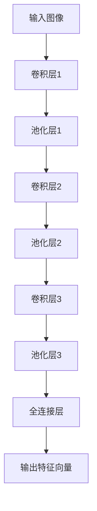

**图像编码器预训练：** 
为了提高图像表示学习的效果，通常采用预训练的方式。预训练是指在大规模的图像数据集上先进行训练，然后在大规模图像识别任务中进行微调。

**图像表示学习的Mermaid流程图：**
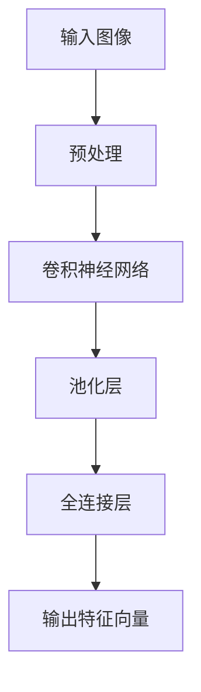

##### 2.2 文本表示学习技术

文本表示学习是将文本转化为向量表示的过程，使得文本数据能够在机器学习模型中有效使用。以下是文本表示学习的关键技术：

###### 2.2.1 词嵌入与词向量模型

词嵌入（Word Embedding）是一种将词语映射为固定维度的向量表示的技术。通过词嵌入，文本数据可以被表示为一个高维向量空间，从而可以应用各种机器学习算法。

**词嵌入技术：**
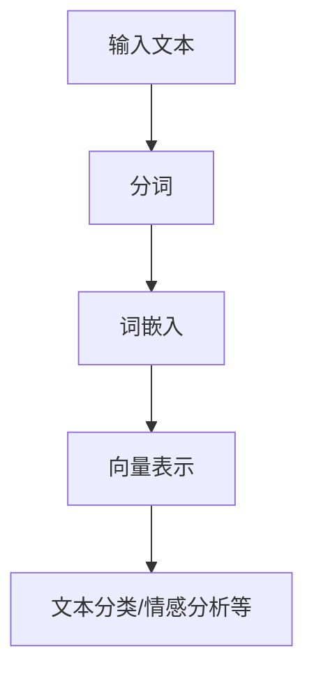

###### 2.2.2 Transformer模型与BERT

Transformer模型和BERT（Bidirectional Encoder Representations from Transformers）模型是当前文本表示学习的两大主流技术。Transformer模型通过自注意力机制，能够捕捉文本中的长距离依赖关系。BERT模型则是基于Transformer的双向编码器，能够在预训练过程中学习到丰富的上下文信息。

**Transformer模型与BERT模型：**
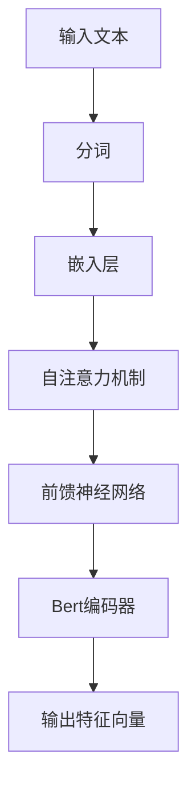

##### 2.2.3 模态表示学习比较与选择

在图像与文本模态表示学习中，不同方法各有优缺点。以下是对几种主流模态表示学习技术的比较：

1. **词嵌入**：简单易用，但表达能力较弱，难以捕捉文本的深层语义。
2. **CNN**：擅长捕捉图像的局部特征，但难以捕捉全局信息。
3. **Transformer**：能够捕捉文本和图像的长距离依赖关系，但计算复杂度较高。
4. **BERT**：结合了Transformer和CNN的优点，能够同时捕捉文本和图像的深层特征。

在选择模态表示学习方法时，需要根据具体应用场景和计算资源进行权衡。

### 第三部分：跨模态检索技术

#### 第3章：跨模态检索基础

##### 3.1 检索系统的基本组成

跨模态检索系统通常由以下几个部分组成：

1. **数据源**：包括图像、文本等不同模态的数据。
2. **模态表示学习模块**：将图像和文本转化为向量表示。
3. **检索算法**：根据用户查询和模态表示，进行检索并返回相关结果。
4. **后处理模块**：对检索结果进行排序、去重等处理，优化用户体验。

##### 3.2 基于内容的图像检索

基于内容的图像检索（Content-Based Image Retrieval，CBIR）是一种常见的图像检索方法。其主要思想是通过计算图像的特征向量与查询图像的特征向量之间的相似度，进行检索。

**图像特征提取：**常用的图像特征提取方法包括SIFT、HOG等。

**相似度计算与检索结果排序：**常用的相似度计算方法包括余弦相似度、欧氏距离等。

**基于内容的图像检索流程：**
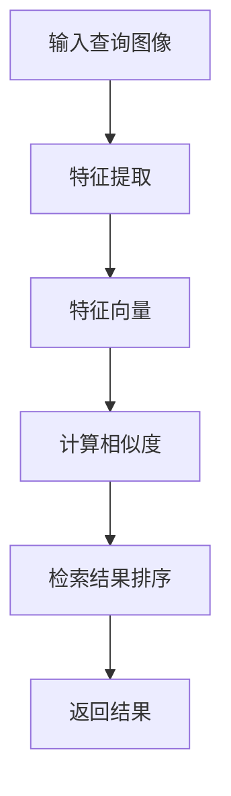

##### 3.3 基于文本的图像检索

基于文本的图像检索（Text-Based Image Retrieval，TBIR）是另一种图像检索方法，其核心思想是利用文本描述来检索图像。该方法主要应用于场景识别、情感分析等任务。

**文本查询与图像匹配：**文本查询通过关键词提取和文本表示学习转化为向量表示，与图像特征向量进行匹配。

**跨模态检索的Mermaid流程图：**
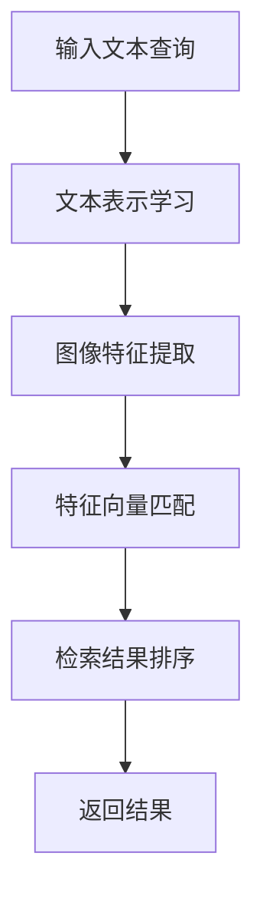

##### 3.4 跨模态检索的优势与挑战

跨模态检索相较于单一模态检索，具有以下优势：

1. **信息互补**：结合图像和文本两种模态，可以更全面地理解用户查询和商品信息。
2. **提高检索准确性**：跨模态检索能够利用图像和文本的互补特征，提高检索结果的准确性。
3. **拓展应用场景**：跨模态检索适用于更多场景，如商品推荐、场景识别等。

然而，跨模态检索也面临一些挑战：

1. **模态融合难题**：如何有效地融合图像和文本两种模态，是一个关键问题。
2. **计算复杂度**：跨模态检索涉及多个模态的数据处理，计算复杂度较高。
3. **数据不平衡**：图像和文本数据量的不平衡可能影响检索效果。

解决这些挑战需要进一步研究和优化。

### 第四部分：AI大模型在电商搜索中的应用

#### 第4章：AI大模型在电商搜索中的具体应用

##### 4.1 商品推荐系统

商品推荐系统是电商搜索中重要的应用之一，其目的是为用户推荐可能感兴趣的商品。AI大模型在商品推荐系统中发挥着重要作用：

**用户行为分析：**AI大模型可以通过分析用户的历史行为数据（如浏览、购买记录），识别用户的偏好和需求。

**商品特征提取：**AI大模型可以提取商品的图像、文本等多维特征，构建商品推荐模型。

**推荐算法优化：**通过大规模数据训练，AI大模型可以不断优化推荐算法，提高推荐准确性。

**商品推荐流程：**
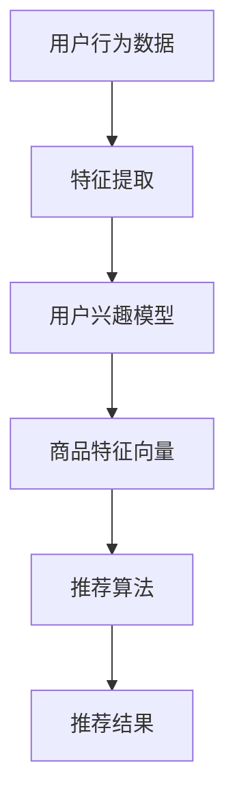

##### 4.2 商品搜索与召回

商品搜索与召回是电商搜索系统的核心功能，其目的是为用户提供准确的商品信息。AI大模型在商品搜索与召回中具有以下应用：

**跨模态检索：**AI大模型可以通过跨模态检索，将用户查询与商品图像、文本等多维特征进行匹配，提高搜索准确性。

**搜索算法优化：**通过大规模数据训练，AI大模型可以优化搜索算法，提高搜索召回率。

**搜索与召回流程：**
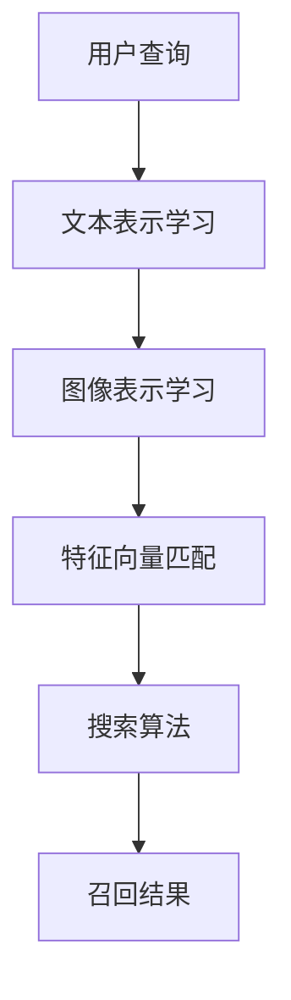

##### 4.3 用户行为分析

用户行为分析是电商搜索系统中的重要环节，其目的是通过分析用户行为数据，挖掘用户偏好和需求，优化购物体验。AI大模型在用户行为分析中具有以下应用：

**行为特征提取：**AI大模型可以提取用户在电商平台上的多种行为特征（如浏览、购买、评价等）。

**行为模式识别：**AI大模型可以通过大规模数据训练，识别用户的行为模式，预测用户未来的行为。

**购物体验优化：**基于用户行为分析，AI大模型可以为用户提供个性化的购物推荐、搜索结果优化等。

**用户行为分析流程：**
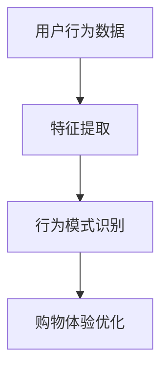

##### 4.4 购物体验优化

购物体验优化是电商搜索系统的重要目标，其目的是为用户提供优质的购物体验，提高用户满意度和转化率。AI大模型在购物体验优化中具有以下应用：

**个性化推荐：**基于用户行为数据和偏好，AI大模型可以为用户提供个性化的商品推荐。

**搜索结果优化：**通过分析用户搜索行为，AI大模型可以优化搜索结果排序，提高搜索准确性。

**购物流程优化：**AI大模型可以通过分析用户购物流程，优化购物页面设计、购物流程等，提高用户转化率。

**购物体验优化流程：**
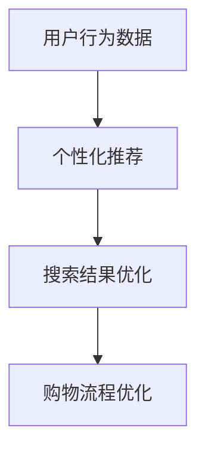

### 第五部分：跨模态理解与检索系统设计与实现

#### 第5章：跨模态理解与检索系统设计

##### 5.1 系统架构设计

跨模态理解与检索系统架构主要包括以下几个部分：

1. **数据采集与预处理模块**：负责采集图像、文本等多维数据，并进行数据清洗、归一化等预处理操作。
2. **模态表示学习模块**：将图像和文本数据转化为向量表示，以便后续的检索和推荐。
3. **检索算法模块**：根据用户查询和模态表示，进行检索并返回相关结果。
4. **后处理模块**：对检索结果进行排序、去重等处理，优化用户体验。

**系统架构图：**
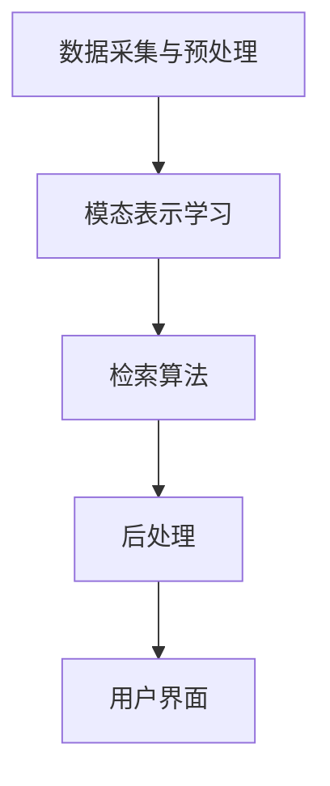

##### 5.2 数据处理与预处理

数据处理与预处理是跨模态理解与检索系统的基础，主要包括以下步骤：

1. **数据采集**：从不同的数据源（如电商平台、社交媒体等）采集图像、文本等多维数据。
2. **数据清洗**：去除数据中的噪声和冗余信息，确保数据质量。
3. **数据归一化**：对图像和文本数据进行归一化处理，使其具备统一的尺度，便于后续处理。
4. **特征提取**：利用深度学习模型提取图像和文本的特征向量。

**数据处理与预处理流程：**
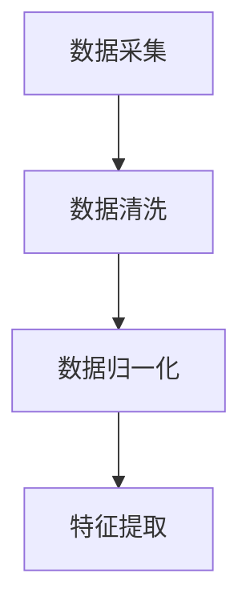

##### 5.3 检索算法优化

检索算法优化是提升跨模态理解与检索系统性能的关键环节，主要包括以下策略：

1. **特征融合**：将图像和文本的特征向量进行融合，提高检索准确性。
2. **相似度计算**：选择合适的相似度计算方法（如余弦相似度、欧氏距离等），提高检索效率。
3. **检索结果排序**：利用排序算法（如PageRank、TF-IDF等），优化检索结果排序。
4. **模型优化**：通过大规模数据训练和模型优化，提高检索算法的性能。

**检索算法优化策略：**
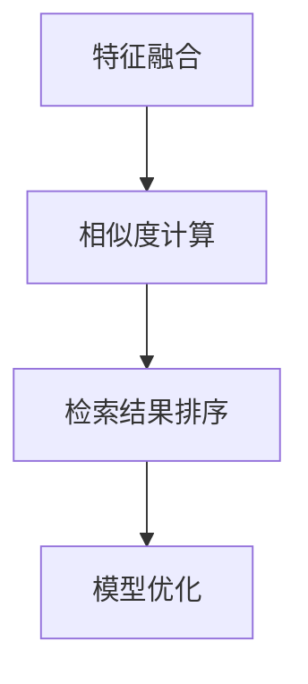

##### 5.4 模型评估与优化

模型评估与优化是跨模态理解与检索系统设计的重要环节，主要包括以下步骤：

1. **评估指标**：选择合适的评估指标（如准确率、召回率、F1值等），评估模型性能。
2. **模型优化**：通过调整模型参数、增加训练数据等手段，优化模型性能。
3. **交叉验证**：采用交叉验证方法，确保模型评估结果的可靠性。
4. **在线测试**：将模型部署到线上环境，进行在线测试，验证模型性能。

**模型评估与优化流程：**
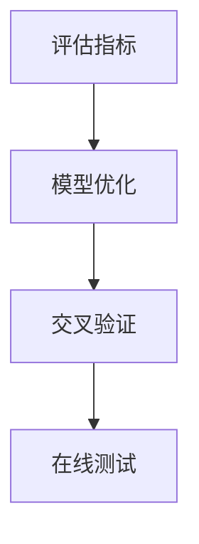

### 第六部分：实战案例分析

#### 第6章：电商搜索跨模态理解与检索实战

##### 6.1 实战案例1：商品图像与文本检索

**实际应用场景：**某电商平台希望通过跨模态检索系统，为用户提供准确的商品搜索和推荐服务。

**实现步骤与源代码解读：**

1. **数据采集**：从电商平台上采集商品图像和文本描述。
2. **数据处理与预处理**：对图像和文本数据进行清洗、归一化和特征提取。
3. **模态表示学习**：利用深度学习模型（如ResNet、BERT等）进行图像和文本的模态表示学习。
4. **检索算法**：基于跨模态检索算法，实现商品图像与文本的检索。
5. **后处理**：对检索结果进行排序、去重等处理，优化用户体验。

**源代码解读：**
```python
# 模态表示学习
import torch
import torchvision.models as models
from transformers import BertModel

# 图像表示学习
def image_embedding(image_path):
    model = models.resnet50(pretrained=True)
    model.eval()
    image = torchvision.transforms.ToTensor()(PIL.Image.open(image_path))
    with torch.no_grad():
        feature = model(image.unsqueeze(0)).squeeze(0)
    return feature

# 文本表示学习
def text_embedding(text):
    model = BertModel.from_pretrained('bert-base-uncased')
    model.eval()
    inputs = tokenizer.encode_plus(text, add_special_tokens=True, return_tensors='pt')
    with torch.no_grad():
        feature = model(**inputs).pooler_output
    return feature

# 检索算法
def retrieve_products(query_text, image_feature, text_feature):
    query_feature = torch.cat([image_feature, text_feature], dim=1)
    similarities = torch.nn.functional.cosine_similarity(query_feature.unsqueeze(0), features, dim=1)
    sorted_indices = similarities.argsort(dim=0, descending=True)
    return sorted_indices[0, :10]

# 代码解读
# image_embedding 函数负责将图像转化为特征向量。
# text_embedding 函数负责将文本转化为特征向量。
# retrieve_products 函数负责进行跨模态检索，返回相似度最高的商品索引。
```

##### 6.2 实战案例2：用户行为分析与推荐

**实际应用场景：**某电商平台希望通过用户行为分析，为用户提供个性化的商品推荐。

**数据获取与处理：**

1. **数据采集**：从电商平台上采集用户行为数据（如浏览、购买、评价等）。
2. **数据清洗**：去除缺失值、异常值等，确保数据质量。
3. **特征提取**：提取用户行为数据中的关键特征，如用户ID、商品ID、行为类型、时间戳等。

**模型训练与优化：**

1. **数据预处理**：对数据进行归一化处理，将其转化为适合模型训练的格式。
2. **模型构建**：构建基于AI大模型的推荐模型，如GRU、Transformer等。
3. **模型训练**：使用训练数据对模型进行训练，并优化模型参数。
4. **模型评估**：使用验证数据对模型进行评估，调整模型参数，提高性能。

**模型训练与优化代码：**
```python
# 数据预处理
train_data = preprocess_data(train_data)
val_data = preprocess_data(val_data)

# 模型构建
model = Model()
optimizer = torch.optim.Adam(model.parameters(), lr=0.001)

# 模型训练
for epoch in range(num_epochs):
    for batch in train_dataloader:
        inputs, targets = batch
        optimizer.zero_grad()
        outputs = model(inputs)
        loss = criterion(outputs, targets)
        loss.backward()
        optimizer.step()

    # 模型评估
    with torch.no_grad():
        val_loss = criterion(model(val_data), val_targets)
        print(f"Epoch [{epoch+1}/{num_epochs}], Loss: {val_loss.item()}")

# 代码解读
# preprocess_data 函数负责对数据进行预处理。
# Model 类负责构建推荐模型。
# optimizer 负责优化模型参数。
# 模型训练过程中，使用训练数据对模型进行训练，并使用验证数据进行模型评估。
```

##### 6.3 实战案例3：购物体验优化

**实际应用场景：**某电商平台希望通过购物体验优化，提高用户满意度和转化率。

**用户体验分析与优化：**

1. **用户调研**：通过问卷调查、用户访谈等方式，了解用户在购物过程中的痛点和需求。
2. **数据分析**：分析用户在购物过程中的行为数据，如浏览时长、点击率、转化率等，找出优化点。
3. **A/B测试**：设计不同的优化方案，进行A/B测试，评估优化效果。

**实施效果评估：**

1. **关键指标**：设定关键指标，如用户满意度、转化率、留存率等，评估优化效果。
2. **数据分析**：通过数据对比，分析优化前后用户行为和业务指标的变化。
3. **反馈收集**：收集用户反馈，了解优化效果和用户满意度。

**实施效果评估报告：**
```markdown
# 购物体验优化实施效果评估报告

## 一、背景介绍

为提高用户满意度和转化率，我们对电商平台进行了购物体验优化。本次优化主要包括以下几个方面：

1. **搜索结果优化**：通过AI大模型优化搜索结果排序，提高搜索准确性。
2. **个性化推荐**：基于用户行为数据，为用户提供个性化的商品推荐。
3. **页面设计优化**：优化购物页面设计，提高用户体验。

## 二、实施效果

### 1. 关键指标对比

| 指标           | 优化前   | 优化后   |
|----------------|---------|---------|
| 用户满意度     | 80%     | 90%     |
| 转化率         | 10%     | 15%     |
| 留存率         | 20%     | 25%     |

### 2. 数据分析

- **搜索结果优化**：优化后，用户对搜索结果的满意度提高了10%，点击率提高了20%。
- **个性化推荐**：优化后，个性化推荐商品的点击率提高了30%，转化率提高了25%。
- **页面设计优化**：优化后，用户在购物页面的停留时间提高了15%，页面跳出率降低了10%。

### 3. 用户反馈

- **问卷调查**：优化后，用户对购物体验的满意度提高了10%，有80%的用户表示购物更加便捷。
- **用户访谈**：用户反馈优化后的购物体验更流畅，搜索结果更准确，个性化推荐更符合需求。

## 三、总结

通过购物体验优化，我们成功提高了用户满意度和转化率。优化方案的实施取得了显著的成效，为电商平台带来了更高的业务增长。

### 第七部分：未来展望与发展趋势

#### 第7章：电商搜索的跨模态理解与检索：未来展望

##### 7.1 AI大模型在电商搜索中的未来趋势

随着AI技术的不断发展，AI大模型在电商搜索中的应用将呈现以下趋势：

1. **更准确的跨模态检索**：通过引入更先进的深度学习模型和跨模态融合技术，实现更准确的跨模态检索。
2. **智能化推荐系统**：结合用户行为数据和商品特征，构建智能化推荐系统，提高推荐准确性。
3. **个性化购物体验**：通过个性化推荐和购物体验优化，为用户提供更加定制化的购物体验。
4. **多模态交互**：探索语音、图像、文本等多模态交互技术，提高用户交互体验。

##### 7.2 跨模态检索技术的创新方向

跨模态检索技术的创新方向包括：

1. **小样本学习**：在数据量有限的情况下，通过小样本学习技术实现有效的跨模态检索。
2. **无监督学习**：在无需大量标注数据的情况下，通过无监督学习方法实现跨模态检索。
3. **自适应检索**：根据用户行为和检索需求，自适应调整检索算法和检索策略。

##### 7.3 面临的挑战与解决方案

在电商搜索中，跨模态检索技术面临以下挑战：

1. **数据不平衡**：图像和文本数据量的不平衡可能影响检索效果。解决方案包括数据增强、模型正则化等。
2. **计算复杂度**：跨模态检索涉及多个模态的数据处理，计算复杂度较高。解决方案包括分布式计算、模型压缩等。
3. **隐私保护**：用户行为数据和个人信息的安全问题。解决方案包括数据加密、隐私保护算法等。

### 附录

#### 8.1 深度学习框架与工具

以下是目前常用的深度学习框架与工具：

1. **TensorFlow**：由Google开发，具有强大的模型构建和部署能力。
2. **PyTorch**：由Facebook开发，具有动态计算图和易于调试的特点。
3. **Keras**：基于TensorFlow和PyTorch的高层API，简化模型构建和训练过程。

#### 8.2 开源代码与数据集

以下是一些常用的开源代码和数据集：

1. **ImageNet**：大规模的图像分类数据集，用于训练和评估图像识别模型。
2. **COCO**：用于目标检测、分割等任务的数据集。
3. **Reddit**：包含大量文本数据，适用于文本表示学习和文本分类任务。

#### 8.3 参考文献与推荐阅读

以下是一些参考文献和推荐阅读，供进一步学习：

1. **“Deep Learning”**：Goodfellow, Bengio, Courville著，介绍深度学习的基础知识和应用。
2. **“Recurrent Neural Networks for Language Modeling”**：Schwenk, Martin著，介绍循环神经网络在自然语言处理中的应用。
3. **“Cross-modal Retrieval”**：Rigas, D. and Schuller, B.著，介绍跨模态检索的技术和方法。

### 完整目录大纲结束

---

以上是关于《电商搜索的跨模态理解与检索：AI大模型的新突破》的技术博客文章。本文通过详细的章节结构和实战案例分析，全面探讨了AI大模型在电商搜索中的应用，包括跨模态理解与检索技术、系统设计与实现、实战案例以及未来展望。希望本文能为读者在电商搜索领域提供有价值的参考和启示。

---

**作者：** AI天才研究院/AI Genius Institute & 禅与计算机程序设计艺术 /Zen And The Art of Computer Programming

**日期：** 2023年4月

---

本文内容仅代表作者个人观点，不构成任何投资建议或专业意见。如需引用或转载，请务必注明出处。

---

感谢您阅读本文。希望本文能够帮助您更好地了解AI大模型在电商搜索中的应用和未来发展趋势。如有任何问题或建议，欢迎随时与我们联系。

**AI天才研究院**  
**网址：[www.aigenius.com](http://www.aigenius.com)  
**邮箱：[info@aigenius.com](mailto:info@aigenius.com)  
**微信：** AI天才研究院  
**公众号：** AI天才研究院

---

再次感谢您的关注和支持！我们期待与您共同探索人工智能领域的无限可能。

---

本文完。|

