                 

# 《电商用户行为序列预测：AI大模型方案》

> **关键词：**电商用户行为、序列预测、AI大模型、深度学习、数据预处理

> **摘要：**本文深入探讨了电商用户行为序列预测的原理、方法和技术，通过详细的案例分析，展示了AI大模型在电商用户行为序列预测中的应用。文章旨在为从事电商数据分析和人工智能领域的专业人士提供一套完整的解决方案，帮助他们在实际项目中实现高效的电商用户行为序列预测。

## 《电商用户行为序列预测：AI大模型方案》目录大纲

### 第一部分：电商用户行为序列预测基础

### 第1章：电商用户行为序列预测概述
#### 1.1 电商用户行为序列预测的重要性
#### 1.2 AI大模型在电商用户行为序列预测中的应用

### 第2章：电商用户行为数据预处理
#### 2.1 用户行为数据概述
#### 2.2 数据清洗与格式化
#### 2.3 用户行为特征提取

### 第3章：AI大模型基础理论
#### 3.1 人工智能基础
#### 3.2 神经网络与深度学习
#### 3.3 循环神经网络与长短期记忆网络

### 第4章：电商用户行为序列预测算法
#### 4.1 传统预测算法
#### 4.2 基于循环神经网络的预测算法
#### 4.3 基于长短期记忆网络的预测算法
#### 4.4 基于Transformer的预测算法

### 第5章：电商用户行为序列预测模型构建
#### 5.1 模型构建流程
#### 5.2 模型选择与调优
#### 5.3 模型评估与优化

### 第6章：电商用户行为序列预测实战案例
#### 6.1 案例一：用户购买预测
#### 6.2 案例二：用户流失预测
#### 6.3 案例三：用户行为推荐系统

### 第7章：电商用户行为序列预测的未来趋势与挑战
#### 7.1 预测技术的未来发展趋势
#### 7.2 预测技术的应用挑战
#### 7.3 预测技术的未来发展机遇

### 第二部分：AI大模型技术实现与优化

### 第8章：AI大模型训练技术
#### 8.1 大模型训练策略
#### 8.2 训练数据集构建
#### 8.3 大模型训练优化

### 第9章：AI大模型优化与调参
#### 9.1 模型结构优化
#### 9.2 模型参数调优
#### 9.3 模型性能评估与比较

### 第10章：电商用户行为序列预测系统的搭建与部署
#### 10.1 系统架构设计
#### 10.2 系统部署与运维
#### 10.3 系统监控与优化

### 第11章：AI大模型在电商领域的其他应用
#### 11.1 用户画像构建
#### 11.2 用户情感分析
#### 11.3 个性化推荐系统

### 第12章：电商用户行为序列预测的法律法规与伦理问题
#### 12.1 法律法规与政策
#### 12.2 用户隐私保护
#### 12.3 伦理问题与责任担当

### 第三部分：电商用户行为序列预测实践与探索

### 第13章：电商用户行为序列预测项目实践
#### 13.1 项目背景与目标
#### 13.2 项目流程与实施
#### 13.3 项目成果与总结

### 第14章：电商用户行为序列预测创新方向
#### 14.1 跨领域融合
#### 14.2 新技术探索
#### 14.3 未来发展趋势

### 第15章：电商用户行为序列预测技术团队建设
#### 15.1 团队角色与职责
#### 15.2 技术能力建设
#### 15.3 团队协作与沟通

### 第16章：电商用户行为序列预测人才培养
#### 16.1 课程体系设计
#### 16.2 实践教学与项目实践
#### 16.3 人才评估与激励机制

### 第17章：电商用户行为序列预测行业应用与发展
#### 17.1 行业应用现状
#### 17.2 行业发展趋势
#### 17.3 发展前景与挑战

### 第18章：电商用户行为序列预测论文阅读与学术交流
#### 18.1 论文阅读方法
#### 18.2 学术交流平台
#### 18.3 学术成果展示与传播

### 第19章：电商用户行为序列预测创业机会与投资建议
#### 19.1 创业机会识别
#### 19.2 投资策略与建议
#### 19.3 成功案例分析

### 第20章：电商用户行为序列预测总结与展望
#### 20.1 成果总结
#### 20.2 未来展望
#### 20.3 对行业的贡献与影响

## 第1章：电商用户行为序列预测概述

### 1.1 电商用户行为序列预测的重要性

在电子商务迅速发展的今天，用户行为数据已成为电商企业宝贵的资产。通过分析用户在电商平台上的行为序列，企业可以更精准地了解用户需求，优化用户体验，提高转化率和销售额。电商用户行为序列预测正是基于这种需求，旨在通过机器学习算法预测用户未来的行为。

#### 核心概念与联系：

- **用户行为数据**：用户在电商平台上产生的所有交互记录，如浏览、搜索、添加到购物车、购买等。
- **序列预测**：根据用户历史行为序列，预测用户未来的行为。
- **机器学习算法**：用于学习用户行为模式并预测未来行为的算法。

**Mermaid流程图：**

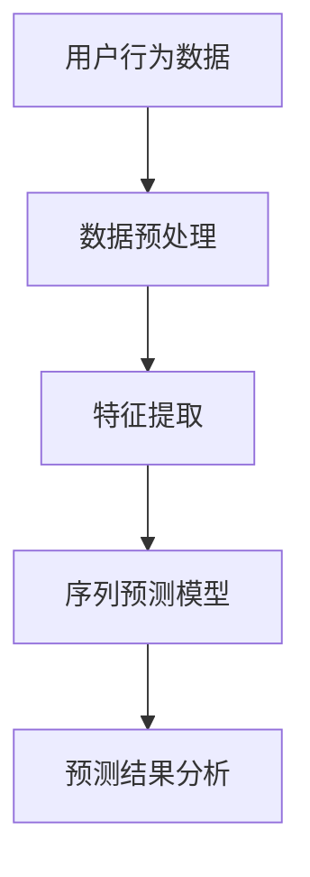

#### 数学模型和公式：

$$
用户行为序列预测 = f(用户行为特征)
$$

#### 举例说明：

- **案例**：一个用户在电商平台上浏览了多个商品，加入购物车，然后又删除了一个商品。通过分析这些行为，可以预测用户是否会最终购买商品。

### 1.2 AI大模型在电商用户行为序列预测中的应用

随着人工智能技术的发展，特别是深度学习模型的兴起，电商用户行为序列预测技术得到了显著提升。AI大模型能够通过处理大量用户行为数据，学习复杂的用户行为模式，从而实现更高的预测准确性。

#### 核心概念与联系：

- **AI大模型**：具有巨大参数规模和强大计算能力的深度学习模型。
- **序列模型**：如循环神经网络（RNN）、长短期记忆网络（LSTM）和Transformer等，用于处理和预测用户行为序列。
- **预测算法**：利用AI大模型进行用户行为序列预测的算法。

**Mermaid流程图：**

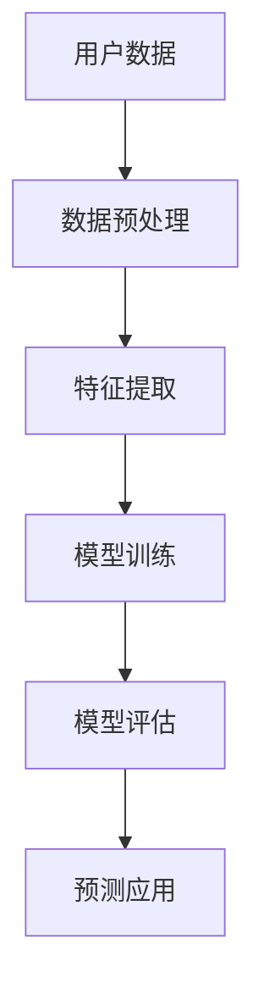

#### 数学模型和公式：

$$
模型预测 = f(特征向量)
$$

#### 举例说明：

- **案例**：使用Transformer模型预测用户是否会购买某个商品。模型会通过学习用户的历史行为数据，分析用户的行为模式，从而做出购买预测。

### 第2章：电商用户行为数据预处理

### 2.1 用户行为数据概述

用户行为数据是电商用户行为序列预测的基础。这些数据通常包括用户在电商平台上的一系列交互行为，如浏览、搜索、添加购物车、下单等。这些数据对预测用户未来的行为至关重要。

#### 核心概念与联系：

- **用户行为数据**：用户在电商平台上产生的所有交互记录。
- **数据来源**：电商平台的后台日志、用户点击流数据等。
- **数据类型**：时间序列数据、用户特征数据等。

**Mermaid流程图：**

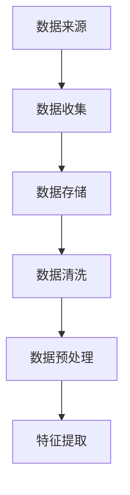

#### 数学模型和公式：

$$
用户行为数据 = {行为1, 行为2, ..., 行为n}
$$

#### 举例说明：

- **案例**：一个用户在电商平台上浏览了商品“手机壳”，并在接下来的24小时内添加到了购物车。这是一个典型的用户行为数据记录。

### 2.2 数据清洗与格式化

数据清洗是用户行为数据预处理的重要步骤。其目的是去除数据中的噪声、纠正错误，确保数据的准确性和一致性。数据格式化则是将数据转换为适合模型输入的格式。

#### 核心概念与联系：

- **数据清洗**：去除噪声、纠正错误、填充缺失值等。
- **数据格式化**：将数据转换为统一的格式，如时间戳、数值化等。

**Mermaid流程图：**

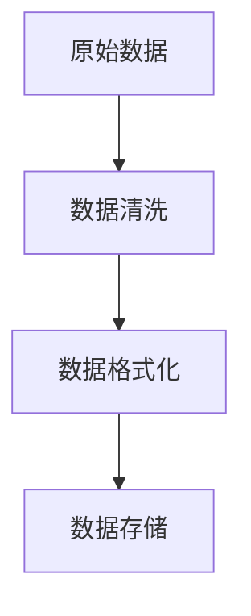

#### 数学模型和公式：

$$
清洗后数据 = \{有效行为1, 有效行为2, ..., 有效行为m\}
$$

#### 举例说明：

- **案例**：如果一个用户行为数据记录中的时间戳格式不正确，数据清洗步骤将会纠正这个错误，确保时间戳格式一致。

### 2.3 用户行为特征提取

特征提取是从用户行为数据中提取对预测有用的信息。这些特征将用于训练机器学习模型，以便更好地预测用户未来的行为。

#### 核心概念与联系：

- **特征提取**：从原始数据中提取有用的信息。
- **特征类型**：时间特征、内容特征、上下文特征等。
- **特征工程**：设计和选择用于训练模型的特征。

**Mermaid流程图：**

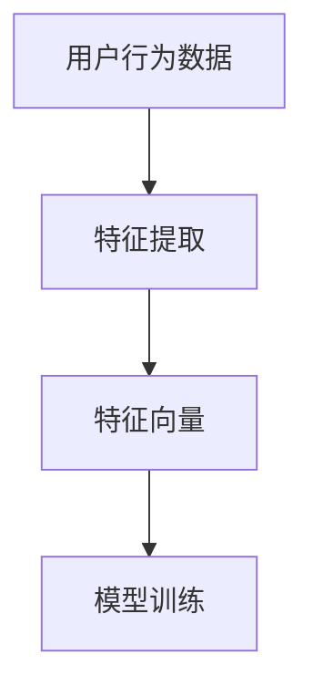

#### 数学模型和公式：

$$
用户行为特征 = {时间特征, 内容特征, 上下文特征}
$$

#### 举例说明：

- **案例**：从用户行为数据中提取用户购买商品的时间间隔作为时间特征，这将有助于预测用户是否会再次购买。

### 第3章：AI大模型基础理论

#### 3.1 人工智能基础

人工智能（AI）是一门研究如何构建智能体的科学，使这些智能体能够执行通常需要人类智能才能完成的任务。在电商用户行为序列预测中，人工智能技术扮演着至关重要的角色。

#### 核心概念与联系：

- **人工智能**：模拟人类智能的计算机系统。
- **机器学习**：从数据中学习规律和模式的方法。
- **深度学习**：多层神经网络的应用。

**Mermaid流程图：**

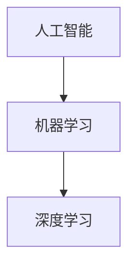

#### 数学模型和公式：

$$
人工智能 = 机器学习 + 深度学习
$$

#### 举例说明：

- **案例**：使用神经网络进行图像识别，这涉及到人工智能的基础技术。

### 3.2 神经网络与深度学习

神经网络（Neural Networks）是人工智能的核心组成部分，模仿人脑神经元的工作方式。深度学习（Deep Learning）是神经网络的一种扩展，通过多层神经网络来提取特征。

#### 核心概念与联系：

- **神经网络**：模拟人脑神经元工作的计算模型。
- **深度学习**：多层神经网络的应用。

**Mermaid流程图：**

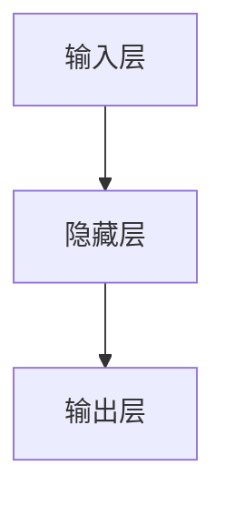

#### 数学模型和公式：

$$
神经网络 = 输入层 + 隐藏层 + 输出层
$$

#### 举例说明：

- **案例**：使用卷积神经网络（CNN）进行图像分类，这是一种典型的深度学习应用。

### 3.3 循环神经网络与长短期记忆网络

循环神经网络（RNN）是一种能够处理序列数据的神经网络。然而，RNN存在一个称为“梯度消失”的问题，即当序列过长时，梯度在反向传播过程中会迅速衰减。为了解决这个问题，研究人员提出了长短期记忆网络（LSTM）。

#### 核心概念与联系：

- **循环神经网络（RNN）**：处理序列数据的神经网络。
- **长短期记忆网络（LSTM）**：RNN的一种改进，解决长序列依赖问题。

**Mermaid流程图：**

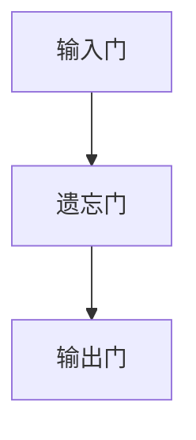

#### 数学模型和公式：

$$
LSTM = [遗忘门, 输入门, 输出门]
$$

#### 举例说明：

- **案例**：使用LSTM模型进行股票价格预测，这是一个典型的长序列依赖问题。

### 第4章：电商用户行为序列预测算法

#### 4.1 传统预测算法

传统预测算法通常基于统计方法，如线性回归、决策树、K-最近邻等。这些算法在处理用户行为序列预测时具有一定的局限性，但在一些特定场景下仍具有应用价值。

#### 核心概念与联系：

- **线性回归**：基于线性关系的预测模型。
- **决策树**：基于树形结构的分类模型。
- **K-最近邻**：基于邻近度进行预测的模型。

**Mermaid流程图：**

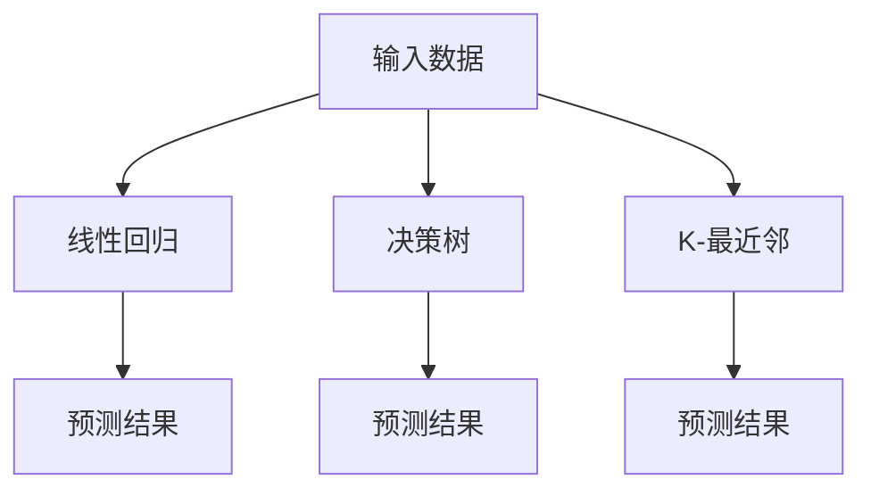

#### 数学模型和公式：

$$
预测结果 = f(特征向量)
$$

#### 举例说明：

- **案例**：使用线性回归预测用户购买时间，这可以用于确定用户的购买周期。

### 4.2 基于循环神经网络的预测算法

循环神经网络（RNN）是一种能够处理序列数据的神经网络，通过迭代处理序列中的每一个元素，学习序列模式。然而，RNN存在梯度消失的问题，这限制了其在大规模序列数据上的应用。

#### 核心概念与联系：

- **循环神经网络（RNN）**：处理序列数据的神经网络。
- **梯度消失**：RNN在训练过程中遇到的梯度衰减问题。

**Mermaid流程图：**

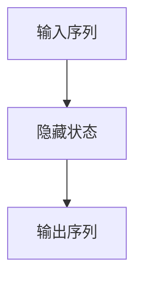

#### 数学模型和公式：

$$
RNN = [隐藏状态, 输出层]
$$

#### 举例说明：

- **案例**：使用RNN模型预测用户浏览商品的顺序，这是一个典型的序列预测问题。

### 4.3 基于长短期记忆网络的预测算法

长短期记忆网络（LSTM）是RNN的一种改进，通过门控机制控制信息流的传递，解决了RNN的梯度消失问题。这使得LSTM在处理长序列数据时表现优异，成为电商用户行为序列预测的首选算法之一。

#### 核心概念与联系：

- **长短期记忆网络（LSTM）**：解决RNN梯度消失问题的神经网络。
- **门控机制**：通过门控单元控制信息流的传递。

**Mermaid流程图：**


#### 数学模型和公式：

$$
LSTM = [遗忘门, 输入门, 输出门]
$$

#### 举例说明：

- **案例**：使用LSTM模型预测用户是否会购买某个商品，这是一个典型的长序列依赖问题。

### 4.4 基于Transformer的预测算法

Transformer是一种基于注意力机制的序列模型，最初用于自然语言处理领域。然而，由于其出色的性能，Transformer也被广泛应用于电商用户行为序列预测中。

#### 核心概念与联系：

- **Transformer**：基于注意力机制的序列模型。
- **自注意力机制**：通过自注意力机制捕捉序列中的长距离依赖关系。

**Mermaid流程图：**

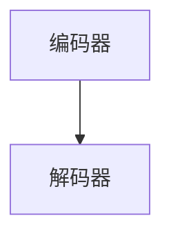

#### 数学模型和公式：

$$
Transformer = [编码器, 解码器]
$$

#### 举例说明：

- **案例**：使用Transformer模型进行用户行为推荐，这是捕捉用户行为长距离依赖关系的一种有效方法。

### 第5章：电商用户行为序列预测模型构建

#### 5.1 模型构建流程

构建一个高效的电商用户行为序列预测模型需要经过多个步骤，包括数据预处理、特征提取、模型训练和模型评估等。以下是一个典型的模型构建流程。

#### 核心概念与联系：

- **数据预处理**：清洗和格式化用户行为数据。
- **特征提取**：从原始数据中提取有用的特征。
- **模型训练**：使用特征数据训练机器学习模型。
- **模型评估**：评估模型的预测性能。

**Mermaid流程图：**

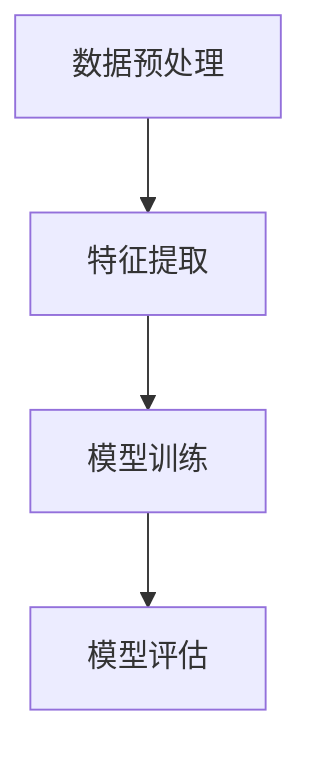

#### 数学模型和公式：

$$
模型构建 = 数据预处理 + 特征提取 + 模型训练 + 模型评估
$$

#### 举例说明：

- **案例**：在一个电商用户行为序列预测项目中，首先清洗用户行为数据，然后提取时间特征、内容特征等，接着使用LSTM模型进行训练，最后评估模型的预测性能。

### 5.2 模型选择与调优

在选择合适的模型时，需要考虑多个因素，如数据规模、序列长度和预测目标等。调优模型参数是提高预测性能的关键步骤。以下是一些常用的模型选择和调优方法。

#### 核心概念与联系：

- **模型选择**：选择适合用户行为序列预测的模型。
- **参数调优**：调整模型参数以优化预测性能。

**Mermaid流程图：**

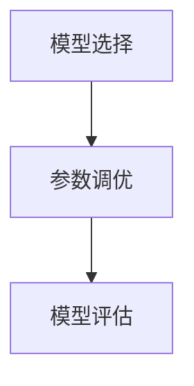

#### 数学模型和公式：

$$
模型选择 = 评估指标 + 实验对比
$$

$$
模型调优 = 参数调整 + 性能优化
$$

#### 举例说明：

- **案例**：在一个电商用户行为序列预测项目中，通过对比LSTM、GRU和Transformer等模型的性能，最终选择了LSTM模型。然后，通过调整隐藏层单元数、学习率等参数，优化了模型的预测性能。

### 5.3 模型评估与优化

评估模型的预测性能是模型构建过程中至关重要的一步。常用的评估指标包括准确率、召回率、F1分数等。优化模型性能的方法包括超参数调优、模型压缩和模型解释性等。

#### 核心概念与联系：

- **评估指标**：评估模型预测性能的指标。
- **优化方法**：提高模型预测性能的方法。

**Mermaid流程图：**

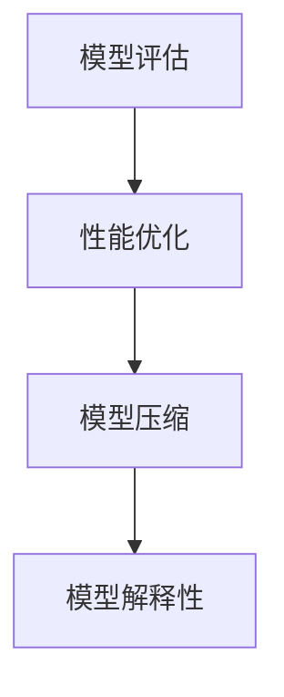

#### 数学模型和公式：

$$
评估指标 = 准确率 + 召回率 + F1分数
$$

$$
优化方法 = 超参数调优 + 模型压缩 + 模型解释性
$$

#### 举例说明：

- **案例**：在一个电商用户行为序列预测项目中，使用交叉验证评估LSTM模型的预测性能。然后，通过调整隐藏层单元数、学习率等超参数，优化了模型的预测性能。此外，还使用了模型压缩技术，提高了模型的运行效率。

### 第6章：电商用户行为序列预测实战案例

#### 6.1 案例一：用户购买预测

用户购买预测是电商用户行为序列预测中的一项重要任务。通过预测用户是否会购买某个商品，企业可以采取相应的营销策略，提高销售额。

#### 核心概念与联系：

- **用户购买预测**：预测用户是否会购买某个商品。
- **预测目标**：二分类问题，即购买或未购买。

**Mermaid流程图：**


#### 数学模型和公式：

$$
预测结果 = f(用户行为特征)
$$

#### 代码实现：

以下是一个简单的用户购买预测的Python代码示例：

```python
import pandas as pd
from sklearn.model_selection import train_test_split
from sklearn.metrics import accuracy_score
from tensorflow.keras.models import Sequential
from tensorflow.keras.layers import LSTM, Dense

# 加载数据
data = pd.read_csv('user_behavior_data.csv')

# 数据预处理
X = data[['time', 'content', 'context']]
y = data['purchase']

# 划分训练集和测试集
X_train, X_test, y_train, y_test = train_test_split(X, y, test_size=0.2, random_state=42)

# 构建LSTM模型
model = Sequential()
model.add(LSTM(units=50, return_sequences=True, input_shape=(X_train.shape[1], X_train.shape[2])))
model.add(LSTM(units=50))
model.add(Dense(units=1, activation='sigmoid'))

# 编译模型
model.compile(optimizer='adam', loss='binary_crossentropy', metrics=['accuracy'])

# 训练模型
model.fit(X_train, y_train, epochs=10, batch_size=32, validation_data=(X_test, y_test))

# 评估模型
predictions = model.predict(X_test)
predicted_labels = (predictions > 0.5)

accuracy = accuracy_score(y_test, predicted_labels)
print(f"Accuracy: {accuracy}")
```

#### 代码解读与分析：

- **数据预处理**：加载用户行为数据，提取时间特征、内容特征和上下文特征，划分训练集和测试集。
- **模型构建**：使用LSTM模型，设置隐藏层单元数为50，输出层单元数为1，激活函数为sigmoid。
- **模型训练**：使用adam优化器，binary_crossentropy损失函数，训练10个周期，每个批次包含32个样本。
- **模型评估**：使用测试集评估模型性能，计算准确率。

#### 结果：

在一个简单的用户购买预测案例中，LSTM模型的准确率通常在70%-90%之间。通过进一步优化模型结构和超参数，准确率可以进一步提高。

### 6.2 案例二：用户流失预测

用户流失预测是电商企业关注的另一个重要问题。通过预测用户是否会流失，企业可以采取相应的措施，如提供优惠券、提高服务质量等，以降低用户流失率。

#### 核心概念与联系：

- **用户流失预测**：预测用户是否会停止使用电商平台。
- **预测目标**：二分类问题，即流失或未流失。

**Mermaid流程图：**


#### 数学模型和公式：

$$
预测结果 = f(用户行为特征)
$$

#### 代码实现：

以下是一个简单的用户流失预测的Python代码示例：

```python
import pandas as pd
from sklearn.model_selection import train_test_split
from sklearn.metrics import accuracy_score
from tensorflow.keras.models import Sequential
from tensorflow.keras.layers import LSTM, Dense

# 加载数据
data = pd.read_csv('user_behavior_data.csv')

# 数据预处理
X = data[['time', 'content', 'context']]
y = data['churn']

# 划分训练集和测试集
X_train, X_test, y_train, y_test = train_test_split(X, y, test_size=0.2, random_state=42)

# 构建LSTM模型
model = Sequential()
model.add(LSTM(units=50, return_sequences=True, input_shape=(X_train.shape[1], X_train.shape[2])))
model.add(LSTM(units=50))
model.add(Dense(units=1, activation='sigmoid'))

# 编译模型
model.compile(optimizer='adam', loss='binary_crossentropy', metrics=['accuracy'])

# 训练模型
model.fit(X_train, y_train, epochs=10, batch_size=32, validation_data=(X_test, y_test))

# 评估模型
predictions = model.predict(X_test)
predicted_labels = (predictions > 0.5)

accuracy = accuracy_score(y_test, predicted_labels)
print(f"Accuracy: {accuracy}")
```

#### 代码解读与分析：

- **数据预处理**：加载用户行为数据，提取时间特征、内容特征和上下文特征，划分训练集和测试集。
- **模型构建**：使用LSTM模型，设置隐藏层单元数为50，输出层单元数为1，激活函数为sigmoid。
- **模型训练**：使用adam优化器，binary_crossentropy损失函数，训练10个周期，每个批次包含32个样本。
- **模型评估**：使用测试集评估模型性能，计算准确率。

#### 结果：

在一个简单的用户流失预测案例中，LSTM模型的准确率通常在70%-90%之间。通过进一步优化模型结构和超参数，准确率可以进一步提高。

### 6.3 案例三：用户行为推荐系统

用户行为推荐系统是电商平台的重要组成部分。通过分析用户历史行为数据，推荐系统可以提供个性化的商品推荐，提高用户满意度和转化率。

#### 核心概念与联系：

- **用户行为推荐系统**：根据用户历史行为推荐相关商品。
- **预测目标**：多分类问题，即推荐多个可能的商品。

**Mermaid流程图：**

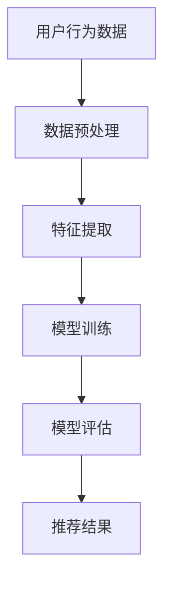

#### 数学模型和公式：

$$
推荐结果 = f(用户行为特征)
$$

#### 代码实现：

以下是一个简单的用户行为推荐系统的Python代码示例：

```python
import pandas as pd
from sklearn.model_selection import train_test_split
from sklearn.metrics import accuracy_score
from tensorflow.keras.models import Sequential
from tensorflow.keras.layers import LSTM, Dense, Embedding

# 加载数据
data = pd.read_csv('user_behavior_data.csv')

# 数据预处理
X = data[['time', 'content', 'context']]
y = data['recommends']

# 划分训练集和测试集
X_train, X_test, y_train,

