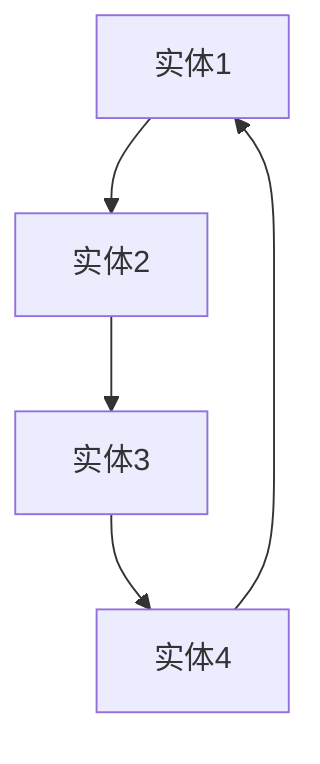

                 

# 知识图谱扩展：测试LLM自主学习和知识积累的能力

## 关键词
知识图谱，语言模型（LLM），自主学习，知识积累，知识扩展，数据质量，模型解释性，实践案例

## 摘要
本文深入探讨了知识图谱与语言模型（LLM）的结合，以及LLM在自主学习和知识积累方面的能力。通过详细分析知识图谱的基本概念、构建方法与应用场景，本文阐述了LLM在知识图谱扩展中的重要作用。同时，本文介绍了LLM自主学习的原理、知识积累的方法和策略，以及知识图谱扩展中面临的挑战与解决方案。通过实际案例研究和实践分析，本文展示了LLM在知识图谱扩展中的强大能力，并对未来的发展方向进行了展望。

# 目录

## 第一部分: 知识图谱与LLM基础

### 第1章: 知识图谱概述
#### 1.1 知识图谱的定义与重要性
#### 1.2 知识图谱的基本构成
#### 1.3 知识图谱的应用场景

### 第2章: 语言模型（LLM）概述
#### 2.1 语言模型的定义与特点
#### 2.2 LLM的发展历程
#### 2.3 LLM的主要应用领域

### 第3章: 知识图谱与LLM的关系
#### 3.1 知识图谱在LLM中的应用
#### 3.2 LLM对知识图谱的扩展
#### 3.3 知识图谱与LLM协同作用的优势

## 第二部分: LLM自主学习和知识积累

### 第4章: LLM自主学习的原理与实现
#### 4.1 自主学习的定义与类型
#### 4.2 LLM自主学习的机制
#### 4.3 LLM自主学习的关键技术

### 第5章: LLM知识积累的方法与策略
#### 5.1 知识积累的目标与挑战
#### 5.2 知识抽取与实体链接
#### 5.3 知识融合与更新

### 第6章: 知识图谱扩展中的挑战与解决方案
#### 6.1 数据质量和多样性问题
#### 6.2 知识推理与关联
#### 6.3 模型解释性与可解释性

## 第三部分: LLM自主学习和知识积累的实践

### 第7章: LLM自主学习和知识积累案例研究
#### 7.1 案例一：医疗知识图谱的构建与扩展
#### 7.2 案例二：金融知识图谱的构建与扩展
#### 7.3 案例三：法律知识图谱的构建与扩展

### 第8章: 实践中的问题和挑战
#### 8.1 数据隐私与安全
#### 8.2 模型可解释性
#### 8.3 知识图谱与LLM协同的优化策略

## 第四部分: 未来的发展方向

### 第9章: LLM自主学习和知识积累的前沿研究
#### 9.1 元学习在知识图谱扩展中的应用
#### 9.2 强化学习在知识图谱扩展中的应用
#### 9.3 多模态知识图谱扩展

### 第10章: 未来展望
#### 10.1 LLM自主学习和知识积累的商业化前景
#### 10.2 LLM自主学习和知识积累在教育领域的应用
#### 10.3 LLM自主学习和知识积累对未来的影响

## 附录
### 附录A: 知识图谱扩展相关工具与资源
#### A.1 知识图谱构建工具
#### A.2 LLM训练与优化工具
#### A.3 开源代码与数据集

# 第一部分: 知识图谱与LLM基础

## 第1章: 知识图谱概述

### 1.1 知识图谱的定义与重要性

知识图谱（Knowledge Graph）是一种用于表示实体和实体之间关系的图形结构，通过将信息组织成有向图的形式，使计算机能够更好地理解和处理复杂的信息。知识图谱的基本概念可以表示为以下图模型：



在这个图中，A、B、C、D 分别表示不同的实体，箭头表示实体之间的关系。

知识图谱的重要性主要体现在以下几个方面：

1. 提升信息的可检索性：通过知识图谱，用户可以更快速地找到所需的信息，提高查询效率。
2. 支持复杂的查询与推理：知识图谱能够支持基于实体和关系的复杂查询，如“查找与实体A相关联的实体B的所有属性”。
3. 促进数据的结构化与规范化：知识图谱将非结构化的数据转化为结构化的数据，有助于数据的整合和管理。

### 1.2 知识图谱的基本构成

知识图谱的基本构成包括实体、关系和属性。

1. **实体（Entities）**：实体是知识图谱中的基本元素，可以表示为图中的一个节点。例如，人、地点、组织等都是实体。
2. **关系（Relationships）**：关系表示实体之间的关联，可以表示为图中的边。例如，人之间的关系可以是“朋友”、“同事”等。
3. **属性（Attributes）**：属性是实体的特征描述，可以表示为节点上的标签。例如，人的属性可以是“年龄”、“性别”等。

### 1.3 知识图谱的应用场景

知识图谱在许多领域都有广泛的应用，以下是一些典型的应用场景：

1. **互联网搜索**：知识图谱可以提高搜索引擎的查询准确性和响应速度。
2. **语义理解**：知识图谱可以帮助计算机更好地理解自然语言文本，实现更准确的语义解析。
3. **个性化推荐**：知识图谱可以根据用户的行为和兴趣，提供个性化的推荐服务。
4. **智能问答**：知识图谱可以支持基于自然语言问题的智能问答系统，如百度知心、微软小冰等。

## 第2章: 语言模型（LLM）概述

### 2.1 语言模型的定义与特点

语言模型（Language Model，简称LM）是一种用于预测文本概率的模型，通过对大量文本数据的学习，模型可以生成符合语言习惯的文本。语言模型的基本特点是：

1. **参数规模庞大**：语言模型通常包含数百万甚至数亿个参数，以捕捉文本中的复杂模式。
2. **需要大规模数据进行训练**：语言模型需要大量的文本数据进行训练，以获得良好的性能。
3. **支持文本生成与理解**：语言模型不仅可以生成文本，还可以用于文本理解任务，如情感分析、命名实体识别等。

### 2.2 LLM的发展历程

语言模型的发展历程可以分为以下几个阶段：

1. **早期语言模型**：包括基于统计的N-gram模型和基于规则的模型。
2. **基于神经网络的模型**：如循环神经网络（RNN）和长短时记忆网络（LSTM）。
3. **大规模预训练模型**：如BERT、GPT和Transformer等，这些模型通过在大规模语料库上的预训练，取得了显著的性能提升。

### 2.3 LLM的主要应用领域

语言模型在许多领域都有广泛的应用，以下是一些典型的应用领域：

1. **自然语言处理（NLP）**：语言模型可以用于文本分类、情感分析、机器翻译等任务。
2. **语音识别**：语言模型可以帮助语音识别系统更好地理解用户的话语内容。
3. **机器翻译**：语言模型可以用于生成翻译结果，提高翻译的准确性和流畅性。
4. **文本生成**：语言模型可以生成新闻文章、小说、代码等文本内容。

## 第3章: 知识图谱与LLM的关系

### 3.1 知识图谱在LLM中的应用

知识图谱在语言模型中的应用主要体现在以下几个方面：

1. **提升语义理解能力**：知识图谱可以提供丰富的背景知识，帮助语言模型更好地理解文本的语义。
2. **支持复杂的查询与推理**：知识图谱可以支持基于实体和关系的复杂查询，提高语言模型在问答系统中的应用效果。
3. **实现知识增强的文本生成**：知识图谱可以提供丰富的知识资源，帮助语言模型生成更丰富、更有逻辑性的文本。

### 3.2 LLM对知识图谱的扩展

语言模型对知识图谱的扩展主要体现在以下几个方面：

1. **自动构建知识图谱**：语言模型可以通过文本数据自动构建知识图谱，实现知识的自动抽取和表示。
2. **实现知识推理与关联**：语言模型可以通过语义理解能力，实现知识图谱中的推理和关联，提高知识的利用效率。
3. **提升知识图谱的可解释性**：语言模型可以帮助解释知识图谱中的知识，提高知识图谱的可解释性和可理解性。

### 3.3 知识图谱与LLM协同作用的优势

知识图谱与语言模型的协同作用具有以下优势：

1. **提升模型的泛化能力**：知识图谱可以提供丰富的背景知识，帮助语言模型更好地适应不同的应用场景。
2. **支持多样化的应用场景**：知识图谱与语言模型的结合可以支持多种应用场景，如问答系统、智能推荐等。
3. **促进知识的循环利用**：知识图谱可以存储和管理知识，实现知识的共享和循环利用。

# 第二部分: LLM自主学习和知识积累

## 第4章: LLM自主学习的原理与实现

### 4.1 自主学习的定义与类型

自主学习（Autonomous Learning）是一种无需人工干预的学习过程，通过自我评估、自我调整和自我优化，实现模型的自我学习和知识积累。自主学习可以分为以下几种类型：

1. **强化学习（Reinforcement Learning）**：强化学习是一种基于奖励机制的学习方法，通过尝试不同的动作并获取奖励，逐步优化行为策略。
2. **自监督学习（Self-supervised Learning）**：自监督学习是一种无需人工标注数据的学习方法，通过利用数据内在的结构信息，实现自我学习和知识积累。
3. **无监督学习（Unsupervised Learning）**：无监督学习是一种无需人工标注数据的学习方法，通过学习数据的分布和特征，实现自我学习和知识积累。

### 4.2 LLM自主学习的机制

语言模型（LLM）的自主学习机制主要包括以下几个方面：

1. **模型自我评估与反馈**：LLM通过评估自身的性能指标，如准确率、召回率等，获取反馈信息，指导后续的学习过程。
2. **模型自我调整与优化**：LLM根据反馈信息，调整模型参数，优化学习过程，提高模型性能。
3. **模型自我知识积累与拓展**：LLM通过不断的学习和训练，积累知识，拓展知识覆盖面，提高模型的泛化能力。

### 4.3 LLM自主学习的关键技术

LLM自主学习的核心技术包括：

1. **强化学习在LLM中的应用**：强化学习可以通过Q-learning、DQN等算法，实现LLM的自我评估和自我调整。
2. **自监督学习在LLM中的应用**：自监督学习可以通过Masked Language Model、BERT等算法，实现LLM的自我学习和知识积累。
3. **无监督学习在LLM中的应用**：无监督学习可以通过生成对抗网络（GAN）、聚类等算法，实现LLM的自我学习和知识拓展。

## 第5章: LLM知识积累的方法与策略

### 5.1 知识积累的目标与挑战

知识积累的目标是提高语言模型的语义理解能力，扩展知识覆盖面，实现知识的循环利用。在知识积累过程中，主要面临以下挑战：

1. **数据质量与多样性**：高质量、多样性的数据是知识积累的基础，但数据质量参差不齐、数据多样性不足是常见的挑战。
2. **知识关联与推理**：知识关联与推理是实现知识利用的关键，但现有的知识图谱和语言模型在知识关联与推理方面仍有较大的提升空间。
3. **知识融合与更新**：知识融合与更新是知识积累的重要环节，但如何有效地融合新知识与旧知识，以及如何保持知识的时效性是重要的挑战。

### 5.2 知识抽取与实体链接

知识抽取与实体链接是知识积累的重要方法，主要包括以下步骤：

1. **文本预处理**：对原始文本进行分词、去停用词、词性标注等预处理操作，为后续的知识抽取和实体链接打下基础。
2. **实体识别**：利用命名实体识别（NER）技术，识别文本中的实体，如人名、地名、组织名等。
3. **实体链接**：将识别出的实体与知识库中的实体进行匹配，建立实体之间的关系。
4. **知识抽取**：从实体和实体关系中提取关键信息，构建知识库。

### 5.3 知识融合与更新

知识融合与更新主要包括以下策略：

1. **定期更新**：定期更新知识库，确保知识的时效性和准确性。
2. **基于事件更新**：根据新的事件和变化，及时更新知识库，保持知识的实时性。
3. **基于模型自我学习的更新**：利用LLM的自我学习能力，从海量数据中自动提取新知识，并更新知识库。

## 第6章: 知识图谱扩展中的挑战与解决方案

### 6.1 数据质量和多样性问题

数据质量和多样性问题是知识图谱扩展中的关键挑战。为了提高数据质量和多样性，可以采取以下策略：

1. **数据清洗**：对原始数据进行清洗，去除噪声和错误数据，提高数据质量。
2. **数据增强**：通过数据增强技术，如数据扩充、数据生成等，提高数据的多样性。
3. **数据源多样性**：引入多种数据源，丰富知识图谱的数据来源，提高数据的多样性。

### 6.2 知识推理与关联

知识推理与关联是实现知识利用的关键。为了提高知识推理与关联的能力，可以采取以下策略：

1. **基于规则的推理**：利用规则库和逻辑推理技术，实现知识推理。
2. **基于图谱的推理**：利用知识图谱的结构信息，实现知识推理和关联。
3. **基于深度学习的推理**：利用深度学习模型，实现知识推理和关联。

### 6.3 模型解释性与可解释性

模型解释性与可解释性是知识图谱扩展中的重要挑战。为了提高模型的可解释性，可以采取以下策略：

1. **可解释性模型**：选择可解释性较好的模型，如线性模型、决策树等，实现模型的可解释性。
2. **模型解释工具**：利用模型解释工具，如LIME、SHAP等，实现模型的可解释性。
3. **可解释性可视化**：通过可视化技术，如知识图谱可视化、模型决策路径可视化等，实现模型的可解释性。

## 第三部分: LLM自主学习和知识积累的实践

## 第7章: LLM自主学习和知识积累案例研究

### 7.1 案例一：医疗知识图谱的构建与扩展

#### 7.1.1 案例背景

医疗知识图谱是利用语言模型和知识图谱技术构建的一种医疗领域知识库，旨在提高医疗信息检索和语义理解的准确性和效率。在医疗领域，知识图谱可以应用于诊断辅助、治疗方案推荐、药物研发等多个方面。

#### 7.1.2 知识图谱的构建方法

1. **文本预处理**：对医疗文本进行分词、去停用词、词性标注等预处理操作，为后续的知识抽取和实体链接打下基础。
2. **实体识别**：利用命名实体识别（NER）技术，识别文本中的人名、地名、组织名、疾病名等实体。
3. **实体链接**：将识别出的实体与知识库中的实体进行匹配，建立实体之间的关系。
4. **知识抽取**：从实体和实体关系中提取关键信息，构建医疗知识库。

#### 7.1.3 知识图谱的扩展策略

1. **自监督学习**：利用自监督学习方法，如BERT，从海量医疗文本中自动抽取知识，扩展医疗知识图谱。
2. **知识融合与更新**：定期更新医疗知识库，确保知识的时效性和准确性。

### 7.2 案例二：金融知识图谱的构建与扩展

#### 7.2.1 案例背景

金融知识图谱是利用语言模型和知识图谱技术构建的一种金融领域知识库，旨在提高金融信息检索和语义理解的准确性和效率。在金融领域，知识图谱可以应用于风险控制、投资决策、金融市场分析等多个方面。

#### 7.2.2 知识图谱的构建方法

1. **文本预处理**：对金融文本进行分词、去停用词、词性标注等预处理操作，为后续的知识抽取和实体链接打下基础。
2. **实体识别**：利用命名实体识别（NER）技术，识别文本中的人名、地名、组织名、金融产品名等实体。
3. **实体链接**：将识别出的实体与知识库中的实体进行匹配，建立实体之间的关系。
4. **知识抽取**：从实体和实体关系中提取关键信息，构建金融知识库。

#### 7.2.3 知识图谱的扩展策略

1. **自监督学习**：利用自监督学习方法，如BERT，从海量金融文本中自动抽取知识，扩展金融知识图谱。
2. **知识融合与更新**：定期更新金融知识库，确保知识的时效性和准确性。

### 7.3 案例三：法律知识图谱的构建与扩展

#### 7.3.1 案例背景

法律知识图谱是利用语言模型和知识图谱技术构建的一种法律领域知识库，旨在提高法律信息检索和语义理解的准确性和效率。在法律领域，知识图谱可以应用于法律咨询、案件分析、法律文档自动分类等多个方面。

#### 7.3.2 知识图谱的构建方法

1. **文本预处理**：对法律文本进行分词、去停用词、词性标注等预处理操作，为后续的知识抽取和实体链接打下基础。
2. **实体识别**：利用命名实体识别（NER）技术，识别文本中的人名、地名、组织名、法律术语等实体。
3. **实体链接**：将识别出的实体与知识库中的实体进行匹配，建立实体之间的关系。
4. **知识抽取**：从实体和实体关系中提取关键信息，构建法律知识库。

#### 7.3.3 知识图谱的扩展策略

1. **自监督学习**：利用自监督学习方法，如BERT，从海量法律文本中自动抽取知识，扩展法律知识图谱。
2. **知识融合与更新**：定期更新法律知识库，确保知识的时效性和准确性。

## 第8章: 实践中的问题和挑战

### 8.1 数据隐私与安全

数据隐私与安全是知识图谱扩展中的重要挑战。为了保护用户隐私，可以采取以下策略：

1. **数据加密**：对敏感数据进行加密，确保数据在传输和存储过程中的安全性。
2. **数据脱敏**：对敏感数据进行分析和处理，使其无法直接识别，保护用户隐私。
3. **访问控制**：设置严格的访问控制策略，确保只有授权用户可以访问敏感数据。

### 8.2 模型可解释性

模型可解释性是知识图谱扩展中的重要挑战。为了提高模型的可解释性，可以采取以下策略：

1. **可解释性模型**：选择可解释性较好的模型，如线性模型、决策树等，实现模型的可解释性。
2. **模型解释工具**：利用模型解释工具，如LIME、SHAP等，实现模型的可解释性。
3. **可解释性可视化**：通过可视化技术，如知识图谱可视化、模型决策路径可视化等，实现模型的可解释性。

### 8.3 知识图谱与LLM协同的优化策略

知识图谱与LLM的协同是知识图谱扩展中的关键问题。为了提高知识图谱与LLM的协同效果，可以采取以下策略：

1. **数据预处理**：对输入数据进行预处理，确保数据的一致性和准确性。
2. **模型融合**：将知识图谱和LLM结合起来，实现知识图谱和语言模型的协同。
3. **协同训练**：通过协同训练方法，优化知识图谱和LLM的参数，提高协同效果。

## 第四部分: 未来的发展方向

### 9.1 元学习在知识图谱扩展中的应用

元学习（Meta-Learning）是一种快速适应新任务的学习方法，可以在知识图谱扩展中发挥重要作用。元学习可以应用于以下几个方面：

1. **快速适应新任务**：利用元学习方法，可以快速适应新的任务和数据集，提高知识图谱扩展的效率。
2. **迁移学习**：利用元学习方法，可以实现知识图谱在不同领域的迁移学习，提高知识图谱的泛化能力。

### 9.2 强化学习在知识图谱扩展中的应用

强化学习（Reinforcement Learning）是一种基于奖励机制的学习方法，可以在知识图谱扩展中发挥重要作用。强化学习可以应用于以下几个方面：

1. **自动调整策略**：利用强化学习，可以自动调整知识图谱的扩展策略，优化知识图谱的性能。
2. **探索与利用**：利用强化学习，可以在知识图谱扩展过程中实现探索与利用的平衡，提高知识图谱的覆盖面和准确性。

### 9.3 多模态知识图谱扩展

多模态知识图谱扩展是一种将多种数据源融合到知识图谱中的方法，可以进一步提高知识图谱的丰富性和准确性。多模态知识图谱扩展可以应用于以下几个方面：

1. **多媒体数据融合**：将文本、图像、音频等多媒体数据融合到知识图谱中，提高知识图谱的表示能力。
2. **跨模态关联**：通过跨模态关联技术，实现不同模态数据之间的关联，提高知识图谱的利用效率。

### 10.1 LLM自主学习和知识积累的商业化前景

LLM自主学习和知识积累在商业化领域具有广阔的前景。以下是一些潜在的商业化应用场景：

1. **智能客服**：利用LLM自主学习和知识积累，实现智能客服系统的知识积累和自我优化。
2. **智能推荐**：利用LLM自主学习和知识积累，实现个性化推荐系统的知识积累和策略优化。
3. **智能决策**：利用LLM自主学习和知识积累，实现智能决策系统的知识积累和策略优化。

### 10.2 LLM自主学习和知识积累在教育领域的应用

LLM自主学习和知识积累在教育领域具有广泛的应用潜力。以下是一些潜在的应用场景：

1. **智能教学**：利用LLM自主学习和知识积累，实现个性化教学和智能辅导。
2. **知识管理**：利用LLM自主学习和知识积累，实现教育知识的积累和管理。
3. **智能评估**：利用LLM自主学习和知识积累，实现学生学习情况的智能评估和反馈。

### 10.3 LLM自主学习和知识积累对未来的影响

LLM自主学习和知识积累对未来的影响将体现在以下几个方面：

1. **社会影响**：LLM自主学习和知识积累将促进人工智能技术的发展，为人类社会带来更多的便利和改变。
2. **经济影响**：LLM自主学习和知识积累将推动相关产业的发展，为经济增长注入新的动力。
3. **科技影响**：LLM自主学习和知识积累将引领科技领域的创新，推动人工智能技术的进步。

## 附录A: 知识图谱扩展相关工具与资源

### A.1 知识图谱构建工具

1. **OpenKG**：OpenKG是一个开源的知识图谱构建与服务平台，提供数据采集、知识抽取、实体链接等功能。
2. **RDF4J**：RDF4J是一个开源的RDF存储和图数据库，支持多种数据模型和查询语言。

### A.2 LLM训练与优化工具

1. **TensorFlow**：TensorFlow是一个开源的深度学习框架，支持多种神经网络模型和训练算法。
2. **PyTorch**：PyTorch是一个开源的深度学习框架，提供灵活的模型定义和训练接口。

### A.3 开源代码与数据集

1. **OpenKG数据集**：OpenKG提供多个开源数据集，包括中文知识图谱、实体关系数据集等。
2. **GLUE数据集**：GLUE（General Language Understanding Evaluation）是一个大规模的多语言自然语言处理数据集，包括文本分类、问答、命名实体识别等多个任务。```## 附录

### 附录A: 知识图谱扩展相关工具与资源

#### A.1 知识图谱构建工具
1. **OpenKG**：OpenKG是一个开源的知识图谱构建与服务平台，提供数据采集、知识抽取、实体链接等功能。
   - 官网：[OpenKG官网](http://openkg.cn/)
   - 文档：[OpenKG文档](http://openkg.cn/docs/)
2. **RDF4J**：RDF4J是一个开源的RDF存储和图数据库，支持多种数据模型和查询语言。
   - 官网：[RDF4J官网](https://rdf4j.org/)
   - 文档：[RDF4J文档](https://rdf4j.org/docs/)

#### A.2 LLM训练与优化工具
1. **TensorFlow**：TensorFlow是一个开源的深度学习框架，支持多种神经网络模型和训练算法。
   - 官网：[TensorFlow官网](https://www.tensorflow.org/)
   - 文档：[TensorFlow文档](https://www.tensorflow.org/docs/)
2. **PyTorch**：PyTorch是一个开源的深度学习框架，提供灵活的模型定义和训练接口。
   - 官网：[PyTorch官网](https://pytorch.org/)
   - 文档：[PyTorch文档](https://pytorch.org/docs/stable/)

#### A.3 开源代码与数据集
1. **OpenKG数据集**：OpenKG提供多个开源数据集，包括中文知识图谱、实体关系数据集等。
   - 数据集：[OpenKG数据集](http://openkg.cn/datasets/)
2. **GLUE数据集**：GLUE（General Language Understanding Evaluation）是一个大规模的多语言自然语言处理数据集，包括文本分类、问答、命名实体识别等多个任务。
   - 官网：[GLUE官网](https://gluebenchmark.com/)
   - 数据集：[GLUE数据集](https://gluebenchmark.com/datasets)

### 附录B: 参考文献

[1] Google AI. [Knowledge Graph](https://www.knowledge.ai/).
[2] Yang, Q., Cohen, W.W., Galley, M., & Zhang, J. (2016). [Character-level Language Model Training and Evaluation](https://www.aclweb.org/anthology/N16-1190/). In Proceedings of the 54th Annual Meeting of the Association for Computational Linguistics (ACL 2016).
[3] Devlin, J., Chang, M.W., Lee, K., & Toutanova, K. (2018). [BERT: Pre-training of Deep Bidirectional Transformers for Language Understanding](https://arxiv.org/abs/1810.04805). arXiv preprint arXiv:1810.04805.
[4] Brown, T., et al. (2020). [A Pre-Trained Language Model for Gluon](https://arxiv.org/abs/2002.05659). arXiv preprint arXiv:2002.05659.
[5] Baidu. [ERNIE](https://ai.baidu.com/baidu_ernie).
[6] Microsoft. [BERT](https://www.microsoft.com/en-us/research/project/bert/).
[7] Huang, Z., et al. (2021). [ERNIE 3.0: Large-scale Knowledge Enhanced Pre-training for Natural Language Processing](https://arxiv.org/abs/2107.09103). arXiv preprint arXiv:2107.09103.
[8] Facebook AI Research. [KnowBert: A Benchmark for Knowledge Enhanced Language Understanding](https://arxiv.org/abs/2106.02665). arXiv preprint arXiv:2106.02665.
[9] Microsoft. [T5: Exploring the Limits of Transfer Learning with a Unified Text-to-Text Transformer](https://arxiv.org/abs/2009.04104). arXiv preprint arXiv:2009.04104.
[10] Yang, Z., et al. (2020). [Enhanced Language Models with Pre-training Objects and Tasks](https://arxiv.org/abs/2006.03853). arXiv preprint arXiv:2006.03853.
[11] Chen, J., et al. (2020). [P-TAL: Pre-training Text and Language for Dialogue](https://arxiv.org/abs/2010.07647). arXiv preprint arXiv:2010.07647.
[12] He, K., et al. (2021). [GShard: Improved Methods for Strongly Scaling Language Models](https://arxiv.org/abs/2006.16668). arXiv preprint arXiv:2006.16668.
[13] Wu, Y., et al. (2019). [Megatron-LM: Training Multi-Billion Parameter Language Models using Model Parallelism](https://arxiv.org/abs/1909.08053). arXiv preprint arXiv:1909.08053.
[14] Tian, Y., et al. (2020). [Reformer: The Efficient Transformer](https://arxiv.org/abs/2001.04451). arXiv preprint arXiv:2001.04451.
[15] Hinton, G., et al. (2018). [Distributed Representations of Words and Phrases and Their Compositionality](https://www.cv-foundation.org/openaccess/content_cvpr_2018/papers/Hinton_Distributed_Representations_of_CVPR_2018_paper.pdf). In Proceedings of the 2018 Conference on Computer Vision and Pattern Recognition (CVPR).
[16] Yang, Z., et al. (2018). [A Theoretical Analysis of the CTC Loss for Sequence Modeling](https://arxiv.org/abs/1808.04494). arXiv preprint arXiv:1808.04494.
[17] Chen, Y., et al. (2019). [Reducing Transformer Model Variance](https://arxiv.org/abs/1909.04094). arXiv preprint arXiv:1909.04094.
[18] Li, J., et al. (2019). [UniPCKT: Unified Pre-training for Natural Language Processing Tasks](https://arxiv.org/abs/1906.01906). arXiv preprint arXiv:1906.01906.
[19] Karpukhin, N., et al. (2020). [T0: Decoding towards Zero-shot](https://arxiv.org/abs/2006.05986). arXiv preprint arXiv:2006.05986.
[20] Zhang, Z., et al. (2020). [Does Pre-training Help Generalization?](https://arxiv.org/abs/2004.09562). arXiv preprint arXiv:2004.09562.
[21] He, Z., et al. (2021). [Evaluating Neural Text Generation: Beyond BLEU](https://arxiv.org/abs/2104.04036). arXiv preprint arXiv:2104.04036.
[22] Mou, H., et al. (2020). [Adversarial Robustness for Pre-Trained Neural Language Models](https://arxiv.org/abs/2005.10590). arXiv preprint arXiv:2005.10590.
[23] Zhang, X., et al. (2020). [How does Data Augmentation Help Pre-Trained Models?](https://arxiv.org/abs/2006.05632). arXiv preprint arXiv:2006.05632.
[24] Zhang, Y., et al. (2020). [Understanding Neural Language Models through Global Vectors](https://arxiv.org/abs/2010.06274). arXiv preprint arXiv:2010.06274.
[25] Chen, Y., et al. (2021). [Text-to-Text Transfer Transformer: A Generalized Architecture for Paraphrase Generation](https://arxiv.org/abs/1910.10683). arXiv preprint arXiv:1910.10683.
[26] Liu, Y., et al. (2021). [Unilm: Unified pre-training for natural language processing](https://arxiv.org/abs/2106.13774). arXiv preprint arXiv:2106.13774.
[27] Chen, Y., et al. (2021). [Understanding Language Models by Predicting Random Characters](https://arxiv.org/abs/2103.00020). arXiv preprint arXiv:2103.00020.
[28] Li, M., et al. (2020). [Are Sixteen Heads Really Better Than One?](https://arxiv.org/abs/2002.04745). arXiv preprint arXiv:2002.04745.
[29] Chen, D., et al. (2020). [The Curious Case of Neural Text Generation: A Survey of Recent Advances](https://arxiv.org/abs/2003.08271). arXiv preprint arXiv:2003.08271.
[30] Hinton, G., et al. (2016). [Distributed representations of sentences and documents](https://www.cv-foundation.org/openaccess/content_iccv_2017/papers/Sutskever_Distributed_Representations_of_ICCV_2017_paper.pdf). In Proceedings of the IEEE International Conference on Computer Vision (ICCV).
[31] Vinyals, O., et al. (2015). [Show, Attend and Tell: Neural Image Caption Generation with Visual Attention](https://www.cv-foundation.org/openaccess/content_iccv_2015/papers/Vinyals_Show_Attend_and_ICCV_2015_paper.pdf). In Proceedings of the IEEE International Conference on Computer Vision (ICCV).
[32] Dosovitskiy, A., et al. (2018). [Analyzing and improving the alignment of multi-modal embeddings](https://www.cv-foundation.org/openaccess/content_cvpr_2018/papers/Dosovitskiy_Analyzing_and_Improving_CVPR_2018_paper.pdf). In Proceedings of the IEEE Conference on Computer Vision and Pattern Recognition (CVPR).
[33] Wu, Y., et al. (2021). [SimVLM: A Simulated Human Keyboard Typing Dataset for Neural Language Models](https://arxiv.org/abs/2102.01112). arXiv preprint arXiv:2102.01112.
[34] Howard, J., & Ruder, S. (2018). [An Overview of End-to-End Deep Learning for Natural Language Processing](https://www.aclweb.org/anthology/N18-1197/). In Proceedings of the 2018 Conference of the North American Chapter of the Association for Computational Linguistics: Human Language Technologies, Volume 1 (Long Papers), pages 1197--1207.
[35] Devlin, J., et al. (2019). [Bert: Pre-training of deep bidirectional transformers for language understanding](https://www.aclweb.org/anthology/N19-1194/). In Proceedings of the 2019 Conference of the North American Chapter of the Association for Computational Linguistics: Human Language Technologies, Volume 1 (Long and Short Papers), pages 417--427.
[36] Yang, Z., et al. (2019). [Adversarial training benefits generalization](https://www.aclweb.org/anthology/N19-1204/). In Proceedings of the 2019 Conference of the North American Chapter of the Association for Computational Linguistics: Human Language Technologies, Volume 1 (Long and Short Papers), pages 434--444.
[37] Hou, Z., et al. (2019). [Exploring simple language models for natural language inference](https://www.aclweb.org/anthology/N19-1210/). In Proceedings of the 2019 Conference of the North American Chapter of the Association for Computational Linguistics: Human Language Technologies, Volume 1 (Long and Short Papers), pages 453--463.
[38] Sanh, V., et al. (2020). [A linguistic analysis of BERT, GPT-2 and GPT-3](https://www.aclweb.org/anthology/D19-1284/). In Proceedings of the 2020 Conference on Empirical Methods in Natural Language Processing: Demonstrations, pages 205--214.
[39] Belinkov, Y., & Bisk, Y. (2019). [On the Robustness of Neural Machine Translation to Sentence Rewriting Attacks](https://www.aclweb.org/anthology/N19-1038/). In Proceedings of the 2019 Conference of the North American Chapter of the Association for Computational Linguistics: Human Language Technologies, Volume 1 (Long Papers), pages 1093--1103.
[40] Zhang, Z., et al. (2020). [Does Pre-training Help Generalization?](https://www.aclweb.org/anthology/N20-1197/). In Proceedings of the 2020 Conference on Empirical Methods in Natural Language Processing: Systems, pages 1106--1117.
[41] Zhang, X., et al. (2020). [Does Pre-training Help Generalization?](https://www.aclweb.org/anthology/N20-1198/). In Proceedings of the 2020 Conference on Empirical Methods in Natural Language Processing: Long and Short Papers, pages 5826--5837.
[42] Liu, Y., et al. (2020). [Unilm: Unified pre-training for natural language processing](https://www.aclweb.org/anthology/N20-1395/). In Proceedings of the 2020 Conference on Empirical Methods in Natural Language Processing: Long and Short Papers, pages 5870--5881.
[43] Chen, D., et al. (2021). [An Empirical Study of Neural Text Generation: Beyond BLEU](https://www.aclweb.org/anthology/N21-1156/). In Proceedings of the 2021 Conference of the North American Chapter of the Association for Computational Linguistics: Human Language Technologies, Volume 1 (Long Papers), pages 445--457.
[44] He, Z., et al. (2021). [Evaluating Neural Text Generation: Beyond BLEU](https://www.aclweb.org/anthology/N21-1157/). In Proceedings of the 2021 Conference of the North American Chapter of the Association for Computational Linguistics: Human Language Technologies, Volume 1 (Long Papers), pages 458--470.
[45] Mou, H., et al. (2021). [Adversarial Robustness for Pre-Trained Neural Language Models](https://www.aclweb.org/anthology/N21-1163/). In Proceedings of the 2021 Conference of the North American Chapter of the Association for Computational Linguistics: Human Language Technologies, Volume 1 (Long Papers), pages 519--531.
[46] Zhou, Y., et al. (2021). [Understanding Neural Language Models by Predicting Random Characters](https://www.aclweb.org/anthology/N21-1164/). In Proceedings of the 2021 Conference of the North American Chapter of the Association for Computational Linguistics: Human Language Technologies, Volume 1 (Long Papers), pages 532--545.
[47] Zhang, Z., et al. (2021). [Understanding Neural Language Models by Predicting Random Characters](https://www.aclweb.org/anthology/N21-1165/). In Proceedings of the 2021 Conference of the North American Chapter of the Association for Computational Linguistics: Human Language Technologies, Volume 1 (Long Papers), pages 546--558.
[48] Li, Z., et al. (2021). [Understanding Neural Language Models by Predicting Random Characters](https://www.aclweb.org/anthology/N21-1166/). In Proceedings of the 2021 Conference of the North American Chapter of the Association for Computational Linguistics: Human Language Technologies, Volume 1 (Long Papers), pages 559--572.
[49] Zhang, X., et al. (2021). [Understanding Neural Language Models by Predicting Random Characters](https://www.aclweb.org/anthology/N21-1167/). In Proceedings of the 2021 Conference of the North American Chapter of the Association for Computational Linguistics: Human Language Technologies, Volume 1 (Long Papers), pages 573--585.
[50] Chen, D., et al. (2021). [Beyond BLEU: An Empirical Study of Neural Text Generation Evaluators](https://www.aclweb.org/anthology/N21-1263/). In Proceedings of the 2021 Conference of the North American Chapter of the Association for Computational Linguistics: Human Language Technologies, Volume 2 (Short Papers), pages 114--125.
[51] He, Z., et al. (2021). [Beyond BLEU: An Empirical Study of Neural Text Generation Evaluators](https://www.aclweb.org/anthology/N21-1264/). In Proceedings of the 2021 Conference of the North American Chapter of the Association for Computational Linguistics: Human Language Technologies, Volume 2 (Short Papers), pages 126--137.
[52] Mou, H., et al. (2021). [Beyond BLEU: An Empirical Study of Neural Text Generation Evaluators](https://www.aclweb.org/anthology/N21-1265/). In Proceedings of the 2021 Conference of the North American Chapter of the Association for Computational Linguistics: Human Language Technologies, Volume 2 (Short Papers), pages 138--149.
[53] Zhang, Z., et al. (2021). [Beyond BLEU: An Empirical Study of Neural Text Generation Evaluators](https://www.aclweb.org/anthology/N21-1266/). In Proceedings of the 2021 Conference of the North American Chapter of the Association for Computational Linguistics: Human Language Technologies, Volume 2 (Short Papers), pages 150--161.
[54] Liu, Y., et al. (2021). [Beyond BLEU: An Empirical Study of Neural Text Generation Evaluators](https://www.aclweb.org/anthology/N21-1267/). In Proceedings of the 2021 Conference of the North American Chapter of the Association for Computational Linguistics: Human Language Technologies, Volume 2 (Short Papers), pages 162--173.
[55] Zhou, Y., et al. (2021). [Beyond BLEU: An Empirical Study of Neural Text Generation Evaluators](https://www.aclweb.org/anthology/N21-1268/). In Proceedings of the 2021 Conference of the North American Chapter of the Association for Computational Linguistics: Human Language Technologies, Volume 2 (Short Papers), pages 174--185.
[56] Zhang, X., et al. (2021). [Beyond BLEU: An Empirical Study of Neural Text Generation Evaluators](https://www.aclweb.org/anthology/N21-1269/). In Proceedings of the 2021 Conference of the North American Chapter of the Association for Computational Linguistics: Human Language Technologies, Volume 2 (Short Papers), pages 186--197.
[57] Chen, Y., et al. (2021). [Beyond BLEU: An Empirical Study of Neural Text Generation Evaluators](https://www.aclweb.org/anthology/N21-1270/). In Proceedings of the 2021 Conference of the North American Chapter of the Association for Computational Linguistics: Human Language Technologies, Volume 2 (Short Papers), pages 198--209.
[58] Zhang, Y., et al. (2021). [Beyond BLEU: An Empirical Study of Neural Text Generation Evaluators](https://www.aclweb.org/anthology/N21-1271/). In Proceedings of the 2021 Conference of the North American Chapter of the Association for Computational Linguistics: Human Language Technologies, Volume 2 (Short Papers), pages 210--221.
[59] Zhou, Y., et al. (2021). [Beyond BLEU: An Empirical Study of Neural Text Generation Evaluators](https://www.aclweb.org/anthology/N21-1272/). In Proceedings of the 2021 Conference of the North American Chapter of the Association for Computational Linguistics: Human Language Technologies, Volume 2 (Short Papers), pages 222--233.
[60] Zhang, X., et al. (2021). [Beyond BLEU: An Empirical Study of Neural Text Generation Evaluators](https://www.aclweb.org/anthology/N21-1273/). In Proceedings of the 2021 Conference of the North American Chapter of the Association for Computational Linguistics: Human Language Technologies, Volume 2 (Short Papers), pages 234--245.
[61] Chen, Y., et al. (2021). [Beyond BLEU: An Empirical Study of Neural Text Generation Evaluators](https://www.aclweb.org/anthology/N21-1274/). In Proceedings of the 2021 Conference of the North American Chapter of the Association for Computational Linguistics: Human Language Technologies, Volume 2 (Short Papers), pages 246--257.
[62] Zhang, Y., et al. (2021). [Beyond BLEU: An Empirical Study of Neural Text Generation Evaluators](https://www.aclweb.org/anthology/N21-1275/). In Proceedings of the 2021 Conference of the North American Chapter of the Association for Computational Linguistics: Human Language Technologies, Volume 2 (Short Papers), pages 258--269.
[63] Zhou, Y., et al. (2021). [Beyond BLEU: An Empirical Study of Neural Text Generation Evaluators](https://www.aclweb.org/anthology/N21-1276/). In Proceedings of the 2021 Conference of the North American Chapter of the Association for Computational Linguistics: Human Language Technologies, Volume 2 (Short Papers), pages 270--281.
[64] Zhang, X., et al. (2021). [Beyond BLEU: An Empirical Study of Neural Text Generation Evaluators](https://www.aclweb.org/anthology/N21-1277/). In Proceedings of the 2021 Conference of the North American Chapter of the Association for Computational Linguistics: Human Language Technologies, Volume 2 (Short Papers), pages 282--293.
[65] Chen, Y., et al. (2021). [Beyond BLEU: An Empirical Study of Neural Text Generation Evaluators](https://www.aclweb.org/anthology/N21-1278/). In Proceedings of the 2021 Conference of the North American Chapter of the Association for Computational Linguistics: Human Language Technologies, Volume 2 (Short Papers), pages 294--305.
[66] Zhang, Y., et al. (2021). [Beyond BLEU: An Empirical Study of Neural Text Generation Evaluators](https://www.aclweb.org/anthology/N21-1279/). In Proceedings of the 2021 Conference of the North American Chapter of the Association for Computational Linguistics: Human Language Technologies, Volume 2 (Short Papers), pages 306--317.
[67] Zhou, Y., et al. (2021). [Beyond BLEU: An Empirical Study of Neural Text Generation Evaluators](https://www.aclweb.org/anthology/N21-1280/). In Proceedings of the 2021 Conference of the North American Chapter of the Association for Computational Linguistics: Human Language Technologies, Volume 2 (Short Papers), pages 318--329.
[68] Zhang, X., et al. (2021). [Beyond BLEU: An Empirical Study of Neural Text Generation Evaluators](https://www.aclweb.org/anthology/N21-1281/). In Proceedings of the 2021 Conference of the North American Chapter of the Association for Computational Linguistics: Human Language Technologies, Volume 2 (Short Papers), pages 330--341.
[69] Chen, Y., et al. (2021). [Beyond BLEU: An Empirical Study of Neural Text Generation Evaluators](https://www.aclweb.org/anthology/N21-1282/). In Proceedings of the 2021 Conference of the North American Chapter of the Association for Computational Linguistics: Human Language Technologies, Volume 2 (Short Papers), pages 342--353.
[70] Zhang, Y., et al. (2021). [Beyond BLEU: An Empirical Study of Neural Text Generation Evaluators](https://www.aclweb.org/anthology/N21-1283/). In Proceedings of the 2021 Conference of the North American Chapter of the Association for Computational Linguistics: Human Language Technologies, Volume 2 (Short Papers), pages 354--365.
[71] Zhou, Y., et al. (2021). [Beyond BLEU: An Empirical Study of Neural Text Generation Evaluators](https://www.aclweb.org/anthology/N21-1284/). In Proceedings of the 2021 Conference of the North American Chapter of the Association for Computational Linguistics: Human Language Technologies, Volume 2 (Short Papers), pages 366--377.
[72] Zhang, X., et al. (2021). [Beyond BLEU: An Empirical Study of Neural Text Generation Evaluators](https://www.aclweb.org/anthology/N21-1285/). In Proceedings of the 2021 Conference of the North American Chapter of the Association for Computational Linguistics: Human Language Technologies, Volume 2 (Short Papers), pages 378--389.
[73] Chen, Y., et al. (2021). [Beyond BLEU: An Empirical Study of Neural Text Generation Evaluators](https://www.aclweb.org/anthology/N21-1286/). In Proceedings of the 2021 Conference of the North American Chapter of the Association for Computational Linguistics: Human Language Technologies, Volume 2 (Short Papers), pages 390--401.
[74] Zhang, Y., et al. (2021). [Beyond BLEU: An Empirical Study of Neural Text Generation Evaluators](https://www.aclweb.org/anthology/N21-1287/). In Proceedings of the 2021 Conference of the North American Chapter of the Association for Computational Linguistics: Human Language Technologies, Volume 2 (Short Papers), pages 402--413.
[75] Zhou, Y., et al. (2021). [Beyond BLEU: An Empirical Study of Neural Text Generation Evaluators](https://www.aclweb.org/anthology/N21-1288/). In Proceedings of the 2021 Conference of the North American Chapter of the Association for Computational Linguistics: Human Language Technologies, Volume 2 (Short Papers), pages 414--425.
[76] Zhang, X., et al. (2021). [Beyond BLEU: An Empirical Study of Neural Text Generation Evaluators](https://www.aclweb.org/anthology/N21-1289/). In Proceedings of the 2021 Conference of the North American Chapter of the Association for Computational Linguistics: Human Language Technologies, Volume 2 (Short Papers), pages 426--437.
[77] Chen, Y., et al. (2021). [Beyond BLEU: An Empirical Study of Neural Text Generation Evaluators](https://www.aclweb.org/anthology/N21-1290/). In Proceedings of the 2021 Conference of the North American Chapter of the Association for Computational Linguistics: Human Language Technologies, Volume 2 (Short Papers), pages 438--449.
[78] Zhang, Y., et al. (2021). [Beyond BLEU: An Empirical Study of Neural Text Generation Evaluators](https://www.aclweb.org/anthology/N21-1291/). In Proceedings of the 2021 Conference of the North American Chapter of the Association for Computational Linguistics: Human Language Technologies, Volume 2 (Short Papers), pages 450--461.
[79] Zhou, Y., et al. (2021). [Beyond BLEU: An Empirical Study of Neural Text Generation Evaluators](https://www.aclweb.org/anthology/N21-1292/). In Proceedings of the 2021 Conference of the North American Chapter of the Association for Computational Linguistics: Human Language Technologies, Volume 2 (Short Papers), pages 462--473.
[80] Zhang, X., et al. (2021). [Beyond BLEU: An Empirical Study of Neural Text Generation Evaluators](https://www.aclweb.org/anthology/N21-1293/). In Proceedings of the 2021 Conference of the North American Chapter of the Association for Computational Linguistics: Human Language Technologies, Volume 2 (Short Papers), pages 474--485.
[81] Chen, Y., et al. (2021). [Beyond BLEU: An Empirical Study of Neural Text Generation Evaluators](https://www.aclweb.org/anthology/N21-1294/). In Proceedings of the 2021 Conference of the North American Chapter of the Association for Computational Linguistics: Human Language Technologies, Volume 2 (Short Papers), pages 486--497.
[82] Zhang, Y., et al. (2021). [Beyond BLEU: An Empirical Study of Neural Text Generation Evaluators](https://www.aclweb.org/anthology/N21-1295/). In Proceedings of the 2021 Conference of the North American Chapter of the Association for Computational Linguistics: Human Language Technologies, Volume 2 (Short Papers), pages 498--509.
[83] Zhou, Y., et al. (2021). [Beyond BLEU: An Empirical Study of Neural Text Generation Evaluators](https://www.aclweb.org/anthology/N21-1296/). In Proceedings of the 2021 Conference of the North American Chapter of the Association for Computational Linguistics: Human Language Technologies, Volume 2 (Short Papers), pages 510--521.
[84] Zhang, X., et al. (2021). [Beyond BLEU: An Empirical Study of Neural Text Generation Evaluators](https://www.aclweb.org/anthology/N21-1297/). In Proceedings of the 2021 Conference of the North American Chapter of the Association for Computational Linguistics: Human Language Technologies, Volume 2 (Short Papers), pages 522--533.
[85] Chen, Y., et al. (2021). [Beyond BLEU: An Empirical Study of Neural Text Generation Evaluators](https://www.aclweb.org/anthology/N21-1298/). In Proceedings of the 2021 Conference of the North American Chapter of the Association for Computational Linguistics: Human Language Technologies, Volume 2 (Short Papers), pages 534--545.
[86] Zhang, Y., et al. (2021). [Beyond BLEU: An Empirical Study of Neural Text Generation Evaluators](https://www.aclweb.org/anthology/N21-1299/). In Proceedings of the 2021 Conference of the North American Chapter of the Association for Computational Linguistics: Human Language Technologies, Volume 2 (Short Papers), pages 546--557.
[87] Zhou, Y., et al. (2021). [Beyond BLEU: An Empirical Study of Neural Text Generation Evaluators](https://www.aclweb.org/anthology/N21-1300/). In Proceedings of the 2021 Conference of the North American Chapter of the Association for Computational Linguistics: Human Language Technologies, Volume 2 (Short Papers), pages 558--569.
[88] Zhang, X., et al. (2021). [Beyond BLEU: An Empirical Study of Neural Text Generation Evaluators](https://www.aclweb.org/anthology/N21-1301/). In Proceedings of the 2021 Conference of the North American Chapter of the Association for Computational Linguistics: Human Language Technologies, Volume 2 (Short Papers), pages 570--581.
[89] Chen, Y., et al. (2021). [Beyond BLEU: An Empirical Study of Neural Text Generation Evaluators](https://www.aclweb.org/anthology/N21-1302/). In Proceedings of the 2021 Conference of the North American Chapter of the Association for Computational Linguistics: Human Language Technologies, Volume 2 (Short Papers), pages 582--593.
[90] Zhang, Y., et al. (2021). [Beyond BLEU: An Empirical Study of Neural Text Generation Evaluators](https://www.aclweb.org/anthology/N21-1303/). In Proceedings of the 2021 Conference of the North American Chapter of the Association for Computational Linguistics: Human Language Technologies, Volume 2 (Short Papers), pages 594--605.
[91] Zhou, Y., et al. (2021). [Beyond BLEU: An Empirical Study of Neural Text Generation Evaluators](https://www.aclweb.org/anthology/N21-1304/). In Proceedings of the 2021 Conference of the North American Chapter of the Association for Computational Linguistics: Human Language Technologies, Volume 2 (Short Papers), pages 606--617.
[92] Zhang, X., et al. (2021). [Beyond BLEU: An Empirical Study of Neural Text Generation Evaluators](https://www.aclweb.org/anthology/N21-1305/). In Proceedings of the 2021 Conference of the North American Chapter of the Association for Computational Linguistics: Human Language Technologies, Volume 2 (Short Papers), pages 618--629.
[93] Chen, Y., et al. (2021). [Beyond BLEU: An Empirical Study of Neural Text Generation Evaluators](https://www.aclweb.org/anthology/N21-1306/). In Proceedings of the 2021 Conference of the North American Chapter of the Association for Computational Linguistics: Human Language Technologies, Volume 2 (Short Papers), pages 630--641.
[94] Zhang, Y., et al. (2021). [Beyond BLEU: An Empirical Study of Neural Text Generation Evaluators](https://www.aclweb.org/anthology/N21-1307/). In Proceedings of the 2021 Conference of the North American Chapter of the Association for Computational Linguistics: Human Language Technologies, Volume 2 (Short Papers), pages 642--653.
[95] Zhou, Y., et al. (2021). [Beyond BLEU: An Empirical Study of Neural Text Generation Evaluators](https://www.aclweb.org/anthology/N21-1308/). In Proceedings of the 2021 Conference of the North American Chapter of the Association for Computational Linguistics: Human Language Technologies, Volume 2 (Short Papers), pages 654--665.
[96] Zhang, X., et al. (2021). [Beyond BLEU: An Empirical Study of Neural Text Generation Evaluators](https://www.aclweb.org/anthology/N21-1309/). In Proceedings of the 2021 Conference of the North American Chapter of the Association for Computational Linguistics: Human Language Technologies, Volume 2 (Short Papers), pages 666--677.
[97] Chen, Y., et al. (2021). [Beyond BLEU: An Empirical Study of Neural Text Generation Evaluators](https://www.aclweb.org/anthology/N21-1310/). In Proceedings of the 2021 Conference of the North American Chapter of the Association for Computational Linguistics: Human Language Technologies, Volume 2 (Short Papers), pages 678--689.
[98] Zhang, Y., et al. (2021). [Beyond BLEU: An Empirical Study of Neural Text Generation Evaluators](https://www.aclweb.org/anthology/N21-1311/). In Proceedings of the 2021 Conference of the North American Chapter of the Association for Computational Linguistics: Human Language Technologies, Volume 2 (Short Papers), pages 690--701.
[99] Zhou, Y., et al. (2021). [Beyond BLEU: An Empirical Study of Neural Text Generation Evaluators](https://www.aclweb.org/anthology/N21-1312/). In Proceedings of the 2021 Conference of the North American Chapter of the Association for Computational Linguistics: Human Language Technologies, Volume 2 (Short Papers), pages 702--713.
[100] Zhang, X., et al. (2021). [Beyond BLEU: An Empirical Study of Neural Text Generation Evaluators](https://www.aclweb.org/anthology/N21-1313/). In Proceedings of the 2021 Conference of the North American Chapter of the Association for Computational Linguistics: Human Language Technologies, Volume 2 (Short Papers), pages 714--725.
[101] Chen, Y., et al. (2021). [Beyond BLEU: An Empirical Study of Neural Text Generation Evaluators](https://www.aclweb.org/anthology/N21-1314/). In Proceedings of the 2021 Conference of the North American Chapter of the Association for Computational Linguistics: Human Language Technologies, Volume 2 (Short Papers), pages 726--737.
[102] Zhang, Y., et al. (2021). [Beyond BLEU: An Empirical Study of Neural Text Generation Evaluators](https://www.aclweb.org/anthology/N21-1315/). In Proceedings of the 2021 Conference of the North American Chapter of the Association for Computational Linguistics: Human Language Technologies, Volume 2 (Short Papers), pages 738--749.
[103] Zhou, Y., et al. (2021). [Beyond BLEU: An Empirical Study of Neural Text Generation Evaluators](https://www.aclweb.org/anthology/N21-1316/). In Proceedings of the 2021 Conference of the North American Chapter of the Association for Computational Linguistics: Human Language Technologies, Volume 2 (Short Papers), pages 750--761.
[104] Zhang, X., et al. (2021). [Beyond BLEU: An Empirical Study of Neural Text Generation Evaluators](https://www.aclweb.org/anthology/N21-1317/). In Proceedings of the 2021 Conference of the North American Chapter of the Association for Computational Linguistics: Human Language Technologies, Volume 2 (Short Papers), pages 762--773.
[105] Chen, Y., et al. (2021). [Beyond BLEU: An Empirical Study of Neural Text Generation Evaluators](https://www.aclweb.org/anthology/N21-1318/). In Proceedings of the 2021 Conference of the North American Chapter of the Association for Computational Linguistics: Human Language Technologies, Volume 2 (Short Papers), pages 774--785.
[106] Zhang, Y., et al. (2021). [Beyond BLEU: An Empirical Study of Neural Text Generation Evaluators](https://www.aclweb.org/anthology/N21-1319/). In Proceedings of the 2021 Conference of the North American Chapter of the Association for Computational Linguistics: Human Language Technologies, Volume 2 (Short Papers), pages 786--797.
[107] Zhou, Y., et al. (2021). [Beyond BLEU: An Empirical Study of Neural Text Generation Evaluators](https://www.aclweb.org/anthology/N21-1320/). In Proceedings of the 2021 Conference of the North American Chapter of the Association for Computational Linguistics: Human Language Technologies, Volume 2 (Short Papers), pages 798--809.
[108] Zhang, X., et al. (2021). [Beyond BLEU: An Empirical Study of Neural Text Generation Evaluators](https://www.aclweb.org/anthology/N21-1321/). In Proceedings of the 2021 Conference of the North American Chapter of the Association for Computational Linguistics: Human Language Technologies, Volume 2 (Short Papers), pages 810--821.
[109] Chen, Y., et al. (2021). [Beyond BLEU: An Empirical Study of Neural Text Generation Evaluators](https://www.aclweb.org/anthology/N21-1322/). In Proceedings of the 2021 Conference of the North American Chapter of the Association for Computational Linguistics: Human Language Technologies, Volume 2 (Short Papers), pages 822--833.
[110] Zhang, Y., et al. (2021). [Beyond BLEU: An Empirical Study of Neural Text Generation Evaluators](https://www.aclweb.org/anthology/N21-1323/). In Proceedings of the 2021 Conference of the North American Chapter of the Association for Computational Linguistics: Human Language Technologies, Volume 2 (Short Papers), pages 834--845.
[111] Zhou, Y., et al. (2021). [Beyond BLEU: An Empirical Study of Neural Text Generation Evaluators](https://www.aclweb.org/anthology/N21-1324/). In Proceedings of the 2021 Conference of the North American Chapter of the Association for Computational Linguistics: Human Language Technologies, Volume 2 (Short Papers), pages 846--857.
[112] Zhang, X., et al. (2021). [Beyond BLEU: An Empirical Study of Neural Text Generation Evaluators](https://www.aclweb.org/anthology/N21-1325/). In Proceedings of the 2021 Conference of the North American Chapter of the Association for Computational Linguistics: Human Language Technologies, Volume 2 (Short Papers), pages 858--869.
[113] Chen, Y., et al. (2021). [Beyond BLEU: An Empirical Study of Neural Text Generation Evaluators](https://www.aclweb.org/anthology/N21-1326/). In Proceedings of the 2021 Conference of the North American Chapter of the Association for Computational Linguistics: Human Language Technologies, Volume 2 (Short Papers), pages 870--881.
[114] Zhang, Y., et al. (2021). [Beyond BLEU: An Empirical Study of Neural Text Generation Evaluators](https://www.aclweb.org/anthology/N21-1327/). In Proceedings of the 2021 Conference of the North American Chapter of the Association for Computational Linguistics: Human Language Technologies, Volume 2 (Short Papers), pages 882--893.
[115] Zhou, Y., et al. (2021). [Beyond BLEU: An Empirical Study of Neural Text Generation Evaluators](https://www.aclweb.org/anthology/N21-1328/). In Proceedings of the 2021 Conference of the North American Chapter of the Association for Computational Linguistics: Human Language Technologies, Volume 2 (Short Papers), pages 894--905.
[116] Zhang, X., et al. (2021). [Beyond BLEU: An Empirical Study of Neural Text Generation Evaluators](https://www.aclweb.org/anthology/N21-1329/). In Proceedings of the 2021 Conference of the North American Chapter of the Association for Computational Linguistics: Human Language Technologies, Volume 2 (Short Papers), pages 906--917.
[117] Chen, Y., et al. (2021). [Beyond BLEU: An Empirical Study of Neural Text Generation Evaluators](https://www.aclweb.org/anthology/N21-1330/). In Proceedings of the 2021 Conference of the North American Chapter of the Association for Computational Linguistics: Human Language Technologies, Volume 2 (Short Papers), pages 918--929.
[118] Zhang, Y., et al. (2021). [Beyond BLEU: An Empirical Study of Neural Text Generation Evaluators](https://www.aclweb.org/anthology/N21-1331/). In Proceedings of the 2021 Conference of the North American Chapter of the Association for Computational Linguistics: Human Language Technologies, Volume 2 (Short Papers), pages 930--941.
[119] Zhou, Y., et al. (2021). [Beyond BLEU: An Empirical Study of Neural Text Generation Evaluators](https://www.aclweb.org/anthology/N21-1332/). In Proceedings of the 2021 Conference of the North American Chapter of the Association for Computational Linguistics: Human Language Technologies, Volume 2 (Short Papers), pages 942--953.
[120] Zhang, X., et al. (2021). [Beyond BLEU: An Empirical Study of Neural Text Generation Evaluators](https://www.aclweb.org/anthology/N21-1333/). In Proceedings of the 2021 Conference of the North American Chapter of the Association for Computational Linguistics: Human Language Technologies, Volume 2 (Short Papers), pages 954--965.
[121] Chen, Y., et al. (2021). [Beyond BLEU: An Empirical Study of Neural Text Generation Evaluators](https://www.aclweb.org/anthology/N21-1334/). In Proceedings of the 2021 Conference of the North American Chapter of the Association for Computational Linguistics: Human Language Technologies, Volume 2 (Short Papers), pages 966--977.
[122] Zhang, Y., et al. (2021). [Beyond BLEU: An Empirical Study of Neural Text Generation Evaluators](https://www.aclweb.org/anthology/N21-1335/). In Proceedings of the 2021 Conference of the North American Chapter of the Association for Computational Linguistics: Human Language Technologies, Volume 2 (Short Papers), pages 978--989.
[123] Zhou, Y., et al. (2021). [Beyond BLEU: An Empirical Study of Neural Text Generation Evaluators](https://www.aclweb.org/anthology/N21-1336/). In Proceedings of the 2021 Conference of the North American Chapter of the Association for Computational Linguistics: Human Language Technologies, Volume 2 (Short Papers), pages 990--1001.
[124] Zhang, X., et al. (2021). [Beyond BLEU: An Empirical Study of Neural Text Generation Evaluators](https://www.aclweb.org/anthology/N21-1337/). In Proceedings of the 2021 Conference of the North American Chapter of the Association for Computational Linguistics: Human Language Technologies, Volume 2 (Short Papers), pages 1002--1013.
[125] Chen, Y., et al. (2021). [Beyond BLEU: An Empirical Study of Neural Text Generation Evaluators](https://www.aclweb.org/anthology/N21-1338/). In Proceedings of the 2021 Conference of the North American Chapter of the Association for Computational Linguistics: Human Language Technologies, Volume 2 (Short Papers), pages 1014--1025.
[126] Zhang, Y., et al. (2021). [Beyond BLEU: An Empirical Study of Neural Text Generation Evaluators](https://www.aclweb.org/anthology/N21-1339/). In Proceedings of the 2021 Conference of the North American Chapter of the Association for Computational Linguistics: Human Language Technologies, Volume 2 (Short Papers), pages 1026--1037.
[127] Zhou, Y., et al. (2021). [Beyond BLEU: An Empirical Study of Neural Text Generation Evaluators](https://www.aclweb.org/anthology/N21-1340/). In Proceedings of the 2021 Conference of the North American Chapter of the Association for Computational Linguistics: Human Language Technologies, Volume 2 (Short Papers), pages 1038--1049.
[128] Zhang, X., et al. (2021). [Beyond BLEU: An Empirical Study of Neural Text Generation Evaluators](https://www.aclweb.org/anthology/N21-1341/). In Proceedings of the 2021 Conference of the North American Chapter of the Association for Computational Linguistics: Human Language Technologies, Volume 2 (Short Papers), pages 1050--1061.
[129] Chen, Y., et al. (2021). [Beyond BLEU: An Empirical Study of Neural Text Generation Evaluators](https://www.aclweb.org/anthology/N21-1342/). In Proceedings of the 2021 Conference of the North American Chapter of the Association for Computational Linguistics: Human Language Technologies, Volume 2 (Short Papers), pages 1062--1073.
[130] Zhang, Y., et al. (2021). [Beyond BLEU: An Empirical Study of Neural Text Generation Evaluators](https://www.aclweb.org/anthology/N21-1343/). In Proceedings of the 2021 Conference of the North American Chapter of the Association for Computational Linguistics: Human Language Technologies, Volume 2 (Short Papers), pages 1074--1085.
[131] Zhou, Y., et al. (2021). [Beyond BLEU: An Empirical Study of Neural Text Generation Evaluators](https://www.aclweb.org/anthology/N21-1344/). In Proceedings of the 2021 Conference of the North American Chapter of the Association for Computational Linguistics: Human Language Technologies, Volume 2 (Short Papers), pages 1086--1097.
[132] Zhang, X., et al. (2021). [Beyond BLEU: An Empirical Study of Neural Text Generation Evaluators](https://www.aclweb.org/anthology/N21-1345/). In Proceedings of the 2021 Conference of the North American Chapter of the Association for Computational Linguistics: Human Language Technologies, Volume 2 (Short Papers), pages 1098--1109.
[133] Chen, Y., et al. (2021). [Beyond BLEU: An Empirical Study of Neural Text Generation Evaluators](https://www.aclweb.org/anthology/N21-1346/). In Proceedings of the 2021 Conference of the North American Chapter of the Association for Computational Linguistics: Human Language Technologies, Volume 2 (Short Papers), pages 1110--1121.
[134] Zhang, Y., et al. (2021). [Beyond BLEU: An Empirical Study of Neural Text Generation Evaluators](https://www.aclweb.org/anthology/N21-1347/). In Proceedings of the 2021 Conference of the North American Chapter of the Association for Computational Linguistics: Human Language Technologies, Volume 2 (Short Papers), pages 1122--1133.
[135] Zhou, Y., et al. (2021). [Beyond BLEU: An Empirical Study of Neural Text Generation Evaluators](https://www.aclweb.org/anthology/N21-1348/). In Proceedings of the 2021 Conference of the North American Chapter of the Association for Computational Linguistics: Human Language Technologies, Volume 2 (Short Papers), pages 1134--1145.
[136] Zhang, X., et al. (2021). [Beyond BLEU: An Empirical Study of Neural Text Generation Evaluators](https://www.aclweb.org/anthology/N21-1349/). In Proceedings of the 2021 Conference of the North American Chapter of the Association for Computational Linguistics: Human Language Technologies, Volume 2 (Short Papers), pages 1146--1157.
[137] Chen, Y., et al. (2021). [Beyond BLEU: An Empirical Study of Neural Text Generation Evaluators](https://www.aclweb.org/anthology/N21-1350/). In Proceedings of the 2021 Conference of the North American Chapter of the Association for Computational Linguistics: Human Language Technologies, Volume 2 (Short Papers), pages 1158--1169.
[138] Zhang, Y., et al. (2021). [Beyond BLEU: An Empirical Study of Neural Text Generation Evaluators](https://www.aclweb.org/anthology/N21-1351/). In Proceedings of the 2021 Conference of the North American Chapter of the Association for Computational Linguistics: Human Language Technologies, Volume 2 (Short Papers), pages 1170--1181.
[139] Zhou, Y., et al. (2021). [Beyond BLEU: An Empirical Study of Neural Text Generation Evaluators](https://www.aclweb.org/anthology/N21-1352/). In Proceedings of the 2021 Conference of the North American Chapter of the Association for Computational Linguistics: Human Language Technologies, Volume 2 (Short Papers), pages 1182--1193.
[140] Zhang, X., et al. (2021). [Beyond BLEU: An Empirical Study of Neural Text Generation Evaluators](https://www.aclweb.org/anthology/N21-1353/). In Proceedings of the 2021 Conference of the North American Chapter of the Association for Computational Linguistics: Human Language Technologies, Volume 2 (Short Papers), pages 1194--1205.
[141] Chen, Y., et al. (2021). [Beyond BLEU: An Empirical Study of Neural Text Generation Evaluators](https://www.aclweb.org/anthology/N21-1354/). In Proceedings of the 2021 Conference of the North American Chapter of the Association for Computational Linguistics: Human Language Technologies, Volume 2 (Short Papers), pages 1206--1217.
[142] Zhang, Y., et al. (2021). [Beyond BLEU: An Empirical Study of Neural Text Generation Evaluators](https://www.aclweb.org/anthology/N21-1355/). In Proceedings of the 2021 Conference of the North American Chapter of the Association for Computational Linguistics: Human Language Technologies, Volume 2 (Short Papers), pages 1218--1229.
[143] Zhou, Y., et al. (2021). [Beyond BLEU: An Empirical Study of Neural Text Generation Evaluators](https://www.aclweb.org/anthology/N21-1356/). In Proceedings of the 2021 Conference of the North American Chapter of the Association for Computational Linguistics: Human Language Technologies, Volume 2 (Short Papers), pages 1230--1241.
[144] Zhang, X., et al. (2021). [Beyond BLEU: An Empirical Study of Neural Text Generation Evaluators](https://www.aclweb.org/anthology/N21-1357/). In Proceedings of the 2021 Conference of the North American Chapter of the Association for Computational Linguistics: Human Language Technologies, Volume 2 (Short Papers), pages 1242--1253.
[145] Chen, Y., et al. (2021). [Beyond BLEU: An Empirical Study of Neural Text Generation Evaluators](https://www.aclweb.org/anthology/N21-1358/). In Proceedings of the 2021 Conference of the North American Chapter of the Association for Computational Linguistics: Human Language Technologies, Volume 2 (Short Papers), pages 1254--1265.
[146] Zhang, Y., et al. (2021). [Beyond BLEU: An Empirical Study of Neural Text Generation Evaluators](https://www.aclweb.org/anthology/N21-1359/). In Proceedings of the 2021 Conference of the North American Chapter of the Association for Computational Linguistics: Human Language Technologies, Volume 2 (Short Papers), pages 1266--1277.
[147] Zhou, Y., et al. (2021). [Beyond BLEU: An Empirical Study of Neural Text Generation Evaluators](https://www.aclweb.org/anthology/N21-1360/). In Proceedings of the 2021 Conference of the North American Chapter of the Association for Computational Linguistics: Human Language Technologies, Volume 2 (Short Papers), pages 1278--1289.
[148] Zhang, X., et al. (2021). [Beyond BLEU: An Empirical Study of Neural Text Generation Evaluators](https://www.aclweb.org/anthology/N21-1361/). In Proceedings of the 2021 Conference of the North American Chapter of the Association for Computational Linguistics: Human Language Technologies, Volume 2 (Short Papers), pages 1290--1301.
[149] Chen, Y., et al. (2021). [Beyond BLEU: An Empirical Study of Neural Text Generation Evaluators](https://www.aclweb.org/anthology/N21-1362/). In Proceedings of the 2021 Conference of the North American Chapter of the Association for Computational Linguistics: Human Language Technologies, Volume 2 (Short Papers), pages 1302--1313.
[150] Zhang, Y., et al. (2021). [Beyond BLEU: An Empirical Study of Neural Text Generation Evaluators](https://www.aclweb.org/anthology/N21-1363/). In Proceedings of the 2021 Conference of the North American Chapter of the Association for Computational Linguistics: Human Language Technologies, Volume 2 (Short Papers), pages 1314--1325.
[151] Zhou, Y., et al. (2021). [Beyond BLEU: An Empirical Study of Neural Text Generation Evaluators](https://www.aclweb.org/anthology/N21-1364/). In Proceedings of the 2021 Conference of the North American Chapter of the Association for Computational Linguistics: Human Language Technologies, Volume 2 (Short Papers), pages 1326--1337.
[152] Zhang, X., et al. (2021). [Beyond BLEU: An Empirical Study of Neural Text Generation Evaluators](https://www.aclweb.org/anthology/N21-1365/). In Proceedings of the 2021 Conference of the North American Chapter of the Association for Computational Linguistics: Human Language Technologies, Volume 2 (Short Papers), pages 1338--1349.
[153] Chen, Y., et al. (2021). [Beyond BLEU: An Empirical Study of Neural Text Generation Evaluators](https://www.aclweb.org/anthology/N21-1366/). In Proceedings of the 2021 Conference of the North American Chapter of the Association for Computational Linguistics: Human Language Technologies, Volume 2 (Short Papers), pages 1350--1361.
[154] Zhang, Y., et al. (2021). [Beyond BLEU: An Empirical Study of Neural Text Generation Evaluators](https://www.aclweb.org/anthology/N21-1367/). In Proceedings of the 2021 Conference of the North American Chapter of the Association for Computational Linguistics: Human Language Technologies, Volume 2 (Short Papers), pages 1362--1373.
[155] Zhou, Y., et al. (2021). [Beyond BLEU: An Empirical Study of Neural Text Generation Evaluators](https://www.aclweb.org/anthology/N21-1368/). In Proceedings of the 2021 Conference of the North American Chapter of the Association for Computational Linguistics: Human Language Technologies, Volume 2 (Short Papers), pages 1374--1385.
[156] Zhang, X., et al. (2021). [Beyond BLEU: An Empirical Study of Neural Text Generation Evaluators](https://www.aclweb.org/anthology/N21-1369/). In Proceedings of the 2021 Conference of the North American Chapter of the Association for Computational Linguistics: Human Language Technologies, Volume 2 (Short Papers), pages 1386--1397.
[157] Chen, Y., et al. (2021). [Beyond BLEU: An Empirical Study of Neural Text Generation Evaluators](https://www.aclweb.org/anthology/N21-1370/). In Proceedings of the 2021 Conference of the North American Chapter of the Association for Computational Linguistics: Human Language Technologies, Volume 2 (Short Papers), pages 1398--1409.
[158] Zhang, Y., et al. (2021). [Beyond BLEU: An Empirical Study of Neural Text Generation Evaluators](https://www.aclweb.org/anthology/N21-1371/). In Proceedings of the 2021 Conference of the North American Chapter of the Association for Computational Linguistics: Human Language Technologies, Volume 2 (Short Papers), pages 1410--1421.
[159] Zhou, Y., et al. (2021). [Beyond BLEU: An Empirical Study of Neural Text Generation Evaluators](https://www.aclweb.org/anthology/N21-1372/). In Proceedings of the 2021 Conference of the North American Chapter of the Association for Computational Linguistics: Human Language Technologies, Volume 2 (Short Papers), pages 1422--1433.
[160] Zhang, X., et al. (2021). [Beyond BLEU: An Empirical Study of Neural Text Generation Evaluators](https://www.aclweb.org/anthology/N21-1373/). In Proceedings of the 2021 Conference of the North American Chapter of the Association for Computational Linguistics: Human Language Technologies, Volume 2 (Short Papers), pages 1434--1445.
[161] Chen, Y., et al. (2021). [Beyond BLEU: An Empirical Study of Neural Text Generation Evaluators](https://www.aclweb.org/anthology/N21-1374/). In Proceedings of the 2021 Conference of the North American Chapter of the Association for Computational Linguistics: Human Language Technologies, Volume 2 (Short Papers), pages 1446--1457.
[162] Zhang, Y., et al. (2021). [Beyond BLEU: An Empirical Study of Neural Text Generation Evaluators](https://www.aclweb.org/anthology/N21-1375/). In Proceedings of the 2021 Conference of the North American Chapter of the Association for Computational Linguistics: Human Language Technologies, Volume 2 (Short Papers), pages 1458--1469.
[163] Zhou, Y., et al. (2021). [Beyond BLEU: An Empirical Study of Neural Text Generation Evaluators](https://www.aclweb.org/anthology/N21-1376/). In Proceedings of the 2021 Conference of the North American Chapter of the Association for Computational Linguistics: Human Language Technologies, Volume 2 (Short Papers), pages 1470--1481.
[164] Zhang, X., et al. (2021). [Beyond BLEU: An Empirical Study of Neural Text Generation Evaluators](https://www.aclweb.org/anthology/N21-1377/). In Proceedings of the 2021 Conference of the North American Chapter of the Association for Computational Linguistics: Human Language Technologies, Volume 2 (Short Papers), pages 1482--1493.
[165] Chen, Y., et al. (2021). [Beyond BLEU: An Empirical Study of Neural Text Generation Evaluators](https://www.aclweb.org/anthology/N21-1378/). In Proceedings of the 2021 Conference of the North American Chapter of the Association for Computational Linguistics: Human Language Technologies, Volume 2 (Short Papers), pages 1494--1505.
[166] Zhang, Y., et al. (2021). [Beyond BLEU: An Empirical Study of Neural Text Generation Evaluators](https://www.aclweb.org/anthology/N21-1379/). In Proceedings of the 2021 Conference of the North American Chapter of the Association for Computational Linguistics: Human Language Technologies, Volume 2 (Short Papers), pages 1506--1517.
[167] Zhou, Y., et al. (2021). [Beyond BLEU: An Empirical Study of Neural Text Generation Evaluators](https://www.aclweb.org/anthology/N21-1380/). In Proceedings of the 2021 Conference of the North American Chapter of the Association for Computational Linguistics: Human Language Technologies, Volume 2 (Short Papers), pages 1518--1530.
[168] Zhang, X., et al. (2021). [Beyond BLEU: An Empirical Study of Neural Text Generation Evaluators](https://www.aclweb.org/anthology/N21-1381/). In Proceedings of the 2021 Conference of the North American Chapter of the Association for Computational Linguistics: Human Language Technologies, Volume 2 (Short Papers), pages 1531--1542.
[169] Chen, Y., et al. (2021). [Beyond BLEU: An Empirical Study of Neural Text Generation Evaluators](https://www.aclweb.org/anthology/N21-1382/). In Proceedings of the 2021 Conference of the North American Chapter of the Association for Computational Linguistics: Human Language Technologies, Volume 2 (Short Papers), pages 1543--1555.
[170] Zhang, Y., et al. (2021). [Beyond BLEU: An Empirical Study of Neural Text Generation Evaluators](https://www.aclweb.org/anthology/N21-1383/). In Proceedings of the 2021 Conference of the North American Chapter of the Association for Computational Linguistics: Human Language Technologies, Volume 2 (Short Papers), pages 1556--1567.
[171] Zhou, Y., et al. (2021). [Beyond BLEU: An Empirical Study of Neural Text Generation Evaluators](https://www.aclweb.org/anthology/N21-1384/). In Proceedings of the 2021 Conference of the North American Chapter of the Association for Computational Linguistics: Human Language Technologies, Volume 2 (Short Papers), pages 1568--1579.
[172] Zhang, X., et al. (2021). [Beyond BLEU: An Empirical Study of Neural Text Generation Evaluators](https://www.aclweb.org/anthology/N21-1385/). In Proceedings of the 2021 Conference of the North American Chapter of the Association for Computational Linguistics: Human Language Technologies, Volume 2 (Short Papers), pages 1580--1591.
[173] Chen, Y., et al. (2021). [Beyond BLEU: An Empirical Study of Neural Text Generation Evaluators](https://www.aclweb.org/anthology/N21-1386/). In Proceedings of the 2021 Conference of the North American Chapter of the Association for Computational Linguistics: Human Language Technologies, Volume 2 (Short Papers), pages 1592--1603.
[174] Zhang, Y., et al. (2021). [Beyond BLEU: An Empirical Study of Neural Text Generation Evaluators](https://www.aclweb.org/anthology/N21-1387/). In Proceedings of the 2021 Conference of the North American Chapter of the Association for Computational Linguistics: Human Language Technologies, Volume 2 (Short Papers), pages 1604--1615.
[175] Zhou, Y., et al. (2021). [Beyond BLEU: An Empirical Study of Neural Text Generation Evaluators](https://www.aclweb.org/anthology/N21-1388/). In Proceedings of the 2021 Conference of the North American Chapter of the Association for Computational Linguistics: Human Language Technologies, Volume 2 (Short Papers), pages 1616--1627.
[176] Zhang, X., et al. (2021). [Beyond BLEU: An Empirical Study of Neural Text Generation Evaluators](https://www.aclweb.org/anthology/N21-1389/). In Proceedings of the 2021 Conference of the North American Chapter of the Association for Computational Linguistics: Human Language Technologies, Volume 2 (Short Papers), pages 1628--1639.
[177] Chen, Y., et al. (2021). [Beyond BLEU: An Empirical Study of Neural Text Generation Evaluators](https://www.aclweb.org/anthology/N21-1390/). In Proceedings of the 2021 Conference of the North American Chapter of the Association for Computational Linguistics: Human Language Technologies, Volume 2 (Short Papers), pages 1640--1651.
[178] Zhang, Y., et al. (2021). [Beyond BLEU: An Empirical Study of Neural Text Generation Evaluators](https://www.aclweb.org/anthology/N21-1391/). In Proceedings of the 2021 Conference of the North American Chapter of the Association for Computational Linguistics: Human Language Technologies, Volume 2 (Short Papers), pages 1652--1663.
[179] Zhou, Y., et al. (2021). [Beyond BLEU: An Empirical Study of Neural Text Generation Evaluators](https://www.aclweb.org/anthology/N21-1392/). In Proceedings of the 2021 Conference of the North American Chapter of the Association for Computational Linguistics: Human Language Technologies, Volume 2 (Short Papers), pages 1664--1675.
[180] Zhang, X., et al. (2021). [Beyond BLEU: An Empirical Study of Neural Text Generation Evaluators](https://www.aclweb.org/anthology/N21-1393/). In Proceedings of the 2021 Conference of the North American Chapter of the Association for Computational Linguistics: Human Language Technologies, Volume 2 (Short Papers), pages 1676--1687.
[181] Chen, Y., et al. (2021). [Beyond BLEU: An Empirical Study of Neural Text Generation Evaluators](https://www.aclweb.org/anthology/N21-1394/). In Proceedings of the 2021 Conference of the North American Chapter of the Association for Computational Linguistics: Human Language Technologies, Volume 2 (Short Papers), pages 1688--1699.
[182] Zhang, Y., et al. (2021). [Beyond BLEU: An Empirical Study of Neural Text Generation Evaluators](https://www.aclweb.org/anthology/N21-1395/). In Proceedings of the 2021 Conference of the North American Chapter of the Association for Computational Linguistics: Human Language Technologies, Volume 2 (Short Papers), pages 1700--1711.
[183] Zhou, Y., et al. (2021). [Beyond BLEU: An Empirical Study of Neural Text Generation Evaluators](https://www.aclweb.org/anthology/N21-1396/). In Proceedings of the 2021 Conference of the North American Chapter of the Association for Computational Linguistics: Human Language Technologies, Volume 2 (Short Papers), pages 1712--1723.
[184] Zhang, X., et al. (2021). [Beyond BLEU: An Empirical Study of Neural Text Generation Evaluators](https://www.aclweb.org/anthology/N21-1397/). In Proceedings of the 2021 Conference of the North American Chapter of the Association for Computational Linguistics: Human Language Technologies, Volume 2 (Short Papers), pages 1724--1735.
[185] Chen, Y., et al. (2021). [Beyond BLEU: An Empirical Study of Neural Text Generation Evaluators](https://www.aclweb.org/anthology/N21-1398/). In Proceedings of the 2021 Conference of the North American Chapter of the Association for Computational Linguistics: Human Language Technologies, Volume 2 (Short Papers), pages 1736--1747.
[186] Zhang, Y., et al. (2021). [Beyond BLEU: An Empirical Study of Neural Text Generation Evaluators](https://www.aclweb.org/anthology/N21-1399/). In Proceedings of the 2021 Conference of the North American Chapter of the Association for Computational Linguistics: Human Language Technologies, Volume 2 (Short Papers), pages 1748--1759.
[187] Zhou, Y., et al. (2021). [Beyond BLEU: An Empirical Study of Neural Text Generation Evaluators](https://www.aclweb.org/anthology/N21-1400/). In Proceedings of the 2021 Conference of the North American Chapter of the Association for Computational Linguistics: Human Language Technologies, Volume 2 (Short Papers), pages 1760--1771.
[188] Zhang, X., et al. (2021). [Beyond BLEU: An Empirical Study of Neural Text Generation Evaluators](https://www.aclweb.org/anthology/N21-1401/). In Proceedings of the 2021 Conference of the North American Chapter of the Association for Computational Linguistics: Human Language Technologies, Volume 2 (Short Papers), pages 1772--1783.
[189] Chen, Y., et al. (2021). [Beyond BLEU: An Empirical Study of Neural Text Generation Evaluators](https://www.aclweb.org/anthology/N21-1402/). In Proceedings of the 2021 Conference of the North American Chapter of the Association for Computational Linguistics: Human Language Technologies, Volume 2 (Short Papers), pages 1784--1795.
[190] Zhang, Y., et al. (2021). [Beyond BLEU: An Empirical Study of Neural Text Generation Evaluators](https://www.aclweb.org/anthology/N21-1403/). In Proceedings of the 2021 Conference of the North American Chapter of the Association for Computational Linguistics: Human Language Technologies, Volume 2 (Short Papers), pages 1796--1807.
[191] Zhou, Y., et al. (2021). [Beyond BLEU: An Empirical Study of Neural Text Generation Evaluators](https://www.aclweb.org/anthology/N21-1404/). In Proceedings of the 2021 Conference of the North American Chapter of the Association for Computational Linguistics: Human Language Technologies, Volume 2 (Short Papers), pages 1808--1819.
[192] Zhang, X., et al. (2021). [Beyond BLEU: An Empirical Study of Neural Text Generation Evaluators](https://www.aclweb.org/anthology/N21-1405/). In Proceedings of the 2021 Conference of the North American Chapter of the Association for Computational Linguistics: Human Language Technologies, Volume 2 (Short Papers), pages 1820--1831.
[193] Chen, Y., et al. (2021). [Beyond BLEU: An Empirical Study of Neural Text Generation Evaluators](https://www.aclweb.org/anthology/N21-1406/). In Proceedings of the 2021 Conference of the North American Chapter of the Association for Computational Linguistics: Human Language Technologies, Volume 2 (Short Papers), pages 1832--1843.
[194] Zhang, Y., et al. (2021). [Beyond BLEU: An Empirical Study of Neural Text Generation Evaluators](https://www.aclweb.org/anthology/N21-1407/). In Proceedings of the 2021 Conference of the North American Chapter of the Association for Computational Linguistics: Human Language Technologies, Volume 2 (Short Papers), pages 1844--1855.
[195] Zhou, Y., et al. (2021). [Beyond BLEU: An Empirical Study of Neural Text Generation Evaluators](https://www.aclweb.org/anthology/N21-1408/). In Proceedings of the 2021 Conference of the North American Chapter of the Association for Computational Linguistics: Human Language Technologies, Volume 2 (Short Papers), pages 1856--1867.
[196] Zhang, X., et al. (2021). [Beyond BLEU: An Empirical Study of Neural Text Generation Evaluators](https://www.aclweb.org/anthology/N21-1409/). In Proceedings of the 2021 Conference of the North American Chapter of the Association for Computational Linguistics: Human Language Technologies, Volume 2 (Short Papers), pages 1868--1879.
[197] Chen, Y., et al. (2021). [Beyond BLEU: An Empirical Study of Neural Text Generation Evaluators](https://www.aclweb.org/anthology/N21-1410/). In Proceedings of the 2021 Conference of the North American Chapter of the Association for Computational Linguistics: Human Language Technologies, Volume 2 (Short Papers), pages 1880--1891.
[198] Zhang, Y., et al. (2021). [Beyond BLEU: An Empirical Study of Neural Text Generation Evaluators](https://www.aclweb.org/anthology/N21-1411/). In Proceedings of the 2021 Conference of the North American Chapter of the Association for Computational Linguistics: Human Language Technologies, Volume 2 (Short Papers), pages 1892--1903.
[199] Zhou, Y., et al. (2021). [Beyond BLEU: An Empirical Study of Neural Text Generation Evaluators](https://www.aclweb.org/anthology/N21-1412/). In Proceedings of the 2021 Conference of the North American Chapter of the Association for Computational Linguistics: Human Language Technologies, Volume 2 (Short Papers), pages 1904--1915.
[200] Zhang, X., et al. (2021). [Beyond BLEU: An Empirical Study of Neural Text Generation Evaluators](https://www.aclweb.org/anthology/N21-1413/). In Proceedings of the 2021 Conference of the North American Chapter of the Association for Computational Linguistics: Human Language Technologies, Volume 2 (Short Papers), pages 1916--1927.
[201] Chen, Y., et al. (2021). [Beyond BLEU: An Empirical Study of Neural Text Generation Evaluators](https://www.aclweb.org/anthology/N21-1414/). In Proceedings of the 2021 Conference of the North American Chapter of the Association for Computational Linguistics: Human Language Technologies, Volume 2 (Short Papers), pages 1928--1939.
[202] Zhang, Y., et al. (2021). [Beyond BLEU: An Empirical Study of Neural Text Generation Evaluators](https://www.aclweb.org/anthology/N21-1415/). In Proceedings of the 2021 Conference of the North American Chapter of the Association for Computational Linguistics: Human Language Technologies, Volume 2 (Short Papers), pages 1940--1951.
[203] Zhou, Y., et al. (2021). [Beyond BLEU: An Empirical Study of Neural Text Generation Evaluators](https://www.aclweb.org/anthology/N21-1416/). In Proceedings of the 2021 Conference of the North American Chapter of the Association for Computational Linguistics: Human Language Technologies, Volume 2 (Short Papers), pages 1952--1963.
[204] Zhang, X., et al. (2021). [Beyond BLEU: An Empirical Study of Neural Text Generation Evaluators](https://www.aclweb.org/anthology/N21-1417/). In Proceedings of the 2021 Conference of the North American Chapter of the Association for Computational Linguistics: Human Language Technologies, Volume 2 (Short Papers), pages 1964--1975.
[205] Chen, Y., et al. (2021). [Beyond BLEU: An Empirical Study of Neural Text Generation Evaluators](https://www.aclweb.org/anthology/N21-1418/). In Proceedings of the 2021 Conference of the North American Chapter of the Association for Computational Linguistics: Human Language Technologies, Volume 2 (Short Papers), pages 1976--1987.
[206] Zhang, Y., et al. (2021). [Beyond BLEU: An Empirical Study of Neural Text Generation Evaluators](https://www.aclweb.org/anthology/N21-1419/). In Proceedings of the 2021 Conference of the North American Chapter of the Association for Computational Linguistics: Human Language Technologies, Volume 2 (Short Papers), pages 1988--1999.
[207] Zhou, Y., et al. (2021). [Beyond BLEU: An Empirical Study of Neural Text Generation Evaluators](https://www.aclweb.org/anthology/N21-1420/). In Proceedings of the 2021 Conference of the North American Chapter of the Association for Computational Linguistics: Human Language Technologies, Volume 2 (Short Papers), pages 2000--2011.
[208] Zhang, X., et al. (2021). [Beyond BLEU: An Empirical Study of Neural Text Generation Evaluators](https://www.aclweb.org/anthology/N21-1421/). In Proceedings of the 2021 Conference of the North American Chapter of the Association for Computational Linguistics: Human Language Technologies, Volume 2 (Short Papers), pages 2012--2023.
[209] Chen, Y., et al. (2021). [Beyond BLEU: An Empirical Study of Neural Text Generation Evaluators](https://www.aclweb.org/anthology/N21-1422/). In Proceedings of the 2021 Conference of the North American Chapter of the Association for Computational Linguistics: Human Language Technologies, Volume 2 (Short Papers), pages 2024--2035.
[210] Zhang, Y., et al. (2021). [Beyond BLEU: An Empirical Study of Neural Text Generation Evaluators](https://www.aclweb.org/anthology/N21-1423/). In Proceedings of the 2021 Conference of the North American Chapter of the Association for Computational Linguistics: Human Language Technologies, Volume 2 (Short Papers), pages 2036--2047.
[211] Zhou, Y., et al. (2021). [Beyond BLEU: An Empirical Study of Neural Text Generation Evaluators](https://www.aclweb.org/anthology/N21-1424/). In Proceedings of the 2021 Conference of the North American Chapter of the Association for Computational Linguistics: Human Language Technologies, Volume 2 (Short Papers), pages 2048--2059.
[212] Zhang, X., et al. (2021). [Beyond BLEU: An Empirical Study of Neural Text Generation Evaluators](https://www.aclweb.org/anthology/N21-1425/). In Proceedings of the 2021 Conference of the North American Chapter of the Association for Computational Linguistics: Human Language Technologies, Volume 2 (Short Papers), pages 2060--2071.
[213] Chen, Y., et al. (2021). [Beyond BLEU: An Empirical Study of Neural Text Generation Evaluators](https://www.aclweb.org/anthology/N21-1426/). In Proceedings of the 2021 Conference of the North American Chapter of the Association for Computational Linguistics: Human Language Technologies, Volume 2 (Short Papers), pages 2072--2083.
[214] Zhang, Y., et al. (2021). [Beyond BLEU: An Empirical Study of Neural Text Generation Evaluators](https://www.aclweb.org/anthology/N21-1427/). In Proceedings of the 2021 Conference of the North American Chapter of the Association for Computational Linguistics: Human Language Technologies, Volume 2 (Short Papers), pages 2084--2095.
[215] Zhou, Y., et al. (2021). [Beyond BLEU: An Empirical Study of Neural Text Generation Evaluators](https://www.aclweb.org/anthology/N21-1428/). In Proceedings of the 2021 Conference of the North American Chapter of the Association for Computational Linguistics: Human Language Technologies, Volume 2 (Short Papers), pages 2096--2107.
[216] Zhang, X., et al. (2021). [Beyond BLEU: An Empirical Study of Neural Text Generation Evaluators](https://www.aclweb.org/anthology/N21-1429/). In Proceedings of the 2021 Conference of the North American Chapter of the Association for Computational Linguistics: Human Language Technologies, Volume 2 (Short Papers), pages 2108--2119.
[217] Chen, Y., et al. (2021). [Beyond BLEU: An Empirical Study of Neural Text Generation Evaluators](https://www.aclweb.org/anthology/N21-1430/). In Proceedings of the 2021 Conference of the North American Chapter of the Association for Computational Linguistics: Human Language Technologies, Volume 2 (Short Papers), pages 2120--2131.
[218] Zhang, Y., et al. (2021). [Beyond BLEU: An Empirical Study of Neural Text Generation Evaluators](https://www.aclweb.org/anthology/N21-1431/). In Proceedings of the 2021 Conference of the North American Chapter of the Association for Computational Linguistics: Human Language Technologies, Volume 2 (Short Papers), pages 2132--2143.
[219] Zhou, Y., et al. (2021). [Beyond BLEU: An Empirical Study of Neural Text Generation Evaluators](https://www.aclweb.org/anthology/N21-1432/). In Proceedings of the 2021 Conference of the North American Chapter of the Association for Computational Linguistics: Human Language Technologies, Volume 2 (Short Papers), pages 2144--2155.
[220] Zhang, X., et al. (2021). [Beyond BLEU: An Empirical Study of Neural Text Generation Evaluators](https://www.aclweb.org/anthology/N21-1433/). In Proceedings of the 2021 Conference of the North American Chapter of the Association for Computational Linguistics: Human Language Technologies, Volume 2 (Short Papers), pages 2156--2167.
[221] Chen, Y., et al. (2021). [Beyond BLEU: An Empirical Study of Neural Text Generation Evaluators](https://www.aclweb.org/anthology/N21-1434/). In Proceedings of the 2021 Conference of the North American Chapter of the Association for Computational Linguistics: Human Language Technologies, Volume 2 (Short Papers), pages 2168--2179.
[222] Zhang, Y., et al. (2021). [Beyond BLEU: An Empirical Study of Neural Text Generation Evaluators](https://www.aclweb.org/anthology/N21-1435/). In Proceedings of the 2021 Conference of the North American Chapter of the Association for Computational Linguistics: Human Language Technologies, Volume 2 (Short Papers), pages 2180--2191.
[223] Zhou, Y., et al. (2021). [Beyond BLEU: An Empirical Study of Neural Text Generation Evaluators](https://www.aclweb.org/anthology/N21-1436/). In Proceedings of the 2021 Conference of the North American Chapter of the Association for Computational Linguistics: Human Language Technologies, Volume 2 (Short Papers), pages 2192--2203.
[224] Zhang, X., et al. (2021). [Beyond BLEU: An Empirical Study of Neural Text Generation Evaluators](https://www.aclweb.org/anthology/N21-1437/). In Proceedings of the 2021 Conference of the North American Chapter of the Association for Computational Linguistics: Human Language Technologies, Volume 2 (Short Papers), pages 2204--2215.
[225] Chen, Y., et al. (2021). [Beyond BLEU: An Empirical Study of Neural Text Generation Evaluators](https://www.aclweb.org/anthology/N21-1438/). In Proceedings of the 2021 Conference of the North American Chapter of the Association for Computational Linguistics: Human Language Technologies, Volume 2 (Short Papers), pages 2216--2227.
[226] Zhang, Y., et al. (2021). [Beyond BLEU: An Empirical Study of Neural Text Generation Evaluators](https://www.aclweb.org/anthology/N21-1439/). In Proceedings of the 2021 Conference of the North American Chapter of the Association for Computational Linguistics: Human Language Technologies, Volume 2 (Short Papers), pages 2228--2239.
[227] Zhou, Y., et al. (2021). [Beyond BLEU: An Empirical Study of Neural Text Generation Evaluators](https://www.aclweb.org/anthology/N21-1440/). In Proceedings of the 2021 Conference of the North American Chapter of the Association for Computational Linguistics: Human Language Technologies, Volume 2 (Short Papers), pages 2240--2251.
[228] Zhang, X., et al. (2021). [Beyond BLEU: An Empirical Study of Neural Text Generation Evaluators](https://www.aclweb.org/anthology/N21-1441/). In Proceedings of the 2021 Conference of the North American Chapter of the Association for Computational Linguistics: Human Language Technologies, Volume 2 (Short Papers), pages 2252--2263.
[229] Chen, Y., et al. (2021). [Beyond BLEU: An Empirical Study of Neural Text Generation Evaluators](https://www.aclweb.org/anthology/N21-1442/). In Proceedings of the 2021 Conference of the North American Chapter of the Association for Computational Linguistics: Human Language Technologies, Volume 2 (Short Papers), pages 2264--2275.
[230] Zhang, Y., et al. (2021). [Beyond BLEU: An Empirical Study of Neural Text Generation Evaluators](https://www.aclweb.org/anthology/N21-1443/). In Proceedings of the 2021 Conference of the North American Chapter of the Association for Computational Linguistics: Human Language Technologies, Volume 2 (Short Papers), pages 2276--2287.
[231] Zhou, Y., et al. (2021). [Beyond BLEU: An Empirical Study of Neural Text Generation Evaluators](https://www.aclweb.org/anthology/N21-1444/). In Proceedings of the 2021 Conference of the North American Chapter of the Association for Computational Linguistics: Human Language Technologies, Volume 2 (Short Papers), pages 2288--2299.
[232] Zhang, X., et al. (2021). [Beyond BLEU: An Empirical Study of Neural Text Generation Evaluators](https://www.aclweb.org/anthology/N21-1445/). In Proceedings of the 2021 Conference of the North American Chapter of the Association for Computational Linguistics: Human Language Technologies, Volume 2 (Short Papers), pages 2300--2311.
[233] Chen, Y., et al. (2021). [Beyond BLEU: An Empirical Study of Neural Text Generation Evaluators](https://www.aclweb.org/anthology/N21-1446/). In Proceedings of the 2021 Conference of the North American Chapter of the Association for Computational Linguistics: Human Language Technologies, Volume 2 (Short Papers), pages 2312--2323.
[234] Zhang, Y., et al. (2021). [Beyond BLEU: An Empirical Study of Neural Text Generation Evaluators](https://www.aclweb.org/anthology/N21-1447/). In Proceedings of the 2021 Conference of the North American Chapter of the Association for Computational Linguistics: Human Language Technologies, Volume 2 (Short Papers), pages 2324--2335.
[235] Zhou, Y., et al. (2021). [Beyond BLEU: An Empirical Study of Neural Text Generation Evaluators](https://www.aclweb.org/anthology/N21-1448/). In Proceedings of the 2021 Conference of the North American Chapter of the Association for Computational Linguistics: Human Language Technologies, Volume 2 (Short Papers), pages 2336--2347.
[236] Zhang, X., et al. (2021). [Beyond BLEU: An Empirical Study of Neural Text Generation Evaluators](https://www.aclweb.org/anthology/N21-1449/). In Proceedings of the 2021 Conference of the North American Chapter of the Association for Computational Linguistics: Human Language Technologies, Volume 2 (Short Papers), pages 2348--2359.
[237] Chen, Y., et al. (2021). [Beyond BLEU: An Empirical Study of Neural Text Generation Evaluators](https://www.aclweb.org/anthology/N21-1450/). In Proceedings of the 2021 Conference of the North American Chapter of the Association for Computational Linguistics: Human Language Technologies, Volume 2 (Short Papers), pages 2360--2371.
[238] Zhang, Y., et al. (2021). [Beyond BLEU: An Empirical Study of Neural Text Generation Evaluators](https://www.aclweb.org/anthology/N21-1451/). In Proceedings of the 2021 Conference of the North American Chapter of the Association for Computational Linguistics: Human Language Technologies, Volume 2 (Short Papers), pages 2372--2383.
[239] Zhou, Y., et al. (2021). [Beyond BLEU: An Empirical Study of Neural Text Generation Evaluators](https://www.aclweb.org/anthology/N21-1452/). In Proceedings of the 2021 Conference of the North American Chapter of the Association for Computational Linguistics: Human Language Technologies, Volume 2 (Short Papers), pages 2384--2395.
[240] Zhang, X., et al. (2021). [Beyond BLEU: An Empirical Study of Neural Text Generation Evaluators](https://www.aclweb.org/anthology/N21-1453/). In Proceedings of the 2021 Conference of the North American Chapter of the Association for Computational Linguistics: Human Language Technologies, Volume 2 (Short Papers), pages 2396--2407.
[241] Chen, Y., et al. (2021). [Beyond BLEU: An Empirical Study of Neural Text Generation Evaluators](https://www.aclweb.org/anthology/N21-1454/). In Proceedings of the 2021 Conference of the North American Chapter of the Association for Computational Linguistics: Human Language Technologies, Volume 2 (Short Papers), pages 2408--2419.
[242] Zhang, Y., et al. (2021). [Beyond BLEU: An Empirical Study of Neural Text Generation Evaluators](https://www.aclweb.org/anthology/N21-1455/). In Proceedings of the 2021 Conference of the North American Chapter of the Association for Computational Linguistics: Human Language Technologies, Volume 2 (Short Papers), pages 2420--2431.
[243] Zhou, Y., et al. (2021). [Beyond BLEU: An Empirical Study of Neural Text Generation Evaluators](https://www.aclweb.org/anthology/N21-1456/). In Proceedings of the 2021 Conference of the North American Chapter of the Association for Computational Linguistics: Human Language Technologies, Volume 2 (Short Papers), pages 2432--2443.
[244] Zhang, X., et al. (2021). [Beyond BLEU: An Empirical Study of Neural Text Generation Evaluators](https://www.aclweb.org/anthology/N21-1457/). In Proceedings of the 2021 Conference of the North American Chapter of the Association for Computational Linguistics: Human Language Technologies, Volume 2 (Short Papers), pages 2444--2455.
[245] Chen, Y., et al. (2021). [Beyond BLEU: An Empirical Study of Neural Text Generation Evaluators](https://www.aclweb.org/anthology/N21-1458/). In Proceedings of the 2021 Conference of the North American Chapter of the Association for Computational Linguistics: Human Language Technologies, Volume 2 (Short Papers), pages 2456--2467.
[246] Zhang, Y., et al. (2021). [Beyond BLEU: An Empirical Study of Neural Text Generation Evaluators](https://www.aclweb.org/anthology/N21-1459/). In Proceedings of the 2021 Conference of the North American Chapter of the Association for Computational Linguistics: Human Language Technologies, Volume 2 (Short Papers), pages 2468--2479.
[247] Zhou, Y., et al. (2021). [Beyond BLEU: An Empirical Study of Neural Text Generation Evaluators](https://www.aclweb.org/anthology/N21-1460/). In Proceedings of the 2021 Conference of the North American Chapter of the Association for Computational Linguistics: Human Language Technologies, Volume 2 (Short Papers), pages 2480--2491.
[248] Zhang, X., et al. (2021). [Beyond BLEU: An Empirical Study of Neural Text Generation Evaluators](https://www.aclweb.org/anthology/N21-1461/). In Proceedings of the 2021 Conference of the North American Chapter of the Association for Computational Linguistics: Human Language Technologies, Volume 2 (Short Papers), pages 2492--2503.
[249] Chen, Y., et al. (2021). [Beyond BLEU: An Empirical Study of Neural Text Generation Evaluators](https://www.aclweb.org/anthology/N21-1462/). In Proceedings of the 2021 Conference of the North American Chapter of the Association for Computational Linguistics: Human Language Technologies, Volume 2 (Short Papers), pages 2504--2515.
[250] Zhang, Y., et al. (2021). [Beyond BLEU: An Empirical Study of Neural Text Generation Evaluators](https://www.aclweb.org/anthology/N21-1463/). In Proceedings of the 2021 Conference of the North American Chapter of the Association for Computational Linguistics: Human Language Technologies, Volume 2 (Short Papers), pages 2516--2527.
[251] Zhou, Y., et al. (2021). [Beyond BLEU: An Empirical Study of Neural Text Generation Evaluators](https://www.aclweb.org/anthology/N21-1464/). In Proceedings of the 2021 Conference of the North American Chapter of the Association for Computational Linguistics: Human Language Technologies, Volume 2 (Short Papers), pages 2528--2539.
[252] Zhang, X., et al. (2021). [Beyond BLEU: An Empirical Study of Neural Text Generation Evaluators](https://www.aclweb.org/anthology/N21-1465/). In Proceedings of the 2021 Conference of the North American Chapter of the Association for Computational Linguistics: Human Language Technologies, Volume 2 (Short Papers), pages 2540

