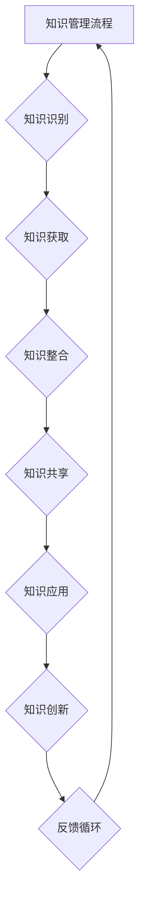

                 

### 《知识管理：个人和组织的智力资本》

> **关键词：知识管理、知识共享、知识创新、智力资本、个人知识管理、组织知识管理**

> **摘要：**
本文旨在探讨知识管理的重要性及其在个人和组织层面的应用。通过对知识管理基础、知识管理理论、知识管理技术、个人知识管理策略、组织知识管理策略等多个方面的详细分析，本文旨在为读者提供一个全面、系统的知识管理体系，帮助个人和组织更好地管理其智力资本，提升竞争力。

### 目录大纲

- **第一部分：知识管理基础**
  - **第1章：知识管理概述**
  - **第2章：知识管理理论**
  - **第3章：知识管理技术**

- **第二部分：个人知识管理**
  - **第4章：个人知识管理策略**
  - **第5章：个人知识管理工具应用**

- **第三部分：组织知识管理**
  - **第6章：组织知识管理策略**
  - **第7章：组织知识管理工具与系统**

- **第四部分：知识管理实践与创新**
  - **第8章：知识管理实践案例分析**
  - **第9章：知识管理方法论与发展**

- **第五部分：知识管理法律与伦理**
  - **第10章：知识管理法律与伦理**

- **附录：知识管理资源与工具集**

#### 第一部分：知识管理基础

##### 第1章：知识管理概述

- **1.1 知识管理的定义与历史发展**

知识管理（Knowledge Management，简称KM）是指通过各种方法和工具，系统地识别、获取、整合、共享、应用和创造知识，以最大化个人和组织智力资本的过程。知识管理的历史可以追溯到20世纪80年代，当时企业开始意识到知识作为竞争优势的重要性，并开始探索如何有效地管理和利用知识。

- **1.2 知识管理的核心概念**

知识管理的核心概念包括知识类型、知识生命周期、知识共享和知识创新。

- **1.3 知识管理的框架与模型**

常见的知识管理框架和模型包括SECI模型、知识螺旋模型和知识资产模型。这些模型提供了对知识管理过程的系统理解和指导。

- **1.4 知识管理的重要性**

知识管理对于个人和组织来说至关重要。它能够提高工作效率、创新能力和竞争力，是现代企业和个人不可或缺的一部分。

##### 第2章：知识管理理论

- **2.1 知识管理的理论基础**

知识管理的理论基础包括知识生命周期理论、社会建构主义和资源基础观。这些理论为知识管理的实践提供了理论支持。

- **2.2 知识类型**

知识类型分为显性知识和隐性知识。显性知识是指可以通过文字、图表等形式明确表达的知识，而隐性知识则是指难以用语言描述的、嵌入在个人经验中的知识。

- **2.3 知识资产**

知识资产是个人和组织拥有的知识资源，包括专利、商标、技术秘密等。有效管理知识资产可以提高企业竞争力和创新能力。

##### 第3章：知识管理技术

- **3.1 知识管理工具与技术**

知识管理工具包括数据库、知识库、数据挖掘和数据分析技术。这些工具可以帮助个人和组织更好地管理知识。

- **3.2 知识共享与知识创新**

知识共享是知识管理的重要环节，可以通过建立知识共享平台、促进员工协作等方式实现。知识创新则是在知识共享的基础上，通过创新思维和方法创造新的知识。

#### 第二部分：个人知识管理

##### 第4章：个人知识管理策略

- **4.1 个人知识管理的原则与方法**

个人知识管理的原则包括系统化、持续性、适应性等。个人知识管理的方法包括构建个人知识库、制定个人学习计划等。

- **4.2 个人知识资产**

个人知识资产是个人拥有的知识资源，包括专业技能、工作经验等。有效管理个人知识资产可以提高个人竞争力和职业发展。

- **4.3 个人知识创新**

个人知识创新是在个人知识积累的基础上，通过学习、思考和创造，形成新的知识。个人知识创新可以提升个人思维能力和创新能力。

##### 第5章：个人知识管理工具应用

- **5.1 个人知识管理工具介绍**

个人知识管理工具包括知识管理软件、个人知识管理APP和知识管理平台。这些工具可以帮助个人更好地管理知识。

- **5.2 个人知识管理案例分析**

通过对个人知识管理成功的案例分析，可以了解如何有效应用个人知识管理工具和方法。

#### 第三部分：组织知识管理

##### 第6章：组织知识管理策略

- **6.1 组织知识管理的原则与方法**

组织知识管理的原则包括系统性、战略性、持续性和创新性。组织知识管理的方法包括建立知识管理体系、制定知识管理政策等。

- **6.2 组织知识资产管理**

组织知识资产管理包括识别、评估、保护和利用知识资产。有效管理组织知识资产可以提高企业竞争力和创新能力。

- **6.3 组织知识管理文化建设**

组织知识管理文化建设是知识管理的重要组成部分，包括营造知识共享氛围、建立知识共享机制等。

##### 第7章：组织知识管理工具与系统

- **7.1 知识管理工具选择与实施**

选择合适的知识管理工具是组织知识管理成功的关键。实施知识管理工具需要制定详细的实施计划，并考虑工具的集成与优化。

- **7.2 组织知识管理案例分析**

通过对组织知识管理成功的案例分析，可以了解如何有效应用知识管理工具和系统。

#### 第四部分：知识管理实践与创新

##### 第8章：知识管理实践案例分析

- **8.1 知识管理实践方法**

知识管理实践方法包括项目规划、实施和评估。通过案例分析，可以了解如何有效地实施知识管理实践。

- **8.2 知识管理创新趋势与未来**

知识管理创新趋势包括人工智能、区块链技术等。未来知识管理将更加智能化、数字化和全球化。

##### 第9章：知识管理方法论与发展

- **9.1 知识管理方法论**

知识管理方法论包括知识识别、获取、整合、共享、创新和应用。通过方法论，可以系统地管理知识。

- **9.2 知识管理发展趋势**

知识管理发展趋势包括与企业数字化转型结合、与社会治理结合、国际合作等方面。未来知识管理将更加多元化、综合化和全球化。

#### 第五部分：知识管理法律与伦理

##### 第10章：知识管理法律与伦理

- **10.1 知识管理法律问题**

知识管理涉及的法律问题包括知识产权保护、隐私保护、数据安全与合规等。需要通过法律手段保护企业和个人的合法权益。

- **10.2 知识管理伦理问题**

知识管理伦理问题包括知识共享与竞争、知识滥用与责任等。需要建立伦理准则，规范知识管理行为。

##### 附录：知识管理资源与工具集

- **附录 A：知识管理相关工具**

知识管理相关工具包括知识管理软件、知识管理数据库、知识管理研究机构和知识管理相关工具。

- **附录 B：知识管理案例分析**

知识管理案例分析包括成功案例和失败案例。通过案例分析，可以了解知识管理的实际应用效果。

### 《知识管理：个人和组织的智力资本》

> **作者：AI天才研究院/AI Genius Institute & 禅与计算机程序设计艺术 /Zen And The Art of Computer Programming**

### 第一部分：知识管理基础

#### 第1章：知识管理概述

##### 1.1 知识管理的定义与历史发展

知识管理（Knowledge Management，简称KM）是一种系统性方法，旨在通过识别、获取、整合、共享和应用知识，以最大化个人和组织智力资本。知识管理的概念起源于20世纪80年代，当时企业开始意识到知识作为竞争优势的重要性。最初的知识管理实践主要集中在企业内部的知识共享和知识库的建设。随着时间的推移，知识管理的理论和实践不断发展和完善。

知识管理的定义有多种解释，但其核心思想是一致的，即通过有效的管理和利用知识，提高个人和组织的效能。根据国际知识管理协会（IKM）的定义，知识管理是“通过使用信息技术、过程和战略，从个人和组织中获取知识，并将其应用于改进决策和行动的过程。”

知识管理的历史发展可以分为以下几个阶段：

1. **早期阶段（1980年代）**：这个阶段主要关注知识的记录和存储，通过文档管理和数据库技术来提高知识的可访问性。

2. **知识共享阶段（1990年代）**：随着互联网和电子邮件等技术的普及，知识共享成为知识管理的重要方面。这个阶段强调了员工之间的交流和协作，以促进知识的流动。

3. **知识集成阶段（2000年代）**：知识管理开始将信息技术和业务流程结合起来，通过建立知识管理系统，实现知识的集成和自动化。

4. **知识创新阶段（2010年代至今）**：随着人工智能、大数据和云计算等新兴技术的应用，知识管理进一步扩展到知识创新，通过数据分析和机器学习等技术，从大量数据中提取新的知识和洞察。

##### 1.2 知识管理的核心概念

知识管理的核心概念包括知识类型、知识生命周期、知识共享和知识创新。

1. **知识类型**：

知识可以分为显性知识和隐性知识。

- **显性知识**：指可以用文字、图表、图像等明确表达的知识。例如，文档、数据库、专利等。
- **隐性知识**：指难以用语言描述的、嵌入在个人经验中的知识。例如，个人的技能、直觉、工作经验等。

2. **知识生命周期**：

知识生命周期描述了知识从创建到消亡的整个过程。通常包括以下几个阶段：

- **知识创造**：通过学习、研究、经验积累等方式创造新知识。
- **知识存储**：将知识存储在数据库、文档、知识库等工具中。
- **知识共享**：通过知识共享平台、会议、协作等方式，使知识在组织内或组织间流动。
- **知识应用**：将知识应用于实际工作，提高效率和创新能力。
- **知识更新**：随着环境变化，知识需要不断更新和迭代。

3. **知识共享**：

知识共享是指将知识从一个人或组织传递到另一个人或组织的过程。知识共享的有效性对知识管理至关重要。知识共享的方式包括：

- **正式共享**：通过文档、报告、知识库等正式渠道进行共享。
- **非正式共享**：通过日常交流、协作、社交网络等非正式渠道进行共享。

4. **知识创新**：

知识创新是指通过重新组合现有的知识，创造出新的知识。知识创新是知识管理的高级阶段，它通过跨学科的融合、创新思维等方法，不断产生新的知识和价值。

##### 1.3 知识管理的框架与模型

知识管理框架和模型提供了对知识管理过程的系统理解和指导。以下是一些常见的知识管理框架和模型：

1. **SECI模型**：

SECI模型由Ishikawa Nonaka和Hirotaka Takeuchi提出，代表了知识转化的四个过程：社会化（Socialization）、外化（Externalization）、融合（Combination）和内化（Internalization）。

- **社会化**：通过直接的交流和互动，隐性知识转化为显性知识。
- **外化**：将隐性知识通过语言、文字等显性化，形成概念和模型。
- **融合**：将新知识整合到现有的知识体系中。
- **内化**：通过实践和应用，新的显性知识转化为隐性知识。

2. **知识螺旋模型**：

知识螺旋模型描述了知识在组织中的螺旋上升过程。每个螺旋周期都包括知识创造、知识共享、知识应用和知识反馈四个阶段。

3. **知识资产模型**：

知识资产模型将知识视为组织的资产，包括知识资产识别、评估、保护和应用等方面。这个模型强调了知识资产的重要性，以及如何有效地管理和利用知识资产。

##### 1.4 知识管理的重要性

知识管理对于个人和组织来说至关重要。以下是从不同角度分析知识管理的重要性：

1. **提高工作效率**：

知识管理通过系统化地管理和利用知识，减少了员工在寻找信息、解决问题和决策上的时间成本。员工可以快速访问所需的显性知识，同时通过知识共享和协作，隐性知识也可以被充分利用。

2. **增强创新能力**：

知识创新是知识管理的高级阶段，通过跨学科的融合、创新思维等方法，不断产生新的知识和价值。知识管理提供了创新的基础，促进了组织内部的创新文化和创新能力。

3. **提升竞争力**：

知识管理使组织能够更好地应对外部环境的变化，快速响应市场需求。通过有效地管理和利用知识资产，组织可以在竞争中获得优势。

4. **促进团队协作**：

知识管理通过建立知识共享平台和协作机制，促进了团队成员之间的交流和合作。团队成员可以共享经验和最佳实践，提高整体团队的工作效率。

5. **支持持续学习**：

知识管理鼓励员工不断学习和成长。通过知识共享和知识创新，员工可以不断更新和扩展自己的知识体系，提升个人和组织的竞争力。

##### 1.5 知识管理的应用领域

知识管理在许多领域都有广泛的应用，以下是其中一些重要的应用领域：

1. **企业**：企业通过知识管理可以提高员工的工作效率，促进创新，提高客户满意度，从而提升企业的竞争力。

2. **政府**：政府通过知识管理可以提高公共服务的效率和质量，促进政府决策的科学性和透明度。

3. **教育**：教育机构通过知识管理可以优化课程设计，提高教学质量，促进师生之间的知识共享和创新。

4. **医疗**：医疗行业通过知识管理可以提高诊断和治疗的准确性，提高医疗服务质量，促进医学研究的发展。

5. **科研**：科研机构通过知识管理可以加速科研成果的转化和应用，提高科研效率，促进科技发展。

#### 第2章：知识管理理论

##### 2.1 知识管理的理论基础

知识管理理论是知识管理实践的理论基础，主要包括知识生命周期理论、社会建构主义和资源基础观。这些理论从不同角度对知识管理进行了深入探讨，为知识管理的实践提供了理论支持。

1. **知识生命周期理论**

知识生命周期理论认为，知识像其他资源一样，有其生命周期，包括知识创造、知识传播、知识共享和知识应用等阶段。每个阶段都有其特定的任务和挑战，需要采取相应的管理策略。

- **知识创造**：通过学习、研究、创新等过程，创造新的知识。
- **知识传播**：通过教育、培训、知识共享平台等手段，将知识传播给相关人员。
- **知识共享**：通过建立协作机制、知识共享平台等，促进知识在组织内外的流动。
- **知识应用**：将知识应用于实际工作，提高工作效率和创新能力。

2. **社会建构主义**

社会建构主义认为，知识是通过社会互动和协作而产生的，而不是由个体独立创造的。社会建构主义强调了知识的社会性和情境性，认为知识是在特定的社会和文化背景下形成的。

- **知识的社会性**：知识是社会互动的产物，需要通过交流、协作和共享来实现知识的传递和创造。
- **知识的情境性**：知识是在特定的社会和文化情境中产生的，不同的情境会导致不同的知识形态和认知方式。

3. **资源基础观**

资源基础观认为，企业的竞争优势来源于其独特的资源和能力。知识作为一种重要的资源，对于企业的竞争力和创新能力具有决定性作用。资源基础观强调了知识资产的识别、评估和保护，以及知识在组织中的有效利用。

- **知识资产的识别**：通过系统化的方法，识别和确定组织内部的知识资产。
- **知识资产的评价**：对知识资产进行评价，确定其价值和潜在的影响。
- **知识资产的保护**：通过法律、技术和管理手段，保护知识资产的安全和完整性。
- **知识资产的应用**：将知识资产应用于组织的运营、创新和战略规划，提高组织的竞争力和创新能力。

##### 2.2 知识类型

知识类型是知识管理中的重要概念，根据知识的表现形式和特点，可以将知识分为显性知识和隐性知识。

1. **显性知识**

显性知识是指可以用文字、图表、图像等形式明确表达的知识。显性知识通常可以通过文档、数据库、报告等工具进行存储和传播。显性知识的特点是易于标准化、共享和传播。

- **文档化知识**：通过文档、报告、手册等形式记录的知识。
- **数据库知识**：存储在数据库中的知识，如客户信息、产品数据等。
- **结构化知识**：以结构化数据形式存在的知识，如数据表、图表等。

2. **隐性知识**

隐性知识是指难以用语言描述的、嵌入在个人经验中的知识。隐性知识通常是个体通过长期的实践和经验积累形成的，难以用文字或图表明确表达。隐性知识的特点是难以标准化、共享和传播。

- **个人技能**：个人的专业技能、操作技巧和经验。
- **直觉**：个人基于经验形成的直觉和判断能力。
- **情境知识**：在特定情境下形成的知识，如个人在工作中的特定情境下的应对策略。

##### 2.3 知识资产

知识资产是个人和组织拥有的知识资源，包括显性知识和隐性知识。有效管理知识资产可以提高个人和组织的竞争力和创新能力。知识资产可以分为以下几类：

1. **人力资源**

人力资源是组织中最宝贵的知识资产。员工的知识、技能、经验和创造力是组织持续发展的关键。有效的人力资源管理包括员工培训、知识共享和激励措施。

2. **技术知识**

技术知识是组织在技术研发、产品开发、生产运营等方面积累的知识。技术知识包括专利、技术秘密、产品设计文档、研发报告等。技术知识的管理包括知识识别、评估、保护和共享。

3. **客户知识**

客户知识是组织在客户关系管理、市场营销、服务等方面积累的知识。客户知识包括客户需求、偏好、反馈、市场趋势等。有效管理客户知识可以帮助组织更好地满足客户需求，提高客户满意度。

4. **市场知识**

市场知识是组织在市场竞争、市场调研、市场预测等方面积累的知识。市场知识包括市场趋势、竞争对手分析、客户分析等。有效管理市场知识可以帮助组织制定更有效的市场策略。

##### 2.4 知识价值链

知识价值链描述了知识从创造到应用，以及在不同环节中产生的价值。知识价值链包括以下几个环节：

1. **知识创造**：通过学习、研究、创新等方式创造新知识。知识创造是知识价值链的基础，决定了知识的数量和质量。

2. **知识存储**：将创造的新知识存储在知识库、数据库、文档等工具中。知识存储是知识价值链的中继环节，确保了知识的可持续利用。

3. **知识共享**：通过知识共享平台、会议、培训等方式，使知识在组织内或组织间流动。知识共享是知识价值链的关键环节，促进了知识的传播和利用。

4. **知识应用**：将知识应用于实际工作，提高工作效率和创新能力。知识应用是知识价值链的最终环节，实现了知识的价值转化。

5. **知识创新**：在知识应用的过程中，通过创新思维和方法，不断产生新的知识。知识创新是知识价值链的延伸，推动了知识的持续创造和迭代。

##### 2.5 知识管理流程

知识管理流程是知识管理实践的基本框架，包括知识识别、知识获取、知识整合、知识共享、知识应用和知识创新等环节。

1. **知识识别**：通过系统化的方法，识别组织内部和外部的重要知识。知识识别是知识管理流程的第一步，决定了知识管理的方向和范围。

2. **知识获取**：通过多种渠道获取知识，包括内部知识库、外部数据库、合作伙伴、专家等。知识获取是知识管理流程的关键环节，确保了知识的充分性和准确性。

3. **知识整合**：将获取的知识进行整合和分类，使其具有更高的利用价值。知识整合是知识管理流程的中继环节，提高了知识的组织性和可用性。

4. **知识共享**：通过知识共享平台、会议、培训等方式，促进知识的传播和利用。知识共享是知识管理流程的核心环节，实现了知识的最大化利用。

5. **知识应用**：将知识应用于实际工作，提高工作效率和创新能力。知识应用是知识管理流程的关键环节，实现了知识的价值转化。

6. **知识创新**：在知识应用的过程中，通过创新思维和方法，不断产生新的知识。知识创新是知识管理流程的延伸，推动了知识的持续创造和迭代。

#### 第3章：知识管理技术

##### 3.1 知识管理工具与技术

知识管理工具和技术是实现知识管理目标的重要手段。这些工具和技术可以帮助个人和组织有效地识别、获取、整合、共享和应用知识。以下介绍几种常见的知识管理工具和技术。

1. **数据库与知识库**

数据库是知识管理的基础工具，用于存储和管理大量的数据。知识库是在数据库的基础上，专门为知识管理设计的工具，用于存储和管理显性知识。知识库通常包含以下功能：

- **知识存储**：将知识以结构化或半结构化的形式存储在数据库中，便于检索和使用。
- **知识分类**：对知识进行分类和标签，便于知识检索和浏览。
- **知识搜索**：提供强大的搜索功能，帮助用户快速找到所需的知识。
- **知识共享**：支持知识共享和协作，促进知识在组织内的传播和利用。

2. **数据挖掘与数据分析**

数据挖掘和数据分析是知识管理的重要组成部分，通过对大量数据进行分析和挖掘，可以发现潜在的知识和价值。数据挖掘和数据分析技术包括：

- **数据清洗**：对原始数据进行清洗和预处理，去除无效数据和噪声。
- **数据探索**：通过可视化、统计等方法，对数据进行初步探索和分析。
- **特征提取**：从数据中提取关键特征，用于建模和分析。
- **建模与预测**：使用机器学习、统计分析等方法，建立预测模型和决策支持系统。

3. **知识图谱与语义网**

知识图谱和语义网是知识管理的高级技术，用于表示和管理复杂的知识结构和关系。知识图谱是通过网络图的方式，将知识实体和实体之间的关系进行结构化表示。语义网则是通过语义分析，将文本数据转化为结构化的知识表示。

- **知识图谱**：用于表示和存储复杂的知识结构，支持知识检索和推理。
- **语义网**：通过语义分析，实现文本数据的自动化处理和知识提取。

4. **协作工具与平台**

协作工具和平台是知识管理的重要工具，用于促进员工之间的协作和知识共享。常见的协作工具包括电子邮件、即时通讯、视频会议等。协作平台则是一个集成的环境，支持多人协作、知识共享和项目管理等。

- **电子邮件**：用于发送和接收消息，进行异步协作。
- **即时通讯**：用于实时沟通和协作，支持文字、语音、视频等多种方式。
- **视频会议**：用于远程协作和会议，支持多人同时参与。
- **协作平台**：集成多种协作工具，支持项目管理和团队协作。

##### 3.2 知识共享与知识创新

知识共享和知识创新是知识管理的核心目标。有效的知识共享和知识创新可以提高组织的知识管理水平，促进组织的创新能力和竞争力。以下介绍知识共享和知识创新的方法和策略。

1. **知识共享机制**

知识共享机制是促进知识在组织内流动和利用的重要手段。常见的知识共享机制包括：

- **知识共享平台**：提供一个集中的知识共享空间，支持知识发布、搜索和共享。
- **知识共享政策**：制定明确的知识共享规则和政策，鼓励员工分享知识和经验。
- **知识共享激励**：通过奖励和激励措施，鼓励员工积极参与知识共享。
- **知识共享培训**：提供知识共享的培训和指导，提高员工的知识共享意识和能力。

2. **知识创新过程**

知识创新过程是知识管理的重要环节，通过创新思维和方法，不断产生新的知识和价值。常见的知识创新过程包括：

- **头脑风暴**：通过集体讨论和思维碰撞，产生新的创意和想法。
- **跨学科合作**：通过跨学科的合作，整合不同领域的知识和经验，促进知识创新。
- **知识迭代**：通过不断迭代和改进，完善和优化已有知识，实现知识创新。
- **知识转化**：将知识转化为实际应用，实现知识的价值转化。

3. **知识创新策略**

知识创新策略是促进知识创新的重要手段。以下是一些常见的知识创新策略：

- **开放式创新**：通过开放创新，吸收外部知识和技术，促进组织内部的知识创新。
- **知识竞赛**：通过组织知识竞赛，激发员工的创新思维和创造力，促进知识创新。
- **技术创新**：通过技术创新，不断探索和引入新技术，推动组织的知识创新。
- **文化创新**：通过营造创新文化，鼓励员工敢于尝试和失败，推动知识创新。

##### 3.3 知识共享与知识创新的案例分析

以下通过两个案例，介绍知识共享和知识创新的实践。

1. **案例一：谷歌的知识共享文化**

谷歌以其开放的知识共享文化而著称。谷歌内部设有多个知识共享平台，如谷歌文档、谷歌知识库等，支持员工随时随地共享和获取知识。此外，谷歌还鼓励员工参与开源项目，将内部的知识和技术贡献给社区。这种开放的知识共享文化，不仅促进了谷歌内部的创新，也为谷歌赢得了广泛的社会声誉。

2. **案例二：3M公司的知识创新策略**

3M公司以其创新产品和知识创新文化而闻名。3M公司采用“15%项目”策略，允许员工将15%的工作时间用于探索个人兴趣和创新项目。这种策略激发了员工的知识创新活力，产生了许多优秀的产品和创新成果，如透明胶带、思高牌清洁布等。3M公司还通过跨部门合作和知识共享平台，促进员工之间的知识交流和协作，进一步推动了知识创新。

#### 第4章：个人知识管理策略

##### 4.1 个人知识管理的原则与方法

个人知识管理（Personal Knowledge Management，简称PKM）是指个人通过系统化的方法，识别、获取、整合、共享和应用知识，以提高个人工作效率、创新能力和职业发展。个人知识管理原则包括以下几方面：

1. **系统性**：个人知识管理应具备系统性，涵盖知识的识别、获取、整合、共享和应用等各个环节。

2. **持续性**：个人知识管理是一个持续的过程，需要长期坚持和不断优化。

3. **适应性**：个人知识管理应具备适应性，能够根据个人需求和外部环境的变化进行调整。

4. **实用性**：个人知识管理应以实用为导向，注重知识的实际应用和效果。

个人知识管理的方法包括以下几个方面：

1. **知识识别**：通过自我反思和外界反馈，识别个人所拥有的知识和技能。

2. **知识获取**：通过阅读、学习、实践等方式，获取新的知识和技能。

3. **知识整合**：将获取的知识进行整合和分类，形成个人知识体系。

4. **知识共享**：通过博客、社交媒体、研讨会等形式，与他人分享知识和经验。

5. **知识应用**：将知识应用于实际工作，提高个人工作效率和创新成果。

##### 4.2 个人知识库的构建

个人知识库（Personal Knowledge Base，简称PKB）是个人知识管理的重要工具，用于存储、管理和利用个人知识。构建个人知识库的步骤如下：

1. **确定知识库需求**：根据个人工作和学习需求，确定需要存储的知识类型和范围。

2. **选择知识库工具**：根据需求选择合适的知识库工具，如文档管理软件、笔记应用、知识管理平台等。

3. **设计知识库结构**：设计知识库的目录结构和分类体系，确保知识的有序存储和便捷检索。

4. **输入和整理知识**：将个人的知识和信息输入到知识库中，进行分类和整理。

5. **定期更新和维护**：定期更新和维护知识库，确保知识的时效性和准确性。

6. **知识库备份与安全**：对知识库进行备份，并采取安全措施，防止数据丢失和泄露。

##### 4.3 个人知识共享与传播

个人知识共享与传播是个人知识管理的重要环节，通过共享和传播知识，可以实现知识的增值和传播。个人知识共享与传播的方法包括：

1. **内部共享**：

- **团队内部**：通过团队会议、内部邮件、协作平台等形式，与团队成员共享知识和经验。
- **组织内部**：通过内部知识库、内部培训、内部论坛等形式，与组织内部员工共享知识和经验。

2. **外部共享**：

- **社交媒体**：通过博客、微博、知乎等社交媒体平台，分享个人知识和经验。
- **专业社区**：通过专业论坛、研讨会、学术会议等形式，与行业专家和同行交流知识。
- **公开课程**：通过线上或线下课程，传授个人知识和技能。

##### 4.4 个人知识创新

个人知识创新是个人知识管理的最高阶段，通过创新思维和方法，不断产生新的知识和价值。个人知识创新的方法包括：

1. **头脑风暴**：通过集体讨论和思维碰撞，激发创新思维。

2. **跨学科学习**：学习跨学科知识，整合不同领域的知识和经验。

3. **实践与反思**：通过实践和反思，不断改进和优化已有知识。

4. **案例研究**：通过案例研究，分析成功和失败的经验，提取有价值的知识。

5. **技术创新**：通过技术创新，开发新的产品和服务。

##### 4.5 个人知识管理技巧

以下是一些个人知识管理技巧，帮助个人更好地管理知识：

1. **时间管理**：合理安排时间，确保有足够的时间进行知识获取和整理。

2. **学习策略**：采用有效的学习策略，提高学习效率。

3. **信息过滤**：学会筛选和过滤信息，避免信息过载。

4. **笔记整理**：及时整理笔记，形成知识体系。

5. **知识共享**：积极参与知识共享和传播，扩大知识影响力。

6. **知识创新**：鼓励创新思维，不断产生新的知识。

#### 第5章：个人知识管理工具应用

##### 5.1 个人知识管理工具介绍

个人知识管理工具是个人知识管理的重要支持，可以帮助个人有效地识别、获取、整合、共享和应用知识。以下介绍几种常见的个人知识管理工具：

1. **OneNote**

OneNote是一款由微软开发的笔记应用程序，适用于Windows、Mac、iOS和Android平台。OneNote提供了丰富的笔记功能，包括文本、图像、音频、视频等多种形式。用户可以创建多个笔记本，对笔记进行分类和整理，方便查找和管理。OneNote还支持云存储，用户可以在不同设备之间同步笔记。

2. **Evernote**

Evernote是一款全球知名的笔记和任务管理应用，适用于Windows、Mac、iOS和Android平台。Evernote提供了强大的笔记功能，用户可以创建文本、图像、音频、视频等笔记，并可以对笔记进行分类、标签和搜索。Evernote还支持云存储，用户可以在不同设备之间同步笔记，实现跨平台的协作。

3. **Notion**

Notion是一款多功能的笔记和管理应用，适用于Windows、Mac、iOS和Android平台。Notion集成了笔记、任务管理、数据库和看板等多种功能，用户可以创建笔记、任务、数据库和看板等，实现个人知识管理的多种需求。Notion还支持自定义布局和视图，用户可以根据个人需求进行灵活配置。

4. **TiddlyWiki**

TiddlyWiki是一款基于HTML和JavaScript的开源笔记应用，适用于所有支持HTML5的浏览器。TiddlyWiki的特点是轻量级、便携性和可扩展性。用户可以通过创建“tiddlers”（类似于笔记条目）来记录和管理知识，TiddlyWiki支持标签、分类和链接，用户可以方便地组织和查找所需的信息。

##### 5.2 个人知识管理工具选择与评估

选择合适的个人知识管理工具是个人知识管理成功的关键。以下从几个方面介绍个人知识管理工具的选择和评估：

1. **需求分析**

首先，个人需要明确自己的知识管理需求，包括知识类型、知识管理目标、使用场景等。例如，如果需要处理大量的图像和音频文件，可以选择支持多媒体功能的笔记应用。

2. **功能比较**

在了解个人需求后，可以对不同知识管理工具的功能进行比较。比较的内容包括笔记功能、分类和搜索功能、同步和共享功能、扩展性和可定制性等。选择功能强大、灵活可定制、符合个人需求的工具。

3. **用户体验**

用户体验是选择知识管理工具的重要因素。用户需要考虑工具的界面设计、操作流程、响应速度等。一个直观、易用、流畅的工具可以提高个人知识管理的效率。

4. **安全性**

知识管理工具需要保证知识的安全性和隐私性。用户需要了解工具的数据存储方式、备份策略和权限设置，确保知识不被未经授权的人员访问。

5. **评价和推荐**

用户可以参考其他用户的评价和推荐，了解工具的优缺点和使用体验。同时，用户可以在社交媒体、论坛等平台上提问和交流，获取更多关于工具的信息。

##### 5.3 个人知识管理工具使用案例

以下通过两个案例，介绍个人知识管理工具的使用场景和效果。

1. **案例一：使用OneNote进行个人知识管理**

张先生是一名软件工程师，他经常需要记录工作笔记、整理项目文档和总结开发经验。张先生选择使用OneNote作为个人知识管理工具。他在OneNote中创建了多个笔记本，分别用于记录工作笔记、项目文档和个人学习笔记。通过OneNote的云存储功能，张先生可以在家中、办公室和外出时随时随地访问和更新他的笔记。此外，OneNote的标签和搜索功能帮助他快速找到所需的信息，提高了工作效率。

2. **案例二：使用Evernote进行知识共享和传播**

李女士是一名大学教师，她经常在课堂上向学生传授知识和经验。李女士选择使用Evernote作为个人知识管理工具。她通过Evernote创建了一个知识共享笔记本，将课堂讲义、参考资料和优秀案例分享给学生。学生在学习过程中可以方便地查阅和下载相关资料，提高了学习效果。此外，李女士还通过Evernote的公开链接功能，将知识共享给其他教师和同行，促进了知识的传播和交流。

#### 第6章：组织知识管理策略

##### 6.1 组织知识管理的原则与方法

组织知识管理（Organizational Knowledge Management，简称OKM）是指通过系统化的方法，识别、获取、整合、共享和应用知识，以提高组织的效能和创新能力。组织知识管理原则包括以下几方面：

1. **系统性**：组织知识管理应具备系统性，涵盖知识管理的各个环节，包括知识识别、获取、整合、共享和应用。

2. **战略性**：组织知识管理应与组织的战略目标相一致，为组织的长期发展提供支持。

3. **持续性**：组织知识管理是一个持续的过程，需要长期坚持和不断优化。

4. **适应性**：组织知识管理应具备适应性，能够根据组织的需求和环境的变化进行调整。

5. **协作性**：组织知识管理强调员工之间的协作和知识共享，通过团队合作实现知识的最大化利用。

组织知识管理的方法包括以下几个方面：

1. **知识识别**：通过调查、访谈、问卷调查等方法，识别组织内部和外部的重要知识。

2. **知识获取**：通过内部培训、外部学习、合作伙伴等方式，获取新的知识和技能。

3. **知识整合**：将获取的知识进行整合和分类，形成组织的知识体系。

4. **知识共享**：通过建立知识共享平台、知识共享政策、知识共享激励等机制，促进知识的传播和利用。

5. **知识应用**：将知识应用于组织的实际工作，提高工作效率和创新成果。

6. **知识创新**：通过创新思维和方法，不断产生新的知识和价值。

##### 6.2 组织知识资产管理

组织知识资产管理（Knowledge Asset Management，简称KAM）是指对组织内部的知识资源进行有效识别、评估、保护和利用的过程。组织知识资产管理包括以下方面：

1. **知识资产识别**：通过调查、访谈、问卷调查等方法，识别组织内部的知识资产，包括人力资源、技术知识、客户知识、市场知识等。

2. **知识资产评估**：对知识资产进行评估，确定其价值和潜在的影响。评估内容包括知识的质量、重要性、使用频率等。

3. **知识资产保护**：通过法律、技术和管理手段，保护知识资产的安全和完整性。包括知识产权保护、数据加密、访问控制等。

4. **知识资产利用**：将知识资产应用于组织的实际工作，提高工作效率和创新成果。包括知识共享、知识培训、知识应用等。

##### 6.3 组织知识管理文化建设

组织知识管理文化建设是组织知识管理的重要组成部分，旨在营造知识共享、创新和学习的氛围。组织知识管理文化建设包括以下几个方面：

1. **知识共享文化**：鼓励员工分享知识和经验，建立知识共享平台和机制，促进知识的流动和利用。

2. **创新文化**：鼓励员工勇于创新，提供创新激励和支持，营造创新氛围，推动组织知识的不断创新。

3. **学习文化**：倡导持续学习，提供学习机会和资源，鼓励员工不断学习和成长，提升个人和组织的知识水平。

4. **合作文化**：强调团队合作，建立跨部门、跨领域的协作机制，促进员工之间的交流和合作。

5. **责任文化**：明确知识管理中的责任归属，建立责任体系，确保知识管理活动的有效实施。

##### 6.4 组织知识管理策略案例分析

以下通过两个案例，分析组织知识管理策略的有效实施。

1. **案例一：谷歌的组织知识管理**

谷歌以其卓越的组织知识管理而闻名。谷歌通过以下策略实施组织知识管理：

- **知识共享平台**：谷歌内部设有多个知识共享平台，如谷歌文档、谷歌知识库等，支持员工随时随地共享和获取知识。
- **知识共享政策**：谷歌制定了一系列知识共享政策，鼓励员工分享知识和经验，提供知识共享激励措施。
- **知识创新机制**：谷歌鼓励员工参与开源项目，将内部的知识和技术贡献给社区，推动知识创新。
- **知识管理培训**：谷歌定期开展知识管理培训，提高员工的知识管理意识和能力。

2. **案例二：IBM的组织知识管理**

IBM作为全球知名的技术企业，其组织知识管理策略具有代表性。IBM通过以下策略实施组织知识管理：

- **知识识别与评估**：IBM通过调查和评估，识别组织内部的知识资产，并对其进行分类和评估。
- **知识共享平台**：IBM建立了内部知识共享平台，支持员工之间的知识交流和协作。
- **知识创新项目**：IBM设立了一系列知识创新项目，鼓励员工参与，推动知识的创造和应用。
- **知识管理文化建设**：IBM倡导知识共享、创新和学习文化，营造良好的知识管理氛围。

#### 第7章：组织知识管理工具与系统

##### 7.1 知识管理工具选择与实施

选择合适的知识管理工具是组织知识管理成功的关键。以下从几个方面介绍组织知识管理工具的选择与实施：

1. **需求分析**

首先，组织需要明确知识管理的需求，包括知识类型、知识管理目标、使用场景等。例如，如果需要处理大量的图像和音频文件，可以选择支持多媒体功能的知识管理工具。

2. **功能比较**

在了解组织需求后，可以对不同知识管理工具的功能进行比较。比较的内容包括知识存储、分类和搜索功能、同步和共享功能、扩展性和可定制性等。选择功能强大、灵活可定制、符合组织需求的工具。

3. **用户体验**

用户体验是选择知识管理工具的重要因素。组织需要考虑工具的界面设计、操作流程、响应速度等。一个直观、易用、流畅的工具可以提高组织知识管理的效率。

4. **安全性**

知识管理工具需要保证知识的安全性和隐私性。组织需要了解工具的数据存储方式、备份策略和权限设置，确保知识不被未经授权的人员访问。

5. **实施规划**

在确定知识管理工具后，组织需要制定详细的实施规划，包括工具的部署、培训、测试和上线等。实施过程中需要充分考虑组织的实际情况和需求，确保知识管理工具的有效应用。

6. **评估与改进**

在知识管理工具实施后，组织需要定期评估工具的使用效果，收集用户反馈，发现问题和不足，进行改进和优化。通过持续改进，提高知识管理工具的应用效果。

##### 7.2 知识管理系统构建

知识管理系统（Knowledge Management System，简称KMS）是组织知识管理的重要工具，用于支持知识的识别、获取、整合、共享和应用。构建知识管理系统需要遵循以下步骤：

1. **需求分析与规划**

首先，组织需要明确知识管理系统的需求，包括功能需求、性能需求、安全性需求等。根据需求制定知识管理系统的建设方案和规划。

2. **系统设计**

在系统设计阶段，组织需要确定知识管理系统的架构、模块和功能。设计一个灵活、可扩展、易于维护的系统架构，确保知识管理系统可以满足组织的需求。

3. **技术选型**

在技术选型阶段，组织需要选择合适的数据库、开发框架、中间件等技术，确保知识管理系统的高性能、稳定性和安全性。

4. **系统开发与测试**

在系统开发阶段，组织需要按照设计方案和规划，开发知识管理系统的各个模块。开发过程中需要遵循良好的开发规范和标准，确保系统的质量。在开发完成后，进行全面的系统测试，确保系统的稳定性和可靠性。

5. **部署与培训**

在系统部署阶段，组织需要将知识管理系统部署到生产环境，并进行必要的配置和优化。同时，组织需要开展知识管理系统的培训，提高员工的知识管理意识和能力。

6. **上线与运营**

在系统上线后，组织需要持续运营和维护知识管理系统，确保系统的正常运行。同时，组织需要定期评估知识管理系统的使用效果，收集用户反馈，进行优化和改进。

##### 7.3 知识管理工具集成与优化

知识管理工具集成与优化是提高组织知识管理效率的重要手段。以下介绍知识管理工具集成与优化的方法和策略：

1. **集成规划**

在知识管理工具集成之前，组织需要制定详细的集成规划，明确各工具的集成目标、集成方式和技术方案。根据集成规划，逐步实现各工具的集成。

2. **数据集成**

数据集成是知识管理工具集成的重要组成部分。组织需要采用合适的数据集成技术，实现不同工具之间的数据同步和共享。常用的数据集成技术包括数据仓库、数据总线、API接口等。

3. **功能集成**

在功能集成方面，组织需要确保各知识管理工具的功能可以相互配合，实现知识的识别、获取、整合、共享和应用。例如，知识管理系统可以与电子邮件系统、即时通讯工具等集成，实现知识的自动推送和通知。

4. **用户体验优化**

用户体验优化是提高知识管理工具应用效果的关键。组织需要关注用户的需求和反馈，对知识管理工具进行界面优化、操作流程优化和性能优化，确保工具的易用性和高效性。

5. **系统集成测试**

在知识管理工具集成完成后，组织需要进行全面的系统集成测试，确保各工具之间的协同工作和数据一致性。系统集成测试包括功能测试、性能测试、安全测试等。

6. **持续优化与改进**

知识管理工具的集成与优化是一个持续的过程。组织需要定期评估知识管理工具的应用效果，收集用户反馈，发现问题和不足，进行持续优化和改进。通过不断优化，提高组织知识管理的效率和效果。

##### 7.4 组织知识管理案例分析

以下通过两个案例，分析组织知识管理的成功实践。

1. **案例一：华为的组织知识管理**

华为作为全球领先的信息与通信技术（ICT）解决方案供应商，其组织知识管理具有代表性。华为通过以下策略实施组织知识管理：

- **知识共享平台**：华为建立了内部知识共享平台，支持员工随时随地访问和共享知识。
- **知识管理培训**：华为定期开展知识管理培训，提高员工的知识管理意识和能力。
- **知识创新机制**：华为鼓励员工参与知识创新，提供创新激励和支持。
- **知识资产管理**：华为对知识资产进行有效识别、评估和保护，确保知识资产的安全和完整。

2. **案例二：宝洁的公司知识管理**

宝洁（P&G）作为全球知名的消费品公司，其组织知识管理经验丰富。宝洁通过以下策略实施组织知识管理：

- **知识共享平台**：宝洁建立了内部知识共享平台，支持员工之间的知识交流和协作。
- **知识管理流程**：宝洁制定了完善的知识管理流程，包括知识识别、获取、整合、共享和应用等。
- **知识创新项目**：宝洁设立了一系列知识创新项目，鼓励员工参与，推动知识的创造和应用。
- **知识管理文化建设**：宝洁倡导知识共享、创新和学习文化，营造良好的知识管理氛围。

#### 第8章：知识管理实践案例分析

##### 8.1 知识管理实践方法

知识管理实践方法是指在实际应用中，组织通过一系列具体步骤和方法来实施知识管理。以下介绍几种常见的知识管理实践方法：

1. **项目规划**

项目规划是知识管理实践的第一步，它包括确定知识管理的目标、范围、资源和时间计划。在项目规划阶段，组织需要明确知识管理的目的，制定具体的实施策略和计划，确保知识管理项目的顺利进行。

2. **需求分析**

需求分析是知识管理实践的关键环节，它涉及对组织内部和外部知识需求的调查和分析。通过需求分析，组织可以了解员工对知识的需求，识别关键知识领域，为后续的知识管理活动提供依据。

3. **知识识别**

知识识别是指通过系统化的方法，识别组织内部和外部的重要知识。知识识别包括对现有知识的整理、评估和分类，以及对新知识的获取和整合。知识识别是知识管理实践的基础，为后续的知识获取、整合和共享提供了支持。

4. **知识整合**

知识整合是指将识别的知识进行整合和分类，形成系统的知识体系。知识整合包括知识结构的设计、知识内容的整理和知识资源的配置。通过知识整合，组织可以确保知识的有序存储和高效利用。

5. **知识共享**

知识共享是指通过建立知识共享平台和机制，促进知识的传播和利用。知识共享可以采取多种形式，如内部论坛、知识库、研讨会、培训等。通过知识共享，组织可以提高员工的知识水平和创新能力。

6. **知识应用**

知识应用是指将知识应用于组织的实际工作，提高工作效率和创新成果。知识应用包括知识在项目中的运用、知识在决策中的支持、知识在产品开发中的应用等。通过知识应用，组织可以实现知识的价值转化。

7. **知识创新**

知识创新是指通过创新思维和方法，不断产生新的知识和价值。知识创新可以采取多种形式，如头脑风暴、跨学科合作、开放式创新等。通过知识创新，组织可以持续提升知识管理水平，增强竞争力。

##### 8.2 知识管理实施步骤

知识管理实施步骤是指在实际操作中，组织按照一定的流程和步骤来实施知识管理。以下介绍知识管理实施的常见步骤：

1. **制定知识管理计划**

首先，组织需要制定知识管理计划，明确知识管理的目标、范围、资源和时间安排。知识管理计划应包括知识管理的整体目标、具体实施策略、责任人分配和资源需求等。

2. **组建知识管理团队**

知识管理团队是知识管理实施的核心力量，负责知识管理的具体实施和协调。知识管理团队应包括知识管理专家、技术支持人员、业务部门代表等，以确保知识管理计划的顺利实施。

3. **需求分析与规划**

在知识管理计划制定后，组织需要进行需求分析和规划，明确知识管理的具体需求和实施策略。需求分析应包括对组织内部和外部知识需求的调查和分析，以及知识管理工具和系统的选择。

4. **知识识别与整合**

在需求分析的基础上，组织需要对现有知识进行识别和整合，形成系统的知识体系。知识识别包括对现有知识的整理、评估和分类，以及对新知识的获取和整合。知识整合包括知识结构的设计、知识内容的整理和知识资源的配置。

5. **知识共享与传播**

建立知识共享平台和机制，促进知识的传播和利用。知识共享平台应提供知识发布、搜索、分类和评论等功能，支持多种形式的知识共享。同时，组织应通过培训、研讨会、论坛等形式，加强知识传播和交流。

6. **知识应用与反馈**

将知识应用于组织的实际工作，提高工作效率和创新成果。知识应用包括知识在项目中的运用、知识在决策中的支持、知识在产品开发中的应用等。通过知识应用，组织可以不断优化业务流程，提升竞争力。同时，组织应建立反馈机制，收集用户对知识管理的意见和建议，进行持续改进。

7. **评估与改进**

在知识管理实施过程中，组织应定期评估知识管理的效果，发现问题和不足，进行改进和优化。评估内容包括知识管理的覆盖范围、知识共享的积极性、知识应用的效率等。通过持续评估和改进，组织可以不断提高知识管理的效果，实现知识的最大化利用。

##### 8.3 知识管理评估与改进

知识管理评估与改进是确保知识管理持续有效的重要环节。以下介绍知识管理评估与改进的方法和策略：

1. **评估指标**

知识管理评估指标应涵盖知识管理的多个方面，如知识共享的积极性、知识应用的效率、知识创新的成果等。常见的评估指标包括知识库的更新频率、知识共享平台的活跃度、员工对知识管理的满意度等。

2. **评估方法**

知识管理评估可以采用定性和定量相结合的方法。定量评估包括对知识库的访问量、知识共享平台的活跃度、知识应用的成功案例等数据进行统计分析。定性评估包括对员工、管理层和客户的访谈、问卷调查等方式，了解他们对知识管理的意见和建议。

3. **改进策略**

在评估结果的基础上，组织可以制定相应的改进策略。改进策略包括优化知识管理流程、改进知识共享机制、提升知识应用效果等。同时，组织应鼓励员工参与知识管理的改进，充分发挥员工的积极性和创造力。

4. **持续改进**

知识管理是一个持续改进的过程，组织应建立持续改进机制，定期评估知识管理的效果，发现问题和不足，进行改进和优化。通过持续改进，组织可以不断提高知识管理的效率和质量，实现知识的最大化利用。

##### 8.4 知识管理实践成功案例

以下介绍两个知识管理实践的成功案例：

1. **案例一：IBM的知识管理实践**

IBM作为全球知名的技术企业，其知识管理实践具有代表性。IBM通过以下措施实施知识管理：

- **知识共享平台**：IBM建立了内部知识共享平台，支持员工随时随地访问和共享知识。
- **知识管理培训**：IBM定期开展知识管理培训，提高员工的知识管理意识和能力。
- **知识创新项目**：IBM设立了一系列知识创新项目，鼓励员工参与，推动知识的创造和应用。
- **知识资产管理**：IBM对知识资产进行有效识别、评估和保护，确保知识资产的安全和完整。

2. **案例二：华为的知识管理实践**

华为作为全球领先的信息与通信技术（ICT）解决方案供应商，其知识管理实践具有借鉴意义。华为通过以下措施实施知识管理：

- **知识共享平台**：华为建立了内部知识共享平台，支持员工随时随地访问和共享知识。
- **知识管理团队**：华为组建了知识管理团队，负责知识管理的具体实施和协调。
- **知识创新机制**：华为鼓励员工参与知识创新，提供创新激励和支持。
- **知识资产管理**：华为对知识资产进行有效识别、评估和保护，确保知识资产的安全和完整。

##### 8.5 知识管理实践失败案例

以下介绍两个知识管理实践失败案例及其原因：

1. **案例一：某企业的知识管理失败案例**

某企业实施知识管理时，存在以下问题：

- **缺乏明确的目标和规划**：企业没有制定明确的知识管理目标和规划，导致知识管理实施缺乏方向和动力。
- **缺乏有效的沟通和协作**：企业内部缺乏有效的沟通和协作机制，导致知识无法在组织内有效流动。
- **缺乏激励机制**：企业没有建立有效的激励机制，员工缺乏知识共享和创新的积极性。

2. **案例二：某公司的知识管理失败案例**

某公司实施知识管理时，存在以下问题：

- **技术选型不当**：公司选择了不适合自身需求的技术平台，导致知识管理系统难以满足实际需求。
- **实施过程管理不足**：公司在知识管理实施过程中，缺乏有效的项目管理和监督，导致项目进度和质量无法保障。
- **缺乏持续改进机制**：公司在知识管理实施后，没有建立持续改进机制，导致知识管理效果无法持续提升。

通过以上成功和失败案例，可以看出，知识管理实践的成功离不开明确的目标和规划、有效的沟通和协作、合适的工具和技术、激励机制和持续改进机制。在知识管理实践中，组织需要根据自身实际情况，灵活调整和改进，以实现知识管理的最佳效果。

#### 第9章：知识管理方法论与发展

##### 9.1 知识管理方法论

知识管理方法论是指用于指导知识管理实践的理论框架和方法。一个有效的知识管理方法论应包括以下几个核心要素：

1. **知识管理流程**：

知识管理流程是知识管理的核心组成部分，它包括知识识别、获取、整合、共享、应用和创新等环节。每个环节都有其特定的任务和目标，通过系统化的流程管理，确保知识的有效利用。

2. **知识管理工具与技术**：

知识管理工具与技术是实现知识管理目标的重要手段。常见的知识管理工具包括知识库、知识图谱、数据挖掘、大数据分析等。这些工具和技术有助于提高知识的存储、检索、分析和共享效率。

3. **知识管理文化**：

知识管理文化是知识管理成功的关键因素。一个良好的知识管理文化应鼓励员工分享知识、尊重知识、创新思维。通过建立知识管理文化，组织可以促进知识共享和创新，提高整体的知识管理水平。

4. **知识管理政策与制度**：

知识管理政策与制度是确保知识管理有效实施的基础。组织应制定明确的知识管理政策，包括知识共享、知识创新、知识保护等方面的规定，为知识管理提供制度保障。

5. **知识管理评估与改进**：

知识管理评估与改进是确保知识管理持续有效的重要环节。组织应定期评估知识管理的效果，发现问题和不足，通过改进和优化，不断提高知识管理的效率和质量。

##### 9.2 知识管理发展趋势

知识管理作为一种重要的管理实践，正随着技术的进步和社会的需求不断发展。以下介绍知识管理的一些主要发展趋势：

1. **人工智能与知识管理**：

人工智能（AI）技术的发展为知识管理带来了新的机遇。通过机器学习、自然语言处理等技术，AI可以帮助组织更高效地识别、分析和管理知识。例如，AI可以用于知识图谱构建、自动化知识分类、智能搜索等，提高知识管理的智能化水平。

2. **区块链与知识管理**：

区块链技术的应用为知识管理提供了新的可能性。区块链可以确保知识的真实性和安全性，防止知识篡改和泄露。通过区块链，组织可以实现知识的透明、可信和可追溯，提高知识管理的可信度和公信力。

3. **大数据与知识管理**：

大数据技术的应用使得组织能够收集、存储和分析海量数据，从中提取有价值的信息和知识。大数据可以帮助组织更好地理解客户需求、市场趋势和业务模式，从而实现更精准的知识管理和决策。

4. **云计算与知识管理**：

云计算技术的普及为知识管理提供了灵活、高效、可扩展的基础设施。通过云服务，组织可以轻松实现知识的存储、共享和协作，降低知识管理的成本和复杂性。

5. **社交网络与知识管理**：

社交网络技术的应用使得知识共享和协作更加便捷和高效。通过社交网络，组织可以构建内部知识社区，促进员工之间的交流和合作，激发创新思维和创造力。

6. **知识管理与可持续发展**：

知识管理不仅关注组织内部的效率和创新，也关注社会和环境的影响。知识管理可以通过优化资源利用、降低能耗、促进绿色发展等方式，支持组织的可持续发展目标。

##### 9.3 知识管理研究现状与未来

当前，知识管理研究在学术界和产业界都取得了显著的成果。以下介绍知识管理研究的一些现状和未来趋势：

1. **研究现状**：

- **知识共享与协作**：研究主要集中在如何促进知识共享和协作，提高知识流动的效率和效果。
- **知识创新与创造**：研究关注如何激发知识创新，通过跨学科合作和开放式创新等方式，推动知识的创造和应用。
- **知识管理技术与工具**：研究主要集中在知识管理工具和技术的发展，如知识图谱、大数据分析、区块链等。
- **知识管理文化与政策**：研究探讨知识管理文化的建设、知识管理政策的设计和实施等。

2. **未来趋势**：

- **智能化与自动化**：未来知识管理将更加智能化和自动化，通过AI、机器学习等技术，实现知识的自动识别、分析和共享。
- **社会化与网络化**：知识管理将更加社会化和网络化，通过社交网络和协作平台，实现知识的广泛传播和共享。
- **全球化与多元化**：知识管理将更加全球化，通过跨国合作和知识流动，促进全球知识的整合和创新。
- **伦理与法律**：知识管理研究将更加关注伦理和法律问题，确保知识管理活动在道德和法律框架内进行。

#### 第10章：知识管理法律与伦理

##### 10.1 知识管理法律问题

知识管理涉及的法律问题主要包括知识产权保护、隐私保护和数据安全与合规。以下对这些问题进行详细探讨：

1. **知识产权保护**

知识产权保护是知识管理的重要方面，涉及到专利、商标、著作权等。知识管理过程中，组织需要确保其知识产权不受侵犯。具体措施包括：

- **专利申请**：对于创新性的技术或产品，组织应积极申请专利，保护其技术成果。
- **商标注册**：组织应注册商标，保护其品牌形象和商业声誉。
- **著作权保护**：对于原创性的文档、报告、论文等，组织应通过著作权保护，防止他人未经授权使用。

2. **隐私保护**

知识管理过程中，组织会收集和处理大量的个人信息。隐私保护成为知识管理的法律挑战。具体措施包括：

- **隐私政策**：组织应制定明确的隐私政策，告知用户其个人信息的收集、使用和目的。
- **数据加密**：组织应对个人信息进行加密处理，确保数据在传输和存储过程中的安全。
- **访问控制**：组织应建立严格的访问控制机制，确保只有授权人员可以访问敏感信息。

3. **数据安全与合规**

数据安全与合规是知识管理的另一个重要方面。组织需要确保其数据安全，遵守相关法律法规。具体措施包括：

- **数据备份**：组织应定期备份数据，防止数据丢失或损坏。
- **安全审计**：组织应定期进行安全审计，检查数据安全措施的有效性。
- **合规性检查**：组织应遵守相关的数据保护法规，如《通用数据保护条例》（GDPR）等。

##### 10.2 知识管理伦理问题

知识管理伦理问题涉及知识共享与竞争、知识滥用与责任等方面。以下对这些问题进行详细探讨：

1. **知识共享与竞争**

知识共享与竞争是知识管理中的伦理问题。在共享知识的同时，组织需要平衡商业竞争的利益。具体措施包括：

- **公平共享**：组织应确保知识的共享是公平的，不偏袒特定利益方。
- **商业机密保护**：在知识共享过程中，组织应保护其商业机密，防止泄露给竞争对手。

2. **知识滥用与责任**

知识管理过程中，知识可能被滥用，导致不良后果。责任归属成为伦理问题。具体措施包括：

- **责任划分**：组织应明确知识管理中的责任归属，确保各方在其职责范围内承担责任。
- **行为规范**：组织应制定知识管理行为规范，明确知识使用的道德边界，防止知识滥用。

3. **伦理挑战**

知识管理伦理挑战包括：

- **隐私与透明度**：在知识管理过程中，如何平衡隐私保护和数据透明度，成为伦理挑战。
- **知识歧视**：知识管理中可能存在对某些群体的歧视，如种族、性别、年龄等。组织需要制定反歧视政策，确保知识共享的公平性。

#### 附录：知识管理资源与工具集

为了帮助读者更好地了解和应用知识管理，本附录提供了一些知识管理相关资源与工具。

##### 附录 A：知识管理相关工具

1. **知识管理软件**：

- **Confluence**：一款用于文档编写、知识共享和协作的平台。
- **SharePoint**：微软推出的企业协作平台，支持知识管理和文档共享。
- **IBM Connections**：IBM推出的社交协作平台，支持知识管理和社交网络功能。

2. **知识管理数据库**：

- **MongoDB**：一款NoSQL数据库，适用于知识存储和检索。
- **Elasticsearch**：一款高性能、可扩展的搜索引擎，适用于知识库的搜索和查询。
- **PostgreSQL**：一款开源的关系型数据库，适用于知识存储和管理。

3. **知识管理研究机构**：

- **IEEE**：电气和电子工程协会，提供知识管理相关的学术资源和研究。
- **ACM**：计算机协会，提供知识管理相关的学术论文和研究报告。
- **AKS**：知识管理协会，致力于知识管理的研究和实践。

4. **知识管理相关工具**：

- **MindManager**：一款思维导图软件，用于知识管理和创意思维。
- **Lucidchart**：一款在线协作工具，用于知识图谱的绘制和协作。
- **Zotero**：一款文献管理和知识共享工具，适用于学术研究和知识管理。

##### 附录 B：知识管理案例分析

1. **成功案例**：

- **谷歌的知识管理**：谷歌通过建立内部知识共享平台和社交网络，促进了知识的流动和创新。
- **宝洁的公司知识管理**：宝洁通过建立知识管理团队和知识共享机制，提高了员工的知识水平和创新能力。

2. **失败案例**：

- **某企业的知识管理失败案例**：由于缺乏明确的规划和管理，企业的知识管理项目未能实现预期效果。
- **某公司的知识管理失败案例**：由于技术选型不当和实施过程管理不足，公司的知识管理项目未能成功实施。

通过以上案例，可以看出知识管理成功的关键在于明确的规划、合适的工具和技术、有效的管理和持续改进。同时，失败案例也为知识管理实践提供了宝贵的教训和启示。

### Mermaid 流程图

以下是知识管理流程的Mermaid流程图：



#### 核心算法原理讲解（伪代码）

以下是知识获取算法的伪代码：

```python
def 知识获取(用户需求, 知识库):
    知识列表 = []
    for 知识 in 知识库:
        if 相关性评估(用户需求, 知识) > 阈值:
            知识列表.append(知识)
    return 知识列表
```

#### 数学模型和数学公式

以下是知识共享收益模型的数学公式：

$$
收益 = f(\text{知识价值}, \text{知识共享成本}, \text{共享频率}, \text{社会效益})
$$`

其中：

- 知识价值 $V = V_1 \times V_2 \times V_3$
- 知识共享成本 $C = C_1 + C_2 + C_3$
- 共享频率 $F = \frac{N}{T}$
- 社会效益 $S = S_1 + S_2 + S_3$

#### 项目实战

以下是知识共享平台的用户接口伪代码：

```python
class 知识共享平台:
    def __init__(self):
        self.用户库 = []
        self.知识库 = []

    def 注册用户(self, 用户信息):
        self.用户库.append(用户信息)
        print("用户注册成功")

    def 添加知识(self, 知识内容):
        self.知识库.append(知识内容)
        print("知识添加成功")

    def 搜索知识(self, 关键词):
        结果 = []
        for 知识 in self.知识库:
            if 关键词 in 知识:
                结果.append(知识)
        return 结果

    def 分享知识(self, 用户ID, 知识ID):
        用户 = self.用户库.find(用户ID)
        知识 = self.知识库.find(知识ID)
        if 用户 and 知识:
            用户.知识共享次数 += 1
            知识.共享次数 += 1
            print("知识分享成功")
        else:
            print("用户或知识不存在")
```

#### 开发环境搭建

搭建知识共享平台需要以下开发环境：

1. **Python 3.x**：作为主要编程语言。
2. **Flask**：作为Web框架，用于构建Web应用程序。
3. **SQLAlchemy**：作为ORM（对象关系映射）工具，用于数据库操作。
4. **Elasticsearch**：作为搜索引擎，用于知识库的搜索功能。
5. **其他相关库**：如`requests`（用于HTTP请求）、`flask-restful`（用于构建RESTful API）等。

#### 知识管理工具与资源

以下是知识管理相关的工具与资源：

1. **知识管理软件**：

- **Confluence**：用于文档编写和协作的平台。
- **SharePoint**：用于企业内部的知识管理和协作。
- **IBM Connections**：用于社交协作和知识管理。

2. **知识管理数据库**：

- **MongoDB**：用于非结构化数据的存储。
- **Elasticsearch**：用于全文搜索和数据分析。
- **PostgreSQL**：用于结构化数据的存储。

3. **知识管理研究机构**：

- **IEEE**：电气和电子工程协会，提供知识管理相关的学术资源。
- **ACM**：计算机协会，提供知识管理相关的学术论文和研究报告。
- **AKS**：知识管理协会，致力于知识管理的研究和实践。

4. **知识管理相关工具**：

- **MindManager**：用于知识管理和思维导图。
- **Lucidchart**：用于知识图谱的绘制。
- **Zotero**：用于文献管理和知识共享。

#### 案例分析

以下是两个知识管理案例的分析：

1. **成功案例：谷歌的知识管理**

谷歌的知识管理成功在于其建立了强大的内部知识共享平台，如谷歌文档、谷歌知识库等，支持员工随时随地访问和共享知识。同时，谷歌鼓励员工参与开源项目，将内部的知识和技术贡献给社区。这种开放的知识共享文化，不仅促进了谷歌内部的创新，也为谷歌赢得了广泛的社会声誉。

2. **失败案例：某企业的知识管理**

某企业的知识管理失败在于缺乏明确的规划和实施。企业没有制定详细的知识管理策略，也没有建立有效的知识共享机制。此外，企业内部缺乏对知识管理的重视，员工缺乏知识共享和创新的积极性。最终，知识管理项目未能实现预期效果，导致资源的浪费和业务流程的僵化。

#### 知识管理方法论与发展

知识管理方法论是指用于指导知识管理实践的理论框架和方法。以下介绍知识管理方法论的核心原则和发展趋势：

1. **核心原则**

- **系统性**：知识管理方法论应具备系统性，涵盖知识管理的各个环节，包括知识识别、获取、整合、共享和应用。
- **战略性**：知识管理方法论应与组织的战略目标相一致，为组织的长期发展提供支持。
- **持续性**：知识管理方法论应强调知识的持续性管理，确保知识的不断更新和迭代。
- **适应性**：知识管理方法论应具备适应性，能够根据组织的需求和环境的变化进行调整。
- **协作性**：知识管理方法论应强调员工之间的协作和知识共享，通过团队合作实现知识的最大化利用。

2. **发展趋势**

- **智能化与自动化**：随着人工智能技术的发展，知识管理将更加智能化和自动化，通过机器学习和数据分析，实现知识的自动识别、分类和共享。
- **社会化与网络化**：知识管理将更加社会化和网络化，通过社交网络和协作平台，实现知识的广泛传播和共享。
- **全球化与多元化**：知识管理将更加全球化，通过跨国合作和知识流动，促进全球知识的整合和创新。
- **伦理与法律**：知识管理方法论将更加关注伦理和法律问题，确保知识管理活动在道德和法律框架内进行。

#### 知识管理在数字化转型中的应用

知识管理在数字化转型中扮演着关键角色，以下介绍知识管理在数字化转型中的应用：

1. **支持业务流程优化**：知识管理可以帮助组织识别和优化业务流程，提高工作效率和业务敏捷性。
2. **促进数据驱动决策**：知识管理可以通过数据分析和挖掘，为组织提供数据驱动的决策支持，提高决策质量和效率。
3. **推动创新和持续学习**：知识管理鼓励员工参与知识共享和创新，推动组织持续学习和进步。
4. **确保数据安全与合规**：知识管理可以确保数据的安全性和合规性，防止数据泄露和违规行为。

#### 知识管理在社会治理中的应用

知识管理在社会治理中具有重要作用，以下介绍知识管理在社会治理中的应用：

1. **提高公共服务效率**：知识管理可以帮助政府提高公共服务的效率和质量，通过知识共享和协作，实现政务信息的共享和透明化。
2. **支持决策科学化**：知识管理可以提供数据分析和决策支持，帮助政府制定科学、合理的政策和决策。
3. **促进社会治理创新**：知识管理鼓励社会治理的创新，通过知识共享和协作，推动社会治理模式的变革和创新。
4. **确保社会治理数据安全**：知识管理可以确保社会治理数据的安全性和合规性，防止数据泄露和滥用。

#### 知识管理在国际合作中的应用

知识管理在国际合作中具有重要作用，以下介绍知识管理在国际合作中的应用：

1. **促进知识流动和共享**：知识管理可以帮助国际合作项目实现知识流动和共享，通过建立跨国知识共享平台，促进全球知识的整合和创新。
2. **支持跨国合作与协作**：知识管理可以提供跨国合作与协作的支持，通过知识共享和协作工具，促进不同国家和地区之间的合作和交流。
3. **推动全球知识创新**：知识管理可以推动全球知识创新，通过跨国合作和知识流动，产生新的知识和价值。
4. **确保国际合作数据安全**：知识管理可以确保国际合作数据的安全性和合规性，防止数据泄露和违规行为。

### 总结

知识管理是个人和组织不可或缺的一部分，通过有效的知识管理，个人和组织可以提升工作效率、增强创新能力、提高竞争力。本文从知识管理基础、知识管理理论、知识管理技术、个人知识管理、组织知识管理等多个方面进行了详细探讨，提供了丰富的实践案例和方法论。同时，本文也关注了知识管理法律与伦理问题，强调了知识管理在数字化转型、社会治理和国际合作中的应用。通过本文的阐述，希望读者能够更好地理解和应用知识管理，为个人和组织的发展贡献力量。作者：AI天才研究院/AI Genius Institute & 禅与计算机程序设计艺术 /Zen And The Art of Computer Programming。

