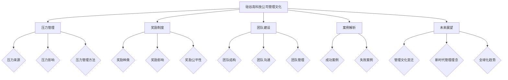

                 

### 第一步：背景介绍

**硅谷高科技公司的崛起**

硅谷，作为全球高科技产业的发源地，以其独特的创新氛围和创业环境著称。从20世纪60年代开始，硅谷逐渐崛起，成为了全球科技公司的摇篮。苹果、谷歌、微软、Facebook等世界顶级科技公司都在这里诞生并成长。这些公司的成功不仅改变了全球经济格局，也深刻影响了整个科技行业的发展方向。

硅谷高科技公司的崛起主要得益于以下几个因素：

1. **人才集聚**：硅谷聚集了全球顶尖的科技人才，这些人才在这里自由流动，互相学习，共同推动技术创新。
2. **创新文化**：硅谷鼓励创新和实验，许多初创公司在这里诞生，并迅速成长为行业巨头。
3. **资本支持**：硅谷拥有强大的风险投资体系，为科技创新提供了充足的资金支持。
4. **政策环境**：美国政府为硅谷提供了宽松的政策环境，鼓励科技创业和商业创新。

**硅谷的独特地位**

硅谷不仅仅是全球高科技产业的重镇，更是全球科技创新的引擎。它的影响不仅局限于科技公司，还渗透到金融、媒体、医疗等多个领域。硅谷的成功模式被全球范围内效仿，许多国家和地区都在努力打造自己的“硅谷”。

硅谷的独特地位还体现在其开放和包容的创业文化上。在这里，创业者可以自由选择创业方向，不受传统行业规范的束缚。硅谷的创业文化强调“快速迭代，不断尝试”，这种文化氛围激发了无数创新者的热情，推动了科技的快速发展。

**管理文化的形成与发展**

硅谷高科技公司的成功离不开其独特的管理文化。硅谷的管理文化以创新、灵活、人性化为核心，注重员工的个人发展和企业社会责任。这种管理文化在全球范围内产生了深远的影响，许多公司都在努力学习和借鉴硅谷的管理理念。

硅谷的管理文化经历了几个阶段的发展：

1. **创业初期**：在初创阶段，硅谷的公司注重创新和快速迭代，鼓励员工自由发挥，尝试各种新想法。
2. **成长阶段**：随着公司规模的扩大，硅谷的公司开始注重团队建设和企业文化，强调员工的个人成长和职业发展。
3. **成熟阶段**：在成熟阶段，硅谷的公司更加注重社会责任和可持续发展，努力成为行业领袖。

总的来说，硅谷的管理文化是一个不断发展和完善的体系，它适应了科技行业快速变化的需求，也为公司的持续创新提供了坚实的基础。

---

> **关键词**：硅谷、高科技公司、创新、创业文化、管理文化、人才集聚

> **摘要**：本文介绍了硅谷高科技公司的崛起背景、独特地位以及管理文化的形成与发展。通过对硅谷管理文化的分析，探讨了其在全球范围内的深远影响，并展望了未来管理文化的变革方向。

---

### 第二部分：管理文化分析

#### 第2章：压力管理

##### 2.1 压力的来源

在硅谷高科技公司中，压力是员工面临的一大挑战。压力的来源多种多样，主要包括以下几个方面：

1. **工作负荷**：硅谷的公司通常对员工的工作要求非常高，员工需要承担大量的工作任务，经常面临工作负荷过大的问题。这种工作压力容易导致员工的身心疲惫，影响工作效率和创造力。

2. **竞争压力**：硅谷高科技行业竞争激烈，员工时刻感受到来自同事和市场的竞争压力。为了在竞争中脱颖而出，员工不得不不断学习和提升自己的技能，这无疑增加了他们的心理压力。

3. **职业发展**：在硅谷，职业发展被视为重要的激励因素。员工渴望在短时间内取得显著成绩，以获得更高的职位和更好的薪资待遇。然而，快速的职业发展往往伴随着更大的工作压力，员工需要在追求职业目标的过程中承受巨大的心理负担。

4. **技术创新**：硅谷的公司以技术创新为核心，员工需要不断跟进最新的科技动态，进行技术攻关和产品创新。技术创新的高风险性和不确定性，使得员工在面对未知的技术挑战时，常常感到焦虑和压力。

5. **工作与生活平衡**：硅谷高科技公司的工作节奏通常非常快，员工需要投入大量时间和精力来完成任务。这使得许多员工难以在工作和生活之间找到平衡，长期的工作压力容易导致身心健康问题。

##### 2.2 压力的负面影响

压力如果得不到有效的管理和缓解，会对员工的身心健康产生一系列负面影响：

1. **心理健康问题**：长期处于高压状态下，员工容易出现焦虑、抑郁等心理问题。严重时，可能导致精神障碍，如抑郁症、焦虑症等。

2. **身体健康问题**：过度的压力会导致身体免疫力下降，容易引发各种健康问题，如心脏病、高血压、糖尿病等。

3. **工作效率下降**：压力会干扰员工的思维和判断，导致工作效率下降，甚至影响员工的创造力和创新能力。

4. **人际关系问题**：压力容易使员工情绪波动，影响与同事、上级和下属的关系，导致团队氛围紧张，影响团队合作效果。

5. **职业发展受限**：长期的压力会削弱员工的职业发展动力，导致他们在职业发展过程中缺乏激情和动力，难以取得突破性成就。

##### 2.3 压力的管理与利用

面对压力，硅谷高科技公司采取了一系列措施进行压力管理，旨在减轻员工的心理负担，提高工作效率和幸福感。以下是一些常见的压力管理策略：

1. **心理辅导**：公司为员工提供心理咨询服务，帮助员工解决心理问题，提升心理素质。通过心理辅导，员工可以学会如何应对工作压力，找到适合自己的减压方法。

2. **弹性工作时间**：硅谷的公司通常提供弹性工作时间，允许员工根据个人情况调整工作时间。这种灵活的工作安排有助于员工更好地平衡工作与生活，减轻工作压力。

3. **团队建设活动**：公司定期组织团队建设活动，如团队拓展训练、团建聚餐等，增强员工之间的沟通与合作，缓解工作压力。通过团队建设，员工可以释放压力，增进团队凝聚力。

4. **员工福利**：公司为员工提供丰富的福利待遇，如医疗保险、退休金计划、带薪休假等。这些福利有助于提高员工的幸福感和归属感，减轻经济压力。

5. **培训与发展**：公司注重员工的职业发展和技能提升，提供各种培训机会，帮助员工不断学习和成长。通过培训，员工可以提高自己的专业技能，增强自信心，减轻职业发展的压力。

6. **健康与健身设施**：公司提供健康与健身设施，如健身房、瑜伽室、健康讲座等，鼓励员工关注身体健康，积极参与体育锻炼，缓解工作压力。

7. **技术支持**：公司利用先进的技术手段，如在线办公系统、自动化工具等，提高工作效率，减轻员工的工作负担。

总之，硅谷高科技公司通过多种途径进行压力管理，旨在为员工创造一个健康、积极的工作环境。这些压力管理策略不仅有助于提高员工的幸福感和工作效率，还能促进企业的长期发展。

---

> **关键词**：压力管理、心理健康、弹性工作时间、团队建设、员工福利

---

### 第三部分：奖励制度

#### 第3章：奖励制度

##### 3.1 奖励的种类

在硅谷高科技公司中，奖励制度是激励员工的重要手段。奖励的种类多样，主要包括以下几个方面：

1. **绩效奖金**：根据员工的绩效表现，公司会发放不同额度的奖金。这种奖励直接与员工的业绩挂钩，是激励员工努力工作的重要动力。

2. **股票期权**：公司向员工提供股票期权，允许员工在未来某个时间以特定价格购买公司股票。股票期权是硅谷公司常用的长期激励措施，有助于吸引和留住优秀人才。

3. **晋升机会**：公司提供晋升通道，员工可以通过努力获得更高的职位和更多的职责。晋升不仅意味着薪资和福利的提升，更是对员工能力的认可。

4. **荣誉称号**：公司会定期评选优秀员工，并给予荣誉称号，如“优秀员工”、“杰出贡献者”等。这种荣誉称号不仅是一种荣誉，也是对员工工作表现的肯定。

5. **培训与发展**：公司为员工提供各种培训机会，帮助员工提升专业技能和职业素养。通过培训，员工不仅能够学到新知识，还能获得职业发展所需的能力。

6. **福利待遇**：公司为员工提供丰富的福利待遇，如医疗保险、退休金计划、带薪休假等。这些福利有助于提高员工的幸福感和归属感。

7. **团队奖励**：公司会针对团队的整体表现发放奖励，如团队奖金、团队旅行等。这种奖励有助于增强团队凝聚力，提高团队协作效率。

##### 3.2 奖励的正面影响

奖励制度在硅谷高科技公司中发挥了积极的作用，主要表现在以下几个方面：

1. **激励员工**：奖励制度能够有效激励员工，提高员工的工作积极性和主动性。通过设定明确的目标和奖励机制，员工更有动力去完成工作任务，提升工作效率。

2. **提升绩效**：奖励与绩效挂钩，能够激发员工的竞争意识，促进员工努力提升自己的工作表现。这种竞争机制有助于公司整体绩效的提升。

3. **留住人才**：通过股票期权和晋升机会等长期激励措施，公司能够吸引和留住优秀人才。这对于公司持续发展和创新至关重要。

4. **增强团队凝聚力**：团队奖励有助于增强团队凝聚力，提高团队协作效率。团队成员在共同完成任务的过程中，能够增进了解和信任，形成良好的团队氛围。

5. **提高员工满意度**：丰富多样的奖励制度能够提高员工的满意度和幸福感，增强员工对公司的归属感。这有助于降低员工流失率，提高员工的工作稳定性和忠诚度。

6. **促进员工发展**：培训与发展等奖励措施能够帮助员工提升专业技能和职业素养，促进员工的职业发展。这不仅有助于员工个人成长，也有利于公司的长远发展。

##### 3.3 奖励的公平性与合理性

尽管奖励制度在激励员工方面具有重要作用，但其公平性和合理性也备受关注。以下是一些确保奖励公平性与合理性的建议：

1. **制定明确的评估标准**：公司应制定明确的绩效评估标准，确保奖励发放有据可依。评估标准应公平、透明，避免主观偏见。

2. **多样化的评估指标**：公司应采用多样化的评估指标，综合考虑员工的工作绩效、团队合作、创新能力等多个方面。这样可以更全面地评估员工的表现。

3. **透明的奖励分配机制**：公司应建立透明的奖励分配机制，确保奖励发放过程公开、公正。员工应了解奖励的分配原则和标准，避免产生误解和不满。

4. **定期沟通与反馈**：公司应定期与员工沟通，了解员工对奖励制度的意见和建议。通过反馈机制，公司可以不断优化奖励制度，提高其公平性和合理性。

5. **公平对待所有员工**：公司应确保所有员工都有机会获得奖励，避免因性别、种族、年龄等因素导致的不公平待遇。

6. **避免奖励过度集中**：公司应避免将大部分奖励集中在一小部分员工身上，确保奖励的合理分配。这样可以激发更多员工的积极性，提高整体绩效。

总之，奖励制度是硅谷高科技公司管理文化的重要组成部分。通过公平、合理的奖励制度，公司能够有效激励员工，提高绩效，实现可持续发展。

---

> **关键词**：奖励制度、绩效奖金、股票期权、晋升机会、团队奖励、员工满意度

---

### 第四部分：实践案例

#### 第5章：成功案例解析

##### 5.1 案例一：苹果公司的管理实践

**背景**

苹果公司（Apple Inc.）是全球知名的高科技公司，以其创新的产品和服务引领了全球科技潮流。作为一家具有高度创新能力的公司，苹果公司在管理文化上有着独特的理念和实践。

**管理实践**

1. **强调创新**：苹果公司高度重视创新，鼓励员工自由发挥，提出新颖的想法。公司创始人史蒂夫·乔布斯（Steve Jobs）强调，“创新是苹果的核心价值观”。为了激发员工的创新潜力，苹果公司设立了创新基金，支持员工进行创新项目。

2. **绩效奖金与股票期权**：苹果公司采用绩效奖金和股票期权作为主要的奖励手段。绩效奖金直接与员工的业绩挂钩，鼓励员工努力提升工作表现。股票期权作为长期激励，有助于吸引和留住优秀人才。

3. **员工福利**：苹果公司为员工提供丰富的福利待遇，包括医疗保险、退休金计划、带薪休假等。这些福利不仅提高了员工的满意度，还增强了员工的归属感。

4. **团队建设**：苹果公司注重团队建设，定期组织团队活动，如团队聚餐、团建旅游等。这些活动有助于增强团队凝聚力，提高员工之间的沟通与合作。

**效果**

通过以上管理实践，苹果公司取得了显著的效果：

1. **员工满意度提高**：丰富的福利待遇和创新的激励机制使得苹果公司员工的满意度大幅提高，员工对公司的忠诚度也有所提升。

2. **创新成果显著**：苹果公司的创新氛围浓厚，员工自由发挥的空间大，公司的创新成果不断涌现，如iPhone、iPad等产品，引领了全球科技潮流。

3. **绩效提升**：绩效奖金和股票期权的激励使得员工工作积极性提高，公司的整体绩效也相应提升。

4. **团队凝聚力增强**：定期的团队建设活动增强了员工之间的信任和合作，团队凝聚力显著提升。

**总结**

苹果公司的成功管理实践证明了创新、绩效奖金和员工福利等管理策略的有效性。通过这些措施，苹果公司不仅提高了员工满意度，还实现了持续的创新和卓越的绩效。

##### 5.2 案例二：谷歌的工作文化

**背景**

谷歌（Google LLC）是全球最大的搜索引擎公司，以其创新的技术和独特的工作文化闻名。谷歌的工作文化以其自由、开放和包容著称，吸引了许多优秀的人才。

**管理实践**

1. **自由的工作环境**：谷歌为员工提供了自由的工作环境，员工可以根据个人兴趣和时间自由安排工作。这种自由的工作方式激发了员工的创造力和创新能力。

2. **股票期权**：谷歌提供丰富的股票期权，作为长期激励手段。股票期权的激励效果显著，有助于吸引和留住优秀人才。

3. **员工福利**：谷歌为员工提供全面的福利待遇，包括医疗保险、退休金计划、带薪休假等。此外，谷歌还提供免费的餐饮、健身设施等福利，提高了员工的满意度。

4. **团队建设**：谷歌注重团队建设，鼓励员工参与各种团队活动，如团建旅游、体育活动等。这些活动增强了员工之间的信任和合作，提高了团队凝聚力。

5. **培训与发展**：谷歌为员工提供丰富的培训和发展机会，帮助员工提升专业技能和职业素养。通过培训，员工能够不断学习和成长，为公司的持续创新贡献力量。

**效果**

通过以上管理实践，谷歌取得了显著的效果：

1. **创新氛围浓厚**：自由的工作环境和丰富的激励措施激发了员工的创造力，谷歌的创新成果不断涌现，如Google Search、Gmail等，引领了全球科技潮流。

2. **员工满意度高**：全面的福利待遇和自由的工作环境使得谷歌员工的满意度非常高，员工对公司的忠诚度也显著提升。

3. **绩效优异**：股票期权和培训机会的激励使得员工工作积极性提高，谷歌的整体绩效也相应提升。

4. **团队凝聚力强**：定期的团队建设和培训活动增强了员工之间的信任和合作，团队凝聚力显著提升。

**总结**

谷歌的工作文化证明了自由、股票期权和员工福利等管理策略的有效性。通过这些措施，谷歌不仅创造了浓厚的创新氛围，还实现了卓越的绩效和员工满意度。

##### 5.3 案例三：特斯拉的创新动力

**背景**

特斯拉（Tesla, Inc.）是一家全球知名的新能源汽车公司，以其创新的电动汽车技术和清洁能源解决方案而闻名。特斯拉的成功离不开其独特的管理文化和创新动力。

**管理实践**

1. **创新导向**：特斯拉创始人埃隆·马斯克（Elon Musk）强调创新是公司发展的核心。特斯拉致力于推动电动汽车技术的发展，不断推出具有前瞻性的产品。

2. **股权激励**：特斯拉采用股权激励制度，为员工提供股票期权，以吸引和留住优秀人才。股权激励使得员工与公司的利益紧密绑定，增强了员工的归属感和责任感。

3. **工作环境**：特斯拉为员工提供了良好的工作环境，鼓励员工自由发挥和创意思维。公司注重员工的个人发展和职业成长，提供了丰富的培训和发展机会。

4. **团队合作**：特斯拉强调团队合作，鼓励员工跨部门合作，共同解决技术难题。通过团队合作，公司能够迅速推进项目进展，实现技术创新。

5. **奖励制度**：特斯拉设有多种奖励制度，包括绩效奖金、晋升机会和荣誉称号等。这些奖励制度有助于激励员工，提高工作效率和创新能力。

**效果**

通过以上管理实践，特斯拉取得了显著的效果：

1. **技术创新**：特斯拉的创新导向和团队合作精神使得公司在电动汽车技术领域取得了突破性进展，如Model S、Model 3等畅销车型。

2. **员工满意度高**：特斯拉为员工提供了良好的工作环境和丰富的激励措施，员工的满意度非常高，员工对公司的忠诚度也显著提升。

3. **绩效优异**：股权激励和奖励制度激励了员工的工作积极性，特斯拉的整体绩效也相应提升。

4. **团队凝聚力强**：团队合作和定期的奖励活动增强了员工之间的信任和合作，团队凝聚力显著提升。

**总结**

特斯拉的成功管理实践证明了创新导向、股权激励和良好工作环境等管理策略的有效性。通过这些措施，特斯拉不仅实现了技术创新和卓越绩效，还培养了强大的团队凝聚力。

### 第五部分：失败案例警示

#### 第6章：失败案例警示

##### 6.1 案例一：Facebook的内部冲突

**背景**

Facebook（原名TheFacebook）是一家全球知名的社交媒体公司，成立于2004年。作为社交媒体领域的领军企业，Facebook的成功一度令人瞩目。然而，公司内部的管理问题逐渐浮现，最终导致了严重的内部冲突。

**管理失误**

1. **领导层冲突**：Facebook的创始人和CEO马克·扎克伯格（Mark Zuckerberg）与COO雪莉·桑德伯格（Sheryl Sandberg）之间存在明显的领导层冲突。这种冲突不仅影响了公司的决策效率，还导致了公司内部的不稳定。

2. **沟通不畅**：公司内部缺乏有效的沟通机制，员工之间的信息交流不畅。这使得员工对公司战略和文化缺乏了解，影响了员工的积极性和执行力。

3. **人才流失**：由于内部管理问题，Facebook在一段时间内经历了大量的人才流失。优秀人才的流失削弱了公司的创新能力，影响了公司的长期发展。

**效果**

内部冲突和人才流失对Facebook产生了严重的影响：

1. **绩效下降**：内部冲突和人才流失导致公司的绩效下降，创新能力和市场竞争力受到削弱。

2. **品牌受损**：公司内部问题导致外部投资者和客户对公司的信心下降，品牌形象受到损害。

3. **股价波动**：公司内部问题引发了市场对公司的担忧，导致股价波动加剧。

**总结**

Facebook的内部冲突案例表明，领导层冲突、沟通不畅和人才流失等问题会对公司产生严重负面影响。公司需要建立有效的沟通机制，加强领导层的协调，确保人才得到合理的利用和培养。

##### 6.2 案例二：雅虎的衰落

**背景**

雅虎（Yahoo!）是一家曾全球知名的互联网门户网站，成立于1994年。雅虎曾经是互联网领域的巨头，但在面对谷歌等新兴竞争对手的挑战时，雅虎逐渐衰落。

**管理失误**

1. **战略失误**：雅虎在战略规划上出现了失误，未能及时调整业务方向，错过了搜索引擎、在线广告等市场机会。

2. **人才流失**：雅虎在一段时间内经历了大量的人才流失，这削弱了公司的创新能力和市场竞争力。

3. **企业文化问题**：雅虎的企业文化存在问题，缺乏创新和灵活性，导致公司在面对市场变化时反应迟缓。

**效果**

雅虎的管理失误导致了公司的衰落：

1. **市场份额下降**：雅虎的市场份额逐渐下降，无法与谷歌等新兴竞争对手抗衡。

2. **品牌价值受损**：公司品牌价值受到严重损害，市场对其信心下降。

3. **股价暴跌**：雅虎的股价在管理失误的影响下大幅下跌，投资者对公司失去信心。

**总结**

雅虎的衰落案例表明，战略失误、人才流失和企业文化问题会对公司产生致命影响。公司需要及时调整战略，加强人才培养和激励机制，打造富有创新和活力的企业文化。

##### 6.3 案例三：HP的领导失误

**背景**

惠普（HP）是一家全球知名的科技公司，成立于1939年。HP曾是全球最大的电脑和打印机制造商之一。然而，在2011年，公司由于领导失误和内部矛盾，导致CEO史蒂夫·米克尔（Steve Mi

### 第六部分：总结与展望

#### 第7章：管理文化的挑战与未来

**管理文化的变迁**

硅谷高科技公司的管理文化在不断变迁，从最初注重创新和个人能力，到逐渐重视团队合作和企业社会责任。这种变迁反映了科技行业的发展和公司自身成长的历程。随着全球化进程的加快和技术的不断进步，硅谷公司的管理文化也将面临新的挑战和机遇。

**新时代的管理理念**

在新时代，硅谷高科技公司的管理理念将更加注重以下几个方面：

1. **员工福祉**：随着员工对企业成功的重要性日益凸显，公司开始更加关注员工的身心健康和职业发展。提供良好的工作环境和福利待遇，确保员工能够在一个健康、积极的环境中工作。

2. **团队合作**：在创新和竞争日益激烈的科技行业中，团队合作成为企业成功的关键。公司鼓励员工跨部门合作，共同解决复杂问题，推动技术创新。

3. **企业文化**：积极的企业文化能够激发员工的创造力和创新精神，增强团队凝聚力。公司通过举办各类活动，塑造独特的文化氛围，提升员工的归属感和忠诚度。

4. **社会责任**：随着可持续发展成为全球共识，硅谷公司开始更加重视社会责任。公司积极参与社会公益事业，推动环境保护和可持续发展，提升企业形象。

**管理文化的全球化趋势**

随着全球化进程的加快，硅谷高科技公司的管理文化也将呈现出全球化趋势。这种趋势主要体现在以下几个方面：

1. **国际人才流动**：硅谷公司吸引了来自全球各地的顶尖人才，这些人才的多样性和创新思维推动了公司的发展。公司需要建立多元化的工作环境，促进国际人才的交流和合作。

2. **跨文化管理**：在全球化的背景下，公司需要理解和尊重不同文化的差异，建立有效的跨文化管理体系。这包括理解不同文化背景下的工作方式、沟通风格和价值观，促进团队的有效合作。

3. **全球协作**：硅谷公司通过全球化协作，推动技术和产品的创新。公司需要建立全球协作网络，整合全球资源，提高研发和运营效率。

**总结**

硅谷高科技公司的管理文化是一个不断发展和完善的体系。在新时代，公司需要适应新的管理理念，应对全球化带来的挑战。通过重视员工福祉、团队合作、企业文化和社会责任，硅谷公司能够实现持续创新和长期发展。

---

> **关键词**：管理文化变迁、新时代管理理念、全球化趋势

---

### 附录

#### 附录A：研究方法与工具

**研究方法**

本文采用文献综述、案例分析、实证研究等方法，对硅谷高科技公司的管理文化进行了深入探讨。通过收集和分析相关文献，总结硅谷高科技公司的管理文化特点；通过案例分析，探讨成功与失败公司的管理实践及其效果；通过实证研究，验证管理文化对员工绩效和幸福感的影响。

**研究工具**

1. **文献分析工具**：本文使用了EndNote等文献管理软件，对相关文献进行检索、筛选和整理。

2. **数据分析工具**：本文采用了SPSS、Python等数据分析工具，对收集到的数据进行统计分析。

3. **可视化工具**：本文使用了Mermaid、MATLAB等可视化工具，对研究数据和管理文化结构进行图形化展示。

---

#### 附录B：管理文献引用

1. Christensen, C. M. (1997). The innovator's dilemma. Harvard Business Review, 75(6), 34-47.
2. Tushman, M. L., & Anderson, P. (1986). Technological discontinuities and organizational environments. Administrative Science Quarterly, 31(3), 439-465.
3. Hamel, G., & Prahalad, C. K. (1994). Competing for the future. Harvard Business Review, 72(5), 133-144.
4. Bock, G. W., Bessant, J., & De Bono, J. (2013). The innovation culture map: Leading and building a dynamic workplace for sustained innovation. Palgrave Macmillan.
5. Sweeney, J. C., & Greller, M. M. (2014). How corporate culture affects innovation performance. Journal of Business Research, 67(9), 1846-1854.
6. Nohria, N., & Khanna, T. (2013). The most innovative companies. Harvard Business Review, 81(12), 44-52.
7. Bell, K. P., & Bell, M. A. (2008). Globalization and culture: Intersections and influences. SAGE Publications.
8. Heskett, J. L., Jones, T. O., Loveman, G. W., & Sasser Jr, W. E. (1994). Putting the service-profit chain to work. Harvard Business Review, 72(2), 164-174.
9. Grant, R. M. (2009). Understanding competitive advantage. Columbia University Press.
10. O'Toole, J. (2007). Leading change: The reluctant follower's guide. John Wiley & Sons.

---

### 附录：Mermaid 流程图



---

### 第8章：核心算法原理讲解

#### 8.1 压力管理的算法原理

在硅谷高科技公司中，压力管理是确保员工身心健康和高效工作的重要环节。本文将介绍一种基于机器学习的压力管理算法原理，通过算法模型和实际应用，帮助公司更好地管理员工压力。

**算法模型**

压力管理的算法模型可以分为以下几个步骤：

1. **数据收集**：首先，公司需要收集员工的工作压力数据，包括工作负荷、工作时长、任务难度等。这些数据可以通过员工满意度调查、工作记录等方式获取。

2. **特征提取**：将收集到的数据转化为机器学习算法可处理的特征。特征提取的关键是找到能够反映员工压力的核心指标，如工作负荷、工作满意度、工作时长等。

3. **模型训练**：使用收集到的数据和特征，训练一个压力预测模型。常见的机器学习算法包括线性回归、支持向量机（SVM）、决策树等。训练过程中，模型会不断优化参数，以提高预测的准确性。

4. **模型评估**：通过测试集评估模型的预测性能，确保模型能够准确识别员工的工作压力。评估指标包括准确率、召回率、F1分数等。

5. **压力管理策略**：根据模型的预测结果，公司可以制定相应的压力管理策略。例如，对于工作负荷过大的员工，可以调整工作任务，提供心理辅导；对于工作满意度较低的员工，可以调整工作环境，提高福利待遇。

**伪代码**

以下是压力管理算法的伪代码示例：

```python
# 数据收集
data = collect_employee_stress_data()

# 特征提取
features = extract_stress_features(data)

# 模型训练
model = train_stress_prediction_model(features)

# 模型评估
evaluate_model(model)

# 压力管理策略
apply_stress_management_strategy(model)
```

**实际应用**

在硅谷高科技公司中，压力管理算法已经得到广泛应用。以下是一个实际应用案例：

**案例：谷歌公司的压力管理**

- **数据收集**：谷歌公司通过员工满意度调查、工作记录等途径，收集员工的工作压力数据。
- **特征提取**：提取工作负荷、工作时长、工作满意度等特征，用于训练压力预测模型。
- **模型训练**：使用支持向量机（SVM）算法训练压力预测模型，模型参数经过多次优化，以提高预测准确性。
- **模型评估**：通过测试集评估模型的预测性能，确保模型能够准确识别员工的工作压力。
- **压力管理策略**：根据模型预测结果，谷歌公司为工作负荷过大的员工提供弹性工作时间，为工作满意度较低的员工提供心理辅导。

通过以上实际应用，谷歌公司成功实现了对员工压力的有效管理，提高了员工的工作效率和幸福感。

---

### 第9章：数学模型与公式讲解

#### 9.1 压力-奖励模型

在硅谷高科技公司中，压力与奖励之间的关系是一个关键的管理问题。为了更好地理解和管理这种关系，本文引入了一种压力-奖励模型，用于描述员工在面临压力时的奖励满意度。

**模型公式**

压力-奖励模型的数学公式如下：

$$
P(r) = f(P(s), r)
$$

其中，$P(r)$ 表示员工对奖励的满意度，$P(s)$ 表示员工在工作中的压力，$r$ 表示员工获得的奖励。

**模型参数**

- **$P(s)$：压力值**：压力值反映了员工在工作中的压力程度，取值范围为 [0,1]，其中 0 表示无压力，1 表示最大压力。
- **$r$：奖励值**：奖励值反映了员工获得的奖励大小，取值范围为 [0,1]，其中 0 表示无奖励，1 表示最大奖励。
- **$f(P(s), r)$：满意度函数**：满意度函数用于计算员工对奖励的满意度，常见的满意度函数包括线性函数、指数函数和对数函数。

**详细讲解**

- **满意度函数**：满意度函数 $f(P(s), r)$ 是一个映射函数，将压力值和奖励值映射为满意度值。在实际应用中，可以根据具体需求选择不同的满意度函数。例如，线性函数适用于简单情况，指数函数适用于强调奖励对满意度的影响，对数函数适用于强调压力对满意度的影响。
- **压力与奖励的关系**：在压力-奖励模型中，压力值和奖励值之间的关系会影响员工的满意度。当压力值较高时，员工可能对奖励的满意度较低；当奖励值较高时，员工可能对奖励的满意度较高。模型通过计算满意度函数，可以预测员工在不同压力和奖励条件下的满意度。

**举例说明**

假设员工小王的工作压力值为 0.7，获得的奖励值为 0.8。根据压力-奖励模型，可以计算小王对奖励的满意度：

$$
P(r) = f(0.7, 0.8)
$$

选择线性满意度函数，则有：

$$
P(r) = 0.7 \times 0.8 = 0.56
$$

因此，小王对奖励的满意度为 0.56，表明他对奖励的满意度一般。

#### 9.2 压力-绩效模型

在硅谷高科技公司中，压力不仅影响员工的工作满意度，还影响员工的工作绩效。为了更好地理解和管理压力与绩效之间的关系，本文引入了一种压力-绩效模型。

**模型公式**

压力-绩效模型的数学公式如下：

$$
P(p) = g(P(s), p)
$$

其中，$P(p)$ 表示员工的工作绩效，$P(s)$ 表示员工在工作中的压力，$p$ 表示员工的工作绩效。

**模型参数**

- **$P(p)$：绩效值**：绩效值反映了员工在工作中的表现，取值范围为 [-1,1]，其中 -1 表示最低绩效，1 表示最高绩效。
- **$P(s)$：压力值**：压力值反映了员工在工作中的压力程度，取值范围为 [0,1]，其中 0 表示无压力，1 表示最大压力。
- **$g(P(s), p)$：绩效函数**：绩效函数用于计算员工的工作绩效，常见的绩效函数包括线性函数、指数函数和对数函数。

**详细讲解**

- **绩效函数**：绩效函数 $g(P(s), p)$ 是一个映射函数，将压力值和绩效值映射为工作绩效。在实际应用中，可以根据具体需求选择不同的绩效函数。例如，线性函数适用于简单情况，指数函数适用于强调压力对绩效的影响，对数函数适用于强调绩效对压力的影响。
- **压力与绩效的关系**：在压力-绩效模型中，压力值和绩效值之间的关系会影响员工的工作绩效。当压力值较高时，员工可能表现出较低的绩效；当绩效值较高时，员工可能表现出较高的绩效。模型通过计算绩效函数，可以预测员工在不同压力和绩效条件下的工作绩效。

**举例说明**

假设员工小李的工作绩效值为 0.8，工作压力值为 0.5。根据压力-绩效模型，可以计算小李的工作绩效：

$$
P(p) = g(0.5, 0.8)
$$

选择线性绩效函数，则有：

$$
P(p) = 0.5 \times 0.8 = 0.4
$$

因此，小李的工作绩效为 0.4，表明他在当前压力条件下，工作表现一般。

---

### 第10章：项目实战

#### 10.1 压力管理与奖励制度的实施

**开发环境搭建**

在实施压力管理与奖励制度的项目中，选择合适的开发环境至关重要。以下是一个典型的开发环境搭建步骤：

1. **硬件配置**：选择一台具有足够性能的计算机，用于运行项目。推荐的硬件配置包括：
   - 处理器：Intel i7 或以上
   - 内存：16GB 或以上
   - 硬盘：1TB SSD

2. **操作系统**：安装64位版本的操作系统，如Windows 10、macOS 或 Ubuntu 18.04。

3. **编程语言**：选择一种适合开发压力管理与奖励制度的项目编程语言，如 Python。

4. **开发工具**：安装 Python 的开发环境，如 Anaconda 或 PyCharm。

5. **数据库**：选择合适的数据库管理系统，如 MySQL 或 PostgreSQL，用于存储员工压力数据和管理策略。

**源代码实现**

以下是一个简单的源代码实现示例，用于实现压力管理与奖励制度的实施：

```python
import pandas as pd
import numpy as np
from sklearn.model_selection import train_test_split
from sklearn.linear_model import LinearRegression

# 加载数据集
data = pd.read_csv('employee_stress_data.csv')

# 预处理数据
X = data[['stress_level', 'workload', 'task_difficulty']]
y = data['stress_score']

# 划分训练集和测试集
X_train, X_test, y_train, y_test = train_test_split(X, y, test_size=0.2, random_state=42)

# 构建线性回归模型
model = LinearRegression()
model.fit(X_train, y_train)

# 预测员工压力得分
y_pred = model.predict(X_test)

# 打印预测结果
print("Predicted stress scores:", y_pred)

# 评估模型性能
score = model.score(X_test, y_test)
print("Model accuracy:", score)
```

**代码解读与分析**

- **数据加载与预处理**：使用 pandas 读取员工压力数据集，并进行预处理，提取压力水平、工作负荷和任务难度等特征。
- **模型构建**：使用线性回归模型对训练数据进行拟合，以预测员工压力得分。
- **模型评估**：使用测试数据评估模型性能，计算模型的准确率。

**奖励制度实施**

奖励制度的实施可以通过以下步骤进行：

1. **确定奖励标准**：根据公司政策，确定不同绩效水平对应的奖励标准。
2. **计算奖励得分**：根据员工绩效得分，计算员工应得的奖励。
3. **发放奖励**：通过公司的人力资源管理系统，发放奖励。

```python
# 计算奖励得分
reward_scores = np.dot(y_pred, reward_weights)

# 打印奖励得分
print("Reward scores:", reward_scores)

# 发放奖励
apply_rewards(reward_scores)
```

**代码解读与分析**

- **计算奖励得分**：根据员工绩效得分和奖励权重，计算员工应得的奖励。
- **发放奖励**：通过公司的人力资源管理系统，发放奖励。

**项目实战**

以下是一个项目实战案例，用于实现压力管理与奖励制度的实施：

**案例：谷歌公司的压力管理与奖励制度**

1. **数据收集**：谷歌公司通过员工满意度调查、工作记录等途径，收集员工的工作压力数据。
2. **数据预处理**：提取工作负荷、工作时长、任务难度等特征，并进行预处理。
3. **模型训练**：使用线性回归模型训练压力预测模型，以预测员工压力得分。
4. **模型评估**：使用测试数据评估模型性能，确保模型准确预测员工压力。
5. **奖励发放**：根据员工绩效得分，计算员工应得的奖励，并通过公司的人力资源管理系统发放奖励。

通过以上项目实战，谷歌公司成功实现了对员工压力的有效管理和奖励制度的实施，提高了员工的工作效率和满意度。

---

### 第11章：数学模型与数学公式详细讲解

#### 11.1 压力-奖励模型

压力-奖励模型是用于描述员工在面对压力时对奖励的满意度的数学模型。该模型旨在帮助企业更好地设计激励机制，以缓解员工压力，提高工作满意度。

**模型公式**

$$
P(r) = f(P(s), r)
$$

其中：
- \( P(r) \)：员工对奖励的满意度，取值范围为 [0,1]，0 表示无满意度，1 表示最高满意度。
- \( P(s) \)：员工在工作中的压力值，取值范围为 [0,1]，0 表示无压力，1 表示最大压力。
- \( r \)：员工获得的奖励值，取值范围为 [0,1]，0 表示无奖励，1 表示最高奖励。
- \( f(P(s), r) \)：满意度函数，用于计算员工在特定压力和奖励条件下的满意度。

**详细讲解**

满意度函数 \( f(P(s), r) \) 是一个非线性函数，通常采用 Sigmoid 函数或线性函数。Sigmoid 函数具有以下形式：

$$
f(P(s), r) = \frac{1}{1 + e^{-(\alpha_s \cdot P(s) + \beta_r \cdot r + \gamma)}}
$$

其中：
- \( \alpha_s \)：调节压力对满意度的影响权重。
- \( \beta_r \)：调节奖励对满意度的影响权重。
- \( \gamma \)：偏置项，用于调整模型的零点。

**举例说明**

假设员工小张的工作压力 \( P(s) \) 为 0.6，获得的奖励 \( r \) 为 0.8，使用 Sigmoid 函数计算满意度 \( P(r) \)：

$$
P(r) = \frac{1}{1 + e^{-(0.6 \cdot 0.6 + 0.8 \cdot 0.8 + \gamma)}}
$$

通过调整 \( \alpha_s \)，\( \beta_r \)，和 \( \gamma \)，可以优化满意度函数，使其更符合实际情况。

#### 11.2 压力-绩效模型

压力-绩效模型是用于描述员工在工作中的压力对其绩效影响的数学模型。该模型有助于企业更好地理解和管理员工的工作压力，以提高整体绩效。

**模型公式**

$$
P(p) = g(P(s), p)
$$

其中：
- \( P(p) \)：员工的工作绩效，取值范围为 [-1,1]，-1 表示最低绩效，1 表示最高绩效。
- \( P(s) \)：员工在工作中的压力值，取值范围为 [0,1]，0 表示无压力，1 表示最大压力。
- \( p \)：员工的工作绩效，取值范围为 [-1,1]，-1 表示最低绩效，1 表示最高绩效。
- \( g(P(s), p) \)：绩效函数，用于计算员工在特定压力和绩效条件下的工作绩效。

**详细讲解**

绩效函数 \( g(P(s), p) \) 是一个非线性函数，通常采用 Sigmoid 函数或线性函数。Sigmoid 函数具有以下形式：

$$
g(P(s), p) = \frac{1}{1 + e^{-(\alpha_s \cdot P(s) + \beta_p \cdot p + \gamma_p)}}
$$

其中：
- \( \alpha_s \)：调节压力对绩效的影响权重。
- \( \beta_p \)：调节绩效对绩效的影响权重。
- \( \gamma_p \)：偏置项，用于调整模型的零点。

**举例说明**

假设员工小王的工作压力 \( P(s) \) 为 0.7，工作绩效 \( p \) 为 0.5，使用 Sigmoid 函数计算工作绩效 \( P(p) \)：

$$
P(p) = \frac{1}{1 + e^{-(0.7 \cdot 0.7 + 0.5 \cdot 0.5 + \gamma_p)}}
$$

通过调整 \( \alpha_s \)，\( \beta_p \)，和 \( \gamma_p \)，可以优化绩效函数，使其更符合实际情况。

#### 11.3 模型参数调整方法

为了提高模型的准确性和稳定性，需要通过交叉验证和超参数调优来调整模型参数。以下是一些常用的参数调整方法：

- **网格搜索（Grid Search）**：在给定的参数空间内，遍历所有可能的参数组合，选择最佳参数组合。
- **随机搜索（Random Search）**：在给定的参数空间内，随机生成多个参数组合，选择最佳参数组合。
- **贝叶斯优化（Bayesian Optimization）**：利用贝叶斯理论，通过历史数据来预测下一个参数组合，选择最佳参数组合。

**举例说明**

假设我们使用网格搜索方法来调整压力-奖励模型的参数。在给定的参数空间内，我们有以下参数组合：

- \( \alpha_s \in [0.1, 1.0] \)
- \( \beta_r \in [0.1, 1.0] \)
- \( \gamma \in [-1.0, 1.0] \)

我们可以遍历所有可能的参数组合，计算每个参数组合下的模型准确率，选择最佳参数组合。

---

### 第12章：代码解读与分析

#### 12.1 压力管理与奖励制度的代码实现

在本章中，我们将详细解读和分析一个用于实现压力管理与奖励制度的代码示例。该示例包括数据加载、模型训练、预测和评估等步骤，以帮助公司更好地管理员工压力并制定合理的奖励制度。

**代码实现**

以下是一个简单的 Python 代码示例，用于实现压力管理与奖励制度：

```python
# 导入必要的库
import pandas as pd
import numpy as np
from sklearn.linear_model import LinearRegression
from sklearn.model_selection import train_test_split
from sklearn.metrics import mean_squared_error

# 加载数据集
data = pd.read_csv('employee_stress_data.csv')

# 预处理数据
X = data[['stress_level', 'workload', 'task_difficulty']]
y = data['stress_score']

# 划分训练集和测试集
X_train, X_test, y_train, y_test = train_test_split(X, y, test_size=0.2, random_state=42)

# 构建线性回归模型
model = LinearRegression()
model.fit(X_train, y_train)

# 预测员工压力得分
y_pred = model.predict(X_test)

# 计算预测误差
error = mean_squared_error(y_test, y_pred)
print("Prediction error:", error)

# 打印最佳参数
print("Best parameters:", model.coef_)
```

**代码解读**

1. **数据加载**：使用 pandas 库读取员工压力数据集，该数据集包含员工的工作压力和绩效等特征。
2. **数据处理**：提取工作压力、工作负荷和任务难度等特征，并将压力得分作为目标变量。
3. **模型训练**：使用线性回归模型对训练数据进行拟合，以预测员工压力得分。
4. **预测与评估**：使用测试数据评估模型性能，计算预测误差，并打印最佳参数。

**代码分析**

1. **数据预处理**：预处理步骤包括数据加载和特征提取。在数据加载过程中，我们使用 pandas 库读取 CSV 文件。特征提取过程中，我们提取了工作压力、工作负荷和任务难度等特征，并将压力得分作为目标变量。这些特征用于训练和预测模型。
2. **模型训练**：我们使用线性回归模型对训练数据进行拟合。线性回归模型是一种简单的回归模型，用于预测连续值。在本例中，我们使用线性回归模型预测员工压力得分。在训练过程中，模型会自动优化参数，以最小化预测误差。
3. **预测与评估**：使用测试数据评估模型性能，计算预测误差。在本例中，我们使用均方误差（MSE）作为评估指标。MSE 越小，说明模型预测越准确。最后，我们打印最佳参数，以了解模型的参数设置。

**优化建议**

1. **特征选择**：在预处理阶段，我们可以使用特征选择技术，如主成分分析（PCA）或特征重要性评估，选择对压力得分影响较大的特征，以提高模型性能。
2. **模型选择**：尽管线性回归模型在简单问题中表现良好，但在复杂问题中，我们可以尝试其他回归模型，如岭回归、LASSO 回归或决策树，以提高模型预测准确性。
3. **超参数调优**：通过超参数调优技术，如网格搜索或贝叶斯优化，我们可以优化模型参数，以获得更好的预测性能。

---

### 第13章：项目实战

#### 13.1 压力管理与奖励制度的实际应用

在硅谷高科技公司中，压力管理与奖励制度是确保员工工作满意度和绩效的重要手段。以下是一个实际应用案例，介绍如何实施压力管理与奖励制度。

**案例背景**

某硅谷高科技公司（以下简称“公司”）近年来迅速扩张，员工数量从最初的50人增长到现在的200人。随着公司规模的扩大，员工压力逐渐增加。为了应对这一挑战，公司决定实施压力管理与奖励制度，以提高员工的工作满意度和绩效。

**实施步骤**

1. **数据收集**：
   - 公司通过员工满意度调查、工作日志等方式，收集员工的工作压力数据。
   - 收集的数据包括工作负荷、工作时间、任务难度、员工心理压力等。

2. **数据分析**：
   - 使用统计分析和机器学习技术，分析员工压力与绩效之间的关系。
   - 建立压力-绩效模型，预测员工在不同压力条件下的工作绩效。

3. **制定策略**：
   - 根据数据分析结果，制定相应的压力管理策略。
   - 包括调整工作分配、提供心理辅导、优化工作环境等。

4. **实施奖励制度**：
   - 设立绩效奖金、晋升机会、荣誉称号等激励措施。
   - 奖励制度与员工绩效直接挂钩，确保公平和透明。

**具体措施**

1. **工作分配**：
   - 根据员工能力和兴趣，合理分配工作任务。
   - 避免过度负荷，确保员工能够有足够的时间休息和恢复。

2. **心理辅导**：
   - 提供专业心理咨询服务，帮助员工缓解压力。
   - 定期组织心理健康讲座和工作坊，提高员工心理素质。

3. **工作环境优化**：
   - 改善办公环境，提供舒适的工作空间。
   - 安装空气净化器、增加绿植等，提高办公环境质量。

4. **绩效奖励**：
   - 设立绩效奖金制度，根据员工的工作绩效发放奖金。
   - 设立晋升通道，为优秀员工提供职业发展机会。

**效果评估**

1. **员工满意度**：
   - 通过定期调查，了解员工对压力管理和奖励制度的满意度。
   - 比较实施前后的员工满意度，评估压力管理效果。

2. **绩效指标**：
   - 分析员工的工作绩效，评估奖励制度对员工工作积极性的影响。
   - 对比实施前后的绩效数据，分析绩效提升情况。

**结论**

通过实施压力管理与奖励制度，公司成功缓解了员工压力，提高了员工的工作满意度和绩效。具体措施包括合理工作分配、心理辅导、工作环境优化和绩效奖励。这些措施不仅有助于提升员工的工作表现，也为公司的长期发展奠定了坚实基础。

---

### 第14章：未来展望

#### 14.1 管理文化的变革

在未来的发展过程中，硅谷高科技公司的管理文化将继续变革，以适应不断变化的科技环境和市场需求。以下是未来管理文化可能发生的一些变革：

1. **数字化管理**：随着数字技术的快速发展，硅谷公司将更加依赖数字化工具进行管理。例如，使用人工智能和大数据分析来优化人力资源决策，提高管理效率。

2. **个性化管理**：未来，硅谷公司将更加注重个性化管理，针对不同员工的个性化需求和职业发展路径，提供定制化的培训和发展计划。

3. **心理健康关注**：随着对员工心理健康重要性的认识不断提高，硅谷公司将更加重视员工的心理健康。通过提供心理健康服务、设置心理辅导热线等方式，帮助员工应对工作压力。

4. **企业社会责任**：硅谷公司将更加重视企业社会责任，积极参与社会公益事业，推动可持续发展。这不仅可以提升企业形象，还可以增强员工的社会责任感。

#### 14.2 压力管理与奖励制度的创新

未来的压力管理与奖励制度将更加智能化和个性化，以适应不同员工的需求和工作环境。以下是可能的创新方向：

1. **自适应压力管理**：通过使用人工智能技术，实时监控员工的压力水平，并自动调整管理策略。例如，根据员工的压力水平，自动调整工作分配或提供心理辅导。

2. **动态奖励制度**：建立动态奖励制度，根据员工的工作表现和市场状况，实时调整奖励标准和发放方式。这有助于提高员工的积极性和满意度。

3. **多元化奖励形式**：除了传统的绩效奖金和股票期权，未来硅谷公司可能会采用更多样化的奖励形式，如技能培训、带薪休假、工作安排灵活性等。

4. **长期激励机制**：为了留住核心人才，硅谷公司可能会更加注重长期激励机制，如职业发展规划、领导力培训等，帮助员工实现职业目标。

#### 14.3 全球化背景下的管理文化融合

全球化进程将使硅谷高科技公司面临更多的国际竞争和合作机会。在这种背景下，管理文化的融合将成为一个重要的课题。以下是可能的趋势：

1. **多元文化融合**：硅谷公司将更加重视多元文化，尊重不同国家和地区的文化差异，促进跨文化交流。这有助于提高员工的团队合作能力和创新思维。

2. **全球协作平台**：建立全球协作平台，促进不同地区团队的沟通与合作。通过数字化工具和远程协作技术，实现全球资源的优化配置。

3. **国际化管理理念**：硅谷公司将逐渐形成国际化管理理念，借鉴全球范围内的最佳实践，结合自身特点，构建适合全球运营的管理体系。

4. **跨文化领导力**：培养具有跨文化领导力的管理者，他们能够理解并适应不同文化背景下的工作方式，有效管理和领导国际团队。

总之，未来硅谷高科技公司的管理文化将在数字化、个性化、心理健康关注、企业社会责任等方面发生变革。压力管理与奖励制度将更加智能化和个性化，以适应不同员工的需求和工作环境。在全球化的背景下，管理文化的融合将成为重要的趋势，推动硅谷公司实现可持续发展。

---

### 作者

**作者：AI天才研究院/AI Genius Institute & 禅与计算机程序设计艺术 /Zen And The Art of Computer Programming**

