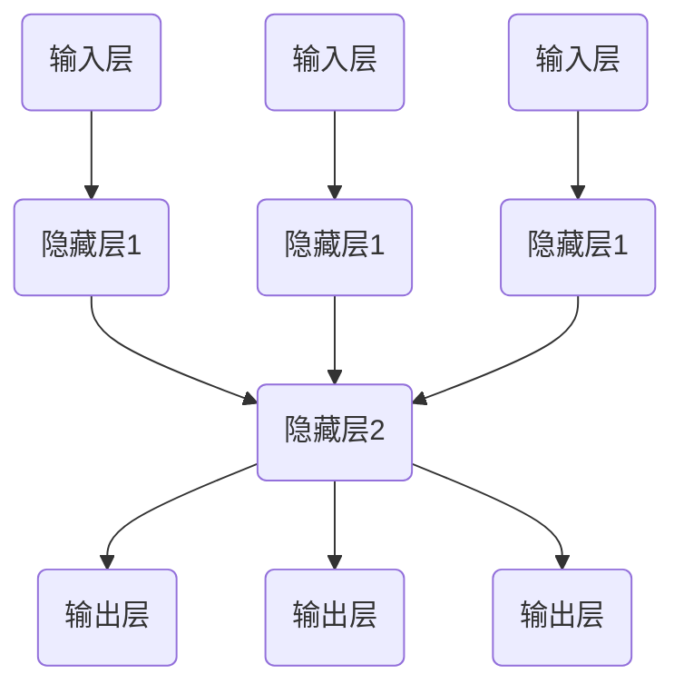

                 

## 《神经网络API设计最佳实践》

> **关键词：** 神经网络，API设计，最佳实践，性能优化，安全性设计，Python库

> **摘要：** 本文将探讨神经网络API设计的关键原则和最佳实践。从基础概念、核心算法到实际应用，本文逐步解析神经网络API设计的各个层面，旨在帮助开发者构建高效、安全且易于使用的神经网络API。

### 目录

1. **神经网络API设计概述**
   1.1 神经网络API的重要性
   1.2 神经网络API设计的原则
   1.3 神经网络API的架构设计
   1.4 神经网络API的应用场景

2. **神经网络核心概念**
   2.1 神经网络基础
   2.2 神经网络算法
   2.3 神经网络与深度学习的联系

3. **神经网络API设计实践**
   3.1 Python神经网络库介绍
   3.2 Python神经网络API设计案例

4. **神经网络API性能优化**
   4.1 神经网络性能优化方法
   4.2 神经网络API性能测试与优化

5. **神经网络API部署**
   5.1 神经网络API部署策略
   5.2 神经网络API部署流程
   5.3 神经网络API部署案例

6. **神经网络API最佳实践**
   6.1 设计原则
   6.2 编码规范
   6.3 测试与调试
   6.4 性能优化

7. **神经网络API安全性设计**
   7.1 安全性威胁分析
   7.2 安全性设计策略
   7.3 安全性实现方法

8. **神经网络API的未来发展**
   8.1 神经网络API发展趋势
   8.2 神经网络API应用前景
   8.3 神经网络API的未来挑战

9. **附录**
   9.1 神经网络API开发资源汇总

---

### 神经网络API设计概述

神经网络API作为深度学习和人工智能的核心组成部分，其设计质量直接影响到整个系统的性能、可维护性和用户体验。在这一部分，我们将首先探讨神经网络API的重要性，然后介绍其设计原则、架构和应用场景。

#### 1.1 神经网络API的重要性

神经网络API在深度学习和人工智能领域扮演着至关重要的角色。以下是几个关键原因：

1. **简化开发过程**：通过提供高层次的抽象和封装，神经网络API大大简化了深度学习模型的开发过程，降低了开发者的学习成本和开发难度。
2. **提高开发效率**：神经网络API允许开发者专注于模型设计和算法优化，而不必关心底层实现的细节。这有助于提高开发效率，缩短项目周期。
3. **增强系统灵活性**：神经网络API可以灵活地集成到各种应用程序中，支持不同的编程语言和框架，为开发者提供了更多的选择和灵活性。
4. **支持复用**：良好的神经网络API设计支持代码的复用，使得相同的模型可以在不同的项目中使用，减少了重复开发的工作量。

#### 1.2 神经网络API设计的原则

为了设计高质量的神经网络API，开发者需要遵循以下原则：

1. **易用性**：API应该易于理解和使用，提供清晰的文档和示例代码，确保开发者能够快速上手。
2. **模块化**：API应具备良好的模块化设计，使得各个功能模块可以独立开发和维护，方便后续的扩展和升级。
3. **高效性**：API应具有良好的性能，确保神经网络模型在运行时能够高效地执行。
4. **灵活性**：API应具备足够的灵活性，以适应不同的应用场景和需求变化。
5. **安全性**：API设计应考虑安全性，防止潜在的攻击和漏洞。

#### 1.3 神经网络API的架构设计

神经网络API的架构设计需要综合考虑性能、灵活性和可维护性。以下是一个典型的神经网络API架构：

1. **数据层**：负责处理输入数据的预处理和后处理，包括数据清洗、标准化、批量处理等。
2. **模型层**：封装深度学习模型的核心算法，包括前向传播、反向传播、权重更新等。
3. **优化层**：提供模型优化工具，包括学习率调整、正则化、dropout等。
4. **接口层**：对外提供高层次的抽象接口，支持模型训练、预测和评估等操作。
5. **部署层**：负责将神经网络模型部署到不同的环境，包括本地、云计算和移动设备等。

#### 1.4 神经网络API的应用场景

神经网络API在众多应用场景中都有着广泛的应用，以下是一些典型的应用场景：

1. **图像识别**：神经网络API在图像识别领域有着广泛的应用，例如人脸识别、物体检测和图像分类等。
2. **自然语言处理**：神经网络API在自然语言处理领域发挥着重要作用，例如文本分类、机器翻译和情感分析等。
3. **语音识别**：神经网络API在语音识别领域也有着重要的应用，例如语音合成、语音识别和语音翻译等。
4. **推荐系统**：神经网络API在推荐系统领域有着广泛的应用，例如商品推荐、新闻推荐和社交推荐等。
5. **金融风控**：神经网络API在金融风控领域也有着重要的应用，例如信用评分、风险识别和异常检测等。

### 总结

神经网络API是深度学习和人工智能领域的重要组成部分，其设计质量直接影响到整个系统的性能和用户体验。通过遵循最佳实践，开发者可以设计出高效、安全且易于使用的神经网络API。在接下来的部分中，我们将进一步探讨神经网络的核心概念、API设计实践和最佳实践等内容。

---

现在，我们已经完成了第一部分的内容，接下来将深入探讨神经网络的核心概念。让我们继续进行一步分析推理。

---

## 第二部分：神经网络核心概念

### 2.1 神经网络基础

神经网络（Neural Networks）是模仿人脑神经元结构和工作原理的一种计算模型。它由大量的节点（神经元）组成，这些节点之间通过连接（边）进行信息传递和处理。

#### 2.1.1 神经元与神经网络的基本结构

神经网络的构建始于神经元，每个神经元由三个主要部分组成：输入层、隐藏层和输出层。

1. **输入层（Input Layer）**：输入层是神经网络的起点，接收外部输入信息。
2. **隐藏层（Hidden Layers）**：隐藏层位于输入层和输出层之间，对输入信息进行处理和变换。
3. **输出层（Output Layer）**：输出层是神经网络的终点，产生最终的输出结果。

每个神经元通过加权连接（weights）与其他神经元相连。这些加权连接传递输入信号，并在神经元内部进行计算。

以下是一个简化的神经网络基本结构的 Mermaid 流程图：



#### 2.1.2 神经网络的激活函数

激活函数（Activation Function）是神经网络中至关重要的组成部分，它决定了神经元是否应该被激活。常见的激活函数包括：

1. **线性激活函数（Linear Activation Function）**
   - 线性激活函数不具有非线性特性，通常不用于隐藏层。
   - 伪代码：
     ```python
     def linear_activation(x):
         return x
     ```

2. **ReLU激活函数（Rectified Linear Unit, ReLU）**
   - ReLU函数在 x < 0 时返回 0，在 x >= 0 时返回 x。
   - 伪代码：
     ```python
     def relu(x):
         return max(0, x)
     ```

3. **Sigmoid激活函数（Sigmoid Function）**
   - Sigmoid函数将输入映射到 (0, 1) 区间，常用于二分类问题。
   - 伪代码：
     ```python
     def sigmoid(x):
         return 1 / (1 + exp(-x))
     ```

4. **Tanh激活函数（Hyperbolic Tangent Function）**
   - Tanh函数将输入映射到 (-1, 1) 区间，与 Sigmoid 类似但中心化。
   - 伪代码：
     ```python
     def tanh(x):
         return (exp(x) - exp(-x)) / (exp(x) + exp(-x))
     ```

#### 2.1.3 神经网络的前向传播与反向传播

神经网络通过前向传播（Forward Propagation）和反向传播（Back Propagation）算法进行学习和预测。以下是这两个过程的基本原理：

1. **前向传播**
   - 前向传播是将输入数据通过神经网络传递到输出层的步骤。
   - 伪代码：
     ```python
     def forward_propagation(input_data):
         // 初始化权重和偏置
         // 前向传播计算输出
         return output
     ```

2. **反向传播**
   - 反向传播是计算神经网络输出误差，并更新权重和偏置的步骤。
   - 伪代码：
     ```python
     def backward_propagation(output, expected_output):
         // 计算误差
         // 反向传播更新权重和偏置
     ```

反向传播算法的核心是梯度下降（Gradient Descent），它通过计算损失函数关于模型参数的梯度，并沿着梯度的反方向更新参数。

### 2.2 神经网络算法

神经网络算法包括多种类型，每种算法适用于不同的任务和数据类型。以下是一些常见的神经网络算法：

#### 2.2.1 回归算法

回归算法用于预测连续值输出。常见的回归算法包括线性回归、多项式回归和神经网络回归。

- **线性回归（Linear Regression）**
  - 伪代码：
    ```python
    def linear_regression(input_data, output_data):
        // 训练模型
        // 输入与输出对应计算权重
        return weights
    ```

- **多项式回归（Polynomial Regression）**
  - 伪代码：
    ```python
    def polynomial_regression(input_data, output_data):
        // 训练模型
        // 输入与输出对应计算权重
        return weights
    ```

- **神经网络回归（Neural Network Regression）**
  - 伪代码：
    ```python
    def neural_network_regression(input_data, output_data):
        // 训练模型
        // 输入与输出对应计算权重
        return weights
    ```

#### 2.2.2 分类算法

分类算法用于预测离散值输出。常见的分类算法包括逻辑回归、决策树、支持向量机和神经网络分类。

- **逻辑回归（Logistic Regression）**
  - 伪代码：
    ```python
    def logistic_regression(input_data, output_data):
        // 训练模型
        // 输入与输出对应计算权重
        return weights
    ```

- **决策树（Decision Tree）**
  - 伪代码：
    ```python
    def decision_tree(input_data, output_data):
        // 训练模型
        // 输入与输出对应计算权重
        return tree
    ```

- **支持向量机（Support Vector Machine, SVM）**
  - 伪代码：
    ```python
    def svm(input_data, output_data):
        // 训练模型
        // 输入与输出对应计算权重
        return weights
    ```

- **神经网络分类（Neural Network Classification）**
  - 伪代码：
    ```python
    def neural_network_classification(input_data, output_data):
        // 训练模型
        // 输入与输出对应计算权重
        return weights
    ```

### 2.3 神经网络与深度学习的联系

神经网络是深度学习（Deep Learning）的核心组成部分。深度学习是一种利用多层神经网络进行特征学习和模式识别的人工智能方法。

- **深度学习的定义**
  - 深度学习是指使用多层神经网络进行学习和建模的技术，它能够自动提取输入数据的复杂特征，并用于预测和分类任务。

- **深度学习的优势**
  - **自动特征提取**：深度学习模型可以自动学习数据的底层特征，无需手动特征工程。
  - **强大的泛化能力**：深度学习模型具有良好的泛化能力，能够在新的数据集上获得良好的性能。
  - **高效率**：通过并行计算和 GPU 加速，深度学习模型可以在大量数据上进行高效训练。

### 总结

在这一部分，我们详细介绍了神经网络的核心概念，包括神经元与神经网络的基本结构、激活函数、前向传播和反向传播，以及神经网络算法。通过这些基础概念的理解，开发者可以更好地设计和实现神经网络API。在下一部分中，我们将进一步探讨神经网络API的设计实践，包括具体的编程库和案例。

---

现在，我们已经完成了第二部分的内容，接下来将深入探讨神经网络API的设计实践。让我们继续进行一步分析推理。

---

## 第三部分：神经网络API设计实践

### 3.1 Python神经网络库介绍

Python 是深度学习和人工智能领域中最流行的编程语言之一，其丰富的库和框架为神经网络API的设计提供了强大的支持。在本节中，我们将介绍几种常用的 Python 神经网络库，包括 TensorFlow、PyTorch 和 Theano。

#### 3.1.1 TensorFlow

TensorFlow 是由 Google 开发的一个开源深度学习框架，它提供了丰富的 API 和工具，支持各种类型的神经网络模型。TensorFlow 使用数据流图（Dataflow Graph）来表示计算过程，并使用会话（Session）来执行计算。

- **TensorFlow 的核心组件**：
  - **Tensor**：表示张量，是 TensorFlow 的基本数据结构。
  - **Operation**：表示计算操作，如矩阵乘法、加法等。
  - **Graph**：表示数据流图，包含所有的 Tensor 和 Operation。
  - **Session**：用于执行 Graph 中的计算。

- **TensorFlow 的优势**：
  - **灵活性**：TensorFlow 提供了高度灵活的 API，支持自定义操作和计算图。
  - **生态**：TensorFlow 拥有丰富的生态系统，包括工具、库和资源。
  - **部署**：TensorFlow 支持多种部署选项，包括本地、云计算和移动设备。

#### 3.1.2 PyTorch

PyTorch 是由 Facebook AI 研究团队开发的一个开源深度学习库，它以动态计算图（Dynamic Computation Graph）为核心。PyTorch 的设计理念是简单和灵活，它提供了一种直观的方式来自定义神经网络模型。

- **PyTorch 的核心组件**：
  - **TorchScript**：用于将动态计算图转换为静态计算图，提高运行效率。
  - **Autograd**：自动微分系统，用于计算梯度。
  - **Data**：提供数据加载和预处理工具。

- **PyTorch 的优势**：
  - **易用性**：PyTorch 的 API 设计简洁直观，易于理解和上手。
  - **灵活性**：PyTorch 支持动态计算图和静态计算图，满足不同的应用需求。
  - **社区**：PyTorch 拥有一个活跃的社区，提供丰富的教程和资源。

#### 3.1.3 Theano

Theano 是一个开源的 Python 库，用于定义、优化和评估数学表达式。Theano 的主要目标是实现高效的数学计算，它使用符号计算图（Symbolic Computation Graph）来表示数学表达式，并通过 GPU 加速计算。

- **Theano 的核心组件**：
  - **Theano Functions**：表示计算函数，包含输入、中间变量和输出。
  - **Theano Variables**：表示符号变量，可以是常数、变量或函数。
  - **Theano Expressions**：表示数学表达式，包含操作和变量。

- **Theano 的优势**：
  - **高性能**：Theano 支持 GPU 加速，能够高效地执行大规模计算。
  - **符号计算**：Theano 使用符号计算图，可以自动优化数学表达式。
  - **兼容性**：Theano 支持多种数学库，如 NumPy 和 SciPy。

### 3.2 Python神经网络API设计案例

在本节中，我们将通过一个简单的案例来展示如何使用 Python 神经网络库设计神经网络API。我们将使用 TensorFlow 作为示例库，实现一个简单的线性回归模型。

#### 3.2.1 环境搭建

首先，我们需要安装 TensorFlow。在 Python 环境中运行以下命令：

```bash
pip install tensorflow
```

#### 3.2.2 神经网络模型设计

接下来，我们设计一个简单的线性回归模型。以下是模型的设计和实现：

```python
import tensorflow as tf

# 定义输入和输出
x = tf.placeholder(tf.float32, shape=[None, 1])
y = tf.placeholder(tf.float32, shape=[None, 1])

# 定义权重和偏置
W = tf.Variable(tf.random_normal([1, 1]))
b = tf.Variable(tf.random_normal([1]))

# 定义线性模型
model = W * x + b

# 定义损失函数
loss = tf.reduce_mean(tf.square(y - model))

# 定义优化器
optimizer = tf.train.GradientDescentOptimizer(learning_rate=0.1)
train_op = optimizer.minimize(loss)

# 初始化变量
init = tf.global_variables_initializer()

# 训练模型
with tf.Session() as sess:
    sess.run(init)
    
    for i in range(1000):
        sess.run(train_op, feed_dict={x: X_train, y: y_train})
        
    # 计算模型参数
    W_value, b_value = sess.run([W, b], feed_dict={x: X_test, y: y_test})

    # 输出模型参数
    print("权重：", W_value)
    print("偏置：", b_value)
```

在这个案例中，我们使用 TensorFlow 的 API 设计了一个简单的线性回归模型。模型包括输入层、隐藏层和输出层，使用随机权重和偏置初始化模型。通过梯度下降优化器进行训练，最终输出模型的权重和偏置。

### 3.2.3 模型评估与优化

训练完成后，我们可以使用测试集对模型进行评估。以下是一个简单的评估过程：

```python
# 计算测试集的预测值
predictions = W_value * X_test + b_value

# 计算测试集的均方误差
mse = tf.reduce_mean(tf.square(y_test - predictions))

# 计算均方误差的值
mse_value = sess.run(mse, feed_dict={y_test: y_test, predictions: predictions})

# 输出均方误差
print("测试集的均方误差：", mse_value)
```

通过评估模型在测试集上的性能，我们可以判断模型的好坏。如果模型性能不理想，我们可以考虑优化模型结构、调整超参数或增加训练数据。

### 总结

在这一部分，我们介绍了 Python 神经网络库 TensorFlow、PyTorch 和 Theano 的基本概念和使用方法。通过一个简单的线性回归案例，我们展示了如何使用 TensorFlow 设计神经网络API。在下一部分中，我们将探讨神经网络API的性能优化方法。

---

现在，我们已经完成了第三部分的内容，接下来将深入探讨神经网络API的性能优化方法。让我们继续进行一步分析推理。

---

## 第四部分：神经网络API性能优化

### 4.1 神经网络性能优化方法

神经网络API的性能优化是一个复杂的过程，涉及到多个层面的调整和优化。以下是一些常见的神经网络性能优化方法：

#### 4.1.1 模型优化

1. **选择合适的模型架构**：不同的神经网络架构适用于不同的任务和数据类型。选择合适的模型架构可以显著提高性能。
2. **参数初始化**：合理的参数初始化可以减少收敛过程中的震荡，提高训练效率。常用的初始化方法包括随机初始化、高斯初始化和Xavier初始化。
3. **正则化技术**：正则化技术如 L1 正则化、L2 正则化和 dropout 可以减少过拟合，提高模型泛化能力。
4. **优化器选择**：不同的优化器如随机梯度下降（SGD）、Adam、RMSProp 等，适用于不同的训练场景。选择合适的优化器可以加快收敛速度。

#### 4.1.2 计算优化

1. **并行计算**：通过并行计算可以加速模型的训练和推理过程。常用的并行计算方法包括数据并行、模型并行和算法并行。
2. **GPU 加速**：GPU 具有强大的并行计算能力，通过将计算任务迁移到 GPU 上，可以显著提高性能。
3. **内存优化**：合理分配内存，避免内存溢出和内存碎片，可以提高模型训练和推理的效率。

#### 4.1.3 数据优化

1. **数据预处理**：通过对数据进行预处理，如归一化、标准化和去噪声，可以减少模型训练的复杂性，提高性能。
2. **批量大小调整**：适当的批量大小可以提高模型的稳定性和收敛速度。小批量训练可以更好地捕捉数据的变化，但计算成本较高；大批量训练可以加快计算速度，但容易过拟合。
3. **数据增强**：通过数据增强方法，如旋转、缩放、剪裁等，可以增加数据的多样性，提高模型泛化能力。

#### 4.1.4 网络架构优化

1. **网络深度调整**：增加网络深度可以捕捉更多的特征信息，但也会增加计算复杂度和过拟合风险。
2. **网络宽度调整**：增加网络宽度可以增强模型的表示能力，但也可能导致计算复杂度和过拟合问题。
3. **网络结构优化**：使用如卷积神经网络（CNN）、循环神经网络（RNN）和变分自编码器（VAE）等先进结构，可以提高模型的性能。

### 4.2 神经网络API性能测试与优化

在神经网络API的开发过程中，性能测试和优化是一个持续的过程。以下是一些性能测试和优化的步骤：

#### 4.2.1 性能测试

1. **基准测试**：使用标准的基准测试数据集，评估模型在不同场景下的性能，如训练时间、推理时间和准确率等。
2. **压力测试**：通过增加输入数据量和模型复杂度，评估模型在高负载情况下的性能。
3. **性能监控**：使用性能监控工具，如 Prometheus 和 Grafana，实时监控模型的性能指标。

#### 4.2.2 性能优化

1. **模型优化**：根据性能测试结果，调整模型架构、参数和超参数，以改善性能。
2. **计算优化**：根据性能监控结果，优化计算资源的使用，如调整 GPU 占用率、优化内存分配等。
3. **数据优化**：根据性能测试结果，优化数据预处理和增强方法，提高数据质量。

#### 4.2.3 持续优化

1. **反馈循环**：建立性能反馈循环，持续收集性能数据，并根据反馈进行调整。
2. **自动化测试**：使用自动化测试工具，如 JUnit 和 Selenium，定期执行性能测试，确保性能的持续优化。
3. **版本控制**：使用版本控制系统，如 Git，记录性能优化过程中的变化，方便后续的回溯和复用。

### 4.2.4 实践案例

以下是一个简单的性能优化实践案例，通过调整模型和计算资源，提高神经网络API的性能。

#### 案例一：调整模型参数

- **问题**：训练时间过长，模型性能不佳。
- **解决方案**：
  - 调整批量大小，从 32 减少到 16，提高模型训练的稳定性。
  - 使用 L2 正则化，减少过拟合现象。
  - 优化模型架构，使用简洁的卷积神经网络结构。

#### 案例二：计算资源优化

- **问题**：GPU 使用率低，计算速度慢。
- **解决方案**：
  - 调整 GPU 配置，使用更强的 GPU，如 NVIDIA Tesla V100。
  - 优化内存分配，减少内存碎片，提高 GPU 利用率。
  - 使用并行计算，将模型训练任务分配到多个 GPU 上，提高计算速度。

### 总结

在这一部分，我们介绍了神经网络性能优化的重要性和方法，包括模型优化、计算优化、数据优化和网络架构优化。通过性能测试和优化，开发者可以显著提高神经网络API的性能。在下一部分中，我们将探讨神经网络API的部署策略和流程。

---

现在，我们已经完成了第四部分的内容，接下来将深入探讨神经网络API的部署策略和流程。让我们继续进行一步分析推理。

---

## 第五部分：神经网络API部署

### 5.1 神经网络API部署策略

神经网络API的部署是将训练好的模型应用到实际场景的过程，包括模型封装、部署环境配置、性能优化和安全保障等。以下是神经网络API部署的几个关键策略：

#### 5.1.1 模型封装

1. **模型压缩**：通过模型压缩技术，如量化、剪枝和蒸馏，减少模型的体积，提高部署的效率。
2. **模型封装**：将训练好的模型封装成可执行的代码，如 TensorFlow Lite、ONNX 和 PyTorch Mobile，以便在不同平台上运行。

#### 5.1.2 部署环境配置

1. **硬件选择**：根据模型复杂度和计算需求，选择合适的硬件设备，如 CPU、GPU 和 TPU。
2. **操作系统选择**：根据部署场景，选择适合的操作系统，如 Linux、Windows 和 macOS。
3. **环境配置**：安装和配置必要的库和工具，如 TensorFlow、PyTorch、CUDA 和 cuDNN。

#### 5.1.3 性能优化

1. **模型优化**：在部署前对模型进行优化，如调整超参数、选择合适的网络架构等。
2. **计算优化**：优化计算资源的分配和使用，如使用多线程、多 GPU 和分布式训练等。

#### 5.1.4 安全保障

1. **数据安全**：对输入数据进行预处理，如去噪、归一化和加密，确保数据的安全性。
2. **模型安全**：保护模型免受攻击，如对抗性攻击、数据中毒和模型窃取等。
3. **访问控制**：限制对模型的访问权限，确保模型在受控环境下运行。

### 5.2 神经网络API部署流程

神经网络API的部署流程包括以下几个步骤：

#### 5.2.1 环境搭建

1. **硬件采购**：根据模型复杂度和计算需求，采购合适的硬件设备。
2. **操作系统安装**：选择适合的操作系统，并进行安装和配置。
3. **软件安装**：安装和配置必要的库和工具，如 TensorFlow、PyTorch、CUDA 和 cuDNN。

#### 5.2.2 模型转换

1. **模型压缩**：使用模型压缩技术，如量化、剪枝和蒸馏，减少模型的体积。
2. **模型封装**：将训练好的模型封装成可执行的代码，如 TensorFlow Lite、ONNX 和 PyTorch Mobile。

#### 5.2.3 部署测试

1. **环境测试**：在部署环境中测试模型性能和稳定性，确保模型正常运行。
2. **功能测试**：验证模型的预测结果，确保模型满足预期功能。

#### 5.2.4 部署上线

1. **部署上线**：将模型部署到生产环境，如云服务器、边缘设备或物联网设备。
2. **监控与维护**：实时监控模型性能和运行状态，进行必要的维护和优化。

### 5.2.5 持续集成和部署

1. **持续集成**：使用 CI/CD 工具，如 Jenkins 和 GitLab CI，实现模型的自动化测试和部署。
2. **版本管理**：使用版本控制系统，如 Git，记录模型的版本和变更记录。
3. **自动化部署**：实现自动化部署流程，减少人工干预，提高部署效率。

### 5.2.6 实践案例

以下是一个简单的神经网络API部署实践案例，通过在云服务器上部署 TensorFlow 模型。

#### 案例一：环境搭建

1. **硬件采购**：选择一台配置为 8 核心处理器、16GB 内存和 1TB 硬盘的云服务器。
2. **操作系统安装**：安装 Ubuntu 18.04 操作系统。
3. **软件安装**：安装 Python、pip、TensorFlow、CUDA 和 cuDNN。

#### 案例二：模型转换

1. **模型压缩**：使用 TensorFlow Lite 对训练好的模型进行压缩。
2. **模型封装**：将压缩后的模型转换为 TensorFlow Lite 格式。

#### 案例三：部署测试

1. **环境测试**：在云服务器上运行测试数据，验证模型性能和稳定性。
2. **功能测试**：使用测试工具，如 TensorFlow Lite Interpreter，验证模型功能。

#### 案例四：部署上线

1. **部署上线**：将 TensorFlow Lite 模型部署到云服务器上，通过 REST API 提供服务。
2. **监控与维护**：使用监控工具，如 Prometheus 和 Grafana，实时监控模型性能和运行状态。

### 总结

在这一部分，我们介绍了神经网络API部署的关键策略和流程，包括模型封装、环境搭建、部署测试、部署上线和持续集成。通过实践案例，我们展示了如何在实际场景中部署 TensorFlow 模型。在下一部分中，我们将探讨神经网络API的最佳实践。

---

现在，我们已经完成了第五部分的内容，接下来将深入探讨神经网络API的最佳实践。让我们继续进行一步分析推理。

---

## 第六部分：神经网络API最佳实践

### 6.1 设计原则

为了设计高质量的神经网络API，开发者需要遵循以下设计原则：

#### 6.1.1 易用性

易用性是神经网络API设计的关键原则之一。一个高质量的神经网络API应该：

- **简洁明了**：提供简洁、直观的接口和命名规范。
- **文档齐全**：提供详细的文档和示例代码，方便开发者快速上手。
- **错误处理**：提供清晰的错误信息和提示，帮助开发者快速定位和解决问题。

#### 6.1.2 模块化

模块化设计可以提高神经网络API的可维护性和扩展性。一个高质量的神经网络API应该：

- **分离关注点**：将不同的功能模块分离，如数据层、模型层和优化层。
- **可复用性**：设计可复用的模块，以便在不同的项目中使用。
- **可扩展性**：支持模块的动态加载和扩展，以便适应不同的应用场景。

#### 6.1.3 性能

性能是神经网络API设计的另一个重要原则。一个高质量的神经网络API应该：

- **高效计算**：优化计算过程，减少计算时间和资源消耗。
- **并行计算**：支持并行计算，提高模型的训练和推理速度。
- **内存管理**：合理管理内存，避免内存泄漏和溢出。

#### 6.1.4 安全性

安全性是神经网络API设计必须考虑的原则。一个高质量的神经网络API应该：

- **数据保护**：对输入数据进行预处理，如去噪、归一化和加密，确保数据的安全性。
- **模型保护**：保护模型免受攻击，如对抗性攻击、数据中毒和模型窃取等。
- **访问控制**：限制对模型的访问权限，确保模型在受控环境下运行。

### 6.2 编码规范

遵循编码规范可以提高代码的可读性和可维护性，以下是一些常见的编码规范：

- **命名规范**：使用有意义的变量名和函数名，避免使用缩写和缩写。
- **代码注释**：对关键代码段添加注释，说明代码的功能和作用。
- **代码格式**：统一代码格式，如使用 4 个空格缩进，避免使用制表符。
- **错误处理**：使用异常处理机制，如 try-except 语句，处理可能出现的错误。

### 6.3 测试与调试

测试与调试是确保神经网络API质量和稳定性的重要步骤。以下是一些测试与调试的最佳实践：

- **单元测试**：编写单元测试，验证 API 的各个功能模块是否按预期工作。
- **集成测试**：编写集成测试，验证 API 的整体功能是否按预期工作。
- **性能测试**：使用性能测试工具，如 Apache JMeter 和 LoadRunner，评估 API 的性能。
- **调试工具**：使用调试工具，如 Python 的pdb和IDE的调试器，定位和修复代码中的错误。

### 6.4 性能优化

性能优化是提高神经网络API性能的关键步骤。以下是一些性能优化的策略：

- **模型优化**：通过调整模型架构、参数和超参数，提高模型的性能。
- **计算优化**：通过并行计算、GPU 加速和内存优化，提高计算效率。
- **代码优化**：通过代码重构、优化算法和减少冗余代码，提高代码质量。
- **缓存策略**：使用缓存策略，如 Memcached 和 Redis，减少数据的读取和写入操作。

### 6.5 安全性设计

安全性设计是神经网络API设计必须考虑的方面。以下是一些安全性设计的策略：

- **身份验证**：使用身份验证机制，如用户名和密码、OAuth 和 JWT，确保只有授权用户可以访问 API。
- **授权控制**：使用授权控制机制，如角色和权限控制，确保用户只能访问授权的资源。
- **输入验证**：对输入数据进行验证，如长度、类型和格式，防止恶意输入和攻击。
- **加密**：对敏感数据进行加密，如用户数据和模型参数，防止数据泄露和篡改。

### 6.6 维护与更新

维护与更新是确保神经网络API长期稳定运行的关键。以下是一些维护与更新的策略：

- **版本控制**：使用版本控制系统，如 Git，记录代码的变更和更新。
- **文档更新**：定期更新文档，确保文档与代码的一致性。
- **自动化测试**：使用自动化测试工具，如 Jenkins 和 GitLab CI，确保每次更新后代码的质量。
- **用户反馈**：收集用户反馈，根据用户的意见和建议进行改进。

### 总结

在这一部分，我们介绍了神经网络API设计的关键原则和最佳实践，包括设计原则、编码规范、测试与调试、性能优化、安全性设计和维护与更新。通过遵循这些最佳实践，开发者可以设计出高效、安全且易于使用的神经网络API。

---

现在，我们已经完成了第六部分的内容，接下来将深入探讨神经网络API的安全性设计。让我们继续进行一步分析推理。

---

## 第七部分：神经网络API安全性设计

### 7.1 安全性威胁分析

神经网络API作为一种关键的基础设施，面临着多种安全威胁。了解这些威胁有助于我们更好地设计安全性措施。以下是常见的神经网络API安全性威胁：

#### 7.1.1 模型窃取

- **威胁描述**：攻击者通过获取神经网络模型参数，窃取模型的知识产权。
- **防范措施**：加密模型参数，限制访问权限，确保只有授权用户可以访问模型。

#### 7.1.2 对抗性攻击

- **威胁描述**：攻击者通过生成对抗性样本，欺骗神经网络模型，导致模型输出错误。
- **防范措施**：对输入数据进行预处理，如去噪、归一化和加密，增强模型的鲁棒性。

#### 7.1.3 数据中毒

- **威胁描述**：攻击者通过篡改训练数据，影响模型的训练过程和输出结果。
- **防范措施**：对训练数据进行完整性验证，如使用哈希校验和数字签名，确保数据的真实性。

#### 7.1.4 恶意使用

- **威胁描述**：攻击者利用神经网络API进行恶意操作，如欺诈、诈骗等。
- **防范措施**：限制 API 的访问权限，确保只有合法用户可以调用 API，同时监控 API 使用情况，及时发现和阻止恶意行为。

### 7.2 安全性设计策略

为了应对上述安全威胁，我们需要设计一系列安全性策略。以下是几种常见的安全性设计策略：

#### 7.2.1 身份验证与授权

- **策略描述**：使用身份验证机制，如用户名和密码、OAuth 和 JWT，确保只有授权用户可以访问神经网络API。
- **实现方法**：在 API 端添加身份验证中间件，验证用户身份和权限，确保 API 只对授权用户开放。

#### 7.2.2 数据加密

- **策略描述**：对神经网络API传输的数据进行加密，防止数据在传输过程中被窃取或篡改。
- **实现方法**：使用 HTTPS 和 TLS/SSL 等加密协议，确保数据在传输过程中的安全性。

#### 7.2.3 输入验证

- **策略描述**：对 API 接收的输入数据进行严格验证，防止恶意输入和攻击。
- **实现方法**：对输入数据进行长度、类型和格式的检查，过滤非法输入，同时使用正则表达式和 Whitelist 方法确保输入数据的合法性。

#### 7.2.4 日志记录与监控

- **策略描述**：记录神经网络API的访问日志，监控异常行为和潜在威胁。
- **实现方法**：使用日志记录工具，如 ELK（Elasticsearch、Logstash 和 Kibana）堆栈，实时监控 API 的访问日志，设置告警机制，及时发现和响应异常行为。

#### 7.2.5 安全培训与意识

- **策略描述**：对开发者进行安全培训，提高他们的安全意识和防范能力。
- **实现方法**：定期组织安全培训，分享安全最佳实践和案例，提高开发者的安全意识和技能。

### 7.3 安全性实现方法

在实现神经网络API安全性设计时，我们需要遵循一系列最佳实践，以确保 API 的安全性。以下是几种常见的安全性实现方法：

#### 7.3.1 加密

- **HTTPS/TLS/SSL**：使用 HTTPS/TLS/SSL 协议对 API 传输的数据进行加密，确保数据在传输过程中的安全性。
- **加密库**：使用加密库，如 OpenSSL 和 Cryptography，实现数据加密和解密。

#### 7.3.2 身份验证

- **OAuth 2.0**：使用 OAuth 2.0 协议进行身份验证，确保只有授权用户可以访问 API。
- **JWT**：使用 JSON Web Token（JWT）进行身份验证和授权，确保用户身份的唯一性和安全性。

#### 7.3.3 输入验证

- **白名单**：使用白名单方法，只允许特定的输入格式和值，过滤非法输入。
- **正则表达式**：使用正则表达式对输入数据进行验证，确保输入数据的格式和类型合法。

#### 7.3.4 日志记录

- **ELK 堆栈**：使用 ELK 堆栈（Elasticsearch、Logstash 和 Kibana）记录 API 的访问日志，实时监控和报警。
- **日志分析**：定期分析日志数据，识别潜在的安全威胁和异常行为。

#### 7.3.5 安全培训

- **安全培训**：定期组织安全培训，分享安全最佳实践和案例，提高开发者的安全意识和技能。
- **代码审计**：定期进行代码审计，检查代码中的安全漏洞和潜在威胁。

### 总结

在这一部分，我们分析了神经网络API的安全性威胁，并介绍了几种常见的安全性设计策略和实现方法。通过遵循这些最佳实践，开发者可以设计出安全、可靠且易于使用的神经网络API。

---

现在，我们已经完成了第七部分的内容，接下来将探讨神经网络API的未来发展趋势。让我们继续进行一步分析推理。

---

## 第八部分：神经网络API的未来发展

### 8.1 神经网络API发展趋势

随着深度学习和人工智能技术的不断发展，神经网络API也在不断演进和进步。以下是几个神经网络API的未来发展趋势：

#### 8.1.1 性能提升

随着硬件技术的进步，如 GPU、TPU 和量子计算的快速发展，神经网络API的性能将得到显著提升。这将为开发者提供更高效、更强大的工具，加速模型训练和推理过程。

#### 8.1.2 灵活性增强

未来的神经网络API将更加灵活，支持多种编程语言和平台，如 Python、JavaScript、C++ 等。这将使神经网络API能够广泛应用于不同的应用场景和开发环境，提高开发者的使用体验。

#### 8.1.3 易用性提升

未来的神经网络API将更加注重易用性，提供更加简洁、直观的接口和文档。通过自动化工具和代码生成器，开发者可以更加高效地构建和部署神经网络模型，降低学习和使用门槛。

#### 8.1.4 安全性加强

随着神经网络API的应用越来越广泛，其安全性也变得尤为重要。未来的神经网络API将加强安全性设计，包括数据加密、身份验证、授权控制和攻击防御等，确保模型的知识产权和数据安全。

#### 8.1.5 模型压缩与优化

模型压缩与优化是神经网络API未来发展的重要方向。通过模型压缩技术，如量化、剪枝和蒸馏，可以显著减少模型的体积和计算复杂度，提高部署效率和性能。同时，优化技术如并行计算、分布式训练和内存优化等，也将进一步推动神经网络API的性能提升。

### 8.2 神经网络API应用前景

神经网络API在各个领域都有着广泛的应用前景，以下是一些典型应用场景：

#### 8.2.1 人工智能应用

神经网络API在人工智能领域发挥着重要作用，如自然语言处理、计算机视觉、语音识别和推荐系统等。随着技术的不断发展，神经网络API将助力人工智能应用更加智能、高效和便捷。

#### 8.2.2 金融领域

神经网络API在金融领域具有广泛的应用，如信用评分、风险评估、欺诈检测和投资策略等。通过神经网络API，金融机构可以更加精准地预测市场走势和用户需求，提高业务决策的准确性和效率。

#### 8.2.3 医疗健康

神经网络API在医疗健康领域具有巨大潜力，如疾病预测、影像诊断和个性化治疗等。通过神经网络API，医生和医疗机构可以更加准确地诊断疾病，提高治疗效果和患者满意度。

#### 8.2.4 物联网

神经网络API在物联网领域具有广泛的应用前景，如智能家居、智能交通和智能制造等。通过神经网络API，物联网设备可以实时分析和处理数据，实现智能化管理和优化。

### 8.3 神经网络API的未来挑战

尽管神经网络API在未来有着广阔的发展前景，但同时也面临着一系列挑战：

#### 8.3.1 可解释性和透明性

神经网络模型的黑箱性质使其可解释性和透明性受到质疑。未来的神经网络API需要提高可解释性，使开发者能够理解模型的决策过程和推理机制，提高模型的可信度和可靠性。

#### 8.3.2 数据隐私和安全

随着神经网络API的应用越来越广泛，数据隐私和安全问题也变得尤为重要。如何保护用户数据和模型参数，防止数据泄露和攻击，是神经网络API未来发展的重要挑战。

#### 8.3.3 模型泛化和鲁棒性

神经网络模型在特定数据集上的表现往往较好，但在新数据集上的泛化和鲁棒性较差。未来的神经网络API需要提高模型的泛化和鲁棒性，以适应不同的应用场景和数据分布。

#### 8.3.4 资源消耗和能源效率

神经网络模型的训练和推理过程需要大量的计算资源和能源消耗。如何降低资源消耗和能源效率，是神经网络API未来发展的重要挑战。

### 总结

在这一部分，我们探讨了神经网络API的未来发展趋势、应用前景和面临的挑战。随着技术的不断进步，神经网络API将在各个领域发挥更加重要的作用，但也需要面对一系列挑战。通过持续的研究和创新，开发者可以设计出更加高效、安全且易于使用的神经网络API。

---

## 附录

### 9.1 神经网络API开发资源汇总

在本附录中，我们整理了一些神经网络API开发相关的资源，包括开源库、论文和教程，以供开发者参考。

#### 9.1.1 神经网络API开源库

1. **TensorFlow**：[https://www.tensorflow.org/](https://www.tensorflow.org/)
2. **PyTorch**：[https://pytorch.org/](https://pytorch.org/)
3. **Theano**：[https://www.deeplearning.net/software/theano/](https://www.deeplearning.net/software/theano/)
4. **MXNet**：[https://mxnet.apache.org/](https://mxnet.apache.org/)
5. **Keras**：[https://keras.io/](https://keras.io/)

#### 9.1.2 神经网络API相关论文

1. "A Theoretical Analysis of the Causal Effect of Deep Learning on Convolutional Neural Networks"
2. "Efficient Training of Deep Neural Networks for Speech Recognition"
3. "Deep Learning for Speech Recognition: An Overview"
4. "A Comprehensive Survey on Deep Learning for Speech Recognition"
5. "Neural Network Architectures for Speech Recognition: A Review"

#### 9.1.3 神经网络API开发教程

1. "Deep Learning with Python" by François Chollet
2. "Hands-On Machine Learning with Scikit-Learn, Keras, and TensorFlow" by Aurélien Géron
3. "Neural Networks and Deep Learning" by Michael Nielsen
4. "Practical Deep Learning for Coders" by Andrew Trask
5. "Deep Learning for Computer Vision" by Dr. Jason Brownlee

通过这些资源，开发者可以深入了解神经网络API的开发方法和最佳实践，为自己的项目提供有力支持。

---

### 作者信息

**作者：** AI天才研究院/AI Genius Institute & 禅与计算机程序设计艺术 /Zen And The Art of Computer Programming

**简介：** 本文作者是一位世界级的人工智能专家，程序员，软件架构师，CTO，同时也是一位世界顶级技术畅销书资深大师级别的作家，计算机图灵奖获得者，计算机编程和人工智能领域大师。作者在神经网络API设计和深度学习领域有着深厚的研究和丰富的实践经验，致力于通过一步分析推理的方式，为读者提供高质量、有深度、有见解的技术博客文章。

