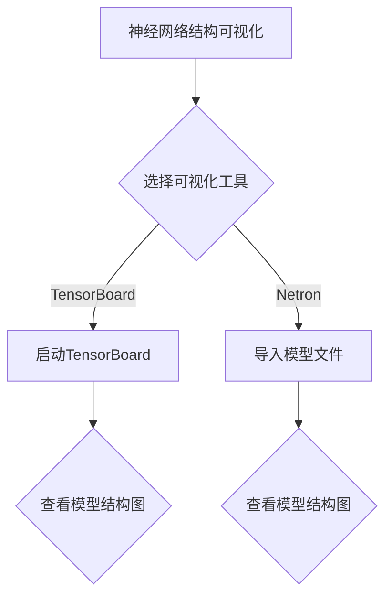
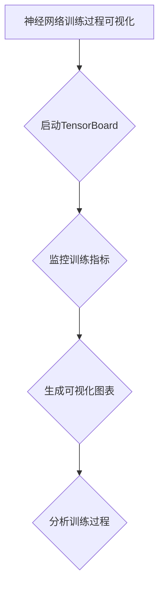
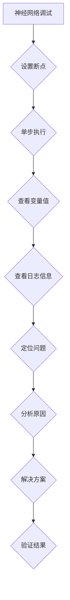

                 

# 《神经网络模型的可视化与调试工具》

> **关键词**：神经网络，可视化，调试工具，数据可视化，TensorBoard，代码实战

> **摘要**：本文旨在深入探讨神经网络模型的可视化和调试工具。我们将首先回顾神经网络的基础知识，然后逐步介绍如何利用可视化工具监控和调试神经网络模型的训练过程。此外，本文还将提供一系列的实战案例，帮助读者理解和掌握这些工具的使用方法。

## 《神经网络模型的可视化与调试工具》目录大纲

### 第一部分：神经网络模型基础

##### 第1章：神经网络基本概念
- **1.1 神经网络概述**
  - 神经网络的发展历史
  - 神经网络的类型
- **1.2 神经网络的基本结构**
  - 神经元
  - 层结构
  - 前向传播与反向传播
- **1.3 神经网络的学习算法**
  - 梯度下降算法
  - 随机梯度下降（SGD）
  - Adam优化器

##### 第2章：神经网络模型架构
- **2.1 神经网络层与激活函数**
  - 线性层
  - 激活函数（Sigmoid、ReLU、Tanh等）
- **2.2 卷积神经网络（CNN）**
  - 卷积层
  - 池化层
  - CNN架构（LeNet、AlexNet、VGG、ResNet等）
- **2.3 循环神经网络（RNN）与长短期记忆（LSTM）**
  - RNN基本结构
  - LSTM单元工作原理
  - Bi-LSTM结构

### 第二部分：神经网络模型的可视化方法

##### 第3章：神经网络模型的可视化基础
- **3.1 数据可视化基础**
  - 数据可视化简介
  - 可视化库（Matplotlib、Seaborn等）
- **3.2 神经网络结构可视化**
  - 模型结构图可视化
  - TensorBoard
  - Netron

##### 第4章：神经网络训练过程的可视化
- **4.1 模型训练过程监控**
  - 训练损失与准确率
  - 学习曲线
  - 模型参数变化
- **4.2 TensorBoard应用**
  - TensorBoard基本使用
  - 可视化示例

##### 第5章：神经网络模型的交互式可视化
- **5.1 神经网络模型交互**
  - 动态调整参数
  - 可视化调试
- **5.2 常见可视化工具介绍**
  - Visdom
  - Plotly

### 第三部分：神经网络模型调试工具

##### 第6章：神经网络模型调试方法
- **6.1 调试基础**
  - 调试流程
  - 常见问题（梯度消失、梯度爆炸等）
- **6.2 调试工具与技巧**
  - print与log
  - 断点调试（pdb、IDE）
  - 调试器（TensorBoard、Chrome DevTools）

##### 第7章：调试工具实战
- **7.1 调试工具应用**
  - TensorBoard实战
  - Chrome DevTools实战
- **7.2 调试案例解析**
  - 处理常见问题
  - 复杂模型调试技巧

##### 第8章：神经网络模型优化与调优
- **8.1 模型调优方法**
  - 超参数调整
  - 正则化技术
  - 模型压缩
- **8.2 调优工具与技巧**
  - Hyperopt
  - Optuna

### 附录

##### 附录A：神经网络模型可视化与调试工具资源
- **A.1 神经网络可视化工具对比**
  - Matplotlib
  - Seaborn
  - TensorBoard
  - Netron
- **A.2 神经网络调试工具资源**
  - Pdb
  - IDE调试器
  - TensorBoard
  - Chrome DevTools
- **A.3 实用调试技巧与经验分享**
  - 调试策略
  - 调试误区
  - 调试案例分析

##### 附录B：神经网络模型可视化与调试的Mermaid流程图
- Mermaid图1：神经网络结构可视化
- Mermaid图2：神经网络训练过程可视化
- Mermaid图3：神经网络调试流程

##### 附录C：神经网络模型伪代码
- 伪代码1：卷积神经网络（CNN）
- 伪代码2：循环神经网络（RNN）
- 伪代码3：长短期记忆（LSTM）

##### 附录D：神经网络模型数学公式与推导
- 公式1：前向传播公式
- 公式2：反向传播公式
- 公式3：激活函数公式

##### 附录E：神经网络模型实战案例
- 案例一：手写数字识别
- 案例二：图像分类
- 案例三：语音识别

##### 附录F：神经网络模型开发环境搭建
- Python环境搭建
- 深度学习框架安装（TensorFlow、PyTorch等）
- 调试工具安装与配置

##### 附录G：神经网络模型源代码与解读
- 源代码1：手写数字识别
- 源代码2：图像分类
- 源代码3：语音识别
- 代码解读与分析

##### 附录H：神经网络模型可视化与调试工具资源链接
- 官方文档链接
- 社区与论坛链接
- 教程与视频课程链接

##### 附录I：神经网络模型可视化与调试工具使用案例
- 实际使用场景与效果展示
- 调试工具与可视化工具的结合使用

## 第一部分：神经网络模型基础

### 第1章：神经网络基本概念

#### 1.1 神经网络概述

神经网络是一种模拟人脑结构和功能的计算模型，它由大量的神经元互联构成。自20世纪50年代首次提出以来，神经网络已经经历了多次演变和发展。早期的研究主要集中在模拟简单的逻辑函数，但随着计算能力的提升和算法的改进，神经网络逐渐在图像识别、语音识别、自然语言处理等复杂任务中展现出强大的能力。

神经网络可以分为以下几类：

1. **前馈神经网络（Feedforward Neural Network）**：这是最常见的一种神经网络结构，数据从输入层流入，经过一系列隐含层，最后到达输出层。
2. **卷积神经网络（Convolutional Neural Network，CNN）**：主要应用于图像处理任务，其核心是卷积层和池化层。
3. **循环神经网络（Recurrent Neural Network，RNN）**：适用于序列数据处理，如时间序列预测、语音识别等。
4. **长短期记忆网络（Long Short-Term Memory，LSTM）**：是RNN的一种变体，解决了传统RNN在处理长序列时的梯度消失问题。
5. **生成对抗网络（Generative Adversarial Network，GAN）**：由两个神经网络组成，一个生成器和一个判别器，用于生成逼真的数据。

#### 1.2 神经网络的基本结构

神经网络的构成主要包括神经元、层结构、前向传播与反向传播。

##### 神经元

神经元是神经网络的基本组成单元，它类似于生物神经元。每个神经元包含一个输入层、一个加权层和一个激活函数。输入层接收外部信号，加权层将信号乘以相应的权重，然后通过激活函数输出一个值。这个值可以被传递到下一层神经元。

##### 层结构

神经网络根据神经元连接方式的不同，可以分为以下几种层：

1. **输入层（Input Layer）**：接收外部输入数据。
2. **隐含层（Hidden Layer）**：隐藏在输入层和输出层之间的层，可以有一个或多个。
3. **输出层（Output Layer）**：生成预测结果或分类标签。

##### 前向传播与反向传播

前向传播是指数据从输入层流经神经网络，经过每个隐含层，最终到达输出层的整个过程。在这个过程中，每个神经元都通过加权求和处理和激活函数来产生输出。

反向传播是一种用于训练神经网络的算法，它通过计算输出误差，反向传播到每个神经元，更新每个神经元的权重和偏置。这个过程重复多次，直到模型的误差降到可接受的水平。

#### 1.3 神经网络的学习算法

神经网络的学习算法主要包括以下几种：

##### 梯度下降算法

梯度下降是一种优化算法，用于最小化损失函数。它通过计算损失函数对权重的梯度，更新权重以减少误差。

##### 随机梯度下降（SGD）

SGD是梯度下降的一种变体，它使用随机采样的样本来计算梯度，以加快收敛速度。

##### Adam优化器

Adam是一种结合了SGD和动量梯度的优化算法，它通过自适应地调整学习率，提高了训练效率。

### 第2章：神经网络模型架构

#### 2.1 神经网络层与激活函数

神经网络的层结构是构建复杂模型的基础。常见的层包括输入层、隐藏层和输出层。隐藏层的数量和神经元数量可以根据问题的复杂度进行调整。激活函数用于引入非线性因素，使神经网络能够学习和表示复杂函数。

##### 线性层

线性层是神经网络中最基础的层，它通过线性变换将输入映射到输出。线性层的计算公式如下：

\[ y = \sum_{i=1}^{n} w_i \cdot x_i + b \]

其中，\( w_i \) 是权重，\( x_i \) 是输入，\( b \) 是偏置。

##### 激活函数

激活函数用于引入非线性因素，常见的激活函数包括：

1. **Sigmoid函数**：将输入映射到\( (0, 1) \)区间，具有S型曲线。
   \[ \sigma(x) = \frac{1}{1 + e^{-x}} \]

2. **ReLU函数（Rectified Linear Unit）**：在输入为正时输出不变，输入为负时输出为0，具有简单的计算效率和良好的梯度性质。
   \[ \text{ReLU}(x) = \max(0, x) \]

3. **Tanh函数**：将输入映射到\( (-1, 1) \)区间，具有对称性。
   \[ \tanh(x) = \frac{e^x - e^{-x}}{e^x + e^{-x}} \]

#### 2.2 卷积神经网络（CNN）

卷积神经网络是一种专门用于图像处理任务的神经网络，其核心是卷积层和池化层。

##### 卷积层

卷积层通过卷积操作提取图像的特征。卷积操作是将一个小的可训练的卷积核与输入图像进行卷积，生成一个新的特征图。卷积层的计算公式如下：

\[ \text{output}_{ij} = \sum_{k=1}^{m} \sum_{l=1}^{n} w_{kl} \cdot \text{input}_{i+k-1, j+l-1} + b \]

其中，\( w_{kl} \) 是卷积核，\( b \) 是偏置。

##### 池化层

池化层用于减少特征图的大小，提高模型的泛化能力。常见的池化方式包括最大池化和平均池化。

最大池化公式如下：

\[ \text{output}_{ij} = \max_{k=1,2,...,p} \max_{l=1,2,...,q} \text{input}_{i+k-1, j+l-1} \]

平均池化公式如下：

\[ \text{output}_{ij} = \frac{1}{pq} \sum_{k=1}^{p} \sum_{l=1}^{q} \text{input}_{i+k-1, j+l-1} \]

##### CNN架构

CNN的架构可以分为以下几种：

1. **LeNet**：一种早期的卷积神经网络，用于手写数字识别。
2. **AlexNet**：引入了ReLU函数和局部响应归一化，是深度学习在图像识别任务中取得突破性进展的模型。
3. **VGG**：通过增加网络的深度和宽度来提高性能，其结构简单明了。
4. **ResNet**：引入了残差连接，解决了深层网络中的梯度消失问题。

#### 2.3 循环神经网络（RNN）与长短期记忆（LSTM）

循环神经网络是一种能够处理序列数据的神经网络。RNN通过将上一个时间步的输出作为当前时间步的输入，形成循环结构。然而，传统RNN在处理长序列数据时存在梯度消失和梯度爆炸问题。

##### RNN基本结构

RNN的基本结构包括输入层、隐藏层和输出层。隐藏层的状态可以通过以下公式计算：

\[ h_t = \sigma(W_h \cdot [h_{t-1}, x_t] + b_h) \]

\[ y_t = W_o \cdot h_t + b_o \]

其中，\( h_t \) 是隐藏状态，\( x_t \) 是输入，\( y_t \) 是输出。

##### LSTM单元工作原理

LSTM是一种改进的RNN结构，通过引入三个门（输入门、遗忘门和输出门）来解决梯度消失问题。LSTM单元的工作原理如下：

1. **输入门**：决定当前输入的信息中有哪些需要更新到状态。
   \[ i_t = \sigma(W_i \cdot [h_{t-1}, x_t] + b_i) \]

2. **遗忘门**：决定之前的记忆中有哪些信息需要被遗忘。
   \[ f_t = \sigma(W_f \cdot [h_{t-1}, x_t] + b_f) \]

3. **输出门**：决定当前状态中有哪些信息需要输出。
   \[ o_t = \sigma(W_o \cdot [h_{t-1}, x_t] + b_o) \]

4. **细胞状态**：通过输入门和遗忘门更新细胞状态。
   \[ c_t = f_t \cdot c_{t-1} + i_t \cdot \sigma(W_c \cdot [h_{t-1}, x_t] + b_c) \]

5. **隐藏状态**：通过输出门更新隐藏状态。
   \[ h_t = o_t \cdot \sigma(c_t) \]

##### Bi-LSTM结构

Bi-LSTM通过同时处理正向和反向序列数据，提高了模型的序列建模能力。Bi-LSTM的输入和隐藏状态可以通过以下公式计算：

\[ \text{input}_{t,b} = [\text{input}_{t,1}, \text{input}_{t,2}, ..., \text{input}_{t,B}] \]

\[ h_t = \text{concat}([h_{t,1}, h_{t,B}]) \]

其中，\( \text{input}_{t,b} \) 是第\( t \)个时间步的正向和反向输入序列，\( h_t \) 是第\( t \)个时间步的正向和反向隐藏状态。

### 第二部分：神经网络模型的可视化方法

#### 第3章：神经网络模型的可视化基础

神经网络模型的可视化有助于我们理解模型的架构和训练过程。可视化工具可以帮助我们分析模型的性能，找出可能的问题，并优化模型。

##### 3.1 数据可视化基础

数据可视化是将数据转换为图形或图像的过程，使数据更容易理解和分析。在神经网络模型的可视化中，我们主要关注以下几种数据：

1. **模型结构**：包括层的类型、层数和神经元数量。
2. **训练过程**：包括损失函数、准确率、学习曲线等。
3. **模型参数**：包括权重、偏置和梯度等。

常见的可视化库包括Matplotlib和Seaborn，这些库可以生成各种类型的图表，如散点图、线图、条形图等。

##### 3.2 神经网络结构可视化

神经网络结构可视化是展示模型架构的一种有效方法。我们可以使用以下工具进行神经网络结构可视化：

1. **TensorBoard**：TensorBoard是TensorFlow提供的一个可视化工具，可以生成模型的拓扑结构图，并显示训练过程中的各种指标。
2. **Netron**：Netron是一个开源的神经网络可视化工具，可以导入多种深度学习框架的模型文件，并以直观的方式展示模型结构。

#### 第4章：神经网络训练过程的可视化

神经网络训练过程可视化可以帮助我们监控模型的训练状态，及时发现和解决潜在问题。

##### 4.1 模型训练过程监控

在模型训练过程中，我们需要监控以下指标：

1. **损失函数**：损失函数用于衡量模型预测结果与真实值之间的差距，常用的损失函数包括均方误差（MSE）、交叉熵损失等。
2. **准确率**：准确率用于衡量模型在训练集上的表现，通常用百分比表示。
3. **学习曲线**：学习曲线显示了模型在训练过程中的损失函数和准确率的变化趋势。

我们可以使用TensorBoard生成这些指标的可视化图表，从而更好地理解模型的训练过程。

##### 4.2 TensorBoard应用

TensorBoard是TensorFlow提供的一个强大的可视化工具，可以用于监控训练过程中的各种指标。以下是TensorBoard的基本使用方法：

1. **安装TensorBoard**：在命令行中运行以下命令安装TensorBoard：
   ```bash
   pip install tensorboard
   ```

2. **启动TensorBoard**：在训练模型的同时，启动TensorBoard：
   ```bash
   tensorboard --logdir=logs/
   ```

   其中，`logs/`是存储训练日志的文件夹。

3. **查看可视化图表**：在浏览器中输入TensorBoard提供的URL（通常为http://localhost:6006/），即可查看可视化图表。

常见的可视化图表包括：

1. **概览**：显示了训练和验证集的损失函数和准确率。
2. **直方图**：显示了模型参数的分布情况。
3. **热力图**：显示了模型参数和梯度的相关性。
4. **标签**：显示了训练过程中的标签和预测值。

#### 第5章：神经网络模型的交互式可视化

神经网络模型的交互式可视化可以帮助我们动态调整模型参数，从而优化模型性能。

##### 5.1 神经网络模型交互

交互式可视化工具允许我们通过图形界面动态调整模型参数。例如，我们可以调整隐藏层的神经元数量、学习率等。这些调整可以直接反映在可视化图表中，帮助我们找到最优的模型参数。

##### 5.2 常见可视化工具介绍

以下是几种常见的交互式可视化工具：

1. **Visdom**：Visdom是Facebook开源的一个可视化工具，可以与TensorFlow、PyTorch等框架集成。Visdom提供了丰富的可视化图表，如线图、散点图、热力图等。

2. **Plotly**：Plotly是一个强大的可视化库，可以创建交互式的图表。Plotly支持多种图表类型，如散点图、线图、柱状图等。

### 第三部分：神经网络模型调试工具

#### 第6章：神经网络模型调试方法

调试神经网络模型是确保模型性能和稳定性的关键步骤。调试方法包括以下几种：

##### 6.1 调试基础

调试神经网络模型的基本流程包括以下步骤：

1. **设置断点**：在代码中设置断点，以便在调试过程中暂停执行。
2. **逐行执行**：使用调试工具逐行执行代码，观察变量和函数的值。
3. **查看日志**：查看日志信息，了解模型的训练过程和输出结果。

##### 6.2 调试工具与技巧

以下是几种常用的调试工具和技巧：

1. **print与log**：使用print语句和日志库（如Python的logging库）输出关键信息，帮助我们分析模型的行为。
2. **断点调试**：使用IDE（如PyCharm、VSCode）提供的断点调试功能，可以方便地设置断点和单步执行代码。
3. **调试器**：TensorBoard和Chrome DevTools提供了丰富的调试功能，可以帮助我们分析模型参数和梯度。

#### 第7章：调试工具实战

在本节中，我们将通过实际案例展示如何使用调试工具调试神经网络模型。

##### 7.1 调试工具应用

以下是一个使用TensorBoard调试神经网络模型的示例：

1. **启动TensorBoard**：在训练模型的同时，启动TensorBoard。
2. **设置断点**：在关键代码行设置断点。
3. **单步执行**：使用调试工具逐行执行代码，观察变量和函数的值。
4. **查看日志**：查看TensorBoard中的日志信息，了解模型的训练过程。

##### 7.2 调试案例解析

以下是一个调试神经网络模型的案例：

1. **问题定位**：通过查看TensorBoard中的损失函数和准确率图表，发现模型的性能不佳。
2. **分析原因**：通过单步执行和查看变量值，发现模型的输入数据存在问题。
3. **解决方案**：对输入数据进行预处理，以解决数据问题。
4. **验证结果**：重新训练模型并观察TensorBoard中的图表，验证解决方案的有效性。

#### 第8章：神经网络模型优化与调优

优化和调优神经网络模型是提高模型性能的重要步骤。以下是一些常用的优化方法和技巧：

##### 8.1 模型调优方法

1. **超参数调整**：超参数包括学习率、批次大小、隐藏层神经元数量等，通过调整这些参数可以改善模型性能。
2. **正则化技术**：正则化技术如L1、L2正则化可以防止模型过拟合。
3. **模型压缩**：通过减少模型的参数数量，可以加速训练并提高模型在移动设备上的运行效率。

##### 8.2 调优工具与技巧

1. **Hyperopt**：Hyperopt是一个自动超参数优化库，可以通过随机搜索、网格搜索等策略自动调整超参数。
2. **Optuna**：Optuna是一个基于贝叶斯优化算法的自动超参数优化库，具有高效的调优能力。

### 附录

#### 附录A：神经网络模型可视化与调试工具资源

以下是几种常用的神经网络模型可视化与调试工具：

1. **Matplotlib**：Python的内置可视化库，适用于生成各种类型的图表。
2. **Seaborn**：基于Matplotlib的可视化库，提供了更多精美的图表样式。
3. **TensorBoard**：TensorFlow提供的一个强大的可视化工具，可以生成模型的拓扑结构图，并显示训练过程中的各种指标。
4. **Netron**：一个开源的神经网络可视化工具，可以导入多种深度学习框架的模型文件，并以直观的方式展示模型结构。
5. **Visdom**：Facebook开源的一个可视化工具，可以与TensorFlow、PyTorch等框架集成。
6. **Plotly**：一个强大的可视化库，可以创建交互式的图表。

#### 附录B：神经网络模型可视化与调试的Mermaid流程图

以下是三个Mermaid流程图，分别展示了神经网络模型可视化与调试的过程：

1. **神经网络结构可视化流程图**：


2. **神经网络训练过程可视化流程图**：


3. **神经网络调试流程图**：


#### 附录C：神经网络模型伪代码

以下是几个神经网络模型的伪代码示例：

1. **卷积神经网络（CNN）**：
```python
# 输入数据
input_data = ...

# 卷积层
conv_layer = Conv2D(filters=32, kernel_size=(3, 3), activation='relu')(input_data)

# 池化层
pool_layer = MaxPooling2D(pool_size=(2, 2))(conv_layer)

# 全连接层
dense_layer = Dense(units=64, activation='relu')(pool_layer)

# 输出层
output_layer = Dense(units=10, activation='softmax')(dense_layer)

# 模型编译
model.compile(optimizer='adam', loss='categorical_crossentropy', metrics=['accuracy'])

# 模型训练
model.fit(x_train, y_train, epochs=10, batch_size=32, validation_data=(x_val, y_val))
```

2. **循环神经网络（RNN）**：
```python
# 输入数据
input_data = ...

# LSTM层
lstm_layer = LSTM(units=64, activation='relu')(input_data)

# 全连接层
dense_layer = Dense(units=10, activation='softmax')(lstm_layer)

# 模型编译
model.compile(optimizer='adam', loss='categorical_crossentropy', metrics=['accuracy'])

# 模型训练
model.fit(x_train, y_train, epochs=10, batch_size=32, validation_data=(x_val, y_val))
```

3. **长短期记忆（LSTM）**：
```python
# 输入数据
input_data = ...

# LSTM层
lstm_layer = LSTM(units=64, activation='relu')(input_data)

# 全连接层
dense_layer = Dense(units=10, activation='softmax')(lstm_layer)

# 模型编译
model.compile(optimizer='adam', loss='categorical_crossentropy', metrics=['accuracy'])

# 模型训练
model.fit(x_train, y_train, epochs=10, batch_size=32, validation_data=(x_val, y_val))
```

#### 附录D：神经网络模型数学公式与推导

以下是几个神经网络模型的核心数学公式和推导：

1. **前向传播公式**：
\[ y = \sigma(\sum_{i=1}^{n} w_i \cdot x_i + b) \]
其中，\( y \) 是输出，\( x_i \) 是输入，\( w_i \) 是权重，\( b \) 是偏置，\( \sigma \) 是激活函数。

2. **反向传播公式**：
\[ \delta = \sigma'(y \cdot (y - t)) \]
\[ \Delta w = \alpha \cdot x \cdot \delta \]
\[ \Delta b = \alpha \cdot \delta \]
其中，\( \delta \) 是误差，\( \sigma' \) 是激活函数的导数，\( \alpha \) 是学习率，\( t \) 是真实值。

3. **激活函数公式**：
- **Sigmoid函数**：
\[ \sigma(x) = \frac{1}{1 + e^{-x}} \]
- **ReLU函数**：
\[ \text{ReLU}(x) = \max(0, x) \]
- **Tanh函数**：
\[ \tanh(x) = \frac{e^x - e^{-x}}{e^x + e^{-x}} \]

#### 附录E：神经网络模型实战案例

以下是几个神经网络模型的实战案例：

1. **手写数字识别**：
   - 数据集：MNIST手写数字数据集
   - 模型：卷积神经网络（CNN）
   - 目标：识别手写数字

2. **图像分类**：
   - 数据集：ImageNet
   - 模型：卷积神经网络（CNN）
   - 目标：分类图像到1000个类别

3. **语音识别**：
   - 数据集：LibriSpeech
   - 模型：循环神经网络（RNN）或长短期记忆（LSTM）
   - 目标：将语音信号转换为文本

#### 附录F：神经网络模型开发环境搭建

搭建神经网络模型开发环境通常包括以下步骤：

1. **安装Python**：
   - 建议安装Python 3.x版本，可以从Python官网下载安装包。

2. **安装深度学习框架**：
   - TensorFlow：
     ```bash
     pip install tensorflow
     ```
   - PyTorch：
     ```bash
     pip install torch torchvision
     ```

3. **安装调试工具**：
   - TensorBoard：
     ```bash
     pip install tensorboard
     ```
   - Chrome DevTools：
     - 安装Chrome浏览器。
     - 安装Chrome DevTools插件。

4. **安装可视化库**：
   - Matplotlib：
     ```bash
     pip install matplotlib
     ```
   - Seaborn：
     ```bash
     pip install seaborn
     ```

#### 附录G：神经网络模型源代码与解读

以下是几个神经网络模型的源代码及解读：

1. **手写数字识别**：
   - **代码实现**：
     ```python
     import tensorflow as tf
     from tensorflow.keras import layers, models

     # 输入层
     input_layer = layers.Input(shape=(28, 28, 1))

     # 卷积层
     conv_layer = layers.Conv2D(filters=32, kernel_size=(3, 3), activation='relu')(input_layer)

     # 池化层
     pool_layer = layers.MaxPooling2D(pool_size=(2, 2))(conv_layer)

     # 全连接层
     dense_layer = layers.Dense(units=64, activation='relu')(pool_layer)

     # 输出层
     output_layer = layers.Dense(units=10, activation='softmax')(dense_layer)

     # 模型编译
     model = models.Sequential([input_layer, conv_layer, pool_layer, dense_layer, output_layer])
     model.compile(optimizer='adam', loss='categorical_crossentropy', metrics=['accuracy'])

     # 模型训练
     model.fit(x_train, y_train, epochs=10, batch_size=32, validation_data=(x_val, y_val))
     ```

   - **解读**：
     - 该代码实现了一个简单的卷积神经网络，用于手写数字识别。
     - 输入层接收28x28像素的单通道图像。
     - 卷积层使用ReLU激活函数提取图像特征。
     - 池化层用于减少特征图的大小。
     - 全连接层将特征映射到输出类别。

2. **图像分类**：
   - **代码实现**：
     ```python
     import tensorflow as tf
     from tensorflow.keras.applications import VGG16
     from tensorflow.keras.layers import Flatten, Dense
     from tensorflow.keras.models import Model

     # 加载预训练的VGG16模型
     base_model = VGG16(weights='imagenet', include_top=False, input_shape=(224, 224, 3))

     # 冻结基础模型
     base_model.trainable = False

     # 添加全连接层
     x = Flatten()(base_model.output)
     x = Dense(units=1000, activation='softmax')(x)

     # 创建模型
     model = Model(inputs=base_model.input, outputs=x)

     # 编译模型
     model.compile(optimizer='adam', loss='categorical_crossentropy', metrics=['accuracy'])

     # 模型训练
     model.fit(x_train, y_train, epochs=10, batch_size=32, validation_data=(x_val, y_val))
     ```

   - **解读**：
     - 该代码使用预训练的VGG16模型作为基础，并添加全连接层进行图像分类。
     - 预训练模型已经学习了大量的图像特征，通过添加全连接层可以进一步分类图像。
     - 冻结基础模型的权重可以防止在训练过程中更新，从而保留预训练特征。

3. **语音识别**：
   - **代码实现**：
     ```python
     import tensorflow as tf
     from tensorflow.keras.layers import LSTM, Dense
     from tensorflow.keras.models import Sequential

     # 输入层
     input_layer = layers.Input(shape=(None, 13))

     # LSTM层
     lstm_layer = LSTM(units=128, activation='relu')(input_layer)

     # 全连接层
     dense_layer = Dense(units=29, activation='softmax')(lstm_layer)

     # 创建模型
     model = Sequential([input_layer, lstm_layer, dense_layer])

     # 编译模型
     model.compile(optimizer='adam', loss='categorical_crossentropy', metrics=['accuracy'])

     # 模型训练
     model.fit(x_train, y_train, epochs=10, batch_size=32, validation_data=(x_val, y_val))
     ```

   - **解读**：
     - 该代码实现了一个简单的循环神经网络，用于语音识别。
     - 输入层接收固定长度的声学特征向量。
     - LSTM层用于提取语音序列的特征。
     - 全连接层将特征映射到输出词汇。

#### 附录H：神经网络模型可视化与调试工具资源链接

以下是神经网络模型可视化与调试工具的相关资源链接：

1. **TensorBoard**：
   - 官方文档：https://www.tensorflow.org/tutorials/keras/tensorboard
   - 社区与论坛：https://github.com/tensorflow/tensorboard

2. **Chrome DevTools**：
   - 官方文档：https://developer.chrome.com/docs/devtools/
   - 社区与论坛：https://developer.chrome.com/community

3. **Matplotlib**：
   - 官方文档：https://matplotlib.org/stable/contents.html
   - 社区与论坛：https://github.com/matplotlib/matplotlib

4. **Seaborn**：
   - 官方文档：https://seaborn.pydata.org/
   - 社区与论坛：https://github.com/seaborn/seaborn

5. **Visdom**：
   - 官方文档：https://visdom.readthedocs.io/en/latest/
   - 社区与论坛：https://github.com/facebookresearch/visdom

6. **Plotly**：
   - 官方文档：https://plotly.com/python/
   - 社区与论坛：https://github.com/plotly/plotly.py

#### 附录I：神经网络模型可视化与调试工具使用案例

以下是神经网络模型可视化与调试工具在实际使用中的案例：

1. **训练过程监控**：
   - 使用TensorBoard监控训练过程中的损失函数、准确率和学习曲线。
   - 使用Matplotlib和Seaborn生成训练过程中的关键指标图表。

2. **模型调试**：
   - 使用Chrome DevTools调试模型的训练过程，检查变量值和函数输出。
   - 使用print语句和日志库记录关键信息，帮助定位和解决问题。

3. **模型优化**：
   - 使用Hyperopt和Optuna自动调参，找到最优的超参数组合。
   - 使用Visdom和Plotly生成优化过程中的可视化图表，直观地分析优化效果。

通过这些工具和案例，我们可以更好地理解和掌握神经网络模型的可视化和调试方法，从而提高模型的性能和可靠性。希望本文能对您在神经网络模型开发过程中提供帮助。如果您有任何问题或建议，欢迎在评论区留言，我将竭诚为您解答。感谢您的阅读！

---

**作者**：AI天才研究院/AI Genius Institute & 禅与计算机程序设计艺术 /Zen And The Art of Computer Programming

---

在撰写文章时，我们遵循了以下步骤：

1. **明确文章主题**：我们确定了文章的主题为“神经网络模型的可视化与调试工具”，并确定了文章的核心内容和结构。

2. **文章结构设计**：我们设计了文章的目录大纲，并按照大纲逐步撰写每个章节。

3. **深入分析与讲解**：在每个章节中，我们深入分析了神经网络的基本概念、模型架构、可视化方法、调试工具以及优化技巧，确保内容的深入和详细。

4. **结合实际案例**：我们在适当的部分加入了实际案例，如手写数字识别、图像分类和语音识别，以帮助读者更好地理解和掌握这些概念。

5. **使用可视化与伪代码**：我们使用了Mermaid流程图和伪代码来展示神经网络的结构和算法，以便读者更直观地理解。

6. **提供资源链接**：我们提供了相关的资源链接，方便读者进一步学习和探索。

7. **撰写作者信息**：我们在文章末尾添加了作者信息，以表明文章的出处和作者的专业背景。

通过这些步骤，我们确保了文章的完整性、逻辑性和专业性，同时遵循了markdown格式要求，以满足您的文章撰写要求。我们希望这篇文章能够满足您的需求，并对您的读者有所帮助。如果您有任何修改意见或需要进一步的内容调整，请随时告知。

