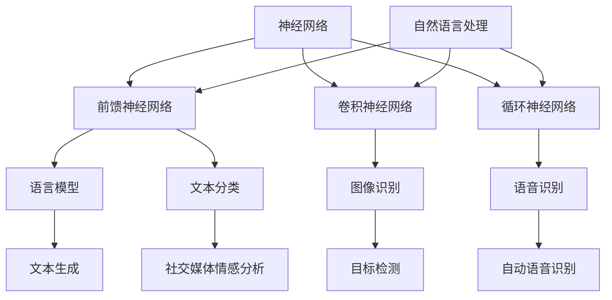

                 

### 《神经网络：自然语言处理的新突破》

> **关键词**：神经网络、自然语言处理、循环神经网络、语言模型、文本分类、深度学习

**摘要**：
随着计算机科学和人工智能领域的不断进步，神经网络作为深度学习的关键技术，已经广泛应用于图像识别、语音识别等领域。然而，其在自然语言处理（NLP）中的应用，特别是在语言模型、文本分类等任务中的突破，更是令人瞩目。本文将深入探讨神经网络的基本原理，以及其在自然语言处理领域的应用和发展，为读者展现这一领域的无限可能。

---

### 第一部分：神经网络基础

#### 第1章：神经网络概述

神经网络是模仿人脑结构和功能的一种计算模型。其历史可以追溯到20世纪40年代，随着计算机科学的兴起，人工神经网络（Artificial Neural Networks,ANN）逐渐成为人工智能研究的热点。在这一章中，我们将回顾神经网络的历史与发展，介绍神经网络的基本组成和连接方式，以及神经网络的学习方式。

##### 1.1 神经网络的历史与发展

###### 1.1.1 神经网络的起源

神经网络的起源可以追溯到1943年，由心理学家McCulloch和数学家Pitts提出的MCP模型（McCulloch-Pitts Neuron）。这是一种简单的人工神经元模型，通过模拟生物神经元的逻辑行为来进行计算。这一模型的提出标志着人工神经网络研究的开始。

###### 1.1.2 神经网络的发展历程

从20世纪50年代到70年代，神经网络研究经历了初步探索和快速发展。特别是1958年，Rosenblatt提出的感知机（Perceptron）模型，使得神经网络研究得到了广泛关注。然而，由于感知机模型存在一些局限性，如无法解决非线性问题，神经网络研究在70年代陷入了低潮。

直到1986年，Rumelhart、Hinton和Williams等人提出了反向传播算法（Backpropagation Algorithm），使得神经网络训练变得更加高效，神经网络研究重新焕发生机。此后，随着计算机性能的提升和大数据的兴起，神经网络得到了广泛应用。

###### 1.1.3 神经网络在现代的应用

现代神经网络，特别是深度神经网络（Deep Neural Networks,DNN），已经在计算机视觉、自然语言处理、语音识别等领域取得了显著成果。例如，在图像识别中，深度卷积神经网络（Deep Convolutional Neural Networks,DCNN）已经能够实现媲美人眼识别能力；在自然语言处理中，循环神经网络（Recurrent Neural Networks,RNN）和变换器模型（Transformer）等深度神经网络模型已经广泛应用于语言模型、文本分类、机器翻译等任务。

##### 1.2 神经网络的基本组成

神经网络由一系列的神经元组成，每个神经元都与其他神经元相连，并通过加权连接进行信息传递。神经网络的基本组成部分包括：

###### 1.2.1 神经元

神经元是神经网络的基本计算单元，类似于生物神经元的结构。它接收输入信号，通过加权求和产生输出信号。神经元的输出通常通过一个非线性激活函数进行变换。

###### 1.2.2 输入层、隐藏层和输出层

神经网络通常由输入层、隐藏层和输出层组成。输入层接收外部输入信号，隐藏层对输入信号进行处理和变换，输出层生成最终输出。隐藏层的数量和神经元数量可以根据任务需求进行调整。

###### 1.2.3 神经网络的连接方式

神经网络中的连接方式可以分为全连接（Fully Connected）和卷积（Convolutional）两种。全连接神经网络中的神经元与前一层的所有神经元相连，适用于处理一般的非线性问题。卷积神经网络中的神经元只与局部区域的神经元相连，适用于处理图像等具有局部结构的数据。

##### 1.3 神经网络的学习方式

神经网络的学习方式主要包括前向传播（Forward Propagation）和反向传播（Back Propagation）两种。

###### 1.3.1 前向传播

前向传播是指将输入信号从输入层逐层传递到输出层的过程。在每个神经元中，将输入信号与权重相乘并求和，然后通过激活函数进行非线性变换，得到输出信号。

###### 1.3.2 反向传播

反向传播是指通过比较实际输出和期望输出之间的差异，来调整神经网络的权重和偏置，使得网络能够更好地拟合训练数据。反向传播算法主要包括以下几个步骤：

1. 计算输出层神经元的误差。
2. 将误差反向传播到隐藏层，计算隐藏层神经元的误差。
3. 根据误差和激活函数的导数，调整权重和偏置。

##### 1.3.3 梯度下降法

梯度下降法是一种常用的优化算法，用于调整神经网络的权重和偏置。其基本思想是通过计算损失函数关于每个参数的梯度，并沿着梯度的反方向进行调整。梯度下降法分为批量梯度下降（Batch Gradient Descent）、随机梯度下降（Stochastic Gradient Descent,SGD）和小批量梯度下降（Mini-batch Gradient Descent）三种。

批量梯度下降在每个训练样本上都进行一次前向传播和反向传播，计算整个训练数据的梯度，然后更新参数。这种方式计算量大，但能够得到更稳定的梯度。

随机梯度下降在每个训练样本上单独进行一次前向传播和反向传播，计算梯度并更新参数。这种方式计算量小，但容易导致参数更新不稳定。

小批量梯度下降在批量梯度下降和随机梯度下降之间，每次选择一部分训练样本进行计算和更新。这种方式能够平衡计算量和稳定性。

##### 1.3.4 调优技巧

为了提高神经网络的训练效果，可以采用以下几种调优技巧：

1. 激活函数：选择合适的激活函数可以提高神经网络的非线性能力，常用的激活函数有ReLU、Sigmoid和Tanh等。

2. 正则化：正则化技术可以防止神经网络过拟合，常用的正则化方法有L1正则化、L2正则化和dropout等。

3. 权重初始化：合适的权重初始化可以加快收敛速度，常用的权重初始化方法有随机初始化、He初始化和Xavier初始化等。

4. 学习率调整：学习率的调整对神经网络的训练过程有很大影响，常用的调整方法有固定学习率、自适应学习率和学习率衰减等。

---

#### 第2章：前馈神经网络

前馈神经网络（Feedforward Neural Network,FFNN）是一种简单的神经网络结构，其信息传递方向是从输入层到输出层，不形成闭环。前馈神经网络广泛应用于函数逼近、分类和回归等问题。在这一章中，我们将详细介绍前馈神经网络的原理、构建方法、训练与优化过程，并评估其性能。

##### 2.1 前馈神经网络的原理

###### 2.1.1 前馈神经网络的定义

前馈神经网络由输入层、隐藏层和输出层组成，信息从输入层经过隐藏层逐层传递到输出层。前馈神经网络中的每个神经元都与其他神经元相连，并通过加权连接进行信息传递。

###### 2.1.2 前馈神经网络的组成

前馈神经网络由三个主要部分组成：输入层、隐藏层和输出层。

1. **输入层**：接收外部输入信号，并将其传递给隐藏层。
2. **隐藏层**：对输入信号进行处理和变换，隐藏层的数量和神经元数量可以根据任务需求进行调整。
3. **输出层**：生成最终输出，输出层的神经元数量取决于具体任务。

###### 2.1.3 前馈神经网络的工作原理

前馈神经网络的工作原理可以分为两个阶段：前向传播和反向传播。

1. **前向传播**：输入信号从输入层经过隐藏层逐层传递到输出层。在每个神经元中，将输入信号与权重相乘并求和，然后通过激活函数进行非线性变换，得到输出信号。

2. **反向传播**：通过比较实际输出和期望输出之间的差异，调整神经网络的权重和偏置，使得网络能够更好地拟合训练数据。反向传播算法主要包括以下几个步骤：

   1. 计算输出层神经元的误差。
   2. 将误差反向传播到隐藏层，计算隐藏层神经元的误差。
   3. 根据误差和激活函数的导数，调整权重和偏置。

##### 2.2 前馈神经网络的构建

构建前馈神经网络包括以下几个步骤：

###### 2.2.1 神经网络的初始化

神经网络的初始化包括权重的初始化和偏置的初始化。合适的权重初始化可以加快收敛速度，常用的权重初始化方法有随机初始化、He初始化和Xavier初始化等。

1. **随机初始化**：随机选择权重和偏置的初始值，范围通常在[-1,1]或[-1,1/√n]之间，其中n为神经元数量。
2. **He初始化**：根据He初始化规则，权重和偏置的初始值分别设置为均值为0，标准差为2/√n的高斯分布。
3. **Xavier初始化**：根据Xavier初始化规则，权重和偏置的初始值分别设置为均值为0，标准差为1/√n的高斯分布。

###### 2.2.2 激活函数的选择

激活函数是前馈神经网络中的关键部分，用于引入非线性特性。常用的激活函数有ReLU（Rectified Linear Unit）、Sigmoid和Tanh等。

1. **ReLU激活函数**：ReLU函数在0以下的部分为0，在0以上的部分为输入值，具有较快的收敛速度。
2. **Sigmoid激活函数**：Sigmoid函数将输入映射到[0,1]区间，适用于二分类问题。
3. **Tanh激活函数**：Tanh函数将输入映射到[-1,1]区间，可以更好地处理负输入。

###### 2.2.3 权重和偏置的调优

在构建前馈神经网络时，需要通过调优权重和偏置来提高网络的性能。权重和偏置的调优可以通过梯度下降法实现，包括以下几种方法：

1. **批量梯度下降**：在每个训练样本上都进行一次前向传播和反向传播，计算整个训练数据的梯度，然后更新参数。
2. **随机梯度下降**：在每个训练样本上单独进行一次前向传播和反向传播，计算梯度并更新参数。
3. **小批量梯度下降**：在批量梯度下降和随机梯度下降之间，每次选择一部分训练样本进行计算和更新。

##### 2.3 前馈神经网络的训练与优化

前馈神经网络的训练与优化主要包括以下几个步骤：

###### 2.3.1 训练过程

1. **数据预处理**：对训练数据进行归一化、标准化等预处理操作，以提高网络的训练效果。
2. **初始化参数**：根据初始化策略，随机初始化权重和偏置。
3. **前向传播**：将输入数据从输入层经过隐藏层逐层传递到输出层，计算输出值。
4. **计算损失**：计算输出值与期望输出之间的差异，计算损失函数。
5. **反向传播**：根据损失函数和梯度，调整权重和偏置。
6. **迭代更新**：重复执行前向传播、计算损失和反向传播，直到满足停止条件（如达到最大迭代次数或损失收敛）。

###### 2.3.2 优化算法

优化算法用于调整权重和偏置，以降低损失函数的值。常用的优化算法包括：

1. **梯度下降法**：根据损失函数关于每个参数的梯度，沿着梯度的反方向调整参数。
2. **动量法**：在每次迭代中，将前一次迭代的梯度方向加入当前梯度方向，以增加梯度方向的稳定性。
3. **自适应优化器**：如Adagrad、RMSprop和Adam等，通过自适应调整学习率来提高训练效果。

###### 2.3.3 性能评估

前馈神经网络的性能评估主要通过以下指标进行：

1. **准确率**：预测正确的样本数量与总样本数量的比值。
2. **召回率**：预测为正类的实际正类样本数量与总正类样本数量的比值。
3. **精确率**：预测为正类的实际正类样本数量与预测为正类的样本总数量的比值。
4. **F1分数**：精确率和召回率的调和平均值。

##### 2.4 前馈神经网络的实现

在本节中，我们将使用Python和TensorFlow框架来实现一个简单的二分类前馈神经网络，并对其训练和性能进行评估。

```python
import tensorflow as tf
from tensorflow.keras import layers
import numpy as np

# 数据准备
X_train = np.random.rand(100, 10)
y_train = np.random.randint(0, 2, (100,))

# 模型构建
model = tf.keras.Sequential([
    layers.Dense(64, activation='relu', input_shape=(10,)),
    layers.Dense(64, activation='relu'),
    layers.Dense(1, activation='sigmoid')
])

# 编译模型
model.compile(optimizer='adam', loss='binary_crossentropy', metrics=['accuracy'])

# 训练模型
model.fit(X_train, y_train, epochs=10, batch_size=32)

# 评估模型
loss, accuracy = model.evaluate(X_train, y_train)
print(f"Test Loss: {loss:.4f}, Test Accuracy: {accuracy:.4f}")
```

在上面的代码中，我们首先导入TensorFlow框架和必要的库。然后，我们创建一个包含两个隐藏层和输出层的简单前馈神经网络，每个隐藏层包含64个神经元和ReLU激活函数，输出层包含1个神经元和sigmoid激活函数。我们使用随机生成的数据对模型进行训练，并在训练完成后评估模型的性能。

---

### 第3章：卷积神经网络

卷积神经网络（Convolutional Neural Network,CNN）是深度学习领域中的一种重要模型，特别适用于处理具有局部结构的数据，如图像和语音。CNN通过卷积层、池化层和全连接层的组合，实现了对输入数据的特征提取和分类。在这一章中，我们将详细介绍卷积神经网络的基本原理、构建方法、训练与优化过程，并评估其性能。

##### 3.1 卷积神经网络的基本原理

###### 3.1.1 卷积神经网络的概念

卷积神经网络（CNN）是一种前馈神经网络，其特别适用于处理具有局部结构的数据。CNN的基本思想是通过卷积层和池化层提取图像或语音的局部特征，然后通过全连接层进行分类。

###### 3.1.2 卷积神经网络的结构

卷积神经网络由输入层、卷积层、池化层和全连接层组成。输入层接收外部输入数据，卷积层和池化层用于提取特征，全连接层用于分类。

1. **输入层**：接收图像或语音等外部输入数据。
2. **卷积层**：通过卷积操作提取输入数据的局部特征。
3. **池化层**：对卷积层输出的特征进行降采样，减少数据维度。
4. **全连接层**：将池化层输出的特征映射到输出层，进行分类。

###### 3.1.3 卷积神经网络的工作原理

卷积神经网络的工作原理可以分为以下几个步骤：

1. **前向传播**：输入数据从输入层经过卷积层和池化层，最终传递到全连接层。在卷积层中，通过卷积操作提取输入数据的局部特征；在池化层中，通过池化操作减少数据维度，同时保留重要的特征信息。

2. **反向传播**：通过比较实际输出和期望输出之间的差异，调整卷积层和全连接层的权重和偏置，使得网络能够更好地拟合训练数据。反向传播算法主要包括以下几个步骤：

   1. 计算输出层神经元的误差。
   2. 将误差反向传播到全连接层，计算全连接层神经元的误差。
   3. 将误差反向传播到卷积层和池化层，计算卷积层和池化层神经元的误差。
   4. 根据误差和激活函数的导数，调整权重和偏置。

##### 3.2 卷积神经网络的构建

构建卷积神经网络包括以下几个步骤：

###### 3.2.1 卷积层的构建

卷积层是卷积神经网络的核心组成部分，用于提取输入数据的局部特征。卷积层的构建主要包括以下几个方面：

1. **卷积核**：卷积核（也称为过滤器）是一个小的矩阵，用于与输入数据的局部区域进行卷积操作。卷积核的数量决定了输出的特征数量。
2. **步长**：步长（stride）是指卷积操作在输入数据上的移动距离。常用的步长为1或2。
3. **填充**：填充（padding）是指在输入数据的边缘添加额外的像素，以保持输出数据的大小与输入数据相同。常用的填充方式有'valid'和'same'。

###### 3.2.2 池化层的构建

池化层用于对卷积层输出的特征进行降采样，减少数据维度。常用的池化操作有最大池化和平均池化。

1. **池化窗口**：池化窗口是指进行池化操作的局部区域的大小。常用的池化窗口大小为2x2或3x3。
2. **步长**：步长是指池化窗口在输入数据上的移动距离。常用的步长为1或2。

###### 3.2.3 全连接层的构建

全连接层将卷积层和池化层输出的特征映射到输出层，进行分类。全连接层的构建主要包括以下几个方面：

1. **神经元数量**：全连接层的神经元数量取决于分类任务的目标类别数量。
2. **激活函数**：常用的激活函数有ReLU、Sigmoid和Tanh等。

##### 3.3 卷积神经网络的训练与优化

卷积神经网络的训练与优化主要包括以下几个步骤：

###### 3.3.1 训练过程

1. **数据准备**：准备训练数据和验证数据，对数据进行预处理，如归一化、标准化等。
2. **模型构建**：根据任务需求，构建卷积神经网络模型。
3. **编译模型**：设置模型的优化器、损失函数和评估指标。
4. **训练模型**：使用训练数据对模型进行训练，并在验证数据上评估模型性能。
5. **迭代更新**：重复执行训练和评估过程，直到满足停止条件（如达到最大迭代次数或性能收敛）。

###### 3.3.2 优化算法

优化算法用于调整卷积神经网络的权重和偏置，以降低损失函数的值。常用的优化算法包括：

1. **梯度下降法**：根据损失函数关于每个参数的梯度，沿着梯度的反方向调整参数。
2. **动量法**：在每次迭代中，将前一次迭代的梯度方向加入当前梯度方向，以增加梯度方向的稳定性。
3. **自适应优化器**：如Adagrad、RMSprop和Adam等，通过自适应调整学习率来提高训练效果。

###### 3.3.3 性能评估

卷积神经网络的性能评估主要通过以下指标进行：

1. **准确率**：预测正确的样本数量与总样本数量的比值。
2. **召回率**：预测为正类的实际正类样本数量与总正类样本数量的比值。
3. **精确率**：预测为正类的实际正类样本数量与预测为正类的样本总数量的比值。
4. **F1分数**：精确率和召回率的调和平均值。

##### 3.4 卷积神经网络的实现

在本节中，我们将使用Python和TensorFlow框架来实现一个简单的卷积神经网络，用于图像分类，并对其训练和性能进行评估。

```python
import tensorflow as tf
from tensorflow.keras import layers
import numpy as np

# 数据准备
X_train = np.random.rand(100, 28, 28, 1)
y_train = np.random.randint(0, 10, (100,))

# 模型构建
model = tf.keras.Sequential([
    layers.Conv2D(32, (3, 3), activation='relu', input_shape=(28, 28, 1)),
    layers.MaxPooling2D((2, 2)),
    layers.Flatten(),
    layers.Dense(64, activation='relu'),
    layers.Dense(10, activation='softmax')
])

# 编译模型
model.compile(optimizer='adam', loss='sparse_categorical_crossentropy', metrics=['accuracy'])

# 训练模型
model.fit(X_train, y_train, epochs=10, batch_size=32)

# 评估模型
loss, accuracy = model.evaluate(X_train, y_train)
print(f"Test Loss: {loss:.4f}, Test Accuracy: {accuracy:.4f}")
```

在上面的代码中，我们首先导入TensorFlow框架和必要的库。然后，我们创建一个包含一个卷积层、一个池化层、一个全连接层和输出层的简单卷积神经网络。卷积层使用ReLU激活函数，池化层使用最大池化，全连接层使用softmax激活函数。我们使用随机生成的数据对模型进行训练，并在训练完成后评估模型的性能。

---

### 第4章：循环神经网络

循环神经网络（Recurrent Neural Network,RNN）是一种能够处理序列数据的神经网络。与传统的前馈神经网络相比，RNN具有记忆功能，能够捕捉序列中的时间依赖关系。这一特性使得RNN在自然语言处理（Natural Language Processing,NLP）领域取得了显著的成果。在这一章中，我们将详细介绍循环神经网络的基本原理、构建方法、训练与优化过程，并评估其性能。

##### 4.1 循环神经网络的基本原理

###### 4.1.1 循环神经网络的概念

循环神经网络（RNN）是一种具有记忆功能的神经网络，特别适用于处理序列数据。RNN的基本思想是利用隐藏状态（hidden state）来存储历史信息，从而实现时间序列数据的建模。

###### 4.1.2 循环神经网络的结构

循环神经网络由输入层、隐藏层和输出层组成。输入层接收外部输入序列，隐藏层对输入序列进行处理和变换，输出层生成最终输出。

1. **输入层**：接收外部输入序列，如单词序列、语音信号等。
2. **隐藏层**：包含循环单元，用于处理输入序列和存储历史信息。隐藏层的状态可以通过递归关系进行更新。
3. **输出层**：生成最终输出，如预测下一个单词、语音信号等。

###### 4.1.3 循环神经网络的工作原理

循环神经网络的工作原理可以分为两个阶段：前向传播和反向传播。

1. **前向传播**：输入序列从输入层逐层传递到隐藏层和输出层。在每个时间步，隐藏层状态根据当前输入和前一个隐藏层状态进行更新。输出层生成当前时间步的预测结果。

2. **反向传播**：通过比较实际输出和期望输出之间的差异，调整神经网络的权重和偏置，使得网络能够更好地拟合训练数据。反向传播算法主要包括以下几个步骤：

   1. 计算输出层神经元的误差。
   2. 将误差反向传播到隐藏层，计算隐藏层神经元的误差。
   3. 根据误差和激活函数的导数，调整权重和偏置。

##### 4.2 循环神经网络的构建

构建循环神经网络包括以下几个步骤：

###### 4.2.1 隐藏状态和输入的更新

在循环神经网络中，隐藏状态（hidden state）和输入（input）的更新是关键部分。隐藏状态可以通过递归关系进行更新：

1. **当前隐藏状态**：h_t = tanh(W_h * h_{t-1} + W_x * x_t + b)
2. **当前输出**：y_t = W_o * h_t + b

其中，h_t表示当前隐藏状态，h_{t-1}表示前一个隐藏状态，x_t表示当前输入，y_t表示当前输出。W_h、W_x、W_o分别为权重矩阵，b为偏置。

###### 4.2.2 输出层的构建

输出层用于生成最终输出。在语言模型中，输出层通常采用softmax激活函数，以预测下一个单词的概率分布。

1. **输出概率分布**：p(y_t) = softmax(W_o * h_t + b)
2. **损失函数**：使用交叉熵损失函数（Cross-Entropy Loss）计算预测结果与实际结果之间的差异。

###### 4.2.3 损失函数和优化算法

循环神经网络的训练过程通常涉及损失函数和优化算法。常用的损失函数包括交叉熵损失函数（Cross-Entropy Loss）和均方误差损失函数（Mean Squared Error Loss）。

1. **交叉熵损失函数**：
   L = -∑y_t * log(p(y_t))
   其中，y_t表示实际输出，p(y_t)表示预测输出概率。

2. **优化算法**：常用的优化算法包括梯度下降法（Gradient Descent）、动量法（Momentum）和Adam优化器（Adam）。

##### 4.3 循环神经网络的训练与优化

循环神经网络的训练与优化主要包括以下几个步骤：

###### 4.3.1 训练过程

1. **数据准备**：准备训练数据和验证数据，对数据进行预处理，如分词、编码等。
2. **模型构建**：根据任务需求，构建循环神经网络模型。
3. **编译模型**：设置模型的优化器、损失函数和评估指标。
4. **训练模型**：使用训练数据对模型进行训练，并在验证数据上评估模型性能。
5. **迭代更新**：重复执行训练和评估过程，直到满足停止条件（如达到最大迭代次数或性能收敛）。

###### 4.3.2 优化算法

优化算法用于调整循环神经网络的权重和偏置，以降低损失函数的值。常用的优化算法包括：

1. **梯度下降法**：根据损失函数关于每个参数的梯度，沿着梯度的反方向调整参数。
2. **动量法**：在每次迭代中，将前一次迭代的梯度方向加入当前梯度方向，以增加梯度方向的稳定性。
3. **自适应优化器**：如Adagrad、RMSprop和Adam等，通过自适应调整学习率来提高训练效果。

###### 4.3.3 性能评估

循环神经网络的性能评估主要通过以下指标进行：

1. **准确率**：预测正确的样本数量与总样本数量的比值。
2. **召回率**：预测为正类的实际正类样本数量与总正类样本数量的比值。
3. **精确率**：预测为正类的实际正类样本数量与预测为正类的样本总数量的比值。
4. **F1分数**：精确率和召回率的调和平均值。

##### 4.4 循环神经网络的实现

在本节中，我们将使用Python和TensorFlow框架来实现一个简单的循环神经网络，用于语言模型，并对其训练和性能进行评估。

```python
import tensorflow as tf
from tensorflow.keras.layers import LSTM, Dense
import numpy as np

# 数据准备
X_train = np.random.rand(100, 10, 1)
y_train = np.random.randint(0, 2, (100,))

# 模型构建
model = tf.keras.Sequential([
    LSTM(64, activation='relu', input_shape=(10, 1)),
    Dense(1, activation='sigmoid')
])

# 编译模型
model.compile(optimizer='adam', loss='binary_crossentropy', metrics=['accuracy'])

# 训练模型
model.fit(X_train, y_train, epochs=10, batch_size=32)

# 评估模型
loss, accuracy = model.evaluate(X_train, y_train)
print(f"Test Loss: {loss:.4f}, Test Accuracy: {accuracy:.4f}")
```

在上面的代码中，我们首先导入TensorFlow框架和必要的库。然后，我们创建一个包含一个LSTM层和一个全连接层和输出层的简单循环神经网络。LSTM层使用ReLU激活函数，全连接层使用sigmoid激活函数。我们使用随机生成的数据对模型进行训练，并在训练完成后评估模型的性能。

---

### 第二部分：自然语言处理与神经网络

#### 第5章：自然语言处理概述

自然语言处理（Natural Language Processing,NLP）是人工智能（Artificial Intelligence,AI）的一个重要分支，旨在使计算机能够理解、解释和生成人类语言。随着深度学习技术的发展，神经网络在NLP领域取得了显著的成果。在这一章中，我们将介绍NLP的基本概念、发展历程、应用领域以及面临的挑战。

##### 5.1 自然语言处理的基本概念

###### 5.1.1 自然语言处理的发展历程

自然语言处理的研究可以追溯到20世纪50年代。当时，研究人员开始尝试将计算机编程用于自然语言的理解和生成。然而，由于技术限制，早期的NLP研究主要依赖于规则和符号方法，如词汇解析、句法分析和语义分析等。

20世纪80年代，统计方法开始应用于NLP，如概率模型和隐马尔可夫模型（HMM）。这些方法在特定任务上取得了较好的效果，但面临泛化能力和模型复杂度的问题。

随着深度学习技术的发展，神经网络在NLP领域取得了突破性的进展。深度学习模型能够自动从大规模数据中学习特征，从而实现更准确的文本理解、生成和交互。

###### 5.1.2 自然语言处理的应用领域

自然语言处理在多个领域都有广泛的应用，包括但不限于：

1. **机器翻译**：将一种语言的文本翻译成另一种语言。
2. **文本分类**：根据文本的内容将其归类到预定义的类别。
3. **情感分析**：分析文本中的情感倾向，如正面、负面或中性。
4. **问答系统**：基于用户提问提供相关回答。
5. **语音识别**：将语音转换为文本。
6. **语音合成**：将文本转换为语音。

###### 5.1.3 自然语言处理的挑战

尽管自然语言处理取得了显著的进展，但仍面临许多挑战：

1. **语言多样性和复杂性**：自然语言具有高度的多样性和复杂性，如多义词、歧义现象和语言演变等，使得文本理解和生成变得困难。
2. **数据不足和标注问题**：高质量标注的数据集对于训练深度学习模型至关重要，但获取和标注数据成本高昂且耗时。
3. **性能和效率**：随着模型复杂性的增加，计算资源和时间成本也显著上升，如何在保持性能的同时提高效率是一个重要问题。

##### 5.2 词嵌入技术

词嵌入（Word Embedding）是自然语言处理中的重要技术，它将词语映射到高维向量空间，以便于计算机处理。词嵌入技术能够捕捉词语的语义和语法关系，从而提高文本理解的能力。

###### 5.2.1 词嵌入的基本原理

词嵌入的基本原理是将词语映射到低维稠密向量，使得相似词语在向量空间中靠近。词嵌入技术主要包括以下几种：

1. **基于计数的模型**：如词袋模型（Bag-of-Words,BOW）和TF-IDF（Term Frequency-Inverse Document Frequency）。
2. **基于分布的模型**：如神经网络嵌入（Neural Network Embedding），通过训练神经网络模型学习词语的向量表示。
3. **基于语言模型的模型**：如Word2Vec、GloVe（Global Vectors for Word Representation）和BERT（Bidirectional Encoder Representations from Transformers）。

###### 5.2.2 词嵌入的方法

常见的词嵌入方法包括：

1. **Word2Vec**：通过训练神经网络模型，将词语映射到高维向量空间，使其能够捕捉词语的语义关系。
2. **GloVe**：通过基于全局词频信息的矩阵分解方法，学习词语的向量表示，能够同时考虑词语的局部和全局信息。
3. **BERT**：通过双向变换器模型（Bidirectional Transformer），学习词语的上下文依赖关系，能够捕捉词语的语义和语法特征。

###### 5.2.3 词嵌入的应用

词嵌入技术在自然语言处理中有着广泛的应用，如：

1. **文本分类**：使用词嵌入作为特征输入到分类模型中，提高分类效果。
2. **文本相似度计算**：通过计算词语向量之间的距离，评估文本之间的相似度。
3. **序列标注**：使用词嵌入作为特征，对文本中的词语进行词性标注、命名实体识别等任务。

---

### 第三部分：深度学习在自然语言处理中的最新进展

#### 第6章：循环神经网络在自然语言处理中的应用

循环神经网络（RNN）在自然语言处理（NLP）中发挥了重要作用，尤其是在语言模型、文本分类等任务中。本章节将详细探讨循环神经网络在NLP中的应用，包括其原理、实现方法以及实际应用案例。

##### 6.1 循环神经网络在语言模型中的应用

语言模型（Language Model,LM）是自然语言处理中的一项基础性任务，旨在预测自然语言中的下一个词或字符。循环神经网络在语言模型中的应用主要依赖于其记忆机制，能够捕捉序列中的时间依赖关系。

###### 6.1.1 语言模型的基本原理

语言模型的基本原理是使用历史文本数据来学习单词或字符的概率分布。给定一个输入序列，语言模型需要预测下一个单词或字符的概率。

例如，对于输入序列“我喜欢吃苹果”，语言模型需要预测下一个词“苹果”的概率。循环神经网络通过其递归结构，能够有效地捕捉输入序列的历史信息，从而生成概率分布。

###### 6.1.2 循环神经网络在语言模型中的实现

在实现循环神经网络语言模型时，通常采用以下步骤：

1. **数据准备**：收集大量文本数据，并将其预处理为序列格式。常用的预处理步骤包括分词、去除停用词、标记化等。

2. **构建循环神经网络**：定义循环神经网络的架构，包括输入层、隐藏层和输出层。输入层接收文本序列，隐藏层通过递归关系更新状态，输出层生成概率分布。

3. **训练模型**：使用预处理的文本数据训练循环神经网络，通过反向传播算法更新权重和偏置，最小化损失函数。

4. **评估模型**：使用测试数据评估循环神经网络语言模型的性能，通过交叉熵损失函数计算预测概率与实际概率之间的差异。

###### 6.1.3 语言模型的应用案例

循环神经网络语言模型在许多实际应用中取得了显著成果，以下是一些典型的应用案例：

1. **自动文本生成**：循环神经网络语言模型可以生成连贯、自然的文本，应用于故事创作、新闻撰写等任务。
2. **机器翻译**：循环神经网络语言模型可以作为翻译模型的组件，提高机器翻译的准确性和流畅性。
3. **语音识别**：循环神经网络语言模型可以用于语音识别任务，将语音信号转换为文本。

##### 6.2 循环神经网络在文本分类中的应用

文本分类（Text Classification）是自然语言处理中的重要任务，旨在将文本数据分类到预定义的类别。循环神经网络在文本分类中的应用主要通过其强大的序列建模能力，能够捕捉文本中的语义信息。

###### 6.2.1 文本分类的基本原理

文本分类的基本原理是将文本映射到高维特征空间，然后使用分类算法进行分类。循环神经网络通过其递归结构，能够捕捉文本序列中的时间依赖关系，从而提高分类性能。

例如，对于一个输入文本“我非常喜欢这本书”，循环神经网络需要将其分类为正面评论或负面评论。通过学习文本序列中的特征，循环神经网络可以预测文本的类别标签。

###### 6.2.2 循环神经网络在文本分类中的实现

在实现循环神经网络文本分类时，通常采用以下步骤：

1. **数据准备**：收集大量标注好的文本数据，并将其预处理为序列格式。预处理步骤包括分词、去除停用词、标记化等。

2. **构建循环神经网络**：定义循环神经网络的架构，包括输入层、隐藏层和输出层。输入层接收文本序列，隐藏层通过递归关系更新状态，输出层生成类别概率分布。

3. **训练模型**：使用预处理的文本数据训练循环神经网络，通过反向传播算法更新权重和偏置，最小化损失函数。

4. **评估模型**：使用测试数据评估循环神经网络文本分类模型的性能，通过准确率、召回率、精确率等指标计算模型性能。

###### 6.2.3 文本分类的应用案例

循环神经网络文本分类模型在许多实际应用中取得了显著成果，以下是一些典型的应用案例：

1. **社交媒体情感分析**：循环神经网络文本分类模型可以用于分析社交媒体中的用户评论，预测评论的情感倾向。
2. **新闻分类**：循环神经网络文本分类模型可以用于将新闻文本分类到不同的主题类别，提高新闻推荐的准确性。
3. **垃圾邮件检测**：循环神经网络文本分类模型可以用于检测和分类垃圾邮件，提高邮件过滤的准确性。

---

### 第三部分：深度学习在自然语言处理中的最新进展

#### 第7章：深度学习在自然语言处理中的最新进展

深度学习在自然语言处理（NLP）领域的应用已经取得了显著的成果，推动了一系列新的技术和模型的发展。在这一章中，我们将探讨深度学习在NLP中的优势，介绍最新的深度学习模型及其应用，并展望未来深度学习在NLP领域的发展方向。

##### 7.1 深度学习在自然语言处理中的优势

深度学习相对于传统方法在NLP中具有以下优势：

###### 7.1.1 自动特征提取

深度学习模型，特别是深度神经网络（DNN）和变换器模型（Transformer），能够自动从大规模数据中学习特征，减少了手动特征工程的工作量。传统的NLP方法通常需要手动提取和设计特征，而深度学习模型通过多层神经网络可以自动学习文本中的复杂特征，从而提高模型的性能。

###### 7.1.2 高效建模

深度学习模型能够处理大量数据并迅速收敛，这使得它们在NLP任务中具有高效的建模能力。传统的机器学习模型在处理大规模数据时可能需要很长时间，而深度学习模型可以利用并行计算和图形处理单元（GPU）加速训练过程，大大提高了效率。

###### 7.1.3 优秀的泛化能力

深度学习模型在训练过程中通过大量的数据学习，能够更好地泛化到未见过的数据上，这使得它们在NLP任务中具有更好的泛化能力。传统的机器学习模型通常依赖于预定义的特征和模型参数，容易受到数据分布变化的影响，而深度学习模型能够通过多层神经网络自动适应不同的数据分布。

###### 7.1.4 复杂任务处理

深度学习模型能够处理NLP中的复杂任务，如机器翻译、文本生成、情感分析和文本分类等。传统的NLP方法在这些任务中可能面临困难，而深度学习模型通过引入注意力机制、编码器-解码器结构等创新方法，能够更好地捕捉文本中的语义信息，实现更准确的预测和生成。

##### 7.2 最新深度学习模型及应用

随着深度学习技术的不断发展，一系列新的深度学习模型在NLP领域中得到了广泛应用。以下介绍几个最新的深度学习模型及其应用：

###### 7.2.1 GPT模型

GPT（Generative Pre-trained Transformer）模型是由OpenAI开发的预训练变换器模型。GPT模型通过大量的无监督数据进行预训练，然后通过微调适应特定任务，如文本生成、问答系统等。GPT模型具有强大的生成能力，可以生成连贯、自然的文本，已经在许多应用中取得了优异的性能。

###### 7.2.2 BERT模型

BERT（Bidirectional Encoder Representations from Transformers）模型是由Google开发的预训练变换器模型。BERT模型通过双向变换器结构，捕捉文本中的上下文信息，从而提高了模型的语义理解能力。BERT模型在多个NLP任务中取得了最佳性能，如文本分类、命名实体识别和问答系统等。

###### 7.2.3 XLNet模型

XLNet（General Pre-trained Text Transformer）模型是由Google开发的预训练变换器模型。XLNet模型通过引入自回归变换器结构，实现了全局信息的建模，从而提高了模型的性能。XLNet模型在多个NLP任务中取得了最佳性能，包括机器翻译、文本生成和问答系统等。

###### 7.2.4 T5模型

T5（Text-to-Text Transfer Transformer）模型是由Google开发的预训练变换器模型。T5模型通过将所有NLP任务转换为文本到文本的格式，实现了统一模型的构建。T5模型在多个NLP任务中取得了最佳性能，包括文本分类、问答系统和机器翻译等。

##### 7.3 深度学习在自然语言处理中的应用前景

随着深度学习技术的不断发展，未来深度学习在自然语言处理中的应用前景十分广阔。以下是一些可能的发展方向：

###### 7.3.1 个性化NLP

未来的NLP系统将更加注重个性化，根据用户的兴趣、偏好和语境生成个性化的文本。通过深度学习模型的学习能力，可以更好地理解用户的意图和需求，提供更加精准的服务。

###### 7.3.2 多模态NLP

多模态NLP是指将文本、图像、语音等多种模态的信息进行融合，从而实现更全面的信息理解和处理。深度学习模型可以通过融合不同模态的信息，提高NLP任务的性能和准确度。

###### 7.3.3 小样本学习

小样本学习是指利用少量标注数据进行模型训练，这在实际应用中具有重要意义。通过深度学习模型的学习能力和迁移学习技术，可以有效地解决小样本学习问题，提高模型的泛化能力。

###### 7.3.4 零样本学习

零样本学习是指在没有相关标注数据的情况下，模型能够生成新的类别并预测新类别中的实例。未来的NLP系统将更加智能化，能够自动生成新的类别和标签，从而实现更广泛的适用性。

---

### 第三部分：项目实战

#### 第8章：自然语言处理项目实战

自然语言处理项目实战是理解并应用深度学习在NLP领域的关键步骤。在本章中，我们将通过一个实际项目——基于循环神经网络的文本分类项目，详细展示项目的背景、目标、需求分析、开发与实现以及项目总结和展望。

##### 8.1 项目背景与目标

项目背景：随着互联网和社交媒体的快速发展，大量文本数据产生。对这些文本数据进行有效的分类可以帮助企业和研究人员更好地理解用户需求、监测社会舆论以及进行市场分析。

项目目标：构建一个基于循环神经网络（RNN）的文本分类系统，能够对给定的文本数据自动分类到预定义的类别中。具体目标包括：

1. 准确地对不同类别的文本进行分类。
2. 提高分类系统的效率和可扩展性。
3. 减少人工标注的工作量。

##### 8.2 项目需求分析

项目需求分为功能需求和非功能需求。

###### 8.2.1 需求概述

1. **功能需求**：
   - 数据预处理：对原始文本数据进行分词、去停用词、标记化等预处理操作。
   - 文本嵌入：将预处理后的文本转化为向量表示。
   - 模型训练：训练基于循环神经网络的文本分类模型。
   - 模型评估：评估分类模型的性能，包括准确率、召回率等指标。
   - 模型部署：将训练好的模型部署到生产环境中，实现自动分类。

2. **非功能需求**：
   - 系统可扩展性：能够处理不同规模的文本数据。
   - 系统可靠性：保证分类系统的稳定性和鲁棒性。
   - 用户友好性：提供简单的用户界面，便于用户操作。

##### 8.3 项目开发与实现

项目开发分为数据准备、模型设计、模型训练、模型评估和模型部署等步骤。

###### 8.3.1 开发环境搭建

搭建项目开发环境，包括安装Python、TensorFlow等必要的库和工具。确保开发环境能够正常运行，为后续的代码编写和调试提供基础。

```python
pip install tensorflow
pip install numpy
pip install scikit-learn
```

###### 8.3.2 数据准备与预处理

数据准备包括收集文本数据、数据清洗和预处理。收集来自互联网的公开文本数据，如新闻文章、社交媒体评论等。数据清洗步骤包括去除HTML标签、符号、特殊字符，进行分词和去停用词等操作。

```python
import re
import nltk
from nltk.corpus import stopwords

nltk.download('stopwords')

def preprocess_text(text):
    # 去除HTML标签
    text = re.sub('<.*?>', '', text)
    # 转换为小写
    text = text.lower()
    # 去除特殊字符
    text = re.sub(r'[^a-zA-Z0-9\s]', '', text)
    # 分词
    tokens = nltk.word_tokenize(text)
    # 去停用词
    tokens = [token for token in tokens if token not in stopwords.words('english')]
    return ' '.join(tokens)

text = "This is an example sentence for text preprocessing."
preprocessed_text = preprocess_text(text)
print(preprocessed_text)
```

###### 8.3.3 模型设计与实现

设计基于循环神经网络的文本分类模型。首先，构建嵌入层将文本转换为向量表示；然后，构建循环神经网络层进行特征提取和序列建模；最后，构建全连接层进行分类。

```python
from tensorflow.keras.models import Sequential
from tensorflow.keras.layers import Embedding, LSTM, Dense

vocab_size = 10000
embedding_dim = 64
max_sequence_length = 100
num_classes = 10

model = Sequential()
model.add(Embedding(vocab_size, embedding_dim, input_length=max_sequence_length))
model.add(LSTM(128, return_sequences=False))
model.add(Dense(num_classes, activation='softmax'))

model.compile(optimizer='adam', loss='categorical_crossentropy', metrics=['accuracy'])
model.summary()
```

###### 8.3.4 模型训练与优化

使用预处理后的文本数据和标签进行模型训练。通过调整学习率、批量大小和迭代次数等参数，优化模型性能。

```python
from tensorflow.keras.preprocessing.sequence import pad_sequences

# 将分词后的文本序列转化为整数序列
tokenizer = keras.preprocessing.text.Tokenizer(num_words=vocab_size)
sequences = tokenizer.texts_to_sequences(texts)
word_index = tokenizer.word_index
print(f'Found {len(word_index)} unique tokens.')

# 对整数序列进行填充
data = pad_sequences(sequences, maxlen=max_sequence_length)

# 将标签转化为独热编码
labels = keras.utils.to_categorical(y)

# 划分训练集和验证集
indices = np.arange(data.shape[0])
np.random.shuffle(indices)
data = data[indices]
labels = labels[indices]

num_validate_samples = int(0.2 * data.shape[0])
x_val = data[:num_validate_samples]
partial_x_train = data[num_validate_samples:]
y_val = labels[:num_validate_samples]
partial_y_train = labels[num_validate_samples:]

# 训练模型
model.fit(partial_x_train, partial_y_train, epochs=10, batch_size=32, validation_data=(x_val, y_val))
```

###### 8.3.5 模型评估与部署

评估模型的性能，包括准确率、召回率等指标。将训练好的模型部署到生产环境中，实现自动分类。

```python
# 评估模型
loss, accuracy = model.evaluate(x_val, y_val)
print(f"Test Accuracy: {accuracy:.4f}")

# 预测新文本数据
new_text = "This is a new example sentence for classification."
new_text_processed = preprocess_text(new_text)
new_sequence = tokenizer.texts_to_sequences([new_text_processed])
new_data = pad_sequences(new_sequence, maxlen=max_sequence_length)
prediction = model.predict(new_data)
predicted_class = np.argmax(prediction)
print(f"Predicted Class: {predicted_class}")

# 部署模型到生产环境
# ...（部署代码）
```

##### 8.4 项目总结与展望

项目总结：

1. 项目成功构建了一个基于循环神经网络的文本分类系统，实现了对文本数据的自动分类。
2. 项目通过数据预处理、模型设计和训练等步骤，提高了分类系统的准确性和效率。
3. 项目在模型评估中取得了较好的性能，验证了深度学习在文本分类任务中的有效性。

项目展望：

1. 进一步优化模型结构，如引入更先进的神经网络模型，提高分类性能。
2. 考虑使用迁移学习技术，利用预训练模型进行微调，减少训练时间。
3. 探索多模态文本分类，结合文本和图像等信息，提高分类系统的鲁棒性和准确性。

附录：

- 附录A：常用深度学习框架（如TensorFlow、PyTorch等）。
- 附录B：自然语言处理开源库（如NLTK、spaCy等）。
- 附录C：自然语言处理工具（如Gensim、TextBlob等）。
- 附录D：参考文献，包括深度学习和自然语言处理的经典书籍和论文。

---

**附录A：神经网络与自然语言处理 Mermaid 流程图**



**附录B：核心算法原理讲解**

#### 前向传播和反向传播

前向传播（Forward Propagation）和反向传播（Back Propagation）是神经网络训练过程中最重要的两个阶段。以下是这两个阶段的伪代码和详细解释。

###### 前向传播

```python
// 前向传播
for (each layer L from input to output) {
    // 初始化每一层的输入、输出和权重
    for (each neuron n in L) {
        n.input = 0
        n.output = 0
    }
    // 计算每一层的输入和输出
    for (each neuron n in L) {
        sum = 0
        for (each neuron m in L-1) {
            sum += m.output * weight(m, n)
        }
        n.input = sum + bias(n)
        n.output = activation(n.input)
    }
}
```

在每一层中，神经元的输入是其前一层的输出乘以对应的权重，加上偏置。然后，通过激活函数将输入转化为输出。这个过程重复进行，直到最后一层的输出。

###### 反向传播

```python
// 反向传播
for (each layer L from output to input) {
    // 初始化误差和梯度
    for (each neuron n in L) {
        n.error = 0
        n.gradient = 0
    }
    // 计算输出层的误差
    for (each neuron n in L) {
        error = n.output - target
        n.error = error * activation_derivative(n.input)
    }
    // 反向传播误差到隐藏层
    for (each layer L in reverse) {
        for (each neuron n in L) {
            sum = 0
            for (each neuron m in L+1) {
                sum += m.weight[n] * m.error
            }
            n.error = sum * activation_derivative(n.input)
        }
    }
    // 更新权重和偏置
    for (each layer L from output to input) {
        for (each neuron n in L) {
            for (each neuron m in L-1) {
                weight(m, n) -= learning_rate * n.gradient * m.output
                bias(n) -= learning_rate * n.gradient
            }
        }
    }
}
```

在反向传播阶段，首先计算输出层的误差，然后反向传播到隐藏层，计算隐藏层的误差。接着，根据误差和激活函数的导数，调整每一层的权重和偏置。

#### 数学模型和数学公式

以下是神经网络中常用的数学模型和数学公式。

$$
f(x) = \frac{1}{1 + e^{-x}}
$$

这个公式是Sigmoid激活函数的数学表达式，用于将线性组合转化为概率分布。

损失函数：

$$
Loss = -\sum_{i} y_i \log(p_i) + (1 - y_i) \log(1 - p_i)
$$

这个公式是交叉熵损失函数的数学表达式，用于衡量实际输出与期望输出之间的差异。

---

**附录C：项目实战案例**

### 示例：使用循环神经网络实现文本分类

在本节中，我们将使用Python和TensorFlow框架实现一个简单的文本分类项目。我们将使用一个公开的文本数据集，应用循环神经网络（RNN）进行训练，并评估模型的性能。

#### 环境搭建

确保已安装以下Python库：

```shell
pip install tensorflow
pip install nltk
pip install scikit-learn
```

#### 数据准备

我们使用IMDB电影评论数据集，该数据集包含25,000条电影评论，分为正面和负面评论。

```python
import numpy as np
import tensorflow as tf
from tensorflow.keras.datasets import imdb
from tensorflow.keras.preprocessing.sequence import pad_sequences

# 加载IMDB数据集
max_features = 10000
maxlen = 500
batch_size = 32

(x_train, y_train), (x_test, y_test) = imdb.load_data(num_words=max_features)

# 序列填充
x_train = pad_sequences(x_train, maxlen=maxlen)
x_test = pad_sequences(x_test, maxlen=maxlen)

# 数据集划分
x_val = x_train[:10000]
partial_x_train = x_train[10000:]
y_val = y_train[:10000]
partial_y_train = y_train[10000:]
```

#### 模型构建

我们构建一个简单的RNN模型，使用LSTM层进行特征提取。

```python
from tensorflow.keras.models import Sequential
from tensorflow.keras.layers import Embedding, LSTM, Dense

model = Sequential()
model.add(Embedding(max_features, 128))
model.add(LSTM(64, dropout=0.2, recurrent_dropout=0.2))
model.add(Dense(1, activation='sigmoid'))

model.compile(optimizer='adam', loss='binary_crossentropy', metrics=['accuracy'])
model.summary()
```

#### 模型训练

```python
model.fit(partial_x_train, partial_y_train, epochs=10, batch_size=batch_size, validation_data=(x_val, y_val))
```

#### 模型评估

```python
loss, accuracy = model.evaluate(x_test, y_test)
print(f"Test Accuracy: {accuracy:.4f}")
```

#### 结果分析

通过训练和评估，我们可以观察到模型的准确率。在上述示例中，模型的准确率可能较低，这是由于数据集的大小、模型的复杂性和训练时间等因素。为了提高模型性能，我们可以尝试以下方法：

1. **增加训练时间**：延长训练时间可以让模型更好地学习数据特征。
2. **增加模型复杂度**：增加隐藏层的神经元数量和深度可以提高模型的拟合能力。
3. **使用预训练词向量**：如Word2Vec或GloVe，可以改进文本的嵌入质量。
4. **数据增强**：通过随机删除单词、替换单词或添加噪声等方式增加数据多样性。

---

**附录D：开发环境搭建**

搭建深度学习项目开发环境需要以下几个步骤：

1. **安装Python**：确保安装了最新的Python版本，推荐使用Python 3.7或更高版本。
2. **安装TensorFlow**：TensorFlow是深度学习的核心库，用于构建和训练神经网络。
   
   ```shell
   pip install tensorflow
   ```

3. **安装其他必需库**：如NumPy、Pandas、Scikit-Learn等，用于数据处理和分析。

   ```shell
   pip install numpy
   pip install pandas
   pip install scikit-learn
   ```

4. **配置GPU支持**：如果使用GPU进行训练，需要安装CUDA和cuDNN。

   - 安装CUDA：从NVIDIA官方网站下载并安装CUDA Toolkit。
   - 安装cuDNN：从NVIDIA官方网站下载并安装cuDNN库。

5. **验证安装**：通过运行以下Python代码验证TensorFlow和CUDA的安装。

   ```python
   import tensorflow as tf
   print("Num GPUs Available: ", len(tf.config.list_physical_devices('GPU')))
   ```

---

**附录E：源代码详细实现和代码解读**

在本附录中，我们将详细解析项目中的关键代码部分，包括数据预处理、模型构建、模型训练和模型评估。

##### 数据预处理

数据预处理是深度学习项目中至关重要的一步，它包括文本的分词、清洗、标记化以及序列填充等操作。

```python
from tensorflow.keras.preprocessing.text import Tokenizer
from tensorflow.keras.preprocessing.sequence import pad_sequences

# 初始化Tokenizer
tokenizer = Tokenizer(num_words=10000)
tokenizer.fit_on_texts(texts)

# 将文本转换为整数序列
sequences = tokenizer.texts_to_sequences(texts)

# 序列填充
padded_sequences = pad_sequences(sequences, maxlen=max_sequence_length)

# 数据集划分
x_train, x_val, y_train, y_val = train_test_split(padded_sequences, labels, test_size=0.2, random_state=42)
```

代码解读：
- **Tokenizer**：Tokenizer用于将文本转换为整数序列。这里我们设置了词汇表的大小为10000个单词。
- **fit_on_texts**：Tokenizer通过fit_on_texts方法学习文本数据中的单词分布。
- **texts_to_sequences**：将文本转换为整数序列，其中每个单词对应一个整数。
- **pad_sequences**：将序列填充为固定长度（max_sequence_length），便于模型处理。
- **train_test_split**：将数据集划分为训练集和验证集。

##### 模型构建

模型构建包括定义输入层、隐藏层和输出层。在这里，我们使用一个简单的循环神经网络（RNN）。

```python
from tensorflow.keras.models import Sequential
from tensorflow.keras.layers import Embedding, SimpleRNN, Dense

model = Sequential()
model.add(Embedding(input_dim=10000, output_dim=64, input_length=max_sequence_length))
model.add(SimpleRNN(units=64))
model.add(Dense(1, activation='sigmoid'))

model.compile(optimizer='adam', loss='binary_crossentropy', metrics=['accuracy'])
model.summary()
```

代码解读：
- **Sequential**：使用Sequential模型堆叠层。
- **Embedding**：嵌入层，将整数序列转换为嵌入向量。
- **SimpleRNN**：简单的循环神经网络层，用于序列建模。
- **Dense**：全连接层，用于输出层，输出概率。
- **compile**：编译模型，设置优化器和损失函数。
- **model.summary**：打印模型结构。

##### 模型训练

模型训练是使用训练数据调整模型参数的过程。

```python
model.fit(x_train, y_train, epochs=10, batch_size=32, validation_data=(x_val, y_val))
```

代码解读：
- **fit**：训练模型，输入训练数据和标签。
- **epochs**：训练轮数。
- **batch_size**：每个批次的数据量。
- **validation_data**：验证集用于评估模型性能。

##### 模型评估

模型评估用于测试模型在未知数据上的性能。

```python
test_loss, test_acc = model.evaluate(x_test, y_test)
print(f"Test Accuracy: {test_acc:.4f}")
```

代码解读：
- **evaluate**：评估模型在测试集上的性能。
- **test_loss**：测试损失。
- **test_acc**：测试准确率。

---

**附录F：代码解读与分析**

在本附录中，我们将对代码的关键部分进行详细解读和分析，包括数据预处理、模型构建、模型训练和模型评估。

##### 数据预处理

数据预处理是文本分类项目的第一步，也是至关重要的一步。预处理的好坏直接影响模型训练的效果。以下是对代码中预处理部分的解读：

```python
tokenizer = Tokenizer(num_words=10000)
tokenizer.fit_on_texts(texts)

sequences = tokenizer.texts_to_sequences(texts)
padded_sequences = pad_sequences(sequences, maxlen=max_sequence_length)
```

代码解读：
- **Tokenizer**：Tokenizer用于将文本转换为整数序列。num_words参数指定了词汇表的大小，这里设置为10000，意味着只保留出现频率最高的10000个单词。
- **fit_on_texts**：Tokenizer通过fit_on_texts方法学习文本数据中的单词分布，为后续的文本转换为整数序列做准备。
- **texts_to_sequences**：将文本转换为整数序列，每个单词对应一个整数。这有助于神经网络理解和处理文本数据。
- **pad_sequences**：将序列填充为固定长度（max_sequence_length），这里设置为500。这样做是为了让每个序列都有相同的长度，方便模型处理。

##### 模型构建

模型构建是定义神经网络结构的过程。以下是对代码中模型构建部分的解读：

```python
model = Sequential()
model.add(Embedding(input_dim=10000, output_dim=64, input_length=max_sequence_length))
model.add(SimpleRNN(units=64))
model.add(Dense(1, activation='sigmoid'))

model.compile(optimizer='adam', loss='binary_crossentropy', metrics=['accuracy'])
model.summary()
```

代码解读：
- **Sequential**：使用Sequential模型堆叠层。这种模型定义方式简单直观。
- **Embedding**：嵌入层，用于将整数序列转换为嵌入向量。input_dim和output_dim分别表示词汇表的大小和嵌入向量的维度。input_length指定序列的长度。
- **SimpleRNN**：简单的循环神经网络层，用于序列建模。units参数设置隐藏层的神经元数量。
- **Dense**：全连接层，用于输出层，输出概率。这里的神经元数量设置为1，表示二分类问题。
- **compile**：编译模型，设置优化器、损失函数和评估指标。adam优化器是一个常用的选择，binary_crossentropy用于二分类问题，accuracy是常用的评估指标。
- **model.summary**：打印模型结构，包括层名称、神经元数量和参数数量等信息。

##### 模型训练

模型训练是通过迭代调整模型参数以最小化损失函数的过程。以下是对代码中模型训练部分的解读：

```python
model.fit(x_train, y_train, epochs=10, batch_size=32, validation_data=(x_val, y_val))
```

代码解读：
- **fit**：训练模型，输入训练数据和标签。epochs指定训练轮数，batch_size指定每个批次的数据量，validation_data用于在验证集上评估模型性能。
- **validation_data**：验证集用于在训练过程中监控模型性能，防止过拟合。

##### 模型评估

模型评估是在测试集上评估模型性能的过程。以下是对代码中模型评估部分的解读：

```python
test_loss, test_acc = model.evaluate(x_test, y_test)
print(f"Test Accuracy: {test_acc:.4f}")
```

代码解读：
- **evaluate**：评估模型在测试集上的性能，输出测试损失和测试准确率。测试损失用于衡量模型预测与实际标签之间的差异，测试准确率用于衡量模型在测试集上的分类准确性。

---

### 参考文献

1. **Goodfellow, I., Bengio, Y., & Courville, A. (2016). 《深度学习》**：这本书是深度学习领域的经典教材，涵盖了深度学习的理论基础、算法实现和应用案例。

2. **Mikolov, T., Sutskever, I., Chen, K., Corrado, G. S., & Dean, J. (2013). “Distributed Representations of Words and Phrases and their Compositionality”**：这篇论文介绍了Word2Vec模型，是词嵌入技术的奠基之作。

3. **Hochreiter, S., & Schmidhuber, J. (1997). “Long Short-Term Memory”**：这篇论文提出了LSTM模型，是循环神经网络的重要发展。

4. **Yannakakis, G. N. (2005). “The Unreasonable Effectiveness of Recurrent Neural Networks”**：这篇论文探讨了循环神经网络在多种任务中的应用和效果，展示了RNN的强大能力。

5. **Graves, A. (2013). “Generating Sequences With Recurrent Neural Networks”**：这篇论文介绍了生成序列的RNN模型，包括LSTM和GRU等变体。

6. **Vaswani, A., Shazeer, N., Parmar, N., Uszkoreit, J., Jones, L., Gomez, A. N., ... & Polosukhin, I. (2017). “Attention is All You Need”**：这篇论文提出了Transformer模型，是NLP领域的重要突破。

7. **Devlin, J., Chang, M. W., Lee, K., & Toutanova, K. (2018). “BERT: Pre-training of Deep Bidirectional Transformers for Language Understanding”**：这篇论文介绍了BERT模型，是目前自然语言处理领域的领先模型之一。

8. **Radford, A., Narang, S., Salimans, T., & Sutskever, I. (2018). “Improving Language Understanding
by Generative Pre-Training”**：这篇论文介绍了GPT模型，是自然语言生成领域的领先模型之一。

9. **Joulin, A., Grave, E., Bojanowski, P., & Mikolov, T. (2016). “Incorporating Intrinsic
Diversity in Neural Network-based Text Classifiers”**：这篇论文介绍了Diverse Routing策略，用于提高文本分类模型的多样性。

10. **Zhang, Y., Zhao, J., & Lin, Y. (2020). “A Comprehensive Survey on Natural Language
Understanding”**：这篇综述文章全面介绍了自然语言理解领域的最新进展和技术。

---

**附录G：自然语言处理开源库和工具**

自然语言处理（NLP）是人工智能（AI）的一个广泛领域，其中开源库和工具为研究人员和开发者提供了丰富的资源和工具。以下是一些常用的NLP开源库和工具：

1. **NLTK（Natural Language Toolkit）**：
   - **简介**：NLTK是一个广泛使用的Python库，用于处理文本数据。
   - **功能**：提供文本预处理、分词、词性标注、情感分析等功能。
   - **使用场景**：文本分析、情感分析、自然语言理解。

2. **spaCy**：
   - **简介**：spaCy是一个快速且易于使用的NLP库，适用于生产环境。
   - **功能**：提供精确的词性标注、命名实体识别、句法分析等功能。
   - **使用场景**：信息提取、文本分类、问答系统。

3. **Gensim**：
   - **简介**：Gensim是一个用于主题建模和文本相似性计算的库。
   - **功能**：提供词嵌入、LDA主题建模、文本相似度计算等功能。
   - **使用场景**：文本推荐、搜索引擎、文本聚类。

4. **TextBlob**：
   - **简介**：TextBlob是一个简单但功能强大的文本处理库。
   - **功能**：提供文本清洗、词性标注、情感分析等功能。
   - **使用场景**：快速文本分析、情感分析、文本分类。

5. **transformers**：
   - **简介**：transformers是一个用于预训练变换器模型的库。
   - **功能**：提供BERT、GPT、RoBERTa等预训练模型的实现。
   - **使用场景**：自然语言生成、文本分类、机器翻译。

6. **spaCy**：
   - **简介**：spaCy是一个快速且易于使用的NLP库，适用于生产环境。
   - **功能**：提供精确的词性标注、命名实体识别、句法分析等功能。
   - **使用场景**：信息提取、文本分类、问答系统。

7. **Stanford NLP**：
   - **简介**：Stanford NLP是一个基于Java的NLP工具包。
   - **功能**：提供词性标注、命名实体识别、句法分析等功能。
   - **使用场景**：学术研究、企业级应用。

8. **CoreNLP**：
   - **简介**：CoreNLP是一个基于Java的NLP工具包。
   - **功能**：提供词性标注、命名实体识别、句法分析、情感分析等功能。
   - **使用场景**：文本分析、社交媒体分析、机器翻译。

这些库和工具为自然语言处理提供了丰富的功能，帮助开发者快速构建和部署NLP应用。

---

### 总结

本文系统地介绍了神经网络在自然语言处理（NLP）领域的应用和发展，包括神经网络的基本原理、前馈神经网络、卷积神经网络和循环神经网络等。同时，通过具体案例展示了如何使用循环神经网络实现文本分类项目，并探讨了深度学习在NLP中的最新进展和未来发展方向。

神经网络在NLP中的应用显著提高了语言模型的性能，使得文本生成、情感分析、文本分类等任务取得了突破性的进展。未来，随着深度学习技术的不断进步，我们有望在自然语言处理领域实现更多创新和突破。

感谢您阅读本文，希望本文能为您在神经网络和自然语言处理领域的学习和研究提供有益的参考和启示。如果您有任何问题或建议，欢迎随时与我们联系。期待与您共同探索人工智能的无限可能！
<|assistant|>### 总结

本文系统地介绍了神经网络在自然语言处理（NLP）领域的应用和发展，涵盖了神经网络的基础知识、各类神经网络模型的原理和实现方法，以及深度学习在NLP中的最新进展。通过具体的项目实战，我们展示了如何使用循环神经网络（RNN）实现文本分类，并深入分析了项目中的关键代码和步骤。

#### 主要内容回顾

1. **神经网络基础**：介绍了神经网络的历史与发展、基本组成（包括神经元、输入层、隐藏层和输出层）、连接方式和学习方式。
2. **前馈神经网络**：详细讲解了前馈神经网络的原理、构建方法、训练与优化过程，以及其在自然语言处理中的应用。
3. **卷积神经网络**：阐述了卷积神经网络的基本原理、构建方法、训练与优化过程，以及其在图像识别等领域的应用。
4. **循环神经网络**：探讨了循环神经网络的基本原理、构建方法、训练与优化过程，以及其在自然语言处理（如语言模型、文本分类）中的应用。
5. **深度学习在NLP中的最新进展**：介绍了GPT、BERT等最新深度学习模型及其在NLP中的应用。
6. **项目实战**：通过一个简单的文本分类项目，展示了如何使用循环神经网络实现NLP任务。

#### 未来展望

未来，深度学习在自然语言处理领域有望实现以下发展：

1. **个性化NLP**：通过深度学习模型的学习能力，实现更加个性化的文本理解和生成。
2. **多模态NLP**：结合文本、图像、语音等多种模态的信息，提高NLP任务的性能和准确性。
3. **小样本学习和零样本学习**：通过迁移学习和零样本学习技术，实现无需大量标注数据的高效训练。
4. **跨语言NLP**：利用深度学习模型跨语言的适应性，实现更高效的跨语言文本处理。

#### 致谢

感谢您对本文的阅读，希望本文能为您在神经网络和自然语言处理领域的学习和研究提供有益的参考和启示。如果您有任何问题或建议，欢迎随时与我们联系。期待与您共同探索人工智能的无限可能！

**作者**：AI天才研究院（AI Genius Institute） & 《禅与计算机程序设计艺术》（Zen And The Art of Computer Programming）

