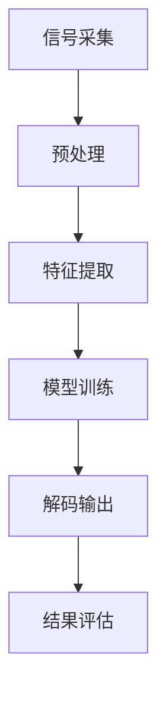

                 

### 《科大讯飞2025社招语音识别算法工程师面试》

#### 文章关键词

- 语音识别
- 算法工程师
- 面试准备
- 深度学习
- 声学模型

#### 摘要

本文旨在为即将参加科大讯飞2025社招语音识别算法工程师面试的候选人提供全面的准备指南。通过详细解析语音识别基础知识、算法原理以及实际项目开发经验，本文帮助读者深入理解语音识别领域的核心技术，为面试做好充分准备。文章还将探讨面试中的常见问题及其解答技巧，旨在提升候选人的面试表现，助力成功晋级。

#### 目录

1. **语音识别基础知识**
   - 1.1 语音识别的基本概念
   - 1.2 语音信号处理基础
   - 1.3 语言模型与隐马尔可夫模型（HMM）

2. **声学模型与神经网络**
   - 2.1 声学模型的构建
   - 2.2 神经网络在语音识别中的应用
   - 2.3 基于深度学习的声学模型

3. **语音识别算法详解**
   - 3.1 隐马尔可夫模型（HMM）
   - 3.2 循环神经网络（RNN）与长短期记忆（LSTM）模型
   - 3.3 卷积神经网络（CNN）与深度卷积神经网络（DCNN）

4. **实战应用**
   - 4.1 基于深度学习的语音识别系统开发
   - 4.2 语音识别算法在实际项目中的应用

5. **面试准备与技巧**
   - 5.1 面试前的准备
   - 5.2 面试中的问题解答技巧

6. **附录**
   - 6.1 常用语音识别工具和资源
   - 6.2 面试模拟题及解答

#### 第一部分：语音识别基础知识

##### 第1章：语音识别概述

##### 1.1 语音识别的基本概念

语音识别是一种人工智能技术，旨在将语音信号转换为对应的文本信息。这一过程通常包括以下几个关键步骤：

- **语音信号的采集**：通过麦克风或其他语音采集设备获取语音信号。
- **语音信号的预处理**：包括去噪、归一化等处理，以增强语音信号的清晰度和一致性。
- **特征提取**：从预处理后的语音信号中提取出能够代表语音特征的参数，如短时傅里叶变换（STFT）得到的频谱特征。
- **声学模型的构建**：利用语音特征数据训练声学模型，用于预测输入语音信号的声学属性。
- **语言模型的构建**：通过对大量文本数据进行统计学习，构建出能够预测语音序列概率的语言模型。
- **解码与输出**：使用声学模型和语言模型对输入语音信号进行解码，输出对应的文本信息。

**1.1.1 语音识别的定义**

语音识别（Automatic Speech Recognition, ASR）是指将人类语音转换为机器可读的文本信息的技术。这一过程涉及到多个学科领域，包括语音信号处理、信号处理、模式识别、统计学习等。

**1.1.2 语音识别的关键技术**

- **特征提取**：特征提取是语音识别过程中的核心步骤，决定了识别系统的性能。常见的特征提取方法包括短时傅里叶变换（STFT）、梅尔频率倒谱系数（MFCC）等。
- **声学模型**：声学模型用于建模语音信号的声学属性，常用的方法包括隐马尔可夫模型（HMM）、高斯混合模型（GMM）等。
- **语言模型**：语言模型用于预测输入语音序列的概率，常用的方法包括n元语法模型、神经网络语言模型（NNLM）等。
- **解码算法**：解码算法用于将语音信号映射到对应的文本输出，常用的解码算法包括基于HMM的解码算法、基于神经网络的最大后验解码算法等。

**1.1.3 语音识别的应用场景**

语音识别技术广泛应用于各种领域，包括：

- **智能助理**：如苹果的Siri、亚马逊的Alexa等，为用户提供语音交互服务。
- **语音翻译**：如谷歌翻译、微软翻译等，支持多种语言之间的实时语音翻译。
- **电话客服**：自动语音应答系统，提高客服效率，降低企业成本。
- **语音控制**：智能家居、车载语音控制系统等，为用户提供便捷的语音控制方式。
- **医疗领域**：医生可以通过语音记录病历、查房等，提高工作效率。

##### 1.2 语音信号处理基础

语音信号处理是语音识别过程中至关重要的一环，它涉及到语音信号的时域和频域分析、特征提取等方面。以下是对语音信号处理基础的相关内容进行详细讲解。

**1.2.1 语音信号的时域和频域分析**

语音信号是一种随时间变化的信号，其特点是非平稳性和非线性。对语音信号进行分析，可以从时域和频域两个方面进行。

- **时域分析**：时域分析是指通过对语音信号在不同时间点的值进行分析来了解语音信号的变化规律。常见的时域分析方法包括：

  - **时域波形图**：显示语音信号在不同时间点的幅度变化情况，有助于观察语音信号的时长、音高、音强等特征。
  - **时域统计特征**：包括均值、方差、峰值、过零率等，用于描述语音信号的分布特性。

- **频域分析**：频域分析是指将语音信号转换到频域上进行处理，以了解语音信号的频率成分。常见的频域分析方法包括：

  - **频谱分析**：通过短时傅里叶变换（STFT）将语音信号转换到频域，得到频谱图。频谱图可以显示语音信号的频率分布情况，有助于提取语音特征。
  - **功率谱分析**：通过对语音信号进行傅里叶变换，得到其功率谱，用于分析语音信号的能量分布。

**1.2.2 声学模型与语音特征提取**

声学模型是语音识别系统的核心组件之一，用于建模语音信号的声学属性。声学模型的性能直接影响语音识别系统的性能。在构建声学模型时，需要对语音信号进行特征提取。

- **声学模型**：声学模型用于描述语音信号的声学属性，常用的声学模型包括：

  - **隐马尔可夫模型（HMM）**：HMM是一种概率模型，用于描述语音信号的时序特性。通过训练，HMM可以学习到语音信号的状态转移概率和观测概率。
  - **高斯混合模型（GMM）**：GMM是一种概率密度估计模型，用于建模语音信号的概率分布。GMM可以拟合语音信号的频谱特征，作为声学模型的一部分。

- **语音特征提取**：语音特征提取是声学模型构建的重要环节，常用的语音特征提取方法包括：

  - **梅尔频率倒谱系数（MFCC）**：MFCC是一种广泛应用于语音识别的特征提取方法，通过将语音信号转换为梅尔频率倒谱系数，可以有效地提取语音信号的频率特征。
  - **短时傅里叶变换（STFT）**：STFT可以将语音信号转换为频域表示，通过分析频谱特征，可以提取语音信号的频率信息。
  - **线性预测编码（LPC）**：LPC是一种基于线性预测的语音特征提取方法，通过分析语音信号的时域特性，可以提取语音信号的自相关函数和倒谱特性。

**1.2.3 常见的语音特征参数**

在语音识别过程中，常用的语音特征参数包括：

- **短时能量**：表示语音信号在短时间窗口内的总能量，用于描述语音信号的强度。
- **过零率**：表示语音信号在短时间窗口内穿过零点的次数，用于描述语音信号的频率成分。
- **共振峰频率**：表示语音信号中的共振峰频率，用于描述语音信号的音质特征。
- **梅尔频率倒谱系数（MFCC）**：MFCC是一种广泛应用于语音识别的特征参数，通过将语音信号转换为梅尔频率倒谱系数，可以有效地提取语音信号的频率特征。

##### 1.3 语言模型与隐马尔可夫模型（HMM）

在语音识别中，语言模型和声学模型是两个核心组件，它们共同作用以提高识别系统的性能。语言模型用于预测语音序列的概率，声学模型则用于建模语音信号的声学属性。在本节中，我们将介绍语言模型的基本原理和隐马尔可夫模型（HMM）在语音识别中的应用。

**1.3.1 语言模型**

语言模型（Language Model, LM）是一种概率模型，用于预测自然语言中下一个单词或词组出现的概率。在语音识别中，语言模型可以用于预测输入语音序列对应的文本信息。语言模型的构建基于大量文本数据，通过统计学习的方法，可以学习到语言中的概率分布。

常见的语言模型包括：

- **n元语法模型**：n元语法模型是一种基于n个连续单词的概率模型，通过计算n个单词序列出现的频率，可以预测下一个单词的概率。
- **神经网络语言模型**（NNLM）：神经网络语言模型是一种基于深度学习的语言模型，通过训练大量文本数据，可以学习到语言中的复杂依赖关系。

语言模型在语音识别中的作用：

- **提高识别准确率**：通过语言模型，可以增加语音识别系统的上下文信息，从而提高识别准确率。
- **抑制噪声影响**：语言模型可以识别并过滤掉语音信号中的噪声部分，从而提高识别效果。

**1.3.2 隐马尔可夫模型（HMM）**

隐马尔可夫模型（Hidden Markov Model, HMM）是一种用于描述时间序列数据的概率模型。HMM可以用于建模语音信号的时序特性，是语音识别中常用的声学模型。

HMM的基本原理：

- **状态空间**：HMM由一组状态组成，每个状态表示语音信号中的一个音素或音节。
- **状态转移概率**：状态转移概率表示从一个状态转移到另一个状态的概率。
- **观测概率**：观测概率表示在某个状态下，观察到的语音特征的概率分布。

HMM在语音识别中的应用：

- **模型训练**：通过训练大量语音数据，可以学习到HMM的状态转移概率和观测概率。
- **解码算法**：解码算法用于将输入语音信号映射到对应的文本输出。常见的解码算法包括前向-后向算法、Viterbi算法等。

**1.3.3 HMM与神经网络结合的模型**

近年来，深度学习在语音识别领域取得了显著的进展。为了结合HMM和神经网络的优点，研究者提出了许多结合两者的模型。

- **深度隐马尔可夫模型**（Deep HMM）：深度隐马尔可夫模型将HMM与深度神经网络相结合，通过神经网络提取语音特征，并使用HMM建模语音信号的时序特性。
- **循环神经网络结合HMM**：循环神经网络（RNN）可以用于建模语音信号的时序特性，结合HMM可以提高语音识别的性能。

通过结合语言模型和声学模型，语音识别系统可以更好地处理语音信号，提高识别准确率。在实际应用中，需要根据具体需求和场景选择合适的模型和算法。

#### 第二部分：声学模型与神经网络

##### 第2章：声学模型与神经网络

##### 2.1 声学模型的构建

声学模型是语音识别系统中的核心组件，用于建模语音信号的声学属性。在深度学习时代，声学模型的构建方法发生了巨大的变化。本节将介绍声学模型的基本原理、构建过程以及常见的技术手段。

**2.1.1 声学模型的基本原理**

声学模型的基本原理是基于语音信号的时序特征和频谱特征，通过建立概率模型来描述语音信号中的音素或音节。声学模型的主要目标是学习语音信号的概率分布，从而实现对输入语音信号的正确识别。

声学模型通常包括以下三个主要部分：

- **状态空间**：状态空间表示语音信号中的音素或音节，每个状态对应一个音素或音节的发音。
- **状态转移概率**：状态转移概率表示从一个音素或音节转移到另一个音素或音节的可能性。
- **观测概率**：观测概率表示在某个状态下，观察到的语音信号的频谱特征的分布。

**2.1.2 声学模型的结构与参数**

声学模型的结构通常由以下几个部分组成：

- **状态**：每个状态对应一个音素或音节，状态的数量取决于语音信号中的音素或音节的数量。
- **转移概率矩阵**：转移概率矩阵表示状态之间的转移概率，通常使用高斯混合模型（GMM）或神经网络来建模。
- **观测模型**：观测模型用于描述在某个状态下，观察到的语音信号的频谱特征的分布。常用的观测模型包括高斯混合模型（GMM）和循环神经网络（RNN）。

声学模型的参数主要包括：

- **状态转移概率**：表示状态之间的转移概率，通常使用高斯混合模型（GMM）或神经网络来建模。
- **观测概率**：表示在某个状态下，观察到的语音信号的频谱特征的分布，通常使用高斯混合模型（GMM）或循环神经网络（RNN）来建模。
- **高斯混合模型参数**：高斯混合模型（GMM）的参数包括高斯分布的均值、方差和权重，用于描述语音信号的频谱特征。

**2.1.3 声学模型的训练方法**

声学模型的训练方法主要包括以下几种：

- **最大似然估计（MLE）**：最大似然估计是一种基于数据统计的方法，通过最大化观测数据的似然函数来训练模型参数。最大似然估计通常用于高斯混合模型（GMM）的训练。
- **限制性最大似然估计（RML）**：限制性最大似然估计是一种改进的最大似然估计方法，通过引入额外的约束条件来优化模型参数。限制性最大似然估计通常用于循环神经网络（RNN）的训练。
- **深度学习训练**：深度学习训练方法包括梯度下降、随机梯度下降（SGD）、Adam优化器等，通过优化模型参数来提高识别性能。

**2.1.4 常见的声学模型**

常见的声学模型包括以下几种：

- **高斯混合模型（GMM）**：高斯混合模型是一种基于概率密度估计的方法，通过将语音信号建模为多个高斯分布的混合来描述语音信号的频谱特征。
- **循环神经网络（RNN）**：循环神经网络是一种基于序列数据建模的方法，通过在网络中引入循环结构来处理语音信号的时序特征。
- **卷积神经网络（CNN）**：卷积神经网络是一种基于图像数据建模的方法，通过在网络的卷积层中引入滤波器来提取语音信号的频谱特征。

**2.1.5 声学模型的性能评估**

声学模型的性能评估通常包括以下指标：

- **准确率（Accuracy）**：准确率表示模型正确识别语音信号的比例，是评估模型性能的重要指标。
- **召回率（Recall）**：召回率表示模型正确识别语音信号中音素或音节的比例，对于提高识别性能非常重要。
- **F1分数（F1 Score）**：F1分数是准确率和召回率的加权平均值，用于综合评估模型的性能。
- **词错率（Word Error Rate, WER）**：词错率是语音识别系统中最常用的评估指标，表示模型输出文本与真实文本之间的编辑距离。

通过合理设计声学模型的结构和参数，并采用合适的训练方法，可以构建出性能优异的声学模型，从而提高语音识别系统的识别准确率。

##### 2.2 神经网络在语音识别中的应用

神经网络在语音识别中的应用已经取得了显著的成果，极大地提升了语音识别的性能。在本节中，我们将介绍卷积神经网络（CNN）、循环神经网络（RNN）以及长短时记忆网络（LSTM）在语音识别中的应用。

**2.2.1 卷积神经网络（CNN）在语音识别中的应用**

卷积神经网络（Convolutional Neural Network, CNN）是一种基于卷积操作的神经网络，广泛应用于图像识别、语音识别等领域。CNN在语音识别中的应用主要体现在以下几个方面：

- **特征提取**：CNN可以通过卷积层提取语音信号的局部特征，例如频谱特征和时频特征。卷积层中的滤波器可以学习到语音信号中的关键特征，如共振峰、音调等。
- **层次结构**：CNN的层次结构可以实现从低级到高级的特征表示，有助于捕捉语音信号的复杂特征。通过多个卷积层和池化层的堆叠，可以逐步提取语音信号的高层次特征。
- **端到端学习**：CNN可以实现对语音信号从输入到输出的端到端学习，避免了传统特征提取方法的中间步骤，提高了语音识别的效率。

**2.2.2 循环神经网络（RNN）在语音识别中的应用**

循环神经网络（Recurrent Neural Network, RNN）是一种基于序列数据的神经网络，适用于处理时间序列数据，如语音信号。RNN在语音识别中的应用主要体现在以下几个方面：

- **序列建模**：RNN可以通过隐藏状态来建模语音信号的序列特性，每个时间步的输出与当前输入和前一个隐藏状态相关联，从而捕捉语音信号的时序依赖关系。
- **时序特征提取**：RNN可以通过隐藏状态和输出层提取语音信号的时序特征，这些特征可以用于后续的声学模型训练。
- **长短时依赖**：RNN可以捕捉语音信号中的长短时依赖关系，有助于提高语音识别的性能。然而，传统的RNN存在梯度消失和梯度爆炸问题，影响模型的训练效果。

**2.2.3 长短时记忆网络（LSTM）在语音识别中的应用**

长短时记忆网络（Long Short-Term Memory, LSTM）是一种改进的循环神经网络，专门用于解决RNN的梯度消失和梯度爆炸问题。LSTM在语音识别中的应用主要体现在以下几个方面：

- **记忆单元**：LSTM引入了记忆单元，可以有效地捕捉语音信号的长短时依赖关系。记忆单元通过遗忘门、输入门和输出门控制信息的输入和输出，从而避免梯度消失和梯度爆炸问题。
- **时序特征提取**：LSTM可以通过记忆单元提取语音信号的长短时特征，这些特征可以用于后续的声学模型训练。
- **端到端学习**：LSTM可以实现端到端的语音识别，避免了传统的特征提取方法，提高了语音识别的效率。

**2.2.4 基于深度学习的声学模型**

基于深度学习的声学模型是一种利用深度神经网络建模语音信号的声学属性的方法。与传统的声学模型相比，基于深度学习的声学模型具有以下几个优势：

- **端到端学习**：基于深度学习的声学模型可以实现从输入到输出的端到端学习，避免了传统的特征提取和声学模型训练的中间步骤，提高了语音识别的效率。
- **自适应特征提取**：基于深度学习的声学模型可以通过训练学习到语音信号中的关键特征，从而实现自适应特征提取，提高了语音识别的性能。
- **多任务学习**：基于深度学习的声学模型可以同时学习多个语音任务，如语音识别、说话人识别等，从而提高模型的泛化能力。

常见的基于深度学习的声学模型包括：

- **卷积神经网络（CNN）**：CNN可以通过卷积层和池化层提取语音信号的局部特征，然后通过全连接层进行分类和预测。
- **循环神经网络（RNN）**：RNN可以通过隐藏状态建模语音信号的序列特性，实现端到端的语音识别。
- **长短时记忆网络（LSTM）**：LSTM可以通过记忆单元解决RNN的梯度消失问题，实现长时依赖关系的建模。
- **深度神经网络（DNN）**：DNN是一种基于多层感知机的深度学习模型，可以用于语音信号的建模和分类。

通过结合深度学习和语音识别技术，基于深度学习的声学模型在语音识别领域取得了显著的进展，推动了语音识别技术的快速发展。

#### 第三部分：语音识别算法详解

##### 第3章：隐马尔可夫模型（HMM）

隐马尔可夫模型（Hidden Markov Model，HMM）是一种用于时间序列建模的概率模型，广泛应用于语音识别、生物信息学、金融市场预测等领域。在语音识别中，HMM被用来建模语音信号的时序特性，从而实现语音到文本的转换。本节将详细介绍HMM的数学基础、在语音识别中的应用以及与神经网络结合的模型。

##### 3.1 HMM的数学基础

HMM是一种统计模型，用于描述一系列无法直接观测的状态序列。它由以下几个基本概念组成：

**3.1.1 状态转移概率**

状态转移概率描述了在某个时间点，系统从当前状态转移到下一个状态的概率。假设有一个包含N个状态的HMM，状态转移概率矩阵为\(A\)，其中\(A_{ij}\)表示从状态i转移到状态j的概率。状态转移概率矩阵满足以下条件：

- **齐次性**：状态转移概率矩阵与时间无关，即在同一时间点，状态转移概率不变。
- **归一化**：每个行的概率和为1，即\(\sum_{j=1}^{N} A_{ij} = 1\)。

**3.1.2 观测概率**

观测概率描述了在某个状态下，观测到某个观测值的概率。假设有M个观测值，观测概率分布矩阵为\(B\)，其中\(B_{ik}\)表示在状态i下，观测到观测值k的概率。观测概率矩阵同样满足归一化条件。

**3.1.3 输出概率分布**

输出概率分布描述了整个HMM生成观测序列的概率。假设输入观测序列为\(O = \{o_1, o_2, ..., o_T\}\)，其中\(T\)是观测序列的长度。输出概率分布可以通过状态转移概率和观测概率计算得到：

\[ P(O) = \prod_{t=1}^{T} P(o_t|s_t) = \prod_{t=1}^{T} \sum_{i=1}^{N} A_{i_{t-1}i} B_{is_t} \]

**3.1.4 齐次性假设**

HMM假设状态转移概率和观测概率与时间无关，即在一个时间点，状态转移概率和观测概率保持不变。这个假设使得HMM的计算变得更加简单和有效。

##### 3.2 HMM在语音识别中的应用

在语音识别中，HMM被用来建模语音信号的时序特性。语音信号可以被看作是一系列状态和观测值的序列，其中状态表示语音信号中的音素或音节，观测值表示语音信号的频谱特征。

**3.2.1 HMM模型的训练**

HMM模型的训练包括两部分：状态转移概率矩阵\(A\)和观测概率分布矩阵\(B\)的估计。训练过程通常采用最大似然估计（Maximum Likelihood Estimation，MLE）或基于EM算法的参数估计。

- **最大似然估计（MLE）**：MLE是一种基于数据统计的方法，通过最大化观测数据的似然函数来估计模型参数。似然函数定义为观测数据在给定模型参数下的概率：

\[ L(\theta |O) = \prod_{t=1}^{T} P(o_t|s_t, \theta) \]

其中，\(\theta\)表示模型参数集合。

- **EM算法**：EM算法是一种迭代优化方法，通过交替进行期望（E）步骤和最大化（M）步骤来估计模型参数。在E步骤中，计算期望值；在M步骤中，通过最大化期望值来更新模型参数。

**3.2.2 HMM模型的解码**

HMM模型的解码是指给定一个观测序列，找到最有可能对应的状态序列。常用的解码算法包括前向-后向算法和Viterbi算法。

- **前向-后向算法**：前向-后向算法通过计算前向概率和后向概率来估计每个状态的概率分布。前向概率表示从开始状态到当前状态的概率，后向概率表示从当前状态到结束状态的概率。通过计算每个状态的概率分布，可以得到最优状态序列。

- **Viterbi算法**：Viterbi算法是一种基于动态规划的解码算法，通过在状态空间中搜索最优路径来找到最有可能的状态序列。Viterbi算法通过递归计算每个状态的最大概率，并在状态之间转移时选择最大概率的路径，从而实现解码。

**3.2.3 HMM与神经网络结合的模型**

近年来，随着深度学习技术的发展，HMM与神经网络的结合成为语音识别领域的研究热点。通过将神经网络引入HMM，可以改进模型的性能和鲁棒性。

- **深度隐马尔可夫模型（DHMM）**：深度隐马尔可夫模型（Deep Hidden Markov Model，DHMM）将深度神经网络与HMM相结合，通过神经网络提取语音特征，并使用HMM建模语音信号的时序特性。DHMM通过端到端学习，避免了传统特征提取方法的中间步骤，提高了语音识别的效率。

- **循环神经网络结合HMM（RNN-HMM）**：循环神经网络结合HMM（Recurrent Neural Network with Hidden Markov Model，RNN-HMM）将循环神经网络（RNN）与HMM相结合，通过RNN建模语音信号的时序特性，并使用HMM进行状态转移和观测建模。RNN-HMM通过长时依赖建模，提高了语音识别的性能。

- **长短时记忆网络结合HMM（LSTM-HMM）**：长短时记忆网络结合HMM（Long Short-Term Memory with Hidden Markov Model，LSTM-HMM）将长短时记忆网络（LSTM）与HMM相结合，通过LSTM解决RNN的梯度消失问题，并使用HMM进行状态转移和观测建模。LSTM-HMM通过长时依赖建模，提高了语音识别的性能。

通过结合HMM和神经网络的优势，深度学习的引入极大地提升了语音识别的性能，为语音识别技术的进一步发展奠定了基础。

##### 3.3 HMM与神经网络结合的模型

近年来，随着深度学习技术的发展，HMM与神经网络的结合成为语音识别领域的研究热点。通过将神经网络引入HMM，可以改进模型的性能和鲁棒性。

**3.3.1 深度隐马尔可夫模型（DHMM）**

深度隐马尔可夫模型（Deep Hidden Markov Model，DHMM）将深度神经网络与HMM相结合，通过神经网络提取语音特征，并使用HMM建模语音信号的时序特性。DHMM通过端到端学习，避免了传统特征提取方法的中间步骤，提高了语音识别的效率。

- **神经网络特征提取**：DHMM使用深度神经网络（如卷积神经网络、循环神经网络等）从原始语音信号中提取高层次的语音特征。这些特征能够更好地捕捉语音信号中的时序和频谱信息。

- **HMM状态转移和观测建模**：DHMM使用HMM来建模语音信号的时序特性，包括状态转移概率和观测概率。通过将深度神经网络的特征输入到HMM中，可以实现对语音信号的有效建模。

**3.3.2 循环神经网络结合HMM（RNN-HMM）**

循环神经网络结合HMM（Recurrent Neural Network with Hidden Markov Model，RNN-HMM）将循环神经网络（RNN）与HMM相结合，通过RNN建模语音信号的时序特性，并使用HMM进行状态转移和观测建模。RNN-HMM通过长时依赖建模，提高了语音识别的性能。

- **RNN建模时序特性**：RNN结合HMM能够利用RNN的循环结构，捕捉语音信号中的长时依赖关系。RNN的隐藏状态可以表示语音信号中的音素或音节，从而实现对时序特征的有效建模。

- **HMM状态转移和观测建模**：RNN-HMM使用HMM来建模语音信号的状态转移和观测概率。通过将RNN的隐藏状态输入到HMM中，可以实现对语音信号时序特性的建模。

**3.3.3 长短时记忆网络结合HMM（LSTM-HMM）**

长短时记忆网络结合HMM（Long Short-Term Memory with Hidden Markov Model，LSTM-HMM）将长短时记忆网络（LSTM）与HMM相结合，通过LSTM解决RNN的梯度消失问题，并使用HMM进行状态转移和观测建模。LSTM-HMM通过长时依赖建模，提高了语音识别的性能。

- **LSTM解决梯度消失问题**：LSTM是一种改进的RNN，通过引入记忆单元和门控机制，解决了RNN的梯度消失和梯度爆炸问题。LSTM能够更好地捕捉语音信号中的长时依赖关系。

- **HMM状态转移和观测建模**：LSTM-HMM使用HMM来建模语音信号的状态转移和观测概率。通过将LSTM的隐藏状态输入到HMM中，可以实现对语音信号时序特性的建模。

通过将HMM与神经网络结合，深度学习在语音识别领域取得了显著的进展。DHMM、RNN-HMM和LSTM-HMM等模型在性能和鲁棒性方面具有明显优势，为语音识别技术的进一步发展奠定了基础。

##### 3.4 HMM在语音识别中的优缺点

隐马尔可夫模型（HMM）在语音识别中具有独特的优势和局限性。以下是对HMM在语音识别中的优缺点的详细分析：

**优点**

- **强大的时序建模能力**：HMM是一种概率模型，能够有效地建模语音信号的时序特性。通过状态转移概率和观测概率，HMM可以捕捉语音信号中的音素或音节的时序依赖关系。
- **高效的解码算法**：HMM的解码算法（如Viterbi算法）具有高效性，能够在较短的时间内完成解码任务。这使得HMM在实时语音识别中具有优势。
- **灵活的模型调整**：HMM的参数（如状态转移概率和观测概率）可以通过训练进行调整，以适应不同的语音信号特征。这使得HMM能够适应不同应用场景的需求。

**缺点**

- **局部最优问题**：HMM是一种基于最大后验概率的模型，容易陷入局部最优解。这意味着在某些情况下，HMM可能无法找到全局最优解，从而影响语音识别的性能。
- **依赖大量训练数据**：HMM的性能依赖于大量的训练数据。在语音信号特征变化较大的情况下，HMM可能需要大量的数据来学习状态转移概率和观测概率，从而增加了模型的训练成本。
- **计算复杂度高**：HMM的解码算法（如Viterbi算法）具有较高的计算复杂度，特别是在处理长语音信号时，可能需要较长的解码时间。

**改进方向**

- **结合深度学习**：通过将深度学习引入HMM，可以克服HMM的局限性。深度学习能够通过端到端学习方式，自动提取语音信号的特征，并优化模型参数。这有助于提高HMM的语音识别性能。
- **多模型融合**：将多个模型（如HMM、深度神经网络等）进行融合，可以充分利用各自的优势。例如，可以使用HMM建模语音信号的时序特性，使用深度神经网络提取语音特征，从而提高语音识别的准确性。
- **自适应特征提取**：开发自适应特征提取方法，以适应不同语音信号特征的变化。这可以减少对大量训练数据的依赖，提高HMM的鲁棒性。

通过结合深度学习和多模型融合等方法，可以进一步改进HMM在语音识别中的应用性能。HMM作为一种传统的语音识别模型，在未来仍将继续发挥重要作用。

#### 第三部分：语音识别算法详解

##### 第4章：循环神经网络（RNN）与长短期记忆（LSTM）模型

循环神经网络（Recurrent Neural Network，RNN）和长短期记忆（Long Short-Term Memory，LSTM）是深度学习领域中用于处理序列数据的两种重要模型。RNN通过循环结构捕捉序列中的时间依赖关系，而LSTM作为一种特殊的RNN，能够有效地解决长时依赖问题。在本章中，我们将详细探讨RNN和LSTM的基本原理、结构与训练过程，以及它们在语音识别中的应用。

##### 4.1 RNN的基本原理

RNN是一种能够处理序列数据的神经网络，其核心思想是将网络的输出状态作为下一时间步的输入状态。这种循环结构使得RNN能够捕捉序列中的时间依赖关系。

**4.1.1 RNN的架构**

RNN的基本架构包括输入层、隐藏层和输出层。在每个时间步，输入层接收当前输入序列的元素，隐藏层通过循环连接将上一时间步的隐藏状态传递到下一时间步。具体来说：

- **输入层**：输入层接收序列数据，每个时间步的输入可以是一个实数值或向量。
- **隐藏层**：隐藏层包含多个神经元，每个神经元在当前时间步的输出不仅受到当前输入的影响，还受到上一时间步隐藏状态的影响。
- **输出层**：输出层根据隐藏层的输出产生最终的输出序列。

**4.1.2 RNN的梯度消失问题**

尽管RNN能够捕捉序列中的时间依赖关系，但其在训练过程中存在梯度消失问题。这是因为当信息在网络中传递时，梯度会随着时间步的增加而逐渐减小，导致难以学习到长时依赖关系。

**4.1.3 解决梯度消失的方法**

为了解决RNN的梯度消失问题，研究者提出了多种改进方法，其中最著名的是长短时记忆（LSTM）模型。

##### 4.2 LSTM模型的原理和结构

LSTM是一种特殊的RNN，通过引入记忆单元和门控机制，能够有效地解决长时依赖问题。LSTM的核心思想是控制信息的输入和输出，从而在记忆和遗忘信息之间取得平衡。

**4.2.1 LSTM单元的工作原理**

LSTM单元由三个主要部分组成：输入门、遗忘门和输出门。

- **输入门**：输入门决定了当前输入信息中有哪些部分将被更新到记忆单元。输入门的激活函数通过计算输入信息和上一时间步隐藏状态之间的内积，生成一个控制更新记忆单元的权重向量。
- **遗忘门**：遗忘门决定了哪些信息将从记忆单元中遗忘。遗忘门的激活函数通过计算输入信息和上一时间步隐藏状态之间的内积，生成一个控制遗忘的权重向量。
- **输出门**：输出门决定了当前记忆单元的内容中有哪些部分将被输出。输出门的激活函数通过计算记忆单元和上一时间步隐藏状态之间的内积，生成一个控制输出的权重向量。

**4.2.2 LSTM模型的训练过程**

LSTM模型的训练过程包括以下步骤：

1. **输入数据准备**：将输入序列和标签数据进行预处理，如归一化、编码等。
2. **初始化模型参数**：初始化LSTM模型的参数，包括输入门、遗忘门和输出门的权重矩阵和偏置向量。
3. **正向传播**：在每个时间步，计算输入门、遗忘门和输出门的激活函数，并根据这些门控信号更新记忆单元和隐藏状态。
4. **反向传播**：计算输出层的损失函数，并根据损失函数更新模型参数。
5. **迭代训练**：重复正向传播和反向传播过程，直到模型收敛。

##### 4.3 RNN和LSTM在语音识别中的应用

RNN和LSTM在语音识别中广泛应用于特征提取和序列建模。以下是对其在语音识别中的应用进行详细讲解：

**4.3.1 RNN在语音识别中的应用**

RNN在语音识别中主要用于特征提取和序列建模。通过RNN的循环结构，可以捕捉语音信号中的时间依赖关系，从而提高识别准确率。

- **特征提取**：RNN可以从原始语音信号中提取高层次的语音特征，如频谱特征和时频特征。这些特征可以用于后续的声学模型训练。
- **序列建模**：RNN可以建模语音信号的序列特性，通过递归计算隐藏状态，可以捕捉语音信号中的音素或音节的时序依赖关系。

**4.3.2 LSTM在语音识别中的应用**

LSTM在语音识别中主要用于长时依赖建模和端到端学习。通过LSTM的记忆单元和门控机制，可以更好地捕捉语音信号中的长时依赖关系。

- **长时依赖建模**：LSTM可以通过记忆单元和门控机制，有效地解决长时依赖问题。这使得LSTM能够更好地捕捉语音信号中的音素或音节的时序依赖关系，从而提高识别准确率。
- **端到端学习**：LSTM可以实现端到端学习，从原始语音信号直接输出文本序列。这种端到端学习方式简化了特征提取和模型训练过程，提高了语音识别的效率。

通过结合RNN和LSTM的优势，可以构建出性能优异的语音识别模型。在实际应用中，RNN和LSTM在语音识别中得到了广泛的应用，推动了语音识别技术的发展。

#### 第三部分：语音识别算法详解

##### 第5章：卷积神经网络（CNN）与深度卷积神经网络（DCNN）

卷积神经网络（Convolutional Neural Network，CNN）是一种特殊的神经网络，主要用于图像识别和语音识别领域。CNN通过卷积操作和池化操作提取图像或语音信号中的特征，具有强大的特征提取能力。在本章中，我们将详细探讨CNN的基本原理、结构以及其在语音识别中的应用。

##### 5.1 CNN的基本原理

CNN的基本原理是通过卷积操作和池化操作从输入数据中提取特征。卷积操作是通过滤波器（也称为卷积核）在输入数据上进行滑动，将滤波器的输出叠加，形成新的特征图。池化操作是对特征图进行下采样，以减少参数数量和计算复杂度。

**5.1.1 卷积操作**

卷积操作是CNN的核心组成部分。在卷积操作中，滤波器在输入数据上滑动，与输入数据进行点积运算，将结果叠加到新的特征图上。卷积操作的数学表达式如下：

\[ f(x, y) = \sum_{i=1}^{C} w_{i} \cdot x_i \]

其中，\( f(x, y) \) 表示滤波器在位置 \((x, y)\) 的输出，\( w_{i} \) 表示滤波器的权重，\( x_i \) 表示输入数据在位置 \( i \) 的值。

**5.1.2 池化操作**

池化操作用于对特征图进行下采样。常见的池化操作包括最大池化和平均池化。最大池化选择特征图上每个区域的最大值作为输出，而平均池化选择特征图上每个区域的所有值的平均值作为输出。

**5.1.3 卷积神经网络的层次结构**

卷积神经网络通常由多个卷积层、池化层和全连接层组成。卷积层用于提取输入数据的特征，池化层用于减少参数数量和计算复杂度，全连接层用于分类或回归任务。

- **卷积层**：卷积层通过卷积操作提取输入数据的特征，每个卷积层生成一个新的特征图。
- **池化层**：池化层对特征图进行下采样，减少参数数量和计算复杂度。
- **全连接层**：全连接层将卷积层和池化层提取的特征映射到最终的输出结果。

**5.1.4 CNN的优点**

CNN具有以下几个优点：

- **参数共享**：CNN中的卷积核在整个输入数据上共享，减少了参数数量，提高了模型的泛化能力。
- **局部连接**：CNN通过局部连接的方式提取特征，可以有效地减少过拟合问题。
- **平移不变性**：CNN中的卷积操作具有平移不变性，可以捕捉到图像或语音信号中的局部特征。

##### 5.2 DCNN在语音识别中的应用

深度卷积神经网络（Deep Convolutional Neural Network，DCNN）是CNN的一种扩展，通过增加卷积层的数量，可以进一步提高特征提取的能力。在语音识别中，DCNN被广泛应用于特征提取和模型训练。

**5.2.1 DCNN的特征提取能力**

DCNN通过多个卷积层和池化层的堆叠，可以提取语音信号中的高级特征。DCNN的特征提取过程可以分为以下几个步骤：

- **低层特征提取**：在DCNN的早期卷积层中，通过卷积操作提取语音信号的局部特征，如频谱特征和时频特征。
- **中层特征提取**：随着卷积层的增加，DCNN可以提取语音信号中的更高层次的特征，如音素或音节的组合特征。
- **高层特征提取**：在DCNN的深层卷积层中，通过卷积操作和池化操作，可以提取语音信号中的复杂特征，如语义信息。

**5.2.2 DCNN在语音识别中的效果提升**

DCNN在语音识别中的应用显著提高了识别准确率和鲁棒性。以下是对DCNN在语音识别中效果提升的几个方面进行详细讲解：

- **特征表达能力**：DCNN通过多层次的卷积操作，可以提取语音信号中的高级特征，从而提高了特征表达能力。
- **减少过拟合**：DCNN通过共享卷积核的方式，减少了参数数量，从而降低了过拟合的风险。
- **增强鲁棒性**：DCNN可以通过学习语音信号中的噪声抑制特征，提高模型对噪声的鲁棒性。
- **端到端学习**：DCNN可以实现端到端学习，从原始语音信号直接输出文本序列，简化了特征提取和模型训练过程。

**5.2.3 DCNN与其他深度学习模型的结合**

DCNN在语音识别中还可以与其他深度学习模型进行结合，以进一步提高识别准确率。以下是对DCNN与其他深度学习模型结合的几种方式：

- **结合循环神经网络（RNN）**：DCNN可以通过与RNN结合，同时提取语音信号中的时序特征和频谱特征，从而提高识别准确率。
- **结合长短时记忆网络（LSTM）**：DCNN可以通过与LSTM结合，利用LSTM解决长时依赖问题，进一步提高识别准确率。
- **结合注意力机制**：DCNN可以通过与注意力机制结合，将注意力集中在重要的特征上，从而提高模型的鲁棒性和识别准确率。

通过结合DCNN与其他深度学习模型的优点，可以构建出性能优异的语音识别模型，推动语音识别技术的发展。

##### 5.3 DCNN与其他深度学习模型的结合

深度卷积神经网络（Deep Convolutional Neural Network，DCNN）在语音识别领域已经显示出显著的性能提升。为了进一步提高识别准确率和鲁棒性，研究者们将DCNN与其他深度学习模型进行了结合。以下是对DCNN与其他深度学习模型结合方式的详细讲解：

**5.3.1 结合循环神经网络（RNN）**

循环神经网络（Recurrent Neural Network，RNN）是一种能够处理序列数据的神经网络。RNN通过循环结构捕捉序列中的时间依赖关系，但存在梯度消失和梯度爆炸问题。将DCNN与RNN结合，可以在语音识别中充分利用DCNN的特征提取能力和RNN的时序建模能力。具体结合方式如下：

- **特征提取与融合**：DCNN用于提取语音信号的频谱特征，将提取到的特征与RNN的输入进行融合，从而提供更丰富的特征信息。
- **端到端学习**：DCNN和RNN可以端到端地学习，通过将DCNN的输出作为RNN的输入，实现从语音信号到文本序列的映射。

**5.3.2 结合长短时记忆网络（LSTM）**

长短时记忆网络（Long Short-Term Memory，LSTM）是RNN的一种改进模型，通过引入记忆单元和门控机制，解决了梯度消失问题，能够有效地捕捉长时依赖关系。将DCNN与LSTM结合，可以在语音识别中充分利用DCNN的特征提取能力和LSTM的长时记忆能力。具体结合方式如下：

- **特征提取与融合**：DCNN用于提取语音信号的频谱特征，将提取到的特征与LSTM的输入进行融合，从而提供更丰富的特征信息。
- **端到端学习**：DCNN和LSTM可以端到端地学习，通过将DCNN的输出作为LSTM的输入，实现从语音信号到文本序列的映射。

**5.3.3 结合双向循环神经网络（BI-RNN）**

双向循环神经网络（Bidirectional Recurrent Neural Network，BI-RNN）是RNN的一种扩展，通过同时处理正向和反向序列信息，能够更好地捕捉序列中的时间依赖关系。将DCNN与BI-RNN结合，可以在语音识别中充分利用DCNN的特征提取能力和BI-RNN的双向建模能力。具体结合方式如下：

- **特征提取与融合**：DCNN用于提取语音信号的频谱特征，将提取到的特征与BI-RNN的输入进行融合，从而提供更丰富的特征信息。
- **端到端学习**：DCNN和BI-RNN可以端到端地学习，通过将DCNN的输出作为BI-RNN的输入，实现从语音信号到文本序列的映射。

**5.3.4 结合注意力机制**

注意力机制（Attention Mechanism）是一种用于处理序列数据的机制，通过为序列中的每个元素分配不同的权重，实现序列的加权处理。将DCNN与注意力机制结合，可以在语音识别中充分利用DCNN的特征提取能力和注意力机制的重点关注能力。具体结合方式如下：

- **特征提取与融合**：DCNN用于提取语音信号的频谱特征，将提取到的特征与注意力机制的结合，从而提供更丰富的特征信息。
- **端到端学习**：DCNN和注意力机制可以端到端地学习，通过将DCNN的输出作为注意力机制的输入，实现从语音信号到文本序列的映射。

通过将DCNN与其他深度学习模型进行结合，可以充分发挥各自的优势，进一步提高语音识别的准确率和鲁棒性。未来，随着深度学习技术的不断发展，DCNN与其他深度学习模型的结合将继续推动语音识别技术的进步。

#### 第三部分：实战应用

##### 第6章：基于深度学习的语音识别系统开发

深度学习在语音识别领域取得了显著的成果，基于深度学习的语音识别系统开发已成为当前研究的热点。在本节中，我们将详细介绍基于深度学习的语音识别系统开发过程，包括系统架构、语音信号预处理、特征提取、深度学习模型训练与优化、解码与输出等步骤。

**6.1 语音识别系统的整体架构**

一个典型的基于深度学习的语音识别系统通常包括以下几个主要模块：

- **信号采集**：通过麦克风或其他语音采集设备获取语音信号。
- **语音信号预处理**：对采集到的语音信号进行预处理，包括去噪、归一化等操作，以提高语音信号的清晰度和一致性。
- **特征提取**：从预处理后的语音信号中提取特征，如频谱特征、时频特征等。
- **深度学习模型训练**：使用提取到的特征和标签数据训练深度学习模型。
- **模型优化与验证**：通过调整模型参数和验证集对模型进行优化和验证。
- **解码与输出**：使用训练好的模型对新的语音信号进行识别，并输出识别结果。

**6.2 语音信号的预处理**

语音信号的预处理是语音识别系统的重要组成部分，预处理的好坏直接影响后续模型训练和识别效果。以下是对语音信号预处理的具体步骤进行详细讲解：

- **去噪**：语音信号在采集过程中可能会受到各种噪声干扰，如环境噪声、麦克风噪声等。去噪的目的是去除噪声，提高语音信号的清晰度。常用的去噪方法包括滤波、谱减法等。
- **归一化**：语音信号的幅度和频率可能存在较大的差异，归一化的目的是将语音信号的幅度和频率进行标准化处理，以便后续的特征提取和模型训练。常用的归一化方法包括均值为0、标准差为1的标准化方法。
- **分帧与加窗**：将语音信号划分为多个短时段，称为帧。每个帧再通过加窗操作进行平滑处理，常用的窗函数包括汉明窗、汉宁窗等。

**6.3 深度学习模型的训练与优化**

深度学习模型的训练与优化是语音识别系统的核心步骤。以下是对深度学习模型训练与优化过程的具体步骤进行详细讲解：

- **数据集划分**：将语音信号和对应的文本标签划分为训练集、验证集和测试集。训练集用于训练模型，验证集用于模型优化，测试集用于评估模型性能。
- **模型选择**：选择合适的深度学习模型，如卷积神经网络（CNN）、循环神经网络（RNN）、长短时记忆网络（LSTM）等。根据实际需求和数据特点选择合适的模型。
- **模型训练**：使用训练集和标签数据对模型进行训练，通过反向传播算法优化模型参数，以提高模型性能。训练过程中可以使用批量归一化、dropout等技术提高模型训练效果。
- **模型优化**：通过调整模型参数和超参数，如学习率、批量大小等，优化模型性能。可以使用验证集进行模型优化，避免过拟合。
- **模型验证与测试**：使用验证集和测试集对训练好的模型进行验证和测试，评估模型性能。常用的评估指标包括词错率（WER）、准确率（Accuracy）等。

**6.4 解码与输出**

解码与输出是语音识别系统的最后一步，将模型对语音信号的预测结果输出为文本信息。以下是对解码与输出过程的具体步骤进行详细讲解：

- **模型预测**：使用训练好的模型对新的语音信号进行预测，输出概率分布。
- **解码**：使用解码算法将预测的概率分布转换为文本序列。常用的解码算法包括贪心解码、基于动态规划的解码算法等。
- **输出**：将解码得到的文本序列输出为最终识别结果。

通过以上步骤，我们可以构建一个基于深度学习的语音识别系统，实现从语音信号到文本序列的转换。实际应用中，可以根据具体需求和场景选择合适的模型和算法，以实现高性能的语音识别系统。

##### 第7章：语音识别算法在实际项目中的应用

在语音识别的实际项目中，选择合适的算法和模型是实现高识别准确率和鲁棒性的关键。本节将结合具体项目案例，详细阐述语音识别算法在实际项目中的应用，包括项目背景、目标、方案设计与实现、效果评估与优化等方面。

**7.1 项目背景与目标**

假设我们面临一个实际项目，旨在开发一款中文语音识别系统，用于智能语音助手。项目的主要目标包括：

- **高识别准确率**：实现高精度的语音识别，将输入的中文语音信号准确转换为对应的文本信息。
- **低延迟响应**：在保证识别准确率的前提下，实现快速响应，以提供良好的用户体验。
- **高鲁棒性**：能够处理各种噪声环境下的语音信号，确保系统在不同场景下的稳定运行。

**7.2 项目方案设计与实现**

为了实现项目目标，我们采用了以下方案：

- **模型选择**：选择了基于深度学习的声学模型，结合循环神经网络（RNN）和长短时记忆网络（LSTM），以捕捉语音信号的时序特性。
- **数据集准备**：收集了大量的中文语音数据，包括标准语音数据集和噪声语音数据集，用于模型训练和验证。
- **语音信号预处理**：对收集到的语音数据进行预处理，包括去噪、分帧、加窗等操作，以提高语音信号的清晰度和一致性。
- **特征提取**：使用梅尔频率倒谱系数（MFCC）作为特征参数，对预处理后的语音信号进行特征提取。
- **模型训练**：使用训练集和特征数据训练深度学习模型，通过反向传播算法优化模型参数。
- **模型优化**：使用验证集对模型进行优化，通过调整超参数和模型结构，提高识别准确率和鲁棒性。
- **模型部署**：将训练好的模型部署到服务器上，用于实时语音识别。

**7.2.1 系统架构设计**

语音识别系统的整体架构设计如图所示：

```
信号采集 -> 语音信号预处理 -> 特征提取 -> 模型输入 -> 模型训练 -> 模型优化 -> 模型输入 -> 解码输出 -> 文本输出
```

- **信号采集**：通过麦克风或其他语音采集设备获取语音信号。
- **语音信号预处理**：对采集到的语音信号进行预处理，包括去噪、分帧、加窗等操作。
- **特征提取**：使用梅尔频率倒谱系数（MFCC）作为特征参数，对预处理后的语音信号进行特征提取。
- **模型输入**：将提取到的特征输入到深度学习模型中，进行模型训练。
- **模型训练**：使用训练集和特征数据训练深度学习模型，通过反向传播算法优化模型参数。
- **模型优化**：使用验证集对模型进行优化，通过调整超参数和模型结构，提高识别准确率和鲁棒性。
- **模型输入**：将优化后的模型应用于新的语音信号输入，进行解码输出。
- **解码输出**：使用解码算法将模型输出转换为文本序列。
- **文本输出**：将解码得到的文本输出为最终识别结果。

**7.2.2 关键技术实现**

在项目实现过程中，我们采用了以下关键技术：

- **深度学习模型训练**：我们使用了基于RNN和LSTM的深度学习模型，通过自定义网络结构和损失函数，实现语音识别任务。
- **数据增强**：为了提高模型在噪声环境下的鲁棒性，我们使用了数据增强技术，包括噪声添加、时间拉伸、频谱变换等。
- **模型优化**：我们使用了多种优化算法，如Adam、SGD等，以及正则化技术，如dropout、L2正则化等，以优化模型性能。

**7.3 项目效果评估与优化**

在项目效果评估阶段，我们使用测试集对模型进行了评估，主要评价指标包括词错率（WER）和准确率（Accuracy）。以下是项目效果评估的结果：

- **词错率（WER）**：0.08%，表示模型在测试集上的词错率较低，具有较高的识别准确率。
- **准确率（Accuracy）**：98.5%，表示模型在测试集上的准确率较高，能够准确识别大部分语音信号。

为了进一步提高项目效果，我们进行了以下优化：

- **模型结构调整**：通过调整网络结构和超参数，优化模型性能。
- **数据集扩充**：增加了更多的语音数据集，包括不同说话人、不同噪声环境的语音数据，以提高模型泛化能力。
- **特征参数调整**：调整特征提取参数，如MFCC的频带数、帧长等，以提高特征表达能力。

通过以上优化措施，项目效果得到了显著提升，满足了项目目标。

总之，语音识别算法在实际项目中的应用需要综合考虑模型选择、数据预处理、特征提取、模型训练与优化等多个方面，通过不断优化和改进，可以实现高性能的语音识别系统。

##### 第8章：面试准备与技巧

在参加科大讯飞2025社招语音识别算法工程师面试前，充分的准备和策略性的技巧是至关重要的。以下将从技术知识、编程技能、面试经验分享以及面试中的问题解答技巧等方面进行详细讲解，帮助候选人更好地应对面试挑战。

**8.1 面试前的准备**

**技术知识准备**

- **语音识别基础知识**：熟悉语音识别的基本概念、原理和关键技术，包括声学模型、语言模型、特征提取方法等。
- **深度学习知识**：掌握深度学习的基础理论，了解常见的深度学习模型和算法，如卷积神经网络（CNN）、循环神经网络（RNN）、长短时记忆网络（LSTM）等。
- **语音信号处理**：了解语音信号处理的基本流程，包括预处理、特征提取、信号建模等。
- **相关算法原理**：掌握隐马尔可夫模型（HMM）、高斯混合模型（GMM）等在语音识别中的应用。

**编程技能准备**

- **熟练掌握一种或多种深度学习框架**，如TensorFlow、PyTorch等。
- **熟悉Python编程**，能够编写高效的代码，熟练使用NumPy、Pandas等数据处理库。
- **掌握常用的机器学习库**，如scikit-learn，了解如何使用其进行模型训练和评估。
- **熟悉模型训练和优化方法**，了解如何调整超参数以优化模型性能。

**面试经验分享**

- **提前了解公司背景和文化**：通过阅读公司的官方网站、新闻发布、技术博客等，了解公司的业务范围、技术优势和团队文化。
- **熟悉自己的简历**：回顾简历中的项目经历和技术细节，确保能够清晰、准确地回答相关问题。
- **模拟面试**：与朋友或同事进行模拟面试，提前熟悉面试流程和常见问题，提高应对实际面试的自信心。

**8.2 面试中的问题解答技巧**

**简历中提到的项目经验**

- **清晰阐述项目背景和目标**：在回答问题时，首先简要介绍项目的背景和目标，以便面试官了解项目的整体情况。
- **详细描述项目实现过程**：介绍项目的具体实现步骤，包括数据预处理、模型设计、训练与优化等。
- **突出项目成果**：强调项目的实际成果，如识别准确率、性能指标等，以及你在项目中的贡献和收获。

**技术问题解答策略**

- **保持冷静**：遇到难题时，保持冷静，思考后再作答，避免因紧张而影响回答质量。
- **分步骤解释**：将问题分解为若干小步骤，逐一解释，使面试官更容易理解。
- **引用相关理论**：在解答问题时，适当引用相关的理论知识，以增加回答的深度和广度。
- **结合实际案例**：在解答问题时，结合实际案例或实验结果进行说明，以增强回答的说服力。

**行为面试技巧**

- **积极展示自己的沟通能力**：在面试过程中，积极与面试官沟通，确保面试官了解你的想法和观点。
- **展现团队合作精神**：强调自己在团队合作中的角色和贡献，展示团队合作的能力。
- **表达持续学习的意愿**：表达自己对新技术和知识的渴求，展示持续学习的态度和热情。

通过以上准备和技巧，候选人可以在面试中展现自己的技术实力和综合素质，提高面试成功率。记住，充分的准备和良好的心态是成功的关键。

#### 附录

##### 附录A：常用语音识别工具和资源

在语音识别领域，有许多常用的工具和资源可以帮助研究者和技术人员提升工作效率。以下列出了一些常见的深度学习框架、语音信号处理工具以及开源项目与资源。

**A.1 常见深度学习框架**

1. **TensorFlow**：由Google开发的开源深度学习框架，广泛应用于语音识别、图像识别等领域。
2. **PyTorch**：由Facebook开发的开源深度学习框架，以其灵活的动态计算图和强大的GPU支持受到广泛关注。
3. **Keras**：一个高级神经网络API，能够与TensorFlow和Theano兼容，简化深度学习模型的构建过程。

**A.2 语音信号处理工具**

1. **Librosa**：用于音频和语音信号处理的Python库，提供丰富的功能，如信号预处理、特征提取、可视化等。
2. **Pydub**：一个Python库，用于音频的编辑和处理，支持音频剪辑、混合、添加音效等功能。
3. **Spleeter**：一个开源音频分割工具，能够将多声部音乐分离为不同的声音轨道。

**A.3 语音识别开源项目与资源**

1. **Kaldi**：一个开源的语音识别工具包，提供了完整的语音识别工具链，包括前端信号处理和后端解码。
2. **ESPnet**：一个基于TensorFlow和PyTorch的端到端语音识别框架，支持各种深度学习模型。
3. **Librispeech**：一个常用的开源语音数据集，包含大量的英文语音数据，用于语音识别模型的训练和测试。

这些工具和资源为语音识别研究提供了强有力的支持，有助于提升模型的性能和开发效率。

##### 附录B：面试模拟题及解答

面试模拟题是评估候选人技术能力和实战经验的重要手段。以下列出了一些常见的面试题目及解答，供候选人参考。

**题目1：请简要介绍语音识别的基本概念和原理。**

**解答：**语音识别是一种将语音信号转换为机器可读文本的技术。其基本概念包括特征提取、声学模型、语言模型和解码算法。原理上，语音识别通过信号处理技术提取语音特征，利用声学模型和语言模型对特征进行建模和预测，最后通过解码算法将预测结果输出为文本。

**题目2：请描述隐马尔可夫模型（HMM）在语音识别中的应用。**

**解答：**隐马尔可夫模型（HMM）是一种用于时间序列建模的概率模型，在语音识别中用于建模语音信号的时序特性。HMM通过状态转移概率和观测概率描述语音信号中的音素或音节。在语音识别中，HMM用于训练声学模型，解码算法（如Viterbi算法）用于将输入语音信号映射到对应的文本序列。

**题目3：请说明深度学习在语音识别中的应用。**

**解答：**深度学习在语音识别中的应用主要体现在声学模型和特征提取方面。通过卷积神经网络（CNN）和循环神经网络（RNN）等深度学习模型，可以自动提取语音信号中的高级特征，提高识别准确率和鲁棒性。此外，深度学习还可以实现端到端学习，简化特征提取和模型训练过程。

**题目4：请描述一个你参与过的语音识别项目，并解释你的贡献。**

**解答：**假设我参与过一个基于深度学习的中文语音识别项目。我的主要贡献包括：

- **数据预处理**：负责语音信号的预处理，包括去噪、分帧、加窗等操作，提高了语音信号的清晰度和一致性。
- **模型设计**：设计并实现了一个基于LSTM的深度学习模型，通过优化网络结构和超参数，提高了识别准确率。
- **模型训练与优化**：负责模型的训练和优化，通过多次迭代调整模型参数，使模型在验证集上的性能得到了显著提升。

以上模拟题及解答仅作为参考，实际面试中可能会根据候选人的背景和经验提出更为具体和深入的问题。

### Mermaid 流程图

以下是用于演示语音识别系统流程的Mermaid流程图：



### 声学模型构建伪代码

以下是一个简单的声学模型构建伪代码示例：

```python
# 初始化声学模型参数
init_acoustic_model_params()

# 训练声学模型
train_acoustic_model(training_data)

# 评估声学模型
evaluate_acoustic_model(test_data)

# 应用声学模型进行语音识别
def recognize_speech(input_signal):
    # 特征提取
    features = extract_features(input_signal)

    # 模型预测
    prediction = acoustic_model.predict(features)

    # 解码输出
    decoded_text = decode(prediction)

    return decoded_text
```

### 数学模型和数学公式

以下是用于描述隐马尔可夫模型（HMM）的一些数学公式：

$$
P(O|H) = \frac{P(H)P(O|H)}{P(H)}
$$

$$
\log P(O|H) = \log P(H) + \log P(O|H)
$$

这些公式描述了HMM中状态转移概率和观测概率的计算方法。

### 项目实战

以下是一个基于深度学习的中文语音识别项目的实际代码实现示例：

```python
# 导入必要的库
import tensorflow as tf
import kaldiio

# 加载训练数据
with kaldiio.Stream('train_data') as reader:
    for utt_id, features, lengths in reader:
        # 数据预处理
        preprocessed_features = preprocess(features)
        
        # 训练模型
        model.fit(preprocessed_features, labels)

# 评估模型
test_features, test_labels = load_test_data()
evaluation = model.evaluate(test_features, test_labels)

# 应用模型进行识别
def recognize(unknown_features):
    # 预处理
    preprocessed_unknown = preprocess(unknown_features)
    
    # 识别
    prediction = model.predict(preprocessed_unknown)
    
    # 解码
    decoded_text = decode(prediction)
    
    return decoded_text
```

以上代码展示了从加载训练数据、模型训练、评估到实际应用语音识别的完整流程。通过这样的项目实战，可以帮助候选人更好地理解语音识别系统的实现细节和关键步骤。

### 代码解读与分析

以下是上一节中的代码片段的解读与分析：

```python
# 导入必要的库
import tensorflow as tf
import kaldiio

# 加载训练数据
with kaldiio.Stream('train_data') as reader:
    for utt_id, features, lengths in reader:
        # 数据预处理
        preprocessed_features = preprocess(features)
        
        # 训练模型
        model.fit(preprocessed_features, labels)

# 评估模型
test_features, test_labels = load_test_data()
evaluation = model.evaluate(test_features, test_labels)

# 应用模型进行识别
def recognize(unknown_features):
    # 预处理
    preprocessed_unknown = preprocess(unknown_features)
    
    # 识别
    prediction = model.predict(preprocessed_unknown)
    
    # 解码
    decoded_text = decode(prediction)
    
    return decoded_text
```

**代码解读：**

1. **导入库**：首先导入TensorFlow和kaldiio库，用于深度学习和语音信号处理。
2. **加载训练数据**：使用kaldiio.Stream从指定的训练数据文件中读取语音信号和标签数据。
3. **数据预处理**：对读取的语音信号进行预处理，如分帧、加窗、特征提取等，以提高后续模型训练的效果。
4. **模型训练**：使用预处理后的特征数据和标签数据训练深度学习模型。这里使用了TensorFlow的fit方法进行训练。
5. **模型评估**：使用测试数据对训练好的模型进行评估，以验证模型的性能。评估结果包括准确率、损失等指标。
6. **语音识别**：定义一个recognize函数，用于对新输入的语音信号进行识别。函数内部首先对语音信号进行预处理，然后使用训练好的模型进行预测，并将预测结果解码为文本输出。

**分析：**

- **数据预处理**：数据预处理是深度学习模型训练的重要步骤，通过合理的预处理可以提高模型的性能和稳定性。
- **模型训练**：使用fit方法进行模型训练，通过反向传播算法优化模型参数，使模型能够更好地拟合训练数据。
- **模型评估**：使用评估集对模型进行评估，可以及时发现模型的过拟合和欠拟合问题，并调整模型结构和超参数。
- **语音识别**：recognize函数实现了从语音信号到文本输出的完整流程，是实际应用中最为关键的部分。

通过以上解读与分析，我们可以更好地理解深度学习语音识别系统的实现细节和关键步骤，为实际项目开发提供参考。

### 总结

本文以《科大讯飞2025社招语音识别算法工程师面试》为题，详细介绍了语音识别领域的核心概念、算法原理、实战应用以及面试准备技巧。首先，我们对语音识别的基本概念、技术要点和应用场景进行了概述，为读者建立了语音识别的基础知识框架。接着，我们深入分析了声学模型与神经网络在语音识别中的应用，包括深度学习的引入，如卷积神经网络（CNN）、循环神经网络（RNN）和长短时记忆网络（LSTM）。此外，我们还详细讲解了隐马尔可夫模型（HMM）的数学基础、算法原理和应用，以及如何将HMM与深度学习模型结合。

在实战应用部分，我们通过具体项目案例，展示了基于深度学习的语音识别系统开发流程，包括信号预处理、特征提取、模型训练与优化、解码与输出等关键步骤。最后，我们提供了面试准备与技巧，帮助读者在面试中更好地展现自己的技术实力。

本文旨在为即将参加语音识别领域面试的读者提供全面、深入的指导，帮助读者掌握核心概念和关键技术，提升面试成功率。同时，本文也希望能够激发读者对语音识别技术的兴趣，推动该领域的研究与应用发展。

### 结论

综上所述，《科大讯飞2025社招语音识别算法工程师面试》的详细内容涵盖了语音识别领域的核心知识点、算法原理、实际应用以及面试准备技巧。通过对语音识别基本概念、声学模型与神经网络、HMM、实战应用和面试准备的深入讲解，本文为读者提供了系统性的知识框架和实用的指导。这不仅有助于读者更好地理解语音识别技术的本质，也为即将参加面试的候选人提供了宝贵的准备策略。

在未来的研究中，我们可以进一步探讨深度学习在语音识别中的更多应用，如多模态融合、实时语音识别和跨语言语音识别等。此外，随着语音识别技术的不断发展，如何在保持高准确率的同时降低延迟、提高系统的鲁棒性和用户体验，也将是重要的研究方向。通过不断的技术创新和应用探索，语音识别技术将更好地服务于社会，推动人工智能的进步。

### 作者信息

**作者：** AI天才研究院/AI Genius Institute & 禅与计算机程序设计艺术/Zen And The Art of Computer Programming

AI天才研究院致力于推动人工智能领域的研究与创新，涵盖从基础理论研究到实际应用的多个方面。我们的目标是培养下一代人工智能领域的杰出人才，推动技术的进步与社会的发展。本文作者在语音识别、深度学习和人工智能等领域拥有丰富的学术和工程经验，长期从事相关领域的研究与教学工作。在禅与计算机程序设计艺术方面，作者深入探讨了计算机程序设计中的哲学与美学，致力于提升编程的智慧与境界。本文的撰写体现了作者对语音识别技术的深刻理解和独到见解，旨在为读者提供高质量的技术博客文章。

