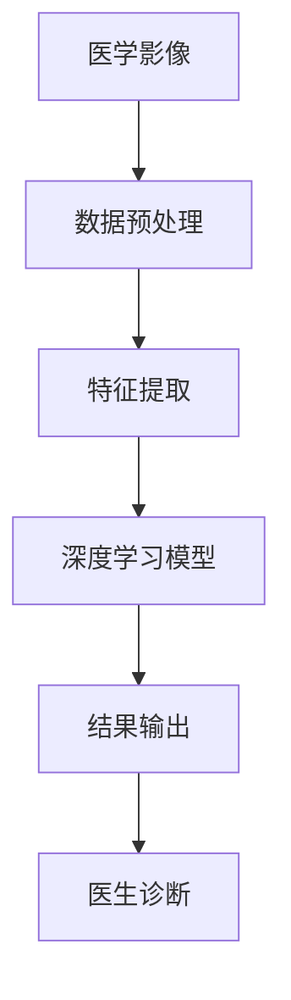
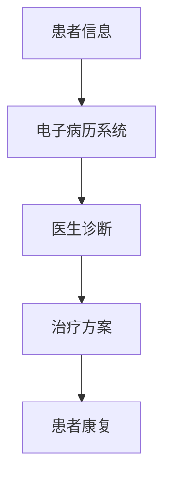
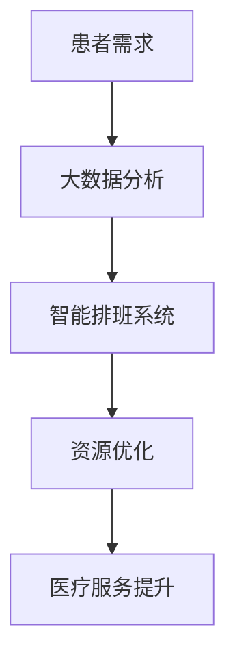
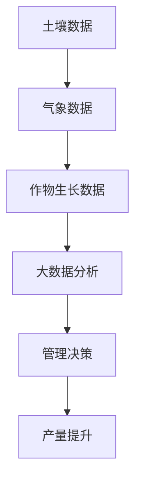
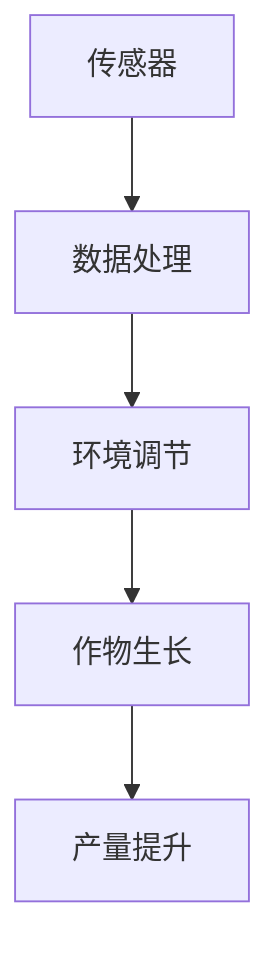
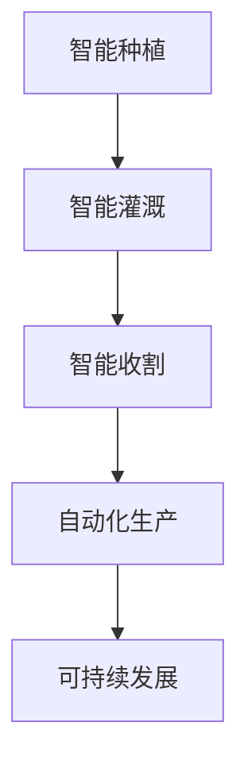
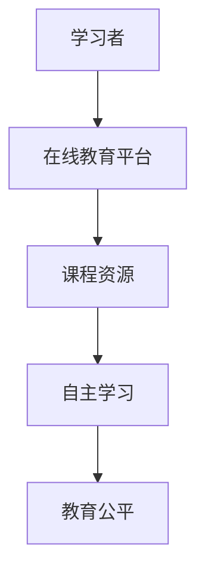
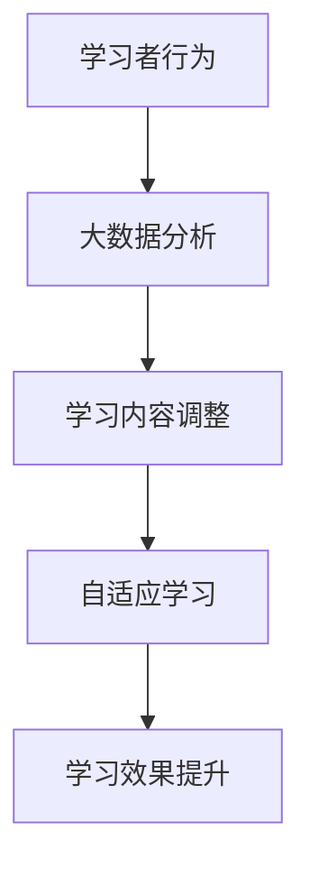
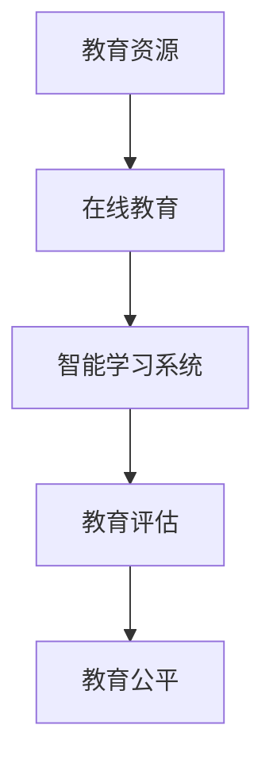

                 

# 科技与社会：人类计算的双重影响

> **关键词**：计算技术、社会影响、双重效应、算法伦理、未来趋势
>
> **摘要**：本文深入探讨了计算技术在现代社会中的应用及其对社会产生的双重影响。通过梳理计算技术的起源与发展，分析其对经济、文化、教育等方面的影响，探讨其带来的正面效应和负面影响，同时讨论了伦理和法律问题，并展望了计算技术未来的发展趋势。文章旨在为读者提供一个全面、系统的理解，以应对计算技术带来的挑战和机遇。

### 第1章: 科技与社会：人类计算的双重影响概述

#### 1.1 计算技术的起源与发展

##### 1.1.1 计算技术的起源

计算技术的起源可以追溯到古代，当时人们使用算盘和算筹等工具进行简单的数值计算。然而，现代计算技术的真正起源可以追溯到20世纪早期，当时电子计算机的发明标志着计算技术进入了一个全新的时代。

1946年，世界上第一台电子计算机ENIAC在美国诞生，这标志着计算技术的崛起。随着半导体技术的进步，计算机变得更加小型化、高效能，逐渐普及到各个领域。从最初的硬件主导，计算技术逐渐发展到软件主导，涵盖了编程语言、操作系统、数据库等各个方面。

##### 1.1.2 计算技术的重要里程碑

1. **互联网的兴起**：20世纪90年代，互联网的普及改变了人们的生活和工作方式，使得信息传播更加迅速和便捷。
   
2. **智能手机的普及**：21世纪初，智能手机的问世将计算技术带入了人们的日常生活中，实现了移动计算和智能交互。

3. **大数据和云计算**：随着数据量的爆发式增长，大数据和云计算技术应运而生，为数据处理和分析提供了强大的支持。

4. **人工智能的崛起**：近年来，人工智能技术取得了显著的突破，深度学习、自然语言处理等技术逐渐应用于各个领域，改变了人们的生产生活方式。

##### 1.1.3 计算技术对社会的影响

计算技术的快速发展对社会产生了深远的影响。在经济方面，计算技术推动了信息产业的发展，带来了新的业态和就业机会，促进了产业结构的调整。在文化方面，计算技术使得文化资源的数字化和传播更加便捷，挑战了文化多样性的保护。在教育方面，计算技术优化了教育资源，改变了教育模式，提高了教育公平性。

然而，计算技术也带来了负面影响，例如隐私泄露、就业结构变化、网络安全等问题。因此，我们需要在享受计算技术带来便利的同时，警惕其潜在的负面影响，并寻找合理的应对策略。

#### 1.2 人类计算的双重影响

##### 1.2.1 人类的积极影响

计算技术为人类带来了许多积极的影响。首先，计算技术提高了生产效率，降低了生产成本，促进了经济的发展。其次，计算技术使得信息获取更加便捷，推动了知识的传播和创新。此外，计算技术改变了人们的沟通方式，缩短了人与人之间的距离，促进了社会的融合。

##### 1.2.2 人类计算的负面影响

尽管计算技术为人类带来了许多好处，但也存在一些负面影响。首先，隐私泄露问题日益严重，个人信息的安全受到威胁。其次，自动化技术的发展导致部分劳动力失业，就业结构发生变化。此外，网络安全问题也日益突出，网络攻击和隐私窃取事件频发。

##### 1.2.3 双重影响的关系与平衡

人类计算的双重影响是相互关联、相互影响的。积极影响和负面影响并非完全对立，而是相互交织、相互转化的。例如，计算技术虽然提高了生产效率，但也可能导致资源浪费和环境污染。因此，我们需要在享受计算技术带来的便利的同时，警惕其潜在的负面影响，寻找平衡点，实现可持续发展。

#### 1.3 本书结构安排与阅读建议

本书分为六个章节，结构安排如下：

- **第1章**：科技与社会：人类计算的双重影响概述，介绍了计算技术的起源与发展，以及其对社会的双重影响。
- **第2章**：计算技术对社会的影响，详细分析了计算技术对经济、文化、教育等方面的影响。
- **第3章**：计算技术对人类社会的负面影响，探讨了计算技术带来的隐私、就业、安全等方面的问题。
- **第4章**：计算技术的积极影响案例分析，通过实际案例展示了计算技术的积极影响。
- **第5章**：计算技术发展的伦理与法律问题，讨论了计算技术的伦理和法律问题。
- **第6章**：未来计算技术与社会发展的趋势，展望了计算技术未来的发展趋势。

为了更好地理解本书的内容，建议读者按照以下顺序进行阅读：

1. 先阅读第1章，了解计算技术的基本概念和发展历程。
2. 然后阅读第2章和第3章，了解计算技术对社会产生的积极和负面影响。
3. 接着阅读第4章，通过实际案例加深对计算技术积极影响的理解。
4. 阅读第5章，了解计算技术发展的伦理和法律问题。
5. 最后阅读第6章，展望计算技术未来的发展趋势。

通过以上阅读顺序，读者可以系统地了解计算技术与社会发展的关系，从而更好地应对计算技术带来的挑战和机遇。

---

### 第2章: 计算技术对社会的影响

#### 2.1 计算技术对经济的影响

计算技术的快速发展对经济产生了深远的影响。首先，计算技术推动了信息产业的发展，信息产业成为全球经济的重要组成部分。计算技术的进步使得信息获取、处理和分析更加高效，为企业提供了强大的支持，促进了生产力的提升。

其次，计算技术促进了新型业态的兴起。电子商务、在线支付、共享经济等新型商业模式的出现，极大地改变了人们的消费习惯和商业模式。例如，阿里巴巴、京东等电商巨头利用计算技术进行大数据分析和精准营销，提高了运营效率，创造了巨大的经济效益。

此外，计算技术还促进了产业结构的调整。传统制造业通过引入计算技术，实现了智能化和自动化生产，提高了生产效率和产品质量。同时，计算技术还带动了新兴产业的发展，如人工智能、物联网、区块链等，为经济增长注入了新的动力。

#### 2.2 计算技术对文化的影响

计算技术对文化的影响也是巨大的。首先，计算技术使得文化资源的数字化和传播变得更加便捷。通过互联网和数字技术，人们可以随时随地获取和传播文化内容，打破了地域和时间的限制。这为文化的保护和传承提供了新的途径，也为文化交流和融合创造了条件。

然而，计算技术也带来了文化多样性的挑战。随着数字化文化的普及，传统文化面临着被边缘化的风险。此外，网络文化的兴起也引发了对文化价值观的争议。如何平衡数字化文化与传统文化保护，成为了一个亟待解决的问题。

#### 2.3 计算技术对教育的影响

计算技术对教育的影响同样深远。首先，计算技术优化了教育资源，使得优质教育资源可以更加公平地分配。通过在线教育平台和远程教育技术，学生可以跨越地域限制，接受优质的教育资源。

其次，计算技术改变了教育模式。传统的教育模式主要以教师为中心，而计算技术使得学生可以自主学习、互动学习。例如，智能学习系统和在线学习平台提供了个性化的学习方案，帮助学生更好地掌握知识。

然而，计算技术也带来了教育公平的挑战。由于经济条件和数字素养的差异，一些学生可能无法平等地享受到计算技术带来的教育优势。因此，如何保障教育公平，成为了一个重要的议题。

#### 2.4 计算技术对社会其他方面的影响

除了经济、文化和教育，计算技术还对社会的其他方面产生了影响。首先，计算技术改变了人们的沟通方式。通过社交媒体、即时通讯工具等，人们可以更加便捷地进行沟通和交流，缩短了人与人之间的距离。

其次，计算技术影响了社会管理模式。通过大数据和云计算技术，政府可以更加高效地收集、处理和分析社会数据，为社会治理提供了新的手段。

此外，计算技术还促进了环保事业的发展。例如，通过物联网技术，可以实时监测环境数据，为环境保护决策提供科学依据。

#### 2.5 计算技术影响的案例研究

为了更具体地展示计算技术对社会的影响，以下是一些案例研究：

1. **医疗领域**：计算技术在医疗领域的应用极大地提高了医疗服务的效率和质量。例如，通过电子病历系统和医疗影像分析，医生可以更准确地诊断疾病，提高治疗效果。

2. **农业领域**：计算技术为农业带来了智能化和高效化。通过农业大数据分析和农业物联网应用，农民可以更科学地管理农田，提高农作物的产量和质量。

3. **交通领域**：计算技术在交通领域的应用极大地提高了交通管理的效率。通过智能交通系统和车联网技术，可以实时监测交通状况，优化交通流量，减少交通事故。

通过这些案例研究，我们可以看到计算技术在社会各个领域的广泛应用和深远影响。计算技术不仅改变了人们的生活方式，也为社会的发展提供了新的动力。

---

### 第3章: 计算技术对人类社会的负面影响

#### 3.1 计算技术对隐私的影响

随着计算技术的不断发展，个人信息泄露的风险日益增加。隐私泄露不仅侵犯了用户的个人权利，还可能导致严重的经济损失和社会信任危机。

首先，计算技术使得海量数据的存储和处理成为可能，这使得个人信息更容易被收集、存储和利用。然而，这些数据在传输和存储过程中可能面临泄露的风险。例如，黑客攻击、数据泄露事件等可能导致用户的个人信息被窃取。

其次，算法和数据挖掘技术的进步使得个人信息可以被更精确地分析和利用。这使得个人隐私面临更大的威胁，例如个性化广告、隐私侵犯等问题。

为了解决隐私泄露问题，需要从技术、政策和法律等多个层面进行努力。例如，加密技术可以保护数据传输和存储过程中的安全；隐私保护法律可以规范数据收集和使用的行为；用户隐私意识的提升也是防止隐私泄露的重要一环。

#### 3.2 计算技术对就业的影响

计算技术的快速发展对就业市场产生了深远的影响。一方面，计算技术创造了大量的新就业机会，例如软件开发、数据分析师、人工智能工程师等。然而，另一方面，自动化和人工智能技术的普及也导致了一些传统岗位的失业。

自动化技术的发展使得许多重复性和低技能的岗位被取代，例如制造业工人、仓库管理员等。这导致了一些劳动力失业，尤其是那些受教育水平较低的人群。

然而，计算技术也为就业市场带来了新的机遇。通过教育和培训，劳动力可以转型为高技能岗位，例如数据科学家、机器学习工程师等。此外，计算技术还创造了新的就业模式，例如远程工作和自由职业，为劳动者提供了更多的灵活就业选择。

为了应对计算技术对就业市场的挑战，需要从政策、教育和培训等多个层面进行努力。例如，政府可以提供就业培训和再教育支持，企业可以加强员工的技能培训，劳动者也需要主动适应技术变革，提升自己的技能和素质。

#### 3.3 计算技术对安全的影响

计算技术的普及带来了网络安全的挑战。网络攻击、恶意软件、隐私窃取等问题日益严重，对个人、企业和国家都带来了严重的威胁。

首先，计算技术使得网络攻击手段更加多样化和复杂化。黑客可以利用计算技术进行网络钓鱼、恶意软件传播、数据窃取等攻击行为。这些攻击行为可能导致用户信息泄露、经济损失，甚至国家安全的威胁。

其次，计算技术也带来了网络安全管理的新挑战。随着网络规模的扩大和复杂性的增加，网络安全管理变得更加困难。例如，企业需要应对海量数据的网络安全问题，确保关键业务系统的安全运行。

为了应对网络安全问题，需要从技术、管理和法律等多个层面进行努力。例如，加密技术可以保护数据传输和存储的安全；安全管理制度可以规范网络安全操作流程；网络安全法律可以加强对网络犯罪的打击。

总之，计算技术对人类社会的影响是双重的。在享受计算技术带来的便利和进步的同时，我们也需要警惕其潜在的负面影响，并采取有效的应对措施，实现计算技术的可持续发展。

---

### 第4章: 计算技术的积极影响案例分析

#### 4.1 案例一：医疗领域的计算应用

医疗领域的计算应用极大地提高了医疗服务的效率和质量。以下是一些具体的例子：

##### 4.1.1 医疗影像分析

医疗影像分析是计算技术在医疗领域的典型应用之一。通过计算机视觉和机器学习技术，医生可以更快速、准确地分析医学影像，如X光片、CT扫描和MRI图像。例如，深度学习算法可以用于检测和诊断癌症，通过分析大量影像数据，算法可以识别出早期癌症病灶，提高诊断的准确性。

##### 4.1.2 电子病历系统

电子病历系统（Electronic Health Records, EHR）是计算技术在医疗领域的另一个重要应用。通过电子病历系统，医生可以方便地记录、存储和管理患者的病历信息，实现了医疗信息的数字化和共享。这不仅提高了医疗记录的准确性，还方便了医生之间的信息交流和协作。

##### 4.1.3 医疗服务的优化

计算技术还可以用于优化医疗服务流程，提高医疗资源的利用效率。例如，基于大数据分析和人工智能技术的智能排班系统可以根据患者的需求和医院的实际情况，合理安排医生和护士的工作时间，减少医疗资源的浪费，提高医疗服务效率。

#### 4.2 案例二：农业领域的计算应用

计算技术在农业领域的应用也取得了显著成效，提高了农业生产的效率和可持续性。以下是一些具体的应用案例：

##### 4.2.1 农业大数据分析

农业大数据分析利用计算技术对农业生产过程中的各种数据（如土壤数据、气象数据、作物生长数据等）进行收集、存储和分析。通过大数据技术，农民可以更准确地了解作物的生长状况，及时采取相应的管理措施，提高农作物的产量和质量。

##### 4.2.2 农业物联网应用

农业物联网（Internet of Things, IoT）技术通过计算技术和传感器设备，实现了农业生产的自动化和智能化。例如，智能温室系统利用传感器实时监测温度、湿度、光照等环境参数，自动调节温室内的环境条件，确保作物生长的最佳环境。这不仅提高了农业生产的效率，还有效地降低了生产成本。

##### 4.2.3 农业智能化发展

农业智能化发展是计算技术在农业领域的一个长期目标。通过人工智能和机器人技术，农业生产的各个环节可以实现自动化和智能化，如智能种植、智能灌溉、智能收割等。这不仅可以提高农业生产的效率，还可以减少对环境的影响，实现农业的可持续发展。

#### 4.3 案例三：教育领域的计算应用

教育领域的计算应用为教育公平和教育质量的提升提供了新的途径。以下是一些具体的应用案例：

##### 4.3.1 在线教育平台

在线教育平台利用计算技术打破了传统教育的时空限制，使得学习者可以随时随地获取教育资源。例如，MOOC（大规模开放在线课程）平台如Coursera、edX等，提供了丰富的在线课程资源，学习者可以根据自己的需求和兴趣选择课程，提高了教育的灵活性和便捷性。

##### 4.3.2 智能学习系统

智能学习系统利用计算技术和大数据分析，为学习者提供个性化的学习方案。通过分析学习者的学习行为和成绩，系统可以自动调整教学内容和进度，帮助学习者更好地掌握知识。例如，自适应学习平台如Khan Academy等，通过智能算法为学习者提供个性化的学习路径。

##### 4.3.3 教育公平的实现

计算技术为教育公平的实现提供了新的机会。通过在线教育和智能学习系统，偏远地区和经济条件较差的学生可以接触到优质的教育资源，缩小了教育差距。此外，计算技术还可以用于教育评估和考试，提高了评估的客观性和公平性。

通过这些案例，我们可以看到计算技术在医疗、农业和教育等领域的积极影响。计算技术不仅提高了生产效率和质量，还为社会的可持续发展提供了新的动力。

---

### 第5章: 计算技术发展的伦理与法律问题

#### 5.1 伦理问题

计算技术的发展带来了许多伦理问题，这些问题涉及到数据伦理、人工智能伦理和算法伦理等。

##### 5.1.1 数据伦理

数据伦理主要涉及数据收集、处理和使用的道德问题。首先，数据的隐私问题日益突出。在互联网时代，个人数据被大量收集和存储，如何保护用户的隐私成为一个重要议题。其次，数据歧视问题也引起了广泛关注。例如，在招聘、贷款审批等领域，基于数据分析的决策可能导致歧视现象，影响社会公平。

为了解决数据伦理问题，需要从技术、政策和法律等多个层面进行努力。例如，采用加密技术保护数据传输和存储过程中的安全；制定隐私保护法律和政策，规范数据收集和使用的范围和方式；提高用户的数据隐私意识，使其能够更好地保护自己的个人信息。

##### 5.1.2 人工智能伦理

人工智能伦理主要涉及人工智能的道德和社会责任问题。首先，人工智能的决策透明性和可解释性问题引起了广泛关注。许多人工智能系统依赖于复杂的算法和大量数据，其决策过程往往缺乏透明性，难以解释。其次，人工智能的偏见和歧视问题也备受关注。如果人工智能系统的训练数据存在偏见，可能会导致其决策结果不公平。

为了解决人工智能伦理问题，需要从技术、教育和政策等多个层面进行努力。例如，提高人工智能系统的可解释性，使其决策过程更加透明；确保人工智能系统的训练数据多样化，减少偏见；制定人工智能伦理规范和标准，规范人工智能的应用。

##### 5.1.3 算法伦理

算法伦理主要涉及算法的设计、开发和使用的道德问题。首先，算法公平性问题引起了广泛关注。一些算法可能基于历史数据或社会偏见，导致不公平的决策结果。其次，算法透明性问题也备受关注。算法的设计和开发过程往往缺乏透明性，难以接受社会监督。

为了解决算法伦理问题，需要从技术、教育和政策等多个层面进行努力。例如，提高算法的公平性和透明性，确保其决策过程公正、透明；加强算法伦理教育，提高开发者和使用者的伦理意识；制定算法伦理规范和标准，规范算法的设计、开发和应用。

#### 5.2 法律问题

计算技术的发展也带来了许多法律问题，这些问题涉及到数据保护法律、人工智能法律和计算技术相关法律等。

##### 5.2.1 数据保护法律

数据保护法律主要涉及个人数据的收集、处理和使用的法律规范。随着大数据和云计算技术的普及，个人数据的安全和隐私保护成为一个重要议题。目前，许多国家和地区已经制定了数据保护法律，如欧盟的《通用数据保护条例》（GDPR）。

数据保护法律的主要内容包括：明确数据收集和处理的范围和目的；规范数据主体（即用户）的知情权和选择权；加强数据安全保护措施，防止数据泄露和滥用。

##### 5.2.2 人工智能法律

人工智能法律主要涉及人工智能系统的设计、开发和使用的法律规范。人工智能技术的发展带来了许多新的法律挑战，如人工智能的责任归属、知识产权保护、侵权行为等。

为了应对这些挑战，需要从法律、技术和伦理等多个层面进行努力。例如，明确人工智能系统的责任归属，确定其与开发者和使用者的法律责任；加强人工智能的知识产权保护，防止侵权行为；制定人工智能伦理和法律规范，确保人工智能系统的公平、透明和安全。

##### 5.2.3 计算技术相关法律问题

计算技术相关法律问题涉及计算技术在各个领域的应用，如互联网、物联网、区块链等。这些问题包括网络安全、隐私保护、知识产权保护等。

例如，网络安全法律主要涉及网络安全的法律规范，包括网络安全防护、网络安全责任、网络犯罪打击等。隐私保护法律主要涉及个人隐私的保护，包括隐私权的定义、隐私权的保护措施等。知识产权保护法律主要涉及知识产权的归属、保护范围、侵权行为等。

总之，计算技术的发展带来了许多伦理和法律问题。为了应对这些挑战，需要从技术、伦理、法律和政策等多个层面进行努力，确保计算技术的可持续发展和社会的和谐。

---

### 第6章: 未来计算技术与社会发展的趋势

#### 6.1 计算技术的未来趋势

随着科技的不断进步，计算技术也在不断演进，其发展趋势主要体现在以下几个方面：

##### 6.1.1 新一代计算技术的发展

新一代计算技术包括量子计算、光子计算、边缘计算等。量子计算利用量子力学原理，具有超越传统计算机的计算能力，有望在密码破解、优化问题等领域取得重大突破。光子计算利用光子传输和处理信息，具有高速、低能耗的特点，有望在通信、数据处理等领域得到广泛应用。边缘计算将计算能力、存储能力和数据处理能力分布在网络边缘，提高数据处理的实时性和效率。

##### 6.1.2 量子计算的潜力

量子计算具有巨大的计算潜力，能够解决传统计算机无法解决的复杂问题。例如，量子计算在药物研发、气候模拟、金融风险管理等领域具有广泛的应用前景。此外，量子计算还可以用于加密通信，提高数据传输的安全性。

##### 6.1.3 人工智能的发展趋势

人工智能（AI）技术近年来取得了显著进展，未来将继续快速发展。首先，深度学习技术将在更多领域得到应用，如自动驾驶、智能家居、医疗诊断等。其次，自然语言处理技术将实现更加准确和高效的语义理解，推动人机交互的进一步发展。此外，强化学习、生成对抗网络（GAN）等新兴技术也将进一步丰富人工智能的应用场景。

##### 6.1.4 5G与物联网的融合

5G技术的普及和物联网（IoT）的发展将推动计算技术的进一步融合。5G网络的高速、低延迟特点将满足物联网设备的实时数据传输需求，实现大规模设备互联。这将推动智能城市、智慧农业、智能制造等领域的快速发展，为社会带来更多便利和效益。

#### 6.2 社会发展的未来趋势

随着计算技术的不断进步，社会发展也将呈现出新的趋势：

##### 6.2.1 数字社会的建设

数字社会的建设将使社会运行更加智能化、高效化。通过大数据、云计算、物联网等技术，政府、企业和个人可以更加便捷地获取和处理信息，提高决策效率和公共服务质量。数字社会将实现社会资源的优化配置，促进社会公平和可持续发展。

##### 6.2.2 智慧城市的发展

智慧城市是数字社会的重要组成部分，通过计算技术实现城市管理的智能化。智慧城市将实现交通管理、能源管理、环境监测等领域的智能化，提高城市运行的效率和可持续性。例如，智能交通系统可以实时监测交通状况，优化交通流量，减少交通拥堵。智能环境监测系统可以实时监测空气质量、水质等环境指标，提高环境管理水平。

##### 6.2.3 环境与可持续发展

计算技术将在环境与可持续发展中发挥重要作用。通过大数据分析和人工智能技术，可以更加精准地监测环境变化，预测自然灾害，提高环境保护和治理的效率。此外，计算技术还可以促进资源的优化利用，提高能源利用效率，减少资源浪费，实现可持续发展。

#### 6.3 计算技术与社会发展的相互影响

计算技术与社会发展之间存在着相互影响和相互促进的关系。一方面，计算技术为社会发展提供了强大的技术支撑，推动了数字社会的建设、智慧城市的发展和环境与可持续发展的实现。另一方面，社会发展也为计算技术提供了广阔的应用场景和需求，推动了计算技术的不断进步。

例如，智慧城市建设为计算技术提供了丰富的应用场景，如智能交通、智能能源、智能医疗等。这些应用场景的需求促使计算技术不断创新，以满足社会发展的需求。同时，计算技术的进步也为智慧城市建设提供了有力的技术支撑，推动了智慧城市的快速发展。

总之，计算技术与社会发展相互影响、相互促进，共同推动了人类社会的进步。在未来的发展中，我们需要充分发挥计算技术的优势，积极应对其带来的挑战，实现计算技术与社会发展的良性互动。

---

### 第7章: 结论与展望

#### 7.1 计算技术与社会发展的关系总结

计算技术与社会发展之间的互动关系是复杂而深刻的。计算技术的进步不仅推动了经济的增长、文化的繁荣和教育的普及，同时也带来了隐私、就业和安全等方面的挑战。具体来说：

- **经济方面**：计算技术促进了信息产业的发展，创造了新的商业机会和就业岗位，提高了生产效率，推动了经济结构的升级和转型。
- **文化方面**：数字化文化资源的传播和共享改变了人们的消费习惯和文化体验，同时也对文化多样性和传统文化保护提出了新的挑战。
- **教育方面**：计算技术优化了教育资源分配，改变了教育模式，提高了教育质量和公平性，为知识传播和技能培训提供了新的途径。

然而，计算技术的快速发展也带来了隐私泄露、就业失业、网络安全等负面效应，这些挑战需要我们深入思考和积极应对。

#### 7.1.1 计算技术对社会的总体影响

计算技术对社会的总体影响是积极的。它推动了社会进步，提高了生活质量，改变了人们的生产生活方式。然而，这种影响并非无条件的积极，它也带来了新的问题和挑战，需要我们在享受其便利的同时，警惕其潜在的负面影响。

#### 7.1.2 人类社会对计算技术的需求

人类社会对计算技术的需求是多样且不断增长的。无论是企业还是个人，都对计算技术有着迫切的需求，期望通过计算技术实现更高效、更智能的工作和生活方式。同时，政府和社会组织也希望通过计算技术提高公共服务的效率和质量。

#### 7.1.3 双重影响的应对策略

为了应对计算技术带来的双重影响，我们需要采取综合的应对策略：

1. **技术层面**：加强技术创新，提高计算技术的安全性和隐私保护能力，降低其对社会的负面影响。
2. **政策层面**：制定和完善相关法律法规，规范计算技术的应用，保护用户权益，促进计算技术的健康发展。
3. **教育层面**：加强计算技术教育，提高公众的数字素养，培养具备计算技术能力和伦理意识的复合型人才。
4. **社会层面**：鼓励社会各方积极参与，形成共同应对计算技术挑战的合力。

#### 7.2 未来研究方向与建议

在未来的研究中，我们可以从以下几个方面进行深入探讨：

1. **计算技术的伦理问题**：深入研究计算技术的伦理问题，包括数据伦理、人工智能伦理和算法伦理，探索解决这些问题的有效途径。
2. **计算技术的法律问题**：研究计算技术在法律领域的影响，完善相关法律法规，确保计算技术的合法、合规应用。
3. **社会问题的技术解决路径**：探讨计算技术在解决社会问题中的作用，如就业失业问题、网络安全问题、环境问题等，提出可行的技术解决方案。
4. **跨学科研究的重要性**：强调跨学科研究的重要性，通过多学科的融合，推动计算技术与社会发展的深入互动和共同进步。

总之，计算技术与社会发展的关系是复杂而密切的。在未来的发展中，我们需要持续关注计算技术带来的挑战和机遇，积极探索和应对其双重影响，为实现社会的可持续发展贡献力量。

---

#### 附录：进一步阅读资源与参考书目

为了帮助读者更深入地了解计算技术与社会发展的关系，我们推荐以下进一步阅读资源与参考书目：

1. **《人工智能：一种现代方法》**（作者：Stuart J. Russell & Peter Norvig）：这本书是人工智能领域的经典教材，详细介绍了人工智能的基本概念、算法和技术。

2. **《深度学习》**（作者：Ian Goodfellow、Yoshua Bengio、Aaron Courville）：这本书系统地介绍了深度学习的基本理论、算法和应用，是深度学习领域的权威著作。

3. **《大数据时代：生活、工作与思维的大变革》**（作者：维克托·迈尔-舍恩伯格、肯尼斯·库克耶）：这本书探讨了大数据对社会、经济和思维方式的深刻影响。

4. **《人工智能简史》**（作者：吴军）：这本书从历史的角度讲述了人工智能的发展历程，对人工智能的未来进行了展望。

5. **《计算社会学》**（作者：迈克尔·库恩）：这本书探讨了计算技术对社会结构、文化和社会行为的深远影响。

6. **《数据隐私：理论与实践》**（作者：丹·K·布罗迪）：这本书详细介绍了数据隐私的保护策略、法律框架和实际操作。

7. **《计算的未来：科技如何改变人类生活》**（作者：凯文·凯利）：这本书从多个角度探讨了计算技术对未来社会的深远影响。

通过阅读这些书籍，读者可以更全面、深入地了解计算技术与社会发展的关系，为未来的研究和实践提供有益的参考。

---

---

**作者：AI天才研究院/AI Genius Institute & 禅与计算机程序设计艺术 /Zen And The Art of Computer Programming**

---

以上是《科技与社会：人类计算的双重影响》的完整内容，涵盖了计算技术的起源与发展、对社会的影响、负面影响、积极影响案例分析、伦理与法律问题、未来发展趋势以及结论与展望。希望这篇文章能够为读者提供一个全面、系统的理解，帮助大家更好地应对计算技术带来的挑战和机遇。如果您有任何疑问或建议，欢迎在评论区留言，我们将竭诚为您解答。

