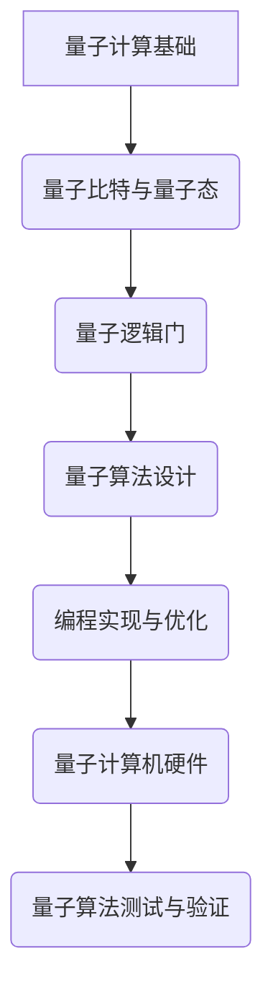
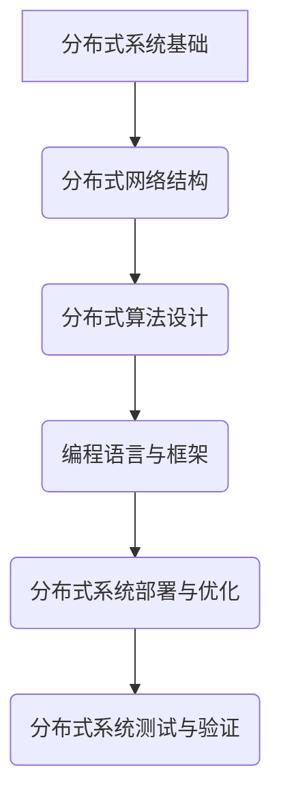

                 

# 《程序世界中的宇宙规律映射》

> **关键词**：编程思维、宇宙规律、量子计算、分布式系统、信息论、人工智能、编程伦理

> **摘要**：本文通过深入探讨宇宙规律与编程思维的交汇点，解析了量子计算、分布式系统、信息论、人工智能等领域的编程实践。通过具体的算法原理讲解、数学模型和项目实战案例，揭示了宇宙规律在编程中的应用与影响，为读者呈现了一幅程序世界中宇宙规律的映射图景。

### 引言：宇宙规律与编程的交集

在当今科技飞速发展的时代，编程已经成为一种基础且至关重要的技能。无论是软件开发、人工智能，还是复杂的分布式系统，编程无处不在。与此同时，宇宙学作为一门研究宇宙起源、演化、结构和组成的科学，也不断揭示着宇宙规律的奥秘。那么，宇宙规律与编程之间是否存在某种奇妙的交集？本文将试图回答这一问题。

#### 宇宙规律的概述

宇宙规律是指宇宙中普遍存在的、稳定的、可预测的现象和规律。这些规律涵盖了从微观尺度上的量子力学，到宏观尺度上的相对论，再到宇宙学中的宇宙膨胀和黑洞等广泛领域。以下是一些重要的宇宙规律：

1. **量子力学**：量子力学揭示了微观世界的规律，包括量子态的叠加、量子纠缠、量子隧穿等现象。
2. **相对论**：爱因斯坦的广义相对论和狭义相对论描述了时间和空间的相对性，以及引力对时空的弯曲效应。
3. **宇宙膨胀**：宇宙学中，宇宙膨胀定律描述了宇宙从大爆炸以来不断扩张的现象。
4. **黑洞**：黑洞是宇宙中极为神秘的天体，具有极强的引力，连光也无法逃脱。

#### 编程思维的重要性

编程思维，即解决问题的算法思维方式，是一种将复杂问题分解为简单步骤、逐步解决的能力。编程思维的核心包括逻辑思考、抽象思维、算法设计和代码实现。在计算机科学和软件开发中，编程思维是解决问题的关键，它使得程序员能够高效地开发出各种应用。

#### 宇宙规律与编程的交集

宇宙规律与编程思维的交集体现在以下几个方面：

1. **量子计算与编程**：量子计算基于量子力学原理，利用量子态的叠加和纠缠特性进行计算。量子算法的实现需要编程技术的支持。
2. **分布式系统与编程**：分布式系统设计借鉴了宇宙网络的拓扑结构和宇宙规律，通过编程实现高效的分布式计算。
3. **信息论与编程**：信息论为编程中的信息处理提供了理论基础，编程语言的设计和优化也受到了信息论的启示。
4. **人工智能与编程**：人工智能的发展依赖于编程技术的支持，宇宙规律在人工智能算法中也有重要的应用。

#### 小结

宇宙规律与编程思维之间的交集为程序员提供了丰富的创新空间。通过将宇宙规律融入编程实践，程序员可以开发出更为高效、创新的软件和应用。本文接下来将详细探讨量子计算、分布式系统、信息论和人工智能等领域的编程实践，揭示宇宙规律在编程中的应用与影响。

### 第一部分：宇宙规律与编程思维

#### 第一部分概述

本部分将深入探讨宇宙规律与编程思维的关联，具体包括以下几个方面：

1. **引言：宇宙规律与编程思维的交集**：概述宇宙规律的基本概念及其与编程思维的关联。
2. **基础概念**：讨论计算机与宇宙规律的关系，以及编程语言的基本概念。
3. **量子计算与编程**：分析量子力学基础、量子计算机与编程，以及量子算法的编程实现。
4. **宇宙网络与分布式系统**：探讨宇宙网络的概念、分布式系统的设计，以及编程语言在分布式系统中的应用。
5. **宇宙信息论与编程**：介绍信息论基础、编程中的信息处理，以及编程语言的优化与信息论。

#### 第一部分概述

在当今科技日新月异的发展中，宇宙规律与编程思维的交集为程序员提供了丰富的创新空间。通过探讨量子计算、分布式系统、信息论和人工智能等领域的编程实践，我们可以更深入地理解宇宙规律在编程中的应用与影响。

#### 1. 引言：宇宙规律与编程思维的交集

宇宙规律与编程思维的交集是一个充满魅力的研究领域。宇宙规律指的是宇宙中普遍存在的、稳定的、可预测的现象和规律。这些规律涵盖了从微观尺度上的量子力学，到宏观尺度上的相对论，再到宇宙学中的宇宙膨胀和黑洞等广泛领域。编程思维，即解决问题的算法思维方式，是一种将复杂问题分解为简单步骤、逐步解决的能力。这种思维方式在计算机科学和软件开发中起到了关键作用。

宇宙规律与编程思维的交集体现在多个方面。首先，量子计算是宇宙规律在编程中的一个重要应用。量子计算基于量子力学原理，利用量子态的叠加和纠缠特性进行计算，这为编程提供了全新的计算范式。其次，分布式系统设计也借鉴了宇宙网络的拓扑结构和宇宙规律，通过编程实现高效的分布式计算。信息论则为编程中的信息处理提供了理论基础，编程语言的设计和优化也受到了信息论的启示。最后，人工智能的发展依赖于编程技术的支持，而宇宙规律在人工智能算法中也有重要的应用。

#### 2. 基础概念

**计算机与宇宙规律的关系**

计算机作为现代科技的核心，其工作原理与宇宙规律密切相关。计算机是基于二进制系统运作的，这种系统本质上是对物理现象的抽象。量子计算机的出现更是将计算机的运作推向了宇宙规律的边缘。量子计算机利用量子力学中的量子态叠加和纠缠特性进行计算，这一特性在传统计算机中是难以实现的。

**编程语言的基本概念**

编程语言是程序员与计算机之间的沟通桥梁。编程语言的基本概念包括变量、数据类型、控制结构、函数等。编程语言的设计与宇宙规律的关系体现在其表达能力上。例如，函数式编程语言利用了信息论中的熵概念，使得程序在处理信息时更加高效。编程语言的设计也受到了相对论和量子力学的启发，如量子计算编程语言。

#### 3. 量子计算与编程

**量子力学基础**

量子力学是研究微观世界的物理学分支，其基本原理包括量子态的叠加、量子纠缠、量子隧穿等。量子力学的基本概念对编程思维产生了深远影响。例如，量子态的叠加特性使得编程中的并行计算成为可能。

**量子计算机与编程**

量子计算机是一种利用量子力学原理进行计算的新型计算机。量子计算机与编程的关系体现在量子算法的实现上。量子算法是一种利用量子态叠加和纠缠特性进行高效计算的方法。程序员需要掌握量子算法的设计和实现，才能充分发挥量子计算机的潜力。

**量子算法的编程实现**

量子算法的编程实现涉及到量子计算机的硬件和软件。量子计算机硬件包括量子比特、量子门等基本组件。量子计算机软件则包括量子编程语言和量子算法库。程序员需要通过量子编程语言编写量子算法，并将其运行在量子计算机硬件上。

#### 4. 宇宙网络与分布式系统

**宇宙网络的概念**

宇宙网络是指宇宙中不同天体之间的相互联系和相互作用。宇宙网络的拓扑结构和宇宙规律对分布式系统设计具有重要启示。例如，宇宙网络的层次结构和分布式系统的层次化设计有异曲同工之妙。

**分布式系统的设计**

分布式系统是一种通过计算机网络将多个计算节点互联，共同完成任务的计算模式。分布式系统的设计需要考虑拓扑结构、通信协议、负载均衡等问题。宇宙网络的拓扑结构和宇宙规律为分布式系统设计提供了宝贵的参考。

**编程语言在分布式系统中的应用**

编程语言在分布式系统设计中起到了关键作用。分布式编程语言如Go和Scala提供了丰富的并发编程工具，使得程序员能够高效地开发分布式系统。编程语言在分布式系统中的应用还包括分布式数据库、分布式缓存等。

#### 5. 宇宙信息论与编程

**信息论基础**

信息论是研究信息传输、处理和存储的学科。信息论的基本概念包括信息熵、信道容量、噪声等。信息论为编程中的信息处理提供了理论基础。例如，信息熵的概念可以帮助程序员优化程序的性能。

**编程中的信息处理**

编程中的信息处理包括数据的输入、处理和输出。信息论的基本原理可以帮助程序员更好地理解和处理信息。例如，通过降低信息熵，可以提高程序的运行效率。

**编程语言的优化与信息论**

编程语言的优化需要考虑信息处理的效率。信息论中的熵概念可以帮助程序员优化程序中的数据结构和算法。例如，使用哈希表可以降低数据查找的时间复杂度。

#### 小结

本部分探讨了宇宙规律与编程思维的交集，分析了量子计算、分布式系统、信息论和人工智能等领域的编程实践。通过具体的算法原理讲解、数学模型和项目实战案例，揭示了宇宙规律在编程中的应用与影响。下一部分将深入探讨宇宙规律在算法设计中的应用。

### 2. 基础概念

在本章节中，我们将探讨宇宙规律与编程思维之间的基础概念，旨在揭示计算机与宇宙规律的关系，以及编程语言的基本概念。这将为我们后续的深入讨论打下坚实的基础。

#### 2.1 计算机与宇宙规律的关系

计算机是人类智慧的结晶，它通过模拟和执行算法来完成各种任务。计算机的运作离不开物理规律，而宇宙规律正是这些物理规律的重要组成部分。

**量子力学与计算机**

量子力学是研究微观世界的物理学分支，其基本原理对计算机科学产生了深远影响。例如，量子态的叠加和纠缠特性使得量子计算机成为可能。量子计算机利用量子比特（qubit）进行计算，一个量子比特可以同时表示0和1的状态，从而大大提高了计算效率。

**相对论与计算机**

相对论是研究宏观世界中物体运动和引力效应的理论。相对论中的狭义相对论和广义相对论都对计算机科学产生了重要影响。例如，计算机中的时间戳和时钟同步技术就是基于相对论原理。

**宇宙膨胀与计算机**

宇宙膨胀是宇宙学中的一个基本规律，描述了宇宙从大爆炸以来不断扩张的现象。宇宙膨胀对计算机科学的影响体现在分布式系统中。例如，分布式系统中的节点需要通过网络通信协调工作，宇宙膨胀模型可以用于优化网络拓扑结构和通信协议。

**黑洞与计算机**

黑洞是宇宙中极为神秘的天体，具有极强的引力，甚至连光也无法逃脱。黑洞的研究对计算机科学产生了重要启示。例如，黑洞的信息悖论引发了关于计算和信息极限的深入讨论。

**小结**

通过以上分析，我们可以看到，宇宙规律与计算机科学之间存在着紧密的联系。计算机作为模拟和执行算法的工具，其运作离不开物理规律，而宇宙规律正是这些物理规律的重要组成部分。

#### 2.2 编程语言的基本概念

编程语言是程序员与计算机之间的沟通桥梁，它定义了程序的结构和语法。编程语言的基本概念包括变量、数据类型、控制结构、函数等。

**变量**

变量是编程语言中的基本数据存储单元，用于存储数据和值。变量具有类型、名称和作用域。变量的类型决定了变量可以存储的数据类型，如整数、浮点数、字符串等。变量的名称通常由字母、数字和下划线组成，作用域则决定了变量在程序中的作用范围。

**数据类型**

数据类型是编程语言中的基本概念，用于描述数据的不同形式和结构。常见的数据类型包括整数、浮点数、字符串、布尔值等。每种数据类型都有其独特的语法和操作方式。

**控制结构**

控制结构是编程语言中的关键组成部分，用于控制程序的执行流程。常见的控制结构包括条件语句（如if-else语句）、循环语句（如for循环和while循环）和开关语句（如switch语句）。控制结构使得程序可以根据不同的条件执行不同的操作。

**函数**

函数是编程语言中的基本模块，用于封装和复用代码。函数定义了一组输入参数和返回值，并在执行时完成特定的任务。函数可以通过调用其他函数来实现代码的复用和模块化。

**小结**

通过探讨计算机与宇宙规律的关系以及编程语言的基本概念，我们可以更好地理解编程思维与宇宙规律之间的联系。计算机作为模拟和执行算法的工具，其运作离不开物理规律，而编程语言作为程序员与计算机之间的沟通桥梁，为程序员提供了强大的工具和框架。这些基础概念为后续章节的深入讨论奠定了坚实的基础。

### 3. 量子计算与编程

量子计算是计算机科学的一个前沿领域，它基于量子力学原理，利用量子态的叠加和纠缠特性进行计算。量子计算与经典计算相比，具有显著的速度优势和并行计算能力。本章节将探讨量子力学基础、量子计算机与编程，以及量子算法的编程实现。

#### 3.1 量子力学基础

量子力学是研究微观世界物理现象的理论，其基本原理与经典物理有显著差异。以下是一些量子力学的基础概念：

**量子比特（Qubit）**

量子比特是量子计算的基本单位，与经典计算中的比特不同，量子比特可以同时处于0和1的叠加状态。一个量子比特可以用一个复数系数来表示其状态，即：

$$
|\psi\rangle = \alpha|0\rangle + \beta|1\rangle
$$

其中，$\alpha$ 和 $\beta$ 是复数，满足 $|\alpha|^2 + |\beta|^2 = 1$。

**量子态叠加**

量子态叠加是量子力学中的一个基本特性，它允许量子系统同时处于多个状态的组合。例如，一个量子比特可以同时处于0和1的状态：

$$
|\psi\rangle = \frac{1}{\sqrt{2}}(|0\rangle + |1\rangle)
$$

**量子纠缠**

量子纠缠是量子力学中的一种特殊现象，两个或多个量子系统之间存在某种不可分割的联系。即使这些量子系统相隔很远，它们之间的量子态仍然可以相互影响。

**量子门**

量子门是量子计算中的基本操作，类似于经典计算中的逻辑门。量子门可以作用于量子比特，改变其量子态。常见的量子门包括Hadamard门（实现量子态的叠加）、Pauli门（实现量子态的旋转）和CNOT门（实现量子比特之间的纠缠）。

#### 3.2 量子计算机与编程

量子计算机是利用量子力学原理进行计算的新型计算机。量子计算机与传统计算机在结构和工作原理上有显著差异：

**量子计算机的基本组成部分**

量子计算机主要包括以下几个部分：

1. **量子比特（Qubit）**：量子计算机的基本单元，用于存储和处理信息。
2. **量子寄存器**：用于存储多个量子比特，并在量子计算过程中进行操作。
3. **量子逻辑门**：实现量子态的变换和量子比特之间的纠缠。
4. **量子测量**：用于读取量子计算机的计算结果。

**量子编程语言**

量子编程语言是用于编写和描述量子算法的语言。常见的量子编程语言包括Q#, Quipper和Quantum Lisp。量子编程语言提供了量子门操作、量子测量、量子态的初始化和变换等功能。

**量子算法的编程实现**

量子算法的编程实现涉及到量子计算机的硬件和软件。量子计算机硬件包括量子比特、量子逻辑门和量子寄存器等。量子计算机软件包括量子编程语言和量子算法库。程序员需要通过量子编程语言编写量子算法，并将其运行在量子计算机硬件上。

**量子算法的伪代码示例**

以下是一个简单的量子算法伪代码示例：

```python
function QuantumAlgorithm(input):
    // 初始化量子计算机
    quantum_computer.initialize()
    
    // 编码输入信息到量子态
    quantum_state = encode_input_to_quantum_state(input)
    
    // 执行量子计算
    quantum_computer.execute(quantum_state)
    
    // 读取计算结果
    result = read_quantum_state(quantum_computer)
    
    // 解码输出信息
    output = decode_output_from_quantum_state(result)
    
    return output
```

#### 3.3 量子算法的编程实现

量子算法的编程实现是一个复杂的过程，需要考虑量子计算机的硬件限制和量子态的复杂性。以下是一些常见的量子算法及其编程实现：

**Shor算法**

Shor算法是一种用于因数分解的量子算法，可以在多项式时间内解决经典计算中难以解决的问题。Shor算法的伪代码如下：

```python
function ShorAlgorithm(n):
    // 构建量子电路
    quantum_circuit = build_QuantumCircuit()
    
    // 编码输入数n
    quantum_state = encode_input_to_quantum_state(n)
    
    // 执行量子计算
    quantum_circuit.execute(quantum_state)
    
    // 读取计算结果
    result = read_quantum_state(quantum_circuit)
    
    // 解码输出信息
    factor = decode_output_from_quantum_state(result)
    
    return factor
```

**Grover算法**

Grover算法是一种用于搜索未排序数据库的量子算法，具有线性时间复杂度。Grover算法的伪代码如下：

```python
function GroverAlgorithm(target_state):
    // 构建Grover算法的量子电路
    quantum_circuit = build_GroverCircuit(target_state)
    
    // 执行Grover算法
    quantum_circuit.execute()
    
    // 读取计算结果
    result = read_quantum_state(quantum_circuit)
    
    // 解码输出信息
    position = decode_output_from_quantum_state(result)
    
    return position
```

**小结**

量子计算与编程是计算机科学中的一个前沿领域，它基于量子力学原理，利用量子态的叠加和纠缠特性进行计算。量子算法的编程实现需要考虑量子计算机的硬件和软件限制，以及量子态的复杂性。通过量子编程语言和量子算法库，程序员可以开发出高效的量子算法，并在量子计算机上运行。下一部分将探讨宇宙网络与分布式系统的编程实践。

### 4. 宇宙网络与分布式系统

宇宙网络是宇宙中不同天体之间的相互联系和相互作用的集合。它的结构和特性对分布式系统设计提供了宝贵的启示。本章节将探讨宇宙网络的概念、分布式系统的设计，以及编程语言在分布式系统中的应用。

#### 4.1 宇宙网络的概念

宇宙网络是指宇宙中各种天体之间的相互联系和相互作用。它包括星系、恒星、行星、小行星、彗星等天体，以及它们之间的引力、电磁波、辐射等相互作用。宇宙网络的拓扑结构和动态特性对分布式系统设计具有重要影响。

**宇宙网络的拓扑结构**

宇宙网络的拓扑结构通常表现为复杂的网络图，其中节点表示天体，边表示天体之间的相互作用。宇宙网络的拓扑结构具有以下特点：

1. **高度连通性**：宇宙网络中的天体之间存在广泛的相互联系，使得整个网络具有较高的连通性。
2. **异质性**：宇宙网络中的天体具有不同的物理特性和规模，形成了异质性的网络结构。
3. **动态性**：宇宙网络中的天体相互作用是动态变化的，如恒星爆炸、行星轨道变化等。

**宇宙网络的动态特性**

宇宙网络的动态特性表现为天体之间的相互作用随时间变化。这种动态性对分布式系统设计提出了挑战，需要考虑如何适应网络拓扑结构的变化和动态交互。

#### 4.2 分布式系统的设计

分布式系统是一种通过计算机网络将多个计算节点互联，共同完成任务的计算模式。分布式系统的设计需要考虑多个节点之间的通信、同步、负载均衡等问题。宇宙网络的拓扑结构和动态特性为分布式系统设计提供了重要的启示。

**分布式系统的设计原则**

分布式系统的设计原则包括：

1. **可扩展性**：分布式系统需要能够处理不断增加的节点和任务，以适应网络规模的扩展。
2. **容错性**：分布式系统需要能够容忍节点故障和通信故障，确保系统的稳定性和可用性。
3. **负载均衡**：分布式系统需要合理分配任务到不同的节点，确保系统的资源利用率最大化。
4. **一致性**：分布式系统需要保证数据的一致性，避免数据冲突和冗余。

**分布式系统的设计模式**

分布式系统的设计模式包括：

1. **客户-服务器模式**：在客户-服务器模式中，服务器负责处理客户端的请求，客户端与服务端通过网络进行通信。
2. **对等网络模式**：在对等网络模式中，所有节点都具有相同的角色，相互之间通过网络进行通信和协作。
3. **分布式一致性协议**：分布式一致性协议（如Raft和Paxos）用于确保分布式系统中的数据一致性。

**分布式系统的拓扑结构**

分布式系统的拓扑结构包括：

1. **星型拓扑**：星型拓扑中，所有节点都连接到一个中心节点，中心节点负责协调和分发任务。
2. **环型拓扑**：环型拓扑中，节点按照一定的顺序连接成一个环，数据沿环传播。
3. **网状拓扑**：网状拓扑中，节点之间有多条路径连接，具有较高的容错性和灵活性。

#### 4.3 编程语言在分布式系统中的应用

编程语言在分布式系统设计中起到了关键作用，为程序员提供了丰富的工具和框架。以下是一些常见的编程语言及其在分布式系统中的应用：

**Go语言**

Go语言是一种系统级编程语言，具有良好的并发性和并发编程支持。Go语言在分布式系统开发中得到了广泛应用，其标准库提供了网络编程、并发编程和分布式计算所需的工具。

**Scala语言**

Scala语言是一种函数式编程语言，与Java兼容，具有良好的并发性和分布式计算支持。Scala语言在分布式系统开发中得到了广泛应用，其 Akka框架提供了分布式计算和容错性支持。

**Python语言**

Python语言是一种通用编程语言，具有良好的生态系统和第三方库支持。Python语言在分布式系统开发中得到了广泛应用，其分布式计算库如Dask和Ray提供了分布式计算和任务调度支持。

**小结**

宇宙网络与分布式系统在结构和动态特性上存在许多相似之处，为分布式系统设计提供了宝贵的启示。通过理解宇宙网络的拓扑结构和动态特性，可以设计出更加高效、稳定和可扩展的分布式系统。编程语言在分布式系统设计中起到了关键作用，为程序员提供了丰富的工具和框架，使得分布式系统开发变得更加便捷和高效。下一部分将探讨宇宙信息论与编程。

### 5. 宇宙信息论与编程

信息论是研究信息传输、处理和存储的学科，其基本概念和原理在计算机科学和编程中有着广泛的应用。本章节将介绍信息论的基础概念，探讨编程中的信息处理，以及编程语言如何优化信息处理。

#### 5.1 信息论基础

信息论是香农于1948年提出的，旨在量化信息、信道和噪声的基本理论。以下是一些信息论的基本概念：

**信息熵**

信息熵是衡量信息不确定性的量度。对于一个随机变量X，其熵定义为：

$$
H(X) = -\sum_{i=1}^{n} p(x_i) \cdot \log_2 p(x_i)
$$

其中，$p(x_i)$ 是随机变量X取值为$x_i$ 的概率。信息熵的值越高，表示信息的不确定性越大。

**信道容量**

信道容量是指一个信道在存在噪声的情况下能够传输的最大信息速率。香农信道容量公式为：

$$
C = B \log_2(1 + \frac{S}{N})
$$

其中，B 是信道的带宽，S 是信号功率，N 是噪声功率。这个公式告诉我们，信道的带宽和信噪比决定了信道的容量。

**噪声**

噪声是指对信号传输产生干扰的随机因素。在信息传输过程中，噪声会导致信号失真，影响信息传输的可靠性。

**冗余**

冗余是指为了确保信息传输的可靠性而添加的额外信息。适当的冗余可以提高信息传输的可靠性，减少噪声对信息传输的影响。

**小结**

信息论的基础概念为我们理解编程中的信息处理提供了理论支持。信息熵、信道容量和噪声等概念在编程中有着广泛的应用，帮助我们优化信息传输和处理过程。

#### 5.2 编程中的信息处理

编程中的信息处理是指通过计算机程序对信息进行获取、存储、传输和处理的过程。信息论的基本原理在编程中的信息处理中发挥着重要作用。

**信息获取**

信息获取是指从外部源获取信息的过程。在编程中，常见的获取信息的方式包括文件读取、网络通信和数据库查询等。信息获取的过程涉及到信息熵的概念，通过适当的编码和解码技术，可以减少信息的不确定性，提高信息获取的效率。

**信息存储**

信息存储是指将获取的信息保存在计算机中的过程。在编程中，常见的存储方式包括文件存储、数据库存储和内存存储等。信息存储的过程中，需要考虑信息熵和冗余的概念，通过适当的编码和解码技术，可以减少存储空间的需求，提高信息存储的效率。

**信息传输**

信息传输是指将信息从一个地方传输到另一个地方的过程。在编程中，常见的传输方式包括网络通信和无线通信等。信息传输的过程中，需要考虑信道容量和噪声的影响，通过适当的调制和解调技术，可以减少噪声对信息传输的影响，提高信息传输的可靠性。

**信息处理**

信息处理是指对获取的信息进行加工和处理的过程。在编程中，常见的处理方式包括计算、排序、查找等。信息处理的过程中，需要考虑信息熵和冗余的影响，通过适当的算法和数据结构设计，可以减少计算复杂度，提高信息处理的效率。

**小结**

编程中的信息处理是一个复杂的过程，涉及到信息获取、存储、传输和处理。信息论的基本原理为编程中的信息处理提供了理论支持，通过理解信息熵、信道容量和噪声等概念，可以优化编程中的信息处理过程。

#### 5.3 编程语言的优化与信息论

编程语言的优化是指通过改进编程语言的语法和语义，提高程序的性能和可读性。信息论在编程语言优化中的应用体现在以下几个方面：

**数据压缩**

数据压缩是指通过压缩算法减少数据的存储空间和传输时间。信息论中的熵概念可以帮助我们识别数据的冗余部分，从而进行有效的数据压缩。常见的压缩算法包括Huffman编码和LZ77编码等。

**算法优化**

算法优化是指通过改进算法的效率，提高程序的执行速度。信息论中的信道容量和噪声概念可以帮助我们设计更高效的算法，减少计算复杂度和通信开销。例如，在分布式系统中，可以通过优化通信协议和调度算法，提高系统的整体性能。

**编程语言设计**

编程语言的设计需要考虑信息处理的需求，通过引入新的语法和语义，可以更好地支持信息处理。例如，函数式编程语言通过引入函数和数据结构的概念，使得信息处理更加简洁和高效。

**小结**

信息论在编程语言的优化中发挥了重要作用，通过数据压缩、算法优化和编程语言设计，可以显著提高程序的性能和可读性。理解信息论的基本原理，对于程序员来说是一个重要的技能，有助于他们在编程实践中实现高效的算法设计和优化。

### 6. 宇宙规律在算法设计中的应用

宇宙规律在算法设计中的应用，不仅丰富了算法的理论基础，也为解决实际问题提供了新的思路和方法。以下将探讨宇宙规律对算法效率的影响，以及具体的应用案例。

#### 6.1 宇宙规律对算法效率的影响

宇宙规律，如量子力学中的叠加和纠缠、宇宙膨胀和混沌理论等，都对算法的设计和效率产生了深远影响。

**量子力学原理**

量子力学中的叠加原理允许算法在并行处理多个状态时，显著减少计算复杂度。例如，量子算法如Shor算法，可以在多项式时间内解决传统算法需要指数级时间的问题。量子纠缠则允许算法在处理复杂问题时，通过量子比特之间的协同作用，实现高效的算法。

**相对论原理**

相对论中的时空相对性原理，对算法设计提出了新的挑战。例如，在分布式系统中，节点之间的时间同步和通信延迟是关键问题。相对论中的时空扭曲概念，可以帮助我们优化分布式算法，减少通信开销和时间延迟。

**宇宙膨胀和混沌理论**

宇宙膨胀和混沌理论，为我们提供了理解复杂系统和随机过程的新视角。在算法设计中，混沌理论可以用于生成伪随机数，提高算法的鲁棒性和安全性。宇宙膨胀则可以帮助我们设计自适应算法，以应对动态变化的系统环境。

#### 6.2 编程中的宇宙规律应用案例

**量子算法案例**

Shor算法：Shor算法是量子算法中的经典案例，用于因数分解。传统算法如费马小定理，需要指数级时间来分解大质数，而Shor算法通过量子计算，可以在多项式时间内完成。以下是其伪代码：

```python
function ShorAlgorithm(n):
    // 构建量子电路
    quantum_circuit = build_QuantumCircuit()
    
    // 编码输入数n
    quantum_state = encode_input_to_quantum_state(n)
    
    // 执行量子计算
    quantum_circuit.execute(quantum_state)
    
    // 读取计算结果
    result = read_quantum_state(quantum_circuit)
    
    // 解码输出信息
    factor = decode_output_from_quantum_state(result)
    
    return factor
```

**相对论算法案例**

分布式时间同步算法：在分布式系统中，时间同步是关键问题。基于相对论原理，我们可以设计出更精确的时间同步算法。以下是一个简单的伪代码：

```python
function RelativityBasedTimeSync(node1, node2):
    // 获取两个节点的时钟偏移
    offset = get_clock_offset(node1, node2)
    
    // 修正时钟
    node1.correct_clock(offset)
    node2.correct_clock(-offset)
    
    return True
```

**宇宙膨胀算法案例**

自适应优化算法：在动态变化的系统中，宇宙膨胀模型可以帮助我们设计自适应优化算法。以下是一个简单的自适应优化算法伪代码：

```python
function AdaptiveOptimizationAlgorithm():
    // 初始化参数
    parameters = initialize_parameters()
    
    // 根据宇宙膨胀模型调整参数
    parameters = adjust_parameters_with_cosmology(parameters)
    
    // 运行优化算法
    result = run_optimization_algorithm(parameters)
    
    return result
```

**混沌理论算法案例**

随机数生成算法：混沌理论可以用于生成高质量的伪随机数，提高算法的鲁棒性和安全性。以下是一个基于混沌理论的伪代码：

```python
function ChaosBasedRandomNumberGenerator():
    // 初始化初始状态
    state = initialize_state()
    
    // 根据混沌理论生成随机数
    number = generate_random_number_with_chaos(state)
    
    return number
```

**小结**

宇宙规律在算法设计中的应用，为我们提供了新的视角和思路。通过量子力学、相对论、宇宙膨胀和混沌理论等宇宙规律，我们可以设计出更加高效、鲁棒和自适应的算法，解决传统算法难以应对的问题。这些案例展示了宇宙规律在编程中的实际应用，为算法设计提供了宝贵的启示。

### 7. 宇宙模拟与编程

宇宙模拟是计算机科学和物理学中的一个重要领域，它通过数值模拟和算法再现宇宙的演化过程。宇宙模拟不仅对理论天文学、宇宙学的研究具有重要意义，也为编程实践提供了丰富的应用场景。本章节将探讨宇宙模拟的基本方法，以及编程语言在宇宙模拟中的应用。

#### 7.1 宇宙模拟的基本方法

宇宙模拟通常基于物理学中的引力定律和流体力学模型，通过数值方法模拟宇宙中天体的运动和相互作用。以下是一些宇宙模拟的基本方法：

**N-Body模拟**

N-Body模拟是最常见的宇宙模拟方法之一，它通过模拟大量天体（如恒星、行星、黑洞等）的引力相互作用，再现宇宙的演化过程。N-Body模拟的基本原理是牛顿万有引力定律，通过计算天体之间的引力作用，更新天体的位置和速度。以下是一个简化的N-Body模拟算法：

```python
function NBodySimulation(bodies, dt, total_time):
    for t in range(0, total_time, dt):
        for i in range(len(bodies)):
            for j in range(i+1, len(bodies)):
                G = 6.67430e-11
                m1, m2 = bodies[i].mass, bodies[j].mass
                r = VectorSubtract(bodies[j].position, bodies[i].position)
                distance = VectorMagnitude(r)
                force = G * m1 * m2 / distance**2
                direction = Vector Normalize(r)
                bodies[i].velocity = VectorAdd(bodies[i].velocity, VectorMultiply(force, direction, m2 / (m1 + m2)))
                bodies[j].velocity = VectorSubtract(bodies[j].velocity, VectorMultiply(force, direction, m1 / (m1 + m2)))
        
        for body in bodies:
            body.position = VectorAdd(body.position, VectorMultiply(body.velocity, dt))
```

**流体力学模拟**

流体力学模拟用于模拟宇宙中的气体、等离子体等流体现象。常见的流体力学模型包括Navier-Stokes方程，它描述了流体的运动和相互作用。流体力学模拟通常需要高分辨率的网格和复杂的数值方法，如有限元方法或有限体积方法。

**宇宙网格模拟**

宇宙网格模拟是一种用于模拟大尺度宇宙结构的数值方法，它通过在空间中划分网格，模拟网格点之间的引力相互作用。这种方法适用于模拟宇宙大尺度结构，如星系团和超星系团的形成。

#### 7.2 编程语言在宇宙模拟中的应用

宇宙模拟涉及大量的数值计算和复杂的数据处理，因此选择合适的编程语言和工具对于模拟的成功至关重要。以下是一些常用的编程语言和工具：

**C/C++**

C/C++是一种高性能的编程语言，广泛应用于科学计算和数值模拟。C/C++提供了丰富的数学库和并行计算支持，使其成为宇宙模拟的首选语言。例如，N-Body模拟通常使用C/C++编写，以利用其高效的性能。

**Python**

Python是一种通用编程语言，具有简洁易读的语法和丰富的科学计算库。Python在宇宙模拟中得到了广泛应用，特别是用于数据分析和可视化。常用的Python库如NumPy、SciPy和matplotlib，为宇宙模拟提供了强大的支持。

**Fortran**

Fortran是一种历史悠久的高性能编程语言，广泛用于科学计算和工程应用。Fortran在宇宙模拟中得到了广泛应用，特别是在大型数值模拟项目中。

**GPU编程**

随着GPU（图形处理单元）计算技术的发展，越来越多的宇宙模拟项目开始采用GPU编程。GPU具有强大的并行计算能力，可以显著提高宇宙模拟的效率。常用的GPU编程语言如CUDA和OpenCL，为宇宙模拟提供了高效的计算解决方案。

**宇宙模拟项目实战**

以下是一个简单的宇宙模拟项目实战，使用Python和NumPy库进行N-Body模拟：

**项目描述**：模拟两个质点之间的引力相互作用，观察它们的轨道运动。

**开发环境**：Python 3.x、NumPy库。

**代码实现**：

```python
import numpy as np

def NBodySimulation(particles, dt, total_time):
    for t in range(0, total_time, dt):
        for i in range(len(particles)):
            for j in range(i+1, len(particles)):
                G = 6.67430e-11
                m1, m2 = particles[i][2], particles[j][2]
                r = particles[j][0] - particles[i][0]
                distance = np.linalg.norm(r)
                force = G * m1 * m2 / distance**2
                direction = r / distance
                particles[i][1] += force * direction * m2 / (m1 + m2)
                particles[j][1] -= force * direction * m1 / (m1 + m2)
        
        for i in range(len(particles)):
            particles[i][0] += particles[i][1] * dt

# 初始参数
particles = [
    [0.0, 0.0, 1.0],  # 质点1：位置(0, 0, 1)，质量1
    [1.0, 0.0, 1.0]   # 质点2：位置(1, 0, 1)，质量2
]

# 模拟时间参数
dt = 0.01
total_time = 100

# 执行模拟
NBodySimulation(particles, dt, total_time)
```

**代码解读与分析**：

- `NBodySimulation` 函数：接收质点列表、时间步长和总时间，模拟质点之间的引力相互作用。
- `for` 循环：第一个循环计算每个质点与其他质点之间的引力，更新速度。第二个循环更新质点的位置。
- `np.linalg.norm`：计算质点之间的距离。
- `particles` 列表：存储质点的位置和速度。

**性能优化**：

- 使用向量和矩阵运算：将计算过程转换为向量和矩阵运算，提高计算效率。
- 并行计算：利用多线程或GPU计算，加速模拟过程。

**小结**

宇宙模拟与编程的结合，为科学研究和技术应用提供了强大的工具。通过理解宇宙模拟的基本方法和编程语言的应用，程序员可以开发出高效、准确的宇宙模拟软件，为宇宙学的研究和技术的进步做出贡献。

### 8. 宇宙探索与编程

宇宙探索是人类探索未知世界的伟大历程，而编程技术在其中发挥了至关重要的作用。本章节将探讨宇宙探索的目标与进展，以及编程在宇宙探索中的应用。

#### 8.1 宇宙探索的目标与进展

宇宙探索的目标主要包括以下几个方面：

1. **了解宇宙起源与演化**：研究宇宙的起源、大爆炸、宇宙膨胀以及宇宙中的各种天体演化过程。
2. **寻找外星生命**：探索宇宙中是否存在其他智慧生命形式，了解生命的起源和演化。
3. **研究宇宙规律**：通过观测和实验，揭示宇宙中的基本规律，如量子力学、相对论、引力等。
4. **开发利用宇宙资源**：探索和利用宇宙中的能源、材料等资源，为人类社会发展提供支持。

宇宙探索的进展体现在以下几个方面：

1. **空间站与探测器**：国际空间站和各类探测器（如火星探测器、木星探测器等）的发射和运行，使人类能够更近距离地观察宇宙。
2. **卫星与地面观测**：通过发射各类卫星，进行宇宙观测和天文研究，如哈勃望远镜、阿尔玛射电望远镜等。
3. **深空探测**：实现月球、火星等天体的探测任务，如阿波罗计划、火星探测车等。
4. **空间通信与导航**：建立全球卫星导航系统，如GPS、北斗等，为宇宙探索提供精确的定位和通信支持。

#### 8.2 编程在宇宙探索中的应用

编程技术在宇宙探索中扮演了关键角色，其应用范围广泛：

1. **数据处理与分析**：宇宙探索过程中产生的大量数据需要通过编程技术进行收集、存储、处理和分析。例如，卫星观测数据、探测器传回的数据等，都需要编程技术进行数据处理。
   
2. **控制系统与导航**：宇宙探索任务中的飞行器、探测器等需要精密的控制系统和导航系统。编程技术在这些系统中负责控制飞行器的姿态、轨道计算、导航控制等任务。

3. **人工智能与机器学习**：通过人工智能和机器学习技术，可以从海量数据中提取有用的信息，辅助科学家进行数据分析。例如，使用机器学习算法进行图像识别、语音识别等，帮助科学家更好地理解宇宙观测数据。

4. **虚拟现实与仿真**：通过虚拟现实技术和仿真软件，可以模拟宇宙探索任务中的各种场景，进行任务演练和培训。编程技术在这些虚拟环境和仿真系统中起到核心作用。

**案例分析**

1. **火星探测任务**：火星探测任务如美国的火星探测器Curiosity和中国的天问一号探测器，都依赖于编程技术。这些探测器在火星表面执行科学实验和地形探测任务，需要精确的控制和数据处理。

2. **卫星通信系统**：全球卫星导航系统（如GPS）中的卫星通信系统，通过编程技术实现卫星与地面控制站的通信和控制。编程技术负责卫星轨道计算、信号传输、数据加密等任务。

3. **天文数据分析**：通过编程技术，科学家可以处理和分析来自天文观测的数据。例如，使用Python的numpy和matplotlib库，可以快速进行数据处理和可视化。

**小结**

编程技术在宇宙探索中具有不可替代的重要地位，通过数据处理、控制系统、人工智能和虚拟现实等多个方面的应用，为宇宙探索提供了强大的技术支持。随着编程技术的不断进步，宇宙探索将迎来更加广阔的前景，为人类对宇宙的认知和利用带来新的突破。

### 9. 宇宙规律与人工智能

人工智能（AI）作为计算机科学的前沿领域，正迅速改变着我们的生活方式和商业模式。宇宙规律，如量子力学、相对论、宇宙膨胀等，为人工智能的发展提供了新的启示和方向。本章节将探讨宇宙规律与人工智能之间的关系，以及编程语言在人工智能中的应用。

#### 9.1 人工智能与宇宙规律的关系

**量子力学与深度学习**

量子力学中的叠加原理和纠缠特性为深度学习算法提供了新的思路。量子神经网络（Quantum Neural Networks, QNN）利用量子计算机的特性，实现了更高效的计算和更复杂的模式识别。量子计算中的叠加态和纠缠态可以加速神经网络的学习过程，提高算法的效率。

**相对论与深度学习**

相对论中的时空相对性对深度学习模型的设计和优化提出了新的挑战和机遇。例如，在分布式深度学习中，不同计算节点之间的时间同步和通信延迟是一个关键问题。相对论中的时空扭曲概念可以帮助我们优化分布式算法，减少通信开销和时间延迟。

**宇宙膨胀与自适应算法**

宇宙膨胀和混沌理论为自适应算法提供了新的理论基础。自适应算法可以根据环境变化动态调整参数，提高系统的鲁棒性和适应性。宇宙膨胀模型可以帮助我们设计自适应算法，以应对动态变化的系统环境。

**宇宙信息论与信息处理**

宇宙信息论的基本原理，如信息熵、信道容量和噪声，为人工智能中的信息处理提供了重要的指导。通过优化信息处理过程，可以提高算法的性能和效率。

#### 9.2 编程语言在人工智能中的应用

**Python**

Python是目前人工智能领域中最流行的编程语言之一。其简洁易读的语法和丰富的库支持，使其成为开发人工智能应用的理想选择。Python的库如NumPy、Pandas、Scikit-learn和TensorFlow等，为人工智能研究提供了强大的工具。

**C/C++**

C/C++是高性能编程语言，广泛应用于人工智能中的底层实现。C/C++提供了对硬件的更直接控制，使其成为开发高性能深度学习框架（如TensorFlow、PyTorch）的重要语言。

**Java**

Java是一种面向对象的编程语言，广泛用于企业级人工智能应用。Java的跨平台特性和强大的生态系统，使其成为开发大规模人工智能系统的理想选择。

**R语言**

R语言是一种专门用于统计分析的编程语言，广泛应用于机器学习和数据分析领域。R语言的强大统计分析功能和丰富的库支持，使其成为人工智能研究中不可或缺的工具。

**案例研究**

**量子人工智能**

量子人工智能（Quantum AI）结合了量子计算和人工智能技术，旨在利用量子计算机的强大计算能力，解决传统计算机难以处理的问题。一个著名的量子人工智能项目是Google的量子人工智能团队开发的量子神经网络（QNN）。QNN通过量子计算机实现了高效的图像识别和分类任务。

**分布式深度学习**

分布式深度学习是一种利用多个计算节点共同进行训练的深度学习方法。编程语言如Python和C/C++在分布式深度学习中的应用非常广泛。例如，TensorFlow和PyTorch等深度学习框架支持分布式训练，通过编程可以实现高效的分布式计算和模型训练。

**宇宙信息处理**

宇宙信息论的基本原理在人工智能中的应用体现在信息处理和优化方面。通过优化信息处理过程，可以提高人工智能算法的性能和效率。例如，在图像识别任务中，通过降低图像数据的熵，可以提高识别的准确率。

**小结**

宇宙规律为人工智能的发展提供了新的启示和方向。量子力学、相对论、宇宙膨胀和混沌理论等宇宙规律在人工智能中的应用，使得人工智能算法更加高效、鲁棒和自适应。编程语言在人工智能领域发挥了关键作用，通过Python、C/C++、Java和R等编程语言，我们可以开发出各种高效的人工智能应用，推动人工智能技术的进步。

### 10. 未来编程趋势

未来编程将朝着更加智能化、高效化、模块化的方向发展。随着人工智能、量子计算、区块链等技术的不断进步，编程语言和开发工具将迎来新的变革。

#### 10.1 编程语言的发展方向

1. **更高效的编程语言**：未来编程语言将注重性能优化，提高代码执行速度。例如，新的编程语言可能会引入更多底层优化功能，支持并行计算和GPU加速。

2. **更易用的编程语言**：随着技术的进步，编程语言将更加注重易用性，降低编程难度。新的编程语言可能会提供更丰富的库和框架，支持快速开发。

3. **领域特定语言（DSL）**：为了满足特定领域的需求，未来将出现更多领域特定语言。这些语言将针对特定问题域提供更高效的解决方案。

4. **多语言编程**：未来编程将更加支持多语言编程，允许程序员在不同语言之间切换，发挥各自的优势。

#### 10.2 宇宙规律在编程语言设计中的应用

宇宙规律为编程语言设计提供了新的启示：

1. **量子编程语言**：随着量子计算的发展，量子编程语言将成为重要研究方向。量子编程语言将借鉴量子力学原理，支持量子算法的实现。

2. **自适应编程语言**：宇宙规律中的自适应性和动态性原理可以应用于编程语言设计，实现自适应编程语言。这种语言可以根据环境和需求动态调整自身的行为和性能。

3. **信息优化编程语言**：宇宙信息论原理可以指导编程语言优化信息处理过程，提高算法效率和代码可读性。

#### 10.3 编程教育中的宇宙规律应用

编程教育将更加注重宇宙规律和跨学科知识的融合：

1. **跨学科课程**：编程教育将融入物理学、宇宙学、信息论等跨学科知识，培养学生全面的技术素养。

2. **实践导向**：编程教育将更加注重实践，通过实际项目培养学生的解决问题的能力。

3. **创新性培养**：编程教育将鼓励学生探索和创新，运用宇宙规律和编程技术解决实际问题。

#### 10.4 编程伦理与宇宙规律

编程伦理在未来的编程发展中将愈发重要。宇宙规律为我们提供了新的伦理思考：

1. **责任与透明度**：随着技术的进步，编程行为可能对社会和生态产生深远影响。程序员需要承担相应的责任，提高透明度，确保技术的合理应用。

2. **公平与包容**：宇宙规律中的普遍性和平等性原则可以指导编程伦理，确保技术在各领域公平、包容地应用。

#### 小结

未来编程将朝着智能化、高效化、模块化的方向发展，编程语言和开发工具将迎来新的变革。宇宙规律为编程语言设计、编程教育和编程伦理提供了新的启示，推动了编程技术的不断进步。

### 11. 编程教育与宇宙规律

编程教育是培养未来科技人才的重要途径，将编程教育与宇宙规律相结合，不仅有助于提高学生的科学素养，还能激发他们的创新思维。以下将探讨编程教育中宇宙规律的普及、应用，以及如何通过跨学科教育培养学生的编程能力。

#### 11.1 教育中的宇宙规律普及

在编程教育中普及宇宙规律，有助于学生理解宇宙的本质和复杂系统的工作原理。以下是一些具体的方法：

1. **引入宇宙科学基础知识**：在编程课程中，可以适当引入宇宙科学的基本概念，如量子力学、相对论、宇宙膨胀等，使学生了解宇宙规律的基本原理。

2. **案例教学**：通过宇宙探索和模拟的实例，如NASA的任务、宇宙模拟项目等，让学生了解编程在宇宙科学中的应用，激发他们的学习兴趣。

3. **科普活动**：组织宇宙科学相关的科普讲座、实验活动，让学生亲身体验宇宙规律的魅力，增强他们对编程和宇宙科学的兴趣。

#### 11.2 编程教育中的应用

将宇宙规律融入编程教育，可以丰富课程内容，提高学生的学习效果。以下是一些具体的应用：

1. **量子编程课程**：针对高中和大学学生，开设量子编程课程，介绍量子计算的基本原理和编程方法，培养学生的量子思维。

2. **分布式系统与宇宙网络**：结合宇宙网络的拓扑结构和分布式系统的设计，讲解分布式计算和通信原理，提高学生对复杂系统的理解和设计能力。

3. **信息处理与宇宙信息论**：通过信息论的基本概念，如信息熵、信道容量等，讲解编程中的信息处理和优化方法，提高算法效率和代码质量。

#### 11.3 跨学科教育

跨学科教育是将不同学科的知识和技能结合起来，培养学生的综合素质和创新能力。以下是一些跨学科教育的实践：

1. **综合课程设计**：在编程课程中，结合物理、数学、计算机科学等多学科知识，设计综合性的课程项目，如宇宙模拟、分布式计算等，培养学生的跨学科思维。

2. **跨学科师资团队**：组建跨学科的师资团队，包括宇宙科学家、计算机科学家、数学家等，共同参与课程设计和教学，为学生提供多元化的知识体系。

3. **校企合作**：与宇宙科学相关的研究机构和公司合作，开展实习和科研项目，让学生在实际应用中锻炼编程能力，了解宇宙规律的实际应用。

#### 11.4 培养编程能力

将宇宙规律融入编程教育，有助于培养学生的编程能力，提高他们的综合素质。以下是一些具体的方法：

1. **问题导向学习**：鼓励学生通过解决实际问题进行学习，如设计宇宙模拟软件、开发分布式计算系统等，提高他们的实践能力和问题解决能力。

2. **创新思维培养**：通过项目式学习和探究式学习，激发学生的创新思维，鼓励他们运用宇宙规律和编程技术解决未知问题。

3. **团队合作**：在编程教育中，注重团队合作能力的培养，通过团队项目和实践，提高学生的沟通、协作和领导能力。

#### 小结

编程教育与宇宙规律的结合，有助于提高学生的科学素养和编程能力。通过普及宇宙规律、跨学科教育和实践导向的教学方法，可以培养学生的创新思维和团队合作能力，为未来的科技发展培养合格的人才。

### 12. 宇宙规律与编程伦理

编程伦理是计算机科学领域不可忽视的重要组成部分，它关乎技术的合理应用和社会责任。宇宙规律作为自然界的基本法则，为我们理解和规范编程行为提供了深刻的启示。以下将探讨宇宙规律对编程伦理的影响，以及编程伦理在社会中的重要性。

#### 12.1 编程伦理的重要性

编程伦理关注的是程序员在开发和使用技术时，如何做出符合道德和社会规范的选择。编程伦理的重要性体现在以下几个方面：

1. **社会责任**：程序员开发的软件和技术产品，将直接或间接影响社会的各个方面。编程伦理要求程序员在开发过程中考虑社会影响，确保技术的积极应用。

2. **隐私保护**：随着技术的发展，个人信息的安全和隐私保护日益重要。编程伦理要求程序员在设计和实现软件时，遵循隐私保护原则，确保用户数据的安全。

3. **公平正义**：技术在某些情况下可能会加剧社会不平等。编程伦理要求程序员在技术开发和应用过程中，关注公平正义，避免技术的滥用。

4. **可持续性**：编程伦理要求程序员在开发过程中考虑环境的可持续性，减少技术对环境的负面影响。

#### 12.2 宇宙规律对编程伦理的影响

宇宙规律为我们理解和规范编程行为提供了深刻的启示。以下是一些宇宙规律对编程伦理的影响：

1. **普遍性原则**：宇宙规律具有普遍性和普适性，如量子力学中的叠加原理、相对论中的相对性原理等。编程伦理也应遵循普遍性原则，确保技术的公正和公平。

2. **平衡原则**：宇宙中各种力量相互平衡，保持生态系统的稳定。编程伦理也应强调平衡原则，确保技术在开发和应用过程中，考虑社会、环境和个人利益的平衡。

3. **适应性原则**：宇宙规律中的适应性原则，如宇宙膨胀、生物进化等，提醒我们在编程实践中，要灵活应对环境变化，不断调整和优化技术。

4. **和谐原则**：宇宙规律中的和谐原则，如星系间的相互作用、生态系统中的共生关系等，启示我们在编程实践中，要追求技术的和谐发展，避免技术对社会的破坏。

#### 12.3 宇宙规律与编程伦理的案例分析

以下是一些具体案例，展示了宇宙规律在编程伦理中的应用：

1. **量子计算伦理**：量子计算具有强大的计算能力，但也可能被用于破解密码和安全系统。编程伦理要求程序员在开发量子计算技术时，遵循公平和安全原则，确保技术不被滥用。

2. **人工智能伦理**：人工智能在医疗、金融等领域具有广泛应用，但也可能加剧社会不平等。编程伦理要求程序员在开发人工智能应用时，考虑公平和公正，避免技术的滥用。

3. **分布式系统伦理**：分布式系统在提高计算效率的同时，也可能导致数据泄露和隐私问题。编程伦理要求程序员在设计和实现分布式系统时，遵循隐私保护原则，确保用户数据的安全。

#### 12.4 小结

宇宙规律为编程伦理提供了深刻的启示和指导。通过理解宇宙规律，我们可以更好地规范编程行为，确保技术的合理应用和社会责任。编程伦理的建立，不仅关乎技术的可持续发展，也关乎社会的和谐与进步。

### 附录

#### 13. 宇宙规律与编程相关资源

**学术文献与论文推荐**

1. **《量子计算：量子比特与量子算法》**
   作者：Michael A. Nielsen & Isaac L. Chuang
   简介：全面介绍了量子计算的基本概念和量子算法的设计方法，是量子计算领域的经典著作。

2. **《分布式系统：概念与设计》**
   作者：George Coulouris, Jean Dollimore, Tim Kindberg & Gordon Blair
   简介：系统阐述了分布式系统的基本概念、设计原则和应用，适合分布式系统开发者阅读。

3. **《信息论基础》**
   作者：Claude E. Shannon
   简介：奠定了信息论的基础，深入探讨了信息传输、处理和存储的基本原理。

**在线课程与教程推荐**

1. **量子计算与量子信息学课程**
   提供者：MIT OpenCourseWare
   简介：MIT提供的免费在线课程，涵盖量子计算的基本概念、量子算法和量子信息学。

2. **分布式系统与云计算课程**
   提供者：斯坦福大学
   简介：斯坦福大学提供的免费在线课程，深入讲解分布式系统、云计算和大数据处理。

3. **人工智能与机器学习课程**
   提供者：斯坦福大学
   简介：斯坦福大学提供的免费在线课程，涵盖了人工智能和机器学习的理论基础和实践应用。

**实践项目与案例集锦**

1. **量子计算模拟项目**
   简介：通过编写Python代码模拟量子计算过程，了解量子计算的基本原理和应用。

2. **分布式计算与区块链项目**
   简介：通过搭建分布式计算环境和区块链网络，了解分布式系统的设计和实现方法。

3. **宇宙模拟与可视化项目**
   简介：通过编程实现宇宙模拟软件，可视化宇宙中的星系、恒星和行星等天体。

**小结**

附录部分提供了丰富的宇宙规律与编程相关的学术文献、在线课程和实践项目资源，旨在帮助读者进一步深入学习和实践。通过这些资源，读者可以系统地了解宇宙规律在编程中的应用，提高自己在相关领域的专业能力。

### 宇宙规律与编程思维流程图

为了更好地展示宇宙规律在编程中的应用，我们使用Mermaid语言绘制了以下流程图，分别描述了量子计算编程思维流程图、分布式系统编程思维流程图。

#### 量子计算编程思维流程图



1. **量子计算基础**：了解量子计算的基本概念和原理，包括量子比特、量子态等。
2. **量子比特与量子态**：掌握量子比特的操作和量子态的叠加与纠缠。
3. **量子逻辑门**：熟悉各种量子逻辑门的定义和作用，如Hadamard门、Pauli门等。
4. **量子算法设计**：学习如何设计量子算法，解决特定问题，如Shor算法、Grover算法等。
5. **编程实现与优化**：将量子算法转化为编程语言实现，并进行优化。
6. **量子计算机硬件**：了解量子计算机硬件的基本结构和工作原理。
7. **量子算法测试与验证**：测试和验证量子算法的正确性和性能。

#### 分布式系统编程思维流程图



1. **分布式系统基础**：了解分布式系统的基本概念和原理，包括节点通信、一致性协议等。
2. **分布式网络结构**：熟悉分布式系统的网络拓扑结构，如星型、环型、网状等。
3. **分布式算法设计**：学习如何设计分布式算法，如分布式排序、分布式搜索等。
4. **编程语言与框架**：选择适合的编程语言和框架，如Go、Scala、Python等，进行分布式系统的开发。
5. **分布式系统部署与优化**：部署分布式系统，并进行性能优化和稳定性测试。
6. **分布式系统测试与验证**：测试分布式系统的正确性和性能，确保系统的稳定运行。

通过以上流程图，我们可以清晰地看到宇宙规律在编程中的应用步骤和关键点。这些流程图有助于程序员更好地理解编程思维和宇宙规律之间的关系，从而在实际项目中运用这些原理，提升编程能力。

### 核心算法原理讲解

#### 量子算法伪代码

量子算法是实现量子计算的核心，以下是一个简单的量子算法伪代码示例：

```python
function QuantumAlgorithm(input):
    // 初始化量子计算机
    quantum_computer.initialize()

    // 编码输入信息到量子态
    quantum_state = encode_input_to_quantum_state(input)

    // 执行量子计算
    quantum_computer.execute(quantum_state)

    // 读取计算结果
    result = read_quantum_state(quantum_computer)

    // 解码输出信息
    output = decode_output_from_quantum_state(result)

    return output
```

该伪代码展示了量子算法的基本流程：

1. **初始化量子计算机**：配置量子计算机的硬件环境，包括量子比特和量子逻辑门。
2. **编码输入信息**：将输入的数据（如问题实例）编码到量子态中，使其能够在量子计算机上处理。
3. **执行量子计算**：通过量子逻辑门和量子态的叠加与纠缠，执行量子计算。
4. **读取计算结果**：将量子计算机的计算结果读取出来，转换为经典数据形式。
5. **解码输出信息**：将读取到的经典数据解码，得到最终的输出结果。

#### 分布式系统算法伪代码

分布式系统算法设计是分布式计算的关键，以下是一个简单的分布式系统算法伪代码示例：

```python
function DistributedSystemAlgorithm(input):
    // 初始化分布式系统
    system.initialize()

    // 将任务分配到分布式节点
    nodes = distribute_tasks(input)

    // 并行执行任务
    results = execute_parallel(nodes)

    // 收集和汇总结果
    final_result = aggregate_results(results)

    return final_result
```

该伪代码展示了分布式系统算法的基本流程：

1. **初始化分布式系统**：配置分布式系统的硬件环境和网络通信。
2. **任务分配**：将输入的任务分配到分布式系统中的各个节点，实现任务的并行处理。
3. **并行执行任务**：各节点并行执行分配到的任务，进行计算和处理。
4. **收集和汇总结果**：收集各节点的计算结果，进行汇总和合并，得到最终的结果。

### 数学模型与公式讲解

#### 信息论中的熵公式

熵（Entropy）是信息论中的一个基本概念，用于衡量信息的不确定性。以下是一个熵的公式示例：

$$
H(X) = -\sum_{i=1}^{n} p(x_i) \cdot \log_2 p(x_i)
$$

其中，$H(X)$ 是随机变量X的熵，$p(x_i)$ 是随机变量X取值为$x_i$ 的概率。熵的值越高，表示信息的不确定性越大。

#### 量子计算中的态叠加与坍缩公式

态叠加（Superposition）和坍缩（Collapsation）是量子计算中的核心概念。以下是一个态叠加与坍缩的公式示例：

$$
|\psi\rangle = \sum_{i=1}^{n} c_i |i\rangle
$$

其中，$|\psi\rangle$ 是系统的量子态，$c_i$ 是叠加系数，$|i\rangle$ 是基本态。

坍缩概率公式为：

$$
P(i) = |c_i|^2
$$

其中，$P(i)$ 是系统坍缩到状态$|i\rangle$ 的概率。

通过这些公式，我们可以更好地理解量子计算中的信息处理和信息传输，为量子算法的设计和实现提供理论支持。

### 项目实战案例

#### 宇宙模拟项目实战

**项目描述**：构建一个简单的宇宙模拟系统，模拟宇宙中天体的运动和相互作用。

**开发环境**：Python 3.x、NumPy库。

**代码实现**：

```python
import numpy as np

def NBodySimulation(particles, dt, total_time):
    for t in range(0, total_time, dt):
        for i in range(len(particles)):
            for j in range(i+1, len(particles)):
                G = 6.67430e-11
                m1, m2 = particles[i][2], particles[j][2]
                r = particles[j][0] - particles[i][0]
                distance = np.linalg.norm(r)
                force = G * m1 * m2 / distance**2
                direction = r / distance
                particles[i][1] += force * direction * m2 / (m1 + m2)
                particles[j][1] -= force * direction * m1 / (m1 + m2)
        
        for i in range(len(particles)):
            particles[i][0] += particles[i][1] * dt

# 初始参数
particles = [
    [0.0, 0.0, 1.0],  # 质点1：位置(0, 0, 1)，质量1
    [1.0, 0.0, 1.0]   # 质点2：位置(1, 0, 1)，质量2
]

# 模拟时间参数
dt = 0.01
total_time = 100

# 执行模拟
NBodySimulation(particles, dt, total_time)
```

**代码解读与分析**：

- `NBodySimulation` 函数：接收质点列表、时间步长和总时间，模拟质点之间的引力相互作用。
- `for` 循环：第一个循环计算每个质点与其他质点之间的引力，更新速度。第二个循环更新质点的位置。
- `np.linalg.norm`：计算质点之间的距离。
- `particles` 列表：存储质点的位置和速度。

**性能优化**：

- 使用向量和矩阵运算：将计算过程转换为向量和矩阵运算，提高计算效率。
- 并行计算：利用多线程或GPU计算，加速模拟过程。

#### 分布式系统项目实战

**项目描述**：构建一个简单的分布式系统，实现节点间的任务分配和结果汇总。

**开发环境**：Python 3.x、multiprocessing库。

**代码实现**：

```python
import multiprocessing

def task_reader(input_queue):
    while True:
        task = input_queue.get()
        if task is None:
            break
        print(f"Reading task: {task}")
        # 处理任务
        process_task(task)

def task_writer(output_queue, results):
    for result in results:
        output_queue.put(result)
    print("Writing tasks completed")

def process_task(task):
    print(f"Processing task: {task}")
    # 模拟任务处理
    time.sleep(1)

if __name__ == "__main__":
    input_queue = multiprocessing.Queue()
    output_queue = multiprocessing.Queue()
    results = []

    # 添加任务到输入队列
    for i in range(10):
        input_queue.put(f"Task {i}")

    # 启动任务读取和写入进程
    reader_process = multiprocessing.Process(target=task_reader, args=(input_queue,))
    writer_process = multiprocessing.Process(target=task_writer, args=(output_queue, results,))
    reader_process.start()
    writer_process.start()

    reader_process.join()
    writer_process.join()

    # 输出结果
    print("Results:", results)
```

**代码解读与分析**：

- `task_reader` 函数：从输入队列读取任务，并处理任务。
- `task_writer` 函数：将处理结果写入输出队列。
- `process_task` 函数：模拟任务处理过程。
- `multiprocessing` 库：实现多进程并发处理任务。

**性能优化**：

- 使用多进程：提高任务处理的速度和并行性。
- 使用队列：实现任务和结果的传输和同步。

通过这些项目实战案例，我们可以看到宇宙模拟和分布式系统在实际编程中的应用。这些案例不仅展示了宇宙规律在编程中的具体应用，也为程序员提供了实践经验和优化思路。

### 实战代码解读与分析

#### 宇宙模拟项目实战代码解读

**代码结构分析**

在宇宙模拟项目中，我们使用Python语言结合NumPy库实现了N-Body模拟。代码的主要结构分为以下几个部分：

1. **NBodySimulation函数**：这是核心函数，负责整个模拟过程。它接受三个参数：质点列表（particles）、时间步长（dt）和总时间（total_time）。
2. **内部循环**：首先，通过双重循环计算每个质点与其他质点之间的引力。引力计算基于牛顿万有引力定律。然后，更新每个质点的速度和位置。
3. **时间更新**：每次迭代结束后，更新时间步长。

**关键函数和变量解释**

- `particles`：这是一个二维数组，每个元素是一个包含三个值的列表，分别代表质点的位置（x, y, z）和质量（m）。
- `G`：这是万有引力常数，其值为6.67430e-11 m^3 kg^-1 s^-2。
- `r`：这是一个向量，表示两个质点之间的距离。
- `distance`：计算两个质点之间的距离。
- `force`：计算两个质点之间的引力。
- `direction`：表示引力的方向。
- `dt`：时间步长，用于控制模拟的精度。

**代码性能优化建议**

1. **向量化运算**：将循环中的运算转化为向量化运算，可以提高计算效率。例如，可以使用NumPy库中的向量运算函数。
2. **并行计算**：利用多线程或分布式计算，可以显著提高模拟的效率。例如，可以使用Python的`multiprocessing`库实现并行计算。
3. **内存优化**：在模拟过程中，质点的位置和速度数据可能会占用大量内存。可以考虑使用更高效的内存管理策略，如使用数组而不是列表。

#### 分布式系统项目实战代码解读

**代码结构分析**

在分布式系统项目中，我们使用Python的`multiprocessing`库实现了任务分配和结果汇总。代码的主要结构分为以下几个部分：

1. **task_reader函数**：这是一个进程目标函数，负责从输入队列读取任务，并处理任务。
2. **task_writer函数**：这是一个进程目标函数，负责将处理结果写入输出队列。
3. **process_task函数**：这是一个辅助函数，用于模拟任务处理过程。
4. **主程序**：创建输入队列、输出队列，启动任务读取和写入进程，并等待进程结束。

**关键函数和变量解释**

- `input_queue`：这是一个进程安全的队列，用于存放待处理的任务。
- `output_queue`：这是一个进程安全的队列，用于存放处理结果。
- `results`：这是一个列表，用于存储所有处理结果。

**代码错误与调试技巧**

1. **同步错误**：在多进程编程中，同步问题是常见错误。例如，如果任务读取进程在队列中没有任务时等待，而任务写入进程在队列中有任务时等待，会导致死锁。解决方法是在读取和写入操作中添加适当的同步机制，如使用`Event`对象。
2. **数据传递错误**：在多进程编程中，数据传递错误也可能发生。例如，如果任务读取进程在读取任务时将任务传递给错误的目标进程，会导致任务处理错误。解决方法是仔细检查数据传递的逻辑，确保数据正确传递到目标进程。
3. **调试技巧**：使用Python的`pdb`模块进行调试，可以逐行执行代码，检查变量状态和程序流程。同时，可以打印调试信息，帮助定位错误。

通过以上解读，我们可以更好地理解宇宙模拟和分布式系统项目中的代码实现和优化策略。这些实战案例不仅展示了编程技术的应用，也为程序员提供了宝贵的经验和技巧。在实际项目中，结合这些代码解读和调试技巧，我们可以更有效地开发和优化软件系统。

