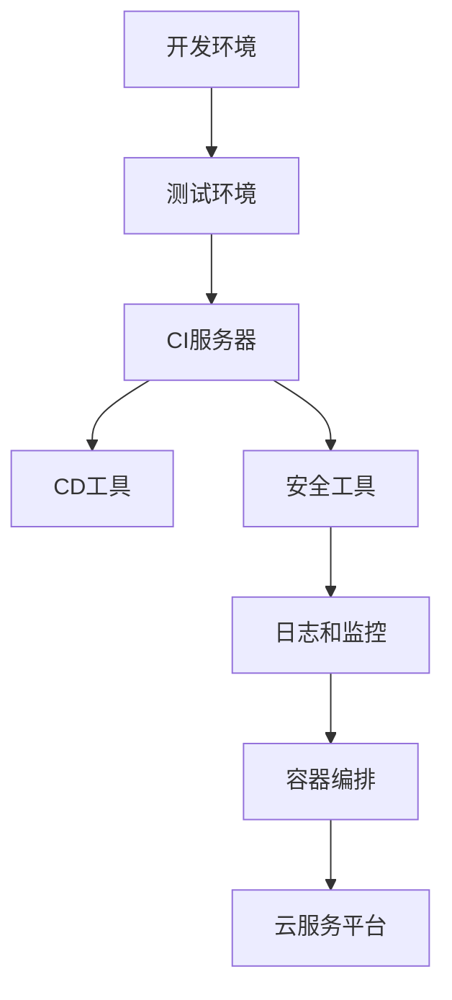

                 

### 《程序员创业公司的DevSecOps实践与安全文化建设》

#### 核心关键词

- **DevSecOps**
- **安全文化建设**
- **持续集成与持续部署**
- **安全测试自动化**
- **安全监控与响应**
- **项目实战**

#### 摘要

本文旨在探讨程序员创业公司如何有效实施DevSecOps实践，并建立安全文化。文章首先介绍了DevSecOps的核心概念和架构设计，接着详细讨论了安全文化建设的重要性、方法与策略。随后，文章深入分析了DevSecOps工具与实践，并通过具体项目实战案例展示了实现过程与效果。最后，文章总结了DevSecOps算法原理与数学模型，并提出了项目管理与团队协作的建议。通过本文，读者将了解如何在创业公司中实现DevSecOps，并构建可持续的安全文化。

---

### 《程序员创业公司的DevSecOps实践与安全文化建设》

#### 核心关键词

- **DevSecOps**
- **安全文化建设**
- **持续集成与持续部署**
- **安全测试自动化**
- **安全监控与响应**
- **项目实战**

#### 摘要

本文旨在探讨程序员创业公司如何有效实施DevSecOps实践，并建立安全文化。文章首先介绍了DevSecOps的核心概念和架构设计，接着详细讨论了安全文化建设的重要性、方法与策略。随后，文章深入分析了DevSecOps工具与实践，并通过具体项目实战案例展示了实现过程与效果。最后，文章总结了DevSecOps算法原理与数学模型，并提出了项目管理与团队协作的建议。通过本文，读者将了解如何在创业公司中实现DevSecOps，并构建可持续的安全文化。

---

### 第一部分：DevSecOps概述

#### 第1章：DevSecOps简介

##### 1.1 DevSecOps的历史与发展

DevSecOps是Development（开发）、Security（安全）和Operations（运维）的融合，旨在通过自动化和协作提高软件交付的安全性和效率。其历史发展可以追溯到2000年代后期，当时敏捷开发（Agile Development）和持续集成/持续部署（CI/CD）逐渐普及。随着软件开发周期的缩短，安全团队发现传统的在软件发布后进行安全测试和修复的做法已经无法满足快速迭代的开发流程。

最初的DevSecOps实践主要关注在开发过程中引入安全检查和测试，逐步发展到在持续集成和持续部署过程中融入安全措施。近年来，随着云计算、容器化和微服务架构的兴起，DevSecOps的概念和实践得到了进一步发展和完善。

##### 1.2 DevSecOps的核心概念

DevSecOps的核心概念包括：

1. **持续集成（CI）**：将代码定期合并到主分支，并通过自动化的测试确保代码质量。
2. **持续部署（CD）**：自动化部署流程，快速将经过测试的代码部署到生产环境。
3. **安全测试自动化**：在CI/CD过程中引入自动化安全测试，如静态代码分析、动态应用安全测试（DAST）、交互式应用安全测试（IAST）等。
4. **安全文化建设**：建立以安全为核心的企业文化，确保所有团队成员都意识到安全的重要性。
5. **安全责任共担**：开发、安全和运维团队共同承担安全责任，通过协作和自动化工具提高整体安全性。

##### 1.3 DevSecOps的优势与挑战

**优势：**

- **提高交付效率**：通过自动化和协作，缩短开发周期，提高软件交付速度。
- **增强安全性**：在开发过程中引入安全检查，及时发现和修复漏洞，降低风险。
- **降低成本**：通过自动化和标准化，减少人工干预，降低安全成本。
- **提升团队协作**：促进开发、安全和运维团队之间的沟通与合作。

**挑战：**

- **文化转变**：DevSecOps要求团队改变传统的工作方式，这可能导致文化冲突和抵触。
- **技能要求**：团队成员需要掌握新的技能和工具，这可能需要额外的培训和资源。
- **工具选择**：市场上存在大量的安全工具和平台，选择合适的工具需要深入的了解和评估。
- **安全性平衡**：在提高安全性的同时，不能影响软件的交付速度和质量。

##### 1.4 DevSecOps与传统安全模式的区别

**传统安全模式**：主要是在软件发布后进行安全测试和修复，安全团队负责发现和解决安全问题。

**DevSecOps**：在开发过程中引入安全检查和测试，通过自动化工具和协作提高整体安全性。

主要区别包括：

- **安全引入时间**：传统安全模式在软件发布后进行安全测试，DevSecOps在开发过程中引入安全检查。
- **责任归属**：传统安全模式主要由安全团队负责，DevSecOps要求整个团队共同承担安全责任。
- **自动化程度**：传统安全模式依赖人工，DevSecOps通过自动化工具提高效率。
- **协作方式**：传统安全模式缺乏跨团队协作，DevSecOps强调团队之间的沟通与合作。

---

### 第二部分：DevSecOps实践

#### DevSecOps架构设计

##### 第2章：DevSecOps架构设计

##### 2.1 DevSecOps架构的组成部分

DevSecOps架构通常包括以下关键组成部分：

1. **开发环境**：提供代码编写、测试和调试的工具和平台。
2. **测试环境**：用于运行自动化测试，包括安全测试，确保代码质量。
3. **持续集成（CI）服务器**：自动化构建、测试和部署过程，确保代码的正确性和安全性。
4. **持续部署（CD）工具**：自动化部署流程，确保软件可以快速、安全地交付到生产环境。
5. **安全工具**：包括静态代码分析工具、动态应用安全测试工具、漏洞扫描工具等。
6. **日志和监控工具**：实时监控应用程序的状态和安全事件，确保快速响应。
7. **容器编排平台**：如Kubernetes，用于管理和部署容器化应用。
8. **云服务平台**：如AWS、Azure、Google Cloud等，提供计算资源、存储和网络服务。

##### 2.2 DevSecOps的关键组件与工具

**1. 开发环境：**

- **版本控制系统**：如Git，用于代码管理和协作。
- **集成开发环境（IDE）**：如Visual Studio Code、IntelliJ IDEA等，提供代码编写和调试工具。
- **代码仓库**：如GitHub、GitLab等，用于存储和管理代码。

**2. 测试环境：**

- **自动化测试框架**：如JUnit、Selenium等，用于编写和运行测试用例。
- **持续集成（CI）服务器**：如Jenkins、Travis CI等，自动化构建和测试过程。
- **测试管理工具**：如SpiraTest、TestRail等，用于管理测试计划和结果。

**3. 持续集成（CI）服务器：**

- **Jenkins**：开源CI服务器，支持多种插件和自动化流程。
- **GitLab CI/CD**：内置CI/CD功能，支持GitLab仓库管理。

**4. 持续部署（CD）工具：**

- **Docker**：容器化平台，简化部署和运行应用程序。
- **Kubernetes**：容器编排平台，用于自动化部署和管理容器化应用。
- **AWS CodePipeline、Azure DevOps、Google Cloud Build**：云服务平台提供的CI/CD服务。

**5. 安全工具：**

- **静态代码分析（SCA）工具**：如SonarQube、Checkmarx等，分析代码中的潜在漏洞。
- **动态应用安全测试（DAST）工具**：如OWASP ZAP、Burp Suite等，模拟攻击检测漏洞。
- **交互式应用安全测试（IAST）工具**：如Veracode、HackerOne等，实时检测代码中的安全问题。
- **漏洞扫描工具**：如Nessus、OpenVAS等，扫描系统中的漏洞。

**6. 日志和监控工具：**

- **ELK Stack**：包括Elasticsearch、Logstash和Kibana，用于收集、存储和可视化日志数据。
- **Prometheus**：开源监控解决方案，用于收集和存储监控数据。
- **Grafana**：开源监控和可视化工具，用于展示Prometheus数据。

##### 2.3 DevSecOps架构设计原则

**1. 自动化**：通过自动化工具和流程，减少人工干预，提高效率和准确性。

**2. 透明性**：所有团队成员都可以访问和监控安全相关的数据和指标，确保透明度。

**3. 责任共担**：开发、安全和运维团队共同承担安全责任，通过协作和工具提高整体安全性。

**4. 快速反馈**：通过实时监控和快速反馈机制，及时发现问题并进行修复。

**5. 可扩展性**：架构设计应具有可扩展性，以适应不断变化的需求和规模。

##### 2.4 DevSecOps架构的Mermaid流程图



---

### 第三部分：DevSecOps安全文化建设

#### 第3章：DevSecOps安全文化建设

##### 3.1 安全文化的重要性

安全文化是DevSecOps实践成功的关键因素。它不仅影响团队的工作方式，还影响整个组织的决策和行为。安全文化的重要性体现在以下几个方面：

**1. 提高安全性**：安全文化确保所有团队成员都意识到安全的重要性，从而在开发过程中主动考虑安全因素，减少潜在的安全风险。

**2. 增强协作**：安全文化促进团队之间的沟通与合作，确保开发、安全和运维团队共同努力，提高整体安全性。

**3. 减少成本**：通过早期发现和修复安全问题，安全文化有助于减少后期修复的成本，并避免潜在的法律和声誉风险。

**4. 提高客户信任**：安全文化有助于建立客户的信任，提高软件的市场竞争力。

##### 3.2 安全意识的培养

安全意识的培养是建立安全文化的基础。以下是一些关键步骤：

**1. 安全培训**：为团队成员提供定期的安全培训，使其了解常见的安全威胁和防护措施。

**2. 安全宣传**：通过海报、邮件、内网文章等形式，宣传安全知识和最佳实践。

**3. 安全挑战**：组织安全挑战活动，如CTF（Capture The Flag）比赛，提高团队成员的安全技能。

**4. 安全责任制**：明确每个团队成员在安全方面的责任，确保每个人都清楚自己的安全职责。

##### 3.3 安全培训与教育

安全培训与教育是提升团队成员安全意识的重要手段。以下是一些关键点：

**1. 初级培训**：针对新入职的团队成员，提供基础的安全知识和技能培训。

**2. 中级培训**：针对具有一定工作经验的团队成员，提供进阶的安全知识和技能培训。

**3. 高级培训**：针对高级开发、安全和运维人员，提供高级的安全知识和技能培训。

**4. 定期回顾**：定期组织安全培训回顾，确保团队成员的安全意识持续提升。

##### 3.4 安全实践与安全规范的制定

安全实践与安全规范的制定是确保DevSecOps安全文化建设落地的重要环节。以下是一些关键点：

**1. 安全实践**：制定并执行一系列安全实践，如代码审查、安全测试、漏洞修复等。

**2. 安全规范**：制定并发布一系列安全规范，如密码策略、访问控制策略、数据加密策略等。

**3. 持续改进**：定期评估安全实践和规范的执行情况，持续改进和优化。

**4. 安全审计**：定期进行安全审计，确保安全实践和规范的严格执行。

---

### 第四部分：DevSecOps工具与实践

#### 第4章：DevSecOps工具与实践

##### 4.1 持续集成与持续部署（CI/CD）

持续集成（Continuous Integration，CI）和持续部署（Continuous Deployment，CD）是DevSecOps的核心实践。通过自动化和协作，CI/CD确保软件在开发过程中保持高质量和安全性。

**持续集成（CI）：**

- **定义**：CI是指将代码定期合并到主分支，并通过自动化测试确保代码质量。
- **优势**：
  - **快速反馈**：通过自动化测试，及时发现和修复代码问题。
  - **减少冲突**：定期合并代码，减少代码冲突。
  - **提高质量**：通过自动化测试，确保代码质量。

**持续部署（CD）：**

- **定义**：CD是指自动化部署流程，快速将经过测试的代码部署到生产环境。
- **优势**：
  - **快速交付**：通过自动化部署，缩短交付周期。
  - **减少错误**：通过自动化测试和部署，减少人为错误。
  - **提高可靠性**：通过自动化测试和部署，确保软件的稳定性和可靠性。

**CI/CD流程：**

1. **代码提交**：开发者将代码提交到版本控制系统。
2. **构建**：CI服务器自动化构建代码，生成可执行文件或容器镜像。
3. **测试**：CI服务器运行自动化测试，确保代码质量。
4. **部署**：将经过测试的代码部署到测试环境或生产环境。

**CI/CD工具选择**：

- **开源工具**：
  - **Jenkins**：功能强大的开源CI/CD服务器，支持多种插件。
  - **GitLab CI/CD**：内置CI/CD功能，与GitLab代码仓库集成。
  - **Travis CI**：支持多种编程语言，提供免费的CI服务。

- **商业工具**：
  - **AWS CodePipeline**：AWS提供的CI/CD服务，集成AWS生态系统。
  - **Azure DevOps**：包含CI/CD、代码仓库和项目管理的综合平台。
  - **Google Cloud Build**：Google提供的CI/CD服务，与Google Cloud集成。

##### 4.2 安全测试自动化

安全测试自动化是DevSecOps的重要组成部分，通过自动化工具和流程，确保代码在开发过程中保持安全性。

**安全测试类型：**

- **静态代码分析（SCA）**：分析代码文本，识别潜在的安全漏洞。
- **动态应用安全测试（DAST）**：运行代码，模拟攻击并检测漏洞。
- **交互式应用安全测试（IAST）**：实时监控代码执行过程，识别潜在的安全问题。

**安全测试工具：**

- **静态代码分析工具**：
  - **SonarQube**：开源平台，支持多种编程语言，提供代码质量分析。
  - **Checkmarx**：商业工具，提供全面的代码安全分析。

- **动态应用安全测试工具**：
  - **OWASP ZAP**：开源平台，支持多种编程语言，提供DAST和IAST功能。
  - **Burp Suite**：商业工具，提供全面的DAST功能。

- **交互式应用安全测试工具**：
  - **Veracode**：商业工具，提供IAST功能。
  - **HackerOne**：平台，提供漏洞赏金计划。

**安全测试自动化流程：**

1. **集成静态代码分析工具**：将静态代码分析工具集成到CI服务器，自动化分析代码。
2. **集成动态应用安全测试工具**：将动态应用安全测试工具集成到CI服务器，自动化运行测试。
3. **生成安全报告**：将测试结果生成安全报告，包括漏洞详情和修复建议。
4. **自动化漏洞修复**：根据安全报告，自动化修复发现的安全漏洞。

##### 4.3 安全监控与响应

安全监控与响应是DevSecOps的另一个重要环节，通过实时监控和快速响应，确保系统的安全性和稳定性。

**安全监控工具：**

- **ELK Stack**：包括Elasticsearch、Logstash和Kibana，用于收集、存储和可视化日志数据。
- **Prometheus**：开源监控解决方案，用于收集和存储监控数据。
- **Grafana**：开源监控和可视化工具，用于展示Prometheus数据。

**安全响应流程：**

1. **日志收集**：收集系统、应用程序和网络安全日志。
2. **日志分析**：实时分析日志数据，识别潜在的安全威胁。
3. **告警通知**：当发现安全威胁时，通过邮件、短信或集成告警工具通知相关人员。
4. **响应措施**：根据安全威胁的性质和严重程度，采取相应的响应措施，如隔离、修复、升级等。

##### 4.4 DevSecOps的最佳实践案例

以下是一些DevSecOps的最佳实践案例，供读者参考：

**1. 社交媒体平台公司：**

- **背景**：该公司面临快速发展的需求，需要确保软件的安全性和稳定性。
- **实践**：
  - **自动化CI/CD**：通过Jenkins和Docker实现自动化CI/CD流程。
  - **静态代码分析**：使用SonarQube进行代码静态分析，发现潜在的安全漏洞。
  - **动态应用安全测试**：使用OWASP ZAP进行动态应用安全测试，确保代码的安全性。
  - **日志监控**：使用ELK Stack进行日志收集和分析，实时监控系统安全事件。

**2. 金融科技公司：**

- **背景**：该公司涉及大量敏感数据，需要确保数据的安全性和合规性。
- **实践**：
  - **自动化CI/CD**：使用AWS CodePipeline和Docker实现自动化CI/CD流程。
  - **安全测试自动化**：使用Checkmarx进行代码静态分析，使用Burp Suite进行动态应用安全测试。
  - **数据加密**：对敏感数据进行加密处理，确保数据在传输和存储过程中的安全性。
  - **安全培训**：定期组织安全培训，提高员工的安全意识。

**3. 医疗保健公司：**

- **背景**：该公司需要确保患者的隐私和安全。
- **实践**：
  - **自动化CI/CD**：使用GitLab CI/CD实现自动化CI/CD流程。
  - **安全测试自动化**：使用Selenium进行自动化UI测试，使用HackerOne进行漏洞赏金计划。
  - **访问控制**：实施严格的访问控制策略，确保只有授权人员可以访问系统。
  - **安全审计**：定期进行安全审计，确保合规性和安全性。

---

### 第五部分：DevSecOps项目实战

#### 第5章：DevSecOps项目实战

##### 5.1 项目环境搭建

在进行DevSecOps项目实战之前，我们需要搭建合适的项目环境。以下是一个基本的搭建流程：

**1. 硬件环境：**

- **服务器**：购买或租用服务器，配置操作系统（如Ubuntu Server）。
- **网络设备**：配置路由器、交换机等网络设备，确保网络连接。

**2. 软件环境：**

- **操作系统**：安装并配置操作系统，确保网络服务正常运行。
- **开发工具**：安装并配置开发工具，如Java SDK、Node.js、Python等。
- **数据库**：安装并配置数据库，如MySQL、PostgreSQL等。
- **版本控制系统**：安装并配置Git，用于代码管理。

**3. 持续集成（CI）服务器：**

- **安装Jenkins**：在服务器上安装Jenkins，配置必要的插件和工具。
- **配置Git**：将项目代码仓库连接到Jenkins，实现自动化构建和测试。

**4. 容器化平台：**

- **安装Docker**：在服务器上安装Docker，配置Dockerfile，实现容器化部署。
- **安装Kubernetes**：在服务器上安装Kubernetes，配置Kubernetes集群，实现容器编排。

**5. 安全工具：**

- **安装SonarQube**：在服务器上安装SonarQube，配置代码仓库，实现静态代码分析。
- **安装OWASP ZAP**：在服务器上安装OWASP ZAP，配置测试环境，实现动态应用安全测试。

##### 5.2 DevSecOps流程设计与实现

在进行DevSecOps项目实战时，我们需要设计并实现一个完整的DevSecOps流程。以下是一个基本的实现流程：

**1. 持续集成（CI）：**

- **代码仓库**：将项目代码存储在Git仓库中，实现版本控制和协同开发。
- **Jenkins配置**：配置Jenkins，实现代码拉取、构建、测试和部署。
- **构建脚本**：编写构建脚本，实现自动化构建和打包。
- **测试脚本**：编写测试脚本，实现自动化测试，确保代码质量。

**2. 持续部署（CD）：**

- **Dockerfile**：编写Dockerfile，实现应用程序的容器化部署。
- **Kubernetes配置**：配置Kubernetes，实现容器编排和管理。
- **部署脚本**：编写部署脚本，实现自动化部署和回滚。

**3. 安全测试自动化：**

- **SonarQube配置**：配置SonarQube，实现静态代码分析，识别潜在的安全漏洞。
- **OWASP ZAP配置**：配置OWASP ZAP，实现动态应用安全测试，检测漏洞和异常行为。

**4. 日志监控与告警：**

- **ELK Stack配置**：配置ELK Stack，实现日志收集、存储和可视化。
- **Prometheus配置**：配置Prometheus，实现监控数据的收集和存储。
- **Grafana配置**：配置Grafana，实现监控数据的可视化。

##### 5.3 安全代码审查与漏洞修复

在DevSecOps项目实战中，安全代码审查和漏洞修复是至关重要的一环。以下是一个基本的实现流程：

**1. 安全代码审查：**

- **代码提交**：开发者将代码提交到Git仓库。
- **静态代码分析**：Jenkins自动触发SonarQube扫描，生成安全报告。
- **代码评审**：开发者和安全团队共同审查安全报告，识别潜在的安全漏洞。

**2. 漏洞修复：**

- **漏洞修复**：开发者根据安全报告，修复发现的安全漏洞。
- **重新测试**：修复后，重新进行静态代码分析和动态应用安全测试，确保漏洞已彻底修复。
- **代码合并**：将修复后的代码合并到主分支，继续进行后续流程。

##### 5.4 实战案例分析

以下是一个具体的DevSecOps项目实战案例，供读者参考：

**项目背景：**

某初创公司开发了一款基于Web的在线教育平台，需要实现高效的开发流程和安全性保障。公司采用了DevSecOps实践，通过自动化工具和流程，提高开发效率和安全性。

**项目实施：**

1. **环境搭建**：

- **硬件环境**：租用云服务器，配置Linux操作系统。
- **软件环境**：安装Java SDK、Python SDK、MySQL等开发工具。
- **CI服务器**：安装Jenkins，配置Git仓库，实现代码拉取和构建。
- **容器化平台**：安装Docker，配置Dockerfile，实现应用程序的容器化部署。
- **安全工具**：安装SonarQube，配置代码仓库，实现静态代码分析。

2. **DevSecOps流程设计与实现**：

- **CI流程**：

  - Jenkins自动拉取Git仓库中的代码，构建Java Web应用程序。
  - 自动触发SonarQube扫描，生成安全报告。
  - 自动执行测试脚本，确保代码质量。

- **CD流程**：

  - 将构建好的应用程序容器化，部署到Kubernetes集群。
  - Kubernetes自动化管理容器，实现应用程序的弹性扩展。

- **安全测试自动化**：

  - 使用SonarQube进行静态代码分析，识别潜在的安全漏洞。
  - 使用OWASP ZAP进行动态应用安全测试，检测漏洞和异常行为。

- **日志监控与告警**：

  - 配置ELK Stack，收集应用程序的日志数据。
  - 使用Prometheus和Grafana进行监控和告警，确保系统安全。

3. **安全代码审查与漏洞修复**：

- **代码提交**：开发者将代码提交到Git仓库。
- **静态代码分析**：Jenkins自动触发SonarQube扫描，生成安全报告。
- **代码评审**：开发者和安全团队共同审查安全报告，识别潜在的安全漏洞。
- **漏洞修复**：开发者根据安全报告，修复发现的安全漏洞。
- **重新测试**：修复后，重新进行静态代码分析和动态应用安全测试，确保漏洞已彻底修复。

通过以上实施，公司成功实现了高效的开发流程和安全性保障，提高了产品交付速度和客户满意度。

---

### 第六部分：DevSecOps算法原理与数学模型

#### 第6章：DevSecOps算法原理与数学模型

##### 6.1 算法概述与伪代码

DevSecOps中的算法主要用于安全测试自动化、漏洞检测和风险评估。以下是一些常见的算法及其伪代码：

**1. 安全测试自动化算法**

```plaintext
算法名称：安全测试自动化

输入：项目代码

输出：安全漏洞报告

步骤：
1. 初始化安全规则库
2. 初始化测试工具
3. 遍历项目代码中的文件
4. 对于每个文件，执行以下操作：
   - 执行静态代码分析
   - 检查文件中的潜在漏洞
   - 如果发现漏洞，记录漏洞信息并输出漏洞报告
5. 执行动态代码分析
6. 在模拟环境中执行代码
7. 监控代码的执行行为
8. 如果发现异常行为，记录异常行为并输出漏洞报告
9. 返回漏洞报告
```

**2. 漏洞检测算法**

```plaintext
算法名称：漏洞检测

输入：项目代码

输出：漏洞列表

步骤：
1. 初始化漏洞库
2. 遍历项目代码中的函数和方法
3. 对于每个函数和方法，执行以下操作：
   - 分析函数或方法的语法结构
   - 检查函数或方法的输入参数和返回值
   - 如果发现潜在漏洞，记录漏洞信息
4. 使用规则库对漏洞进行分类
5. 输出漏洞列表
```

**3. 风险评估算法**

```plaintext
算法名称：风险评估

输入：漏洞列表

输出：风险得分

步骤：
1. 初始化风险得分权重
2. 遍历漏洞列表
3. 对于每个漏洞，执行以下操作：
   - 根据漏洞的类型和严重程度，计算风险得分
   - 将风险得分乘以权重，得到总分
4. 输出总风险得分
```

##### 6.2 数学模型详解与公式表示

在DevSecOps中，常用的数学模型包括机器学习模型、统计分析模型和决策树模型。以下是对这些模型的详细解释和公式表示：

**1. 机器学习模型（如决策树）**

决策树是一种常用的机器学习模型，用于分类和回归任务。其基本思想是通过一系列的决策规则，将数据划分为不同的类别或数值。

$$
\text{分类结果} = \arg\max(\sum_{i=1}^{n} w_i \cdot f(x_i))
$$

其中，$w_i$ 是模型权重，$f(x_i)$ 是特征向量。

**2. 统计分析模型**

统计分析模型常用于数据分析和预测。其中，线性回归是一种常见的统计分析模型。

$$
y = \beta_0 + \beta_1 \cdot x
$$

其中，$y$ 是因变量，$x$ 是自变量，$\beta_0$ 和 $\beta_1$ 是模型参数。

**3. 决策树模型**

决策树模型是一种基于树形结构的模型，用于分类和回归任务。其基本思想是通过一系列的决策规则，将数据划分为不同的类别或数值。

$$
\text{分类结果} = \arg\min(\sum_{i=1}^{n} (\text{预测值} - \text{实际值})^2)
$$

其中，$n$ 是数据点的数量，$\text{预测值}$ 和 $\text{实际值}$ 分别是预测结果和实际值。

##### 6.3 数学模型举例说明

以下是一个基于线性回归的数学模型举例：

假设我们要预测一家公司的股票价格，使用过去一年的股票价格数据作为训练数据。我们的目标是建立一个线性回归模型，预测未来的股票价格。

1. **数据收集**：

   收集过去一年的股票价格数据，包括开盘价、收盘价、最高价、最低价等。

2. **数据预处理**：

   - 清洗数据，去除缺失值和异常值。
   - 归一化数据，使数据具有相似的尺度。

3. **模型训练**：

   使用线性回归算法，将股票价格作为因变量，开盘价、收盘价、最高价、最低价作为自变量，建立模型。

4. **模型评估**：

   使用训练数据集，评估模型的准确性和可靠性。

5. **模型预测**：

   使用训练好的模型，预测未来的股票价格。

线性回归模型的公式表示如下：

$$
\text{预测股票价格} = \beta_0 + \beta_1 \cdot \text{开盘价} + \beta_2 \cdot \text{收盘价} + \beta_3 \cdot \text{最高价} + \beta_4 \cdot \text{最低价}
$$

其中，$\beta_0$、$\beta_1$、$\beta_2$、$\beta_3$、$\beta_4$ 是模型参数。

通过上述模型，我们可以预测未来的股票价格，帮助投资者做出投资决策。

---

### 第七部分：DevSecOps项目管理与团队协作

#### 第7章：DevSecOps项目管理与团队协作

##### 7.1 项目管理流程

在DevSecOps项目中，项目管理是一个至关重要的环节，它涉及到项目规划、执行、监控和收尾的全过程。以下是一个典型的项目管理流程：

**1. 项目规划**

- **项目立项**：确定项目目标和范围，评估项目风险和资源需求。
- **需求分析**：明确项目的功能需求、性能需求和安全性需求。
- **制定计划**：制定项目时间表、资源分配和预算计划。

**2. 项目执行**

- **团队组建**：组建项目经理、开发人员、测试人员、运维人员和安全人员。
- **开发阶段**：按照需求文档进行软件开发，同时进行安全测试和漏洞修复。
- **测试阶段**：进行单元测试、集成测试和系统测试，确保软件质量。
- **部署阶段**：将经过测试的软件部署到生产环境，进行上线前安全检查。

**3. 项目监控**

- **进度监控**：定期监控项目进度，确保项目按计划进行。
- **质量监控**：监控软件质量，包括代码质量、测试覆盖率、缺陷密度等。
- **安全监控**：实时监控系统的安全事件，确保系统的安全性。

**4. 项目收尾**

- **验收阶段**：进行用户验收测试，确保软件满足用户需求。
- **交付阶段**：将软件和相关文档交付给用户，完成项目交付。
- **项目总结**：总结项目经验，评估项目成果，为后续项目提供参考。

##### 7.2 团队协作工具与实践

在DevSecOps项目中，团队协作工具和实践对于项目的成功至关重要。以下是一些常用的团队协作工具和实践：

**1. 团队协作工具**

- **Git**：版本控制系统，用于代码管理和协作。
- **Jenkins**：持续集成服务器，用于自动化构建、测试和部署。
- **Docker**：容器化平台，用于简化部署和运行应用程序。
- **Kubernetes**：容器编排平台，用于自动化部署和管理容器化应用。
- **Slack**：即时通讯工具，用于团队内部沟通。
- **Trello/Asana**：项目管理工具，用于任务分配和进度跟踪。

**2. 团队协作实践**

- **敏捷开发**：采用敏捷开发方法，提高团队响应速度和灵活性。
- **看板（Kanban）**：使用看板进行任务管理，可视化工作流程和进度。
- **代码审查**：定期进行代码审查，提高代码质量和安全性。
- **自动化测试**：自动化测试，确保软件质量。
- **持续反馈**：定期进行项目评估和反馈，持续改进项目流程。

##### 7.3 项目风险管理

在DevSecOps项目中，风险管理是一个持续的过程，涉及到识别、评估和应对项目中的风险。以下是一些关键步骤：

**1. 风险识别**

- **项目初期的风险评估**：在项目立项阶段，评估项目的主要风险，如技术风险、时间风险、资源风险等。
- **持续的风险监控**：在项目执行过程中，定期监控风险，识别新的风险。

**2. 风险评估**

- **定量评估**：使用数学模型和统计方法，对风险进行定量评估，确定风险优先级。
- **定性评估**：评估风险的可能性、影响程度和严重程度。

**3. 风险应对**

- **风险规避**：通过调整项目计划、增加资源投入等方式，避免风险的发生。
- **风险减轻**：通过改进技术、增加测试频率等方式，降低风险的影响程度。
- **风险转移**：通过购买保险、签订合同等方式，将风险转移给第三方。

**4. 风险监控**

- **实时监控**：使用风险管理工具，实时监控项目中的风险，确保及时应对。
- **定期回顾**：定期回顾项目风险，总结风险管理的经验教训，为后续项目提供参考。

##### 7.4 项目评估与持续改进

项目评估是DevSecOps项目中的一个重要环节，通过评估项目成果，识别项目中的不足，持续改进项目流程。以下是一些关键步骤：

**1. 项目评估**

- **评估指标**：根据项目目标和需求，确定评估指标，如交付时间、交付质量、安全性等。
- **数据收集**：收集项目过程中的数据，如代码提交次数、测试覆盖率、漏洞修复率等。
- **评估结果**：根据评估指标和收集的数据，评估项目的整体成果。

**2. 持续改进**

- **识别不足**：通过评估结果，识别项目中的不足，如进度延误、质量不稳定、安全漏洞等。
- **改进措施**：制定改进措施，如调整项目计划、增加测试频率、加强安全培训等。
- **实施改进**：实施改进措施，持续改进项目流程。
- **持续监控**：在改进过程中，持续监控改进措施的效果，确保项目目标的实现。

---

### 第八部分：安全文化建设与可持续发展

#### 第8章：安全文化建设与可持续发展

##### 8.1 安全文化建设对企业的长期影响

安全文化是企业在信息化和数字化转型过程中不可或缺的一部分，对企业的长期发展具有重要影响。以下是安全文化建设对企业的几个关键影响：

**1. 提高业务连续性**：通过建立安全文化，确保企业在面对各种安全威胁和风险时，能够保持业务的连续性和稳定性。

**2. 减少安全成本**：安全文化使企业能够提前识别和预防安全漏洞，降低安全事件的频率和影响，从而减少安全成本。

**3. 提高客户信任**：安全文化有助于提高客户对企业的信任度，增强企业的市场竞争力和品牌形象。

**4. 增强员工凝聚力**：安全文化的建设能够增强员工的安全意识和责任感，提高员工的工作积极性和团队凝聚力。

**5. 提升创新能力**：安全文化鼓励创新和探索，使企业在面对安全挑战时能够迅速适应和应对，提高企业的创新能力。

##### 8.2 可持续发展的策略与路径

为了实现安全文化建设的可持续发展，企业可以采取以下策略和路径：

**1. 制定安全战略**：明确企业的安全目标、安全政策和安全标准，确保安全文化建设与企业的整体战略相一致。

**2. 安全文化建设规划**：制定详细的安全文化建设规划，包括安全培训、安全意识提升、安全流程优化等方面的具体措施。

**3. 安全培训与教育**：定期开展安全培训和教育，提高员工的安全意识和技能，确保员工能够正确应对安全威胁。

**4. 安全考核与激励机制**：建立安全考核和激励机制，激励员工积极参与安全文化建设，提高员工的安全行为。

**5. 安全技术升级**：持续关注安全技术的发展趋势，定期更新和升级安全工具和系统，确保企业的安全防护能力。

**6. 外部合作与交流**：与其他企业、行业组织和技术社区进行合作与交流，分享安全经验和最佳实践，提高企业的安全水平。

##### 8.3 安全文化在企业战略中的定位

安全文化在企业战略中的定位是一个持续演变的过程，通常可以分为以下几个阶段：

**1. 初期阶段**：在企业信息化和数字化转型的初期，安全文化可能被看作是一项辅助性的工作，主要关注于安全事件的处理和应对。

**2. 成长期阶段**：随着企业对安全的重视程度不断提高，安全文化逐渐成为企业战略的核心组成部分，开始融入企业的业务流程和运营模式。

**3. 成熟阶段**：在成熟阶段，安全文化已经成为企业战略的基石，企业将安全文化建设作为长期目标，持续投入资源，确保企业的安全和可持续发展。

**4. 智能阶段**：在智能阶段，安全文化将借助人工智能、大数据等技术，实现更加精准和高效的安全防护，为企业提供智能化的安全服务。

##### 8.4 安全文化与企业文化融合

安全文化与企业文化的融合是一个长期而复杂的过程，需要从以下几个方面进行：

**1. 安全价值观的树立**：将安全价值观融入企业核心价值观中，使员工认识到安全对企业发展的重要性。

**2. 安全理念的普及**：通过内部宣传、培训和沟通，将安全理念普及到企业的每个角落，使员工形成安全意识。

**3. 安全制度的建立**：制定和完善安全制度，确保员工在日常工作中有章可循，形成安全行为。

**4. 安全激励机制**：建立安全激励机制，激励员工积极参与安全文化建设，提高员工的安全行为。

**5. 安全沟通与协作**：促进企业内部各部门之间的安全沟通与协作，形成安全文化共同体，提高企业的整体安全水平。

通过以上措施，企业可以逐步实现安全文化与企业文化的融合，为企业的可持续发展奠定坚实基础。

---

### 附录

#### 附录A：DevSecOps常用工具与资源列表

以下是一些在DevSecOps实践中常用到的工具和资源，供读者参考：

**1. 持续集成与持续部署（CI/CD）工具：**

- **开源工具**：
  - Jenkins
  - GitLab CI/CD
  - Travis CI
- **商业工具**：
  - AWS CodePipeline
  - Azure DevOps
  - Google Cloud Build

**2. 安全工具：**

- **静态代码分析（SCA）工具**：
  - SonarQube
  - Checkmarx
  - Fortify
- **动态应用安全测试（DAST）工具**：
  - OWASP ZAP
  - Burp Suite
  - Acunetix
- **交互式应用安全测试（IAST）工具**：
  - Veracode
  - Immunio
  - Invicti
- **漏洞扫描工具**：
  - Nessus
  - OpenVAS
  - Qualys

**3. 日志监控与告警工具：**

- **开源工具**：
  - ELK Stack（Elasticsearch、Logstash、Kibana）
  - Prometheus
  - Grafana
- **商业工具**：
  - Sumo Logic
  - Splunk
  - Datadog

**4. 容器化平台与工具：**

- **开源工具**：
  - Docker
  - Kubernetes
  - Helm
- **商业工具**：
  - AWS EKS
  - Azure Kubernetes Service（AKS）
  - Google Kubernetes Engine（GKE）

**5. 版本控制系统：**

- **开源工具**：
  - Git
  - SVN
  - Mercurial
- **商业工具**：
  - GitHub
  - GitLab
  - Bitbucket

**6. 其他工具与资源：**

- **开发工具**：
  - Visual Studio Code
  - IntelliJ IDEA
  - PyCharm
- **项目管理工具**：
  - Trello
  - Asana
  - Jira
- **安全培训资源**：
  - OWASP Foundation
  - SANS Institute
  - Cybrary

#### 附录B：安全规范示例

以下是一个简单的安全规范示例，供读者参考：

**1. 密码策略：**

- **密码复杂度**：密码必须包含字母、数字和特殊字符，长度至少为8位。
- **密码重用**：禁止使用常见的密码或重复使用以前的密码。
- **密码修改**：密码每90天必须修改一次。

**2. 访问控制策略：**

- **最小权限原则**：用户只能访问其工作所需的最少资源。
- **用户身份验证**：所有访问系统的人员必须进行身份验证，确保只有授权人员可以访问系统。
- **日志记录**：系统必须记录所有用户访问和操作日志，以便审计和追踪。

**3. 数据加密策略：**

- **传输加密**：在数据传输过程中必须使用加密协议，如SSL/TLS。
- **存储加密**：敏感数据必须在存储时进行加密处理。
- **加密密钥管理**：加密密钥必须妥善管理，确保只有授权人员可以访问和修改。

**4. 安全测试策略：**

- **定期安全测试**：系统必须定期进行安全测试，包括静态代码分析、动态应用安全测试和漏洞扫描。
- **测试结果记录**：测试结果必须进行记录和归档，以便后续审计和改进。
- **漏洞修复**：发现的安全漏洞必须及时修复，确保系统的安全性。

#### 附录C：常见安全漏洞及其防范措施

以下是一些常见的安全漏洞及其防范措施，供读者参考：

**1. SQL注入：**

- **防范措施**：
  - 使用预编译语句（Prepared Statements）或参数化查询。
  - 对输入数据进行过滤和验证。
  - 使用ORM（对象关系映射）框架。

**2. 跨站脚本攻击（XSS）：**

- **防范措施**：
  - 对用户输入进行编码或转义。
  - 使用内容安全策略（Content Security Policy，CSP）。
  - 使用安全的框架和库，如React、Vue等。

**3. 跨站请求伪造（CSRF）：**

- **防范措施**：
  - 使用CSRF tokens，确保每个请求都包含有效的token。
  - 使用同一站点请求策略（SameSite cookies）。

**4. 文件上传漏洞：**

- **防范措施**：
  - 对上传文件进行验证，包括文件类型、大小和名称。
  - 对上传文件进行扫描，检查是否存在恶意代码。
  - 对上传文件进行存储和访问权限限制。

**5. 配置错误：**

- **防范措施**：
  - 定期检查和更新系统的配置。
  - 使用配置管理工具，如Ansible、Puppet等。
  - 实施最小权限原则，确保系统组件仅拥有必需的权限。

通过遵循上述安全规范和防范措施，企业可以有效地降低安全漏洞的风险，提高系统的安全性。

---

### DevSecOps核心算法原理讲解

#### 算法概述与伪代码

在DevSecOps中，安全测试自动化是关键的一环。以下是一个简单的安全测试自动化算法的概述及其伪代码：

```plaintext
算法名称：安全测试自动化

输入：项目代码

输出：安全漏洞报告

步骤：
1. 初始化安全规则库
2. 初始化测试工具
3. 遍历项目代码中的文件
4. 对于每个文件，执行以下操作：
   - 执行静态代码分析
   - 检查文件中的潜在漏洞
   - 如果发现漏洞，记录漏洞信息
5. 执行动态代码分析
6. 在模拟环境中执行代码
7. 监控代码的执行行为
8. 如果发现异常行为，记录异常行为
9. 生成安全漏洞报告
10. 返回漏洞报告
```

#### 数学模型详解与公式表示

在DevSecOps中，数学模型广泛应用于风险评估和漏洞检测。以下是对常用的数学模型进行详细解释和公式表示：

**1. 风险评估模型**

一个常见的安全风险评估模型是基于漏洞的严重性和威胁的可能性来计算风险得分。以下是一个简单的风险评估模型：

$$
\text{风险得分} = \text{漏洞严重性得分} \times \text{威胁可能性得分}
$$

其中，漏洞严重性得分和威胁可能性得分可以是0到1之间的值。例如，如果漏洞的严重性得分为0.8，威胁的可能性得分为0.5，则该漏洞的风险得分为0.4。

**2. 决策树模型**

决策树是一种常用的分类算法，它通过一系列的规则来对数据进行分类。以下是一个简单的决策树模型的构建过程：

- **构建决策树**：
  - 选择一个属性作为根节点。
  - 计算每个属性的增益率，选择增益率最大的属性作为节点。
  - 对每个属性的可能值进行划分，创建子节点。
  - 递归地重复上述步骤，直到满足停止条件（如节点中的样本数量较少或增益率较低）。

- **分类决策**：
  - 对于新的数据样本，从根节点开始，根据每个节点的划分规则进行分类，直到达到叶子节点，得到最终的分类结果。

**3. 统计分析模型**

统计分析模型常用于预测和风险评估。以下是一个简单的线性回归模型：

- **模型假设**：
  - $y = \beta_0 + \beta_1 \cdot x$

- **参数估计**：
  - 使用最小二乘法估计模型参数 $\beta_0$ 和 $\beta_1$。

- **预测**：
  - 对于新的数据样本 $x$，使用估计的参数计算预测值 $y$。

#### 数学模型举例说明

**1. 风险评估模型举例**

假设我们有一个应用程序，其中存在一个漏洞。漏洞的严重性得分为0.8，威胁的可能性得分为0.6。根据风险评估模型，我们可以计算出该漏洞的风险得分为：

$$
\text{风险得分} = 0.8 \times 0.6 = 0.48
$$

**2. 决策树模型举例**

假设我们要构建一个决策树模型来预测用户是否会购买某种产品。我们有两个属性：年龄和收入。以下是一个简单的决策树模型：

```
根节点：年龄
    - 小于30岁：收入
        - 小于10000元：叶子节点（非购买）
        - 大于等于10000元：叶子节点（购买）
    - 大于等于30岁：收入
        - 小于20000元：叶子节点（非购买）
        - 大于等于20000元：叶子节点（购买）
```

**3. 线性回归模型举例**

假设我们想要预测某个人的年收入。我们使用一个人的年龄来预测其年收入。使用线性回归模型，我们得到以下预测方程：

$$
\text{年收入} = 10000 + 500 \cdot \text{年龄}
$$

对于年龄为25岁的人，我们可以预测其年收入为：

$$
\text{年收入} = 10000 + 500 \cdot 25 = 17500
$$

---

### 项目实战：代码实际案例和详细解释说明

#### 项目环境搭建

为了展示DevSecOps项目实战，我们以一个简单的Web应用为例，该应用允许用户注册和登录。我们将使用Python和Flask框架进行开发，使用Docker进行容器化，使用Jenkins进行持续集成和持续部署，并使用SonarQube进行静态代码分析。

**1. 开发环境搭建**

- 安装Python 3.8及以上版本。
- 安装Flask框架。
- 创建一个名为`myapp`的Python虚拟环境。

```bash
python3 -m venv myapp
source myapp/bin/activate
pip install flask
```

**2. Docker环境搭建**

- 安装Docker。
- 创建一个名为`Dockerfile`的文件，内容如下：

```Dockerfile
FROM python:3.8

WORKDIR /app

COPY requirements.txt .

RUN pip install -r requirements.txt

COPY . .

CMD ["flask", "run", "--host=0.0.0.0"]
```

- 创建一个名为`requirements.txt`的文件，内容如下：

```plaintext
Flask
```

**3. 持续集成（CI）和持续部署（CD）环境搭建**

- 安装Jenkins。
- 创建一个名为`jenkins`的Jenkins插件，用于集成SonarQube。

```bash
wget -q -O - https://www.sonarsource.org/cm/sonarlint/jenkins/installation.sh | sudo sh
```

- 配置Jenkins，添加Git插件和Docker插件。

#### 源代码详细实现

**1. 注册功能**

注册功能允许用户创建新账户，以下是`register.py`的代码：

```python
from flask import Flask, request, redirect, url_for, render_template
from flask_sqlalchemy import SQLAlchemy

app = Flask(__name__)
app.config['SQLALCHEMY_DATABASE_URI'] = 'sqlite:///users.db'
db = SQLAlchemy(app)

class User(db.Model):
    id = db.Column(db.Integer, primary_key=True)
    username = db.Column(db.String(80), unique=True, nullable=False)
    password = db.Column(db.String(120), nullable=False)

@app.route('/register', methods=['GET', 'POST'])
def register():
    if request.method == 'POST':
        username = request.form['username']
        password = request.form['password']
        new_user = User(username=username, password=password)
        db.session.add(new_user)
        db.session.commit()
        return redirect(url_for('login'))
    return render_template('register.html')

if __name__ == '__main__':
    db.create_all()
    app.run(debug=True)
```

**2. 登录功能**

登录功能允许用户使用已注册的用户名和密码登录，以下是`login.py`的代码：

```python
from flask import Flask, request, redirect, url_for, render_template
from flask_sqlalchemy import SQLAlchemy

app = Flask(__name__)
app.config['SQLALCHEMY_DATABASE_URI'] = 'sqlite:///users.db'
db = SQLAlchemy(app)

class User(db.Model):
    id = db.Column(db.Integer, primary_key=True)
    username = db.Column(db.String(80), unique=True, nullable=False)
    password = db.Column(db.String(120), nullable=False)

@app.route('/login', methods=['GET', 'POST'])
def login():
    if request.method == 'POST':
        username = request.form['username']
        password = request.form['password']
        user = User.query.filter_by(username=username).first()
        if user and user.password == password:
            return redirect(url_for('home'))
        else:
            return 'Invalid username or password'
    return render_template('login.html')

@app.route('/')
def home():
    return 'Welcome to the Home Page!'

if __name__ == '__main__':
    db.create_all()
    app.run(debug=True)
```

#### 代码解读与分析

**1. 数据库配置**

我们使用SQLAlchemy进行数据库配置，将用户信息和密码存储在SQLite数据库中。通过`app.config['SQLALCHEMY_DATABASE_URI']`设置数据库URI，通过`db.create_all()`创建表。

**2. 用户注册**

`register.py`中的`register`函数处理用户注册请求。如果请求方法为`POST`，将接收的用户名和密码存储在数据库中，并重定向到登录页面。

**3. 用户登录**

`login.py`中的`login`函数处理用户登录请求。如果请求方法为`POST`，将接收的用户名和密码与数据库中的信息进行匹配。如果匹配成功，重定向到主页；否则，返回错误信息。

**4. 安全措施**

在这个简单的示例中，我们使用明文存储密码，这并不是最佳实践。为了提高安全性，我们应使用密码哈希存储，并在登录时对用户输入的密码进行哈希比较。

**5. DevSecOps实现**

- **静态代码分析**：使用SonarQube对Python代码进行静态代码分析，检查潜在的安全漏洞。
- **持续集成**：使用Jenkins自动化构建和部署代码，并在每次提交后运行静态代码分析。
- **容器化**：使用Docker将应用程序容器化，确保部署的一致性和可移植性。

通过以上代码实现和DevSecOps工具的集成，我们可以构建一个简单的Web应用，实现用户注册和登录功能，并在开发过程中保持安全性。

---

### 总结

本文详细探讨了程序员创业公司如何实施DevSecOps实践和建立安全文化。通过分析DevSecOps的历史与发展、核心概念、架构设计，我们了解了DevSecOps的优势和挑战。随后，我们讨论了安全文化建设的重要性、方法和实践，并介绍了DevSecOps工具与实践的具体应用。通过项目实战案例，我们展示了如何搭建开发环境、实现DevSecOps流程、进行安全代码审查和漏洞修复。最后，我们讲解了DevSecOps算法原理与数学模型，并提供了项目管理与团队协作的建议。

总结起来，DevSecOps不仅是技术实践，更是一种企业文化和安全意识的体现。通过持续集成、持续部署、安全测试自动化、安全文化建设等手段，程序员创业公司可以显著提高软件交付的安全性和效率。为了实现这一目标，企业需要建立以安全为核心的文化，培养安全意识，使用合适的工具和策略，并持续改进和完善。

未来，随着云计算、容器化和人工智能等技术的发展，DevSecOps实践将更加深入和广泛。企业应密切关注这些技术趋势，积极探索和实践，以保持竞争力，实现可持续发展。同时，DevSecOps也需要不断适应新的安全威胁和挑战，确保企业的安全和稳定。

---

### 作者信息

作者：AI天才研究院/AI Genius Institute & 禅与计算机程序设计艺术 /Zen And The Art of Computer Programming

