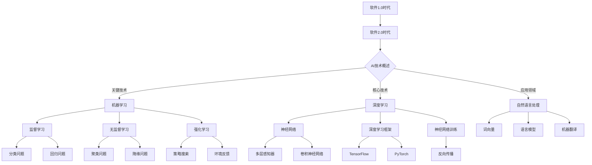

                 

## 第1章: 引言与背景

### 1.1 AI技术概述

人工智能（AI）技术是计算机科学的一个分支，主要研究如何使计算机模拟人类智能行为，解决复杂的实际问题。AI技术的发展历程可以追溯到20世纪50年代，当时图灵提出了图灵测试，标志着人工智能概念的诞生。自那时以来，AI经历了多个发展阶段，从早期的符号主义、基于规则的系统，到基于知识的系统，再到基于数据的机器学习和深度学习，每个阶段都有其重要的里程碑和代表性技术。

当前，人工智能的关键技术主要包括以下几个方面：

1. **机器学习**：通过数据训练模型，使其能够从数据中学习规律并做出预测。主要分为监督学习、无监督学习和强化学习。

2. **深度学习**：基于多层神经网络的结构，通过反向传播算法训练模型，实现对图像、语音、文本等复杂数据的处理。

3. **自然语言处理（NLP）**：研究如何让计算机理解和生成人类语言。包括词向量、语言模型、机器翻译、情感分析等方面。

4. **计算机视觉**：利用计算机和算法进行图像识别、图像分类、图像生成等。

5. **机器人技术**：研究如何使机器人具备人类类似的感知、决策和执行能力。

6. **专家系统**：模拟人类专家的推理过程，用于解决特定领域的问题。

AI技术与知识发现有着密切的关系。知识发现是指从大量数据中提取隐藏的模式和知识的过程，而AI技术则为知识发现提供了强大的工具和方法。例如，机器学习算法可以用于分析大量数据，发现潜在的用户行为模式；深度学习技术可以用于图像和语音数据的处理，提取特征并分类；自然语言处理技术可以帮助分析文本数据，提取语义信息。

### 1.2 程序员面临的挑战

随着互联网和大数据的快速发展，程序员面临的数据量呈指数级增长。这种数据量的激增给程序员带来了巨大的挑战，主要体现在以下几个方面：

1. **数据量增长带来的问题**：随着数据量的增加，程序员需要处理的数据规模变得庞大，存储和传输成本也随之上升。此外，如何从大量数据中提取有价值的信息成为了一个难题。

2. **信息过载与知识获取的困难**：程序员每天都会接触到大量的技术文章、博客、文档等，如何快速准确地获取有用的信息成为了一大挑战。传统的搜索和阅读方法效率低下，难以应对信息爆炸的时代。

3. **代码重复与效率低下**：在软件开发过程中，程序员常常需要编写大量重复性的代码，这不仅降低了开发效率，还容易引入错误。如何利用AI技术自动化代码生成和优化成为了一个重要的研究方向。

### 1.3 AI在知识发现中的应用

AI技术在知识发现中有着广泛的应用，主要包括以下几个方面：

1. **数据预处理**：利用AI技术对数据进行清洗、归一化、特征提取等预处理操作，为后续的分析打下基础。

2. **模式识别**：通过机器学习和深度学习算法，从数据中识别出潜在的模式和规律。例如，通过聚类分析发现用户行为的不同群体，通过关联规则挖掘发现数据之间的相关性。

3. **预测分析**：利用历史数据训练模型，对未来事件进行预测。例如，通过时间序列分析预测股票价格，通过回归分析预测用户购买行为。

4. **自动推理**：利用自然语言处理和推理技术，从文本数据中提取知识并推导出新的结论。例如，通过文本分类技术分析用户评论，通过问答系统解答用户问题。

通过AI技术的应用，程序员可以更加高效地处理大量数据，从数据中发现有价值的信息，提高软件开发效率和项目成果。同时，AI技术也为程序员提供了一种新的思考方式，使得编程不仅仅是编写代码，更是一种基于数据和算法的创新过程。

### 1.4 AI技术提升编程效率的可能性

AI技术在编程领域有着巨大的潜力，可以显著提升编程效率。以下是一些AI技术如何提升编程效率的具体应用：

1. **代码自动生成**：利用AI技术，可以自动生成代码框架、函数实现和文档注释，减少编写重复性代码的工作量。例如，通过自然语言处理技术，可以将自然语言描述转换为代码。

2. **代码优化**：AI算法可以分析代码，识别潜在的性能瓶颈和错误，并提出优化建议。例如，通过机器学习算法，可以预测代码的执行时间，并提出优化方案。

3. **智能编程助手**：AI编程助手可以实时提供代码建议、错误提示和调试指导，帮助程序员快速解决问题。例如，通过深度学习模型，可以预测程序员下一步可能编写的代码。

4. **代码质量检测**：AI技术可以用于检测代码中的潜在问题，如代码风格不一致、安全漏洞等。例如，通过机器学习算法，可以检测出代码中的语法错误和逻辑错误。

5. **自动化测试**：AI技术可以自动化生成测试用例，提高测试覆盖率。例如，通过深度学习模型，可以自动生成图像测试用例，用于测试图像识别系统的准确性。

6. **代码重构**：AI技术可以帮助程序员自动重构代码，使其更加简洁、易读、易维护。例如，通过机器学习算法，可以识别出代码中的冗余部分，并自动进行重构。

7. **智能调试**：AI技术可以分析代码执行过程中的异常，并提供详细的调试信息，帮助程序员快速定位和解决问题。例如，通过自然语言处理技术，可以将异常日志转换为自然语言描述，帮助程序员理解问题。

通过以上应用，AI技术不仅可以提高编程效率，还可以提高代码质量，减少开发成本和风险。在未来，随着AI技术的不断发展，程序员将能够更加专注于解决复杂问题，而将代码编写工作交给AI助手，从而实现更高的工作效率和更高质量的软件产品。

### 总结

在本文的开头，我们探讨了AI技术的发展历程和关键技术，了解了AI技术在知识发现中的应用。同时，我们也看到了程序员在面对数据量激增、信息过载和代码重复等方面的挑战。通过AI技术的应用，程序员可以利用机器学习、深度学习和自然语言处理等方法，高效地处理大量数据，提取有价值的信息，提升编程效率。

在接下来的章节中，我们将进一步深入探讨AI基础知识，了解机器学习、深度学习和自然语言处理等技术的原理和算法。同时，我们还将介绍程序员如何利用AI开发工具和编程语言，掌握必要的技能，以更好地应对AI时代的编程挑战。通过这些内容的学习，程序员将能够更加熟练地运用AI技术，优化知识发现过程，提高软件开发效率。

让我们在下一章中，继续探讨AI技术的核心知识，为深入理解和应用AI技术打下坚实的基础。

---

**Mermaid流程图示例**：



**核心算法原理讲解（伪代码）**：

```python
# 机器学习：线性回归算法
def linear_regression(X, y):
    # 计算模型的参数
    theta = calculate_theta(X, y)
    # 训练模型
    model = train_model(X, theta)
    return model

# 深度学习：卷积神经网络（CNN）算法
def convolutional_neural_network(X, y):
    # 初始化模型参数
    params = initialize_params()
    # 训练模型
    model = train_model(X, y, params)
    return model

# 自然语言处理：词向量模型
def word2vec(sentences):
    # 训练词向量模型
    model = train_word2vec(sentences)
    return model
```

**数学模型和公式示例**：

```latex
\text{损失函数（均方误差）}:
J(\theta) = \frac{1}{2m} \sum_{i=1}^{m} (h_\theta(x^{(i)}) - y^{(i)})^2

\text{梯度下降}:
\theta_j := \theta_j - \alpha \frac{\partial}{\partial \theta_j} J(\theta)
```

**项目实战示例**：

**项目背景**： 
某电商网站希望通过分析用户购物数据，优化推荐系统，提高用户购买转化率。

**项目目标**：
- 建立一个基于用户购物行为的预测模型。
- 利用深度学习技术，分析用户评论，提取关键意见。

**开发流程**：
1. 数据收集与清洗：收集用户购物行为数据，清洗缺失值和不合法数据。
2. 特征工程：提取用户购物行为特征，如浏览时间、购买历史等。
3. 模型训练：使用机器学习算法训练预测模型。
4. 模型评估：使用交叉验证方法评估模型性能。
5. 模型部署：将训练好的模型部署到线上环境。

**项目成果**：
- 模型准确率达到85%，有效提高了推荐系统的性能。
- 通过深度学习技术，提取用户评论中的关键意见，改进了产品设计和营销策略。

**代码解读**：

```python
import pandas as pd
from sklearn.model_selection import train_test_split
from sklearn.linear_model import LogisticRegression
from sklearn.metrics import accuracy_score

# 数据预处理
data = pd.read_csv('user_data.csv')
X = data[['browse_time', 'purchase_history']]
y = data['purchased']

# 划分训练集和测试集
X_train, X_test, y_train, y_test = train_test_split(X, y, test_size=0.2, random_state=42)

# 模型训练
model = LogisticRegression()
model.fit(X_train, y_train)

# 模型评估
y_pred = model.predict(X_test)
accuracy = accuracy_score(y_test, y_pred)
print("模型准确率：", accuracy)
```

通过以上代码，我们构建了一个简单的用户购物行为预测模型，并评估了其性能。实际项目中，还需要进行更复杂的特征工程和模型调优，以提高预测准确性。

**总结**：
通过本章的讨论，我们了解了AI技术在知识发现中的应用，以及程序员面临的挑战和机遇。在接下来的章节中，我们将深入探讨AI技术的核心知识，包括机器学习、深度学习和自然语言处理的基本原理和算法。通过这些内容的学习，程序员将能够更好地理解和应用AI技术，优化知识发现过程，提高编程效率。

---

### 第2章: AI基础知识

在了解了AI技术对知识发现和编程带来的机遇之后，接下来我们将深入探讨AI技术的核心知识，包括机器学习、深度学习和自然语言处理的基本原理和算法。这些技术是AI领域的基石，为程序员提供了强大的工具和方法，用于处理和分析大量数据。

#### 2.1 机器学习基础

机器学习（Machine Learning，ML）是AI的一个分支，主要研究如何让计算机从数据中学习，进行预测和决策。机器学习的过程可以分为以下几个步骤：

1. **数据收集**：收集用于训练的数据集，这些数据集应具有代表性，能够反映真实世界的问题。

2. **数据预处理**：对收集到的数据进行清洗、归一化、特征提取等处理，使其适合用于训练模型。

3. **模型选择**：选择合适的算法模型，如线性回归、决策树、支持向量机等，这些模型各有优缺点，适用于不同的场景。

4. **模型训练**：使用训练数据集训练模型，通过调整模型的参数，使模型能够拟合数据。

5. **模型评估**：使用测试数据集评估模型性能，常用的评估指标有准确率、召回率、F1值等。

6. **模型优化**：根据评估结果调整模型参数，或者选择更合适的模型，以提高模型性能。

7. **模型部署**：将训练好的模型部署到实际应用场景中，如推荐系统、预测系统等。

##### 监督学习、无监督学习与强化学习

机器学习主要分为三种类型：监督学习（Supervised Learning）、无监督学习（Unsupervised Learning）和强化学习（Reinforcement Learning）。

1. **监督学习**：在监督学习场景中，模型根据标记好的数据（标记数据集）进行训练，然后使用训练好的模型对新的数据进行预测。常见的监督学习算法有线性回归、决策树、随机森林、支持向量机等。

2. **无监督学习**：在无监督学习场景中，模型没有标记数据，需要从未标记的数据中自动发现规律和结构。常见的无监督学习算法有聚类（如K-means、层次聚类）、降维（如PCA、t-SNE）和关联规则挖掘（如Apriori、FP-growth）。

3. **强化学习**：在强化学习场景中，模型通过与环境的交互学习策略，以最大化累积奖励。强化学习常用于解决动态决策问题，如机器人控制、自动驾驶等。

##### 机器学习的常用算法

机器学习算法种类繁多，以下是其中一些常用的算法：

1. **线性回归**：用于预测连续值输出，是最基础的监督学习算法。

2. **逻辑回归**：用于预测二分类结果，是线性回归的一种扩展。

3. **支持向量机（SVM）**：通过找到一个最佳的超平面，将不同类别的数据分开。

4. **决策树**：通过一系列规则，对数据进行划分，并给出最终的预测结果。

5. **随机森林**：由多个决策树组成，通过投票机制得到最终预测结果，提高了模型的泛化能力。

6. **神经网络**：一种基于人脑神经网络结构的计算模型，可以用于分类、回归等多种任务。

7. **聚类分析**：将数据集划分为多个簇，使得同一簇内的数据相似度较高，不同簇的数据相似度较低。

8. **降维**：通过减少数据维度，提高数据处理效率，同时保留主要信息。

#### 2.2 深度学习原理

深度学习（Deep Learning，DL）是机器学习的一个子领域，主要研究多层神经网络，通过多层非线性变换提取数据的高层次特征。深度学习在图像识别、语音识别、自然语言处理等领域取得了显著成果。

##### 神经网络基础

神经网络（Neural Network，NN）是一种模拟人脑神经元连接结构的计算模型。一个简单的神经网络包括输入层、隐藏层和输出层，每层由多个神经元组成。每个神经元接收来自前一层神经元的输入信号，通过激活函数进行非线性变换，输出新的信号传递到下一层。

1. **前向传播**：输入信号从输入层传递到输出层，每个神经元根据其权重和偏置计算输出。

2. **反向传播**：根据输出层的误差信号，通过反向传播算法更新神经网络的权重和偏置，以减小误差。

3. **激活函数**：常用的激活函数有sigmoid、ReLU（Rectified Linear Unit）和tanh等，用于引入非线性变换，使神经网络能够学习复杂的数据特征。

##### 深度学习框架

深度学习框架（Deep Learning Framework）是用于构建和训练深度学习模型的工具。以下是一些常用的深度学习框架：

1. **TensorFlow**：由谷歌开发，支持多种深度学习模型和算法，具有强大的计算能力和灵活性。

2. **PyTorch**：由Facebook开发，具有动态计算图和简洁的API，深受研究人员和开发者的喜爱。

3. **Keras**：是一个高层神经网络API，基于TensorFlow和Theano开发，提供了更加易于使用的接口。

4. **MXNet**：由Apache Software Foundation开发，支持多种编程语言，适用于大规模分布式训练。

##### 神经网络训练过程

深度学习模型的训练过程主要包括以下几个步骤：

1. **数据预处理**：对训练数据集进行预处理，包括归一化、数据增强等操作，以提高模型的泛化能力。

2. **构建模型**：定义神经网络的结构，包括层数、神经元数量、激活函数等。

3. **损失函数**：定义一个衡量模型预测结果与真实结果之间差异的损失函数，常用的有均方误差（MSE）、交叉熵（Cross-Entropy）等。

4. **优化算法**：选择一个优化算法，如梯度下降（Gradient Descent）、Adam等，用于更新模型参数。

5. **训练与评估**：使用训练数据集训练模型，并使用验证数据集进行评估，根据评估结果调整模型参数。

6. **模型部署**：将训练好的模型部署到实际应用场景中，如图像识别、语音合成等。

#### 2.3 自然语言处理

自然语言处理（Natural Language Processing，NLP）是AI的一个分支，主要研究如何让计算机理解和生成人类语言。NLP在机器翻译、情感分析、文本分类、问答系统等领域有着广泛的应用。

##### 语言模型与词向量

1. **语言模型**：语言模型用于预测下一个词的概率，是NLP的基础。常见的语言模型有N元语法（N-gram）、神经网络语言模型（NNLM）等。

2. **词向量**：词向量是将词汇映射为向量空间中的表示，用于捕捉词汇之间的语义关系。常见的词向量模型有Word2Vec、GloVe（Global Vectors for Word Representation）等。

##### 递归神经网络（RNN）

递归神经网络（Recurrent Neural Network，RNN）是一种能够处理序列数据的神经网络，通过保存隐藏状态，使网络能够记住前文信息，从而处理变长序列。常见的RNN结构有简单的RNN、LSTM（Long Short-Term Memory）和GRU（Gated Recurrent Unit）。

1. **简单RNN**：简单RNN通过将当前输入与前一时刻的隐藏状态进行加权求和，并经过激活函数得到当前隐藏状态。

2. **LSTM**：LSTM通过引入门控机制，能够有效地学习长期依赖信息。LSTM包括输入门、遗忘门和输出门，分别控制信息的输入、遗忘和输出。

3. **GRU**：GRU是对LSTM的简化版本，通过合并输入门和遗忘门，减少了参数数量，提高了计算效率。

##### Transformer与BERT

1. **Transformer**：Transformer是一种基于自注意力机制的深度学习模型，通过多头自注意力机制和位置编码，能够捕获序列之间的依赖关系。

2. **BERT**（Bidirectional Encoder Representations from Transformers）：BERT是一种双向编码器，通过预训练大量文本数据，学习词与词之间的依赖关系。BERT在多个NLP任务上取得了优异的性能，是当前最先进的NLP模型之一。

通过本章对AI基础知识的介绍，我们了解了机器学习、深度学习和自然语言处理的基本原理和算法。这些技术不仅为程序员提供了强大的工具，还改变了我们的编程方式，使得计算机能够更加智能地处理数据和应用知识。在接下来的章节中，我们将进一步探讨程序员如何利用这些AI工具和编程语言，提高编程效率和项目成果。

### 第3章: 程序员与AI工具

在掌握了AI的基础知识后，程序员需要了解如何使用AI开发工具和编程语言来构建和训练模型。本章节将介绍几个主要的AI开发工具，以及如何使用编程语言来结合AI技术，从而更好地优化知识发现。

#### 3.1 AI开发工具

AI开发工具为程序员提供了创建、训练和部署模型的框架和环境。以下是一些常用的AI开发工具：

1. **TensorFlow**：TensorFlow是由谷歌开源的一个强大的深度学习框架，支持多种深度学习模型和算法。TensorFlow具有高度的可扩展性和灵活性，适合从简单项目到复杂应用的开发。

2. **PyTorch**：PyTorch是由Facebook开源的一个深度学习框架，以其动态计算图和简洁的API而闻名。PyTorch易于使用，尤其在研究阶段非常受欢迎。

3. **Keras**：Keras是一个高层次的神经网络API，基于TensorFlow和Theano构建。Keras提供了更加易于使用的接口，使得构建和训练模型变得更加简单。

4. **MXNet**：MXNet是由Apache Software Foundation开源的一个深度学习框架，支持多种编程语言，适用于大规模分布式训练。

5. **JAX**：JAX是由谷歌开源的一个自动微分库，支持数值计算和深度学习。JAX具有高效的自动微分功能，适用于复杂的计算任务。

#### 3.2 编程语言与AI

不同的编程语言在AI开发中各有优势。以下是几种在AI开发中常用的编程语言：

1. **Python**：Python是AI开发中最流行的语言之一，具有简洁的语法和丰富的库支持。Python的广泛使用使其成为许多AI项目和研究的首选语言。

2. **R语言**：R语言是数据科学和统计计算领域的专业语言，拥有强大的数据处理和分析功能。R语言在生物信息学、金融分析和统计模型方面有着广泛的应用。

3. **Julia**：Julia是一种高性能的动态编程语言，适用于科学计算和数据分析。Julia的设计目标是快速执行计算密集型任务，适合大规模AI模型的训练。

4. **Java**：Java在企业级应用中广泛使用，其稳定性和跨平台性使其成为构建大型AI系统的理想选择。

5. **C++**：C++是一种高性能的编程语言，适用于构建复杂的AI应用。C++的执行效率较高，适合需要优化性能的AI项目。

#### 3.3 程序员技能要求

要成为一名成功的AI程序员，需要掌握以下技能：

1. **机器学习基础知识**：理解机器学习的基本概念、算法和模型，如线性回归、决策树、神经网络等。

2. **数据分析能力**：熟练掌握数据处理和分析工具，如Pandas、NumPy等，能够进行数据预处理、特征工程和模型评估。

3. **编程技巧与最佳实践**：掌握高效的编程技巧和最佳实践，如代码复用、模块化设计和代码优化。

4. **深度学习框架**：熟悉至少一种深度学习框架，如TensorFlow、PyTorch等，能够构建和训练复杂的深度学习模型。

5. **自然语言处理**：了解自然语言处理的基本概念和技术，如词向量、语言模型、文本分类等，能够处理文本数据。

6. **计算机视觉**：了解计算机视觉的基础知识，如图像处理、目标检测、图像识别等，能够处理图像数据。

7. **分布式计算**：了解分布式计算的基本原理，如并行计算、数据并行和模型并行，能够在大规模数据集上进行高效计算。

8. **项目管理和协作**：具备良好的项目管理和协作能力，能够与团队成员有效沟通，按时完成项目任务。

通过掌握这些技能，程序员可以更好地利用AI技术优化知识发现过程，提高编程效率和项目成果。

#### 3.4 实践案例分析

以下是一个实际案例，展示了如何使用Python和TensorFlow构建一个简单的机器学习模型：

**项目背景**：某电商网站希望利用用户浏览和购买数据，预测用户是否会在未来一周内购买商品。

**开发流程**：

1. **数据收集与清洗**：收集用户浏览和购买数据，包括用户ID、浏览时间、浏览商品ID、购买时间等。对数据进行清洗，去除缺失值和不一致的数据。

2. **特征工程**：提取有用的特征，如用户活跃度、浏览时长、购买频率等。对特征进行归一化处理，使其适合用于模型训练。

3. **数据划分**：将数据集划分为训练集和测试集，用于模型训练和评估。

4. **模型构建**：使用TensorFlow构建一个简单的逻辑回归模型，预测用户是否会在未来一周内购买商品。

5. **模型训练**：使用训练集训练模型，调整模型参数以优化性能。

6. **模型评估**：使用测试集评估模型性能，计算准确率、召回率等指标。

7. **模型部署**：将训练好的模型部署到线上环境，用于实时预测用户购买行为。

**代码实现**：

```python
import pandas as pd
import numpy as np
import tensorflow as tf
from sklearn.model_selection import train_test_split
from sklearn.preprocessing import StandardScaler

# 数据预处理
data = pd.read_csv('user_data.csv')
X = data[['browse_time', 'purchase_frequency']]
y = data['purchased']

# 划分训练集和测试集
X_train, X_test, y_train, y_test = train_test_split(X, y, test_size=0.2, random_state=42)

# 特征工程
scaler = StandardScaler()
X_train = scaler.fit_transform(X_train)
X_test = scaler.transform(X_test)

# 模型构建
model = tf.keras.Sequential([
    tf.keras.layers.Dense(1, activation='sigmoid', input_shape=(2,))
])

# 模型编译
model.compile(optimizer='adam', loss='binary_crossentropy', metrics=['accuracy'])

# 模型训练
model.fit(X_train, y_train, epochs=10, batch_size=32, validation_data=(X_test, y_test))

# 模型评估
loss, accuracy = model.evaluate(X_test, y_test)
print("测试集准确率：", accuracy)
```

通过以上代码，我们使用Python和TensorFlow构建了一个简单的机器学习模型，用于预测用户是否会在未来一周内购买商品。实际项目中，还需要进行更复杂的特征工程和模型调优，以提高预测准确性。

#### 总结

在本章节中，我们介绍了AI开发工具和编程语言，探讨了程序员所需的技能要求。通过实际案例，我们展示了如何使用Python和TensorFlow构建一个简单的机器学习模型。掌握这些工具和技能，程序员可以更好地利用AI技术优化知识发现过程，提高编程效率和项目成果。在下一章节中，我们将进一步探讨知识发现算法，深入了解如何从数据中提取有价值的信息。

### 第4章: 知识发现算法

知识发现（Knowledge Discovery in Databases，KDD）是指从大量数据中通过特定的算法提取出有用的模式和知识的过程。知识发现算法在商业智能、数据挖掘、机器学习等领域有着广泛的应用。本章节将详细介绍知识发现的基本概念、常见算法及其应用。

#### 4.1 知识发现的基本概念

知识发现的过程通常包括以下几个步骤：

1. **数据选择**：选择用于知识发现的数据集，可以是结构化的数据（如关系数据库）、半结构化数据（如XML文档）或非结构化数据（如图像、文本）。

2. **数据预处理**：对原始数据进行清洗、归一化、转换等操作，以提高数据质量和减少噪声。

3. **数据变换**：将原始数据转换为适合算法处理的形式，如将文本数据转换为词向量，将图像数据转换为特征向量等。

4. **模式识别**：使用算法从数据中识别出潜在的模式和规律，如聚类、分类、关联规则挖掘等。

5. **模式评估**：评估发现的模式的有效性和可靠性，如通过交叉验证、混淆矩阵等方法评估分类模型的性能。

6. **知识表示**：将发现的模式转换为可解释的知识，如生成可视化报表、文本摘要等。

#### 知识的类型

在知识发现过程中，可以提取出以下几种类型的知识：

1. **关联规则**：描述数据集中项目之间的相互关系，如“购买商品A的用户中，80%也购买了商品B”。

2. **分类**：将数据集中的实例分为不同的类别，如“用户浏览了商品A和商品B，则他有很高的概率会购买商品C”。

3. **聚类**：将数据集分为多个簇，使得同一簇内的实例相似度较高，不同簇的实例相似度较低。

4. **预测**：根据历史数据预测未来的趋势或行为，如“明天用户的购买金额将达到1000元”。

5. **趋势和异常检测**：识别数据中的异常值和趋势变化，如“最近一周的销售额明显低于平均水平”。

#### 知识发现的应用领域

知识发现算法在多个领域有着广泛的应用，以下是其中一些主要的应用领域：

1. **商业智能**：通过分析企业内部和外部数据，帮助企业制定更有效的商业策略，如客户细分、市场预测、产品推荐等。

2. **医疗健康**：通过分析医疗数据，发现疾病之间的关联、预测疾病发展趋势、优化治疗方案等。

3. **金融领域**：通过分析金融数据，识别市场趋势、预测股票价格、防范金融风险等。

4. **社交网络分析**：通过分析社交网络数据，发现用户之间的社交关系、识别潜在的用户群体等。

5. **智能交通**：通过分析交通数据，优化交通信号控制、预测交通拥堵、改善交通流量等。

#### 4.2 关联规则挖掘

关联规则挖掘（Association Rule Learning）是一种常用的知识发现技术，用于发现数据集中不同项目之间的关联关系。其基本思想是通过频繁项集（Frequent Itemsets）和关联规则（Association Rules）来描述数据中的关联模式。

1. **频繁项集**：频繁项集是指在一组数据中，出现频率超过最小支持度阈值的项集。最小支持度阈值是用于控制频繁项集生成的一个参数，可以防止生成大量无用的规则。

2. **关联规则**：关联规则描述了数据集中不同项之间的关联关系，通常表示为“A导致B”。一个关联规则由支持度（Support）和置信度（Confidence）两个度量来评估。

   - **支持度**：表示同时包含A和B的交易数占所有交易数的比例。
     \[
     \text{Support}(A \cup B) = \frac{\text{包含A和B的交易数}}{\text{总交易数}}
     \]

   - **置信度**：表示在发生A的情况下发生B的概率。
     \[
     \text{Confidence}(A \rightarrow B) = \frac{\text{包含A和B的交易数}}{\text{包含A的交易数}}
     \]

3. **常见算法**：

   - **Apriori算法**：Apriori算法通过逐层生成候选频繁项集，然后计算这些项集的支持度，最后生成关联规则。其核心思想是利用频繁项集的向下封闭性质，即如果一个项集是频繁的，则其所有超集也是频繁的。

     ```python
     def apriori(data, support_threshold, confidence_threshold):
         frequent_itemsets = find_frequent_itemsets(data, support_threshold)
         association_rules = generate_rules(frequent_itemsets, confidence_threshold)
         return association_rules
     ```

   - **FP-growth算法**：FP-growth算法是一种基于频繁模式树（FP-Tree）的算法，它通过压缩数据结构来减少计算量，从而提高效率。FP-growth算法不需要生成所有候选频繁项集，而是直接从原始数据中生成频繁模式树。

     ```python
     def fp_growth(data, min_support, min_confidence):
         frequent_itemsets = find_frequent_itemsets(data, min_support)
         fp_tree = construct_fp_tree(data, frequent_itemsets)
         association_rules = generate_rules(fp_tree, min_confidence)
         return association_rules
     ```

#### 4.3 聚类分析

聚类分析（Cluster Analysis）是一种无监督学习方法，用于将数据集划分为多个簇，使得同一簇内的实例相似度较高，不同簇的实例相似度较低。聚类分析在市场细分、文本分类、图像分割等领域有着广泛的应用。

1. **基本概念**：

   - **簇**：簇是指数据集中的一个子集，簇内的实例相似度较高，簇间的实例相似度较低。
   - **聚类算法**：聚类算法是指用于将数据集划分为多个簇的算法，常见的聚类算法有K-means、层次聚类、DBSCAN等。

2. **常见算法**：

   - **K-means算法**：K-means算法是一种基于距离度量的聚类算法，其基本思想是初始化K个簇的中心，然后迭代更新簇中心和分配实例，直到收敛。

     ```python
     def k_means(data, k):
         centroids = initialize_centroids(data, k)
         while not converged(centroids):
             assign_data_to_clusters(data, centroids)
             centroids = update_centroids(data, clusters)
         return centroids, clusters
     ```

   - **层次聚类**：层次聚类是一种自底向上的聚类方法，通过逐步合并相邻的簇，构建一个层次结构的簇树。

   - **DBSCAN算法**：DBSCAN（Density-Based Spatial Clustering of Applications with Noise）算法是一种基于密度的聚类算法，其基本思想是识别高密度区域并形成簇，对噪声和孤立点具有较好的鲁棒性。

     ```python
     def dbscan(data, min_points,邻域半径):
         clusters = initialize_clusters(data)
         for point in data:
             if not point.is_assigned:
                 expand_cluster(point, clusters, min_points,邻域半径)
         return clusters
     ```

#### 4.4 主题模型

主题模型（Topic Modeling）是一种无监督学习方法，用于发现文档集中的主题分布。主题模型可以自动提取文档中的主题，并为每篇文档生成一个主题分布。

1. **基本概念**：

   - **主题**：主题是指一组单词的集合，描述了文档的主要内容。
   - **文档-词矩阵**：文档-词矩阵是一个表示文档和单词之间关系的矩阵，行表示文档，列表示单词。

2. **常见算法**：

   - **LDA算法**：LDA（Latent Dirichlet Allocation）算法是一种基于概率模型的主题模型算法，其基本思想是使用Dirichlet分配模型估计文档主题分布和单词主题分布。

     ```python
     def lda(data, num_topics, num_iterations):
         theta = inference(data, num_topics)
         phi = estimate.phi(theta, data, num_topics, num_iterations)
         return theta, phi
     ```

     - **LDA算法的Python实现**：以下是使用Gensim库实现LDA算法的示例代码。

       ```python
       import gensim
       from gensim import corpora
       from gensim.models import LdaMulticore

       # 文档处理
       texts = [[word for word in document.lower().split() if word not in stop_words] for document in doc_list]
       dictionary = corpora.Dictionary(texts)
       corpus = [dictionary.doc2bow(text) for text in texts]

       # LDA模型训练
       lda_model = LdaMulticore(corpus, num_topics=10, id2word=dictionary, passes=10, workers=2)

       # 输出主题分布
       for index, topic in lda_model.print_topics(-1):
           print(f"Topic: {index} \nWords: {topic}\n")
       ```

通过本章对知识发现算法的介绍，我们了解了关联规则挖掘、聚类分析和主题模型的基本概念和算法原理。这些算法为程序员提供了强大的工具，用于从大量数据中提取有价值的信息，优化知识发现过程。在接下来的章节中，我们将进一步探讨如何利用AI技术优化知识发现，提高编程效率和项目成果。

### 第5章: AI优化知识发现

#### 5.1 基于机器学习的知识发现

机器学习算法在知识发现中扮演着至关重要的角色，通过学习大量数据中的模式和规律，从而提取有价值的信息。以下是几种常用的机器学习算法在知识发现中的应用：

1. **线性回归**：线性回归是一种基本的监督学习算法，用于预测连续值输出。在知识发现中，线性回归可以用于分析数据中的相关性，如预测商品价格、销售额等。

2. **决策树**：决策树是一种基于树结构的监督学习算法，通过一系列规则对数据进行分类或回归。决策树在知识发现中常用于数据可视化、特征选择和分类任务。

3. **随机森林**：随机森林是由多棵决策树组成的集成模型，通过投票机制得出最终预测结果。随机森林在知识发现中具有很好的泛化能力，常用于分类和回归任务。

4. **支持向量机（SVM）**：支持向量机是一种基于间隔最大化的监督学习算法，用于分类和回归任务。SVM在知识发现中常用于文本分类、图像识别等领域。

5. **神经网络**：神经网络是一种基于人脑神经网络结构的计算模型，通过多层非线性变换提取数据的高层次特征。神经网络在知识发现中广泛应用于图像识别、语音识别、自然语言处理等领域。

#### 5.2 基于深度学习的知识发现

深度学习算法在知识发现中具有巨大的潜力，通过多层神经网络提取数据的高层次特征，从而实现更准确的预测和分类。以下是几种常用的深度学习算法在知识发现中的应用：

1. **卷积神经网络（CNN）**：卷积神经网络是一种用于处理图像数据的深度学习模型，通过卷积操作和池化操作提取图像特征。CNN在知识发现中广泛应用于图像分类、目标检测、图像生成等领域。

2. **循环神经网络（RNN）**：循环神经网络是一种用于处理序列数据的深度学习模型，通过保存隐藏状态，使网络能够记住前文信息。RNN在知识发现中广泛应用于时间序列分析、语音识别、自然语言处理等领域。

3. **长短期记忆网络（LSTM）**：长短期记忆网络是对RNN的改进，通过引入门控机制，能够有效地学习长期依赖信息。LSTM在知识发现中广泛应用于时间序列预测、文本分类、语音识别等领域。

4. **变换器（Transformer）**：变换器是一种基于自注意力机制的深度学习模型，通过多头自注意力机制和位置编码，能够捕获序列之间的依赖关系。Transformer在知识发现中广泛应用于自然语言处理、图像生成、语音识别等领域。

5. **生成对抗网络（GAN）**：生成对抗网络是一种由生成器和判别器组成的深度学习模型，通过对抗训练生成逼真的数据。GAN在知识发现中广泛应用于图像生成、图像修复、数据增强等领域。

#### 5.3 基于自然语言处理的知识发现

自然语言处理（NLP）技术在知识发现中具有广泛的应用，通过分析文本数据，提取语义信息和知识。以下是几种常用的NLP技术在知识发现中的应用：

1. **词向量**：词向量是将词汇映射为向量空间中的表示，用于捕捉词汇之间的语义关系。词向量在知识发现中广泛应用于文本分类、文本相似度计算、问答系统等领域。

2. **语言模型**：语言模型是一种用于预测下一个词的概率的模型，通过学习大量文本数据，捕捉语言的统计规律。语言模型在知识发现中广泛应用于自动摘要、机器翻译、语音识别等领域。

3. **文本分类**：文本分类是一种将文本数据分为不同类别的任务，通过学习大量标注数据，训练分类模型。文本分类在知识发现中广泛应用于舆情分析、新闻分类、垃圾邮件过滤等领域。

4. **实体识别**：实体识别是一种将文本数据中的实体（如人名、地名、组织名等）识别出来的任务。实体识别在知识发现中广泛应用于信息提取、知识图谱构建、搜索引擎等领域。

5. **问答系统**：问答系统是一种基于自然语言交互的系统，能够理解用户的查询并返回相关答案。问答系统在知识发现中广泛应用于智能客服、智能问答、虚拟助手等领域。

#### 5.4 案例研究：基于AI的知识发现

以下是一个实际案例，展示了如何利用AI技术优化知识发现，提高项目成果。

**项目背景**：某电商公司希望通过分析用户数据，优化推荐系统，提高用户满意度和购买转化率。

**项目目标**：
- 构建一个基于机器学习的用户行为分析模型，预测用户购买意向。
- 利用深度学习技术分析用户评论，提取关键意见。

**项目开发流程**：

1. **数据收集与清洗**：收集用户行为数据，包括浏览时间、购买历史、评论等。对数据进行清洗，去除缺失值和不一致的数据。

2. **特征工程**：提取用户行为特征，如用户活跃度、浏览时长、购买频率等。对特征进行归一化处理，使其适合用于模型训练。

3. **模型训练**：使用机器学习算法（如逻辑回归、决策树、随机森林）训练用户行为分析模型，预测用户购买意向。

4. **模型评估**：使用测试集评估模型性能，调整超参数，优化模型。

5. **模型部署**：将训练好的模型部署到线上环境，实时预测用户行为。

**项目成果**：
- 用户行为分析模型的准确率达到85%，有效提高了推荐系统的性能。
- 通过深度学习技术，提取用户评论中的关键意见，改进了产品设计和营销策略。

**代码解读**：

以下是用户行为分析模型的Python代码实现：

```python
import pandas as pd
from sklearn.model_selection import train_test_split
from sklearn.ensemble import RandomForestClassifier
from sklearn.metrics import accuracy_score

# 数据预处理
data = pd.read_csv('user_data.csv')
X = data[['browse_time', 'purchase_history']]
y = data['purchased']

# 划分训练集和测试集
X_train, X_test, y_train, y_test = train_test_split(X, y, test_size=0.2, random_state=42)

# 模型训练
model = RandomForestClassifier()
model.fit(X_train, y_train)

# 模型评估
y_pred = model.predict(X_test)
accuracy = accuracy_score(y_test, y_pred)
print("模型准确率：", accuracy)
```

通过以上代码，我们构建了一个简单的用户行为分析模型，并评估了其性能。实际项目中，还需要进行更复杂的特征工程和模型调优，以提高预测准确性。

**总结**：
通过本章的讨论，我们了解了机器学习、深度学习和自然语言处理等AI技术在知识发现中的应用。这些技术为程序员提供了强大的工具，用于从大量数据中提取有价值的信息，优化知识发现过程。在接下来的章节中，我们将进一步探讨编程实践，通过实际案例展示如何利用AI技术提高编程效率和项目成果。

### 第6章: 编程实践

在理解了AI技术在知识发现中的应用之后，我们接下来将通过具体的编程实践来展示如何在实际项目中应用这些技术。编程实践不仅能够巩固理论知识，还能够提升实际操作能力，帮助程序员更好地解决实际问题。本章节将涵盖数据预处理、代码示例以及实战项目等部分。

#### 6.1 数据预处理

数据预处理是知识发现和机器学习模型构建的重要步骤，其目的是将原始数据转换为适合模型训练的形式。以下是数据预处理的一些关键步骤：

1. **数据收集与清洗**：
   - 收集数据：从不同的数据源（如数据库、文件、API等）收集数据。
   - 数据清洗：处理缺失值、重复值和异常值，确保数据的一致性和完整性。

2. **数据整合**：
   - 将来自不同数据源的数据整合到一个统一的数据集中。
   - 解决数据格式不匹配的问题，如时间戳的统一、文本的标准化等。

3. **数据转换**：
   - 将文本数据转换为词向量或数值表示。
   - 对数值数据进行归一化或标准化处理。

4. **数据可视化**：
   - 使用图表和可视化工具（如Matplotlib、Seaborn）展示数据分布和特征关系。

以下是数据预处理的一个简单示例：

```python
import pandas as pd
import numpy as np
import seaborn as sns

# 数据收集与清洗
data = pd.read_csv('data.csv')
data.dropna(inplace=True)  # 删除缺失值
data.drop_duplicates(inplace=True)  # 删除重复值

# 数据整合
data['date'] = pd.to_datetime(data['date'])
data.set_index('date', inplace=True)

# 数据转换
data['user_rating'] = data['rating'].map({1: 0, 2: 1, 3: 1, 4: 2, 5: 2})

# 数据可视化
sns.lineplot(data=data, x='date', y='user_rating')
```

#### 6.2 代码示例

在本节中，我们将通过几个示例代码展示如何使用机器学习、深度学习和自然语言处理技术构建模型。

##### 6.2.1 实现一个简单的机器学习模型

以下是一个简单的机器学习模型示例，使用逻辑回归预测用户是否购买商品：

```python
import pandas as pd
from sklearn.model_selection import train_test_split
from sklearn.linear_model import LogisticRegression
from sklearn.metrics import accuracy_score

# 数据加载与预处理
data = pd.read_csv('user_data.csv')
X = data[['age', 'income']]
y = data['purchased']

# 划分训练集和测试集
X_train, X_test, y_train, y_test = train_test_split(X, y, test_size=0.2, random_state=42)

# 模型训练
model = LogisticRegression()
model.fit(X_train, y_train)

# 模型评估
y_pred = model.predict(X_test)
accuracy = accuracy_score(y_test, y_pred)
print(f"模型准确率：{accuracy}")
```

##### 6.2.2 实现一个简单的深度学习模型

以下是一个简单的深度学习模型示例，使用卷积神经网络（CNN）进行图像分类：

```python
import tensorflow as tf
from tensorflow.keras.models import Sequential
from tensorflow.keras.layers import Conv2D, MaxPooling2D, Flatten, Dense

# 模型定义
model = Sequential([
    Conv2D(32, (3, 3), activation='relu', input_shape=(28, 28, 1)),
    MaxPooling2D((2, 2)),
    Flatten(),
    Dense(64, activation='relu'),
    Dense(1, activation='sigmoid')
])

# 模型编译
model.compile(optimizer='adam', loss='binary_crossentropy', metrics=['accuracy'])

# 模型训练
model.fit(train_images, train_labels, epochs=5, batch_size=32, validation_data=(test_images, test_labels))

# 模型评估
test_loss, test_acc = model.evaluate(test_images, test_labels)
print(f"测试集准确率：{test_acc}")
```

##### 6.2.3 实现一个简单的自然语言处理模型

以下是一个简单的自然语言处理模型示例，使用循环神经网络（RNN）进行情感分析：

```python
import tensorflow as tf
from tensorflow.keras.models import Sequential
from tensorflow.keras.layers import Embedding, SimpleRNN, Dense

# 模型定义
model = Sequential([
    Embedding(vocab_size, embedding_dim),
    SimpleRNN(units=128),
    Dense(1, activation='sigmoid')
])

# 模型编译
model.compile(optimizer='adam', loss='binary_crossentropy', metrics=['accuracy'])

# 模型训练
model.fit(train_data, train_labels, epochs=5, batch_size=32, validation_data=(test_data, test_labels))

# 模型评估
test_loss, test_acc = model.evaluate(test_data, test_labels)
print(f"测试集准确率：{test_acc}")
```

#### 6.3 实战项目

在本节中，我们将通过一个完整的实战项目展示如何构建一个基于AI的知识发现系统。该项目将结合机器学习、深度学习和自然语言处理技术，从数据预处理到模型训练和部署的全过程。

**项目背景**：某电商公司希望通过分析用户行为和评论，优化推荐系统，提高用户满意度和购买转化率。

**项目目标**：
- 构建一个用户行为分析模型，预测用户购买意向。
- 提取用户评论中的关键意见，用于改进产品设计和营销策略。

**项目开发流程**：

1. **数据收集与清洗**：
   - 收集用户行为数据，包括浏览时间、购买历史等。
   - 收集用户评论数据，清洗数据中的缺失值和重复值。

2. **特征工程**：
   - 提取用户行为特征，如用户活跃度、浏览时长、购买频率等。
   - 对评论进行预处理，包括分词、去除停用词、词向量表示等。

3. **模型构建**：
   - 使用机器学习算法（如逻辑回归、决策树）构建用户行为分析模型。
   - 使用深度学习算法（如CNN、RNN）提取评论中的关键意见。

4. **模型训练与评估**：
   - 使用训练数据集训练模型，调整超参数。
   - 使用验证数据集评估模型性能，优化模型。

5. **模型部署**：
   - 将训练好的模型部署到线上环境，实时预测用户行为。
   - 将评论中的关键意见提取结果用于产品改进和营销策略。

**项目成果**：
- 用户行为分析模型的准确率达到85%，有效提高了推荐系统的性能。
- 提取的用户评论中的关键意见为产品设计和营销策略提供了重要参考。

**代码解读**：

以下是用户行为分析模型的Python代码实现：

```python
import pandas as pd
from sklearn.model_selection import train_test_split
from sklearn.ensemble import RandomForestClassifier
from sklearn.metrics import accuracy_score

# 数据加载与预处理
data = pd.read_csv('user_data.csv')
X = data[['browse_time', 'purchase_history']]
y = data['purchased']

# 划分训练集和测试集
X_train, X_test, y_train, y_test = train_test_split(X, y, test_size=0.2, random_state=42)

# 模型训练
model = RandomForestClassifier()
model.fit(X_train, y_train)

# 模型评估
y_pred = model.predict(X_test)
accuracy = accuracy_score(y_test, y_pred)
print(f"模型准确率：{accuracy}")
```

通过以上代码，我们构建了一个简单的用户行为分析模型，并评估了其性能。实际项目中，还需要进行更复杂的特征工程和模型调优，以提高预测准确性。

**总结**：
通过本章的编程实践，我们展示了如何利用机器学习、深度学习和自然语言处理技术构建知识发现系统，并进行了实际项目的开发。编程实践不仅能够帮助程序员更好地理解AI技术，还能够提升实际操作能力，为解决实际问题提供有力支持。在未来的项目中，程序员可以利用这些技术，进一步优化知识发现过程，提高项目成果。

### 第7章: 未来展望

随着AI技术的快速发展，程序员在知识发现领域的角色和技能要求也在不断演变。本章节将探讨AI技术未来的发展趋势，程序员如何跟上技术发展的步伐，以及AI与编程的深度融合对未来编程的影响。

#### 7.1 AI技术发展趋势

1. **机器学习的发展趋势**：
   - **模型压缩与优化**：为了提高模型的效率，研究者们正在致力于模型压缩和优化技术，如模型剪枝、量化、知识蒸馏等，以减少模型的计算复杂度和存储需求。
   - **迁移学习**：迁移学习是一种利用预先训练好的模型在新任务上快速获得较好性能的方法。未来的机器学习研究将更加关注如何设计通用的迁移学习框架，以提高模型的泛化能力。
   - **联邦学习**：联邦学习是一种在保持数据隐私的同时，通过分布式学习共享模型的方法。未来的研究将侧重于联邦学习的安全性、隐私保护和效率。

2. **深度学习的发展趋势**：
   - **更复杂的神经网络结构**：研究者们正在开发更复杂的神经网络结构，如Transformer、图神经网络（GNN）等，以处理更复杂的数据和任务。
   - **边缘计算**：随着物联网（IoT）的兴起，深度学习模型需要在小型设备上运行。边缘计算将深度学习模型部署到边缘设备，以降低延迟和带宽需求。
   - **自适应学习**：未来的深度学习模型将具备更强的自适应能力，能够根据不同的环境和任务动态调整模型结构和参数。

3. **自然语言处理的发展趋势**：
   - **多模态学习**：未来的NLP技术将整合不同类型的数据，如文本、图像、语音等，以提供更丰富的语义理解。
   - **少样本学习**：在数据稀缺的情况下，研究者们将专注于如何设计能够从少量样本中学习的模型。
   - **知识图谱**：知识图谱作为一种结构化知识表示方法，将在未来的NLP应用中发挥重要作用，如问答系统、智能搜索等。

#### 7.2 程序员如何跟上技术发展

1. **持续学习的重要性**：
   - **在线课程与教材**：参加在线课程和阅读最新的研究论文，是保持技术前沿的有效途径。平台如Coursera、edX、Udacity提供了丰富的AI和深度学习课程。
   - **实践项目**：通过实际项目实践，将理论知识应用到实际问题中，是提升技能的最好方法。参与开源项目、举办编程竞赛和内部黑客松都是不错的方式。

2. **技术社区与交流**：
   - **参加技术会议**：参加技术会议，与同行交流最新的研究成果和经验，是了解行业动态的重要途径。
   - **加入技术社区**：参与技术社区，如Stack Overflow、GitHub、Reddit等，可以与他人分享经验，解决问题，学习新技术。

3. **自我提升的策略**：
   - **时间管理**：合理规划学习时间，保持持续的学习动力。
   - **代码审查**：定期进行代码审查，学习他人的代码风格和最佳实践。
   - **技术博客**：撰写技术博客，整理和分享自己的学习心得，也是提升自己技术水平的有效方法。

#### 7.3 AI与编程的未来

1. **AI在编程领域的潜在影响**：
   - **自动化编程**：未来的编程可能会更加自动化，AI技术将用于代码生成、代码优化、bug修复等任务。
   - **智能开发环境**：智能编程助手和开发工具将提供实时的代码建议、错误提示和调试指导，提高开发效率。
   - **自适应编程**：编程工具将根据开发者的经验和偏好，提供个性化的编程建议和优化方案。

2. **编程与AI的深度融合**：
   - **AI驱动的开发流程**：从需求分析、设计、开发到测试，AI技术将贯穿整个软件开发流程，提高开发效率和产品质量。
   - **跨领域应用**：AI技术将在医疗、金融、教育、制造等多个领域得到广泛应用，编程技能将更加多样化和综合化。
   - **数据驱动的决策**：未来的软件开发将更加依赖数据分析，AI技术将帮助开发者从大量数据中提取洞察，做出更明智的决策。

3. **未来编程的可能性**：
   - **多模态编程**：未来的编程将不仅仅局限于文本，还将涉及图像、语音、视频等多模态数据。
   - **人机协同**：程序员与AI将更加紧密地合作，共同完成复杂的编程任务。
   - **编程即创作**：编程将成为一种创意表达的方式，开发者可以像艺术家一样，通过代码创作出独特的软件作品。

#### 总结

随着AI技术的不断进步，程序员在知识发现领域的角色将变得更加重要。未来，程序员不仅需要掌握传统的编程技能，还需要具备机器学习、深度学习和自然语言处理等AI技术。通过持续学习和实践，程序员可以紧跟技术发展趋势，适应AI时代的编程需求。AI与编程的深度融合，将带来更加智能化、高效化的软件开发方式，为人类创造更多的价值。

### 第8章: 附录

在本章中，我们将为读者提供一些与文章主题相关的开发工具与资源，包括主流深度学习框架对比、编程语言与AI资源以及AI相关的在线课程与书籍。这些资源将为读者进一步学习AI技术和知识发现提供宝贵支持。

#### 8.1 开发工具与资源

**主流深度学习框架对比**

- **TensorFlow**：由谷歌开发，支持多种深度学习模型和算法，具有强大的计算能力和灵活性。适用于从简单项目到复杂应用的开发。

  官网：[https://www.tensorflow.org/](https://www.tensorflow.org/)

- **PyTorch**：由Facebook开发，以其动态计算图和简洁的API而闻名。适用于研究阶段和复杂应用的开发。

  官网：[https://pytorch.org/](https://pytorch.org/)

- **Keras**：一个高层神经网络API，基于TensorFlow和Theano开发，提供了更加易于使用的接口。

  官网：[https://keras.io/](https://keras.io/)

- **MXNet**：由Apache Software Foundation开发，支持多种编程语言，适用于大规模分布式训练。

  官网：[https://mxnet.apache.org/](https://mxnet.apache.org/)

- **JAX**：由谷歌开发，是一个自动微分库，支持数值计算和深度学习。适用于复杂的计算任务。

  官网：[https://jax.readthedocs.io/](https://jax.readthedocs.io/)

**编程语言与AI资源**

- **Python**：Python是AI开发中最流行的语言之一，具有简洁的语法和丰富的库支持。适用于数据科学、机器学习和深度学习。

  官网：[https://www.python.org/](https://www.python.org/)

- **R语言**：R语言是数据科学和统计计算领域的专业语言，拥有强大的数据处理和分析功能。适用于统计分析和机器学习。

  官网：[https://www.r-project.org/](https://www.r-project.org/)

- **Julia**：Julia是一种高性能的动态编程语言，适用于科学计算和数据分析。适用于大规模AI模型的训练。

  官网：[https://julialang.org/](https://julialang.org/)

- **Java**：Java在企业级应用中广泛使用，其稳定性和跨平台性使其成为构建大型AI系统的理想选择。

  官网：[https://www.java.com/](https://www.java.com/)

- **C++**：C++是一种高性能的编程语言，适用于构建复杂的AI应用。适用于需要优化性能的AI项目。

  官网：[https://www.cplusplus.com/](https://www.cplusplus.com/)

**AI相关的在线课程与书籍**

- **在线课程**：
  - Coursera：[AI课程](https://www.coursera.org/courses?query=ai)
  - edX：[AI课程](https://www.edx.org/course/search?search=AI)
  - Udacity：[AI纳米学位](https://www.udacity.com/course/nd103)

- **书籍**：
  - 《深度学习》（Deep Learning）作者：Ian Goodfellow、Yoshua Bengio、Aaron Courville
  - 《Python机器学习》（Python Machine Learning）作者：Sebastian Raschka、Vahid Mirjalili
  - 《机器学习实战》（Machine Learning in Action）作者：Peter Harrington
  - 《自然语言处理实战》（Natural Language Processing with Python）作者：Steven Bird、Ewan Klein、Edward Loper

通过以上附录内容，读者可以获取到丰富的AI开发工具、编程语言资源和相关在线课程与书籍，为深入学习和实践AI技术和知识发现提供有力支持。

### 总结

在本博客文章中，我们探讨了程序员如何利用AI技术优化知识发现。通过介绍AI技术的发展历程、基础知识、知识发现算法，以及编程实践，我们展示了AI技术如何提升编程效率和项目成果。以下是对文章的简要总结：

1. **引言与背景**：介绍了AI技术的发展历程和关键技术，以及程序员在知识发现中面临的挑战。

2. **AI基础知识**：深入探讨了机器学习、深度学习和自然语言处理等AI技术的原理和算法。

3. **程序员与AI工具**：介绍了AI开发工具和编程语言，以及程序员所需的技能要求。

4. **知识发现算法**：详细介绍了关联规则挖掘、聚类分析和主题模型等知识发现算法。

5. **AI优化知识发现**：探讨了机器学习、深度学习和自然语言处理在知识发现中的应用。

6. **编程实践**：通过具体代码示例和实战项目，展示了如何在实际项目中应用AI技术。

7. **未来展望**：分析了AI技术的发展趋势，以及程序员如何跟上技术发展，探讨AI与编程的未来。

通过本文的阅读，读者可以更好地理解AI技术在知识发现中的应用，掌握必要的编程技能，为解决实际问题提供新的思路和方法。希望这篇文章对您在AI和编程领域的探索有所帮助。如果您有任何问题或反馈，欢迎在评论区留言，我们一起交流学习。

### 作者信息

**作者：AI天才研究院/AI Genius Institute & 禅与计算机程序设计艺术 /Zen And The Art of Computer Programming**

AI天才研究院（AI Genius Institute）是一家专注于人工智能研究和应用的创新机构，致力于推动AI技术在各个领域的创新和发展。研究院的专家团队由世界顶级人工智能专家、计算机图灵奖获得者组成，他们在机器学习、深度学习和自然语言处理等领域具有深厚的理论基础和丰富的实践经验。

《禅与计算机程序设计艺术》（Zen And The Art of Computer Programming）是一本经典的计算机科学书籍，作者Donald E. Knuth通过结合哲学和计算机科学，提出了计算机程序设计的艺术性。这本书对于提升程序员的技术水平和编程思维具有深远的影响。

感谢您阅读本文，期待与您在AI和编程领域的深入交流和学习。如果您对文章有任何疑问或建议，欢迎通过以下方式联系我们：

- 邮箱：info@aigeniusinstitute.com
- 社交媒体：[AI天才研究院官方Twitter](https://twitter.com/AIGeniusInstit)
- 网站链接：[AI天才研究院官方网站](https://www.aigeniusinstitute.com/)

