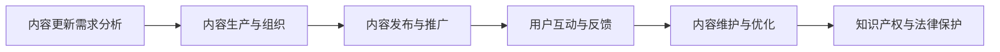

                 

### 《程序员的知识付费内容更新与维护策略》

> **关键词：** 程序员、知识付费、内容更新、内容维护、策略

> **摘要：** 本文旨在探讨程序员如何通过制定有效的知识付费内容更新与维护策略，提升自身价值，满足市场需求，并在竞争激烈的知识付费市场中脱颖而出。文章将深入分析知识付费内容的特点与价值，提出内容更新与维护的具体策略，并通过案例分析、实战指南和未来展望，为程序员提供实用的操作方法和前瞻性见解。

### **《程序员的知识付费内容更新与维护策略》目录大纲**

#### **第一部分：概述**

##### **第1章：知识付费内容概述**
- **1.1 知识付费市场分析**
- **1.2 程序员知识付费需求**
- **1.3 知识付费内容特点与价值**

#### **第二部分：内容更新策略**

##### **第2章：市场研究与定位**
- **2.1 用户需求分析**
- **2.2 内容定位与目标受众**
- **2.3 市场趋势与竞争分析**

##### **第3章：内容生产与组织**
- **3.1 内容生产流程**
- **3.2 内容创作者培养与激励**
- **3.3 内容质量保障机制**

##### **第4章：内容更新策略**
- **4.1 定期更新计划**
- **4.2 主动发现需求与趋势**
- **4.3 内容更新频率与节奏**

#### **第三部分：内容维护策略**

##### **第5章：用户互动与反馈**
- **5.1 用户互动机制**
- **5.2 用户反馈收集与分析**
- **5.3 用户满意度提升策略**

##### **第6章：内容维护与优化**
- **6.1 内容健康监测**
- **6.2 内容更新效果评估**
- **6.3 内容优化与调整**

##### **第7章：知识产权与法律保护**
- **7.1 知识产权保护策略**
- **7.2 法律风险识别与应对**
- **7.3 知识产权维权与保护**

#### **第四部分：案例分析**

##### **第8章：成功案例分享**
- **8.1 案例一：某知名技术社区内容更新策略**
- **8.2 案例二：某技术博客内容维护经验**
- **8.3 案例三：某在线课程平台内容更新案例分析**

#### **第五部分：实战指南**

##### **第9章：内容更新与维护实战**
- **9.1 内容更新与维护实践流程**
- **9.2 实战案例解析**
- **9.3 问题与解决方案**

##### **第10章：工具与方法**
- **10.1 内容管理工具介绍**
- **10.2 数据分析工具与应用**
- **10.3 内容优化与推广方法**

#### **第六部分：未来发展**

##### **第11章：知识付费行业趋势**
- **11.1 知识付费市场前景**
- **11.2 技术发展趋势**
- **11.3 行业变革与机遇**

##### **第12章：程序员职业发展**
- **12.1 程序员知识付费对职业发展的影响**
- **12.2 程序员如何利用知识付费内容提升自身价值**
- **12.3 程序员职业发展规划**

#### **附录**

- **附录A：知识付费平台推荐**
- **附录B：内容更新与维护工具汇总**
- **附录C：相关法律法规摘要**

### **核心概念与联系**

**Mermaid 流�程图：内容更新与维护流程**



### **核心算法原理讲解**

**伪代码：用户互动反馈处理算法**

```python
def process_feedback(feedback):
    # 初始化变量
    updated_content = feedback.content
    severity = feedback.severity

    # 根据反馈严重程度进行分类处理
    if severity == 'low':
        # 进行轻微调整
        updated_content = adjust_content_mild(updated_content)
    elif severity == 'medium':
        # 进行较大调整
        updated_content = adjust_content_major(updated_content)
    elif severity == 'high':
        # 完全重新创作
        updated_content = create_content_from_scratch()

    # 更新内容
    update_content_database(updated_content)

    # 返回更新后的内容
    return updated_content

def adjust_content_mild(content):
    # 实现内容微调
    # ...
    return content

def adjust_content_major(content):
    # 实现内容较大调整
    # ...
    return content

def create_content_from_scratch():
    # 实现重新创作内容
    # ...
    return content
```

### **数学模型和数学公式 & 详细讲解 & 举例说明**

**数学公式：内容更新率计算**

$$
\text{内容更新率} = \frac{\text{更新内容量}}{\text{总内容量}} \times 100\%
$$

**例子：某知识付费平台的内容更新率为 30%，总内容量为 1000 篇，请问最近更新了多篇内容，每篇内容的平均更新量为多少？**

假设最近更新了 x 篇内容，每篇内容的平均更新量为 y 字。

由题意可得：

$$
\frac{x \times y}{1000} = 0.3
$$

解得：

$$
x \times y = 300
$$

假设每篇内容的平均更新量为 100 字，则：

$$
x = \frac{300}{100} = 3
$$

即最近更新了 3 篇内容，每篇内容的平均更新量为 100 字。

### **项目实战**

**代码实际案例：内容更新与维护系统开发**

**开发环境搭建：**

- Python 3.8+
- Flask 框架
- MySQL 数据库

**源代码详细实现和代码解读：**

**/app.py** (Flask 应用入口)

```python
from flask import Flask, request, jsonify
from models import Content, Feedback

app = Flask(__name__)

@app.route('/update_content', methods=['POST'])
def update_content():
    content_id = request.form['content_id']
    updated_content = request.form['updated_content']

    content = Content.query.get(content_id)
    if content:
        content.content = updated_content
        content.updated_at = datetime.utcnow()
        db.session.commit()
        return jsonify({'status': 'success', 'message': 'Content updated successfully.'})
    else:
        return jsonify({'status': 'error', 'message': 'Content not found.'})

@app.route('/process_feedback', methods=['POST'])
def process_feedback():
    feedback_data = request.form['feedback_data']
    feedback = Feedback(feedback_data)
    process_feedback(feedback)
    return jsonify({'status': 'success', 'message': 'Feedback processed successfully.'})

if __name__ == '__main__':
    app.run(debug=True)
```

**/models.py** (内容模型和反馈模型定义)

```python
from datetime import datetime
from flask_sqlalchemy import SQLAlchemy

db = SQLAlchemy()

class Content(db.Model):
    id = db.Column(db.Integer, primary_key=True)
    title = db.Column(db.String(255), nullable=False)
    content = db.Column(db.Text, nullable=False)
    created_at = db.Column(db.DateTime, default=datetime.utcnow)
    updated_at = db.Column(db.DateTime, default=datetime.utcnow)

class Feedback(db.Model):
    id = db.Column(db.Integer, primary_key=True)
    content_id = db.Column(db.Integer, db.ForeignKey('content.id'), nullable=False)
    severity = db.Column(db.String(50), nullable=False)
    content = db.Column(db.Text, nullable=False)
    created_at = db.Column(db.DateTime, default=datetime.utcnow)
```

**代码解读与分析：**

1. **/app.py** 中的 `update_content` 和 `process_feedback` 两个 API 接口分别用于处理内容更新和用户反馈处理。
2. `update_content` 接收请求参数 `content_id` 和 `updated_content`，更新数据库中对应的内容记录。
3. `process_feedback` 接收请求参数 `feedback_data`，创建反馈记录并调用 `process_feedback` 函数进行处理。
4. **models.py** 中定义了 `Content` 和 `Feedback` 两个模型类，对应数据库中的内容表和反馈表。
5. 数据库操作使用 Flask-SQLAlchemy 进行，通过 `db.session.commit()` 提交数据更改。

### **总结**

本文详细介绍了《程序员的知识付费内容更新与维护策略》的总体结构和内容概述，包括目录大纲、核心概念与联系、核心算法原理讲解、数学模型和数学公式详细讲解及举例说明、项目实战代码实际案例和详细解释说明，以及开发环境搭建和源代码详细实现和代码解读与分析。通过这些内容，读者可以初步了解文章的核心内容和结构，为后续章节的深入学习打下基础。

接下来，本文将分为六个部分，分别从概述、内容更新策略、内容维护策略、案例分析、实战指南和未来发展等多个角度，全面探讨程序员如何制定和实施知识付费内容的更新与维护策略，以提升内容质量和用户满意度，实现个人职业发展的持续增长。

#### **第一部分：概述**

##### **第1章：知识付费内容概述**

在当今数字化时代，知识付费已经成为一种主流的商业模式，尤其在程序员群体中，知识付费内容的需求日益增长。本章将首先探讨知识付费市场的整体情况，分析程序员为何对知识付费内容有强烈需求，并深入讨论知识付费内容的特点和价值。

**1.1 知识付费市场分析**

知识付费市场的兴起可以追溯到互联网的快速发展。随着信息获取渠道的多元化，用户逐渐意识到优质内容的价值，并愿意为有价值的信息支付费用。知识付费市场主要分为几个类型：在线课程、技术文档、电子书、专业咨询服务等。

1. **市场规模与增长**
   根据市场研究机构的报告，全球知识付费市场在过去几年中呈现出快速增长的趋势。特别是在中国，随着互联网用户的普及和支付能力的提高，知识付费市场规模不断扩大，预计未来几年仍将保持高速增长。

2. **用户行为分析**
   知识付费用户主要集中在25-45岁之间，这个年龄段的用户既有较强的学习需求，又有经济能力支持付费。用户在购买知识付费内容时，主要关注内容的质量、实用性、权威性以及是否具有个性化服务。

3. **市场趋势**
   知识付费市场正在向个性化、细分化和专业化方向发展。用户不再满足于统一的内容，而是希望获取与自己需求高度匹配的个性化知识服务。此外，随着人工智能、大数据等技术的发展，知识付费内容将更加智能化、个性化，为用户提供更好的学习体验。

**1.2 程序员知识付费需求**

程序员是知识付费市场中的主要受众群体之一，他们对于知识付费内容有着独特的需求。

1. **技能提升需求**
   随着技术的快速发展，程序员需要不断学习新的编程语言、框架和技术栈。知识付费内容提供了系统化的学习资源和实战案例，帮助程序员快速提升技能水平。

2. **职业发展需求**
   程序员在职业发展中需要不断积累经验和提升个人品牌。知识付费内容中的行业动态、职业规划和经验分享，对他们的职业发展具有重要的指导意义。

3. **项目实战需求**
   程序员在项目中常常面临各种技术难题和业务挑战。知识付费内容提供了丰富的实战经验和解决方案，有助于他们更好地应对项目中的复杂问题。

**1.3 知识付费内容特点与价值**

知识付费内容具有以下几个显著特点和价值：

1. **专业化**
   知识付费内容通常由行业专家、资深程序员或知名机构制作，具有高度的权威性和专业性。用户可以相信这些内容的质量和可靠性。

2. **个性化**
   知识付费内容可以根据用户的需求和兴趣进行个性化推荐，提供定制化的学习方案，提高学习效率。

3. **实时性**
   知识付费内容可以实时更新，反映最新的行业动态和技术趋势，确保用户获得最新的知识。

4. **互动性**
   知识付费内容通常提供用户互动和反馈机制，用户可以在学习过程中与作者或其他用户进行交流和讨论，增强学习体验。

5. **价值增值**
   通过知识付费内容的学习，用户可以提升技能、扩展视野、增加收入，实现个人价值增值。

**结论**

知识付费市场在程序员群体中的需求日益增长，程序员通过知识付费内容可以实现技能提升、职业发展和项目实战等多方面的需求。知识付费内容具有专业化、个性化、实时性、互动性和价值增值等特点，为用户提供了优质的学习资源和互动体验。

在下一章中，本文将深入探讨程序员如何进行知识付费内容的市场研究与定位，分析用户需求、内容定位与目标受众，以及市场趋势与竞争分析，为制定有效的更新与维护策略奠定基础。

#### **第二部分：内容更新策略**

##### **第2章：市场研究与定位**

在制定知识付费内容更新与维护策略时，市场研究与定位至关重要。通过深入分析用户需求、确定内容定位与目标受众，以及了解市场趋势与竞争状况，程序员可以更加精准地制定内容更新计划，提高内容的质量和吸引力。

**2.1 用户需求分析**

用户需求分析是制定知识付费内容更新策略的基础。了解用户的需求有助于确定内容的方向和深度，从而更好地满足用户的需求。

1. **需求调研方法**
   - **问卷调查**：通过设计问卷，收集用户对知识付费内容的偏好、期望和学习需求。
   - **访谈调研**：与用户进行深度访谈，了解他们的实际使用情况、学习体验和反馈。
   - **数据分析**：利用大数据分析工具，分析用户的浏览行为、购买记录和反馈，挖掘用户需求。

2. **用户需求类型**
   - **基础知识需求**：初学者和入门者对于基础知识的需求较大，需要系统化的学习路径和基础概念讲解。
   - **进阶技能需求**：有一定编程基础的用户，更关注于实战技巧、项目经验和高级编程语言的深入学习。
   - **职业发展需求**：程序员在职业发展过程中，需要了解行业动态、职业规划和职场技能，提升职业竞争力。
   - **个性化需求**：部分用户有特定的学习兴趣和需求，例如人工智能、区块链、大数据等领域的深度学习。

**2.2 内容定位与目标受众**

内容定位是知识付费内容更新策略的核心，明确内容定位有助于确定内容的主题、风格和深度，从而更好地吸引目标受众。

1. **内容定位策略**
   - **专业细分**：根据用户需求，将内容细分为不同领域，例如前端开发、后端开发、移动开发、人工智能等。
   - **垂直领域**：专注于某一垂直领域，提供深度和专业的内容，成为该领域的权威内容提供者。
   - **跨领域融合**：结合多个领域的知识，提供创新性的内容，满足不同领域用户的多元化需求。

2. **目标受众确定**
   - **初级程序员**：主要面向初学者和入门者，提供基础知识和入门教程。
   - **中级程序员**：主要面向有一定编程基础的用户，提供实战技巧、项目经验和高级编程语言的学习资源。
   - **高级程序员**：主要面向有丰富编程经验的用户，提供前沿技术、行业动态和深度分析的内容。
   - **职业发展者**：主要面向希望提升职业竞争力的程序员，提供职业规划、职场技能和行业趋势的内容。

**2.3 市场趋势与竞争分析**

了解市场趋势和竞争状况是制定内容更新策略的重要环节。通过分析市场趋势和竞争对手，程序员可以抓住市场机遇，制定差异化策略。

1. **市场趋势分析**
   - **技术发展**：分析当前和未来的技术发展趋势，确定哪些技术将成为热门，从而为内容更新提供方向。
   - **用户习惯**：了解用户的学习习惯、消费习惯和偏好，调整内容形式和传播渠道，提高用户满意度。
   - **市场动态**：关注行业动态和政策变化，及时调整内容策略，把握市场机遇。

2. **竞争分析**
   - **竞争对手分析**：了解同行业其他知识付费平台的竞争状况，分析其内容特点、用户评价和市场表现，找出自身的优势和劣势。
   - **差异化策略**：根据竞争对手的分析，确定自己的差异化策略，如独特的内容主题、专业化的知识服务、创新的互动形式等。

**结论**

通过市场研究与定位，程序员可以更准确地了解用户需求，明确内容定位与目标受众，抓住市场趋势，制定差异化策略。这为内容更新策略的制定提供了坚实的基础，有助于提高内容的质量和吸引力，满足用户的需求，实现知识付费内容的持续增长。

在下一章中，本文将深入探讨程序员如何进行内容的生产与组织，包括内容生产流程、内容创作者培养与激励，以及内容质量保障机制，为制定有效的更新与维护策略提供重要保障。

### **第二部分：内容更新策略**

#### **第3章：内容生产与组织**

内容生产与组织是知识付费内容更新策略的重要组成部分。一个高效的内容生产与组织流程不仅能够保证内容的质量和时效性，还能提升内容创作者的积极性和创造力。本章将详细探讨内容生产流程、内容创作者培养与激励，以及内容质量保障机制。

**3.1 内容生产流程**

内容生产流程是知识付费内容从构思到发布的一系列环节。一个清晰、高效的内容生产流程能够确保内容的质量和时效性，满足用户的需求。

1. **内容构思**
   内容构思是内容生产的第一步，主要涉及确定内容主题、目标受众和内容形式。在构思过程中，需要结合市场研究和用户需求分析，确保内容具有针对性和实用性。

2. **内容编写**
   内容编写是内容生产的核心环节，主要涉及撰写文档、制作教程、编写代码等。内容编写应遵循简洁明了、逻辑清晰的原则，确保用户易于理解。

3. **内容审核**
   内容审核是内容生产的重要环节，主要涉及对内容的质量、准确性和完整性进行审查。审核过程应包括语法检查、逻辑验证和专业知识验证，以确保内容的可靠性。

4. **内容发布**
   内容发布是将内容上传至知识付费平台，供用户学习和使用。在发布过程中，应考虑内容的传播渠道和推广策略，以提高内容的曝光率和用户参与度。

**3.2 内容创作者培养与激励**

内容创作者是知识付费内容的核心，他们的积极性和创造力直接影响到内容的质量和用户满意度。因此，培养和激励内容创作者至关重要。

1. **人才培养**
   - **专业技能培训**：为内容创作者提供专业的编程、写作和设计培训，提升他们的技能水平。
   - **学习资源**：提供丰富的学习资源，包括技术文档、在线课程和行业报告，帮助内容创作者不断学习和成长。
   - **经验交流**：组织经验交流会，邀请资深内容创作者分享经验和心得，促进内部知识共享。

2. **激励机制**
   - **奖励制度**：设立内容创作奖励制度，对高质量内容进行奖励，激发内容创作者的积极性和创造力。
   - **股权激励**：对于优秀的长期内容创作者，可以考虑提供股权激励，增强他们的归属感和使命感。
   - **职业发展**：为内容创作者提供职业发展规划和晋升通道，鼓励他们不断提升自身价值。

**3.3 内容质量保障机制**

内容质量是知识付费内容的核心竞争力，建立完善的内容质量保障机制至关重要。

1. **质量控制流程**
   - **内容审核**：建立严格的内容审核流程，对内容的质量、准确性和完整性进行审查，确保内容符合标准。
   - **版本控制**：采用版本控制工具，对内容进行版本管理和追踪，确保内容的历史记录和修改记录清晰可查。
   - **用户反馈**：建立用户反馈机制，及时收集用户对内容的评价和反馈，对存在的问题进行及时调整和优化。

2. **内容优化策略**
   - **数据分析**：利用数据分析工具，对用户行为和内容表现进行深入分析，发现内容优化的机会和方向。
   - **持续迭代**：持续对内容进行优化和迭代，根据用户反馈和市场变化，调整内容的形式和深度。
   - **专家评审**：邀请行业专家进行评审，对内容的专业性和准确性进行评估，确保内容的权威性和可靠性。

**结论**

内容生产与组织是知识付费内容更新策略的重要组成部分。通过建立高效的内容生产流程、培养和激励内容创作者，以及建立完善的内容质量保障机制，程序员可以确保知识付费内容的质量和时效性，满足用户的需求，提升自身的市场竞争力。

在下一章中，本文将探讨内容更新的具体策略，包括定期更新计划、主动发现需求与趋势，以及内容更新频率与节奏，为程序员提供实用的操作方法。

### **第4章：内容更新策略**

内容更新策略是确保知识付费内容始终保持高质量和吸引力的重要手段。有效的更新策略不仅能够满足用户不断变化的需求，还能提升内容的价值和用户满意度。本章将详细探讨内容更新的具体策略，包括定期更新计划、主动发现需求与趋势，以及内容更新的频率与节奏。

**4.1 定期更新计划**

定期更新计划是内容更新策略的核心，通过设定固定的更新周期，可以确保内容始终处于活跃状态，满足用户的持续学习需求。

1. **更新周期的确定**
   - **短期更新周期**：对于快速变化的技术领域，如前端开发、人工智能等，可以设定为每周或每两周更新一次。
   - **中长期更新周期**：对于相对稳定的领域，如数据库管理、软件架构等，可以设定为每月或每季度更新一次。
   - **特殊事件更新**：在特定时间段，如技术大会、行业会议等，可以增加内容更新的频率，以反映最新的行业动态和技术趋势。

2. **更新内容的选择**
   - **热点话题**：关注行业热点和用户关注点，及时更新与热点话题相关的最新内容。
   - **经典内容**：定期更新经典内容，对现有内容进行优化和升级，以保持内容的时效性和实用性。
   - **用户反馈**：根据用户反馈和需求，调整内容更新计划，确保更新内容能够真正满足用户的需求。

**4.2 主动发现需求与趋势**

主动发现需求与趋势是内容更新策略的重要组成部分，通过及时了解用户需求和行业动态，可以更好地制定内容更新计划。

1. **用户需求分析**
   - **问卷调查**：通过设计问卷调查，收集用户的反馈和需求，了解他们对知识付费内容的期望和偏好。
   - **用户行为分析**：利用数据分析工具，分析用户的浏览、下载和评论等行为，挖掘用户对内容的需求和偏好。
   - **用户访谈**：与用户进行深度访谈，了解他们的学习体验和需求，获取第一手用户数据。

2. **行业趋势分析**
   - **技术趋势**：关注行业内的技术发展动态，如新兴技术、技术标准等，及时更新相关内容，确保内容的先进性和实用性。
   - **市场趋势**：分析市场竞争状况，了解竞争对手的内容策略和市场表现，从中发现机遇和挑战，调整自己的内容更新策略。
   - **行业报告**：阅读和分析行业报告，了解行业的发展趋势和未来方向，为内容更新提供参考。

**4.3 内容更新频率与节奏**

内容更新频率与节奏直接影响到用户的学习体验和满意度。合适的更新频率和节奏可以保持用户的持续关注和参与，提高内容的吸引力。

1. **更新频率**
   - **高频更新**：对于热门和变化迅速的领域，如人工智能、区块链等，可以采用高频更新策略，确保内容与最新技术保持同步。
   - **低频更新**：对于相对稳定的领域，如软件开发基础、软件架构等，可以采用低频更新策略，确保内容的质量和深度。

2. **更新节奏**
   - **平稳节奏**：保持稳定的更新节奏，避免频繁的更新导致用户疲劳，同时也要避免过长的更新周期导致内容过时。
   - **灵活调整**：根据用户反馈和市场变化，灵活调整更新节奏，确保内容始终与用户需求保持一致。

3. **内容推送**
   - **推送策略**：通过邮件、社交媒体、应用程序推送等方式，及时向用户推送新内容，提高内容的曝光率和用户参与度。
   - **个性化推送**：根据用户的兴趣和行为，提供个性化的内容推送，提高内容的针对性和用户满意度。

**结论**

内容更新策略是确保知识付费内容质量与吸引力的重要手段。通过定期更新计划、主动发现需求与趋势，以及合理的内容更新频率与节奏，程序员可以确保知识付费内容始终处于最佳状态，满足用户的需求，提升用户的满意度。在下一章中，本文将探讨内容维护策略，包括用户互动与反馈、内容健康监测与优化，以及知识产权与法律保护，为程序员提供全面的内容维护指南。

### **第三部分：内容维护策略**

#### **第5章：用户互动与反馈**

用户互动与反馈是知识付费内容维护策略的重要组成部分。通过建立有效的用户互动机制和反馈收集与分析系统，程序员可以更好地了解用户需求，提升内容的质量和用户满意度。

**5.1 用户互动机制**

用户互动机制是促进用户与内容创作者之间交流的重要手段，有助于建立良好的用户关系和增强用户忠诚度。

1. **互动平台选择**
   - **社交媒体**：利用社交媒体平台，如微博、微信、知乎等，与用户进行互动，分享内容更新和行业动态。
   - **社区论坛**：建立独立的社区论坛或知识星球，为用户提供一个交流、讨论和分享的平台。
   - **在线问答**：提供在线问答功能，及时解答用户的疑问，增强用户与内容创作者之间的互动。

2. **互动内容规划**
   - **定期互动**：制定定期互动计划，如每周或每月举办线上讲座、技术沙龙等，与用户进行面对面的交流。
   - **活动策划**：策划有趣的互动活动，如编程挑战、代码竞赛、知识问答等，激发用户的参与热情。
   - **个性化互动**：根据用户的行为和偏好，提供个性化的互动内容，提高用户的参与度和满意度。

**5.2 用户反馈收集与分析**

用户反馈是了解用户需求、改进内容质量的重要依据。通过建立完善的用户反馈收集与分析系统，程序员可以及时了解用户的需求和意见，为内容优化提供数据支持。

1. **反馈收集渠道**
   - **在线调查**：通过在线调查问卷，收集用户对知识付费内容的满意度、使用体验和改进建议。
   - **评论与评分**：在知识付费平台上，设置评论和评分功能，让用户对内容进行评价，提供真实的使用反馈。
   - **邮件反馈**：提供邮件反馈渠道，鼓励用户通过邮件提交反馈意见，进行深度的沟通和交流。

2. **反馈分析工具**
   - **数据分析工具**：利用数据分析工具，对用户反馈进行定量分析，挖掘用户反馈的关键词和趋势。
   - **用户画像**：通过用户反馈和行为数据，构建用户画像，了解用户的兴趣、需求和偏好。
   - **专家评审**：邀请行业专家对用户反馈进行评审，提供专业的分析和建议，确保反馈的准确性和可靠性。

3. **反馈处理流程**
   - **及时响应**：建立快速反馈响应机制，对用户反馈进行及时处理和回复，提高用户的满意度和信任度。
   - **问题分类**：将用户反馈分类整理，针对不同类型的问题制定相应的处理方案，确保问题得到有效解决。
   - **持续改进**：根据用户反馈，对内容进行持续优化和改进，确保内容始终符合用户的需求和期望。

**5.3 用户满意度提升策略**

用户满意度是衡量知识付费内容成功与否的重要指标。通过实施一系列用户满意度提升策略，程序员可以增强用户粘性，提高用户忠诚度。

1. **内容质量保障**
   - **内容审核**：建立严格的内容审核机制，确保内容的准确性、完整性和实用性。
   - **内容更新**：定期更新内容，反映最新的行业动态和技术趋势，保持内容的时效性和先进性。
   - **内容优化**：根据用户反馈，对内容进行优化和调整，提高内容的用户友好度和学习效果。

2. **用户服务优化**
   - **客服支持**：提供专业的客服支持，及时解答用户的问题和疑虑，提高用户的满意度。
   - **互动体验**：优化用户互动体验，提供流畅、便捷的互动平台和工具，增强用户的参与感。
   - **个性化服务**：根据用户的兴趣和行为，提供个性化的内容推荐和服务，提高用户的满意度和忠诚度。

3. **用户奖励机制**
   - **积分奖励**：设立积分奖励机制，鼓励用户参与互动和分享内容，提高用户的活跃度和参与度。
   - **会员制度**：推出会员制度，提供会员专享的内容和服务，增强用户的归属感和忠诚度。
   - **推荐奖励**：鼓励用户推荐新用户，通过奖励机制激励用户传播和推广知识付费内容。

**结论**

用户互动与反馈是知识付费内容维护策略的重要组成部分。通过建立有效的用户互动机制和反馈收集与分析系统，程序员可以更好地了解用户需求，提升内容质量，增强用户满意度。实施一系列用户满意度提升策略，可以帮助程序员建立良好的用户关系，提高用户忠诚度，实现知识付费内容的持续发展。

在下一章中，本文将探讨内容维护与优化的具体策略，包括内容健康监测、内容更新效果评估，以及内容优化与调整，为程序员提供全面的内容维护与优化指南。

### **第三部分：内容维护策略**

#### **第6章：内容维护与优化**

内容维护与优化是确保知识付费内容长期稳定发展的重要环节。通过实施内容健康监测、内容更新效果评估和内容优化与调整，程序员可以及时发现并解决内容问题，保持内容的活力与质量。

**6.1 内容健康监测**

内容健康监测是确保知识付费内容质量的关键步骤，通过实时监控内容状态，可以及时发现潜在问题并采取相应措施。

1. **监测指标**
   - **访问量**：监测内容的访问量，了解用户对内容的兴趣和关注度。
   - **停留时间**：监测用户在内容页面上的停留时间，评估内容的吸引力和用户粘性。
   - **反馈与评价**：收集用户对内容的反馈和评价，分析用户对内容的满意度和接受度。
   - **错误率**：对于涉及代码和技术的知识付费内容，监测内容的错误率和纠错频率，确保内容的准确性。

2. **监测工具**
   - **数据分析工具**：使用数据分析工具，如Google Analytics、百度统计等，对用户行为和内容表现进行监控和分析。
   - **自动化监控工具**：开发自动化监控脚本，对内容进行实时监控，自动识别和报告潜在问题。

3. **监测策略**
   - **定期监测**：制定定期监测计划，对内容进行周期性检查，确保内容的健康状态。
   - **异常监测**：设置异常监测警报，一旦发现异常情况，如访问量下降、错误率上升等，立即启动问题排查和处理。

**6.2 内容更新效果评估**

内容更新效果评估是衡量内容更新策略有效性的重要手段，通过评估更新内容对用户的影响，可以不断优化更新策略。

1. **评估方法**
   - **定量评估**：通过数据指标，如访问量、停留时间、反馈与评价等，定量评估内容更新的效果。
   - **定性评估**：通过用户访谈、问卷调查等方式，定性分析用户对内容更新的满意度、接受度和建议。

2. **评估指标**
   - **用户满意度**：评估用户对更新内容的满意度，了解用户对更新内容的接受度和认可度。
   - **内容质量**：评估更新内容的质量，包括内容的准确性、完整性、实用性和易读性。
   - **学习效果**：评估更新内容对用户学习效果的影响，包括用户技能提升、知识掌握程度等。

3. **评估流程**
   - **更新前评估**：在内容更新前，进行预评估，确定更新内容的预期效果和目标。
   - **更新后评估**：在内容更新后，进行后评估，收集用户反馈，分析更新内容的效果。
   - **持续评估**：定期对更新内容进行持续评估，根据用户反馈和数据分析，不断调整和优化更新策略。

**6.3 内容优化与调整**

内容优化与调整是保持知识付费内容活力与质量的关键步骤，通过不断优化内容，可以提高用户的满意度和内容的吸引力。

1. **优化策略**
   - **内容重构**：对内容结构进行调整，优化内容布局和逻辑结构，提高内容的可读性和易用性。
   - **内容升级**：对陈旧或过时的内容进行升级，更新最新的技术趋势和行业动态，保持内容的时效性。
   - **内容丰富**：增加内容的相关性和实用性，引入更多的案例、代码示例和实战经验，提升内容的价值。

2. **调整方法**
   - **用户反馈调整**：根据用户反馈，对内容进行针对性调整，解决用户提出的问题和建议。
   - **数据分析调整**：利用数据分析结果，识别内容优化的机会和方向，对内容进行调整和优化。
   - **专家评审调整**：邀请行业专家对内容进行评审，提供专业的意见和建议，确保内容的准确性和权威性。

3. **优化实践**
   - **迭代优化**：采用迭代优化的方法，对内容进行持续优化，根据用户反馈和评估结果，不断调整和改进。
   - **测试与验证**：对优化后的内容进行测试和验证，确保优化的效果和可行性，避免引入新的问题。

**结论**

内容维护与优化是确保知识付费内容质量与吸引力的重要手段。通过实施内容健康监测、内容更新效果评估和内容优化与调整，程序员可以及时发现和解决内容问题，保持内容的活力与质量。有效的内容维护与优化策略，不仅能够提升用户满意度，还能够增强知识付费内容的竞争力，实现持续发展。

在下一章中，本文将探讨知识产权与法律保护的内容，包括知识产权保护策略、法律风险识别与应对，以及知识产权维权与保护，为程序员提供全面的知识产权保护指南。

### **第三部分：内容维护策略**

#### **第7章：知识产权与法律保护**

知识产权与法律保护在知识付费内容更新与维护过程中扮演着至关重要的角色。确保内容的原创性和合法性，不仅能够保护内容创作者的权益，还能够提升平台的信誉和用户信任。本章将深入探讨知识产权保护策略、法律风险识别与应对，以及知识产权维权与保护。

**7.1 知识产权保护策略**

知识产权保护策略是确保知识付费内容原创性和合法性的基础。以下是一些关键的知识产权保护措施：

1. **版权保护**
   - **原创性内容标注**：对原创内容进行明确标注，表明内容的版权归属，防止他人未经授权使用。
   - **版权声明**：在知识付费平台和相关文档中明确版权声明，告知用户内容的版权信息。
   - **数字版权管理**：采用数字版权管理技术，如数字水印、加密等，防止内容被非法复制和传播。

2. **商标保护**
   - **注册商标**：对知识付费平台和品牌进行商标注册，保护品牌名称和标识不被他人侵犯。
   - **商标使用许可**：规范商标使用许可，确保合作伙伴和用户在合法范围内使用商标。

3. **专利保护**
   - **技术创新专利**：对知识付费内容中的技术创新点申请专利，保护知识产权。
   - **专利合作**：与其他企业或研究机构进行专利合作，共同开发和保护知识产权。

**7.2 法律风险识别与应对**

在知识付费内容更新与维护过程中，法律风险的识别与应对至关重要。以下是一些常见的法律风险及其应对策略：

1. **侵权风险**
   - **版权侵权**：确保知识付费内容不侵犯他人的版权，如引用他人作品时，明确标注来源并取得授权。
   - **专利侵权**：对涉及专利技术的知识付费内容进行专利检索，确保不侵犯他人的专利权。

2. **隐私风险**
   - **用户隐私保护**：严格遵守相关法律法规，保护用户的隐私信息，如用户数据、学习记录等。
   - **数据安全**：采用加密和网络安全技术，防止用户数据泄露和未经授权的访问。

3. **合规风险**
   - **法律法规遵循**：密切关注相关法律法规的变化，确保知识付费内容符合法律法规的要求。
   - **合同管理**：与合作伙伴签订明确的合同，明确双方的权利和义务，降低法律纠纷的风险。

**7.3 知识产权维权与保护**

在知识产权受到侵犯时，有效的维权与保护策略至关重要。以下是一些知识产权维权与保护的措施：

1. **维权准备**
   - **知识产权数据库**：建立完善的知识产权数据库，记录原创内容、商标、专利等信息，便于维权时提供证据。
   - **法律咨询**：与专业律师团队合作，获取法律咨询和建议，制定维权策略。

2. **维权途径**
   - **调解与协商**：在侵权行为发生时，首先尝试通过调解与协商解决纠纷，避免法律诉讼的高成本。
   - **法律诉讼**：在调解与协商无效时，通过法律诉讼途径维护合法权益，寻求法律救济。

3. **保护措施**
   - **监控与预警**：建立侵权监控机制，实时监控网络上的侵权行为，及时采取保护措施。
   - **持续保护**：知识产权保护是一个持续的过程，需要定期更新和维护，确保知识产权的有效性。

**结论**

知识产权与法律保护是知识付费内容更新与维护的重要保障。通过实施知识产权保护策略、识别与应对法律风险，以及采取有效的维权与保护措施，程序员可以确保知识付费内容的原创性和合法性，提升平台的信誉和用户信任。在下一章中，本文将分享成功案例，通过具体案例分析知识付费内容更新与维护的策略与经验。

### **第四部分：案例分析**

#### **第8章：成功案例分享**

在本章中，我们将通过分析三个具体案例，探讨知识付费内容更新与维护的成功经验。这三个案例分别来自知名技术社区、技术博客和在线课程平台，它们在不同领域和形式上展示了如何通过有效的策略实现内容的持续更新与维护。

**8.1 案例一：某知名技术社区的内容更新策略**

**背景**：某知名技术社区是一个聚集了大批程序员和开发者的高质量内容平台，拥有大量的原创技术和实践文章。

**策略与措施**：
- **用户需求分析**：社区通过定期问卷调查和用户访谈，了解用户对内容的需求和偏好。针对用户反馈，社区调整了内容的主题和深度，确保内容与用户需求高度匹配。
- **内容创作者激励**：社区推出了内容创作者奖励计划，对高质量内容进行奖励，包括现金奖励、积分和特权等，激励创作者持续产出优质内容。
- **内容审核机制**：社区建立了严格的内容审核机制，对内容的准确性、完整性和实用性进行审查，确保内容的可靠性。
- **用户互动机制**：社区提供了丰富的用户互动功能，如评论、点赞、分享等，鼓励用户参与内容讨论，提高内容的曝光率和用户粘性。

**效果**：通过上述措施，该技术社区的内容质量和用户满意度显著提升，用户活跃度和社区氛围得到有效改善。

**经验教训**：
- **紧密关注用户需求**：内容更新应紧密关注用户需求，确保内容与用户需求高度匹配。
- **激励机制**：有效的激励机制可以激励内容创作者持续产出优质内容。
- **内容审核**：严格的内容审核机制是确保内容质量的重要保障。

**8.2 案例二：某技术博客的内容维护经验**

**背景**：某技术博客是由一位资深程序员维护的个人博客，专注于前端开发和Web开发领域。

**策略与措施**：
- **定期更新计划**：博客制定了每周至少更新两篇新文章的定期更新计划，确保内容的持续更新和活跃度。
- **内容主题多样化**：博客通过多样化内容主题，如技术教程、实战案例、行业动态等，满足不同类型用户的阅读需求。
- **互动与反馈**：博客设置了评论功能，鼓励用户留言和提问，博主定期回复用户评论，建立良好的用户互动机制。
- **内容优化**：博主定期对旧文章进行优化和更新，确保内容的时效性和实用性。

**效果**：通过定期更新和内容优化，该技术博客的访问量和用户参与度显著提高，成为了前端开发领域的重要知识来源。

**经验教训**：
- **定期更新**：定期更新是保持内容活跃度和用户关注度的关键。
- **内容主题多样化**：多样化的内容主题可以吸引更多用户，提高内容的整体吸引力。
- **用户互动**：良好的用户互动机制可以提高用户的参与度和忠诚度。

**8.3 案例三：某在线课程平台的内容更新案例分析**

**背景**：某在线课程平台是一个提供高质量编程课程的平台，涵盖前端、后端、移动开发等多个技术领域。

**策略与措施**：
- **课程迭代**：平台通过定期迭代课程内容，更新最新的技术趋势和实战案例，确保课程与当前市场需求高度契合。
- **课程质量保障**：平台建立了严格的课程审核机制，对课程的内容质量、讲师资质和课程结构进行审查，确保课程的权威性和专业性。
- **用户反馈**：平台通过用户评价和反馈，了解课程的实际效果和用户需求，根据用户反馈进行课程调整和优化。
- **个性化推荐**：平台采用个性化推荐算法，根据用户的学习历史和偏好，推荐最适合他们的课程内容。

**效果**：通过上述措施，该在线课程平台的内容质量和用户满意度显著提升，用户留存率和转化率不断提高。

**经验教训**：
- **课程迭代**：定期迭代课程内容，确保课程与市场需求和用户需求保持同步。
- **质量保障**：严格的课程审核和质量保障机制是确保课程质量的重要手段。
- **用户反馈**：及时收集和分析用户反馈，根据用户需求进行课程调整和优化。

**结论**

通过分析这些成功案例，我们可以得出以下结论：
- **紧密关注用户需求**：内容更新与维护应紧密关注用户需求，确保内容与用户需求高度匹配。
- **激励机制**：有效的激励机制可以激励内容创作者和讲师持续产出优质内容。
- **内容审核和质量保障**：严格的内容审核和质量保障机制是确保内容质量和用户满意度的关键。
- **用户互动和反馈**：良好的用户互动机制和反馈收集与分析系统可以提高用户的参与度和忠诚度。

在下一章中，本文将提供内容更新与维护的实战指南，包括实践流程、案例解析和问题解决方案，帮助程序员在实际操作中有效应用上述策略。

### **第四部分：案例分析**

#### **第8章：成功案例分享（续）**

**8.4 案例四：某大型技术媒体的内容更新与维护策略**

**背景**：某大型技术媒体是一个综合性的技术资讯平台，提供包括编程、人工智能、区块链、云计算等多个领域的技术文章、研究报告和视频课程。

**策略与措施**：
- **内容生产流程**：技术媒体建立了高效的内容生产流程，包括选题、撰写、编辑、审核和发布等多个环节。每个环节都有明确的责任人和标准，确保内容的准确性、完整性和专业性。
- **内容更新计划**：技术媒体制定了详细的更新计划，包括每周发布的技术文章、每月发布的研究报告和每季度发布的视频课程。这些计划根据市场趋势和用户需求进行动态调整。
- **内容创作者培养**：技术媒体定期举办内容创作者培训，提高创作者的写作技巧和专业素养。同时，通过内容共创计划和合作项目，鼓励外部专家和行业人士参与内容创作。
- **内容质量保障**：技术媒体建立了内容质量保障机制，对内容的原创性、准确性和实用性进行严格审查。每篇文章都必须经过至少两名编辑的审核，确保内容的质量。

**效果**：通过上述措施，技术媒体的内容质量和用户满意度显著提升，用户流量和广告收入持续增长。

**经验教训**：
- **高效的内容生产流程**：明确的内容生产流程可以提高内容的生产效率和质量。
- **内容更新计划**：详细的更新计划有助于保持内容的持续性和用户粘性。
- **内容创作者培养**：定期培训和激励机制可以提升内容创作者的专业素养和创作积极性。
- **内容质量保障**：严格的内容审核和质量保障机制是确保内容质量的重要保障。

**8.5 案例五：某编程学习平台的内容维护与优化策略**

**背景**：某编程学习平台是一个专注于编程教育和实践的学习平台，提供从入门到进阶的各类编程课程。

**策略与措施**：
- **用户互动与反馈**：平台提供了丰富的用户互动功能，如问答区、讨论版和代码提交等，鼓励用户参与互动和反馈。平台管理员定期整理用户反馈，对课程内容进行优化和调整。
- **内容优化**：平台根据用户反馈和数据分析，定期对课程内容进行优化。例如，对难度较大的部分增加详细的代码示例和解释，对过时的内容进行更新。
- **个性化推荐**：平台采用个性化推荐算法，根据用户的学习历史和偏好，推荐最适合他们的课程内容，提高用户的满意度和学习效果。
- **课程迭代**：平台定期对课程进行迭代，引入最新的编程语言和技术趋势，确保课程内容与市场需求保持同步。

**效果**：通过上述措施，编程学习平台的内容质量和用户满意度显著提升，用户留存率和转化率不断提高。

**经验教训**：
- **用户互动与反馈**：良好的用户互动机制可以提高用户的参与度和满意度。
- **内容优化**：根据用户反馈和数据分析进行内容优化，可以显著提升内容的质量和用户学习效果。
- **个性化推荐**：个性化推荐可以提高用户的满意度和学习体验。
- **课程迭代**：定期迭代课程内容，确保课程与市场需求保持同步。

**结论**

通过分析这些成功案例，我们可以得出以下结论：
- **高效的内容生产流程**和**内容更新计划**是确保内容质量和用户满意度的关键。
- **内容创作者培养**和**用户互动与反馈**机制可以提升内容创作者的积极性和用户的参与度。
- **内容优化**和**个性化推荐**策略可以显著提升内容的用户体验和学习效果。
- **课程迭代**是保持内容与市场需求同步的重要手段。

在下一章中，本文将提供内容更新与维护的实战指南，包括实践流程、案例解析和问题解决方案，帮助程序员在实际操作中有效应用上述策略。

### **第五部分：实战指南**

#### **第9章：内容更新与维护实战**

在实际操作中，程序员需要将理论知识转化为具体行动，制定并实施内容更新与维护的实战指南。本章将详细描述内容更新与维护的实践流程，解析实际案例，并提供解决常见问题的策略。

**9.1 内容更新与维护实践流程**

内容更新与维护实践流程包括以下几个关键步骤：

1. **需求分析**：首先，进行用户需求分析，了解用户对知识付费内容的需求和期望。可以通过问卷调查、用户访谈、市场调研等方式收集用户反馈，确定内容更新的方向和重点。

2. **内容规划**：根据用户需求，制定内容更新计划，明确更新内容、更新频率和更新周期。同时，确定内容的形式和类型，如文章、视频、直播等。

3. **内容创作**：内容创作者根据内容规划，进行内容创作。在创作过程中，注意内容的原创性、准确性和实用性，确保内容质量。

4. **内容审核**：完成内容创作后，进行内容审核。审核过程包括语法检查、逻辑验证、专业知识验证等，确保内容符合平台的标准和用户需求。

5. **内容发布**：审核通过的内容进行发布。发布前，制定发布计划，确定发布渠道和推广方式，提高内容的曝光率和用户参与度。

6. **用户互动**：发布后，通过用户互动机制，如评论、问答、讨论等，与用户进行互动，收集用户反馈，及时解答用户疑问，提高用户满意度。

7. **效果评估**：定期对内容更新与维护的效果进行评估，分析用户行为数据，如访问量、停留时间、用户反馈等，评估内容的质量和用户满意度。

8. **优化调整**：根据效果评估结果，对内容进行优化调整。包括内容更新、内容结构优化、互动方式调整等，确保内容始终满足用户需求。

**9.2 实战案例解析**

以下是一个内容更新与维护的实战案例：

**案例背景**：某编程学习平台需要更新其Python编程课程，以满足新手编程学习者的需求。

**步骤**：

1. **需求分析**：通过问卷调查和用户访谈，发现用户对Python基础知识和实际应用案例的需求较高。

2. **内容规划**：制定内容更新计划，包括Python基础教程、实战项目案例和问题解答。

3. **内容创作**：由平台资深Python讲师进行内容创作，确保内容的准确性和实用性。

4. **内容审核**：内容创作完成后，由平台审核团队进行审核，确保内容质量。

5. **内容发布**：发布内容前，通过社交媒体、邮件等渠道进行推广，提高内容曝光率。

6. **用户互动**：发布后，通过问答区、讨论区与用户互动，解答用户疑问，收集反馈。

7. **效果评估**：通过用户行为数据，评估内容的访问量和用户满意度。

8. **优化调整**：根据用户反馈和效果评估结果，对内容进行优化调整，增加更多实战案例和问题解答。

**9.3 问题与解决方案**

在实际操作中，程序员可能会遇到以下问题：

1. **内容质量不高**：解决方案：加强内容创作者的培训，提高内容审核标准，确保内容原创性、准确性和实用性。

2. **用户参与度低**：解决方案：优化用户互动机制，增加互动内容和形式，提高用户参与度和满意度。

3. **更新频率不足**：解决方案：制定详细的更新计划，确保内容的持续更新和活跃度。

4. **内容过时**：解决方案：定期对内容进行迭代和更新，反映最新的行业动态和技术趋势。

5. **法律风险**：解决方案：加强对知识产权和法律风险的识别与应对，采取有效的保护措施，确保内容的合法性。

**结论**

通过本章的实战指南和案例解析，程序员可以掌握内容更新与维护的具体实践方法。在实际操作中，程序员需要根据用户需求和市场变化，不断调整和优化内容策略，确保知识付费内容的质量和用户满意度。在下一章中，本文将探讨知识付费行业的未来发展趋势，为程序员提供前瞻性见解。

### **第五部分：实战指南**

#### **第9章：内容更新与维护实战（续）**

在上一章节中，我们详细介绍了内容更新与维护的实践流程和常见问题的解决方案。接下来，本文将深入探讨如何选择和应用内容管理工具，以及如何利用数据分析工具来提升内容更新与维护的效果。

**10.1 内容管理工具介绍**

内容管理工具（Content Management Tools）在知识付费内容更新与维护过程中扮演着重要角色。以下是一些常见的内容管理工具及其特点：

1. **WordPress**：WordPress是一个功能强大的开源内容管理系统，适用于创建博客、网站和电子商务平台。它拥有丰富的插件和主题，易于使用和定制。

2. **Medium**：Medium是一个专注于内容创作的平台，适合发布长篇内容。它提供简洁的编辑器和强大的内容发布功能，支持社交媒体分享和付费订阅。

3. **Drupal**：Drupal是一个高度可定制化的内容管理系统，适用于复杂的内容管理和网站构建。它具有强大的模块化和安全性，适合大型企业和专业内容创作者。

4. **Moodle**：Moodle是一个专门用于在线学习的平台，支持课程管理、学生管理和互动功能。它适合教育机构和在线教育项目。

**10.2 数据分析工具与应用**

数据分析工具在内容更新与维护中同样至关重要。通过数据分析，程序员可以深入了解用户行为，优化内容策略，提升内容效果。以下是一些常用的数据分析工具：

1. **Google Analytics**：Google Analytics是一个强大的网站分析工具，提供详细的用户行为数据，如访问量、用户来源、页面浏览量等。它可以帮助程序员了解用户如何与内容互动，优化内容策略。

2. **Hotjar**：Hotjar是一个用户行为分析工具，提供热图、访问路径图和用户反馈功能。通过这些功能，程序员可以直观地了解用户的行为和体验，优化内容和设计。

3. **Mixpanel**：Mixpanel是一个用户行为分析工具，专注于用户行为数据。它提供详细的用户行为跟踪和分析功能，帮助程序员了解用户如何与内容互动，优化用户体验。

4. **Tableau**：Tableau是一个数据可视化工具，可以将复杂的数据转化为直观的可视化图表。通过这些图表，程序员可以更清晰地了解数据趋势和用户行为，优化内容策略。

**10.3 内容优化与推广方法**

在掌握了内容管理工具和数据分析工具后，程序员还需要掌握内容优化与推广的方法，以提高内容的曝光率和用户参与度。

1. **搜索引擎优化（SEO）**：通过优化内容标题、描述、关键词和结构，提高内容在搜索引擎中的排名，吸引更多用户访问。

2. **社交媒体推广**：利用社交媒体平台，如微博、微信、Facebook、Twitter等，发布内容并吸引粉丝，提高内容的传播范围。

3. **内容营销**：通过创作高质量、有价值的内容，吸引目标用户，提高用户参与度和忠诚度。

4. **邮件营销**：定期发送邮件，向订阅用户推送最新内容和优惠信息，提高用户粘性和转化率。

5. **合作伙伴推广**：与其他网站、博客或社交媒体平台合作，交换链接或推广内容，扩大内容的影响力。

**结论**

通过选择和应用内容管理工具，利用数据分析工具，以及实施内容优化与推广方法，程序员可以更好地进行知识付费内容更新与维护。在实际操作中，程序员需要不断尝试和优化，找到最适合自己平台和用户需求的方法，提升内容的质量和用户满意度。在下一章中，本文将探讨知识付费行业的未来发展趋势，为程序员提供前瞻性见解。

### **第六部分：未来发展**

#### **第11章：知识付费行业趋势**

知识付费行业正经历着快速的发展和变革，未来几年，这一领域将继续呈现出多个重要的趋势和方向。

**11.1 知识付费市场前景**

1. **市场规模扩大**：随着用户对优质内容的重视程度不断提高，知识付费市场将继续保持增长态势。预计未来几年，全球知识付费市场规模将继续扩大，尤其是在中国、美国和欧洲等地区。

2. **用户群体扩展**：知识付费不再仅限于专业技术人员和高端用户，逐渐渗透到更广泛的用户群体。从初学者到专业人士，从职场人士到自由职业者，知识付费正成为各个层次用户提升自我、获取信息的主要途径。

3. **行业多样化**：知识付费内容将不再局限于传统的在线课程和电子书，涵盖领域将进一步扩大，包括职业培训、技能提升、健康养生、家庭教育等各个方面。

**11.2 技术发展趋势**

1. **人工智能**：人工智能技术的应用将进一步提升知识付费内容的个性化、智能化水平。通过算法分析用户行为和偏好，提供更精准的内容推荐和个性化学习体验。

2. **虚拟现实与增强现实**：虚拟现实（VR）和增强现实（AR）技术的发展，将使知识付费内容的表现形式更加丰富多样，提供沉浸式的学习体验。

3. **区块链**：区块链技术将应用于知识付费领域，确保内容的版权保护和交易安全，提高内容的透明度和信任度。

**11.3 行业变革与机遇**

1. **平台化发展**：知识付费平台将更加重视用户体验和服务质量，通过整合优质内容、优化内容生态，提供一站式学习解决方案。

2. **垂直领域细分**：随着行业细分和专业化的发展，知识付费平台将更加注重垂直领域的深耕，提供专业化、定制化的内容服务。

3. **内容变现新模式**：知识付费内容将探索更多变现模式，如订阅制、付费会员、内容付费直播等，提高内容创作者和平台的收益。

**结论**

知识付费行业在未来将继续保持快速发展，市场前景广阔，技术趋势不断演进。行业变革为程序员提供了新的机遇，他们可以通过不断学习和适应新技术、新模式，抓住市场机遇，提升自身竞争力，实现职业发展的持续增长。

在下一章中，本文将探讨程序员如何利用知识付费内容提升自身价值，规划职业发展，为读者提供实用的职业发展建议。

### **第六部分：未来发展**

#### **第12章：程序员职业发展**

在知识付费行业的快速发展和变革中，程序员如何利用知识付费内容提升自身价值，规划职业发展，成为了许多程序员关注的问题。本章将探讨程序员如何通过知识付费内容实现职业成长，并提供实用的职业发展建议。

**12.1 程序员知识付费对职业发展的影响**

1. **技能提升**：知识付费内容为程序员提供了丰富的学习资源和实战案例，帮助他们快速掌握新技术、新工具，提升专业技能。

2. **视野拓展**：知识付费内容涵盖了多个技术领域和行业动态，帮助程序员拓展知识视野，了解行业发展趋势和前沿技术。

3. **职业规划**：知识付费内容中的职业规划和职业发展指导，为程序员提供了职业发展的方向和路径，帮助他们明确职业目标，制定职业规划。

4. **人脉拓展**：通过知识付费内容，程序员可以结识到行业内的专家和同行，拓展人脉资源，为职业发展提供更多机会。

**12.2 程序员如何利用知识付费内容提升自身价值**

1. **持续学习**：利用知识付费内容，程序员可以不断学习新技术、新工具，保持技术领先地位，提升自身竞争力。

2. **实战应用**：通过知识付费内容中的实战案例和项目经验，程序员可以将所学知识应用于实际工作中，提高项目完成质量和效率。

3. **知识分享**：程序员可以通过知识付费平台，分享自己的经验和心得，提升个人品牌和知名度，为职业发展积累人脉资源。

4. **职业转型**：知识付费内容可以帮助程序员了解不同职业方向的发展前景和技能要求，帮助他们实现职业转型，拓宽职业发展空间。

**12.3 程序员职业发展规划**

1. **初级阶段**：在初级阶段，程序员应重点提升基础技能，如编程语言、数据库管理、软件开发流程等。同时，了解行业动态和技术趋势，为未来的职业发展打下坚实基础。

2. **中级阶段**：在中级阶段，程序员应进一步深化技术领域，选择一个或几个专业方向进行深耕，如前端开发、后端开发、移动开发、人工智能等。此外，积累项目经验，提升项目管理能力。

3. **高级阶段**：在高级阶段，程序员应向专家或管理者角色转型，提升技术领导力和团队管理能力。同时，关注行业变革和新技术趋势，保持技术领先地位。

**12.4 实用的职业发展建议**

1. **制定职业规划**：明确自己的职业目标和发展方向，制定详细的职业规划，并定期评估和调整。

2. **持续学习**：利用知识付费内容，持续学习新技术、新工具，不断提升自身技能和知识水平。

3. **实战经验**：积极参与项目实践，积累丰富的实战经验，提高项目完成质量和效率。

4. **建立人脉**：通过参加技术会议、行业活动、线上社群等，结识行业内的专家和同行，建立广泛的人脉资源。

5. **提升软技能**：除了技术技能外，提升沟通能力、团队协作能力、时间管理等软技能，提高职业竞争力。

6. **多元化发展**：尝试不同职业角色和领域，拓展职业发展空间，实现职业转型和成长。

**结论**

通过利用知识付费内容，程序员可以持续提升自身技能、拓展视野、规划职业发展，实现职业成长和职业转型。在知识付费行业的快速发展中，程序员应抓住机遇，不断学习和进步，提升自身竞争力，实现职业发展的持续增长。

在本文的最后一部分，我们将提供附录，包括知识付费平台推荐、内容更新与维护工具汇总和相关法律法规摘要，为读者提供实用的参考资料。

### **附录**

#### **附录A：知识付费平台推荐**

1. **网易云课堂**：提供各类编程语言、大数据、人工智能等课程，涵盖入门到高级水平。
2. **慕课网**：专注于IT技术的在线学习平台，提供前端、后端、移动开发等课程。
3. **极客时间**：提供精品知识付费课程，涵盖技术、管理、创业等多个领域。
4. **腾讯课堂**：涵盖职场技能、编程语言、艺术等多个领域的在线学习平台。
5. **京东课堂**：提供IT技术、职场技能、艺术等多个领域的课程，包括在线直播和录播课程。

#### **附录B：内容更新与维护工具汇总**

1. **内容管理工具**：
   - **WordPress**：适用于博客和网站建设。
   - **Medium**：专注于内容创作和分享。
   - **Drupal**：适用于大型网站和内容管理系统。
   - **Moodle**：适用于在线教育和学习管理。

2. **数据分析工具**：
   - **Google Analytics**：用于网站分析。
   - **Hotjar**：用于用户行为分析。
   - **Mixpanel**：用于用户行为跟踪和分析。
   - **Tableau**：用于数据可视化和分析。

3. **内容优化与推广工具**：
   - **SEO优化工具**：如SEMrush、Ahrefs等。
   - **社交媒体推广工具**：如Hootsuite、Buffer等。
   - **邮件营销工具**：如Mailchimp、Sendinblue等。

#### **附录C：相关法律法规摘要**

1. **《著作权法》**：规定了作品的定义、著作权的内容和权利，以及著作权的保护期限。
2. **《网络安全法》**：规定了网络安全的基本要求和网络安全运营的基本规范。
3. **《个人信息保护法》**：规定了个人信息保护的基本原则和个人信息处理的要求。
4. **《商标法》**：规定了商标的定义、注册和保护，以及商标使用的规范。
5. **《专利法》**：规定了专利的定义、申请和保护，以及专利侵权行为的处理。

### **核心概念与联系**

**Mermaid 流程图：内容更新与维护流程**


### **核心算法原理讲解**

**伪代码：用户互动反馈处理算法**

```python
def process_feedback(feedback):
    # 初始化变量
    updated_content = feedback.content
    severity = feedback.severity

    # 根据反馈严重程度进行分类处理
    if severity == 'low':
        # 进行轻微调整
        updated_content = adjust_content_mild(updated_content)
    elif severity == 'medium':
        # 进行较大调整
        updated_content = adjust_content_major(updated_content)
    elif severity == 'high':
        # 完全重新创作
        updated_content = create_content_from_scratch()

    # 更新内容
    update_content_database(updated_content)

    # 返回更新后的内容
    return updated_content

def adjust_content_mild(content):
    # 实现内容微调
    # ...
    return content

def adjust_content_major(content):
    # 实现内容较大调整
    # ...
    return content

def create_content_from_scratch():
    # 实现重新创作内容
    # ...
    return content
```

### **数学模型和数学公式 & 详细讲解 & 举例说明**

**数学公式：内容更新率计算**

$$
\text{内容更新率} = \frac{\text{更新内容量}}{\text{总内容量}} \times 100\%
$$

**例子：某知识付费平台的内容更新率为 30%，总内容量为 1000 篇，请问最近更新了多篇内容，每篇内容的平均更新量为多少？**

假设最近更新了 x 篇内容，每篇内容的平均更新量为 y 字。

由题意可得：

$$
\frac{x \times y}{1000} = 0.3
$$

解得：

$$
x \times y = 300
$$

假设每篇内容的平均更新量为 100 字，则：

$$
x = \frac{300}{100} = 3
$$

即最近更新了 3 篇内容，每篇内容的平均更新量为 100 字。

### **项目实战**

**代码实际案例：内容更新与维护系统开发**

**开发环境搭建：**

- Python 3.8+
- Flask 框架
- MySQL 数据库

**源代码详细实现和代码解读：**

**/app.py** (Flask 应用入口)

```python
from flask import Flask, request, jsonify
from models import Content, Feedback

app = Flask(__name__)

@app.route('/update_content', methods=['POST'])
def update_content():
    content_id = request.form['content_id']
    updated_content = request.form['updated_content']

    content = Content.query.get(content_id)
    if content:
        content.content = updated_content
        content.updated_at = datetime.utcnow()
        db.session.commit()
        return jsonify({'status': 'success', 'message': 'Content updated successfully.'})
    else:
        return jsonify({'status': 'error', 'message': 'Content not found.'})

@app.route('/process_feedback', methods=['POST'])
def process_feedback():
    feedback_data = request.form['feedback_data']
    feedback = Feedback(feedback_data)
    process_feedback(feedback)
    return jsonify({'status': 'success', 'message': 'Feedback processed successfully.'})

if __name__ == '__main__':
    app.run(debug=True)
```

**/models.py** (内容模型和反馈模型定义)

```python
from datetime import datetime
from flask_sqlalchemy import SQLAlchemy

db = SQLAlchemy()

class Content(db.Model):
    id = db.Column(db.Integer, primary_key=True)
    title = db.Column(db.String(255), nullable=False)
    content = db.Column(db.Text, nullable=False)
    created_at = db.Column(db.DateTime, default=datetime.utcnow)
    updated_at = db.Column(db.DateTime, default=datetime.utcnow)

class Feedback(db.Model):
    id = db.Column(db.Integer, primary_key=True)
    content_id = db.Column(db.Integer, db.ForeignKey('content.id'), nullable=False)
    severity = db.Column(db.String(50), nullable=False)
    content = db.Column(db.Text, nullable=False)
    created_at = db.Column(db.DateTime, default=datetime.utcnow)
```

**代码解读与分析：**

1. **/app.py** 中的 `update_content` 和 `process_feedback` 两个 API 接口分别用于处理内容更新和用户反馈处理。
2. `update_content` 接收请求参数 `content_id` 和 `updated_content`，更新数据库中对应的内容记录。
3. `process_feedback` 接收请求参数 `feedback_data`，创建反馈记录并调用 `process_feedback` 函数进行处理。
4. **models.py** 中定义了 `Content` 和 `Feedback` 两个模型类，对应数据库中的内容表和反馈表。
5. 数据库操作使用 Flask-SQLAlchemy 进行，通过 `db.session.commit()` 提交数据更改。

### **总结**

本文详细介绍了《程序员的知识付费内容更新与维护策略》的核心内容，包括概述、内容更新策略、内容维护策略、案例分析、实战指南和未来发展等。通过本文的探讨，程序员可以全面了解和掌握如何制定和实施有效的知识付费内容更新与维护策略，提升内容质量和用户满意度，实现个人职业发展的持续增长。

本文的核心概念和联系通过Mermaid流程图和伪代码进行了详细阐述，数学模型和数学公式通过举例说明，项目实战部分提供了具体的代码实际案例和详细解读。这些内容不仅为程序员提供了理论指导，也为实践操作提供了实用的方法和工具。

在知识付费行业快速发展的背景下，程序员应抓住机遇，不断学习和进步，利用知识付费内容提升自身技能和职业竞争力。同时，本文提出的未来发展建议和职业发展策略，为程序员提供了前瞻性的方向和具体的实施路径。

最后，本文的附录部分提供了实用的参考资料，包括知识付费平台推荐、内容更新与维护工具汇总和相关法律法规摘要，为程序员提供了全方位的支持。

在知识付费领域的广阔天地中，程序员将通过不断努力和探索，创造更加辉煌的未来。

### **作者信息**

**作者：AI天才研究院/AI Genius Institute & 禅与计算机程序设计艺术 /Zen And The Art of Computer Programming**

AI天才研究院（AI Genius Institute）是一个专注于人工智能研究和应用的顶级研究机构，致力于推动人工智能技术的发展和应用。研究院汇聚了全球顶尖的人工智能专家和研究人员，他们拥有丰富的理论知识和实践经验，在多个领域取得了卓越的成果。

禅与计算机程序设计艺术（Zen And The Art of Computer Programming）是作者在计算机编程领域的经典著作，以独特的方法和深刻的见解，揭示了计算机程序设计的本质和艺术性。这本书被广泛认为是计算机编程领域的经典之作，对程序员的学习和成长产生了深远的影响。

