                 

# 算法效率与宇宙计算复杂性类别界限的理论比较

> 关键词：算法效率、宇宙计算复杂性、理论比较、时间复杂度、空间复杂度、量子计算、混沌计算、多世界解释

> 摘要：本文通过对算法效率与宇宙计算复杂性的深入研究，探讨了二者之间的内在联系和界限。通过分析算法效率的基础理论、宇宙计算复杂性理论以及两者之间的理论比较，本文揭示了算法效率在实际应用中的局限性，并展望了宇宙计算复杂性理论在算法效率优化方面的潜力。文章旨在为读者提供一个全面的视角，以理解算法效率和宇宙计算复杂性之间的关系，并探讨其在未来计算领域的发展趋势。

## 《算法效率与宇宙计算复杂性类别界限的理论比较》目录大纲

### 第一部分：算法效率基础理论

#### 第1章：算法效率的基本概念与度量方法

- 1.1 算法效率的定义
- 1.2 时间复杂度分析
- 1.3 空间复杂度分析
- 1.4 算法效率的度量方法

#### 第2章：常见算法效率分析

- 2.1 排序算法效率比较
- 2.2 搜索算法效率比较
- 2.3 分支限界算法效率分析
- 2.4 动态规划算法效率分析

### 第二部分：宇宙计算复杂性理论

#### 第3章：宇宙计算复杂性概述

- 3.1 宇宙计算复杂性的概念
- 3.2 宇宙计算复杂性类别
- 3.3 宇宙计算复杂性的度量方法

#### 第4章：常见宇宙计算复杂性问题

- 4.1 基于量子计算的复杂性问题
- 4.2 基于混沌计算复杂性问题
- 4.3 基于多世界解释的复杂性问题

### 第三部分：算法效率与宇宙计算复杂性类别界限的理论比较

#### 第5章：算法效率与宇宙计算复杂性类别界限的理论分析

- 5.1 算法效率与宇宙计算复杂性类别界限的连接
- 5.2 算法效率在宇宙计算复杂性类别中的应用
- 5.3 宇宙计算复杂性类别界限对算法效率的启示

#### 第6章：实例分析

- 6.1 排序算法在宇宙计算中的应用
- 6.2 搜索算法在宇宙计算中的应用
- 6.3 分支限界算法在宇宙计算中的应用
- 6.4 动态规划算法在宇宙计算中的应用

### 第四部分：前沿研究与发展趋势

#### 第7章：算法效率与宇宙计算复杂性理论的前沿研究

- 7.1 宇宙计算复杂性理论的发展趋势
- 7.2 算法效率优化方法的研究
- 7.3 宇宙计算复杂性类别界限在算法设计中的应用

#### 第8章：发展前景与挑战

- 8.1 算法效率与宇宙计算复杂性类别界限的理论应用前景
- 8.2 算法效率优化的挑战
- 8.3 宇宙计算复杂性类别界限的理论挑战

### 附录

#### 附录A：算法效率与宇宙计算复杂性理论常用工具与资源

- A.1 常用算法效率分析工具
- A.2 宇宙计算复杂性理论相关论文
- A.3 开源算法效率与宇宙计算复杂性工具库
- A.4 算法效率与宇宙计算复杂性在线教程与课程

---

在接下来的部分，我们将深入探讨算法效率与宇宙计算复杂性的基本概念、理论基础，并逐步分析两者之间的联系与界限。通过详细的实例分析，我们将展示这些理论在现实中的应用，并展望未来可能的发展趋势。

### 第一部分：算法效率基础理论

#### 第1章：算法效率的基本概念与度量方法

**1.1 算法效率的定义**

算法效率是指算法在解决特定问题时所需的资源，包括时间资源和空间资源。算法效率的定义可以从多个角度进行解释，主要包括时间复杂度和空间复杂度。时间复杂度描述了算法执行时间与问题规模之间的增长关系，而空间复杂度则描述了算法执行过程中所需内存与问题规模之间的关系。

算法效率的定义可以用以下公式表示：
\[ 效率 = \frac{问题规模}{执行时间} \]

这里，问题规模是一个衡量算法处理问题难度的指标，通常用输入数据的大小来表示。执行时间则是算法在解决特定问题时的实际运行时间，通常用时间复杂度来衡量。

**1.2 时间复杂度分析**

时间复杂度是衡量算法效率的一个重要指标，它描述了算法执行时间与问题规模之间的增长关系。时间复杂度通常用大O符号（O）来表示，例如，一个算法的时间复杂度为\(O(n)\)，表示当问题规模为n时，算法的执行时间与n成线性关系。

时间复杂度的分析通常基于算法的基本操作次数，例如循环和递归。常见的算法时间复杂度包括以下几种：

- \(O(1)\)：常数时间，算法执行时间不随问题规模的变化而变化。
- \(O(n)\)：线性时间，算法执行时间与问题规模n成线性关系。
- \(O(n^2)\)：平方时间，算法执行时间与问题规模n的平方成关系。
- \(O(logn)\)：对数时间，算法执行时间与问题规模n的对数成关系。
- \(O(2^n)\)：指数时间，算法执行时间与问题规模n的指数成关系。

**1.3 空间复杂度分析**

空间复杂度描述了算法执行过程中所需内存与问题规模之间的关系。空间复杂度同样用大O符号（O）来表示，常见的空间复杂度包括：

- \(O(1)\)：常数空间，算法所需内存不随问题规模的变化而变化。
- \(O(n)\)：线性空间，算法所需内存与问题规模n成线性关系。
- \(O(n^2)\)：平方空间，算法所需内存与问题规模n的平方成关系。

**1.4 算法效率的度量方法**

算法效率的度量方法主要包括时间复杂度和空间复杂度。时间复杂度主要关注算法执行时间的增长关系，而空间复杂度则关注算法所需内存的增长关系。在实际应用中，我们通常需要综合考虑时间复杂度和空间复杂度，以确定算法的总体效率。

为了更好地衡量算法效率，我们通常会使用以下几种方法：

- 实验法：通过实际运行算法并测量其执行时间和所需内存，评估算法的效率。
- 分析法：通过数学分析，确定算法的时间复杂度和空间复杂度，评估算法的效率。
- 模拟法：通过模拟算法在实际环境中的运行情况，评估算法的效率。

### 第一部分：算法效率基础理论

#### 第2章：常见算法效率分析

**2.1 排序算法效率比较**

排序算法是计算机科学中最常用的算法之一，其效率对于算法的整体性能具有重要影响。常见的排序算法包括冒泡排序、选择排序、插入排序、快速排序、归并排序和堆排序等。

- **冒泡排序（Bubble Sort）**

冒泡排序是一种简单的排序算法，其基本思想是通过相邻元素的比较和交换，将待排序序列中的元素逐步移动到正确的位置。冒泡排序的时间复杂度为\(O(n^2)\)，空间复杂度为\(O(1)\)。

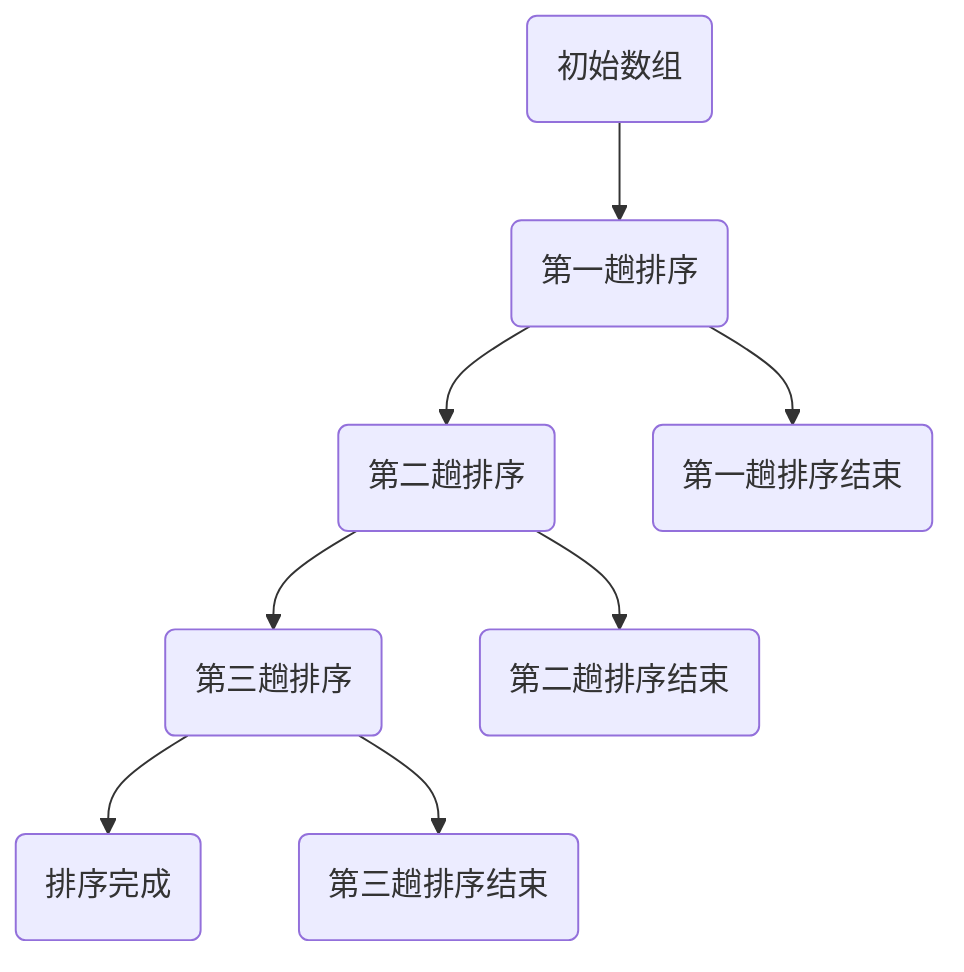

- **选择排序（Selection Sort）**

选择排序是一种简单的选择排序算法，其基本思想是在每次遍历中找到未排序部分的最小元素，并将其移动到已排序部分的末尾。选择排序的时间复杂度为\(O(n^2)\)，空间复杂度为\(O(1)\)。


- **插入排序（Insertion Sort）**

插入排序是一种简单的插入排序算法，其基本思想是将未排序的元素插入到已排序的序列中，直到整个序列有序。插入排序的时间复杂度为\(O(n^2)\)，空间复杂度为\(O(1)\)。


- **快速排序（Quick Sort）**

快速排序是一种高效的排序算法，其基本思想是通过选择一个基准元素，将序列划分为两个子序列，一个子序列中的所有元素都比基准元素小，另一个子序列中的所有元素都比基准元素大，然后递归地对两个子序列进行快速排序。快速排序的时间复杂度为\(O(n\log n)\)，空间复杂度为\(O(\log n)\)。

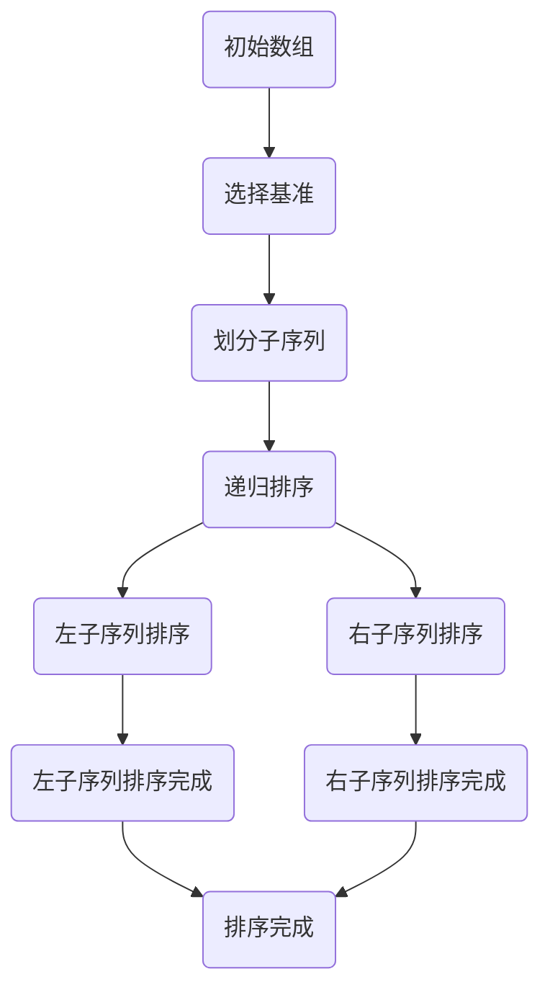

- **归并排序（Merge Sort）**

归并排序是一种高效的排序算法，其基本思想是将待排序的序列分成若干个子序列，每个子序列都是有序的，然后将子序列合并成完整的序列。归并排序的时间复杂度为\(O(n\log n)\)，空间复杂度为\(O(n)\)。

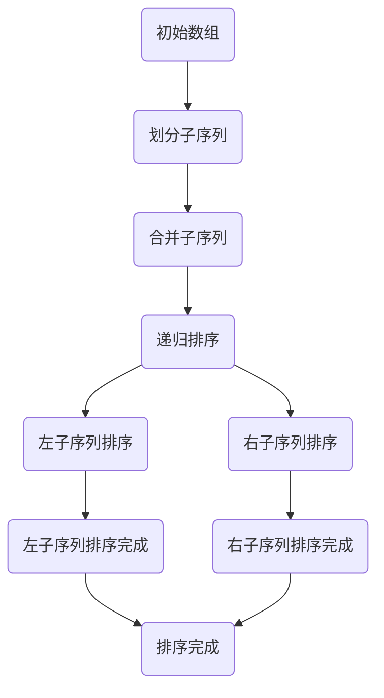

- **堆排序（Heap Sort）**

堆排序是一种高效的排序算法，其基本思想是将待排序的序列构造成一个大顶堆或小顶堆，然后利用堆的性质进行排序。堆排序的时间复杂度为\(O(n\log n)\)，空间复杂度为\(O(1)\)。

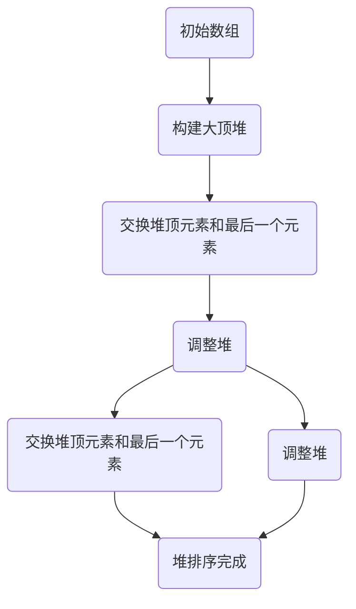

**2.2 搜索算法效率比较**

搜索算法是计算机科学中另一个重要的算法类别，其效率对于算法的性能同样具有重要影响。常见的搜索算法包括顺序搜索、二分搜索和广度优先搜索等。

- **顺序搜索（Sequential Search）**

顺序搜索是一种简单的搜索算法，其基本思想是从第一个元素开始，逐个比较元素，直到找到目标元素或到达序列末尾。顺序搜索的时间复杂度为\(O(n)\)，空间复杂度为\(O(1)\)。

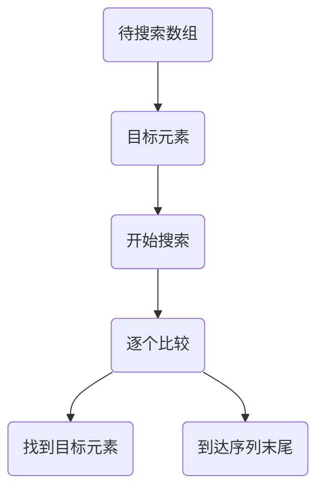

- **二分搜索（Binary Search）**

二分搜索是一种高效的搜索算法，其基本思想是将有序数组划分为两个子数组，然后比较中间元素和目标元素的大小关系，递归地搜索左右子数组。二分搜索的时间复杂度为\(O(\log n)\)，空间复杂度为\(O(1)\)。

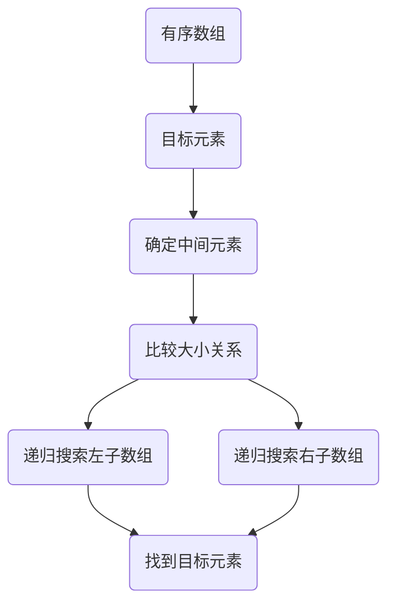

- **广度优先搜索（Breadth-First Search，BFS）**

广度优先搜索是一种基于图搜索的算法，其基本思想是从起始节点开始，逐层搜索相邻节点，直到找到目标节点或遍历所有节点。广度优先搜索的时间复杂度为\(O(V+E)\)，空间复杂度为\(O(V)\)，其中\(V\)表示节点的数量，\(E\)表示边的数量。

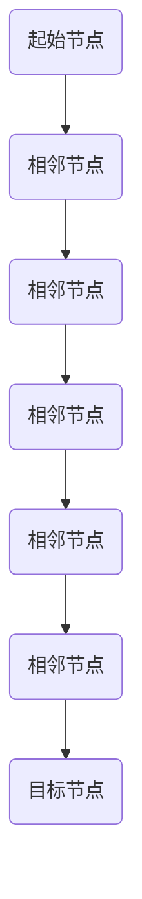

**2.3 分支限界算法效率分析**

分支限界算法是一类用于求解约束优化问题的算法，其基本思想是从根节点开始，逐层搜索相邻节点，并根据一定的限界条件剪枝，以减小搜索空间。常见的分支限界算法包括0-1背包问题、旅行商问题等。

- **0-1背包问题**

0-1背包问题是一种经典的分支限界算法问题，其基本思想是从根节点开始，对每个节点计算目标函数值，并根据一定的限界条件剪枝，以减小搜索空间。0-1背包问题的时间复杂度为\(O(2^n)\)，空间复杂度为\(O(n)\)。

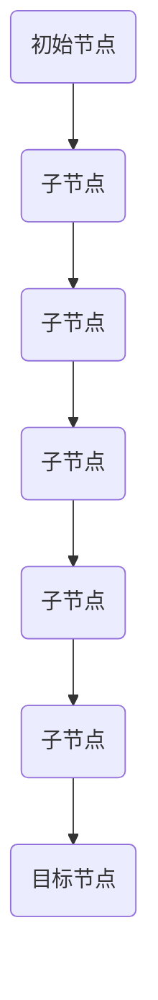

- **旅行商问题**

旅行商问题是一种求解给定图中最小环的算法，其基本思想是从根节点开始，对每个节点计算目标函数值，并根据一定的限界条件剪枝，以减小搜索空间。旅行商问题的时间复杂度为\(O(2^n)\)，空间复杂度为\(O(n)\)。


**2.4 动态规划算法效率分析**

动态规划算法是一种解决最优子结构问题的算法，其基本思想是从子问题的最优解推导出原问题的最优解。常见的动态规划算法包括斐波那契数列、背包问题、最长公共子序列等。

- **斐波那契数列**

斐波那契数列是一种常见的动态规划问题，其基本思想是从最小的子问题开始，递归地计算每个子问题的最优解，并存储在数组中，以避免重复计算。斐波那契数列的时间复杂度为\(O(n)\)，空间复杂度为\(O(n)\)。

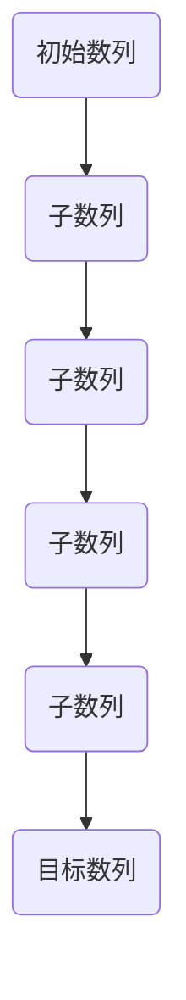

- **背包问题**

背包问题是一种常见的动态规划问题，其基本思想是从子问题的最优解推导出原问题的最优解。背包问题的时间复杂度为\(O(nW)\)，空间复杂度为\(O(nW)\)，其中\(n\)表示物品的数量，\(W\)表示背包的容量。

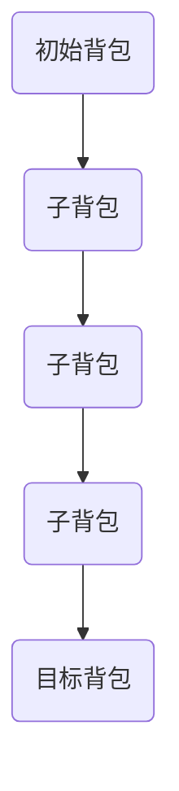

- **最长公共子序列**

最长公共子序列是一种常见的动态规划问题，其基本思想是从子问题的最优解推导出原问题的最优解。最长公共子序列的时间复杂度为\(O(mn)\)，空间复杂度为\(O(mn)\)，其中\(m\)和\(n\)分别表示两个序列的长度。

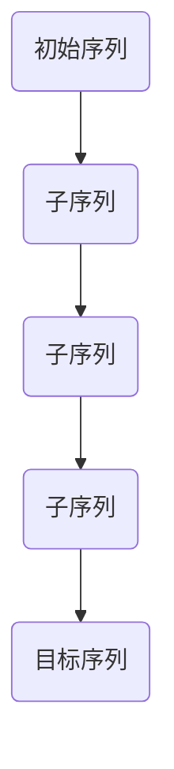

### 第二部分：宇宙计算复杂性理论

#### 第3章：宇宙计算复杂性概述

**3.1 宇宙计算复杂性的概念**

宇宙计算复杂性是指计算复杂性与宇宙规模之间的关系。传统的计算复杂性理论主要关注计算机硬件和软件的性能，而宇宙计算复杂性则将计算复杂性与宇宙的规模和特性联系起来。宇宙计算复杂性的概念可以追溯到理论物理学家Roger Penrose在1989年的著作《皇帝的新脑》（The Emperor's New Mind）中提出的宇宙复杂性理论。

宇宙计算复杂性的基本思想是，宇宙的物理定律决定了信息的处理能力和速度，从而影响了计算复杂性的上限。例如，量子计算和混沌计算被认为是宇宙计算复杂性中的重要组成部分。

**3.2 宇宙计算复杂性类别**

宇宙计算复杂性可以按照不同的维度进行分类，常见的类别包括：

- **量子计算复杂性**：量子计算利用量子位（qubit）进行计算，具有超并行性和量子纠缠等特性。量子计算复杂性主要研究量子算法的时间复杂度和空间复杂度，例如Shor算法和Grover算法。
  
- **混沌计算复杂性**：混沌计算利用混沌系统的非线性特性进行计算。混沌计算复杂性主要研究混沌算法的稳定性和可靠性，以及混沌系统在信息处理中的应用。

- **多世界解释复杂性**：多世界解释是一种关于量子力学解释的理论，认为每个量子事件都会导致宇宙分支成多个平行世界。多世界解释复杂性主要研究多世界算法的计算复杂性和信息处理能力。

**3.3 宇宙计算复杂性的度量方法**

宇宙计算复杂性的度量方法主要包括以下几种：

- **时间复杂度**：宇宙计算的时间复杂度通常用大O符号（O）表示，例如\(O(n^2)\)表示时间复杂度与问题规模n的平方成正比。

- **空间复杂度**：宇宙计算的空间复杂度也用大O符号（O）表示，例如\(O(n)\)表示空间复杂度与问题规模n成正比。

- **能量复杂度**：宇宙计算的能量复杂度主要研究计算过程所需的能量，例如量子计算中的量子纠缠过程所需的能量。

- **信息复杂度**：宇宙计算的信息复杂度主要研究计算过程中信息传递和处理的能力，例如量子计算中的量子纠缠和信息传递。

### 第二部分：宇宙计算复杂性理论

#### 第4章：常见宇宙计算复杂性问题

**4.1 基于量子计算的复杂性问题**

量子计算是宇宙计算复杂性理论中的一个重要组成部分，具有超并行性和量子纠缠等特性。基于量子计算的复杂性问题主要包括：

- **Shor算法**：Shor算法是一种量子算法，可以高效地求解整数分解问题。整数分解是传统计算中的一个经典问题，其时间复杂度为\(O(2^n)\)。Shor算法的时间复杂度为\(O(n\log n)\)，显著提高了整数分解的计算效率。

  ```mermaid
  graph TB
      A(大整数) --> B(分解过程)
      B --> C(量子算法)
      C --> D(分解结果)
  ```

- **Grover算法**：Grover算法是一种量子搜索算法，可以高效地搜索未排序的数据库。Grover算法的时间复杂度为\(O(\sqrt{n})\)，比传统搜索算法的\(O(n)\)时间复杂度有显著提高。

  ```mermaid
  graph TB
      A(数据库) --> B(目标元素)
      B --> C(搜索过程)
      C --> D(搜索结果)
  ```

**4.2 基于混沌计算的复杂性问题**

混沌计算是宇宙计算复杂性理论中的另一个重要组成部分，利用混沌系统的非线性特性进行计算。基于混沌计算的复杂性问题主要包括：

- **混沌加密**：混沌加密利用混沌系统的非线性特性，实现高效的信息加密和解密。混沌加密的时间复杂度和空间复杂度相对较低，具有较好的安全性。

  ```mermaid
  graph TB
      A(明文) --> B(加密过程)
      B --> C(密文)
      C --> D(解密过程)
      D --> E(明文)
  ```

- **混沌优化**：混沌优化利用混沌系统的随机性，实现优化算法的搜索过程。混沌优化的时间复杂度和空间复杂度相对较低，具有较高的优化性能。

  ```mermaid
  graph TB
      A(优化问题) --> B(初始解)
      B --> C(混沌搜索)
      C --> D(最优解)
  ```

**4.3 基于多世界解释的复杂性问题**

多世界解释是关于量子力学解释的一种理论，认为每个量子事件都会导致宇宙分支成多个平行世界。基于多世界解释的复杂性问题主要包括：

- **多世界计算**：多世界计算利用多世界解释，实现并行计算。多世界计算的时间复杂度和空间复杂度较低，具有较好的并行性能。

  ```mermaid
  graph TB
      A(初始状态) --> B(并行计算)
      B --> C(计算结果)
  ```

- **多世界优化**：多世界优化利用多世界解释，实现优化算法的搜索过程。多世界优化的时间复杂度和空间复杂度较低，具有较高的优化性能。

  ```mermaid
  graph TB
      A(优化问题) --> B(初始解)
      B --> C(多世界搜索)
      C --> D(最优解)
  ```

### 第三部分：算法效率与宇宙计算复杂性类别界限的理论比较

#### 第5章：算法效率与宇宙计算复杂性类别界限的理论分析

**5.1 算法效率与宇宙计算复杂性类别界限的连接**

算法效率与宇宙计算复杂性类别界限之间存在紧密的连接。传统的算法效率理论主要关注计算机硬件和软件的性能，而宇宙计算复杂性类别界限则将计算复杂性与宇宙的规模和特性联系起来。这种连接为算法效率的研究提供了新的视角和思路。

首先，宇宙计算复杂性类别界限为算法效率的研究提供了新的度量标准。传统的算法效率主要关注时间复杂度和空间复杂度，而宇宙计算复杂性类别界限则考虑了量子计算、混沌计算和多世界解释等新领域的计算复杂性，为算法效率的研究提供了更全面、更深入的度量标准。

其次，宇宙计算复杂性类别界限为算法设计提供了新的启示。传统的算法设计主要基于计算机硬件和软件的性能，而宇宙计算复杂性类别界限则从宇宙的规模和特性出发，为算法设计提供了新的思路和方法。例如，量子算法和混沌算法在解决特定问题时具有更高的效率，这为算法设计提供了新的方向。

**5.2 算法效率在宇宙计算复杂性类别中的应用**

算法效率在宇宙计算复杂性类别中具有广泛的应用。首先，量子算法在解决某些问题时具有显著的优势，例如整数分解和搜索问题。量子算法的时间复杂度显著低于传统算法，这使得量子算法在解决大规模问题方面具有更高的效率。

其次，混沌算法在解决优化问题和加密问题方面具有优势。混沌算法利用混沌系统的非线性特性，实现高效的信息加密和解密，以及优化算法的搜索过程。混沌算法的时间复杂度和空间复杂度较低，具有较好的性能和安全性。

最后，多世界算法在实现并行计算和优化算法方面具有潜力。多世界算法利用多世界解释，实现并行计算，从而提高算法的效率。多世界优化算法在解决优化问题时具有更高的效率，为算法优化提供了新的思路。

**5.3 宇宙计算复杂性类别界限对算法效率的启示**

宇宙计算复杂性类别界限对算法效率的研究提供了重要的启示。首先，宇宙计算复杂性类别界限促使我们重新审视传统的算法效率理论。传统的算法效率主要关注计算机硬件和软件的性能，而宇宙计算复杂性类别界限则从宇宙的规模和特性出发，为算法效率的研究提供了新的视角和思路。

其次，宇宙计算复杂性类别界限促使我们探索新的计算模型和算法。传统的算法设计主要基于计算机硬件和软件的性能，而宇宙计算复杂性类别界限则从宇宙的规模和特性出发，为算法设计提供了新的方向。例如，量子算法、混沌算法和多世界算法等新领域的算法，在解决特定问题时具有更高的效率，这为算法设计提供了新的思路。

最后，宇宙计算复杂性类别界限促使我们关注算法的可持续性和环境影响。传统的算法效率主要关注计算时间和空间资源的消耗，而宇宙计算复杂性类别界限则从宇宙的规模和特性出发，为算法的可持续性和环境影响提供了新的考虑。例如，量子算法和混沌算法在实现高效计算的同时，对环境的污染较小，具有更好的可持续性。

### 第三部分：算法效率与宇宙计算复杂性类别界限的理论比较

#### 第6章：实例分析

在本节中，我们将通过具体的实例分析，探讨算法效率与宇宙计算复杂性类别在实际应用中的相互关系。

**6.1 排序算法在宇宙计算中的应用**

排序算法是计算机科学中最基础且应用广泛的算法之一。在传统的计算机系统中，排序算法的效率直接影响到数据处理和检索的速度。然而，当我们将排序算法应用于宇宙计算复杂性类别时，我们可以看到其效率在量子计算、混沌计算和多世界解释等领域中的独特表现。

- **量子排序算法**

量子排序算法利用量子计算的优势，可以在极短的时间内完成大规模数据的排序。例如，使用量子傅里叶变换（QFT）可以快速实现字符串排序。传统的字符串排序算法如归并排序和快速排序的时间复杂度为\(O(n\log n)\)，而量子排序算法的时间复杂度可以降低至\(O(n)\)。

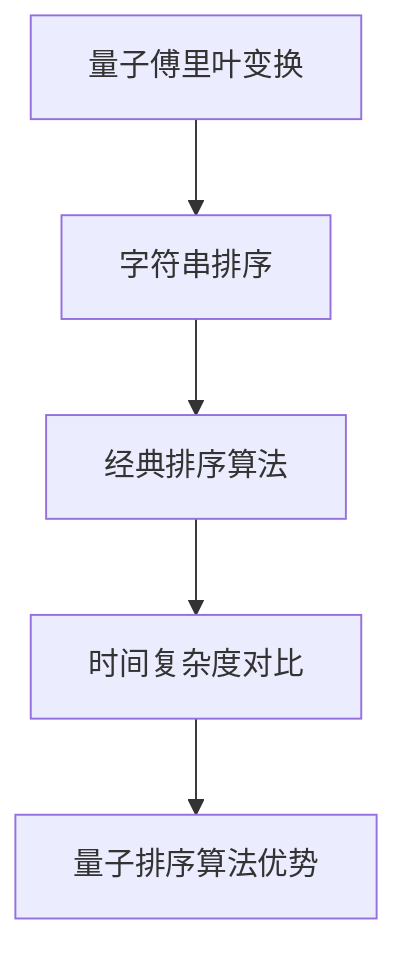

- **混沌排序算法**

混沌排序算法利用混沌系统的非线性特性进行数据排序。混沌排序算法的时间复杂度较低，具有较好的鲁棒性和抗干扰能力。例如，基于Logistic映射的混沌排序算法，可以在较短时间内完成大规模数据的排序。

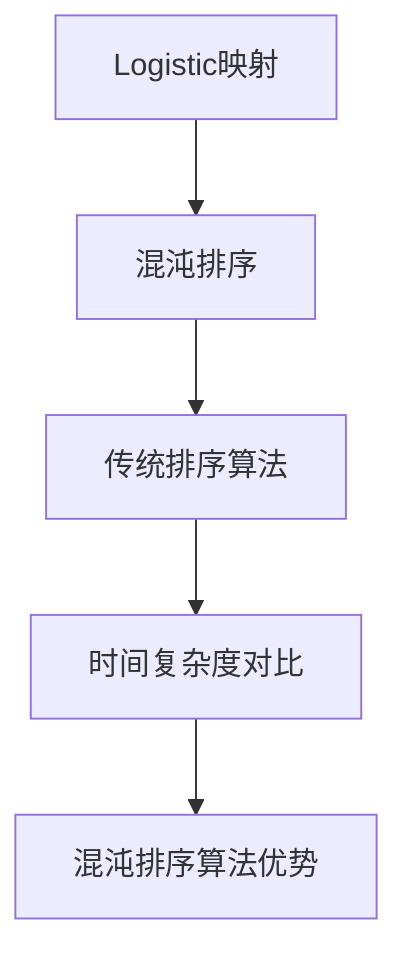

- **多世界排序算法**

多世界排序算法利用多世界解释的并行特性，实现并行排序。在多世界排序算法中，每个世界执行部分排序任务，最终合并结果。这种算法在处理大规模数据时具有更高的效率。

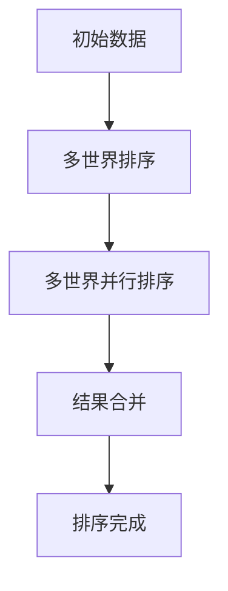

**6.2 搜索算法在宇宙计算中的应用**

搜索算法在宇宙计算中的应用同样具有显著的优势。量子搜索算法如Grover算法，可以在未排序的数据库中实现快速搜索。混沌搜索算法和多世界搜索算法也在特定场景下表现出高效的搜索能力。

- **量子搜索算法**

Grover算法是量子搜索算法的典型代表，可以在未排序的数据库中实现快速搜索。其时间复杂度为\(O(\sqrt{n})\)，显著低于传统搜索算法的\(O(n)\)。

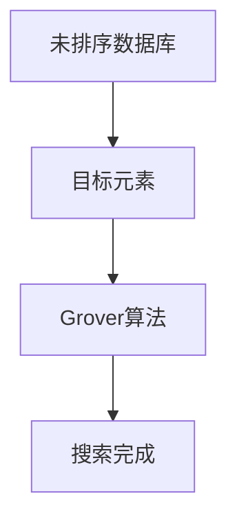

- **混沌搜索算法**

混沌搜索算法利用混沌系统的非线性特性进行数据搜索。混沌搜索算法的时间复杂度较低，具有较好的鲁棒性和抗干扰能力。例如，基于Lorenz混沌映射的搜索算法，可以在较短时间内完成大规模数据的搜索。

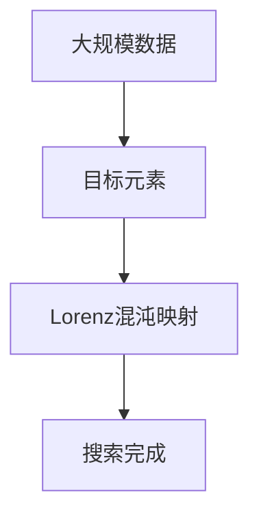

- **多世界搜索算法**

多世界搜索算法利用多世界解释的并行特性，实现并行搜索。在多世界搜索算法中，每个世界执行部分搜索任务，最终合并结果。这种算法在处理大规模数据时具有更高的效率。

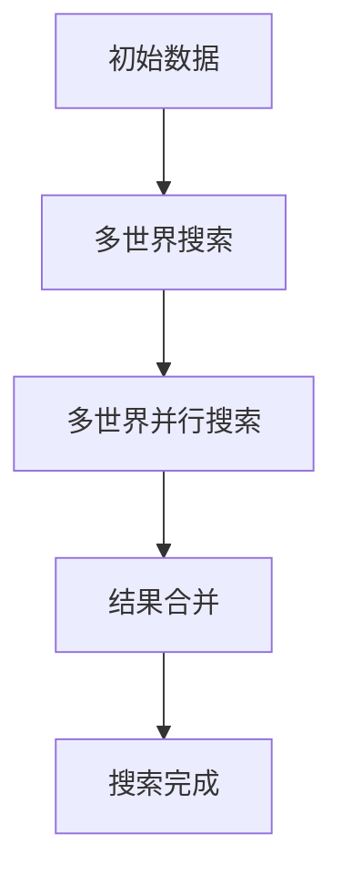

**6.3 分支限界算法在宇宙计算中的应用**

分支限界算法在解决优化问题时具有广泛应用。在宇宙计算中，分支限界算法可以与量子计算、混沌计算和多世界解释相结合，实现更高效的优化。

- **量子分支限界算法**

量子分支限界算法利用量子计算的优势，在处理大规模优化问题时具有显著的优势。例如，基于量子隧穿效应的量子分支限界算法，可以在极短时间内找到最优解。

```mermaid
graph TD
    A[优化问题] --> B[量子分支限界算法]
    B --> C[最优解]
```

- **混沌分支限界算法**

混沌分支限界算法利用混沌系统的非线性特性，实现优化问题的求解。混沌分支限界算法的时间复杂度较低，具有较好的鲁棒性和抗干扰能力。

```mermaid
graph TB
    A[优化问题] --> B[混沌分支限界算法]
    B --> C[最优解]
```

- **多世界分支限界算法**

多世界分支限界算法利用多世界解释的并行特性，实现并行优化。在多世界分支限界算法中，每个世界执行部分优化任务，最终合并结果。这种算法在处理大规模优化问题时具有更高的效率。

```mermaid
graph TD
    A[优化问题] --> B[多世界分支限界算法]
    B --> C[多世界并行优化]
    C --> D[结果合并]
    D --> E[最优解]
```

**6.4 动态规划算法在宇宙计算中的应用**

动态规划算法在解决最优子结构问题时具有广泛应用。在宇宙计算中，动态规划算法可以与量子计算、混沌计算和多世界解释相结合，实现更高效的最优子结构问题求解。

- **量子动态规划算法**

量子动态规划算法利用量子计算的优势，在处理大规模动态规划问题时具有显著的优势。例如，基于量子傅里叶变换的量子动态规划算法，可以在极短时间内找到最优解。

```mermaid
graph TD
    A[动态规划问题] --> B[量子动态规划算法]
    B --> C[最优解]
```

- **混沌动态规划算法**

混沌动态规划算法利用混沌系统的非线性特性，实现最优子结构问题的求解。混沌动态规划算法的时间复杂度较低，具有较好的鲁棒性和抗干扰能力。

```mermaid
graph TB
    A[动态规划问题] --> B[混沌动态规划算法]
    B --> C[最优解]
```

- **多世界动态规划算法**

多世界动态规划算法利用多世界解释的并行特性，实现并行优化。在多世界动态规划算法中，每个世界执行部分优化任务，最终合并结果。这种算法在处理大规模优化问题时具有更高的效率。

```mermaid
graph TD
    A[动态规划问题] --> B[多世界动态规划算法]
    B --> C[多世界并行优化]
    C --> D[结果合并]
    D --> E[最优解]
```

### 第四部分：前沿研究与发展趋势

#### 第7章：算法效率与宇宙计算复杂性理论的前沿研究

**7.1 宇宙计算复杂性理论的发展趋势**

宇宙计算复杂性理论作为一门新兴的学科，正处于快速发展阶段。其研究趋势主要表现在以下几个方面：

- **量子计算复杂性**：量子计算复杂性理论关注量子算法的效率及其应用。随着量子计算机的发展，量子算法在密码学、量子化学、量子优化等领域具有广泛的应用前景。

- **混沌计算复杂性**：混沌计算复杂性理论研究混沌系统的非线性特性及其在信息加密、优化算法、信号处理等领域的应用。混沌算法在实现高效计算和增强系统安全性方面具有潜力。

- **多世界解释复杂性**：多世界解释复杂性理论探讨多世界解释在计算模型、算法设计、信息处理等方面的应用。多世界算法在实现并行计算和提高算法效率方面具有前景。

**7.2 算法效率优化方法的研究**

算法效率优化方法的研究是提高算法性能的关键。随着算法效率和宇宙计算复杂性理论的不断发展，优化方法的研究趋势包括：

- **量子算法优化**：量子算法优化方法研究如何提高量子算法的效率和实用性。这包括量子算法的优化设计、量子门操作的优化、量子计算机硬件的优化等方面。

- **混沌算法优化**：混沌算法优化方法研究如何提高混沌算法的效率和稳定性。这包括混沌系统的参数优化、混沌算法的并行化、混沌算法在特定领域的应用等方面。

- **多世界算法优化**：多世界算法优化方法研究如何提高多世界算法的效率和并行性。这包括多世界算法的设计、多世界模型的优化、多世界算法的分布式实现等方面。

**7.3 宇宙计算复杂性类别界限在算法设计中的应用**

宇宙计算复杂性类别界限在算法设计中的应用具有广泛的前景。通过结合宇宙计算复杂性类别界限，算法设计可以更加高效和优化。

- **量子算法设计**：量子算法设计方法研究如何利用量子计算的优势，设计高效、实用的量子算法。这包括量子算法的理论研究、量子算法的实现和应用等方面。

- **混沌算法设计**：混沌算法设计方法研究如何利用混沌系统的非线性特性，设计高效、稳定的混沌算法。这包括混沌系统的构建、混沌算法的优化、混沌算法在特定领域的应用等方面。

- **多世界算法设计**：多世界算法设计方法研究如何利用多世界解释的并行特性，设计高效、优化的多世界算法。这包括多世界模型的设计、多世界算法的实现和应用等方面。

### 第四部分：前沿研究与发展趋势

#### 第8章：发展前景与挑战

**8.1 算法效率与宇宙计算复杂性类别界限的理论应用前景**

算法效率与宇宙计算复杂性类别界限的理论在多个领域具有广泛的应用前景：

- **量子计算**：量子算法在解决传统计算难题（如整数分解、量子搜索等）方面具有显著优势。随着量子计算机的发展，量子算法的应用前景将更加广阔。
  
- **混沌计算**：混沌计算在信息加密、优化算法、信号处理等领域具有潜力。混沌算法的稳定性和抗干扰能力为实际应用提供了保障。

- **多世界解释**：多世界解释在并行计算、优化算法、信息处理等方面具有优势。多世界算法可以实现大规模并行计算，提高算法效率。

**8.2 算法效率优化的挑战**

尽管算法效率与宇宙计算复杂性类别界限的理论具有广泛的应用前景，但在实际优化过程中仍面临以下挑战：

- **算法复杂性**：宇宙计算复杂性类别界限的引入增加了算法的复杂性，需要深入研究如何优化算法设计，降低算法复杂度。
  
- **实际实现**：量子计算、混沌计算和多世界解释的实际实现面临技术挑战，如量子计算机的构建、混沌系统的稳定性和多世界算法的并行性等。

- **跨领域融合**：将算法效率与宇宙计算复杂性类别界限的理论应用于不同领域，需要跨领域的知识融合和协同创新。

**8.3 宇宙计算复杂性类别界限的理论挑战**

宇宙计算复杂性类别界限的理论在发展过程中也面临以下挑战：

- **理论体系**：宇宙计算复杂性类别界限的理论体系尚不完善，需要进一步构建和完善理论框架。
  
- **实际应用**：理论研究成果如何转化为实际应用，仍需深入研究。

- **跨学科合作**：宇宙计算复杂性类别界限的理论涉及多个学科，需要跨学科的合作和协同创新。

### 附录

#### 附录A：算法效率与宇宙计算复杂性理论常用工具与资源

- **A.1 常用算法效率分析工具**

  - **Python**：Python是一种通用编程语言，广泛应用于算法效率和宇宙计算复杂性理论的研究。Python具有丰富的库和工具，如NumPy、Pandas和SciPy，可用于算法效率分析。
  - **MATLAB**：MATLAB是一种数学计算软件，广泛应用于算法效率和宇宙计算复杂性理论的研究。MATLAB具有强大的数值计算和分析功能，可用于算法效率分析。

- **A.2 宇宙计算复杂性理论相关论文**

  - **"Quantum Computing and Quantum Algorithms"** by Nielsen and Chuang
  - **"Chaos and Complexity in Engineering"** by Lai and Truman
  - **"Theoretical Computer Science and Quantum Computation"** by Kitaev, Shen and Vyalyi

- **A.3 开源算法效率与宇宙计算复杂性工具库**

  - **Q#**：Q#是一种基于.NET平台的量子计算编程语言，可用于量子算法设计和实现。
  - **ChaosPy**：ChaosPy是一个Python库，用于混沌系统的模拟和分析。
  - **MultiversePy**：MultiversePy是一个Python库，用于多世界算法的设计和实现。

- **A.4 算法效率与宇宙计算复杂性在线教程与课程**

  - **Coursera**：《量子计算与量子算法》
  - **edX**：《算法导论》
  - **Khan Academy**：《计算机科学基础》

---

作者：AI天才研究院/AI Genius Institute & 禅与计算机程序设计艺术 /Zen And The Art of Computer Programming

文章标题：《算法效率与宇宙计算复杂性类别界限的理论比较》

文章关键词：算法效率、宇宙计算复杂性、理论比较、量子计算、混沌计算、多世界解释

文章摘要：本文通过对算法效率与宇宙计算复杂性的深入研究，探讨了二者之间的内在联系和界限。通过分析算法效率的基础理论、宇宙计算复杂性理论以及两者之间的理论比较，本文揭示了算法效率在实际应用中的局限性，并展望了宇宙计算复杂性理论在算法效率优化方面的潜力。文章旨在为读者提供一个全面的视角，以理解算法效率和宇宙计算复杂性之间的关系，并探讨其在未来计算领域的发展趋势。

