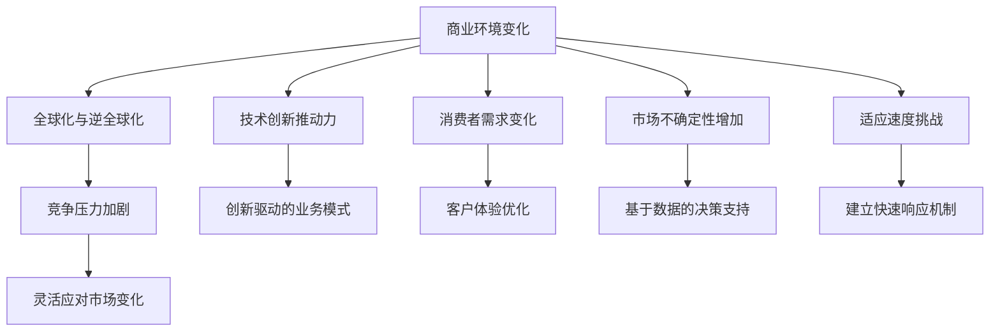
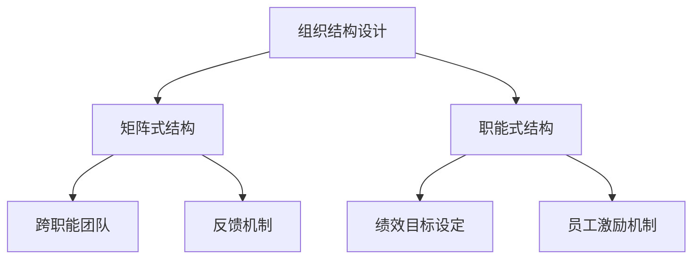
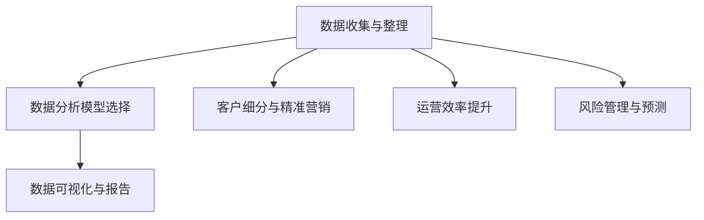
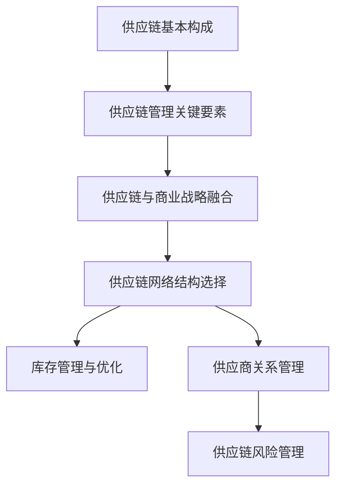
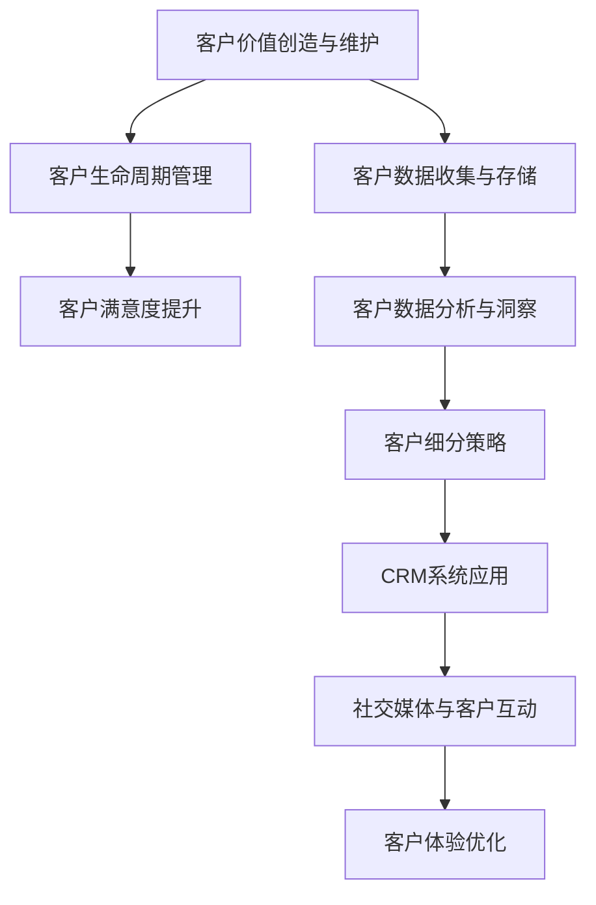
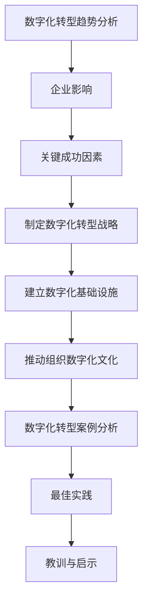
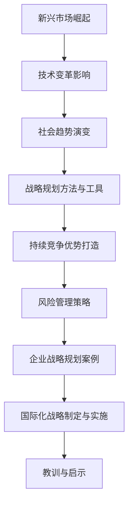

                 

# 管理者如何应对快速变化的商业环境

## 摘要

随着全球化和技术革命的深入，商业环境正在经历前所未有的快速变化。管理者面对的挑战不仅是市场的不确定性，还有竞争压力和消费者需求的不断演变。本文将深入探讨管理者在快速变化的商业环境中应如何调整策略、构建敏捷组织、利用数据分析优化决策、建立强大的供应链网络、实施有效的客户关系管理以及推动数字化转型，从而在激烈的市场竞争中立于不败之地。

关键词：商业环境变化、敏捷组织、数据分析、供应链管理、客户关系管理、数字化转型

## 第一部分：管理者视角下的商业环境变化

### 第1章: 理解商业环境变化的本质

在探讨管理者如何应对快速变化的商业环境之前，我们首先需要理解这种变化的本质。商业环境的变化是一个多维度的过程，它受到全球趋势、技术进步、消费者行为等多方面因素的影响。

#### 1.1 商业环境的演变趋势

**1.1.1 全球化与逆全球化的交替**

全球化是21世纪初期的一大趋势，它带来了国际贸易和投资的繁荣。然而，近年来，逆全球化思潮开始抬头，表现为贸易保护主义和地缘政治紧张。这一趋势使得管理者必须更灵活地应对国际市场的变化，同时保持战略上的长远视角。

**1.1.2 技术创新的推动力**

技术的迅猛发展，特别是人工智能、大数据、物联网等新兴技术的广泛应用，正在重塑各个行业的基本面貌。管理者需要密切关注技术趋势，将创新技术整合到业务中，以提升效率和竞争力。

**1.1.3 消费者需求的变化**

消费者需求日益多样化和个性化，他们更加注重产品或服务的质量和体验。管理者必须通过深入了解消费者行为，及时调整产品和服务策略，以满足不断变化的需求。

#### 1.2 快速变化商业环境的挑战

**1.2.1 竞争压力的加剧**

随着市场边界的模糊和竞争的全球化，企业面临更激烈的竞争环境。管理者需要持续优化业务流程，提高运营效率，以保持竞争力。

**1.2.2 市场不确定性的增加**

快速变化的商业环境充满了不确定性，这要求管理者具备强大的应对能力，能够快速做出调整和决策。

**1.2.3 适应速度的挑战**

在快速变化的商业环境中，适应速度是成败的关键。管理者需要具备快速响应市场变化的能力，以便抓住机遇，规避风险。

#### 1.3 商业策略的调整方向

**1.3.1 灵活应对市场变化的策略**

管理者需要建立灵活的商业模式，能够迅速调整战略，以适应市场的变化。这包括灵活的供应链管理、敏捷的研发流程和灵活的销售策略。

**1.3.2 创新驱动的业务模式**

在快速变化的商业环境中，创新是保持竞争力的关键。管理者应鼓励创新思维，将创新技术应用于业务模式中，以创造新的增长点。

**1.3.3 客户体验优化的重点**

提升客户体验是管理者应重点关注的方向。通过提供高质量的产品和服务，增强客户的满意度和忠诚度，从而实现业务的持续增长。

**1.3.4 基于数据的决策支持**

数据是现代商业决策的重要依据。管理者应充分利用数据分析工具，从海量数据中提取有价值的信息，以支持决策。

**1.3.5 建立快速响应机制**

为了应对快速变化的商业环境，管理者需要建立快速响应机制，确保企业能够迅速调整策略，以适应市场的变化。

### 图 1.1 商业环境变化的本质与挑战

通过上述分析，我们可以看出商业环境变化的本质以及所带来的挑战。管理者需要从多个维度进行调整和应对，以在快速变化的商业环境中保持竞争力。

### 第2章: 构建敏捷的组织结构

#### 2.1 敏捷组织的特点

**2.1.1 灵活性与适应性的重要性**

敏捷组织具有高度的灵活性和适应性，能够迅速响应市场变化和客户需求。这种灵活性使得组织能够在动态环境中保持竞争力。

**2.1.2 团队协作与跨部门沟通**

敏捷组织强调团队协作和跨部门沟通，通过打破部门壁垒，促进信息共享和资源整合，提高组织效率。

**2.1.3 持续学习和适应能力**

敏捷组织注重持续学习和适应能力，鼓励员工不断更新知识和技能，以适应快速变化的环境。

#### 2.2 敏捷组织设计的实践

**2.2.1 平衡矩阵式与职能式组织结构**

矩阵式组织结构和职能式组织结构都有其优缺点。敏捷组织设计应考虑两者的平衡，以最大化组织效率。

**2.2.2 建立跨职能团队**

跨职能团队是敏捷组织的关键组成部分，它们负责特定的项目或任务，成员来自不同部门，具备多样化的技能。

**2.2.3 设定清晰的绩效目标和反馈机制**

敏捷组织需要设定清晰的绩效目标，并通过反馈机制，确保团队成员了解自己的工作表现和改进方向。

#### 2.3 敏捷文化的培养

**2.3.1 鼓励创新与实验**

敏捷文化鼓励创新和实验，管理者应创造一个安全的环境，让员工敢于尝试新想法。

**2.3.2 推广开放沟通与透明管理**

开放沟通和透明管理是敏捷文化的核心要素，管理者应积极推广，确保信息在组织内部自由流动。

**2.3.3 完善员工激励机制**

完善的员工激励机制可以激励员工积极参与敏捷组织建设，提高组织的整体效率。

#### 图 2.1 敏捷组织结构设计

通过构建敏捷组织，管理者可以提升组织的灵活性和适应性，从而在快速变化的商业环境中保持竞争力。敏捷组织的特点和设计实践，为管理者提供了具体的操作指南。

### 第3章: 利用数据分析优化商业决策

#### 3.1 数据分析在商业决策中的应用

**3.1.1 数据驱动的决策优势**

数据分析可以帮助管理者从海量数据中提取有价值的信息，从而做出更加准确和有依据的决策。相比传统决策方法，数据驱动的决策具有更高的效率和准确性。

**3.1.2 数据分析的常用工具与方法**

数据分析的工具和方法多种多样，包括数据挖掘、机器学习、统计分析等。管理者应熟悉这些工具和方法，以便在决策过程中灵活应用。

**3.1.3 数据质量的重要性**

数据质量是数据分析的基础。如果数据存在错误或不完整，分析结果将会受到影响。因此，管理者需要重视数据质量的保障。

#### 3.2 建立高效的数据分析流程

**3.2.1 数据收集与整理**

数据收集是数据分析的第一步。管理者需要确保数据的完整性和准确性，并进行必要的清洗和整理。

**3.2.2 数据分析模型的选择**

根据业务需求和数据特性，选择合适的数据分析模型。例如，回归分析、聚类分析、时间序列分析等。

**3.2.3 数据可视化与报告**

数据可视化是将数据分析结果以图形或图表的形式展示出来，使管理者能够更直观地理解和分析数据。同时，定期生成数据分析报告，为决策提供参考。

#### 3.3 利用数据分析优化业务流程

**3.3.1 客户细分与精准营销**

通过数据分析，管理者可以深入了解客户行为和需求，进行客户细分，实施精准营销策略，提高营销效果。

**3.3.2 运营效率的提升**

数据分析可以优化业务流程，提高运营效率。例如，通过分析生产数据，优化生产计划，降低成本。

**3.3.3 风险管理与预测**

数据分析可以帮助管理者识别潜在风险，进行风险预测和管理，降低业务风险。

#### 图 3.1 数据分析在商业决策中的应用流程

通过建立高效的数据分析流程，管理者可以充分利用数据的价值，优化商业决策，提高业务效率和竞争力。

### 第4章: 建立强大的供应链网络

#### 4.1 供应链管理的核心概念

**4.1.1 供应链的基本构成**

供应链由供应商、制造商、分销商、零售商等多个环节组成，涉及到物流、信息流和资金流的流转。

**4.1.2 供应链管理的关键要素**

供应链管理的关键要素包括库存管理、物流管理、供应商管理、需求预测等。

**4.1.3 供应链与商业战略的融合**

供应链管理应与企业的商业战略紧密结合，确保供应链的优化能够支持企业整体战略的实现。

#### 4.2 供应链网络的设计与优化

**4.2.1 供应链网络结构的选择**

根据企业的业务需求和战略目标，选择合适的供应链网络结构，如多级供应链、分布式供应链等。

**4.2.2 库存管理与优化**

库存管理是供应链管理的重要环节，通过合理的库存策略和库存控制，降低库存成本，提高资金利用效率。

**4.2.3 供应商关系管理**

建立稳定的供应商关系，通过合作和沟通，实现供应链的协同效应，提高供应链的整体效能。

#### 4.3 快速响应供应链的需求

**4.3.1 应对市场变化的供应链策略**

快速响应市场变化是供应链管理的关键。通过灵活的供应链策略，如快速响应供应链、敏捷供应链等，确保供应链能够快速调整以适应市场变化。

**4.3.2 利用信息技术提升供应链效率**

信息技术在供应链管理中的应用，如物流管理系统（WMS）、供应链管理软件（SCM）等，可以显著提高供应链的效率和透明度。

**4.3.3 建立供应链风险管理机制**

供应链风险管理是确保供应链稳定运行的重要措施。通过识别和评估供应链风险，建立风险应对机制，降低供应链风险。

#### 图 4.1 供应链管理的核心概念与供应链网络设计

通过建立强大的供应链网络，企业可以降低运营成本，提高供应链的灵活性和响应速度，从而在激烈的市场竞争中保持优势。

### 第5章: 客户关系管理策略

#### 5.1 客户关系管理的核心理念

**5.1.1 客户价值的创造与维护**

客户关系管理的核心在于创造和维持客户价值。通过提供优质的产品和服务，满足客户需求，建立长期稳定的客户关系。

**5.1.2 客户生命周期管理**

客户生命周期管理是一种系统性的方法，涵盖了客户获取、维护和增长的全过程。通过分析客户生命周期，企业可以更好地理解客户行为，提供个性化的服务。

**5.1.3 客户满意度的提升**

客户满意度是客户关系管理的关键指标。通过不断提升客户体验，提高客户满意度，企业可以增加客户忠诚度，降低客户流失率。

#### 5.2 客户数据的有效利用

**5.2.1 客户数据的收集与存储**

客户数据的收集和存储是客户关系管理的基础。企业需要通过多种渠道收集客户数据，并确保数据的安全和隐私。

**5.2.2 客户数据分析与洞察**

通过对客户数据的分析，企业可以获得关于客户行为和需求的深入洞察，从而制定更有效的营销策略。

**5.2.3 客户细分策略**

客户细分是一种将客户划分为不同群体，以提供个性化服务的方法。通过客户细分，企业可以更精准地满足不同客户的需求。

#### 5.3 客户关系管理工具与技术

**5.3.1 客户关系管理系统的应用**

客户关系管理系统（CRM）是企业进行客户关系管理的重要工具。通过CRM系统，企业可以统一管理客户数据，提高销售效率和客户满意度。

**5.3.2 社交媒体与客户互动**

社交媒体为企业和客户提供了互动的平台。通过社交媒体，企业可以与客户建立直接联系，提升客户体验。

**5.3.3 客户体验优化**

客户体验优化是客户关系管理的重要方向。通过优化客户旅程，提供无缝的客户体验，企业可以增强客户满意度和忠诚度。

#### 图 5.1 客户关系管理的核心理念与客户数据利用

通过实施有效的客户关系管理策略，企业可以建立长期稳定的客户关系，提升客户满意度和忠诚度，从而实现持续增长。

### 第6章: 数字化转型策略

#### 6.1 数字化转型的背景与意义

**6.1.1 数字化转型的趋势分析**

随着信息技术的飞速发展，数字化转型已成为企业发展的必然趋势。从大数据、云计算到人工智能，新兴技术不断推动企业向数字化方向转型。

**6.1.2 数字化转型对企业的影响**

数字化转型不仅改变了企业的运营方式，还重塑了商业模式和市场格局。企业需要充分利用数字化技术，提高效率、降低成本、增强竞争力。

**6.1.3 数字化转型的关键成功因素**

数字化转型的成功取决于多个因素，包括战略规划、技术创新、组织变革和人才培养。企业需要全面考虑这些因素，以确保数字化转型的顺利进行。

#### 6.2 数字化转型的实施步骤

**6.2.1 制定数字化转型战略**

制定清晰的数字化转型战略是成功转型的第一步。企业需要明确数字化转型的目标、路径和关键里程碑。

**6.2.2 建立数字化基础设施**

建立强大的数字化基础设施是数字化转型的基石。包括云计算平台、大数据平台、物联网设备等。

**6.2.3 推动组织数字化文化**

数字化文化是数字化转型成功的关键。企业需要培养员工的数字化意识和能力，推动组织的数字化转型。

#### 6.3 数字化转型的案例分析

**6.3.1 企业数字化转型案例**

通过分析成功企业的数字化转型案例，企业可以借鉴其经验和教训，制定适合自己的数字化转型策略。

**6.3.2 数字化转型的最佳实践**

数字化转型的最佳实践包括创新业务模式、数据驱动的决策、智能化的供应链管理等。

**6.3.3 教训与启示**

总结数字化转型过程中的教训和启示，有助于企业更好地应对数字化转型的挑战。

#### 图 6.1 数字化转型的背景与实施步骤

通过实施数字化转型策略，企业可以抓住数字化时代的机遇，实现业务的持续增长和创新。

### 第7章: 未来商业环境下的战略规划

#### 7.1 未来商业环境的变化趋势

**7.1.1 新兴市场的崛起**

随着全球化的深入，新兴市场的重要性日益凸显。这些市场不仅提供了巨大的商业机会，也带来了新的竞争格局。

**7.1.2 技术变革的影响**

人工智能、大数据、物联网等新兴技术将继续深刻影响商业环境，企业需要紧跟技术趋势，进行相应的战略调整。

**7.1.3 社会趋势的演变**

社会趋势的变化，如消费者行为、价值观的转变等，也将对商业环境产生重要影响。企业需要密切关注这些趋势，以调整战略。

#### 7.2 制定适应未来商业环境的战略

**7.2.1 战略规划的方法与工具**

制定有效的战略规划需要运用多种方法和工具，如SWOT分析、PEST分析等，以全面分析内外部环境。

**7.2.2 打造持续竞争优势**

在快速变化的商业环境中，企业需要打造持续竞争优势，这包括创新能力的提升、品牌的强化等。

**7.2.3 风险管理策略**

面对不确定的商业环境，企业需要制定有效的风险管理策略，以应对潜在的风险和挑战。

#### 7.3 案例分析：成功企业战略规划实践

**7.3.1 企业战略规划案例**

通过分析成功企业的战略规划案例，企业可以了解如何在不同市场环境下制定有效的战略。

**7.3.2 国际化战略的制定与实施**

国际化战略是企业扩展全球市场的重要手段。通过分析成功企业的国际化战略，企业可以借鉴其经验和教训。

**7.3.3 教训与启示**

总结成功企业的战略规划教训和启示，有助于企业更好地应对未来的商业挑战。

#### 图 7.1 未来商业环境的变化趋势与战略规划

通过制定适应未来商业环境的战略规划，企业可以抓住机遇，应对挑战，实现持续增长。

### 附录

#### 附录 A: 快速变化商业环境下的资源与工具

**A.1 数字化工具与平台**

- **数据分析工具：** Tableau、Power BI
- **供应链管理软件：** SAP、Oracle
- **客户关系管理系统：** Salesforce、Microsoft Dynamics 365

**A.2 数据分析与应用案例**

- **案例分析：** 阿里巴巴的电商数据分析
- **应用案例：** 跨境电商的物流优化

**A.3 数字化转型实践指南**

- **指南文档：** IDC的《数字化转型实践指南》
- **在线资源：** Coursera、Udacity的数字化转型课程

#### 附录 B: 参考文献与推荐阅读

**B.1 管理类书籍推荐**

- **《第五项修炼》：** 彼得·圣吉
- **《竞争战略》：** 迈克尔·波特

**B.2 商业战略与规划类书籍推荐**

- **《蓝海战略》：** 宇宙创造者
- **《创新者的窘境》：** 克莱顿·克里斯坦森

**B.3 数字化转型与人工智能相关书籍推荐**

- **《人工智能：** 概念、应用与未来》
- **《深度学习》：** 伊恩·古德费洛等

**B.4 商业环境与趋势分析报告**

- **《全球数字经济报告》：** 国际数据公司（IDC）
- **《中国互联网发展报告》：** 中国互联网信息中心（CNNIC）

**B.5 国际权威期刊与学术资源**

- **《哈佛商业评论》：** Harvard Business Review
- **《IEEE Xplore》：** IEEE Xplore Digital Library

通过附录提供的资源与工具，管理者可以更好地应对快速变化的商业环境，制定有效的战略规划。参考文献与推荐阅读则提供了深入研究的方向和资料。

### 作者信息

**作者：AI天才研究院/AI Genius Institute & 禅与计算机程序设计艺术 /Zen And The Art of Computer Programming**

