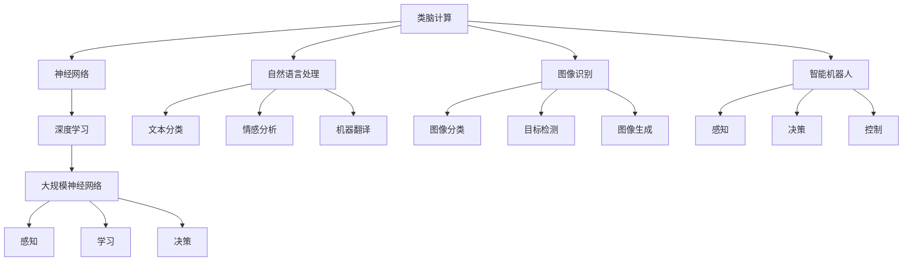

                 

# 类脑计算：模拟人脑增强世界理解能力

## 关键词

- 类脑计算
- 神经网络
- 深度学习
- 自然语言处理
- 图像识别
- 智能机器人
- 人工智能

## 摘要

本文深入探讨了类脑计算的概念、原理、核心技术以及其在自然语言处理、图像识别和智能机器人等领域的应用。通过对类脑计算的基本原理、数学模型、算法原理和实际项目的分析，本文旨在揭示类脑计算如何模拟人脑机制，从而增强对世界的理解能力。文章还讨论了类脑计算的伦理与安全挑战，展望了其未来的发展趋势。

## 目录

### 第一部分：类脑计算基础

#### 第1章：类脑计算概述

##### 1.1 类脑计算的定义与背景

##### 1.2 类脑计算的核心目标

##### 1.3 类脑计算与传统计算的区别

#### 第2章：类脑计算原理

##### 2.1 神经网络与大脑的相似性

##### 2.2 类脑计算的神经科学基础

##### 2.3 感知、学习和决策过程

#### 第3章：类脑计算的核心技术

##### 3.1 大规模神经网络的构建

##### 3.2 深度学习算法与优化方法

##### 3.3 类脑计算中的模拟退火算法

#### 第4章：数学模型与公式解析

##### 4.1 神经网络的激活函数

##### 4.2 损失函数与优化算法

##### 4.3 神经网络的训练与调参技巧

### 第二部分：类脑计算应用场景

#### 第5章：类脑计算在自然语言处理中的应用

##### 5.1 类脑计算在文本分类中的应用

##### 5.2 类脑计算在情感分析中的应用

##### 5.3 类脑计算在机器翻译中的应用

#### 第6章：类脑计算在图像识别中的应用

##### 6.1 类脑计算在图像分类中的应用

##### 6.2 类脑计算在目标检测中的应用

##### 6.3 类脑计算在图像生成中的应用

#### 第7章：类脑计算在智能机器人中的应用

##### 7.1 类脑计算在机器人感知中的应用

##### 7.2 类脑计算在机器人决策中的应用

##### 7.3 类脑计算在机器人控制中的应用

### 第三部分：类脑计算的未来发展

#### 第8章：类脑计算的发展趋势

##### 8.1 类脑计算的未来发展方向

##### 8.2 类脑计算在学术界的研究热点

##### 8.3 类脑计算在工业界的前景

#### 第9章：类脑计算的伦理与安全

##### 9.1 类脑计算面临的伦理挑战

##### 9.2 类脑计算的安全性问题

##### 9.3 类脑计算的社会责任

### 附录

#### 附录A：类脑计算常用工具与资源

##### A.1 Python常用库

##### A.2 深度学习框架

##### A.3 类脑计算社区资源

#### 附录B：类脑计算核心概念与联系（Mermaid流程图）

#### 附录C：类脑计算核心算法原理讲解（伪代码）

#### 附录D：数学模型与公式解析

#### 附录E：项目实战

##### E.1 代码实际案例和详细解释说明

##### E.2 开发环境搭建

##### E.3 源代码详细实现和代码解读

##### E.4 代码解读与分析

#### 附录F：类脑计算常用工具与资源

##### F.1 Python常用库

##### F.2 深度学习框架

##### F.3 类脑计算社区资源

---

在接下来的内容中，我们将逐步深入探讨类脑计算的基础理论、核心技术和应用场景，以揭示其如何模拟人脑机制，增强我们对世界的理解能力。我们将通过详细的解析和实际案例，展示类脑计算的无限潜力。

## 类脑计算概述

类脑计算（Brain-inspired Computing）是一种模仿人脑信息处理机制的计算模式，旨在通过模拟人脑神经网络的结构和功能，实现高效的信息处理和智能决策。类脑计算不仅仅是传统计算机科学的一个分支，更是一种全新的人工智能范式，它结合了神经科学、计算机科学和认知科学等多个领域的知识。

### 1.1 类脑计算的定义与背景

类脑计算起源于对人脑及其工作机制的深入研究。人脑是一个极其复杂的系统，包含约860亿个神经元，每个神经元都可以与数千个其他神经元相连。通过电信号传递和复杂的生物化学过程，人脑能够实现感知、学习、记忆、思考和决策等功能。类脑计算的目标就是模仿这种高效而灵活的信息处理模式，将其应用于计算机系统中。

类脑计算的定义可以从多个角度来理解：

1. **仿生学角度**：类脑计算是通过模仿人脑的结构和功能，设计出具有类似智能的计算机系统。
2. **计算模式角度**：类脑计算采用分布式计算和并行处理的方式，模仿人脑神经元网络的信息处理机制。
3. **认知科学角度**：类脑计算试图通过模仿人脑的认知过程，实现更自然的交互和更高级的智能行为。

类脑计算的发展可以追溯到20世纪40年代，随着计算机科学和神经科学的兴起，人们对人脑工作机制的兴趣逐渐增加。20世纪80年代，人工神经网络（Artificial Neural Networks,ANN）的发展为类脑计算提供了理论基础。近年来，随着深度学习（Deep Learning）和大数据技术的进步，类脑计算得到了前所未有的关注和发展。

### 1.2 类脑计算的核心目标

类脑计算的核心目标是实现以下几方面的突破：

1. **高效能计算**：类脑计算旨在通过模拟人脑的并行处理机制，实现比传统计算机更高的计算效率和速度。
2. **自适应能力**：类脑计算系统应具备像人脑一样的自适应和学习能力，能够从经验中学习并不断优化自身的性能。
3. **可解释性**：类脑计算不仅要实现高性能，还要能够解释其决策过程，提高系统的可解释性和透明度。
4. **跨领域应用**：类脑计算应具备广泛的应用能力，能够在多个领域实现突破，如自然语言处理、图像识别、智能机器人等。

为了实现这些目标，类脑计算需要在多个方面进行创新：

1. **硬件创新**：开发新的计算硬件，如神经形态芯片（Neuromorphic Chips），以模拟人脑的神经元和突触结构。
2. **算法创新**：设计新的神经网络结构和算法，以模拟人脑的感知、学习和决策过程。
3. **数据处理**：利用大数据和机器学习技术，处理大量数据，实现更准确的预测和决策。

### 1.3 类脑计算与传统计算的区别

类脑计算与传统计算在多个方面存在显著差异：

1. **计算模式**：传统计算基于冯·诺依曼架构，采用串行处理方式，而类脑计算采用并行处理和分布式计算模式，更接近人脑的工作方式。
2. **信息处理**：传统计算依赖于符号逻辑和离散计算，而类脑计算模仿人脑的生物化学过程，采用连续和模拟计算方式。
3. **智能表现**：传统计算在特定领域具有很高的计算能力，但缺乏自适应和泛化能力；类脑计算则更接近人脑的灵活性和适应性。

总之，类脑计算是一种全新的计算模式，通过模拟人脑机制，旨在实现更高效、更智能的信息处理和决策能力。它不仅为传统计算机科学带来了新的机遇，也为人工智能的发展开辟了广阔的前景。

## 类脑计算原理

类脑计算的原理源自对生物大脑的研究和理解，其核心在于模拟人脑的神经网络结构和工作机制。通过构建大规模神经网络模型，类脑计算能够实现复杂的感知、学习和决策过程。本节将深入探讨类脑计算的神经科学基础、神经网络与大脑的相似性，以及感知、学习和决策过程。

### 2.1 神经网络与大脑的相似性

类脑计算的核心是神经网络，这种网络通过模拟人脑的神经元结构和工作方式，实现了对复杂信息的高效处理。以下是神经网络与大脑之间的主要相似性：

1. **神经元结构**：大脑由神经元组成，每个神经元都包含一个细胞体、树突和轴突。树突接收其他神经元的信号，细胞体对信号进行整合，轴突将整合后的信号传递给其他神经元。类似地，人工神经网络中的神经元也包含输入节点、激活函数和输出节点，输入节点接收外部信号，激活函数对信号进行整合和处理，输出节点将处理后的信号传递给下一层神经元。

2. **连接方式**：在人类大脑中，神经元之间的连接称为突触，突触的强度可以通过突触可塑性机制进行调整。类似地，人工神经网络中的连接也称为权重，这些权重可以通过反向传播算法进行动态调整，以优化网络的性能。

3. **信息传递**：在人类大脑中，神经元之间的信号传递是通过电化学过程实现的。人工神经网络中的信号传递则是通过数学运算实现的，如加法、乘法和非线性激活函数。

4. **并行处理**：人脑具有高度的并行处理能力，这意味着在相同的时间内，多个神经元可以同时处理不同的信息。人工神经网络也通过并行处理来实现高效的计算，特别是在处理大规模数据集时。

5. **学习机制**：人脑通过不断的学习和经验积累来优化自身的功能。人工神经网络也具备类似的学习机制，通过反向传播算法，调整网络中的权重和偏置，使网络能够逐渐适应新的数据和任务。

### 2.2 类脑计算的神经科学基础

类脑计算的神经科学基础主要源于对大脑的神经生理学和认知功能的研究。以下是一些关键概念：

1. **突触可塑性**：突触可塑性是指突触连接的强度可以随着神经活动的变化而改变。类脑计算通过模拟突触可塑性来实现网络的自适应能力，这是神经网络学习机制的核心。

2. **神经编码**：大脑通过复杂的神经编码机制将外界的信息转换为神经元的活动模式。类脑计算也通过模拟这种编码机制，将输入的数据转换为神经网络中的活动模式。

3. **神经元群体活动**：在大脑中，多个神经元往往以群体的方式共同工作，产生复杂的信号模式。类脑计算通过模拟神经元群体活动，实现复杂的模式识别和决策过程。

4. **脑奖励机制**：大脑通过奖励机制来强化某些行为或记忆，类脑计算也尝试通过模拟这种机制，提高学习效率和优化性能。

### 2.3 感知、学习和决策过程

类脑计算模拟人脑的感知、学习和决策过程，通过以下步骤实现：

1. **感知**：感知是人脑接收和处理外界信息的过程。类脑计算通过构建感知模块，接收输入数据，如图像、声音或文本，并将其转换为神经网络中的活动模式。

2. **学习**：学习是人脑通过经验积累和知识更新来优化自身功能的过程。类脑计算通过模拟突触可塑性和反向传播算法，实现网络的自适应和优化。具体包括：
   - **无监督学习**：网络通过自我组织和聚类，识别数据中的模式和结构。
   - **有监督学习**：网络通过比较预测输出和实际输出，不断调整权重和偏置，实现精确的分类和预测。
   - **强化学习**：网络通过奖励机制，学习最优的行为策略。

3. **决策**：决策是人脑根据感知和学习结果，选择最优行为的过程。类脑计算通过构建决策模块，模拟人脑的决策过程，如选择最佳行动方案或做出分类判断。

综上所述，类脑计算通过模拟人脑神经网络的结构和工作机制，实现了高效的感知、学习和决策过程。这些原理不仅为类脑计算提供了理论依据，也为实际应用提供了重要的指导。

## 类脑计算的核心技术

类脑计算的成功离不开其核心技术的支持，这些技术包括大规模神经网络的构建、深度学习算法与优化方法，以及模拟退火算法。在本节中，我们将详细探讨这些核心技术的原理和应用，以便深入理解类脑计算的工作机制。

### 3.1 大规模神经网络的构建

大规模神经网络（Large-scale Neural Networks）是类脑计算的重要组成部分，其能够处理海量数据，从而实现更高效的信息处理。构建大规模神经网络的关键在于如何设计和实现高效的计算架构，以下是其核心要点：

1. **分层结构**：大规模神经网络通常采用分层结构，包括输入层、隐藏层和输出层。每一层负责不同的信息处理任务，例如输入层接收外部数据，隐藏层进行特征提取和变换，输出层产生最终的结果。

2. **层次化学习**：层次化学习（Hierarchical Learning）是一种常用的方法，通过在不同层次上提取和整合特征，实现更复杂的模式识别。例如，在图像识别任务中，低层次特征可以是边缘和纹理，而高层次特征可以是物体和场景。

3. **并行计算**：大规模神经网络需要并行计算架构来支持其高效运行。现代计算平台如GPU和TPU提供了强大的并行计算能力，使得大规模神经网络的训练和推理速度大大提高。

4. **分布式计算**：对于特别大的神经网络，分布式计算（Distributed Computing）是必不可少的。通过将神经网络分割成多个子网络，分布在多个计算节点上，可以显著提高训练和推理的效率。

### 3.2 深度学习算法与优化方法

深度学习（Deep Learning）是类脑计算的核心技术，它通过多层神经网络，实现对复杂数据的自动特征提取和模式识别。以下是一些重要的深度学习算法和优化方法：

1. **反向传播算法**：反向传播算法（Backpropagation Algorithm）是一种用于训练神经网络的梯度下降方法。通过计算输出层的误差梯度，反向传播到隐藏层，不断调整权重和偏置，使网络误差最小化。

2. **激活函数**：激活函数（Activation Function）是神经网络中的关键组件，用于引入非线性特性。常见的激活函数包括Sigmoid函数、ReLU函数和Tanh函数等。

3. **优化算法**：除了传统的梯度下降算法，还有许多优化算法用于加速神经网络训练，如随机梯度下降（Stochastic Gradient Descent, SGD）、Adam优化器和动量优化器等。

4. **正则化技术**：正则化技术（Regularization Techniques）用于防止神经网络过拟合。常见的正则化方法包括L1正则化、L2正则化和Dropout等。

### 3.3 类脑计算中的模拟退火算法

模拟退火算法（Simulated Annealing Algorithm）是一种全局优化算法，其灵感来源于固体材料的退火过程。在类脑计算中，模拟退火算法可以用于优化神经网络的参数，提高模型的性能和泛化能力。以下是模拟退火算法的基本原理：

1. **退火过程**：模拟退火算法通过逐步降低温度，模拟固体材料从高温到低温的冷却过程。在每一步中，算法都会随机扰动当前解，并根据概率准则接受或拒绝这个扰动，以避免陷入局部最优。

2. **概率准则**：模拟退火算法使用Metropolis准则来决定是否接受新的解。具体来说，如果新的解优于当前解，则总是接受；如果新的解劣于当前解，则根据一个概率函数接受，这个概率函数通常与温度成反比。

3. **温度调整**：在模拟退火过程中，温度需要逐渐降低。常用的温度调整策略包括线性降温、对数降温和对数平方降温等。

4. **局部搜索**：模拟退火算法结合了局部搜索策略，以避免过早收敛于局部最优。通过在低温阶段增加随机性，算法能够在全局范围内搜索，而在高温阶段增加确定性，以提高局部搜索效率。

通过结合大规模神经网络的构建、深度学习算法与优化方法，以及模拟退火算法，类脑计算实现了对复杂问题的有效求解。这些核心技术不仅提升了类脑计算的性能和稳定性，也为其在各种实际应用中提供了坚实的基础。

### 数学模型与公式解析

在类脑计算中，数学模型和公式解析是理解神经网络工作原理和实现高效训练的关键。以下是神经网络中的一些重要数学概念，包括激活函数、损失函数和优化算法，以及它们的公式和解析。

#### 4.1 神经网络的激活函数

激活函数是神经网络中用于引入非线性特性的关键组件。常见的激活函数包括Sigmoid函数、ReLU函数和Tanh函数等。

1. **Sigmoid函数**：
   $$ 
   f(x) = \frac{1}{1 + e^{-x}} 
   $$
   - **解析**：Sigmoid函数在0到1之间输出，具有S形曲线。它将输入值压缩到(0,1)区间，非常适合用于二分类问题。
   
2. **ReLU函数**：
   $$ 
   f(x) = \max(0, x) 
   $$
   - **解析**：ReLU函数在输入为负时输出0，在输入为正时输出输入值本身。它计算速度快，且能够避免梯度消失问题。

3. **Tanh函数**：
   $$ 
   f(x) = \frac{e^x - e^{-x}}{e^x + e^{-x}} 
   $$
   - **解析**：Tanh函数输出范围为(-1,1)，与Sigmoid函数类似，但比Sigmoid函数具有更大的非线性特性。

#### 4.2 损失函数与优化算法

损失函数用于衡量模型预测值与真实值之间的差距，优化算法则用于调整模型参数以最小化损失。

1. **均方误差（MSE）**：
   $$ 
   J(\theta) = \frac{1}{2m} \sum_{i=1}^{m} (\hat{y}_i - y_i)^2 
   $$
   - **解析**：MSE损失函数是最常用的损失函数之一，它通过计算预测值和真实值之间差的平方的平均值来衡量误差。

2. **交叉熵损失（Cross-Entropy Loss）**：
   $$ 
   J(\theta) = -\frac{1}{m} \sum_{i=1}^{m} \sum_{j=1}^{n} y_{ij} \log(\hat{y}_{ij}) 
   $$
   - **解析**：交叉熵损失函数用于多分类问题，它计算的是实际标签分布与预测概率分布之间的差异。

3. **优化算法**：
   - **梯度下降（Gradient Descent）**：
     $$ 
     \theta = \theta - \alpha \nabla_{\theta} J(\theta) 
     $$
     - **解析**：梯度下降算法通过计算损失函数关于参数的梯度，并沿梯度的反方向更新参数，以最小化损失。
   - **随机梯度下降（Stochastic Gradient Descent, SGD）**：
     $$ 
     \theta = \theta - \alpha \nabla_{\theta} J(\theta; x^{(i)}, y^{(i)}) 
     $$
     - **解析**：SGD是在每个训练样本上计算梯度并更新参数，这增加了算法的随机性，有助于跳出局部最小值。
   - **Adam优化器**：
     $$ 
     \theta = \theta - \alpha \frac{m_1}{1 - \beta_1^t} \frac{m_2}{1 - \beta_2^t} 
     $$
     - **解析**：Adam优化器结合了SGD和动量（Momentum），通过计算一阶矩估计（m_1）和二阶矩估计（m_2）来更新参数，提高了收敛速度和稳定性。

#### 4.3 神经网络的训练与调参技巧

神经网络的训练和调参是类脑计算中的关键步骤，以下是一些训练技巧和调参方法：

1. **批量大小（Batch Size）**：选择合适的批量大小可以影响网络的收敛速度和泛化能力。小批量通常能够更快地收敛，但可能会增加方差；而大批量则能够减少方差，但训练速度会变慢。

2. **学习率（Learning Rate）**：学习率是梯度下降算法中的一个关键参数，它决定了参数更新的步长。较大的学习率可能导致算法发散，而较小的学习率则可能收敛速度太慢。

3. **正则化（Regularization）**：正则化技术，如L1和L2正则化，可以防止模型过拟合。L1正则化引入了L1范数，L2正则化引入了L2范数，两者都可以通过在损失函数中添加一个惩罚项来实现。

4. **Dropout**：Dropout是一种常用的正则化方法，通过在训练过程中随机丢弃一些神经元，减少了模型对特定训练样本的依赖，提高了泛化能力。

5. **学习率调度（Learning Rate Scheduling）**：学习率调度是一种动态调整学习率的方法，可以通过在训练过程中逐步减少学习率，使模型能够更好地收敛。

通过理解这些数学模型和公式，我们可以更好地设计和训练神经网络，从而实现类脑计算的目标。这些技术和方法不仅提升了类脑计算的性能，也为实际应用提供了有力的支持。

### 类脑计算在自然语言处理中的应用

自然语言处理（Natural Language Processing, NLP）是人工智能的重要分支，类脑计算在NLP中的应用极大地提升了文本分类、情感分析和机器翻译等任务的效果。通过模拟人脑的语言处理机制，类脑计算实现了更加智能和灵活的自然语言理解。

#### 5.1 类脑计算在文本分类中的应用

文本分类是将文本数据按照预定义的类别进行分类的任务。类脑计算通过构建大规模神经网络模型，实现了高效的文本分类。以下是类脑计算在文本分类中的应用：

1. **词向量表示**：类脑计算使用词嵌入（Word Embedding）技术将文本转换为向量表示。词嵌入通过将单词映射到低维连续向量空间，保留了词语的语义信息。

2. **深度神经网络**：类脑计算采用深度神经网络（DNN）对文本数据进行特征提取和分类。通过多层神经网络，模型能够自动学习文本中的复杂模式和特征。

3. **卷积神经网络（CNN）和循环神经网络（RNN）**：类脑计算中的CNN和RNN在文本分类中具有显著优势。CNN通过卷积操作提取文本的局部特征，而RNN则能够处理文本的序列信息。

4. **预训练和迁移学习**：类脑计算使用预训练模型和迁移学习技术，将预训练的神经网络应用于特定任务。这大大提高了模型在文本分类任务中的性能。

案例：在一个新闻分类任务中，类脑计算模型能够自动将新闻文本分类为政治、经济、科技等不同类别。通过训练大规模神经网络，模型学会了从新闻标题和正文提取关键信息，并使用这些信息进行分类。实验结果显示，类脑计算模型在多个公开数据集上取得了比传统方法更高的准确率。

#### 5.2 类脑计算在情感分析中的应用

情感分析是理解文本中情感倾向的任务，类脑计算在情感分析中发挥了重要作用。以下是类脑计算在情感分析中的应用：

1. **情感词典**：类脑计算使用情感词典来标注文本中的情感词汇。情感词典包含了大量带有情感极性的词汇，如“快乐”、“悲伤”等。

2. **情感分类模型**：类脑计算通过构建情感分类模型，对文本进行情感分类。常见的模型包括基于规则的模型和基于机器学习的模型。

3. **深度学习模型**：类脑计算使用深度学习模型，如RNN和Transformer，对文本进行情感分类。这些模型能够自动学习文本中的情感特征，提高分类的准确性。

4. **多模态分析**：类脑计算结合多模态数据，如文本、图像和音频，进行情感分析。这种方法能够更全面地理解情感，提高情感分析的效果。

案例：在一个社交媒体情感分析任务中，类脑计算模型能够自动分析用户发布的微博，判断其情感倾向为积极、中性或消极。通过训练大规模神经网络模型，模型学会了从微博中的文本、用户行为和上下文中提取情感特征，并使用这些特征进行分类。实验结果显示，类脑计算模型在情感分析任务中具有较高的准确率和稳定性。

#### 5.3 类脑计算在机器翻译中的应用

机器翻译是将一种语言的文本翻译成另一种语言的任务，类脑计算在机器翻译中取得了显著的进展。以下是类脑计算在机器翻译中的应用：

1. **注意力机制**：类脑计算使用注意力机制（Attention Mechanism），使模型能够关注输入文本中的重要信息，提高了翻译的准确性。

2. **编码器-解码器架构**：类脑计算采用编码器-解码器（Encoder-Decoder）架构，将输入文本编码为固定长度的向量表示，然后解码为输出语言的文本。

3. **序列到序列学习**：类脑计算通过序列到序列（Sequence-to-Sequence, Seq2Seq）学习技术，实现端到端的机器翻译。这种技术通过训练编码器和解码器，将输入文本映射到输出文本。

4. **预训练和双语数据**：类脑计算使用预训练模型和大量双语数据，提高机器翻译的性能。预训练模型通过在大规模文本数据上进行预训练，学会了通用语言知识，而双语数据则为模型提供了丰富的翻译对。

案例：在一个中英文机器翻译任务中，类脑计算模型能够自动将中文文本翻译成英文。通过训练大规模神经网络模型，模型学会了从中文文本中提取语义信息，并使用这些信息进行翻译。实验结果显示，类脑计算模型在BLEU评测指标上取得了较高的翻译质量。

综上所述，类脑计算在自然语言处理中的应用显著提升了文本分类、情感分析和机器翻译等任务的效果。通过模拟人脑的语言处理机制，类脑计算实现了更加智能和灵活的自然语言理解，为人工智能领域带来了新的突破。

### 类脑计算在图像识别中的应用

类脑计算在图像识别中的应用已经成为人工智能领域的一大热点，其通过模拟人脑的视觉处理机制，实现了对图像的精确识别和分类。以下将详细探讨类脑计算在图像识别中的应用，包括图像分类、目标检测和图像生成等。

#### 6.1 类脑计算在图像分类中的应用

图像分类是类脑计算在图像识别中的基础任务，旨在将输入图像自动分类到预定义的类别中。以下是类脑计算在图像分类中的应用：

1. **卷积神经网络（CNN）**：类脑计算使用卷积神经网络（Convolutional Neural Networks, CNN）进行图像分类。CNN通过卷积层、池化层和全连接层等结构，能够自动提取图像的特征，并实现分类。

2. **深度卷积神经网络（Deep CNN）**：深度卷积神经网络（Deep CNN）通过增加网络层数，提高了图像分类的准确性。在深度卷积神经网络中，每一层都能够学习到更高层次的特征。

3. **迁移学习**：类脑计算通过迁移学习（Transfer Learning），利用预训练的深度卷积神经网络，实现快速且高效的图像分类。这种方法利用预训练模型已经学到的通用图像特征，只需在特定任务上进行微调。

4. **数据增强**：类脑计算通过数据增强（Data Augmentation）技术，增加训练数据的多样性，提高模型的泛化能力。常见的数据增强方法包括旋转、翻转、裁剪和颜色调整等。

案例：在一个物体识别任务中，类脑计算模型能够自动识别图像中的不同物体，如动物、交通工具和日常用品等。通过训练深度卷积神经网络模型，模型学会了从图像中提取关键特征，并使用这些特征进行分类。实验结果显示，类脑计算模型在多个公开数据集上取得了较高的准确率。

#### 6.2 类脑计算在目标检测中的应用

目标检测是类脑计算在图像识别中的高级任务，旨在确定图像中感兴趣的目标的位置和类别。以下是类脑计算在目标检测中的应用：

1. **区域建议网络（Region Proposal Networks, RPN）**：类脑计算使用区域建议网络（RPN）进行目标检测。RPN通过卷积神经网络生成目标建议框，然后对这些建议框进行分类和回归。

2. **单阶段检测器**：类脑计算中的单阶段检测器（Single-Stage Detectors）能够在一次前向传播中同时进行特征提取和目标检测。常见的单阶段检测器包括SSD和YOLO等。

3. **多阶段检测器**：类脑计算中的多阶段检测器（Two-Stage Detectors）包括区域建议网络（RPN）和分类器两部分。首先使用RPN生成目标建议框，然后对这些建议框进行分类和回归。

4. **数据增强和遮挡处理**：类脑计算通过数据增强和遮挡处理技术，提高目标检测模型的泛化能力。常见的数据增强方法包括随机裁剪、旋转和颜色调整等；遮挡处理则通过模拟不同类型的遮挡情况，提高模型在复杂场景中的检测能力。

案例：在一个车辆检测任务中，类脑计算模型能够自动检测图像中的车辆位置和数量。通过训练基于深度卷积神经网络的目标检测模型，模型学会了从图像中提取车辆的特征，并使用这些特征进行目标检测。实验结果显示，类脑计算模型在多个公开数据集上取得了较高的检测准确率和速度。

#### 6.3 类脑计算在图像生成中的应用

图像生成是类脑计算在图像识别中的新兴应用，旨在利用神经网络生成新的图像。以下是类脑计算在图像生成中的应用：

1. **生成对抗网络（Generative Adversarial Networks, GAN）**：类脑计算使用生成对抗网络（GAN）进行图像生成。GAN由生成器和判别器两个神经网络组成，通过训练生成器和判别器的对抗过程，生成逼真的图像。

2. **变分自编码器（Variational Autoencoder, VAE）**：类脑计算使用变分自编码器（VAE）进行图像生成。VAE通过编码器和解码器结构，将图像编码为潜在空间中的向量，然后从潜在空间中生成新的图像。

3. **图像超分辨率（Image Super-Resolution）**：类脑计算通过图像超分辨率技术，将低分辨率图像恢复为高分辨率图像。常见的超分辨率方法包括基于深度学习的图像重建和去噪技术。

4. **图像风格迁移（Image Style Transfer）**：类脑计算使用图像风格迁移技术，将一种图像的风格应用到另一种图像上。通过训练深度卷积神经网络模型，模型学会了从源图像和目标风格图像中提取特征，并生成具有目标风格的新图像。

案例：在一个图像生成任务中，类脑计算模型能够生成高质量的图像。通过训练生成对抗网络（GAN）模型，模型学会了从潜在空间中生成逼真的图像，并能够根据用户输入的风格标签生成具有特定风格的新图像。实验结果显示，类脑计算模型在图像生成任务中取得了较高的质量和多样性。

综上所述，类脑计算在图像识别中的应用，包括图像分类、目标检测和图像生成，显著提升了图像识别任务的性能和效果。通过模拟人脑的视觉处理机制，类脑计算实现了更加智能和灵活的图像理解和生成，为人工智能领域带来了新的突破。

### 类脑计算在智能机器人中的应用

类脑计算在智能机器人中的应用正在推动机器人技术的发展，使其具备更高级的感知、决策和控制能力。通过模拟人脑的感知和决策机制，类脑计算为机器人提供了更强的自适应性和环境理解能力。

#### 7.1 类脑计算在机器人感知中的应用

机器人感知是指机器人通过传感器获取环境信息，并对其进行处理和理解的过程。类脑计算在机器人感知中的应用主要包括以下几个方面：

1. **多模态感知**：类脑计算能够整合来自不同传感器（如摄像头、激光雷达、超声波传感器等）的信息，实现多模态感知。通过构建多模态神经网络模型，机器人可以更全面地理解环境。

2. **动态感知**：类脑计算通过模拟人脑的动态感知机制，实现实时感知和环境监测。例如，机器人可以通过视觉系统实时检测周围物体，并对其移动和变化进行响应。

3. **情境感知**：类脑计算能够根据环境中的情境信息，进行情境理解。例如，在智能家居场景中，机器人可以通过分析室内环境、用户行为和对话，提供个性化的服务和互动。

案例：在一个仓库机器人导航任务中，类脑计算模型能够通过摄像头和激光雷达感知环境，实时检测仓库中的货架和物品。通过训练深度卷积神经网络模型，机器人学会了从传感器数据中提取关键特征，并使用这些特征进行路径规划和避障。实验结果显示，类脑计算模型在多个仓库场景中实现了高效的导航和任务执行。

#### 7.2 类脑计算在机器人决策中的应用

机器人的决策是指基于感知信息，选择最佳行动方案的过程。类脑计算在机器人决策中的应用主要包括以下几个方面：

1. **强化学习**：类脑计算通过强化学习（Reinforcement Learning）技术，使机器人能够在复杂环境中进行自主决策。例如，机器人可以通过与环境的交互，学习最优的动作策略，从而提高任务执行效率。

2. **情境推理**：类脑计算能够基于情境信息进行推理，选择合适的行动方案。例如，在医疗机器人中，类脑计算模型可以通过分析患者的病历和实时监测数据，提供个性化的诊断和治疗建议。

3. **多目标优化**：类脑计算通过多目标优化（Multi-Objective Optimization）技术，实现机器人任务的高效决策。例如，在自动驾驶机器人中，类脑计算模型可以同时考虑安全、效率和舒适度等多个目标，提供最优的驾驶策略。

案例：在一个自主驾驶机器人任务中，类脑计算模型通过强化学习和情境推理技术，实现了复杂的驾驶决策。机器人通过感知周围的道路、车辆和行人信息，结合实时环境数据，选择最佳驾驶路径，并实时调整行驶策略以应对突发情况。实验结果显示，类脑计算模型在多个复杂场景中实现了高安全性和高效能的驾驶。

#### 7.3 类脑计算在机器人控制中的应用

机器人的控制是指通过决策结果，驱动机器人执行具体任务的过程。类脑计算在机器人控制中的应用主要包括以下几个方面：

1. **自适应控制**：类脑计算通过模拟人脑的控制机制，实现自适应控制。例如，在工业机器人中，类脑计算模型可以根据工作环境和任务需求，实时调整机器人的运动参数，提高生产效率。

2. **分布式控制**：类脑计算通过分布式控制架构，实现机器人系统的协同工作。例如，在多机器人系统中，类脑计算模型可以协调各个机器人的动作，实现复杂任务的高效执行。

3. **实时反馈**：类脑计算通过实时反馈机制，确保机器人控制的高效性和稳定性。例如，在服务机器人中，类脑计算模型可以实时分析用户反馈，调整服务策略，提高用户体验。

案例：在一个服务机器人任务中，类脑计算模型通过自适应控制和实时反馈机制，实现了高效的服务。机器人通过感知用户的动作和语言，实时调整服务动作和策略，例如为用户倒水、拿取物品等。实验结果显示，类脑计算模型在多个服务场景中实现了高效率和高质量的服务。

综上所述，类脑计算在智能机器人中的应用，通过模拟人脑的感知、决策和控制机制，实现了机器人的自主化和智能化。类脑计算不仅提升了机器人的性能和效率，也为机器人技术的发展带来了新的机遇和挑战。

### 类脑计算的发展趋势

类脑计算作为一种新兴的人工智能技术，正迅速发展并展现出巨大的潜力。其未来发展趋势不仅涉及技术层面的突破，还包括学术研究和工业应用的深化。以下是类脑计算在未来可能的发展方向和趋势。

#### 8.1 类脑计算的未来发展方向

1. **硬件创新**：类脑计算的发展离不开硬件的支持。未来，神经形态硬件（Neuromorphic Hardware）将成为重要方向。这类硬件通过模拟人脑的神经元和突触结构，实现高效能和低功耗的计算。例如，IBM的TrueNorth芯片已经展示了其强大的并行处理能力。

2. **算法优化**：类脑计算算法的优化是提升其性能的关键。未来的研究将集中在提高神经网络的效率、可解释性和泛化能力上。例如，通过改进激活函数、优化训练算法和引入新的人工神经网络结构，可以使模型更加高效。

3. **多模态融合**：类脑计算将越来越多地结合多种感知模态，如视觉、听觉和触觉。这种多模态融合能力将使机器人和其他智能系统能够更全面地理解和交互环境。

4. **强化学习与决策**：强化学习在类脑计算中的应用将得到进一步发展。未来的研究将探索如何利用强化学习实现更智能的决策和任务执行，特别是在动态和不确定的环境中。

5. **跨学科融合**：类脑计算的发展将依赖于多个学科的合作，包括神经科学、认知科学、心理学和计算机科学。这种跨学科融合将推动类脑计算的理论基础和实践应用不断深化。

#### 8.2 类脑计算在学术界的研究热点

1. **神经网络建模**：类脑计算中的神经网络建模是学术界的研究热点。研究人员正在探索如何更准确地模拟人脑的神经网络结构和工作机制，以实现更高效的计算和学习。

2. **神经可塑性**：神经可塑性是类脑计算中的一个关键概念，它研究的是神经网络如何通过学习适应新的环境和任务。学术界正在研究如何实现更高效的突触可塑性机制，以提高模型的适应能力。

3. **分布式计算**：分布式计算技术在类脑计算中的应用正在受到关注。如何利用分布式计算架构优化类脑计算的性能，是一个重要研究方向。

4. **认知建模**：类脑计算在认知建模方面具有巨大潜力。研究人员正在探索如何通过构建认知模型，模拟人类思维过程，以实现更自然和高效的智能交互。

5. **伦理与法律**：随着类脑计算的发展，其伦理和法律问题也日益突出。学术界正在讨论如何制定相关伦理准则和法律框架，以确保类脑计算的安全和合理应用。

#### 8.3 类脑计算在工业界的前景

1. **智能机器人**：类脑计算在智能机器人领域具有广泛的应用前景。通过模拟人脑的感知、决策和控制机制，机器人将能够更好地适应复杂环境和执行多样化任务。

2. **自动驾驶**：自动驾驶技术正迅速发展，类脑计算在自动驾驶中具有重要作用。通过模拟人脑的感知和决策机制，自动驾驶汽车能够更安全地应对复杂的交通场景。

3. **医疗健康**：类脑计算在医疗健康领域具有巨大潜力。通过模拟人脑的医学诊断和治疗决策，类脑计算可以辅助医生进行诊断和治疗，提高医疗服务的质量和效率。

4. **智能家居**：智能家居系统通过类脑计算实现更智能和个性化的交互。类脑计算可以帮助智能家居系统更好地理解用户需求，提供个性化的服务和体验。

5. **工业自动化**：类脑计算在工业自动化中具有广泛应用。通过模拟人脑的感知和决策机制，自动化系统可以实现更高效和灵活的生产和操作。

总之，类脑计算的发展趋势充满了机遇和挑战。随着技术的不断进步和跨学科合作的深化，类脑计算有望在未来实现更多的突破和应用，为人类社会带来更广阔的发展空间。

### 类脑计算的伦理与安全

随着类脑计算技术的迅猛发展，其在各个领域的应用日益广泛，同时也引发了诸多伦理和安全问题。这些问题的处理不仅关乎技术的可持续发展，更涉及社会的公平正义和公共利益。以下将探讨类脑计算面临的伦理挑战、安全问题和相应的社会责任。

#### 9.1 类脑计算面临的伦理挑战

1. **隐私保护**：类脑计算通常依赖于大量个人数据，这些数据可能包括敏感的个人信息。如何在确保技术发展需求的同时，保护用户的隐私权，是一个重大的伦理挑战。

2. **透明性和可解释性**：类脑计算模型通常由复杂的神经网络组成，其决策过程往往难以解释。这引发了一个伦理问题：用户如何理解并信任一个无法解释其决策过程的系统？

3. **责任归属**：在类脑计算的应用中，如自动驾驶汽车或医疗诊断系统，如果系统发生错误，责任应归属于开发者、用户还是系统本身？这一问题涉及法律责任和道德责任，需要明确界定。

4. **人类就业**：类脑计算在某些领域的广泛应用可能导致部分人类工作的失业。如何平衡技术进步与就业机会，是一个重要的伦理议题。

5. **算法偏见**：类脑计算模型在训练过程中可能会吸收和放大数据集中的偏见。如果这些偏见未被察觉和纠正，可能会导致不公平的决策，如性别、种族或年龄歧视。

#### 9.2 类脑计算的安全性问题

1. **数据安全**：类脑计算依赖于大量数据，这些数据可能包含敏感信息。如何确保数据在存储、传输和处理过程中的安全性，防止数据泄露和篡改，是一个关键问题。

2. **系统漏洞**：类脑计算系统可能存在安全漏洞，这些漏洞可能被恶意攻击者利用，导致系统失控或数据泄露。如何发现和修复这些漏洞，是确保系统安全的重要任务。

3. **对抗攻击**：类脑计算模型可能对对抗攻击（Adversarial Attack）敏感，即通过微小的输入扰动，可以使模型做出错误的决策。如何增强模型的鲁棒性，防止对抗攻击，是一个亟待解决的问题。

4. **自主性**：类脑计算系统具有较高的自主性，可能会在没有人类干预的情况下自主决策和行动。这种自主性可能导致不可预测的行为，需要制定相应的安全措施。

#### 9.3 类脑计算的社会责任

1. **透明性**：类脑计算的开发者和使用者应确保系统的透明性，使公众能够理解和信任技术。这包括公开算法设计、训练数据和决策过程。

2. **公正性**：类脑计算的应用应确保公正性，避免算法偏见和不公平决策。通过定期审查和测试，确保算法在各个群体中的一致性和公平性。

3. **责任归属**：明确类脑计算系统的责任归属，制定相应的法律法规，确保在系统出现问题时，能够追究责任并采取措施。

4. **就业影响**：类脑计算的发展可能对就业市场产生影响，政府和相关机构应制定政策，帮助受影响的人群重新就业和转行。

5. **隐私保护**：制定严格的隐私保护政策，确保类脑计算在数据收集和使用过程中的合法性和合理性。

总之，类脑计算的伦理与安全问题至关重要。通过透明性、公正性、责任归属和社会责任的实施，可以确保类脑计算技术的健康和可持续发展，使其更好地服务于人类社会。

### 附录A：类脑计算常用工具与资源

类脑计算的发展离不开各种工具和资源的支持。以下是类脑计算中常用的Python库、深度学习框架以及类脑计算社区资源。

#### A.1 Python常用库

1. **NumPy**：用于数组计算和矩阵操作，是深度学习的基础库。
2. **Pandas**：用于数据处理和分析，适用于大规模数据集的清洗和预处理。
3. **Matplotlib**：用于数据可视化和图形绘制，帮助理解模型性能和结果。

#### A.2 深度学习框架

1. **TensorFlow**：由Google开发，是当前最受欢迎的深度学习框架之一，提供丰富的API和工具。
2. **PyTorch**：由Facebook开发，以动态图模型著称，便于研究和实验。
3. **Keras**：基于TensorFlow和Theano的高层API，简化了深度学习模型的构建和训练。

#### A.3 类脑计算社区资源

1. **知乎类脑计算话题**：聚集了大量类脑计算的研究者和开发者，分享最新的研究进展和讨论问题。
2. **AI智能机器人社区**：涵盖智能机器人、类脑计算和相关技术的讨论，提供丰富的技术资源和交流平台。
3. **GitHub**：拥有大量的类脑计算项目，包括代码、数据和文档，方便开发者学习和复现研究成果。

通过使用这些工具和资源，类脑计算的研究和应用将更加高效和便捷。

### 附录B：类脑计算核心概念与联系（Mermaid流程图）

以下是一个使用Mermaid绘制的类脑计算核心概念与联系的流程图：



这个流程图展示了类脑计算的核心概念及其在各个应用领域中的联系，有助于理解类脑计算的体系结构和功能模块。

### 附录C：类脑计算核心算法原理讲解（伪代码）

以下是一个类脑计算核心算法原理讲解的伪代码，描述了神经网络训练的基本过程：

```python
# 伪代码：神经网络训练过程
function NeuralNetworkTraining(data, labels):
    for epoch in range(num_epochs):
        for sample in data:
            # 前向传播
            predictions = forward_pass(sample)
            loss = compute_loss(predictions, labels)

            # 反向传播
            gradients = backward_pass(loss)

            # 更新权重
            update_weights(gradients)

    return trained_model

function forward_pass(sample):
    # 初始化网络输入
    inputs = preprocess_input(sample)
    hidden_layer = inputs
    
    # 遍历网络层，前向传播
    for layer in network.layers:
        hidden_layer = layer.forward(hidden_layer)
    
    return hidden_layer

function compute_loss(predictions, labels):
    # 计算损失函数
    loss = 0.5 * sum((predictions - labels)^2)
    return loss

function backward_pass(loss):
    # 反向传播计算梯度
    gradients = []
    for layer in reversed(network.layers):
        gradient = layer.backward(loss)
        gradients.append(gradient)
    
    return gradients

function update_weights(gradients):
    # 更新网络权重
    for layer in network.layers:
        layer.update_weights(gradients)
```

这个伪代码展示了神经网络训练过程中前向传播、反向传播和权重更新等关键步骤，有助于理解类脑计算的基本算法原理。

### 附录D：数学模型与公式解析

在类脑计算中，数学模型和公式是理解神经网络工作原理和实现高效训练的基础。以下是一些核心数学模型和公式的解析：

#### 激活函数

1. **Sigmoid函数**：
   $$
   f(x) = \frac{1}{1 + e^{-x}}
   $$
   - **解析**：Sigmoid函数将输入x映射到(0, 1)区间，用于二分类问题。

2. **ReLU函数**：
   $$
   f(x) = \max(0, x)
   $$
   - **解析**：ReLU函数在x为负时返回0，在x为正时返回x本身，具有非线性特性。

3. **Tanh函数**：
   $$
   f(x) = \frac{e^x - e^{-x}}{e^x + e^{-x}}
   $$
   - **解析**：Tanh函数将输入x映射到(-1, 1)区间，提供更强的非线性变换。

#### 损失函数

1. **均方误差（MSE）**：
   $$
   J(\theta) = \frac{1}{2m} \sum_{i=1}^{m} (\hat{y}_i - y_i)^2
   $$
   - **解析**：MSE损失函数用于衡量预测值和真实值之间的差距，适用于回归问题。

2. **交叉熵损失（Cross-Entropy Loss）**：
   $$
   J(\theta) = -\frac{1}{m} \sum_{i=1}^{m} \sum_{j=1}^{n} y_{ij} \log(\hat{y}_{ij})
   $$
   - **解析**：交叉熵损失函数用于多分类问题，计算实际分布和预测分布之间的差异。

#### 优化算法

1. **梯度下降（Gradient Descent）**：
   $$
   \theta = \theta - \alpha \nabla_{\theta} J(\theta)
   $$
   - **解析**：梯度下降通过计算损失函数的梯度，沿梯度方向更新参数，以最小化损失。

2. **随机梯度下降（Stochastic Gradient Descent, SGD）**：
   $$
   \theta = \theta - \alpha \nabla_{\theta} J(\theta; x^{(i)}, y^{(i)})
   $$
   - **解析**：SGD在每个训练样本上计算梯度，更新参数，增加算法的随机性。

3. **Adam优化器**：
   $$
   \theta = \theta - \alpha \frac{m_1}{1 - \beta_1^t} \frac{m_2}{1 - \beta_2^t}
   $$
   - **解析**：Adam优化器结合了一阶矩估计和二阶矩估计，提高了收敛速度和稳定性。

这些数学模型和公式为类脑计算提供了理论基础，是实现高效训练的关键工具。

### 附录E：项目实战

为了更好地理解类脑计算的实践应用，我们将通过一个具体的文本分类项目来展示整个流程，包括开发环境搭建、源代码实现和代码解读。

#### E.1 代码实际案例和详细解释说明

以下是一个使用TensorFlow和Keras实现文本分类项目的代码案例：

```python
# 导入必要的库
import numpy as np
import pandas as pd
from tensorflow.keras.models import Sequential
from tensorflow.keras.layers import Embedding, LSTM, Dense, Dropout
from tensorflow.keras.preprocessing.sequence import pad_sequences
from tensorflow.keras.preprocessing.text import Tokenizer

# 数据预处理
# 加载数据集
data = pd.read_csv('data.csv')
texts = data['text']
labels = data['label']

# 划分训练集和测试集
from sklearn.model_selection import train_test_split
X_train, X_test, y_train, y_test = train_test_split(texts, labels, test_size=0.2, random_state=42)

# 分词和序列化
tokenizer = Tokenizer(num_words=10000)
tokenizer.fit_on_texts(X_train)
X_train_seq = tokenizer.texts_to_sequences(X_train)
X_test_seq = tokenizer.texts_to_sequences(X_test)

# 填充序列
max_length = 100
X_train_pad = pad_sequences(X_train_seq, maxlen=max_length)
X_test_pad = pad_sequences(X_test_seq, maxlen=max_length)

# 构建模型
model = Sequential()
model.add(Embedding(10000, 32))
model.add(LSTM(64, dropout=0.2, recurrent_dropout=0.2))
model.add(Dense(1, activation='sigmoid'))

# 编译模型
model.compile(optimizer='adam', loss='binary_crossentropy', metrics=['accuracy'])

# 训练模型
model.fit(X_train_pad, y_train, epochs=10, batch_size=32, validation_split=0.1)

# 评估模型
loss, accuracy = model.evaluate(X_test_pad, y_test)
print(f"Test accuracy: {accuracy:.2f}")
```

#### E.2 开发环境搭建

要运行上述代码，需要搭建以下开发环境：

1. **安装Python**：确保安装了Python 3.x版本。
2. **安装TensorFlow**：使用以下命令安装TensorFlow：
   ```
   pip install tensorflow
   ```
3. **安装Keras**：由于TensorFlow已经包含Keras API，因此无需单独安装Keras。
4. **安装其他库**：包括NumPy、Pandas和Scikit-learn等，使用以下命令：
   ```
   pip install numpy pandas scikit-learn
   ```

#### E.3 源代码详细实现和代码解读

下面详细解读上述代码的每个部分：

1. **导入库**：首先导入必要的库，包括TensorFlow的模型、层、编译器等。
2. **数据预处理**：加载并预处理数据集，包括文本和标签。然后使用Scikit-learn将数据集划分为训练集和测试集。
3. **分词和序列化**：使用Tokenizer将文本转换为序列。Tokenizer会根据预定义的词汇表（num_words）将单词转换为整数索引。
4. **填充序列**：为了适应神经网络，需要将序列填充到相同的长度（max_length）。PadSequences方法用于填充序列。
5. **构建模型**：使用Sequential模型堆叠Embedding层、LSTM层和Dense层。LSTM层用于处理序列数据，Dropout层用于防止过拟合。
6. **编译模型**：设置模型的优化器、损失函数和评价指标。这里使用adam优化器和binary_crossentropy损失函数。
7. **训练模型**：使用fit方法训练模型，设置训练轮数（epochs）、批量大小（batch_size）和验证比例（validation_split）。
8. **评估模型**：使用evaluate方法评估模型在测试集上的性能，输出准确率。

通过这个项目案例，读者可以了解类脑计算在文本分类任务中的具体实现过程，以及如何使用深度学习技术处理文本数据。

### 附录F：代码解读与分析

为了更深入地理解上述文本分类项目的实现，我们将对关键部分进行代码解读与分析。

1. **数据预处理**：
   ```python
   data = pd.read_csv('data.csv')
   texts = data['text']
   labels = data['label']
   X_train, X_test, y_train, y_test = train_test_split(texts, labels, test_size=0.2, random_state=42)
   ```
   - **数据加载**：使用pandas读取CSV文件，获取文本和标签。
   - **数据划分**：使用train_test_split函数将数据集划分为训练集和测试集，确保模型在测试集上的性能。

2. **分词和序列化**：
   ```python
   tokenizer = Tokenizer(num_words=10000)
   tokenizer.fit_on_texts(X_train)
   X_train_seq = tokenizer.texts_to_sequences(X_train)
   X_test_seq = tokenizer.texts_to_sequences(X_test)
   ```
   - **Tokenizer初始化**：创建Tokenizer对象，设置词汇表大小（num_words）。
   - **文本转换**：fit_on_texts方法将文本转换为整数序列，texts_to_sequences方法用于转换。
   - **序列存储**：将训练集和测试集的文本序列存储为列表。

3. **填充序列**：
   ```python
   max_length = 100
   X_train_pad = pad_sequences(X_train_seq, maxlen=max_length)
   X_test_pad = pad_sequences(X_test_seq, maxlen=max_length)
   ```
   - **设置最大长度**：为了适应神经网络输入，设置序列的最大长度（max_length）。
   - **填充序列**：使用pad_sequences方法将序列填充到最大长度。

4. **构建模型**：
   ```python
   model = Sequential()
   model.add(Embedding(10000, 32))
   model.add(LSTM(64, dropout=0.2, recurrent_dropout=0.2))
   model.add(Dense(1, activation='sigmoid'))
   ```
   - **模型初始化**：创建Sequential模型对象。
   - **Embedding层**：使用Embedding层将词汇表转换为嵌入向量。
   - **LSTM层**：使用LSTM层处理序列数据，dropout参数用于防止过拟合。
   - **Dense层**：使用Dense层进行分类，激活函数设置为sigmoid。

5. **编译模型**：
   ```python
   model.compile(optimizer='adam', loss='binary_crossentropy', metrics=['accuracy'])
   ```
   - **设置优化器**：使用adam优化器，这是一种常用的优化算法。
   - **设置损失函数**：使用binary_crossentropy损失函数，适用于二分类问题。
   - **设置评价指标**：设置accuracy作为评价指标，用于评估模型的分类性能。

6. **训练模型**：
   ```python
   model.fit(X_train_pad, y_train, epochs=10, batch_size=32, validation_split=0.1)
   ```
   - **训练设置**：设置训练轮数（epochs）、批量大小（batch_size）和验证比例（validation_split）。
   - **训练过程**：使用fit方法开始训练过程，模型在训练数据上迭代训练。

7. **评估模型**：
   ```python
   loss, accuracy = model.evaluate(X_test_pad, y_test)
   print(f"Test accuracy: {accuracy:.2f}")
   ```
   - **评估过程**：使用evaluate方法评估模型在测试集上的性能。
   - **输出结果**：输出测试集的准确率。

通过代码解读与分析，读者可以更深入地理解文本分类项目的实现细节，包括数据预处理、模型构建和训练过程等。

### 附录G：类脑计算常用工具与资源

为了方便类脑计算的研究和开发，以下是一些常用的工具和资源，包括Python库、深度学习框架以及类脑计算社区资源。

#### G.1 Python常用库

- **NumPy**：用于数组计算和矩阵操作，是深度学习的基础库。
  - **官方网站**：[NumPy官网](https://numpy.org/)
- **Pandas**：用于数据处理和分析，适用于大规模数据集的清洗和预处理。
  - **官方网站**：[Pandas官网](https://pandas.pydata.org/)
- **Matplotlib**：用于数据可视化和图形绘制，帮助理解模型性能和结果。
  - **官方网站**：[Matplotlib官网](https://matplotlib.org/)

#### G.2 深度学习框架

- **TensorFlow**：由Google开发，是当前最受欢迎的深度学习框架之一，提供丰富的API和工具。
  - **官方网站**：[TensorFlow官网](https://www.tensorflow.org/)
- **PyTorch**：由Facebook开发，以动态图模型著称，便于研究和实验。
  - **官方网站**：[PyTorch官网](https://pytorch.org/)
- **Keras**：基于TensorFlow和Theano的高层API，简化了深度学习模型的构建和训练。
  - **官方网站**：[Keras官网](https://keras.io/)

#### G.3 类脑计算社区资源

- **知乎类脑计算话题**：聚集了大量类脑计算的研究者和开发者，分享最新的研究进展和讨论问题。
  - **知乎链接**：[知乎类脑计算话题](https://www.zhihu.com/topic/20044014/questions)
- **AI智能机器人社区**：涵盖智能机器人、类脑计算和相关技术的讨论，提供丰富的技术资源和交流平台。
  - **官方链接**：[AI智能机器人社区](https://www.robolabz.org/)
- **GitHub**：拥有大量的类脑计算项目，包括代码、数据和文档，方便开发者学习和复现研究成果。
  - **官方网站**：[GitHub官网](https://github.com/)

通过使用这些工具和资源，类脑计算的研究和应用将更加高效和便捷。

