                 

# 系统思考的威力：化繁为简，抓本质

## 关键词：
系统思考、化繁为简、本质分析、复杂问题解决、系统动力学、商业战略、组织管理、社会治理

## 摘要：
本文将深入探讨系统思考的威力，通过化繁为简，抓住问题的本质，解决复杂问题。我们将首先介绍系统思考的基础概念和工具方法，然后探讨其在商业、组织管理、社会治理等领域的应用，最后提供实践指南和案例分析，以帮助读者更好地理解和应用系统思考。

### 《系统思考的威力：化繁为简，抓本质》目录大纲

#### 第一部分：系统思考基础

## 1. 引言

### 1.1 系统思考的重要性
### 1.2 本书的目标和结构
### 1.3 系统思考的基本概念

## 2. 系统思维概述

### 2.1 系统与系统思考
### 2.2 系统思考的核心原则

## 3. 系统思维的工具和方法

### 3.1 图表与模型
### 3.2 动态系统模型
### 3.3 系统思考的基本工具

### 3.4 基于系统的决策过程

### 3.5 系统思维的实用案例

#### 第二部分：系统思考应用

## 4. 系统思考在商业中的应用

### 4.1 商业系统与商业思考
### 4.2 系统思考在商业战略中的应用
### 4.3 案例分析：系统思考在商业成功中的应用

## 5. 系统思考在组织管理中的应用

### 5.1 组织结构与组织行为
### 5.2 系统思考在组织管理中的优势
### 5.3 系统思考在人力资源管理中的应用

## 6. 系统思考在社会治理中的应用

### 6.1 社会系统与系统思考
### 6.2 系统思考在社会治理中的重要性
### 6.3 系统思考在公共政策制定中的应用

## 7. 系统思考在复杂问题解决中的应用

### 7.1 复杂问题的特点与挑战
### 7.2 系统思考在复杂问题解决中的应用
### 7.3 案例分析：系统思考在解决复杂问题中的应用

#### 第三部分：系统思考实践

## 8. 系统思考实践指南

### 8.1 系统思考实践步骤
### 8.2 系统思考实践工具
### 8.3 系统思考实践案例分析

## 9. 系统思考的实践挑战与应对

### 9.1 系统思考的挑战
### 9.2 克服系统思考实践的困难
### 9.3 系统思考实践的未来展望

### 9.4 系统思考实践者的成长路径

## 附录

### A. 系统思考资源与工具集

#### A.1 主流系统思考工具介绍
#### A.2 系统思考资源汇总
#### A.3 系统思考学习资料推荐

### B. 术语表

#### B.1 系统思考相关术语解释
#### B.2 常用缩写与符号解释

### C. 参考文献

#### C.1 引用文献
#### C.2 推荐阅读

### D. 致谢

#### D.1 特别感谢
#### D.2 作者致谢

**附录一：系统思考的 Mermaid 流程图**

```mermaid
graph TD
    A[系统思考] --> B(核心概念)
    A --> C(系统思维概述)
    A --> D(工具和方法)
    A --> E(系统思维在商业中的应用)
    A --> F(系统思维在组织管理中的应用)
    A --> G(系统思维在社会治理中的应用)
    A --> H(系统思维在复杂问题解决中的应用)
    A --> I(系统思考实践指南)
    A --> J(系统思考实践挑战与应对)
    B --> B1(系统与系统思考)
    B --> B2(核心原则)
    C --> C1(系统与系统思考)
    C --> C2(核心原则)
    D --> D1(图表与模型)
    D --> D2(动态系统模型)
    D --> D3(基本工具)
    D --> D4(决策过程)
    D --> D5(实用案例)
    E --> E1(商业系统与商业思考)
    E --> E2(战略应用)
    E --> E3(案例分析)
    F --> F1(组织结构与组织行为)
    F --> F2(优势)
    F --> F3(人力资源管理)
    G --> G1(社会系统与系统思考)
    G --> G2(社会治理应用)
    H --> H1(复杂问题的特点与挑战)
    H --> H2(应用)
    H --> H3(案例分析)
    I --> I1(实践步骤)
    I --> I2(实践工具)
    I --> I3(案例分析)
    J --> J1(挑战)
    J --> J2(应对)
    J --> J3(未来展望)
```



**附录二：核心算法原理讲解与伪代码**

## 2.1 神经网络基础

### 2.1.1 前向传播算法

```python
def forwardpropagation(x, parameters):
    """
    前向传播：计算神经网络输出
    
    参数：
    x -- 输入数据
    parameters -- 神经网络的参数（包括权重和偏置）

    返回：
    A -- 神经网络的输出
    cache -- 用于反向传播的缓存
    """
    A, cache = {}, {}
    L = len(parameters) // 2  # 神经网络层数

    # 初始化输出A
    A[1] = x
    
    # 遍历每一层
    for l in range(1, L):
        # 前向传播计算激活值和缓存
        Z = np.dot(parameters["W" + str(l)], A[l - 1]) + parameters["b" + str(l)]
        A[l] = sigmoid(Z)
        cache[l] = (Z, A[l - 1])

    # 最后一层的前向传播
    Z = np.dot(parameters["W" + str(L)], A[L - 1]) + parameters["b" + str(L)]
    A[L] = softmax(Z)

    return A, cache
```

### 2.1.2 反向传播算法

```python
def backwardpropagation(A, Y, cache, parameters):
    """
    反向传播：计算神经网络梯度
    
    参数：
    A -- 神经网络的输出
    Y -- 真实标签
    cache -- 用于反向传播的缓存
    parameters -- 神经网络的参数（包括权重和偏置）

    返回：
    gradients -- 神经网络参数的梯度
    """
    m = Y.shape[1]  # 样本数量
    L = len(parameters) // 2  # 神经网络层数
    gradients = {}

    # 遍历每一层，从最后一层开始
    for l in reversed(range(1, L)):
        # 如果是输出层
        if l == L - 1:
            dZ = A[l] - Y
        # 如果是隐藏层
        else:
            dZ = np.dot(parameters["W" + str(l + 1)].T, dZ) * sigmoid_deriv(A[l])
        
        # 计算当前层的梯度
        gradients["dW" + str(l + 1)] = (1 / m) * np.dot(A[l], dZ)
        gradients["db" + str(l + 1)] = (1 / m) * np.sum(dZ, axis=1, keepdims=True)

        # 如果不是第一层，继续反向传播
        if l > 1:
            dZ = np.dot(parameters["W" + str(l)].T, dZ) * sigmoid_deriv(A[l - 1])
            gradients["dW" + str(l)] = (1 / m) * np.dot(A[l - 1], dZ)
            gradients["db" + str(l)] = (1 / m) * np.sum(dZ, axis=1, keepdims=True)

    return gradients
```

**附录三：数学模型和数学公式**

### 3.1 神经网络的数学基础

$$
Z = \sum_{i=1}^{n} w_i * x_i + b
$$

其中，$w_i$ 是权重，$x_i$ 是输入特征，$b$ 是偏置。

### 3.2 激活函数

$$
a = \sigma(Z) = \frac{1}{1 + e^{-Z}}
$$

其中，$\sigma$ 是 sigmoid 函数。

### 3.3 梯度下降

$$
\theta_j := \theta_j - \alpha * \frac{\partial}{\partial \theta_j} J(\theta)
$$

其中，$\theta_j$ 是参数，$\alpha$ 是学习率，$J(\theta)$ 是损失函数。

**附录四：项目实战**

### 4.1 代码实际案例

```python
# 伪代码：构建并训练一个简单的神经网络

# 导入所需库
import numpy as np
from sklearn.datasets import make_classification
from sklearn.model_selection import train_test_split

# 生成模拟数据集
X, y = make_classification(n_samples=1000, n_features=10, n_classes=2)
X_train, X_test, y_train, y_test = train_test_split(X, y, test_size=0.2, random_state=42)

# 初始化参数
L = 2  # 神经网络层数
parameters = initialize_parameters(L)

# 前向传播
A, cache = forwardpropagation(X_train, parameters)

# 计算损失
loss = compute_loss(A, y_train)

# 反向传播
gradients = backwardpropagation(A, y_train, cache, parameters)

# 更新参数
parameters = update_parameters(parameters, gradients, learning_rate)

# 训练神经网络
for i in range(1000):
    A, cache = forwardpropagation(X_train, parameters)
    loss = compute_loss(A, y_train)
    gradients = backwardpropagation(A, y_train, cache, parameters)
    parameters = update_parameters(parameters, gradients, learning_rate)

# 测试神经网络
A = forwardpropagation(X_test, parameters)
accuracy = compute_accuracy(A, y_test)

print("测试集准确率：", accuracy)
```

### 4.2 开发环境搭建与代码解读

#### 4.2.1 开发环境搭建

- 安装 Python 3.8 或更高版本
- 安装 numpy 库：`pip install numpy`
- 安装 sklearn 库：`pip install scikit-learn`

#### 4.2.2 代码解读

- `initialize_parameters(L)`: 初始化神经网络参数
- `forwardpropagation(X, parameters)`: 前向传播计算输出
- `compute_loss(A, y_train)`: 计算损失函数
- `backwardpropagation(A, y_train, cache, parameters)`: 反向传播计算梯度
- `update_parameters(parameters, gradients, learning_rate)`: 更新参数

**附录五：代码解读与分析**

### 5.1 神经网络前向传播代码解读

```python
def forwardpropagation(x, parameters):
    """
    前向传播：计算神经网络输出
    
    参数：
    x -- 输入数据
    parameters -- 神经网络的参数（包括权重和偏置）

    返回：
    A -- 神经网络的输出
    cache -- 用于反向传播的缓存
    """
    A, cache = {}, {}
    L = len(parameters) // 2  # 神经网络层数

    # 初始化输出A
    A[1] = x
    
    # 遍历每一层
    for l in range(1, L):
        # 前向传播计算激活值和缓存
        Z = np.dot(parameters["W" + str(l)], A[l - 1]) + parameters["b" + str(l)]
        A[l] = sigmoid(Z)
        cache[l] = (Z, A[l - 1])

    # 最后一层的前向传播
    Z = np.dot(parameters["W" + str(L)], A[L - 1]) + parameters["b" + str(L)]
    A[L] = softmax(Z)

    return A, cache
```

- `A[1] = x`: 初始化输出A的第一层为输入数据x。
- `for l in range(1, L)`: 遍历每一层。
- `Z = np.dot(parameters["W" + str(l)], A[l - 1]) + parameters["b" + str(l)]`: 计算当前层的输入Z，包括权重和偏置。
- `A[l] = sigmoid(Z)`: 使用 sigmoid 函数计算激活值。
- `cache[l] = (Z, A[l - 1])`: 存储当前层的输入和前一层输出，用于反向传播。

### 5.2 神经网络反向传播代码解读

```python
def backwardpropagation(A, Y, cache, parameters):
    """
    反向传播：计算神经网络梯度
    
    参数：
    A -- 神经网络的输出
    Y -- 真实标签
    cache -- 用于反向传播的缓存
    parameters -- 神经网络的参数（包括权重和偏置）

    返回：
    gradients -- 神经网络参数的梯度
    """
    m = Y.shape[1]  # 样本数量
    L = len(parameters) // 2  # 神经网络层数
    gradients = {}

    # 遍历每一层，从最后一层开始
    for l in reversed(range(1, L)):
        # 如果是输出层
        if l == L - 1:
            dZ = A[l] - Y
        # 如果是隐藏层
        else:
            dZ = np.dot(parameters["W" + str(l + 1)].T, dZ) * sigmoid_deriv(A[l])
        
        # 计算当前层的梯度
        gradients["dW" + str(l + 1)] = (1 / m) * np.dot(A[l], dZ)
        gradients["db" + str(l + 1)] = (1 / m) * np.sum(dZ, axis=1, keepdims=True)

        # 如果不是第一层，继续反向传播
        if l > 1:
            dZ = np.dot(parameters["W" + str(l)].T, dZ) * sigmoid_deriv(A[l - 1])
            gradients["dW" + str(l)] = (1 / m) * np.dot(A[l - 1], dZ)
            gradients["db" + str(l)] = (1 / m) * np.sum(dZ, axis=1, keepdims=True)

    return gradients
```

- `for l in reversed(range(1, L))`: 从最后一层开始反向遍历每一层。
- `if l == L - 1`: 如果是输出层，计算输出层的梯度。
- `else`: 如果是隐藏层，计算隐藏层的梯度。
- `gradients["dW" + str(l + 1)] = (1 / m) * np.dot(A[l], dZ)`: 计算当前层的权重梯度。
- `gradients["db" + str(l + 1)] = (1 / m) * np.sum(dZ, axis=1, keepdims=True)`: 计算当前层的偏置梯度。

### 5.3 训练神经网络代码解读

```python
for i in range(1000):
    A, cache = forwardpropagation(X_train, parameters)
    loss = compute_loss(A, y_train)
    gradients = backwardpropagation(A, y_train, cache, parameters)
    parameters = update_parameters(parameters, gradients, learning_rate)
```

- `A, cache = forwardpropagation(X_train, parameters)`: 进行前向传播。
- `loss = compute_loss(A, y_train)`: 计算损失函数。
- `gradients = backwardpropagation(A, y_train, cache, parameters)`: 进行反向传播。
- `parameters = update_parameters(parameters, gradients, learning_rate)`: 更新参数。

### 第一部分：系统思考基础

#### 引言

系统思考是一种强大的思维方式，它帮助我们理解复杂系统的动态行为，并从中找到解决问题的方法。在现代社会，我们面临着越来越多的复杂问题，如全球气候变化、经济发展、社会管理、企业运营等。这些问题的解决往往需要我们具备系统思考的能力，以从整体上把握问题，找出其本质和核心。

系统思考的重要性在于，它不仅能够帮助我们更好地理解复杂系统的运行规律，还能够指导我们在实际工作中采取正确的策略和方法。通过系统思考，我们可以化繁为简，将复杂问题分解成可操作的部分，从而更容易找到解决方案。此外，系统思考还能够帮助我们预见未来的变化，为决策提供科学依据。

本书的目标是介绍系统思考的基本概念、工具和方法，并探讨其在不同领域的应用。我们将首先介绍系统思考的核心概念，包括系统与系统思考的定义，以及系统思考的核心原则。接着，我们将介绍系统思考的基本工具和方法，包括图表、模型和决策过程。最后，我们将通过实际案例展示系统思考的应用，帮助读者更好地理解系统思考的威力。

本书的结构如下：

- **第一部分：系统思考基础**：介绍系统思考的基本概念、工具和方法。
- **第二部分：系统思考应用**：探讨系统思考在商业、组织管理、社会治理和复杂问题解决中的应用。
- **第三部分：系统思考实践**：提供系统思考的实践指南，以及实践中的挑战和应对策略。
- **附录**：包括系统思考的资源与工具集、术语表、参考文献和致谢。

#### 1.1 系统思考的重要性

系统思考是一种复杂的思维方式，它涉及到对整个系统的理解，而不是仅仅关注部分或局部的变化。在当今社会，复杂问题层出不穷，如气候变化、经济危机、社会矛盾等。这些问题往往涉及到多个方面，相互影响，难以通过单一的方法来解决。因此，系统思考变得尤为重要。

首先，系统思考能够帮助我们从整体上把握问题的本质。在处理复杂问题时，我们需要理解其背后的结构和动态关系。系统思考可以帮助我们识别系统中的关键要素，分析它们之间的相互作用，从而找到问题的根源。例如，在应对气候变化时，我们需要考虑经济、能源、环境等多个因素，而系统思考能够帮助我们理解这些因素之间的复杂关系，找到有效的解决方案。

其次，系统思考能够提高决策的准确性和效率。在商业、组织管理和社会治理等领域，决策者常常面临多种选择，需要权衡不同的因素。系统思考可以帮助我们理解这些因素之间的相互影响，预见可能的结果，从而做出更明智的决策。例如，在制定商业战略时，系统思考可以帮助我们分析市场、竞争对手、客户需求等，从而制定出更有效的战略。

再次，系统思考有助于培养创新思维和解决问题的能力。通过系统思考，我们可以将复杂问题分解成多个部分，每个部分都可以独立分析和解决。这种方法不仅能够提高问题解决的效率，还能够激发我们的创新思维，找到意想不到的解决方案。例如，在解决技术难题时，系统思考可以帮助我们找到新的思路，从而突破原有的限制。

总之，系统思考在解决复杂问题、提高决策效率、培养创新能力等方面具有重要意义。它不仅是一种思维方式，更是一种解决问题的工具。通过系统思考，我们可以更好地应对现代社会中的各种挑战，实现个人和组织的持续发展。

#### 1.2 本书的目标和结构

本书的目标是深入探讨系统思考的威力，帮助读者掌握系统思考的基本概念、工具和方法，并能够在实际应用中灵活运用。通过系统思考，我们能够从复杂问题的表象中看到本质，找到解决问题的有效途径。本书的结构如下：

- **第一部分：系统思考基础**：介绍系统思考的核心概念、基本原则和工具方法，包括系统与系统思考、图表与模型、动态系统模型、系统思考的基本工具和决策过程。
- **第二部分：系统思考应用**：探讨系统思考在商业、组织管理、社会治理和复杂问题解决中的应用，通过实际案例展示系统思考的威力，帮助读者理解如何将系统思考应用于实际问题中。
- **第三部分：系统思考实践**：提供系统思考的实践指南，包括实践步骤、实践工具和案例分析，帮助读者将系统思考应用于实际工作中，解决复杂问题。
- **附录**：包括系统思考的资源与工具集、术语表、参考文献和致谢，为读者提供进一步学习和应用的参考。

通过本书的学习，读者将能够：

- 理解系统思考的基本概念和原则，认识到其在解决复杂问题中的重要性。
- 掌握系统思考的工具和方法，能够运用图表、模型和决策过程分析复杂问题。
- 在实际应用中运用系统思考，解决商业、组织管理和社会治理中的复杂问题。
- 通过实践指南和案例分析，提高系统思考的实践能力和解决问题的能力。

#### 1.3 系统思考的基本概念

系统思考是一种深层次的思维方式，它要求我们从整体上理解复杂系统，并分析其内部各个部分之间的相互作用。要理解系统思考，我们首先需要明确几个基本概念，包括系统的定义、系统思考的定义、系统思考的核心原则等。

**系统的定义**

系统是指由相互关联的多个部分组成的整体，这些部分相互作用，共同实现特定的功能或目标。系统可以是自然界的，如生态系统、气候系统；也可以是人为的，如企业管理系统、社会系统。系统的特点包括：

- **整体性**：系统是一个整体，各部分相互作用，共同决定系统的行为。
- **动态性**：系统是动态的，其行为随时间和外部条件的变化而变化。
- **复杂性**：系统通常包含多个层次和多个变量，其行为难以预测和控制。

**系统思考的定义**

系统思考是一种理解和分析复杂系统的思维方式，它强调从整体和动态的角度分析系统的行为。系统思考包括以下几个关键方面：

- **整体观**：系统思考要求我们站在整体的角度看问题，理解各个部分之间的相互作用和依赖关系。
- **动态观**：系统思考关注系统的动态变化，分析系统在时间和空间上的演变过程。
- **反馈观**：系统思考强调反馈机制，分析系统内部和外部的反馈如何影响系统的行为。

**系统思考的核心原则**

系统思考的核心原则包括：

- **整体性原则**：理解系统是一个整体，各部分相互作用，共同决定系统的行为。
- **动态性原则**：认识到系统的行为是动态的，会随时间和外部条件的变化而变化。
- **反馈性原则**：重视系统内部的反馈机制，分析反馈如何影响系统的稳定性和演变。
- **相关性原则**：理解系统的各个部分之间是相互关联的，一个部分的变化会影响到其他部分。
- **适应性原则**：认识到系统会根据外部环境的变化进行自我调整和适应。

通过以上基本概念和核心原则，我们可以更好地理解系统思考，并在实际应用中运用这一思维方式解决复杂问题。

#### 2.1 系统与系统思考

系统（System）是一个由相互关联的多个部分组成的整体，这些部分通过相互作用共同实现特定的功能或目标。系统可以是物理的，如一个机械系统、生态系统；也可以是抽象的，如企业管理系统、社会系统。系统具有整体性、动态性和复杂性的特点。

系统思考（Systems Thinking）是一种理解和分析复杂系统的思维方式，它强调从整体和动态的角度分析系统的行为。系统思考不仅关注系统的当前状态，还关注系统的发展趋势和反馈机制。通过系统思考，我们能够识别系统中关键因素之间的关系，理解系统行为的因果关系，从而找到解决问题的方法。

**系统与系统思考的区别**

- **系统**：系统是具体的对象或实体，包括物理实体和抽象概念。系统具有明确的结构和功能，是客观存在的。
- **系统思考**：系统思考是一种思维方式，是对系统的理解和分析的方法。它是一种认知工具，用于更好地理解复杂系统。

**系统与系统思考的联系**

- **系统思考依赖于系统**：系统思考的对象是系统，没有系统就没有系统思考。系统思考通过对系统的分析，帮助我们理解系统的本质和运行规律。
- **系统思考影响系统**：通过系统思考，我们可以发现系统中的问题和不足，提出改进措施，从而影响系统的运行和发展。

**系统思考的重要性**

系统思考在解决复杂问题、提高决策效率、培养创新能力等方面具有重要意义：

1. **解决复杂问题**：系统思考能够帮助我们把握复杂系统的整体性和动态性，理解各部分之间的相互作用，从而找到解决问题的方法。
2. **提高决策效率**：系统思考能够帮助我们预见系统未来的变化，分析不同决策可能带来的影响，从而做出更明智的决策。
3. **培养创新能力**：系统思考能够激发我们的创新思维，通过将复杂问题分解为多个部分，每个部分独立分析和解决，找到新的解决方案。

#### 2.2 系统思考的核心原则

系统思考是一种强大的思维方式，它通过一系列核心原则帮助我们理解复杂系统的运行规律，从而找到解决问题的方法。以下介绍系统思考的几个核心原则：

**整体性原则**

整体性原则强调系统是一个整体，各部分相互作用，共同决定系统的行为。在分析系统时，我们不能仅关注系统的某个部分，而需要从整体上把握系统的运行规律。例如，在分析一个企业时，我们需要考虑企业内部各部门之间的互动，以及企业与环境之间的互动，而不仅仅是某个部门的业绩。

**动态性原则**

动态性原则强调系统的行为是动态的，会随时间和外部条件的变化而变化。系统的状态不是静态的，而是不断演化的。通过动态性原则，我们可以分析系统在不同时间点上的状态变化，以及这些变化对系统整体行为的影响。例如，在分析一个经济系统时，我们需要考虑经济指标在不同时间上的波动，以及这些波动对经济整体的影响。

**反馈性原则**

反馈性原则强调系统内部的反馈机制，即系统内部各部分之间的相互作用如何影响系统的稳定性和演变。反馈可以分为正反馈和负反馈。正反馈会放大系统内部的变化，使系统趋于不稳定；负反馈则会抑制系统内部的变化，使系统趋于稳定。通过反馈性原则，我们可以分析系统内部的反馈机制，理解系统行为的动态变化。例如，在分析一个生态系统的变化时，我们需要考虑物种之间的捕食与被捕食关系，这些关系通过正反馈或负反馈影响生态系统的稳定性。

**相关性原则**

相关性原则强调系统的各个部分之间是相互关联的，一个部分的变化会影响到其他部分。在分析系统时，我们需要识别系统中的关键变量，分析它们之间的相互作用。例如，在分析一个交通系统时，我们需要考虑道路容量、车辆流量、交通事故等因素之间的相关性，这些因素共同决定了交通系统的运行效率。

**适应性原则**

适应性原则强调系统会根据外部环境的变化进行自我调整和适应。在分析系统时，我们需要考虑系统的适应能力，分析系统在不同环境下的表现。通过适应性原则，我们可以理解系统在面对外部变化时的行为模式，从而找到系统优化的方法。例如，在分析一个企业的市场策略时，我们需要考虑企业在不同市场环境下的适应能力和竞争力。

通过以上核心原则，系统思考能够帮助我们更好地理解复杂系统的运行规律，从而找到解决问题的方法。在实际应用中，我们可以根据具体情况灵活运用这些原则，提高问题解决的效率和效果。

### 2.3 系统思维的工具和方法

系统思维是一种深度的思维方式，它要求我们从多个角度和层面理解复杂系统。为了有效地进行系统思维，我们需要使用一系列工具和方法，这些工具和方法能够帮助我们清晰地描绘系统的结构、动态行为和关键变量。以下是系统思维中常用的几种工具和方法。

#### 图表

图表是系统思维中的一种重要工具，它能够直观地展示系统的组成和运行方式。以下是一些常用的图表类型：

1. **因果图（Causal Loop Diagrams, CLDs）**：因果图用于描述系统中的因果关系，展示变量之间的直接和间接关系。每个变量可以用一个节点表示，节点之间的箭头表示因果关系。因果图可以帮助我们理解系统中的反馈循环和动态行为。

   **示例**：在一个生态系统中，物种之间的捕食与被捕食关系可以用因果图表示。捕食者数量的增加会导致被捕食者数量的减少，而捕食者数量的减少又会导致被捕食者数量的增加，形成一个正反馈循环。

2. **系统图（System Diagrams）**：系统图用于展示系统的整体结构和关键组件之间的关系。系统图通常包括多个层次，从高层次的整体视图到低层次的细节视图。系统图可以帮助我们理解系统的复杂性和多层次性。

   **示例**：在一个企业的供应链管理中，系统图可以展示供应商、生产环节、分销渠道和客户之间的关系。通过系统图，我们可以清晰地看到供应链中的关键节点和瓶颈。

3. **决策树（Decision Trees）**：决策树是一种用于分析决策和结果的工具，它展示了不同决策选项及其可能的结果。决策树可以帮助我们评估不同决策的影响，从而做出更明智的选择。

   **示例**：在制定企业营销策略时，决策树可以展示不同营销渠道（如线上广告、社交媒体、传统广告）的效果和成本，帮助我们选择最有效的营销方式。

#### 模型

模型是系统思维的另一个重要工具，它通过数学和逻辑方法描述系统的行为和动态。以下是一些常用的模型类型：

1. **动态系统模型（Dynamic System Models）**：动态系统模型用于描述系统随时间变化的动态行为。常见的动态系统模型包括差分方程、微分方程和状态空间模型。这些模型可以帮助我们模拟系统的行为，预测未来的变化趋势。

   **示例**：在库存管理中，动态系统模型可以描述库存水平随时间的变化，预测未来的库存需求，从而优化库存策略。

2. **代理模型（Agent-Based Models, ABMs）**：代理模型通过模拟系统中各个代理的行为和互动，描述系统的复杂动态。代理可以是具体的个体或抽象的概念，如消费者、工人、分子等。

   **示例**：在社会网络分析中，代理模型可以模拟用户在社交网络中的互动行为，预测信息传播的趋势和速度。

3. **神经网络模型（Neural Network Models）**：神经网络模型通过模拟人工神经网络的结构和计算过程，描述系统的学习能力和预测能力。神经网络模型在许多领域（如金融预测、医疗诊断）有广泛应用。

   **示例**：在股市预测中，神经网络模型可以分析历史数据，预测未来的股票价格走势。

#### 决策过程

系统思维中的决策过程是一个关键环节，它涉及到如何从多个备选方案中选择最佳方案。以下是一些常用的决策过程方法：

1. **成本-效益分析（Cost-Benefit Analysis, CBA）**：成本-效益分析用于评估不同方案的成本和效益，选择具有最高净效益的方案。CBA 方法可以帮助我们量化不同方案的成本和收益，从而做出更客观的决策。

   **示例**：在投资项目中，成本-效益分析可以评估不同投资方案的成本和预期收益，选择最具经济性的方案。

2. **多目标决策（Multi-Objective Decision Making, MODM）**：多目标决策涉及同时考虑多个目标，选择能够平衡这些目标的方案。MODM 方法可以帮助我们处理复杂问题中的多个冲突目标。

   **示例**：在资源分配中，多目标决策可以同时考虑资源利用率、成本和环境影响，选择最优的资源分配方案。

3. **情景分析（Scenario Analysis）**：情景分析通过构建不同的未来情景，评估不同情景下的系统行为和决策效果。情景分析可以帮助我们预见未来的变化，为决策提供参考。

   **示例**：在气候变化应对中，情景分析可以构建不同的气候变化情景，评估不同应对策略的效果，为政策制定提供依据。

通过以上工具和方法，系统思维能够帮助我们深入理解复杂系统，找到有效的解决方案。在实际应用中，我们可以根据具体问题的特点选择合适的工具和方法，提高问题解决的效率和效果。

#### 3.1 图表与模型

图表与模型是系统思考中的核心工具，它们能够帮助我们可视化地理解和分析复杂系统的结构和动态行为。以下我们将介绍几种常用的图表和模型类型，并讨论它们在系统思考中的应用。

**1. 因果图（Causal Loop Diagrams, CLDs）**

因果图是系统思考中的一种基本工具，它通过节点和箭头来表示系统中的变量及其因果关系。节点代表变量，箭头表示变量之间的正向或负向影响。因果图可以帮助我们识别系统中的关键变量和反馈循环，理解系统行为背后的因果关系。

**示例**：在分析一个企业的营销策略时，我们可以使用因果图来展示销售量、广告投入、市场占有率等变量之间的相互关系。通过因果图，我们可以看到广告投入增加可能导致销售量增加，而销售量增加又会提高市场占有率，形成一个正反馈循环。

**2. 系统图（System Diagrams）**

系统图是另一种重要的图表工具，它用于展示系统的整体结构和关键组件之间的关系。系统图通常包括多个层次，从高层次的整体视图到低层次的细节视图。系统图可以帮助我们理解系统的复杂性和多层次性，识别系统中的关键节点和瓶颈。

**示例**：在一个交通系统中，系统图可以展示道路、交通信号、公共交通设施等组件之间的关系。通过系统图，我们可以识别交通拥堵的主要瓶颈，并提出改进措施。

**3. 动态系统模型（Dynamic System Models）**

动态系统模型是用于描述系统随时间变化的动态行为的数学模型。常见的动态系统模型包括差分方程、微分方程和状态空间模型。动态系统模型可以帮助我们模拟系统的行为，预测未来的变化趋势。

**示例**：在库存管理中，动态系统模型可以描述库存水平随时间的变化，预测未来的库存需求。通过动态系统模型，我们可以优化库存策略，避免库存过剩或缺货。

**4. 代理模型（Agent-Based Models, ABMs）**

代理模型通过模拟系统中各个代理的行为和互动，描述系统的复杂动态。代理可以是具体的个体或抽象的概念，如消费者、工人、分子等。代理模型可以帮助我们理解系统中的个体行为如何影响整体系统的行为。

**示例**：在社会网络分析中，代理模型可以模拟用户在社交网络中的互动行为，预测信息传播的趋势和速度。通过代理模型，我们可以了解社交网络中个体行为对信息传播的影响。

**5. 神经网络模型（Neural Network Models）**

神经网络模型是通过模拟人工神经网络的结构和计算过程，描述系统的学习能力和预测能力。神经网络模型在许多领域（如金融预测、医疗诊断）有广泛应用。

**示例**：在股市预测中，神经网络模型可以分析历史数据，预测未来的股票价格走势。通过神经网络模型，我们可以识别市场中的潜在趋势，为投资决策提供参考。

通过以上图表和模型，系统思考能够帮助我们深入理解复杂系统的结构和动态行为，从而找到有效的解决方案。在实际应用中，我们可以根据具体问题的特点选择合适的图表和模型，提高问题解决的效率和效果。

#### 3.2 动态系统模型

动态系统模型是系统思考中的一种重要工具，它用于描述系统随时间变化的动态行为。动态系统模型可以采用不同的数学方法，如差分方程、微分方程和状态空间模型，来模拟系统的状态和行为。以下我们将详细讨论动态系统模型的基本原理、常用类型及其在系统思考中的应用。

**1. 基本原理**

动态系统模型的基本原理是通过数学方程描述系统的状态变量随时间的变化。这些方程可以是线性的或非线性的，取决于系统的复杂性和特性。动态系统模型的核心是状态方程，它描述了系统的状态如何随时间演化。状态方程通常包括以下组成部分：

- **状态变量**：描述系统当前状态的变量，如库存水平、人口数量、价格等。
- **输入变量**：影响系统状态的外部因素，如销售额、政策变化等。
- **输出变量**：系统状态的变化结果，如利润、增长率等。

动态系统模型的基本形式可以表示为：

$$
\frac{dx}{dt} = f(x, u, t)
$$

其中，$x$ 是状态变量，$u$ 是输入变量，$t$ 是时间，$f(x, u, t)$ 是状态方程。

**2. 常用类型**

（1）**差分方程模型**：差分方程模型用于离散时间系统，描述系统状态在离散时间步上的变化。差分方程通常采用递推形式，如：

$$
x(t_{n+1}) = g(x(t_n), u(t_n))
$$

其中，$x(t_n)$ 是在时间步 $t_n$ 的系统状态，$u(t_n)$ 是在时间步 $t_n$ 的输入变量。

（2）**微分方程模型**：微分方程模型用于连续时间系统，描述系统状态在连续时间上的变化。微分方程通常采用积分形式，如：

$$
\frac{dx}{dt} = h(x, u, t)
$$

其中，$h(x, u, t)$ 是状态方程。

（3）**状态空间模型**：状态空间模型是一种更一般的动态系统模型，它将系统状态和输入变量视为多维空间中的向量，并使用矩阵形式描述系统的动态行为。状态空间模型可以表示为：

$$
\frac{d\mathbf{x}(t)}{dt} = \mathbf{A}\mathbf{x}(t) + \mathbf{B}\mathbf{u}(t)
$$

$$
\mathbf{y}(t) = \mathbf{C}\mathbf{x}(t) + \mathbf{D}\mathbf{u}(t)
$$

其中，$\mathbf{x}(t)$ 是状态向量，$\mathbf{u}(t)$ 是输入向量，$\mathbf{y}(t)$ 是输出向量，$\mathbf{A}$、$\mathbf{B}$、$\mathbf{C}$ 和 $\mathbf{D}$ 是系统矩阵。

**3. 应用**

动态系统模型在系统思考中的应用非常广泛，以下是一些典型的应用场景：

（1）**库存管理**：动态系统模型可以用于库存管理，预测库存水平的变化，从而优化库存策略。通过差分方程模型，我们可以模拟库存量的每日变化，预测未来的库存需求。

（2）**供应链管理**：动态系统模型可以帮助我们理解供应链中的库存流动和需求波动，优化供应链网络，减少库存成本和提高供应链的灵活性。

（3）**经济预测**：动态系统模型可以用于经济预测，分析经济增长、通货膨胀、失业率等经济指标的变化趋势。通过微分方程模型，我们可以模拟经济系统的动态行为，预测未来的经济走势。

（4）**生态模型**：动态系统模型可以用于生态系统的建模，分析物种数量、食物网结构等生态变量的动态变化。通过状态空间模型，我们可以模拟生态系统中的复杂交互，预测生态系统的稳定性。

总之，动态系统模型是系统思考中的重要工具，它能够帮助我们理解和预测复杂系统的行为。通过合理选择和使用动态系统模型，我们可以在不同领域找到有效的解决方案，优化系统的性能。

#### 3.3 系统思考的基本工具

在系统思考的实践中，掌握一些基本的工具和方法是非常关键的。这些工具和方法不仅能够帮助我们更清晰地理解系统的结构和动态行为，还能提高我们分析和解决问题的能力。以下是几种常用的系统思考基本工具。

**1. 因果图（Causal Loop Diagrams, CLDs）**

因果图是一种用来表示系统中变量及其因果关系的图形化工具。每个变量表示为一个节点，而节点之间的箭头则表示变量之间的因果关系。因果图可以帮助我们识别系统中的关键变量和反馈循环，从而理解系统的动态行为。

**示例**：在分析一个企业的营销策略时，我们可以使用因果图来表示销售量、广告投入、市场占有率等变量之间的相互关系。通过因果图，我们可以清晰地看到广告投入增加可能导致销售量增加，而销售量增加又会提高市场占有率，形成一个正反馈循环。

**2. 系统图（System Diagrams）**

系统图是一种用于展示系统整体结构和组件之间关系的图形化工具。系统图通常包含多个层次，从高层次的整体视图到低层次的细节视图。通过系统图，我们可以理解系统的复杂性和多层次性，识别系统中的关键节点和瓶颈。

**示例**：在一个交通系统中，系统图可以展示道路、交通信号、公共交通设施等组件之间的关系。通过系统图，我们可以识别交通拥堵的主要瓶颈，并提出改进措施。

**3. 决策树（Decision Trees）**

决策树是一种用于分析决策和结果的图形化工具。它通过一系列分支节点和叶节点来表示不同的决策选项及其可能的结果。决策树可以帮助我们评估不同决策的影响，从而做出更明智的选择。

**示例**：在制定企业营销策略时，决策树可以展示不同营销渠道（如线上广告、社交媒体、传统广告）的效果和成本，帮助我们选择最有效的营销方式。

**4. 动态系统模型（Dynamic System Models）**

动态系统模型是一种通过数学方程描述系统随时间变化的动态行为的工具。这些模型可以采用差分方程、微分方程或状态空间模型等形式，帮助我们模拟系统的行为，预测未来的变化趋势。

**示例**：在库存管理中，动态系统模型可以描述库存水平随时间的变化，预测未来的库存需求，从而优化库存策略。

**5. 代理模型（Agent-Based Models, ABMs）**

代理模型通过模拟系统中各个代理的行为和互动，描述系统的复杂动态。代理可以是具体的个体或抽象的概念，如消费者、工人、分子等。通过代理模型，我们可以理解个体行为对整体系统行为的影响。

**示例**：在社会网络分析中，代理模型可以模拟用户在社交网络中的互动行为，预测信息传播的趋势和速度。

**6. 情景分析（Scenario Analysis）**

情景分析是一种通过构建不同的未来情景，评估不同情景下的系统行为和决策效果的工具。通过情景分析，我们可以预见未来的变化，为决策提供参考。

**示例**：在气候变化应对中，情景分析可以构建不同的气候变化情景，评估不同应对策略的效果，为政策制定提供依据。

通过以上系统思考的基本工具，我们可以从不同角度和层面深入分析复杂系统，找到解决问题的有效途径。在实际应用中，根据具体问题的特点和需求，选择合适的工具和方法，能够显著提高问题解决的效率和效果。

#### 3.4 基于系统的决策过程

基于系统的决策过程（Systems-Based Decision-Making）是一种综合性的决策方法，它强调从整体和长期的角度分析问题，并考虑系统内部和外部的各种因素。这种方法不仅关注短期效果，更注重决策对系统整体行为的影响，从而实现可持续发展。

**1. 决策过程的步骤**

基于系统的决策过程通常包括以下几个步骤：

（1）**定义问题**：明确决策目标，识别系统中存在的问题和挑战。

（2）**建立系统模型**：构建系统的概念模型或数学模型，描述系统的结构和行为。

（3）**分析系统行为**：利用系统模型分析系统在不同决策下的行为，预测长期效果。

（4）**评估备选方案**：考虑不同备选方案对系统行为的影响，评估其潜在风险和收益。

（5）**制定决策策略**：基于系统分析结果，制定能够实现决策目标的策略。

（6）**实施和监控**：执行决策策略，并持续监控系统的实际运行情况，及时调整策略。

**2. 系统分析工具**

在基于系统的决策过程中，以下工具和方法可以帮助我们更好地分析系统行为：

- **因果图（Causal Loop Diagrams, CLDs）**：用于展示系统中的因果关系，识别关键变量和反馈循环。

- **系统图（System Diagrams）**：用于展示系统的整体结构和组件关系，理解系统的复杂性。

- **动态系统模型（Dynamic System Models）**：用于模拟系统随时间的变化，预测系统的长期行为。

- **代理模型（Agent-Based Models, ABMs）**：用于模拟系统中各个代理的行为和互动，理解个体行为对整体系统的影响。

- **情景分析（Scenario Analysis）**：通过构建不同的未来情景，评估不同情景下的系统行为和决策效果。

**3. 实例分析**

**案例：企业战略决策**

假设一家企业需要制定新的战略决策，以应对市场变化和竞争压力。基于系统的决策过程如下：

（1）**定义问题**：企业面临市场变化和竞争压力，需要调整战略以保持竞争力。

（2）**建立系统模型**：构建企业的系统模型，包括市场环境、内部运营、财务状况等关键变量。

（3）**分析系统行为**：使用因果图和系统图分析不同战略决策对企业系统行为的影响，预测长期效果。

（4）**评估备选方案**：评估不同战略决策对市场占有率、利润率、成本等指标的影响，识别潜在风险。

（5）**制定决策策略**：基于系统分析结果，制定能够提高市场竞争力、优化运营效率和降低成本的综合性战略。

（6）**实施和监控**：执行战略决策，并持续监控企业的实际运行情况，根据市场变化及时调整策略。

通过基于系统的决策过程，企业能够从整体和长期的角度分析战略问题，制定更科学、更有效的决策，从而在复杂的市场环境中保持竞争优势。

#### 3.5 系统思维的实用案例

为了更好地理解系统思维的实用性和效果，我们将通过几个实际案例来展示系统思维在解决复杂问题中的威力。

**案例一：跨国公司的全球供应链管理**

**问题背景**：一家跨国公司面临全球供应链管理中的诸多挑战，包括供应短缺、库存过剩、物流成本高等。公司希望能够通过系统思维的方法优化其供应链管理，提高运营效率和降低成本。

**系统思维应用**：

1. **定义问题**：明确供应链管理中的关键变量和问题，如库存水平、物流时间、供应商绩效等。

2. **建立系统模型**：使用因果图和系统图构建公司的供应链模型，识别系统中的关键组件和反馈循环。

3. **分析系统行为**：通过动态系统模型模拟不同决策方案对供应链管理的影响，预测长期效果。

4. **评估备选方案**：评估不同的供应链管理策略，如增加库存水平、优化物流流程、建立多级供应商网络等，选择最优方案。

5. **制定决策策略**：基于系统分析结果，制定综合性的供应链管理策略，包括库存优化、物流网络优化、供应商绩效管理等。

6. **实施和监控**：执行供应链管理策略，并持续监控供应链的实际运行情况，根据市场变化和需求调整策略。

**结果**：通过系统思维的应用，该公司成功优化了其全球供应链管理，显著提高了运营效率和降低成本。库存水平得到有效控制，物流时间大幅缩短，供应商绩效得到提升。

**案例二：城市的交通拥堵治理**

**问题背景**：某城市面临严重的交通拥堵问题，导致通勤时间延长、交通事故频发、环境污染加剧。政府希望能够通过系统思维的方法解决交通拥堵问题，提高城市交通效率。

**系统思维应用**：

1. **定义问题**：明确交通拥堵的关键因素，如道路容量、交通流量、公共交通系统等。

2. **建立系统模型**：使用因果图和系统图构建城市交通系统模型，识别系统中的关键组件和反馈循环。

3. **分析系统行为**：通过动态系统模型模拟不同治理方案对交通拥堵的影响，预测长期效果。

4. **评估备选方案**：评估不同的交通治理方案，如增加道路建设、优化交通信号、发展公共交通系统等，选择最优方案。

5. **制定决策策略**：基于系统分析结果，制定综合性的交通治理策略，包括道路建设优化、交通信号优化、公共交通系统发展等。

6. **实施和监控**：执行交通治理策略，并持续监控城市交通系统的实际运行情况，根据交通流量变化调整策略。

**结果**：通过系统思维的应用，该城市的交通拥堵问题得到显著缓解。交通流量得到优化，通勤时间缩短，交通事故减少，城市环境质量得到改善。

**案例三：企业的创新战略制定**

**问题背景**：一家企业面临市场竞争压力，需要制定创新战略以保持竞争优势。企业希望通过系统思维的方法分析市场趋势、技术发展和客户需求，制定有效的创新战略。

**系统思维应用**：

1. **定义问题**：明确企业创新战略的关键变量，如市场趋势、技术创新、客户需求等。

2. **建立系统模型**：使用因果图和系统图构建企业创新系统模型，识别系统中的关键组件和反馈循环。

3. **分析系统行为**：通过动态系统模型模拟不同创新策略对企业市场竞争力和盈利能力的影响，预测长期效果。

4. **评估备选方案**：评估不同的创新战略，如增加研发投入、开发新产品、拓展新市场等，选择最优方案。

5. **制定决策策略**：基于系统分析结果，制定综合性的创新战略，包括研发投入优化、新产品开发、市场拓展等。

6. **实施和监控**：执行创新战略，并持续监控企业的实际运行情况，根据市场变化和需求调整战略。

**结果**：通过系统思维的应用，该企业的创新战略得到有效实施。研发投入得到优化，新产品开发成功，市场份额得到提升，企业竞争力显著增强。

以上案例展示了系统思维在解决复杂问题中的实用性和效果。通过系统思维，我们能够从整体和长期的角度分析问题，找到解决方案，实现系统的优化和持续发展。

### 第二部分：系统思考应用

#### 4.1 商业系统与商业思考

商业系统是由多个相互关联的组成部分构成的复杂系统，这些组成部分包括市场环境、企业内部运营、供应链管理、销售渠道、客户关系等。商业思考是一种系统性的思维方式，它要求我们从整体和动态的角度分析商业系统，理解各个部分之间的相互作用和影响。

在商业系统中，市场环境是企业运营的外部因素，包括经济环境、竞争态势、消费者需求等。企业内部运营涉及生产管理、人力资源、财务、市场营销等环节。供应链管理关系到原材料采购、生产制造、产品配送等环节。销售渠道则是产品从企业到客户之间的通道。客户关系管理则是维护客户忠诚度、提升客户满意度的重要手段。

商业思考的核心在于通过系统性的分析，找到商业系统中的关键变量和影响因素，从而制定出有效的商业战略。以下将详细探讨商业思考在商业战略中的应用。

**1. 市场环境分析**

市场环境分析是商业思考的第一步，它要求我们了解企业所处的外部环境。市场环境分析包括以下几个方面：

- **经济环境**：分析宏观经济指标，如GDP、通货膨胀率、失业率等，了解经济形势对企业的影响。
- **竞争态势**：分析市场上的主要竞争对手，了解他们的市场份额、产品定位、营销策略等，评估竞争压力。
- **消费者需求**：分析消费者的需求变化、购买行为和偏好，了解市场趋势和潜在机会。

**2. 企业内部运营分析**

企业内部运营分析旨在评估企业的运营效率和管理水平。以下是一些关键分析点：

- **生产管理**：分析生产流程的效率、成本和质量控制，识别生产中的瓶颈和改进机会。
- **人力资源**：分析员工素质、工作环境和激励机制，评估员工绩效和团队协作水平。
- **财务管理**：分析财务状况、资金流动和成本控制，确保企业的财务健康和可持续发展。
- **市场营销**：分析市场营销策略的有效性，如广告投放、促销活动、品牌推广等，评估市场占有率和客户满意度。

**3. 供应链管理分析**

供应链管理分析是商业思考中的重要环节，它关系到企业的成本控制、库存管理和物流效率。以下是一些关键分析点：

- **原材料采购**：分析供应商选择、采购策略和采购成本，确保原材料的及时供应和质量。
- **生产制造**：分析生产流程的优化、生产能力和设备维护，确保生产效率和质量。
- **产品配送**：分析物流网络的布局、运输成本和配送速度，确保产品能够及时交付给客户。

**4. 销售渠道分析**

销售渠道分析旨在优化产品销售过程，提高销售额和客户满意度。以下是一些关键分析点：

- **分销渠道**：分析分销渠道的布局、渠道效率和市场覆盖率，优化分销策略。
- **电子商务**：分析电子商务平台的运营效果、用户体验和销售转化率，提升在线销售额。
- **客户关系管理**：分析客户关系管理系统的有效性，如客户数据管理、客户服务和客户满意度等，提升客户忠诚度。

**5. 商业战略制定**

商业思考的最终目标是制定出有效的商业战略，以实现企业的长期发展。商业战略制定包括以下几个步骤：

- **确定愿景和目标**：明确企业的长远目标和愿景，为战略制定提供方向。
- **分析竞争优势**：评估企业的核心竞争力、独特价值和市场地位，确定竞争优势。
- **制定策略**：根据市场环境和内部条件，制定具体的战略措施，如产品创新、市场扩张、品牌建设等。
- **实施和监控**：执行战略计划，并持续监控战略实施的效果，根据实际情况进行调整。

通过商业思考，企业能够从整体和系统的角度分析商业系统，找到关键变量和影响因素，制定出科学合理的商业战略，提高企业的竞争力，实现可持续发展。

#### 4.2 系统思考在商业战略中的应用

系统思考在商业战略中的应用非常广泛，它通过分析商业系统中的各个部分及其相互作用，帮助企业在复杂环境中制定和实施有效的战略。以下将探讨系统思考在商业战略中的具体应用，并通过实际案例展示其效果。

**1. 战略分析**

战略分析是系统思考在商业战略中的第一个应用。通过系统思考，企业可以全面分析其内外部环境，识别关键变量和影响因素。战略分析包括以下几个方面：

- **市场分析**：通过系统思考，企业可以分析市场趋势、竞争态势和消费者需求，识别市场机会和威胁。
- **内部分析**：企业可以通过系统思考评估其内部资源、能力、优势和劣势，确定其核心竞争力。
- **风险分析**：系统思考可以帮助企业识别潜在的运营风险、市场风险和财务风险，为风险管理和决策提供依据。

**案例**：一家服装公司通过系统思考分析市场环境，发现消费者对个性化、高品质服装的需求逐渐增加。公司确定了以个性化设计和高品质产品为核心竞争力的战略方向，通过定制服务和高端品牌定位，成功吸引了大量年轻消费者，提高了市场份额。

**2. 战略规划**

系统思考在战略规划中的应用，可以帮助企业制定出全面、系统的战略规划。战略规划包括以下几个方面：

- **愿景和目标**：通过系统思考，企业可以明确其长远愿景和短期目标，为战略规划提供方向。
- **策略制定**：企业可以通过系统思考，制定出具体的战略措施，如市场扩张、产品创新、品牌建设等。
- **资源分配**：系统思考可以帮助企业合理分配资源，确保战略规划的有效实施。

**案例**：一家高科技公司在系统思考指导下，制定了以技术创新和市场扩张为核心的战略规划。公司投入大量资源进行研发，推出了一系列创新产品，并在全球市场进行布局，实现了快速发展，成为行业领先者。

**3. 战略实施**

系统思考在战略实施中的应用，可以帮助企业确保战略的有效执行。战略实施包括以下几个方面：

- **组织结构**：通过系统思考，企业可以优化组织结构，确保各部门协同工作，支持战略目标。
- **流程管理**：系统思考可以帮助企业优化业务流程，提高运营效率，确保战略目标的实现。
- **人员管理**：通过系统思考，企业可以制定有效的人员管理策略，提升员工能力和团队协作水平。

**案例**：一家制造企业通过系统思考优化了其组织结构和业务流程，建立了以客户为中心的运营模式。公司通过流程再造，提高了生产效率，缩短了交货周期，客户满意度显著提升，市场份额不断扩大。

**4. 战略调整**

系统思考在战略调整中的应用，可以帮助企业应对市场变化和内部挑战，及时调整战略方向。战略调整包括以下几个方面：

- **反馈机制**：通过系统思考，企业可以建立有效的反馈机制，及时获取市场信息和内部反馈，为战略调整提供依据。
- **灵活性**：系统思考可以帮助企业保持战略的灵活性，快速响应市场变化和内部挑战。
- **风险管理**：通过系统思考，企业可以识别和管理战略风险，确保战略调整的安全性和可持续性。

**案例**：一家互联网公司在面对激烈的市场竞争时，通过系统思考及时调整其战略方向，从单一的线上服务转向线上线下结合的模式。公司通过线下体验店和客户服务中心，提升了用户体验，实现了业务的快速增长。

通过以上实际案例，我们可以看到系统思考在商业战略中的应用，不仅帮助企业制定和实施有效的战略，还帮助企业在动态的市场环境中保持竞争力，实现可持续发展。

#### 4.3 案例分析：系统思考在商业成功中的应用

系统思考在商业成功中的应用已经得到了广泛的认可和验证。通过系统思考，企业能够更好地理解商业系统中的复杂关系，找到关键变量和影响因素，从而制定出科学合理的战略，提高运营效率和市场竞争力。以下将分析几个成功的商业案例，展示系统思考在实际商业应用中的效果。

**案例一：苹果公司的成功**

苹果公司（Apple Inc.）是全球知名的高科技企业，其成功离不开系统思考的应用。从苹果公司的成长历程中，我们可以看到系统思考在以下几个方面发挥了重要作用：

1. **市场定位**：苹果公司通过系统思考，明确了其以创新、高品质和用户体验为核心的市场定位。通过系统思考，苹果公司能够准确把握消费者需求和市场趋势，不断推出符合市场期望的产品。

2. **供应链管理**：苹果公司通过系统思考优化了其全球供应链管理。通过建立高效、灵活的供应链网络，苹果公司能够快速响应市场需求，确保产品及时交付给消费者。

3. **产品创新**：系统思考帮助苹果公司在产品创新中找到了关键变量。通过不断探索新技术、优化产品设计，苹果公司能够推出具有竞争力的创新产品，持续保持市场领先地位。

4. **品牌建设**：苹果公司通过系统思考，建立了强大的品牌形象。通过精准的品牌定位和有效的品牌传播策略，苹果公司成功打造了全球知名的品牌，提升了品牌忠诚度和市场认可度。

**案例二：亚马逊的物流战略**

亚马逊（Amazon.com）是全球最大的电子商务公司，其物流战略的成功也得益于系统思考的应用。以下是系统思考在亚马逊物流战略中的应用：

1. **物流网络优化**：亚马逊通过系统思考，优化了其物流网络布局。通过系统性的分析，亚马逊能够合理规划仓储、配送中心和运输路线，提高物流效率，降低运营成本。

2. **供应链协同**：系统思考帮助亚马逊建立高效的供应链协同机制。通过系统化的管理和信息共享，亚马逊能够与供应商、分销商和物流服务提供商紧密合作，实现供应链的协同优化。

3. **物流技术创新**：系统思考推动亚马逊在物流技术创新方面的持续投入。通过引入自动化仓储、无人机配送等新技术，亚马逊提高了物流运营的智能化水平，提升了配送速度和服务质量。

4. **客户体验优化**：系统思考帮助亚马逊从客户的角度出发，优化物流服务。通过实时跟踪、快速配送和灵活的退换货政策，亚马逊提升了客户满意度，增强了客户忠诚度。

**案例三：星巴克的品牌扩张**

星巴克（Starbucks Corporation）是全球最大的咖啡连锁品牌，其成功在品牌扩张中应用了系统思考。以下是系统思考在星巴克品牌扩张中的应用：

1. **市场分析**：星巴克通过系统思考，深入分析了全球咖啡市场的趋势和需求。通过系统化的市场分析，星巴克能够准确把握不同市场的特点，制定有针对性的品牌扩张策略。

2. **文化融合**：系统思考帮助星巴克在品牌扩张中融合当地文化。通过尊重当地文化和消费者习惯，星巴克能够更好地适应不同市场的需求，提升品牌认可度。

3. **供应链整合**：系统思考帮助星巴克整合全球供应链资源，确保咖啡豆的优质供应。通过系统化的供应链管理，星巴克能够确保产品质量的稳定性和一致性，提升品牌形象。

4. **数字化营销**：系统思考推动星巴克在数字化营销方面的创新。通过社交媒体、移动应用等数字化渠道，星巴克能够与消费者建立更紧密的联系，增强品牌互动和用户黏性。

通过以上案例，我们可以看到系统思考在商业成功中的重要作用。通过系统思考，企业能够更好地理解商业系统中的复杂关系，制定科学合理的战略，提高运营效率和市场竞争力，实现持续成长。

#### 5.1 组织结构与组织行为

组织结构是企业管理的重要组成部分，它决定了企业内部资源的配置和使用方式。组织行为则是指员工在组织中的行为模式和工作方式，它受到组织结构的影响，同时也会对组织结构产生反作用。理解组织结构与组织行为的关系，有助于我们更好地进行组织管理和优化。

**组织结构的定义与类型**

组织结构是指企业内部各部门、岗位之间的分工、协作和权力关系。组织结构可以根据不同的标准进行分类，如按照管理层次可以分为扁平式结构和层次式结构；按照决策权力分配可以分为集权式结构和分权式结构。

- **扁平式结构**：管理层次较少，决策权力下放，沟通和协作效率较高。
- **层次式结构**：管理层次较多，决策权力集中，沟通和协作效率较低。

**组织行为的定义与影响因素**

组织行为是指员工在组织中的行为表现，包括工作态度、工作效率、团队合作等。组织行为受到多种因素的影响，如组织文化、领导风格、激励机制等。

- **组织文化**：组织文化是组织成员共同遵循的价值观念和行为准则，它对员工的行为有重要影响。
- **领导风格**：领导风格直接影响员工的行为和工作态度，如民主型领导鼓励员工参与决策，独裁型领导则决策权力集中。
- **激励机制**：合理的激励机制可以激发员工的工作积极性，提高工作效率和团队协作。

**组织结构与组织行为的关系**

组织结构与组织行为之间存在密切的关系，两者相互影响、相互作用。

- **组织结构影响组织行为**：组织结构决定了员工的工作分工、协作方式和沟通渠道，直接影响员工的行为和工作方式。例如，在扁平式结构中，员工拥有更多的决策权力，更倾向于自主性和创新性；而在层次式结构中，员工的决策权力较少，更注重执行和服从。
- **组织行为影响组织结构**：组织行为的变化也会对组织结构产生影响。例如，当员工的工作态度积极、团队合作良好时，组织结构可能会变得更加扁平化；而当员工士气低落、团队协作不畅时，组织结构可能会变得更加层次化。

通过系统思考，我们能够更好地理解组织结构与组织行为的关系，找到优化组织结构和管理行为的方法。在实际管理中，我们需要根据组织的具体情况，合理设计组织结构，并采取有效的激励和沟通策略，促进员工的行为和组织的发展。

#### 5.2 系统思考在组织管理中的优势

系统思考在组织管理中的应用具有显著的优势，它能够帮助组织更好地理解和管理复杂系统，从而提高管理效率和绩效。以下将详细讨论系统思考在组织管理中的优势，包括提高沟通效率、优化决策过程和增强团队协作等方面。

**1. 提高沟通效率**

在复杂组织中，沟通效率常常是影响管理效果的关键因素。系统思考通过提供一种全局和动态的视角，帮助组织理解和分析沟通过程中的关键变量和影响因素。通过系统思考，组织可以清晰地识别信息传递的渠道、障碍和瓶颈，从而优化沟通流程，提高信息传递的准确性和及时性。

- **明确沟通目标**：系统思考要求组织明确沟通的目标和目的，确保信息传递与组织目标一致。
- **优化沟通渠道**：系统思考帮助组织识别和优化沟通渠道，确保信息能够快速、有效地传递给相关人员。
- **减少信息失真**：系统思考通过分析沟通过程中的反馈机制，减少信息失真和误解，提高沟通质量。

**2. 优化决策过程**

在复杂环境下，组织管理常常面临多种选择和不确定性。系统思考通过提供全面的分析工具和方法，帮助组织优化决策过程，提高决策的科学性和有效性。以下是一些具体优势：

- **系统分析**：系统思考鼓励组织从整体和动态的角度分析问题，识别问题的根本原因和关键因素。
- **风险评估**：系统思考帮助组织评估不同决策方案的风险和收益，选择最优方案。
- **情景模拟**：系统思考通过构建不同的未来情景，模拟决策方案在不同情景下的表现，提高决策的预见性和灵活性。

**3. 增强团队协作**

团队协作是组织管理中的关键环节，系统思考能够帮助组织增强团队协作，提高整体效率。以下是一些具体优势：

- **共同理解**：系统思考通过可视化工具和模型，帮助团队成员共同理解组织目标和系统结构，减少误解和冲突。
- **协同工作**：系统思考帮助组织设计合理的分工和协作机制，确保团队成员能够高效协同，共同实现目标。
- **持续改进**：系统思考鼓励组织不断反思和改进，通过持续学习和调整，提高团队协作效率。

**案例**：某高科技公司在项目开发过程中，通过系统思考优化了团队协作。首先，公司使用因果图分析了项目中的关键变量和依赖关系，明确了各团队的职责和协作要求。其次，公司通过动态系统模型模拟了项目进度和资源分配，优化了项目计划和资源配置。最后，公司通过情景分析，评估了不同决策方案对项目成功的影响，制定了灵活的应对策略。通过系统思考的应用，公司成功提高了项目开发效率，提前完成了项目交付，客户满意度显著提升。

总之，系统思考在组织管理中的应用具有显著的优势，它能够帮助组织提高沟通效率、优化决策过程和增强团队协作，从而实现组织目标的有效达成。

#### 5.3 系统思考在人力资源管理中的应用

系统思考在人力资源管理中的应用具有显著的潜力和价值。通过系统思考，组织可以更全面地理解人力资源管理中的复杂关系，优化人力资源策略，提高员工绩效和组织效率。以下将详细讨论系统思考在人力资源管理中的应用，包括招聘、培训、绩效管理和员工激励等方面。

**1. 招聘**

招聘是人力资源管理的重要环节，系统思考可以帮助组织优化招聘流程，确保招聘到符合组织需求和具备潜力的人才。以下是一些具体应用：

- **系统分析**：通过系统思考，组织可以分析招聘过程中的关键变量，如招聘需求、职位要求、人才市场状况等，找到招聘的最佳策略。
- **风险评估**：系统思考帮助组织评估不同招聘渠道和策略的风险和收益，选择最具成本效益的招聘方案。
- **人才匹配**：系统思考通过分析组织结构和岗位需求，确保招聘到的人才与组织目标和岗位要求高度匹配。

**2. 培训**

培训是提高员工能力和绩效的重要手段，系统思考可以帮助组织设计更加科学和有效的培训方案。以下是一些具体应用：

- **需求分析**：通过系统思考，组织可以全面分析员工的培训需求，确保培训内容与员工实际工作需求相匹配。
- **培训模型**：系统思考可以帮助组织建立培训模型，通过动态系统模型模拟培训效果，预测培训对员工绩效和组织效率的影响。
- **持续改进**：系统思考鼓励组织不断反思和调整培训方案，通过持续改进提高培训效果。

**3. 绩效管理**

绩效管理是组织管理和员工发展的重要工具，系统思考可以帮助组织优化绩效管理流程，提高绩效评估的科学性和公正性。以下是一些具体应用：

- **绩效模型**：通过系统思考，组织可以建立绩效模型，分析绩效评估的关键指标和影响因素，确保绩效评估的全面性和准确性。
- **反馈机制**：系统思考帮助组织建立有效的反馈机制，通过实时监控和反馈，及时识别和纠正员工工作中的问题和不足。
- **持续发展**：系统思考鼓励组织将绩效管理纳入员工发展的长期规划，通过持续跟踪和评估，帮助员工实现职业发展和成长。

**4. 员工激励**

员工激励是提高员工积极性和工作满意度的重要手段，系统思考可以帮助组织设计更加有效的激励机制。以下是一些具体应用：

- **激励模型**：通过系统思考，组织可以建立激励模型，分析激励因素和激励效果，确保激励机制的有效性和公平性。
- **情景模拟**：系统思考帮助组织通过情景模拟评估不同激励方案的潜在影响，选择最适合组织的激励策略。
- **员工参与**：系统思考鼓励组织让员工参与激励机制的设计和实施，提高员工对激励机制的认可度和参与度。

**案例**：某跨国公司在系统思考指导下优化了其人力资源管理。首先，公司通过系统分析确定了招聘、培训、绩效管理和员工激励的关键因素，建立了全面的招聘和培训模型。其次，公司通过绩效模型分析了绩效评估的关键指标和影响因素，优化了绩效管理流程。最后，公司通过员工参与和情景模拟，设计了符合组织文化和员工需求的激励方案。通过系统思考的应用，公司显著提高了招聘和培训效果，员工绩效和工作满意度显著提升，企业竞争力得到了增强。

总之，系统思考在人力资源管理中的应用，不仅能够提高组织的人力资源管理效率，还能够促进员工的个人发展和组织的长期发展。

#### 6.1 社会系统与系统思考

社会系统是指由多个个体和组织相互联系和相互作用而形成的复杂系统。社会系统涵盖了经济、政治、文化、教育、科技等各个领域，其行为和变化受到多种因素的影响。理解社会系统的运行机制和内在规律对于制定有效的公共政策、解决社会问题具有重要意义。

**社会系统的定义与组成部分**

社会系统是由各种社会单位（如家庭、企业、政府、非营利组织等）及其相互作用构成的复杂网络。社会系统的组成部分包括：

- **个体**：社会系统中的基本单元，包括个人、家庭和其他个体组织。
- **组织**：社会系统中的主要实体，包括企业、政府机构、非营利组织等。
- **社会关系**：社会系统中的个体和组织之间的相互作用和联系，包括经济关系、政治关系、文化关系等。

**社会系统的特征**

社会系统具有以下几个显著特征：

- **复杂性**：社会系统包含大量的个体和组织，彼此之间的互动关系复杂多样，难以用简单的线性关系描述。
- **动态性**：社会系统是动态演化的，其状态和结构会随时间变化而变化，受到内外部多种因素的影响。
- **非线性和非线性**：社会系统的行为和变化往往表现出非线性特征，小规模的变化可能导致大规模的系统性变革。

**系统思考在社会系统分析中的应用**

系统思考作为一种深层次的思维方式，可以帮助我们更好地理解社会系统的复杂性和动态性。以下将介绍系统思考在社会系统分析中的应用：

1. **整体性分析**：系统思考强调从整体和系统的角度分析社会系统的行为，理解各部分之间的相互作用和依赖关系。通过整体性分析，我们可以识别社会系统中的关键变量和反馈循环，从而找到社会问题产生的根本原因。

2. **动态性分析**：系统思考关注社会系统的动态演化过程，分析系统在不同时间和情境下的行为变化。通过动态性分析，我们可以预见社会系统未来的发展趋势，为制定政策提供科学依据。

3. **反馈分析**：系统思考强调社会系统内部的反馈机制，分析正反馈和负反馈如何影响系统的稳定性和演变。通过反馈分析，我们可以理解社会系统中稳定与不稳定状态的形成机制，从而找到解决社会问题的有效途径。

4. **情境分析**：系统思考通过构建不同的未来情景，分析不同情景下社会系统的行为和结果。通过情境分析，我们可以评估不同政策和社会变革方案的效果，为决策提供参考。

**示例**：以城市交通拥堵问题为例，通过系统思考分析可以发现，交通拥堵问题不仅与道路容量和交通流量有关，还与城市规划、公共交通系统、居民出行习惯等因素密切相关。通过系统思考的反馈分析，我们可以识别出交通拥堵问题中的正反馈循环，如道路拥堵导致出行时间增加，进而导致更多的人选择私家车出行，进一步加剧交通拥堵。通过整体性和动态性分析，我们可以提出综合性的解决方案，如优化城市规划、发展公共交通系统、推广绿色出行等，从根本上缓解交通拥堵问题。

总之，系统思考在社会系统分析中的应用，可以帮助我们更全面地理解社会系统的复杂性和动态性，找到解决社会问题的科学方法和有效途径。

#### 6.2 系统思考在社会治理中的重要性

系统思考在社会治理中的应用具有重要意义，它能够帮助政府和社会组织更全面、更深入地理解复杂社会问题的本质，从而制定出更加科学、有效的政策和措施。以下将详细讨论系统思考在社会治理中的重要性，包括应对公共危机、优化公共服务和促进社会稳定等方面。

**1. 应对公共危机**

公共危机，如自然灾害、疫情爆发、经济危机等，通常具有突发性、不确定性和广泛影响的特点。系统思考能够帮助我们更好地应对这些危机，以下是一些具体优势：

- **整体性分析**：系统思考强调从整体和系统的角度分析危机事件，识别危机中的关键因素和相互关系，找到危机产生的根本原因。
- **动态性分析**：系统思考关注危机事件的动态演化过程，分析危机在不同阶段的发展和变化，从而制定出具有前瞻性的应对策略。
- **风险评估**：系统思考帮助评估不同应对措施的风险和收益，选择最具成本效益的方案，降低危机带来的损失。

**案例**：在新冠疫情期间，许多国家和地区通过系统思考制定和实施了针对性的防控措施。例如，中国政府通过系统思考分析疫情传播的路径和影响因素，实施了严格的隔离和封锁措施，同时加强了医疗资源和公共卫生设施的建设，成功遏制了疫情的蔓延。这些措施基于系统思考的整体性和动态性分析，充分考虑了疫情的不同发展阶段，体现了系统思考在应对公共危机中的重要性。

**2. 优化公共服务**

公共服务，如教育、医疗、社会保障等，是社会运行的重要组成部分，其质量和效率直接影响到民众的福祉和社会稳定。系统思考能够帮助我们优化公共服务，以下是一些具体优势：

- **需求分析**：系统思考帮助识别公共服务中的需求变量和影响因素，确保公共服务的供给与民众需求相匹配。
- **资源配置**：系统思考通过优化资源配置，提高公共服务的效率和质量，降低运营成本。
- **反馈机制**：系统思考建立有效的反馈机制，通过持续监控和评估公共服务的实际效果，及时调整和改进服务方案。

**案例**：在美国，系统思考在教育领域得到了广泛应用。例如，纽约市教育局通过系统思考分析学区内的教育需求，优化了教育资源分配，提高了教育资源的利用效率。同时，通过建立反馈机制，教育局能够及时发现和解决教育问题，持续改进教育服务质量。

**3. 促进社会稳定**

社会稳定是国家发展的重要基础，系统思考能够帮助我们更好地理解和维护社会稳定，以下是一些具体优势：

- **矛盾分析**：系统思考帮助识别社会矛盾和潜在冲突的根源，通过系统分析找到解决矛盾的有效途径。
- **风险预警**：系统思考通过分析社会动态，预测社会矛盾和冲突的可能发展趋势，提前制定应对措施，防止社会动荡。
- **综合治理**：系统思考强调综合治理，通过整合各种资源和手段，实现社会矛盾的多元化解和全面治理。

**案例**：在中国，系统思考在维护社会稳定方面发挥了重要作用。例如，在处理某些社会矛盾和冲突时，政府部门通过系统思考分析矛盾产生的根本原因，采取综合措施，如法律、经济、文化等多种手段，实现了矛盾的有效化解，维护了社会稳定。

总之，系统思考在社会治理中的应用具有显著的重要性，它能够帮助政府和社会组织更好地应对公共危机、优化公共服务和促进社会稳定，从而实现社会的和谐发展。

#### 6.3 系统思考在公共政策制定中的应用

系统思考在公共政策制定中的应用具有重要意义，它能够帮助决策者更全面、更深入地理解政策问题，从而制定出更加科学、合理的公共政策。以下将详细讨论系统思考在公共政策制定中的应用，包括政策分析、风险评估和策略制定等方面。

**1. 政策分析**

政策分析是公共政策制定的基础，系统思考通过提供整体和动态的视角，帮助决策者全面分析政策问题。以下是一些具体应用：

- **整体性分析**：系统思考强调从整体和系统的角度分析政策问题，识别政策问题中的关键变量和相互关系。通过整体性分析，决策者能够更全面地理解政策问题的本质和复杂性。
- **因果关系分析**：系统思考通过因果关系分析，识别政策问题中的因果关系，找出政策问题产生的根本原因。这有助于决策者制定更有针对性的政策解决方案。
- **利益相关者分析**：系统思考帮助识别政策问题中的利益相关者，分析他们的利益诉求和影响力，为政策制定提供参考。

**案例**：以公共卫生政策为例，系统思考可以帮助决策者全面分析公共卫生问题。通过整体性分析，决策者可以识别影响公共卫生的关键因素，如人口结构、卫生资源分配、疾病传播路径等。通过因果关系分析，决策者可以找到公共卫生问题产生的根本原因，如卫生资源短缺、疾病防控措施不力等。通过利益相关者分析，决策者可以识别关键利益相关者，如卫生部门、医疗机构、公众等，并根据他们的利益诉求制定相应的政策。

**2. 风险评估**

在公共政策制定过程中，风险评估是一个关键环节，系统思考可以帮助决策者全面评估政策实施的风险和收益。以下是一些具体应用：

- **风险识别**：系统思考通过识别政策实施过程中可能出现的风险和不确定性，为决策者提供风险评估的基础。
- **风险分析**：系统思考通过分析风险的概率和影响，评估不同风险对政策目标实现的影响程度。
- **风险应对**：系统思考帮助决策者制定风险应对策略，降低政策实施过程中的风险。

**案例**：以环境保护政策为例，系统思考可以帮助决策者全面评估环境保护政策实施的风险。通过风险识别，决策者可以识别政策实施过程中可能出现的风险，如政策执行不到位、环境破坏等。通过风险分析，决策者可以评估这些风险对环境保护目标的实现程度。通过风险应对，决策者可以制定相应的风险应对策略，如加强政策执行、增加环境保护投入等。

**3. 策略制定**

在政策制定过程中，系统思考可以帮助决策者制定科学、合理的政策策略，以下是一些具体应用：

- **方案评估**：系统思考通过评估不同政策方案的优劣，帮助决策者选择最优方案。
- **情景模拟**：系统思考通过构建不同的未来情景，模拟政策实施的效果，帮助决策者预见政策未来的发展和变化。
- **动态调整**：系统思考帮助决策者根据政策实施过程中出现的新情况和新问题，及时调整政策策略。

**案例**：以交通政策为例，系统思考可以帮助决策者制定科学合理的交通政策。通过方案评估，决策者可以评估不同交通政策的优劣，如提高公共交通服务、建设自行车道等。通过情景模拟，决策者可以模拟不同政策方案在不同情景下的效果，如不同交通流量下的交通拥堵情况。通过动态调整，决策者可以根据政策实施过程中的实际情况，及时调整交通政策，如增加公共交通班次、优化交通信号等。

总之，系统思考在公共政策制定中的应用，能够帮助决策者更全面、更深入地理解政策问题，科学、合理地制定和调整政策策略，从而实现政策目标的有效实现和社会的可持续发展。

### 6.4 系统思考在解决复杂问题中的应用

系统思考在解决复杂问题中具有独特的优势，它能够帮助我们识别问题的根本原因，理解问题的动态行为，从而提出有效的解决方案。以下将讨论系统思考在解决复杂问题中的应用，包括识别问题的根源、分析问题的动态行为和设计解决方案等方面。

**1. 识别问题的根源**

解决复杂问题的一个关键步骤是识别问题的根本原因。系统思考通过整体性分析和反馈分析，帮助我们深入理解问题的本质。

- **整体性分析**：系统思考要求我们从整体和系统的角度分析问题，识别问题中的关键变量和相互关系。通过整体性分析，我们可以看到问题的各个部分是如何相互关联和影响的，从而找到问题的根本原因。

- **反馈分析**：系统思考强调反馈机制在问题形成中的作用。通过反馈分析，我们可以识别系统中存在的正反馈循环和负反馈循环。正反馈循环可能导致问题的加剧，而负反馈循环则有助于问题的缓解。识别和改变这些反馈机制，可以有效地解决复杂问题。

**案例**：以交通拥堵问题为例，系统思考可以帮助我们识别其根本原因。通过整体性分析，我们可以发现交通拥堵问题不仅仅是由道路容量不足引起的，还与公共交通系统、居民出行习惯等因素密切相关。通过反馈分析，我们可以识别出正反馈循环，如道路拥堵导致出行时间增加，进而导致更多的人选择私家车出行，进一步加剧交通拥堵。通过识别问题的根源，我们可以设计更加综合的解决方案，如优化公共交通系统、推广绿色出行等。

**2. 分析问题的动态行为**

复杂问题通常具有动态性，其状态会随时间变化而变化。系统思考通过动态性分析，帮助我们理解问题的演化过程。

- **动态系统模型**：通过建立动态系统模型，我们可以模拟问题的动态行为，预测问题的未来趋势。动态系统模型可以采用差分方程、微分方程或状态空间模型等形式，帮助我们分析问题的动态特性。

- **情景模拟**：系统思考通过构建不同的未来情景，模拟问题在不同情景下的行为和结果。通过情景模拟，我们可以评估不同方案的效果，为决策提供依据。

**案例**：以库存管理问题为例，系统思考可以帮助我们分析库存水平的动态变化。通过建立动态系统模型，我们可以模拟库存需求、供应和库存水平的变化，预测未来的库存需求，从而优化库存策略。通过情景模拟，我们可以分析不同库存管理策略在不同情景下的效果，如市场需求波动、供应延迟等，为库存管理提供科学的决策支持。

**3. 设计解决方案**

系统思考不仅帮助我们识别问题的根源和分析问题的动态行为，还能指导我们设计有效的解决方案。

- **整体解决方案**：系统思考鼓励我们设计整体解决方案，而不是仅仅关注问题的某个部分。通过整体解决方案，我们可以协调各个部分之间的关系，实现问题的全面解决。

- **迭代改进**：系统思考强调持续改进和迭代，通过不断调整和优化方案，实现问题的最终解决。

**案例**：以企业管理问题为例，系统思考可以帮助企业设计整体解决方案。通过识别问题的根源和分析问题的动态行为，企业可以制定包括人力资源、生产管理、市场营销等多个方面的综合解决方案。通过迭代改进，企业可以根据实际情况不断调整和优化方案，实现企业的长期发展。

总之，系统思考在解决复杂问题中的应用，能够帮助我们深入理解问题的本质和动态行为，设计出科学、有效的解决方案，从而实现问题的有效解决和系统的优化。

### 6.5 案例分析：系统思考在解决复杂问题中的应用

为了更好地展示系统思考在解决复杂问题中的应用，我们将通过几个实际案例来详细分析系统思考如何帮助识别问题、分析动态行为并设计解决方案。这些案例涵盖不同领域，包括环境保护、公共卫生和企业管理等，通过这些案例，我们可以深入了解系统思考的实用性和效果。

**案例一：城市的空气质量改善**

**问题背景**：某城市面临着严重的空气质量问题，PM2.5和PM10浓度长期超标，对居民健康造成了严重威胁。政府希望通过有效的措施改善空气质量。

**系统思考应用**：

1. **识别问题根源**：通过系统思考，政府识别出影响空气质量的多个关键因素，包括工业排放、汽车尾气、建筑扬尘等。通过因果关系分析，发现这些因素之间存在复杂的相互作用。

2. **分析动态行为**：使用动态系统模型，政府模拟了不同减排措施对空气质量的影响。例如，通过限制汽车尾气排放和减少工业排放，可以显著降低PM2.5和PM10的浓度。

3. **设计解决方案**：政府制定了一个综合性的空气质量改善方案，包括：

   - 加强对工业排放的监管和治理，采用清洁生产技术。
   - 推广公共交通和新能源汽车，减少汽车尾气排放。
   - 加强建筑工地管理，控制扬尘污染。
   - 增加绿地和城市湿地，提高空气质量。

**结果**：通过系统思考的应用，该城市的空气质量显著改善，居民健康得到有效保护。

**案例二：新冠疫情的防控**

**问题背景**：新冠疫情在全球范围内爆发，对该国的公共卫生系统造成了巨大压力。政府需要制定有效的防控措施。

**系统思考应用**：

1. **识别问题根源**：通过系统思考，政府识别出疫情防控的关键变量，包括病毒传播路径、人群流动、医疗资源等。通过整体性分析，发现疫情防控需要多部门协同作战。

2. **分析动态行为**：使用动态系统模型，政府模拟了不同防控措施的效果。例如，通过实施严格的隔离和封锁措施，可以显著减缓病毒的传播速度。

3. **设计解决方案**：政府制定了一套全面的疫情防控方案，包括：

   - 实施分阶段隔离和封锁措施，减缓病毒传播。
   - 加强公共卫生宣传，提高公众防疫意识。
   - 加速疫苗研发和接种，提高群体免疫水平。
   - 加强医疗资源调配，确保患者得到及时救治。

**结果**：通过系统思考的应用，该国的疫情得到了有效控制，医疗资源得到合理利用，疫苗覆盖率显著提升。

**案例三：企业的可持续发展**

**问题背景**：一家高科技企业面临资源枯竭、环境污染和市场竞争加剧等问题，希望实现可持续发展。

**系统思考应用**：

1. **识别问题根源**：通过系统思考，企业识别出影响可持续发展的多个关键因素，包括资源利用效率、环境影响、市场竞争力等。

2. **分析动态行为**：使用动态系统模型，企业模拟了不同可持续发展策略的效果。例如，通过提高资源利用效率和开发绿色技术，可以显著降低环境影响。

3. **设计解决方案**：企业制定了一个综合的可持续发展战略，包括：

   - 提高资源利用效率，采用节能技术和清洁生产方法。
   - 开发绿色技术，减少产品生命周期中的碳排放。
   - 与供应链合作伙伴合作，推动整个产业链的可持续发展。
   - 增强企业社会责任，提高品牌形象和市场竞争力。

**结果**：通过系统思考的应用，该企业实现了可持续发展，资源利用效率显著提高，品牌形象和市场竞争力得到增强。

通过以上案例，我们可以看到系统思考在解决复杂问题中的应用，能够帮助识别问题的根本原因、分析动态行为并设计出有效的解决方案。系统思考不仅提高了问题解决的科学性和有效性，还为组织的长期发展提供了坚实的基础。

### 第三部分：系统思考实践

#### 8.1 系统思考实践指南

系统思考的实践是一个复杂而系统的过程，它涉及到问题的识别、分析、解决方案的设计和实施等多个环节。以下将详细介绍系统思考实践的步骤，包括定义问题、建立系统模型、分析系统行为、评估备选方案和制定解决方案等。

**1. 定义问题**

定义问题是系统思考实践的第一步，它要求我们明确要解决的问题和目标。以下是一些关键步骤：

- **明确问题**：首先，我们需要清晰地描述问题，包括问题的性质、影响范围和紧急程度。
- **收集信息**：通过访谈、调查、文献查阅等方法，收集与问题相关的信息，确保对问题的理解全面和深入。
- **识别关键变量**：识别问题中的关键变量，这些变量可能是问题的根本原因，也可能是影响问题解决的重要因素。

**2. 建立系统模型**

建立系统模型是系统思考实践的核心环节，它帮助我们可视化地理解系统的结构和动态行为。以下是一些关键步骤：

- **绘制因果图**：通过绘制因果图，我们可以展示系统中变量之间的因果关系，识别反馈循环和关键变量。
- **构建系统图**：构建系统图，展示系统的整体结构和关键组件之间的关系，从宏观层面理解系统的运行机制。
- **建立动态系统模型**：根据因果图和系统图，建立动态系统模型，描述系统状态变量随时间的变化。

**3. 分析系统行为**

分析系统行为是系统思考实践的重要环节，它帮助我们理解系统的动态特性，预测未来的变化趋势。以下是一些关键步骤：

- **情景分析**：通过构建不同的未来情景，分析不同情景下系统行为的变化，预测系统在不同情景下的表现。
- **风险评估**：评估不同方案的风险和收益，识别可能的风险因素和应对策略。
- **灵敏度分析**：通过灵敏度分析，识别系统行为对关键变量的敏感度，找出影响系统行为的关键因素。

**4. 评估备选方案**

评估备选方案是系统思考实践的关键一步，它帮助我们选择最优的解决方案。以下是一些关键步骤：

- **制定评估标准**：根据问题的目标和需求，制定评估标准，如成本、效益、风险等。
- **比较备选方案**：比较不同备选方案的优劣，评估其在系统模型中的表现和适应性。
- **选择最优方案**：基于评估结果，选择最优的解决方案，确保能够实现问题的目标。

**5. 制定解决方案**

制定解决方案是系统思考实践的最后一步，它要求我们将评估结果转化为具体的行动步骤。以下是一些关键步骤：

- **细化方案**：将最优方案细化，分解为具体的行动步骤和实施计划。
- **制定时间表**：为每个行动步骤制定具体的时间表，确保解决方案的有序实施。
- **分配资源**：根据实施方案的需求，合理分配资源，确保解决方案的实施。

**6. 实施和监控**

实施和监控是确保解决方案有效执行的关键环节。以下是一些关键步骤：

- **执行方案**：按照实施方案和时间表，逐步实施解决方案，确保每个行动步骤得到有效执行。
- **持续监控**：通过建立监控机制，持续跟踪解决方案的实施进度和效果，及时发现和解决问题。
- **反馈调整**：根据监控结果和反馈信息，及时调整实施方案，优化解决方案。

通过以上系统思考实践的指南，我们能够更科学、更有效地解决复杂问题，实现系统的优化和持续发展。

#### 8.2 系统思考实践工具

系统思考的实践不仅需要理论指导，还需要一系列实用工具和方法来支持。以下介绍几种常用的系统思考实践工具，包括因果图、系统图、动态系统模型和代理模型等，以及它们在系统思考中的应用。

**1. 因果图（Causal Loop Diagrams, CLDs）**

因果图是一种图形化工具，用于展示系统中变量之间的因果关系。因果图中的节点表示变量，箭头表示变量之间的因果关系。因果图可以帮助我们识别系统中的关键变量和反馈循环，理解系统的动态行为。

- **应用**：因果图可以用于分析企业战略、市场营销、社会问题等领域。例如，在分析市场营销策略时，可以通过因果图展示产品销量、广告投入、市场占有率等变量之间的相互关系，识别关键因素和反馈循环。

**2. 系统图（System Diagrams）**

系统图是一种用于展示系统结构和组件之间关系的图形化工具。系统图通常包含多个层次，从高层次的整体视图到低层次的细节视图。系统图可以帮助我们理解系统的复杂性和多层次性，识别系统中的关键节点和瓶颈。

- **应用**：系统图可以用于分析企业运营、供应链管理、城市交通等领域。例如，在分析供应链管理时，可以通过系统图展示供应商、生产制造、分销渠道等组件之间的关系，识别供应链中的关键节点和瓶颈。

**3. 动态系统模型（Dynamic System Models）**

动态系统模型是一种通过数学方程描述系统随时间变化的动态行为的工具。动态系统模型可以采用差分方程、微分方程或状态空间模型等形式，帮助我们模拟系统的行为，预测未来的变化趋势。

- **应用**：动态系统模型可以用于库存管理、经济预测、生态模型等领域。例如，在库存管理中，通过动态系统模型可以描述库存水平随时间的变化，预测未来的库存需求，优化库存策略。

**4. 代理模型（Agent-Based Models, ABMs）**

代理模型通过模拟系统中各个代理的行为和互动，描述系统的复杂动态。代理可以是具体的个体或抽象的概念，如消费者、工人、分子等。通过代理模型，我们可以理解个体行为对整体系统行为的影响。

- **应用**：代理模型可以用于社会网络分析、交通模拟、生态系统建模等领域。例如，在社会网络分析中，通过代理模型可以模拟用户在社交网络中的互动行为，预测信息传播的趋势和速度。

**5. 情景分析（Scenario Analysis）**

情景分析是一种通过构建不同的未来情景，评估不同情景下的系统行为和决策效果的工具。情景分析可以帮助我们预见未来的变化，为决策提供参考。

- **应用**：情景分析可以用于气候变化应对、公共卫生管理、企业战略规划等领域。例如，在气候变化应对中，通过情景分析可以构建不同的气候变化情景，评估不同应对策略的效果，为政策制定提供依据。

通过以上系统思考实践工具，我们可以从不同角度和层面深入分析复杂系统，找到有效的解决方案，实现系统的优化和持续发展。

#### 8.3 系统思考实践案例分析

为了更深入地理解系统思考在实际应用中的效果，我们将通过几个具体案例展示系统思考如何应用于实际问题中，解决复杂问题，并实现系统优化。

**案例一：企业的战略规划**

**问题背景**：某高科技企业面临市场竞争压力，希望制定新的战略规划以保持竞争优势。

**系统思考应用**：

1. **定义问题**：通过访谈和调查，企业明确了其面临的市场环境、竞争态势和内部资源状况。

2. **建立系统模型**：使用因果图和系统图，企业分析了市场环境、竞争态势、内部运营等因素之间的相互关系，构建了企业的战略系统模型。

3. **分析系统行为**：通过动态系统模型，企业模拟了不同战略决策对市场份额、利润率等指标的影响，预测了长期效果。

4. **评估备选方案**：企业评估了增加研发投入、拓展新市场、优化供应链管理等不同备选方案的

