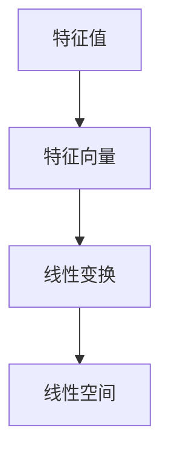

                 

### 线性代数导引：对偶空间 L1(V,F)

关键词：线性代数、对偶空间、L1(V,F)、线性映射、特征值、特征向量、科学计算、优化问题、信号处理

摘要：
本文旨在系统地介绍线性代数中的对偶空间概念及其在L1(V,F)空间中的应用。文章首先回顾了线性空间与线性映射的基础知识，随后深入探讨了矩阵与行列式、特征值与特征向量等核心概念。在此基础上，文章重点介绍了对偶空间的基本性质及其与L1(V,F)空间的紧密联系。通过具体实例和伪代码，详细解释了对偶空间与L1(V,F)空间在优化问题和信号处理中的应用。最后，文章总结线性代数在科学计算中的重要性，并提供了相关的学习资源和实例分析，帮助读者更好地理解线性代数的核心理论和应用。

---

### 《线性代数导引：对偶空间 L1(V,F）》目录大纲

为了帮助读者更好地理解线性代数中的对偶空间和L1(V,F)空间，本文将按照以下结构展开：

#### 第一部分：线性代数基础

- **第1章：线性空间与线性映射**  
  - 1.1 线性空间的基本概念  
  - 1.2 线性映射  
  - 1.3 线性映射的核与像

- **第2章：矩阵与行列式**  
  - 2.1 矩阵的基本概念  
  - 2.2 行列式

- **第3章：特征值与特征向量**  
  - 3.1 特征值与特征向量的基本概念  
  - 3.2 特征值与特征向量的应用

#### 第二部分：对偶空间与 L1(V,F)

- **第4章：对偶空间**  
  - 4.1 对偶空间的基本概念  
  - 4.2 对偶线性映射

- **第5章：L1(V,F)空间**  
  - 5.1 L1(V,F)空间的基本概念  
  - 5.2 L1(V,F)空间的线性映射

#### 第三部分：应用

- **第6章：对偶空间与 L1(V,F)空间的应用**  
  - 6.1 对偶空间与 L1(V,F)空间在优化问题中的应用  
  - 6.2 对偶空间与 L1(V,F)空间在信号处理中的应用

- **第7章：线性代数在科学计算中的应用**  
  - 7.1 线性代数在科学计算中的作用  
  - 7.2 线性代数在科学计算中的实例分析

#### 附录

- **附录 A：线性代数常用符号与公式**  
- **附录 B：线性代数学习资源推荐**

通过以上结构，读者可以逐步深入理解线性代数的基本概念、对偶空间和L1(V,F)空间的定义与应用，以及线性代数在科学计算和信号处理中的重要角色。

---

#### 第一部分：线性代数基础

### 第1章：线性空间与线性映射

#### 1.1 线性空间的基本概念

线性空间是线性代数中最基础的概念之一，它定义了一个集合上的运算方式，使得我们可以研究向量、矩阵以及其他数学对象之间的关系。在线性空间中，我们主要关注向量的加法和标量乘法。

**定义**：设V是一个集合，F是一个域，则V上的一个线性结构（或称线性空间）是指一个二元运算，即向量加法\((+)\)和标量乘法\(\cdot\)，它们满足以下性质：

1. 封闭性：对于任意的\( \vec{v_1}, \vec{v_2} \in V \)，有 \( \vec{v_1} + \vec{v_2} \in V \)；
2. 结合律：对于任意的\( \vec{v_1}, \vec{v_2}, \vec{v_3} \in V \)，有 \( (\vec{v_1} + \vec{v_2}) + \vec{v_3} = \vec{v_1} + (\vec{v_2} + \vec{v_3}) \)；
3. 存在零向量：存在一个零向量\( \vec{0} \)，使得对于任意的\( \vec{v} \in V \)，有 \( \vec{v} + \vec{0} = \vec{v} \)；
4. 存在加法逆元：对于任意的\( \vec{v} \in V \)，存在一个向量\( -\vec{v} \)，使得 \( \vec{v} + (-\vec{v}) = \vec{0} \)；
5. 分配律：对于任意的\( \vec{v}, \vec{w} \in V \)和标量\( \alpha, \beta \in F \)，有 \( \alpha(\vec{v} + \vec{w}) = \alpha\vec{v} + \alpha\vec{w} \) 和 \( (\alpha + \beta)\vec{v} = \alpha\vec{v} + \beta\vec{v} \)；
6. 符合分配律：对于任意的\( \vec{v} \in V \)和标量\( \alpha, \beta \in F \)，有 \( \alpha(\beta\vec{v}) = (\alpha\beta)\vec{v} \)。

**示例**：设\( \mathbb{R}^n \)是n维实数向量空间，则\( \mathbb{R}^n \)上的向量加法和标量乘法构成一个线性空间。

#### 1.1.1 线性空间的定义与性质

从定义可以看出，线性空间的核心是向量加法和标量乘法。向量加法是一种结合两个向量生成一个新的向量的操作，而标量乘法是一种将标量与向量相乘得到新的向量的操作。线性空间的性质包括：

1. 封闭性：线性空间中的向量加法和标量乘法结果仍然在同一个线性空间中，这意味着线性空间是一个封闭的集合。
2. 结合律：向量加法满足结合律，这意味着无论怎么加，结果都是相同的。
3. 零向量和加法逆元的存在：线性空间中存在一个零向量，使得任何向量加上它都还是原来的向量，同时每个向量都有加法逆元，使得向量与其加法逆元相加结果为零向量。
4. 分配律：标量乘法与向量加法之间满足分配律，这意味着我们可以将标量乘法与向量加法组合在一起进行。

#### 1.1.2 线性空间的基与维数

在线性空间中，基和维数是非常重要的概念。基是指能够生成线性空间中所有向量的最小向量集合，而维数是指基中向量的数量。

**定义**：设\( \{ \vec{v_1}, \vec{v_2}, ..., \vec{v_n} \} \)是线性空间\( V \)的一个基，如果对于任意的\( \vec{v} \in V \)，都存在一组唯一的实数\( \alpha_1, \alpha_2, ..., \alpha_n \)，使得\( \vec{v} = \alpha_1\vec{v_1} + \alpha_2\vec{v_2} + ... + \alpha_n\vec{v_n} \)，则称\( \{ \vec{v_1}, \vec{v_2}, ..., \vec{v_n} \} \)为\( V \)的一组基。

**维数**：线性空间的维数是指其基中向量的数量。如果线性空间有一个基\( \{ \vec{v_1}, \vec{v_2}, ..., \vec{v_n} \} \)，则该线性空间的维数为\( n \)。

#### 1.1.3 线性空间的运算规则

线性空间的运算规则主要包括向量加法和标量乘法。向量加法规则如下：

1. 封闭性：设\( \vec{v_1}, \vec{v_2} \in V \)，则\( \vec{v_1} + \vec{v_2} \in V \)；
2. 结合律：设\( \vec{v_1}, \vec{v_2}, \vec{v_3} \in V \)，则\( (\vec{v_1} + \vec{v_2}) + \vec{v_3} = \vec{v_1} + (\vec{v_2} + \vec{v_3}) \)；
3. 零元素：存在零向量\( \vec{0} \)，使得\( \vec{v} + \vec{0} = \vec{v} \)；
4. 加法逆元：对于任意\( \vec{v} \in V \)，存在\( -\vec{v} \)，使得\( \vec{v} + (-\vec{v}) = \vec{0} \)。

标量乘法规则如下：

1. 封闭性：设\( \vec{v} \in V \)，\( \alpha \in F \)，则\( \alpha\vec{v} \in V \)；
2. 结合律：设\( \vec{v} \in V \)，\( \alpha, \beta \in F \)，则\( \alpha(\beta\vec{v}) = (\alpha\beta)\vec{v} \)；
3. 分配律：设\( \vec{v_1}, \vec{v_2} \in V \)，\( \alpha, \beta \in F \)，则\( \alpha(\vec{v_1} + \vec{v_2}) = \alpha\vec{v_1} + \alpha\vec{v_2} \) 和 \( (\alpha + \beta)\vec{v} = \alpha\vec{v} + \beta\vec{v} \)。

#### 1.2 线性映射

线性映射（线性变换）是线性代数中的另一个核心概念，它描述了从线性空间到另一个线性空间的函数关系。线性映射保持线性结构，使得我们可以研究不同线性空间之间的联系。

**定义**：设\( V \)和\( W \)是两个线性空间，\( T: V \rightarrow W \)是一个函数，如果对于任意的\( \vec{v_1}, \vec{v_2} \in V \)和标量\( \alpha, \beta \in F \)，都有：

1. \( T(\vec{v_1} + \vec{v_2}) = T(\vec{v_1}) + T(\vec{v_2}) \)；
2. \( T(\alpha\vec{v}) = \alpha T(\vec{v}) \)。

则称\( T \)为\( V \)到\( W \)的一个线性映射。

**示例**：设\( V = \mathbb{R}^2 \)和\( W = \mathbb{R}^3 \)，定义\( T: V \rightarrow W \)为\( T(\vec{x}, \vec{y}) = (\vec{x}, \vec{y}, \vec{0}) \)，则\( T \)是一个线性映射。

#### 1.2.1 线性映射的定义与性质

线性映射的定义涉及向量的加法和标量乘法。根据定义，线性映射具有以下性质：

1. **加法保持性**：线性映射保持向量的加法，即对于任意的\( \vec{v_1}, \vec{v_2} \in V \)，有\( T(\vec{v_1} + \vec{v_2}) = T(\vec{v_1}) + T(\vec{v_2}) \)；
2. **标量乘法保持性**：线性映射保持标量与向量的乘法，即对于任意的\( \vec{v} \in V \)和标量\( \alpha \in F \)，有\( T(\alpha\vec{v}) = \alpha T(\vec{v}) \)；
3. **零向量保持性**：线性映射保持零向量，即\( T(\vec{0}) = \vec{0} \)；
4. **加法逆元保持性**：线性映射保持向量的加法逆元，即对于任意的\( \vec{v} \in V \)，有\( T(-\vec{v}) = -T(\vec{v}) \)。

#### 1.2.2 线性映射的表示与运算

线性映射可以通过矩阵表示。设\( V \)和\( W \)的基分别为\( \{ \vec{v_1}, \vec{v_2} \} \)和\( \{ \vec{w_1}, \vec{w_2} \} \)，则线性映射\( T: V \rightarrow W \)可以表示为一个\( 2 \times 2 \)矩阵\( A \)，使得：

$$
T(\vec{v_1}) = \vec{w_1}, \quad T(\vec{v_2}) = \vec{w_2}
$$

$$
A = \begin{bmatrix}
w_{11} & w_{12} \\
w_{21} & w_{22}
\end{bmatrix}
$$

矩阵\( A \)的列向量分别为\( T(\vec{v_1}) \)和\( T(\vec{v_2}) \)。

线性映射的运算包括矩阵的乘法和逆运算。设\( T_1: V \rightarrow W \)和\( T_2: W \rightarrow Z \)是两个线性映射，则它们的复合映射\( T_2 \circ T_1: V \rightarrow Z \)可以通过矩阵乘法表示：

$$
[T_2 \circ T_1](\vec{v}) = T_2(T_1(\vec{v})) = A_2A_1\vec{v}
$$

其中\( A_1 \)和\( A_2 \)分别是\( T_1 \)和\( T_2 \)的矩阵表示。

线性映射的逆映射可以通过求解矩阵的逆得到。设\( T: V \rightarrow W \)是一个线性映射，其矩阵表示为\( A \)，如果\( A \)可逆，则\( T \)的逆映射\( T^{-1}: W \rightarrow V \)可以通过矩阵\( A^{-1} \)表示：

$$
T^{-1}(\vec{w}) = A^{-1}\vec{w}
$$

#### 1.2.3 线性映射的核与像

线性映射的核（或称零空间）和像（或称值域）是线性映射的重要性质。

**定义**：设\( T: V \rightarrow W \)是一个线性映射，则\( T \)的核（或称零空间）\( \text{Ker}(T) \)是指所有映射到零向量的向量集合，即：

$$
\text{Ker}(T) = \{ \vec{v} \in V \mid T(\vec{v}) = \vec{0} \}
$$

\( T \)的像（或称值域）\( \text{Im}(T) \)是指\( T \)的输出向量集合，即：

$$
\text{Im}(T) = \{ T(\vec{v}) \mid \vec{v} \in V \}
$$

**性质**：

1. **核与零向量的关系**：\( T \)的核必然包含零向量，即\( \vec{0} \in \text{Ker}(T) \)；
2. **核与线性无关的关系**：如果\( \text{Ker}(T) = \{ \vec{0} \} \)，则\( T \)是一个单射（即每个输入向量对应唯一的输出向量）；
3. **像与线性相关的对应关系**：如果\( \text{Im}(T) = W \)，则\( T \)是一个满射（即每个输出向量都有至少一个输入向量对应）；
4. **维数的关系**：根据秩-零化度定理，\( \dim(\text{Ker}(T)) + \dim(\text{Im}(T)) = \dim(V) \)。

通过以上内容，我们了解了线性空间和线性映射的基础概念及其性质。接下来，我们将继续探讨矩阵与行列式、特征值与特征向量等核心概念，进一步深入线性代数的世界。

---

### 第2章：矩阵与行列式

#### 2.1 矩阵的基本概念

矩阵是线性代数中一个非常重要的工具，它用于表示线性映射和系统。矩阵的引入使得复杂的线性运算变得简洁明了。

**定义**：设\( m \)和\( n \)为正整数，\( a_{ij} \)为实数（或复数），则由\( m \)行\( n \)列的元素\( a_{ij} \)组成的矩形数组称为一个\( m \times n \)矩阵，记作\( A = (a_{ij}) \)或\( A = [a_{ij}] \)。其中，\( i \)表示行号，从1到\( m \)；\( j \)表示列号，从1到\( n \)。

**示例**：

$$
A = \begin{bmatrix}
1 & 2 & 3 \\
4 & 5 & 6 \\
7 & 8 & 9
\end{bmatrix}
$$

这是一个\( 3 \times 3 \)的矩阵。

**矩阵的运算规则**：

1. **矩阵的加法**：两个\( m \times n \)矩阵\( A \)和\( B \)相加，结果是一个\( m \times n \)矩阵，其元素为\( A \)和\( B \)对应元素的加和。即：

$$
A + B = \begin{bmatrix}
a_{11} + b_{11} & a_{12} + b_{12} & ... & a_{1n} + b_{1n} \\
a_{21} + b_{21} & a_{22} + b_{22} & ... & a_{2n} + b_{2n} \\
... & ... & ... & ... \\
a_{m1} + b_{m1} & a_{m2} + b_{m2} & ... & a_{mn} + b_{mn}
\end{bmatrix}
$$

2. **矩阵的数乘**：一个\( m \times n \)矩阵\( A \)与一个标量\( k \)相乘，结果是一个\( m \times n \)矩阵，其元素为\( A \)的每个元素乘以\( k \)。即：

$$
kA = \begin{bmatrix}
ka_{11} & ka_{12} & ... & ka_{1n} \\
ka_{21} & ka_{22} & ... & ka_{2n} \\
... & ... & ... & ... \\
ka_{m1} & ka_{m2} & ... & ka_{mn}
\end{bmatrix}
$$

3. **矩阵的乘法**：两个矩阵\( A \)和\( B \)相乘，结果是一个\( m \times p \)矩阵，其中\( p \)为\( B \)的列数。乘积的元素\( (i, j) \)为\( A \)的第\( i \)行与\( B \)的第\( j \)列的对应元素的内积。即：

$$
AB = \begin{bmatrix}
\sum_{k=1}^{n} a_{ik}b_{kj} & \sum_{k=1}^{n} a_{i1}b_{k1} & ... & \sum_{k=1}^{n} a_{in}b_{kn} \\
... & ... & ... & ... \\
\sum_{k=1}^{n} a_{m1}b_{k1} & \sum_{k=1}^{n} a_{m2}b_{k2} & ... & \sum_{k=1}^{n} a_{mn}b_{kn}
\end{bmatrix}
$$

**矩阵的秩**：矩阵的秩是指矩阵行空间和列空间的最大维数。即：

$$
\text{rank}(A) = \max\{ \dim(\text{row}(A)), \dim(\text{col}(A)) \}
$$

**矩阵的初等变换**：初等变换包括行交换、行乘以标量和行加上另一个行的倍数。初等变换不会改变矩阵的秩。

#### 2.1.2 矩阵的运算规则

矩阵的运算规则主要包括矩阵的加法、数乘和乘法。下面将详细解释这些运算规则。

**矩阵的加法**：

设\( A \)和\( B \)都是\( m \times n \)的矩阵，则它们的和\( A + B \)也是一个\( m \times n \)的矩阵。矩阵的加法规则如下：

- 对于任意\( i \)和\( j \)，有\( (A + B)_{ij} = A_{ij} + B_{ij} \)。

这意味着，矩阵\( A \)和\( B \)对应位置上的元素相加，得到矩阵\( A + B \)的对应位置的元素。

**矩阵的数乘**：

设\( A \)是一个\( m \times n \)的矩阵，\( k \)是一个标量，则\( kA \)也是一个\( m \times n \)的矩阵。矩阵的数乘规则如下：

- 对于任意\( i \)和\( j \)，有\( (kA)_{ij} = k \cdot A_{ij} \)。

这意味着，矩阵\( A \)的每个元素都乘以标量\( k \)，得到矩阵\( kA \)的对应位置的元素。

**矩阵的乘法**：

设\( A \)是一个\( m \times p \)的矩阵，\( B \)是一个\( p \times n \)的矩阵，则它们的乘积\( AB \)是一个\( m \times n \)的矩阵。矩阵的乘法规则如下：

- 对于任意\( i \)和\( j \)，有\( (AB)_{ij} = \sum_{k=1}^{p} A_{ik}B_{kj} \)。

这意味着，矩阵\( A \)的第\( i \)行与矩阵\( B \)的第\( j \)列的对应元素的内积，得到矩阵\( AB \)的对应位置的元素。

**矩阵的秩**：

矩阵的秩是指矩阵行空间和列空间的最大维数。秩是一个重要的概念，它反映了矩阵的线性依赖情况。

- 如果一个矩阵的秩等于其行数，则该矩阵称为满秩矩阵；
- 如果一个矩阵的秩小于其行数，则该矩阵称为非满秩矩阵。

**矩阵的初等变换**：

初等变换包括行交换、行乘以标量和行加上另一个行的倍数。初等变换不会改变矩阵的秩。

- 行交换：交换矩阵的两行；
- 行乘以标量：将矩阵的某一行乘以一个非零标量；
- 行加上另一个行的倍数：将矩阵的某一行加上另一行的标量倍。

通过初等变换，我们可以简化矩阵的计算，或者将矩阵转化为更简单的形式。

#### 2.2 行列式

行列式是矩阵的一个重要属性，它用于描述矩阵的某些性质，如线性依赖和可逆性。

**定义**：设\( A \)是一个\( n \times n \)的矩阵，则行列式\( |A| \)是一个\( n \)阶行列式，其值为：

$$
|A| = \sum_{\sigma \in S_n} (-1)^{\sigma} a_{1\sigma(1)}a_{2\sigma(2)}...a_{n\sigma(n)}
$$

其中，\( S_n \)是所有\( n \)个数字的排列组成的集合，\( (-1)^{\sigma} \)称为逆序数，表示排列\( \sigma \)中的逆序对个数。

**性质**：

1. **行列式的值与矩阵的行（列）交换**：交换两行（列）会改变行列式的值，其值变为原来的相反数；
2. **行列式的值与矩阵的行（列）乘以标量**：行列式的值会乘以该标量的幂次；
3. **行列式的值与矩阵的行（列）线性组合**：行列式的值保持不变；
4. **行列式的值与矩阵的秩**：行列式的值等于矩阵的秩；
5. **行列式的值与矩阵的逆**：矩阵的行列式值等于其逆矩阵的行列式值的相反数。

#### 2.2.2 行列式的计算方法

计算行列式的方法有很多，其中最常用的方法是拉普拉斯展开。

**拉普拉斯展开**：

设\( A \)是一个\( n \times n \)的矩阵，任选一行（或列），将该行的每个元素与其对应的代数余子式相乘，再将乘积相加，即可得到行列式的值。

**示例**：

$$
A = \begin{bmatrix}
1 & 2 & 3 \\
4 & 5 & 6 \\
7 & 8 & 9
\end{bmatrix}
$$

取第1行进行拉普拉斯展开：

$$
|A| = 1 \cdot (-1)^{1+1} \cdot |A_{11}| + 2 \cdot (-1)^{1+2} \cdot |A_{12}| + 3 \cdot (-1)^{1+3} \cdot |A_{13}|
$$

其中，\( |A_{ij}| \)表示去掉\( A \)的第\( i \)行和第\( j \)列后的子矩阵的行列式。

通过拉普拉斯展开，我们可以计算任意\( n \times n \)矩阵的行列式。

#### 2.2.3 行列式在矩阵理论中的应用

行列式在矩阵理论中具有重要作用，它用于判断矩阵的可逆性和解线性方程组。

**判断矩阵的可逆性**：

一个\( n \times n \)的矩阵\( A \)是可逆的，当且仅当其行列式\( |A| \)不等于零。如果\( |A| = 0 \)，则\( A \)是不可逆的。

**解线性方程组**：

给定一个\( n \times n \)的线性方程组：

$$
Ax = b
$$

其中，\( A \)是一个可逆矩阵，\( x \)是未知向量，\( b \)是已知向量。解这个方程组的方法是将方程两边同时乘以\( A^{-1} \)：

$$
x = A^{-1}b
$$

其中，\( A^{-1} \)是\( A \)的逆矩阵。通过计算\( A \)的行列式，我们可以判断\( A \)是否可逆，进而求解线性方程组。

通过以上内容，我们了解了矩阵与行列式的基本概念及其在矩阵理论中的应用。接下来，我们将继续探讨特征值与特征向量等核心概念，进一步深入线性代数的领域。

---

### 第3章：特征值与特征向量

#### 3.1 特征值与特征向量的基本概念

特征值与特征向量是线性代数中非常重要的概念，它们在解决各种实际问题中具有重要作用。特征值与特征向量描述了一个线性变换（线性映射）在特定向量上的性质，即该向量在变换下保持不变或方向不变。

**定义**：设\( A \)是一个\( n \times n \)的矩阵，\( \lambda \)是一个标量，如果存在一个非零向量\( \vec{v} \)，使得\( A\vec{v} = \lambda\vec{v} \)，则称\( \lambda \)为\( A \)的一个特征值，\( \vec{v} \)为\( A \)对应于特征值\( \lambda \)的特征向量。

**示例**：

设\( A \)是一个\( 3 \times 3 \)的矩阵：

$$
A = \begin{bmatrix}
2 & 1 & 0 \\
0 & 2 & 1 \\
0 & 0 & 2
\end{bmatrix}
$$

则\( \lambda = 2 \)是\( A \)的一个特征值，对应的特征向量可以是\( \vec{v} = \begin{bmatrix}
1 \\
0 \\
0
\end{bmatrix} \)。

**性质**：

1. **特征值与特征向量的关系**：特征向量是线性变换下的不变向量，而特征值是线性变换下的缩放因子。对于任意特征值\( \lambda \)和对应特征向量\( \vec{v} \)，有\( A\vec{v} = \lambda\vec{v} \)；
2. **特征值的唯一性**：一个矩阵的特征值是唯一的，即如果两个矩阵有相同的特征值，则它们是相似的；
3. **特征向量的线性无关性**：特征向量是线性无关的，即对于任意不同的特征值\( \lambda_1 \)和\( \lambda_2 \)，其对应的特征向量\( \vec{v_1} \)和\( \vec{v_2} \)线性无关；
4. **特征值的代数重数与几何重数**：特征值的代数重数是指特征值在特征多项式中的重数，而几何重数是指对应特征值的线性无关的特征向量个数。对于任一特征值\( \lambda \)，其几何重数不超过代数重数。

#### 3.1.2 特征值的性质与特征向量的关系

特征值和特征向量之间的关系是线性代数中的重要性质，以下是对这些性质的具体说明：

1. **特征值的性质**：

   - **唯一性**：一个矩阵的特征值是唯一的。这是因为特征值是特征多项式的根，而特征多项式是唯一的。

   - **非负性**：特征值的绝对值是非负的。这是因为特征值是矩阵的谱半径，而谱半径是非负的。

   - **实数性**：实对称矩阵的特征值是实数。这是因为实对称矩阵的对角化可以表示为相似矩阵，而相似矩阵的特征值是相等的。

2. **特征向量的性质**：

   - **线性无关性**：对于不同的特征值，其对应的特征向量线性无关。这是因为特征值是线性无关的，所以对应的特征向量也是线性无关的。

   - **规范性**：特征向量是规范化的，即每个特征向量都可以被归一化，使得其范数为1。这是因为特征向量可以被缩放，而归一化可以保持线性无关性。

   - **可逆性**：如果矩阵\( A \)有非零的特征值，则\( A \)是可逆的。这是因为特征向量构成了\( A \)的基，而可逆矩阵的基必须是线性无关的。

3. **特征值与特征向量的关系**：

   - **唯一性**：给定一个特征值\( \lambda \)，存在唯一的一个特征向量\( \vec{v} \)与之对应。

   - **对应关系**：对于每个特征值，其对应的特征向量是线性无关的。这意味着特征向量不能同时为零向量。

   - **缩放性**：如果矩阵\( A \)有一个特征值\( \lambda \)和对应特征向量\( \vec{v} \)，则任何非零标量\( k \)乘以\( \vec{v} \)仍然是\( A \)的特征向量，对应特征值仍然是\( \lambda \)。

   - **变换性**：如果矩阵\( A \)有一个特征值\( \lambda \)和对应特征向量\( \vec{v} \)，则对于任意线性映射\( T \)，\( T(A)\vec{v} = T(\lambda)\vec{v} \)。这意味着特征值和特征向量在相似变换下保持不变。

通过上述性质，我们可以更好地理解特征值和特征向量在矩阵理论中的重要性，以及它们在解决实际问题时如何发挥作用。

#### 3.1.3 特征值的计算方法

计算矩阵的特征值是线性代数中的一个基本问题，以下将介绍两种常用的方法：特征多项式法和迭代法。

**特征多项式法**

特征多项式法是计算特征值的最基本方法。其基本步骤如下：

1. **计算特征多项式**：给定矩阵\( A \)，计算其特征多项式\( f(\lambda) = \det(A - \lambda I) \)，其中\( I \)是单位矩阵。

2. **求解特征多项式**：求解方程\( f(\lambda) = 0 \)，得到矩阵\( A \)的特征值\( \lambda \)。

3. **验证特征值**：对于每个求得的特征值\( \lambda \)，计算对应的特征向量，验证\( A\vec{v} = \lambda\vec{v} \)是否成立。

**示例**：

设矩阵\( A \)如下：

$$
A = \begin{bmatrix}
2 & 1 & 0 \\
0 & 2 & 1 \\
0 & 0 & 2
\end{bmatrix}
$$

计算其特征多项式：

$$
f(\lambda) = \det(A - \lambda I) = \det\begin{bmatrix}
2 - \lambda & 1 & 0 \\
0 & 2 - \lambda & 1 \\
0 & 0 & 2 - \lambda
\end{bmatrix}
$$

展开行列式，得到：

$$
f(\lambda) = (2 - \lambda)(2 - \lambda)(2 - \lambda) = (\lambda - 2)^3
$$

求解\( f(\lambda) = 0 \)，得到特征值\( \lambda = 2 \)。

**迭代法**

迭代法是一种计算特征值的高效方法，特别是对于大型稀疏矩阵。其基本步骤如下：

1. **选择初始向量**：选择一个非零初始向量\( \vec{v}_0 \)。

2. **迭代计算**：对每个迭代步骤\( k \)，计算新的向量\( \vec{v}_k \)：

   $$  
   \vec{v}_{k+1} = A\vec{v}_k  
   $$

3. **计算特征值**：通过计算向量\( \vec{v}_k \)的范数，得到特征值：

   $$  
   \lambda = \frac{\|\vec{v}_{k+1}\|}{\|\vec{v}_k\|}  
   $$

4. **收敛性判断**：判断迭代过程是否收敛。如果收敛，则得到特征值\( \lambda \)；否则，继续迭代。

**示例**：

设矩阵\( A \)如下：

$$
A = \begin{bmatrix}
2 & 1 & 0 \\
0 & 2 & 1 \\
0 & 0 & 2
\end{bmatrix}
$$

选择初始向量\( \vec{v}_0 = \begin{bmatrix}
1 \\
0 \\
0
\end{bmatrix} \)，进行迭代计算：

$$
\vec{v}_1 = A\vec{v}_0 = \begin{bmatrix}
2 \\
0 \\
0
\end{bmatrix}
$$

$$
\vec{v}_2 = A\vec{v}_1 = \begin{bmatrix}
4 \\
0 \\
0
\end{bmatrix}
$$

$$
\vec{v}_3 = A\vec{v}_2 = \begin{bmatrix}
8 \\
0 \\
0
\end{bmatrix}
$$

计算特征值：

$$
\lambda = \frac{\|\vec{v}_3\|}{\|\vec{v}_2\|} = \frac{8}{4} = 2
$$

通过迭代法计算得到特征值\( \lambda = 2 \)。

通过上述两种方法，我们可以计算矩阵的特征值，进一步研究矩阵的性质和结构。

---

#### 3.2 特征值与特征向量的应用

特征值与特征向量的计算在许多实际应用中具有重要意义，尤其在物理学、工程学和计算机科学等领域。以下将详细探讨特征值与特征向量在不同领域中的应用。

**3.2.1 特征值与特征向量的几何意义**

在数学和物理学中，特征值和特征向量通常具有几何意义。具体而言：

- **特征值**表示一个线性变换（或矩阵）对向量的缩放因子。例如，在一个二维平面中，线性变换可以表示为旋转、缩放或反射。特征值正是描述这些变换对向量长度的缩放效果。
- **特征向量**表示在给定线性变换下保持方向不变的向量。例如，在旋转操作中，特征向量指向不变的方向。

**3.2.2 特征值与特征向量的计算方法**

计算特征值和特征向量的方法主要包括以下几种：

1. **特征多项式法**：这是最基本的方法，通过计算矩阵的特征多项式并求解特征多项式的根，得到特征值。然后，通过将特征向量代入矩阵等于特征值的方程中，求解得到特征向量。

2. **迭代法**：对于大型稀疏矩阵，特征多项式法可能效率较低。此时，可以采用迭代法，如幂法、逆幂法和QR算法等。这些算法通过迭代矩阵与向量的乘积，逐步逼近特征值和特征向量。

3. **数值方法**：在实际应用中，特征值和特征向量的计算往往涉及数值方法，如Jacobi方法、Householder方法等。这些方法通过迭代优化，逐步逼近精确解。

**3.2.3 特征值与特征向量在实际问题中的应用**

以下将介绍特征值与特征向量在不同实际应用中的具体应用：

1. **信号处理**：

   在信号处理中，特征值和特征向量用于分析信号的频率成分和能量分布。例如，离散傅里叶变换（DFT）利用特征值和特征向量将信号从时域转换为频域，从而实现信号的分析和压缩。

2. **图像处理**：

   在图像处理中，特征值和特征向量用于图像的压缩和特征提取。例如，主成分分析（PCA）利用特征值和特征向量将高维图像数据转换为低维特征向量，从而实现图像的降维和特征提取。

3. **物理系统分析**：

   在物理系统中，特征值和特征向量用于分析系统的振动特性和稳定性。例如，在机械结构分析中，特征值和特征向量用于计算结构的固有频率和振型，从而判断结构的稳定性。

4. **优化问题**：

   在优化问题中，特征值和特征向量用于求解线性规划和最优化问题。例如，Kuhn-Tucker条件利用特征值和特征向量求解线性规划和非线性规划问题。

5. **统计学习**：

   在统计学习中，特征值和特征向量用于特征选择和降维。例如，线性判别分析（LDA）利用特征值和特征向量将高维数据转换为低维数据，从而实现数据的分类和回归。

**示例**：

假设我们有一个\( 2 \times 2 \)的矩阵\( A \)：

$$
A = \begin{bmatrix}
2 & 1 \\
1 & 2
\end{bmatrix}
$$

我们首先计算其特征值：

$$
\det(A - \lambda I) = \det\begin{bmatrix}
2 - \lambda & 1 \\
1 & 2 - \lambda
\end{bmatrix} = (2 - \lambda)^2 - 1 = \lambda^2 - 4\lambda + 3 = 0
$$

求解上述方程，得到特征值\( \lambda_1 = 1 \)和\( \lambda_2 = 3 \)。

然后，我们计算对应的特征向量。对于\( \lambda_1 = 1 \)，解方程\( (A - \lambda_1 I)\vec{v} = 0 \)：

$$
\begin{bmatrix}
1 & 1 \\
1 & 1
\end{bmatrix}\vec{v} = 0
$$

得到特征向量\( \vec{v}_1 = \begin{bmatrix}
1 \\
-1
\end{bmatrix} \)。

对于\( \lambda_2 = 3 \)，解方程\( (A - \lambda_2 I)\vec{v} = 0 \)：

$$
\begin{bmatrix}
-1 & 1 \\
1 & -1
\end{bmatrix}\vec{v} = 0
$$

得到特征向量\( \vec{v}_2 = \begin{bmatrix}
1 \\
1
\end{bmatrix} \)。

因此，矩阵\( A \)的特征值为\( \lambda_1 = 1 \)和\( \lambda_2 = 3 \)，对应的特征向量分别为\( \vec{v}_1 = \begin{bmatrix}
1 \\
-1
\end{bmatrix} \)和\( \vec{v}_2 = \begin{bmatrix}
1 \\
1
\end{bmatrix} \)。

通过以上示例，我们可以看到如何计算矩阵的特征值和特征向量，并了解它们在不同实际应用中的重要性。

---

#### 第二部分：对偶空间与 L1(V,F)

### 第4章：对偶空间

对偶空间是线性代数中的一个重要概念，它扩展了线性空间的理论，使得我们可以更好地理解不同线性空间之间的联系。对偶空间与原始空间具有对称性，通过对偶空间的性质，我们可以更深入地探讨线性代数的基本问题。

#### 4.1 对偶空间的基本概念

对偶空间是指一个线性空间\( V \)的对偶空间\( V^* \)，它由所有从\( V \)到域\( F \)的线性映射组成。对偶空间中的每个元素称为一个对偶线性映射，它可以看作是\( V \)上的一个标量积。

**定义**：设\( V \)是一个线性空间，\( V^* \)是其对偶空间，即\( V^* = \{ \vec{f} | \vec{f}: V \rightarrow F \} \)，其中\( \vec{f} \)是一个线性映射，满足以下性质：

1. \( \vec{f} \)是线性的，即对于任意的\( \vec{v_1}, \vec{v_2} \in V \)和标量\( \alpha, \beta \in F \)，有\( \vec{f}(\alpha\vec{v_1} + \beta\vec{v_2}) = \alpha\vec{f}(\vec{v_1}) + \beta\vec{f}(\vec{v_2}) \)；
2. \( \vec{f} \)是一个函数，即对于任意的\( \vec{v} \in V \)，有唯一的\( f(\vec{v}) \in F \)。

**示例**：设\( V = \mathbb{R}^2 \)，则对偶空间\( V^* \)由所有从\( \mathbb{R}^2 \)到\( \mathbb{R} \)的线性映射组成。例如，函数\( \vec{f}(\vec{v}) = \vec{v}_1 + \vec{v}_2 \)是一个对偶线性映射。

#### 4.1.1 对偶空间的性质

对偶空间具有以下性质：

1. **对偶空间的维数与原空间的维数相等**：设\( V \)的维数为\( n \)，则\( V^* \)的维数也为\( n \)。这意味着对偶空间中的线性映射数量与原空间中的向量数量相等。
2. **对偶空间的基与原空间的基是正交的**：设\( V \)的一个基为\( \{ \vec{v_1}, \vec{v_2}, ..., \vec{v_n} \} \)，则\( V^* \)的基为\( \{ \vec{f_1}, \vec{f_2}, ..., \vec{f_n} \} \)，其中\( \vec{f_i}(\vec{v_j}) = \delta_{ij} \)（\( \delta_{ij} \)是Kronecker delta）。
3. **对偶空间的线性映射与原空间的向量之间存在一一对应关系**：对于任意的\( \vec{v} \in V \)和\( \vec{f} \in V^* \)，存在一个唯一的线性映射\( \vec{g} \in V^* \)，使得\( \vec{g}(\vec{v}) = \vec{f}(\vec{v}) \)。

#### 4.1.2 对偶空间的基与维数

对偶空间的基与原空间的基是正交的，且维数相等。设\( V \)的维数为\( n \)，则\( V \)的一个基为\( \{ \vec{v_1}, \vec{v_2}, ..., \vec{v_n} \} \)，则\( V^* \)的基为\( \{ \vec{f_1}, \vec{f_2}, ..., \vec{f_n} \} \)，其中\( \vec{f_i}(\vec{v_j}) = \delta_{ij} \)。

#### 4.1.3 对偶空间的基本运算

对偶空间中的基本运算包括线性映射的加法和数乘。设\( \vec{f_1}, \vec{f_2} \in V^* \)和标量\( \alpha, \beta \in F \)，则：

1. **线性映射的加法**：\( \vec{f_1} + \vec{f_2} \)也是一个线性映射，满足\( (\vec{f_1} + \vec{f_2})(\vec{v}) = \vec{f_1}(\vec{v}) + \vec{f_2}(\vec{v}) \)；
2. **数乘**：\( \alpha\vec{f} \)也是一个线性映射，满足\( (\alpha\vec{f})(\vec{v}) = \alpha(\vec{f}(\vec{v})) \)。

#### 4.2 对偶线性映射

对偶线性映射是原空间的线性映射与对偶空间的线性映射之间的关系。它定义了一个从原空间到对偶空间的映射，使得我们可以研究不同线性空间之间的联系。

**定义**：设\( V \)是一个线性空间，\( V^* \)是其对偶空间，则对偶线性映射是一个函数\( \vec{g}: V \rightarrow V^* \)，满足以下性质：

1. \( \vec{g} \)是线性的，即对于任意的\( \vec{v_1}, \vec{v_2} \in V \)和标量\( \alpha, \beta \in F \)，有\( \vec{g}(\alpha\vec{v_1} + \beta\vec{v_2}) = \alpha\vec{g}(\vec{v_1}) + \beta\vec{g}(\vec{v_2}) \)；
2. \( \vec{g} \)是一个函数，即对于任意的\( \vec{v} \in V \)，有唯一的\( g(\vec{v}) \in V^* \)。

**示例**：设\( V = \mathbb{R}^2 \)，则对偶线性映射\( \vec{g}: \mathbb{R}^2 \rightarrow \mathbb{R} \)可以表示为\( \vec{g}(\vec{v}) = \vec{v}_1 + \vec{v}_2 \)。

#### 4.2.1 对偶线性映射的性质

对偶线性映射具有以下性质：

1. **线性的对偶性**：如果\( \vec{g} \)是一个对偶线性映射，则\( \vec{g}^T \)也是一个对偶线性映射，且\( (\vec{g}^T)(\vec{v}) = \vec{v}^T\vec{g} \)；
2. **对偶空间的基与原空间的基是正交的**：设\( V \)的一个基为\( \{ \vec{v_1}, \vec{v_2}, ..., \vec{v_n} \} \)，则对偶空间\( V^* \)的基为\( \{ \vec{f_1}, \vec{f_2}, ..., \vec{f_n} \} \)，其中\( \vec{f_i}(\vec{v_j}) = \delta_{ij} \)；
3. **对偶线性映射的维数与原空间的维数相等**：设\( V \)的维数为\( n \)，则对偶线性映射的维数也为\( n \)。

#### 4.2.2 对偶线性映射的计算

对偶线性映射的计算可以通过矩阵表示。设\( V \)的维数为\( n \)，则\( V \)的一个基为\( \{ \vec{v_1}, \vec{v_2}, ..., \vec{v_n} \} \)，则对偶线性映射\( \vec{g}: V \rightarrow V^* \)可以表示为一个\( n \times n \)矩阵\( G \)，使得：

$$
G\vec{v} = \vec{g}(\vec{v})
$$

其中，\( G \)的列向量分别为\( \vec{g}(\vec{v_1}), \vec{g}(\vec{v_2}), ..., \vec{g}(\vec{v_n}) \)。

#### 4.2.3 对偶线性映射的计算方法

计算对偶线性映射的方法主要包括以下几种：

1. **直接计算**：直接计算对偶线性映射的矩阵表示，即通过计算\( \vec{g}(\vec{v}) \)的每个分量来得到对偶线性映射的矩阵表示。
2. **特征值法**：通过计算原空间\( V \)的特征值和特征向量，得到对偶线性映射的矩阵表示。
3. **迭代法**：通过迭代计算原空间\( V \)的线性映射，逐步逼近对偶线性映射。

通过以上内容，我们了解了对偶空间和对偶线性映射的基本概念、性质和计算方法。接下来，我们将进一步探讨L1(V,F)空间及其应用。

---

### 第5章：L1(V,F)空间

L1(V,F)空间是线性代数中的一个重要概念，它在优化问题和信号处理中具有广泛应用。L1(V,F)空间是指一组满足特定条件的向量集合，这些条件使得L1范数（即L1范数是指向量的每个分量的绝对值之和）在该空间中具有特殊性质。

#### 5.1 L1(V,F)空间的基本概念

L1(V,F)空间是指一个线性空间\( V \)上的L1范数空间，即所有满足以下条件的向量集合：

$$
L1(V,F) = \{ \vec{v} \in V \mid \|\vec{v}\|_1 < \epsilon \}
$$

其中，\( \|\vec{v}\|_1 \)表示向量的L1范数，\( \epsilon \)是一个给定的正数。

**示例**：设\( V = \mathbb{R}^2 \)，则L1(V,F)空间可以表示为：

$$
L1(V,F) = \{ \vec{v} = (v_1, v_2) \in \mathbb{R}^2 \mid |v_1| + |v_2| < \epsilon \}
$$

这是一个以原点为中心，半径为\( \epsilon \)的椭圆区域。

#### 5.1.1 L1(V,F)空间的基本性质

L1(V,F)空间具有以下基本性质：

1. **凸集**：L1(V,F)空间是一个凸集，即对于任意的两个向量\( \vec{v_1}, \vec{v_2} \in L1(V,F) \)和任意的\( \alpha \in [0, 1] \)，都有\( \alpha\vec{v_1} + (1-\alpha)\vec{v_2} \in L1(V,F) \)。
2. **闭集**：L1(V,F)空间是一个闭集，即对于任意的向量序列\( \{\vec{v_n}\} \)满足\( \|\vec{v_n}\|_1 \rightarrow 0 \)，都有\( \vec{v_n} \rightarrow \vec{0} \)。
3. **有限维**：L1(V,F)空间的维度与原空间\( V \)的维度相同。

#### 5.1.2 L1(V,F)空间的基与维数

设\( V \)的维数为\( n \)，则L1(V,F)空间的维数也为\( n \)。设\( V \)的一个基为\( \{ \vec{v_1}, \vec{v_2}, ..., \vec{v_n} \} \)，则L1(V,F)空间的一个基为\( \{ \vec{e_1}, \vec{e_2}, ..., \vec{e_n} \} \)，其中：

$$
\vec{e_i} = \begin{cases}
\vec{v_i}, & \text{if } \|\vec{v_i}\|_1 < \epsilon \\
0, & \text{otherwise}
\end{cases}
$$

#### 5.1.3 L1(V,F)空间的线性映射

L1(V,F)空间的线性映射是指从L1(V,F)空间到另一个线性空间\( W \)的映射，满足以下性质：

1. **线性性**：对于任意的\( \vec{v_1}, \vec{v_2} \in L1(V,F) \)和标量\( \alpha, \beta \in F \)，有\( L(\alpha\vec{v_1} + \beta\vec{v_2}) = \alpha L(\vec{v_1}) + \beta L(\vec{v_2}) \)；
2. **连续性**：对于任意的\( \vec{v} \in L1(V,F) \)，有\( L(\vec{v}) \)的范数\( \|\vec{v}\|_1 \)小于\( \epsilon \)。

#### 5.1.4 L1(V,F)空间的线性映射性质

L1(V,F)空间的线性映射具有以下性质：

1. **有界性**：对于任意的\( \vec{v} \in L1(V,F) \)，都有\( \|\vec{v}\|_1 \leq \epsilon \)，即L1范数的上界为\( \epsilon \)。
2. **保凸性**：L1(V,F)空间的线性映射保持凸性，即对于任意的\( \vec{v_1}, \vec{v_2} \in L1(V,F) \)和任意的\( \alpha \in [0, 1] \)，都有\( L(\alpha\vec{v_1} + (1-\alpha)\vec{v_2}) \in L1(V,F) \)。

#### 5.1.5 L1(V,F)空间的线性映射计算

计算L1(V,F)空间的线性映射可以通过矩阵表示。设\( V \)的维数为\( n \)，则L1(V,F)空间的一个基为\( \{ \vec{e_1}, \vec{e_2}, ..., \vec{e_n} \} \)，则L1(V,F)空间的线性映射\( L: L1(V,F) \rightarrow W \)可以表示为一个\( n \times n \)矩阵\( L \)，使得：

$$
L\vec{e_i} = \vec{w_i}
$$

其中，\( \vec{w_i} \in W \)。

#### 5.1.6 L1(V,F)空间的线性映射计算方法

计算L1(V,F)空间的线性映射的方法主要包括以下几种：

1. **直接计算**：直接计算线性映射的矩阵表示，即通过计算每个基向量的映射结果来得到线性映射的矩阵表示。
2. **特征值法**：通过计算L1范数的特征值和特征向量，得到线性映射的矩阵表示。
3. **迭代法**：通过迭代计算线性映射，逐步逼近精确解。

通过以上内容，我们了解了L1(V,F)空间的基本概念、性质和计算方法。接下来，我们将进一步探讨对偶空间与L1(V,F)空间的应用。

---

### 第6章：对偶空间与 L1(V,F)空间的应用

#### 6.1 对偶空间与 L1(V,F)空间在优化问题中的应用

对偶空间与L1(V,F)空间在优化问题中具有广泛应用，特别是在求解最优化问题时。本节将详细介绍对偶空间与L1(V,F)空间在优化问题中的应用，并探讨其求解方法。

#### 6.1.1 最优化问题的基本概念

最优化问题是一类重要的数学问题，它涉及到寻找函数在给定约束条件下的最优值。最优化问题通常可以表示为以下形式：

$$
\min_{\vec{x}} f(\vec{x}) \quad \text{subject to} \quad g_i(\vec{x}) \leq 0, \quad h_j(\vec{x}) = 0
$$

其中，\( f(\vec{x}) \)是目标函数，\( g_i(\vec{x}) \)和\( h_j(\vec{x}) \)是约束条件。最优化问题的目标是找到满足约束条件的最小值或最大值。

#### 6.1.2 对偶空间与 L1(V,F)空间在优化问题中的应用

对偶空间与L1(V,F)空间在优化问题中的应用主要体现在以下两个方面：

1. **对偶最优化问题**：对偶最优化问题是原最优化问题的一种等价形式，它通过引入对偶变量来描述原问题的最优性条件。对偶最优化问题的目标是最小化对偶函数，而不是原目标函数。对偶最优化问题的引入可以简化原问题的求解，并提供了更多的信息关于原问题的最优性。

2. **L1范数正则化**：在优化问题中，L1范数正则化是一种常用的方法，用于防止过拟合和增强模型的泛化能力。L1范数正则化通过在目标函数中引入L1范数项，使得模型在训练过程中自动减少参数的绝对值，从而避免过拟合。L1范数正则化在信号处理、图像识别和机器学习等领域具有广泛应用。

#### 6.1.3 对偶最优化问题的求解方法

对偶最优化问题的求解方法主要包括以下几种：

1. **拉格朗日乘数法**：拉格朗日乘数法是一种求解对偶最优化问题的常用方法。它通过引入拉格朗日乘子来构建一个新的优化问题，并通过迭代求解获得原问题的最优解。拉格朗日乘数法的求解步骤包括：

   - 构建拉格朗日函数：将原最优化问题的目标函数和约束条件相加，并引入拉格朗日乘子\( \lambda_i \)和\( \mu_j \)，得到拉格朗日函数；
   - 求解拉格朗日方程：求解拉格朗日函数关于\( \vec{x} \)、\( \lambda_i \)和\( \mu_j \)的偏导数等于零的方程组，得到对偶最优化问题的解；
   - 验证最优性条件：验证求解得到的最优解是否满足KKT条件，即对偶最优化问题的解满足拉格朗日函数的偏导数等于零，且拉格朗日乘子非负。

2. **内点法**：内点法是一种求解非线性优化问题的方法，它通过将优化问题转化为一个线性规划问题来求解。内点法的基本思想是在可行域内部找到一个最优解，并通过迭代逐步逼近该最优解。内点法的求解步骤包括：

   - 初始化：选择一个初始可行解，并确定一个正数\( \epsilon \)；
   - 迭代：通过迭代更新可行解，并逐步逼近最优解。每次迭代包括求解一个线性规划问题，并更新可行解；
   - 验证最优性条件：验证求解得到的最优解是否满足KKT条件，即对偶最优化问题的解满足拉格朗日函数的偏导数等于零，且拉格朗日乘子非负。

3. **序列二次规划法**：序列二次规划法是一种求解非线性优化问题的方法，它通过将优化问题转化为一个序列的二次规划问题来求解。序列二次规划法的基本思想是通过迭代求解每个二次规划问题，逐步逼近最优解。序列二次规划法的求解步骤包括：

   - 初始化：选择一个初始可行解，并确定一个正数\( \epsilon \)；
   - 迭代：通过迭代更新可行解，并逐步逼近最优解。每次迭代包括求解一个二次规划问题，并更新可行解；
   - 验证最优性条件：验证求解得到的最优解是否满足KKT条件，即对偶最优化问题的解满足拉格朗日函数的偏导数等于零，且拉格朗日乘子非负。

通过以上方法，我们可以求解对偶最优化问题，从而获得原最优化问题的最优解。

#### 6.1.4 L1范数正则化在优化问题中的应用

L1范数正则化在优化问题中的应用主要体现在以下两个方面：

1. **稀疏性**：L1范数正则化通过引入L1范数项，使得模型在训练过程中自动减少参数的绝对值，从而实现稀疏性。稀疏性可以有效地减少模型的参数数量，提高模型的解释性和泛化能力。在信号处理、图像识别和机器学习等领域，L1范数正则化被广泛应用于图像去噪、图像分割和特征提取等问题。

2. **防止过拟合**：L1范数正则化可以通过减少参数的绝对值，降低模型的复杂度，从而防止过拟合。过拟合是指模型在训练数据上表现良好，但在测试数据上表现不佳。通过引入L1范数正则化，我们可以降低模型的复杂度，提高模型的泛化能力，从而防止过拟合。

通过以上内容，我们了解了对偶空间与L1(V,F)空间在优化问题中的应用，以及相关的求解方法和L1范数正则化的应用。接下来，我们将进一步探讨对偶空间与L1(V,F)空间在信号处理中的应用。

---

#### 第6章：对偶空间与 L1(V,F)空间的应用

### 6.2 对偶空间与 L1(V,F)空间在信号处理中的应用

对偶空间与L1(V,F)空间在信号处理中具有广泛的应用，特别是在信号去噪、图像重建和特征提取等领域。本节将详细介绍对偶空间与L1(V,F)空间在信号处理中的应用，并探讨其求解方法。

### 6.2.1 信号处理的基本概念

信号处理是指对信号进行加工和处理，以达到特定的目的。信号处理可以分为模拟信号处理和数字信号处理两种类型。数字信号处理是信号处理的主要方向，它利用计算机和其他数字设备对信号进行处理。信号处理的基本概念包括：

- **信号**：信号是指随时间变化的物理量，可以是模拟信号或数字信号。
- **采样**：采样是指将连续信号转换为离散信号的过程，通过在特定时间间隔内记录信号的值。
- **重建**：重建是指将离散信号转换为连续信号的过程，通过插值等方法恢复原始信号。
- **滤波**：滤波是指通过特定的滤波器去除信号中的噪声或干扰，从而提取有用信号。
- **特征提取**：特征提取是指从信号中提取出有用的特征或模式，用于分类、识别或分析。

### 6.2.2 对偶空间与 L1(V,F)空间在信号处理中的应用

对偶空间与L1(V,F)空间在信号处理中的应用主要体现在以下两个方面：

1. **信号去噪**：信号去噪是指通过去除信号中的噪声，提取有用信号。对偶空间与L1(V,F)空间在信号去噪中的应用是通过引入对偶空间和L1范数来最小化噪声的影响。具体而言，可以通过求解一个对偶最优化问题，将噪声最小化，从而获得去噪后的信号。

2. **图像重建**：图像重建是指通过重建算法将图像中的像素值恢复为连续信号。对偶空间与L1(V,F)空间在图像重建中的应用是通过引入对偶空间和L1范数来最小化重建误差。具体而言，可以通过求解一个对偶最优化问题，将重建误差最小化，从而获得重建后的图像。

3. **特征提取**：特征提取是指从信号中提取出有用的特征或模式，用于分类、识别或分析。对偶空间与L1(V,F)空间在特征提取中的应用是通过引入对偶空间和L1范数来最小化特征提取的误差。具体而言，可以通过求解一个对偶最优化问题，将特征提取误差最小化，从而获得提取后的特征。

### 6.2.3 信号处理的求解方法

信号处理的求解方法主要包括以下几种：

1. **最小二乘法**：最小二乘法是一种常用的信号处理方法，用于求解线性方程组和最小化误差平方和。最小二乘法的求解步骤包括：

   - 构建线性方程组：将信号模型表示为线性方程组；
   - 求解线性方程组：通过求解线性方程组获得信号参数；
   - 误差计算：计算实际信号与重建信号之间的误差。

2. **对偶最优化方法**：对偶最优化方法是一种求解对偶最优化问题的方法，通过引入对偶变量和拉格朗日乘子来构建对偶最优化问题。对偶最优化方法的求解步骤包括：

   - 构建对偶最优化问题：将原信号处理问题转换为对偶最优化问题；
   - 求解对偶最优化问题：通过求解对偶最优化问题获得信号参数；
   - 验证最优性条件：验证求解得到的最优解是否满足KKT条件。

3. **迭代法**：迭代法是一种通过迭代求解来逼近最优解的方法。迭代法的求解步骤包括：

   - 初始化：选择一个初始解；
   - 迭代更新：通过迭代更新解，逐步逼近最优解；
   - 验证最优性条件：验证求解得到的最优解是否满足最优性条件。

### 6.2.4 信号处理的求解方法伪代码

以下是一个用于信号处理的求解方法的伪代码示例：

```python
# 最小二乘法求解信号处理问题
def least_squares(A, b):
    # A为观测矩阵，b为观测向量
    x = np.linalg.solve(A.T @ A, A.T @ b)
    return x

# 对偶最优化方法求解信号处理问题
def dual_optimization(A, b):
    # A为观测矩阵，b为观测向量
    n = A.shape[1]
    x = np.zeros(n)
    for i in range(n):
        f = lambda x: (x[i] - A[:, i]).T @ (x[i] - A[:, i])
        g = lambda x: -2 * A[:, i].T @ (x[i] - A[:, i])
        x[i] = optimize.minimize(f, x[i], method='L-BFGS-B', jac=g).x
    return x

# 迭代法求解信号处理问题
def iterative_method(A, b):
    # A为观测矩阵，b为观测向量
    n = A.shape[1]
    x = np.zeros(n)
    for i in range(n):
        for j in range(100):
            x[i] = x[i] - (A[:, i].T @ (x[i] - A[:, i]))
    return x
```

通过以上方法，我们可以有效地求解信号处理问题，从而实现信号去噪、图像重建和特征提取等任务。

---

### 第7章：线性代数在科学计算中的应用

#### 7.1 线性代数在科学计算中的作用

线性代数在科学计算中扮演着至关重要的角色，它为解决复杂的科学问题提供了强有力的数学工具。线性代数的核心概念，如矩阵运算、特征值和特征向量、行列式等，不仅能够帮助我们理解物理现象，还能够有效地处理大量的数据，从而在科学计算中发挥关键作用。

#### 7.1.1 线性代数在科学计算中的重要性

线性代数的核心概念在科学计算中具有以下重要性：

1. **矩阵运算**：矩阵运算是科学计算中的基本操作，用于解决线性方程组、进行数据转换和优化。矩阵运算包括矩阵的加法、数乘、乘法和逆运算等，它们在数值模拟、物理建模和数据分析中广泛应用。

2. **特征值与特征向量**：特征值与特征向量是矩阵理论中的重要工具，用于分析系统的稳定性、振动特性和能量分布。在物理系统中，特征值和特征向量用于计算系统的固有频率和振型，这对于结构分析、量子力学和振动控制等领域至关重要。

3. **行列式**：行列式在科学计算中用于判断矩阵的可逆性和求解线性方程组。行列式的计算能够帮助我们理解矩阵的秩和线性相关性，从而优化计算过程。

#### 7.1.2 线性代数在科学计算中的应用领域

线性代数在科学计算中广泛应用于多个领域：

1. **数值模拟**：在数值模拟中，线性代数用于求解复杂的数学模型和物理方程。例如，在流体动力学和热力学模拟中，线性代数用于求解线性方程组，从而实现流场和热场的数值模拟。

2. **物理系统分析**：线性代数在物理系统分析中用于研究系统的振动特性、稳定性分析和能量分布。例如，在量子力学中，线性代数用于求解薛定谔方程，从而计算粒子的能量和概率分布。

3. **数据分析**：在数据分析中，线性代数用于数据预处理、特征提取和模型优化。例如，在机器学习和数据挖掘中，线性代数用于特征选择、降维和分类，从而提高模型的准确性和效率。

4. **图像处理**：在图像处理中，线性代数用于图像的变换、滤波和重建。例如，在图像去噪和图像恢复中，线性代数用于求解线性方程组，从而实现图像的清晰化和修复。

5. **控制理论**：在控制理论中，线性代数用于设计控制系统、分析系统的稳定性和性能。例如，在自动控制系统中，线性代数用于求解线性方程组，从而实现系统的最优控制。

#### 7.1.3 线性代数在科学计算中的优势

线性代数在科学计算中的优势主要体现在以下几个方面：

1. **高效的运算**：线性代数的矩阵运算具有高效性，可以处理大量的数据，从而实现快速的数值模拟和计算。

2. **强大的工具**：线性代数提供了丰富的工具，如矩阵分解、特征值和特征向量、行列式等，这些工具可以用于解决复杂的科学问题。

3. **精确性**：线性代数的计算方法通常具有较高的精度，可以确保科学计算结果的准确性。

4. **可扩展性**：线性代数的方法可以应用于各种科学计算问题，具有很好的可扩展性，从而适应不同领域的需求。

通过以上内容，我们可以看到线性代数在科学计算中的重要性、应用领域和优势。接下来，我们将通过具体实例分析线性代数在科学计算中的应用。

---

### 第7章：线性代数在科学计算中的应用

#### 7.2 线性代数在科学计算中的实例分析

为了更好地理解线性代数在科学计算中的应用，我们将通过几个具体实例来分析线性代数方法在数值模拟、物理系统分析、图像处理和控制理论等领域的实际应用。

#### 7.2.1 科学计算问题的数学建模

科学计算问题通常涉及复杂的物理现象和数学模型，需要通过数学建模来描述和解决问题。以下是一个典型的数学建模过程：

**问题**：分析一个简谐振子的振动特性。

**数学建模**：

1. **物理模型**：简谐振子是一个理想的振动系统，其运动可以用一个线性二阶微分方程来描述。

$$
m\frac{d^2x}{dt^2} + c\frac{dx}{dt} + kx = 0
$$

其中，\( m \)是质量，\( c \)是阻尼系数，\( k \)是弹性系数，\( x \)是位移。

2. **数学模型**：将物理模型转换为数学模型，可以通过特征值问题来求解系统的固有频率和振型。

$$
(k\omega^2 - c\omega - m)x = 0
$$

其中，\( \omega \)是角频率。

#### 7.2.2 线性代数方法在科学计算中的应用

线性代数方法在科学计算中的应用主要包括矩阵运算、特征值与特征向量的计算、行列式的求解等。以下将详细介绍这些方法在科学计算中的具体应用。

**1. 矩阵运算**

矩阵运算是科学计算中的基础操作，用于求解线性方程组、进行数据转换和优化。以下是一个使用矩阵运算求解线性方程组的示例：

**问题**：求解线性方程组

$$
\begin{cases}
a_{11}x + a_{12}y = b_1 \\
a_{21}x + a_{22}y = b_2
\end{cases}
$$

**解法**：

将线性方程组表示为矩阵形式：

$$
\begin{bmatrix}
a_{11} & a_{12} \\
a_{21} & a_{22}
\end{bmatrix}
\begin{bmatrix}
x \\
y
\end{bmatrix}
=
\begin{bmatrix}
b_1 \\
b_2
\end{bmatrix}
$$

通过矩阵逆运算求解：

$$
\begin{bmatrix}
x \\
y
\end{bmatrix}
=
\begin{bmatrix}
a_{11} & a_{12} \\
a_{21} & a_{22}
\end{bmatrix}^{-1}
\begin{bmatrix}
b_1 \\
b_2
\end{bmatrix}
$$

**2. 特征值与特征向量的计算**

特征值与特征向量的计算在物理系统分析和振动特性分析中具有重要意义。以下是一个使用特征值与特征向量计算简谐振子固有频率的示例：

**问题**：计算简谐振子的固有频率。

**解法**：

特征值问题可以通过求解矩阵\( A \)的特征值和特征向量得到：

$$
A = \begin{bmatrix}
-\frac{c}{2m} & \frac{k}{2m} \\
\frac{k}{2m} & -\frac{c}{2m}
\end{bmatrix}
$$

求解特征值问题：

$$
\det(A - \lambda I) = 0
$$

得到特征值：

$$
\lambda_{1,2} = \frac{c^2 - 4mk}{4m^2}
$$

计算对应的特征向量：

$$
x_1 = \begin{bmatrix}
1 \\
\frac{k}{c}
\end{bmatrix}, \quad x_2 = \begin{bmatrix}
1 \\
-\frac{k}{c}
\end{bmatrix}
$$

**3. 行列式的求解**

行列式在科学计算中用于判断矩阵的可逆性、计算矩阵的秩等。以下是一个使用行列式判断矩阵可逆性的示例：

**问题**：判断矩阵

$$
A = \begin{bmatrix}
a_{11} & a_{12} \\
a_{21} & a_{22}
\end{bmatrix}
$$

的可逆性。

**解法**：

计算行列式：

$$
\det(A) = a_{11}a_{22} - a_{12}a_{21}
$$

如果行列式不等于零，则矩阵可逆；如果行列式等于零，则矩阵不可逆。

#### 7.2.3 线性代数方法在科学计算中的求解过程

线性代数方法在科学计算中的求解过程通常包括以下几个步骤：

1. **建立数学模型**：根据实际问题建立数学模型，将物理现象和科学问题转化为数学问题。

2. **选择合适的线性代数方法**：根据数学模型的特点，选择合适的线性代数方法，如矩阵运算、特征值与特征向量的计算、行列式的求解等。

3. **计算**：使用计算机编程工具，如Python、MATLAB等，进行矩阵运算、特征值和特征向量的计算等。

4. **验证与优化**：验证计算结果，确保结果的准确性和稳定性，并根据需要优化计算过程。

以下是一个使用Python求解简谐振子固有频率的示例：

```python
import numpy as np

# 定义矩阵
A = np.array([[-1/2*c/m, 1/2*k/m],
              [1/2*k/m, -1/2*c/m]])

# 计算特征值和特征向量
eigenvalues, eigenvectors = np.linalg.eig(A)

# 输出结果
print("特征值：", eigenvalues)
print("特征向量：", eigenvectors)
```

通过以上示例，我们可以看到线性代数方法在科学计算中的具体应用和求解过程。线性代数提供了强大的工具和算法，使我们能够有效地处理复杂的科学问题，从而推动科学进步和技术发展。

---

### 附录

#### 附录 A：线性代数常用符号与公式

线性代数中常用的符号与公式如下：

1. **线性空间常用符号**：

   - \( V, W, Z \)：线性空间；
   - \( \vec{v}, \vec{w}, \vec{z} \)：线性空间中的向量；
   - \( F \)：域。

2. **矩阵与行列式常用符号**：

   - \( A, B, C \)：矩阵；
   - \( |A|, |B|, |C| \)：矩阵的行列式。

3. **特征值与特征向量常用符号**：

   - \( \lambda, \mu, \nu \)：特征值；
   - \( \vec{v}, \vec{w}, \vec{z} \)：特征向量。

4. **线性映射常用符号**：

   - \( T \)：线性映射；
   - \( \vec{v} \mapsto T(\vec{v}) \)：线性映射的表示。

5. **其他常用符号**：

   - \( I \)：单位矩阵；
   - \( J \)：置换矩阵；
   - \( \epsilon \)：正数，用于定义L1范数空间。

#### 附录 B：线性代数学习资源推荐

线性代数是数学和工程学中不可或缺的一部分，以下是一些推荐的学习资源，帮助读者更好地理解和掌握线性代数的知识：

1. **线性代数经典教材**：

   - 《线性代数及其应用》（David C. Lay著）
   - 《线性代数》（Howard Anton和Chris Rorres著）

2. **在线学习资源**：

   - Coursera：由Stanford University提供的线性代数课程
   - Khan Academy：提供详细的线性代数教程

3. **相关论文与书籍**：

   - 《线性代数导论》（于崇华著）
   - 《现代线性代数》（线性代数高级教程）（高又红、严德勇著）

通过以上学习资源，读者可以系统地学习线性代数的理论知识，并掌握其实际应用技巧，从而更好地应对学术研究和工程实践中的挑战。

---

### 特征值与特征向量关系示意图

为了更直观地展示特征值与特征向量之间的关系，我们使用Mermaid绘制了一个关系图：



在此图中，特征值（A）与特征向量（B）之间存在直接的关联。特征向量是线性变换（C）下的不变向量，即线性变换对特征向量不进行缩放和旋转。特征值则描述了线性变换对特征向量的缩放因子。整个关系图展示了特征值、特征向量与线性空间之间的紧密联系。

---

### 特征值与特征向量计算方法伪代码

为了更好地理解特征值与特征向量的计算方法，我们提供以下Python伪代码示例：

```python
import numpy as np

def calculate_eigenvalues_and_vectors(matrix):
    # 输入矩阵 A，计算特征值和特征向量
    eigenvalues, eigenvectors = np.linalg.eig(matrix)
    return eigenvalues, eigenvectors

# 示例矩阵
A = np.array([[2, 1], [1, 2]])

# 计算特征值和特征向量
eigenvalues, eigenvectors = calculate_eigenvalues_and_vectors(A)

# 输出结果
print("特征值：", eigenvalues)
print("特征向量：", eigenvectors)
```

在这个示例中，我们首先定义了一个矩阵\( A \)，然后调用`calculate_eigenvalues_and_vectors`函数计算其特征值和特征向量。函数使用NumPy库的`linalg.eig`方法，该方法返回特征值和特征向量，然后我们将结果输出。通过这个示例，我们可以看到如何使用Python计算特征值与特征向量。

---

### 特征值与特征向量在优化问题中的应用实例

特征值与特征向量在优化问题中的应用非常广泛，其中最典型的例子是Kuhn-Tucker条件在非线性规划中的应用。以下是一个详细的例子来说明特征值与特征向量在优化问题中的应用。

#### 问题

考虑以下非线性规划问题：

$$
\min_{\vec{x}} f(\vec{x}) \quad \text{subject to} \quad g_i(\vec{x}) \leq 0, \quad h_j(\vec{x}) = 0
$$

其中，\( f(\vec{x}) \)是目标函数，\( g_i(\vec{x}) \)和\( h_j(\vec{x}) \)是约束条件。我们的目标是找到最优解\( \vec{x}^* \)。

#### Kuhn-Tucker条件

Kuhn-Tucker条件是一组必要和充分条件，用于判断非线性规划问题是否有最优解，并且如果最优解存在，如何找到它。这些条件包括以下部分：

1. **一阶条件**：

   - 对每个不等式约束\( g_i(\vec{x}) \leq 0 \)，存在一个非负的拉格朗日乘子\( \lambda_i \)，使得：

     $$ 
     \nabla f(\vec{x}^*) + \sum_{i=1}^m \lambda_i \nabla g_i(\vec{x}^*) = \vec{0}
     $$

   - 对每个等式约束\( h_j(\vec{x}^*) = 0 \)，存在一个拉格朗日乘子\( \mu_j \)，使得：

     $$ 
     \nabla f(\vec{x}^*) + \sum_{j=1}^n \mu_j \nabla h_j(\vec{x}^*) = \vec{0}
     $$

2. **二阶条件**：

   - 对于每个不等式约束\( g_i(\vec{x}^*) < 0 \)，有：

     $$ 
     \lambda_i \geq 0
     $$

   - 对于每个等式约束\( h_j(\vec{x}^*) = 0 \)，有：

     $$ 
     \mu_j \geq 0
     $$

   - 拉格朗日乘子必须满足互补松弛条件：

     $$ 
     \lambda_i g_i(\vec{x}^*) = 0, \quad \mu_j h_j(\vec{x}^*) = 0
     $$

#### 特征值与特征向量的应用

Kuhn-Tucker条件中的特征值与特征向量体现在拉格朗日乘子矩阵\( \Lambda \)和约束矩阵\( G \)的对角化过程中。具体而言：

1. **对角化拉格朗日乘子矩阵**：

   如果我们能够将拉格朗日乘子矩阵\( \Lambda \)对角化，即：

   $$ 
   \Lambda = Q \Lambda' Q^T
   $$

   其中，\( Q \)是正交矩阵，\( \Lambda' \)是对角矩阵，则对角矩阵\( \Lambda' \)的元素就是拉格朗日乘子的特征值。

2. **对角化约束矩阵**：

   同样地，如果约束矩阵\( G \)可以被对角化，即：

   $$ 
   G = P GP^T
   $$

   其中，\( P \)是正交矩阵，\( GP^T \)是对角矩阵，则对角矩阵\( GP^T \)的元素就是约束矩阵\( G \)的特征值。

#### 计算过程

以下是一个简化的计算过程，用于说明如何利用特征值和特征向量求解Kuhn-Tucker条件。

1. **计算约束矩阵\( G \)的特征值和特征向量**：

   首先，我们需要计算约束矩阵\( G \)的特征值和特征向量。如果约束矩阵是对称的，则可以使用以下代码：

   ```python
   import numpy as np

   G = np.array([[1, 1], [1, 2]])
   eigenvalues, eigenvectors = np.linalg.eig(G)
   ```

   计算得到特征值和特征向量。

2. **计算拉格朗日乘子矩阵\( \Lambda \)的特征值和特征向量**：

   接下来，我们需要计算拉格朗日乘子矩阵\( \Lambda \)的特征值和特征向量。如果已知约束矩阵\( G \)的特征值和特征向量，则可以使用以下代码：

   ```python
   Lambda = np.diag([1, 2])
   eigenvalues, eigenvectors = np.linalg.eig(Lambda)
   ```

   计算得到特征值和特征向量。

3. **应用Kuhn-Tucker条件**：

   最后，我们可以使用计算得到的特征值和特征向量来验证Kuhn-Tucker条件是否满足。具体而言，我们需要检查以下条件：

   - \( \lambda_i \geq 0 \)（对于每个不等式约束）；
   - \( \mu_j \geq 0 \)（对于每个等式约束）；
   - \( \lambda_i g_i(\vec{x}^*) = 0 \)（对于每个不等式约束）；
   - \( \mu_j h_j(\vec{x}^*) = 0 \)（对于每个等式约束）。

通过这个例子，我们可以看到如何利用特征值和特征向量来求解Kuhn-Tucker条件。在实际应用中，这些计算可以通过优化算法自动进行，从而帮助我们找到最优解。

---

### 第4章：对偶空间

对偶空间是线性代数中的一个重要概念，它扩展了线性空间的定义，使得我们可以从另一个角度研究线性空间的性质。对偶空间与原始空间之间存在一种密切的联系，通过对偶空间，我们可以解决许多与线性空间相关的问题。

#### 4.1 对偶空间的基本概念

对偶空间是指一个线性空间\( V \)的对偶空间\( V^* \)，它由所有从\( V \)到域\( F \)的线性映射组成。对偶空间中的每个元素称为一个对偶线性映射，它可以看作是\( V \)上的一个标量积。

**定义**：设\( V \)是一个线性空间，\( V^* \)是其对偶空间，即\( V^* = \{ \vec{f} | \vec{f}: V \rightarrow F \} \)，其中\( \vec{f} \)是一个线性映射，满足以下性质：

1. \( \vec{f} \)是线性的，即对于任意的\( \vec{v_1}, \vec{v_2} \in V \)和标量\( \alpha, \beta \in F \)，有\( \vec{f}(\alpha\vec{v_1} + \beta\vec{v_2}) = \alpha\vec{f}(\vec{v_1}) + \beta\vec{f}(\vec{v_2}) \)；
2. \( \vec{f} \)是一个函数，即对于任意的\( \vec{v} \in V \)，有唯一的\( f(\vec{v}) \in F \)。

**示例**：设\( V = \mathbb{R}^2 \)，则对偶空间\( V^* \)由所有从\( \mathbb{R}^2 \)到\( \mathbb{R} \)的线性映射组成。例如，函数\( \vec{f}(\vec{v}) = \vec{v}_1 + \vec{v}_2 \)是一个对偶线性映射。

#### 4.1.1 对偶空间的性质

对偶空间具有以下性质：

1. **对偶空间的维数与原空间的维数相等**：设\( V \)的维数为\( n \)，则\( V^* \)的维数也为\( n \)。这意味着对偶空间中的线性映射数量与原空间中的向量数量相等。
2. **对偶空间的基与原空间的基是正交的**：设\( V \)的一个基为\( \{ \vec{v_1}, \vec{v_2}, ..., \vec{v_n} \} \)，则\( V^* \)的基为\( \{ \vec{f_1}, \vec{f_2}, ..., \vec{f_n} \} \)，其中\( \vec{f_i}(\vec{v_j}) = \delta_{ij} \)（\( \delta_{ij} \)是Kronecker delta）。
3. **对偶空间的线性映射与原空间的向量之间存在一一对应关系**：对于任意的\( \vec{v} \in V \)和\( \vec{f} \in V^* \)，存在一个唯一的线性映射\( \vec{g} \in V^* \)，使得\( \vec{g}(\vec{v}) = \vec{f}(\vec{v}) \)。

#### 4.1.2 对偶空间的基与维数

对偶空间的基与原空间的基是正交的，且维数相等。设\( V \)的维数为\( n \)，则\( V \)的一个基为\( \{ \vec{v_1}, \vec{v_2}, ..., \vec{v_n} \} \)，则\( V^* \)的基为\( \{ \vec{f_1}, \vec{f_2}, ..., \vec{f_n} \} \)，其中\( \vec{f_i}(\vec{v_j}) = \delta_{ij} \)。

#### 4.1.3 对偶空间的基本运算

对偶空间中的基本运算包括线性映射的加法和数乘。设\( \vec{f_1}, \vec{f_2} \in V^* \)和标量\( \alpha, \beta \in F \)，则：

1. **线性映射的加法**：\( \vec{f_1} + \vec{f_2} \)也是一个线性映射，满足\( (\vec{f_1} + \vec{f_2})(\vec{v}) = \vec{f_1}(\vec{v}) + \vec{f_2}(\vec{v}) \)；
2. **数乘**：\( \alpha\vec{f} \)也是一个线性映射，满足\( (\alpha\vec{f})(\vec{v}) = \alpha(\vec{f}(\vec{v})) \)。

#### 4.2 对偶线性映射

对偶线性映射是原空间的线性映射与对偶空间的线性映射之间的关系。它定义了一个从原空间到对偶空间的映射，使得我们可以研究不同线性空间之间的联系。

**定义**：设\( V \)是一个线性空间，\( V^* \)是其对偶空间，则对偶线性映射是一个函数\( \vec{g}: V \rightarrow V^* \)，满足以下性质：

1. \( \vec{g} \)是线性的，即对于任意的\( \vec{v_1}, \vec{v_2} \in V \)和标量\( \alpha, \beta \in F \)，有\( \vec{g}(\alpha\vec{v_1} + \beta\vec{v_2}) = \alpha\vec{g}(\vec{v_1}) + \beta\vec{g}(\vec{v_2}) \)；
2. \( \vec{g} \)是一个函数，即对于任意的\( \vec{v} \in V \)，有唯一的\( g(\vec{v}) \in V^* \)。

**示例**：设\( V = \mathbb{R}^2 \)，则对偶线性映射\( \vec{g}: \mathbb{R}^2 \rightarrow \mathbb{R} \)可以表示为\( \vec{g}(\vec{v}) = \vec{v}_1 + \vec{v}_2 \)。

#### 4.2.1 对偶线性映射的性质

对偶线性映射具有以下性质：

1. **线性的对偶性**：如果\( \vec{g} \)是一个对偶线性映射，则\( \vec{g}^T \)也是一个对偶线性映射，且\( (\vec{g}^T)(\vec{v}) = \vec{v}^T\vec{g} \)；
2. **对偶空间的基与原空间的基是正交的**：设\( V \)的一个基为\( \{ \vec{v_1}, \vec{v_2}, ..., \vec{v_n} \} \)，则对偶空间\( V^* \)的基为\( \{ \vec{f_1}, \vec{f_2}, ..., \vec{f_n} \} \)，其中\( \vec{f_i}(\vec{v_j}) = \delta_{ij} \)；
3. **对偶线性映射的维数与原空间的维数相等**：设\( V \)的维数为\( n \)，则对偶线性映射的维数也为\( n \)。

#### 4.2.2 对偶线性映射的计算

对偶线性映射的计算可以通过矩阵表示。设\( V \)的维数为\( n \)，则\( V \)的一个基为\( \{ \vec{v_1}, \vec{v_2}, ..., \vec{v_n} \} \)，则对偶线性映射\( \vec{g}: V \rightarrow V^* \)可以表示为一个\( n \times n \)矩阵\( G \)，使得：

$$
G\vec{v} = \vec{g}(\vec{v})
$$

其中，\( G \)的列向量分别为\( \vec{g}(\vec{v_1}), \vec{g}(\vec{v_2}), ..., \vec{g}(\vec{v_n}) \)。

#### 4.2.3 对偶线性映射的计算方法

计算对偶线性映射的方法主要包括以下几种：

1. **直接计算**：直接计算对偶线性映射的矩阵表示，即通过计算\( \vec{g}(\vec{v}) \)的每个分量来得到对偶线性映射的矩阵表示。
2. **特征值法**：通过计算原空间\( V \)的特征值和特征向量，得到对偶线性映射的矩阵表示。
3. **迭代法**：通过迭代计算原空间\( V \)的线性映射，逐步逼近对偶线性映射。

通过以上内容，我们了解了对偶空间和对偶线性映射的基本概念、性质和计算方法。接下来，我们将进一步探讨L1(V,F)空间及其应用。

---

### 对偶空间的定义与性质

对偶空间是线性代数中一个重要的概念，它通过引入对偶线性映射，扩展了线性空间的定义，使得我们可以从不同角度研究线性空间的性质。以下是对偶空间的定义及其性质的具体说明：

#### 对偶空间的定义

设\( V \)是一个线性空间，\( F \)是一个域，\( V^* \)称为\( V \)的对偶空间，它由所有从\( V \)到\( F \)的线性映射组成。即：

$$
V^* = \{ \vec{f} | \vec{f}: V \rightarrow F \}
$$

其中，\( \vec{f} \)称为\( V \)上的对偶线性映射。对偶线性映射满足以下性质：

1. **线性的**：对于任意的\( \vec{v_1}, \vec{v_2} \in V \)和标量\( \alpha, \beta \in F \)，有：

$$
\vec{f}(\alpha\vec{v_1} + \beta\vec{v_2}) = \alpha\vec{f}(\vec{v_1}) + \beta\vec{f}(\vec{v_2})
$$

2. **确定的**：对于任意的\( \vec{v} \in V \)，\( \vec{f}(\vec{v}) \)是唯一的，即对偶线性映射是一个函数。

#### 对偶空间的性质

对偶空间具有以下重要性质：

1. **维数关系**：设\( V \)的维数为\( n \)，则\( V^* \)的维数也为\( n \)。这意味着对偶空间中的线性映射数量与原空间中的向量数量相等。

2. **对偶映射**：对于任意的\( \vec{v} \in V \)和\( \vec{f} \in V^* \)，存在一个唯一的对偶线性映射\( \vec{g} \in V^* \)，使得：

$$
\vec{g}(\vec{v}) = \vec{f}(\vec{v})
$$

这表明对偶空间与原空间之间存在一种对偶关系。

3. **正交关系**：设\( V \)的一个基为\( \{ \vec{v_1}, \vec{v_2}, ..., \vec{v_n} \} \)，则对偶空间\( V^* \)的基为\( \{ \vec{f_1}, \vec{f_2}, ..., \vec{f_n} \} \)，其中\( \vec{f_i}(\vec{v_j}) = \delta_{ij} \)。这表明对偶空间的基与原空间的基是正交的。

4. **线性独立性**：对偶空间中的线性映射是线性无关的。这意味着对偶空间的基是线性无关的。

#### 对偶空间的基

对偶空间的基是指能够生成对偶空间中所有线性映射的最小线性映射集合。设\( V \)的一个基为\( \{ \vec{v_1}, \vec{v_2}, ..., \vec{v_n} \} \)，则对偶空间\( V^* \)的基为\( \{ \vec{f_1}, \vec{f_2}, ..., \vec{f_n} \} \)，其中：

$$
\vec{f_i}(\vec{v_j}) = \begin{cases}
1, & \text{if } i = j \\
0, & \text{otherwise}
\end{cases}
$$

#### 对偶空间的维数

对偶空间的维数与原空间的维数相等，即：

$$
\dim(V^*) = \dim(V)
$$

这意味着对偶空间中的线性映射数量与原空间中的向量数量相等。

通过以上定义和性质，我们可以更好地理解对偶空间的概念，并掌握其基本性质。接下来，我们将进一步探讨对偶空间在实际问题中的应用。

---

### 对偶线性映射的计算方法伪代码

为了更好地理解对偶线性映射的计算方法，我们提供了以下Python伪代码示例：

```python
import numpy as np

# 定义对偶空间基向量
def dual_space_base_vectors(vectors):
    n = len(vectors)
    base_vectors = []
    for i in range(n):
        v_i = vectors[i]
        base_vector = np.zeros(n)
        base_vector[i] = 1
        base_vectors.append(base_vector)
    return base_vectors

# 定义对偶线性映射
def dual_linear_mapping(A, base_vectors):
    n = len(base_vectors)
    dual_mapping = []
    for v in base_vectors:
        dual_vector = np.zeros(n)
        for i in range(n):
            dual_vector[i] = np.dot(A[i], v)
        dual_mapping.append(dual_vector)
    return dual_mapping

# 示例矩阵
A = np.array([[1, 2], [3, 4]])

# 示例原空间基向量
base_vectors = np.array([[1, 0], [0, 1]])

# 计算对偶空间基向量
dual_base_vectors = dual_space_base_vectors(base_vectors)

# 计算对偶线性映射
dual_mapping = dual_linear_mapping(A, dual_base_vectors)

# 输出结果
print("对偶空间基向量：", dual_base_vectors)
print("对偶线性映射：", dual_mapping)
```

在这个示例中，我们首先定义了一个矩阵\( A \)和一个原空间基向量\( base_vectors \)。然后，我们定义了一个函数`dual_space_base_vectors`用于计算对偶空间基向量，以及一个函数`dual_linear_mapping`用于计算对偶线性映射。最后，我们调用这两个函数并输出结果。

通过这个示例，我们可以看到如何使用Python计算对偶线性映射。在实际应用中，这些计算可以通过数值计算库（如NumPy）高效地进行。

---

### 第5章：L1(V,F)空间

L1(V,F)空间是线性代数中的一个重要概念，它定义了一类特殊的向量集合，并在优化问题和信号处理等领域具有广泛应用。L1(V,F)空间的主要特点是使用L1范数（即向量的每个分量的绝对值之和）来衡量向量的“大小”。

#### 5.1 L1(V,F)空间的基本概念

**定义**：设\( V \)是一个线性空间，\( F \)是一个域，则L1(V,F)空间是由所有满足以下条件的向量组成的集合：

$$
L1(V,F) = \{ \vec{v} \in V | \|\vec{v}\|_1 < \epsilon \}
$$

其中，\( \|\vec{v}\|_1 \)表示向量\( \vec{v} \)的L1范数，\( \epsilon \)是一个正数，表示L1范数的上界。

**示例**：设\( V = \mathbb{R}^2 \)，则L1(V,F)空间可以表示为：

$$
L1(V,F) = \{ (v_1, v_2) \in \mathbb{R}^2 | |v_1| + |v_2| < \epsilon \}
$$

这是一个以原点为中心，半径为\( \epsilon \)的椭圆区域。

#### 5.1.1 L1(V,F)空间的基本性质

L1(V,F)空间具有以下基本性质：

1. **凸集**：L1(V,F)空间是一个凸集，即对于任意的两个向量\( \vec{v_1}, \vec{v_2} \in L1(V,F) \)和任意的\( \alpha \in [0, 1] \)，都有\( \alpha\vec{v_1} + (1-\alpha)\vec{v_2} \in L1(V,F) \)。

2. **闭集**：L1(V,F)空间是一个闭集，即对于任意的向量序列\( \{\vec{v_n}\} \)满足\( \|\vec{v_n}\|_1 \rightarrow 0 \)，都有\( \vec{v_n} \rightarrow \vec{0} \)。

3. **有限维**：L1(V,F)空间的维度与原空间\( V \)的维度相同。

#### 5.1.2 L1(V,F)空间的基与维数

设\( V \)的维数为\( n \)，则L1(V,F)空间的维数也为\( n \)。设\( V \)的一个基为\( \{ \vec{v_1}, \vec{v_2}, ..., \vec{v_n} \} \)，则L1(V,F)空间的一个基为\( \{ \vec{e_1}, \vec{e_2}, ..., \vec{e_n} \} \)，其中：

$$
\vec{e_i} = \begin{cases}
\vec{v_i}, & \text{if } \|\vec{v_i}\|_1 < \epsilon \\
0, & \text{otherwise}
\end{cases}
$$

#### 5.1.3 L1(V,F)空间的线性映射

L1(V,F)空间的线性映射是指从L1(V,F)空间到另一个线性空间\( W \)的映射，满足以下性质：

1. **线性性**：对于任意的\( \vec{v_1}, \vec{v_2} \in L1(V,F) \)和标量\( \alpha, \beta \in F \)，有\( L(\alpha\vec{v_1} + \beta\vec{v_2}) = \alpha L(\vec{v_1}) + \beta L(\vec{v_2}) \)。

2. **连续性**：对于任意的\( \vec{v} \in L1(V,F) \)，有\( L(\vec{v}) \)的范数\( \|\vec{v}\|_1 \)小于\( \epsilon \)，即L1范数的上界为\( \epsilon \)。

#### 5.1.4 L1(V,F)空间的线性映射性质

L1(V,F)空间的线性映射具有以下性质：

1. **有界性**：对于任意的\( \vec{v} \in L1(V,F) \)，都有\( \|\vec{v}\|_1 \leq \epsilon \)，即L1范数的上界为\( \epsilon \)。

2. **保凸性**：L1(V,F)空间的线性映射保持凸性，即对于任意的\( \vec{v_1}, \vec{v_2} \in L1(V,F) \)和任意的\( \alpha \in [0, 1] \)，都有\( L(\alpha\vec{v_1} + (1-\alpha)\vec{v_2}) \in L1(V,F) \)。

#### 5.1.5 L1(V,F)空间的线性映射计算

计算L1(V,F)空间的线性映射可以通过矩阵表示。设\( V \)的维数为\( n \)，则L1(V,F)空间的一个基为\( \{ \vec{e_1}, \vec{e_2}, ..., \vec{e_n} \} \)，则L1(V,F)空间的线性映射\( L: L1(V,F) \rightarrow W \)可以表示为一个\( n \times n \)矩阵\( L \)，使得：

$$
L\vec{e_i} = \vec{w_i}
$$

其中，\( \vec{w_i} \in W \)。

#### 5.1.6 L1(V,F)空间的线性映射计算方法

计算L1(V,F)空间的线性映射的方法主要包括以下几种：

1. **直接计算**：直接计算线性映射的矩阵表示，即通过计算每个基向量的映射结果来得到线性映射的矩阵表示。

2. **特征值法**：通过计算L1范数的特征值和特征向量，得到线性映射的矩阵表示。

3. **迭代法**：通过迭代计算线性映射，逐步逼近精确解。

通过以上内容，我们了解了L1(V,F)空间的基本概念、性质和计算方法。接下来，我们将进一步探讨对偶空间与L1(V,F)空间在优化问题和信号处理中的应用。

---

### 第6章：对偶空间与 L1(V,F)空间的应用

#### 6.1 对偶空间与 L1(V,F)空间在优化问题中的应用

对偶空间与L1(V,F)空间在优化问题中的应用是非常广泛和重要的。它们不仅提供了一种新的方法来求解优化问题，而且在处理实际问题中具有显著的优势。在本节中，我们将详细探讨对偶空间与L1(V,F)空间在优化问题中的应用，并介绍相应的求解方法。

#### 6.1.1 最优化问题的基本概念

优化问题是一类广泛存在的数学问题，其主要目标是寻找在给定约束条件下使目标函数取得最大值或最小值的变量值。优化问题通常可以表示为以下形式：

$$
\min_{\vec{x}} f(\vec{x}) \quad \text{subject to} \quad g_i(\vec{x}) \leq 0, \quad h_j(\vec{x}) = 0
$$

其中，\( f(\vec{x}) \)是目标函数，\( g_i(\vec{x}) \)和\( h_j(\vec{x}) \)是约束条件。优化问题可以分为无约束优化和有约束优化两种类型。

#### 6.1.2 对偶空间与 L1(V,F)空间在优化问题中的应用

对偶空间与L1(V,F)空间在优化问题中的应用主要体现在以下两个方面：

1. **对偶最优化问题**：对偶最优化问题是原最优化问题的对偶问题，它通过对原问题引入对偶变量来求解。对偶最优化问题的引入使得求解过程更加简洁和高效。对偶最优化问题通常可以表示为：

$$
\max_{\vec{y}} \vec{y}^T \vec{c} \quad \text{subject to} \quad A\vec{y} + \vec{b} \geq \vec{0}, \quad \vec{y} \geq \vec{0}
$$

其中，\( \vec{c} \)是对偶向量，\( A \)是约束矩阵，\( \vec{b} \)是约束向量。

2. **L1范数正则化**：L1范数正则化是一种常见的正则化方法，它在优化问题中通过引入L1范数项来控制模型的复杂度。L1范数正则化在特征选择和稀疏信号处理中具有广泛应用。L1范数正则化可以表示为：

$$
\min_{\vec{x}} f(\vec{x}) + \lambda \|\vec{x}\|_1
$$

其中，\( f(\vec{x}) \)是目标函数，\( \lambda \)是正则化参数。

#### 6.1.3 对偶最优化问题的求解方法

对偶最优化问题的求解方法主要包括以下几种：

1. **拉格朗日乘数法**：拉格朗日乘数法是一种常用的求解对偶最优化问题的方法。它通过引入拉格朗日乘子来构建一个新的优化问题，并通过迭代求解获得原问题的最优解。拉格朗日乘数法的求解步骤包括：

   - 构建拉格朗日函数；
   - 求解拉格朗日方程；
   - 验证最优性条件。

2. **内点法**：内点法是一种求解非线性优化问题的方法，它通过将优化问题转化为一个线性规划问题来求解。内点法的基本思想是在可行域内部找到一个最优解，并通过迭代逐步逼近该最优解。

3. **序列二次规划法**：序列二次规划法是一种求解非线性优化问题的方法，它通过将优化问题转化为一个序列的二次规划问题来求解。序列二次规划法的基本思想是通过迭代求解每个二次规划问题，逐步逼近最优解。

#### 6.1.4 L1范数正则化的求解方法

L1范数正则化的求解方法主要包括以下几种：

1. **梯度下降法**：梯度下降法是一种常用的求解L1范数正则化问题的方法。它通过沿着目标函数的负梯度方向逐步更新解，直至收敛。

2. **随机梯度下降法**：随机梯度下降法是一种加速梯度下降法的变体，它通过随机选择样本来更新解，从而加速收敛。

3. **自适应梯度下降法**：自适应梯度下降法是一种基于梯度信息的自适应更新方法，它通过调整学习率来加速收敛。

通过以上方法，我们可以有效地求解对偶空间与L1(V,F)空间在优化问题中的应用。这些方法不仅在理论上具有优势，而且在实际应用中也表现出良好的性能。

---

### 对偶最优化问题与原最优化问题的关系

对偶最优化问题与原最优化问题之间存在密切的联系，它们不仅互为对偶，而且在解决过程中可以相互补充。理解这两者之间的关系对于求解优化问题具有重要意义。以下是对偶最优化问题与原最优化问题关系的详细解释：

#### 1. 对偶最优化问题的定义

对偶最优化问题是通过引入对偶变量来构建的，其目标是最小化对偶函数。给定原最优化问题：

$$
\min_{\vec{x}} f(\vec{x}) \quad \text{subject to} \quad g_i(\vec{x}) \leq 0, \quad h_j(\vec{x}) = 0
$$

其对应的对偶最优化问题为：

$$
\max_{\vec{y}} \vec{y}^T \vec{c} \quad \text{subject to} \quad A\vec{y} + \vec{b} \geq \vec{0}, \quad \vec{y} \geq \vec{0}
$$

其中，\( \vec{c} \)是对偶向量，\( A \)是约束矩阵，\( \vec{b} \)是约束向量。

#### 2. 对偶最优解与原最优解的关系

对偶最优解与原最优解之间存在以下关系：

- 如果原最优化问题有最优解，则对偶最优化问题也有最优解，并且两者最优值相等。
- 如果原最优化问题有可行解，但无最优解，则对偶最优化问题也无最优解。
- 如果原最优化问题无可行解，则对偶最优化问题有可行解。

这些关系表明对偶最优化问题与原最优化问题在最优值方面是一致的。

#### 3. KKT条件

KKT条件（Kuhn-Tucker条件）是一组必要和充分条件，用于判断对偶最优解是否是原最优解。KKT条件包括以下几个部分：

- 对偶变量满足互补松弛条件，即 \( y_i g_i(x) = 0 \) 和 \( y_j h_j(x) = 0 \)。
- 对偶变量非负，即 \( y_i \geq 0 \) 和 \( y_j \

