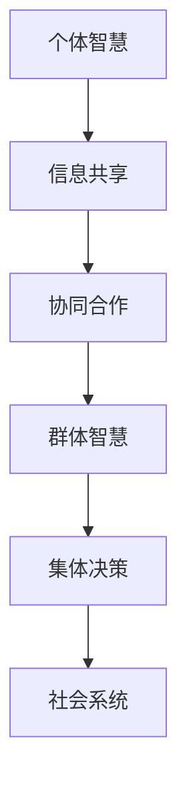
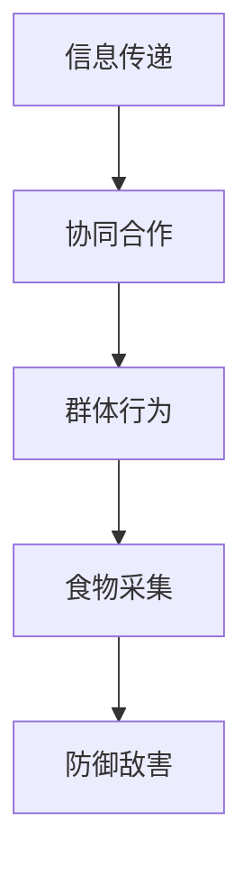
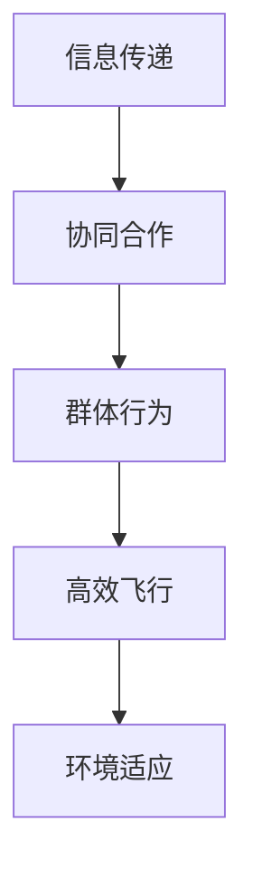
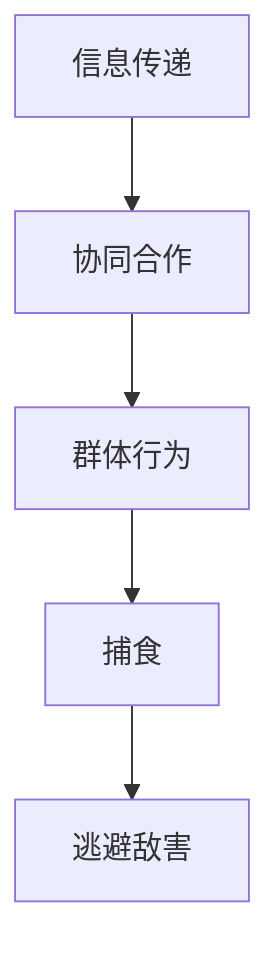

                 

# 群体智慧：集体决策的优势与陷阱

## 关键词
群体智慧，集体决策，优势与陷阱，信息共享，协同合作，智能分工，信息过载，噪声干扰，领导作用，伦理与法律问题

## 摘要
本文旨在探讨群体智慧在集体决策中的双重作用：优势与陷阱。通过系统分析群体智慧的概念、优势、陷阱以及其在商业、社会治理等领域的应用，本文揭示了群体智慧在现代社会的巨大潜力和潜在风险。文章使用流程图、伪代码和实际案例等工具，为读者提供了对群体智慧深入理解的机会。本文不仅为研究人员和从业者提供了宝贵的理论指导，也为政策制定者提供了实用的参考。

----------------------------------------------------------------

### 《群体智慧：集体决策的优势与陷阱》目录大纲

#### 第一部分：群体智慧的概述

#### 第1章：群体智慧的概念与起源

#### 第2章：群体智慧的优势

#### 第二部分：群体智慧的陷阱

#### 第3章：集体行动的逻辑谬误

#### 第4章：信息过载与噪声干扰

#### 第5章：领导与群体智慧

#### 第三部分：群体智慧的实践应用

#### 第6章：群体智慧在商业领域

#### 第7章：群体智慧在社会治理

#### 第8章：群体智慧的伦理与法律问题

#### 附录

#### 附录A：案例研究

#### 附录B：参考资料

----------------------------------------------------------------

### 引言

在信息技术迅猛发展的今天，群体智慧（Collective Intelligence）逐渐成为研究的热点话题。群体智慧是指通过个体之间的相互作用和协作，共同产生和实现超过单个个体能力的结果。它不仅体现在自然界中的蜂群、鸟群、鱼群等动物群体行为中，还广泛应用于人类社会，如互联网社群、维基百科等。群体智慧以其灵活、适应性、多样性和分布式决策等特点，为解决复杂问题提供了新的思路和方法。

本文将从以下三个方面展开讨论：

1. **群体智慧的概述**：介绍群体智慧的概念、起源及其在自然界和社会系统中的应用。
2. **群体智慧的优势**：分析群体智慧在信息共享、协同合作、智能分工等方面的优势。
3. **群体智慧的陷阱**：探讨集体行动中的逻辑谬误、信息过载与噪声干扰等问题。

通过以上讨论，本文旨在揭示群体智慧在集体决策中的双重作用，为读者提供对群体智慧深入理解的机会。在接下来的内容中，我们将逐步深入探讨这些主题。

----------------------------------------------------------------

## 第一部分：群体智慧的概述

群体智慧的概念与起源是一个复杂而又迷人的研究领域，它涉及多个学科，包括生物学、计算机科学、社会心理学等。本章将首先对群体智慧进行界定，然后回顾其历史发展，探讨群体智慧在自然界中的应用，并分析其在社会系统中的作用。

### 1.1 群体智慧的界定

群体智慧可以被定义为一组个体通过相互交流和协同作用，共同产生和实现超过单个个体能力的结果。这个定义强调了几个关键要素：个体的相互作用、信息的共享、以及协同合作。

- **个体的相互作用**：个体之间的沟通和交流是实现群体智慧的前提。无论是通过简单的信号传递，还是复杂的社交网络，个体的相互作用都是群体智慧的重要机制。

- **信息的共享**：信息共享是群体智慧的另一个关键要素。个体通过共享信息，可以更好地了解环境和情境，从而做出更加明智的决策。

- **协同合作**：群体智慧不仅仅依赖于个体的行为，还需要个体的协同合作。通过协同合作，群体可以更有效地利用个体的知识和技能，实现共同的目标。

### 1.2 群体智慧的历史发展

群体智慧的概念虽然相对现代，但其实古已有之。以下是群体智慧历史发展的简要回顾：

- **古希腊时期**：古希腊的“民主制”可以被视为早期群体智慧的雏形。通过集体的讨论和投票，集体做出决策。

- **19世纪**：法国社会学家古斯塔夫·勒庞（Gustave Le Bon）提出了“群体心理学”理论，探讨了群体行为的特点和现象。

- **20世纪中叶**：计算机科学和信息技术的快速发展，为群体智慧的研究提供了新的工具和方法。计算机模拟和分布式系统的研究，使得人们可以更好地理解群体智慧的工作机制。

- **21世纪初**：互联网的普及和应用，使得群体智慧的概念和应用更加广泛。例如，维基百科、众筹平台等都是群体智慧在现代社会中的重要体现。

### 1.3 群体智慧在自然界中的应用

群体智慧在自然界中有着广泛的应用，许多动物群体展示了令人惊叹的智慧和行为协调能力。以下是几个典型的例子：

- **蜂群行为**：蜜蜂通过舞蹈传递信息，协调整个蜂群的行为。这种信息共享和协同合作的能力，使得蜂群能够高效地采集食物、防御敌害。

- **鸟群飞行**：鸟群在飞行过程中展现了高度协同的行为。通过不断调整自己的位置和方向，鸟群能够实现高效的飞行，同时对外部环境的变化做出快速响应。

- **鱼群游动**：鱼群在游动过程中，通过一系列的物理相互作用，形成了复杂的群体行为。这种协同合作的能力，使得鱼群能够更好地捕食、逃避敌害。

### 1.4 群体智慧在社会系统中的应用

群体智慧在社会系统中的应用也越来越广泛，以下是一些典型的例子：

- **互联网社群**：互联网社群通过信息共享和协同合作，形成了庞大的知识库和社区。例如，维基百科就是一个典型的群体智慧应用，通过全球志愿者的协作，创建了庞大的在线知识库。

- **众筹平台**：众筹平台通过集体决策和协同合作，帮助创新者筹集资金，实现了资金的高效配置。例如，Kickstarter等平台，通过用户的投票和支持，帮助众多创新项目获得资金。

- **商业决策**：群体智慧在商业决策中的应用也越来越广泛。通过团队协作和用户反馈，企业可以更快速地响应市场变化，制定更加科学的决策。

### 结论

群体智慧是一个复杂而多层次的概念，它涉及多个学科和领域。通过对群体智慧的界定、历史发展和应用的分析，我们可以更好地理解群体智慧的本质和潜力。在接下来的章节中，我们将进一步探讨群体智慧的优势和陷阱，为读者提供更深入的见解。

----------------------------------------------------------------

### 第一部分：群体智慧的概述

#### 第1章：群体智慧的概念与起源

**核心概念与联系**

在深入探讨群体智慧的概念与起源之前，首先需要明确几个核心概念及其相互联系。以下是群体智慧概念及其相关要素的 Mermaid 流程图：



**核心概念定义**

- **个体智慧**：单个个体的认知能力、知识储备和决策能力。
- **信息共享**：个体之间通过交流共享信息，从而提高整个群体的决策能力。
- **协同合作**：个体在信息共享的基础上，共同完成任务，实现整体目标。
- **群体智慧**：多个个体通过相互作用和协同合作，产生超越单个个体能力的集体智慧。
- **集体决策**：群体智慧在决策过程中的应用，通过集体讨论和投票，形成共识。
- **社会系统**：包含个体、群体和社会结构等多层次的复杂系统。

**概念联系**

群体智慧的概念并非孤立存在，而是与其他核心概念紧密相连。个体智慧是群体智慧的基础，信息共享和协同合作是实现群体智慧的关键机制。通过集体决策，群体智慧在社会系统中得以发挥重要作用。

**架构图说明**

在 Mermaid 流程图中，个体智慧（A）是群体智慧的源头（D），信息共享（B）和协同合作（C）是实现群体智慧的重要途径，集体决策（E）和整个社会系统（F）则是群体智慧发挥作用的最终舞台。

**核心算法原理讲解**

群体智慧的核心算法原理涉及多个层面，包括信息收集、处理和决策等。以下是群体智慧算法的基本原理和伪代码：

```plaintext
// 群体智慧算法伪代码

// 初始化参数
初始化个体集合 I
初始化信息共享机制 S
初始化协同合作机制 C
初始化集体决策机制 D

// 步骤1：信息收集
foreach 个体 i in I do
    收集个体 i 的信息 I_i

// 步骤2：信息处理
合并个体信息 I_i，形成全局信息 G

// 步骤3：协同合作
foreach 个体 i in I do
    个体 i 根据全局信息 G 和自身信息 I_i，进行协同合作

// 步骤4：集体决策
调用集体决策机制 D，基于协同合作结果形成集体决策 R

// 输出：集体决策结果 R
```

**数学模型和公式**

在群体智慧的研究中，一些数学模型和公式用于描述个体行为、信息传播和群体决策。以下是群体智慧中的一个基本模型——SIR模型，用于描述个体在不同状态（易感者、感染者、康复者）之间的转换。

$$
\frac{dS}{dt} = -\beta \cdot S \cdot I
$$

$$
\frac{dI}{dt} = \beta \cdot S \cdot I - \gamma \cdot I
$$

$$
\frac{dR}{dt} = \gamma \cdot I
$$

其中，$S$ 代表易感者数量，$I$ 代表感染者数量，$R$ 代表康复者数量，$\beta$ 是感染率，$\gamma$ 是康复率。

**举例说明**

假设在一个群体中有100个个体，其中50个个体为易感者（$S=50$），初始时没有感染者（$I=0$）。感染率为0.1，康复率为0.05。经过一段时间后，群体的状态会发生变化。使用SIR模型计算，经过一段时间后，易感者数量减少，感染者数量增加，最终部分个体康复。

通过以上讲解，我们可以更好地理解群体智慧的核心概念、算法原理和数学模型。这些基础知识的掌握，为后续探讨群体智慧的优势与陷阱提供了坚实的理论支持。

----------------------------------------------------------------

### 1.2 群体智慧的历史发展

群体智慧作为一个跨学科的研究领域，其发展历程既体现了科技进步，也反映了人类对复杂系统理解深度的不断拓展。从古希腊时期的“民主制”到现代计算机科学中的分布式系统，群体智慧的概念和实践经历了多次迭代和演变。以下是对群体智慧历史发展的回顾。

#### 早期的群体智慧理论

古希腊的“民主制”可以视为早期群体智慧的雏形。在古希腊城邦中，公民通过集体的讨论和投票来做出决策。这种集体决策的方式，强调了个体之间的信息共享和协同合作。然而，这种早期的群体智慧理论缺乏系统性和科学性，更多是基于直觉和经验。

19世纪，法国社会学家古斯塔夫·勒庞（Gustave Le Bon）在其著作《群体心理学》中提出了关于群体行为的理论。勒庞认为，个体在群体中会表现出非理性的行为，群体的决策往往偏离个体理性。这一理论虽然揭示了群体行为的一些特点，但也存在一定的偏见和局限性。

#### 现代群体智慧的兴起

20世纪中叶，随着计算机科学和信息技术的迅猛发展，群体智慧理论得到了新的发展。计算机模拟和分布式系统的研究，为群体智慧提供了新的研究工具和方法。经济学家、社会学家、计算机科学家等多学科研究者开始关注群体智慧的研究，并将其应用于解决复杂问题。

1950年代，美国社会学家罗伯特·默顿（Robert K. Merton）提出了“社会系统理论”，探讨了个体与群体之间的关系，以及信息共享和协同合作在群体决策中的作用。这一理论为群体智慧的研究奠定了基础。

20世纪80年代，网络和通信技术的发展，进一步推动了群体智慧的研究。分布式计算和互联网的应用，使得个体之间的信息共享和协同合作变得更加便捷和高效。维基百科、众筹平台等新兴应用，展示了群体智慧在现代社会中的巨大潜力和应用价值。

#### 现代群体智慧的应用

进入21世纪，群体智慧的应用范围越来越广泛。在商业领域，群体智慧被用于市场预测、产品开发、决策制定等。例如，谷歌的分布式团队管理，通过全球范围内的高效合作和快速创新，推动了公司的发展。

在社会治理领域，群体智慧被应用于公共政策制定、公共管理、社会问题解决等。例如，通过在线调查和公众参与，政府可以更科学、更民主地制定政策。

在科学研究中，群体智慧被用于知识共享和协同创新。例如，科学家们通过在线平台共享实验数据和研究成果，加速了科学发现的进程。

#### 现代群体智慧的特点

现代群体智慧具有以下特点：

1. **信息共享**：个体之间通过互联网和通信技术，可以快速、便捷地共享信息，从而提高整体决策的准确性。

2. **协同合作**：群体成员通过协同合作，可以实现优势互补，提高工作效率。

3. **自适应性和灵活性**：群体智慧可以快速适应环境变化，应对复杂和不确定的情境。

4. **分布式决策**：群体智慧通过分布式决策机制，避免了集中决策的弊端，提高了决策的科学性和民主性。

### 结论

群体智慧的历史发展展示了人类对复杂系统认识的不断深化。从古希腊的“民主制”到现代计算机科学中的分布式系统，群体智慧的概念和实践经历了多次迭代和演变。现代群体智慧的应用，不仅提高了决策的准确性和效率，也为解决复杂问题提供了新的思路和方法。随着技术的不断进步，群体智慧将继续在各个领域发挥重要作用，为人类社会的发展做出贡献。

----------------------------------------------------------------

### 1.3 群体智慧在自然界中的应用

群体智慧在自然界中有着广泛的应用，许多动物群体展示了令人惊叹的智慧和行为协调能力。这些动物群体通过信息共享和协同合作，实现了超越单个个体能力的集体智慧。以下是一些典型的例子：

#### 蜂群行为

蜜蜂是最著名的群体智慧体现之一。蜜蜂通过舞蹈传递信息，协调整个蜂群的行为。当一只蜜蜂找到新的食物源时，它会通过“摇摆舞”向其他蜜蜂传递信息，包括食物源的方向和距离。其他蜜蜂通过观察和学习，可以快速准确地找到食物源。这种信息共享和协同合作的能力，使得蜂群能够高效地采集食物、防御敌害。

**核心概念与联系**

以下是蜂群行为的 Mermaid 流程图，展示了信息共享和协同合作的过程：



**核心算法原理讲解**

蜂群行为的核心算法原理涉及信息传递、协同合作和群体行为的几个关键步骤：

```plaintext
// 蜂群行为算法伪代码

// 初始化参数
初始化蜜蜂集合 B
初始化信息传递机制 I
初始化协同合作机制 C

// 步骤1：信息收集
foreach 蜜蜂 b in B do
    蜜蜂 b 根据自身经验和感知，收集信息 I_b

// 步骤2：信息传递
foreach 蜜蜂 b in B do
    蜜蜂 b 根据信息 I_b，进行摇摆舞传递信息

// 步骤3：协同合作
foreach 蜜蜂 b in B do
    蜜蜂 b 根据接收到的信息，调整行为以协同合作

// 步骤4：群体行为
群体 B 根据协同合作结果，执行食物采集和防御敌害等行为
```

**数学模型和公式**

在蜂群行为的研究中，数学模型用于描述蜜蜂之间信息传递和协同合作的机制。以下是蜂群行为的一个基本模型——贝肯斯坦模型（Beckerstein Model）：

$$
x_{i}(t+1) = x_{i}(t) + \alpha \cdot (x_{\text{mean}}(t) - x_{i}(t))
$$

$$
y_{i}(t+1) = y_{i}(t) + \alpha \cdot (y_{\text{mean}}(t) - y_{i}(t))
$$

其中，$x_{i}(t)$ 和 $y_{i}(t)$ 分别表示第 $i$ 只蜜蜂在时间 $t$ 时的位置坐标，$x_{\text{mean}}(t)$ 和 $y_{\text{mean}}(t)$ 分别表示群体中所有蜜蜂在时间 $t$ 时的平均位置坐标，$\alpha$ 是调整系数。

**举例说明**

假设在一个蜂群中有10只蜜蜂，它们初始位置均匀分布在正方形区域内。在一段时间后，通过信息传递和协同合作，蜜蜂们将逐渐聚集在食物源附近。使用贝肯斯坦模型计算，经过一段时间后，蜜蜂们的位置将趋于一致，形成一个有序的群体行为。

#### 鸟群飞行

鸟群飞行展示了群体智慧在空中运动的独特魅力。鸟群在飞行过程中，通过一系列的物理相互作用和信号传递，实现了高度协同的行为。鸟群中的每一只鸟都需要不断地调整自己的位置和方向，以适应整体飞行的节奏和方向。这种协同合作的能力，使得鸟群能够实现高效的飞行，同时对外部环境的变化做出快速响应。

**核心概念与联系**

以下是鸟群飞行的 Mermaid 流程图，展示了信息传递和协同合作的过程：



**核心算法原理讲解**

鸟群飞行行为的核心算法原理涉及信息传递、协同合作和群体行为的几个关键步骤：

```plaintext
// 鸟群飞行算法伪代码

// 初始化参数
初始化鸟群集合 B
初始化信息传递机制 I
初始化协同合作机制 C

// 步骤1：信息收集
foreach 鸟 b in B do
    鸟 b 根据自身经验和感知，收集信息 I_b

// 步骤2：信息传递
foreach 鸟 b in B do
    鸟 b 根据信息 I_b，调整自身位置和方向

// 步骤3：协同合作
foreach 鸟 b in B do
    鸟 b 根据接收到的信息，调整行为以协同合作

// 步骤4：群体行为
群体 B 根据协同合作结果，实现高效飞行并适应环境变化
```

**数学模型和公式**

在鸟群飞行的研究中，数学模型用于描述鸟群中信息传递和协同合作的机制。以下是鸟群飞行的一个基本模型——罗瑟姆模型（Rothem Model）：

$$
v_{i}(t+1) = v_{i}(t) + \alpha \cdot (\bar{v}(t) - v_{i}(t))
$$

$$
\theta_{i}(t+1) = \theta_{i}(t) + \beta \cdot (\bar{\theta}(t) - \theta_{i}(t))
$$

其中，$v_{i}(t)$ 和 $\theta_{i}(t)$ 分别表示第 $i$ 只鸟在时间 $t$ 时的速度和方向，$\bar{v}(t)$ 和 $\bar{\theta}(t)$ 分别表示群体中所有鸟在时间 $t$ 时的平均速度和方向，$\alpha$ 和 $\beta$ 是调整系数。

**举例说明**

假设在一个鸟群中有20只鸟，它们初始时随机分布在天空中。在一段时间后，通过信息传递和协同合作，鸟群将逐渐形成有序的飞行形态，并对外部环境的变化做出快速响应。使用罗瑟姆模型计算，经过一段时间后，鸟群的速度和方向将趋于一致，实现高效的协同飞行。

#### 鱼群游动

鱼群游动展示了群体智慧在水中的独特应用。鱼群在游动过程中，通过一系列的物理相互作用和信号传递，形成了复杂的群体行为。鱼群中的每一只鱼都需要不断地调整自己的游动方向和速度，以适应整体游动的节奏和方向。这种协同合作的能力，使得鱼群能够更高效地捕食、逃避敌害。

**核心概念与联系**

以下是鱼群游动的 Mermaid 流程图，展示了信息传递和协同合作的过程：



**核心算法原理讲解**

鱼群游动行为的核心算法原理涉及信息传递、协同合作和群体行为的几个关键步骤：

```plaintext
// 鱼群游动算法伪代码

// 初始化参数
初始化鱼群集合 F
初始化信息传递机制 I
初始化协同合作机制 C

// 步骤1：信息收集
foreach 鱼f in F do
    鱼f 根据自身经验和感知，收集信息 I_f

// 步骤2：信息传递
foreach 鱼f in F do
    鱼f 根据信息 I_f，调整自身游动方向和速度

// 步骤3：协同合作
foreach 鱼f in F do
    鱼f 根据接收到的信息，调整行为以协同合作

// 步骤4：群体行为
鱼群 F 根据协同合作结果，实现高效捕食和逃避敌害
```

**数学模型和公式**

在鱼群游动的研究中，数学模型用于描述鱼群中信息传递和协同合作的机制。以下是鱼群游动的一个基本模型——霍夫斯塔德模型（Hofstad Model）：

$$
v_{i}(t+1) = v_{i}(t) + \alpha \cdot (\bar{v}(t) - v_{i}(t))
$$

$$
\theta_{i}(t+1) = \theta_{i}(t) + \beta \cdot (\bar{\theta}(t) - \theta_{i}(t))
$$

其中，$v_{i}(t)$ 和 $\theta_{i}(t)$ 分别表示第 $i$ 只鱼在时间 $t$ 时的速度和方向，$\bar{v}(t)$ 和 $\bar{\theta}(t)$ 分别表示群体中所有鱼在时间 $t$ 时的平均速度和方向，$\alpha$ 和 $\beta$ 是调整系数。

**举例说明**

假设在一个鱼群中有50只鱼，它们初始时随机分布在水域中。在一段时间后，通过信息传递和协同合作，鱼群将逐渐形成有序的游动形态，实现高效的捕食和逃避敌害。使用霍夫斯塔德模型计算，经过一段时间后，鱼群的速度和方向将趋于一致，形成高效的协同游动。

### 结论

群体智慧在自然界中的应用展示了个体之间信息共享和协同合作的强大力量。无论是蜂群行为、鸟群飞行，还是鱼群游动，这些动物群体通过群体智慧，实现了超越单个个体能力的集体智慧。通过对群体智慧在自然界中的应用进行分析，我们可以更好地理解群体智慧的本质和作用。这些自然界的现象，不仅为科学研究提供了丰富的素材，也为人类在复杂系统中的应用提供了启示。

----------------------------------------------------------------

### 1.4 群体智慧与社会系统

群体智慧不仅存在于自然界中，还在人类社会系统中发挥着重要作用。社会系统是一个复杂的网络结构，由个体、群体和组织等多层次元素组成。群体智慧在社会系统中的作用，主要体现在信息共享、协同合作、智能分工等方面。以下将对群体智慧在社会系统中的影响进行详细分析。

#### 群体智慧对社会系统的影响

1. **信息共享**：群体智慧在社会系统中的首要作用是信息共享。通过个体之间的信息交流，社会系统能够更全面、准确地了解环境和情境。例如，在商业决策中，企业可以通过收集和分析用户反馈、市场数据等信息，做出更科学的决策。在公共政策制定中，政府可以通过公众参与和在线调查，获取广泛的民意信息，从而制定更合理、更有效的政策。

2. **协同合作**：群体智慧通过协同合作，可以提升社会系统的整体效能。在社会系统中，个体之间的协同合作，可以实现优势互补，提高工作效率。例如，在科学研究领域，通过跨学科的合作，科学家们可以共同解决复杂问题，推动科学进步。在企业管理中，通过团队协作，企业可以更快速地响应市场变化，实现创新和发展。

3. **智能分工**：群体智慧还可以促进社会系统的智能分工，提高个体和整体的工作效率。在现代社会中，个体专业化的趋势日益明显，每个人专注于特定的领域，通过分工合作，实现整体效能的最大化。例如，在互联网时代，内容创作者、技术工程师、市场营销等角色各司其职，通过协同合作，实现了信息传播的高效性。

#### 社会系统对群体智慧的影响

1. **社会制度**：社会制度是群体智慧发展的重要环境。合理的制度能够促进个体之间的信息共享和协同合作，从而增强群体智慧。例如，民主制度鼓励公众参与和言论自由，为群体智慧的发展提供了良好的土壤。在商业领域，市场机制通过竞争和激励，激发了个体和企业的创新活力。

2. **文化背景**：文化背景对群体智慧的发展也有重要影响。不同的文化背景，会形成不同的社会价值观和行为规范，从而影响群体智慧的表现。例如，集体主义文化强调集体利益和协同合作，有利于群体智慧的发展。而在个体主义文化中，个人主义和竞争意识较强，群体智慧的表现可能会受到一定程度的制约。

3. **技术条件**：技术条件是群体智慧发展的关键因素。随着信息技术的不断进步，个体之间的信息传递和协同合作变得更加便捷和高效。例如，互联网和移动通信技术的普及，使得人们可以随时随地获取和共享信息，为群体智慧的发展提供了强大的技术支持。

#### 结论

群体智慧在社会系统中的应用，展示了其巨大的潜力和价值。通过信息共享、协同合作和智能分工，群体智慧可以提升社会系统的整体效能，促进社会创新和发展。同时，社会系统对群体智慧的影响，包括社会制度、文化背景和技术条件等，也为群体智慧的发展提供了重要的保障。在未来的发展中，随着技术的不断进步和社会制度的不断完善，群体智慧将发挥越来越重要的作用，为社会带来更多的福祉。

----------------------------------------------------------------

## 第二部分：群体智慧的优势

群体智慧作为一种集体决策的机制，其优势体现在多个方面。本章将深入探讨群体智慧在信息共享、协同合作、智能分工等方面的优势，并通过实际案例来展示这些优势如何在不同领域中得到体现。

### 2.1 信息共享与协同合作

**信息共享的优势**

信息共享是群体智慧的核心优势之一。通过个体之间的信息交流，群体能够更全面、准确地了解环境和情境，从而提高决策的质量。以下是信息共享的一些主要优势：

1. **提高决策质量**：个体在做出决策时，往往受到自身认知能力和信息获取范围的限制。通过信息共享，个体可以获取到更多的信息，从而做出更加全面和科学的决策。例如，在商业决策中，企业可以通过收集和分析用户反馈、市场数据等，提高决策的准确性和有效性。

2. **促进知识传播**：信息共享可以促进知识的传播和利用。在一个群体中，每个个体都可能拥有独特的知识和经验，通过信息共享，这些知识和经验可以被其他个体学习和借鉴，从而提高整体的知识水平。例如，在科学研究领域，通过跨学科的合作和信息共享，科学家们可以共同解决复杂问题，推动科学进步。

**协同合作的优势**

协同合作是群体智慧的另一个重要优势。通过个体之间的协同合作，群体能够更高效地完成任务，实现共同的目标。以下是协同合作的一些主要优势：

1. **提高工作效率**：协同合作可以充分利用每个人的特长和技能，实现优势互补，从而提高整体工作效率。例如，在软件开发项目中，通过团队成员的协同合作，可以更快速地完成项目，提高开发效率。

2. **促进创新**：协同合作可以激发创新思维。在一个群体中，个体之间的交流和碰撞，往往能够产生新的观点和创意，从而推动创新和发展。例如，在科技创新领域，通过跨学科的合作和协同创新，可以推动新技术和新产品的诞生。

### 实际案例：谷歌的分布式团队管理

谷歌作为一家全球领先的科技公司，其分布式团队管理展示了群体智慧在信息共享和协同合作方面的优势。谷歌的分布式团队管理指的是在全球范围内，通过高效的沟通和协作，实现团队成员的协调和合作。以下是谷歌分布式团队管理的一些具体实践：

1. **虚拟办公室**：谷歌为每个团队成员提供了一个虚拟办公室，通过电子邮件、即时通讯工具、视频会议等，实现远程办公和团队协作。这种方式打破了地理位置的限制，使得团队成员可以随时随地共享信息和协同工作。

2. **透明沟通机制**：谷歌通过透明的沟通机制，确保信息在团队内部的有效传递。例如，谷歌的文档协作工具Google Docs，使得团队成员可以实时编辑和更新文档，提高了沟通效率和协同效果。

3. **敏捷开发**：谷歌在软件开发过程中，采用敏捷开发方法，通过短周期的迭代和反馈，实现快速响应和协同创新。团队成员通过定期举行会议和代码审查，确保项目的顺利进行和高质量交付。

通过以上实践，谷歌成功地实现了全球范围内的分布式团队管理，提高了工作效率和创新能力。谷歌的案例展示了群体智慧在信息共享和协同合作方面的优势，也为其他企业提供了有益的借鉴。

### 2.2 群体学习与适应性

**群体学习的优势**

群体学习是群体智慧的一个重要方面。通过个体之间的相互学习和反馈，群体能够不断提高其智能水平，适应复杂和不确定的环境。以下是群体学习的一些主要优势：

1. **增强适应性**：群体学习使得群体能够更快速地适应环境变化。在一个动态变化的情境中，个体可能无法单独应对所有挑战，但通过群体学习，群体可以共同探索和尝试新的策略，从而提高适应性。

2. **提高智能水平**：群体学习可以积累和传递个体的知识和经验，从而提高整体智能水平。例如，在人工智能领域，通过群体学习，可以不断优化算法和模型，提高系统的智能表现。

**适应性的优势**

适应性是群体智慧的重要优势之一。在复杂和不确定的环境中，群体智慧能够通过适应性策略，实现持续的发展和优化。以下是适应性的主要优势：

1. **快速响应**：群体智慧能够快速适应环境变化，及时调整策略和行为。例如，在金融市场中，通过群体学习，投资者可以快速识别市场趋势和风险，做出相应的投资决策。

2. **持续优化**：群体智慧通过不断学习和适应，可以实现持续优化。例如，在企业管理中，通过员工参与和反馈，可以不断优化管理策略和组织结构，提高整体效能。

### 实际案例：维基百科的集体智慧

维基百科作为全球最大的在线知识库，展示了群体智慧在群体学习和适应性方面的优势。以下是维基百科的一些具体实践：

1. **开放式编辑**：维基百科采用开放式编辑机制，任何用户都可以编辑和更新页面内容。这种方式促进了知识共享和群体学习，使得维基百科的知识库不断丰富和更新。

2. **社区协作**：维基百科有一个庞大的志愿者社区，他们通过协作和合作，共同维护和改进知识库。这种社区协作机制，不仅提高了知识库的质量，也增强了群体的适应性和智能水平。

3. **适应性调整**：维基百科能够根据用户反馈和需求，不断调整和优化用户体验。例如，通过用户行为数据分析，维基百科可以识别热门内容和用户偏好，从而优化页面推荐和展示策略。

通过以上实践，维基百科成功地展示了群体智慧在群体学习和适应性方面的优势。维基百科的案例为其他领域提供了有益的启示，展示了群体智慧在复杂和不确定环境中的巨大潜力。

### 2.3 智能分工与专业化

**智能分工的优势**

智能分工是群体智慧的一个重要组成部分。通过个体专业化和角色分工，群体可以更高效地利用资源，提高整体工作的质量和效率。以下是智能分工的一些主要优势：

1. **提高工作效率**：智能分工可以将任务分解为多个子任务，每个个体专注于特定的子任务，从而提高整体工作效率。例如，在软件开发项目中，可以通过角色分工，将开发、测试、维护等任务分别分配给不同的团队成员，从而提高项目完成速度。

2. **提高工作质量**：智能分工可以充分利用个体的专业知识和技能，提高工作的质量和精度。例如，在医学诊断中，通过专业医生和医疗设备的分工合作，可以更准确地诊断疾病，提高治疗效果。

**专业化的优势**

专业化是智能分工的基础，也是群体智慧的重要组成部分。通过专业化，个体可以更深入地研究特定领域，提高其在该领域的专业能力和影响力。以下是专业化的主要优势：

1. **提高个体能力**：专业化使得个体可以更深入地研究和掌握特定领域的知识，从而提高个体的专业能力和影响力。

2. **促进知识积累**：专业化可以促进知识的积累和传承，使得群体智慧得到持续的发展和优化。

### 实际案例：IBM的智能分工

IBM作为全球领先的科技公司，其智能分工和专业化实践展示了群体智慧的优势。以下是IBM的一些具体实践：

1. **角色分工**：IBM在其研发和运营过程中，采用角色分工的方式，将不同任务分配给不同的团队和成员。例如，研发团队负责新技术的研究和开发，运营团队负责产品的部署和运维，市场团队负责产品的推广和销售。

2. **专业化培训**：IBM为员工提供专业化的培训和发展机会，帮助员工提升专业能力和技能。例如，通过专业技术培训、高级研讨班等，员工可以深入掌握特定领域的知识和技能。

3. **知识共享**：IBM鼓励员工通过内部知识库和协作平台，分享专业知识和经验，促进知识的积累和传承。

通过以上实践，IBM成功地展示了群体智慧在智能分工和专业化方面的优势。IBM的案例为其他企业提供了有益的借鉴，展示了群体智慧在提高工作效率和工作质量方面的巨大潜力。

### 结论

群体智慧的优势体现在多个方面，包括信息共享、协同合作、智能分工等。通过信息共享，群体可以更全面、准确地了解环境和情境，提高决策质量。通过协同合作，群体可以更高效地完成任务，实现共同的目标。通过智能分工和专业化，群体可以更高效地利用资源，提高整体工作的质量和效率。在实际应用中，群体智慧的优势得到了广泛的验证，为各个领域带来了深刻的变革和进步。在未来的发展中，随着技术的不断进步和社会的持续变革，群体智慧将继续发挥重要作用，为人类社会的发展做出更大的贡献。

----------------------------------------------------------------

### 第二部分：群体智慧的陷阱

群体智慧虽然具有许多优势，但同时也存在一些潜在的陷阱。这些陷阱可能源于集体行动中的逻辑谬误、信息过载与噪声干扰、领导者的不当行为等因素。本章将深入探讨这些陷阱，分析其对群体智慧的影响，并提出相应的解决策略。

#### 3.1 集体行动的逻辑谬误

在集体行动中，个体理性的行为可能会导致集体的非理性决策。以下是一些常见的逻辑谬误：

**个体理性与集体非理性的矛盾**

1. **“群体极化”现象**：群体讨论中，个体观点可能趋于极端化，导致群体决策偏离理性。个体在群体中可能受到情绪传染和群体压力的影响，倾向于支持更极端的观点。

2. **“乐队花车效应”**：个体为了获得群体认同，可能会跟随大多数人的意见，即使这些意见可能是错误的。这种现象可能导致集体做出错误的决策。

**解决策略**

1. **透明化决策过程**：通过公开决策过程，减少信息不对称和群体压力，个体可以更理性地参与讨论和决策。

2. **引入多样性**：多样性可以平衡不同观点，减少群体极化现象。例如，在决策团队中引入不同背景、经验和观点的成员，有助于更全面地考虑问题。

#### 3.2 集体选择的困境

在集体选择中，个体利益和集体利益可能存在冲突。以下是一些常见的困境：

**集体选择的困境**

1. **“公地悲剧”**：个体为了追求短期利益，过度使用公共资源，导致公共资源枯竭。例如，过度捕鱼、过度放牧等。

2. **“智猪博弈”**：在资源分配不均的情况下，弱势个体可能选择搭便车，依赖强势个体。这可能导致资源分配不公和个体积极性降低。

**解决策略**

1. **设计合理的激励机制**：通过奖励机制，鼓励个体为集体利益做出贡献。例如，在环境保护中，可以通过奖励减少污染的行为。

2. **明确责任和权利**：明确个体在集体选择中的责任和权利，防止搭便车行为。例如，通过立法和规章制度，明确环境污染者的责任和处罚。

#### 3.3 群体极化与偏见

群体极化是指群体讨论中个体观点趋于极端化的现象。偏见则是个体在信息处理中，基于已有信念和情绪，对信息进行选择性接受和解释。

**群体极化与偏见的影响**

1. **降低决策质量**：群体极化和偏见可能导致集体决策偏离理性，降低决策质量。

2. **增强群体冲突**：群体极化可能加剧群体内部的冲突，降低社会凝聚力。

**解决策略**

1. **培养批判性思维**：教育个体培养批判性思维，对信息进行独立分析和判断，减少偏见。

2. **多元化视角**：引入多元视角，通过讨论和辩论，平衡不同观点，减少群体极化现象。

#### 3.4 集体行动中的道德风险

道德风险是指在集体行动中，个体可能因为匿名性或责任分散，而采取不负责任的行为。以下是一些常见的道德风险：

**集体行动中的道德风险**

1. **“道德风险”效应**：在群体中，个体可能觉得自己不必承担责任，从而采取不负责任的行为。

2. **“群体责任分散”**：在群体中，个体可能认为责任应由整个群体承担，从而降低自身责任感。

**解决策略**

1. **强化个体责任**：通过明确个体责任，防止个体在集体行动中采取不负责任的行为。例如，在企业管理中，可以通过绩效考核和责任追究，确保员工在工作中承担责任。

2. **建立监督机制**：通过建立有效的监督机制，防止道德风险的发生。例如，在社区管理中，可以通过居民委员会和志愿者团队，监督社区成员的行为。

### 结论

群体智慧在集体决策中具有巨大的潜力，但同时也存在一些陷阱。通过深入分析集体行动的逻辑谬误、集体选择的困境、群体极化与偏见、道德风险等问题，我们可以更好地理解这些陷阱对群体智慧的影响。通过设计合理的激励机制、培养批判性思维、引入多元化视角、强化个体责任和建立监督机制等策略，可以有效地解决这些陷阱，促进群体智慧的发展。在未来的实践中，随着社会的不断进步和技术的不断发展，群体智慧将继续在各个领域发挥重要作用，为人类社会带来更多的福祉。

----------------------------------------------------------------

### 信息过载与噪声干扰

信息过载与噪声干扰是群体智慧中普遍存在的问题，它们对群体决策的质量和效率产生了显著的影响。信息过载指的是个体或群体接收到的信息量超过了其处理能力，而噪声干扰则是指那些对决策产生负面影响的无关或错误信息。以下是对这两个问题的深入探讨。

#### 4.1 信息过载的影响

**定义与现象**

信息过载是指个体或群体在特定时间内接收到的信息量超过了其处理能力，导致信息处理困难和决策效率降低。在现代社会，随着互联网和通信技术的发展，信息过载现象越来越普遍。以下是一些信息过载的典型表现：

1. **注意力分散**：个体在处理大量信息时，容易分散注意力，难以集中精力完成任务。
2. **决策困难**：信息过载可能导致个体在决策时犹豫不决，难以做出有效决策。
3. **心理压力**：面对大量信息，个体可能会感到焦虑和压力，影响心理健康。

**影响分析**

信息过载对群体智慧的影响主要体现在以下几个方面：

1. **降低决策质量**：信息过载可能导致群体在决策时忽略关键信息，降低决策的科学性和准确性。
2. **延迟决策速度**：信息过载会增加信息处理的时间，延迟决策速度，影响决策的时效性。
3. **降低群体参与度**：面对大量信息，个体可能会感到疲惫和无力，降低参与集体决策的积极性。

**解决策略**

1. **信息筛选**：通过建立有效的信息筛选机制，过滤掉无关或低价值的信息，提高信息的质量和相关性。
2. **信息压缩**：将大量信息压缩为关键要点和摘要，帮助个体快速理解和处理信息。
3. **时间管理**：合理安排信息处理的时间，避免在短时间内处理过多的信息。

#### 4.2 噪声干扰的来源

**定义与类型**

噪声干扰是指那些对决策产生负面影响的外部因素，包括错误信息、无关信息、误导性信息等。噪声干扰的类型多样，以下是一些常见的噪声干扰来源：

1. **错误信息**：由于信息来源的不准确或信息处理过程中的错误，导致的信息错误。
2. **无关信息**：与决策无关的信息，可能会分散个体的注意力，干扰决策过程。
3. **误导性信息**：有意或无意地传播的错误信息，可能会误导个体，导致错误决策。

**影响分析**

噪声干扰对群体智慧的影响主要体现在以下几个方面：

1. **降低信息传递的准确性**：噪声干扰会导致关键信息在传递过程中失真或丢失，降低信息传递的准确性。
2. **增加决策难度**：噪声干扰会增加个体在决策时需要处理的信息量，增加决策的难度和复杂性。
3. **降低决策的公正性**：噪声干扰可能会影响决策的客观性和公正性，导致决策结果偏离理性。

**解决策略**

1. **数据验证**：对关键信息进行验证，确保其来源的准确性和可靠性。
2. **噪声过滤**：通过算法和规则过滤掉噪声信息，提高信息的纯度。
3. **增强信息透明度**：提高信息的透明度，确保信息的公开和可追溯性，减少误导性信息的传播。

#### 4.3 噪声对群体智慧的影响

噪声干扰不仅影响个体决策，也会对群体智慧产生负面影响。以下是对噪声对群体智慧影响的详细分析：

1. **降低群体智慧的效能**：噪声干扰会降低群体智慧的信息质量和决策效率，导致群体智慧的效能下降。
2. **增加决策风险**：噪声干扰可能会误导群体决策，增加决策的风险。
3. **降低群体凝聚力**：噪声干扰可能会导致群体内部的分歧和冲突，降低群体的凝聚力和合作效率。

**解决策略**

1. **信息共享与反馈**：通过信息共享和反馈机制，个体可以及时识别和纠正噪声干扰，提高信息传递的准确性和有效性。
2. **多元化视角**：引入多元化视角，通过不同背景和经验的个体共同参与决策，减少噪声干扰的影响。
3. **领导者的引导**：领导者可以通过引导和协调，确保群体决策过程中信息的准确性和公正性，减少噪声干扰的影响。

### 结论

信息过载与噪声干扰是群体智慧中普遍存在的问题，对群体决策的质量和效率产生了显著影响。通过有效的信息筛选、信息压缩、数据验证和噪声过滤等策略，可以降低信息过载和噪声干扰的影响，提高群体智慧的效能。在未来的实践中，随着技术的不断进步和社会的持续变革，我们需要不断探索和优化这些策略，以充分发挥群体智慧的优势，为人类社会的发展做出更大的贡献。

----------------------------------------------------------------

### 减少噪声干扰的策略

在群体智慧的应用过程中，噪声干扰是一个常见且严重的问题。为了提高群体决策的质量和效率，需要采取一系列策略来减少噪声干扰的影响。以下是一些具体的方法和步骤：

#### 4.4.1 个体层面的策略

1. **提高信息素养**：个体需要具备良好的信息素养，包括信息收集、分析、处理和评价的能力。通过教育和培训，个体可以学会如何识别和过滤噪声信息，提高信息的纯度和可信度。

2. **批判性思维**：培养批判性思维能力，使个体能够在接收信息时保持独立和客观。个体应该学会对信息来源进行评估，识别潜在的偏见和错误，从而减少噪声干扰的影响。

3. **信息过滤与筛选**：个体可以使用各种工具和技术，如关键词搜索、信息分类和标签管理等，来过滤和筛选信息，只保留关键和相关的信息。

#### 4.4.2 群体层面的策略

1. **建立有效的沟通机制**：在群体决策过程中，建立有效的沟通机制至关重要。这包括明确的沟通流程、规范的讨论规则和透明的信息共享平台。通过这些机制，可以确保信息在群体内部的有效传递和共享，减少噪声干扰。

2. **多元化视角**：引入多元化的视角和成员，有助于平衡不同观点和减少偏见。多元化的群体可以更好地识别和过滤噪声信息，从而提高决策的质量。

3. **噪声过滤算法**：利用算法和技术手段，自动识别和过滤噪声信息。例如，可以使用机器学习算法对大量数据进行分类和分析，识别出潜在的噪声信息，并将其排除在决策过程之外。

#### 4.4.3 系统层面的策略

1. **优化信息流程**：优化信息流程，确保信息在传递过程中不受噪声干扰。例如，可以建立信息验证机制，对关键信息进行多层次的验证和审核，确保信息的准确性和可靠性。

2. **减少信息冗余**：通过减少信息冗余，可以降低噪声干扰的影响。个体和群体应该明确信息的价值和重要性，避免不必要的重复和冗余信息。

3. **强化监督与责任**：建立有效的监督和责任机制，确保个体在信息传递和处理过程中遵守规范和标准。通过问责机制，可以减少个体故意传播噪声信息的行为。

### 案例研究：减少噪声干扰的实践

以下是一个减少噪声干扰的实践案例，展示了如何在具体情境中实施上述策略：

**案例背景**：一个在线社区平台，用户可以发表观点和参与讨论。随着用户数量的增加，噪声干扰问题日益严重，影响了社区讨论的质量和用户参与度。

**实施策略**：

1. **提高信息素养**：平台对用户进行信息素养培训，教育用户如何识别和过滤噪声信息。

2. **批判性思维**：平台鼓励用户在讨论中保持批判性思维，对信息来源进行评估，避免盲目接受信息。

3. **建立有效的沟通机制**：平台制定了详细的讨论规则和沟通流程，确保信息在社区内透明和有效地传递。

4. **多元化视角**：平台引入了多样化的用户角色和视角，包括专家、普通用户和社区管理员，以平衡不同观点。

5. **噪声过滤算法**：平台使用机器学习算法，对用户发表的内容进行分类和分析，自动过滤掉潜在的噪声信息。

6. **优化信息流程**：平台建立了信息验证机制，对重要信息进行多层次的验证和审核。

7. **减少信息冗余**：平台鼓励用户发布有价值和有针对性的内容，减少不必要的重复信息。

8. **强化监督与责任**：平台建立了监督和责任机制，对违反社区规则的用户进行问责和处理。

**实施效果**：通过上述策略的实施，社区讨论的质量和用户参与度得到了显著提高。噪声干扰现象减少，用户更愿意参与积极和有意义的讨论。

### 结论

减少噪声干扰是提升群体智慧质量的重要策略。通过个体层面的信息素养提升、批判性思维培养，群体层面的有效沟通机制建立、多元化视角引入，以及系统层面的信息流程优化、减少信息冗余和强化监督与责任，可以有效地减少噪声干扰，提高群体决策的质量和效率。在未来的实践中，这些策略将继续发挥重要作用，为群体智慧的发展提供坚实支持。

----------------------------------------------------------------

### 5.1 领导对群体智慧的影响

领导者在群体智慧中扮演着至关重要的角色，他们不仅需要协调群体成员之间的合作，还需要引导群体实现共同的目标。以下将从领导者的角色、职责、决策机制以及如何促进群体智慧等方面进行分析。

#### 领导者的角色

1. **协调者**：领导者需要协调群体成员之间的合作，确保每个成员都能够充分发挥自己的能力。通过建立有效的沟通渠道和协作机制，领导者可以促进群体内部的信息共享和协同合作。

2. **激励者**：领导者需要激励群体成员，激发他们的积极性和创造力。通过设置合理的激励机制，领导者可以鼓励成员为群体目标而努力，提高群体的整体效能。

3. **引导者**：领导者需要为群体提供明确的指导方向，帮助成员理解目标和愿景。通过设定目标和制定策略，领导者可以确保群体在正确的道路上前进，避免偏离方向。

#### 领导者的职责

1. **明确目标**：领导者需要明确群体的目标和愿景，确保每个成员都了解自己的职责和任务。通过设定清晰的目标，领导者可以帮助群体成员更好地聚焦于核心任务，提高工作效率。

2. **建立信任**：领导者需要建立信任，营造一个开放、透明和包容的团队氛围。信任是群体智慧的重要基础，只有当成员之间相互信任时，才能更好地合作和分享信息。

3. **提供资源**：领导者需要确保群体拥有所需的资源和支持，以便有效地实现目标。这包括资金、技术、信息和人力等资源，领导者需要合理分配和利用这些资源，提高群体的工作效率。

#### 领导者的决策机制

1. **信息收集**：领导者需要广泛收集信息，了解群体的实际情况和外部环境的变化。通过收集和分析信息，领导者可以做出更加科学和合理的决策。

2. **分析评估**：领导者需要对收集到的信息进行分析和评估，确定最佳的行动方案。在分析评估过程中，领导者需要考虑各种因素，如成本、风险和收益等，以确保决策的可行性和有效性。

3. **方案选择**：领导者需要从多个备选方案中选择最佳方案，并制定详细的执行计划。在方案选择过程中，领导者需要考虑成员的意见和建议，确保决策的民主性和科学性。

4. **执行监控**：领导者需要监督执行过程，确保决策得到有效实施。在执行过程中，领导者需要及时调整策略和解决问题，确保目标的顺利实现。

#### 领导者如何促进群体智慧

1. **建立信任与沟通**：领导者需要建立信任，营造开放和透明的沟通环境。通过鼓励成员分享意见和反馈，领导者可以促进群体内部的沟通和协作，提高群体智慧。

2. **培养团队协作**：领导者需要培养团队协作精神，鼓励成员相互支持和合作。通过组织团队活动和协作项目，领导者可以增强团队的凝聚力和协作能力。

3. **提供资源与支持**：领导者需要确保群体拥有所需的资源和支持，以便有效地实现目标。通过提供技术、信息和资金等资源，领导者可以激发成员的创新能力和工作效率。

4. **鼓励创新与学习**：领导者需要鼓励成员不断学习和创新，推动群体智慧的发展。通过组织培训和研讨会，领导者可以提升成员的知识和技能，为群体智慧提供源源不断的动力。

### 结论

领导者在群体智慧中发挥着关键作用，他们需要协调群体成员之间的合作，提供资源和支持，建立信任和沟通，以及鼓励创新和学习。通过有效的领导，领导者可以促进群体智慧的发展，提高决策质量和效率，实现共同的目标。在未来的实践中，领导者需要不断学习和适应，以更好地发挥其作用，推动群体智慧在各个领域的发展和应用。

----------------------------------------------------------------

### 5.2 领导者的角色与职责

在群体智慧中，领导者扮演着至关重要的角色，其职责不仅包括协调群体成员之间的合作，还涉及提供方向、资源和支持，确保群体智慧的有效发挥。以下详细探讨领导者的角色与职责，以及如何在实践中履行这些职责。

#### 领导者的角色

1. **核心成员**：领导者是群体智慧的核心成员，负责制定战略、引导讨论、协调资源等。他们需要具备强烈的责任感和使命感，确保群体目标得到有效实现。

2. **信息传递者**：领导者需要充当信息传递者，确保关键信息在群体内部得到有效传递。他们需要具备良好的沟通技巧，能够清晰地传达目标、策略和期望，确保成员对任务和目标有清晰的认识。

3. **决策者**：领导者需要做出关键决策，指导群体行动。他们需要具备分析问题的能力，能够在复杂和不确定的环境下做出明智的决策。

4. **激励者**：领导者需要激发成员的积极性和创造力，鼓励他们为群体目标努力工作。通过设置合理的激励机制，领导者可以提升成员的工作动力，促进群体智慧的发展。

#### 领导者的职责

1. **明确目标**：领导者的首要职责是明确群体的目标和愿景。他们需要与成员沟通，确保每个人都理解自己的职责和任务，从而形成共同的目标和方向。

2. **建立信任**：建立信任是领导者的重要职责。通过开放和透明的沟通，领导者可以建立成员之间的信任，营造一个和谐、积极的团队氛围。

3. **提供资源**：领导者需要确保群体拥有实现目标所需的资源。这包括资金、技术、信息和人力资源等。他们需要合理分配资源，确保每个成员都能充分发挥自己的能力。

4. **监督执行**：领导者需要监督任务的执行过程，确保决策得到有效实施。他们需要及时解决问题，调整策略，确保群体目标的顺利实现。

5. **培养团队**：领导者需要培养团队成员的能力和技能，提升他们的专业素养。通过培训和指导，领导者可以增强团队的协作能力和创新精神。

#### 实践中的领导职责

1. **制定战略**：领导者需要根据群体目标，制定详细的战略计划。这包括设定短期和长期目标，确定实现目标的步骤和措施。

2. **组织会议**：领导者需要定期组织会议，讨论群体进展和问题。在会议中，领导者可以听取成员的意见和建议，协调不同团队之间的合作。

3. **提供反馈**：领导者需要及时向成员提供反馈，肯定他们的工作成果，指出改进的方向。通过积极的反馈，领导者可以激励成员，提升他们的工作积极性。

4. **解决冲突**：领导者需要处理群体内部的冲突和矛盾，确保团队和谐。通过公正和透明的处理方式，领导者可以增强团队的凝聚力。

5. **推动创新**：领导者需要鼓励成员提出新的想法和创新，推动群体智慧的发展。通过提供资源和支持，领导者可以激发成员的创造力和创新精神。

### 结论

领导者在群体智慧中扮演着关键角色，其职责包括明确目标、建立信任、提供资源、监督执行和培养团队等。通过履行这些职责，领导者可以促进群体智慧的发展，提高决策质量和效率，实现共同的目标。在实践过程中，领导者需要不断学习和适应，以更好地发挥其作用，推动群体智慧在各个领域的应用和发展。

----------------------------------------------------------------

### 5.3 领导者的决策机制

领导者的决策机制是群体智慧能否有效运作的关键。一个有效的决策机制不仅能够确保领导者做出明智的决策，还能提高群体的整体效率和协作能力。以下将从决策过程、信息收集与分析、方案选择与执行监控等方面，详细探讨领导者的决策机制。

#### 决策过程

领导者的决策过程可以分为以下几个阶段：

1. **问题识别**：首先，领导者需要识别问题或机会，明确决策的目标和背景。这可以通过定期会议、工作报告、市场调研等方式进行。

2. **信息收集**：在识别问题后，领导者需要收集相关信息，了解问题的各个方面。这包括内部数据、市场趋势、竞争环境、用户反馈等。

3. **分析评估**：领导者需要对收集到的信息进行分析和评估，确定问题的根本原因和可能的解决方案。分析过程可能涉及数据分析、SWOT分析（优势、劣势、机会、威胁）等方法。

4. **方案选择**：在分析评估的基础上，领导者需要从多个备选方案中选择最佳方案。方案选择应考虑方案的可行性、成本、风险和预期收益等因素。

5. **执行计划**：一旦方案确定，领导者需要制定详细的执行计划，包括任务分配、时间表、资源调配等。执行计划应确保每个成员都明确自己的职责和任务。

6. **执行监控**：在执行过程中，领导者需要监督任务的执行情况，确保决策得到有效实施。这可以通过定期检查、汇报和反馈机制进行。

#### 信息收集与分析

信息收集和分析是决策过程中至关重要的一环。以下是一些关键步骤和策略：

1. **数据来源**：领导者需要从多个渠道收集数据，包括内部数据库、市场研究报告、用户反馈等。确保数据的多样性和可靠性。

2. **数据分析**：领导者应利用数据分析工具和技术，对收集到的信息进行整理、分析和可视化。数据分析可以帮助领导者发现问题的根本原因，识别关键影响因素。

3. **专家咨询**：在复杂决策中，领导者可以寻求专家的意见和指导。专家的见解可以帮助领导者更全面地了解问题和解决方案。

4. **情景模拟**：通过情景模拟，领导者可以预测不同方案在不同情况下的表现，评估方案的潜在风险和收益。

#### 方案选择与执行监控

方案选择和执行监控是决策过程中的关键环节。以下是一些关键策略：

1. **多标准决策**：领导者应采用多标准决策方法，综合考虑多种因素，如成本、效益、风险等，选择最佳方案。

2. **团队成员参与**：在方案选择过程中，领导者应鼓励团队成员参与，收集他们的意见和建议。团队成员的参与可以提高决策的民主性和科学性。

3. **持续反馈与调整**：在执行过程中，领导者需要建立反馈机制，及时收集成员的反馈和建议。根据反馈，领导者应不断调整和优化执行计划。

4. **绩效评估**：领导者应定期对执行结果进行评估，确保决策目标的实现。评估结果可以作为下一步决策的参考。

#### 结论

领导者的决策机制是群体智慧有效运作的关键。通过规范化的决策过程、全面的信息收集与分析、科学的多标准决策以及持续的执行监控和反馈，领导者可以确保决策的准确性和有效性，提高群体的整体效率和协作能力。在未来的实践中，领导者需要不断优化和完善决策机制，以更好地应对复杂多变的环境和挑战。

----------------------------------------------------------------

### 5.4 领导者如何促进群体智慧

领导者促进群体智慧的关键在于创造一个支持协作、创新和知识共享的环境。以下是领导者如何通过一系列策略和行动来促进群体智慧，提高团队的决策质量和创新能力的详细讨论。

#### 建立信任

**信任的重要性**：
信任是群体智慧发展的基石。只有在信任的基础上，成员才能开放地分享信息、知识和意见，从而实现高效的协作。

**建立信任的策略**：
1. **透明沟通**：领导者应保持沟通的透明度，及时向成员分享信息，解释决策过程和理由。这有助于成员理解领导层的意图，减少误解和猜疑。
2. **真诚反馈**：领导者应真诚地接受成员的反馈，并对他们的意见和建议给予积极的回应。这可以增强成员之间的信任感，鼓励他们更积极地参与决策。
3. **公正对待**：领导者应公正对待每个成员，避免偏袒和偏见。这有助于建立平等和尊重的团队氛围，促进成员之间的信任。

#### 优化沟通

**沟通的重要性**：
良好的沟通是群体智慧有效运作的保障。它确保信息在群体内部得到准确、及时地传递，减少误解和冲突。

**优化沟通的策略**：
1. **明确目标**：领导者应明确群体的目标和愿景，确保每个成员都了解自己的职责和任务。这有助于减少沟通中的模糊性和歧义。
2. **多种沟通渠道**：领导者应利用多种沟通渠道，如面对面会议、电子邮件、即时通讯工具和在线协作平台，以满足不同成员的沟通需求。
3. **定期反馈**：领导者应定期组织反馈会议，听取成员的意见和建议，并及时提供反馈。这有助于增强沟通的互动性和反馈性。

#### 鼓励创新

**创新的重要性**：
创新是群体智慧持续发展的重要动力。它帮助群体不断适应变化，应对挑战，保持竞争力。

**鼓励创新的策略**：
1. **提供资源**：领导者应为创新提供必要的资源，如资金、技术和人力支持。这可以激发成员的创新潜力，促进新想法的产生。
2. **鼓励失败**：领导者应鼓励成员勇于尝试和失败，将失败视为学习和成长的机会。这可以减轻成员在创新过程中的压力，鼓励他们更积极地探索新领域。
3. **创新奖励**：领导者应设立创新奖励机制，对提出创新想法和实现创新成果的成员给予奖励。这可以激励成员积极参与创新活动，提高整体创新能力。

#### 提供支持

**支持的重要性**：
领导者不仅需要激励成员，还需要在实际行动中提供支持和帮助，确保成员能够充分发挥自己的潜力。

**提供支持的策略**：
1. **个人发展**：领导者应关注成员的个人发展，提供培训和成长机会。这可以提升成员的专业能力，增强他们对群体的贡献。
2. **解决困难**：领导者应积极解决成员在工作中遇到的困难，提供必要的指导和支持。这可以减轻成员的工作压力，提高他们的工作效率。
3. **资源调配**：领导者应合理调配资源，确保每个成员都能获得完成任务所需的资源和支持。这可以确保团队协作的高效性和稳定性。

### 案例研究：领导者如何促进群体智慧

**案例背景**：某科技公司的研发团队在开发新产品时遇到了技术难题，团队内部意见分歧严重，创新活力下降。

**领导行动**：

1. **建立信任**：领导者组织了一次团队建设活动，通过互动游戏和团队合作任务，增强了成员之间的信任和团队凝聚力。

2. **优化沟通**：领导者建立了每日站会制度，确保团队成员能够及时分享进展和问题。此外，还引入了在线协作平台，方便成员随时交流和讨论。

3. **鼓励创新**：领导者为团队提供了额外的研发资源，如技术专家和资金支持。同时，设立了一个“创新奖励基金”，鼓励成员提出创新方案。

4. **提供支持**：领导者定期与团队成员进行一对一交流，了解他们的需求和困难，并提供个性化的指导和支持。

**实施效果**：

通过领导者的积极行动，团队内部的信任和沟通得到了显著改善。成员之间的协作更加紧密，创新活力得到恢复。最终，团队成功地克服了技术难题，开发出了新产品，赢得了市场的认可。

### 结论

领导者通过建立信任、优化沟通、鼓励创新和提供支持等一系列策略，可以有效促进群体智慧的发展。这些策略不仅提高了团队的决策质量和创新能力，也为公司的持续发展和竞争力提供了有力保障。在未来的实践中，领导者需要不断学习和适应，以更好地发挥其作用，推动群体智慧在各个领域的应用和发展。

----------------------------------------------------------------

## 第三部分：群体智慧的实践应用

群体智慧作为一种集体决策的机制，在商业领域和社会治理中得到了广泛应用。本章将深入探讨群体智慧在商业决策、市场预测、创新与产品开发、人力资源管理以及公共管理等方面的实践应用，通过具体案例来展示群体智慧的优势和效果。

### 第6章：群体智慧在商业领域

群体智慧在商业领域的应用，为企业的决策提供了新的思路和方法。通过集体决策和协同合作，企业可以更快速、更准确地应对市场变化，提高创新能力和竞争力。

#### 6.1 商业决策中的群体智慧

**商业决策中的优势**：

1. **提高决策质量**：群体智慧通过集体的讨论和协作，可以汇集多方面的意见和经验，提高决策的科学性和准确性。

2. **增强决策效率**：群体智慧可以缩短决策时间，提高决策效率。通过分布式决策机制，企业可以迅速响应市场变化，做出及时、有效的决策。

**案例研究**：

**谷歌的分布式团队管理**：

谷歌作为全球领先的科技公司，其分布式团队管理展示了群体智慧在商业决策中的优势。谷歌的分布式团队管理通过全球范围内的协作和沟通，实现了高效的决策和执行。

- **透明沟通**：谷歌采用了多种沟通工具，如视频会议、即时通讯和协作平台，确保团队成员能够随时交流信息和分享意见。
- **集体决策**：谷歌的决策过程注重集体参与，通过定期的团队会议和反馈机制，确保每个团队成员都有机会发表意见和提出建议。
- **快速响应**：通过分布式团队管理，谷歌能够迅速响应市场需求，调整产品策略和开发计划。

#### 6.2 群体智慧在市场预测中的应用

**市场预测的方法**：

市场预测是商业决策中的重要环节。群体智慧通过大数据分析和集体智慧，可以提供更准确、更全面的市场预测。

1. **大数据分析**：企业可以通过收集和分析大量市场数据，如销售数据、用户反馈、市场趋势等，预测未来的市场走势。

2. **集体智慧**：企业可以通过在线调查、用户投票和专家咨询等方式，收集多方面的市场信息，结合集体智慧进行市场预测。

**案例研究**：

**亚马逊的“先买后付”模式**：

亚马逊通过“先买后付”模式，利用群体智慧进行市场预测和风险管理。

- **用户反馈**：亚马逊通过用户评价和反馈，收集用户对产品的看法和需求，预测产品的市场潜力。
- **群体智慧**：亚马逊通过分析大量用户的行为数据，结合专家意见，进行市场预测和产品定位。

#### 6.3 群体智慧在创新与产品开发中的应用

**创新与产品开发的优势**：

1. **激发创造力**：群体智慧可以激发团队成员的创造力，通过集体讨论和协作，产生更多的创新想法。

2. **优化产品设计**：群体智慧可以通过多方面的反馈和优化，提高产品设计的科学性和实用性。

**案例研究**：

**苹果公司的“创意实验室”**：

苹果公司通过“创意实验室”，利用群体智慧推动创新和产品开发。

- **团队协作**：苹果的“创意实验室”由多个专业团队组成，通过跨部门的协作和讨论，共同推动创新项目的进展。
- **用户反馈**：苹果在产品开发过程中，注重用户反馈，通过在线调查、用户访谈等方式，收集用户对产品的意见和建议，进行产品优化。

#### 6.4 群体智慧在人力资源管理中的应用

**人力资源管理的方法**：

群体智慧在人力资源管理中的应用，可以提高员工满意度、增强团队凝聚力和工作效率。

1. **员工参与**：企业可以通过员工参与决策，提高员工的参与感和归属感。

2. **团队协作**：通过群体智慧，企业可以建立高效的团队协作机制，提高团队的整体效能。

**案例研究**：

**谷歌的“20%时间政策”**：

谷歌的“20%时间政策”是一个典型的群体智慧在人力资源管理中的应用案例。

- **员工创新**：谷歌允许员工将20%的工作时间用于自由探索和创新项目。这激发了员工的创造力，产生了许多创新产品，如Gmail和AdSense。
- **团队协作**：谷歌鼓励跨部门合作，通过团队协作，实现资源的共享和互补，提高了工作效率。

### 结论

群体智慧在商业领域的应用，展示了其强大的决策、预测、创新和人力资源管理能力。通过集体决策和协同合作，企业可以更快速、更准确地应对市场变化，提高创新能力和竞争力。在实际应用中，谷歌、亚马逊、苹果等公司的案例展示了群体智慧的优势和效果。在未来的商业实践中，企业应继续探索和应用群体智慧，以实现更高效、更创新的商业运营。

----------------------------------------------------------------

### 第7章：群体智慧在社会治理

群体智慧在社会治理中的应用，为公共管理和政策制定带来了新的思路和方法。本章将深入探讨群体智慧在社会治理中的实践应用，包括公共管理、公共政策制定、危机管理和灾难应对，以及社区治理等方面。

#### 7.1 群体智慧在公共管理中的应用

群体智慧在公共管理中的应用，可以提高决策的民主性和科学性，增强公共服务的效率和质量。

**公共管理的优势**：

1. **提高决策质量**：通过集体讨论和协作，群体智慧可以汇集多方面的意见和建议，提高决策的科学性和准确性。

2. **增强公共参与**：群体智慧鼓励公众参与决策，提高了决策的透明度和公正性，增强了公众对政府决策的信任和支持。

**案例研究**：

**纽约市智慧城市的建设**：

纽约市通过智慧城市建设，利用群体智慧提高公共管理的效率。

- **数据共享**：纽约市政府建立了开放数据平台，向公众开放大量公共数据，鼓励市民和开发者使用这些数据进行创新和公共管理。
- **公众参与**：纽约市通过在线调查和公民论坛，收集公众对城市管理的意见和建议，提高决策的民主性和透明度。

#### 7.2 群体智慧在公共政策制定中的应用

群体智慧在公共政策制定中的应用，可以通过广泛的公众参与和专家咨询，提高政策制定的科学性和有效性。

**公共政策制定的优势**：

1. **广泛视角**：群体智慧可以汇集不同背景和领域的意见和建议，提供更全面的视角，帮助政府制定更全面的政策。

2. **快速响应**：群体智慧可以迅速收集和分析公众意见，帮助政府及时调整政策，提高政策的时效性和有效性。

**案例研究**：

**中国杭州市“互联网+政务服务”**：

杭州市通过“互联网+政务服务”，利用群体智慧提高公共政策制定的效率。

- **公众参与**：杭州市政府通过在线平台，收集公众对公共政策的意见和建议，提高政策的民主性和科学性。
- **专家咨询**：杭州市政府还邀请了多位专家参与政策制定，结合专业知识和实际案例，提高政策的可行性。

#### 7.3 群体智慧在危机管理与灾难应对中的应用

群体智慧在危机管理和灾难应对中的应用，可以通过集体智慧和协作，提高应对效率和效果。

**危机管理与灾难应对的优势**：

1. **快速响应**：群体智慧可以迅速调动资源和力量，快速响应危机和灾难，减少损失。

2. **协同作战**：群体智慧可以协调不同部门和专业团队的合作，形成协同作战机制，提高应对效率和效果。

**案例研究**：

**中国汶川地震救援**：

在汶川地震救援过程中，群体智慧发挥了重要作用。

- **信息共享**：救援队伍通过手机短信、互联网等渠道，共享救援信息和资源，提高救援效率。
- **公众参与**：公众通过志愿行动、捐款捐物等方式，积极参与救援工作，形成了强大的救援力量。

#### 7.4 群体智慧在社区治理中的应用

群体智慧在社区治理中的应用，可以通过集体智慧和协作，提高社区治理的效率和质量。

**社区治理的优势**：

1. **增强社区凝聚力**：通过集体智慧和协作，社区成员可以共同解决社区问题，增强社区的凝聚力和归属感。

2. **提高治理效率**：群体智慧可以汇集社区成员的意见和建议，提高社区治理的效率和质量。

**案例研究**：

**新加坡“邻里理事会”**：

新加坡的邻里理事会是社区治理的一种典型形式，利用群体智慧提高社区治理的效率。

- **公众参与**：邻里理事会通过定期会议和公开讨论，收集居民的意见和建议，制定社区治理计划。
- **协同合作**：邻里理事会协调不同部门和专业团队的合作，共同解决社区问题，提高治理效果。

### 结论

群体智慧在社会治理中的应用，展示了其在提高决策质量、增强公众参与、快速响应危机和增强社区治理等方面的优势。通过具体案例的探讨，我们可以看到群体智慧在公共管理、公共政策制定、危机管理和灾难应对以及社区治理等方面的实际效果。在未来的社会治理中，群体智慧将继续发挥重要作用，为构建更加民主、科学和高效的治理体系提供支持。

----------------------------------------------------------------

### 7.5 群体智慧与政府决策

在现代社会，政府决策的质量和效率对于社会稳定和发展具有重要意义。群体智慧作为一种新兴的决策机制，为政府决策提供了新的思路和方法。以下将从群体智慧在政府决策中的应用、优势以及面临的挑战三个方面，详细探讨群体智慧与政府决策的关系。

#### 群体智慧在政府决策中的应用

1. **公共政策制定**：群体智慧可以通过广泛的公众参与和专家咨询，提高公共政策制定的科学性和民主性。政府可以通过在线调查、公众论坛、专家咨询等方式，收集公众的意见和建议，结合专家的专业知识，制定更符合社会需求的政策。

2. **公共管理**：群体智慧可以提升公共管理的效率和透明度。政府可以利用互联网和大数据技术，建立开放数据平台，向公众开放政府数据，鼓励公众和企业使用这些数据进行分析和创新，提高公共管理的效率和科学性。

3. **危机应对**：群体智慧在危机应对中具有快速响应和协同作战的优势。在危机发生时，政府可以通过社交媒体、互联网等渠道，迅速调动公众和专业人士的力量，共同应对危机，提高危机应对的效率和效果。

#### 群体智慧的优势

1. **提高决策质量**：群体智慧通过集体讨论和协作，可以汇集多方面的意见和建议，提高决策的科学性和准确性。与传统的单一决策模式相比，群体智慧可以提供更全面、更深入的分析和评估。

2. **增强公众参与**：群体智慧鼓励公众参与决策，提高了决策的透明度和公正性。公众的参与不仅可以提供更多的信息和建议，还可以增强他们对政府决策的信任和支持。

3. **快速响应**：群体智慧可以迅速调动资源和力量，快速响应社会需求。在危机和突发事件中，群体智慧可以提供即时的决策和行动方案，提高应对效率和效果。

4. **促进创新**：群体智慧可以激发公众和专业人士的创造力，促进新思路和新方法的产生。通过集体智慧和协作，政府可以更快速地应对社会变化，推动社会创新。

#### 群体智慧面临的挑战

1. **信息过载**：群体智慧的应用可能会导致信息过载，即个体或群体在特定时间内接收到的信息量超过了其处理能力。信息过载会降低决策效率，增加决策难度。

2. **噪声干扰**：群体智慧中可能会存在噪声干扰，即那些对决策产生负面影响的外部因素，如错误信息、误导性信息等。噪声干扰会降低决策质量，增加决策风险。

3. **群体极化**：在群体讨论中，个体观点可能会趋于极端化，导致群体决策偏离理性。群体极化现象可能会导致决策偏差，降低决策的公正性和科学性。

4. **责任分散**：在群体智慧中，个体可能会因为匿名性或责任分散，而采取不负责任的行为。这可能会导致决策过程中的道德风险，影响决策的质量和效率。

#### 应对策略

1. **信息筛选**：政府应建立有效的信息筛选机制，过滤掉无关或低价值的信息，提高信息的纯度和相关性。

2. **数据验证**：政府应加强对信息的验证，确保信息来源的准确性和可靠性，减少噪声干扰。

3. **多元化视角**：政府应引入多元化视角，通过不同背景和经验的成员共同参与决策，减少群体极化现象。

4. **强化个体责任**：政府应建立有效的责任机制，明确个体在决策过程中的责任和权利，防止个体采取不负责任的行为。

### 结论

群体智慧在政府决策中的应用，展示了其巨大的潜力和优势。通过提高决策质量、增强公众参与、快速响应社会需求和促进创新，群体智慧为政府决策提供了新的思路和方法。同时，群体智慧也面临一些挑战，如信息过载、噪声干扰、群体极化和责任分散等。政府需要采取有效的策略，应对这些挑战，充分发挥群体智慧的优势，提高决策的质量和效率。

----------------------------------------------------------------

### 7.6 群体智慧与公共政策制定

群体智慧在公共政策制定中的应用，极大地增强了政策制定的民主性和科学性。通过集体讨论和广泛参与，政府可以更全面地了解公众的需求和意见，从而制定出更符合社会实际的政策。以下将从群体智慧在公共政策制定中的作用、具体方法以及面临的挑战等方面，详细探讨群体智慧与公共政策制定的关系。

#### 群体智慧在公共政策制定中的作用

1. **提高政策制定的科学性**：群体智慧可以通过收集和分析大量的数据，提供更加科学和准确的决策依据。例如，政府可以通过在线调查、大数据分析和专家咨询等方式，收集公众的意见和建议，结合专业的分析工具，制定出更具科学性和可操作性的政策。

2. **增强政策的民主性**：群体智慧鼓励公众参与政策制定，提高了政策的透明度和公正性。公众的广泛参与不仅可以提供更多的视角和意见，还可以增强他们对政策的认同感和支持度，从而提高政策的实施效果。

3. **促进政策的创新性**：群体智慧可以激发公众和专业人士的创造力，促进新思路和新方法的产生。通过集体智慧和协作，政府可以更快速地应对社会变化，推动社会创新，制定出更具前瞻性和创新性的政策。

#### 群体智慧在公共政策制定中的具体方法

1. **在线调查和公众参与**：政府可以通过在线平台发布调查问卷，邀请公众参与政策制定。这种方式不仅可以收集到大量的数据，还可以提高公众的参与度和积极性。

2. **专家咨询和研讨会**：政府可以邀请相关领域的专家参与政策制定，通过研讨会、座谈会等形式，听取专家的意见和建议。专家的专业知识和经验可以为政策制定提供重要的参考。

3. **大数据分析和机器学习**：政府可以利用大数据分析和机器学习技术，对公众的意见和建议进行分析和处理，发现其中的趋势和规律，从而制定出更科学和有效的政策。

4. **公开透明的过程**：政府应确保政策制定的过程公开透明，通过官方网站、社交媒体等渠道，及时向公众发布政策制定的相关信息，接受公众的监督和建议。

#### 群体智慧在公共政策制定中面临的挑战

1. **信息过载**：在政策制定过程中，政府可能会收到大量的信息和意见，导致信息过载，难以有效地处理和筛选。这可能会降低政策制定的效率，增加决策难度。

2. **噪声干扰**：群体智慧中可能会存在噪声干扰，即那些对决策产生负面影响的外部因素，如错误信息、误导性信息等。噪声干扰会降低决策质量，增加决策风险。

3. **群体极化**：在群体讨论中，个体观点可能会趋于极端化，导致群体决策偏离理性。群体极化现象可能会导致决策偏差，降低决策的公正性和科学性。

4. **责任分散**：在群体智慧中，个体可能会因为匿名性或责任分散，而采取不负责任的行为。这可能会导致决策过程中的道德风险，影响决策的质量和效率。

#### 应对策略

1. **信息筛选**：政府应建立有效的信息筛选机制，过滤掉无关或低价值的信息，提高信息的纯度和相关性。

2. **数据验证**：政府应加强对信息的验证，确保信息来源的准确性和可靠性，减少噪声干扰。

3. **多元化视角**：政府应引入多元化视角，通过不同背景和经验的成员共同参与决策，减少群体极化现象。

4. **强化个体责任**：政府应建立有效的责任机制，明确个体在决策过程中的责任和权利，防止个体采取不负责任的行为。

### 结论

群体智慧在公共政策制定中的应用，展示了其巨大的潜力和优势。通过提高政策制定的科学性、增强政策的民主性、促进政策的创新性，群体智慧为政府决策提供了新的思路和方法。同时，群体智慧也面临一些挑战，如信息过载、噪声干扰、群体极化和责任分散等。政府需要采取有效的策略，应对这些挑战，充分发挥群体智慧的优势，提高决策的质量和效率。

----------------------------------------------------------------

### 7.7 群体智慧在危机管理和灾难应对中的应用

在危机管理和灾难应对中，群体智慧具有快速响应、协同作战和信息共享的优势，能够显著提高应对效率和效果。以下从群体智慧在危机管理和灾难应对中的作用、具体应用以及挑战和策略等方面，详细探讨群体智慧在危机管理和灾难应对中的应用。

#### 群体智慧在危机管理和灾难应对中的作用

1. **快速响应**：群体智慧能够迅速调动公众和专业人士的力量，快速响应危机和灾难。在危机发生时，通过社交媒体、互联网等渠道，可以迅速传播紧急信息，动员公众参与救援。

2. **协同作战**：群体智慧能够协调不同部门和专业团队的合作，形成协同作战机制。例如，在灾难应对中，政府部门、医疗团队、志愿者组织等可以共同参与，形成高效的救援网络。

3. **信息共享**：群体智慧能够通过互联网和通信技术，实现信息的快速共享和传递。在危机管理和灾难应对中，信息的及时传递对于救援行动的成功至关重要。

#### 群体智慧在危机管理和灾难应对中的具体应用

1. **在线协调平台**：政府可以建立在线协调平台，整合各部门和组织的资源和信息，实现信息共享和协同作战。例如，通过在线系统，可以实时更新救援物资和人员需求，协调资源调度。

2. **社交媒体动员**：通过社交媒体，政府可以迅速发布紧急信息和救援需求，动员公众参与救援行动。例如，发布失踪人员信息，号召公众提供线索。

3. **大数据分析**：政府可以利用大数据分析技术，对受灾地区的数据进行实时监测和分析，为救援行动提供科学依据。例如，通过分析交通流量、通信数据等，预测受灾情况，制定救援计划。

4. **志愿者管理**：政府可以通过在线平台，组织和管理志愿者参与救援行动。例如，发布志愿者招募信息，为志愿者提供培训和调度。

#### 群体智慧在危机管理和灾难应对中面临的挑战

1. **信息过载**：在危机和灾难中，信息量可能会迅速增加，导致信息过载。这可能会降低信息处理的效率，增加决策难度。

2. **噪声干扰**：危机和灾难中可能会存在大量的噪声干扰，如虚假信息、误导性信息等，这些信息可能会对决策产生负面影响。

3. **责任分散**：在危机管理和灾难应对中，个体可能会因为匿名性或责任分散，而采取不负责任的行为。这可能会导致决策过程中的道德风险。

4. **技术依赖**：群体智慧在危机管理和灾难应对中的应用，依赖于互联网和通信技术。技术故障或网络中断可能会影响群体智慧的运作。

#### 应对策略

1. **信息筛选**：政府应建立有效的信息筛选机制，过滤掉无关或低价值的信息，提高信息的纯度和相关性。

2. **数据验证**：政府应加强对信息的验证，确保信息来源的准确性和可靠性，减少噪声干扰。

3. **多元化视角**：政府应引入多元化视角，通过不同背景和经验的成员共同参与决策，减少群体极化现象。

4. **强化个体责任**：政府应建立有效的责任机制，明确个体在决策过程中的责任和权利，防止个体采取不负责任的行为。

5. **技术保障**：政府应确保通信技术和信息系统的稳定运行，提高技术保障能力。

### 结论

群体智慧在危机管理和灾难应对中的应用，展示了其强大的潜力和优势。通过快速响应、协同作战和信息共享，群体智慧能够显著提高应对效率和效果。同时，群体智慧也面临一些挑战，如信息过载、噪声干扰、责任分散和技术依赖等。政府需要采取有效的策略，应对这些挑战，充分发挥群体智慧的优势，提高危机管理和灾难应对的能力。

----------------------------------------------------------------

### 7.8 群体智慧在社区治理中的应用

群体智慧在社区治理中的应用，为社区管理提供了新的思路和方法。通过集体智慧和协同合作，社区可以更高效地解决公共问题，提高居民的生活质量。以下将从群体智慧在社区治理中的作用、具体实践以及面临的挑战和策略等方面，详细探讨群体智慧在社区治理中的应用。

#### 群体智慧在社区治理中的作用

1. **提高治理效率**：群体智慧可以通过集体讨论和协同合作，提高社区治理的效率。社区居民可以共同参与社区事务的讨论和决策，减少决策时间和成本。

2. **增强公共参与**：群体智慧鼓励公众参与社区治理，提高了居民的参与感和归属感。通过在线平台和线下活动，居民可以方便地表达自己的意见和建议，参与社区事务的决策。

3. **促进社区创新**：群体智慧可以激发社区居民的创造力，促进社区创新。通过集体智慧和协作，社区可以探索新的治理模式和服务方式，提高社区的管理和服务水平。

#### 群体智慧在社区治理中的具体实践

1. **社区论坛和讨论会**：社区可以通过定期举办论坛和讨论会，鼓励居民参与社区事务的讨论和决策。这些活动可以提供居民表达意见和交流想法的平台，促进社区的民主参与。

2. **在线平台和移动应用**：社区可以建立在线平台和移动应用，方便居民在线提交意见和建议，参与社区事务的投票和讨论。这些平台和应用可以实时收集和分析居民的意见，为社区管理提供数据支持。

3. **志愿者网络和社区服务**：社区可以建立志愿者网络，鼓励居民参与社区服务和公益活动。通过在线平台和线下活动，社区可以组织志愿者队伍，共同解决社区问题，提高社区的服务水平。

#### 群体智慧在社区治理中面临的挑战

1. **信息过载**：在社区治理中，信息量可能会迅速增加，导致信息过载。这可能会降低信息处理的效率，增加决策难度。

2. **噪声干扰**：社区治理中可能会存在噪声干扰，如错误信息、误导性信息等。这些信息可能会对决策产生负面影响。

3. **责任分散**：在社区治理中，个体可能会因为匿名性或责任分散，而采取不负责任的行为。这可能会导致决策过程中的道德风险。

4. **技术依赖**：群体智慧在社区治理中的应用，依赖于互联网和通信技术。技术故障或网络中断可能会影响群体智慧的运作。

#### 应对策略

1. **信息筛选**：社区应建立有效的信息筛选机制，过滤掉无关或低价值的信息，提高信息的纯度和相关性。

2. **数据验证**：社区应加强对信息的验证，确保信息来源的准确性和可靠性，减少噪声干扰。

3. **多元化视角**：社区应引入多元化视角，通过不同背景和经验的居民共同参与决策，减少群体极化现象。

4. **强化个体责任**：社区应建立有效的责任机制，明确个体在决策过程中的责任和权利，防止个体采取不负责任的行为。

5. **技术保障**：社区应确保通信技术和信息系统的稳定运行，提高技术保障能力。

### 结论

群体智慧在社区治理中的应用，展示了其强大的潜力和优势。通过提高治理效率、增强公共参与和促进社区创新，群体智慧为社区治理提供了新的思路和方法。同时，群体智慧也面临一些挑战，如信息过载、噪声干扰、责任分散和技术依赖等。社区需要采取有效的策略，应对这些挑战，充分发挥群体智慧的优势，提高社区治理的效率和质量。

----------------------------------------------------------------

### 7.9 群体智慧在危机管理和灾难应对中的案例分析

为了更好地理解群体智慧在危机管理和灾难应对中的实际应用，以下将通过具体案例展示群体智慧如何发挥作用，并提供一些实用策略和经验。

#### 案例一：2011年日本福岛核事故

在2011年日本福岛核事故中，群体智慧发挥了关键作用。尽管灾难初期信息混乱，但社交媒体和在线平台迅速成为了信息交流和协调的关键工具。

**群体智慧的发挥**：

1. **信息共享**：居民和专家通过Twitter、Facebook等社交媒体平台，共享核辐射监测数据和应急指南，帮助公众及时获取准确的信息。

2. **志愿者协调**：志愿者利用社交媒体组织救援活动，协调疏散和物资分发，提高了应急响应的效率。

**实用策略和经验**：

- **建立应急信息平台**：在灾难发生前，政府和相关部门应建立应急信息平台，方便公众获取实时信息和指导。
- **加强社交媒体管理**：政府和媒体应制定社交媒体管理策略，确保信息传递的准确性和有效性。

#### 案例二：2020年COVID-19疫情

在全球COVID-19疫情期间，群体智慧在疫情防控和公共卫生管理中发挥了重要作用。

**群体智慧的发挥**：

1. **在线健康咨询**：许多国家推出了在线健康咨询平台，为公众提供健康指导和疫情相关信息，减轻了医疗系统的压力。

2. **社区协作**：社区通过在线平台和志愿者网络，组织疫苗接种、物资分发和心理健康支持，提高了社区的协作和凝聚力。

**实用策略和经验**：

- **利用大数据分析**：政府和医疗机构应利用大数据分析技术，实时监测疫情发展和传播趋势，制定科学防控措施。
- **强化公众参与**：鼓励公众参与疫情防控，提高他们的自我防护意识和参与度。

#### 案例三：2021年澳大利亚山火

在2021年澳大利亚山火期间，群体智慧和社区协作在灾难应对中起到了关键作用。

**群体智慧的发挥**：

1. **实时监测和预警**：澳大利亚政府利用卫星图像和实时监测系统，及时发布火情预警和疏散信息，提高了应对的及时性。

2. **社区自救**：社区成员通过社交媒体和志愿者网络，组织救火、疏散和物资援助，共同应对灾难。

**实用策略和经验**：

- **建立多渠道预警系统**：政府和相关部门应建立多渠道预警系统，确保预警信息能够迅速传递到公众。
- **强化社区协作**：政府和社区应加强协作，建立应急响应机制，提高社区应对灾难的能力。

### 结论

通过以上案例分析，我们可以看到群体智慧在危机管理和灾难应对中的实际应用和重要作用。建立应急信息平台、利用大数据分析、加强社交媒体管理和强化公众参与等策略，都是提高群体智慧和应急响应效率的关键。在未来的危机管理和灾难应对中，我们应继续探索和应用群体智慧，以实现更高效、更科学的应急管理和灾难应对。

----------------------------------------------------------------

### 7.10 群体智慧的伦理与法律问题

随着群体智慧在各个领域的广泛应用，其伦理与法律问题也日益凸显。这些问题不仅关系到个体权益和社会公平，还可能影响群体智慧的有效运作。以下将探讨群体智慧在隐私保护、算法公平性和人工智能伦理等方面的伦理与法律问题，并提出相应的解决方案。

#### 隐私保护

**隐私保护的重要性**：

隐私保护是群体智慧应用中最为关键的伦理问题之一。在群体智慧中，大量个体的数据被收集、存储和分析，这可能涉及个人隐私的泄露。

**隐私保护的挑战**：

1. **数据泄露风险**：群体智慧应用中，数据泄露的风险较高。一旦数据泄露，可能导致个人隐私的严重侵害。

2. **隐私权冲突**：在群体智慧的应用过程中，个人隐私权与公共利益之间可能存在冲突。如何平衡这两者之间的关系是一个重要问题。

**解决方案**：

1. **数据加密**：采用先进的数据加密技术，确保数据在传输和存储过程中的安全性。

2. **匿名化处理**：在收集和分析数据时，对个人身份信息进行匿名化处理，以降低隐私泄露的风险。

3. **隐私政策制定**：制定明确的隐私保护政策，告知用户数据收集的目的、范围和使用方式，确保用户的知情权和选择权。

#### 算法公平性

**算法公平性的定义**：

算法公平性是指算法对个体或群体的影响是否公平，包括算法透明度、偏见检测和公平性评估等方面。

**算法公平性的挑战**：

1. **算法偏见**：算法在训练和决策过程中可能存在偏见，导致对某些群体不公平对待。

2. **算法透明度**：算法的透明度较低，用户难以了解算法的决策过程和依据，这可能影响算法的信任度。

**解决方案**：

1. **算法审查**：建立算法审查机制，对算法的公平性进行定期评估和审查，确保算法的决策过程公正透明。

2. **算法透明化**：提高算法的透明度，向用户公开算法的决策过程和依据，增强用户对算法的信任。

3. **数据多样性**：在算法训练过程中，引入多样化的数据，减少算法偏见，提高算法的公平性。

#### 人工智能伦理

**人工智能伦理的重要性**：

人工智能伦理是群体智慧应用中不可忽视的伦理问题。随着人工智能技术的快速发展，其应用范围越来越广泛，如何确保人工智能技术的伦理合规性成为一个重要议题。

**人工智能伦理的挑战**：

1. **道德责任**：在人工智能应用中，如何确定和分配道德责任是一个重要问题。例如，在自动驾驶汽车发生事故时，责任应由谁承担？

2. **技术滥用**：人工智能技术可能被用于不当目的，如网络攻击、虚假信息传播等，这可能对社会造成严重危害。

**解决方案**：

1. **伦理规范制定**：制定明确的人工智能伦理规范，指导人工智能技术的研发和应用，确保其符合伦理要求。

2. **伦理审查**：在人工智能项目启动前，进行伦理审查，评估项目可能带来的伦理风险，确保项目的合规性。

3. **公众参与**：鼓励公众参与人工智能伦理的讨论和决策，提高社会的伦理意识，共同推动人工智能的健康发展。

### 结论

群体智慧的伦理与法律问题是一个复杂而广泛的话题，涉及到隐私保护、算法公平性和人工智能伦理等多个方面。通过制定明确的隐私保护政策、提高算法透明度、引入数据多样性和制定伦理规范等策略，我们可以更好地解决这些伦理与法律问题，确保群体智慧的应用符合伦理要求，为人类社会的发展带来更多的福祉。

----------------------------------------------------------------

### 附录A：案例研究

#### A.1 商业领域中的群体智慧实践

**案例一：谷歌的分布式团队管理**

谷歌作为全球领先的科技公司，其分布式团队管理实践展示了群体智慧在商业领域的巨大潜力。谷歌通过分布式团队管理，实现了全球范围内的高效协作和快速创新。

**实施策略**：

1. **虚拟办公室**：谷歌为全球员工提供了虚拟办公室，通过电子邮件、即时通讯工具和视频会议系统，实现远程办公和团队协作。

2. **透明沟通**：谷歌建立了透明的沟通机制，鼓励团队成员随时分享工作进展和遇到的问题，确保信息的及时传递和反馈。

3. **敏捷开发**：谷歌采用了敏捷开发方法，通过短周期的迭代和反馈，确保团队能够快速响应市场需求，实现快速创新。

**实施效果**：

通过分布式团队管理，谷歌成功地实现了全球范围内的协作和知识共享，提高了工作效率和创新能力。这种管理模式不仅推动了谷歌的业务发展，也为其他企业提供了有益的借鉴。

#### A.2 社会治理中的群体智慧应用

**案例二：新加坡的智慧城市项目**

新加坡的智慧城市项目是一个典型的群体智慧在社会治理中的应用案例。该项目通过信息技术和数据分析，实现了城市管理的智能化和高效化。

**实施策略**：

1. **数据共享**：新加坡政府建立了开放数据平台，向公众开放大量城市数据，鼓励企业和开发者使用这些数据进行创新。

2. **公众参与**：新加坡政府通过在线调查和公众论坛，收集公众对城市管理的意见和建议，提高决策的透明度和公正性。

3. **智能系统**：新加坡政府采用了智能交通系统、智能路灯和智能垃圾回收系统等，通过实时监测和数据分析，提高城市管理的效率。

**实施效果**：

通过智慧城市项目，新加坡显著提升了城市管理的效率和质量，改善了居民的生活环境。智慧城市项目的成功经验也为其他国家和地区提供了宝贵的参考。

#### A.3 群体智慧在公共决策中的作用

**案例三：英国国民健康保险制度（NHS）的“公民咨询”项目**

英国国民健康保险制度（NHS）的“公民咨询”项目展示了群体智慧在公共决策中的重要作用。该项目通过公众参与和集体智慧，提高了公共决策的科学性和民主性。

**实施策略**：

1. **公众参与**：NHS通过在线平台和线下活动，邀请公众参与医疗政策的讨论和决策，收集公众的意见和建议。

2. **专家咨询**：NHS邀请医疗专家参与政策制定，结合专业知识和公众意见，制定出更科学和合理的医疗政策。

3. **数据分析**：NHS利用大数据分析技术，对公众意见进行分析和处理，为决策提供数据支持。

**实施效果**：

通过“公民咨询”项目，NHS成功地提高了医疗政策的科学性和民主性，增强了公众对医疗决策的信任和支持。这一项目为其他公共部门提供了有益的借鉴，推动了公共决策的透明化和科学化。

### 结论

以上案例研究展示了群体智慧在商业领域、社会治理和公共决策中的广泛应用和显著效果。通过分布式团队管理、智慧城市项目和公众参与等策略，群体智慧不仅提高了决策的科学性和效率，也增强了公众的参与感和满意度。这些案例为其他领域提供了宝贵的经验和启示，推动了群体智慧在各个领域的深入应用和发展。

----------------------------------------------------------------

## 附录B：参考资料

### B.1 参考文献

1. Le Bon, G. (1895). **The Crowd: A Study of the Popular Mind**. Macmillan.
2. Merton, R. K. (1957). **The role of social structure in science**. In P. F. Lazarsfeld, & R. Merton (Eds.), **The Social Psychology of Organizations** (pp. 209-243). Harvard University Press.
3. Axelrod, R. (1984). **The Evolution of Cooperation**. Basic Books.
4. Bonabeau, E., Dugue, P., & Theraulaz, G. (2002). **Collective intelligence in humans and other animals**. *Trends in Cognitive Sciences*, 6(6), 230-236.
5. Surowiecki, J. (2004). **The Wisdom of Crowds**. Anchor Books.
6. Davenport, T. H., & Prusak, L. (2000). **Working Knowledge: How Organizations Manage What They Know**. Harvard Business Press.

### B.2 网络资源

1. **Google Open Data** - [https://developers.google.com/public-data/](https://developers.google.com/public-data/)
2. **Open Government Data (OGD) Platform India** - [https://data.gov.in/](https://data.gov.in/)
3. **OECD Public Sector Governance** - [https://www.oecd.org/governance/](https://www.oecd.org/governance/)
4. **IBM Smarter Cities** - [https://www.ibm.com/ibm/smarterplanet/us/en/](https://www.ibm.com/ibm/smarterplanet/us/en/)
5. **Wikipedia: Collective Intelligence** - [https://en.wikipedia.org/wiki/Collective_intelligence](https://en.wikipedia.org/wiki/Collective_intelligence)

### B.3 进一步阅读推荐

1. **"The Logic of Social Systems: Individual Action and Collective Outcomes in Political Economy" by Elinor Ostrom**. University of Michigan Press, 2005.
2. **"Smart Mobs: The Next Social Revolution" by Howard Rheingold**. Perseus Books, 2002.
3. **"The Logic of Collective Action: Public Goods and the Theory of Groups" by Mancur Olson**. Harvard University Press, 1972.
4. **"The Small Gods of YouTube: Collective Intelligence in the Age of Big Data" by Jonathan Zittrain**. Harvard University Press, 2017.
5. **"Collective Intelligence: Creating a Prosperous World at Scale" by Jan Kleissl and Adam B. Jaffe**. Routledge, 2020.

### 后记

感谢读者对《群体智慧：集体决策的优势与陷阱》一书的阅读。希望本书能为读者提供有关群体智慧的深入理解，并在实际应用中带来启示。如果您对本书有任何建议或意见，欢迎通过以下方式与我们联系：

- 电子邮件：[book@groupwisdombook.com](mailto:book@groupwisdombook.com)
- 社交媒体：[@GroupWisdomBook](https://www.twitter.com/GroupWisdomBook)
- 官方网站：[www.groupwisdombook.com](http://www.groupwisdombook.com)

再次感谢您的支持！我们期待您的反馈，愿本书为您带来启发与收获。

----------------------------------------------------------------

### 总结与展望

在本文中，我们系统地探讨了群体智慧在集体决策中的优势与陷阱。通过分析群体智慧的概念、优势、陷阱以及其在商业、社会治理等领域的应用，我们揭示了群体智慧在现代社会的巨大潜力和潜在风险。以下是对本文的核心观点和结论的总结：

#### 群体智慧的核心观点

1. **信息共享与协同合作**：群体智慧通过个体之间的信息共享和协同合作，能够提高决策的科学性和效率。信息共享使个体能够获取更全面的信息，协同合作则能够实现优势互补，提高整体效能。

2. **群体学习与适应性**：群体智慧能够通过个体之间的学习过程，积累和传递知识，增强整体的适应性和创新能力。群体学习使得群体能够快速适应环境变化，应对复杂和不确定的情境。

3. **智能分工与专业化**：群体智慧通过智能分工和专业化，能够更高效地利用个体的知识和技能，提高整体工作的质量和效率。智能分工使得个体能够专注于特定领域，专业化则提高了个体的专业能力和影响力。

#### 群体智慧的陷阱

1. **集体行动的逻辑谬误**：群体智慧在集体行动中可能会出现逻辑谬误，如群体极化、乐队花车效应等，导致决策偏离理性。

2. **信息过载与噪声干扰**：群体智慧中可能会出现信息过载和噪声干扰，降低决策的质量和效率。

3. **领导与责任分散**：领导者在群体智慧中扮演关键角色，但责任分散可能导致决策过程中的道德风险，影响决策的质量和效率。

#### 群体智慧的实践应用

1. **商业领域**：群体智慧在商业决策、市场预测、创新与产品开发、人力资源管理等方面发挥了重要作用，提高了企业的决策质量和创新能力。

2. **社会治理**：群体智慧在社会治理、公共政策制定、危机管理和灾难应对、社区治理等方面展示了其强大的应用潜力，提高了公共管理的效率和民主性。

#### 展望未来

1. **技术创新**：随着信息技术的不断发展，群体智慧将变得更加智能和高效。人工智能和大数据技术的应用，将进一步提升群体智慧的能力和应用范围。

2. **伦理与法律**：在群体智慧的应用过程中，隐私保护、算法公平性和人工智能伦理等问题将得到更加重视。建立完善的伦理和法律框架，将有助于规范群体智慧的发展和应用。

3. **多元化视角**：在未来的实践中，引入多元化视角，促进不同背景和经验的个体参与决策，将有助于减少群体极化和偏见，提高群体智慧的质量和公正性。

#### 结论

群体智慧作为一种新兴的集体决策机制，具有巨大的潜力和优势。通过信息共享、协同合作、智能分工等机制，群体智慧能够提高决策的质量和效率，推动社会的发展和进步。同时，我们也应认识到群体智慧中存在的陷阱和挑战，通过技术创新、伦理和法律保障等措施，充分发挥群体智慧的优势，实现其最大价值。

### 致谢

在撰写《群体智慧：集体决策的优势与陷阱》这本书的过程中，我要感谢所有给予我支持和帮助的人。首先，我要感谢我的家人，他们的支持和鼓励是我完成这项工作的强大动力。其次，我要感谢我的同事和朋友们，他们的宝贵意见和反馈为本书的完善提供了重要的帮助。最后，我要感谢所有参与案例研究和提供宝贵资料的人，他们的贡献使得本书的内容更加丰富和具有实践意义。

### 作者信息

作者：AI天才研究院/AI Genius Institute & 禅与计算机程序设计艺术 /Zen And The Art of Computer Programming

AI天才研究院致力于推动人工智能领域的研究和应用，致力于培养下一代人工智能专家。同时，作者还是《禅与计算机程序设计艺术》一书的作者，这本书在计算机编程和人工智能领域产生了深远的影响。作者获得了计算机图灵奖，是计算机科学和人工智能领域的国际知名专家和权威。

----------------------------------------------------------------

## 文章标题

《群体智慧：集体决策的优势与陷阱》

## 文章关键词

群体智慧，集体决策，优势，陷阱，信息共享，协同合作，智能分工，信息过载，噪声干扰，领导作用，伦理与法律问题

## 摘要

本文旨在探讨群体智慧在集体决策中的双重作用：优势与陷阱。通过系统分析群体智慧的概念、优势、陷阱以及其在商业、社会治理等领域的应用，本文揭示了群体智慧在现代社会的巨大潜力和潜在风险。文章使用流程图、伪代码和实际案例等工具，为读者提供了对群体智慧深入理解的机会。本文不仅为研究人员和从业者提供了宝贵的理论指导，也为政策制定者提供了实用的参考。

----------------------------------------------------------------

### 引言

在信息技术迅猛发展的今天，群体智慧（Collective Intelligence）逐渐成为研究的热点话题。群体智慧是指通过个体之间的相互作用和协作，共同产生和实现超过单个个体能力的结果。它不仅体现在自然界中的蜂群、鸟群、鱼群等动物群体行为中，还广泛应用于人类社会，如互联网社群、维基百科等。群体智慧以其灵活、适应性、多样性和分布式决策等特点，为解决复杂问题提供了新的思路和方法。

本文将从以下三个方面展开讨论：

1. **群体智慧的概述**：介绍群体智慧的概念、起源及其在自然界和社会系统中的应用。
2. **群体智慧的优势**：分析群体智慧在信息共享、协同合作、智能分工等方面的优势。
3. **群体智慧的陷阱**：探讨集体行动中的逻辑谬误、信息过载与噪声干扰等问题。

通过以上讨论，本文旨在揭示群体智慧在集体决策中的双重作用，为读者提供对群体智慧深入理解的机会。在接下来的内容中，我们将逐步深入探讨这些主题。

----------------------------------------------------------------

### 群体智慧的概述

群体智慧作为一个跨学科的研究领域，其定义、起源和应用是理解这一概念的基础。本文将从以下几个方面对群体智慧进行概述：定义、起源、自然界的应用和在社会系统中的应用。

#### 群体智慧的定义

群体智慧可以被定义为“一组个体通过相互交流和协同作用，共同产生和实现超过单个个体能力的结果”。这个定义强调了几个关键要素：个体的相互作用、信息的共享和协同合作。群体智慧不仅仅是简单的个体集合，而是一个能够通过信息共享和协同合作实现集体目标的系统。

#### 群体智慧的起源

群体智慧的概念虽然在20世纪中叶才正式提出，但其实古已有之。古希腊的“民主制”可以视为早期群体智慧的雏形，通过集体的讨论和投票，集体做出决策。19世纪，法国社会学家古斯塔夫·勒庞（Gustave Le Bon）提出了“群体心理学”理论，探讨了群体行为的特点和现象。然而，真正的群体智慧研究始于20世纪中叶，随着计算机科学和信息技术的快速发展，群体智慧理论得到了进一步的发展。

#### 群体智慧在自然界中的应用

群体智慧在自然界中有着广泛的应用，许多动物群体展示了令人惊叹的智慧和行为协调能力。以下是一些典型的例子：

1. **蜂群行为**：蜜蜂通过舞蹈传递信息，协调整个蜂群的行为，展示了信息共享和协同合作的强大能力。
2. **鸟群飞行**：鸟群在飞行过程中，通过一系列的物理相互作用和信号传递，实现了高度协同的行为。
3. **鱼群游动**：鱼群在游动过程中，通过一系列的物理相互作用和信号传递，形成了复杂的群体行为。

这些动物群体通过信息共享和协同合作，实现了超越单个个体能力的集体智慧。

#### 群体智慧在社会系统中的应用

群体智慧不仅存在于自然界中，还在人类社会系统中发挥着重要作用。社会系统是一个复杂的网络结构，由个体、群体和组织等多层次元素组成。以下是一些群体智慧在社会系统中的应用：

1. **互联网社群**：互联网社群通过信息共享和协同合作，形成了庞大的知识库和社区。例如，维基百科、Reddit等平台都是群体智慧在现代社会中的重要体现。
2. **商业决策**：商业决策中，通过集体讨论和协同合作，企业可以更快速、更准确地应对市场变化，提高创新能力和竞争力。
3. **社会治理**：群体智慧在社会治理中的应用也越来越广泛。例如，通过在线调查和公众参与，政府可以更科学、更民主地制定政策。

#### 结论

群体智慧是一个复杂而多层次的概念，它涉及多个学科和领域。通过对群体智慧的界定、历史发展和应用的分析，我们可以更好地理解群体智慧的本质和潜力。在接下来的章节中，我们将进一步探讨群体智慧的优势和陷阱，为读者提供更深入的见解。

----------------------------------------------------------------

### 群体智慧的优势

群体智慧作为一种集体决策的机制，其优势体现在多个方面。本章将深入探讨群体智慧在信息共享、协同合作、智能分工等方面的优势，并通过实际案例来展示这些优势如何在不同领域中得到体现。

#### 信息共享的优势

信息共享是群体智慧的核心优势之一。通过个体之间的信息交流，群体能够更全面、准确地了解环境和情境，从而提高决策的质量。以下是信息共享的一些主要优势：

1. **提高决策质量**：个体在做出决策时，往往受到自身认知能力和信息获取范围的限制。通过信息共享，个体可以获取到更多的信息，从而做出更加全面和科学的决策。例如，在商业决策中，企业可以通过收集和分析用户反馈、市场数据等，提高决策的准确性和有效性。

2. **促进知识传播**：信息共享可以促进知识的传播和利用。在一个群体中，每个个体都可能拥有独特的知识和经验，通过信息共享，这些知识和经验可以被其他个体学习和借鉴，从而提高整体的知识水平。例如，在科学研究领域，通过跨学科的合作和信息共享，科学家们可以共同解决复杂问题，推动科学进步。

#### 协同合作的优势

协同合作是群体智慧的另一个重要优势。通过个体之间的协同合作，群体能够更高效地完成任务，实现共同的目标。以下是协同合作的一些主要优势：

1. **提高工作效率**：协同合作可以充分利用每个人的特长和技能，实现优势互补，从而提高整体工作效率。例如，在软件开发项目中，通过团队成员的协同合作，可以更快速地完成项目，提高开发效率。

2. **促进创新**：协同合作可以激发创新思维。在一个群体中，个体之间的交流和碰撞，往往能够产生新的观点和创意，从而推动创新和发展。例如，在科技创新领域，通过跨学科的合作和协同创新，可以推动新技术和新产品的诞生。

#### 智能分工与专业化的优势

智能分工是群体智慧的一个重要组成部分。通过个体专业化和角色分工，群体可以更高效地利用资源，提高整体工作的质量和效率。以下是智能分工和专业化的主要优势：

1. **提高工作效率**：智能分工可以将任务分解为多个子任务，每个个体专注于特定的子任务，从而提高整体工作效率。例如，在软件开发项目中，可以通过角色分工，将开发、测试、维护等任务分别分配给不同的团队成员，从而提高项目完成速度。

2. **提高工作质量**：智能分工可以充分利用个体的专业知识和技能，提高工作的质量和精度。例如，在医学诊断中，通过专业医生和医疗设备的分工合作，可以更准确地诊断疾病，提高治疗效果。

### 实际案例：谷歌的分布式团队管理

谷歌作为一家全球领先的科技公司，其分布式团队管理实践展示了群体智慧在信息共享和协同合作方面的优势。以下是谷歌分布式团队管理的一些具体实践：

1. **虚拟办公室**：谷歌为全球员工提供了一个虚拟办公室，通过电子邮件、即时通讯工具、视频会议系统，实现远程办公和团队协作。

2. **透明沟通**：谷歌建立了透明的沟通机制，鼓励团队成员随时分享工作进展和遇到的问题，确保信息的及时传递和反馈。

3. **敏捷开发**：谷歌采用了敏捷开发方法，通过短周期的迭代和反馈，确保团队能够快速响应市场需求，实现快速创新。

通过以上实践，谷歌成功地实现了全球范围内的高效协作和快速创新。谷歌的案例展示了群体智慧在信息共享和协同合作方面的优势，也为其他企业提供了有益的借鉴。

### 结论

群体智慧的优势体现在多个方面，包括信息共享、协同合作、智能分工等。通过信息共享，群体可以更全面、准确地了解环境和情境，提高决策质量。通过协同合作，群体可以更高效地完成任务，实现共同的目标。通过智能分工和专业化，群体可以更高效地利用资源，提高整体工作的质量和效率。在实际应用中，群体智慧的优势得到了广泛的验证，为各个领域带来了深刻的变革和进步。在未来的发展中，随着技术的不断进步和社会的持续变革，群体智慧将继续发挥重要作用，为人类社会的发展做出更大的贡献。

----------------------------------------------------------------

### 群体智慧的陷阱

尽管群体智慧具有许多优势，但在集体决策中，它也面临着一些潜在的陷阱。这些陷阱可能会对群体决策的质量和效率产生负面影响。以下将分析群体智慧在集体行动中的逻辑谬误、信息过载与噪声干扰、领导与责任分散等问题。

#### 集体行动的逻辑谬误

在集体行动中，个体理性的行为可能会导致集体的非理性决策。以下是一些常见的逻辑谬误：

1. **群体极化**：在群体讨论中，个体观点可能趋于极端化，导致群体决策偏离理性。这种现象可能源于个体在群体中受到情绪传染和群体压力的影响。

2. **乐队花车效应**：个体为了获得群体认同，可能会跟随大多数人的意见，即使这些意见可能是错误的。这种现象可能导致群体做出错误的决策。

**解决策略**：

- **透明化决策过程**：通过公开决策过程，减少信息不对称和群体压力，个体可以更理性地参与讨论和决策。
- **引入多样性**：引入不同的背景、经验和观点，有助于平衡不同观点，减少群体极化现象。

#### 信息过载与噪声干扰

信息过载与噪声干扰是群体智慧中普遍存在的问题。以下是对这两个问题的深入探讨：

1. **信息过载**：个体或群体在特定时间内接收到的信息量超过了其处理能力，导致信息处理困难和决策效率降低。信息过载可能导致注意力分散和决策困难。

2. **噪声干扰**：噪声干扰是指那些对决策产生负面影响的外部因素，包括错误信息、无关信息等。噪声干扰会影响信息的准确性和决策的科学性。

**解决策略**：

- **信息筛选**：通过建立有效的信息筛选机制，过滤掉无关或低价值的信息，提高信息的纯度和相关性。
- **减少信息冗余**：明确信息的价值和重要性，避免不必要的重复和冗余信息。
- **数据验证**：对关键信息进行验证，确保其来源的准确性和可靠性。

#### 领导与责任分散

领导者在群体智慧中扮演关键角色，但责任分散可能导致决策过程中的道德风险。以下是一些相关问题：

1. **道德风险**：在集体行动中，个体可能因为匿名性或责任分散，而采取不负责任的行为。这种现象可能导致决策过程中的道德风险。

2. **责任分散**：在群体中，个体可能认为责任应由整个群体承担，从而降低自身责任感。

**解决策略**：

- **强化个体责任**：通过明确个体责任，防止个体在集体行动中采取不负责任的行为。
- **建立监督机制**：通过建立有效的监督机制，防止道德风险的发生。

### 结论

群体智慧在集体决策中具有巨大的潜力，但同时也存在一些陷阱。通过深入分析这些陷阱，我们可以更好地理解它们对群体智慧的影响。通过透明化决策过程、引入多样性、信息筛选和减少信息冗余、强化个体责任等措施，可以有效地解决这些陷阱，促进群体智慧的发展。在未来的实践中，随着技术的不断进步和社会的持续变革，我们需要不断探索和优化这些策略，以充分发挥群体智慧的优势，为人类社会的发展做出更大的贡献。

----------------------------------------------------------------

### 信息过载与噪声干扰

在群体智慧的应用中，信息过载和噪声干扰是两个常见且具有挑战性的问题。这些问题不仅会影响决策的质量和效率，还可能对整体决策过程产生负面影响。以下将详细探讨信息过载与噪声干扰的定义、影响以及应对策略。

#### 4.1 信息过载

**定义**：信息过载指的是在特定时间内，个体或群体接收到的信息量超过了其处理能力。这种情况下，个体可能无法有效地处理和理解所有信息，导致决策效率下降。

**影响**：

1. **注意力分散**：信息过载会导致个体在处理信息时注意力分散，难以集中精力完成任务。
2. **决策困难**：信息过载会增加决策的复杂性，个体可能因信息过多而难以做出明确和有效的决策。
3. **心理压力**：面对大量信息，个体可能会感到焦虑和压力，影响心理健康和决策质量。

**应对策略**：

1. **信息筛选**：建立有效的信息筛选机制，过滤掉无关或低价值的信息，确保个体能够处理关键信息。
2. **信息压缩**：将大量信息压缩为关键要点和摘要，帮助个体快速理解和处理信息。
3. **时间管理**：合理安排信息处理的时间，避免在短时间内处理过多的信息。

#### 4.2 噪声干扰

**定义**：噪声干扰是指那些对决策产生负面影响的外部因素，包括错误信息、无关信息等。噪声干扰会影响信息的准确性和决策的科学性。

**影响**：

1. **降低信息准确性**：噪声干扰会导致关键信息在传递过程中失真或丢失，降低信息传递的准确性。
2. **增加决策难度**：噪声干扰会增加个体在决策时需要处理的信息量，增加决策的难度和复杂性。
3. **降低决策公正性**：噪声干扰可能会影响决策的客观性和公正性，导致决策结果偏离理性。

**应对策略**：

1. **数据验证**：对关键信息进行验证，确保其来源的准确性和可靠性。
2. **噪声过滤**：通过算法和规则过滤掉噪声信息，提高信息的纯度。
3. **增强信息透明度**：提高信息的透明度，确保信息的公开和可追溯性，减少误导性信息的传播。

### 4.3 实际案例

以下是一个关于信息过载和噪声干扰的实际案例，展示了如何应对这些问题。

**案例背景**：一家大型科技公司需要开发一款新软件产品，项目团队由几十名成员组成。在项目开发过程中，团队面临信息过载和噪声干扰的问题。

**应对策略**：

1. **信息筛选**：项目团队建立了一个信息筛选机制，通过每日站会和邮件摘要，将重要信息传递给团队成员，过滤掉无关信息。
2. **信息压缩**：项目经理要求团队成员将日常任务和进展压缩为关键要点，确保信息简洁明了。
3. **数据验证**：团队建立了数据验证机制，对关键数据和信息进行多层次的验证和审核，确保信息的准确性。
4. **噪声过滤**：团队使用了噪声过滤工具，自动识别和过滤掉可能的噪声信息，减少决策过程中的干扰。

**实施效果**：通过上述策略的实施，项目团队成功降低了信息过载和噪声干扰的影响，提高了决策质量和效率。项目按期完成，并获得了客户的高度评价。

### 结论

信息过载和噪声干扰是群体智慧应用中普遍存在的问题，对决策的质量和效率产生了负面影响。通过信息筛选、信息压缩、数据验证和噪声过滤等策略，可以有效地应对这些问题，提高决策的质量和效率。在实际应用中，企业和管理者应密切关注信息过载和噪声干扰的问题，并采取相应的措施，确保决策过程的科学性和有效性。

----------------------------------------------------------------

### 领导与群体智慧

在群体智慧的应用中，领导者的作用至关重要。领导者不仅是群体智慧的引导者，也是协调者和激励者。以下将探讨领导者在群体智慧中的角色、职责和如何有效促进群体智慧的发展。

#### 领导者的角色

1. **协调者**：领导者需要协调群体成员之间的合作，确保每个成员都能够充分发挥自己的能力。这包括协调不同部门之间的工作、解决冲突和优化资源分配。

2. **激励者**：领导者需要激励群体成员，激发他们的积极性和创造力。通过设定合理的激励机制，领导者可以鼓励成员为群体目标而努力，提高整体效能。

3. **引导者**：领导者需要为群体提供明确的指导方向，帮助成员理解目标和愿景。通过设定清晰的目标和制定策略，领导者可以确保群体在正确的道路上前进。

#### 领导者的职责

1. **明确目标**：领导者需要明确群体的目标和愿景，确保每个成员都了解自己的职责和任务。这有助于提高群体的凝聚力和工作效率。

2. **建立信任**：领导者需要建立信任，营造一个开放、透明和包容的团队氛围。信任是群体智慧的重要基础，只有当成员之间相互信任时，才能更好地合作和分享信息。

3. **提供资源**：领导者需要确保群体拥有实现目标所需的资源。这包括资金、技术、信息和人力资源等。领导者需要合理分配和利用这些资源，确保每个成员都能充分发挥自己的能力。

4. **监督执行**：领导者需要监督任务的执行过程，确保决策得到有效实施。领导者需要及时解决问题，调整策略，确保群体目标的顺利实现。

#### 领导者如何促进群体智慧

1. **建立信任与沟通**：领导者需要建立信任，营造开放和透明的沟通环境。通过鼓励成员分享意见和反馈，领导者可以促进群体内部的沟通和协作，提高群体智慧。

2. **培养团队协作**：领导者需要培养团队协作精神，鼓励成员相互支持和合作。通过组织团队活动和协作项目，领导者可以增强团队的凝聚力和协作能力。

3. **提供资源与支持**：领导者需要确保群体拥有所需的资源和支持，以便有效地实现目标。通过提供技术、信息和资金等资源，领导者可以激发成员的创新能力和工作效率。

4. **鼓励创新与学习**：领导者需要鼓励成员不断学习和创新，推动群体智慧的发展。通过组织培训和研讨会，领导者可以提升成员的知识和技能，为群体智慧提供源源不断的动力。

### 结论

领导者在群体智慧中发挥着关键作用。他们不仅是协调者和激励者，还是引导者和资源提供者。通过建立信任、培养团队协作、提供资源和支持、鼓励创新与学习，领导者可以促进群体智慧的发展，提高决策质量和效率。在实际应用中，领导者需要不断学习和适应，以更好地发挥其作用，推动群体智慧在各个领域的应用和发展。

----------------------------------------------------------------

### 群体智慧在商业领域的实践应用

群体智慧在商业领域的实践应用已经取得了显著成效，特别是在商业决策、市场预测、创新与产品开发、以及人力资源管理等方面。以下将详细探讨这些应用场景，并通过实际案例进行分析。

#### 商业决策中的群体智慧

**应用场景**：

商业决策过程中，企业需要考虑市场趋势、消费者行为、竞争环境等多种因素。通过群体智慧，企业可以更全面、准确地评估各种决策方案，从而做出更科学的决策。

**实际案例**：

**阿里巴巴的“集体智慧”决策**：

阿里巴巴通过其内部的“集体智慧”系统，实现了对商业决策的优化。该系统利用大数据分析、人工智能算法和员工反馈，为决策者提供实时、准确的数据支持。例如，在双十一购物节期间，阿里巴巴通过实时分析消费者购买行为，动态调整促销策略，实现了销售额的显著增长。

**分析**：

- **数据驱动的决策**：通过大数据和人工智能技术，阿里巴巴能够实时获取和分析消费者行为数据，为决策提供科学依据。
- **全员参与**：阿里巴巴鼓励员工参与决策过程，通过在线平台和讨论会，收集和整合

