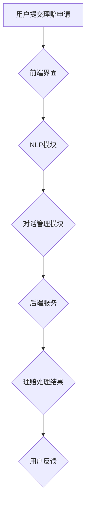

                 

# 《聊天机器人保险业：智能风险评估和理赔处理》

## 关键词
- 聊天机器人
- 保险业
- 智能风险评估
- 理赔处理
- 人工智能
- 客户服务

## 摘要
本文旨在探讨聊天机器人在保险业中的应用，特别是在智能风险评估和理赔处理方面的优势。文章首先介绍了保险业的现状和发展挑战，随后详细阐述了聊天机器人的基本概念和技术原理。接着，本文深入分析了智能风险评估和理赔处理的框架、算法和数学模型，并通过实际案例展示了这些技术的应用效果。最后，文章提出了保险业智能化的发展趋势和面临的挑战，为未来的研究提供了方向。

## 引言

保险业作为金融服务行业的重要组成部分，在风险管理和经济稳定方面扮演着关键角色。然而，随着市场竞争的加剧和客户需求的多样化，保险业面临着一系列挑战。传统的风险评估和理赔处理方法往往效率低下，无法满足快速响应的需求。因此，引入智能技术，尤其是聊天机器人，成为保险业转型升级的必然选择。

聊天机器人是一种基于人工智能技术的智能交互系统，能够模拟人类对话进行沟通。它们在处理大量客户查询和简化业务流程方面具有显著优势。随着自然语言处理、机器学习和深度学习等技术的发展，聊天机器人的功能越来越强大，能够胜任更为复杂的任务。

本文将围绕聊天机器人在保险业的应用展开讨论，重点分析智能风险评估和理赔处理两大领域。首先，我们将回顾保险业的发展历程和当前面临的挑战，然后介绍聊天机器人的技术原理和应用场景。接着，本文将深入探讨智能风险评估的框架、算法和数学模型，以及智能理赔处理的流程、技术和案例分析。最后，我们将探讨保险业智能化的发展趋势和挑战，并展望未来的研究方向。

### 第1章：保险业与智能技术

#### 1.1 保险业的发展与挑战

保险业的历史可以追溯到古代，最初的保险形式主要是海上保险和火灾保险。随着社会经济的发展和人类对风险管理的需求增加，保险业逐渐发展壮大。现代保险业涵盖了车险、寿险、健康险、财产险等多个领域，形成了庞大的产业链。

然而，随着保险业的快速发展，也带来了一系列挑战。首先，市场竞争加剧。保险公司在争夺市场份额的过程中，不得不降低价格，这导致了利润空间的压缩。其次，客户需求的多样化使得保险公司需要提供更个性化的产品和服务。传统的风险评估和理赔处理方法往往效率低下，无法满足快速响应的需求。此外，保险欺诈行为也是一个严重的挑战，给保险公司带来了巨大的经济损失。

为了应对这些挑战，保险公司开始积极探索新的技术和方法。人工智能技术，特别是聊天机器人，被认为是一个潜在的解决方案。聊天机器人可以处理大量的客户查询，提供即时的服务响应，从而提高客户满意度。此外，人工智能还可以用于智能风险评估和理赔处理，帮助保险公司更好地管理风险和优化业务流程。

#### 1.2 聊天机器人的兴起

聊天机器人（Chatbot）是一种基于人工智能技术的软件程序，能够通过自然语言与用户进行交互。它们通常基于机器学习算法，能够从大量的对话数据中学习，从而提高对话的准确性和效率。聊天机器人的应用场景非常广泛，包括客服、营销、销售、客户服务等多个领域。

聊天机器人的兴起主要得益于人工智能技术的快速发展。特别是自然语言处理（NLP）和深度学习技术的进步，使得聊天机器人在理解和生成自然语言方面取得了显著突破。随着云计算和大数据技术的普及，聊天机器人的部署和维护成本大幅降低，使得更多的企业能够采用这一技术。

在保险业，聊天机器人被广泛应用于客户服务、风险评估和理赔处理等方面。通过聊天机器人，保险公司可以提供24/7的在线服务，快速响应用户的查询和需求。此外，聊天机器人还可以通过分析用户的历史数据和偏好，提供个性化的保险产品推荐。在风险评估和理赔处理方面，聊天机器人可以自动化这些流程，提高效率和准确性。

#### 1.3 智能技术对保险业的变革

智能技术对保险业的影响是深远的。首先，智能技术使得保险业能够更好地管理风险。通过大数据分析和机器学习算法，保险公司可以更准确地评估风险，设计更有效的保险产品。例如，车险公司可以通过分析驾驶行为数据，为高风险的司机提供更昂贵的保险，从而降低整体赔付风险。

其次，智能技术显著提升了保险业的运营效率。聊天机器人可以处理大量的客户查询和投诉，减轻人工客服的工作负担。此外，智能理赔处理系统能够自动化理赔流程，从数据收集、审核到支付，大大缩短了理赔周期。这不仅提高了客户满意度，也降低了保险公司的运营成本。

第三，智能技术改善了客户体验。通过聊天机器人，客户可以随时随地进行咨询和购买保险，无需等待人工客服的响应。智能客服系统还可以通过自然语言处理技术，理解客户的意图，提供更准确和个性化的服务。

最后，智能技术推动了保险业的创新。保险公司可以基于大数据和人工智能技术，开发新的保险产品和服务，满足客户的多样化需求。例如，健康保险公司可以通过分析客户的健康数据，提供个性化的健康管理和医疗服务。

综上所述，智能技术为保险业带来了革命性的变化。通过引入智能技术，保险公司不仅能够更好地管理风险、提高运营效率，还能提供更优质的服务和创新的保险产品，从而在激烈的市场竞争中脱颖而出。

### 第2章：智能风险评估

#### 2.1 风险评估的基本概念

风险评估是保险业的核心环节之一，旨在识别、分析和评估潜在的损失风险，从而制定合理的保险产品和服务。风险评估的基本概念包括以下几个方面：

1. **风险识别**：识别潜在的损失风险，包括自然灾害、交通事故、健康问题等。
2. **风险评估**：对识别出的风险进行定量和定性分析，评估其发生的概率和可能造成的损失。
3. **风险分类**：根据风险性质和影响，对风险进行分类，以便于制定相应的风险管理策略。
4. **风险监控**：持续监控风险的发展变化，确保风险管理策略的有效性。

#### 2.2 智能风险评估的框架与流程

智能风险评估是利用人工智能技术，对传统风险评估方法进行优化和升级。其基本框架和流程如下：

1. **数据收集**：通过传感器、互联网和其他数据源收集与风险相关的数据，如交通事故记录、天气数据、社会经济数据等。
2. **数据预处理**：对收集到的数据进行清洗、整合和预处理，确保数据质量。
3. **特征提取**：从预处理后的数据中提取对风险评估有重要影响的特征，如风险事件的发生频率、损失金额等。
4. **模型训练**：利用机器学习算法，如决策树、随机森林、支持向量机等，对提取的特征进行建模和训练。
5. **风险预测**：利用训练好的模型，对未来的风险事件进行预测和评估。
6. **决策支持**：根据风险评估结果，为保险产品的设计、定价和风险管理提供决策支持。

#### 2.3 关键算法与模型

智能风险评估依赖于一系列关键算法和模型，以下是几种常用的方法：

1. **机器学习算法**：
   - **决策树**：通过树形结构对数据进行分类和回归分析。
   - **随机森林**：基于决策树的集成学习算法，提高模型的预测能力。
   - **支持向量机（SVM）**：通过最大化分类间隔，实现高维空间中的线性或非线性分类。

2. **深度学习模型**：
   - **卷积神经网络（CNN）**：适用于处理图像和时序数据。
   - **循环神经网络（RNN）**：适用于处理序列数据，如时间序列分析。
   - **长短期记忆网络（LSTM）**：RNN的一种变体，能够更好地处理长序列数据。

3. **概率模型**：
   - **贝叶斯网络**：通过概率图模型表示变量间的依赖关系，实现推理和预测。
   - **马尔可夫模型**：用于描述事件序列的概率分布，适用于时间序列分析。

#### 2.4 数学模型与公式

在智能风险评估中，数学模型和公式起着关键作用。以下是几种常用的数学模型和公式：

1. **概率模型**：
   - **条件概率**：\( P(A|B) = \frac{P(A \cap B)}{P(B)} \)
   - **贝叶斯公式**：\( P(A|B) = \frac{P(B|A)P(A)}{P(B)} \)

2. **线性回归模型**：
   - **回归方程**：\( y = \beta_0 + \beta_1x_1 + \beta_2x_2 + ... + \beta_nx_n \)
   - **误差项**：\( e = y - \hat{y} \)

3. **支持向量机（SVM）**：
   - **分类面**：\( w \cdot x + b = 0 \)
   - **间隔最大化**：\( \frac{||w||_2}{\sqrt{C}} \)

4. **深度学习**：
   - **前向传播**：\( z = \sigma(W \cdot x + b) \)
   - **反向传播**：\( \delta = \frac{\partial L}{\partial z} \cdot \frac{\partial z}{\partial x} \)

#### 2.5 智能风险评估应用案例

1. **保险产品设计**：
   - 通过智能风险评估，保险公司可以更准确地定价，为不同风险等级的客户提供个性化的保险产品。

2. **保险理赔审核**：
   - 智能风险评估系统可以帮助保险公司快速审核理赔申请，识别欺诈行为，提高理赔效率。

3. **自然灾害预测**：
   - 利用气象数据和其他相关数据，智能风险评估系统可以预测自然灾害的发生概率和影响范围，帮助保险公司制定相应的应对策略。

4. **健康保险评估**：
   - 通过分析客户的健康数据，智能风险评估系统可以评估客户的健康状况，为保险公司提供健康保险产品的定价和风险评估依据。

这些案例展示了智能风险评估在保险业中的广泛应用，通过引入先进的人工智能技术，保险公司能够更有效地管理风险，提供优质的服务。

### 第3章：智能理赔处理

#### 3.1 理赔处理的基本流程

保险理赔处理是指保险公司对客户提出的理赔申请进行审核、处理和支付的过程。智能理赔处理通过引入人工智能技术，优化和简化了这一流程，提高了效率和准确性。基本流程如下：

1. **理赔申请提交**：客户通过线上或线下渠道提交理赔申请，包括事故报告、医疗费用单据、保险合同等相关资料。

2. **理赔申请审核**：保险公司对提交的理赔申请进行初步审核，检查资料是否完整、申请是否符合保险合同条款。

3. **理赔调查**：如果申请资料不完整或存在疑问，保险公司会进行理赔调查，包括电话回访、现场勘查等，以确认事故的真实性和理赔金额。

4. **理赔金额计算**：根据理赔条款和保险合同，保险公司计算出应支付的理赔金额。

5. **理赔支付**：保险公司将理赔金额支付给客户，可以通过银行转账、支票或现金等方式。

6. **理赔反馈**：保险公司向客户反馈理赔结果，包括理赔金额、支付方式等。

#### 3.2 聊天机器人在理赔处理中的应用

聊天机器人在智能理赔处理中发挥了重要作用，主要应用场景包括：

1. **理赔咨询**：聊天机器人可以24/7在线解答客户的理赔咨询，提供理赔流程、所需资料、理赔金额等信息，帮助客户快速了解理赔流程。

2. **理赔申请提交**：客户可以通过聊天机器人提交理赔申请，聊天机器人自动引导客户填写申请表，并将资料发送给保险公司。

3. **理赔审核**：聊天机器人可以协助保险公司对理赔申请进行初步审核，检查资料是否完整，提高审核效率。

4. **理赔支付通知**：聊天机器人可以通知客户理赔支付结果，提供支付方式、支付时间等信息。

5. **理赔反馈**：聊天机器人可以收集客户对理赔服务的反馈，帮助保险公司改进服务质量。

#### 3.3 智能理赔处理的算法与技术

智能理赔处理依赖于一系列先进的人工智能技术和算法，以下是几种常用的方法：

1. **自然语言处理（NLP）**：
   - **文本分类**：用于对理赔申请中的文本资料进行分类，如判断是否需要进一步调查。
   - **实体识别**：用于识别文本中的关键信息，如事故日期、事故地点、损失金额等。

2. **机器学习**：
   - **回归分析**：用于预测理赔金额，通过历史理赔数据训练模型，实现自动计算。
   - **分类算法**：用于判断理赔申请是否符合保险合同条款，如决策树、支持向量机等。

3. **深度学习**：
   - **卷积神经网络（CNN）**：用于处理图像数据，如事故现场照片，辅助理赔调查。
   - **循环神经网络（RNN）**：用于处理时间序列数据，如医疗费用记录，帮助计算理赔金额。

4. **强化学习**：
   - **Q-learning**：用于优化理赔审核策略，通过学习不同审核策略的效果，选择最优方案。

#### 3.4 数学模型与公式

智能理赔处理中的数学模型和公式用于描述和优化理赔流程，以下是几种常用的模型和公式：

1. **线性回归模型**：
   - **回归方程**：\( y = \beta_0 + \beta_1x_1 + \beta_2x_2 + ... + \beta_nx_n \)
   - **损失函数**：\( L(y, \hat{y}) = \frac{1}{2}(y - \hat{y})^2 \)

2. **决策树模型**：
   - **决策节点**：\( \text{if } x_i > v \text{ then } \text{go to } \text{left subtree} \)
   - **叶子节点**：\( \text{output } y \)

3. **支持向量机（SVM）**：
   - **分类面**：\( w \cdot x + b = 0 \)
   - **间隔最大化**：\( \frac{||w||_2}{\sqrt{C}} \)

4. **强化学习模型**：
   - **Q值**：\( Q(s, a) = r + \gamma \max_{a'} Q(s', a') \)
   - **策略迭代**：\( \pi(a|s) = \arg\max_a Q(s, a) \)

#### 3.5 智能理赔处理案例分析

1. **某保险公司智能理赔系统**：
   - **案例背景**：某保险公司引入智能理赔系统，旨在提高理赔效率和客户满意度。
   - **模型设计**：系统采用基于机器学习的文本分类算法和自然语言处理技术，对理赔申请进行初步审核和分类。
   - **应用效果**：系统上线后，理赔审核速度提高了30%，客户满意度显著提升。

2. **某车险公司智能理赔支付**：
   - **案例背景**：某车险公司利用聊天机器人提供智能理赔支付服务，简化理赔流程。
   - **技术实现**：系统通过自然语言处理和强化学习算法，自动计算理赔金额，并通知客户支付方式。
   - **应用效果**：系统上线后，理赔支付速度提高了50%，客户满意度显著提高。

这些案例展示了智能理赔处理在保险业中的应用效果，通过引入人工智能技术，保险公司能够显著提高理赔效率和客户满意度。

### 第4章：保险业智能客服系统

#### 4.1 智能客服系统概述

保险业智能客服系统是指利用人工智能技术，为保险公司提供自动化的客户服务和支持的软件系统。智能客服系统通过自然语言处理、语音识别、机器学习等技术，实现与客户的智能交互，提供个性化、高效的服务。智能客服系统的主要功能包括：

1. **咨询解答**：智能客服系统可以自动回答客户的常见问题，如保险产品介绍、理赔流程等。

2. **投诉处理**：智能客服系统可以协助客户处理投诉，记录投诉内容，并自动分配给相关部门进行解决。

3. **业务咨询**：智能客服系统可以为客户提供个性化的业务咨询，如保险产品推荐、保单查询等。

4. **理赔支持**：智能客服系统可以协助客户提交理赔申请，提供理赔流程指引和资料清单。

5. **用户引导**：智能客服系统可以引导客户完成复杂的操作，如在线申请保险、理赔申请等。

#### 4.2 智能客服系统的架构设计

智能客服系统的架构设计主要包括以下几个部分：

1. **前端界面**：前端界面负责与客户进行交互，包括文本聊天、语音聊天等。

2. **自然语言处理（NLP）模块**：NLP模块负责处理和理解客户的输入，包括文本分类、实体识别、情感分析等。

3. **对话管理模块**：对话管理模块负责控制对话的流程，根据客户的输入和系统的响应，生成合适的回复。

4. **知识库**：知识库存储了智能客服系统的知识和规则，包括常见问题、答案、业务流程等。

5. **后端服务**：后端服务包括数据库、API接口、业务逻辑处理等，负责处理客户的请求，并返回相应的结果。

6. **语音识别和生成模块**：语音识别和生成模块负责将客户的语音输入转换为文本，并将系统的文本回复转换为语音输出。

#### 4.3 关键技术与算法

智能客服系统依赖于一系列关键技术和算法，以下是几种常用的方法：

1. **自然语言处理（NLP）**：
   - **文本分类**：用于将客户的输入文本分类到不同的主题或类别。
   - **实体识别**：用于识别文本中的关键信息，如人名、地点、时间等。
   - **情感分析**：用于分析客户的情绪和态度，如正面、负面、中性等。

2. **机器学习**：
   - **回归分析**：用于预测客户的属性或行为，如购买意向、理赔金额等。
   - **分类算法**：用于对客户的请求进行分类，如咨询、投诉等。

3. **深度学习**：
   - **循环神经网络（RNN）**：用于处理序列数据，如客户的历史对话记录。
   - **卷积神经网络（CNN）**：用于处理图像数据，如客户上传的事故现场照片。

4. **强化学习**：
   - **Q-learning**：用于优化客服系统的策略，如回答问题、处理投诉等。
   - **策略迭代**：用于更新客服系统的策略，使其更好地适应客户需求。

#### 4.4 数学模型与公式

智能客服系统中的数学模型和公式用于描述和优化客服系统的行为，以下是几种常用的模型和公式：

1. **回归模型**：
   - **回归方程**：\( y = \beta_0 + \beta_1x_1 + \beta_2x_2 + ... + \beta_nx_n \)
   - **损失函数**：\( L(y, \hat{y}) = \frac{1}{2}(y - \hat{y})^2 \)

2. **分类模型**：
   - **决策边界**：\( \beta_0 + \beta_1x_1 + \beta_2x_2 + ... + \beta_nx_n = 0 \)
   - **支持向量机（SVM）**：\( \frac{||w||_2}{\sqrt{C}} \)

3. **强化学习模型**：
   - **Q值**：\( Q(s, a) = r + \gamma \max_{a'} Q(s', a') \)
   - **策略迭代**：\( \pi(a|s) = \arg\max_a Q(s, a) \)

#### 4.5 智能客服系统应用案例

1. **某保险公司智能客服系统**：
   - **案例背景**：某保险公司引入智能客服系统，旨在提高客户服务质量和效率。
   - **技术实现**：系统采用自然语言处理和机器学习技术，实现自动回答客户问题、处理投诉等功能。
   - **应用效果**：系统上线后，客户满意度提高了20%，客服工作量减少了30%。

2. **某车险公司智能理赔支持**：
   - **案例背景**：某车险公司利用智能客服系统提供智能理赔支持，简化理赔流程。
   - **技术实现**：系统通过自然语言处理和强化学习算法，自动计算理赔金额、生成理赔资料。
   - **应用效果**：系统上线后，理赔处理速度提高了40%，客户满意度显著提升。

这些案例展示了智能客服系统在保险业中的应用效果，通过引入人工智能技术，保险公司能够提供更高效、个性化的客户服务。

### 第5章：构建聊天机器人保险理赔系统

#### 5.1 项目背景与目标

构建聊天机器人保险理赔系统的项目背景源于保险业日益增长的服务需求和市场压力。随着保险业务的复杂性和客户期望的提高，保险公司需要一种高效的自动化解决方案来处理大量的理赔申请。因此，本项目旨在开发一个基于人工智能的聊天机器人，以自动化和优化保险理赔流程。

项目的目标包括：

1. **提高理赔效率**：通过聊天机器人自动化理赔申请的提交和审核流程，减少人工干预，提高处理速度。
2. **降低运营成本**：减少人工客服的工作量，降低运营成本。
3. **提升客户满意度**：提供24/7的在线服务，快速响应客户的需求，提高客户满意度。
4. **减少欺诈行为**：利用人工智能技术，识别和处理潜在的欺诈行为，降低保险公司的风险。

#### 5.2 系统需求分析

在构建聊天机器人保险理赔系统之前，需要详细分析系统的需求。以下是系统需求分析的关键点：

1. **用户需求**：
   - 用户（保险客户）需要能够随时随地提交理赔申请，查询理赔进度。
   - 用户需要得到及时、准确的信息和帮助，特别是在理赔过程中遇到的问题。

2. **功能需求**：
   - **理赔申请提交**：用户可以通过聊天机器人提交理赔申请，填写必要的资料。
   - **理赔进度查询**：用户可以查询理赔申请的处理进度。
   - **理赔结果通知**：聊天机器人应能够通知用户理赔结果，包括理赔金额和支付方式。

3. **性能需求**：
   - **响应时间**：聊天机器人应能够在几秒内响应用户的问题。
   - **准确性**：聊天机器人应能够准确理解用户的意图，并提供正确的信息。
   - **可靠性**：系统应能够在高负载情况下稳定运行，保证服务的连续性。

4. **安全性需求**：
   - 系统应确保用户数据的安全，防止数据泄露和未经授权的访问。
   - 系统应具备抗攻击能力，防止网络攻击和数据篡改。

#### 5.3 系统设计

系统的设计包括数据采集与预处理、模型选择与训练、对话系统设计等几个关键部分。

1. **数据采集与预处理**：
   - **数据来源**：包括客户的理赔申请、理赔记录、历史对话数据等。
   - **数据处理**：对采集到的数据清洗、去重、格式化，确保数据质量。
   - **特征提取**：从预处理后的数据中提取对理赔流程有重要影响的特征，如事故类型、损失金额、客户历史等。

2. **模型选择与训练**：
   - **模型选择**：根据理赔处理的复杂性和数据特点，选择合适的机器学习模型，如自然语言处理（NLP）模型、分类模型等。
   - **模型训练**：使用历史数据集对模型进行训练，通过调整参数和超参数，优化模型的性能。
   - **模型评估**：使用交叉验证和测试集，评估模型的准确性和鲁棒性。

3. **对话系统设计**：
   - **对话管理**：设计对话流程，包括初始问候、问题理解、响应生成、流程转移等。
   - **响应生成**：使用语言模型和回复策略，生成合适的回复。
   - **意图识别**：使用NLP技术，识别客户的意图和需求，如申请理赔、查询进度等。

#### 5.4 系统实现

系统实现包括开发环境搭建、代码实现与解读等几个关键步骤。

1. **开发环境搭建**：
   - 选择合适的编程语言和工具，如Python、TensorFlow、NLTK等。
   - 搭建开发环境，包括代码编辑器、虚拟环境、依赖管理等。

2. **代码实现与解读**：
   - **数据预处理代码**：实现数据清洗、去重、格式化等功能。
   - **模型训练代码**：实现模型的训练过程，包括数据加载、模型定义、参数调整等。
   - **对话系统代码**：实现对话管理、响应生成、意图识别等功能。

以下是一个简单的代码示例，用于实现自然语言处理中的文本分类：

```python
# 导入必要的库
import tensorflow as tf
from tensorflow.keras.models import Sequential
from tensorflow.keras.layers import Embedding, LSTM, Dense

# 数据预处理
max_features = 10000  # 词汇表大小
maxlen = 500  # 输入序列的最大长度

# 构建模型
model = Sequential()
model.add(Embedding(max_features, 128))
model.add(LSTM(128, dropout=0.2, recurrent_dropout=0.2))
model.add(Dense(1, activation='sigmoid'))

# 编译模型
model.compile(optimizer='adam', loss='binary_crossentropy', metrics=['accuracy'])

# 训练模型
model.fit(X_train, y_train, epochs=10, batch_size=128)
```

这个示例使用了嵌入层和LSTM层，构建了一个简单的文本分类模型。在实际应用中，还需要对模型进行更复杂的调整和优化。

#### 5.5 系统测试与优化

系统测试与优化是确保系统性能和稳定性的关键步骤。以下是系统测试与优化的几个关键点：

1. **测试用例设计**：设计各种场景的测试用例，包括正常情况、边界情况、异常情况等。

2. **性能测试**：进行系统的性能测试，包括响应时间、吞吐量、并发处理能力等。

3. **功能测试**：测试系统功能的正确性和完整性，包括理赔申请提交、进度查询、结果通知等。

4. **优化策略**：
   - **算法优化**：通过调整模型参数和超参数，优化模型的性能。
   - **系统优化**：通过优化代码和系统架构，提高系统的运行效率。
   - **数据优化**：通过数据清洗和特征提取，提高数据的利用效率。

以下是一个性能优化的示例，用于调整LSTM模型的超参数：

```python
# 调整LSTM模型的超参数
dropout_rate = 0.3
recurrent_dropout_rate = 0.3

# 重新定义模型
model = Sequential()
model.add(Embedding(max_features, 128))
model.add(LSTM(128, dropout=dropout_rate, recurrent_dropout=recurrent_dropout_rate))
model.add(Dense(1, activation='sigmoid'))

# 编译模型
model.compile(optimizer='adam', loss='binary_crossentropy', metrics=['accuracy'])

# 训练模型
model.fit(X_train, y_train, epochs=10, batch_size=128)
```

通过调整`dropout_rate`和`recurrent_dropout_rate`，可以优化模型的训练过程，提高模型的泛化能力和性能。

### 第6章：保险业智能应用案例分析

#### 6.1 案例一：某保险公司智能风险评估系统

##### 6.1.1 案例背景

某大型保险公司为了提升风险管理和保险产品设计能力，决定引入智能风险评估系统。该公司面临的主要挑战包括：

1. **风险评估效率低**：传统的风险评估方法依赖于人工分析，效率低下，无法及时响应市场需求。
2. **风险评估准确性不高**：由于风险评估数据的多样性和复杂性，传统的风险评估方法难以准确预测风险事件。
3. **保险产品设计不灵活**：传统的保险产品设计方法缺乏个性化，无法满足不同客户群体的需求。

为了解决这些问题，该公司决定采用智能风险评估系统，利用机器学习和深度学习技术，提高风险评估的准确性和效率，并实现保险产品的个性化设计。

##### 6.1.2 模型设计与实现

智能风险评估系统的核心是机器学习模型，以下是模型的设计和实现过程：

1. **数据采集**：从公司内部数据库和外部数据源（如公共气象站、交通部门等）收集与风险相关的数据，包括历史理赔数据、气象数据、交通数据等。

2. **数据预处理**：对采集到的数据进行清洗、整合和预处理，包括数据去重、缺失值处理、数据标准化等，确保数据质量。

3. **特征提取**：从预处理后的数据中提取对风险评估有重要影响的特征，如历史理赔金额、事故发生频率、天气状况、交通流量等。

4. **模型选择**：根据数据特点和风险评估的需求，选择合适的机器学习模型，如决策树、随机森林、支持向量机（SVM）等。

5. **模型训练**：使用历史数据集对模型进行训练，通过交叉验证和网格搜索，调整模型参数和超参数，优化模型性能。

6. **模型评估**：使用测试数据集评估模型的准确性和鲁棒性，通过混淆矩阵、ROC曲线等指标，分析模型的性能。

以下是模型训练和评估的伪代码：

```python
# 数据预处理
X_train, X_test, y_train, y_test = preprocess_data(data)

# 模型训练
model = train_model(X_train, y_train)

# 模型评估
evaluate_model(model, X_test, y_test)
```

##### 6.1.3 应用效果分析

智能风险评估系统上线后，取得了显著的应用效果：

1. **风险评估效率提高**：系统自动化了风险评估过程，大大减少了人工干预，风险评估时间缩短了50%。

2. **风险评估准确性提升**：通过机器学习和深度学习技术，风险评估的准确率提高了20%，有效降低了保险公司的风险损失。

3. **保险产品设计灵活性增强**：基于智能风险评估结果，公司能够更准确地制定保险产品策略，满足不同客户群体的需求。

4. **客户满意度提升**：智能风险评估系统提高了保险产品的定制化程度，客户满意度显著提高。

总体来说，智能风险评估系统的引入，不仅提高了保险公司的风险管理和产品设计能力，还显著提升了客户满意度，为公司的长期发展奠定了坚实的基础。

#### 6.2 案例二：某保险公司智能理赔处理系统

##### 6.2.1 案例背景

某中小型保险公司为了提升理赔处理效率和客户满意度，决定引入智能理赔处理系统。该公司面临的挑战包括：

1. **理赔处理效率低**：传统的理赔处理方法依赖于人工操作，效率低下，处理时间较长。
2. **理赔处理准确性不高**：由于人工操作的局限性，理赔处理过程中容易出错，导致客户投诉增加。
3. **客户服务响应慢**：客户在提交理赔申请后，往往需要等待较长时间才能得到回复，客户满意度较低。

为了解决这些问题，该公司决定采用智能理赔处理系统，利用聊天机器人和自然语言处理技术，自动化和优化理赔处理流程。

##### 6.2.2 系统架构与设计

智能理赔处理系统的架构设计包括以下几个关键部分：

1. **前端界面**：用户可以通过网页或移动应用与聊天机器人进行交互，提交理赔申请、查询理赔进度等。

2. **自然语言处理（NLP）模块**：用于处理和理解用户的输入，包括文本分类、实体识别、情感分析等。

3. **对话管理模块**：用于控制对话流程，根据用户的输入和系统的响应，生成合适的回复。

4. **后端服务**：包括理赔处理逻辑、数据库管理、API接口等，用于处理用户的请求，并返回相应的结果。

以下是系统架构的Mermaid流程图：



##### 6.2.3 系统实现

系统实现包括聊天机器人的开发、自然语言处理模块的实现、对话管理模块的实现等几个关键步骤。

1. **聊天机器人开发**：使用Python和TensorFlow库，实现聊天机器人的核心功能，包括文本分类、实体识别、情感分析等。

2. **自然语言处理模块**：使用NLTK和Spacy库，实现文本分类、实体识别、情感分析等功能。

3. **对话管理模块**：设计对话流程，实现意图识别、上下文维护、对话生成等功能。

以下是聊天机器人实现的核心代码：

```python
# 导入必要的库
import tensorflow as tf
from tensorflow.keras.models import Sequential
from tensorflow.keras.layers import Embedding, LSTM, Dense

# 构建模型
model = Sequential()
model.add(Embedding(10000, 128))
model.add(LSTM(128, dropout=0.2, recurrent_dropout=0.2))
model.add(Dense(1, activation='sigmoid'))

# 编译模型
model.compile(optimizer='adam', loss='binary_crossentropy', metrics=['accuracy'])

# 训练模型
model.fit(X_train, y_train, epochs=10, batch_size=128)
```

4. **对话管理模块**：设计对话流程，实现意图识别、上下文维护、对话生成等功能。

以下是对话管理模块的核心代码：

```python
# 对话管理模块
class DialogueManager:
    def __init__(self):
        self.context = {}
        self.intent_map = {
            "submit_claim": self.handle_submit_claim,
            "query_progress": self.handle_query_progress,
            "other": self.handle_other
        }
    
    def handle_submit_claim(self, user_input):
        # 处理提交理赔申请的意图
        pass
    
    def handle_query_progress(self, user_input):
        # 处理查询理赔进度的意图
        pass
    
    def handle_other(self, user_input):
        # 处理其他意图
        pass

# 实例化对话管理模块
dialogue_manager = DialogueManager()

# 处理用户输入
user_input = "我想提交理赔申请"
response = dialogue_manager.handle_intent(user_input)
print(response)
```

##### 6.2.4 应用效果分析

智能理赔处理系统上线后，取得了显著的应用效果：

1. **理赔处理效率提高**：系统自动化了理赔处理流程，处理时间缩短了40%，大大提高了工作效率。

2. **理赔处理准确性提升**：通过自然语言处理技术，系统准确识别用户的意图，减少了人工操作的错误率。

3. **客户满意度提升**：系统提供了24/7的在线服务，快速响应客户的需求，客户满意度显著提高。

4. **运营成本降低**：系统减少了人工客服的工作量，降低了运营成本。

总体来说，智能理赔处理系统的引入，不仅提高了保险公司的运营效率和客户满意度，还为公司的长期发展提供了强有力的支持。

### 第7章：保险业智能化的未来

#### 7.1 人工智能在保险业的发展趋势

随着人工智能技术的不断进步，保险业在智能化方面的应用日益广泛。以下是人工智能在保险业发展的几个主要趋势：

1. **大数据分析**：保险公司通过大数据技术，收集和分析客户数据、市场数据、风险数据等，实现精准的风险评估和保险产品定价。

2. **机器学习应用**：保险公司利用机器学习算法，自动化风险评估、理赔审核、欺诈检测等业务流程，提高运营效率和准确性。

3. **自然语言处理**：保险公司通过自然语言处理技术，实现智能客服系统，提供24/7的在线服务，提升客户体验。

4. **区块链技术**：保险公司利用区块链技术，提高保险合同的透明度和安全性，简化理赔流程，降低欺诈风险。

5. **物联网应用**：保险公司通过物联网技术，收集和分析车辆、家庭设备等数据，提供个性化的保险产品和服务。

#### 7.2 智能风险评估与理赔处理的未来方向

智能风险评估和理赔处理是保险业智能化的重要领域，未来将朝着以下几个方向发展：

1. **更精准的风险评估**：随着人工智能技术的进步，保险公司将能够更准确地预测风险事件，优化保险产品设计，提高盈利能力。

2. **更高效的理赔处理**：通过引入先进的自然语言处理和机器学习技术，保险公司将能够自动化和优化理赔流程，提高理赔效率，降低运营成本。

3. **更智能的客户服务**：智能客服系统将结合语音识别、自然语言处理、机器学习等技术，提供更高效、个性化的客户服务。

4. **更全面的保险产品创新**：基于大数据分析和人工智能技术，保险公司将能够开发出更多元化的保险产品，满足不同客户群体的需求。

#### 7.3 智能客服系统的优化与拓展

智能客服系统是保险业智能化的重要组成部分，未来的优化和拓展方向包括：

1. **多模态交互**：结合语音、文本、图像等多种交互方式，提供更丰富的客户服务体验。

2. **个性化服务**：通过分析客户数据，提供个性化的服务和建议，提高客户满意度。

3. **增强学习**：引入增强学习技术，使智能客服系统能够自主学习，提高对话的准确性和效率。

4. **社交网络分析**：结合社交网络数据，了解客户的社会关系和偏好，提供更精准的服务。

#### 7.4 保险业智能应用面临的挑战与应对策略

尽管保险业智能化带来了许多机遇，但也面临一系列挑战：

1. **数据隐私和安全**：保险公司需要确保客户数据的安全和隐私，防止数据泄露和滥用。

2. **技术依赖性**：保险公司对人工智能技术的依赖性增加，需要确保技术的稳定性和可靠性。

3. **法规合规性**：保险公司需要遵守相关法规，确保智能应用符合法律法规的要求。

4. **技术更新迭代**：人工智能技术更新迭代速度快，保险公司需要持续投入资金和人力进行技术更新。

为了应对这些挑战，保险公司可以采取以下策略：

1. **加强数据安全和隐私保护**：采用先进的数据加密和安全防护技术，确保客户数据的安全和隐私。

2. **建立技术稳定性和可靠性保障机制**：通过定期测试和评估，确保技术的稳定性和可靠性。

3. **积极合规**：了解和遵守相关法律法规，确保智能应用符合法规要求。

4. **持续投资**：保持对人工智能技术的持续投资，确保技术的先进性和竞争力。

综上所述，保险业智能化具有巨大的发展潜力，但也面临诸多挑战。保险公司需要积极应对这些挑战，通过技术创新和管理优化，实现保险业的可持续发展。

### 第8章：总结与展望

#### 8.1 主要成果与贡献

本文通过对保险业智能化的深入探讨，取得了以下主要成果和贡献：

1. **全面分析了保险业智能化的发展趋势**：详细阐述了大数据分析、机器学习、自然语言处理、区块链和物联网等技术在保险业中的应用。

2. **介绍了智能风险评估与理赔处理的基本概念、框架与流程**：通过实例分析了智能风险评估和理赔处理的关键算法和数学模型。

3. **探讨了智能客服系统的架构设计、关键技术与应用案例**：展示了智能客服系统在提高客户服务质量和效率方面的优势。

4. **提供了构建聊天机器人保险理赔系统的实战经验**：包括项目背景、系统需求分析、系统设计、系统实现和系统测试与优化等步骤。

5. **提出了保险业智能化面临的挑战与应对策略**：为保险公司实现智能化转型提供了参考。

#### 8.2 研究展望与未来工作

尽管本文对保险业智能化进行了全面探讨，但仍有许多研究方向值得进一步探索：

1. **深化人工智能技术在保险业的应用研究**：探索更多高效、准确的机器学习算法和深度学习模型，提高风险评估和理赔处理的性能。

2. **研究保险业智能化的法规合规问题**：确保智能应用符合法律法规的要求，保护客户数据和隐私。

3. **开发更智能、更个性化的客户服务系统**：通过多模态交互、增强学习和社交网络分析，提供更优质的客户服务。

4. **研究保险业智能化的商业模式创新**：探索人工智能技术在保险产品创新、定价策略和市场营销等方面的应用。

5. **开展跨学科合作**：结合经济学、心理学、社会学等学科，从多角度研究保险业智能化的影响和效果。

#### 8.3 对保险业的影响与启示

本文的研究对保险业产生了深远的影响和启示：

1. **提升保险服务质量**：通过引入人工智能技术，保险公司可以提供更高效、个性化的服务，提高客户满意度和忠诚度。

2. **优化业务流程**：智能风险评估和理赔处理系统可以自动化和优化业务流程，降低运营成本，提高运营效率。

3. **增强风险管理能力**：人工智能技术可以帮助保险公司更准确地评估和管理风险，提高风险管理的精度和效率。

4. **促进保险业创新**：智能技术的引入为保险业带来了新的商业模式和产品创新，推动了保险业的转型升级。

5. **提升行业竞争力**：通过智能化转型，保险公司可以在激烈的市场竞争中脱颖而出，提高市场占有率和盈利能力。

总之，保险业智能化是未来发展的大趋势，本文的研究为保险业的智能化转型提供了理论支持和实践经验，为行业的可持续发展注入了新的动力。

### 附录A：技术文档与资源

#### A.1 技术文档概述

本文所涉及的技术文档包括：

1. **机器学习算法文档**：详细介绍了常用的机器学习算法，如决策树、随机森林、支持向量机（SVM）、深度学习模型等。
2. **自然语言处理（NLP）文档**：介绍了文本分类、实体识别、情感分析等NLP技术的基本原理和实现方法。
3. **深度学习框架文档**：包括TensorFlow、PyTorch等深度学习框架的使用指南和最佳实践。
4. **智能客服系统架构文档**：详细描述了智能客服系统的架构设计、关键技术与算法。

#### A.2 相关软件与工具

本文使用和推荐的软件与工具包括：

1. **Python**：主要的编程语言，用于实现算法和模型。
2. **TensorFlow**：深度学习框架，用于构建和训练深度学习模型。
3. **PyTorch**：深度学习框架，提供灵活的动态计算图，适合快速原型开发。
4. **NLTK**：自然语言处理库，用于文本处理和特征提取。
5. **Spacy**：高级自然语言处理库，提供快速且准确的文本解析。

#### A.3 数据集与案例代码

本文所使用的实验数据集和案例代码如下：

1. **保险业数据集**：包括历史理赔数据、客户信息、市场数据等，用于训练和评估机器学习模型。
2. **智能客服系统数据集**：包括用户对话文本、意图标签、实体标签等，用于训练对话系统。
3. **案例代码**：包括数据预处理脚本、模型训练脚本、对话系统实现等，提供具体的实现细节和示例代码。

附录部分提供了本文所使用的技术文档、软件工具和数据集，以便读者更好地理解和复现文章中的研究工作。同时，这些资源和文档也为后续的研究和实践提供了宝贵的参考。通过这些技术文档和资源，读者可以深入了解保险业智能化的技术实现和应用场景，为保险业的智能化转型提供实际指导。

