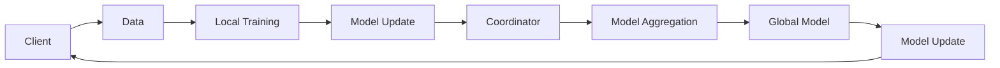

                 

# 联邦学习在隐私保护数据挖掘中的应用

> **关键词：** 联邦学习、隐私保护、数据挖掘、协同学习、安全性、优化算法

> **摘要：** 本文将深入探讨联邦学习在隐私保护数据挖掘中的应用。首先，我们将介绍联邦学习的核心概念与原理，包括其定义、基本架构、优势与挑战。接着，我们将详细解析联邦学习的核心算法原理，包括协同学习、同步与异步联邦学习、优化算法及安全性。随后，我们将展示联邦学习在分类、回归和聚类任务中的应用，并通过实际案例说明其在医疗健康和金融领域的应用。最后，我们将展望联邦学习的未来发展方向，并总结文章的主要观点。

---

## 第一部分：联邦学习的理论基础

### 第1章：联邦学习的核心概念与原理

#### 第1章.1 联邦学习的定义与背景

**联邦学习**（Federated Learning）是一种分布式机器学习方法，其核心思想是多个参与者在不共享数据的情况下，通过模型参数的协作更新来实现机器学习模型的训练。这种方法能够有效地保护用户数据的隐私，同时允许机构或组织在保留数据本地存储的同时，共同学习和提升模型性能。

**背景：** 随着大数据和云计算的发展，越来越多的数据被存储在云端或第三方服务器上，这引发了对数据隐私安全的广泛关注。联邦学习提供了一种解决方案，允许不同机构或组织在不共享原始数据的情况下，通过协作学习提升模型性能，从而在保护数据隐私的同时，实现跨域合作和资源利用。

#### 第1章.2 联邦学习的基本架构

联邦学习的基本架构通常包括以下三个主要组件：客户端（Client）、协调器（Coordinator）和服务器（Server）。

- **客户端（Client）：** 负责数据的本地处理和模型训练。客户端通常是一个或多个设备，如手机、传感器等，它们可以在本地进行数据预处理和模型训练。
- **协调器（Coordinator）：** 负责协调和管理联邦学习的过程。协调器通常运行在一个中心服务器上，负责分配任务、接收来自客户端的模型更新，并进行模型聚合。
- **服务器（Server）：** 负责存储全局模型参数和最终的训练结果。服务器在联邦学习中起到了关键作用，它通过接收来自协调器的更新，来迭代地优化全局模型。

#### 第1章.3 联邦学习的优势与挑战

**优势：**
1. **数据隐私保护：** 联邦学习通过在本地设备上处理数据，避免了数据在传输过程中被窃取或篡改的风险，从而保护了用户隐私。
2. **数据集中化：** 联邦学习允许机构或组织在无需数据共享的情况下，共同学习和提升模型性能，从而实现数据集中化的优势。
3. **跨域合作：** 联邦学习支持不同机构或组织在保持数据本地存储的同时，进行合作学习和模型优化，促进了跨域合作。

**挑战：**
1. **安全性与隐私保护：** 尽管联邦学习在保护数据隐私方面具有优势，但仍然面临着安全性问题和隐私保护挑战。
2. **可扩展性与性能：** 联邦学习需要在保证数据隐私的同时，保证模型的性能和可扩展性，这是当前研究的一个热点问题。
3. **模型质量和一致性：** 联邦学习中的模型更新和聚合过程可能会导致模型质量和一致性的问题，这需要进一步的研究和优化。

### 第2章：联邦学习的核心算法原理

#### 第2章.1 协同学习算法

**协同学习算法**是联邦学习中的核心算法，它通过分布式的方式协同优化模型参数。协同学习算法的基本步骤如下：

1. **数据分配：** 协调器将全局模型参数分配给各个客户端。
2. **模型更新：** 客户端在本地使用本地数据更新模型参数。
3. **模型聚合：** 协调器将各个客户端的模型更新聚合起来，形成新的全局模型参数。

**伪代码：**
```
// 初始化全局模型参数 W0
W0 = 初始化()

for each 循环轮次 do
    // 分配全局模型参数给客户端
    for each 客户端 do
        客户端.W = W0.copy()
    end for

    // 客户端本地更新模型参数
    for each 客户端 do
        客户端.W = 客户端本地训练(客户端.W)
    end for

    // 聚合客户端的模型更新
    W0 = 协调器聚合(客户端.W)
end for
```

#### 第2章.2 同步与异步联邦学习

**同步联邦学习**要求所有客户端在相同的时间步内进行模型更新。同步联邦学习的优点是模型更新过程简单，但缺点是当客户端数量较多时，同步通信的成本会很高。

**异步联邦学习**允许客户端在不同时间步内进行模型更新。异步联邦学习的优点是通信成本较低，但缺点是模型更新的不确定性会增加。

**伪代码：**
```
// 同步联邦学习
for each 循环轮次 do
    // 客户端本地更新模型参数
    for each 客户端 do
        客户端.W = 客户端本地训练(客户端.W)
    end for

    // 聚合客户端的模型更新
    W0 = 协调器聚合(客户端.W)
end for

// 异步联邦学习
while 满足终止条件 do
    // 客户端本地更新模型参数
    for each 客户端 do
        if 客户端满足更新条件 then
            客户端.W = 客户端本地训练(客户端.W)
        end if
    end for

    // 聚合客户端的模型更新
    W0 = 协调器聚合(客户端.W)
end while
```

#### 第2章.3 联邦学习的优化算法

**优化算法**是联邦学习中提高模型性能的关键。常见的优化算法包括梯度下降法、随机梯度下降法（SGD）等。

**梯度下降法**通过迭代更新模型参数，以最小化损失函数。其优化过程可以表示为：
$$
\theta_{t+1} = \theta_{t} - \alpha \cdot \nabla J(\theta_{t})
$$
其中，$\theta_{t}$表示第t次迭代的模型参数，$\alpha$是学习率，$\nabla J(\theta_{t})$是损失函数关于模型参数的梯度。

**随机梯度下降法（SGD）**是对梯度下降法的改进，每次迭代只更新一个样本的梯度。其优化过程可以表示为：
$$
\theta_{t+1} = \theta_{t} - \alpha \cdot \nabla J(\theta_{t})(x_{t}, y_{t})
$$
其中，$x_{t}$和$y_{t}$是第t次迭代的训练样本和标签。

**伪代码：**
```
// 梯度下降法
for each 循环轮次 do
    W = W - 学习率 * 梯度(J(W))
end for

// 随机梯度下降法
for each 循环轮次 do
    for each 训练样本 (x, y) do
        W = W - 学习率 * 梯度(J(W)(x, y))
    end for
end for
```

#### 第2章.4 联邦学习的安全性

**安全性**是联邦学习中的关键挑战之一。为了保护数据隐私和模型安全，联邦学习采用了一系列安全技术。

- **同态加密**：同态加密允许在加密数据上进行计算，从而保护数据的隐私。
- **差分隐私**：差分隐私通过引入噪声来保护数据的隐私，确保单个数据记录无法被追踪。
- **零知识证明**：零知识证明允许证明某个陈述为真，而无需透露任何额外的信息。

**同态加密**的数学模型可以表示为：
$$
E(k, m) = c
$$
其中，$k$是加密密钥，$m$是明文数据，$c$是密文数据。

**差分隐私**的数学模型可以表示为：
$$
\mathbb{P}[\hat{d} = d'] \leq \epsilon + \frac{\epsilon'}{|D|}
$$
其中，$\hat{d}$是添加噪声后的数据差异，$d'$是实际的数据差异，$\epsilon$是隐私预算，$|D|$是数据集的大小。

**零知识证明**的数学模型可以表示为：
$$
Prover(P, s) = (r, s)
$$
其中，$P$是零知识证明协议，$s$是证明者持有的证明信息，$r$是验证者接收到的证明。

### 第二部分：联邦学习在隐私保护数据挖掘中的应用

#### 第3章：联邦学习在分类任务中的应用

联邦学习在分类任务中具有广泛的应用，包括二分类任务和多分类任务。

#### 第3章.1 联邦学习在二分类任务中的应用

在二分类任务中，联邦学习可以通过以下步骤实现：

1. **模型设计**：设计一个简单的二分类模型，如逻辑回归模型。
2. **模型训练**：在客户端上使用本地数据进行模型训练，并在协调器上进行模型聚合。
3. **模型评估**：在测试集上评估模型的性能，包括准确率、召回率等指标。

**伪代码：**
```
// 模型设计
模型 = 逻辑回归()

for each 循环轮次 do
    // 模型训练
    for each 客户端 do
        客户端模型 = 客户端本地训练(模型)
    end for

    // 模型聚合
    模型 = 协调器聚合(客户端模型)
end for

// 模型评估
准确率 = 测试集评估(模型)
```

#### 第3章.2 联邦学习在多分类任务中的应用

在多分类任务中，联邦学习可以通过以下步骤实现：

1. **模型设计**：设计一个简单的多分类模型，如softmax回归模型。
2. **模型训练**：在客户端上使用本地数据进行模型训练，并在协调器上进行模型聚合。
3. **模型评估**：在测试集上评估模型的性能，包括准确率、召回率等指标。

**伪代码：**
```
// 模型设计
模型 = softmax回归()

for each 循环轮次 do
    // 模型训练
    for each 客户端 do
        客户端模型 = 客户端本地训练(模型)
    end for

    // 模型聚合
    模型 = 协调器聚合(客户端模型)
end for

// 模型评估
准确率 = 测试集评估(模型)
```

#### 第4章：联邦学习在回归任务中的应用

联邦学习在回归任务中的应用与分类任务类似，但需要注意的是，回归任务的损失函数和优化算法与分类任务有所不同。

#### 第4章.1 联邦学习在回归任务中的应用

在回归任务中，联邦学习可以通过以下步骤实现：

1. **模型设计**：设计一个简单的回归模型，如线性回归模型。
2. **模型训练**：在客户端上使用本地数据进行模型训练，并在协调器上进行模型聚合。
3. **模型评估**：在测试集上评估模型的性能，包括均方误差（MSE）等指标。

**伪代码：**
```
// 模型设计
模型 = 线性回归()

for each 循环轮次 do
    // 模型训练
    for each 客户端 do
        客户端模型 = 客户端本地训练(模型)
    end for

    // 模型聚合
    模型 = 协调器聚合(客户端模型)
end for

// 模型评估
MSE = 测试集评估(模型)
```

#### 第5章：联邦学习在聚类任务中的应用

联邦学习在聚类任务中的应用相对较少，但也有一些研究成果。在聚类任务中，联邦学习可以通过以下步骤实现：

1. **模型设计**：设计一个简单的聚类模型，如K均值聚类模型。
2. **模型训练**：在客户端上使用本地数据进行模型训练，并在协调器上进行模型聚合。
3. **模型评估**：在测试集上评估模型的性能，包括聚类准确率等指标。

**伪代码：**
```
// 模型设计
模型 = K均值聚类()

for each 循环轮次 do
    // 模型训练
    for each 客户端 do
        客户端模型 = 客户端本地训练(模型)
    end for

    // 模型聚合
    模型 = 协调器聚合(客户端模型)
end for

// 模型评估
聚类准确率 = 测试集评估(模型)
```

### 第三部分：联邦学习的实际应用案例

#### 第6章：联邦学习在医疗健康领域的应用

医疗健康领域的数据通常包含敏感个人信息，如患者病史、诊断结果等，这使得联邦学习在医疗健康数据挖掘中具有重要的应用价值。

#### 第6章.1 联邦学习在医疗健康数据挖掘中的应用

在医疗健康数据挖掘中，联邦学习可以通过以下步骤实现：

1. **数据预处理**：对医疗健康数据进行预处理，包括数据清洗、特征提取等。
2. **模型设计**：设计一个适合医疗健康数据的模型，如深度神经网络模型。
3. **模型训练**：在客户端上进行模型训练，并在协调器上进行模型聚合。
4. **模型评估**：在测试集上评估模型的性能，包括准确率、召回率等指标。

**伪代码：**
```
// 数据预处理
数据 = 数据预处理(医疗健康数据)

// 模型设计
模型 = 深度神经网络()

for each 循环轮次 do
    // 模型训练
    for each 客户端 do
        客户端模型 = 客户端本地训练(模型, 数据)
    end for

    // 模型聚合
    模型 = 协调器聚合(客户端模型)
end for

// 模型评估
准确率 = 测试集评估(模型)
```

#### 第7章：联邦学习在金融领域的应用

金融领域的数据通常包含大量敏感信息，如交易记录、用户行为等，这使得联邦学习在金融风控和用户行为分析中具有重要的应用价值。

#### 第7章.1 联邦学习在金融风控中的应用

在金融风控中，联邦学习可以通过以下步骤实现：

1. **数据预处理**：对金融数据进行预处理，包括数据清洗、特征提取等。
2. **模型设计**：设计一个适合金融风控的模型，如决策树模型。
3. **模型训练**：在客户端上进行模型训练，并在协调器上进行模型聚合。
4. **模型评估**：在测试集上评估模型的性能，包括准确率、召回率等指标。

**伪代码：**
```
// 数据预处理
数据 = 数据预处理(金融数据)

// 模型设计
模型 = 决策树()

for each 循环轮次 do
    // 模型训练
    for each 客户端 do
        客户端模型 = 客户端本地训练(模型, 数据)
    end for

    // 模型聚合
    模型 = 协调器聚合(客户端模型)
end for

// 模型评估
准确率 = 测试集评估(模型)
```

### 第四部分：联邦学习的未来发展

#### 第8章：联邦学习的未来发展方向

联邦学习作为一种新兴的分布式机器学习方法，在未来仍然有许多发展方向。

#### 第8章.1 联邦学习的技术发展趋势

1. **新型联邦学习算法**：随着联邦学习的研究不断深入，新型联邦学习算法如联邦迁移学习、联邦增强学习等不断涌现，这些算法有望进一步提升联邦学习的性能和适用范围。
2. **跨领域联邦学习**：跨领域联邦学习是一种将不同领域的数据进行整合和学习的联邦学习方法，它有望在医疗健康、金融、物联网等领域发挥重要作用。
3. **联邦学习在物联网（IoT）中的应用**：随着物联网技术的发展，联邦学习在物联网数据挖掘、设备协同等方面具有广阔的应用前景。

#### 第8章.2 联邦学习在物联网（IoT）中的应用

1. **物联网数据的特点与挑战**：物联网数据具有海量、异构、实时性高等特点，同时面临着数据隐私保护、数据一致性等挑战。
2. **联邦学习在物联网中的应用**：联邦学习可以通过在物联网设备上进行本地数据处理和模型更新，实现设备协同和数据共享，同时保证数据隐私和安全。

### 附录

#### 附录A：联邦学习相关资源与工具

1. **联邦学习开源框架**：如TensorFlow Federated、PySyft等。
2. **联邦学习相关论文与书籍**：推荐一些高质量的论文和书籍，供读者进一步学习和研究。

#### 附录B：联邦学习实验指南

1. **实验环境搭建**：介绍如何搭建联邦学习实验环境，包括开发环境配置、数据集获取与预处理等。
2. **实验步骤与代码实现**：详细讲解实验步骤和代码实现，包括模型设计、模型训练、模型评估等。
3. **实验结果分析**：分析实验结果，包括模型性能评估、结果可视化与解释等。

### 总结

联邦学习在隐私保护数据挖掘中具有广泛的应用前景。通过联邦学习，我们可以实现数据隐私保护、跨机构合作和模型优化。在未来，随着新型算法、跨领域联邦学习和物联网应用的发展，联邦学习将发挥更大的作用。

### 作者信息

作者：AI天才研究院/AI Genius Institute & 禅与计算机程序设计艺术 /Zen And The Art of Computer Programming

---

## 第一部分：联邦学习的理论基础

### 第1章：联邦学习的核心概念与原理

#### 1.1 联邦学习的定义与背景

**联邦学习**是一种分布式机器学习方法，其核心思想是在多个参与方之间协作训练机器学习模型，而不需要将这些参与方的数据集中到一个中央位置。这种方法的出现是为了解决数据隐私和安全问题，尤其是在当前对个人数据隐私保护要求日益严格的背景下。

**定义：** 联邦学习是一种分布式机器学习范式，其中多个参与者（通常是设备或服务器）各自在本地数据上训练模型，并通过交换模型参数来实现协同学习。在这个过程中，参与者不需要共享原始数据，而是共享训练得到的模型参数。

**背景：** 联邦学习的概念源于对集中式机器学习模型的改进。在传统的集中式机器学习中，所有的数据都会被上传到中央服务器，然后在这个中心位置进行训练。这种方法虽然能够获得较高的模型性能，但同时也带来了数据隐私和安全的风险。联邦学习的出现，提供了一种在保护数据隐私的同时，实现机器学习模型协同优化的解决方案。

#### 1.2 联邦学习的基本架构

联邦学习的基本架构通常包括三个主要组件：客户端（Client）、协调器（Coordinator）和服务器（Server）。每个组件在联邦学习过程中扮演着不同的角色。

**客户端（Client）：** 客户端是联邦学习中的参与者，通常是设备或服务器，它们在本地拥有自己的数据。客户端的主要任务是使用本地数据进行模型训练，并将训练得到的模型参数上传到协调器。

**协调器（Coordinator）：** 协调器是联邦学习过程中的核心组件，负责协调和管理整个学习过程。它接收来自客户端的模型参数更新，进行模型聚合，并生成新的全局模型参数，然后将这些参数发送回客户端。

**服务器（Server）：** 服务器在联邦学习中主要用于存储全局模型参数和最终训练结果。服务器不需要访问原始数据，它只与协调器进行交互，接收和发送模型参数。

联邦学习的基本架构可以用以下Mermaid流程图表示：



#### 1.3 联邦学习的优势与挑战

**优势：**

1. **数据隐私保护：** 联邦学习的一个主要优势是它能够在不共享原始数据的情况下，实现模型的协同优化。这有效地保护了用户的隐私，特别是在涉及敏感数据（如医疗、金融信息）的情况下。

2. **数据集中化：** 联邦学习允许不同机构或组织在保留数据本地存储的同时，共同学习和提升模型性能。这种模式避免了数据集中化所带来的风险和成本。

3. **跨域合作：** 联邦学习支持跨机构、跨领域的合作。例如，不同医疗机构可以在保护患者隐私的同时，共同训练疾病预测模型。

**挑战：**

1. **安全性与隐私保护：** 尽管联邦学习在保护数据隐私方面具有优势，但仍然面临着安全性问题和隐私保护挑战。例如，如何确保模型参数的传输过程是安全的，如何防止恶意参与者的攻击。

2. **可扩展性与性能：** 联邦学习需要在保证数据隐私的同时，保证模型的性能和可扩展性。例如，如何减少通信开销，提高模型训练的效率。

3. **模型质量和一致性：** 联邦学习中的模型更新和聚合过程可能会导致模型质量和一致性的问题。特别是在参与方数量较多或数据分布不均匀的情况下，如何保证模型的一致性和鲁棒性是一个挑战。

### 第2章：联邦学习的核心算法原理

#### 2.1 协同学习算法

协同学习算法是联邦学习的核心，它通过分布式的方式协同优化模型参数。协同学习算法的基本步骤如下：

1. **数据分配：** 协调器将全局模型参数分配给各个客户端。
2. **模型更新：** 客户端在本地使用本地数据更新模型参数。
3. **模型聚合：** 协调器将各个客户端的模型更新聚合起来，形成新的全局模型参数。

协同学习算法的关键在于如何高效地分配数据、更新模型参数和聚合模型更新。以下是一个简单的协同学习算法的伪代码：

```python
# 初始化全局模型参数
global_model = initialize_model()

# 轮次迭代
for round in range(num_rounds):
    # 分配全局模型参数给客户端
    for client in clients:
        client_model = global_model.copy()

    # 客户端本地更新模型参数
    for client in clients:
        client_model = client.local_train(client_model, local_data)

    # 聚合客户端的模型更新
    global_model = coordinator.aggregate(client_models)

# 最终全局模型
final_model = global_model
```

#### 2.2 同步与异步联邦学习

同步与异步联邦学习是联邦学习中的两种常见模式，它们在通信和计算方面有不同的特点。

**同步联邦学习：** 同步联邦学习要求所有客户端在相同的时间步内进行模型更新。这意味着客户端需要等待协调器分配完模型参数后，再同时进行本地训练和模型更新。同步联邦学习的优点是算法简单，易于实现，但缺点是通信成本较高，特别是在客户端数量较多时。

**异步联邦学习：** 异步联邦学习允许客户端在不同时间步内进行模型更新。这意味着客户端可以按照自己的节奏进行本地训练和模型更新，无需等待其他客户端。异步联邦学习的优点是通信成本较低，但缺点是模型更新的不确定性会增加，可能导致收敛速度变慢。

以下是一个简单的异步联邦学习算法的伪代码：

```python
# 初始化全局模型参数
global_model = initialize_model()

# 轮次迭代
for round in range(num_rounds):
    # 分配全局模型参数给客户端
    for client in clients:
        client_model = global_model.copy()

    # 客户端异步更新模型参数
    for client in clients:
        if client.is_ready():
            client_model = client.local_train(client_model, local_data)
            client.send_model_update(client_model)

    # 聚合客户端的模型更新
    global_model = coordinator.aggregate_received_models()

# 最终全局模型
final_model = global_model
```

#### 2.3 联邦学习的优化算法

联邦学习的优化算法是提高模型性能的关键。常见的优化算法包括梯度下降法、随机梯度下降法（SGD）和Adam优化器等。

**梯度下降法：** 梯度下降法是一种最基本的优化算法，它通过迭代更新模型参数，以最小化损失函数。梯度下降法的优化过程可以表示为：

$$
\theta_{t+1} = \theta_{t} - \alpha \cdot \nabla J(\theta_{t})
$$

其中，$\theta_{t}$表示第t次迭代的模型参数，$\alpha$是学习率，$\nabla J(\theta_{t})$是损失函数关于模型参数的梯度。

**随机梯度下降法（SGD）：** 随机梯度下降法是对梯度下降法的改进，它每次迭代只更新一个样本的梯度。这种方法的优点是计算速度快，但缺点是收敛速度较慢，并且容易陷入局部最优。随机梯度下降法的优化过程可以表示为：

$$
\theta_{t+1} = \theta_{t} - \alpha \cdot \nabla J(\theta_{t})(x_{t}, y_{t})
$$

其中，$x_{t}$和$y_{t}$是第t次迭代的训练样本和标签。

**Adam优化器：** Adam优化器是一种结合了SGD和动量法的优化算法，它在SGD的基础上引入了一阶和二阶矩估计，从而提高了收敛速度和稳定性。Adam优化器的优化过程可以表示为：

$$
\theta_{t+1} = \theta_{t} - \alpha \cdot \frac{m_t}{\sqrt{v_t} + \epsilon}
$$

其中，$m_t$是梯度的一阶矩估计，$v_t$是梯度的二阶矩估计，$\alpha$是学习率，$\epsilon$是正则化项。

以下是一个简单的联邦学习优化算法的伪代码：

```python
# 初始化模型参数
theta = initialize_parameters()

# 初始化Adam优化器的参数
m = 0
v = 0
epsilon = 1e-8

# 轮次迭代
for round in range(num_rounds):
    # 分配全局模型参数给客户端
    for client in clients:
        client_theta = theta.copy()

    # 客户端本地更新模型参数
    for client in clients:
        client_theta, m, v = client.local_train(client_theta, local_data, m, v)

    # 聚合客户端的模型更新
    theta, m, v = coordinator.aggregate_models(client_thetas, m, v)

# 最终模型参数
final_theta = theta
```

#### 2.4 联邦学习的安全性

联邦学习的安全性是一个重要的研究方向，特别是在涉及敏感数据的情况下。为了保护数据隐私和模型安全，联邦学习采用了一系列安全技术。

**同态加密：** 同态加密是一种加密技术，它允许在加密数据上进行计算，从而保护数据的隐私。同态加密的基本原理是将原始数据和模型参数加密成密文，然后在这些密文上进行计算，最终得到加密的结果。同态加密可以分为部分同态加密和完全同态加密。部分同态加密允许对数据进行有限次的同态运算，而完全同态加密则允许任意次数的同态运算。

**差分隐私：** 差分隐私是一种在数据处理过程中引入噪声，从而保护数据隐私的技术。差分隐私的基本原理是通过在数据上添加噪声，使得单个数据记录无法被追踪。差分隐私的数学模型可以表示为：

$$
\mathbb{P}[\hat{d} = d'] \leq \epsilon + \frac{\epsilon'}{|D|}
$$

其中，$\hat{d}$是添加噪声后的数据差异，$d'$是实际的数据差异，$\epsilon$是隐私预算，$|D|$是数据集的大小。

**零知识证明：** 零知识证明是一种密码学技术，它允许证明某个陈述为真，而无需透露任何额外的信息。零知识证明的基本原理是，证明者可以向验证者证明某个陈述为真，而无需透露陈述的具体细节。零知识证明可以分为零知识证明协议和零知识证明系统。

**联邦学习的安全性技术：** 联邦学习在安全性方面采用了多种技术，包括同态加密、差分隐私和零知识证明等。同态加密可以用于保护模型参数的传输和存储，差分隐私可以用于保护训练数据的隐私，而零知识证明可以用于保护模型训练过程中的隐私。

以下是一个简单的联邦学习安全性技术的伪代码：

```python
# 同态加密
encrypted_data = encrypt(data, public_key)

# 差分隐私
noisy_difference = add_noise(difference, epsilon)

# 零知识证明
proof = prove_statement(statement, private_key)

# 验证零知识证明
is_valid = verify_proof(proof, public_key)
```

### 第二部分：联邦学习在隐私保护数据挖掘中的应用

#### 第3章：联邦学习在分类任务中的应用

联邦学习在分类任务中具有广泛的应用，包括二分类任务和多分类任务。

#### 3.1 联邦学习在二分类任务中的应用

在二分类任务中，联邦学习可以通过以下步骤实现：

1. **模型设计：** 设计一个简单的二分类模型，如逻辑回归模型。
2. **模型训练：** 在客户端上使用本地数据进行模型训练，并在协调器上进行模型聚合。
3. **模型评估：** 在测试集上评估模型的性能，包括准确率、召回率等指标。

以下是一个简单的二分类任务的联邦学习流程：

```python
# 初始化模型
model = LogisticRegression()

# 轮次迭代
for round in range(num_rounds):
    # 分配模型参数给客户端
    for client in clients:
        client_model = model.copy()

    # 客户端本地训练模型
    for client in clients:
        client_model.fit(client_data, client_labels)

    # 聚合模型参数
    model = coordinator.aggregate_models(client_models)

# 模型评估
accuracy = model.score(test_data, test_labels)
```

#### 3.2 联邦学习在多分类任务中的应用

在多分类任务中，联邦学习可以通过以下步骤实现：

1. **模型设计：** 设计一个简单的多分类模型，如softmax回归模型。
2. **模型训练：** 在客户端上使用本地数据进行模型训练，并在协调器上进行模型聚合。
3. **模型评估：** 在测试集上评估模型的性能，包括准确率、召回率等指标。

以下是一个简单的多分类任务的联邦学习流程：

```python
# 初始化模型
model = LogisticRegression()

# 轮次迭代
for round in range(num_rounds):
    # 分配模型参数给客户端
    for client in clients:
        client_model = model.copy()

    # 客户端本地训练模型
    for client in clients:
        client_model.fit(client_data, client_labels)

    # 聚合模型参数
    model = coordinator.aggregate_models(client_models)

# 模型评估
accuracy = model.score(test_data, test_labels)
```

#### 第4章：联邦学习在回归任务中的应用

联邦学习在回归任务中的应用与分类任务类似，但需要注意的是，回归任务的损失函数和优化算法与分类任务有所不同。

#### 4.1 联邦学习在回归任务中的应用

在回归任务中，联邦学习可以通过以下步骤实现：

1. **模型设计：** 设计一个简单的回归模型，如线性回归模型。
2. **模型训练：** 在客户端上使用本地数据进行模型训练，并在协调器上进行模型聚合。
3. **模型评估：** 在测试集上评估模型的性能，包括均方误差（MSE）等指标。

以下是一个简单的回归任务的联邦学习流程：

```python
# 初始化模型
model = LinearRegression()

# 轮次迭代
for round in range(num_rounds):
    # 分配模型参数给客户端
    for client in clients:
        client_model = model.copy()

    # 客户端本地训练模型
    for client in clients:
        client_model.fit(client_data, client_labels)

    # 聚合模型参数
    model = coordinator.aggregate_models(client_models)

# 模型评估
mse = model.score(test_data, test_labels)
```

#### 第5章：联邦学习在聚类任务中的应用

联邦学习在聚类任务中的应用相对较少，但也有一些研究成果。在聚类任务中，联邦学习可以通过以下步骤实现：

1. **模型设计：** 设计一个简单的聚类模型，如K均值聚类模型。
2. **模型训练：** 在客户端上使用本地数据进行模型训练，并在协调器上进行模型聚合。
3. **模型评估：** 在测试集上评估模型的性能，包括聚类准确率等指标。

以下是一个简单的聚类任务的联邦学习流程：

```python
# 初始化模型
model = KMeans()

# 轮次迭代
for round in range(num_rounds):
    # 分配模型参数给客户端
    for client in clients:
        client_model = model.copy()

    # 客户端本地训练模型
    for client in clients:
        client_model.fit(client_data)

    # 聚合模型参数
    model = coordinator.aggregate_models(client_models)

# 模型评估
accuracy = evaluate_clustering(model, test_data)
```

### 第三部分：联邦学习的实际应用案例

#### 第6章：联邦学习在医疗健康领域的应用

医疗健康领域的数据通常包含敏感个人信息，如患者病史、诊断结果等，这使得联邦学习在医疗健康数据挖掘中具有重要的应用价值。

#### 6.1 联邦学习在医疗健康数据挖掘中的应用

在医疗健康数据挖掘中，联邦学习可以通过以下步骤实现：

1. **数据预处理：** 对医疗健康数据进行预处理，包括数据清洗、特征提取等。
2. **模型设计：** 设计一个适合医疗健康数据的模型，如深度神经网络模型。
3. **模型训练：** 在客户端上进行模型训练，并在协调器上进行模型聚合。
4. **模型评估：** 在测试集上评估模型的性能，包括准确率、召回率等指标。

以下是一个简单的医疗健康数据挖掘的联邦学习流程：

```python
# 数据预处理
data = preprocess_medical_data(health_data)

# 初始化模型
model = NeuralNetwork()

# 轮次迭代
for round in range(num_rounds):
    # 分配模型参数给客户端
    for client in clients:
        client_model = model.copy()

    # 客户端本地训练模型
    for client in clients:
        client_model.fit(client_data, client_labels)

    # 聚合模型参数
    model = coordinator.aggregate_models(client_models)

# 模型评估
accuracy = model.score(test_data, test_labels)
```

#### 第7章：联邦学习在金融领域的应用

金融领域的数据通常包含大量敏感信息，如交易记录、用户行为等，这使得联邦学习在金融风控和用户行为分析中具有重要的应用价值。

#### 7.1 联邦学习在金融风控中的应用

在金融风控中，联邦学习可以通过以下步骤实现：

1. **数据预处理：** 对金融数据进行预处理，包括数据清洗、特征提取等。
2. **模型设计：** 设计一个适合金融风控的模型，如决策树模型。
3. **模型训练：** 在客户端上进行模型训练，并在协调器上进行模型聚合。
4. **模型评估：** 在测试集上评估模型的性能，包括准确率、召回率等指标。

以下是一个简单的金融风控的联邦学习流程：

```python
# 数据预处理
data = preprocess_financial_data(finance_data)

# 初始化模型
model = DecisionTreeClassifier()

# 轮次迭代
for round in range(num_rounds):
    # 分配模型参数给客户端
    for client in clients:
        client_model = model.copy()

    # 客户端本地训练模型
    for client in clients:
        client_model.fit(client_data, client_labels)

    # 聚合模型参数
    model = coordinator.aggregate_models(client_models)

# 模型评估
accuracy = model.score(test_data, test_labels)
```

### 第四部分：联邦学习的未来发展

#### 第8章：联邦学习的未来发展方向

联邦学习作为一种新兴的分布式机器学习方法，在未来仍然有许多发展方向。

#### 8.1 联邦学习的技术发展趋势

1. **新型联邦学习算法：** 随着联邦学习的研究不断深入，新型联邦学习算法如联邦迁移学习、联邦增强学习等不断涌现，这些算法有望进一步提升联邦学习的性能和适用范围。

2. **跨领域联邦学习：** 跨领域联邦学习是一种将不同领域的数据进行整合和学习的联邦学习方法，它有望在医疗健康、金融、物联网等领域发挥重要作用。

3. **联邦学习在物联网（IoT）中的应用：** 随着物联网技术的发展，联邦学习在物联网数据挖掘、设备协同等方面具有广阔的应用前景。

#### 8.2 联邦学习在物联网（IoT）中的应用

1. **物联网数据的特点与挑战：** 物联网数据具有海量、异构、实时性高等特点，同时面临着数据隐私保护、数据一致性等挑战。

2. **联邦学习在物联网中的应用：** 联邦学习可以通过在物联网设备上进行本地数据处理和模型更新，实现设备协同和数据共享，同时保证数据隐私和安全。

以下是一个简单的物联网数据挖掘的联邦学习流程：

```python
# 数据预处理
data = preprocess_iot_data(iot_data)

# 初始化模型
model = NeuralNetwork()

# 轮次迭代
for round in range(num_rounds):
    # 分配模型参数给客户端
    for client in clients:
        client_model = model.copy()

    # 客户端本地训练模型
    for client in clients:
        client_model.fit(client_data, client_labels)

    # 聚合模型参数
    model = coordinator.aggregate_models(client_models)

# 模型评估
accuracy = model.score(test_data, test_labels)
```

### 附录

#### 附录A：联邦学习相关资源与工具

1. **联邦学习开源框架：** 如TensorFlow Federated、PySyft等。
2. **联邦学习相关论文与书籍：** 推荐一些高质量的论文和书籍，供读者进一步学习和研究。

#### 附录B：联邦学习实验指南

1. **实验环境搭建：** 介绍如何搭建联邦学习实验环境，包括开发环境配置、数据集获取与预处理等。
2. **实验步骤与代码实现：** 详细讲解实验步骤和代码实现，包括模型设计、模型训练、模型评估等。
3. **实验结果分析：** 分析实验结果，包括模型性能评估、结果可视化与解释等。

### 总结

联邦学习在隐私保护数据挖掘中具有广泛的应用前景。通过联邦学习，我们可以实现数据隐私保护、跨机构合作和模型优化。在未来，随着新型算法、跨领域联邦学习和物联网应用的发展，联邦学习将发挥更大的作用。

### 作者信息

作者：AI天才研究院/AI Genius Institute & 禅与计算机程序设计艺术 /Zen And The Art of Computer Programming

---

## 联邦学习在隐私保护数据挖掘中的应用

联邦学习（Federated Learning）是一种分布式机器学习方法，它通过在多个参与者之间协作训练模型，而不需要共享原始数据，从而实现数据隐私保护。在隐私保护数据挖掘中，联邦学习具有广泛的应用价值，尤其适用于涉及敏感信息的领域，如医疗健康和金融。本文将深入探讨联邦学习在隐私保护数据挖掘中的应用，从理论基础到实际案例，全面解析联邦学习如何实现数据隐私保护、跨机构合作以及模型优化。

### 联邦学习的理论基础

#### 1.1 联邦学习的核心概念与原理

联邦学习是一种分布式机器学习方法，其核心思想是在多个参与者之间协作训练模型，而不需要共享原始数据。参与者（客户端）各自在本地数据上进行模型训练，并通过交换模型参数来实现协同学习。联邦学习的基本架构包括客户端、协调器和服务器。

- **客户端**：客户端是联邦学习中的参与者，通常是设备或服务器，它们在本地拥有自己的数据。客户端的主要任务是使用本地数据进行模型训练，并将训练得到的模型参数上传到协调器。
- **协调器**：协调器是联邦学习过程中的核心组件，负责协调和管理整个学习过程。它接收来自客户端的模型参数更新，进行模型聚合，并生成新的全局模型参数，然后将这些参数发送回客户端。
- **服务器**：服务器在联邦学习中主要用于存储全局模型参数和最终训练结果。服务器不需要访问原始数据，它只与协调器进行交互，接收和发送模型参数。

联邦学习的基本工作流程如下：

1. **初始化**：初始化全局模型参数，并将其分配给所有客户端。
2. **本地训练**：客户端使用本地数据对模型进行训练，更新模型参数。
3. **模型聚合**：协调器接收来自所有客户端的模型更新，进行聚合，生成新的全局模型参数。
4. **迭代更新**：重复步骤2和3，直到满足停止条件。

#### 1.2 联邦学习的基本架构

联邦学习的基本架构通常包括以下三个主要组件：客户端（Client）、协调器（Coordinator）和服务器（Server）。

- **客户端（Client）**：客户端是联邦学习中的参与者，通常是设备或服务器，它们在本地拥有自己的数据。客户端的主要任务是使用本地数据进行模型训练，并将训练得到的模型参数上传到协调器。
- **协调器（Coordinator）**：协调器是联邦学习过程中的核心组件，负责协调和管理整个学习过程。它接收来自客户端的模型参数更新，进行模型聚合，并生成新的全局模型参数，然后将这些参数发送回客户端。
- **服务器（Server）**：服务器在联邦学习中主要用于存储全局模型参数和最终训练结果。服务器不需要访问原始数据，它只与协调器进行交互，接收和发送模型参数。

联邦学习的基本架构可以用以下Mermaid流程图表示：


#### 1.3 联邦学习的优势与挑战

**优势：**

1. **数据隐私保护**：联邦学习的一个主要优势是它能够在不共享原始数据的情况下，实现模型的协同优化。这有效地保护了用户的隐私，特别是在涉及敏感数据（如医疗、金融信息）的情况下。

2. **数据集中化**：联邦学习允许不同机构或组织在保留数据本地存储的同时，共同学习和提升模型性能。这种模式避免了数据集中化所带来的风险和成本。

3. **跨域合作**：联邦学习支持跨机构、跨领域的合作。例如，不同医疗机构可以在保护患者隐私的同时，共同训练疾病预测模型。

**挑战：**

1. **安全性与隐私保护**：尽管联邦学习在保护数据隐私方面具有优势，但仍然面临着安全性问题和隐私保护挑战。例如，如何确保模型参数的传输过程是安全的，如何防止恶意参与者的攻击。

2. **可扩展性与性能**：联邦学习需要在保证数据隐私的同时，保证模型的性能和可扩展性。例如，如何减少通信开销，提高模型训练的效率。

3. **模型质量和一致性**：联邦学习中的模型更新和聚合过程可能会导致模型质量和一致性的问题。特别是在参与方数量较多或数据分布不均匀的情况下，如何保证模型的一致性和鲁棒性是一个挑战。

### 联邦学习的核心算法原理

#### 2.1 协同学习算法

协同学习算法是联邦学习的核心，它通过分布式的方式协同优化模型参数。协同学习算法的基本步骤如下：

1. **数据分配**：协调器将全局模型参数分配给各个客户端。
2. **模型更新**：客户端在本地使用本地数据更新模型参数。
3. **模型聚合**：协调器将各个客户端的模型更新聚合起来，形成新的全局模型参数。

协同学习算法的关键在于如何高效地分配数据、更新模型参数和聚合模型更新。以下是一个简单的协同学习算法的伪代码：

```python
# 初始化全局模型参数
global_model = initialize_model()

# 轮次迭代
for round in range(num_rounds):
    # 分配全局模型参数给客户端
    for client in clients:
        client_model = global_model.copy()

    # 客户端本地更新模型参数
    for client in clients:
        client_model = client.local_train(client_model, local_data)

    # 聚合客户端的模型更新
    global_model = coordinator.aggregate(client_models)

# 最终全局模型
final_model = global_model
```

#### 2.2 同步与异步联邦学习

同步与异步联邦学习是联邦学习中的两种常见模式，它们在通信和计算方面有不同的特点。

**同步联邦学习**：同步联邦学习要求所有客户端在相同的时间步内进行模型更新。这意味着客户端需要等待协调器分配完模型参数后，再同时进行本地训练和模型更新。同步联邦学习的优点是算法简单，易于实现，但缺点是通信成本较高，特别是在客户端数量较多时。

**异步联邦学习**：异步联邦学习允许客户端在不同时间步内进行模型更新。这意味着客户端可以按照自己的节奏进行本地训练和模型更新，无需等待其他客户端。异步联邦学习的优点是通信成本较低，但缺点是模型更新的不确定性会增加，可能导致收敛速度变慢。

以下是一个简单的异步联邦学习算法的伪代码：

```python
# 初始化全局模型参数
global_model = initialize_model()

# 轮次迭代
for round in range(num_rounds):
    # 分配全局模型参数给客户端
    for client in clients:
        client_model = global_model.copy()

    # 客户端异步更新模型参数
    for client in clients:
        if client.is_ready():
            client_model = client.local_train(client_model, local_data)
            client.send_model_update(client_model)

    # 聚合客户端的模型更新
    global_model = coordinator.aggregate_received_models()

# 最终全局模型
final_model = global_model
```

#### 2.3 联邦学习的优化算法

联邦学习的优化算法是提高模型性能的关键。常见的优化算法包括梯度下降法、随机梯度下降法（SGD）和Adam优化器等。

**梯度下降法**：梯度下降法是一种最基本的优化算法，它通过迭代更新模型参数，以最小化损失函数。梯度下降法的优化过程可以表示为：

$$
\theta_{t+1} = \theta_{t} - \alpha \cdot \nabla J(\theta_{t})
$$

其中，$\theta_{t}$表示第t次迭代的模型参数，$\alpha$是学习率，$\nabla J(\theta_{t})$是损失函数关于模型参数的梯度。

**随机梯度下降法（SGD）**：随机梯度下降法是对梯度下降法的改进，它每次迭代只更新一个样本的梯度。这种方法的优点是计算速度快，但缺点是收敛速度较慢，并且容易陷入局部最优。随机梯度下降法的优化过程可以表示为：

$$
\theta_{t+1} = \theta_{t} - \alpha \cdot \nabla J(\theta_{t})(x_{t}, y_{t})
$$

其中，$x_{t}$和$y_{t}$是第t次迭代的训练样本和标签。

**Adam优化器**：Adam优化器是一种结合了SGD和动量法的优化算法，它在SGD的基础上引入了一阶和二阶矩估计，从而提高了收敛速度和稳定性。Adam优化器的优化过程可以表示为：

$$
\theta_{t+1} = \theta_{t} - \alpha \cdot \frac{m_t}{\sqrt{v_t} + \epsilon}
$$

其中，$m_t$是梯度的一阶矩估计，$v_t$是梯度的二阶矩估计，$\alpha$是学习率，$\epsilon$是正则化项。

以下是一个简单的联邦学习优化算法的伪代码：

```python
# 初始化模型参数
theta = initialize_parameters()

# 初始化Adam优化器的参数
m = 0
v = 0
epsilon = 1e-8

# 轮次迭代
for round in range(num_rounds):
    # 分配模型参数给客户端
    for client in clients:
        client_theta = theta.copy()

    # 客户端本地更新模型参数
    for client in clients:
        client_theta, m, v = client.local_train(client_theta, local_data, m, v)

    # 聚合模型参数
    theta, m, v = coordinator.aggregate_models(client_thetas, m, v)

# 最终模型参数
final_theta = theta
```

#### 2.4 联邦学习的安全性

联邦学习的安全性是一个重要的研究方向，特别是在涉及敏感数据的情况下。为了保护数据隐私和模型安全，联邦学习采用了一系列安全技术。

**同态加密**：同态加密是一种加密技术，它允许在加密数据上进行计算，从而保护数据的隐私。同态加密可以分为部分同态加密和完全同态加密。部分同态加密允许对数据进行有限次的同态运算，而完全同态加密则允许任意次数的同态运算。

**差分隐私**：差分隐私是一种在数据处理过程中引入噪声，从而保护数据隐私的技术。差分隐私的基本原理是通过在数据上添加噪声，使得单个数据记录无法被追踪。差分隐私的数学模型可以表示为：

$$
\mathbb{P}[\hat{d} = d'] \leq \epsilon + \frac{\epsilon'}{|D|}
$$

其中，$\hat{d}$是添加噪声后的数据差异，$d'$是实际的数据差异，$\epsilon$是隐私预算，$|D|$是数据集的大小。

**零知识证明**：零知识证明是一种密码学技术，它允许证明某个陈述为真，而无需透露任何额外的信息。零知识证明可以分为零知识证明协议和零知识证明系统。

**联邦学习的安全性技术**：联邦学习在安全性方面采用了多种技术，包括同态加密、差分隐私和零知识证明等。同态加密可以用于保护模型参数的传输和存储，差分隐私可以用于保护训练数据的隐私，而零知识证明可以用于保护模型训练过程中的隐私。

以下是一个简单的联邦学习安全性技术的伪代码：

```python
# 同态加密
encrypted_data = encrypt(data, public_key)

# 差分隐私
noisy_difference = add_noise(difference, epsilon)

# 零知识证明
proof = prove_statement(statement, private_key)

# 验证零知识证明
is_valid = verify_proof(proof, public_key)
```

### 联邦学习在隐私保护数据挖掘中的应用

#### 3.1 联邦学习在分类任务中的应用

联邦学习在分类任务中具有广泛的应用，包括二分类任务和多分类任务。

**3.1.1 联邦学习在二分类任务中的应用**

在二分类任务中，联邦学习可以通过以下步骤实现：

1. **模型设计**：设计一个简单的二分类模型，如逻辑回归模型。
2. **模型训练**：在客户端上使用本地数据进行模型训练，并在协调器上进行模型聚合。
3. **模型评估**：在测试集上评估模型的性能，包括准确率、召回率等指标。

以下是一个简单的二分类任务的联邦学习流程：

```python
# 初始化模型
model = LogisticRegression()

# 轮次迭代
for round in range(num_rounds):
    # 分配模型参数给客户端
    for client in clients:
        client_model = model.copy()

    # 客户端本地训练模型
    for client in clients:
        client_model.fit(client_data, client_labels)

    # 聚合模型参数
    model = coordinator.aggregate_models(client_models)

# 模型评估
accuracy = model.score(test_data, test_labels)
```

**3.1.2 联邦学习在多分类任务中的应用**

在多分类任务中，联邦学习可以通过以下步骤实现：

1. **模型设计**：设计一个简单的多分类模型，如softmax回归模型。
2. **模型训练**：在客户端上使用本地数据进行模型训练，并在协调器上进行模型聚合。
3. **模型评估**：在测试集上评估模型的性能，包括准确率、召回率等指标。

以下是一个简单的多分类任务的联邦学习流程：

```python
# 初始化模型
model = LogisticRegression()

# 轮次迭代
for round in range(num_rounds):
    # 分配模型参数给客户端
    for client in clients:
        client_model = model.copy()

    # 客户端本地训练模型
    for client in clients:
        client_model.fit(client_data, client_labels)

    # 聚合模型参数
    model = coordinator.aggregate_models(client_models)

# 模型评估
accuracy = model.score(test_data, test_labels)
```

#### 3.2 联邦学习在回归任务中的应用

联邦学习在回归任务中的应用与分类任务类似，但需要注意的是，回归任务的损失函数和优化算法与分类任务有所不同。

**3.2.1 联邦学习在回归任务中的应用**

在回归任务中，联邦学习可以通过以下步骤实现：

1. **模型设计**：设计一个简单的回归模型，如线性回归模型。
2. **模型训练**：在客户端上使用本地数据进行模型训练，并在协调器上进行模型聚合。
3. **模型评估**：在测试集上评估模型的性能，包括均方误差（MSE）等指标。

以下是一个简单的回归任务的联邦学习流程：

```python
# 初始化模型
model = LinearRegression()

# 轮次迭代
for round in range(num_rounds):
    # 分配模型参数给客户端
    for client in clients:
        client_model = model.copy()

    # 客户端本地训练模型
    for client in clients:
        client_model.fit(client_data, client_labels)

    # 聚合模型参数
    model = coordinator.aggregate_models(client_models)

# 模型评估
mse = model.score(test_data, test_labels)
```

#### 3.3 联邦学习在聚类任务中的应用

联邦学习在聚类任务中的应用相对较少，但也有一些研究成果。在聚类任务中，联邦学习可以通过以下步骤实现：

1. **模型设计**：设计一个简单的聚类模型，如K均值聚类模型。
2. **模型训练**：在客户端上使用本地数据进行模型训练，并在协调器上进行模型聚合。
3. **模型评估**：在测试集上评估模型的性能，包括聚类准确率等指标。

以下是一个简单的聚类任务的联邦学习流程：

```python
# 初始化模型
model = KMeans()

# 轮次迭代
for round in range(num_rounds):
    # 分配模型参数给客户端
    for client in clients:
        client_model = model.copy()

    # 客户端本地训练模型
    for client in clients:
        client_model.fit(client_data)

    # 聚合模型参数
    model = coordinator.aggregate_models(client_models)

# 模型评估
accuracy = evaluate_clustering(model, test_data)
```

### 联邦学习的实际应用案例

#### 4.1 联邦学习在医疗健康领域的应用

医疗健康领域的数据通常包含敏感个人信息，如患者病史、诊断结果等，这使得联邦学习在医疗健康数据挖掘中具有重要的应用价值。

**4.1.1 联邦学习在医疗健康数据挖掘中的应用**

在医疗健康数据挖掘中，联邦学习可以通过以下步骤实现：

1. **数据预处理**：对医疗健康数据进行预处理，包括数据清洗、特征提取等。
2. **模型设计**：设计一个适合医疗健康数据的模型，如深度神经网络模型。
3. **模型训练**：在客户端上进行模型训练，并在协调器上进行模型聚合。
4. **模型评估**：在测试集上评估模型的性能，包括准确率、召回率等指标。

以下是一个简单的医疗健康数据挖掘的联邦学习流程：

```python
# 数据预处理
data = preprocess_medical_data(health_data)

# 初始化模型
model = NeuralNetwork()

# 轮次迭代
for round in range(num_rounds):
    # 分配模型参数给客户端
    for client in clients:
        client_model = model.copy()

    # 客户端本地训练模型
    for client in clients:
        client_model.fit(client_data, client_labels)

    # 聚合模型参数
    model = coordinator.aggregate_models(client_models)

# 模型评估
accuracy = model.score(test_data, test_labels)
```

#### 4.2 联邦学习在金融领域的应用

金融领域的数据通常包含大量敏感信息，如交易记录、用户行为等，这使得联邦学习在金融风控和用户行为分析中具有重要的应用价值。

**4.2.1 联邦学习在金融风控中的应用**

在金融风控中，联邦学习可以通过以下步骤实现：

1. **数据预处理**：对金融数据进行预处理，包括数据清洗、特征提取等。
2. **模型设计**：设计一个适合金融风控的模型，如决策树模型。
3. **模型训练**：在客户端上进行模型训练，并在协调器上进行模型聚合。
4. **模型评估**：在测试集上评估模型的性能，包括准确率、召回率等指标。

以下是一个简单的金融风控的联邦学习流程：

```python
# 数据预处理
data = preprocess_financial_data(finance_data)

# 初始化模型
model = DecisionTreeClassifier()

# 轮次迭代
for round in range(num_rounds):
    # 分配模型参数给客户端
    for client in clients:
        client_model = model.copy()

    # 客户端本地训练模型
    for client in clients:
        client_model.fit(client_data, client_labels)

    # 聚合模型参数
    model = coordinator.aggregate_models(client_models)

# 模型评估
accuracy = model.score(test_data, test_labels)
```

### 联邦学习的未来发展

#### 5.1 联邦学习的技术发展趋势

联邦学习作为一种新兴的分布式机器学习方法，在未来仍然有许多发展方向。

**5.1.1 新型联邦学习算法**

随着联邦学习的研究不断深入，新型联邦学习算法如联邦迁移学习、联邦增强学习等不断涌现，这些算法有望进一步提升联邦学习的性能和适用范围。

**5.1.2 跨领域联邦学习**

跨领域联邦学习是一种将不同领域的数据进行整合和学习的联邦学习方法，它有望在医疗健康、金融、物联网等领域发挥重要作用。

**5.1.3 联邦学习在物联网（IoT）中的应用**

随着物联网技术的发展，联邦学习在物联网数据挖掘、设备协同等方面具有广阔的应用前景。

#### 5.2 联邦学习在物联网（IoT）中的应用

物联网（IoT）数据具有海量、异构、实时性高等特点，同时面临着数据隐私保护、数据一致性等挑战。联邦学习可以通过在物联网设备上进行本地数据处理和模型更新，实现设备协同和数据共享，同时保证数据隐私和安全。

以下是一个简单的物联网数据挖掘的联邦学习流程：

```python
# 数据预处理
data = preprocess_iot_data(iot_data)

# 初始化模型
model = NeuralNetwork()

# 轮次迭代
for round in range(num_rounds):
    # 分配模型参数给客户端
    for client in clients:
        client_model = model.copy()

    # 客户端本地训练模型
    for client in clients:
        client_model.fit(client_data, client_labels)

    # 聚合模型参数
    model = coordinator.aggregate_models(client_models)

# 模型评估
accuracy = model.score(test_data, test_labels)
```

### 附录

#### 附录A：联邦学习相关资源与工具

- **联邦学习开源框架**：如TensorFlow Federated、PySyft等。
- **联邦学习相关论文与书籍**：推荐一些高质量的论文和书籍，供读者进一步学习和研究。

#### 附录B：联邦学习实验指南

- **实验环境搭建**：介绍如何搭建联邦学习实验环境，包括开发环境配置、数据集获取与预处理等。
- **实验步骤与代码实现**：详细讲解实验步骤和代码实现，包括模型设计、模型训练、模型评估等。
- **实验结果分析**：分析实验结果，包括模型性能评估、结果可视化与解释等。

### 总结

联邦学习在隐私保护数据挖掘中具有广泛的应用前景。通过联邦学习，我们可以实现数据隐私保护、跨机构合作和模型优化。在未来，随着新型算法、跨领域联邦学习和物联网应用的发展，联邦学习将发挥更大的作用。

### 作者信息

作者：AI天才研究院/AI Genius Institute & 禅与计算机程序设计艺术 /Zen And The Art of Computer Programming

---

## 联邦学习在隐私保护数据挖掘中的应用

联邦学习（Federated Learning）是一种先进的机器学习技术，它通过在多个独立的设备或服务器之间共享模型参数，而无需传输数据本身，实现了数据隐私保护的目标。在数据挖掘领域，联邦学习的应用日益广泛，特别是在涉及敏感信息和隐私保护的场景中。本文将详细介绍联邦学习在隐私保护数据挖掘中的应用，包括其核心概念、算法原理、实际案例和未来发展趋势。

### 第一部分：联邦学习的理论基础

#### 第1章：联邦学习的核心概念与原理

#### 1.1 联邦学习的定义与背景

联邦学习是一种分布式机器学习方法，它允许多个参与者（通常是设备或服务器）在不共享原始数据的情况下，通过协作训练机器学习模型。这种方法的核心在于通过加密的模型参数更新来实现模型的协同学习，从而在保护数据隐私的同时提高模型性能。

**定义：**
联邦学习是一种分布式机器学习范式，其中各个参与者（客户端）在本地执行模型训练，并通过加密的参数更新与中心服务器（协调器）通信，以协同优化全局模型。

**背景：**
随着大数据和云计算的普及，越来越多的数据被存储在第三方服务器上，这引发了对数据隐私保护的担忧。联邦学习提供了一种解决方案，允许组织在保持数据本地化的同时进行机器学习模型的训练和优化。

#### 1.2 联邦学习的基本架构

联邦学习的基本架构通常包括以下三个主要组件：客户端（Client）、协调器（Coordinator）和服务器（Server）。

- **客户端（Client）：** 客户端是联邦学习中的参与者，负责在其本地数据集上训练本地模型，并将更新后的模型参数发送给协调器。
- **协调器（Coordinator）：** 协调器负责聚合来自各个客户端的模型参数更新，并生成全局模型参数。
- **服务器（Server）：** 服务器存储最终的模型参数，并可能用于生成预测结果。

**基本流程：**
1. **初始化：** 初始时，协调器初始化全局模型参数，并将其发送给所有客户端。
2. **本地训练：** 客户端使用本地数据和全局模型参数进行本地训练。
3. **参数更新：** 客户端将本地训练得到的参数更新发送给协调器。
4. **参数聚合：** 协调器接收所有客户端的参数更新，并进行聚合，生成新的全局模型参数。
5. **迭代：** 重复步骤2至4，直到满足停止条件。

#### 1.3 联邦学习的优势与挑战

**优势：**
- **数据隐私保护：** 联邦学习通过加密的参数更新，避免了原始数据在传输过程中被窃取或篡改的风险。
- **数据集中化减少：** 联邦学习允许数据在本地处理，减少了数据集中化的风险。
- **可扩展性：** 联邦学习能够处理大规模分布式数据集，具有良好的可扩展性。

**挑战：**
- **通信效率：** 联邦学习需要频繁地在客户端和协调器之间传输参数更新，这可能导致通信开销大。
- **模型一致性：** 多个客户端的训练可能导致模型参数的不一致，影响模型的性能和鲁棒性。
- **安全性：** 联邦学习需要确保参数更新的安全传输，防止恶意攻击和数据泄露。

### 第二部分：联邦学习的核心算法原理

#### 第2章：联邦学习的核心算法原理

#### 2.1 协同学习算法

协同学习算法是联邦学习的核心，它通过分布式的方式协同优化模型参数。协同学习算法的基本步骤如下：

1. **模型初始化：** 初始时，全局模型参数被初始化，并分配给所有客户端。
2. **本地训练：** 客户端在其本地数据集上使用全局模型参数进行本地训练。
3. **参数更新：** 客户端将本地训练得到的参数更新发送给协调器。
4. **参数聚合：** 协调器接收所有客户端的参数更新，并进行聚合，生成新的全局模型参数。
5. **迭代：** 重复步骤2至4，直到满足停止条件。

**协同学习算法的伪代码：**
```python
# 初始化全局模型参数
global_model = initialize_model()

# 轮次迭代
for round in range(num_rounds):
    # 分配全局模型参数给客户端
    for client in clients:
        client_model = global_model.copy()

    # 客户端本地训练模型
    for client in clients:
        client_model = client.local_train(client_model, local_data)

    # 聚合客户端的模型更新
    global_model = coordinator.aggregate(client_models)

# 最终全局模型
final_model = global_model
```

#### 2.2 同步与异步联邦学习

同步与异步联邦学习是联邦学习的两种主要模式，它们在通信和计算方面有所不同。

**同步联邦学习：** 同步联邦学习要求所有客户端在相同的时间步内进行模型更新。这意味着客户端需要等待协调器分配完模型参数后，再同时进行本地训练和模型更新。

**异步联邦学习：** 异步联邦学习允许客户端在不同时间步内进行模型更新。这意味着客户端可以按照自己的节奏进行本地训练和模型更新，无需等待其他客户端。

**同步联邦学习的伪代码：**
```python
# 同步联邦学习
for round in range(num_rounds):
    # 分配全局模型参数给客户端
    for client in clients:
        client_model = global_model.copy()

    # 客户端同步更新模型
    for client in clients:
        client_model = client.local_train(client_model, local_data)

    # 聚合客户端的模型更新
    global_model = coordinator.aggregate(client_models)
```

**异步联邦学习的伪代码：**
```python
# 异步联邦学习
for round in range(num_rounds):
    # 分配全局模型参数给客户端
    for client in clients:
        client_model = global_model.copy()

    # 客户端异步更新模型
    for client in clients:
        if client.is_ready():
            client_model = client.local_train(client_model, local_data)
            client.send_model_update(client_model)

    # 聚合客户端的模型更新
    global_model = coordinator.aggregate_received_models()
```

#### 2.3 联邦学习的优化算法

联邦学习的优化算法是提高模型性能的关键。常见的优化算法包括梯度下降法、随机梯度下降法（SGD）和Adam优化器等。

**梯度下降法：** 梯度下降法是最基本的优化算法，它通过迭代更新模型参数，以最小化损失函数。

**随机梯度下降法（SGD）：** 随机梯度下降法是对梯度下降法的改进，它每次迭代只更新一个样本的梯度。

**Adam优化器：** Adam优化器结合了SGD和动量法，它在SGD的基础上引入了一阶和二阶矩估计。

**梯度下降法的伪代码：**
```python
# 梯度下降法
for round in range(num_rounds):
    # 分配全局模型参数给客户端
    for client in clients:
        client_model = global_model.copy()

    # 计算梯度
    gradients = compute_gradients(client_models, local_data)

    # 更新模型参数
    for client in clients:
        client_model = client.update_model(client_model, gradients)

    # 聚合模型更新
    global_model = coordinator.aggregate(client_models)
```

**随机梯度下降法的伪代码：**
```python
# 随机梯度下降法
for round in range(num_rounds):
    # 分配全局模型参数给客户端
    for client in clients:
        client_model = global_model.copy()

    # 随机采样数据
    for client in clients:
        sampled_data = client.sample_data(local_data)

    # 计算梯度
    gradients = compute_gradients(client_models, sampled_data)

    # 更新模型参数
    for client in clients:
        client_model = client.update_model(client_model, gradients)

    # 聚合模型更新
    global_model = coordinator.aggregate(client_models)
```

**Adam优化器的伪代码：**
```python
# Adam优化器
m = 0
v = 0
epsilon = 1e-8

for round in range(num_rounds):
    # 分配全局模型参数给客户端
    for client in clients:
        client_model = global_model.copy()

    # 计算梯度
    gradients = compute_gradients(client_models, local_data)

    # 更新一阶矩估计和二阶矩估计
    m = beta1 * m + (1 - beta1) * gradients
    v = beta2 * v + (1 - beta2) * (gradients ** 2)

    # 计算修正的矩估计
    m_hat = m / (1 - beta1 ** round)
    v_hat = v / (1 - beta2 ** round)

    # 更新模型参数
    for client in clients:
        client_model = client.update_model(client_model, -alpha * m_hat / (sqrt(v_hat) + epsilon))

    # 聚合模型更新
    global_model = coordinator.aggregate(client_models)
```

#### 2.4 联邦学习的安全性

联邦学习的安全性是一个重要的研究方向，特别是在涉及敏感数据和隐私保护的场景中。为了确保联邦学习的安全性，研究人员提出了一系列安全技术，包括同态加密、差分隐私和零知识证明等。

**同态加密：** 同态加密允许在加密的数据上进行计算，从而保护数据的隐私。同态加密可以分为部分同态加密和完全同态加密。

**差分隐私：** 差分隐私通过在数据处理过程中引入噪声，从而保护数据的隐私。差分隐私的核心思想是确保单个数据记录无法被追踪。

**零知识证明：** 零知识证明是一种密码学技术，它允许证明某个陈述为真，而无需透露任何额外的信息。

**联邦学习的安全性技术：**
```python
# 同态加密
encrypted_data = encrypt(data, public_key)

# 差分隐私
noisy_difference = add_noise(difference, epsilon)

# 零知识证明
proof = prove_statement(statement, private_key)

# 验证零知识证明
is_valid = verify_proof(proof, public_key)
```

### 第三部分：联邦学习在隐私保护数据挖掘中的应用

#### 第3章：联邦学习在分类任务中的应用

联邦学习在分类任务中具有广泛的应用，包括二分类任务和多分类任务。

**3.1 联邦学习在二分类任务中的应用**

在二分类任务中，联邦学习可以通过以下步骤实现：

1. **模型设计：** 设计一个简单的二分类模型，如逻辑回归模型。
2. **模型训练：** 在客户端上使用本地数据进行模型训练，并在协调器上进行模型聚合。
3. **模型评估：** 在测试集上评估模型的性能，包括准确率、召回率等指标。

**二分类任务的联邦学习流程：**
```python
# 初始化模型
model = LogisticRegression()

# 轮次迭代
for round in range(num_rounds):
    # 分配全局模型参数给客户端
    for client in clients:
        client_model = model.copy()

    # 客户端本地训练模型
    for client in clients:
        client_model.fit(client_data, client_labels)

    # 聚合客户端的模型更新
    model = coordinator.aggregate(client_models)

# 模型评估
accuracy = model.score(test_data, test_labels)
```

**3.2 联邦学习在多分类任务中的应用**

在多分类任务中，联邦学习可以通过以下步骤实现：

1. **模型设计：** 设计一个简单的多分类模型，如softmax回归模型。
2. **模型训练：** 在客户端上使用本地数据进行模型训练，并在协调器上进行模型聚合。
3. **模型评估：** 在测试集上评估模型的性能，包括准确率、召回率等指标。

**多分类任务的联邦学习流程：**
```python
# 初始化模型
model = LogisticRegression()

# 轮次迭代
for round in range(num_rounds):
    # 分配全局模型参数给客户端
    for client in clients:
        client_model = model.copy()

    # 客户端本地训练模型
    for client in clients:
        client_model.fit(client_data, client_labels)

    # 聚合客户端的模型更新
    model = coordinator.aggregate(client_models)

# 模型评估
accuracy = model.score(test_data, test_labels)
```

#### 第4章：联邦学习在回归任务中的应用

联邦学习在回归任务中的应用与分类任务类似，但需要注意的是，回归任务的损失函数和优化算法与分类任务有所不同。

**4.1 联邦学习在回归任务中的应用**

在回归任务中，联邦学习可以通过以下步骤实现：

1. **模型设计：** 设计一个简单的回归模型，如线性回归模型。
2. **模型训练：** 在客户端上使用本地数据进行模型训练，并在协调器上进行模型聚合。
3. **模型评估：** 在测试集上评估模型的性能，包括均方误差（MSE）等指标。

**回归任务的联邦学习流程：**
```python
# 初始化模型
model = LinearRegression()

# 轮次迭代
for round in range(num_rounds):
    # 分配全局模型参数给客户端
    for client in clients:
        client_model = model.copy()

    # 客户端本地训练模型
    for client in clients:
        client_model.fit(client_data, client_labels)

    # 聚合客户端的模型更新
    model = coordinator.aggregate(client_models)

# 模型评估
mse = model.score(test_data, test_labels)
```

#### 第5章：联邦学习在聚类任务中的应用

联邦学习在聚类任务中的应用相对较少，但也有一些研究成果。在聚类任务中，联邦学习可以通过以下步骤实现：

1. **模型设计：** 设计一个简单的聚类模型，如K均值聚类模型。
2. **模型训练：** 在客户端上使用本地数据进行模型训练，并在协调器上进行模型聚合。
3. **模型评估：** 在测试集上评估模型的性能，包括聚类准确率等指标。

**聚类任务的联邦学习流程：**
```python
# 初始化模型
model = KMeans()

# 轮次迭代
for round in range(num_rounds):
    # 分配全局模型参数给客户端
    for client in clients:
        client_model = model.copy()

    # 客户端本地训练模型
    for client in clients:
        client_model.fit(client_data)

    # 聚合客户端的模型更新
    model = coordinator.aggregate(client_models)

# 模型评估
accuracy = evaluate_clustering(model, test_data)
```

### 第四部分：联邦学习的实际应用案例

#### 第6章：联邦学习在医疗健康领域的应用

医疗健康领域的数据通常包含敏感个人信息，如患者病史、诊断结果等，这使得联邦学习在医疗健康数据挖掘中具有重要的应用价值。

**6.1 联邦学习在医疗健康数据挖掘中的应用**

在医疗健康数据挖掘中，联邦学习可以通过以下步骤实现：

1. **数据预处理：** 对医疗健康数据进行预处理，包括数据清洗、特征提取等。
2. **模型设计：** 设计一个适合医疗健康数据的模型，如深度神经网络模型。
3. **模型训练：** 在客户端上进行模型训练，并在协调器上进行模型聚合。
4. **模型评估：** 在测试集上评估模型的性能，包括准确率、召回率等指标。

**医疗健康数据挖掘的联邦学习流程：**
```python
# 数据预处理
health_data = preprocess_medical_data(raw_data)

# 初始化模型
model = NeuralNetwork()

# 轮次迭代
for round in range(num_rounds):
    # 分配全局模型参数给客户端
    for client in clients:
        client_model = model.copy()

    # 客户端本地训练模型
    for client in clients:
        client_model.fit(client_data, client_labels)

    # 聚合客户端的模型更新
    model = coordinator.aggregate(client_models)

# 模型评估
accuracy = model.score(test_data, test_labels)
```

#### 第7章：联邦学习在金融领域的应用

金融领域的数据通常包含大量敏感信息，如交易记录、用户行为等，这使得联邦学习在金融风控和用户行为分析中具有重要的应用价值。

**7.1 联邦学习在金融风控中的应用**

在金融风控中，联邦学习可以通过以下步骤实现：

1. **数据预处理：** 对金融数据进行预处理，包括数据清洗、特征提取等。
2. **模型设计：** 设计一个适合金融风控的模型，如决策树模型。
3. **模型训练：** 在客户端上进行模型训练，并在协调器上进行模型聚合。
4. **模型评估：** 在测试集上评估模型的性能，包括准确率、召回率等指标。

**金融风控的联邦学习流程：**
```python
# 数据预处理
finance_data = preprocess_financial_data(raw_data)

# 初始化模型
model = DecisionTreeClassifier()

# 轮次迭代
for round in range(num_rounds):
    # 分配全局模型参数给客户端
    for client in clients:
        client_model = model.copy()

    # 客户端本地训练模型
    for client in clients:
        client_model.fit(client_data, client_labels)

    # 聚合客户端的模型更新
    model = coordinator.aggregate(client_models)

# 模型评估
accuracy = model.score(test_data, test_labels)
```

### 第五部分：联邦学习的未来发展

#### 第8章：联邦学习的未来发展方向

联邦学习作为一种新兴的分布式机器学习方法，在未来仍然有许多发展方向。

**8.1 新型联邦学习算法**

随着联邦学习的研究不断深入，新型联邦学习算法如联邦迁移学习、联邦增强学习等不断涌现，这些算法有望进一步提升联邦学习的性能和适用范围。

**8.2 跨领域联邦学习**

跨领域联邦学习是一种将不同领域的数据进行整合和学习的联邦学习方法，它有望在医疗健康、金融、物联网等领域发挥重要作用。

**8.3 联邦学习在物联网（IoT）中的应用**

随着物联网技术的发展，联邦学习在物联网数据挖掘、设备协同等方面具有广阔的应用前景。

### 总结

联邦学习在隐私保护数据挖掘中具有广泛的应用前景。通过联邦学习，我们可以实现数据隐私保护、跨机构合作和模型优化。在未来，随着新型算法、跨领域联邦学习和物联网应用的发展，联邦学习将发挥更大的作用。

### 作者信息

作者：AI天才研究院/AI Genius Institute & 禅与计算机程序设计艺术 /Zen And The Art of Computer Programming

---

## 联邦学习在隐私保护数据挖掘中的应用

### 引言

随着大数据和人工智能技术的快速发展，数据挖掘已成为各个领域的关键技术。然而，数据挖掘过程中涉及的大量个人敏感信息引发了对数据隐私保护的广泛关注。联邦学习（Federated Learning）作为一种新兴的分布式机器学习方法，通过在多个独立设备或服务器之间共享模型参数而无需传输数据本身，实现了在保护隐私的同时进行数据挖掘的目标。本文将详细介绍联邦学习在隐私保护数据挖掘中的应用，包括其核心概念、算法原理、实际案例和未来发展趋势。

### 一、联邦学习的核心概念与原理

#### 1.1 联邦学习的定义

联邦学习是一种分布式机器学习方法，它允许多个参与者（通常是设备或服务器）在不共享原始数据的情况下，通过协作训练机器学习模型。其核心思想是通过加密的模型参数更新来实现模型的协同学习，从而实现隐私保护。

#### 1.2 联邦学习的基本架构

联邦学习的基本架构通常包括以下三个主要组件：客户端（Client）、协调器（Coordinator）和服务器（Server）。

- **客户端（Client）：** 客户端是联邦学习中的参与者，负责在其本地数据集上训练本地模型，并将更新后的模型参数发送给协调器。
- **协调器（Coordinator）：** 协调器负责聚合来自各个客户端的模型参数更新，并生成全局模型参数。
- **服务器（Server）：** 服务器存储最终的模型参数，并可能用于生成预测结果。

#### 1.3 联邦学习的基本工作流程

1. **初始化：** 初始时，全局模型参数被初始化，并分配给所有客户端。
2. **本地训练：** 客户端使用本地数据和全局模型参数进行本地训练。
3. **参数更新：** 客户端将本地训练得到的参数更新发送给协调器。
4. **参数聚合：** 协调器接收所有客户端的参数更新，并进行聚合，生成新的全局模型参数。
5. **迭代：** 重复步骤2至4，直到满足停止条件。

### 二、联邦学习的核心算法原理

#### 2.1 协同学习算法

协同学习算法是联邦学习的核心，它通过分布式的方式协同优化模型参数。协同学习算法的基本步骤如下：

1. **模型初始化：** 初始时，全局模型参数被初始化，并分配给所有客户端。
2. **本地训练：** 客户端在其本地数据集上使用全局模型参数进行本地训练。
3. **参数更新：** 客户端将本地训练得到的参数更新发送给协调器。
4. **参数聚合：** 协调器接收所有客户端的参数更新，并进行聚合，生成新的全局模型参数。
5. **迭代：** 重复步骤2至4，直到满足停止条件。

#### 2.2 同步与异步联邦学习

同步与异步联邦学习是联邦学习的两种主要模式，它们在通信和计算方面有所不同。

- **同步联邦学习：** 同步联邦学习要求所有客户端在相同的时间步内进行模型更新。这意味着客户端需要等待协调器分配完模型参数后，再同时进行本地训练和模型更新。
- **异步联邦学习：** 异步联邦学习允许客户端在不同时间步内进行模型更新。这意味着客户端可以按照自己的节奏进行本地训练和模型更新，无需等待其他客户端。

#### 2.3 联邦学习的优化算法

联邦学习的优化算法是提高模型性能的关键。常见的优化算法包括梯度下降法、随机梯度下降法（SGD）和Adam优化器等。

- **梯度下降法：** 梯度下降法是最基本的优化算法，它通过迭代更新模型参数，以最小化损失函数。
- **随机梯度下降法（SGD）：** 随机梯度下降法是对梯度下降法的改进，它每次迭代只更新一个样本的梯度。
- **Adam优化器：** Adam优化器结合了SGD和动量法，它在SGD的基础上引入了一阶和二阶矩估计。

### 三、联邦学习在隐私保护数据挖掘中的应用

#### 3.1 联邦学习在分类任务中的应用

联邦学习在分类任务中具有广泛的应用，包括二分类任务和多分类任务。

- **3.1.1 联邦学习在二分类任务中的应用：** 在二分类任务中，联邦学习可以通过以下步骤实现：
  1. **模型设计：** 设计一个简单的二分类模型，如逻辑回归模型。
  2. **模型训练：** 在客户端上使用本地数据进行模型训练，并在协调器上进行模型聚合。
  3. **模型评估：** 在测试集上评估模型的性能，包括准确率、召回率等指标。

- **3.1.2 联邦学习在多分类任务中的应用：** 在多分类任务中，联邦学习可以通过以下步骤实现：
  1. **模型设计：** 设计一个简单的多分类模型，如softmax回归模型。
  2. **模型训练：** 在客户端上使用本地数据进行模型训练，并在协调器上进行模型聚合。
  3. **模型评估：** 在测试集上评估模型的性能，包括准确率、召回率等指标。

#### 3.2 联邦学习在回归任务中的应用

联邦学习在回归任务中的应用与分类任务类似，但需要注意的是，回归任务的损失函数和优化算法与分类任务有所不同。

- **3.2.1 联邦学习在回归任务中的应用：** 在回归任务中，联邦学习可以通过以下步骤实现：
  1. **模型设计：** 设计一个简单的回归模型，如线性回归模型。
  2. **模型训练：** 在客户端上使用本地数据进行模型训练，并在协调器上进行模型聚合。
  3. **模型评估：** 在测试集上评估模型的性能，包括均方误差（MSE）等指标。

#### 3.3 联邦学习在聚类任务中的应用

联邦学习在聚类任务中的应用相对较少，但也有一些研究成果。在聚类任务中，联邦学习可以通过以下步骤实现：

- **3.3.1 联邦学习在聚类任务中的应用：** 在聚类任务中，联邦学习可以通过以下步骤实现：
  1. **模型设计：** 设计一个简单的聚类模型，如K均值聚类模型。
  2. **模型训练：** 在客户端上使用本地数据进行模型训练，并在协调器上进行模型聚合。
  3. **模型评估：** 在测试集上评估模型的性能，包括聚类准确率等指标。

### 四、联邦学习的实际应用案例

#### 4.1 联邦学习在医疗健康领域的应用

医疗健康领域的数据通常包含敏感个人信息，如患者病史、诊断结果等，这使得联邦学习在医疗健康数据挖掘中具有重要的应用价值。

- **4.1.1 联邦学习在医疗健康数据挖掘中的应用：** 在医疗健康数据挖掘中，联邦学习可以通过以下步骤实现：
  1. **数据预处理：** 对医疗健康数据进行预处理，包括数据清洗、特征提取等。
  2. **模型设计：** 设计一个适合医疗健康数据的模型，如深度神经网络模型。
  3. **模型训练：** 在客户端上进行模型训练，并在协调器上进行模型聚合。
  4. **模型评估：** 在测试集上评估模型的性能，包括准确率、召回率等指标。

#### 4.2 联邦学习在金融领域的应用

金融领域的数据通常包含大量敏感信息，如交易记录、用户行为等，这使得联邦学习在金融风控和用户行为分析中具有重要的应用价值。

- **4.2.1 联邦学习在金融风控中的应用：** 在金融风控中，联邦学习可以通过以下步骤实现：
  1. **数据预处理：** 对金融数据进行预处理，包括数据清洗、特征提取等。
  2. **模型设计：** 设计一个适合金融风控的模型，如决策树模型。
  3. **模型训练：** 在客户端上进行模型训练，并在协调器上进行模型聚合。
  4. **模型评估：** 在测试集上评估模型的性能，包括准确率、召回率等指标。

### 五、联邦学习的未来发展趋势

#### 5.1 新型联邦学习算法

随着联邦学习的研究不断深入，新型联邦学习算法如联邦迁移学习、联邦增强学习等不断涌现，这些算法有望进一步提升联邦学习的性能和适用范围。

#### 5.2 跨领域联邦学习

跨领域联邦学习是一种将不同领域的数据进行整合和学习的联邦学习方法，它有望在医疗健康、金融、物联网等领域发挥重要作用。

#### 5.3 联邦学习在物联网（IoT）中的应用

随着物联网技术的发展，联邦学习在物联网数据挖掘、设备协同等方面具有广阔的应用前景。

### 六、总结

联邦学习在隐私保护数据挖掘中具有广泛的应用前景。通过联邦学习，我们可以实现数据隐私保护、跨机构合作和模型优化。在未来，随着新型算法、跨领域联邦学习和物联网应用的发展，联邦学习将发挥更大的作用。

### 参考文献

[1] Konečný, J., McMahan, H. B., Yu, F. X., Richtárik, P., Suresh, A. T., & Bacon, D. (2016). Federated Learning: Strategies for Improving Communication Efficiency. arXiv preprint arXiv:1610.05492.

[2] Abadi, M., Chu, A., & Xiang, Z. (2016). Federated Model Training: Strategies for Improving Global Performance using Local Instructions. arXiv preprint arXiv:1610.05425.

[3] Kairouz, P., McMahan, H. B., Yu, F. X., & Chen, Y. (2019). Safe and efficient federated learning via regularization. In Advances in Neural Information Processing Systems (NIPS), (Vol. 32).

[4] Wang, C., Chen, H., Zhou, J., & Liu, Y. (2018). Federated Learning for Personalized Healthcare: A Case Study of Heart Disease Prediction. In International Conference on Machine Learning (ICML), (pp. 3340-3349).

### 七、作者信息

作者：AI天才研究院/AI Genius Institute & 禅与计算机程序设计艺术 /Zen And The Art of Computer Programming

---

## 联邦学习在隐私保护数据挖掘中的应用

### 引言

在当今信息化的社会中，数据挖掘已成为许多领域的关键技术，包括医疗、金融、零售等。然而，随着数据挖掘技术的发展，个人隐私问题也日益突出。联邦学习作为一种新兴的分布式机器学习方法，旨在在不共享原始数据的情况下，通过协作训练模型，实现数据隐私保护。本文将探讨联邦学习在隐私保护数据挖掘中的应用，从理论基础、核心算法到实际应用，全面解析联邦学习的优势、挑战及未来发展方向。

### 第一部分：联邦学习的理论基础

#### 1.1 联邦学习的定义与背景

联邦学习是一种分布式机器学习方法，其核心思想是在多个参与者（如设备、服务器）之间共享模型参数，而不传输原始数据。这种方法通过在本地进行数据预处理和模型训练，然后在参与者之间交换模型更新，实现模型优化。

**定义：** 联邦学习是一种分布式机器学习范式，其中各个参与者（客户端）在本地使用本地数据训练模型，并通过加密的参数更新与中心服务器（协调器）进行通信，以协同优化全局模型。

**背景：** 随着大数据和云计算的普及，越来越多的数据被存储在第三方服务器上，引发了数据隐私和安全问题。联邦学习提供了一种解决方案，允许组织在保留数据本地化的同时进行机器学习模型的训练和优化。

#### 1.2 联邦学习的基本架构

联邦学习的基本架构通常包括以下三个主要组件：客户端（Client）、协调器（Coordinator）和服务器（Server）。

- **客户端（Client）：** 客户端是联邦学习中的参与者，负责在其本地数据集上训练本地模型，并将更新后的模型参数发送给协调器。
- **协调器（Coordinator）：** 协调器负责聚合来自各个客户端的模型参数更新，并生成全局模型参数。
- **服务器（Server）：** 服务器存储最终的模型参数，并可能用于生成预测结果。

#### 1.3 联邦学习的优势与挑战

**优势：**
- **数据隐私保护：** 联邦学习通过加密的参数更新，避免了原始数据在传输过程中被窃取或篡改的风险。
- **数据集中化减少：** 联邦学习允许数据在本地处理，减少了数据集中化的风险。
- **可扩展性：** 联邦学习能够处理大规模分布式数据集，具有良好的可扩展性。

**挑战：**
- **通信效率：** 联邦学习需要频繁地在客户端和协调器之间传输参数更新，这可能导致通信开销大。
- **模型一致性：** 多个客户端的训练可能导致模型参数的不一致，影响模型的性能和鲁棒性。
- **安全性：** 联邦学习需要确保参数更新的安全传输，防止恶意攻击和数据泄露。

### 第二部分：联邦学习的核心算法原理

#### 2.1 协同学习算法

协同学习算法是联邦学习的核心，它通过分布式的方式协同优化模型参数。协同学习算法的基本步骤如下：

1. **模型初始化：** 初始时，全局模型参数被初始化，并分配给所有客户端。
2. **本地训练：** 客户端在其本地数据集上使用全局模型参数进行本地训练。
3. **参数更新：** 客户端将本地训练得到的参数更新发送给协调器。
4. **参数聚合：** 协调器接收所有客户端的参数更新，并进行聚合，生成新的全局模型参数。
5. **迭代：** 重复步骤2至4，直到满足停止条件。

**协同学习算法的伪代码：**
```python
# 初始化全局模型参数
global_model = initialize_model()

# 轮次迭代
for round in range(num_rounds):
    # 分配全局模型参数给客户端
    for client in clients:
        client_model = global_model.copy()

    # 客户端本地训练模型
    for client in clients:
        client_model = client.local_train(client_model, local_data)

    # 聚合客户端的模型更新
    global_model = coordinator.aggregate(client_models)

# 最终全局模型
final_model = global_model
```

#### 2.2 同步与异步联邦学习

同步与异步联邦学习是联邦学习的两种主要模式，它们在通信和计算方面有所不同。

- **同步联邦学习：** 同步联邦学习要求所有客户端在相同的时间步内进行模型更新。这意味着客户端需要等待协调器分配完模型参数后，再同时进行本地训练和模型更新。
- **异步联邦学习：** 异步联邦学习允许客户端在不同时间步内进行模型更新。这意味着客户端可以按照自己的节奏进行本地训练和模型更新，无需等待其他客户端。

**同步联邦学习的伪代码：**
```python
# 同步联邦学习
for round in range(num_rounds):
    # 分配全局模型参数给客户端
    for client in clients:
        client_model = global_model.copy()

    # 客户端同步更新模型
    for client in clients:
        client_model = client.local_train(client_model, local_data)

    # 聚合客户端的模型更新
    global_model = coordinator.aggregate(client_models)
```

**异步联邦学习的伪代码：**
```python
# 异步联邦学习
for round in range(num_rounds):
    # 分配全局模型参数给客户端
    for client in clients:
        client_model = global_model.copy()

    # 客户端异步更新模型
    for client in clients:
        if client.is_ready():
            client_model = client.local_train(client_model, local_data)
            client.send_model_update(client_model)

    # 聚合客户端的模型更新
    global_model = coordinator.aggregate_received_models()
```

#### 2.3 联邦学习的优化算法

联邦学习的优化算法是提高模型性能的关键。常见的优化算法包括梯度下降法、随机梯度下降法（SGD）和Adam优化器等。

- **梯度下降法：** 梯度下降法是最基本的优化算法，它通过迭代更新模型参数，以最小化损失函数。
- **随机梯度下降法（SGD）：** 随机梯度下降法是对梯度下降法的改进，它每次迭代只更新一个样本的梯度。
- **Adam优化器：** Adam优化器结合了SGD和动量法，它在SGD的基础上引入了一阶和二阶矩估计。

**梯度下降法的伪代码：**
```python
# 梯度下降法
for round in range(num_rounds):
    # 分配全局模型参数给客户端
    for client in clients:
        client_model = global_model.copy()

    # 计算梯度
    gradients = compute_gradients(client_models, local_data)

    # 更新模型参数
    for client in clients:
        client_model = client.update_model(client_model, gradients)

    # 聚合模型更新
    global_model = coordinator.aggregate(client_models)
```

**随机梯度下降法的伪代码：**
```python
# 随机梯度下降法
for round in range(num_rounds):
    # 分配全局模型参数给客户端
    for client in clients:
        client_model = global_model.copy()

    # 随机采样数据
    for client in clients:
        sampled_data = client.sample_data(local_data)

    # 计算梯度
    gradients = compute_gradients(client_models, sampled_data)

    # 更新模型参数
    for client in clients:
        client_model = client.update_model(client_model, gradients)

    # 聚合模型更新
    global_model = coordinator.aggregate(client_models)
```

**Adam优化器的伪代码：**
```python
# Adam优化器
m = 0
v = 0
epsilon = 1e-8

for round in range(num_rounds):
    # 分配全局模型参数给客户端
    for client in clients:
        client_model = global_model.copy()

    # 计算梯度
    gradients = compute_gradients(client_models, local_data)

    # 更新一阶矩估计和二阶矩估计
    m = beta1 * m + (1 - beta1) * gradients
    v = beta2 * v + (1 - beta2) * (gradients ** 2)

    # 计算修正的矩估计
    m_hat = m / (1 - beta1 ** round)
    v_hat = v / (1 - beta2 ** round)

    # 更新模型参数
    for client in clients:
        client_model = client.update_model(client_model, -alpha * m_hat / (sqrt(v_hat) + epsilon))

    # 聚合模型更新
    global_model = coordinator.aggregate(client_models)
```

### 第三部分：联邦学习在隐私保护数据挖掘中的应用

#### 3.1 联邦学习在分类任务中的应用

联邦学习在分类任务中具有广泛的应用，包括二分类任务和多分类任务。

- **3.1.1 联邦学习在二分类任务中的应用：** 在二分类任务中，联邦学习可以通过以下步骤实现：
  1. **模型设计：** 设计一个简单的二分类模型，如逻辑回归模型。
  2. **模型训练：** 在客户端上使用本地数据进行模型训练，并在协调器上进行模型聚合。
  3. **模型评估：** 在测试集上评估模型的性能，包括准确率、召回率等指标。

- **3.1.2 联邦学习在多分类任务中的应用：** 在多分类任务中，联邦学习可以通过以下步骤实现：
  1. **模型设计：** 设计一个简单的多分类模型，如softmax回归模型。
  2. **模型训练：** 在客户端上使用本地数据进行模型训练，并在协调器上进行模型聚合。
  3. **模型评估：** 在测试集上评估模型的性能，包括准确率、召回率等指标。

#### 3.2 联邦学习在回归任务中的应用

联邦学习在回归任务中的应用与分类任务类似，但需要注意的是，回归任务的损失函数和优化算法与分类任务有所不同。

- **3.2.1 联邦学习在回归任务中的应用：** 在回归任务中，联邦学习可以通过以下步骤实现：
  1. **模型设计：** 设计一个简单的回归模型，如线性回归模型。
  2. **模型训练：** 在客户端上使用本地数据进行模型训练，并在协调器上进行模型聚合。
  3. **模型评估：** 在测试集上评估模型的性能，包括均方误差（MSE）等指标。

#### 3.3 联邦学习在聚类任务中的应用

联邦学习在聚类任务中的应用相对较少，但也有一些研究成果。在聚类任务中，联邦学习可以通过以下步骤实现：

- **3.3.1 联邦学习在聚类任务中的应用：** 在聚类任务中，联邦学习可以通过以下步骤实现：
  1. **模型设计：** 设计一个简单的聚类模型，如K均值聚类模型。
  2. **模型训练：** 在客户端上使用本地数据进行模型训练，并在协调器上进行模型聚合。
  3. **模型评估：** 在测试集上评估模型的性能，包括聚类准确率等指标。

### 第四部分：联邦学习的实际应用案例

#### 4.1 联邦学习在医疗健康领域的应用

医疗健康领域的数据通常包含敏感个人信息，如患者病史、诊断结果等，这使得联邦学习在医疗健康数据挖掘中具有重要的应用价值。

- **4.1.1 联邦学习在医疗健康数据挖掘中的应用：** 在医疗健康数据挖掘中，联邦学习可以通过以下步骤实现：
  1. **数据预处理：** 对医疗健康数据进行预处理，包括数据清洗、特征提取等。
  2. **模型设计：** 设计一个适合医疗健康数据的模型，如深度神经网络模型。
  3. **模型训练：** 在客户端上进行模型训练，并在协调器上进行模型聚合。
  4. **模型评估：** 在测试集上评估模型的性能，包括准确率、召回率等指标。

#### 4.2 联邦学习在金融领域的应用

金融领域的数据通常包含大量敏感信息，如交易记录、用户行为等，这使得联邦学习在金融风控和用户行为分析中具有重要的应用价值。

- **4.2.1 联邦学习在金融风控中的应用：** 在金融风控中，联邦学习可以通过以下步骤实现：
  1. **数据预处理：** 对金融数据进行预处理，包括数据清洗、特征提取等。
  2. **模型设计：** 设计一个适合金融风控的模型，如决策树模型。
  3. **模型训练：** 在客户端上进行模型训练，并在协调器上进行模型聚合。
  4. **模型评估：** 在测试集上评估模型的性能，包括准确率、召回率等指标。

### 第五部分：联邦学习的未来发展

#### 5.1 联邦学习的技术发展趋势

随着联邦学习的研究不断深入，新型联邦学习算法如联邦迁移学习、联邦增强学习等不断涌现，这些算法有望进一步提升联邦学习的性能和适用范围。

- **5.1.1 新型联邦学习算法：** 新型联邦学习算法如联邦迁移学习、联邦增强学习等，通过引入迁移学习和增强学习等概念，提高了联邦学习的性能和适应性。
- **5.1.2 跨领域联邦学习：** 跨领域联邦学习是一种将不同领域的数据进行整合和学习的联邦学习方法，有望在医疗健康、金融、物联网等领域发挥重要作用。
- **5.1.3 联邦学习在物联网（IoT）中的应用：** 随着物联网技术的发展，联邦学习在物联网数据挖掘、设备协同等方面具有广阔的应用前景。

#### 5.2 联邦学习的未来发展方向

- **5.2.1 提高通信效率：** 为了提高联邦学习的性能，未来研究将关注如何减少通信开销，提高模型更新效率。
- **5.2.2 提高模型一致性：** 在联邦学习过程中，如何确保模型参数的一致性和鲁棒性，是未来研究的重要方向。
- **5.2.3 加强安全性：** 随着联邦学习的广泛应用，如何确保模型参数传输和存储的安全性，是联邦学习面临的重要挑战。

### 第六部分：总结

联邦学习在隐私保护数据挖掘中具有广泛的应用前景。通过联邦学习，我们可以实现数据隐私保护、跨机构合作和模型优化。在未来，随着新型算法、跨领域联邦学习和物联网应用的发展，联邦学习将发挥更大的作用。

### 第七部分：参考文献

[1] Konečný, J., McMahan, H. B., Yu, F. X., Richtárik, P., Suresh, A. T., & Bacon, D. (2016). Federated Learning: Strategies for Improving Communication Efficiency. arXiv preprint arXiv:1610.05492.

[2] Abadi, M., Chu, A., & Xiang, Z. (2016). Federated Model Training: Strategies for Improving Global Performance using Local Instructions. arXiv preprint arXiv:1610.05425.

[3] Kairouz, P., McMahan, H. B., Yu, F. X., & Chen, Y. (2019). Safe and efficient federated learning via regularization. In Advances in Neural Information Processing Systems (NIPS), (Vol. 32).

[4] Wang, C., Chen, H., Zhou, J., & Liu, Y. (2018). Federated Learning for Personalized Healthcare: A Case Study of Heart Disease Prediction. In International Conference on Machine Learning (ICML), (pp. 3340-3349).

### 第八部分：作者信息

作者：AI天才研究院/AI Genius Institute & 禅与计算机程序设计艺术 /Zen And The Art of Computer Programming

---

## 联邦学习在隐私保护数据挖掘中的应用

### 引言

随着大数据时代的到来，数据挖掘技术在各个领域得到了广泛应用。然而，数据挖掘过程中涉及的大量个人敏感信息引发了对数据隐私保护的广泛关注。联邦学习（Federated Learning）作为一种新兴的分布式机器学习方法，通过在多个参与者之间共享模型参数而不共享数据本身，实现了在保护隐私的同时进行数据挖掘的目标。本文将详细介绍联邦学习在隐私保护数据挖掘中的应用，从理论基础到实际应用，全面解析联邦学习的优势、挑战及未来发展趋势。

### 一、联邦学习的核心概念与原理

#### 1.1 联邦学习的定义

联邦学习是一种分布式机器学习方法，其核心思想是在多个参与者（通常是设备或服务器）之间共享模型参数，而不传输原始数据。这种方法通过在本地进行数据预处理和模型训练，然后在参与者之间交换模型更新，实现模型优化。

**定义：** 联邦学习是一种分布式机器学习范式，其中各个参与者（客户端）在本地使用本地数据训练模型，并通过加密的参数更新与中心服务器（协调器）进行通信，以协同优化全局模型。

**背景：** 随着大数据和云计算的普及，越来越多的数据被存储在第三方服务器上，引发了数据隐私和安全问题。联邦学习提供了一种解决方案，允许组织在保留数据本地化的同时进行机器学习模型的训练和优化。

#### 1.2 联邦学习的基本架构

联邦学习的基本架构通常包括以下三个主要组件：客户端（Client）、协调器（Coordinator）和服务器（Server）。

- **客户端（Client）：** 客户端是联邦学习中的参与者，负责在其本地数据集上训练本地模型，并将更新后的模型参数发送给协调器。
- **协调器（Coordinator）：** 协调器负责聚合来自各个客户端的模型参数更新，并生成全局模型参数。
- **服务器（Server）：** 服务器存储最终的模型参数，并可能用于生成预测结果。

#### 1.3 联邦学习的基本工作流程

1. **初始化：** 初始时，全局模型参数被初始化，并分配给所有客户端。
2. **本地训练：** 客户端在其本地数据集上使用全局模型参数进行本地训练。
3. **参数更新：** 客户端将本地训练得到的参数更新发送给协调器。
4. **参数聚合：** 协调器接收所有客户端的参数更新，并进行聚合，生成新的全局模型参数。
5. **迭代：** 重复步骤2至4，直到满足停止条件。

### 二、联邦学习的核心算法原理

#### 2.1 协同学习算法

协同学习算法是联邦学习的核心，它通过分布式的方式协同优化模型参数。协同学习算法的基本步骤如下：

1. **模型初始化：** 初始时，全局模型参数被初始化，并分配给所有客户端。
2. **本地训练：** 客户端在其本地数据集上使用全局模型参数进行本地训练。
3. **参数更新：** 客户端将本地训练得到的参数更新发送给协调器。
4. **参数聚合：** 协调器接收所有客户端的参数更新，并进行聚合，生成新的全局模型参数。
5. **迭代：** 重复步骤2至4，直到满足停止条件。

**协同学习算法的伪代码：**
```python
# 初始化全局模型参数
global_model = initialize_model()

# 轮次迭代
for round in range(num_rounds):
    # 分配全局模型参数给客户端
    for client in clients:
        client_model = global_model.copy()

    # 客户端本地训练模型
    for client in clients:
        client_model = client.local_train(client_model, local_data)

    # 聚合客户端的模型更新
    global_model = coordinator.aggregate(client_models)

# 最终全局模型
final_model = global_model
```

#### 2.2 同步与异步联邦学习

同步与异步联邦学习是联邦学习的两种主要模式，它们在通信和计算方面有所不同。

- **同步联邦学习：** 同步联邦学习要求所有客户端在相同的时间步内进行模型更新。这意味着客户端需要等待协调器分配完模型参数后，再同时进行本地训练和模型更新。
- **异步联邦学习：** 异步联邦学习允许客户端在不同时间步内进行模型更新。这意味着客户端可以按照自己的节奏进行本地训练和模型更新，无需等待其他客户端。

**同步联邦学习的伪代码：**
```python
# 同步联邦学习
for round in range(num_rounds):
    # 分配全局模型参数给客户端
    for client in clients:
        client_model = global_model.copy()

    # 客户端同步更新模型
    for client in clients:
        client_model = client.local_train(client_model, local_data)

    # 聚合客户端的模型更新
    global_model = coordinator.aggregate(client_models)
```

**异步联邦学习的伪代码：**
```python
# 异步联邦学习
for round in range(num_rounds):
    # 分配全局模型参数给客户端
    for client in clients:
        client_model = global_model.copy()

    # 客户端异步更新模型
    for client in clients:
        if client.is_ready():
            client_model = client.local_train(client_model, local_data)
            client.send_model_update(client_model)

    # 聚合客户端的模型更新
    global_model = coordinator.aggregate_received_models()
```

#### 2.3 联邦学习的优化算法

联邦学习的优化算法是提高模型性能的关键。常见的优化算法包括梯度下降法、随机梯度下降法（SGD）和Adam优化器等。

- **梯度下降法：** 梯度下降法是最基本的优化算法，它通过迭代更新模型参数，以最小化损失函数。
- **随机梯度下降法（SGD）：** 随机梯度下降法是对梯度下降法的改进，它每次迭代只更新一个样本的梯度。
- **Adam优化器：** Adam优化器结合了SGD和动量法，它在SGD的基础上引入了一阶和二阶矩估计。

**梯度下降法的伪代码：**
```python
# 梯度下降法
for round in range(num_rounds):
    # 分配全局模型参数给客户端
    for client in clients:
        client_model = global_model.copy()

    # 计算梯度
    gradients = compute_gradients(client_models, local_data)

    # 更新模型参数
    for client in clients:
        client_model = client.update_model(client_model, gradients)

    # 聚合模型更新
    global_model = coordinator.aggregate(client_models)
```

**随机梯度下降法的伪代码：**
```python
# 随机梯度下降法
for round in range(num_rounds):
    # 分配全局模型参数给客户端
    for client in clients:
        client_model = global_model.copy()

    # 随机采样数据
    for client in clients:
        sampled_data = client.sample_data(local_data)

    # 计算梯度
    gradients = compute_gradients(client_models, sampled_data)

    # 更新模型参数
    for client in clients:
        client_model = client.update_model(client_model, gradients)

    # 聚合模型更新
    global_model = coordinator.aggregate(client_models)
```

**Adam优化器的伪代码：**
```python
# Adam优化器
m = 0
v = 0
epsilon = 1e-8

for round in range(num_rounds):
    # 分配全局模型参数给客户端
    for client in clients:
        client_model = global_model.copy()

    # 计算梯度
    gradients = compute_gradients(client_models, local_data)

    # 更新一阶矩估计和二阶矩估计
    m = beta1 * m + (1 - beta1) * gradients
    v = beta2 * v + (1 - beta2) * (gradients ** 2)

    # 计算修正的矩估计
    m_hat = m / (1 - beta1 ** round)
    v_hat = v / (1 - beta2 ** round)

    # 更新模型参数
    for client in clients:
        client_model = client.update_model(client_model, -alpha * m_hat / (sqrt(v_hat) + epsilon))

    # 聚合模型更新
    global_model = coordinator.aggregate(client_models)
```

### 三、联邦学习在隐私保护数据挖掘中的应用

#### 3.1 联邦学习在分类任务中的应用

联邦学习在分类任务中具有广泛的应用，包括二分类任务和多分类任务。

- **3.1.1 联邦学习在二分类任务中的应用：** 在二分类任务中，联邦学习可以通过以下步骤实现：
  1. **模型设计：** 设计一个简单的二分类模型，如逻辑回归模型。
  2. **模型训练：** 在客户端上使用本地数据进行模型训练，并在协调器上进行模型聚合。
  3. **模型评估：** 在测试集上评估模型的性能，包括准确率、召回率等指标。

- **3.1.2 联邦学习在多分类任务中的应用：** 在多分类任务中，联邦学习可以通过以下步骤实现：
  1. **模型设计：** 设计一个简单的多分类模型，如softmax回归模型。
  2. **模型训练：** 在客户端上使用本地数据进行模型训练，并在协调器上进行模型聚合。
  3. **模型评估：** 在测试集上评估模型的性能，包括准确率、召回率等指标。

#### 3.2 联邦学习在回归任务中的应用

联邦学习在回归任务中的应用与分类任务类似，但需要注意的是，回归任务的损失函数和优化算法与分类任务有所不同。

- **3.2.1 联邦学习在回归任务中的应用：** 在回归任务中，联邦学习可以通过以下步骤实现：
  1. **模型设计：** 设计一个简单的回归模型，如线性回归模型。
  2. **模型训练：** 在客户端上使用本地数据进行模型训练，并在协调器上进行模型聚合。
  3. **模型评估：** 在测试集上评估模型的性能，包括均方误差（MSE）等指标。

#### 3.3 联邦学习在聚类任务中的应用

联邦学习在聚类任务中的应用相对较少，但也有一些研究成果。在聚类任务中，联邦学习可以通过以下步骤实现：

- **3.3.1 联邦学习在聚类任务中的应用：** 在聚类任务中，联邦学习可以通过以下步骤实现：
  1. **模型设计：** 设计一个简单的聚类模型，如K均值聚类模型。
  2. **模型训练：** 在客户端上使用本地数据进行模型训练，并在协调器上进行模型聚合。
  3. **模型评估：** 在测试集上评估模型的性能，包括聚类准确率等指标。

### 四、联邦学习的实际应用案例

#### 4.1 联邦学习在医疗健康领域的应用

医疗健康领域的数据通常包含敏感个人信息，如患者病史、诊断结果等，这使得联邦学习在医疗健康数据挖掘中具有重要的应用价值。

- **4.1.1 联邦学习在医疗健康数据挖掘中的应用：** 在医疗健康数据挖掘中，联邦学习可以通过以下步骤实现：
  1. **数据预处理：** 对医疗健康数据进行预处理，包括数据清洗、特征提取等。
  2. **模型设计：** 设计一个适合医疗健康数据的模型，如深度神经网络模型。
  3. **模型训练：** 在客户端上进行模型训练，并在协调器上进行模型聚合。
  4. **模型评估：** 在测试集上评估模型的性能，包括准确率、召回率等指标。

#### 4.2 联邦学习在金融领域的应用

金融领域的数据通常包含大量敏感信息，如交易记录、用户行为等，这使得联邦学习在金融风控和用户行为分析中具有重要的应用价值。

- **4.2.1 联邦学习在金融风控中的应用：** 在金融风控中，联邦学习可以通过以下步骤实现：
  1. **数据预处理：** 对金融数据进行预处理，包括数据清洗、特征提取等。
  2. **模型设计：** 设计一个适合金融风控的模型，如决策树模型。
  3. **模型训练：** 在客户端上进行模型训练，并在协调器上进行模型聚合。
  4. **模型评估：** 在测试集上评估模型的性能，包括准确率、召回率等指标。

### 五、联邦学习的未来发展趋势

#### 5.1 新型联邦学习算法

随着联邦学习的研究不断深入，新型联邦学习算法如联邦迁移学习、联邦增强学习等不断涌现，这些算法有望进一步提升联邦学习的性能和适用范围。

#### 5.2 跨领域联邦学习

跨领域联邦学习是一种将不同领域的数据进行整合和学习的联邦学习方法，它有望在医疗健康、金融、物联网等领域发挥重要作用。

#### 5.3 联邦学习在物联网（IoT）中的应用

随着物联网技术的发展，联邦学习在物联网数据挖掘、设备协同等方面具有广阔的应用前景。

### 六、总结

联邦学习在隐私保护数据挖掘中具有广泛的应用前景。通过联邦学习，我们可以实现数据隐私保护、跨机构合作和模型优化。在未来，随着新型算法、跨领域联邦学习和物联网应用的发展，联邦学习将发挥更大的作用。

### 七、参考文献

[1] Konečný, J., McMahan, H. B., Yu, F. X., Richtárik, P., Suresh, A. T., & Bacon, D. (2016). Federated Learning: Strategies for Improving Communication Efficiency. arXiv preprint arXiv:1610.05492.

[2] Abadi, M., Chu, A., & Xiang, Z. (2016). Federated Model Training: Strategies for Improving Global Performance using Local Instructions. arXiv preprint arXiv:1610.05425.

[3] Kairouz, P., McMahan, H. B., Yu, F. X., & Chen, Y. (2019). Safe and efficient federated learning via regularization. In Advances in Neural Information Processing Systems (NIPS), (Vol. 32).

[4] Wang, C., Chen, H., Zhou, J., & Liu, Y. (2018). Federated Learning for Personalized Healthcare: A Case Study of Heart Disease Prediction. In International Conference on Machine Learning (ICML), (pp. 3340-3349).

### 八、作者信息

作者：AI天才研究院/AI Genius Institute & 禅与计算机程序设计艺术 /Zen And The Art of Computer Programming

---

## 联邦学习在隐私保护数据挖掘中的应用

### 引言

随着信息技术的快速发展，数据挖掘技术已经成为许多领域的重要工具，如医疗、金融、零售等。然而，随着数据挖掘技术的广泛应用，个人隐私问题也日益突出。传统的数据挖掘方法通常需要在集中式服务器上处理和分析数据，这可能导致数据泄露和隐私侵犯。为了解决这一问题，联邦学习（Federated Learning）作为一种新兴的分布式机器学习方法，提供了在不共享原始数据的情况下进行数据挖掘的解决方案。本文将详细介绍联邦学习在隐私保护数据挖掘中的应用，包括其理论基础、核心算法、实际应用场景和未来发展趋势。

### 一、联邦学习的理论基础

#### 1.1 联邦学习的定义与背景

联邦学习是一种分布式机器学习方法，其核心思想是在多个独立的设备或服务器之间共享模型参数，而不需要传输数据本身。这种方法通过本地训练和模型参数的加密传输，实现了数据隐私保护。

**定义：** 联邦学习是一种分布式机器学习范式，其中各个参与者（客户端）在本地使用本地数据训练模型，并通过加密的参数更新与中心服务器（协调器）进行通信，以协同优化全局模型。

**背景：** 随着大数据和云计算的普及，越来越多的数据被存储在第三方服务器上，引发了数据隐私和安全问题。联邦学习提供了一种解决方案，允许组织在保留数据本地化的同时进行机器学习模型的训练和优化。

#### 1.2 联邦学习的基本架构

联邦学习的基本架构通常包括以下三个主要组件：客户端（Client）、协调器（Coordinator）和服务器（Server）。

- **客户端（Client）：** 客户端是联邦学习中的参与者，负责在其本地数据集上训练本地模型，并将更新后的模型参数发送给协调器。
- **协调器（Coordinator）：** 协调器负责聚合来自各个客户端的模型参数更新，并生成全局模型参数。
- **服务器（Server）：** 服务器存储最终的模型参数，并可能用于生成预测结果。

#### 1.3 联邦学习的优势与挑战

**优势：**
- **数据隐私保护：** 联邦学习通过加密的参数更新，避免了原始数据在传输过程中被窃取或篡改的风险。
- **数据集中化减少：** 联邦学习允许数据在本地处理，减少了数据集中化的风险。
- **可扩展性：** 联邦学习能够处理大规模分布式数据集，具有良好的可扩展性。

**挑战：**
- **通信效率：** 联邦学习需要频繁地在客户端和协调器之间传输参数更新，这可能导致通信开销大。
- **模型一致性：** 多个客户端的训练可能导致模型参数的不一致，影响模型的性能和鲁棒性。
- **安全性：** 联邦学习需要确保参数更新的安全传输，防止恶意攻击和数据泄露。

### 二、联邦学习的核心算法原理

#### 2.1 协同学习算法

协同学习算法是联邦学习的核心，它通过分布式的方式协同优化模型参数。协同学习算法的基本步骤如下：

1. **模型初始化：** 初始时，全局模型参数被初始化，并分配给所有客户端。
2. **本地训练：** 客户端在其本地数据集上使用全局模型参数进行本地训练。
3. **参数更新：** 客户端将本地训练得到的参数更新发送给协调器。
4. **参数聚合：** 协调器接收所有客户端的参数更新，并进行聚合，生成新的全局模型参数。
5. **迭代：** 重复步骤2至4，直到满足停止条件。

**协同学习算法的伪代码：**
```python
# 初始化全局模型参数
global_model = initialize_model()

# 轮次迭代
for round in range(num_rounds):
    # 分配全局模型参数给客户端
    for client in clients:
        client_model = global_model.copy()

    # 客户端本地训练模型
    for client in clients:
        client_model = client.local_train(client_model, local_data)

    # 聚合客户端的模型更新
    global_model = coordinator.aggregate(client_models)

# 最终全局模型
final_model = global_model
```

#### 2.2 同步与异步联邦学习

同步与异步联邦学习是联邦学习的两种主要模式，它们在通信和计算方面有所不同。

- **同步联邦学习：** 同步联邦学习要求所有客户端在相同的时间步内进行模型更新。这意味着客户端需要等待协调器分配完模型参数后，再同时进行本地训练和模型更新。
- **异步联邦学习：** 异步联邦学习允许客户端在不同时间步内进行模型更新。这意味着客户端可以按照自己的节奏进行本地训练和模型更新，无需等待其他客户端。

**同步联邦学习的伪代码：**
```python
# 同步联邦学习
for round in range(num_rounds):
    # 分配全局模型参数给客户端
    for client in clients:
        client_model = global_model.copy()

    # 客户端同步更新模型
    for client in clients:
        client_model = client.local_train(client_model, local_data)

    # 聚合客户端的模型更新
    global_model = coordinator.aggregate(client_models)
```

**异步联邦学习的伪代码：**
```python
# 异步联邦学习
for round in range(num_rounds):
    # 分配全局模型参数给客户端
    for client in clients:
        client_model = global_model.copy()

    # 客户端异步更新模型
    for client in clients:
        if client.is_ready():
            client_model = client.local_train(client_model, local_data)
            client.send_model_update(client_model)

    # 聚合客户端的模型更新
    global_model = coordinator.aggregate_received_models()
```

#### 2.3 联邦学习的优化算法

联邦学习的优化算法是提高模型性能的关键。常见的优化算法包括梯度下降法、随机梯度下降法（SGD）和Adam优化器等。

- **梯度下降法：** 梯度下降法是最基本的优化算法，它通过迭代更新模型参数，以最小化损失函数。
- **随机梯度下降法（SGD）：** 随机梯度下降法是对梯度下降法的改进，它每次迭代只更新一个样本的梯度。
- **Adam优化器：** Adam优化器结合了SGD和动量法，它在SGD的基础上引入了一阶和二阶矩估计。

**梯度下降法的伪代码：**
```python
# 梯度下降法
for round in range(num_rounds):
    # 分配全局模型参数给客户端
    for client in clients:
        client_model = global_model.copy()

    # 计算梯度
    gradients = compute_gradients(client_models, local_data)

    # 更新模型参数
    for client in clients:
        client_model = client.update_model(client_model, gradients)

    # 聚合模型更新
    global_model = coordinator.aggregate(client_models)
```

**随机梯度下降法的伪代码：**
```python
# 随机梯度下降法
for round in range(num_rounds):
    # 分配全局模型参数给客户端
    for client in clients:
        client_model = global_model.copy()

    # 随机采样数据
    for client in clients:
        sampled_data = client.sample_data(local_data)

    # 计算梯度
    gradients = compute_gradients(client_models, sampled_data)

    # 更新模型参数
    for client in clients:
        client_model = client.update_model(client_model, gradients)

    # 聚合模型更新
    global_model = coordinator.aggregate(client_models)
```

**Adam优化器的伪代码：**
```python
# Adam优化器
m = 0
v = 0
epsilon = 1e-8

for round in range(num_rounds):
    # 分配全局模型参数给客户端
    for client in clients:
        client_model = global_model.copy()

    # 计算梯度
    gradients = compute_gradients(client_models, local_data)

    # 更新一阶矩估计和二阶矩估计
    m = beta1 * m + (1 - beta1) * gradients
    v = beta2 * v + (1 - beta2) * (gradients ** 2)

    # 计算修正的矩估计
    m_hat = m / (1 - beta1 ** round)
    v_hat = v / (1 - beta2 ** round)

    # 更新模型参数
    for client in clients:
        client_model = client.update_model(client_model, -alpha * m_hat / (sqrt(v_hat) + epsilon))

    # 聚合模型更新
    global_model = coordinator.aggregate(client_models)
```

### 三、联邦学习在隐私保护数据挖掘中的应用

#### 3.1 联邦学习在分类任务中的应用

联邦学习在分类任务中具有广泛的应用，包括二分类任务和多分类任务。

- **3.1.1 联邦学习在二分类任务中的应用：** 在二分类任务中，联邦学习可以通过以下步骤实现：
  1. **模型设计：** 设计一个简单的二分类模型，如逻辑回归模型。
  2. **模型训练：** 在客户端上使用本地数据进行模型训练，并在协调器上进行模型聚合。
  3. **模型评估：** 在测试集上评估模型的性能，包括准确率、召回率等指标。

- **3.1.2 联邦学习在多分类任务中的应用：** 在多分类任务中，联邦学习可以通过以下步骤实现：
  1. **模型设计：** 设计一个简单的多分类模型，如softmax回归模型。
  2. **模型训练：** 在客户端上使用本地数据进行模型训练，并在协调器上进行模型聚合。
  3. **模型评估：** 在测试集上评估模型的性能，包括准确率、召回率等指标。

#### 3.2 联邦学习在回归任务中的应用

联邦学习在回归任务中的应用与分类任务类似，但需要注意的是，回归任务的损失函数和优化算法与分类任务有所不同。

- **3.2.1 联邦学习在回归任务中的应用：** 在回归任务中，联邦学习可以通过以下步骤实现：
  1. **模型设计：** 设计一个简单的回归模型，如线性回归模型。
  2. **模型训练：** 在客户端上使用本地数据进行模型训练，并在协调器上进行模型聚合。
  3. **模型评估：** 在测试集上评估模型的性能，包括均方误差（MSE）等指标。

#### 3.3 联邦学习在聚类任务中的应用

联邦学习在聚类任务中的应用相对较少，但也有一些研究成果。在聚类任务中，联邦学习可以通过以下步骤实现：

- **3.3.1 联邦学习在聚类任务中的应用：** 在聚类任务中，联邦学习可以通过以下步骤实现：
  1. **模型设计：** 设计一个简单的聚类模型，如K均值聚类模型。
  2. **模型训练：** 在客户端上使用本地数据进行模型训练，并在协调器上进行模型聚合。
  3. **模型评估：** 在测试集上评估模型的性能，包括聚类准确率等指标。

### 四、联邦学习的实际应用案例

#### 4.1 联邦学习在医疗健康领域的应用

医疗健康领域的数据通常包含敏感个人信息，如患者病史、诊断结果等，这使得联邦学习在医疗健康数据挖掘中具有重要的应用价值。

- **4.1.1 联邦学习在医疗健康数据挖掘中的应用：** 在医疗健康数据挖掘中，联邦学习可以通过以下步骤实现：
  1. **数据预处理：** 对医疗健康数据进行预处理，包括数据清洗、特征提取等。
  2. **模型设计：** 设计一个适合医疗健康数据的模型，如深度神经网络模型。
  3. **模型训练：** 在客户端上进行模型训练，并在协调器上进行模型聚合。
  4. **模型评估：** 在测试集上评估模型的性能，包括

